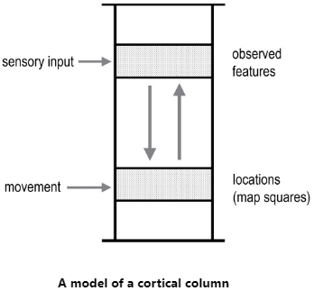

# Part I: A New Understanding of the Brain

- A nerve impulse from the eye is no different than one from the ear or the big toe.
- It’s where they end up in the brain that sorts them out.
- The cells in your head are reading these words, which is remarkable because cells are simple— they can’t read, think, or do much of anything.
- Yet enough cells together make a brain that can not only read, but can also decipher the mysteries of the universe.
- How does a brain made of simple cells create intelligence?
- Understanding how the brain works is considered one of humanity’s grand challenges alongside understanding the nature of the universe.
- We have learned a tremendous amount of knowledge and facts about the brain, but we understand little of how the whole thing works; we lack a theory to interpret these results.
- The author and his team have been working for the past 15 years on understanding the neocortex.
- An intelligent brain needs to learn a lot.
- E.g. What everyday objects look, feel, and sound like. How to open and close different types of doors.
- Every person possesses a tremendous amount of knowledge about the world.
- Model: an organization of facts that reflects the structure of the world.
- E.g. To know what a bicycle is, we don’t just remember a list of bicycle facts, but instead our brain organizes the facts into different parts, how the parts are arranged, and how the parts function to form a model of a bicycle.
- Intelligence is intimately tied to the brain’s model of the world.
- The author argues that the neocortex stores everything we know using reference frames.
- The brain’s model of the world is built using hundreds of thousands of map-like reference frames.
- Most of the cells in your neocortex are dedicated to creating and manipulating reference frames.
- No notes on the author’s career into neuroscience and the creation of Numenta.
- Numenta is a company whose goal is to develop a theory of how the neocortex works.

## Chapter 1: Old Brain—New Brain

- The brain evolved by adding new parts on top of older parts.
- The old brain parts are still there because regardless of how smart and sophisticated we become, we still need to breath, eat, and reproduce to survive.
- This idea of an old and new brain is not supported by current science (see [this](https://brianpho.com/CR4-DL/papers/neuroscience-set-4/#your-brain-is-not-an-onion-with-a-tiny-reptile-inside)).
- The neocortex occupies about 70 percent by volume of the brain and is the organ of intelligence.
- If we want to understand intelligence, then we have to understand what the neocortex does and how it does it.
- The neocortex doesn’t control behavior directly as none of its neurons directly connect to muscles.
- Instead, it tells the old brain what behavior it wants and lets the old brain execute it.
- The neocortex is divided into different areas with different functions.
- When it’s damaged, deficits arise depending on what part of the neocortex was affected.
- There is both evidence for and against the idea that the neocortex is organized as a hierarchy.
- E.g. Increases in feature complexity from edges to shapes to objects, but the divisions between levels and regions aren’t clear.
- The neurons in the neocortex appear to be organized into six layers that run parallel to the surface of the neocortex.
- The layers appear due to differences in the size and density of neurons.
- Layer 1 is the outermost surface of the neocortex closest to the skull, while Layer 6 is the closest to the center of the brain.
- Another observation of the neocortex is that most of the connections between neurons are vertical and between layers.
- Three general observations about the neocortex
    1. Local circuits in the neocortex are complex.
        - In a 1 mm x 1 mm x 2.5 mm volume of neocortex, there are about 100,000 neurons, 500 million synapses, and several kilometers of axons and dendrites.
        - The precise and extremely complex neural circuits seen in the neocortex tell us that every region is doing something far more complex than just feature detection.
    2. Neocortex looks similar everywhere.
        - At a high level, the circuitry of the neocortex looks similar in visual regions, language regions, and touch regions.
        - It even looks similar across different species such as between humans, rodents, and cats.
        - But there are differences, and we believe these differences lead to some functional benefit.
        - Overall, the variations between regions are relatively small compared to the similarities.
    3. Every part of the neocortex generates movement.
        - It’s incorrect to believe that information went to the sensory regions, was processed, and then went down to the motor regions to enact behavior.
        - We now know that neurons in every region project to a region related to movement.
        - E.g. The visual regions send out signals to regions responsible for moving the eyes. The auditory regions send out signals to regions responsible for moving the head.
        - Evidence suggests that the complex circuitry seen everywhere in the neocortex performs a sensory-motor task. Thus, there are no pure motor nor sensory regions.

## Chapter 2: Vernon Mountcastle’s Big Idea

- Vernon Mountcastle wrote an important monograph in 1978 about the brain.
- Mountcastle argued that the neocortex got big not by creating anything new, but by repeatedly copying a basic neural circuit.
- The human neocortex is much larger than a rat or dog neocortex but they’re all made from the same element; just that the human neocortex has more copies of that element.
- Mountcastle proposed that the reason brain regions look similar is because they’re performing similar functions.
- What makes regions different isn’t their intrinsic function but what they’re connected to.
- E.g. If you connect eyes, you get vision. If you connect ears, you get audition. If you connect other brain regions, you get higher-order thought like language.
- Thus, by understanding the fundamental function of any part of the neocortex, we will understand the entire neocortex.
- The fundamental unit of the neocortex, the unit of intelligence, is called a “cortical column”.
- A cortical column is like a piece of spaghetti and about 150,000 of them are stacked vertically beside each other.
- Evidence for the cortical column comes from experiments where all cells in one column of neocortex respond to the same spot of retina or the same patch of skin, but then cells in the next column all respond to a different part of the retina or skin.
- The grouping of responses is what defines a column and is seen everywhere in the neocortex.
- A cortical column can be further subdivided into minicolumns.
- What function do cortical columns or minicolumns perform? Mountcastle didn’t know and didn’t guess.
- Being able to learn practically anything requires the brain to work on a universal principle. (Is this true?)
- If we can figure out what a cortical column does, then we’ve figured out how the neocortex works and, by extension, how the brain works.

## Chapter 3: A Model of the World in Your Head

- Unlike a reflex, the input to the neocortex might be acted on in an hour, in a year, or maybe never.
- Since the neocortex doesn’t and can’t know if the information will be useful, it stores it.
- In a familiar environment, you notice any small changes.
- E.g. If the cup on your office desk is on the wrong side, if the stapler makes the wrong sound. These small changes are noticed by you.
- How does the brain know something changed?
- It knows because it’s making multiple simultaneous predictions of what it’s about to see, hear, and feel.
- E.g. When you’re about to pick something up, your brain predicts the object’s weight, size, texture, density, etc.
- Thus, every action leads to a prediction of what should be received by the brain.
- Prediction is a universal function of the neocortex.
- To make predictions, the brain has to learn what’s normal or what’s expected based on past experience.
- In other words, the neocortex learns a model of the world and makes it predictions based on this model.
- Prediction is constantly happening in the brain and it isn’t something the brain does sporadically; it’s an intrinsic property.
- When a prediction is correct, we won’t be aware that it ever occurred.
- When we are born, our neocortex doesn’t know anything and has no model for how to speak, how doors work, how to drive, etc. Instead, it has to learn.
- The general structure of the neocortex isn’t random as our genes determine which regions connect with which sensory organ at birth.
- But it’s also true that the neocortex doesn’t know what it will see, hear, or what languages it might learn.
- So the neocortex starts with some built-in assumptions but nothing specific.
- Through experience, it learns a rich and complicated model of the world.
- For every item you come across, you can recall experiences associated with it and how you interacted with it.
- The number of things you know is enormous and your library of knowledge seems endless.
- Two ways the input to the brain can change
    - The world can change.
        - E.g. The sun rises and falls causing objects to become brighter and darker.
    - We can change.
        - E.g. We move when walking, which changes what we see, feel, and hear.
- The only way the brain learns its model of the world is by observing how its inputs change over time.
- The brain learns sensory-motor learning loops by perceiving how our sensory inputs change as we move.
- With each movement, the neocortex predicts what the next sensation will be.
- How does the neocortex, which is composed of thousands of similar cortical columns, learn a predictive model of the world through movement?
- If we can answer this, then maybe we could build machines that worked the same way.
- Review of neurons, axons, dendrites, action potentials, and synapses.
- Two tenets of neuroscience
    1. Thoughts, ideas, and perceptions are the activity of neurons.
        - A small fraction of neurons in the brain are actively spiking at any point in time.
        - This activity determines your thoughts, ideas, and perceptions.
        - Stimulating the neocortex using a tiny probe results in experiences dependent upon which neurons were activated.
        - Neurons can participate in many different thoughts and experiences.
        - Our mental states and the activity of neurons are one and the same.
    2. Everything we know is stored in the connections between neurons.
        - The brain remembers a lot and this knowledge is stored using synapses.
        - Review of Hebbian learning.
        - Learning involves increasing or decreasing the strength of synapses, creating and deleting synapses, and creating and deleting neurons.
        - The connections in our brain store a model of the world learned through our experiences.

## Chapter 4: The Brain Reveals Its Secrets

- The brain seems complicated because we don’t understand how it works.
- The author, however, describes some key moments when our understanding of the brain dramatically changed.
- Discovery 1: The neocortex learns a predictive model of the world.
    - Learning a model of the world and making predictions isn’t the only thing the neocortex does, but it’s one of its most important tasks.
    - How does the brain make predictions?
    - Maybe the brain has one set of neurons for handling sensations and another set of neurons for predicting those sensations. The brain must keep these two sets of neurons separate to avoid hallucinating.
    - This idea has problems though as we haven’t observed the expected number of neurons dedicated to prediction.
    - Another problem is how we aren’t aware of the constant predictions made by the brain unless an error occurs.
- Discovery 2: Predictions occur inside neurons.
    - Recall the two types of predictions: when the world changes and when you move.
    - Perhaps every cortical column in the neocortex makes both types of predictions.
    - Suppose we focus on predicting the next item in a sequence.
    - E.g. Next melody in a song, next word in a speech, next movement in an action.
    - How do neurons in a cortical column learn sequences?
    - Neurons don’t know how far back in the past they have to remember to predict the next item.
    - E.g. To predict the next musical note, do we need the past one note, past five notes, or past hundred notes?
    - Neurons have to figure out how much context is needed to make the right prediction; also called the sequence-memory problem.
    - Most of the solutions we tried worked to an extent but none completely matched the biological details of the brain.
    - We weren’t interested in a partial solution or a biologically inspired solution, we wanted to know exactly how the brain learns sequences and makes predictions.
    - The key insight was a new way of thinking about neurons.
    - Review of dendritic spikes: an action potential generated in a dendrite.
    - The author argues that dendritic spikes are predictions by priming the target neuron into a predictive state. Then, if the neuron gets enough input it spikes sooner than if the neuron wasn’t in a predictive state.
    - If one or more of the neurons in a minicolumn are in the predictive state, our theory says that only those neurons spike and the other neurons are inhibited.
    - So, when an unexpected input arrives, multiple neurons fire. But if the expected input arrives, only the predictive-state neurons fire.
    - This matches a common observation about the neocortex that unexpected inputs cause a lot more activity than expected ones.
    - The sequence-memory problem can be solved by several thousand neurons in a minicolumn with a few inhibitory neurons.
    - Prediction is built into the fabric of the neocortex.
- Discovery 3: The secret of the cortical column is reference frames.
    - How does the neocortex predict the next input when we move?
    - For a cortical column to predict its next input, it must know what movement will be performed.
    - Specifically, it needs to know what object it’s touching and where the limb doing the touching will be after it moves.
    - E.g. If you have your finger on the wall of a coffee cup and move up, you predict that you’ll feel the lip/edge of the cup.
    - What matters isn’t where the limb is relative to the body or where the object is relative to the body, what matters is the location of the limb relative to the object.
    - It’s puzzling if and how neurons could attach a reference frame to an object.
    - Reference frame: like an invisible 3D grid surrounding and attached to the object.
    - Different parts of your body can touch the object simultaneously, so each body part makes a separate prediction of what it’ll feel based on the location it touches the cup.
    - The neocortex must know the location, relative to the object, of every part of your body touching the object.
    - The same idea applies to vision as different patches of the retina see different parts of an object and the neocortex assigns each retinal patch to a location relative to the object.
    - However, creating reference frames, especially object-centered ones, are difficult.
    - The author believes that this complex calculation is performed by the various layers of the neocortex, and since the neocortex looks similar throughout the brain, each column in the neocortex must have neurons that represent reference frames and locations.
    - Instead of mainly processing sensory inputs, the neocortex mainly processes reference frames.
    - Reference frames are important because they allow the brain to learn the structure of objects. By learning the structure, the brain can manipulate the entire object either mentally or physically.
- The third discovery took over three years to work out its implications.
- But how do neurons actually create reference frames?
- We might find an answer by looking to the entorhinal cortex.
- Chapter summary
    - The idea that every cortical column in the neocortex creates reference frames.
    - We started with the premise that the neocortex learns a rich and detailed model of the world, which it uses to constantly predict what its next sensory inputs will be.
    - Neurons make these predictions using dendritic spikes that make the target neuron fire sooner.
    - This leads to neurons that can learn and predict sequences such as the next sensory input when we move.
    - To make these sensory-motor predictions, each cortical column must know the location of its input relative to the object being sensed.
    - This requires a cortical column to have a reference frame fixed to the object.

## Chapter 5: Mapsin the Brain

- When we see, light hits the back of the retina but we don’t perceive objects as being in the eye.
- The same applies to audition: why don’t we perceive the sound of a car as in your ear even though that’s where the sound actually is?
- This observation, that we perceive stimuli as being somewhere out there in the world instead of at our sense organs, tells us that the brain must represent the location of every object we perceive.
- Simple organisms don’t need to know where they’re located, but knowing where you are is an advantage.
- E.g. You can map places of shelter, food, warmth, etc. relative to your current location.
- However, to know where you are requires a reference frame.
- Being able to navigate the world is crucial to survival and was thus prioritized by evolution.
- In our brains, the map-creating neurons are in the hippocampus and entorhinal cortex.
- Review of the discovery of place cells in the hippocampus: neurons that fire every time the rat was in a specific location in a specific environment.
- A place cell is like a “you are here” marker on a map.
- Review of the discovery of grid cells in the entorhinal cortex: neurons that fire at multiple locations in an environment in a grid-like pattern.
- Both place and grid cells work together to create a map of the environment and to track your position in that environment.
- E.g. If you close your eyes and walk a few steps forwards, you know that you’re in a different location even though the sensory information hasn’t changed.
- Knowing the location of your finger relative to a coffee cup is similar to knowing the location of your body relative to the room.
- So, maybe the neocortex has neurons similar to the place and grid cells in the hippocampus and entorhinal cortex.
- Grid and place cells mostly track the location of one thing: the body. In contrast, the neocortex would have to track the location of thousands of objects simultaneously.
- No notes on the maps-cut-into-squares example.
- When you touch and explore an unknown object with one finger, you might have to move your finger to learn more about the object.
- By moving, you discover two things: what the object is and where your finger is on the object.
- How are map-like models implemented by neurons in the neocortex?
- Our theory argues that every cortical column can learn models of complete objects.

- The upper layer of the column receives sensory input while the lower layer represents the current location in a reference frame.
- The upper layer is similar to place cells and the lower layer is similar to grid cells.
- Learning a new object means the neocortex learns new connections between these two layers.
- The connections between the upper and lower layers represent the connections between a blank reference frame and what’s seen at that location.
- If you know the feature, you can determine the location and vice versa.
- E.g. A coffee cup is defined by a set of observed features (upper layer) associated with a set of locations on the cup (lower layer).
- Basic flow of information
    - Sensory input arrives and is represented in the upper layer.
    - This input is associated with a location in the lower layer.
    - When movement occurs, the lower layer changes to the expected new location.
    - This causes a prediction of the next input in the upper layer.
- If the location of a feature is ambiguous, then multiple locations are activated in the lower layer.
- Moving changes all possible locations and the information is used to eliminate any locations that don’t match.
- Simulations of this two-layer circuit lead to cortical columns that could learn hundreds of objects.
- Another requirement of cortical columns is the need to represent orientation.
- In the hippocampus, this information is represented by head direction cells and cortical columns may have cells with a similar function; we call them orientation cells.
- With about 150,000 cortical columns in the neocortex, not all columns are modeling objects.
- What are the rest of the columns doing?

## Chapter 6: Concepts, Language, and High-Level Thinking

- Mountcastle proposed that every column in the neocortex performs the same basic function.
- This implies, however, that high-level cognitive abilities are fundamentally the same.
- E.g. Language, vision, touch, hearing.
- This proposal seems true given our evidence that the neocortex looks similar everywhere.
- What fundamental function can create all aspects of human intelligence?
- Another way to think of reference frames are as ways to organize knowledge.
- For complex topics such as DNA and space, we often imagine these items as if we could see and touch them.
- Thus, we organize facts about them using the same reference-frame mechanism that we use for everyday physical objects.
- The same applies to conceptual knowledge.
- E.g. Democracy, mathematics, relationships.
- We hypothesize that the brain arranges all knowledge using reference frames, and that thinking is a form of moving.
- Thinking occurs when we activate successive locations in reference frames.
- Premises for knowledge organized using reference frames
    - Reference frames are everywhere in the neocortex.
    - Reference frames are used to model everything we know, not just physical objects.
    - All knowledge is stored at locations relative to reference frames.
    - Thinking is a form of movement.
- If everything we know is stored in reference frames, then recalling a memory involves activating the appropriate locations in the appropriate reference frames.
- So thinking is invoking location after location in a reference frame.
- Review of the “what” and “where” visual pathways for object recognition and action respectively.
- Columns in the ‘what’ and ‘where’ pathways look similar, so why do they perform different functions?
- We argue that cortical grid cells in ‘what’ columns attach reference frames to objects, while cortical grid cells in ‘where’ columns attach reference frames to your body.
- E.g. ‘Where’ visual columns know where the hand and object are relative to the body so they can coordinate hand movements to the object. ‘What’ visual columns know the reference frame attached to the object and can identify it from its reference frame.
- In some ways, your body is just another object in the world and your brain can model it as such.
- Cortical columns can look similar but their function depends on what reference frames are anchored to them.
- How can cortical columns create models of abstract concepts?
- The trick is that reference frames don’t have to be anchored to anything physical.
- When a column learns a new model, part of the learning is also discovering what reference frame to use.
- Evidence for the four “knowledge as reference frame” premises
    - Method of loci
        - Also called the memory palace technique.
        - Imagine placing the items you want to remember at different locations within a house/palace.
        - To recall the items, you imagine walking through the house.
        - This memory trick works because it assigns a location to a concept in a familiar reference frame.
        - Note that the act of recalling is achieved by mentally moving through the house.
        - The fact that the method of loci exists and works supports the premise that information is stored in reference frames and that the retrieval of information is a form of movement.
    - fMRI studies in humans
        - Review of fMRI but it isn’t too useful for the kind of research the author does.
        - One fMRI study found that having participants move around in a virtual world was associated with grid cell activity in the entorhinal cortex, and the same activity was found in the frontal areas of the neocortex.
        - This suggests that grid cells might exist in some parts of the neocortex.
        - Learning conceptual knowledge can be difficult because multiple reference frames work.
        - E.g. If you learn ten historical events, you could organize them by time, by location, or by important persons.
        - Reference frames suggest different ways of thinking about the same events.
        - Becoming an expert in a field requires discovering a good framework to represent the data and facts.
    - Mathematics
        - Suppose we want to prove a conjecture, this requires various intermediate results called equations.
        - Also suppose that these equations are represented in your neocortex in a reference frame.
        - Mathematical operations are movements that take you to different places in this reference frame.
        - If we can find a set of operations—a set of movements through the reference frame—that get us to the conjecture, then we have proved the conjecture.
        - Learning math requires learning not only the operations, but also useful reference frames.
        - The common idea between mathematicians manipulating equations, explorers traveling through a forest, and fingers touching coffee cups, is that they all need map-like reference frames to know where they are and how to move to get where they want to be.
    - Politics
        - In politics, part of the reference frame is imagining what would happen if the law was enacted.
    - Language
        - Language is arguably our most important cognitive ability because we use it to share knowledge and experiences.
        - There doesn’t seem to be any detailed theories of how the brain creates and understands language at the neuron level.
        - Review of Wernicke’s and Broca’s areas.
        - The unique asymmetry of language representation in the brain (mainly on the left hemisphere) suggests that something is different about Broca’s and Wernicke’s areas.
        - But the anatomy of these two areas is similar to other areas of the neocortex, so maybe they only differ in subtle ways.
        - It’s been argued that nesting and recursion are key attributes of language.
        - We realized that each cortical column has the ability to learn nested and recursive structures.
        - By creating a new reference frame that links reference frames together, we can recursively combine items.
        - Cortical columns create reference frames for every object and these frames are populated with links to other reference frames.
        - The brain models the world using reference frames populated with reference frames.
    - Expertise
        - Expertise requires good reference frames to organize knowledge and observations.
        - E.g. Albert Einstein started with the same facts as other researchers but found a better way to organize them, allowing him to see surprising analogies and predictions.
- The common cortical algorithm is based on reference frames.
- The frames provide the substrate for learning the structure of the world, where things are, and how they change. This also applies to abstract concepts.
- Ironically, the correct reference frame to understand how the brain works is reference frames.

## Chapter 7: The Thousand Brains Theory of Intelligence

- It doesn’t make sense to study how societies work before understanding how people work.
- Similarly, it doesn’t make sense to study how the brain works before understanding how a cortical column works.
- We now know a lot about what cortical columns do.
- E.g. Each column is a sensory-motor system that can learn models of hundreds of objects based on reference frames.
- By extending this understanding to the neocortex, it’s now clear what the neocortex does.
- We call this the “Thousand Brains Theory of Intelligence” but before we explain this theory, we cover what it’s replacing.
- Existing view of the neocortex
    - Think of the neocortex as a flowchart where information from the senses is processed and passed from one region to the next; a hierarchy of feature detectors.
    - E.g. Retina to V1 to V2 and so on.
    - We go from simple features to complex features to complete objects.
    - The main problem with this theory is that vision is treated as a static process.
    - E.g. It doesn’t account for saccades nor head movement.
    - Vision is an active sensory-motor process, not a static process.
    - V1 and V2 are some of the largest regions in the human neocortex, but why is such a large area needed to detect small features? In contrast, the areas that process objects are smaller.
    - The activity of most neurons in V1 can’t be explained by the hierarchy of features theory.
    - Binding problem: how inputs from different senses are combined into a unified conscious experience.
    - Another issue with the hierarchy of features theory is that it doesn’t explain how we learn the 3D structure of objects, how objects are composed of other objects, and how objects change over time.
- New view of the neocortex
    - We propose that cortical columns can learn and recognize complete objects.
    - But there’s a limit to how many objects a column can learn and what it can learn.
    - E.g. A column can only learn models from its input data, whether that be visual, tactile, auditory, etc. data.
    - Columns in V1 and V2 might both learn models of objects, but their models differ by scale.
    - Knowledge is distributed in the brain and nothing we know is stored in one place. But it also isn’t stored everywhere.
    - E.g. Where is the knowledge of a coffee cup stored? Some of it is in visual cortical columns and some in tactile columns. Information about any item is distributed among thousands of complementary models.
    - This makes the knowledge robust to large losses of cortical columns.
    - Complex systems function optimally when knowledge is distributed among many, but not too many, elements. The brain does this too.
    - The brain continues to function even if a stroke or trauma kills thousands of columns.
    - But the thousands brain theory still doesn’t solve the binding problem.
    - E.g. If we have thousands of models, then how are they integrated to create our unified perception? How are sensory inputs bound into a singular percept?
    - We propose that voting solves the binding problem; your perception is the consensus the columns reach by voting.
    - E.g. Your five fingertips touching an object are like five voters, each with their own opinion of what the object is. On their own they can’t determine what the object is, but together they can.
    - This is similar to the “Blind men and an elephant” parable where four men each touch a different part of an elephant and come to different conclusions, but combining their unique conclusions leads to recognizing the elephant.
    - Voting works across different sensory modalities and only requires voting on what the object is and not its details.
    - The only detail that matters is that everyone has a list of possible objects.
    - However, voting can be more efficient when the cortical columns share their relative position to each other.
    - Voting may be implemented in the brain by long-distance cortical connections between columns and regions.
    - E.g. A column broadcasts what it thinks it’s observing to other columns, which are also broadcasting their votes. Then all voting columns converge on the majority vote.
    - If you looked at the neocortex after an object was recognized, you would expect to see a stable pattern of activity in one layer of cells spanning thousands of columns.
    - What we perceive is based on the stable voting neurons.
    - But this doesn’t mean that all brain activity is stable because changing inputs do still lead to changing activity, just that there is also stable activity that’s easy to miss.
    - The brain wants to reach a consensus and ambiguous stimuli cause that consensus to constantly fluctuate.
    - E.g. In the case of visual illusions such as the Necker cube, the brain can’t reach a consensus which causes the cube to fluctuate.
    - We are constantly learning models of everything we sense.
    - E.g. If you go to a restaurant with family and they move around the dishes, you can close your eyes at any point and point to where the dishes are.
- Hierarchy in the thousand brains theory
    - Is the neocortex organized as a hierarchy or as thousands of voting models?
    - The anatomy of the neocortex suggests both theories are true.
    - We propose that complete objects, not features, are passed between hierarchical levels.
    - The entire world is learned as a complex hierarchy of objects located relative to other objects.
    - But it’s still unclear how the neocortex does this.
- The Thousand Brains Theory is a superset of the hierarchical model and explains how neurons predict their next input.
- E.g. Each column has models of complete objects and knows what should be sensed at each location on an object. If a column knows the current location of its input and how the eyes are moving, then it can predict the new location and thus the new input it will sense there.
- The voting mechanism of the theory explains why we have a single and unified perception of the world.
- Lastly, the Thousand Brains Theory shows how the neocortex learns 3D models of objects using reference frames.
- However, we should not leave with the incorrect impression that we understand everything about the neocortex.
- We now turn our attention to how the Thousand Brains Theory will impact our future.

# Part II: Machine Intelligence

- Review of scientific paradigms by Thomas Kuhn.
- In this second part, we cover how the Thousand Brains Theory will impact the future of artificial intelligence.
- The principles of intelligence described earlier will be the basis for a revolution in AI.
- The author sees the shift towards brain-based AI as inevitable.

## Chapter 8: Why There Is No “I” in AI

- Review of AI summers and winters or the boom and bust cycles of AI.
- We’re currently in an AI summer driven by artificial neural networks.
- Is our current AI truly intelligent? Most people don’t think so.
- E.g. Deep learning networks don’t continuously learn and are inflexible, performing well only on one task.
- The goal of AI research is to create machines that exhibit human-level intelligence, also called artificial general intelligence (AGI).
- E.g. Rapidly learning new tasks, switching between tasks, and solving new problems.
- The essential question we face today is: Are we currently on a path to create AGI?
- The author believes that deep learning doesn’t put us on the path to creating truly intelligent machines. Instead, we need a different approach.
- Two paths to AGI
    - Get computers to outperform humans on specific tasks.
        - E.g. Playing Go or detecting cancerous cells in medical images.
        - The hope is that we first get computers to outperform humans on a few difficult tasks, then we extend that process to outperform humans on every task.
        - So far, this approach has faced challenges in the second part; in extending the process to every other task.
    - Get computers to flexibly perform multiple tasks.
        - With this path, we don’t need AI to outperform humans.
        - Instead, we need AI to do as many tasks as we can and apply what they’ve learned from one task to another.
        - The hope is that if we can build flexible AI systems, then we can eventually make systems that equal and surpass humans.
- The second path was favored in some of the early waves of AI but it proved too difficult.
- E.g. The amount of knowledge that a five-year-old child knows is enormous and AI researchers couldn’t figure out how to program this into a computer or how to get a computer to learn these facts.
- The difficultly with storing knowledge is representing it in a useful way.
- E.g. Learning everyday knowledge such as how balls bounce is effortless but difficult to program.
- This problem is called knowledge representation.
- The author doesn’t believe any kind of deep learning network will reach AGI if the network doesn’t model the world the way a brain does.
- Deep learning networks avoid the knowledge representation problem by relying on statistics and lots of data.
- Figuring out how the brain works is a hard, but necessary, first step to creating intelligent machines.
- The Thousand Brains Theory solves the problem of knowledge representation by using map-like reference frames.
- The naïve approach to knowledge representation is to list out all features and behaviors as rules.
- However, this leads to an infinite number of definitions and rules.
- The brain’s approach to knowledge representation is to learn a model, which embodies the knowledge.
- The cells in the neocortex learn a virtual model of the object and can use it to simulate actions on it.
- The knowledge is in the model.
- A general-purpose machine can learn to perform many tasks without erasing its memory and starting over.
- How can we tell if a machine is intelligent?
- The more complex the behavior, the more likely that it’s an intelligent agent in control. But the only certain way to tell is by looking inside.
- Four attributes of intelligence
    1. Learn continuously
        - We are always learning and it isn’t a separate process from sensing and acting.
        - We are constantly learning because the world is constantly changing.
        - Flexibility requires continuous adjustment to changing conditions and new information.
    2. Learn via movement
        - Since our senses are limited by their orientation and range, movement can increase a sense’s functional range.
        - Movement is generated by cortical columns that predict what its next input will be given the movement.
    3. Many models
        - Knowledge about any object or concept is distributed among many complementary models.
        - This provides robustness to damage and loss.
        - The key to making many models work together is voting; long-range connections in the neocortex allow columns to vote on the object they’re sensing.
    4. Using reference frames to store knowledge
        - Reference frames store knowledge, make predictions, create plans, and perform movements.
        - The mechanism underlying thinking is that it activates one location at a time in a reference frame, and retrieves the associated piece of knowledge.
        - Each cortical column creates its own set of reference frames using cells similar to grid and place cells.
- Without reference frames, artificial networks can’t learn the 3D structure of objects or how they change.
- Intelligence shouldn’t be measured by how well the agent performs a single task, but rather intelligence should be measured by how well the agent learns and uses knowledge.
- E.g. We’re intelligent not because we can do one thing well, but because we can learn to do practically anything well.

## Chapter 9: When Machines Are Conscious

- Review of the hard and easy problems of consciousness.
- Thought experiment
    - Imagine that your brain was reset to the exact state it was in when you woke up this morning.
    - But before the reset, you had gotten up and gone about your day, say washing your car.
    - After the reset, all memories of what you did are erased and you wake up believing that you had just woken up.
    - You would deny washing your car and deny being conscious that you did it, but you were conscious when you washed your car.
- This thought experiment shows us that our sense of awareness, what many people would call being conscious, requires that we form moment-to-moment memories of our actions.
- Consciousness also requires that we form moment-to-moment memories of our thoughts.
- Thinking is just a sequential activation of neurons in the brain.
- If we didn’t remember our thoughts, we would be unaware of why we were doing anything.
- E.g. Sometimes we enter a room but forget what we wanted to do in that room.
- Active neurons in the brain sometimes represent our present experience and sometimes represent a previous experiment or thought.
- It is this accessibility of the past, the ability to mentally time travel, that gives us our sense of presence and awareness.
- If we couldn’t replay our recent thoughts and experiences, then we would be unaware that we are alive.
- Our awareness depends on continuously forming memories of recent experiences and thoughts.
- Qualia
    - The nerve fibers that enter the brain from the eyes, ears, and skin look the same and use the same unit of information—spikes.
    - If you look at the inputs to the brain, you can’t tell what they represent.
    - And yet, vision feels different from hearing and neither feels like spikes.
    - Qualia: how sensory inputs are perceived and felt.
    - Given that all sensations are created by identical nerve fibers and identical spikes, why do they feel different?
    - The answer is that the pathways are different. They come from different sources and lead to different destinations.
    - Qualia are part of the brain’s model of the world and are subjective (unique to each person).
    - Qualia are subjective because every person has a unique organization of pathways, leading to unique sensations for identical stimuli.
    - E.g. The taste of a pickle for me might be different from how you perceive the taste of a pickle because we have different taste sensors sending information on different pathways to different destinations.
    - If two people perceive the same input as different, this suggests that their models are different.
    - E.g. Color is created by the brain; it’s a property of the brain’s model of surfaces and not a property of light.
- If qualia are a property of the brain’s model of the world, then how does the brain create them?
- In the same way that the brain learns models of the world by movement, it also learns the associated qualia.
- E.g. To learn the different shades of green, you change the orientation of green objects or change your vantage point for green objects, thus exposing you to different shades of green. Then cortical columns can create a reference frame for inputs at different surface orientations.
- However, we don’t know if the qualia of color are actually modeled this way.
- Not all qualia are learned.
- E.g. The feeling of pain is almost certainly innate.
- So, pain can’t be understood in the same way as the color green.

## Chapter 10: The Future of Machine Intelligence

- Nothing we call AI today is intelligent because it doesn’t exhibit the flexibility described in the earlier chapters.
- There are no technical reasons preventing us from creating intelligent machines.
- But as history shows, we are ignorant today about what intelligent machines will look like in seventy years from now, similar to how the 1950s were ignorant of innovations in media, communications, and computers.
- Although we can’t predict the future, the Thousand Brains Theory can help us define the boundaries of AI.
- One important boundary is that intelligent machines will not be like humans because of our brain’s division into old versus new brain.
- E.g. We don’t need to replicate the basic functions of life in machines such as breathing, survival, procreation, and our innate behaviors.
- We can choose which parts of the brain we want and which parts we don’t.
- Intelligence is the ability of a system to learn a model of the world, but the model itself is valueless, emotionless, and has no goals.
- Goals and values are provided by the system using the model.
- E.g. A map can be used for war, trade, or exploration.
- Designing an intelligent machine based on the brain can be broken down into three parts: embodiment, old brain, and new brain (neocortex).
- Embodiment
    - We learn by moving; moving our sensors to things in the world.
    - Intelligent machines also need sensors and the ability to move them.
    - Reference frames are used to know where the sensors are.
    - We have an enormous range and quantity of sensors, and machines that approach or exceed human intelligence will have as many, if not more, sensors than us.
    - The important point is that intelligent machines need moveable sensory inputs to learn a model of the world.
    - There’s no reason to limit the sensors to the types we know and to specific locations.
    - E.g. An intelligent machine with sensors distributed over Earth’s surface might understand the behavior of global weather in the same way we understand the behavior of our skin.
    - AI will likely take many different forms, many forms unfamiliar with our ideas based on biological intelligence.
- Old brain
    - There are some parts of the old brain that are required to build intelligent machines.
    - E.g. Basic movements and behaviors tied to embodiment.
    - We don’t want the neocortex to handle lower-level movement such as walking, balancing, and maintaining homeostasis.
    - Instead, the neocortex should control the higher-level aspects of behavior such as planning, optimization, and flexibility.
    - An intelligent machine must have goals and motivations because the neocortex, on its own, doesn’t create goals, motivations, or emotions.
    - The neocortex does not lead.
    - An intelligent machine will need some form of goals and motivations, but goals and motivations aren’t a consequence of intelligence and won’t appear on their own.
- New brain
    - The third component for an intelligent machine is a general-purpose learning system that performs the same functions as the neocortex.
    - We cover two design parameters: speed and capacity.
    - Neurons take at least five milliseconds to do anything useful. This is very slow compared to transistors made of silicon.
    - But just because an intelligent machine can operate faster than a biological brain doesn’t mean that the entire machine runs faster or learns faster.
    - E.g. An intelligent and robotic construction worker might think faster, but the bottleneck isn’t intelligence, it’s the time required to carry out the work.
    - What if we created an artificial brain with a thousand times more cortical columns than in human brains?
    - We know that in humans, the size of neocortical regions varies considerably and this size leads to increases in processing power for that sense.
    - E.g. Increased visual region area leads to increased visual acuity.
    - Instead of increasing the size of regions, we could also create more regions and connect them in complex ways.
    - This is similar to the difference between monkeys and humans.
    - E.g. Both monkeys and humans have similar visual abilities, but humans have a bigger overall neocortex with more regions.
    - Another way to think about capacity is in terms of brain wiring.
    - When we’re born, our brain has an abundance of wiring making it easier to learn new types of knowledge early in life.
    - The removal of unused wiring during childhood based on early life experiences is both a blessing and curse though.
    - The curse is that it makes it difficult to learn new types of knowledge later in life.
    - Intelligent machines don’t have the same constraints related to neural wiring.
    - This flexibility in connectivity could be one of the greatest advantages of machine intelligence over biological intelligence as it allows machines to keep all their options open.
- Another difference between us and machine intelligence is that machines can be cloned.
- This leads to learning only once and then cloning the abilities to other machines.
- Not everyone is as optimistic about the benefits of machine intelligence though.

## Chapter 11: The Existential Risks of Machine Intelligence

- Many high-profile technologists, scientists, and philosophers have warned us that the creation of intelligent machines might lead to human extinction or subjugation.
- AI can be used by bad people to do bad things, or the AI itself might be a bad actor and decide to wipe out humanity on its own.
- The first existential risk of machine intelligence is an intelligence explosion.
- E.g. We create machines smarter than us and those machines are better than us at everything, including creating smarter machines. So smart machine creates smarter machine, which then creates another smarter machine and so on.
- So, the intelligence of the machine explodes and vastly surpasses us.
- The second existential risk is goal misalignment.
- E.g. Intelligent machines pursue goals that go against our goals and we can’t stop them.
- A common theme among these scenarios is that we lose control of our creations.
- The author, however, doesn’t completely agree with these arguments because what we know about biological intelligence suggests different limitations.
- Intelligence requires a model of the world because the model is used to recognize objects, manipulate them, and to predict the consequences of our actions.
- And learning these models takes time; there’s no substitute for experience.
- The speed of learning is limited by the need to physically interact with the world.
- No notes on the goal-misalignment threat.
- The author is confident that intelligent machines don’t pose an existential threat to humanity.
- We should distinguish between three things
    - Replication: anything capable of self-replication is dangerous. Intelligent machines won’t have the ability or desire to self-replicate unless we desire it.
    - Motivations: biological motivations and drives are a consequence of evolution and the desire to replicate. Without such pressures and drives, machines don’t develop the desire to replicate.
    - Intelligence: an intelligent machine won’t start self-replicating on its own, nor will it spontaneously develop drives and motivations.
- This isn’t to say that machine intelligence isn’t dangerous—it can be in the wrong hands—but that machine intelligence isn’t inherently dangerous nor will it become dangerous unless we specify so.

# Part III: Human Intelligence

- Review of the evolution of life starting from 3.5 billion years ago.
- Life was driven by competition, survival, and reproduction; nothing else mattered.
- Our intelligence is the source of our success, but it has also become an existential threat.

## Chapter 12: False Beliefs

- Review of the brain-in-a-vat thought experiment.
- Your brain is isolated in a dark box with no sensors itself. The only way your brain knows anything about reality is through the sensory nerve fibers that enter the skull.
- There is no light or sound entering the skull, only electrical spikes.
- There are also electrical signals coming out of your brain to your muscles, which move your body and its sensors. The movement changes what part of the world the brain senses.
- By repeatedly sensing and moving, sensing and moving, your brain learns a model of the world outside the skull.
- Remember that no light, touch, or sound enters the brain, only spikes, and since we don’t perceive spikes, then everything we do perceive must be fabricated in the brain.
- Don’t the input spikes represent light and sound though?
- Sort of, the spikes represent a slice of the possible light and sound, a slice captured by your sensory organs.
- With a different set of sensors, the same universe would lead to different perceptual experiences.
- E.g. Seeing ultraviolet light or hearing sonar waves.
- The brain only knows about a subset of the real world and what we perceive is our model of the world, not the world itself.
- At any moment, only a subset of all neurons are active and these active neurons represent what we’re currently thinking and perceiving.
- Importantly, these thoughts and perceptions are relative to the brain’s model of the world and not the real world outside the skull.
- So, the world we perceive is a simulation of the real world even though it doesn’t feel like it.
- As we move, the sensory inputs to the brain invoke the appropriate parts of our world model, which is what we perceive and believe to be the real world.
- Our reality is similar to the brain-in-a-vat experiment except instead of a simulated computer reality, it’s a simulated model of reality.
- A nerve fiber representing pressure on a fingertip doesn’t convey any information about where the fingertip is.
- E.g. The finger could be in front of you or behind you, and yet you perceive the sense of touch as being at some location relative to your body.
- You perceive your finger to be located somewhere because the cells that represent the location of your finger say so. But these cells can be wrong about the location.
- E.g. The case of “phantom limb” where people who lose a limb often perceive the missing limb as still there. The sensations are felt as if they are “out there”, located at particular locations on the missing limb.
- E.g. The case of “alien limb” where people have a normal limb that doesn’t feel like it belongs to them. People with an alien limb may try to amputate their own limb to remove the foreign-feeling limb.
- E.g. The rubber hand illusion.
- Taken together, these three cases show how we can perceive things that don’t exist (phantom limb) and we can incorrectly perceive things that do exist (alien limb and rubber hand).
- The brain’s model is clearly wrong for these cases to exist.
- False belief: when the brain’s model believes that something exists when it doesn’t.
- In the case of phantom limbs, even though the limb is gone, the cortical columns that model the limb are still present and still model the limb.
- So, the patient perceives sensations from the limb even though it doesn’t exist.
- No notes on the flat-Earth false belief.
- Model repair after a prediction error is built into the neocortex and normally works.
- No notes on false and viral world models, and memes.
- Life isn’t about having a correct model of the world, but about replication and survival.
- Language allows us to extend our model of the world to include stimuli that we haven’t personally experienced.

## Chapter 13: The Existential Risks of Human Intelligence

- This chapter focuses on two fundamental systemic risks associated with the human brain.
- The first risk is associated with the older parts of our brain, the second risk is associated with the neocortex and intelligence.
- No notes on the first risk because I don’t believe in the “older parts” of the brain.
- All innate behaviors, whether we find them desirable or not, exist because they were successful adaptations.
- No notes on population growth and climate change.

## Chapter 14: Merging Brains and Machines

- Two ways we could merge with machines
    - Upload our brains into computers
    - Merging our brains with computers
- No notes on genes and how we exist primarily to replicate genes.
- Uploading your brain
    - This is one way to live forever as a computer-simulated version of our self.
    - If we want to upload you and have you be normal, then we have to upload the entire brain and not just parts of it.
    - We should upload everything because the brain is interconnected in complex ways such that missing parts would result in serious problems similar to a brain lesion.
    - However, this also extends to your body as we would need to simulate your sensory organs, your muscles, the fluids in your body, etc.
    - We can’t ignore parts of the brain or body without messing something up.
    - How would we read the details of your brain to upload it?
    - Neurons and synapses have complex shapes and internal structures that aren’t easily captured and stored.
    - Our current technology doesn’t have enough power nor capacity to store every detail for a dead brain, let alone a living one.
    - Getting and storing the details needed to recreate you in a computer is so difficult that we might never be able to do it.
    - Uploading your brain is really splitting yourself into two people.
    - Making a silicon copy of ourselves won’t achieve immortality any more than having children will.
- Merging your brain with a computer
    - In this case, electrodes are placed into your brain that connect you with a computer.
    - So your brain can now directly receive and send information with computers.
    - This would enhance our mental abilities as we could rely on computers for storage and processing.
    - One reason to merge with machines is to counter the treat of superintelligent AIs by merging with them.

## Chapter 15: Estate Planning for Humanity

- Knowledge is what we’ve learned about the world.
- This chapter covers the idea that knowledge is worth preserving and propagating, even if that means doing so independently of humans.
- If we went extinct, then everything we’ve accomplished would be lost forever, which is the same as having never existed.
- No notes on the existential risks to humanity.
- E.g. The Sun exploding in billions of years, climate change, nuclear weapons, asteroid strike.
- Three ways to communicate with the future
    - Message in a bottle
        - The bottle and your message are a means to not be forgotten.
        - E.g. The gold records on the Pioneer and Voyager probes.
    - Leave the lights on
        - Review of the SETI and METI programs.
        - If we expect to discover intelligent life in our galaxy, it requires that intelligent life occurs often and lasts a long time, enough time to intersect the existence of other intelligent life.
    - Wiki Earth
        - No notes on this section.

## Chapter 16: Genes Versus Knowledge

- No notes for this chapter because it isn’t relevant to the brain.

## Chapter 17: Final Thoughts

- Reverse engineering the brain and understanding intelligence is, in the author’s opinion, the most important scientific quest humans will ever undertake.
- Review of the Thousand Brains Theory of Intelligence, the author’s arguments that present AIs aren’t intelligent (intelligence requires learning a model of the world), and the author’s opinions of the human condition viewed through the lens of intelligence and brain theory.
- As far as we know, the human brain is the only thing in the universe that knows the universe exists.
