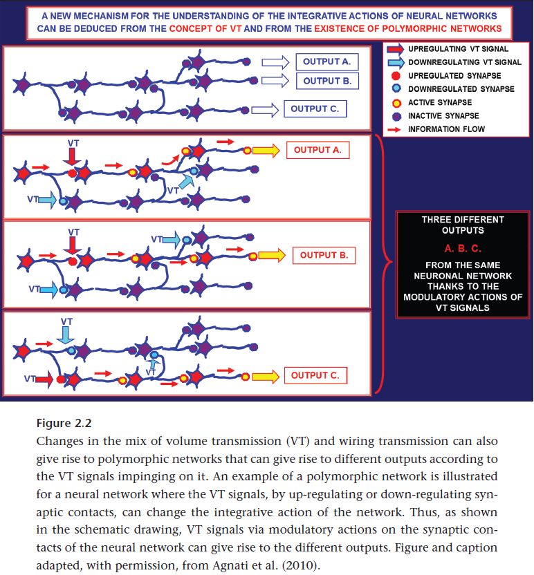
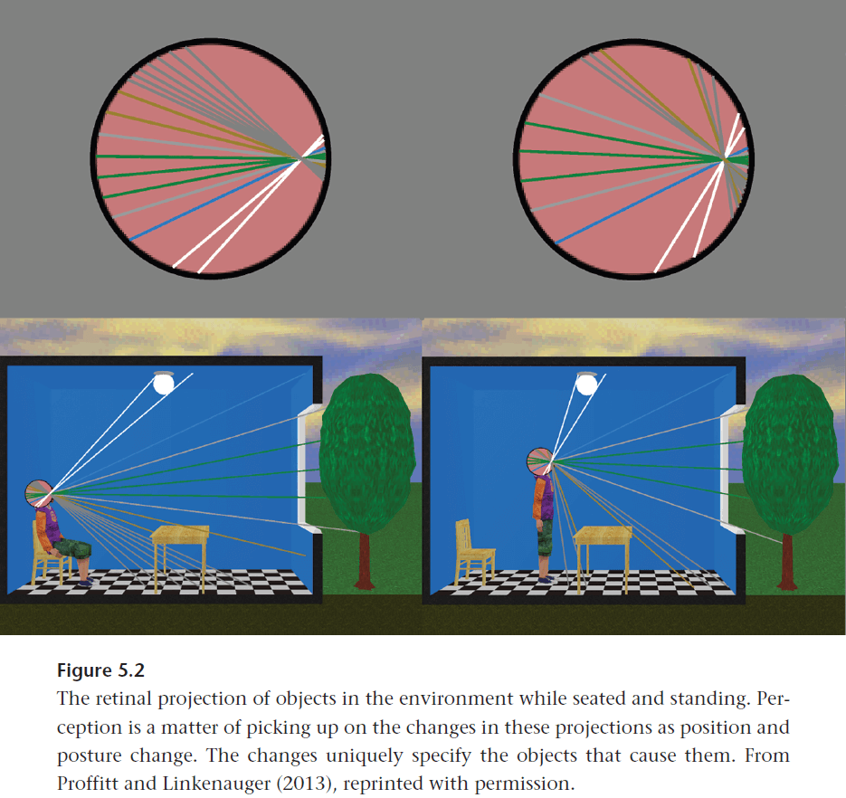

## Introduction

- Phrenology wasn’t such as a bad idea and doesn’t deserve the degree of scorn that it’s given.
- Proofs that the brain is the organ of the mind
    - The functions of the mind are changed by lesions to the brain; these functions aren’t immediately changed by lesions to other parts of the body.
    - The qualities of the mind are multiplied and elevated in direct ratio to increases in brain mass proportional to the body.
- Faculties: observable individual differences.
- Different faculties and propensities exist in different animals.
- Faculties and propensities in the same species develop at different epochs and at different rates.
- Franz Gall argued for phrenology, the functional differentiation of the brain.
- Phrenology helped contribute the idea that the brain could be a collection rather than be one thing.
- Ramon y Cajal viewed brain function as a hierarchy of reflexes in which the most sophisticated behaviors responded not just to current external stimuli, but also to stored internal stimuli.
- Thus, differentiation of function exists because the nature of the stimuli and the different demands the stimuli places on its processing and classification.
- In the cognitive neurosciences, we have been equally captured, and possibly limited by, a specific taxonomy of mental function.
- E.g. Memory, perception, and action.
- This taxonomy has been inherited from cognitive psychology, which may or may not be true, and may be incompatible with the functional organization of the brain.
- Rather, we need to be open to the development of representations that let the phenomena speak for themselves.
- Russell Poldrack outlines three research strategies that have been used to investigate the functional structure of the brain
    - “Where” strategy
        1. Design a manipulation that’s thought to modulate the engagement of some mental process.
        2. Analyze neuroimaging data to identify regions whose activity is modulated by this manipulation.
        3. Conclude that the active regions are involved in the manipulated process.
    - “What” strategy
        1. Design a task that independently manipulates two or more different mental processes, one of which is hypothesized to be performed by some brain region.
        2. Examine the imaging data to identify the relative response of the region in question to these manipulation.
        3. Conclude that the region in question performs a particular one of the manipulated processes.
- The “what” strategy is an improvement over the “where” strategy because it naturally leads to a refinement of not just the specificity of the neural associations for specific mental operations, but also of our understanding of the operations themselves.
- However, if we project forward and think about what the ultimate result would be from several decades of science using the current approach, we may find it to be less informative than we believe.
- Although it would likely uncover a broad set of functions that rely upon each region, it’s unlikely to identify a fundamental functional role, the basic computations, in mental activity for a particular region.
- E.g. Suppose a group of people individually try to understand the function of a knife. One person tests its ability to cut peaches and finds that the knife only cuts through peach flesh but not the pit. They conclude that the knife is specialized for peach flesh removal. Another person tests the knife’s ability to screw various types of screws and find that it works well for flathead and Phillips screws, but not for Allen screws. They may conclude that the knife is specialized for a subset of screwing function.
- Although all of these conclusions are valid, none seem to be an accurate description of the fundamental function of a knife, which is for “cutting or manipulating objects depending on their hardness.”
- However, supposing that any object, such as a knife, has a “fundamental function” may mislead us. Instead, objects have some fundamental physical characteristics that make it useful in a variety of cases.
- We may be making a similar error in the brain sciences by believing that the brain has a fundamental function.
- The computational/componential theory of mind (CCTM) is widely adopted in contemporary cognitive sciences as the organ analogy was by phrenology.
- If the brain is a computational information-processing device, a transformer of representations, then we must ask what is represented and where.
- With this version of CCTM as our organizing frame, there must be an answer to such questions.
- This book is an attempt to provide a guide to a fully postphrenological science of the brain.
- Brain responses to stimuli are characterized by specific deviations from intrinsic dynamics.
- Should our scientific efforts revolve around the attempt to discern which specific computational operator must characterize the contributions of individual neural regions?
- It seems to the author that a more scientifically prudent method is to devise alternate models for understanding structure-function relationships in the brain that don’t require the assignment of a specific, individual cognitive operation to specific, individual brain regions.
- Cognitive neuroscience is following the lead of psychology in that it skipped the descriptive stage and moved on to the explanatory model stage.
- This is in contrast to other sciences such as physics and chemistry that described everything before explaining the evidence.
- The process the author advocates for is to give the brain its own scientific voice, to let it show us what aspects of its world that it’s attuned to.
- It’s important to let the brain provide us guidance.
- What emerges from these chapters is that the brain is best understood as, first and foremost, an action controller that’s responsible for managing the values of salient organism-environment relationships.
- In a brain like ours where each region is involved in multiple tasks and coherent function is established by the appropriate neural partnerships, the multiple activation patterns elicited in complex situations naturally compete and the dominant pattern determines the shape of our interaction with the environment.
- Our brain are architecturally oriented to action selection.
- The long-term hope is that the research framework offered here will allow the cognitive neurosciences to integrate more smoothly with the fields of learning, embodied cognition, ecological psychology, psychiatry, and even sociology and economics.
- The author hopes that this book will provide the framework for a new synthesis in the cognitive and behavioral neurosciences.

# Part I: Brains

## Chapter 1: Neural Reuse and the Need for a New Approach to Understanding Brain Function

- The idea that brain areas are highly selective and exhibit specialization isn’t new.
- E.g. Each neural region responds to a restricted class of inputs and contributes primarily to a single cognitive domain such as language or motor control.
- E.g. Paul Broca’s description of the patient “Tan” that could only utter the syllable “Tan”.
- A series of findings since then have cemented neural selectivity as the fundamental principle governing the functional architecture of the brain.
- In contemporary cognitive neuroscience, the idea of neural selectivity has been combined with a particular computational approach to cognition, resulting in the “cognitive revolution”.
- The core of this view is the notion that the brain is fundamentally an information-processing device, a system that operates by transforming representations to support behavior.
- By combining localization with computation, we get the hypothesis that individual cognitive/computational operations might be strictly localized to individual regions of the brain.
- Principle of neural reuse: the use of local regions of the brain for multiple tasks across multiple domains.
- E.g. Broca’s area has been strongly associated with language, action- and imagery-related tasks, movement preparation, action sequencing, action recognition, and action imitation.
- Results suggest that the brain achieves its variety of functions by using the same regions in a variety of circumstances with different patterns of functional cooperation.
- Evolution is a good place to start when trying to understand the emerging challenge to localization.
- A guiding principle from both embodied cognitive science (ECS) and evolutionary psychology is that cognition was built to fit action.
- Thus, higher cognitive faculties such as language and abstract reasoning had to find their neural niche within the constraints imposed by the directive to act.
- Neural reuse theories generally accept the ECS insight that rather than develop new brain structures, resource constraints and efficiency considerations control the possible resources reused and redeployed in support of any newly emerging cognitive capacities.
- ECS suggests that local neural structure is conserved but is often combined and recombined by different organisms in different ways to achieve different goals.
- Three consequences of neural reuse
    - Neural structures should be used and reused for diverse purposes in various task domains.
    - We should expect the functional differences between task domains to be reflected less in neural differences.
    - We should expect new behaviors to be supported by a greater number of different structures more broadly in the brain.
- The reason being that the newer a behavior is, the more potentially useful existing elements there will be to reuse.
- Functional diversity appears to be a genuine feature of local brain organization.
- It seems that local structures have multiple but limited uses and each circuit doesn’t do exactly one function.
- This is important because brain networks appear to have the capacity to change their effective connectivity over short time scales, and although they can’t take on any configuration, they appear to be able to take on more than one.
- Evidence for functional diversity in the brain becomes clear only when we look across multiple experiments to characterize local function.
- Another piece of evidence is when we use metaphors.
- E.g. Love is war, life is a journey.
- How is knowledge from one domain converted into another domain in the brain?
- Neural reuse may be the answer.
- Understanding in one domain would involve the reactivation of neural structures used for another, and the new domain would thus inherit some of the semantic structure of the old domain.
- E.g. Reuse of motor control structures for language.
- E.g. “Lick”, “pick”, and “kick” activate the primary motor cortex regions associated with mouth, hand, and leg movements respectively.
- This finding is consistent with the idea that verbs rely on motor activation and that understanding verbs might involve simulations of the related actions.
- Language seems to recruit spatial representations during real-time comprehension.
- For some time, there’s been growing evidence that doing actions, imagining actions, and watching actions done by others, all activate similar networks of brain regions.
- However, this evidence is different from neural reuse in that this is a function that reuses the same brain regions, whereas neural reuse argues that a function uses multiple brain regions.
- Numerical cognition also demonstrates neural reuse as some finger awareness regions of the brain are activated during multiplication and dot counting.
- The idea is that the neural circuit for number processing originally developed to support finger awareness but also offers some relevant resource in the domain of numerical cognition.
- Distance effect: the fact that it’s harder to differentiate numbers that are closer together in magnitude than those that are farther apart.
- E.g. 3 vs 4 is harder to differentiate than 1 vs 9.
- The same phenomenon is also found in fingergnosis as it’s harder to differentiate fingers that are closer together than those that are farther apart.
- Rather than inheriting semantic structure, what we have here is the persistence of performance characteristic imposed by the underlying implementation of the capacity.
- Using inner speech to silently memorize a list is also another form of neural reuse in that we’re reusing auditory regions to handle short-term memory.
- This is a case of neural reuse of a system for something other than its primary purpose because it happens to have an appropriate functional structure.
- One of the fundamental principles of neural reuse is the presence of a sufficient degree of functional relatedness between existing and newly developing purposes.
- Functional overlaps, such as Broca’s area for language and sensorimotor functions, shouldn’t be understood as the later reuse of a linguistic area for other purposes, but rather the reverse: Broca’s area already performed some sensorimotor functions that were prerequisites for language acquisition and that made it a candidate for language processing.
- Neural reuse is a fundamental and global architectural fact about the brain given the previous evidence.
- Neural reuse doesn’t go away, no matter how small the brain region.
- All of the evidence presented above rests on brain-imaging data and given it’s relatively poor spatial resolution, it might be premature to draw definitive conclusions based on the overlap between neural activations.
- Also, because neural activation may spread around the brain network, this can lead to false positives as regions are activated only as a side effect of their connectivity but don’t have an functional contribution.
- Findings at the single neuron and small network levels suggest that reuse is a fundamental evolutionary strategy for getting maximal functional flexibility out of scarce and expensive neural resources.
- Examples of the redeployment of individual neurons to support multiple behaviors aren’t restricted to C. elegans and reuse enabled by neuromodulation can be found across the animal kingdom, suggesting that it’s an important evolutionary strategy for deploying scarce neural resources to the greatest behavioral and adaptive effect.
- Two common types of neuromodulation
    - Sensory gain
    - Sensory gating
- The differences between cognitive domains comes down to differences in patterns of neural cooperation and not to differences in brain regions.
- It might seem that the role of neuromodulation should instead lead us to distinguish between neural reuse and neural multiuse.
- We should reserve “reuse” for cases when a single neural element (neuron or network) is reused in the same state for multiple purposes.
- We should reserve “multiuse” for cases when the element moves into a different functional configuration.
- However, it’s difficult to distinguish whether a region has reuse or multiuse because different levels can have different labels.
- E.g. Reuse of a local region that cooperates with different partners is reuse of the region but multiuse at the level of the large-scale network.
- One argument against neural reuse is that we observe focal deficits that’s characteristic of some brain injuries (lesions) and we observe double dissociations between structure and function.
- The author argues that it’s possible for focal lesions to cause specific functional deficits and to use double dissociations in nonmodular systems, but argues that double dissociations don’t support any inferences about the underlying functional architecture of the brain.
- A central part of modularity is that each module should be separately modifiable.
- How the physical configuration of a region determines its causal features and how individual neural regions contribute to the overall function of a complex isn’t well understood.
- Neural reuse doesn’t claim that there’s only occasional overlap, but rather, it expects that overlap is common in the brain.
- Evidence indicates that the brain isn’t a neatly decomposable system made up of separately modifiable parts.
- In the brain, function depends much more on the interaction between parts than on the action of parts.
- The second large objection to neural reuse, the first being how species-typical neural assemblies can emerge, is that nonmodular systems should suffer from disabling degrees of interference and processing inefficiency.
- However, there’s been multiple analyses showing that the brain is composed of numerous interacting modules.
- This is compatible with neural reuse because in these studies, the term “module” has an entirely different meaning.
- Module: a set of nodes that are highly connected to one another and less connected with other parts of the graph.
- In summary, evidence points to nonmodular, interaction-dominant brain regions where neural resources are used and reused in varying patterns across a variety of circumstances.
- If the brain were a collection of regionally segregated specialists, then to add new cognitive abilities would require the development of new brain tissue.
- While this is one possible pathway, another strategy that evolution uses is to repurpose existing resources to meet emerging challenges.
- If the brain evolved to reuse regions for new abilities, we would expect to see what we do see: regions used and reused for a variety of purposes in different circumstances.
- Thus, achieving a task isn’t a matter of finding a single neural specialist, but rather it’s about putting together the right neural team for the job.

## Chapter 2: Interactive Differentiation and the Search for Neural Coalitions: Neural Reuse in the Functional Development of the Brain

- One question left unanswered is the biological mechanisms that support the brain’s ability to assemble the necessary functional partnerships to achieve diverse function.
- Review of the interactive specialization (IS) framework, the maturational viewpoint (nature), and the skill-learning viewpoint (nurture).
- Two aspects of IS
    - During postnatal development, changes in the response properties of some cortical regions occur as they interact and compete with each other to acquire their role.
        - So, some cortical regions begin with poorly defined and broad functionality and are partially activated in a wide range of different stimuli and task contexts.
        - During development, activity-dependent interactions between regions sharpen up the function and response properties of cortical regions such that their activity becomes more restricted.
    - Postnatal functional brain development involves a process of organizing patterns of interregional interactions.
- However, to be fully compatible with neural reuse, the IS framework requires two important modifications.
    - The notion of regional specialization, inherited from the maturational viewpoint, must be reconsidered.
    - A more fleshed-out explanation for why and how distant brain regions begin to cooperate in a functional network must be provided.
- We must reconsider regional specialization because most regions in the mature adult brain simply don’t appear to realize that sort of specificity.
- Instead, local neural assemblies support many tasks across quite different task categories and thus retain a complex response profile quite unlike that expected by the maturational viewpoint.
- However, this doesn’t mean that cortical regions remain functionally undifferentiated.
- We need to distinguish between differentiation and specialization.
- The brain seems to develop according to a process of functional differentiation that doesn’t result in functional specialization.
- A region’s response profile will reflect its underlying functional capacities and determine the role it can play in various functional coalitions, but this isn’t as extreme as saying that brain regions specialize in “face perception” or “mind reading”.
- Specialization implies committing to one function, while differentiation implies committing to handling different functions. They’re two sides of the same coin, but differentiation is less extreme.
- Crossmodal plasticity: the capacity of brain regions to become involved in processing non-standard stimuli.
- E.g. Braille reading activates the visual cortex in early-blind individuals.
- Evidence points to a “metamodal” functional organization of the brain in that although the brain appears to be modally organized, this misleading appearance is the result of a mechanism of functional suppression that engages in the course of normal development.
- They may be some hidden complexity underneath the surface that only reveals itself in extraordinary cases of injury, sensory deprivation, or extraordinary task demands that disrupt the status quo and unmask the lost, unselected inputs.
- So, local regions may be inherently capable of dealing with more than one type of input, but during the course of development, one type of input comes to dominate and drive the work of the region.
- And only when that source of dominant input is disrupted is the underlying complexity revealed.
- Neural reuse modifies this hypothesis in that it may not require extraordinary cases for multimodality to occur.
- Although unmasking might make the acquisition of new functions easier, maybe by relieving certain regions of their normal functional pressures, the process of establishing functional networks for new tasks can apparently persist without it.
- As conditions change, different neural coalitions can be called upon to take up the burden of a function.
- Interactive differentiation and search (IDS): incorporates the interactivity of IS, the underlying complexity of local neural function from the metamodal framework, and the notion of neural search that seems necessary for achieving adult functional architectures.
- It’s useful to imagine that learning is a process of running sensory input on various neural coalitions until we find the partnership(s) that give us the behavior we want.
- Thus, sensory input is viewed as a series of instructions to which the regions and networks of the brain will respond to.
- A central tenet of the IDS framework is that a search of the functional possibility underlies much of functional neurodevelopment.
- How does the brain search for such possibilities?
- What we need is a mechanism that can test various possibilities for functional partnerships and somehow reinforce or store the promising ones without being entirely constrained by existing connections.
- There isn’t much evidence for the search mechanism, but evidence from the field of expertise found that neural activity was more localized for practiced skills compared to new skills.
- This has generally been interpreted as signaling an initial increase in effort followed by a decrease as the skill becomes more practiced. But within the IDS framework, this pattern looks instead like the sign of neural search.
- We find the same pattern of increased neural activity and variability at the initial stage of learning how to operate a brain-machine interface (BMI).
- E.g. As the quality of BMI control improves, initial elevation of neuronal firing variability subsides.
- This increase in variance seems to implement a walk through neural coherence/cooperation space and neurons will have many different synchronous partners over this process, the end result being broad changes in neural partnerships.
- What biological mechanisms could support the hypothesized search for viable neural partnerships?
- One might worry that any neural search would be constrained by existing synaptic connections because these determine the pathways along which information can flow, but neural relationships are more complex than are generally appreciated.
- It isn’t exactly known how cells regulate their participation in multiple networks, but mechanisms such as spine motility may play a role.
- Spine motility: rapid movement of dendritic spines.
- Volume transmission (VT): a class of neuromodulatory mechanisms that rely on the diffusion of molecules to cells not synaptically connected to the releasing cell.
- Volume transmission is known to play a role in modulating the activity of existing wired networks and likely plays an important role in learning.

- VT could also play an important role in executing the neural search for functional partnerships outside of anatomically consolidated wired networks.
- E.g. Learning could be the formation of temporary coalitions of neural partnerships united by volume transmission such that the most effective partnerships are eventually consolidated by anatomical mechanisms such as spine formation.
- Reading is a recent cultural achievement that can’t have a set of specific evolutionary adaptations in the brain or elsewhere.
- Thus, learning to read is a matter of finding and shaping the right set of tools for the purpose.
- Increased long-distance functional connections signal the establishment of functional networks of cooperating neural assemblies initiated by neural search and consolidated by some unknown mechanisms.
- We find the pattern of local segregation and large-scale integration in the developing brain.
- The developmental story offered here is also part of the evolutionary story offered in chapter 1, and vice versa.
- The author isn’t a fan of brain grand unified theories (GUTs) and believes that there isn’t going to be a single organizing principle for brain function and that we should stop looking for one.
- Three features of the brain not captured by connectomics
    - Volume transmission / nonsynaptic diffusion.
    - Neuron-glia interactions: glia don’t communicate electrically but instead use chemicals, providing an independent, complementary network for information flow in the brain.
    - Embodiment: the use of a body to interact with the environment.

## Chapter 3: Neural Reuse in Contemporary Cognitive Science

- Neural reuse is a framework for understanding how the different parts of the brain are deployed and redeployed in support of cognition and behavior.
- The previous chapters showed how individual anatomical neural units are functionally differentiated from each other without being specialized for a single function, and are used for multiple cognitive and behavioral purposes.
- Neural reuse may be a way for evolution and development to get the most out of metabolically expensive neural tissue.
- Transiently assembled local neural subsystems (TALoNS): when a function is temporary, repeatable, and determined by the interaction of bottom-up and top-down influences.
- Review of the adaptive control of thought-rational (ACT-R) cognitive architecture.
- Cognitive architecture: a specification of the structure of the brain at a level of abstraction that explains how it achieves the function of the mind.
- ACT-R is composed of eight functionally specialized, domain-specific modules.
- Neural reuse predicts that the best fit for ACT-R modules is to have multiple brain regions cooperating with each other.
- Review of parallel distributed processing (PDP).
- The trouble for PDP is that it can’t explain the data on the increased scattering of recently evolved functions, nor the observation that new cultural practices, such as reading, are supported by different brain regions.
- The very notion of a local functional bias sits uneasily with the guiding idealization underlying the PDP framework.
- A major task of the CNS is to configure the way in which sensory information becomes linked to adaptive responses and meaningful experiences.
- Conceptualizing cognition as the process of shaping inputs to cause desired behavioral outputs, rather than as transforming inputs to create certain kinds of representations, may turn out to be one of the keys to developing a new theory of mind and science of the brain.
- Although there are degrees of specialization in different regions of the brain, those differences don’t organize themselves according to a strict hierarchy where the degree of specialization is inversely related to distance from sensory afferents.
- Rather, specialization seems to depend more on the nature of the underlying causal properties of the network than on its proximity to sensory afferent input.
- Two fundamental principles of neural reuse
    - Functional differentiation leading to local functional biases.
    - Reuse of regions in multiple cognitive contexts.
- The author suggests replacing specialization with differentiation, and functions with functional biases or profiles.
- The author was lead to neural reuse as part of the answer to how animal brains come to support new cognitive functions.
- No notes on the neural exploitation hypothesis, shared circuits model, and neuronal recycling hypothesis.
- One idea is that the same circuits normally used to guide action from actual observations can also be fed hypothetical observations to see what actions might result, which can be the basis of predictive models.
- Two major ways to explain how recent cultural skills can be supported by the brain
    - Domain-general learning mechanisms
    - Neural niche
- Cognitive interference: when the simultaneous performance of multiple tasks produces performance deficits in some or all of the tasks.
- E.g. Visual and auditory processing are compatible but many aren’t because they presumably use overlapping resources in incompatible ways.
- The brain is, in essence, a collection of oscillators.
- E.g. Electric charge in neurons rises and falls, local concentrations of neurotransmitters enter and leave, and the amount of oxygen in blood goes up and down.
- Each of these oscillations has a different beat for different circumstances.
- To understand the brain’s activity now, one must also consider what its activity was and will be.
- E.g. Concurrent, retrospective, and prospective firing.
- What that cell’s activity means, and what it’s signaling, depends on how that activity relates to the ongoing background oscillations.

## Chapter 4: Do Brain Regions Have Personalities of Their Own? Toward a Dispositional Neuroscience

- In this chapter, the author argues that we can’t continue to do human cognitive neuroscience the way we’ve been doing it.
- The primary reason we can’t follow the neural reuse approach is because we currently lack the technology to identify individual networks and their various functional states in the living brain.
- We must also curtain the common practice of reverse inference, of assuming that the observation of activity in a given region of the brain signifies the same thing each time.
- The author suggests by analogy that we might focus the cognitive neurosciences on uncovering the “personalities” of brain regions.
- No notes on the author’s studies of the functional fingerprints of neural regions.
- Experiment: a deliberate intervention into the causal structure of an isolated system that we manipulate some conditions and record an observation.
- Similar to how weight reflects both mass and gravity, and how a corporate stock reflects multiple mixed signals, when we measure the activity of the brain, what’s the underlying nature of that set of mixed signals?
- Neuroscientifically relevant psychological (NRP) factors: the psychological factors that account for the different activity of the brain.
- Instead of mapping functions to brain regions, the author proposes that we capture the functional biases of each region in terms of the different weights on a set of common NRP factors.
- A central point of this book is not just that we don’t get selectivity in the brain, but that we don’t need it. We can stop looking for it.
- If we assume that there are selective components in the brain and interpret our experiments based on this assumption, then we risk seeing selective components in the brain whether they’re there or not.
- If, however, we assume that neural reuse is the norm, then we’ll find selectivity where there’s selectivity, solitarity where there’s solitarity, and irreducible functional complexity where there’s irreducible functional complexity.
- This framework offers the best way forward for the field, even for those scientists who don’t wish to part ways with the idea of functional components.
- We should base our science around neural “personalities”.
- Skipping over the neural reuse analogy to personality.

# Part II: Bodies

## Chapter 5: Brains and Their Bodies

- The brain is a dynamic information-processing system that responds to and transforms structured signals from the environment to generate adaptive behavior.
- The stimulation of sensory receptors is all the evidence that anyone has to go on, ultimately, in arriving at their picture of the world.
- To generate our perceptual experience and to accurately guide behavior, it appears that the brain must employ sophisticated, heuristic reconstructive techniques by adding assumptions to solve the inverse sensory problem.
- Fundamentally, perception is reconstructive and inferential.
- Skipping over the author’s analysis and criticism of the physical symbol systems hypothesis (PSSH).
- Perception is the activity by which animals detect environmental invariants.

- By exploiting environmental invariants using physiological plumbing (such as an enzyme or a neural circuit), the organism has a selective advantage.
- The overall job of the organism’s nervous system is to manage the various organism-environment relationships and the perceptual system maintains the values of those relevant relationships.
- Our brains aren’t in the business of constructing observer-independent models of the world, but rather models that we can use to act and interact with the world.
- Perception is primarily perception of affordances and behavior is explained in terms of combining an agent’s goals and environment.
- Affordance: the set of opportunities for action and interaction.
- The properties of the world that technologies and techniques measure are the very ones that we were imperfectly sensitive to prior to their invention.
- E.g. Scale for mass, tape measure for distance, clock for time.
- Brains evolved to control action, but actions aren’t restricted to movements of the biological body.
- What distinguishes living from nonliving things is that living things actively, if temporarily, resist entropic dissolution.
- E.g. Homeostatic mechanisms that keep certain biological variables, such as temperature, pH, or chemical concentrations, within some acceptable range.
- Some mechanisms are specialized for controlling internal variables, but in cases where the control doesn’t achieve the goal, then homeostatic regulation is achieved by going to where the local value is appropriate.
- E.g. If the body can’t heat itself up fast enough, then it will go to a warmer environment.
- Review of the outfielder problem of catching a flying ball.
- Optical acceleration cancellation (OAC) hypothesis: the idea that if a runner moves as to cancel out the perceived vertical acceleration of the ball, then they end up where the ball lands.
- Evidence from virtual reality simulations favor the OAC hypothesis.
- This is surprising and upsetting for the traditional view because to solve this complex coordination problem, people don’t appear to be reconstructing or predicting the flight path of the ball, but instead they’re acting in real time to achieve a particular perception.
- To solve the problem, the runner enacts a perception-action feedback loop where perception is directly affecting action adjustments and vice versa.
- There’s no need to posit any complicated variables or models.
- Thus, many problems may be treated as perceptual control tasks and not symbol processing tasks.
- Watt centrifugal governor
    - During the Industrial Revolution, a significant problem was how to maintain a consistent driving force for machinery given that steam engine speed and workload vary.
    - One solution was the Watt centrifugal governor that adjusted a valve depending on the flywheel’s rotational speed. This is the dynamical solution.
    - However, another solution is to monitor the engine speed and when their’s a difference between actual and desired speed: measure the steam pressure, calculate the necessary change in pressure, calculate throttle valve adjustment, and then make the adjustment. This is the computational/representational solution.
    - Each of these functions can be implemented in a distinct, dedicated physical device.
    - What separates the two solutions is that the second solution requires the use of representation. How do the different components communicate with each other and how do those representations acquire meaning (or the right action)?
    - The Watt governor doesn’t operate by the manipulation of representations, but rather the parts of the system are dynamically coupled and their states are continuously codetermining.
    - The point here is to say which solution is more analogous to the nervous system.
    - The author argues that the Watt governor is more similar, but we also know that the nervous system isn’t as simple as a reactive dynamical system.
    - The nervous system seems to be a mix of both, a dynamical system with representations.
- Explanations of cognitive phenomena must generally be spread over the brain, body, and environment.
- Neurocognitive mechanisms are generally best understood as control structure, and that models based on reconstructive perception and classic componential computationalism generally offer a poor fit for human cognition.
- Neurons are parts of networks and they can’t be functionally understood in isolation.

## Chapter 6: Embodiment, Computation, and Control

- So far, the author has argued that the componential computational theory of mind (CCTM) offers an inadequate architectural framework for understanding the brain.
- E.g. The local functional specialization and static componentiality assumed by CCTM doesn’t do justice to the dynamic complexity of the brain.
- Instead, the author argues for a framework that centers around the notion of control, that the brain is a dynamic control system that modulates the sensorimotor coupling at multiple timescales.
- Patterns of neural activation across the brain reflect the functional coalitions between regions that actually implement the control processes and pathways determining an organism’s dynamic response to a situation.
- Review of artificial and biological neural networks.
- Two strong overlapping patterns follow a winner-take-all system, while weak overlapping patterns can superimpose without competition.
- Any natural competition between neural states might be a sign of their overlap.
- If we grant that neural activation patterns generally overlap in the brain and that neural networks capture important features about the implementation of real neural processing, then we get competition between different behavioral priorities/responses built into the architecture of the system.
- The brain network charts a continuous path through a very high-dimensional state space, driven by the underlying attractor landscape and the inputs that themselves change the brain’s overall state by the competition between patterns.
- The winning pattern can produce further changes in the attractor landscape by inducing new configurations.
- Instead of viewing the functional architecture of behavior as serial stages of representation, we view it as a set of competing sensorimotor loops.
- E.g. Rather than think of the basal ganglia as a gatekeeper in a central, specialized, action-selection circuit or as a central conflict resolution device, the author advocates that we should think of the basal ganglia as one important source of biasing inputs that can influence ongoing pattern competition between different response opportunities.
- The evolution of patterns across the brain is the ongoing process of deciding what to do next.
- Review of Turing machines.
- The proposed theory unites brain, body, and environment in service of both lower and higher cognitive processing.
- We’re in an evolutionary bind as we aren’t in a position to add new cells or change their fundamental properties as a way of improving function.
- Instead, we evolve and develop by using the resources we have in multiple ways, mixing and matching the functional pieces in new combinations to achieve new capacities.
- These biological limitations highlight the importance of culture in achieving human potential.
- Without the ability to use and reuse neurons and large pieces of the brain in a variety of circumstances, we would’ve exhausted the brain’s functional capacity long ago.

# Part III: Beings

## Chapter 7: Languaging with an Interactive Brain

- Languaging: thinking of language as an activity (and hence a verb) rather than a thing.
- Our current study of language is largely dominated by a formal, structural approach based on an inventory of forms and rules for generating forms.
- We’re capable of some impressive cognitive feats when our native capacities are coupled with external structures such as written language, but to suppose that our brains must be capable of such feats in the absence of such scaffolding is to misattribute the feat.
- The author argues that language is a social system for managing, structuring, and interacting with others.
- Three maxims of this perspective
    - Attend to what people actually say
    - Language is action
    - Meaning is use
- Language, as spoken and used by ordinary people in everyday situations, is perfectly adequate to its task.
- What words mean, what we do in using them, is a matter of how they’re used. Context matters.
- Language is a tool to achieve various goals, but it’s important to note that language is mostly used to achieve goals with and through others.
- Given that language is action and is social, one would predict that language would find its neural niche among brain regions involved with motor control and social interaction. And indeed, it appears so.
- E.g. Broca’s area represents not a specialized neural adaptation for language, but a region that’s likely evolved to serve action and interaction, but has since been redeployed to support communication-related tasks.
- Utterances are effective only because both speaker and listener share a relevant context within which the speaker’s intentions are interpreted.
- Frame: a jointly established characterization of the context of a linguistic interaction that helps partners form effective utterances and interpret them.
- Cultural affordance: an intersubjective relationship between two agents and an artifact (physical tool or bit of language) where one agent perceives what they can do with the artifact but also what this use would mean to the other agent.
- Language emerges out of action and interaction because it’s a form of action and interaction.
- Speakers converge on a shared vocabulary even when no miscommunication would occur if they had continued to use different words.
- E.g. Dialogue partners may come to jointly use “glasses” to refer to eyeglasses even when one partner generally uses “spectacles”.
- Speakers also converge on prosody and pronunciation when engaged in conversation and joint action.
- The author argues that language is largely supported by the repurposing of existing neural machinery developed to support action, interaction, and social relations.
- In the Titchener circle’s illusion, even though participants perceive and thus choose the chip following the visual illusion, their grip matches the circle’s actual size and not its perceived size.

## Chapter 8: A Functionalist Neuroscience for the Twenty-First Century

- To study the brain, one must also study the body and behavior.
- Three principles of Spencer’s evolution approach to the brain
    - Primacy and adaptation: the continual adjustment of inner to outer conditions.
    - Growth and development: both an organism’s repertoire of responses and biological structures supporting them increase in number, diversity, and complexity.
    - Continuity: new developments emerge from and build on what came before.
- The brain is the most highly developed physical system we know.
- Three trends that Ramon y Cajal noticed
    - A proliferation of neurons and neuronal processes that was necessitated by the increase in the number and complexity of other cells in the organism.
    - An adaptive differentiation of neuronal morphology and fine structure.
    - A progressive unification of the nervous system.
- The brain isn’t a collection of organs with distinct local functions, but rather a structure whose purpose is to establish the functional relationships between cells that will be perform the goal of coordinating the organism’s interaction with its environment.
- Three beliefs of a functionalist
    - That the functional architecture of the brain was established by natural selection and specifically, a process marked by functional differentiation and continuity.
    - Our complex and diverse behavioral repertoire is supported primarily by the brain’s ability to dynamically establish multiple different functional coalitions that coordinate both neural partnerships and external resources.
    - The brain is fundamentally action oriented with its primary purpose to coordinate the organism’s ongoing adjustments to external circumstances.
- It’s now well established that individual brain regions support many different tasks across multiple task categories as predicted by the principle of continuity.
- Suggestions by the author
    - We should represent the functional activity of individual brain regions in a multidimensional manner to capture their multiple functions.
    - We should expect not just local but also distributed contributions.
    - We should rethink the vocabulary of cognition.
    - We should recognize that cognition doesn’t take place only in the brain. Interactions with the environment and others should be captured in our experiments.

## Appendix: Twenty-Three (Hundred) Open Questions after Phrenology

- The brain consists of a neural network, an underlying genetic network, and an overlying chemical gradient field.
- When and how does a neural partnership created by volume transmission become consolidated into the wiring network?
- For volume transmission, what’s the size of the diffusion cloud of the transmitting cell?
- How does the physical configuration of a region determine its causal features?
- How do individual neural regions contribute to the overall function of a complex network?
- In neural reuse, a local network might retain the same local connectivity and apply the same operation, function, or transform to potentially very different kinds of input. How would we find such a case?
- How is the use and reuse of local networks coordinated?
- What’s the underlying nature of the psychological primitives that we’re after? Is there a one-to-one mapping? Many-to-many? One-to-many? Many-to-one?
