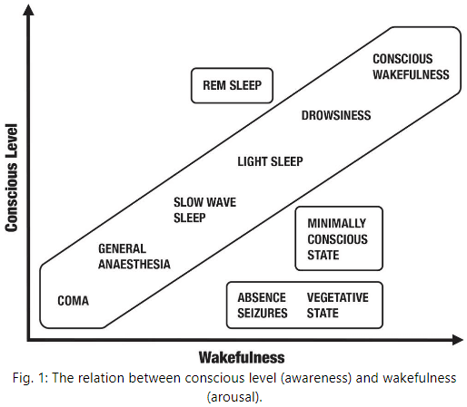
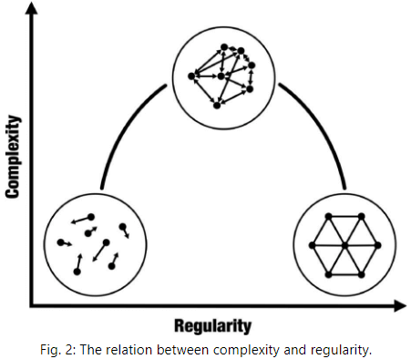
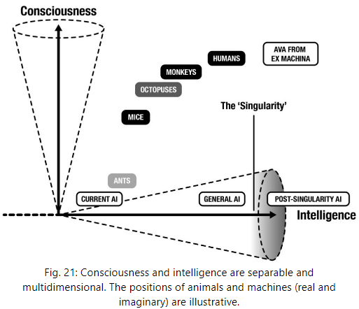

## Prologue

- General anesthesia is one of the greatest inventions of all time.
- General anesthesia is very different from going to sleep as the surgeon's knife would wake you up in sleep.
- Anesthesia has more in common with coma where consciousness is completely absent.
- Under anesthesia, the brain's electrical activity is quieted to an unnatural point, a point not seen in awake or asleep.
- Under anesthesia, no time seems to have passed.
- How does conscious experience happen?
- Why do we experience life in the first person?
- For each of us, our conscious experience is all there is, without which there's no world, no self, no sunsets.
- Imagine in the future that we can replace your brain with a machine that's equal in every way, would that machine be conscious?
- This book is about the neuroscience of consciousness, the attempt to understand how subjective experience relates to, and can be explained by, biological and physical processes unfolding in brains and bodies.
- Explaining consciousness requires understanding brains as embodied and embedded systems.
- In the author's view, consciousness has more to do with being alive than with being intelligent.
- Experiences of being emerge from the way the brain predicts and controls the internal state of the body.
- Three stages of our dethronement
    - Copernicus and how the heavenly bodies don't orbit the Earth.
    - Darwin and how we share a common ancestry with all living creatures.
    - Freud and how much of our behaviour is explained by our subconscious.

# Part I: Level

## Chapter 1: The Real Problem

- What is consciousness?
- For a conscious entity, there's something that it is like to be that entity.
- E.g. There’s something that it is like to be a sheep, dolphin, or bat.
- It feels like something to be someone.
- Identity and individuality are intimately tied to consciousness.
- However, it doesn't feel like something to be a bacterium, a blade of grass, or a toy robot.
- For these entities, there's no subjective experience, no inner universe, no awareness, no consciousness.
- Review of Thomas Nagel's approach to consciousness, which emphasizes phenomenology.
- Phenomenology: the subjective properties of conscious experience (qualia).
- E.g. Visual experience such as color and form, emotional experiences, heat and pain.
- For an entity to be conscious, it has to have some kind of phenomenology to be itself.
- With experience comes phenomenology, and with phenomenology comes consciousness.
- Other properties of consciousness
    - Functional: what consciousness is used for.
    - Behavioural: what consciousness enables in behaviour.
- While function and behavior are important in understanding consciousness, consciousness is first and foremost about subjective experience, about phenomenology.
- In the past, consciousness has been confused with language, intelligence, and certain behaviours.
- But consciousness doesn't depend on behaviour as seen with dreaming and locked-in-syndrome patients.
- To say consciousness depends on language would deny consciousness to babies, animals, and adults who've lost their language abilities to aphasias.
- Some prominent theories of consciousness (ToC) emphasize function and behaviour over phenomenology.
- E.g. Global workspace theory, higher order thought theory.
- Unconscious perception doesn't allow for the behavioral flexibility seen with consciousness.
- Our simple definition of consciousness, as any kind of subjective experience, may seem trivial, but the history of science shows us that premature precise definitions can be constraining and even misleading.
- Review of the hard and easy problems of consciousness.
- Why do brain functions come with experience?
- Review of dualism, physicalism, idealism, panpsychism, and mysterianism.
- The way things seem is often a poor guide for how they actually are.
- Functionalism: the idea that consciousness doesn't depend on what a system is made of, but only on what the system does, on the functions it performs, or on how it transforms inputs into outputs.
- The suggestion that the brain "processes information" hides some strong assumptions.
- E.g. This assumes that the brain is a computer and makes assumptions about what is information.
- All of these assumptions are dangerous and why the author is skeptical of functionalism.
- Assuming functionalism, this implies that we could simulate consciousness in a computer.
- Mysterianism: the idea that there might be a complete physical explanation of consciousness, but that we could never understand it due to our mental limitations.
- There are many things that we will never understand due to the limitations of our brains and minds.
- E.g. No single person can comprehend how a modern airplane works.
- However, it's unjustifiably pessimistic to preemptively include consciousness within this unchartable domain.
- Over time, mystery after mystery has given way to the systematic application of reason and experimentation.
- If we believe mysterianism, we might as well give up and go home. So, let's not.
- For these approaches to consciousness, it matters less how correct they are right now and more how useful they are for advancing our understanding of consciousness.
- Which approach has the most potential? The author believes it's physicalism.
- Review of the zombie-thought experiment as a challenge to physicalism.
- Philosophical zombie: a creature that's indistinguishable from a conscious creature but isn’t conscious.
- The philosophical zombie argument doesn't work because it's a conceivability argument, and such arguments are, by default, weak.
- The plausibility depends on how much knowledge we don't know about it.
- E.g. Can we imagine planes flying backwards? We can, but with our knowledge of physics and time, it becomes less conceivable.
- The more one knows about the brain and its relation to conscious experience and behaviour, the less conceivable the philosophical zombie becomes.
- We are asked to imagine the unimaginable and we draw conclusions based on this impossible scenario.
- Review of the real problem of consciousness.
- The author believes that the real problem is how we should approach the science of consciousness and believes it to be the most likely to succeed.
- Real problem of consciousness: to explain, predict, and control the phenomenological properties of conscious experience.
- Addressing the real problem requires explaining why a particular pattern of brain activity, or other physical process, maps to specific kinds of conscious experiences, and not just establishing that it does.
- The real problem is distinct from the hard problem because it isn’t about why and how consciousness exists, but instead about why the brain exhibits consciousness.
- The real problem is distinct from the easy problem because it focuses on phenomenology rather than on function or behavior.
- E.g. To explain the experience of ‘redness’, the easy problem tries to explain all of the mechanistic, functional, and behavioral properties associated with experiencing redness, the hard problem tries to explain why we experience redness to begin with.
- No matter how much mechanistic information you’re given, you can always ask “But why is this mechanism associated with conscious experience and not another mechanism?”
- The real problem accepts that conscious experiences exist and focuses primarily on their phenomenological properties.
- E.g. Redness is visual, sometimes attached to objects, seem to be a property of surfaces, has different levels of saturation, can continuously vary, etc.
- These are all properties of the experience itself and not properties of the functions or behaviors associated with it.
- In the same way that physicists have made enormous progress on explaining, predicting, and controlling the universe but don’t know why the universe exists, consciousness science can make great progress in understanding the properties and nature of conscious experiences without explaining how or why they happen to be part of the universe we live in.
- So, there’s a distinction between explaining consciousness and explaining why consciousness exists; we can make progress on the first but not the second.
- Neural correlates of consciousness (NCC): the minimal neuronal mechanisms jointly sufficient for any one specific conscious percept.
- NCC argues that there’s some specific pattern of neural activity that’s responsible for any and every experience.
- E.g. Binocular rivalry where a different image is shown to each eye and conscious perception flips between the two. Interestingly, our consciousness doesn’t merge both images but instead picks only one to attend to.
- The NCC approach offers a practical approach for doing consciousness research.
- Problems with NCC
    - It’s difficult, maybe impossible, to disentangle a true NCC from potential confounds.
    - E.g. Neural mechanisms responsible for downstream processing such as attention or verbal reporting.
    - The main issue is that correlations aren’t causations/explanations.
    - The real problem addresses this was we move beyond correlations into explanations.
    - If we can predict, explain, and control the experience of redness, the mystery of how redness happens will be less mysterious and maybe not mysterious at all.
- Review of the analogy between explaining life and explaining consciousness.
- The fatal flaw of vitalism, that being alive requires some special spark, was to interpret a failure of imagination as an insight. This is the same flaw at the heart of the philosophical zombie argument.
- This parallel in life science provides both a source of optimism and a practical strategy for addressing the real problem of consciousness.
- The practical strategy stems from the insight that consciousness, like life, isn’t just one phenomenon but a collection and spectrum of phenomena.
- E.g. Conscious level, content, and self.
- Conscious level: how conscious we are on a scale from complete absence of conscious experience all the way to vivid states of awareness.
- E.g. Coma, brain death, sleep, fight-or-flight.
- Conscious content: what we’re conscious of.
- E.g. Sights, sounds, smells, emotions, moods, thoughts, and beliefs.
- Perception: brain-based interpretations of sensory signals that make up our conscious or unconscious experience.
- Conscious self: the specific experience of being you and is a subset of conscious content.
- E.g. Experiences with your particular body, a first-person perspective, a set of unique memories, your emotions and free will.
- It’s tempting to confuse self-consciousness (the experience of being a self) with consciousness (the presence of any kind of subjective experience/phenomenology).

## Chapter 2: Measuring Consciousness

- How conscious are you right now? What’s the difference between being conscious and just existing?
- The importance of measurement in the advancement of knowledge.
- E.g. To first study heat, we need to develop a reliable thermometer and a scale of temperature. However, how can we test the reliability of a thermometer without a validated scale? And how can we develop a temperature scale without a reliable thermometer?
- This chicken-and-egg problem was solved by setting a fixed point, an unchanging reference, that could be assumed to have a constant temperature.
- E.g. The boiling point of water at sea level.
- Thermodynamics superseded calorific theories and proposed that mean molecular kinetic energy isn’t just correlated with temperature, but that it is temperature.
- The physical basis of temperature and heat is no longer a mystery as we know that mean molecular kinetic energy is temperature.
- The history of thermometry and it’s impact on our understanding of heat offers a vivid example of how the ability to make detailed and quantitative measurements can transform something mysterious into something understandable.
- Could the same approach work for consciousness?
- If consciousness could be measured like temperature, the payoff would be spectacular.
- If the story of consciousness turns out differently, being less like temperature and more like life, measurement will still be an important step in building explanatory bridges.
- Measurement turns the qualitative into the quantitative, the vague into the precise.
- Measuring the level of consciousness also has implications in medicine such as in anaesthesia.
- Measuring conscious level in humans isn’t the same as measuring physiological arousal (awake or asleep) although the two are often highly correlated.
- Consciousness (awareness) and wakefulness (arousal) can be dissociated, which is enough to show that they can’t depend on the exact same underlying biology.
- E.g. Dreaming happens when you’re asleep (low arousal) but you’re conscious of the experience (high awareness). At the other extreme, patients in vegetative state show cycles of sleep and wakefulness (high arousal) but show no signs of conscious awareness (low awareness).

- To measure conscious level, we need to know what in the brain underlies being conscious as opposed to just being awake.
- E.g. Number of neurons? Doesn’t seem so as the cerebellum has about four times more neurons than the rest of the brain but is barely involved in consciousness. Overall degree of neuronal activity? Maybe, but the difference in energy use across conscious levels is small.
- Consciousness seems to depend on how different parts of the brain speak to each other, specifically the thalamocortical system.
- Review of Marcello Massimini’s work on using EEG and TMS to create and measure brain echoes.
- Surprisingly, for the most part, the huge disturbances in brain activity caused by TMS don’t generate any change in conscious experience at all.
- But perhaps unsurprisingly, it just shows that we aren’t aware of what our neurons are doing.
- TMS pulses and their electrical echoes could be used to distinguish between different levels of consciousness.
- E.g. In dreamless sleep and general anaesthesia, the echoes are simple. But in conscious states, the response is very different and a typical echo ranges widely over the cortical surface.
- This “zap and zip” approach first zaps the brain using TMS and then zips/compresses the echo data to check for how much information it has (compression as a measure of signal versus noise).
- Algorithmic complexity: measures of the randomness or signal diversity of brain signals.
- The resulting number will be low for completely predictable information and high for completely random information, and middle for somewhat predictable and somewhat random information.
- Massimini and his team call their measure of echoes the perturbational complexity index (PCI).
- PCI was validated by comparing it’s value in unconscious states to a baseline conscious state of restful wakefulness.
- PCI values correlated extremely well with levels of impairment.
- Measures like the PCI are powerful because they don’t rely on outward visible behavior as wakefulness is defined in terms of behavior but conscious level isn’t.
- Wakefulness is defined by when a person responds to sensory stimulation, but conscious level is defined in terms of subjective experience, and so can only ever be indirectly related to what’s seen from the outside.
- Standard clinical approaches to determine conscious status still rely on behavior.
- The problem with these approaches is that some patients might still be conscious but be unable to outwardly express it.
- E.g. Locked-in syndrome where consciousness is fully present despite total paralysis of the body following brainstem damage. Thanks to a quirk in anatomy, some locked-in patients may still make limited eye movements to communicate.
- In Massimini’s 2013 study, locked-in patients had PCI values indistinguishable from healthy age-matched controls, suggesting fully intact consciousness.
- The challenging cases come from the grey zone between life and death.
- E.g. Vegetative state and minimally conscious state.
- PCI has made a difference in the hospital as one young man with severe head injuries remained unresponsive to simple questions and commands suggesting vegetative state, but his PCI was as high as a healthy, fully conscious person. The twist was that the man was just unresponsive to Italian but not Arabic, a case of cultural neglect.
- Review of Adrian Owen’s house-tennis imagination experiment.
- PCI is promising because it can detect residual awareness without requiring the patient to do anything at all, just like what a true consciousness meter should measure.
- So far, the level of consciousness that we’ve discussed is on the scale of an individual, but what about across age (baby vs adult) or across species (dolphin vs human)?
- It’s dangerous to think along these lines since human exceptionalism has repeatedly plagued biology.
- Is consciousness all-or-none or is it graded on a continuum?
- This question applies both to the emergence of consciousness in evolution and in development.
- The author believes this question is misguided as consciousness doesn’t have to be either-or.
- If we pursue multidimensional levels of consciousness, the sharp distinction between conscious level and conscious content disappears.
- E.g. It becomes meaningless to completely separate how conscious you are from what you are conscious of.
- No notes on how LSD and psilocybin affect conscious level and content.
- Surprisingly, these drugs all led to increases in measures of conscious level compared to controls.
- Thus, brain activity in the psychedelic state becomes more random over time, aligning with what people experience when in the psychedelic state.
- Instead of starting from specific experiences such as seeing red, we can seek out general characteristics of conscious experience.
- Tononi and Edelman made a simple but profound observation that all conscious experiences are both informative and integrated.
- Conscious experiences are informative because every conscious experience is different from every other conscious experience that you’ve ever had, ever will have, or ever could have.
- E.g. You never experience a life in the exact same way because your perspective changes, memories change, emotions change, etc.
- We precisely have one conscious experience out of many possible conscious experiences.
- Thus, experience reduces a massive amount of uncertainty and this reduction is, mathematically, what is meant by information.
- E.g. Experiencing pure redness is the way that it is not because of any intrinsic property of redness, but because red isn’t blue, green, or any other color. So, red has redness because of all the things it isn’t, which goes for all other conscious experiences.
- Conscious experiences are integrated because every experience appears as a unified scene.
- E.g. We don’t experience colors separately from their shapes.
- The key insight from Tononi and Edelman is that if conscious experience is both informative and integrated at the level of phenomenology, then the neural mechanisms underlying conscious experiences should also exhibit both of these properties.
- What does it mean for a mechanism to be both integrated and informative?
- It means that it can’t be extremely random or extremely regular, but somewhere in between.

- A measure of complexity is, in some ways, a measure of consciousness.
- Previous consciousness measures, such as algorithmic complexity or compressibility, tell us a lot about information but nothing about integration. PCI fares a bit better but only partially measures integration.
- All current measures try to quantify the extent to which a system is between order and disorder where integrated information is to be found.
- The problem is that no measure has yet worked well when applied to actual brain imaging data.
- Is consciousness more like temperature, reducible to a basic property of the physical universe, or is it more like life, a constellation of different properties?
- The author suspects consciousness to be more like life as consciousness is related to integrated information, but it isn’t integrated information like how temperature is molecular kinetic energy.

## Chapter 3: Phi

- Review of integrated information theory (IIT) of consciousness, the work of Tononi.
- IIT argues that subjective experience is a property of patterns of cause and effect, that information is as real as mass or energy. Thus, IIT tackles the hard problem of consciousness.
- IIT is fascinating because it pushes the analogy between consciousness and temperature to its extreme; consciousness is integrated information.
- IIT is one of the most hotly debated theories in neuroscience and has received many praises and criticisms.
- E.g. IIT makes counterintuitive claims but provides some progress in studying consciousness.
- The extraordinary claims made by IIT require extraordinary evidence, but the nature of the hard problem means IIT’s claims are untestable in practice.
- Integrated information theory (IIT)
    - The concepts of information and integration are core to the theory.
    - IIT proposes a single measure called $$\phi$$ (phi) that measures how much a system is “more than the sum of its parts” in terms of information.
    - Phi measures the amount of information a system generates as a whole compared to the amount of information generated by its parts independently.
    - Main claim of IIT: a system is conscious to the extent that its whole generates more information than its parts.
    - Phi is intrinsic to a system and is identical to the amount of consciousness associated with that system.
    - E.g. High phi equals lots of consciousness while zero phi equals no consciousness.
    - This is why IIT is the ultimate expression of a temperature-based view of consciousness.
- Features of a system with high phi
    - First, the global state of the network has to rule out a large number of alternative possible global states. This is information.
    - The observation from phenomenology that every conscious experience rules out a great many alternative possible conscious experiences.
    - Second, there must be more information when considering the whole system than when considering all parts of the system. This is integration.
    - The observation from phenomenology that every conscious experience is unified.
- IIT accounts for some observations about conscious level.
- E.g. Split-brain patients where total phi is zero, but each hemisphere has a non-zero phi. Cerebellum has low phi because its parts are mostly independent of each other.
- How does IIT explain consciousness fading during dreamless sleep, anesthesia, and coma, given that the brain’s wiring doesn’t change?
- IIT says that in these states, the ability of cortical neurons to interact with each other is compromised, thus compromising integration which reduces phi.
- IIT is an axiomatic approach to consciousness in that it starts with theoretical principles rather than with experimental data.
- However, like any theory, IIT will stand or fall based on whether its predictions are testable and if those predictions match evidence.
- The theory claims that the level of consciousness for a system is its phi value, so testing this means to measure phi for real systems.
- Yet, measuring phi is extremely difficult and in some cases, impossible. The main reason is because IIT treats information in an unusual way.
- Normally, information is observer-relative as developed by Claude Shannon, but IIT states that integrated information is consciousness. So if we treat information as observer-relative, then this means that consciousness is also observer-relative, but whether something is conscious shouldn’t and doesn’t depend on what or how anyone thinks of it.
- Therefore, information in IIT must be intrinsic to a system that doesn’t depend on an external observer.
- To measure intrinsic information, it isn’t enough to observe a system over time, but we have to know all of the possible ways a system could behave.
- Compared to measuring what a system does by just observing it, measuring what a system can do is, in general, very difficult.
- E.g. To observe all possible behaviors of a lobster, we would need for the lobster to interact with every possible thing for all time.
- Two ways to measure all possible system states
    - Perturb the system in all possible ways and see what happens.
    - Infer all possible states from complete knowledge of the system’s physical mechanisms.
- Often, all that we can observe and access is what a system does rather than what it could do.
- Another challenge with measuring phi is that there’s no standard method of dividing up a system into its parts.
- The number of possible ways of dividing a system grows exponentially with its size.
- What’s the right scale of space and time to calculate phi?
- E.g. Neurons or brain regions? Milliseconds or seconds? Could a country be conscious?
- The issue isn’t whether phi exists, but whether we can measure it. According to IIT, any system just has a phi; it’s intrinsic.
- Another challenge to IIT is that suppose we added a mass of neurons to your brain but these neurons don’t fire. They could fire if your brain encountered some specific state but your brain never does. This changes IIT because the number of possible brain states increases, but does it change consciousness? Intuition says no.
- Since IIT states that phi is consciousness, this implies a limited form panpsychism, which is the position that consciousness is found wherever integrated information is found.
- IIT is original, ambitious, and remains the only neuroscientific theory out there that makes a serious attempt on the hard problem of consciousness.
- However, the implications of IIT are weird but that doesn’t mean that it’s automatically wrong.
- E.g. Quantum physics is weird and counterintuitive yet explains a lot of our reality.
- The main issue with IIT is that experimentally testing it is difficult.
- The author believes that the best way forward is to keep the fundamental insights of IIT, that conscious experiences are both informative and integrated, but to ditch or modify phi.
- E.g. Making phi based on observer-relative information rather than intrinsic information.
- IIT teaches us that treating consciousness like temperature leads to untestable predictions and instead, we might want to try treating consciousness like life.

# Part II: Content

## Chapter 4: Perceiving from the Inside Out

- The extraordinary world that we experience is a construction by our brains, a kind of controlled hallucination.
- The contents of consciousness are what we’re conscious of.
- E.g. The smell of coffee, the warmth of a fireplace, the blue of the sky.
- Imagine that you’re a brain, sealed inside the bony vault of the skull trying to figure out what’s out there in the world.
- There’s no light, no sound, no anything, it’s completely dark and silent.
- All the brain has is a constant barrage of electrical signals which are only indirectly related to things out there in the world.
- These sensory inputs don’t come with labels attached such as their modality or feature.
- How does the brain transform these inherently ambiguous sensory signals into a coherent perceptual world full of colors, music, and tastes?
- Here, we explore the idea that the brain is a prediction machine, the idea that everything we perceive is nothing more than the brain’s best guess of the causes of its sensory inputs.
- Following through with this idea, we’ll see that the contents of consciousness are a kind of waking dream, a controlled hallucination, that’s both more and less than whatever the real world really is.
- Traditional/common view of perception
    - There’s a mind-independent reality out there: without color but light frequency, without music but sound frequency, without taste but chemical molecules.
    - Our senses act as windows into this world, detecting these properties of reality and conveying this information to the brain, forming our perceptions.
    - E.g. A coffee cup in reality leads to the perception of a coffee cup generated within the brain.
    - Who’s doing the perceiving? The “self”, the “I behind the eyes”, the observer of sensory data.
    - Patterns of thinking since the start of the computer revolution have accustomed us to the idea that the brain is some kind of computer inside the skull, processing sensory information to build an inner picture of the outside world for the self.
- Many scientists that study the brain still think about perception as a process of “bottom-up” feature detection.
- E.g. Sensory stimuli → Sensory organs → Electrical impulses → Brain.
- Sensory signals pass through several distinct processing stages, each analyzing out increasingly complex features like fishermen catching fish of increasing size and complexity further up the river.
- Signals going in the opposite direction, from “top-down”, only serve to refine or constrain the bottom-up flow of sensory information.
- Evidence from anatomy, neuroimaging, and computational modeling supports this bottom-up view of perception.
- E.g. V1, V2, V4, fMRI, and artificial neural networks.
- However, how things seem is not necessarily how they are.
- E.g. It seems like the sun goes around the Earth, but we know that isn’t how things are; the Earth goes around the sun.
- Even with a greater understanding of how things actually are, at some level, things still appear the same way they always did.
- Although it seems as though our senses provide transparent windows into the mind-independent reality, what’s really going on is quite different.
- The author argues that perceptions don’t come from the bottom-up or outside-in, they primarily come from the top-down or the inside-out.
- What we experience is built from the brain’s best guesses about the causes of sensory signals.
- Perhaps our conscious perceptions are just indirect reflections of hidden causes that we can never directly experience.
- Immanuel Kant realized that the chaos of unrestricted sensory data would always remain meaningless without being given structure a priori or from the beginning.
- Hermann von Helmholtz proposed a similar idea of perception as a process of unconscious inference, that perception has to be inferred from sensory signals by combining them with the brain’s expectations or beliefs about their causes.
- Helmholtz’s idea is a scientific version of Kant’s insight that perception can’t allow us to know things directly in the world, that we can only infer them from behind a sensory veil.
- In the 1970s, Richard Gregory built on Helmholtz’s idea by proposing perception as a kind of neural hypothesis-testing similar to how scientific ideas are tested.
- E.g. The brain continually forms perceptual hypotheses about the world based on past experiences and tests these hypotheses by acquiring data from sensory organs.
- Thus, perceptual content is determined by the brain’s best-supported hypotheses.
- In modern times, the idea of perception as inference has blossomed under names like “predictive coding”, “predictive processing”, and the author’s “controlled hallucination”.
- Controlled hallucination theory
    - The brain is constantly making predictions about the causes of its sensory signals in a top-down manner.
    - Sensory signals keep these perceptual predictions tied to their causes by signaling prediction errors.
    - Top-down predictions act to suppress bottom-up prediction errors through a continual process of prediction error minimization.
    - The most important claim is that perceptual experience is determined by the content of the top-down predictions and not by the bottom-up sensory signals.
    - Thus, we never experience sensory signals themselves, we only ever experience the brain’s interpretations of them.
- Traditional perception assumes that we experience the world as it is, while the controlled hallucination theory proposes that we experience the world as a hallucination, as a prediction of the world.
- We only experience a thin slice of reality.
- E.g. Only the visible part of the electromagnetic spectrum and not infrared or ultraviolet light.
- There’s no one-to-one mapping between activities of color-sensitive cells and color experience.
- The brain infers invariant properties, such as color, as its best guess of the causes of its continually changing sensory inputs.
- E.g. Chairs aren’t white or ugly or old, instead, the surface of the chair has a particular property, the way it reflects light, that the brain keeps track of through its mechanisms of perception.
- Does this mean that the chair’s whiteness has moved from being “out there” to being “in here” in the brain?
- In one sense, no because their is no red in the brain. If we argue that there is red in the brain, we fall prey to the double transduction fallacy.
- Double transduction fallacy: an external property is transduced by the sensory organ into patterns of electrical activity which then have to be transduced again into an internal experience.
- Double transduction is a fallacy because it explains nothing and only pushes the mechanism to the second transduction.
- The only sense that one could locate redness in the brain is to seek the mechanisms underlying perceptual experience.
- “Color is the place where our brain and the universe meet.” - Paul Cezanne
- You could argue that we’re all hallucinating all the time, it’s just that when we agree about our hallucinations is what we call reality.
- The fact that people have such different experiences and report them with such confidence is compelling evidence that our perceptual experiences of the world are internal constructions.
- E.g. Visual illusions such as the black-and-blue dress, Adelson’s Checkerboard, and Mooney image.
- The principle that perceptual experience is built from brain-based predictions applies to all sensory modalities all of the time.
- An important implication of this principle is that we never experience the world as it is.
- Two types of object properties
    - Primary: qualities that are independent of an observer.
        - E.g. Electromagnetic waves, occupying physical space, pressure waves.
    - Secondary: qualities that are dependent on an observer.
        - E.g. Color, emotion, sound.

## Chapter 5: The Wizard of Odds

- Bayesian reasoning is all about reasoning with probabilities.
- It’s about making optimal inferences, best guesses, under conditions of uncertainty.
- Bayesian inference formalizes abductive reasoning.
- Abductive reasoning: finding the best explanation for a set of observations when those observations are incomplete, uncertain, or ambiguous.
- The goal is to find the best explanation/hypothesis for what you see; to find the most likely causes from their effects.
- Bayesian inference tells us how to do this.
- Review of Bayes rule.
- Priors: the probabilities of something happening before new data arrives.
- Posterior: what we should believe next.
- Likelihoods: the probability going forward from causes to effects.
- Bayes’ rule combines priors and likelihoods to come up with posterior probabilities for each hypothesis.
- A powerful feature of Bayesian inference is that it takes the reliability of information into account when updating best guesses.
- When the brain is making best guesses about the causes of its sensory signals, it’s using the principles from Bayes rule.
- And the brain continuously uses Bayes rule to update it’s next best guess; perception is a process not a snapshot.
- The reliability of sensory information plays an important role here as sensory signals with less noise are used to determine the next action.
- Review of probability distributions.
- The ability to represent confidence/reliability is what gives Bayesian inference its power.
- However, how is Bayes’ theorem specified/implemented in terms of neural mechanisms?
- Prediction error minimization: the idea that the brain continually generates predictions about sensory signals and compares them with actual sensory signals to get prediction errors.
- The difference between predictive processing and the controlled hallucination theory is that the former is a theory of how brains work, while the latter is a theory of how conscious experiences work.
- Both theories rely on prediction error minimization.
- By minimizing prediction errors, the brain approximates Bayes’ rule.
- Three components of prediction error minimization
    - Generative models: determines the set of perceivable things.
    - Perceptual hierarchies: high-level predictions give rise to lower-level predictions.
    - Precision weighting: stimuli with low estimated precision have a weaker effect on updating prior beliefs and vice versa.
- The brain not only has to figure out the most likely causes of its sensory inputs, but it has to also figure out how reliable those sensory inputs are.
- Increasing attention is one way of increasing a stimulus’ precision weighting.
- Review of inattentional blindness and the gorilla-ball experiment.
- How things seem is a poor guide to how they actually are.
- It’s time to bring action into the picture. Action is inseparable from perception.
- We don’t perceive the world as it is, we perceive the world as it is useful.
- In predictive processing, action and perception are two sides of the same coin.
- Prediction errors can be reduced by performing actions that change sensory data so that the new sensory data matches an existing prediction.
- Active inference: minimizing prediction error through action; self-fulfilling perceptual prediction.
- Even high-level actions such as applying for a new job or moving will cascade down into bodily actions that alter sensory inputs.
- Every action has the potential to suppress sensory prediction errors through active inference, so every action directly participates in perception.
- Active inference not only helps to fulfill existing perceptual predictions, but it can also help improve these predictions.
- Actions are fundamental to learning.
- Learning: improving the brain’s generative models by revealing more about the causes of sensory signals and the causal structure of the world.
- Active inference combined with perceptual inference is a virtuous circle where well-chosen actions uncover useful information about the world, which is used to improve generative models, which enables improved perceptual inference and directs new actions.
- The weirdest aspect of active inference is that it claims that actions are perceptions; actions are self-fulfilling proprioceptive predictions.
- Rather than perception as input and action as output, both action and perception are forms of brain-based prediction, both depend on a common process of Bayesian best guessing.
- Returning back to the brain sealed inside its bony prison, we now know that the brain is far from isolated. It swims in a torrent of sensory signals from the world and body.
- These signals are met with top-down predictions, giving rise to prediction error signals that stream upwards to stimulate ever better predictions and elicit new actions.

## Chapter 6: The Beholder's Share

- Beholder’s share: the role played by an observer/beholder in completing a work of art that isn’t found in the artwork or world itself.
- Continuous flash suppression experiment: when different images are presented to the left and right eyes.
- In the continuous flash suppression experiment, people were faster and more accurate when what they saw aligned with what they were expecting.
- Thus, valid perceptual expectations do lead to more rapid and more accurate conscious perceptions.
- For anyone who doubts that the brain is the organ of experience, the hallucinations produced by drugs deliver a powerful argument.
- What we call a hallucination is what happens when perceptual priors are unusually strong and start overwhelming sensory data so that the brain’s grip on their causes in the world starts to fade.
- What we call hallucination is a form of uncontrolled perception, while normal perception is a form of controlled hallucination.
- Deep structure of perception: the ways that conscious contents appear in our experience.
- E.g. A real coffee cup appears to occupy a definite space compared to a picture or drawing of a coffee cup that doesn’t.
- This is the phenomenology of objecthood, a general property of how visual conscious contents appear.
- Some things don’t have objecthood such as the uniform expanse of the blue sky. You don’t have the impression that the sky is an “object out there”.
- This is the difference between an object and an image of an object.
- Our perception of objecthood depends on our first-person perspective.
- Sensorimotor contingency theory (SCT): what we experience depends on a practical mastery of how actions change sensory inputs.
- According to SCT, we become perceptually aware of the backs of objects even though we can’t see them, because of implicit knowledge on how rotating the object will change incoming sensory signals. Or how changing your perspective changes the incoming sensory signals.
- Changes in perception aren’t only due to changes in sensory data.
- E.g. Visual illusions that seem to move like the rotating snakes illusion.
- The opposite case of sensory data changes without perceptual change happens in a condition called "change blindness”.
- Change blindness: when a change isn’t noticed due to being extremely slow.
- E.g. The bottom half of an image turning purple over 40 seconds.
- Perception of change isn’t the same as change of perception. The experience of change is another perceptual inference, another variety of controlled hallucination.
- Our experience of time is also a controlled hallucination.
- We infer time not based on a time organ or the ticking of an internal clock, but on the rate of change of perceptual contents.
- E.g. Busy videos feel faster than quiet videos.
- Because our perceptions have the phenomenological quality of “being real”, this makes it very difficult to appreciate the fact that perceptual experiences don’t necessarily directly match to mind-independent things.
- E.g. A chair has a mind-independent existence; chairness doesn’t.
- The hard problem of consciousness seems hard if we interpret the contents of our perceptual experience as really existing out there in the world, but we know they don’t really exist out there, they only exist in our brains.
- Similar to how we studied life a century ago, the need to find a “special sauce” for consciousness is receding given our ability to distinguish different aspects of conscious experience and to explain them in terms of their underlying mechanisms.
- It’s time to ask who, or what, is doing all this perceiving.

# Part III: Self

## Chapter 7: Delirium

- Delirium: an acutely disturbed state of mind characterized by restlessness, illusions, and incoherence.
- Delirium is usually temporary and follows a cycle.
- No notes on how the author’s mother had hospital-induced delirium.
- The self isn’t what it might seem to be.

## Chapter 8: Expect Yourself

- It may seem that the self, your self, is the thing that does the perceiving, but this isn’t true.
- The self is another perception, another controlled hallucination, but of a very special kind.
- Teletransportation paradox: the idea that some future teleportation technology involves using clones to teleport you, this means you get cloned at your destination but destroyed at the source.
- Two problems raised by the teletransportation paradox
    - Will the replica be conscious and have conscious experiences? This is similar to the zombie thought experiment and isn’t very interesting.
    - Is the cloned person the same person as the original person? It’s tempting to say yes because what matters for identity is psychological continuity and not physical continuity. But if the original isn’t destroyed, which is the real person? Admittedly, both are the real person.
- Naturally, we treat experiences of self differently from experiences of the world.
- One assumption we make of the self is that there can only be one such self, not two, not half, but one.
- However, evidence points to the self not as a unit, but as a collection.
- E.g. Split-brain patients.
- Being you isn’t as simple as it sounds.
- The sense of personal identity, the “I” behind the eyes, is only one aspect of how being a self appears in consciousness.
- This sense of self is the experience of embodied selfhood that relates directly to the body; the sense of being a body.
- E.g. Ownership over your body that doesn’t apply to other objects in the world.
- Another sense of self is the experience of perceiving the world from a specific point of view; the sense of first-person perspective.
- E.g. The subjective origin point for vision to be inside the head, located somewhere behind the eyes and under the forehead.
- The sense of self related to intention is the experience of volition; the sense of agency.
- All these ways of being-a-self can come before any concept of personal identity.
- For personal identity to exist, there has to be a personalized history; a thread of autobiographical memories from a remembered past to an imagined future.
- This sense of personal identity is called the narrative self.
- The social self is how I perceive others perceiving me and comes from how you’re embedded in a social network.
- Normally, these diverse aspects of selfhood are bound together into one piece, the overarching experience of being you.
- The unified character of this experience seems so natural that it’s easy to take for granted. But to do so is a mistake.
- Just as experiences of redness don’t mean redness exists in reality, experiences of unified selfhood don’t mean the existence of an actual self.
- The sense of personal identity can erode or disappear entirely in cases of amnesia, delirium, schizophrenia, alien hand syndrome, phantom limb syndrome, and out-of-body experiences.
- The self isn’t an unchanging entity that lives in the brain, but a collection of tightly woven perceptions evolved towards keeping your body alive.
- Review of the rubber hand illusion which shows that experiences of body ownership are special kinds of controlled hallucinations.
- When sensory stimuli synchronize, such as sight and touch, this provides enough evidence to the brain that the rubber hand is somehow part of the body.
- The rubber hand illusion hints at a moment-to-moment flexibility of body ownership where the subjective ownership of the hand, and by extension the entire body, can be manipulated.
- This experiment and others provide fascinating evidence that experiences of “what is my body” can be dissociated from experiences of “where I am”.
- These out-of-body experiences have been documented for near-death experiences and brain stimulation experiments.
- Compared to classical visual illusions though, body illusions are less surprising and provoke less of a response.
- One criticism of the rubber hand illusion is that it might be entirely driven by suggestion effects rather than actually involving a change in body ownership.
- There’s also a sharp divide between these subjectively mild body ownership illusions and the experiences of clinical conditions such as phantom limb syndrome.
- The narrative and social selves are the levels that we become aware that we have a self, when we become truly self-aware.
- We know the narrative and social selves are different because they can be dissociated from the embodied self.
- E.g. Patients H.M. and Clive Wearing that have both retrograde and anterograde amnesia. Both of these patients lack narrative selves but still maintain social selves.
- The narrative self depends on episodic, autobiographical memory, the memory of personal events.
- The destruction of a narrative self is more than just a deficit of memory, it’s also the inability to perceive one’s self as continuous over time.
- Review of theory of mind and social perception.
- The social self is how we perceive ourselves refracted through the minds of others.
- Perhaps self-awareness requires selfhood that has both narrative and social aspects because if you exist in a world without any other minds, there would be no need for your brain to predict the mental states of others, and therefore no need for it to infer that its own experiences and actions belong to any self at all.
- Do you experience being yourself in the same way you did yesterday?
- Subjective stability of the self: the experience of ourselves as being continuous and unified across time.
- This is a generalization beyond just autobiographical memory and refers to a deeper sense of continuity from moment to moment at the levels of body and personal identity.
- Compared to the fast changing perceptual experiences of the outside world, the self-related experiences of the inner world are remarkably stable.
- E.g. Changes in body strength and appearance are harder for us to notice.
- This is change blindness applied to self-perceptions. Our perceptions may change, but this doesn’t mean that we perceive them as changing.
- The experience of being a self seems to endure within a changing world.
- E.g. When you mentally feel in your 20s but are in a body of a 40-year-old.
- Why is the self more blind to changes in itself?
- We need to first understand why we perceive ourselves in the first place.
- We don’t perceive ourselves to know ourselves, we perceive ourselves to control ourselves.

## Chapter 9: Being a Beast Machine

- “We don’t see things as they are, we see them as we are.” - Anais Nin
- Self-perception isn’t about perception, it’s about physiological control and regulation, it’s about staying alive.
- The bodies of both humans and beasts are merely machines that breathe, digest, perceive, and move by the arrangement of their parts. But only humans can provide evidence of their reason by using speech. Without minds to direct their bodily movements or receive sensations, animals must be regarded as unthinking, unfeeling machines that move like clockwork. (Paraphrased from Wallace Shugg)
- In this view, the nature of living beings is irrelevant to the presence of mind, consciousness, or soul. This is the view of dualism in that the mind and body are separate. Non-human animals are best thought of as beast machines.
- However, humans are animals too so would we also be classified as beast machines?
- Beast machine theory of consciousness: our conscious experiences of the world and of ourselves happen with, through, and because of our living bodies.
- Underneath the layers of selfhood from the social self, personal identity, the “I”, and even under the first-person perspective and experiences of body ownership, there are deeper layers of selfhood to be found.
- These bedrock layers of self are intimately tied to the interior of the body.
- E.g. Emotions, moods, thirst, hunger, breathing.
- Interoception: the sense of the internal physiological condition of the body.
- Interoceptive sensory signals are typically transmitted from the body’s internal organs (viscera) to the central nervous system.
- E.g. Heartbeat, blood pressure, blood chemistry, gastric tension, breathing, etc.
- The insular cortex is specialized for processing interoceptive signals.
- A special property of interoceptive signals is that they reflect how good of a job the brain is doing in keeping its body alive.
- Interoceptive signals are connected with emotion and mood.
- E.g. Your heart races when you’re in love.
- No notes on the James-Lange theory of emotion and appraisal theory.
- Interoceptive inference
    - By applying the principles of predictive perception to emotions and moods, we get interoceptive inference.
    - The idea is that the brain lacks direct access to the causes of interoceptive sensory signals, which are inside the body.
    - All causes of sensory signals are forever and always hidden behind a veil.
    - In the same way that redness is the subjective aspect of brain-based predictions about how surfaces reflect light, emotions and moods are the subjective aspects of predictions about the causes of interoceptive signals.
    - Interoceptive inference is difficult to test because it’s hard to measure and manipulate interoceptive signals compared to exteroceptive signals.
- What’s the purpose of interoceptive inference?
- Perception of the outside world is useful for guiding actions, so perception of the inner world is also useful for guiding actions.
- Review of the history of cybernetics.
- Every good regulator of a system must be a model of that system.
- A model of that system allows it to predict how actions to the system change its state.
- Predictive processing can be used either to infer features of the world or body, or to regulate those features.
- Essential variable: physiological quantities that must be kept within certain strict limits for an organism to remain alive.
- Essential variables are the causes of interoceptive signals.
- Emotions and moods can be understood as control-oriented perceptions which regulate the body’s essential variables.
- E.g. The experience of fear as a bear approaches you is a control-oriented perception of your body that sets up actions to keep your essential variables where they need to be. These actions can be both external, such as moving your legs, and internal, such as raising your heart rate.
- Why do emotions and moods have a phenomenology different from other sensations such as vision?
- The key difference is that perceptual experience depends not only on the target of the prediction, but also on the type of prediction being made.
- Predictions can be either for finding the causes of stimuli or for controlling stimuli.
- Your actions, and the brain’s predictions about their sensory consequences, aren’t about finding out what stimuli are, they’re about controlling how stimuli perceptually appear.
- E.g. When catching a baseball, you don’t run to where you think the ball will land. Instead, you run to keep the ball looking a certain way.
- Perception is a controlling hallucination as much as it’s a controlled hallucination.
- Affordance: opportunity for action.
- We act so that we end up perceiving things in a particular way.
- The control-oriented perceptions that underpin emotions and moods are all about predicting the consequences of actions for keeping the body’s essential variables where they belong.
- This explains why we don’t experience emotions as objects, but instead experience them as how well or badly our overall situation is going.
- At the deepest layers of the self, beneath emotions and moods, is the experience of simply being a living organism.
- This is the core of the beast machine theory, that conscious experiences of the world and of ourselves happen with, through, and because of our living bodies.
- The primary goal of any organism is to stay alive.
- The fundamental reason any organism has a brain, or any organ, is to help it stay alive.
- While perceptual inference is often about finding things out in the world, interoceptive inference is about controlling things.
- Specifically, we want to control things before they happen, to anticipate responses before they occur.
- E.g. If blood acid levels get too high, it may be too late to do anything about it. Instead, it’s better to be proactive and anticipate future blood acid levels.
- Allostasis: the process of achieving stability through change.
- Homeostasis: a tendency towards a state of equilibrium.
- Interoceptive inference can be thought of as the allostatic regulation of the body.
- The final step in the beast machine theory is to recognize that from this starting point, everything else follows.
- The foundation of being a conscious beast machine enables the rest of consciousness.
- While perceptions of the world change, experiences of selfhood seem to be stable and continuous over many different timescales.
- This subjective stability emerges from the beast machine theory as the body’s essential variables need to be stable.
- The experience of the bodily self as unchanging stems from the need to have precise priors (strong predictions) about stable bodily states to regulate physiology.
- To the brain, as long as we are alive, it will never update its prior belief of expecting to be alive.
- Analogous to change blindness, we may experience “self-change-blindness” where our body changes but we don’t perceive it changing.
- In the same way that our perceptions of the world can sometimes lack the phenomenology of being real, the self too can lose its reality.
- E.g. In psychiatric conditions such as depersonalization and Cotard’s delusion.
- To understand why our conscious experiences are the way they are, what experiences of self are like, and how they relate to experiences of the world, we should appreciate the deep roots of all perception in the physiology of being alive.
- What we might call the “soul” is the experience we have when we encounter the deepest levels of embodied selfhood: the experience of just being, of really existing.
- We are not cognitive computers, we are feeling machines.

## Chapter 10: A Fish in Water

- Review of the free energy principle (FEP).
- What does it mean for an organism, or anything, to exist?
- For something to exist, there must be a difference, a boundary, between that thing and everything else.
- If there are no boundaries, there are no things. This boundary must also last over time because things that exist maintain their existence over time.
- E.g. A drop of ink versus a drop of oil into a glass of water. The ink drop disperses and ceases to exist, while the oil drop maintains a boundary between it and the water. Over time, however, even the oil drop will cease to exist as its boundary decays.
- Living systems are different in that they actively maintain their boundaries over time.
- Organisms actively contribute to preserving themselves as distinct from their environment, which is a key feature of being alive.
- Thinking about life this way brings us back to the idea of entropy.
- Entropy: a measure of disorder, diversity, or uncertainty.
- Being alive means having low entropy to resist dispersion.
- For any living system, being alive means to proactively seek out states that are visited repeatedly over time. These low-entropy states ensure the system stays alive.
- All organisms stay alive by minimizing their sensory entropy over time, thereby helping them remain in the statistically expected states compatible with survival.
- How do living systems minimize their sensory entropy?
- To minimize a quantity, systems must first measure it. However, sensory entropy can’t be directly detected or measured.
- A system can’t know whether its own sensations are surprising simply on the basis of the sensations themselves.
- E.g. Is the number 7 surprising? Without context, we can’t say.
- This is where free energy comes into play.
- Free energy: a quantity that approximates sensory entropy and can be measured by an organism.
- The FEP argues that organisms maintain their low-entropy states, thereby ensuring their continued existence, by actively minimizing free energy.
- What is free energy from the perspective of the organism?
- Free energy is basically the same as sensory prediction error, and by minimizing sensory prediction error, we’re also minimizing free energy.
- By minimizing prediction error through active inference, living systems will naturally come to be in states they expect/predict themselves to be in.
- “I predict myself therefore I am.” - Anil Seth
- Complex systems, like organisms, need to allow some things to change for other things to stay the same.
- FEP isn’t falsifiable but this isn’t a problem because it isn’t a scientific theory, but more a mathematical philosophy.
- In the end, the FEP will be judged on how useful it is and not on whether it’s empirically true or not.
- Three ways FEP enhances the beast machine theory
    - FEP grounds the theory in physics and ties the drive to stay alive with entropy. Living systems withstand the insistent pull of the second law of thermodynamics.
    - FEP retells the theory in reverse. The beast machine theory works from the world to the brain, FEP works from existence to the world.
    - FEP brings its rich mathematical tools with it to the beast machine theory.
- The FEP, however, isn’t a theory of consciousness.
- What’s the link between FEP and IIT? One starts from existence and derives neuroscience and biology, while the other starts from consciousness and attacks the hard problem.
- Currently, the link between the two theories hasn’t been explored.

## Chapter 11: Degrees of Freedom

- What part of being you do you cling to most tightly?
- For many, it’s the feeling of being in control of your actions, of being the author of your thoughts. We call this feeling “free will”.
- In the arrow from conscious intention to physical action, we feel that somewhere along this arrow lies the very essence of self.
- E.g. When you move your finger, you go from conscious intention to physical action.
- Which comes first, the intention then action, or action then intention?
- We’ve been debating this question for centuries, but what we do know is that when we exercise free will, there’s a feeling that the self is playing a causal role in action that isn’t present in reflexive responses.
- We set aside spooky free will, the kind that argues with determinism and interrupts the universe’s causal flow.
- The author argues that experiences of free will are self-related perceptions, that they’re controlled hallucinations.
- Three features of free will/volition
    - The feeling that I’m doing what I want to do.
        - “Man can do what he wills, but he cannot will what he wills.” - Arthur Schopenhauer
    - The feeling that I could have done otherwise.
    - That voluntary actions seem to come from within rather than being imposed from somewhere else.
        - This explains the difference between a reflex and a voluntary action.
- How does the brain enable and implement volitional actions?
- Degrees of freedom: the possible actions a system has for responding.
- Volition is implemented in the brain by a network of processes distributed over many brain regions.
- Three parts of the volition network
    - An early “what” process specifying which action to make.
    - A following “when” process determining the timing of the action.
    - A late “whether” process allowing for cancellation or inhibition.
- The perception of the operation of this network, looping from body to world and back, underpins subjective experiences of volition.
- Experiences of volition are useful not only for guiding current behaviors, but also for guiding future behaviors.
- E.g. If we choose to run up the stairs but then fall, we may choose to go slower up the stairs next time.
- Experiences of volition mark voluntary behavior so that such behavior can be changed in the future.
- Volition, the feeling that we could have done differently, isn’t used for when you could have done differently at that exact moment, but that next time, you could have done otherwise if a similar situation comes up.
- And who is this “you”? The “you” is the combination of selves that we’ve talked about and experiences of volition are another part of this bundle of selfhood.
- Voluntary actions aren’t always accompanied by vivid experiences of volition.
- E.g. Habitual actions done without thinking such as walking and driving.
- E.g. When people are “in the moment” or in a “state of flow” being deeply immersed in an activity, the phenomenology of volition might be entirely absent.
- This kind of freedom is both a freedom from and a freedom to.
- E.g. We have freedom from others and freedom to act according to our beliefs, values, and goals. However, we don’t have freedom from the laws of nature or the causal fabric of the universe.
- This kind of free will can’t be taken for granted as some people with brain injuries or unlucky genes can’t exercise voluntary behavior.
- E.g. People with anarchic hand syndrome make voluntary actions that they don’t experience as their own.
- It’s a mistake to call the experience of volition an illusion as much as it’s a mistake to call the experience of color an illusion; the experience must exist for it to be experienced.
- We project causal power into our experiences of volition in the same way that we project redness into our perception of surfaces.
- Knowing that this projection is going on both changes everything and leaves everything the same.

# Part IV: Other

## Chapter 12: Beyond Human

- Up until the mid 1700s, it wasn’t uncommon for European courts to hold animals criminally responsible for their actions.
- Can personhood be extended beyond humans?
- We can’t judge whether an animal is conscious by its ability, or inability, to tell us that it’s conscious, because an absence of language isn’t evidence for absence of consciousness.
- E.g. Locked-in syndrome patients can’t speak but are still conscious.
- Metacognition, the ability to reflect on one’s thoughts and perceptions, also isn’t reflective of consciousness.
- Animal consciousness will be different from own our and we shouldn’t judge animals based on human consciousness standards.
- Anthropocentrism: the tendency to interpret the world in terms of human values and experiences.
- If we follow anthropocentrism, we may be falsely attributing consciousness to where it doesn’t exist (false positive) and missing consciousness where it does exist (false negative).
- We should be skeptical of associating consciousness with intelligence as they’re not the same thing. However, intelligence isn’t irrelevant to consciousness.
- E.g. Being conscious of more means you can do and think more, resulting higher intelligence.
- Inferences about non-human consciousness must tread a fine line between not applying human-consciousness views, but also that this view is the only information we know.
- The beast machine theory developed earlier argues that consciousness is more closely related to being alive than being intelligent.
- The author believes that all mammals are conscious.
- Evidence arguing that mammals are conscious
    - The primary neuroanatomical features that are strongly associated with human consciousness are found in all mammalian species.
    - There are common features of brain activity such as falling asleep and waking up.
    - General anaesthesia has similar effects across mammalian species.
    - Nearly all mammals have periods of REM sleep.
- Besides conscious level, there are also substantial differences in conscious contents across mammalian species.
- These variations can be attributed to differences in the dominant kinds of perception and differences in anatomy.
- More interesting are the differences that relate to experiences of selfhood.
- Mirror self-recognition task: when an animal is placed in front of a mirror and has a mark on their body that can only be seen using the mirror, will the animal pick at the mark knowing the mirror image is themselves, or will the animal believe the mirror image to be another animal?
- E.g. Humans don’t pass the mirror self-recognition task until between eighteen and twenty-four months old.
- Who passes the mirror test?
- Among mammals, some great apes, some dolphins and killer whales, and one Eurasian elephant.
- There’s no convincing evidence that any non-mammal passes the mirror test, although manta rays and magpies may come close.
- There are many reasons for failing the mirror test such as lack of self-recognition abilities, poor vision capabilities, or preferring to avoid eye contact.
- Given the many similarities between humans and monkeys, there’s no doubt for the author that they have some kind of conscious selfhood.
- E.g. If you hang around monkeys for any length of time, it feels like you’re hanging out with other conscious entities.
- Review of octopus consciousness and intelligence.
- The common octopus has about half a billion neurons, about six times more than a mouse.
- Unlike mammals, most of these neurons are in its arms rather than its central brain.
- Also unusual is that octopus brains lack myelin, so the octopus nervous system is more distributed and less integrated than mammalian nervous systems of similar size and complexity.
- What would it be like to be an octopus? It starts with octopus perception and behavior.
- E.g. Camouflage.
- Octopuses have light-sensitive cells embedded throughout their skin so they can “see” with their skin as well as with their eyes.
- Surprisingly, the octopus camouflage neural circuit is open-loop meaning the neurons that control camouflage don’t generate an internal copy of the signals sent out to the skin.
- This means the central brain might not know what its own skin is doing.
- This local control of camouflage, where an arm senses its own environment and changes its appearance without the central brain being involved, may explain why octopuses don’t pass the mirror test. This camouflage circuit is similar to our reflex circuit.
- The human-centered assumption that we see and feel what’s happening to our own bodies just doesn’t apply to octopuses.
- The idea of a decentralized consciousness is challenging when it comes to experiences of body ownership.
- E.g. Octopus arms behave like semi-autonomous animals that can perform actions on their own.
- However, this doesn’t mean that octopuses don’t need to distinguish themselves from others.
- E.g. To avoid getting tangled up with themselves, octopuses don’t reflexive grip on themselves but they do grip on anything else.
- This shows that octopuses are able to discriminate what is their body from what isn’t.
- The mechanism behind this self-recognition is a simple and effective system of tasting one’s self.
- Octopuses secrete a distinctive chemical throughout their skin and this chemical signal can be detected by suckers so that they don’t reflexively attach to their own tentacles.
- Octopuses push hard at our intuitions about how different animal consciousness might be from our own.
- Let’s return to the fundamental question of which animals are likely to have any kind of conscious experience at all; animals with the “lights on”.
- Birds are a strong case for sentience as they demonstrate intelligent behavior. However, remember that intelligence isn’t a test for consciousness.
- Using the beast machine theory as a foundation, which traces the origin and function of conscious perception to physiological regulation and living, one place to start is to find evidence of awareness in how animals respond to pain.
- Pain is fundamentally about the destruction of existence and the breakdown of physiological regulation so it’s a valid place to start.
- There’s widespread evidence for adaptive responses to painful events among many, if not most, animal species.
- Remarkably, anaesthetic drugs seem to be effective for all animals, from single-cell organisms to advanced primates.
- All of this is suggestive though and none of it is conclusive.
- Two reasons to study animal consciousness
    - The recognition that we humans experience the world and self in only one way. We inhabit a small region in a vast space of possible conscious minds.
    - The humility of comparing ourselves to the vast diversity of life on Earth.

## Chapter 13: Machine Minds

- Over the last decade, the rapid rise of AI has lead to new urgency on questions about machine consciousness.
- There are worries that AI will, at some point in its development, become conscious. The author believes this to be a myth.
- What would it take for a machine to be conscious?
- Two (false) assumptions for why AI will become conscious
    - The necessary conditions for anything to be conscious.
        - This is the view of functionalism, which argues that consciousness doesn’t depend on what a system is made out of but on what a system does.
        - There are two claims here, the first is about independence from any specific substrate or material, the second is about the sufficiency of input-output relations.
        - The author has a suspicious agnosticism take on functionalism.
        - Some people argue that for AI to become conscious, functionalism must necessarily be true.
        - But functionalism being true isn’t enough as information processing by itself isn’t sufficient for consciousness.
    - The sufficient conditions for a specific thing to be conscious.
        - The argument that the kind of information processing underpinning consciousness also underpins intelligence is poorly supported as we have a tendency to conflate consciousness with intelligence due to anthropocentrism.
        - E.g. We are conscious and we are intelligence so we assume that intelligence is linked to consciousness and vice versa.
- It’s a mistake to assume that intelligence is either necessary or sufficient for consciousness.

- The pursuit for artificial general intelligence or general AI doesn’t warrant the assumption that consciousness just comes along for the ride.
- There may be many forms of intelligence that deviate from the humanlike, some not involving consciousness.
- It may turn out that some specific forms of intelligence are impossible without consciousness, but this doesn’t mean that all forms of intelligence require consciousness.
- Conversely, it could be that all conscious entities are at least a little bit intelligent, but again this doesn’t validate intelligence as a road to consciousness.
- Just making computers smarter isn’t going to make them conscious, but this doesn’t mean that machine consciousness is impossible.
- What would it take to build a conscious machine?
- This depends on what you think is sufficient for a system to be conscious, which depends on which theory of consciousness you subscribe to.
- So, there are many views on what it would take for machine to be conscious.
- E.g. Functionalism, IIT, beast machine theory.
- Following the beast machine theory, a conscious machine would look like this.
    - Imagine a robot with a silicon brain and humanlike body with sensors and effectors.
    - The signals flowing through its circuits implement a generative model of its environment and body, using this model to make Bayesian best guesses about the causes of its sensory inputs.
    - These synthetic controlled and controlling hallucinations are designed to keep the robot in an optimal functional state, to keep it’s own lights on, to keep itself “alive”.
    - It would have artificial interoceptive inputs, signalling battery levels, integrity of its actuators and synthetic muscles, integrity of its body (aka pain signals).
    - This robot behaves autonomously, doing the right thing at the right time to fulfil its goals.
    - Would such a robot be conscious?
- Maybe, we’re not sure, but the author believes probably not because animal consciousness arose in evolution as a means of self-preservation and persistence.
- This imperative for regulation and self-maintenance in living systems isn’t restricted to only one level, but goes all of the way down from the whole body to individual cells.
- The same can’t be said for any current or near-future computer, not even for the silicon beast machine described above.
- The point is that the processes of physiological regulation that underpin consciousness and selfhood in the beast machine theory are bootstrapped from fundamental life processes that apply all the way down.
- In this view, life, rather than information processing, is what sparks the fire of consciousness.
- Review of Ex Machina and the Turing test.
- In Ex Machina, a more advanced version of the Turing test is to show a person that Ava is a robot and to see if they feel that she has consciousness in spite of being a robot.
- This game transforms the Turing test from a test of intelligence into a test of consciousness.
- Review of the uncanny valley, GANs, ethics of AI, Westworld.
- And then comes the possibility of true machine consciousness.
- Whether by design or not, introducing new forms of subjective experience into the world is a problem that we’ve never faced.
- Imagine a system subject to an entirely new form of suffering, one that we have no equivalent or conception of in the human realm.
- Maybe it’ll be biotechnology, rather than AI, that brings us closest to synthetic consciousness.
- Some people are captivated by the Singularity, the point when AI bootstraps itself beyond our understanding and outside our control.
- In a post-Singularity world, us carbon-based life forms will be left far behind, our moment in the sun over and done.
- The beast machine theory challenges this narrative because it argues that the entirety of consciousness comes from, and not in spite of, our nature as self-sustaining biological organisms that care about their own existence.
- Our quest to understand consciousness places us more within nature and not further apart from it.

## Epilogue

- The old joke that a brain transplant is the only operation for which it’s better to be the donor than the recipient.
- The core of the real problem approach to consciousness is to accept that consciousness exists, and then ask how the various properties of consciousness relate to properties of brains.
- E.g. Correlate patterns of brain activity to types of conscious experiences.
- The challenge is to build increasingly sturdy explanatory bridges between mechanism and phenomenology.
- E.g. Explaining, predicting, and controlling phenomenology.
- Similar to the strategy we used to understand life, by breaking it down into properties and then accounting for each in terms of their underlying mechanisms, we can apply the same strategy to understand consciousness.
- Review of conscious level, content, and self.
- We live in a controlled hallucination which has evolved for utility and not accuracy.
- Consciousness has its origins in the control and regulation of our physiological bodies.
- The whole of human experience and mental life is sculpted by a deep-seated biological drive to stay alive; we perceive the world around us and within us because we’re alive.
- As consciousness and life come together, consciousness and intelligence are teased apart.
- The science of consciousness, of which the beast machine theory is one part, is now breaching the last remaining stronghold of human exceptionalism: the presumed specialness of our conscious minds.
- Everything in conscious experience is a perception of sorts, and every perception is a kind of controlled or controlling hallucination.
- E.g. Experiences of free will are perceptions, the flow of time is a perception, the sense of a three-dimensional world are aspects of perception.
- What good is a science of consciousness unless it sheds new light on our individual mental lives and of the inner lives of those around us?
- When the controlled hallucination of being you finally breaks down into nothingness, when oblivion isn’t an anaesthesia-induced interruption to the river of consciousness but a return to the eternity that each of us emerged from, it’s not so bad if a little mystery remains.
