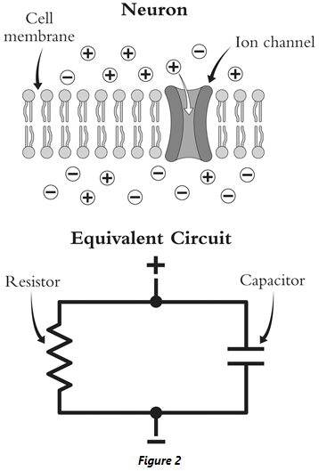
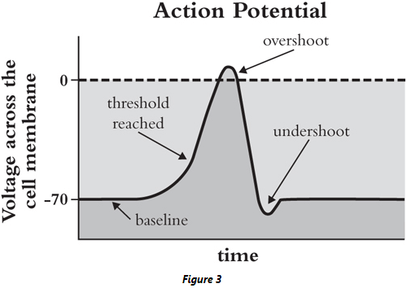
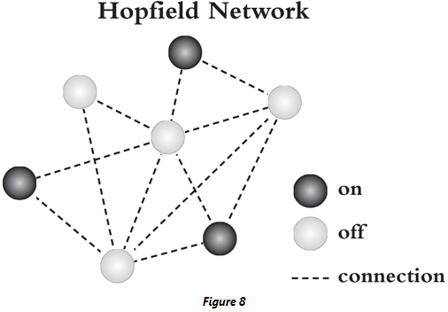
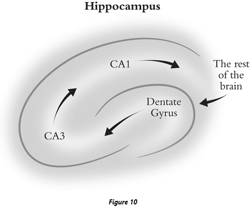
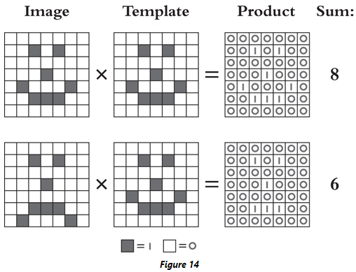
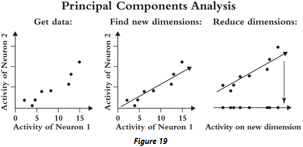

## Chapter 1: Spherical Cows

- The spider Cyclosa octotuberculata tugs on the specific silk threads that had just detected prey, making them tighter and thus more sensitive to vibrations.
- This positive feedback loop, where prey make web threads tighter to better detect prey, is an example of how Cyclosa octotuberculata offloads some cognitive burden onto its environment.
- The interacting system of the spider and its web is smarter than the spider alone, and this outsourcing of intelligence is known as ‘extended cognition’.
- For humans, mathematics is a form of extended cognition.
- E.g. Writing down relationships in the form of equations offloads our knowledge of the relationship to symbols on a page.
- Some scientific subjects, such as physics, have developed to capitalize on the power of mathematics to describe the natural world in precise and efficient detail.
- When communicating through mathematics, assumptions are explicit and ambiguities have nowhere to hide.
- Thus, equations force clear and coherent thinking.
- The beauty of mathematics lies in its ability to be both specific and general.
- E.g. The equations describing movement applies to both cars and planets.
- When an analogy exists between underlying mechanisms, equations serve as the embodiment of that analogy.
- Biology, specifically neuroscience, has been slower to embrace mathematics compared to other fields.
- Simplifying a problem is what opens it up to mathematical analysis, which also means that some biological details get lost in the translation from data to equations.
- E.g. A farmer approaches a physicist with a problem related to cows. The physicist goes “let’s start by assuming that cows are spherical…”.
- Some situations are just too complex to just “think them through” and to make progress, we must define our terms precisely and state their relationships exactly.
- E.g. If a forest has foxes that eat rabbits, and rabbits that eat grass, then how does the population of foxes and rabbits change over time?
- Mathematical models are a way to describe a theory about how a system works precisely enough to communicate it to others and to predict the outcome of future experiments.
- The human brain is a prime example of a biological object too complex to be understood without mathematics.
- The brain is responsible for how we feel, how we think, how we move, and who we are.
- The art of mathematical modelling is in deciding which details matter and which details don’t.
- E.g. A map the size of the city has no good use.
- This book charts the influence of mathematical thinking, borrowed from physics, engineering, statistics, and computer science, on the study of the brain.
- The brain will not be understood through words alone.

## Chapter 2: How Neurons Get Their Spike

- Review of Johannes Muller’s work and how he was wrong.
- Muller was wrong because life doesn’t rely on a vital organizing force and that nerves do use electricity.
- Electricity is the ink in which the neural code is written.
- The equations used to capture the essential behavior of wires, batteries, and circuits, now offered a language to describe the nervous system.
- Review of the Leyden jar, an early implementation of a capacitor.
- Capacitor: a device that stores charge.
- Review of Luigi Galvani’s experiment on electrically shocking frog legs, showing the link between electricity and biology.
- There had always been some hints that life was making use of electricity.
- E.g. Fishermen hunting for electrical fish would be numbed during the hunt.
- Review of Du Bois-Reymond and Julius Bernstein’s work showing evidence of the first action potential in the nervous system.
- Action potential (AP): a characteristic pattern of changes in the electrical properties of a cell.
- APs travel across a cell’s membrane like a wave and helps cells carry a signal from one end of itself to another.
- E.g. In the heart, APs are used to help coordinate muscle contraction.
- The AP is now recognized as the core unit of communication in the nervous system.
- However, back in Bernstein’s days, the job of describing the physical properties of the AP was far from done.
- It would take roughly another one hundred years to capture the essence of APs in equations.
- Review of Georg Ohm’s life and work.
- What’s the exact mathematical relationship between when stimulation is applied to a neuron and when a response is observed?
- Just as charged particles can build up on either side of the glass in a Leyden jar, so too can they build up on the inside and outside of a neuron.
- Thus, neurons can be modeled as a capacitor.
- However, membranes don’t act as perfect capacitors because they leak out some charge. This  leakage can be modeled as a resistor.
- Combining both the capacitor and resistor, we get a basic equivalent circuit for the neuron.

- This analogy between cell and circuit made it possible for Lapicque to write down an equation for how the voltage across the cell membrane should change over time.
- A mathematical model of a nerve impulse needs to have the same moving parts as the nerve itself, where each variable maps to and mirrors real physical entities and interactions.
- This is exactly what Lapicque’s equivalent circuit provided.
- Review of Edgar Adrian’s all-or-nothing principle, which states that a neuron either sends an AP or doesn’t, there’s nothing in-between regardless of the stimulation’s strength.
- What stronger stimulation does is to make the neuron send more of the same APs.
- Thus, the nervous system cares more about the quantity than the quality of APs.
- When Lapicque’s equations are combined with the all-or-nothing principle, we get the “leaky integrate-and-fire” neuron model.
- E.g. A neuron leaks current through it’s membrane, it integrates current as a capacitor, and fires an AP when the voltage reaches the threshold.
- Lapicque’s model could predict when a neuron would fire, but it didn’t explain what exactly an action potential was.
- The leading explanation at the time by Bernstein was that the cell membrane temporarily breaks down, letting ions of different kinds flow through which erases the charge difference that’s normally there.
- However, Hodgkin and Huxley recorded the AP from the squid axon and found that the voltage didn’t just go to zero, but overshot into the positive voltage range.

- This overshoot wouldn’t happen if ions were simply diffusing through the membrane, suggesting that something more selective was happening.
- By removing a certain type of ion from the neuron’s environment, Hodgkin and Huxley could tease out which parts of the AP relied on which kinds of ions.
- E.g. A neuron in a bath with less sodium had less of an overshoot, whereas extra potassium in the bath had less of an undershoot.
- These manipulations lead to the development of an AP model in the form of an equivalent circuit with corresponding equations.
- Hodgkin’s and Huxley’s equivalent circuit was more complex than Lapicque’s as it aimed to not just explain when an AP happens, but to also explain the full shape of the AP.
- The main difference between the circuits is the resistance component.
- Hodgkin and Huxley added two more resistors in parallel, one to model the flow of sodium ions and one to model the flow of potassium ions.
- This separation of resistors implies that different channels in the cell membrane were selectively allowing different ions to pass.
- E.g. Something in the cell membrane was selectively allowing sodium ions to move but not potassium ions.
- Another change was that the resistor’s resistance wasn’t fixed but instead depended on the voltage across the capacitor.
- E.g. By opening or closing more or less ion channels as the membrane voltage changes, the resistance to each ion changes.
- Thus, the cell membrane is dynamic and reactive to the population of ions on either side of itself, using the voltage as a general population measure and as a determinant in which ions get to enter and exit the cell.
- To test the model, Hodgkin and Huxley injected fake current into the model and computed the resulting cell membrane potential.
- When the calculation were complete, the Hodgkin-Huxley model displayed a complex dance of changing voltage and resistances.
- Review of ion movement during an AP such as sodium ion in, overshoot, potassium ion out, undershoot, and recovery.
- The neuron combines simple parts in simple ways to create a splendid and intricate display.
- A neuron casts its dendritic net out to nearby cells to collect inputs from them.
- Building off the analogy of the cell membrane as an electrical circuit, Wilfrid Rall modeled dendrites as cables.
- Rall explored how electrical activity at the far end of a dendrite can make its way to the cell body and vice versa.
- One important ability of dendrites that Rall discovered was for detecting order.
- In Rall’s simulations, the order that a dendrite gets input has important consequences for the cell’s response.
- E.g. If far away inputs fired first, followed by inputs closer to the cell body firing later, this can cause a neuron to fire. However, the reverse order doesn’t work.
- Similar to a running race, if we try to get the dendritic signals to sync up, the farther signals need a head start.
- This work shows how even the smallest details of biology have a purpose, such as the distance from dendrite to cell body.
- This detail gives neurons the ability to identify sequences.
- It was Lapicque’s analogy that started the study of nerves as an electrical device.

## Chapter 3: Learning to Compute

- Review of Warren McCulloch’s and Walter Pitts’s work.
- During McCulloch’s and Pitts’s time, there was a wall between the psychiatrists studying the mind and the biologists studying the body.
- Few researchers on either side would glance over the wall at the other. Each side spoke separate languages and worked towards different goals.
- For most researchers, the question of how the brain creates the mind was not just unanswered, it was unasked.
- McCulloch was different in that he thought of the brain as a computing device, linking the brain to the rules of logic.
- McCulloch and Pitts explored how the biological details of neurons, such as whether they fire an AP or not, is similar to true/false in logic.
- E.g. One neuron fires if the animal looks like a duck, another neuron fires if the animal quacks like a duck. A third neuron combining both outputs fires if a duck is present.
- These networks representing real neurons became known as artificial neural networks (ANNs).
- McCulloch knew that neurons were much more complex than modeled in ANNs, but he intentionally highlighted the functions he thought were important for the model.
- Model-building is an art; it’s a subjective-creative process of choosing which facts belong and which facts don’t.
- In the years to follow, McCulloch would organize meetings between biologists and technologists such as Norbert Wiener and John von Neumann, creating the field of artificial intelligence.
- Review of Frank Rosenblatt and the perceptron.
- The perceptron was another model of neurons that could be connected together to form an ANN.
- However, the perceptron differs from the McCulloch-Pitts neuron model in that it can learn.
- McCulloch and Pitts specify that the connections between neurons are determined by the logical function carried out by the network; there’s no learning.
- In contrast, for the perceptron to learn, it must modify its connections, specifically the weights associated with those connections.
- The perceptron engages in supervised learning because it requires pairs of inputs and outputs.
- Differences between the network’s output and the desired output are used to change the connection weights, thus improving the network’s performance.
- E.g. If the output is ‘off’ when it should be ‘on’, the ‘on’ connection weights are increased. If the output is ‘on’ when it should be ‘off’, the ‘on’ connection weights are decreased.
- By updating the connection weights, the network will gradually provide the correct output and the weights will stop changing.
- This learning algorithm was the most remarkable part of the perceptron as it meant that rather than programming a computer on exactly how to solve a problem, you would only need to show it some examples of that problem solved.
- This also meant, however, that the network wasn’t restricted to the logical operators that McCulloch and Pitts identified nor did the network’s output have to be limited to binary.
- This makes the system more flexible but harder to interpret.
- Researchers explored the workings of perceptrons mathematically using pen and paper, physically by building their own perceptron machines, and electronically by simulating them on digital computers.
- The study of the perceptron and how it related to the brain became known as ‘connectionism’.
- Review of the cerebellum, which has a role in motor control such as maintaining balance, coordination, and reflexes.
- Disrupting the cerebellum impairs the eye-blink reflex in rabbits.
- Eye-blink reflex: when the eye blinks in response to strong stimulation such as sunlight or an air puff.
- The learning of the eye-blink reflex in the cerebellum mirrors the perceptron learning rule.
- Review of ‘Perceptrons’, a book written by Marvin Minsky and Seymour Papert that used mathematical proofs to study the limits of perceptrons.
- E.g. Perceptrons can’t solve the XOR task.
- If we add an intermediate layer between the input and output perceptrons, we can solve the XOR task.
- However, these multi-layer perceptron networks need a new learning rule.
- Review of the backpropagation algorithm and deep neural networks.
- The backpropagation algorithm isn’t a model for how the brain learns because real neurons only know the activity of the neurons they’re connected to, and not the activity of neurons downstream or upstream of those connections.

## Chapter 4: Making and Maintaining Memories

- How do neurons make and maintain memories?
- John Hopfield, inspired by the way heat aligns iron atoms in a block of iron to form a magnet, created the Hopfield network.
- Review of Richard Semon’s idea of an engram, Karl Lashley’s ‘In search of the engram’ paper, and Donald Hebb’s work.
- Hebbian learning: neurons that fire together wire together.
- With Hebbian learning, activity determines connectivity and connectivity determines activity.
- It also makes memory the natural consequence of experience as activation of the brain has the potential to leave a trace on the changeable synapses.
- The change in behavior was forged through a change of connections.
- Hopfield network: a mathematical model of neurons that can implement ‘content-addressable memory’ or a memory that can be retrieved from just a small part of it.

- The Hopfield network is recurrent so each neuron’s activity serves as both input and output to any of the neurons in the network.
- Hopfield found that if the weights between neurons in the network are just right, the network can implement associative memory.
- E.g. Imagine each neuron represents an object in a room such as a bike, a chair, and an elephant. To represent a memory, the neurons that represent all the objects in that room should be ‘on’ while the the neurons that represent all of the objects not in that room should be ‘off’.
- In associative memory, a small input to the network reactivates an entire memory state.
- If we think of memory in terms of dynamical systems, then an associative memory is an example of an attractor, a popular pattern of activity.
- The Hopfield network can sustain multiple attractors and thus multiple memories.
- Hopfield networks match our intuition about memory.
- E.g. The time it takes to retrieve a memory is the time it takes for the network to activate the right neurons. Attractors can slightly move, consistent with a memory that’s slightly distorted.
- Thus, the network represents how memories are stored. But how are memories formed in the first place? How are the connections in the Hopfield network determined?
- We can use Hebbian learning to encode a set of memories.
- E.g. For every experience, if two neurons are both active/inactive then the connection between them is strengthened/weakened.
- Neurons that are commonly co-active in memories will have a strong positive connection and those that have opposite activity patterns will have strong negative connections.
- One issue with the biological realism of Hopfield networks is that the connection weights are assumed to be symmetric.
- E.g. The weight from node A to B is the same as from node B to A.
- Another limitation is that Hopfield networks implement memory recall and not memory recognition.
- The ability to generate a memory from scratch, memory recall, is much harder than a feeling of familiarity when seeing a memory, memory recognition.
- Review of patient H.M. and his memory deficits.
- Current theories of hippocampal function
    - Information about the world first goes to the dentate gyrus where the representation is primed and prepped to be stored.
    - From the dentate gyrus, the representation is sent to CA3 where attractors are believed to form since CA3 has extensive recurrent connections, making it a possible substrate for Hopfield networks.
    - CA3 sends it output to CA1, which acts as a relay station to the rest of the brain.

- CA3 acts like a buffer or warehouse, storing memories until they’re copied to other brain areas.
- We believe it does this by reactivating the memory in those areas and by repeatedly reactivating the same group of neurons, the hippocampus uses Hebbian learning to store the memory.
- With his hippocampus gone, H.M. had no buffer for his experiences and thus no way to replay his memories back to his brain.
- Where are working memories stored in the brain and in what way?
- Lesion experiments hint at the prefrontal cortex for being responsible as damage to it substantially reduced working memory.
- Using delayed response tasks where an image is displayed, removed, and then displayed again, we can test what the prefrontal cortex is doing during the delay.
- Most brain areas responsible for vision have a stereotyped response to the delayed response task with strong activity when the image is displayed and when it reappears after the delay.
- But during the delay period, when no visual inputs enter the brain, these areas are mostly quiet.
- Out of sight really does mean out of mind for these neurons.
- However, neurons in the prefrontal cortex don’t follow this pattern as they maintained their activity during the delay period, suggesting that this is the physical implementation of working memory.
- What’s special about these prefrontal cortex neurons? And how can they sustain their firing for seconds to minutes?
- For sustained output, neurons usually need sustained input. But since the image is removed during the delay period, the input may come from neighbouring neurons.
- Delay activity can be generated by a network of neurons working together, keeping the hot potato from dropping.
- If the connections between neurons are just right, all neurons in a network can maintain their firing rate because all neurons around them are doing the same.
- Viewing working memory like this is similar to a seizure since both are self-sustaining activations of neurons.
- For working memory to function, the network needs to be good at resisting the influence of distractors such as other inputs competing for attention.
- In contrast to the discrete attractors in a Hopfield network, ring networks implement continuous attractors so transitioning between similar memories is easy.
- However, ring networks are too perfect and make many specific assumptions that just don’t seem realistic. So while they have desirable theoretical properties and useful abilities, they probably aren’t implemented in the brain.

## Chapter 5: Excitation and Inhibition

- Within every neuron, a struggle is waged over the ultimate output of the neuron, a struggle between excitation and inhibition.
- Excitatory inputs push a neuron’s membrane potential closer to the threshold, while inhibitory inputs pull the potential away from the threshold.
- The balance between these two forces emerges as rhythms or, surprisingly, as noise.
- If we record from the same neuron while the animal performs the same task, we find that its activity is surprisingly irregular.
- E.g. Sometimes the neuron fires more or less spikes on different trials.
- Decades of research and thousands of papers have led us to the conclusion that the nervous system is messy and noisy.
- Inputs to a neuron only seem to influence its activity, but not control it; there’s always a factor of surprise.
- Why are neurons noisy?
- One possible answer is that noise lets neurons explore more neural states and thus explore the environment.
- Another answer is that input to the nervous system may be unreliable, reflected in the unreliability of neuronal firing.
- Another possibility is that the components constituting a neuron are inherently noisy.
- Neurons can reduce their noisy input by taking a longer time to decide whether to spike, thus averaging out the noise.
- Neurons average over a time window of about 20 milliseconds, which is long enough for a neuron to reduce the noise in its input.
- The conundrum is that even though neurons should reduce the noise in the signal over chains of neurons, we still find noise everywhere in the brain.
- What keeps the noise alive?
- Whether a neurotransmitter is excitatory or inhibitory depends on the receptor on the target neuron.
- E.g. One GABA receptor type only lets chloride ions into the cell, and chloride ions have a negative charge so this makes it more difficult for the neuron to reach the AP threshold.
- When a mathematical model of a neuron was fed both excitatory and inhibitory inputs, the neuron’s output was noisy because the two inputs competed.
- A balance between excitation and inhibition creates havoc in a neuron and explains some of the variability of the brain.
- This balance might also help networks of neurons respond quickly to inputs.
- Review of Edward Lorenz’s work on meteorology and chaos theory.
- Review of epilepsy and EEG.
- A seizure is the opposite of randomness: it’s perfect order and predictability.
- Problems with brain oscillations
    - How they’re measured.
        - Oscillations use an indirect measure that comes from the extracellular fluid around neurons, but the relationship between ion flow in this fluid and the real activity of neurons is complicated and not completely understood.
        - This makes it hard to know if the observed oscillations are actually happening in neurons.
    - Tools to measure.
        - EEG makes it easy to spot oscillations, but this also means that they’re more studied.
        - E.g. When a hammer is the easiest tool you have, you start looking for nails.
    - Impact.
        - Given the temporal precision required for oscillations, do they really matter?
        - Oscillations may be the by-product of computation and don’t have any significance.

## Chapter 6: Stages of Sight

- Vision is an immensely hard and complex problem.
- The process of taking light through our eyes and making sense of the external world reflected in it is vision.
- Any feeling of ease we have about vision is an illusion, one that was hard won through millions of years of evolution.
- The problem of vision is one of reverse engineering.
- Review of the retina, photoreceptors, and ganglion cells.
- Template matching: using a set visual pattern to recognize and search images.
- With template matching, we just need to define what we’re looking for and multiplication will tell us if it’s a match.

- However, template matching is inefficient at scale because we have to match each template individually. A more efficient approach is to take common elements from all templates and to check for those elements.
- E.g. A template for the letter “A” and a template for the letter “H” both require a horizontal bar.
- Three types of templates
    - Computational: templates that match an image and describe basic shapes and lines.
    - Cognitive: templates that match computational templates and describe letters.
    - Decision: templates that match cognitive templates and describe which letter is present.
- This entire model consisting of the three template types was called “Pandemonium” by Oliver Selfridge.
- Issues with template matching
    - The number of templates needed grows with the number of objects you want to recognize.
    - The number of calculations is immense since every image needs to be compared to every filter, thus it grows combinatorically.
    - Templates need to match the image exactly.
- These issues make designing templates very hard for any but the simplest of patterns.
- We can reduce some of these challenges by distributing the computation in a hierarchical manner, which is what Pandemonium does.
- These properties also make the system more flexible and adaptable as new objects can be built from low-level features without having to add new templates from scratch every time.
- How does a computational template know what visual feature to match to? And how does a cognitive template know which computational templates to use?
- Selfridge proposed that the system learns through trial and error, but this process takes a long time and isn’t guaranteed to work.
- Jerome Lettvin, using the frog eye, found evidence for a Pandemonium-type system in the retina, which supports the idea that low-level features are specific to the type of objects the system needs to detect.
- Review of David Hubel and Torsten Wiesel’s work on the cat visual system and how they discovered edge-detector and orientation-selective cells in the primary visual cortex.
- The discovery of complex cells provided an additional piece of the puzzle on how points of light become perception.
- Review of signal filters and convolution, the process of sliding a filter across the whole image.
- Kunihiko Fukushima used the findings from Hubel and Wiesel’s work to build the first convolutional model of the visual system called “Neocognitron”.
- Neocognitron updated its connections in a Hebbian fashion.
- Review of Yann LeCun’s work on recognizing handwriting on cheques using convolutional neural networks.
- Instead of the Hebbian learning used in Neocognitron, LeCun used the backpropagation algorithm to adjust the connection weights.
- Review of Alex Krizhevsky, Illya Sutskever, and Geoffrey Hinton’s 2012 work on using convolutional neural networks to win a major image-recognition challenge (ImageNet).

## Chapter 7: Cracking the Neural Code

- The brain is the organ that processes information.
- How does the nervous system represent information?
- Action potentials don’t change based on the signal they’re conveying, but the frequency of action potentials changes.
- The size of the action potential doesn’t carry information, at least for muscles.
- Review of Claude Shannon’s work on information theory.
- The components of Shannon’s information-sending model are abstracted away from its physical implementation.
- This is possible because the fundamental problem of communication remains the same, the problem of ‘reproducing at one point either exactly or approximately a message selected at another point’.
- Code: a transmittable set of symbols that conveys meaning.
- A code requires options/possibilities to be meaningful.
- The rarer a symbol is used, the more information is has. Common symbols can’t communicate much.
- Shannon captured this relationship between a symbol’s use and its information content by using probability.
- E.g. The amount of information decreases as the probability of the symbol increases and vice versa.
- Information is measured using the unit ‘bit’, which we can think of as the number of yes-no questions we need to ask to get an answer.
- E.g. If a signal contains 10 bits, we need 10 yes-no questions to get an answer.
- How do we maximize the information content of a message?
- We must use each symbol an equal amount.
- E.g. For five symbols, use each symbol one-fifth of the time. For one hundred symbols, use each one-hundredth of the time.
- Making each and every symbol equally likely balances the trade-off between rare and common communication.
- The more symbols a code has, the better because it can encode more information.
- One of the challenges in applying information theory to the nervous system comes from different beliefs on what parts of the nervous system map to the formal components of Shannon’s information theory.
- E.g. What is the nervous system’s symbol? What is the neural code?
- Instead of using only two symbols: spike or no spike, MacKay and McCulloch realized that using the time between spikes as the code allowed neurons to transmit much more information. This is now called temporal-based coding.
- Stein used a different approach, believing that the number and frequency of spikes is the code. This is now called rate-based coding.
- Neuroscientists continue to argue over the neural code to this day and the goal of identifying the neural code seems to grow more distant.
- Review of Lloyd Jeffress’s sound localization model that transforms a temporal code into a spatial code.
- As for why the neural code is such an enigma, the most likely answer is because it’s complicated.
- Some neurons in some brain areas may use a rate-based code, and other neurons in other areas may use a temporal-based code.
- The brain, it seems, speaks too many different languages.
- Regardless of the neural code, one strong guiding principle has been the efficient coding hypothesis: the idea that the nervous system always encodes information efficiently.
- Horace Barlow believed efficient brains reduce their redundancy to reduce the waste of resources such as energy.
- In the nervous system, redundancy can come from multiple neurons saying the same thing.
- How does the brain know if the information it’s receiving is redundant?
- Adaptation: when a sensory neurons reduces its firing rate to a constant stimulus.
- E.g. If you stare at something that’s constantly moving, like a waterfall, and then look away, stationary objects appear to be moving in the opposite direction.
- The effect is believed to come from the adaptation of neurons that represent the original motion direction. These cells are silenced by adaptation, leaving the cells representing the opposite direction to be active.
- If the same symbol is sent over and over, its presence no longer carries information.
- Adaptation ensures that all types of information are encoded efficiently.
- One issue with applying information theory to the brain is what aspect implements the decoder.
- E.g. If an action potential is a signal from a sensory receptor, who is the receiver?
- Just because scientists can spot a signal in the spikes doesn’t mean it has meaning to the brain.
- We must remember that the brain is an information-processing organ and not just a relay that reproduces messages.
- The brain transforms signals into actions for the animal.
- The finding that the brain isn’t optimally transmitting information doesn’t necessarily mean a flaw in its design, but that it was just designed for something else.
- As a metaphor, the relationship between a communication system and the brain is most fruitful when it isn’t overextended.

## Chapter 8: Movement in Low Dimensions

- Since its discovery, the motor cortex has found itself at the centre of many controversies.
- It’s undisputed that the brain controls the body, but as for how is another question.
- There are many channels that the cortex can use to communicate with muscles and many possible messages that can be sent.
- The need for the motor cortex has been called into question as some behaviors exist without a cortex.
- E.g. Decorticated cats will claw and strike if restrained and decorticated male rats still manage to copulate if a female is around.
- So, for some of the most important behaviors for survival, the motor cortex seems extra.
- Review of Gustav Fritsch and Eduard Hitzig’s experiments on electrically stimulating the cortex of dogs.
- Stimulating the cortex can produce movements.
- E.g. Short twitches or spasms of small muscle groups on the opposite side of the body.
- The location of the stimulation mattered as it determined which body part would move.
- After mapping out which areas of the brain were linked to specific areas of the body, Fritsch and Hitzig would cut out and observe the adverse effects this had on movement.
- In general, such lesions didn’t cause complete paralysis of the affected body part but it did significantly impair its control and function.
- Review of David Ferrier’s work on the motor cortex in other animals such as jackals, cats, rabbits, rats, fish, and frogs.
- When Ferrier stimulated the motor cortex for longer intervals, animals displayed full, complex movements similar to natural movements.
- E.g. A cat that looks like it’s playing with a ball, a monkey that looks surprised.
- That such a blunt stimulation of the motor cortex elicits smooth and coordinated movements points to a different understanding of this brain region from Fritsch and Hitzig’s.
- Ferrier’s findings are analogous to a musical melody versus Fritsch and Hitzig’s musical notes.
- This debate, between notes versus melodies, between twitches versus movements, would be the first of many debates over the function of the motor cortex.
- The larger neuroscience community was debating the local versus distributed nature of functions in the brain.
- In the brain, it doesn’t get more local than a single neuron.
- What aspects of movement do neurons in the motor cortex represent?
- Edward Evarts trained monkeys to move a vertical rod left or right using only the wrist.
- One hypothesis is that the firing rates of neurons in the motor cortex are directly related to the position of the wrist at any given moment.
- E.g. One set of neurons fires strongly when the wrist is flexed to the left and another set of neurons fires strongly when the wrist is flexed to the right.
- However, this experiment confounds wrist position and wrist force. To separate these two components, we can add a weight to the rod, thereby increasing force but leaving position unchanged.
- Evarts saw that 26 out of the 31 motor cortex neurons that he was recording from were clearly related to force.
- These results made a strong case for the argument that the motor cortex encodes force.
- Review of Apostolos Georgopoulos’s work and population coding.
- Georgopoulos changed Evarts’s perspective from asking what neurons were saying about muscles, to what they were saying about movement.
- He found that more than a third of the neurons in the motor cortex showed a clear and simple relationship between neural activity and the direction the arm was moving.
- In essence, these neurons had a preferred direction.
- This finding of ‘direction tuning’ implied that the motor cortex cared more about kinematics than kinetics, which would become the next big debate in motor neuroscience.
- Kinematics: descriptive features of motion that indicate the desired outcome of a movement, but not instructions for how to create them.
- This shifts the role of the motor cortex up the hierarchy as kinematics is further removed from the level of muscle compared to kinetics.
- Georgopoulos became an adamant defender of the kinematics perspective of the motor cortex in the decades to come.
- Using the direction tuning from multiple neurons, Georgopoulos calculated a ‘population vector’ that points in the direction of movement that the neural population encodes.
- Population vector: a weighted average of all direction tuned neurons where the weight is how strong that direction-neuron is firing.
- By calculating the population vector, Georgopoulos could accurately read out the direction an animal’s arm was moving.
- However, several later studies showed how other information could be determined from the population, thereby weakening Georgopoulos’s theory that kinematics is special.
- Perhaps there is no single value that neurons in the motor cortex code for; neither kinematics nor kinetics.
- The debate over ‘what does the motor cortex encode?’ was unresolved not because the question is hard, but because it was the wrong one to ask from the beginning.
- The motor system doesn’t need to track movement parameters, it just needs to produce movements.
- Just because we see structure in neural activity doesn’t mean the brain is using it.
- Review of Cathy Hutchinson’s story and her use of BrainGate’s brain-machine interface to bring a coffee cup towards her.
- We can think of a high-dimensional ‘neural space’ where each neuron is a dimension and neural activity encodes coordinates in that neural space.
- A different pattern of neural activity would point to a different location in neural space.
- We can ask if different locations in this neural space match to different types of movements.
- Review of dimensionality reduction and PCA.

- Dimensions with high variance are important because they can be informative. A value that changes has more information compared to a stable value.
- E.g. A person that’s sometimes sad and sometimes happy is easier to read than a stoic who always has the same facial expression.
- The dynamical systems view of the motor cortex has the potential to explain why previous attempts to explain the motor have been so confounded.
- Despite being one of the earliest areas of cortex explored and one of the first to have single neuron activity recorded during behavior, the motor cortex still remains deeply and stubbornly mysterious.

## Chapter 9: From Structure to Function

- Review of Santiago Ramon y Cajal’s work.
- Cajal’s portraits of neurons represent the structure of the nervous system and its basic unit: the neuron.
- Function, Cajal believed, could be found in structure. And he was right.
- Cajal was able to infer important facts about the workings of the nervous system by looking at how it was built.
- One of his significant findings was on how signals flow through neurons.
- E.g. Cajal noticed that cells were always arranged in a certain way, as the dendrites of a cell would face the direction the signal was coming from and the axon went towards the brain.
- This pattern strongly suggested that signals flow from dendrites to axons.
- Structure exists at many scales in the brain.
- Graph theory offers a way to talk about neural networks that abstract away from the many biological details.
- Review of graphs, which are composed of nodes and edges.
- Nodes are the base unit of the graph and edges represent connections between them.
- The strength of graph theory comes from stripping away details to find the common underlying structure.
- The structure of the brain maps well onto a graph as neurons are nodes and the connections between neurons are edges.
- To understand how structure results in function, we first need the ability to describe structure.
- Graph theory provides a language to describe structure.
- Review of small world networks (graphs with short average path lengths).
- One way to achieve a small world network is to have all nodes heavily interconnected. Another way is to cluster the nodes and have sparse connections between them.
- The brain was found to be a small world network with high clustering and long-distance connections.
- The biggest reason for the small world network may be energy costs. A small world network is efficient because it doesn’t require many neurons to achieve a short average path length.
- Connectome: a graph describing the connections in a brain.
- The lack of connectomic data is mostly due to the gruelling process to collect it.
- Hub: nodes that are highly connected and have a high degree.
- The human brain has hubs sprinkled throughout.
- E.g. The cingulate and precuneus are hubs, while the visual cortex and auditory cortex aren’t.
- Hub regions are complex because they gather information from multiple sources and distribute it out far.
- The development of hub neurons suggests their importance as they’re often the first neurons to be born.
- Review of Danielle Bassett’s work on network neuroscience and brain dysfunction.
- An adult brain has far fewer neurons than when it was in the womb as half of the neurons produced during development die.
- The number of connections made by a cortical neuron peaks around the first year of life and reduces by the third year.
- The brain is thus built by a surge and retreat of neurons and connections.
- During development, the pruning of neurons and synapses is ruthless; only the useful survive.
- E.g. Synapses are built to carry signals between neurons and if no signal flows, the synapse must go.
- It’s analogous to letting a bush grow for the purpose of carving art out of it.
- This approach of overbuilding capacity and then trimming the fat runs counter to how a graph theorist might approach building a network.
- E.g. A public transit designer wouldn’t build a bunch of train stations and bus stops and remove the unused stops. Instead, the designer would build from the bottom up by carefully adding stops as needed. The network gets more efficient by adding well-placed edges and nodes.
- The brain, in contrast, doesn’t have a designer which explains why the brain needs to overproduce and prune.
- The only way the brain can make decisions about which connections should exist is by calculating the activity that passes through those connections.
- If the connection doesn’t exist, the activity on it can’t be measured.
- A decreased pruning rate, as seen in the brain, enables the brain to quickly eliminate useless connections while still allowing the network enough time to fine-tune the remaining structure.
- E.g. Like a marble sculptor, the gross details are quickly cut out and the fine details are slowly cut out.
- Review of Eve Marder work on the lobster ganglion circuit for digestion.
- Neuromodulators: chemicals that fiddle with the settings of a neural circuit.
- The massive effort to get a connectome depends on the assumption that the structure-function relationship is true. However, neuromodulators can change a network’s function without affecting its structure.
- If neuromodulators can release the activity of neurons in a circuit from the strict constraints of their architecture, then structure isn’t destiny.
- Another important finding from Marder’s work is that different structures can produce the same behaviors.
- E.g. By simulating as many as 20 million possible ganglion circuits, Marder’s lab found that the vast majority aren’t capable of producing the desired rhythms, but certain configurations are.
- The important point is that diversity doesn’t always mean difference, so diverse structures could create the same function, adding another wrinkle to the structure-function relationship.
- However, Marder’s work also highlights the need for the connectome as her work was built atop it.
- Without the detailed structural information, there’s no structure-function relationship to be explored.
- “No circuit can be fully understood without a connectivity diagram. A connectivity diagram is only a necessary beginning, but not in itself, an answer.” - Eve Marder
- Knowing the structure of the nervous system is necessary but not sufficient.

## Chapter 10: Making Rational Decisions

- Review of Hermann von Helmholtz’s work on trichromatic theory.
- Helmholtz concluded that a large amount of processing must go on between when sensory information comes in and when it becomes a conscious experience.
- Unconscious inference: how real objects are inferred by their effect on the sense organs.
- He proposed that unconscious inference proceeded by interpreting the current sensory input in the context of pre-existing knowledge about the world.
- Review of chance, probability, conditional probability, inverse probability, and Bayes’ rule.
- To determine the cause of any effect, one must first know the likely effects of each cause.
- John Anderson formally debuted a Bayesian approach to psychology called ‘rational analysis’.
- E.g. The probability of a memory being useful in a particular situation is found by combining: how likely you find yourself in that situation if that memory were useful, and a prior that assumes newer memories are more likely useful.
- If we find ourselves in a world that deviates from the one we’ve evolved and developed in, our priors can be misleading.
- E.g. The phrase ‘when you hear hooves, think of horses and not zebras’ is only good advice in a world with more horses than zebras.
- Incoming sensory information combines with a rich set of background knowledge before perception is complete.
- Just as a rumor transforms into a fact as you hear it from many different people, in Bayes’ rule, getting the same information from multiple senses strengthens the belief in that information.
- As with rumors, the reliability of the sensory information source also matter.
- E.g. The vestibular organs are more reliable than vision for balance.
- Bayes’ rule naturally balances how much to rely on a source based on how reliable it is.
- For the most part, humans behave as good Bayesians.
- Not all psychologists believe that the brain is Bayesian though.
- To some, a theory that explains everything is at risk of explaining nothing.
- Another issue with Bayesian models is that they have too many free parameters, meaning any model can fit any data.
- A model that can fit anything can never be wrong.
- Then there are issues with priors.
- E.g. If one model assumes the prior that motion is slow, while another model assumes the prior that motion is fast, which one is true?
- E.g. Where do priors come from?
- Lastly, how is Bayes’ rule implemented in the brain? While there are reasons to believe that the brain should use Bayes’ rule, and there’s evidence that it does, how do neurons encode the rule?

## Chapter 11: How Rewards Guide Actions

- Review of Pavlov’s work and classical conditioning.
- Classical conditioning: repeatedly pairing an upcoming reward with a cue that’s unrelated until the two become linked.
- Pavlov’s work fed into one of the biggest movements in 20th century science: behaviorism.
- When any scientific field amasses enough quantitative data, it eventually turns to mathematical modeling to make sense of it.
- In the 1950, there was enough data on learning to support models that predict behavior.
- Review of reinforcement learning.
- Reinforcement learning (RL): explains how complex behavior emerges when simple rewards and punishments are the only learning signals.
- In RL, learning depends on what’s already learned.
- E.g. It’s easier for dogs to learn to salivate at the sound of a buzzer if they haven’t experienced the buzzer before.
- The opposite of RL is extinction when the cue is repeatedly presented without the following reward.
- Review of Richard Bellman’s work on sequential decision processes.
- States define what actions are available and actions determine what the next states are.
- Eventually, Bellman’s work would become ‘dynamic programming’.
- An interesting feature of conditioning experiments is ‘blocking’.
- Blocking: when two cues are simultaneously paired with a reward, one cue will block the ability of the other cue to be associated with the reward.
- Blocking is counterintuitive because we would expect that both cues would become associated with the reward.
- Learning is driven by errors.
- Review of Richard Sutton’s and Andrew Barto’s work on RL.
- Temporal difference learning: beliefs are updated in response to any violation of expectations.
- It isn’t receiving the reward that causes any changes/learning, but the expectation of reward that causes changes.
- What temporal difference learning helps you learn is a value function.
- Errors induce learning and if the value of the current state is more or less than we expected it to be when we were in the previous state, we change the value of the previous state.
- We take the surprise that occurred now and use it to change our belief about the past.
- What Sutton’s algorithm shows is that by only exploring, only using trial and error, agents can eventually learn the correct value function for the state that they’re exploring.
- It just takes updating expectations when expectations change.
- Review of how dopamine signals reward prediction error.
- E.g. If an unexpected light predicts a reward, dopamine neurons fire strongly in the presence of the light and not for the reward.
- Review of David Marr’s three levels of explanation: computational, algorithmic, and implementational.

## Chapter 12: Grand Unified Theories of the Brain

- Grand unified theories (GUTs): theories that aim to unify many different and unrelated phenomena.
- Should GUTs of the brain be taken seriously?
- The notion that a small number of simple principles or equations will explain everything about the form and function of the brain is appealing for the same reasons GUTs are desirable in physics.
- However, most scientists who study the brain are doubtful that GUTs exist for the brain.
- Some scientists argue that the brain is a collection of diverse principles, each without an underlying principle.
- Searching for a GUT in the brain is a high risk-high-reward endeavour.
- Review of Karl Friston’s free energy principle.
- Free energy: a mathematical term for the differences between probability distributions, or the difference between the brain’s predictions about the world and the actual information it receives.
- The free energy principle says that everything the brain does can be understood as an attempt to minimize free energy; to make the brain’s predictions align with reality.
- Inspired by the free energy principle, many researchers are looking for where the brain’s predictions don’t align with reality and have called this approach ‘predictive coding’.
- What makes predictive coding unique is that it claims the backward pathway, the connections from latter brain areas to earlier ones, are used to carry predictions, calculate the prediction error, and update the forward pathway.
- The neurons that calculate the prediction error are a physical instantiation of free energy, and the free energy principle argues that the brain should aim to make these neurons fire as little as possible.
- Do such neurons exist? And does the brain try to reduce their firing?
- The evidence for predictive coding is mixed as not all studies find error neurons and even when they do, these neurons don’t always behave as predicted by the predictive coding hypothesis.
- Another way of minimizing free energy, of minimizing the difference between the brain’s prediction and experience, is to control experience.
- Organisms can choose actions that result in predictable sensory experiences.
- E.g. Always eating at the same restaurant because you know they’ll always serve good food.
- The free energy principle has been invoked to explain perception, action, learning, sleep, attention, schizophrenia, and addiction.
- This tendency to try to wrap complex topics into simple packages has been with Friston throughout his life.
- The confusion around the free energy principle likely comes from it not being falsifiable.
- The principle is more of a way of looking at the brain than a strong and specific claim about how it works.
- In this way, the principle is meant to offer a scaffolding to hold facts about the brain, but without being falsifiable, it’s status as a theory is questionable.
- Review of Jeff Hawkins’ work and his ‘Thousand Brains Theory of Intelligence’.
- Numenta, founded by Jeff Hawkins, has its main goal to reverse-engineer the brain.
- The centerpiece of the Thousand Brains Theory is the cortical column.
- Cortical column: cylinders of neurons running from the top of the neocortex to the bottom.
- Typically, all neurons in a column perform a similar function and only differ in the layer they live in.
- Both Mountcastle and Hawkins believe that the cortical column is the single idea that can unite all the diverse capabilities of the human mind.
- According to Hawkins, actively moving the body through space and getting dynamic streams of sensory data helps the brain build a deeper understanding of the world.
- Review of grid cells.
- Hawkins made grid cells an important part of his theory, but the problem is that grid cells aren’t found in the neocortex; they’re only found in the entorhinal cortex.
- To explain this, Hawkins argues that grid cells are hiding away in the sixth layer of every column in the neocortex.
- E.g. If you imagine putting your finger on a coffee cup and moving your finger, the grid cells in the finger brain region track the location of your fingertip.
- By combining information about where the finger is and what the cup feels like right there, the cortical column can learn the shape of the object as it’s explored.
- As cortical columns exist throughout the neocortex, this process could be happening in parallel everywhere, hence the thousands brains in the Thousand Brains Theory.
- If this process applies to physical space, Hawkins argues that they can also be applied to abstract space.
- E.g. The space of thought or language.
- However, some studies find that the size of columns, the number and type of neurons they have, and how they interact with each other, varies across the neocortex.
- If these columns are not as uniform and identical as the Thousand Brains Theory assumes, the hope for a universal algorithm of intelligence may be in vain.
- Mathematical models of the brain are usually built by first selecting a collection of facts that seem relevant, and then these facts are simplified and pieced together in a theory of how a bit of the brain could work.
- No theory of the brain is complete without explaining its biggest and most enduring mystery: consciousness.
- Review of integrated information theory (IIT).
- IIT is designed to measure consciousness in anything and the end result is a unified measure of ‘integrated information’ called phi.
- Phi indicates just how intermixed the information in a system is and the higher it is, the more conscious a system is.
- Calculating phi for an reasonably complex system is near impossible.
- GUTs are difficult, in part, because they must make simple and universal claims about an incredibly complex object.
- Almost any statement about the brain is guaranteed to have exceptions.
- The conundrum of GUTs are that if they’re too grand, they won’t explain specific data. However, if they’re too specific, then it’s no longer grand.
- GUTs of the brain, in trying to explain too much, risk explaining nothing at all.
- Why are GUTs easier to propose in physics compared to neuroscience?
- The simple difference might be evolution.
- Nervous systems evolved over eons to fit the needs of a series of specific animals in specific locations facing specific challenges.
- Biology took whatever route was necessary to create working organisms, regardless of how understandable any part of them would be.
- It should be no surprised, then, to find that the brain is a kludge, a collection of different components and mechanisms.
- There’s no guarantee that the brain can be described by simple laws.
- Review of the Semantic Pointer Architecture Unified Network (SPAUN).
- Models such as SPAUN and the Blue Brain Project capture many sources of data and use them to build an elaborate structure.
- In this way, they sacrifice interpretability for accuracy.
- Neuroscience isn’t physics and it must avoid playing the role of the kid sibling, trying to follow in the exact footsteps of its older discipline.
