## Preface

- The brain isn't an exception to the rules of evolution and biology.
- If our brain isn't an evolutionary outlier, then where does the human advantage lie?
- We are special because we hold the largest number of neurons in the cerebral cortex.
- No other animal has as many neurons in the cerebral cortex as we do.
- The human advantage lies in
  - Being primates lets us economically scale neurons in a small volume.
  - Cooking allows for a rapid increase in cortical neurons.
  - Owning the largest number of neurons in the cerebral cortex.
- The cerebral cortex is responsible for finding patterns, reasoning, developing technology, and more.
- We're neither special nor extraordinary in terms of evolution, but we're remarkable in terms of our cognitive abilities.
- Brain anatomy background
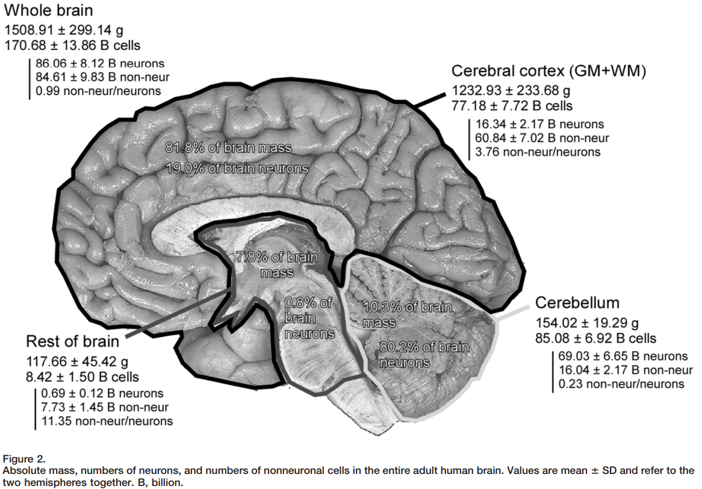

## Chapter 1: Humans Rule!

- The human advantage is the fact that we're the only species to study itself and others to generate knowledge that transcends what we’ve observed.
- We use tools to create other tools and science with technology to push the frontiers of what we know; to seek harder and harder problems.
- We believe that our extraordinary cognitive abilities requires an extraordinary brain.
- However, this isn't true; our brains aren't extraordinary.
- It’s assumed that the brains of existing vertebrates retained structures of those which preceded them.
- So studying recent brains should reveal the origin of the more recent structures from the older ones.
- The history and development of the brain parallels the history of rocks in that new layers build upon the previous layers; the cumulative development of evolution.
- The most recent layer of the human brain, the telencephalon, makes up almost 85% of our brain's mass.
- However, this layering idea is wrong as mammals didn't evolve from birds or reptiles; it just evolved along a different evolutionary path.
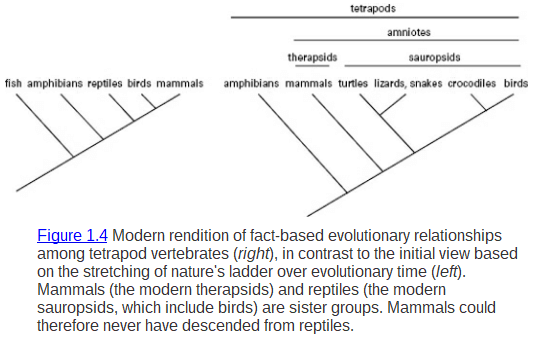
- Species don't always progress into more complex life-forms as they evolve.
- Evolution isn't progress but simply change over time.
- *Haller's rule*: that larger animals have larger brains.
- *Allometry*: that different body parts grow at different rate resulting in different body proportions.
- Allometric relationships always take the form of a power law: $$y=bx^{a}$$.
- An *a* of one means isometric growth aka the body part and body grow at the same rate.
- E.g. Heart
- An *a* greater than one means the body part grows faster than the body.
- E.g. Bones because scaling up a small animal doesn't work out due to the bones not being able to support the weight.
- An *a* less than one means the body part lags in growth behind the body.
- E.g. Brains.
- Knowing the allometric relationship for brains allows us to predict what the size of the brain should be for the given body mass.
- *Encephalization quotient (EQ)*: the ratio between the observed and predicted brain mass for an animal.
- Humans have the highest EQ at seven compared to other primates with an EQ of two.
- However, the problems with EQ are
  - Since allometric relationships are done by curve fitting, there must be some data points above average and some below average.
  - The circular assumption that EQ expressed intelligence wasn't founded on correlation with actual measures of cognition.
  - The assumption that all brains are made the same way and have the same neuronal density.
- The human brain is extraordinarily expensive in terms of energy.
- E.g. 25% energy consumption for 2% body mass compared to a mouse's brain of 8% energy consumption for 1% body mass.
- When human astrocytes were transplanted into a mouse brain, it learned faster.

## Chapter 2: Brain Soup

- The riding assumption in the 19th century was that the brains of different species were scaled-up or scaled-down variations of the same basic blueprint.
- However, just like the bones example, this isn't true.
- It's reasonable to suppose that the computational capacity of the brain is more limited by its number of neurons than its number of synapses.
- Two brains of similar size don't have similar cognitive abilities.
- E.g Chimpanzee and cow brains are similar in size yet exhibit different cognitive abilities.
- The estimates of 100 billion neurons and 10 times more glia cells is a myth.
- Our brain actually contains 86 billion neurons.
- The problem with counting neurons in the brain is that the brain is heterogeneous aka not uniform.
- Work around this problem by making the brain uniform such as a soup.
- Assuming each cell in the brain has one nuclei, dissolve the brain into a solution, mix it to get it uniform, and then count the nuclei to get the number of cells.

## Chapter 3: Got Brains?

- This chapter details how the author obtained various animal brains for her brain soup recipe.
- Not much factual information but a fun and good read.

## Chapter 4: Not All Brains Are Made the Same

- The running theory at the time was that two brains of a similar size should always be made of a similar numbers of neurons.
- Overall, the more neurons a brain has, the larger that brain is.
- Use a log-log graph to make the smallest values appear more separated.

- The brain mass in primates scales linearly with the number of neurons in the brain.
- E.g. A ten times increase in the number of neurons in a primate brain leads to a ten times increase in its brain mass. $$10^{1} = 10$$.
- However, rodents brain mass scales at 1.6 times the number of neurons.
- E.g. A ten times increase in the number of neurons in a rodent leads to a forty times increase in its brain mass. $$10^{1.6} = 39.8$$.
- Why does it scale like this? Why is it different for primates?
- Its because not all brains are made equal.
- Not only do the number of neurons in a whole brain scale this way, it also applies to the cerebral cortex.
- The primate advantage is that primates can pack more neurons into the same volume than any other animal can.
- The result that “not all brains are made the same” is significant because now we can't compare them and thus their cognitive abilities.
- It's like apples and oranges but with rodents and primates.
- All non-primate animals also follow the rodents rate of brain mass growth.
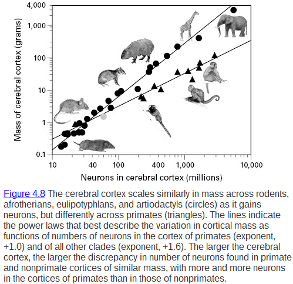
- This suggests that primates diverged from the ancestral scaling rules that all other animals follow.

- There isn't a single, universal relationship between the mass of brain structures and their number of neurons.
- Since the distribution of non-neuronal cells is uniform across structures and species, it must be that the number of neurons changes when the brain is scaled.
- Since the brain's mass and number of neurons scales linearly, we conclude that the average size of the neuron must stay the same.
- The neuronal density for primates stays the same while it decreases for non-primates.
- Primate neurons stopped growing as their brains grew.
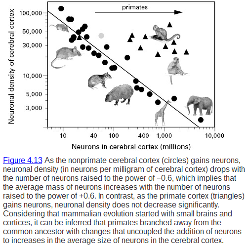
- Non-primates must have a mechanism that couples increases in the number of neurons in the cerebral cortex with increases in the average size of these neurons.
- Interestingly, the mouse lemur sits at the intersection of primate and non-primate brains.
- The implications of primate scaling
  - Nature has more than one way to build a cortex.
  - The cortex increases in volume by only as much as it gains neurons.
  - Reduction in the increase of signal propagation time as the cortex gains neurons.
- However, this raises a conundrum that even if the cortex gets bigger, it will take longer to transmit a signal yet the neurons remain the same.
- The answer is that the average neuronal size stays the same which means that there's a trade-off.
- When one neuron gets longer, another neuron must get shorter.
- E.g. White matter for long connections and grey matter for short connections.
- How the brain scales is exactly like how a small-world network grows.
- Not all connections are scaled equally but by adding many more local connections and a few key long connections.
- This is the cause of the development of white and grey matter.
- Interestingly, the increase in average neuronal size is much slower in the cerebellum than in the cerebral cortex.
- This is due to the anatomy of both structures as the cerebellum doesn't have long range connections.
- E.g. The cerebellum doesn't have a corpus callosum.
- Differences in form are related to differences in function.
- The difference in scaling quickly leads to a massive number of neurons in primate brains.
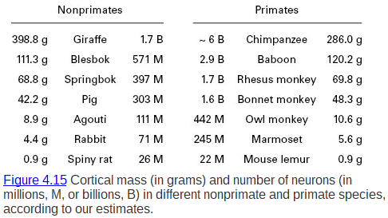

## Chapter 5: Remarkable, but Not Extraordinary

- Two brains of similar size across species don't have the same number of neurons.
- The development of the primate brain is more economical in terms of volume.
- Reminds me of big-O notation in how to characterize growth.
- In the context of primates, our brains fit the expected line of brain mass to brain neuron ratio.
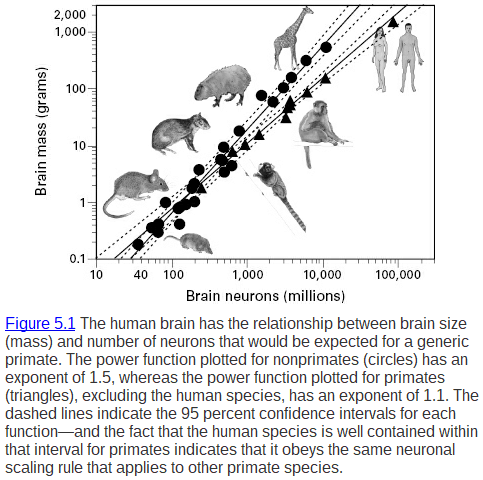
- Even our cerebral cortex and cerebellum does.
- Our brain is made in the image of other primates and follows the same neuronal scaling rules that applied to primates before us.
- The human brain is just a scaled up primate brain, remarkable but not special.
- Human brains are just the size we expect them to be.
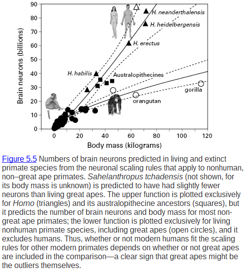
- Does this remarkable, but not extraordinary, number of neurons in the human brain really provide a basis for our outstanding cognitive abilities?

## Chapter 6: The Elephant in the Room

- How do we measure the cognitive capabilities in a large number of species and in a way that generates measurements that can be compared?
- The larger the brain and the larger the cerebral cortex of a non-human primate, the more it’s able to achieve in terms of cognition.
- An elephant has 257 billion neurons, three times our 86 billion.
- However, 98% of those neurons are in the cerebellum which is triple the number of neurons in the human cerebellum.
- Only 5.6 billion neurons is left in the cerebral cortex for elephants compared to our 16 billion.
- One possible reason for the large number of cerebellum neurons is because the elephant’s trunk requires a lot of processing and control.
- Since the large number of cerebellum neurons in the elephant doesn't result in superior cognitive abilities, we conclude that the cerebral cortex is responsible.
- The human advantage lies in having the largest number of neurons in the cerebral cortex.

## Chapter 7: What Cortical Expansion?

- The cerebral cortex has undergone both an absolute and relative expansion compared to non-primates.

- Since the cerebral cortex has taken over more functions, it’s more capable of complex and flexible functions and behaviors beyond simply operating the body.
- Cortical expansion in mammals has been about relative and overall mass but not about relative neurons.
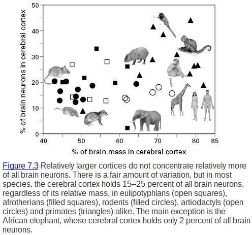
- How can the cerebral cortex gain more mass yet not as many neurons?
- Another part of the brain must be gaining those neurons without the mass.
- That other part is the cerebellum.

- For every neuron gained in the cerebral cortex, four neurons are gained in the cerebellum.
- This suggests that the cerebral cortex isn't about taking over the cerebellum but that they scale together.
- This still leaves the cause of our cognitive abilities to the sheer number of cerebral cortex neurons in the brain.
- The human prefrontal cortex is no larger than it should be nor does it have more neurons than it should have.
- The connectome isn't unique either as the human connectome is similar to other species.

## Chapter 8: A Body Matter?

- A bigger body loosely correlates with a bigger brain.
- This makes sense as you need a big body to support a big brain.
- There isn't a single, universal scaling rule between body mass and number of brain neurons across all mammals.
- The number of neurons in the primate spinal cord seems to scale with body length.
- Expecting the body-brain relationship that applies to non-primates to extend to primates is like expecting apples to be oranges on the inside.
- The primate brain is unique compare to non-primate brains because of
  - How many neurons fit in it
  - How many neurons operate the body
  - How many functions it performs
- Even though the average size of neurons in the rest of the brain is related to body mass, the number of neurons in the rest of the brain isn't.
- However, this doesn't apply to the cerebral cortex nor the cerebellum.
- Mosaic evolution applies to the brain.
- That different parts of the brain are free to change in different directions as they evolve.
- E.g. The rest of the brain follows all other mammals but the cerebral cortex and cerebellum doesn't.
- The only fair comparison of humans is to other non-great ape primates.

## Chapter 9: So How Much Does It Cost?

- The human brain isn't special in its number of neurons, it’s special due to the sheer number of neurons in the cerebral cortex.
- Our brains requires 25% of daily energy compared to other animals at most 10%.
- *Mass-specific metabolic cost*: its energy cost per gram of brain tissue per minute.
- Our mass-specific metabolic cost is 0.31 micromole which is a third the energy cost per gram of mouse brain tissue.
- This is counterintuitive since human neurons should consume more energy than a mouse neuron.
- We look towards glia/glial cells as a possible explanation as they help neurons.
- There is no trend for larger brains to have larger and larger proportions of glia cells than neurons.
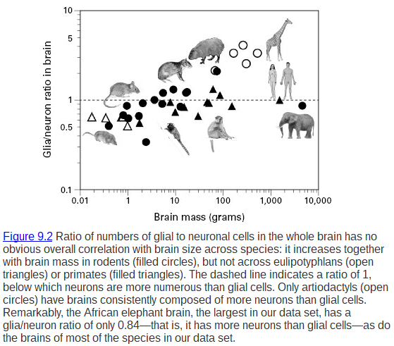
- Humans have a one to one ratio for neurons to glia cells.
- In each brain structure, there also isn't any trend.
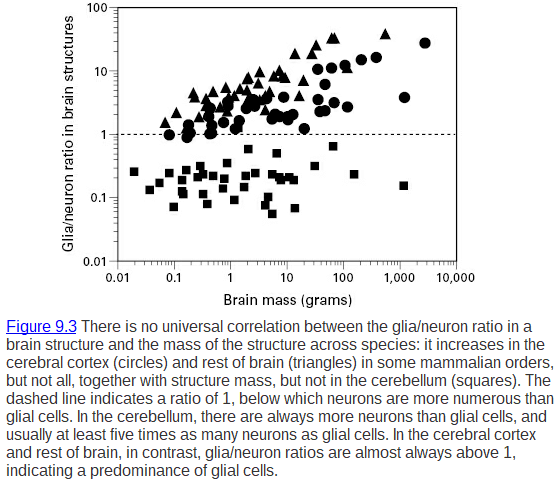
- However, there is a linear relationship between glia cells and the mass of the brain structure.
- Glia cells must be doing something so sensitive and so important that the number of them added to the brain has remained the same over the at least the last 300 million years of evolution.
- The glia/neuron ratio increases with decreasing neuronal density because larger neurons require more support.
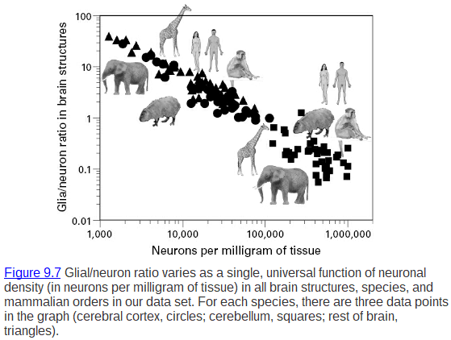
- The lower the neuron density, the larger the average size of neurons in the tissue and the higher the glia/neuron ratio in that tissue.
- It's extraordinary how some biology doesn't change much in evolution even though evolution means change.
- If it doesn't change, for example the glia/neuron ratio per neuronal density, then it suggests two kinds of constraint.
- *Fundamental physical constraint*: a universal constraint due to physics.
- E.g. Surface area and volume, electron tunneling in circuits.
- *Biological constraint*: a constraint due to the limitation of the environment.
- E.g. All life is DNA based, can’t get more sunlight than the Earth’s rotation and distance.
- Two universal features of the brain's cellular composition
  - The number of glia cells per unit of tissue mass.
  - The relationship between glia/neuron ratio and the average size of neurons.
- Glia cells are added in self-regulating numbers and only slightly variable cell size.
- It's self-regulating because glia cells are added after neurons in development.
- Depolarization is cost free as it's just like opening the gates of a dam.
- Repolarization requires energy as it's just like a pump pushing the water back uphill and into the dam.
- To grow a larger brain is more expensive than to grow a larger body.
- Larger neurons (within each neuronal type) don't cost more energy.

- The more neurons in a brain, the more energy that brain costs.
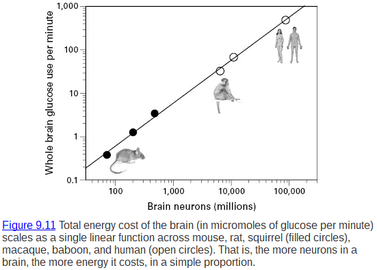
- It's amazing how much we're able to do with a slight variation in energy used by neurons in the form of action potentials.
- Even decreases of 1% in overall blood flow compromises brain function.
- E.g. Standing up too quickly which causes black or dimmed vision.
- Consciousness is heavily dependent on energy availability.
- Neurons are constantly pushed to their energy limit.
- Larger neurons must cut costs as they avoid excessive synaptic activity and frequently re-polarizing their membrane.
- Larger neurons with larger number of synapses have been found to have sparser connectivity and reduced unitary synapse strength.
- *Sparse coding*: where only a small proportion of neurons fire at high frequencies at any moment.
- Sparse coding may also be a direct consequence of the limited, size-invariant, fixed energy budget per neuron.
- Maybe neurons get their properties due to this energy constraint
  - *Synaptic homeostasis*: the adjustment in sensitivity of individual synapses in a neuron over time depending on their level of activity.
    - Avoids runaway increases in excitatory synaptic activity and thus energy cost.
  - *Synaptic plasticity*: the process of removing unused or nonfunctional synapses as new ones are added or strengthened.
    - Keeps the total number of excitatory synapses and their energy cost in check.
    - Trades synapses in one place for another. Like a zero-sum game.
- The human brain requires so much energy because it has a lot of neurons.
- The human brain uses 25% of our total energy because we have more brain neurons per body mass.
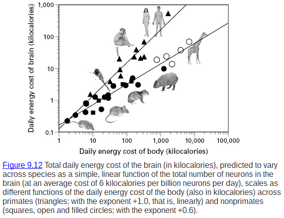

## Chapter 10: Brains or Brawn: You Can’t Have Both

- The rate of energy consumption (or power) for the human brain is constant at 24 watts.
- Compared to the variable power of muscles.
- Whether heavily thinking or idling, the brain consumes the same amount of power. It does so by changing the distribution of power.
- Once again, we see that there seems to be a constant, invariant supply of energy.
- Interestingly, a constraint found at the neuron level appears at the systematic level.
- The more neurons, the more time spent foraging and feeding to support the brain.
- We have been called outliers when compared to great apes. However, they're the outliers as they have smaller brains than expected for their body size.
- First we assume that the number of calories obtained from feeding is just enough to meet their total energy requirement.
- This assumption is supported by the fact that we don't see skinny nor fat primates in the wild.
- The number of neurons is inversely proportional to body mass.
- The limiting factor is energy. You can't have both a big brain and a big body.
- It's either brains or brawn.

## Chapter 11: Thank Cooking for Your Neurons

- Given that we shouldn't be viable, how did our ancestors manage to afford the increasing numbers of neurons?
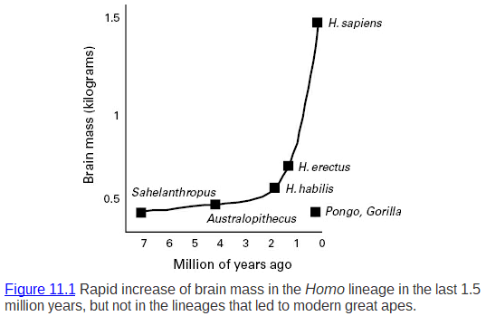
- There are four ways to deal with the energy constraint
  - Decrease the size of the body
  - Decrease the energy cost of the brain
  - Get more energy by spending more time feeding
  - Get more energy out of the food
- It can't be one because our ancestors had smaller bodies than us.
- It can't be two or three as we have the same neurons primates do and we don't spend 9.5 hours feeding and foraging.
- So it must be four.
- Bipedality is one part of the equation as it uses four times fewer calories than on all fours.
- It also allows humans to roam for more food.
- Long legs reduced the cost of walking which increased our endurance; allowing for active hunting in addition to foraging and feeding.
- However, this didn't increase the number of neurons in our brains by much.
- What did occur at the same time we see the explosion of neurons is the invention of cooking.
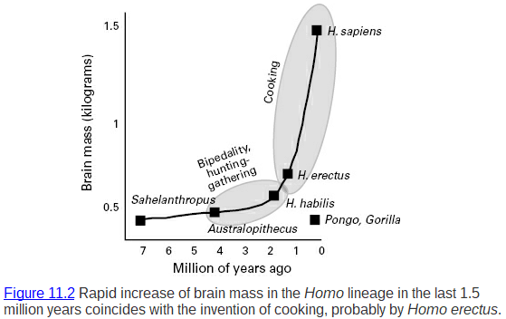
- Specifically, cooking with fire.
- *Cooking hypothesis*: that the invention of cooking by our ancestors resulted in food that offered the large caloric intake that allows our brain to grow.
- We never diverged from the linear relationship that applies to primates; we just kept pushing it.
- Other indications of how we ate more calories
  - Drastic reduction in tooth and cranial bone mass
  - Loss of facial muscles for chewing
- Cooking turns food smaller, softer, and more chewable.
- Cooking yields 100% of the food’s caloric content compared to 33% when eaten raw.
- Cooking increase the caloric yield while also decreasing the amount of time to obtain those calories. A double whammy benefit.
- Combine the benefits of cooking with the now affordable large brain and we can see how things spiral out of control.
- We didn’t break any biological nor evolutionary rules to be remarkable.
- Cooking is an exclusive human activity; no other animal cooks.

## Chapter 12: … But Plenty of Neurons Aren’t Enough

- If cooking is what made us who we are, then we still have these questions
  - Why didn't the ancestors of modern great apes invent cooking as well?
  - Couldn't a larger brain with more neurons have come first and that allowed our ancestors to invent cooking?
- Having enough neurons is a necessary condition for complex and flexible behaviors such as learning.
- But it isn't a sufficient condition for behaviors to become more complex and flexible.
- Having enough neurons endows a brain with the capabilities for complex cognition but turning those capabilities into actual abilities takes a long time.
- It's the difference between capacity and ability.
- One allows, one is.
- Having enough neurons doesn't mean we use it to its full capability or potential.
- The first technological revolution was making tools.
- The second technological revolution was the controlled use of fire for cooking.
- The third technological revolution was the invention of agriculture.
- The fourth technological revolution was the industrial revolution.
- The fifth technological revolution was the invention of automated machines.
- The sixth technological revolution is right now.
- For the number of neurons to increase, there must be a demand for those neurons.
- Humankind has long transcended any individual human.
- It's the self-reinforcing pairing of technological innovations and cultural transmission, made possible by the outstanding number of neurons in our cerebral cortex, that shaped our capabilities into abilities and got us where we are today.
