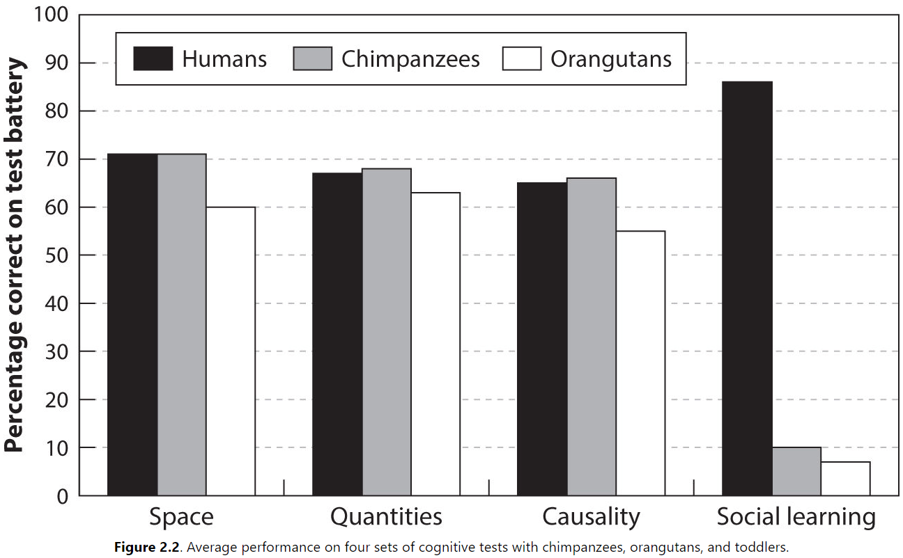
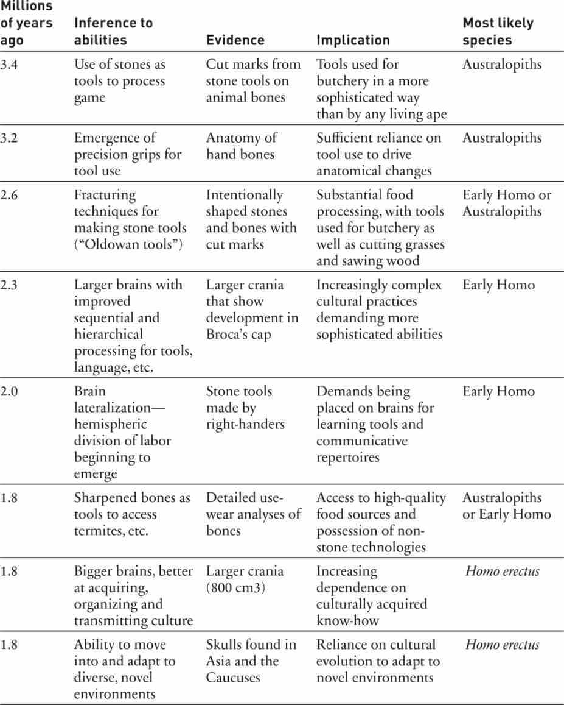

## Chapter 1: A Puzzling Primate

- Puzzlingly, even though we're the dominant species of our planet, we're physically weak, slow, can't distinguish between poisonous and nonpoisonous plants, and are dependent on cooked food. Many other animals are stronger, faster, and more resilient than us.
- The secret of our species’ success lies not in our raw, innate intelligence or any specialized mental abilities, but in our culture.
- Culture: the large body of practices, techniques, heuristics, tools, motivations, values, and beliefs that we acquire while growing up, mostly by learning from other people.
- The key to understanding ourselves is to recognize that we're a cultural species.
- During our evolution, culture became cumulative.
- Natural selection favored individuals who were better cultural learners, not only stronger or faster individuals.
- The escalating need to acquire this adaptive cultural information drove the rapid expansion of our brains, giving us the space to store and organize all this information.
- Cultural evolution started a process of self-domestication.
- The secret of our species' success lies not in individual brains, but in the collective brains of the community.
- Technologies and science emerge not from singular geniuses, but from the flow and recombination of ideas, practices, errors, and chance insights among interconnected minds and across generations.
- Innovation in our species depends more on our socialite than on our intellect.
- Language is also a product of cultural evolution and explains why our larynx went down, why our eyes whitened, and why we can copy vocal sounds like birds.
- We don't have tools, concepts, skills, and heuristics because we're smart; we're smart because we've culturally evolved a vast repertoire of tools, concepts, skills, and heuristics. The causal direction is the reverse to what our intuition believes.
- Culture makes us smart.

## Chapter 2: It's Not Our Intelligence

- Why are we so successful? What explains our species' ecological dominance? What is the secret to our success?
- Unlike many other species, we didn't evolve environment-specific genetic adaptations to each ecology.
- E.g. Fur for cold weather, feathers for flight, and fins for swimming.
- If we’re not a rainbow of genetic adaptations, what is the secret to our species' success?
- Many point to
    - Our tool use
    - Ability to control fire
    - Cooperate and form social organizations
- However, these just push back the question to why we can use tools, fire, and cooperate? Why can't other animals also do this?
- Three common explanations for our species' success
    - Generalized intelligence or mental processing power.
    - Specialized mental abilities evolved for survival in hunter-gatherer environments.
    - Cooperative instincts or social intelligence that permits high levels of cooperation.
- However, none of these reasons capture the large body of culturally transmitted knowledge that no individual or group can figure out.
- Social learning: any time an individual's learning is influenced by others.
- Individual learning: situations when individuals learn by observing or interacting directly with their environment.
- Cultural learning: a subclass of social learning when individuals seek to acquire information from others.
- Findings suggest that the only exceptional cognitive abilities possessed by young children compared to other great apes relate to social learning, and not to space, quantities, or causality.

- We don’t dominate our fellow apes on working memory or information processing speed despite our larger brains.
- Instead, we dominate in the domain of social learning; we’re inclined to copy spontaneous and automatically in strategic games.

## Chapter 3: Lost European Explorers

- Cases of lost explorers teach us that we survive neither by our instinctual abilities to find food and shelter nor by our individual capabilities.
- We survive because across generations, cultural evolution has packaged cultural adaptations that can't be devised in a few years and that we can easily learn.
- Without culturally transmitted knowledge about how to locate and process plants, create tools, and avoid dangers, we don't last long as hunter-gatherers.
- Our species' uniqueness arises from the manner in which cultural evolution can make cultural adaptations.
- E.g. Tool use and knowledge to deal with toxins and processing food, locating water, cooking, and traveling.
- Natural selection has honed our genes and our minds on the ability to learn from others.

## Chapter 4: How to Make a Cultural Species

- How do populations generate cultural adaptations?
- The process is, in some sense, smarter than we are.
- Research has come to understand that natural selection, acting on genes, has come to shape our psychology in a way that generates nongenetic evolutionary process that produce complex cultural adaptations.
- That is, natural selection favored genes for building brains with abilities to learn from others.
- Culturally acquired standards/values guide our efforts at individual learning and training.
- Who should we learn from?
- We all start learning by copying. We copy from the people that we have easy access to.
- E.g. Family and friends.
- Sometime later, we improve to the point where we need better teachers, so we turn to the most successful and prestigious people in that field in our community.
- Learners use three cues when searching for a teacher
    - Age
    - Success
    - Prestige
- Skill cues: those that relate directly to competence in the domain.
- E.g. Assessing a writer's skill by reading their books.
- Success cues: those that signal reward and achievement.
- E.g. Assessing a writer’s success by the number of books they’ve sold.
- People are more likely to copy other successful people rather than to find their own success.
- The more challenging the problem or the greater the uncertainty, the more people rely on cultural learning.
- Infants use cues of competence, reliability, and familiarity when copying others.
- Prestige cues represent a kind of second-order cultural learning where we figure out who to learn from by inferring from the behavior of others who they think are worthy of learning from.
- In other words, we culturally learn from whom to learn from.
- We're prestige biased in addition to being skill and success biased.
- Another cue is self-similarity or how close the teacher is to you in terms of sex, age, beliefs, and ethnicity.
- By focusing on older children, young learners can isolate models who are operating at an appropriate increment of skill and complexity above their own.
- This creates a smoother and more continuous process of gradual skill acquisition.
- Biased cultural learning can amplify the action of natural selection as it creates differential mortality.
- E.g. If the younger generation follows the habits of older generations, they're more likely to survive because the older generation is doing something to survive past their peers such as eating chili peppers that have antimicrobial properties.
- The wisdom of crowds, through conforming to others, is also a form of cultural learning.
- It's known that committing suicide is prestige biased because there's a spike in suicide rates when celebrities commit suicide.
- This is known as the cultural transmission of suicide.
- If people can acquire suicidal behaviour via cultural learning, it isn't clear what the limits are on the power of culture in our species.
- Copying suicide shows that cultural learning can enable behaviors that natural selection has directly acted to eliminate under most conditions.
- Teaching is the other side of cultural learning.

## Chapter 5: What Are Big Brains For? Or, How Culture Stole Our Guts

- As individuals learn from others in their group, the overall body of knowledge contained and distributed across the minds in the group improves and accumulates over generations.
- Sometimes, a person's mistake leads to innovations and sometimes a rare circumstance thrust an insight to someone who was in the right place at the right time.
- The key is that these insights were passed on, persisted, and recombined with other insights.
- Some ancestral primate crossed the critical evolutionary threshold of cumulative cultural evolution.
- This is when culturally transmitted information begins to accumulate over generations.
- It's this process that explains our cultural adaptations and our success as a species.
- Perhaps around 2 million years ago, our species crossed this threshold when cultural evolution became the primary driver of our genetic evolution.
- The interaction between cultural and genetic evolution resulted in a runaway positive feedback where accumulating cultural information selected for individuals with strong psychological abilities to acquire, store, and process this collection of information.
- As genetic evolution improved our brains, cultural evolution pushed for more and better cultural adaptations, which pressured the brain to get better at acquiring and storing this cultural information.
- There's no turning back because if you don't focus on cultural learning, you lose to those who do.

| **Culturally transmitted selection pressure** | **Definition**                                                     | **Coevolved genetic consequences**                                                                                                                                                                                          | **Other implications**                                                                                              |
| --------------------------------------------- | ------------------------------------------------------------------ | --------------------------------------------------------------------------------------------------------------------------------------------------------------------------------------------------------------------------- | ------------------------------------------------------------------------------------------------------------------- |
| Cumulative culture                            | Accumulating body of cultural knowledge create dependence          | Specialized cultural learning abilities for selectively acquiring adaptive information form others. Long childhoods and larger brains prepared for cultural learning and practice with extensive brain wiring over decades. | Selection pressure for greater sociality. Difficult childbirth due to oversized heads. Demands for more child care. |
| Food processing                               | Cooking, leaching, pounding, chopping                              | Increasing dependence on processed food, including cooked foods. Results in small teeth, gapes, mouths, colons, and stomachs; possible interest in fire during childhood.                                                   | Frees energy for brain building and favors the sexual division of labor.                                            |
| Persistence hunting                           | Tracking, water containers, and animal behavior knowledge          | Distance running facilitated by springy arches, slow-twitch muscle fibers, shock-enforced joints, a nuchal ligament, and innervated eccrine sweat glands.                                                                   | Human lineage becomes high-level predator.                                                                          |
| Folkbiology                                   | Increasing knowledge about plants and animals                      | Folk biological cognition: hierarchical taxonomies with essentialized categories, category-based induction, and taxonomic inheritance.                                                                                      | Universal treelike taxonomies for categorizing the natural world.                                                   |
| Artifacts                                     | Increasingly complex tools and weapons.                            | Anatomical changes to hands, shoulders, and elbows. Direct cortical connections into spinal cord.                                                                                                                           | Greater manual dexterity and throwing abilities. Increased physical weakness.                                       |
| Wisdom of age                                 | Opportunities to use and transmit culture gleaned over a lifetime. | Changes in human life history: extended childhood, adolescence, and a longer postreproductive lifespan.                                                                                                                     | Cooperation in child investment and rearing.                                                                        |
| Complex adapations                            | Pressure for high fidelity cultural learning.                      | Sophisticated abilities to infer others’ mental states, theory of mind, or mentalizing and overimitation.                                                                                                                   | Dualism: a preparedness to understand minds without bodies.                                                         |
| Information resources                         | Variation in skill or knowledge among individuals.                 | Prestige status: suite of motivations, emotions, and ethological patterns that produce a second type of status.                                                                                                             | Prestige-based leadership and greater cooperation.                                                                  |
| Social norms                                  | Enforced by reputations and sanctions.                             | Norm psychology: concerns with reputation, internalization of norms, prosocial biases, shame and anger at norm violators, cognitive abilities for detecting violations.                                                     | Strengthens effect of intergroup competition on cultural evolution.                                                 |
| Ethnic groups                                 | Culturally marked membership across social groups.                 | Folksociology: in-group vs. out-group psychology that cues off phenotypic markers, which influence cultural learning and interaction.                                                                                       | Tribal/ethnic groups, later nationalism and parochial religions.                                                    |
| Languages                                     | Transmitted gestures and vocalizations.                            | Changes in throat anatomy, audio processing, specialized brain regions, and tongue dexterity.                                                                                                                               | Massive increase in the rate of cultural transmission.                                                              |
| Teaching                                      | Opportunities to facilitate cultural transmission.                 | Communicative or pedagogical adaptations: white sclera, eye contact.                                                                                                                                                        | Higher-fidelity transmission and more rapid cultural evolution.                                                     |

- Our brains evolved from around 350 $$cm^3$$ to about 1350 $$cm^3$$ and most of that expansion, about 500 $$cm^3$$, took place in about the last 2 million years; fast in genetic evolutionary terms.
- This expansion stopped about 200,000 years ago, probably due to challenges in giving birth to babies with heads larger than the birth canal.
- Our neural myelin also takes much longer to burn in, which makes brain regions more efficient but less able to learn. Thus, by delaying myelination, we are better learners at a younger age but less efficient.
- This culture-gene coevolution creates an autocatalytic process such that no matter how big our brains get, there will always be much more cultural information than we can learn in a lifetime.
- The better our brains get at cultural learning, the faster adaptive cultural information accumulates, and the greater the pressure on brains to acquire and store this information.
- This also explains why babies are nearly helpless at birth because they're evolved to learn cultural information instead of surviving.
- Food processing externalize digestion.
- Compare to other primates, humans have unusual digestive systems and we lack a substantial amount of digestive power.
- The answer is that our digestive systems have coevolved with culturally transmitted knowledge related to food processing.
- Cooking is probably the most important piece of food processing knowledge as it’s shaped our digestive system the most.
- While all this food processing reduces the digestive effort of our mouth, stomach, and colon, it doesn't change the need to actually absorb the nutrients, which is why our small intestines are the right size for a primate of our build.
- What's been underemphasized is that cooking isn't something we do instinctively, but is a product of cultural evolution.
- The energy savings from the externalization of digestive functions by cultural evolution became one part in a set of adjustments that allowed our species to build, maintain, and use larger brains.
- Effective molars and weapons can replace big teeth and strong muscles.
- While natural selection traded strength for fat, another key change was that the human neocortex sends neural connections deeper into motor neurons, spinal cord, and brainstem than in other mammals.
- It's this depth of connections that enables our fine dexterity.
- E.g. Hands, tongues, vocal cords, and jaws.
- With the exception of domesticated horses, which we've artificially selected for endurance, our main competition comes from African wild dogs, wolves, and hyenas.
- However, even our competition loses in warmer temperatures and chimpanzees aren't even in our league.
- Our specialized distance running adaptations
    - Our feet have springy arches that store energy and absorb the shock of repeated impacts as long as we don't land on our heels.
    - Longer legs with extended tendons.
    - We have more slow-twitch fibers yielding much greater aerobic capacity.
    - Reinforced lower body joints.
    - Enlarged gluteus maximus or butt.
    - Arm swinging balances us while running.
    - Shock-absorbing ligaments connecting our heads and shoulders secures and balances our skulls and brains against running shocks.
- The most impressive adaptation is our thermoregulatory adaptations as we're the sweatiest species.
- Since running heats up animals, the inability of most mammals to run long distances is due to the inability to manage this heat buildup.
- Our heat management adaptations
    - Near complete loss of hair.
    - Many sweat glands.
    - Emergence of a head-cooling system.
- No other animal can sweat faster than we do, and thus no other animal can remove heat as fast as we do.
- This system can run and keep us running for many hours, provided it doesn't run short of water.
- So where's the genetically evolved water storage system or tanks?
- In contrast to us, horses, which can compete with us for distance, do have the ability to store large amounts of water.
- The answer is that cultural evolution supplied water containers and water-finding knowledge.
- This suggests that the evolution of our fancy sweat-based thermoregulatory system could only happen after cultural evolution generated the knowledge for making water containers and finding water sources.
- However, there's more to persistence hunting than just endurance.
- We also need to track the prey for several hours as the prey could go back into their group.
- So hunters must be able to track and identify individuals.
- This knowledge is cultural transmitted and must be learned from skilled hunters.
- Another culturally transmitted trick is that hunters can strategically vary their speed in order to force their prey to run inefficiently.
- This is due to a body-design limitation that applies to quadrupeds but not to bipeds.
- The result is that hunters force their prey into a series of sprints and rests that eventually causes heat stroke.
- Even running isn't natural for us and is copied from skilled hunters.
- We have an impressive folkbiological cognitive system for dealing with information about plants and animals.
- An object "is" what "it" does. The function defines the concept.
- E.g. A painted cat is still a cat, but a disassembled table made into a chair isn't a table.
- This system organizes the vast body of information that a person picks up through cultural transmission and individual experience.
- This has interesting implications as infants seem to avoid playing with plants but don't show the same concern for other objects.

## Chapter 6: Why Some People Have Blue Eyes

- Blue and green eyes are a side effect of natural selection favoring genes for lighter skin in populations living at high latitudes.
- If cultural evolution hadn't produced agriculture, then there would be no blue or green eyes.
- Thus, cultural evolution can shape our environment and result in changes in genetic evolution.
- Review of rice wine, the ADH1B gene, and lactose tolerance.
- Cheese and yogurt are, in part, cultural adaptations for reducing lactose in dairy, which allows everyone to get the nutrients from milk but without the side-effects of lactose intolerance.
- Natural selection found different ways to create lactase persistence in different populations.
- These three cases of culture-driven genetic evolution are the best understood cases that we have of this type of evolution, but there may be more.
- Are these cases outliers or unique somehow?
- Maybe they’re outliers, it's hard to say because maybe the agricultural revolution is just in the sweet spot for today's science.
- We don't have data for older or recent revolutions and how they affect our genome.
- Cultural evolution can, has, and is powerfully shaping the human genome in a variety of important ways.

## Chapter 7: On the Origin of Faith

- The causal opacity of many cultural adaptations had a big impact on our psychology.
- Causal opacity: when a person can't readily infer the function, relationship, or importance of a cultural adaptation.
- E.g. The laborious process of making manioc/cassava not toxic isn't obvious since the effects of cyanide poisoning takes years to develop.
- If a person didn't take it on faith to follow the detoxifying steps, then they would be less likely to survive.
- The point is that cultural evolution is often much smarter than we are as cultural adaptations accumulate and are refined by each generation.
- So natural selection has favored people who often place their faith in cultural inheritance over their own intuitions and personal experiences.
- Taboos represent a cultural adaptation that target specific people doing specific actions that would harm them.
- E.g. Incest or eating fish while pregnant.
- People often don't know why a taboo is in place, they just follow it.
- Post-hoc rationalization: since I'm being asked for a reason, there must be a reason, so I'll think one up now.
- This is strikingly different from Westerners since educated Westerners grow up in a culture that values good reasons for doing things.
- Saying "it's traditional" isn't considered a good reason in Western culture.
- Taboos are cultural prescriptions that often work.
- We may think that these examples of toxic plants and animals are just special cases, but we've been living in a superficial environment where most of our food is nontoxic and safe. In the natural environment, this isn't the case.
- By contrast with our species, other animals have far superior abilities to detoxify plants. Humans have traded in this ability for cultural adaptations instead.
- Adding spices to our food may be a cultural adaptation to the problem of food-borne pathogens.
- Spices aren't used by other animals, contribute little to no nutrition, and many are aversive chemicals evolved to prevent consumption.
- People in hotter climates use more spices and this may be explained because bacteria replicates faster in warmer climates.
- Thus, culture can overpower our innate instincts when necessary and without our knowledge.
- E.g. Spicy foods cause pain but we've reinterpreted those signals as pleasure.
- A device or technology often preexisted the development of any causal understanding.
- Natural selection isn't the only "dumb" process capable of creating complex adaptations that fit local circumstances, cultural evolution is another process.

## Chapter 8: Prestige, Dominance, and Menopause

- Across human societies, prestige is consistently associated with great skill, knowledge, and success in certain activities.
- Prestige forms the foundation for leadership in egalitarian societies.
- How and why did prestige evolve?
- The key is to understand that once humans became good cultural learners, they needed to find and learn from the best available models.
- Prestige acts as a proxy and measure for the best models to learn from.
- When you start learning a new and complex skill, it's often difficult to distinguish between a good and a great performance.
- To learn to distinguish quality, learners can mimic and attend to more experienced individuals.
- This represents a kind of second-order cultural learning.
- To understand prestige as a social phenomenon, we have to realize that it's often difficult to figure out what makes someone successful.
- Prestige is a form of status psychology and is linked to our dominance psychology that was inherited from our primate ancestors.
- Because of culture-gene coevolution, we posses two distinct forms of social status: dominance and prestige.

| **Status Feature**                   | **Dominance**                                                        | **Prestige**                                                                |
| ------------------------------------ | -------------------------------------------------------------------- | --------------------------------------------------------------------------- |
| Influence                            | Based on coercion and threat                                         | True persuasion and deferential agreement                                   |
| Imitation by lower-status            | No imitative bias except to satisfy dominant                         | Preferential, automatic, and unconscious imitation                          |
| Attention by lower-status            | Tracking of higher-ups, avoidance of eye contact, and no staring     | Directing of attention to and gazing at higher-ups, watching, and listening |
| Mimicry by lower-status              | No preferential mimicry                                              | Preferential mimicry of higher-ups                                          |
| Proximity management by lower-status | Avoidance of higher-ups; keeping distance to avoid random aggression | Approach to higher-ups; maintenance of proximity to higher-ups              |

- Lower-status individuals preferentially attend to and imitate prestigious individuals but not dominant ones.
- We imitate and mimic others for two reasons
    - To show deference/respect to a higher prestige individual.
    - To help us better understand what's going on in the other person's mind.
- The process of mimicking prestigious individuals is often unconscious and automatic.
- People show admiration, awe, and respect to prestigious individuals while they show fear, submission, and reluctance to dominant individuals.
- Dominants seek to manipulate people for their own ends, while prestigious people seek to be generous and cooperative.
- Older people not only have a lifetime of their direct experience, they've also had a lifetime of cultural learning.
- Compared to other species where the older members don't provide much new and useful information, we treat elders with respect due to their cultural knowledge.
- The most striking fact about respect for old age is its widespread occurrence in all known societies.
- Most other animals don't respect their elderly unlike us, as we attribute their survival to their wisdom and knowledge.
- However, the reduction in respect for elders in Western society is attributed to the fast changing pace of our world.
- E.g. Older generations lived in a time completely different from our own such as living with typewriters and without computers.
- The faster things change, the younger the best models get and the less valuable the knowledge from elders.
- The longer we live, the more information we accumulate and the potentially more valuable we are as transmitters of cultural knowledge.
- This is why humans, but not other primates, live for decades beyond when we stop reproducing.
- E.g. Chimpanzees and other primates usually die right after reproduction ends.
- Why are humans different?
- Because older people can provide information that older members of other primate species can't.
- In other words, older individuals can transmit valuable knowledge to others in addition to helping out with physical labor.
- By shutting down the reproductive system, our bodies can divert that energy to survive for longer.
- The only other species that lives decades past when they stop reproducing are killer whales and elephants.
- Older members, while not reproducing themselves, do appear to increase the reproductive success of their family group by passing on knowledge to their offspring and grand-offspring.

## Chapter 9: In-Laws, Incest Taboos, and Rituals

- In many small-scale societies, certain types of cousin are labeled as "brothers" and "sisters" and are supposed to be treated as such.
- It's also taboo to interact with such cousins as this could turn into sex and marriage.
- This goes to show that even the smallest human societies operate on a set of kinship norms.
- The emergence of these social norms drove a genetic evolutionary process of self-domestication that dramatically changed our species' social life.
- Simply observing others lets us acquire knowledge about ideas, values, beliefs, mental models, taste, and motivations.
- Social norms emerge from groups of people interacting and learning from each other using cues such as success and prestige, and deviations from this norm are penalized or looked down upon.
- The resulting behavioural patterns are stable and resist efforts by individuals to change them.
- Violating social norms may not result in immediate repercussions but in future repercussions.
- Social norms are not inherently good or bad and may persist regardless of utility.
- E.g. Eating the brains of dead relatives.
- Social norms make it possible for humans to solve social dilemmas.
- Two ways social norms solve dilemmas
    - Brings in a third party to monitor, reward, and sanction others based on shared rules.
        - E.g. In marriage, the community acts as the third party.
    - Provides mental models of situations and relationships to guide our attention towards prosocial behaviors.
        - E.g. Behaviors like smoking, eating horse meat, and littering can go from acceptable to disgusting.
- Paternity certainty: how males worry about whether they're the genetic father.
- The more paternity certainty a male has, the more willing they're to invest in parenthood.
- Evidence suggests that the more demanding marriage norms, such as monogamy and marriage, operate to reinforce our otherwise weak pair-bonding instincts.
- As societies expanded, marriage norms were used to build intergroup alliances, promote peace, and to sustain large-scale forms of social organization.
- Social norms harness, extend, and suppress our social instincts, which is unlike other animals.
- Since cultural learning influences how we judge others, it can create self-reinforcing stable patterns of social behaviour; what we call social norms.
- This suggests that without our social norms and beliefs, we aren't as cooperative as we seem.
- The result is that individuals that don't follow social norms are excluded from the community, creating a more peaceful, sociable, but docile community.
- Social norms also reinforce our kin-based and pair-bond relationships and expands our narrow social circle from genetic kinship to cultural kinship.
- Ritual and affinal relationships, both of which are culturally constructed and nonexistent in primates and other animals, explains more about the bonds of association, cooperation, helping, and sharing than blood ties.

## Chapter 10: Intergroup Competition Shapes Cultural Evolution

- Intergroup competition is one important factor in the spread of prosocial norms.
- Having norms that increase cooperation can favor success in competition with groups that lack these norms.
- Five forms of intergroup competition
    - War and raiding
    - Differential group survival without conflict
    - Differential migration
    - Differential reproduction
    - Prestige-biased group transmission
- History suggests that all prosocial institutions eventually collapse due to self-interest, unless they're renewed by the dynamics of intergroup competition.
- Case studies suggest that increasingly effective social-bonding rituals spread over time, which may have driven the rising intensity of military and economic competition.
- A group's ability to sustain complex technologies depends on their ability to sustain broad-ranging social contacts.

## Chapter 11: Self-Domestication

- By observing others, young children spontaneously infer context-specific rules for social life and assume these rules are the norm.
- Deviations from the norm make children angry and motivate them to instill proper behaviour in others.
- Features that distinguish us from other species
    - We live in a world governed by social rules, even if not everyone knows the rules.
    - Many of these rules are or seem random.
    - Others care whether we follow these rules and react negatively to violations.
    - We infer that others care about whether we follow these rules.
- Similar to how we domesticated wolves into dogs by killing those that wouldn't obey and refused to be trained, human communities domesticated their own members.
- E.g. Individuals that fail to learn the correct social norms are eventually driven from the village or are killed.
- Review of the Ultimatum and Dictator game.
- In one game, quick gut responses were more cooperative suggesting an automatic and instinctive desire to cooperate.
- Waiting at traffic lights appears to use the same psychological mechanisms as complying with and punishing social norms in behavioural games.
- How well a society functions depends on its set of social norms.
- Setting up a task to cue norm psychology makes people better at solving logic problems.
- The world that cultural evolution often creates is one where different groups have different social norms and where norm boundaries are often marked by language, dialect, dress, or other unique markers.
- Reciprocity is relatively rare outside of humans and especially outside of primates.
- Those exposed to war between the ages of 7-20 increased their egalitarian choices more for only their in-group.
- In contrast, people outside the developmental window (7-20) did show an increase in their in-group egalitarianism but the increase was small.
- When disaster threatens and uncertainty looms, people hold their social norms more tightly because they've allowed human communities to cooperate and survive.

## Chapter 12: Our Collective Brains

- One of the secrets to our success (and our weakness) is our collective brains.
- Once individuals evolve to learn from one another with sufficient accuracy, social groups of individuals develop what we call collective brains.
- The power of collective brains to develop sophisticated technologies depends, in part, on the size of the group and its interconnectedness.
- It's our collective brains running over generations, and not the innate creative power of individual brains, that explains our species' technological dominance and massive ecological success.
- The biases in cultural learning mean that errors and failures will be filtered out while those that work will collect and spread.
- The size of the group and the social interconnectedness plays a crucial role in generating innovative ideas.
- E.g. Larger groups generate more lucky errors, new combinations, and intentional improvements.
- Bigger groups have the potential for more rapid cumulative cultural evolution as their rate of emergence depends on the slowest element.
- All of this assumes that the members of such group are sufficiently interconnected so that ideas and improvements spread rapidly.
- E.g. Imagine that every person keeps any insights to themselves, then each improvement and innovation dies with them and no fancy tools emerge. This is the case for most animals.
- Group size and degree of social interconnectedness are key to cumulative cultural evolution.
- E.g. Suppose we have two groups: the Geniuses and the Butterflies. The Geniuses devise an invention once in 10 lifetimes while the Butterflies only devise the same invention once in 1000 lifetimes. So, this means that the Geniuses are 100 times smarter than the Butterflies. However, the Geniuses aren’t very social and only have 1 friend they can learn from, while the Butterflies have 10 friends, making them 10 times more social. Now, everyone in both populations tries to obtain an invention by either figuring it out themselves or by learning from friends. Suppose learning from friends is difficult and that the learner only learns it half the time. After everyone has done their own learning and tried to learn from their friends, do you think the innovation will be more common among the Geniuses or the Butterflies? Among the Geniuses, about 18% will end up with the invention while 99.99% of the Butterflies will have the innovation.
- The takeaway: if you want to have cool technology, it's better to be social than smart.
- Cultural evolution also shapes the learnability of knowledge and skills.
- E.g. Larger communities won't just have more sophisticated tools and technologies, they'll also have more learnable techniques for producing them.
- Social interconnectedness makes everyone more skilled over time.
- Importantly, learners can create innovations without inventions by combining good elements from previous models.
- This process is crucial for our understanding of innovation.
- Larger populations tend to have more complex technologies and a greater number of technologies.
- Two implications of collective brains
    - A population can lose adaptive cultural information if the group suddenly shrinks and gets socially disconnected.
        - This can be due to an epidemic, war, or the imperfect copying of others. Copies are usually worse than the originals.
        - This is prevented if the copy turns out better than the original. Some students end up better than their teacher.
    - A population's size and social interconnectedness sets a maximum on the size of a group's collective brain.
- Larger populations can overcome the inherent loss of information in cultural transmission because if more individuals try to learn something, there's a better chance that someone ends up with knowledge or skills that are at least as good as, if not better than, their teachers.
- Interconnectedness is important because it increases the chances that an individual will access a skilled/successful model and thus the chances that they'll exceed the model.
- The size and interconnectedness of our social groups depends on social norms and cultural technologies such as rituals.
- The point is that if intergroup competition favors sophisticated tools and technologies, it has to favor social norms and institutions that can sustain a large collective brain. Technology and culture have to coevolve.
- Cumulative culture is our thing; it’s what makes us special.
- Greater individual brainpower is dwarfed by greater social interconnectedness and longer lives.
- E.g. Neanderthals may have been individually smarter than us, but our greater social interconnectedness and longer lives resulted in a greater advantage.
- Intelligence depends on both genetic and cultural evolution.
- It's more important for a cultural species to be social than to be innately smart in producing complex technologies.
- Collective brains allow us to solve problems that we individually couldn't have.
- In the long run, our world, filled with complex concepts, tools, and procedures, will favor genes for more sophisticated cognitive abilities.
- Even if our genes were fixed, cultural evolution would still make us smarter.
- The ability to solve a problem depends on culture.
- Many of the products of cultural evolution give us not only ready concepts to apply to new problems and concepts to recombine, but they also give us new cognitive tools and mental abilities.
- E.g. Writing, concept of zero, clocks, etc.

## Chapter 13: Communicative Tools with Rules

- Converging evidence suggests that language arises from long-term cumulative cultural evolution.
- Languages are cultural adaptations for communication.
- Like our technologies and institutions, cultural evolution accumulated, integrated, and refined many useful communicative elements over a long period of time.
- Like technology, the size and interconnectedness of speech communities influence their vocabulary sizes, phoneme sets, and grammatical tools.
- Three important points of hunter-gatherer signing systems
    - They appear to be adapted to their local context.
        - E.g. Plains Standard for long distance communication and Australian sign language during speech taboos periods such as after someone died.
    - The complexity and expressiveness of Australian signing systems vary from group to group.
        - Some are fully expressive while others are underdeveloped.
    - Australian systems are learned by children and thus, the signs don't relate to the meaning they refer to, demonstrating abstraction.
- Cultural evolution can solve many of the problems faced by genetic evolution, but faster and without speciation.
- Having the right words can increase ease, speed, learnability, and quality of communication.
- Small-scale languages have about 3,000-5,000 words while the average American knows 40-60,000 words.
- However, this neglects the fact that more advanced societies need to have more words for their technology and culture.
- Words are useful for thinking so having a larger vocabulary likely improves some types of problem solving.
- Words are like other aspects of culture and we should expect it to follow the same rules such as scaling with population size and interconnectedness.
- Languages with more speakers tend to have more sounds/phonemes which results in shorter words and thus greater communication efficiency.
- You can achieve some degree of communication with just some shared vocabulary. You don't even need grammar.
- However, the more regular and predictable a language is, the more learnable it is.
- Maybe speech evolved as a way to free up our hands for tool use or to reduce the need to see hand gestures.
- Cultural evolution is possible without language.
- E.g. Cultural information about tools and social norms can all be learned without language.
- Also, language itself is a product of culture so it can't cause culture, but it does facilitate cultural transmission.
- Language can't have solved our cooperation dilemma because if everyone lies, then there's no value to talk to anyone.
- Summary
    - Languages are packages of cultural adaptations for communication.
    - These packages will evolve culturally to be learnable meaning they will develop shared features.
    - The size and interconnectedness of populations favors culturally evolving and sustaining larger vocabularies, more phonemes, shorter words, and certain complex grammatical tools.
    - Historical evidence suggests that language has undergone massive transitions from the start of language.
    - Having language changes the way individuals interact with themselves, others, and the world.

## Chapter 14: Enculturated Brains and Honorable Hormones

- Cultural evolution is a type of biological evolution.
- The better you can read, the more specialized the wiring of your brain is for reading.
- However, the tradeoff is that skilled readers are probably worse at identifying faces since both skills compete for related brain areas.
- Learning to read may have shifted facial recognition to the right side of the brain.
- These are biological changes to the brain but not genetic changes.
- This is because cultural evolution figured out a way to modify our brains without messing with our genetics.
- Reading is a product of cultural evolution that rewire our brains to create an almost magical ability to convert patterns of shapes into language.
- Most human societies didn't have a writing system and until the last few hundred years, most people didn't know how to read or write.
- The point is that cultural differences are biological differences but not genetic differences.
- So far in this book, the author has been emphasizing that cultural evolution has shaped genetic evolution. Now, the author is also arguing that cultural evolution also shapes our biology but not through genetics.
- Both processes are related but not contradictory; we can think of culture as a confound.
- Research into physical attraction and wine tastes reveal that people's preferences are strongly influenced by observing and inferring the tastes and preferences of others.
- E.g. If you're shown the average rating of a person, you're likely to bias your rating depending on the average. Likewise for wine, if someone else says an expensive wine tastes good, you're likely say it tastes good too.

## Chapter 15: When We Crossed the Rubicon

- The crucial event in the history of our species was when we crossed the threshold into a regime of cumulative cultural evolution.
- There's no reason to believe that it was a singular moment or event that turned us into a cultural species.
- We probably danced around the threshold due to poor copying, no teaching, and shifting communities.
- The timeline that we map out here is crude and speculative.
- Our last common ancestor with chimpanzees 5-10 million years ago probably lacked cumulative cultural.
- By 2.6 million years ago, the first stone tools appear in the paleoarcheological record.
- These aren't just stones used as tools, but stones crafted and shaped to be choppers, scrapers, hammers, and awls.

- By 2.4 million years ago, a bigger-brained bipedal ape appeared in Africa and is considered the start of the Homo genus.
- These early Homo had smaller jaws and cheek teeth, suggesting that their anatomy was responding to knowledge about food processing made possible by stone tools.
- By 1.8 million years ago, someone was using bones and horns as tools, suggesting a large body of knowledge and technical skills.
- Early Homos show handedness and their skulls suggest an expansion in regions important for speech, gestures, and tool use.
- This contrasts with apes that don't show handedness.
- It seems that the neurological division of labor that characterizes modern human brains may have begun to emerge with the culture-driven response to tools and food processing.
- By 1.8 million years ago, a new species called Homo erectus evolved with bigger brains, smaller teeth and jaws, and reduced guts.
- Good evidence of cooking and fire emerge around 800,000 years ago with tentative evidence around 1.5 million years ago.
- Anatomical changes in the shoulders and wrists of Homo erectus suggest the emergence of powerful throwing abilities, perhaps used for hunting, scavenging, and attacking.
- Only humans can throw fast and accurately out of all known animals.
- Throwing is a product of cultural evolution as we don't automatically develop powerful and accurate throwing.
- Things accelerated from 1.6 to 1 million years ago as new techniques and materials increasingly appeared among the remains of erectus societies.
- E.g. Two-sided axes.
- The signature of cumulative cultural evolution seems to emerge at certain times and places.
- Cumulative cultural evolution is as old in our species' lineage, starting probably millions of years ago but only taking off in the past hundreds of thousands of years ago.

## Chapter 16: Why Us?

- Why did our lineage cross the Rubicon and not others?
- Why did this only begin in the last few million years and not 10 or 200 million years ago?
- Why didn't other species develop similar culture-gene coevolutionary trajectories?
- In one sense, our species is just a part of a much larger pattern created by evolution.
- In another sense, other species may struggle with cultural evolution because of a start-up problem.
- Start-up problem: the conditions under which there's enough cumulative culture to begin driving genetic evolution are rare because early on, there wouldn't have been enough accumulation to pay the costs of bigger brains.
- To circumvent the start-up problem, you need to accumulate so much knowledge that individual learning can't keep up with much better social learners.
- The start-up problem explains why we don't see other species with substantial cumulative cultural evolution.
- Now the question is: how did we jump start the cultural evolution engine?
- We don't know for certain, but this is our best guess.
- Two evolutionary pathways around the start-up problem
    - If we can somehow expand the size and complexity of a species' cultural repertoire without changing its brain size, then its more adaptive to learn from others.
    - Lower the costs of bigger brains.
- Both pathways were taken by us and are mutually reinforcing.
- Large ground-dwelling primates produce bigger cultural accumulations.
    - E.g. Being on the ground provides advantages such as freeing both hands, providing greater access to resources, and making it easier to see and learn from others.
- Predation favors larger groups, which favor greater cultural accumulations
    - Mammals often respond to increased predation by forming larger groups.
    - There's safety in numbers.
    - Larger groups might have caused an increase in the size and complexity of tools, skills, and knowledge, resulting in more innovations and ideas.
- Natural selection pushes brain size up to increase individual fitness but the risk is that this makes the specie more vulnerable to extinction from shocks.
- To work around this, moms can rely on others for help raising her child.
- The seeds of pair-bonding may begin to sprout when a group gets large.
- Pair-bonds allow individuals to transform a few scattered kin-based relationships into something more like a family or kin-network.
- Knowing such a network allows individuals more opportunities for social learning.
- This also means that relatives and family members can help mom raise her child.
- E.g. Human mothers only do 50% of the child care compared to 100% for ape mothers.
- Being both ground-based and predators will increase the size of groups' cultural knowledge and may push a species past the threshold.
- However, expanding brains to store more cultural information still faces the obstacle that mothers have to invest a lot into their offspring.
- To push through this obstacle, larger group sizes can lead to pair-bonding and kinship circle, increasing social learning opportunities.

## Chapter 17: A New Kind of Animal

- The wrong way to understand humans is to think that we're just a really smart and less hairy chimpanzee.
- We are a new kind of animal; a major transition.
- We shouldn't think of culture as some addition to genetic evolution; culture is one of the central forces of our evolution and our success.
- Many features of our anatomy only make sense as genetically evolved responses to selective pressures created by cultural evolution.
- E.g. Smaller guts due to cooking, persistence hunting due to water containers, and lower vocal cords due to the need to communicate.
- Many of our cognitive abilities and biases only make sense as genetically evolved responses to cultural information.
- E.g. High-quality imitation, folk biology, and cooperation.
- Our social psychology appears designed for navigating a world with social rules and reputations.
- Why are humans unique?
    - E.g. Endurance runners, throwers, trackers, communicators, food sharers, teachers, imitators, tool makers, cooks, causal-model builders, mind-readers, and ritual performers.
    - The answer is that we crossed the Rubicon.
    - Cultural evolution became cumulative and drove genetic evolution to store, process, and learn such vast stores of information.
    - We seem unique because no other animal has gone down this path.
    - The key to understanding our uniqueness lies in understanding the process, culture-gene convolution, and not in the products of it such as languages, technology, or social institutions.
    - Crossing the Rubicon prevents us from going back.
    - All human societies are entirely dependent on culture.
    - Culture-driven genetic evolution is gradually shaping our societies into a kind of superorganism.
- Why are humans so cooperative compared to other animals?
    - We're more cooperative because breaking social norms means reputation damage, diminished mating prospects, and reduced access to resources such as shared food and water.
    - Thus, culture influences genetics resulting in self-domestication.
- Why do we seem so smart compared to other animals?
    - We seem smarter because our knowledge, skills, and tools cumulate, resulting in an exponential explosion of knowledge.
    - When children are tested against apes, they're equal in all cognitive domains except for social learning where children destroy apes.
    - However, when the children get older and have learned more, they'll rapidly surpass the apes in all cognitive domains. The apes, in contrast, will get older but no better at these cognitive tasks.
    - Our products aren't the result of unique geniuses in history but the cumulative culture that humanity has developed over our history.
    - Larger collective brains generate more and faster cumulative cultural evolution.
- Is all this still going on?
    - Yes.
    - Once our body of knowledge become sufficiently complex, cultural evolution will often favor an increasingly complex division of labor or information.
    - In this new world, the size of the collective brain will be influenced by the size and interconnectedness of people at the knowledge frontier.
    - Once things get complex, its pretty hard for the uninformed to improve complex technologies, even with luck.
    - When we understand the importance of collective brains, we begin to see why modern societies differ in their innovativeness.
    - It isn't their smartness of individuals or the formal incentives, it's the willingness and ability of large numbers of individuals at the knowledge frontier to freely interact, debate, and learn from each other.
    - Innovation doesn't take a genius, it takes a big network of freely interacting minds.
- How does this change how we study history, psychology, economics, and anthropology?
    - Incorporate culture into studies of our species.
