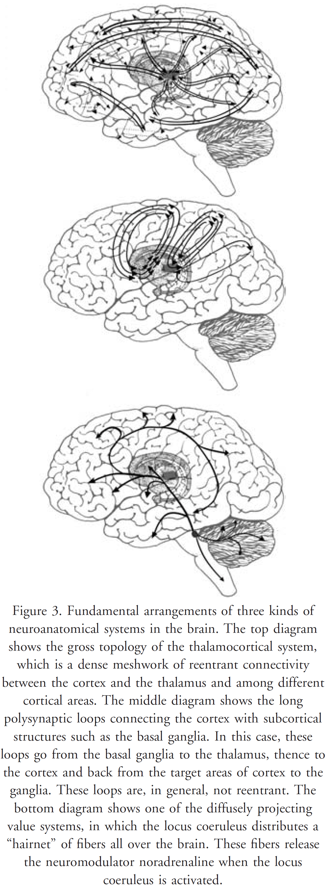
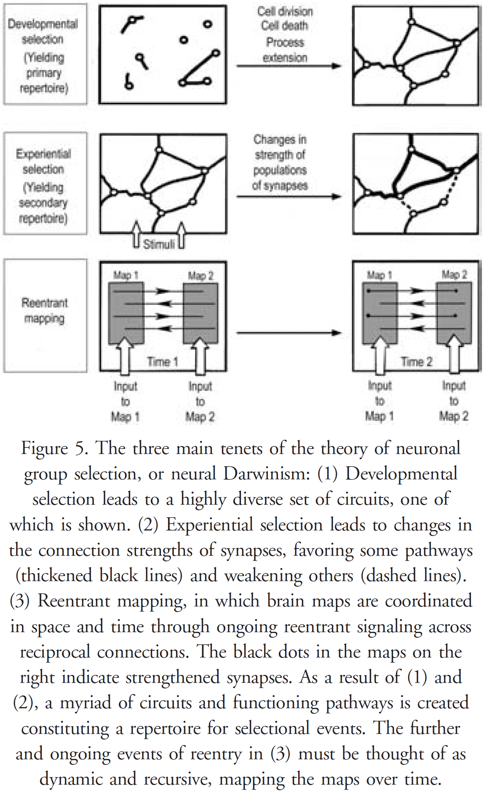
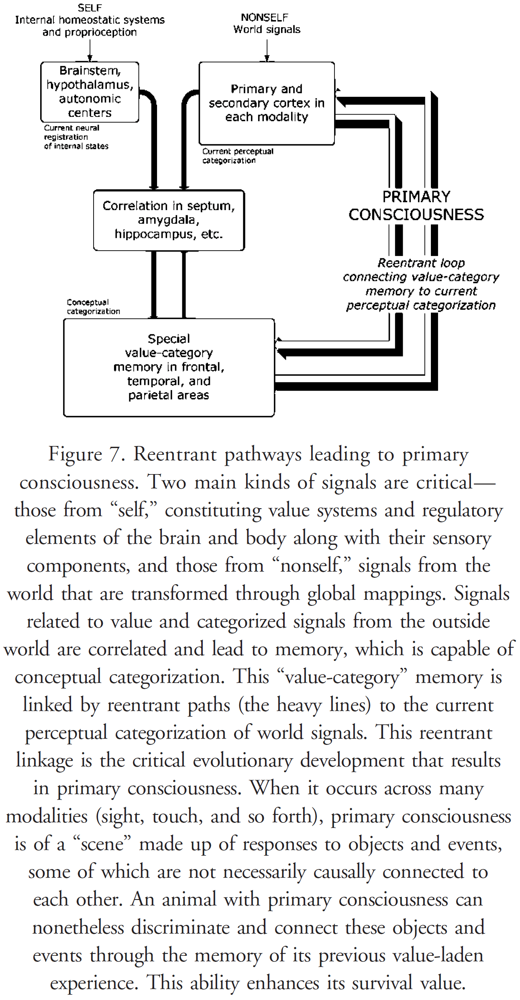

## Chapter 1: The Mind of Man: Completing Darwin’s Program

- A scientific analysis of consciousness must answer the question: How can the firing of neurons give rise to subjective sensations, thoughts, and emotions?
- An explanation must connection these two domains with a cause and effect.
- Review of Alfred Wallace and Charles Darwin discussing the apparently impossible evolution of the brain.
- Darwin left an incomplete program—a view of consciousness as a product of evolution rather than a mysterious substance.
- To continue Darwin’s program, we need a biological theory of consciousness. A theory that shows how the neural bases for consciousness could have evolved and how it develops.
- Two challenges to a theory of consciousness
    - To show the neural bases of consciousness.
    - To show how a neural mechanism results in a subjective conscious state (qualia).

## Chapter 2: Consciousness: The Remembered Present

- We all experience and know what consciousness is; it’s what you lose when you fall into dreamless sleep and what you regain when you wake up.
- But we know that consciousness isn’t just memory. Perhaps we’re conscious during all of sleep but only forget when we wake up.
- Consciousness is utterly dependent on the brain.
- There’s now a vast amount of empirical evidence to support the idea that consciousness emerges from the organization and operation of the brain.
- E.g. There is no evidence for a free-floating spirit or consciousness outside the body.
- What features of the body and brain are necessary and sufficient for consciousness?
- Since consciousness arises from each individual’s brain and bodily functions, there can be no direct or collective sharing of that individual’s unique or historical conscious experience.
- Consciousness is a process and not a thing.
- It’s a dynamic accomplishment of the distributed activities of neuron populations in many different areas of the brain.
- Attention modulates conscious states but it isn’t the same as consciousness.
- The remembered present is the fact that all experience is engaged in forming an integrated awareness of this moment, even if that experience isn’t consciously recalled.
- Another property of consciousness, unique to humans, is that we are conscious of being conscious.
- We need a distinction between primary consciousness and higher-order consciousness.
- Primary consciousness: the state of perceiving sensations in the world.
- Primary consciousness isn’t accompanied by any sense of self, the past, or the future. It exists in the remembered present.
- Higher-order consciousness: the state of perceiving consciousness in the self.
- Any animal with higher-order consciousness must also have primary consciousness.
- There are different levels of consciousness.
- E.g. REM sleep, awake, and disorders of consciousness such as schizophrenia.
- Qualia/Quale: the experience of one/multiple physical properties.
- E.g. Greenness, warmth, pain.
- Only a being with an individual body and brain can experience qualia.
- Qualia: high-order discriminations that constitute consciousness.
- Differences in qualia are based on differences in the nervous system’s wiring and activity.
- Qualia are always experienced as parts of the unitary and integrated conscious state.
- All conscious events involve a complex of qualia and it isn’t possible to only experience a single quale.
- E.g. Red, sweetness, pressure.
- Qualia reflect the ability of conscious individuals to make high-order discriminations.
- E.g. If a mouse detects the hooting of an owl, the dimming of moonlight, and the brush of wind, it might scurry to safety. Each of these quale allow the mouse to discriminate predators.
- Consciousness, and more specifically the connectome, allows the integration of the present with an animal’s past history to provide the animal with survival value.

## Chapter 3: Elements of the Brain

- The human brain is the most complicated material object in the known universe (except for maybe black holes, and the universe itself, and two human brains).
- Neurons are the message-carrying cells of the brain.
- Review of brain regions and neurons.
- Each layer of the neocortex has different connection patterns.
- The cortex is subdivided into regions that mediate different sensory modalities and motor functions.
- Beyond the sensorimotor regions concerned with input and output to the body, the frontal, parietal, and temporal lobes are only connected to other parts of the brain and not to the outside world.
- Review of synapse and action potential.
- Neuronal communication occurs by a combination of semi-controlled, semi-random electrical and chemical events.
- The thalamus is one of the most important anatomical structures for understanding consciousness.
- It’s at the center of the brain and nerves from different sensory receptors connect to the thalamus, which then project those signals to particular areas of the cortex.
- E.g. Eye to optic nerve to thalamus (lateral geniculate nucleus) to primary visual cortex.
- One interesting feature of the thalamus is that there are reciprocal fibers going from the cortex back to the thalamus.
- E.g. Thalamocortical projections for sending sensory experience to the cortex, and corticothalamic projections for sending feedback from the cortex to modify the thalamus.
- There are also feedback connections within the cortex called corticocortical tracts.
- E.g. Corpus callosum and anterior commissure.
- Each specific thalamic nucleus doesn’t directly connect to any other nucleus.
- Increased synaptic strength within a pathway increases the chance of conduction along that pathway, while decreased synaptic strength diminishes that chance.
- E.g. Hebb’s rule and STDP.
- The brain also has multiple value systems, each responsible for controlling rewards and responses using different neurotransmitters.
- E.g. Noradrenaline, serotonin, acetylcholine, dopamine.
- The prominent feature of the value systems is that they diffusely project, affecting large populations of neurons simultaneously.
- They’re systems that modulate the responses and functioning of other systems.

- The result of livewiring is a pattern of constancy and variation leading to unique networks in each animal.
- The extreme views of the brain as being modular or being whole (holistic view) doesn’t match evidence.
- We must account for both differentiation and integration in the brain.
- There are brain areas that if damaged or removed will lead to permanent unconsciousness, but these structures aren’t the site of consciousness.
- E.g. Reticular formation and intralaminar thalamic nuclei.
- Consciousness needs their activity but they aren’t sufficient for consciousness.

## Chapter 4: Neural Darwinism: A Global Brain Theory

- There’s one simple principle that governs how the brain works: it evolved and it wasn’t designed.
- Brains have an extraordinary amount of variation.
- E.g. Different people have different genetics, environments, bodies, and histories.
- The result is an enormous variation at levels such as neuronal chemistry, network structure, synaptic strengths, memories, and value systems.
- This leads to differences from person-to-person in the contents and styles of their stream of consciousness. In essence, personality.
- In evolution, individuals that better suit their environment survive and reproduce. In the brain, neurons that match value systems or rewards are more likely to survive and contribute to the production of future behavior.
- The brains of higher-level animals autonomously construct patterned responses to environments that are full of novelty.
- Theory of neuronal group selection (TNGS)
    - Developmental selection
        - During development, the brain starts with a variation specified by its genes.
    - Experiential selection
        - With experience, the brain changes itself to conform/select the variant that best matches its environment.
    - Reentry
        - The brain develops many reciprocal connections both locally and distally, providing the basis for feedback signaling.
        - Unlike feedback, reentry isn’t the looping of an error signal. Instead, it involves many parallel reciprocal paths and has no prescribed error function attached to it.

- Reentry solves the binding problem by providing widespread synchronization of neural activity.
- The three tenets of the TNGS form a selectional system, which applies to evolution, the immune system, and the nervous system.
- The first tenet assumes a means for generating diversity in a population of elements.
- The second tenet is a means for allowing encounters between elements and the system-to-be-recognized.
- E.g. Environment, foreign molecule, sensory signals.
- The third tenet is some means to amplify features of the elements to meet selective criteria.
- Although evolution, the immune system, and the nervous system all obey these principles, they use different mechanisms to achieve a successful match between input and output.
- The brain can use different neural circuits to achieve similar outputs through synchrony.
- This is important because it solves the binding problem.

## Chapter 5: The Mechanisms of Consciousness

- One basic process in higher brains is the ability to carry out perceptual categorization of the world.
- E.g. Object recognition, matching a voice to a person, recognizing scents.
- In mammals, perceptual categorization is implemented by the interactions between sensory and motor systems called global mappings.
- Global mapping: a dynamic structure of various sensory maps, each with different functional properties linked by reentry. These are then linked by non-reentrant connections to motor maps and subcortical systems.
- A global mapping samples the world of signals by movement and attention, and then categorizes these signals through reentry and synchronization of neuronal groups.
- Perceptual categorization can’t give rise to generalization across various sensory modalities because they’re modality-specific.
- For such generalization, the brain must map its own activities to create a concept—it must make maps of its perceptual maps.
- By abstracting certain features from perceptual maps, the brain creates higher-order maps.
- What’s the sufficient evolutionary event leading to the emergence of consciousness?
- The author proposes that the event was the transition between reptiles and birds, and reptiles and mammals. Specifically the development of new reentrant connections in the brain.
- Cortical reentry was mediated by the emergence of several grand systems of reentrant corticocortical connections linking distributed areas of the cortex.
- Simultaneously, there was an increase in the reentrant connectivity with the thalamus and cortex.
- These reentrant connections are the critical evolutionary development that results in primary consciousness.

- The ability to create a scene by reentrant correlations between value-category memory and similar or different perceptual categories is the basis for the emergence of primary consciousness.
- Consciousness is an active process.
- Higher-order consciousness confers the ability to imagine the future, explicitly recall the past, and to be conscious of being conscious.

## Chapter 6: Wider Than the Sky: Qualia, Unity, and Complexity

- One extraordinary phenomenal feature of conscious experience is that it’s unitary.
- E.g. An experienced moment includes sensory input, consequences of motor activity, imagery, emotions, memories, bodily sensations, and a periphery.
- A conscious subject is unable to carry out three or more simultaneous behaviors.
- E.g. Talk and text and dance.
- However, learning can change conscious behaviors into nonconscious behaviors, allowing a person to perform multiple tasks.
- E.g. Walking and talking.
- Consciousness is a process tied to a body, brain, and their history.
- The evidence from neuroscience on why different qualia feel different is because the neural structures and dynamics underlying qualia differ.
- E.g. Vision is distinct from smell, which is distinct from touch, which is distinct from hearing.
- No notes on complex systems.
- The thalamocortical system gives rise to the “dynamic core”—a meshwork of cortical and thalamic areas and reentrant connections.
- Dynamic core: a functional cluster that mostly speaks to itself through an enormous complex of signals that change across the reentrant meshwork.
- The core is precisely the kind of complex neural organization necessary for the unitary, yet differentiable, properties of consciousness.
- E.g. It has the reentrant structure capable of integrating/binding the activities of various thalamic nuclei to produce a unified scene. But changes to the dynamic core in response to signals from within and outside engage new sets of dynamic, functional, and segregated circuits, accounting for the differentiation of consciousness.
- Observing everything about a brain without the animal’s body can’t fully recapture the content of consciousness.

## Chapter 7: Consciousness and Causation: The Phenomenal Transform

- How is consciousness entailed by neural processes? Is consciousness itself causal?
- The previous chapters have argued that conscious processes arise from the enormous number of reentrant interactions between value-category memory systems in the thalamocortical system and the posterior systems that carry out perceptual categorization.
- Only with the evolution of higher-order consciousness (based on semantic capabilities) do explicit concepts of self, past, and future emerge.
- The fundamental neural activity of the reentrant dynamic core converts signals from the world and brain into a phenomenal transform—into what it’s like to be that conscious animal.
- The phenomenal transform is a simultaneous property of neural activity.
- To be nonconscious means to also not be conscious of being conscious.
- Consciousness, to William James, was added in evolution for the sake of steering a nervous system grown too complex to regulate itself.

## Chapter 8: The Conscious and the Nonconscious: Automaticity and Attention

- We’re familiar with the various levels of focused consciousness.
- E.g. Rest state, habits, automatic activities, flow state.
- These levels are related to the functioning of subcortical structures and the thalamocortical core.
- We’ll focus on the transactions between the basal ganglia and the cerebral cortex as they connect nonconscious functions to conscious ones.
- The basal ganglia are five nuclei at the center of the brain that receive connections from the cerebral cortex and project to the cortex via the thalamus.
- The connections are topographically organized in both directions.
- The input nuclei from the cortex is the striatum, which consists of the caudate nucleus and putamen.
- The basal ganglia receive inputs from practically all regions of the cortex.
- The intralaminar nuclei of the thalamus also project to the striatum.
- The output nuclei are the globus pallidus and part of the substantia nigra.
- The motor circuits of the basal ganglia modulate movement by enhancing certain cortical responses and suppressing others.
- Evidence supports the hypothesis that connections between the basal ganglia and cortex are involved in the execution of automatic motor programs.
- Conscious attention may be mediated by more than one mechanism.
- E.g. Rest state is corticocortical and thalamocortical reentry. Focal attention is gating by the reticular nucleus of specific thalamic nuclei. Highly focal attention is the loops of interaction between the basal ganglia and the frontal/parietal cortices.
- The anatomy described in this chapter was necessary to reveal the differences between nonconscious structures like the basal ganglia and cerebellum, and the conscious thalamocortical core.
- The core is enormously reentrant but in contrast, the basal ganglia are long inhibitory loops.
- The core acts as a functional cluster, interacting largely with itself to yield conscious states.
- The ability to open or restrict cortical-basal ganglion interactions, thus modulating the content of consciousness, can affect the range of core cluster states.

## Chapter 9: Higher-Order Consciousness and Representation

- Animals with only primary consciousness lack a sense of the past, future, and a socially defined and named self.
- Furthermore, they’re not conscious of being conscious.
- So what’s missing?
- The author argues that they’re lacking semantic capabilities.
- Our main reference for higher-order consciousness is ourselves.
- The evolution and development of semantic, and then linguistic, ability is critical for the development of higher-order consciousness.
- As these capabilities develop in a person, the range of conscious thought explodes.
- The brain is capable of going beyond the information given.
- Meaning isn’t identical to mental representation and instead emerges from the interplay between value systems, varying environmental cues, learning, and nonrepresentational memory.
- There are many ways in which neural circuits, synaptic populations, signals, and previous history can lead to the same meaning.
- For any representation, there can be many underlying neural states and context-dependent signals.

## Chapter 10: Theory and the Properties of Consciousness

- Assumptions for the author’s theory of consciousness
    - A biological theory of consciousness depends on a global brain theory.
    - The principles of physics must be obeyed, so no spooky forces.
- Theory of neuronal group selection (TNGS)
    - Primary consciousness emerges from the reentrant interactions between brain areas mediating value-category memory and perceptual categorization.
    - These interactions result in the construction of a scene and are based in the dynamic core—the thalamocortical system.
    - Higher-order consciousness arises by the evolution of more reentrant capability.
    - Specifically, when concept-forming brain areas are linked by reentrant circuits to semantic capability areas.
- A theory of consciousness must explain all known properties of the conscious state.
- Three categories of conscious properties
    - General
        - E.g. Conscious states are unitary, integrated, diverse, temporally ordered, and constructed by the brain.
    - Informational
        - E.g. Intentionality, widespread access, and associativity. Subject to attentional modulation.
    - Subjective
        - E.g. Reflects feelings, qualia, mood, and context.
- How is consciousness temporally continuous when its cause, neural states, aren’t smooth?
- The discontinuous firing of discrete neurons overlaps in large neuronal groups in time and space.
- No further notes on this chapter due to the author’s wordiness and my disagreement with the presented explanations.

## Chapter 11: Identity: The Self, Mortality, and Value

- The ability to construct a scene related to the value-category history of an individual marks the appearance of the self.
- Since sensorimotor signals from the body are continuously received, subjectivity is a baseline event that’s never extinguished in the normal life of conscious individuals.
- Animals without semantic abilities can’t have higher-order consciousness.
- When the necessary reentrant circuits evolved in higher primates and humans, a concept of self appeared along with concepts of the past and future.
- Higher-order consciousness may be a trade-off between absolute precision and rich imagination.
- The conscious brain in health and disease will integrate what can be integrated and resists a fractured or shattered view of reality.
- E.g. Hemineglect and alien hand syndrome.

## Chapter 12: Mind and Body: Some Consequences

- Physics, which assumes consciousness and perception and takes a God’s-eye view, differs from the study of consciousness, which takes the first-person point of view.
- Consciousness reflects the ability to make distinctions and discriminations among huge sets of alternatives.
- While no mental change can occur without an underlying neural change, the converse—a neural change resulting in a mental change—isn’t always true.
- Many neural changes have no effect on the phenomenal experience of consciousness.
- E.g. The unconscious processing of color or tone.
- In REM sleep, the brain speaks to itself in a special conscious state, constrained neither by sensory input nor by motor output.
