## [Cerebral cortex expansion and folding: what have we learned?](https://doi.org/10.15252/embj.201593701)

- Cortical folding takes place during embryonic development and is important to optimize the functional organization and wiring of the brain, as well as to fit a large cortex in a limited cranial volume.
- Disorders in cortical folding lead to severe intellectual disability and intractable epilepsy.
- Paper discusses some of the most significant advances in our understanding of cortical expansion and folding over the last few decades.
- Most animals with a large brain have a folded cortex, whereas most animals with a small brain have a smooth cortex.
- The cerebral cortex is a laminar tissue where neurons lie on the upper part (grey matter), and the lower/inner part contains most of the wiring connecting neurons between brain areas (white matter).
- The process of cortical folding takes place during brain development, so it’s essentially a developmental problem.
- We will frame cortical expansion within the basic principles of cerebral cortex development in the mouse model.
- Neuroepithelial cells (NEC) make up the cortical primordium, the beginnings of the cerebral cortex.
- Because NECs are the founder progenitor cells of the cerebral cortex, their pool size determines the number of derived neurogenic cells and the final number of cortical neurons.
- Hence, NECs have a fundamental impact on the size of the cerebral cortex.
- NECs may be increased by extending the time period of their self-amplification and by delaying the onset of neurogenesis, as observed in primates compared to rodents.
- NEC abundance leads to expansion in surface area and folding of the neuroepithelium.
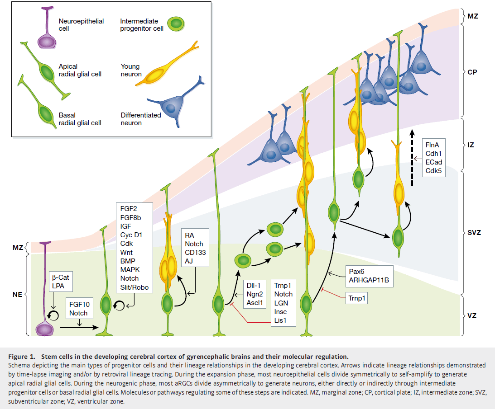
- It’s proposed that the outer subventricular zone (OSVZ) plays central roles in the dramatically increased neurogenesis and folding in the cerebral cortex of higher animals.
- This idea is supported by evidence where forced overproliferation of OSVZ progenitors increases cortical surface area and folding, whereas blocking their proliferation has the opposite effect.
- OSVZ plays a significant role in cortical expansion and folding not only because it increases neuron production, but also because of its high content of basal radial glial cells (bRGC).
- The radial fiber scaffold must be modified so that the increased numbers of radially migrating neurons don’t pile in thick layers, but are distributed along the cortex.
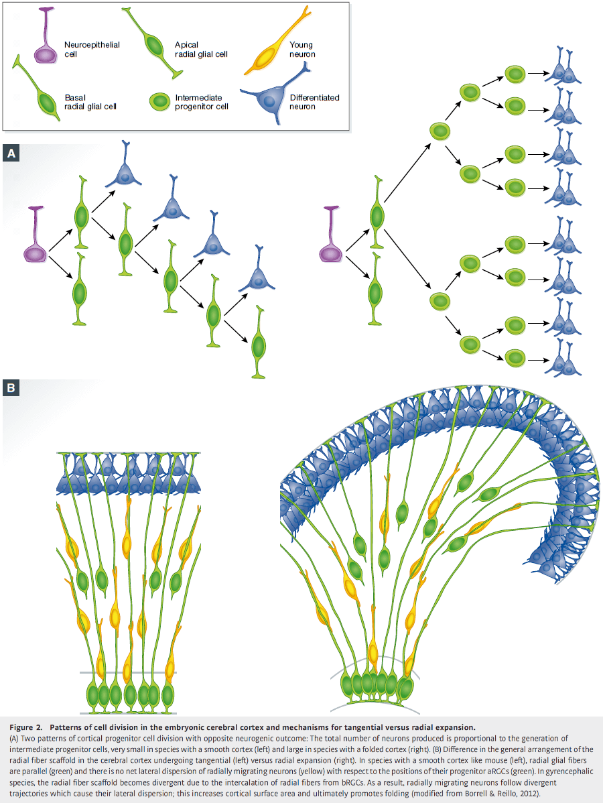
- An elegant solution to prevent piling is to create a divergence in the array of radial fibers with additional intercalated fibers.
- The source of additional radial fibers to create this divergence is bRGCs.
- This radial divergence model has been validated by several labs, where bRGC abundance and proliferation have been experimentally manipulated in the ferret and mouse.
- E.g. Partial blockade of OSVZ progenitor proliferation in the developing ferret cortex without losing many neurons leads to a reduction in size of cortical folds and lissencephaly. The opposite, a forced overproliferation, significantly increases cortical surface area and folding.
- Mounting evidence from comparative neuroanatomy strongly supports that increased neuron numbers aren’t sufficient for cortical folding, and that additional mechanisms are required.
- The tangential dispersion of radially migrating neurons seems key in the expansion of cortical surface area that leads to folding, and this depends on an abundance of bRGCs.
- So regulation of the different types of cortical progenitors, particularly bRGCs, is critical in this process.
- bRGCs are generated from aRGCs in the VZ.
- A landmark finding on the molecular regulation of cortical folding by control of progenitor cell lineage was the identification of Trnp1.
- Trnp1 is strongly expressed in self-amplifying aRGCs and its expression decreases as aRCGs gradually stop self-amplifying to produce IPCs and neurons.
- Trnp1 was the first gene able to induce genuine folding of the mouse cerebral cortex.
- Another gene, ARHGAP11B, also drives folding in the mouse cerebral cortex and likely has a central role in human brain evolution and uniqueness.
- What defines the location and shape of cortical folds and fissures?
- The traditional view is that the folds form randomly due to cortical growth exceeding cranial volume.
- However, evidence indicates that this is wrong.
- E.g. If a part of the cerebrum fails to develop/grow, the skull tends to conform to the size and shape of the remaining neural tissue, which still folds. Thus limited cranial volume doesn’t force cortical folding.
- Further evidence against the traditional view is that the pattern of folds and fissures is highly stereotyped and well conserved among individuals of a species.
- Also, folding patterns of phylogenetically related species follow remarkably similar trends and even in species with large cortices, like humans, the deepest and earliest fissures to develop do so at strikingly conserved positions.
- E.g. Twins.
- To summarize, cortical folding patterns appear to be due to strong genetic regulation.
- The location of cortical folds and fissures is preceded and mirrored by regional variations in progenitor cell proliferation.
- Expression modules along the OSVZ faithfully map the eventual location of cortical folds and fissures.
- One hypothesis on the biomechanics of cortical folding is that cranial volume limits cortical size, so that as cortical tissue grows in surface area, the skull offers resistance to its outward expansion, thus forcing the neural tissue to buckle and fold onto itself.
- This has been disproven for the mammalian brain as cortical folding takes place even in the absence of compressive constrain from the skull.
- Another hypothesis is that tension between neurons could cause folding.
- However, this has also been challenged by cutting axons in living brains and seeing if the folds relax. While it was found that there is considerable tension in deep white matter tracts, there is no tension within the core of individual gyri so the folds couldn’t have resulted from tension.
- Another disproven hypothesis is that cortical folding is similar to crumpling a ball of paper (tissue buckling), but this isn’t true as
    - The cortex folds while it develops and grows, not after.
    - It’s based on physical models only valid for single-molecule thin materials.
    - The theory considers that the whole brain folds, while folding only involves the cortical gray matter.
    - Folding of the cerebral cortex doesn’t happen randomly, as when crumpling a paper ball, but in a highly stereotyped process, defining patterns that are characteristics and distinct for each species.
- The current hypothesis (that matches experimental data) is that local differences in tissue growth is a key factor driving cortical folding.
- Tissue buckling and cortical folding may ultimately result from the mutual influence between physical properties, biomechanics, and differential tissue growth.
- Defects in human cortical development have been recognized as coming from the disruption of some of the cellular and molecular mechanisms described in this paper.
- Review of brain size disorders (microcephaly, megalencephaly, dysplasia) and cortical folding disorders (lissencephaly, polymicrogryia, cobblestone, periventricular heterotopia).
- What are the advantages of cortical folding?
- A bigger cortex means more neurons and thus greater computational power.
- Folding also brings together highly interconnected cortical areas, thus minimizing cortical wiring, favoring high speed communication, and optimizing brain circuitry.

## [Memory Retrieval from First Principles](https://doi.org/10.1016/j.neuron.2017.03.048)

- Paper proposes a set of first principles for neural-inspired cognitive modeling of memory retrieval that has no biologically unconstrained parameters.
- Progress in physics, as in other scientific disciplines, is achieved by the formulation of first principles, development of a mathematical framework for their description, and experimentally testing the resulting predictions.
- It’s still unclear whether similar principles exist in neuroscience, such as allowing a link between basic components (neurons, synapses) to cognitive functions (memory, emotion, language).
- First principles of memory retrieval
    1. The encoding principle states that an item is encoded/represented in the brain by a specific group of neurons in a dedicated memory network. When an item is retrieved/recalled, either randomly or when triggered, this specific group of neurons is activated.
    2. The associativity principle states that, in the absence of sensory cues, a retrieved item plays the role of an internal cue that triggers the retrieval of the next item.
- The first principle reflects the distributed nature of memory, whereas the second principle provides a crucial link between neuronal and cognitive processes.
- Free recall paradigm: participants are given random lists of items and are asked to recall as many words as possible in an arbitrary order.
- In other less, studied paradigms, participants are asked to recall items depending on features of such items.
- E.g. First letter of word is ‘a’ or objects that are animals.
- The fact that similar recall performance was obtained for two different paradigms suggests common computational principles underlying recall.
- One recall model based on the two principles here is that
    - For encoding, each memory item is represented by a network of neurons.
    - For associativity, recall is driven by the overlaps between representations of different items.
    - The next item chosen depends on the group with the greatest overlap.

- The model matches well with experimental data.

## [Neuroscience Needs Behavior: Correcting a Reductionist Bias](https://doi.org/10.1016/j.neuron.2016.12.041)

- One aim of neuroscience is causal explanation of the brain through neural manipulations that allow testing of necessity and sufficiency claims.
- Paper argues for another approach to neuroscience, one that seeks an alternative form of understanding through careful theoretical and experimental decomposition of behavior.
- That the study of the neural implementation of behavior is best investigated after behavioral work.
- Behavioral work provides understanding, whereas neural interventions test causality.
- Paper argues that the detailed examination of brain parts or their selective perturbation isn’t sufficient to understand how the brain generates behavior.
- E.g. Spatial summation in dendrites or the biophysics of receptors.
- One reason is that we have no prior knowledge of what the relevant level of brain organization is for any given behavior.
- It’s very hard to infer the mapping between the behavior of a system and its lower-level properties by only looking at the lower-level properties.
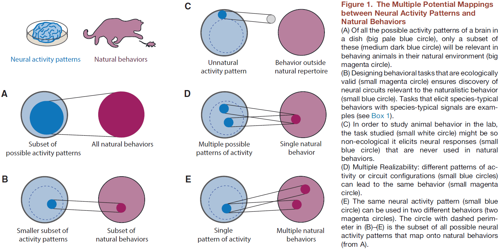
- The first step in developing conceptual frameworks that meaningfully relate neural circuits to behavioral predictions is to design hypothesis-based behavioral experiments.
- However, it’s disturbingly common for studies to include behavior as an add-on in papers and to focus more on the methodology.
- Review of Marr’s three levels of analysis.

- Understanding something isn’t the same as describing it or knowing how to intervene to change it.
- “Trying to understand perception by understanding neurons is like trying to understand a bird’s flight by studying only feathers.” - David Marr
- One example of problems that arise if neural data are used to infer a psychological process comes from the idea of mirror neurons.
- Mirror neurons: neurons that fire whether a monkey itself performs an action or if it observes another individual performing the same action.
- Mirror neurons show a key error: behavior is used to drive neuronal activity but no either/or behavioral hypothesis is being tested.
- So, an interpretation is mistaken for a result; that mirror neurons understand the other individual.
- This is also an example of the overwise neuron fallacy.
- But moving to understanding groups of neurons, rather than individual neurons, such as circuits and networks is still ignoring the importance of behavior.
- It’s unclear how fundamentally different it is to conceptually move from neuron to neurons.
- One case for recording from populations of neurons or characterizing whole networks is the phenomenon of emergence.
- Emergence: neurons in their aggregate organization cause effects that aren’t apparent in any single neuron.
- This leads to the conclusion that behavior itself is emergent from aggregated neural circuits and should therefore be studied in its own right.
- How has neuroscience dealt with the gap between explanation and description?
- It has opted to favor interventionist causal versions of explanation.
- E.g. Optogenetics or transcranial magnetic stimulation.
- The critical point here is that causal-mechanistic explanations are qualitatively different from understanding how component modules perform the computations that then combine to produce behavior.
- Related to the paper titled “Could a Neuroscientist Understand a Microprocessor?”, to understand a microprocessor requires starting from the point of the game (behavior) and not from the point of transistors.
- A reverse engineer might ask how the chip is fulfilling the higher-order needs of gameplay.
- We start from behavior and work our way down to the implementation and neuron level.
- E.g. Bird flight → Flapping wings and not wiggling its feet → Wings are made up of feathers → Understanding that the flapping of wings is critical to flight aids in the subsequent study of feathers.
- It’s unlikely that studying an ostrich feather in isolation would lead to the conclusion that there’s a phenomenon such as flight or that it’s useful for flight.
- One objection is to say “Who cares what philosophers say as we’re scientists, not philosophers.”
- However, this is no escape from philosophy. Every scientist takes a philosophical position, either explicitly or implicitly.
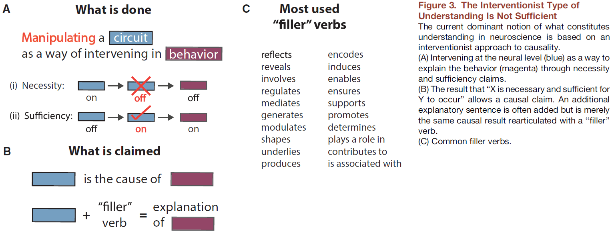
- Four examples of how behaviorally-driven neuroscience yields more complete insights
    - Bradykinesia: a symptom of Parkinson’s disease, which manifests as lack of movement vigor.
        - It’s causally related to dopamine depletion in the substantia nigra but this fact doesn’t help us understand why.
        - Human psychophysical experiments led to analogously designed experiments in mice that demonstrated that there are cells in the dorsal striatum whose activity correlates with movement vigor.
        - The complete interpretation of these experiments requires the explanatory framework provided by the initial human behavioral work.
    - Sound localization
        - One way to localize sound is to use interaural time difference cues as proposed by the Jeffress model.
        - The Jeffress model shows how a computational goal can be achieved by an algorithm implemented in delay lines.
        - The predictions of this algorithmic model were confirmed at the implementation level in barn owls.
        - It’s hard to imagine how recordings, staining, and anatomical studies of the barn owl auditory system in the absence of behavior could have motivated a computational theory.
        - It was subsequently discovered that the mammalian auditory system solves the same computational problem using a different algorithm with a different implementation at the circuit level.
        - This finding is a compelling example of multiple realizability and how different algorithms have different implementations but solve the same computational problem.
    - Electrolocation
        - Jamming avoidance response: when two weakly electric fish are discharging an oscillating electric field at the same frequency, they will modify their discharge frequencies to avoid jamming each other’s electrolocation system.
        - This is important because their ability to localize objects in the dark is mediated by sensing distortions in their self-generated field.
        - The point is that even within a behaviorally-oriented model system, understanding the key components of this system didn’t enable a full understanding of how the brain processes signals until careful behavioral simulation work was done.
    - Motor learning
        - This is another example of multiple realizability as a behavior that looks like pure error-based cerebellar learning can result from many distinct learning algorithms.
- The core argument is that if there are many ways to neurally generate the same behavior, then the properties of a single circuit are, at best, a particular instantiation and don’t reveal a general design principle.
- Two points illustrated by these four examples
    - Experiments at the level of neural substrate are best designed with hypotheses based on pre-existing behavioral work that has discovered/proposed candidate algorithmic and computational processes.
    - The explanations of the results at the neural level are almost entirely dependent on the higher-level vocabulary and concepts derived from behavioral work.
- Lower levels of explanation don’t “explain away” higher levels.
- E.g. In genetics, the major principles of genetics were all inferred from external evidence long before the internal molecular structure of the gene was even seriously thought about.
- Neuroscience has been focused of late on neural circuits.
- Paper contends that such an approach is simply not going to yield the kind of insight and explanation that we ultimately demand from neuroscience.
- Instead, we should have a more pluralistic conception of mechanistic understanding.
- Pluralism in science: the doctrine advocating the cultivation of multiple systems of practice in any given field of science.
- “Without the proper technological advances, the road ahead is blocked. Without a guiding vision, there is no road ahead.” - Woese
- Perhaps the goal of neuroscience isn’t to explain the brain, but to explain behavior in terms of a neural basis.

## [An Annotated Journey through Modern Visual Neuroscience](https://doi.org/10.1523/JNEUROSCI.1061-19.2019)

- The hope is that by looking back at highlights in the field of visual neuroscience, we can better define the remaining gaps in our knowledge and thus guide future work.
- Paper reviews the progress made in visual neuroscience so far though a community-compiled list of the 25 most important articles in the field.
- Visual threshold and single-photon responses
    - A visual stimulus can be detected when it’s made up of at least five photons.
- Center-surround receptive fields
    - Review of ON, OFF, and ON-OFF receptive fields.
    - Ganglion cell receptive fields are large enough to overlap their neighbors.
- Linear and nonlinear responses
    - Some neurons sum nonlinearly from receptive field subunits.
    - E.g. An ON input to a receptive field and an OFF input from another part of the receptive field don’t simply cancel each other out.
- Feature detectors
    - The properties of a visual stimulus include not only its luminance and size, but also its shape, curvature, contrast, and motion.
- Orientation selectivity
    - There are orientation- and direction-selective responses in the primary visual cortex, described as simple and complex cell.
- Direction selectivity in the retina
    - Direction selectivity is computed over small subunits of the receptive field.
- Diverse retinal cell types, organization, and responses
    - Advances in dye filling and tissue imaging have revealed a striking repetition of circuit motifs across the retina.
    - The identification of the third retinal photoreceptor: intrinsically photosensitive retinal ganglion cells.
    - These photoreceptors control the pupillary reflexes and circadian rhythm.
- Link between eye and brain
    - The LGN isn’t just a simple relay of retinal signals to the visual cortex.
    - However, little is known about the way the LGN uses its massive feedback to filter visual signals sent to cortex.
- Wiring the visual system
    - Monocular deprivation following birth caused cortical neurons to become unresponsive to inputs from the deprived eye.
    - This deficit didn’t occur when deprivation was performed later in life, suggesting an early critical period for visual development.
    - Experiments also suggest that spontaneous activity before eye opening is important for visual circuit development.
    - Wave-like patterns of activity propagating across the developing retina provide a potential way for the brain to identify axons from adjacent ganglion cells from the same eye using correlated firing patterns.
    - E.g. Spatial location would be mapped by a temporal sequence of APs.
- Coding in the visual system
    - How does the brain generate sight?
    - Sparseness is central to the ability of filters to decorrelate features of natural images, thus providing higher visual areas with a more efficient signal.
- Two ways to see
    - Different visual deficits began to be regularly described for patients with temporal versus parietal cortex lesions.
    - Temporal lesions often resulted in impaired visual recognition, while parietal lesions often resulted in visual spatial impairments.
    - Review of the ventral/what and the dorsal/where visual pathways.
    - These two pathways may be better defined as the perception versus action pathways.
- Face cells
    - Faces are among the earliest, most intimate, and most important stimuli that we encounter.
    - Face selectivity was subsequently shown in human cortex.
- From brain to perception
    - Experiments on macaques suggested that individual neurons judge motion direction just as well as the animal, and predicted that perceptual judgment of motion and direction might only require a handful of cells.
    - Later experiments showed that local electrical stimulation of MT neurons within a single direction column was enough to influence the perception of motion in the direction associated with the stimulated column.
- The whole visual system
    - Our modern understanding of the localization of function stems from work in human patients exhibiting specific neurological problems, and from precise electrical stimulation and lesion studies in both animals and humans.
    - There appears to be a hierarchical connectivity map that showed all the known paths taken by information as it passes from the eyes to the brain.
    - The hierarchy outlines 32 visual cortical areas organized across 9 hierarchical layers, with each layer being highly interconnected.

## [A place theory of sound localization](https://doi.org/10.1037/h0061495)

- It’s generally accepted that a low frequency tone is localized by a phase difference at the two ears.
- E.g. At the ear closer to the sound source: $$a*sin(2 \pi ft)$$ and at the other ear: $$a'*sin(2 \pi ft + \phi)$$ where $$\phi$$ is the phase difference.
- For low frequency tones, the two amplitudes of the sound at each ear don’t differ by much.
- Another expression for the pressure at the more distant ear is $$a'*sin(2 \pi f(t+t'))$$ where $$t'$$ is the time required for the sound to travel the extra distance to the farther ear.
- A failure to distinguish between phase expressed as an angle, $$\phi$$, and phase expressed as time, $$t'$$, has lead to some confusion in the literature.
- For a particular location of the sound source, $$\phi$$ will vary with frequency while $$t'$$ will not.
- From other studies, we can reasonably assume that the basis for our ability to localize clicks and low frequency notes is the time difference $$t'$$.
- Paper undertakes how $$t'$$ may be represented in the CNS as a “place”.
- The proposed mechanism for representing a time difference as a difference in place depends on two physiological functions
    - The slow rate of conduction of small nerve fibers
    - The phenomenon of spatial summation
- If we structure neural pathways in a specific way, then we have the necessary structural mechanism for representing a time difference spatially.
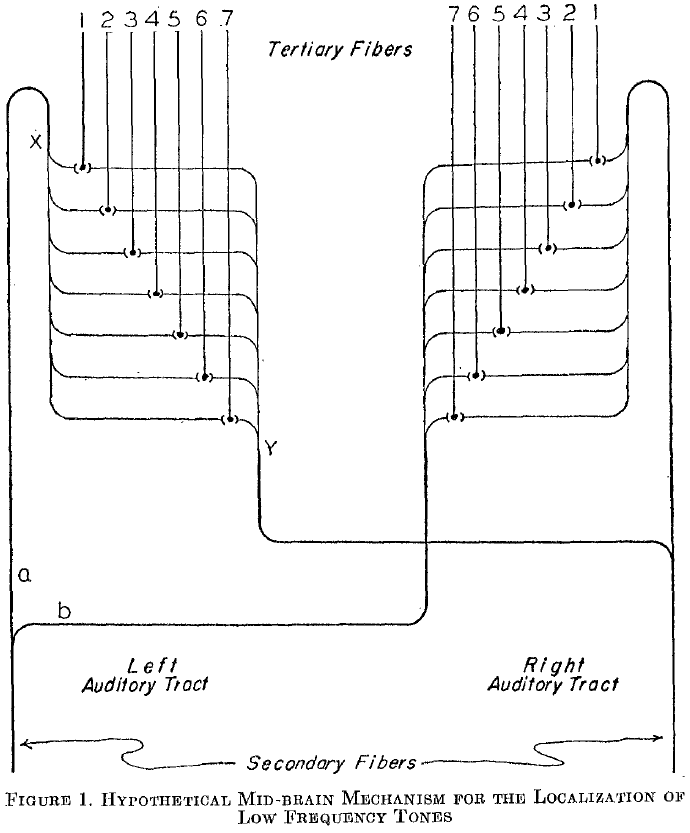
- This is known in present day as the “Jeffress model” of sound localization.
- E.g. If we play a 200 cycles per second tone, we should expect 200 impulses per second to be transmitted by the auditory nerve to the cochlear nuclei. Since the tones at the two ears are in phase and have the same intensity, we expect the impulses to reach the nuclei at the same time.
- In figure 1, this would mean fiber 4 receives the stimuli simultaneously from both sides every 1/200th of a second.
- The other fibers will also receive stimuli from both sides but since it isn’t simultaneous (due to the delay from sending signals), no spatial summation occurs.
- If we move the sound source to the left, then fibers 6/7 will be stimulated because the sound takes more time to travel from the right but less time from the left side.
- Thus, we have a difference of time represented as a difference in place.
- Possible locations of this mechanism
    - We need a location where connections from both ears are found and where the delays due to prior synapses have been equal, so that the impulses are in-phase until the mechanism.
    - The most obvious place is the superior olivary nucleus (SON) but another study suggests that this isn’t the location of the mechanism.
    - The issue with SON is that when out-of-phase sounds are presented and we record from SON, we find that the activity is equal to the time difference of the stimuli (which is the input we need).
    - Another place is either the inferior colliculus or the medial geniculate body since they take inputs from SON.

## [New roles for synaptic inhibition in sound localization](https://doi.org/10.1038/nrn1136)

- Traditionally, it was thought that the underlying mechanism for localizing sounds involved only coincidence detection of excitatory inputs from the two ears (Jeffress model).
- However, recent findings have uncovered profound roles for synaptic inhibition in the processing of interaural time differences (ITDs).
- E.g. In mammals, timed hyperpolarizing inhibition adjusts the temporal sensitivity of coincidence detector neurons to the physiologically relevant range of ITD. In birds, however, they use inhibition to control for gain.
- Interaural time differences (ITD): the difference in the arrival time of a sound at the two ears.
- ITD is the main cue for localizing low-frequency sounds.
- The evolution of sophisticated auditory systems occurred completely independently in birds and mammals, although it was driven by the same evolutionary constraints.
- The neural circuits that encode ITDs in birds and mammals exemplify how the evolution of the vertebrate brain came up with different solutions for the same problem.
- For both birds and mammals, ITD processing represents the ultimate challenge in temporal processing, as no other neural system in vertebrates comes close to the temporal resolution required to encode ITDs (except for the electric system in some fish).
- Interestingly, the duration of an AP is almost two orders of magnitude greater than the minimal ITDs that both barn owls and humans can resolve (< 10 $$\mu s$$).
- Thus, we can use ITD as a case study for understanding the rules that underlie precise temporal processing in the vertebrate brain.
- Review of the Jeffress model (time-lock/phase-locked, coincidence detection, delay lines, and topographical representation of azimuthal space).
- The bird ITD-encoding system seems to have evolved in a way that closely matches Jeffress’s predictions.
- E.g. The nucleus laminaris in birds act as coincidence detectors.
- In birds, the GABA-mediated inhibition operates as a differential gain control system to keep the coincidence detector in an appropriate working range and seems to compensate for other binaural influences.
- In mammals, however, there’s increasingly conflicting evidence about the validity of the Jeffress model for the mammalian ITD encoder.
- E.g. Single neuron reconstruction of the medial superior olive (MSO) revealed that the anatomical projection patterns didn’t fit the concept of delay lines. Tracer injections provide only weak evidence for such delay lines.
- More importantly, and despite many attempts, no ITD map has been convincingly shown in the mammalian auditory system, including the cat.
- Another piece of conflicting evidence is that studies in the rabbit and guinea-pig show that many or most neurons showed maximal ITD sensitivity outside the physiologically relevant range of ITDs.
- Not only is the representation of ITDs in mammals inconsistent with the old textbook view, but there is also conspicuous binaural inhibition innervating MSO neurons.
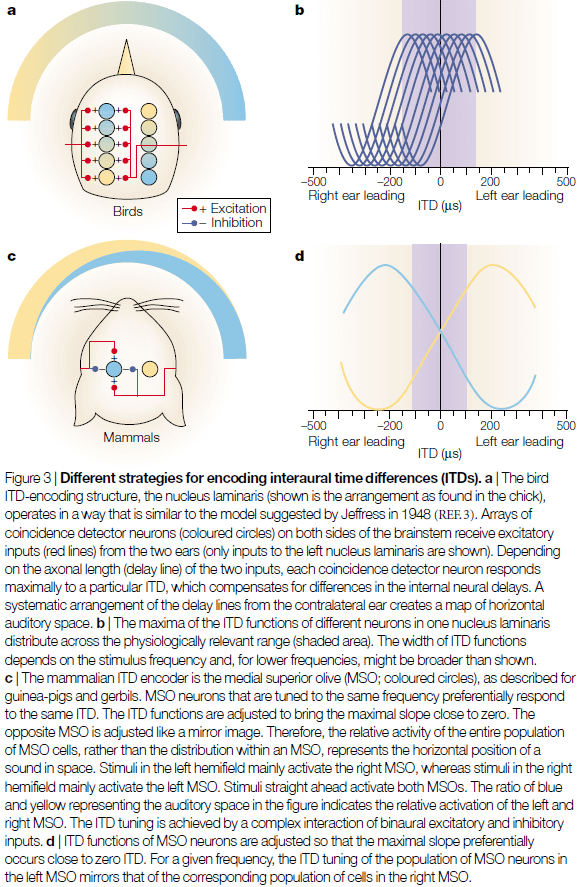
- The major ITD-encoding structure in the mammalian brain, the MSO, receives direct excitatory inputs from the ventral cochlear nuclei (VCN) from both ears.
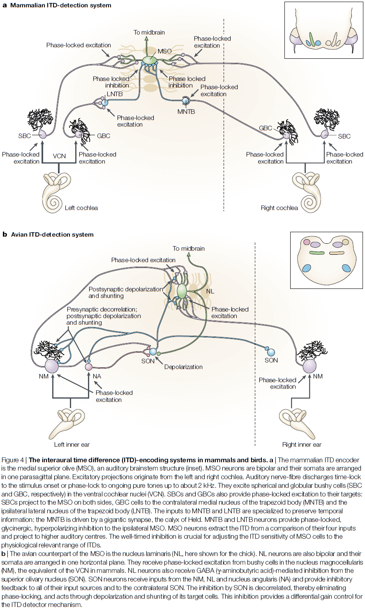
- The source of this bilateral excitation are the spherical bushy cells (SBCs), which time-lock their discharges to the temporal pattern of sounds.
- SBCs project to the bipolar MSO cells, with same-sided inputs synapsing on the lateral MSO, and opposite-sided inputs synapsing onto the medial MSO.
- Such organization is hypothesized to improve binaural coincidence detection.
- MSO cells show high-quality ITD sensitivity in all low-frequency hearing mammals.
- The inhibition acting on the MSO is mostly conveyed through two pathways.
- The first and dominant pathway is from the medial nucleus of the trapezoid body (MNTB).
- MNTB cells are driven by a sound at the opposite ear through a fast and effective pathway.
- E.g. MNTB cells receive projections from globular bushy cells (GBCs) in the VCN, which follow the temporal structure of sound with exceptional precision.
- By precisely sending the sound signal, temporal summation is avoided in this pathway.
- The axon diameters of these projections are the largest in the auditory brainstem and use the most secure synapses in the mammalian brain.
- Thus, MNTB cells are reliably phase-locked to frequencies beyond 1 kHz and therefore convert temporally precise excitation into temporally precise inhibition.
- Only recently have we understood what the MNTB is used for.
- One use is that the MNTB targets the lateral superior olive (LSO), which is the initial site of interaural intensity difference processing; used to localize high-frequency sounds.
- A more important use of the MNTB is that it targets two other areas, the ventral nucleus of the lateral lemniscus and the MSO, both of which are involved in temporal processing.
- So, the reason for the highly specialized inhibition might not be for ITD processing, but rather for processing temporal cues.
- The second pathway is from the lateral nucleus of the trapezoid body (LNTB).
- LNTB neurons also receive inputs from GBCs.
- However, what’s the purpose of these inhibitory inputs to the MSO? And does their timing really matter?
- One function is that the timing of inhibition in the MSO is important for setting a time window for coincidence detection.
- However, experimentation with blocking the inhibition has revealed two conclusions
    - First, the excitatory inputs are generally adjusted so that the overall conductance delay from both sides is identical. As a consequence, the MSO coincidence detection based on excitation causes ITD functions to peak around zero ITD.
    - Second, the inhibition adjusts the slope of the ITD function to the physiologically relevant range, which gives the maximum amount of information because small changes in ITD cause maximal changes in discharge rates.
- What role do inhibitory inputs play in these two conclusion?
- One hypothesis is that opposite-side driven inhibition precedes the excitation from the same side, therefore delaying the net EPSP and shifting the maximum of the ITD function.
- Preliminary evidence confirms that opposite-side inhibition does precedes same-side excitation and that same-side inhibition lags behind same-side excitation.
- One note is that the rat and bat MSO structurally differs from ITD-using mammals such as gerbils and cats.
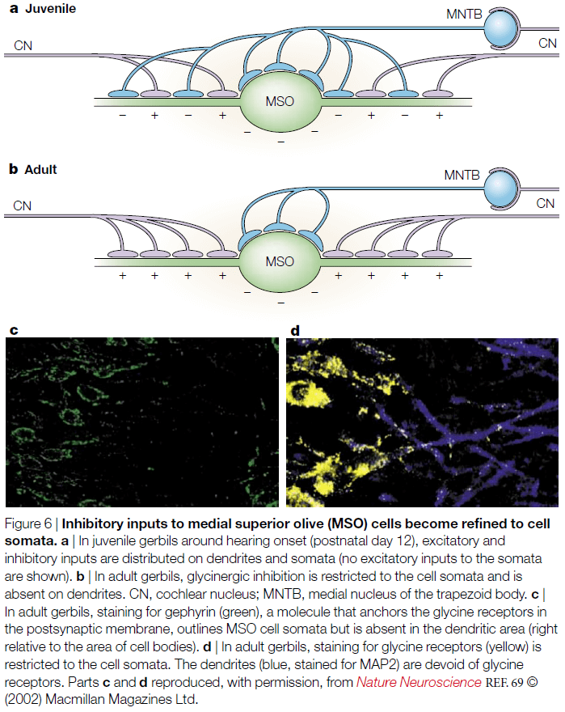
- The question remains on whether mammals with significantly larger inter-ear differences represent ITDs in the same way as do guinea pigs and gerbils remains to be explored.
- Going back to birds, the delay-line organization of the excitatory inputs results in a topographic map of ITDs in the nucleus laminaris. This azimuthal space map is preserved at higher stations of the barn own auditory system.
- Recent studies also show that the nucleus laminaris neurons also receive additional inhibitory inputs.
- However, the function and mechanism for these inhibitory inputs are fundamentally different from the inhibition on the MSO in mammals.
- The first difference is that the inhibition is mediated by GABA rather than glycine.
- The second difference is that the source of inhibition, the superior olivary nucleus (SON), provides feedback inhibition, whereas mammal inhibition provides feedforward inhibition.
- The third difference is that in contrast to the MNTB and LNTB, the GABA-mediated inhibition eliminates timing information and isn’t as precise as it’s mammalian comparison.
- The fourth difference is its direct postsynaptic effects. In mammals, the inhibition causes hyperpolarized IPSPs. In birds, the inhibition causes depolarizing IPSPs, which are even more effective in preventing the cell from firing.
- These difference suggest that inhibition is used as a feedback circuit for gain control that prevents coincidence detectors from firing as a result of increased monaural coincidence at higher sound amplitudes.
- Indeed, the ability of barn owls to encode ITDs is resistant to changes in absolute sound level.
- A system that has to process ITDs, which is an extreme task with only a few degrees of freedom, might help us to understand why systems evolved in one way and not in another.

## [Replay of cortical spiking sequences during human memory retrieval](http://doi.org/10.1126/science.aba0672)

- Episodic memory retrieval is thought to rely on the replay of past experience, yet we don’t know what exactly happens at the neuronal level.
- Paper found that ripple oscillations in the human cortex reflect underlying bursts of single-unit spiking activity that are organized into memory-specific sequences.
- The data shows that human episodic memory is encoded by specific sequences of neural activity and that memory recall involves reinstating this temporal order of activity.
- Retrieving episodic memories relies on our ability to internally replay neural patterns of activity that were present when the memory was first experienced.
- Replay of sequences of spiking activity has been interpreted to reflect memory retrieval and consolidation, however, no direct evidence exists that replay of neural spiking sequences underlies episodic memory retrieval in humans.
- Authors implanted a microelectrode array to collect single-unit and micro-local field potential (micro-LFP) from the anterior temporal lobe, while also collecting macro-scale intracranial EEG (iEEG).
- Ripples present in the iEEG recordings in the middle temporal gyrus (MTG) were accompanied by ripples in the underlying micro-LFP signals and a burst of single unit spiking activity.
- Task was a paired-associates verbal memory task that required participants to encode and retrieve new associations between pairs of randomly selected words on each trial.
- Paper found several examples of units/neurons that formed a sequence in one trial during word pair presentation and rearranged to form a different sequence in another trial.
- In only correct encoding trials, sequences were significantly more similar to other sequences within the same trial than to sequences in other trials.
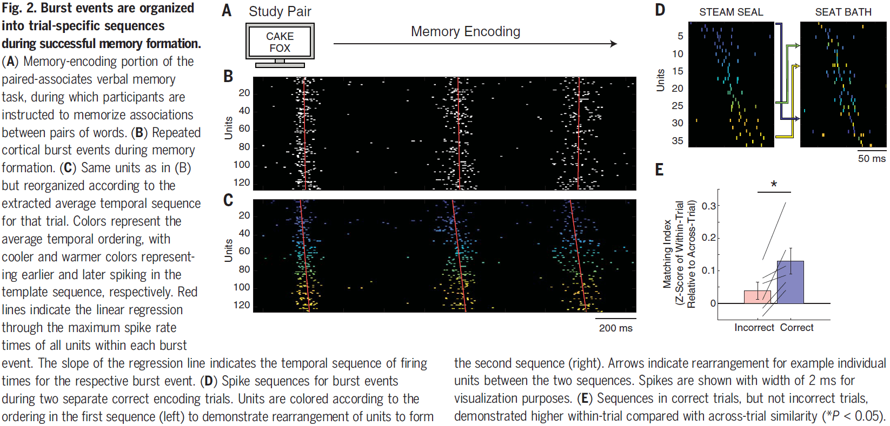
- This suggests that a necessary component of successful memory encoding, and later retrieval, involves repeated sequences of cortical spiking activity that are specific to each trial.
- If successful memory encoding relies on the temporal order of neuronal firing, then we hypothesize that successful memory retrieval involves the replay of the same trial-specific sequence.
- Over the course of memory retrieval, sequences appeared to become more similar to the encoding sequences until the moment when the participant vocalized their response.
- This pattern of increasing sequence similarity only happened on correct trials.
- Paper didn’t find the replay of sequences during the rest period between retrieval trials nor during the math distractor period.
- Results also demonstrate that the replay of cortical spiking sequences is unique for each retrieved memory and even to individuals.
- Interestingly, correct encoding and retrieval trials had a lower population spike rate compared to incorrect trials, suggesting that successful retrieval involves replaying precise sequences of sparse neural firing.
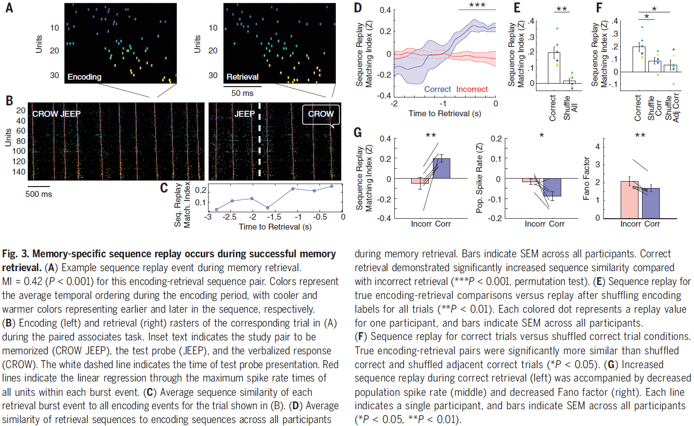
- Although cortical ripples may reflect an underlying burst of spiking activity, only cortical burst events that are coupled to MTL ripples may be relevant for memory retrieval.
- In correct retrieval trials and across all participants, burst events coupled to MTL ripples demonstrated significantly greater replay of the sequences present during encoding compared to uncoupled events.
- Data demonstrates that ripple oscillations reflect bursts of spiking activity in the human cortex and that these bursts contain item-specific sequences of single-unit spiking.
- Data also shows that successful memory encoding and retrieval of individual items involves a specific temporal ordering of cortical spiking activity.
- In rodents, memory is modeled in two phases
    - Initial encoding phase: where the temporal order of spiking activity is established through sequential experience.
    - Consolidation phase: where these sequences of spiking activity are replayed in a temporally compressed manner in the MTL.
- Paper provides direct evidence that awake human memory retrieval involves the replay of sequences of spiking activity in the cortex.

## [Cortical folding scales universally with surface area and thickness, not number of neurons](http://doi.org/10.1126/science.aaa9101)

- Why do larger brains tend to have more folded cortices?
- Paper shows that the degree of cortical folding scales uniformly across smooth- and wrinkled-brained species as a function of the product of cortical surface area and the square root of cortical thickness.
- This model also explains the scaling of the folding index of crumpled paper balls (but we know this is wrong as seen in the first paper of this set of notes).
- Cortical folding has been considered as a means of allowing more neurons to be in the cerebral cortex compared to not folding.
- We see different gyrification (foldedness) across different species, which suggests different mechanisms that regulate cortical folding at the evolutionary, species-specific, and ontogenetic levels.
- We find a general correlation between total brain mass and degree of cortical folding, but it isn’t a smooth function of brain mass and looks like a ReLU.
- Interestingly, all brains with less than 30 million neurons are smooth, which may be an artifact of the dataset or it may mean something.
- Regardless, the correlation between number of cortical neurons and degree of cortical folding is significant across gyrencephalic species.
- The elephant cortex is about twice as folded as the human cortex, but only has about 1/3 the number of neurons.
- Cortical expansion and folding are therefore neither a direct consequence of increasing numbers of neurons nor a requirement for increasing numbers of neurons in the cortex.
- Interestingly, all brains with less than 400 $$mm^2$$ or less than 1.2 mm in average cortical thickness are smooth.
- In all of our comparisons of folding index to brain mass, number of cortical neurons, total cortical surface area, and cortical thickness, we find a sharp inflection between smooth and wrinkled/gyrated cortices, so it’s unlikely that a universal model could explain cortical folding.
- Folding index: a ratio of the total surface area to exposed surface area.
- There’s a strong relationship between a brain’s total surface area and it’s foldedness, as increases in surface area strongly related to increases in foldedness.

- Skipping over the part where the paper models folding of the cortex as folding of paper since I know it’s incorrect.

## [Curvature as a Feature of Pattern Vision](http://doi.org/10.1126/science.181.4104.1070)

- McCollough found an affecteffect that wasn’t linked to conventional afterimages, but rather dependent on color adaptation of orientation-specific edge detectors.
- Paper tested whether the aftereffect found by McCollough was curvature dependent.
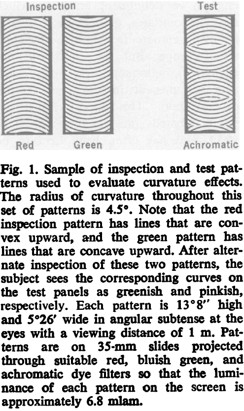
- Data shows curvature-dependent colored aftereffects, where curvature refers to how curved the stimulus is and not the curvature of the retina.
- More vivid colored aftereffects were seen on the test panels resembling those used for training/inspection (strongly curved) than on those of weaker curvature.

- Curvature-induced colored aftereffects aren’t specific to the curvatures used for inspection.
- The main point of the paper is to add curvature as a feature of vision.
- E.g. Color, orientation, spatial frequency, contrast, depth, motion, and curvature.

## [Does unconscious perception really exist? Continuing the ASSC20 debate](https://doi.org/10.1093/nc/nix015)

- Paper continues the ASSC20 symposium discussion on “Does unconscious perception really exist?”
- The core of the controversy is what is meant by the terms and how to test whether a state is unconscious or not.

**Practical and theoretical considerations in seeking the neural correlates of consciousness**

- As scientists studying consciousness, we should be concerned with how we can isolate conscious processing from unconscious processing, so that we can study the neural processing that underlies awareness, the neural correlates of consciousness (NCC).
- Two pervasive and closely related potential confounds in the study of consciousness are
    - Stimulus signal strength
    - Task performance capacity
- Both of these need to be controlled for if we want to isolate awareness.
- To control for stimulus signal strength, we should design experiments where stimulus properties don’t vary across conscious and unconscious conditions.
- E.g. Using a large, bright stimulus for the conscious condition and a small, dim stimulus for the unconscious condition.
- To control for task performance capacity, we should design experiments where the performance doesn’t vary across conscious and unconscious conditions.
- E.g. If a person blinks during a visual experiment, that will change their performance.
- Unconscious stimulus: an observer’s subjective experience of the stimulus shouldn’t be any different from the subjective experience of nothing at all.
- One objection to this definition is that it fails to capture the aspect of qualia.
- E.g. An observer may have a hunch that something is present such as in the case of blindsight.
- However, is qualia necessary to study the NCC of subjective awareness? Author argues no.
- In experiments seeking the NCC, awareness of a stimulus is present if the subjective experience of that stimulus is different from the subjective experience of the stimulus’ absence.
- Perception: occurs when an observer can make some direct discrimination decision about the stimulus better than guessing.
- This definition excludes priming.
- In priming tasks, the unconscious prime doesn’t meet our definition of perception since you can’t discriminate or detect the prime beyond chance level.
- With these definitions, we have successfully isolated consciousness while controlling for other confounding factors.
- Criterion problem: just because an observer reports that they didn’t see a stimulus doesn’t mean they had zero subjective experience of it, only that the subjective experience fell below some arbitrary threshold for reporting.
- The criterion problem represents a very real and fundamental problem that prevents us from exhaustively measuring the presence or absence of awareness.
- Author presents a study where participants had to discriminate a masked target that was either there or not there.
- The result of the study suggested no evidence for unconscious perception.
- E.g. As soon as participants could discriminate the masked target above chance (they perceived it), they could tell which interval contained the target (they were conscious of it).
- In other words, consciousness always followed perception and there was no case of perceiving a target without being consciously aware of it.

**Sensation and unconscious perception**

- What we perceive are objects in the world (rather than events on our retina) and the process of perception is distinct from that of sensation.
- Perception: the process through which we become acquainted with the world.
- Sensation: the subjective experience one sometime has when a stimulus acts on the sensory system.
- Color constancy/invariance: being able to judge that two identical material samples are the same color under different kinds of illumination.
- Our perception of the colors of objects can be the same even when we judge the sensations they elicit to be different.
- Author presents a study where they found that color constancy didn’t depend upon color experience.
- Thus, is it a stretch to say that color perception can be unconscious, and so perception doesn’t have to follow from sensation?
- The main argument against this conclusion revolves around whether perception must be something done by a person, as opposed to, say, a subsystem of the visual system.
- Direct Parameter Specification (DPS): the hypothesis that primes activate a motor response in line with a pre-existing task-set. A masked prime is an action trigger that sets off the response that is specified by in the task-control representation.
- DPS is almost certainly behind a large fraction of our priming effects.
- Author argues that unseen primes can be perceived and so, color perception can be unconscious and so perception doesn’t have to follow from sensation.

**What we need to think about when we think about unconscious perception**

- A compelling case of unconscious perception requires both evidence that consciousness is absent and that perception is present.
- Four cases of unconscious perception
    1. Blindsight
        - Does residual function constitute genuine perception?
    2. Subliminal priming
        - This is similar to the crude analogy that even though we don’t perceive everything that causes pupillary dilation, such dilation makes various subsequent stimuli easier to perceive.
    3. Unconscious attention
        - There’s compelling evidence that spatial, feature-based and object-based attention can all operate outside of awareness.
        - However, this merits the same critique as priming studies: it’s different for a stimulus to elicit activity in the brain which affects subsequent visuomotor processing, and for a stimulus to be available for voluntary, individual-level control and guidance of action.
    4. Vision-for-action
        - It isn’t obvious how vision-for-action constitutes genuine perception.
- Supporters of unconscious perception face the challenge of justifying an operational definition of perception.

**Unconscious perception within conscious perception**

- Author argues that conscious perceptions have unconscious perceptions within them.
- How can we distinguish between conscious and unconscious visual representations?
- One approach is to focus on the neural bases of perception.
- Heterochromatic flicker fusion: when two colors are flickered at a frequency greater than 10 Hz, viewers consciously see a single fused color rather than flickering colors.
- E.g. Red and green above 10 Hz looks like non-flickering yellow.
- However, the retina and early vision registers flicker that the subject doesn’t consciously see as flicker.
- In short, there’s a border between conscious and unconscious representations in the brain.

## [Electrical stimulation of a small brain area reversibly disrupts consciousness](https://doi.org/10.1016/j.yebeh.2014.05.027)

- Paper describes a region in the human brain where electrical stimulation reproducibly disrupted consciousness.
- Case of a 54-year old woman with intractable epilepsy underwent electrode implantation and stimulation mapping.
- Stimulation between the left claustrum and the anterior-dorsal insula disrupted consciousness.
- However, stimulation within 5 mm of that region didn’t affect consciousness.
- Stimulation of that region resulted in a complete stop of volitional behavior, unresponsiveness, and amnesia without negative motor symptoms.
- The disruption of consciousness didn’t outlast the stimulation and occurred without any epileptiform discharges.
- Paper found a significant increase in correlation for interactions affecting medial parietal and posterior frontal channels for stimulations that disrupted consciousness compared to those that didn’t.
- Findings suggest that the left claustrum/anterior insula is an important part of a network that subserves consciousness, and that increased EEG synchrony within frontal-parietal networks is related to the disruption of consciousness.
- Clinicians tend to separate consciousness into wakefulness and awareness.
- Wakefulness: depends on the functional integrity of subcortical arousal systems in the brainstem and thalamus.
- Awareness: the content of experience and as the capacity to respond to external stimuli while having an internal and qualitative experience.
- A previous report found that electrical stimulation of a small brain region that encompasses the anterior-dorsal insula and the neighboring claustrum disrupted consciousness.
- No similar response to electrical stimulation of any other brain region has ever been reported, despite almost a century of experience in electrical cortical stimulation.
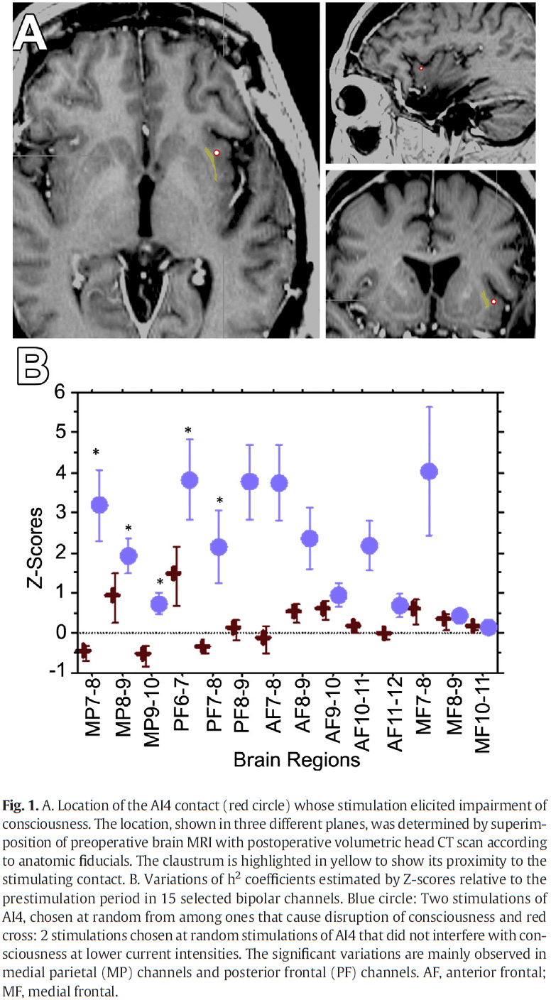
- Stimulating the region using biphasic waves at 14 mA resulted in the immediate impairment of consciousness.
- Interestingly, if the patient was told to perform a repetitive task before the onset of stimulation, they would continue doing the task during stimulation, but the patient would slowly come to a stop after a few seconds.
- The anterior-dorsal insula seems to play a role in self-awareness and integrates emotional and cognitive inputs, setting the context for actions.
- However, no previous reports have found that stimulation of different parts of the insula result in an alteration of consciousness.
- Thus, the claustrum could be a key component in the network supporting conscious awareness during wakefulness.
- It’s important to note that the disruption of consciousness is immediately reversed upon termination of the stimulation train, suggesting that the disruption was directly induced by the stimulation of the insula/claustrum.
- This is in contrast to seizure discharges which typically outlasts electrical stimulation.
- Paper found that the loss of consciousness can be artificially induced by electrical stimulation of a specific and limited brain region.

## [Why not connectomics?](https://doi.org/10.1038/nmeth.2480)

- The brain remains a tough nut to crack. No other organ system is associated with as long a list of incurable diseases as the brain.
- Worse yet, there isn’t only no cure, but no clear idea of what’s wrong.
- The nervous system is a physical tissue that is unlike any other organ system.
- E.g. It has more cell types than any other organ such as the 50 in the retina compared to the 5 in the liver. Neurons connect to many more cells, and the neuronal contacts give rise to circuits that have no analogs in other tissues.
- Perhaps the most intriguing difference between neural tissue and other organs is that the cellular structure of neural tissue is a product of both genetics and experience.
- The special structural features of the nervous system are likely the reason why it’s more difficult to understand compared to other bodily systems.
- This is the argument for why we should go after the structural connectome of the nervous system.
- Top ten arguments against connectomics
    1. Circuit structure is different from circuit function.
        - The argument is that nervous system behavior is a direct function of the functional properties of neurons (electrical), rather than the anatomical connections.
        - In other words, the relationship between firing patterns and neuron function are the key to bridge the gap between cells and behavior.
        - However, long term learning of skills and experiences is probably implemented in the specific pattern of connections between neurons.
        - So, experience alters connections between neurons to record a memory for later recall.
        - Both the sensory experience that lays down a memory and its later recall are trains of APs, but in-between these two processes is a stable physical structure that holds that memory.
        - In this sense, memory is a connectional map within the brain.
    2. Signals without synapses and synapses without signals.
        - The argument is that chemical cues in the brain would be difficult/impossible to infer from anatomical wiring diagrams.
        - It’s true that a map of synaptic connectivity isn’t identical to a map of the signaling pathways of the brain.
        - We should be careful to not confuse the goals of connectomics with the aims of maps of the activity patterns in the nervous system.
    3. ‘Junk’ synapses.
        - The argument is that most synapses are functionally negligible and what really matters is the general likelihood of connectivity.
        - If junk synapses are common, then going to the trouble of itemizing all synaptic connections is both a waste of time and a distraction.
        - It’s premature to say that such synapses are ‘junk’ given how little we know about their function.
        - We aren’t convinced that the nervous system tolerates a large number of synapses that don’t serve a useful function.
        - In fact, many synapses are pruned during development if they aren’t useful.
    4. Same structure, many functions.
        - The argument is that because the same neurons and circuits can be modulated and thus produce flexible behavior, it isn’t possible to assign a neuron a function without knowing the behavioral state.
        - However, the extent to which this kind of switching is a general feature of nervous systems isn’t well known.
        - An understanding of the physiology of the nervous system would enable us to map the multiple functions to the same structure, and thus would help organize our knowledge.
        - How would you know that a different function came from the same structure if you haven’t characterized the structure?
    5. Same function, many structures.
        - The argument is that the same function could be realized by multiple different structures, so characterizing the structure isn’t very useful.
        - However, variability in connections doesn’t necessarily mean that the result is incomprehensible.
        - E.g. Nerve-muscle connections differ quite a bit from one instantiation to the next, but there is a skewed distribution in each muscle, even though the exact location and branching pattern is unique.
        - Thus, each instantiation appears to be a variation on a common theme.
        - One reason we believe connectomics is necessary is that it’s the only way to derive network principles despite variability in the connectivity of neurons.
    6. Statistical synapses should suffice.
        - The argument is that similar to statistical mechanics in physics, given the trillions of synapses in the brain, is there really any alternative except to take a statistical approach to synaptic connectivity?
        - However, unlike a homogeneous gas, brains are made up of heterogenous tissue that have different properties depending on the tissue. So statistical methods can’t be applied to the entire brain.
        - Also, the variety of cell types aren’t uniform, unlike that of gas molecules, so statistics can’t be applied to such varied data.
    7. The mind is no match for the complexity of the brain.
        - The argument is that the brain’s structural complexity far outstrips the complexity of the mind. This is a favor of the mind-body problem.
        - Disregarding this since it invokes non-material arguments against connectomics.
    8. Merely descriptive neuroanatomy, just more expensive.
        - The argument is that we are past the point of description and that we should work towards mechanistic explanations by manipulating variables.
        - The hope of descriptive approaches is that they provide specific data that lead us to general hypotheses.
        - E.g. Hubble telescope, human genome, and much of structural biology.
    9. Not much was learned from the connectomes we have.
        - The argument is that the connectome of C. elegans has been known but no insights were generated from it.
        - However, at the very least, the worm connectome has been helpful in constraining circuit analysis by providing limits to neuronal connectivity.
        - Another limitation with the worm connectome is that it’s excitatory and inhibitory connections can’t be differentiated in electron microscopy, unlike for mammals, thus reducing the overall power of the wiring diagram.
        - Also, the worm uses local potentials and may use a fundamentally different strategy than one in much larger nervous systems, in which cell types reflect populations of neurons whose connectivity is organized by experience.
    10. It doesn’t provide any useful information because it’s static.
        - The argument is that a static description of the connection between parts isn’t useful.
        - Without knowing the parts list and what’s connected to what, how could we ever really know how it works?
        - The ideal brain-imaging technology would provide both a complete map of synaptic connectivity, and a complete map of neural and synaptic activity in real time.
        - We see a connection between the connectome and the brain’s functional properties to not only computers, but also to how the static human genome encodes much of how an organism works.
        - Defects in the genome that result in a range of diseases are a good analogy to defects in wiring that result in a range of brain diseases.
- We remain committed to pursuing connectomics because it’s one of the fundamental kinds of information about the brain that isn’t attainable in any other way.
- Schematic diagrams of neural circuits provide a sense of which cell types connect with one another, but also serve as a model of how information flows through a circuit.
- In other words, structural connectivity explains the way a neural circuit works.
- Knowing neuronal connectivity is sufficient to get some understanding about how neurons process information.
- Variability in the connections of cells of the same class is the essential feature that’s lacking in classical wiring diagrams, but exists in actual neural circuits.
- The future of connectomics
    - Statistical and analytical tools.
        - How to compare and analyze connectional graphs of the brain is a new challenge that will require new mathematical techniques for analyzing graphs.
    - Faster data collection.
        - If a complete map of every synapse in a human brain is wanted, at our current speeds, it would take 10 million years to complete.
    - How fast can we go?
        - Our current best technology for producing connectomics data sets is high-throughput electron microscopy.
        - The current bottleneck for obtaining connectomics data isn’t image acquisition, but image segmentation.
    - Proteome meets the connectome.
        - The structural mapping of connections will only be useful if the cell type of each neuron in the circuit is known.
- Three reasons to obtain the connectome
    - The conditional patterns of synaptic connectivity generated during development and experience are inaccessible to our current techniques.
    - Neuroscientists can’t claim to understand the brain as long as the network level of brain organization is uncharted.
    - There’s a high likelihood that such exploration will reveal unexpected properties by shining electrons on the most mysterious tissue.

## [Principles of sensorimotor learning](https://doi.org/10.1038/nrn3112)

- Humans show a remarkable capacity to learn a variety of motor skills.
- E.g. Driving, typing, and playing sports.
- Elements of motor learning
    - Different task components that must be learned.
        - E.g. Gathering task-relevant sensory information, decision making, and both predictive and reactive control mechanisms.
    - Different learning processes apply to these components.
    - Learning is strongly determined by the neural representations of motor memory that influence how we assign credit during learning and how to generalize what we’ve learned.
- This paper focuses on empirical and computational studies of sensorimotor learning, rather than on the neural circuits that underlie this behavior.
- Components of motor learning
    - Information extraction
        - The motor system is involved in active learning, choosing where to sample sensory input in a way that maximizes information.
        - Inattentional blindness: when people fail to notice stimuli that are irrelevant to the task they’re performing.
        - Three computations that can improve the accuracy of sensory information
            - Integrating multiple sensory modalities to reduce noise.
            - Learning the statistical distribution of possible states of the world.
            - Combining these processes with internal models of the body that map motor commands to expected sensory inputs.
    - Decisions and strategies
        - Because there are substantial delays in the sensorimotor system, at the time when movement is initiated, there’s still sensory information in the processing pipeline that wasn’t used to initiate the decision but can be used to revise the decision.
        - This results in subjects changing their mind mid-movement, usually to correct an error.
        - Interestingly, if a cognitive task that people make suboptimal judgments on is converted into a motor variant, then people often get close to the optimal decision.
        - E.g. If the prisoner’s dilemma is converted into a motor task, then both subjects work towards the Nash solution (both defecting).
    - Classes of control
        - Three classes of control
            - Predictive/feedforward
            - Reactive
            - Biomechanical
        - Due to time delays during neural conduction, skilled action often relies on predictive control.
        - E.g. When lifting an object, people often apply force in anticipation of its weight.
        - This prediction requires a system that can effectively simulate the behavior of our body and environment, also known as the forward model.
        - Using a copy of the motor command (efference copy), the forward model predicts the sensory consequences of that command.
        - Prediction is supported by learned correlations or priors.
        - E.g. When lifting an object, people use information about material size, volume, and density to predict its weight.
        - If the prediction is incorrect, such as a mismatch between predicted and actual tactile sensation, then the system can launch corrective actions and can also update the knowledge of object weight to improve future actions.
        - Through the prediction of sensory consequences, there’s an intimate relationship between predictive and reactive control mechanisms.
        - Fast reactive feedback loops can drive fast motor responses but can’t be modified by experience.
        - E.g. Reflexes.
        - Evidence suggests that the CNS continuously converts sensory inputs into motor commands that are optimally tuned to the goals of the task by trading off energy consumption with accuracy.
        - This is consistent with the optimal feedback control model of sensorimotor learning.
        - Minimum intervention principle: only correcting errors to the task goal.
        - As for biomechanical control, the body can manipulate muscle stiffness and thus, exert control over the immediate response to external perturbations.
- Processes of motor learning
    - Different types of learning can be distinguished by the type of learning signal.
    - Error-based learning
        - The difference between the sensorimotor system’s prediction and actual outcome not only tells the system that it missed the goal, but also specifies the way in which the target was missed.
        - A common feature of this type of learning is that the system can, and will, learn from an error on a single trial.
        - Thus, adaption is observable even when all perturbations are random (thus unlearnable) and the subject is told not to adapt.
        - Evidence indicates that fast trial-by-trial error-based learning relies on the cerebellum.
        - E.g. Cerebellar lesions result in substantial impairment in fast adaptation across many task domains.
        - How the cerebellum and cortex interact during error-based learning and where different types of adaptation are stored remains an open question.
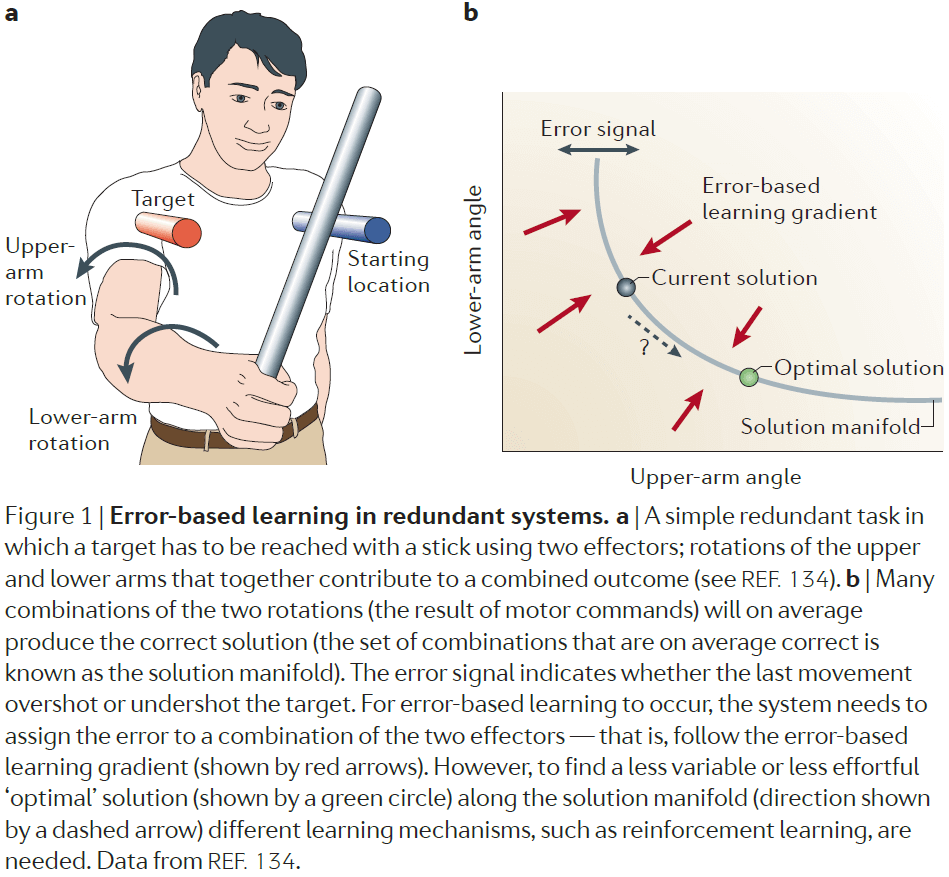
        - During error-based learning, the system exploits a directional/signed error signal and follows an internal estimate of the gradient in this direction and thus, serves to calibrate and correct for any systematic biases.
    - Reinforcement learning
        - Error-based learning can reduce the average error to zero, but once this is achieved, it doesn’t provide a mechanism to further improve performance.
        - In other words, error-based learning gets to the solution space, but doesn’t select the optimal solution within the solution space.
        - To achieve a reduction in the variability of errors, other learning mechanisms are needed to move the system to the optimal location on the solution manifold.
        - One candidate signal that could drive such learning is information about the relative success and failure of the movement.
        - In contrast to a signed error signal, reinforcement signals are inherently unsigned, and therefore don’t give information about the direction of the required change.
        - So, reinforcement learning is slower and requires exploration of different possibilities to guide learning.
        - In situations where a complex sequence of actions need to take place and the outcome/reward is distant from the action, error-based learning can’t easily be applied.
        - However, reinforcement learning can be used to assign credit/blame back in time to actions that led to success or failure.
        - In general, we haven’t yet developed a full understanding of what makes a rewarding signal for the motor system.
    - Use-dependent learning
        - This learning doesn’t depend on the outcome and refers to the phenomenon that the motor system can change through the pure repetition of movements.
        - E.g. Repeating a reaching movement reduces the variability of such movement.
        - This can be done in parallel with error-based learning.
        - After-effect: when an adaptation to a perturbation exists after the perturbation is removed.
        - E.g. If a certain door always took a lot of force to open, but was then replaced with a lighter door, the subject would still use more force than necessary.
- Representations in motor learning
    - Sensorimotor learning involves learning new mappings between motor and sensory variables for changing current mappings.
    - Such mappings/transformations are called representations or internal models.
    - Inverse problem: information from a single movement is often too sparse or noisy to determine the source of the error, so we don’t know how to update the motor commands.
    - To resolve this issue, the system doesn’t start from a blank slate.
    - Instead, it uses representations that reflect internal assumptions about the task structure and that constrain the way the system is updated in response to errors.
    - These representations are conceptualized in two ways
        - Mechanistic: specifies the representations and learning algorithms directly.
        - Normative: suggests that the nervous system optimally adapts when faced with an error.
    - Motor primitives: neural control modules that can be flexibly combined to generate a large set of behaviors.
        - E.g. The temporal profile of a particular muscle activity. The overall motor output would be the sum of all primitives.
        - The set of all primitives puts constraints on motor learning.
        - E.g. A behavior that the motor system has many primitives for will be easy to learn in contrast to a behavior that doesn’t have many primitives.
        - Motor primitives also determine the way in which learning generalizes.
    - Credit assignment: how to attribute an error signal to the underlying causes.
        - E.g. If an error is made, should it be attributed to fatigue, skill, random fluctuations?
        - Two types of credit assignment: contextual and temporal.
        - Contextual meaning that learning and adaptation only occur in the context of a specific device.
        - The adaptation of reaching movements to perturbing forces causes a change in the mapping between vision and proprioception.
        - Temporal meaning that there are fast and slow learning processes acting in parallel.
        - One advantage of having multi-rate learning processes is that these processes can parallel the temporal variations in the causes of sensorimotor errors.
        - E.g. Muscle fatigue comes and goes on short timescales, whereas muscle damage stays for long timescales.
    - Structural learning
        - Three levels of representation
            - Structure of the task: relevant inputs and outputs of the system.
            - Parameters
            - Relevant state
        - New structures can be learned by having participants be exposed to a common structure that they’re familiar with.
- Three key topics of this paper
    - What has to be learned.
    - How it is learned.
    - How knowledge developed during learning is represented.
- Progress in sensorimotor control research is reflected in the successful implementation of learning and control models in robotic devices.
- The exciting challenges ahead are to understand the learning of real-world tasks and the neural implementation of the underlying processes.

## [A multi-modal parcellation of human cerebral cortex](https://doi.org/10.1038/nature18933)

- Understanding the brain requires a map/parcellation of its major subdivisions (also called cortical areas).
- Paper delineated 180 areas per hemisphere bounded by sharp changes in cortical architecture, function, connectivity, and topography.
- Authors provide an ML classifier for segmentation use.
- Accurate parcellations provide a map that enables efficient comparison among studies and communication among investigators.
- Most previous parcellations were based on only one neurobiological property.
- E.g. Architecture, function, connectivity, or topography.
- Combining multiple properties provides complementary as well as confirmatory information about each area’s boundaries.
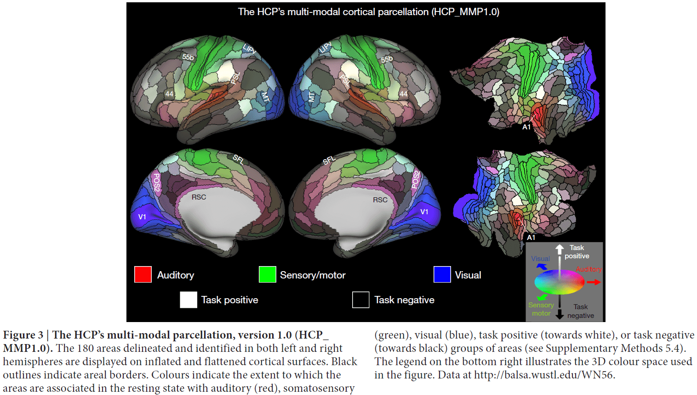
- Qualitatively, the predominantly unimodal regions appear to collectively occupy less than half of the neocortical sheet.
- The bilateral symmetry of functional organization is striking, in that nearly all areas have qualitatively very similar hues in the left and right hemispheres.
- However, interesting color asymmetries occur in a few areas, such as language-related areas.
- In this parcellation, we treat topographic subdivisions as ‘subareas’ rather than full areas.
- Parcellation is a data dimensionality reduction technique and is effectively a neurobiologically constrained smoothing approach.

## [Thalamus plays a central role in ongoing cortical functioning](https://doi.org/10.1038/nn.4269)

- The textbook view of the thalamus sees it only as an input relay.
- This view is challenged here on several grounds.
- The thalamus contributes to the processing of information within the cortex and isn’t just limited to relaying information in the initial stage of processing.
- An important caveat of the ideas mentioned below is that the supporting evidence comes from mostly mice and mostly from the visual, somatosensory, and auditory systems. Evidence from other species and other sensory systems, while supportive, is sparse.
- Two types of glutamatergic input
    - Driver: main conduits of information.
    - Modulator: modify how driver inputs are processed.
- LGN relay cells receive two main glutamatergic inputs: one from retinal ganglion cells and one from layer 6 of visual cortex, but with very different axon/afferent properties.
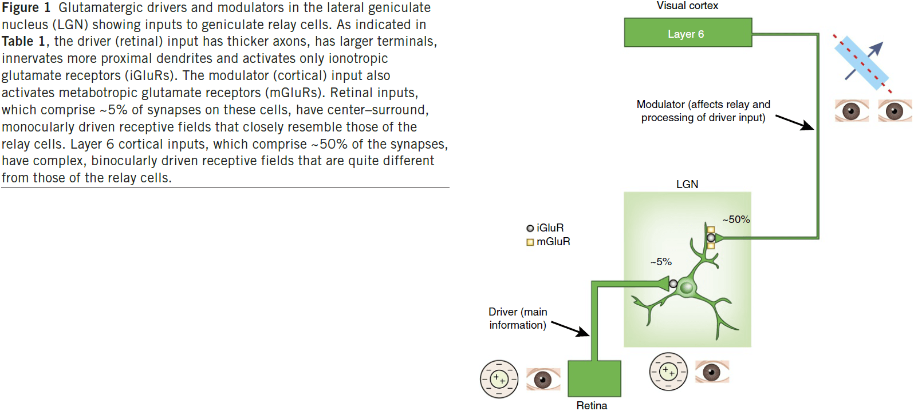
- The receptive field of the relay cell closely matches the retinal input and looks nothing like the cortical input.
- From this, we infer that the main information being relayed through the LGN is provided by the retina and not the cortex.
- Since retinal input provides the main information to the LGN, we classify this as a driver input.
- So what does the cortical input to the LGN do then?
- Evidence suggests that it acts as a modulator that doesn’t change the basic nature of the retinal input (receptive field center-surround organization).
- E.g. It affects scale and other properties of retinogeniculate transmission.
- Three conclusions
    - The driver and modulator classification is robust for both the thalamus and cortex.
    - Only two main classes exist in the thalamus and cortex.
    - The driver/modulator synaptic properties in the thalamus are similar to those in the cortex.
- There seems to be fewer driver inputs than modulator inputs.
- E.g. In the LGN, about 5 percent are driver inputs and 50 percent are modulator inputs.
- Identifying driver versus modulator components is important for understanding the functional organization of circuits.
- Every thalamic nucleus studied so far receives a feedback projection from layer 6 of the cortex, meaning that layer 6 cells project to the same thalamic region that innervates the layer 6 cortical region.
- However, layer 6 cells are highly heterogeneous so it’s difficult to find a single function for this feedback.
- An additional complicating factor is that layer 6 corticothalamic cells not only innervate the thalamus, but they also branch to innervate layer 4 of the cortex.
- This suggests that layer 6 can affect thalamocortical transmission both at its thalamic source and at its main cortical target in layer 4.
- Two types of thalamic relay
    - First order: thalamic nuclei that receive subcortical driver input.
        - E.g. LGN, VPMN, VMGN.
    - Higher order: thalamic nuclei that receive cortical driver input.
        - E.g. Pulvinar, PMN, DMGN.
- Some thalamic relays get a driver input from layer 5 of the cortex.
- Higher order relays, which we estimate to be the majority of the thalamus by volume, are involved in the transfer of information between cortical areas.
- It appears often, and maybe always, that when cortical areas have a direct connection, they also have a parallel one through the thalamus. This parallel pathway is called transthalamic.
- Transthalamic pathway: corticothalamocortical circuits that go from cortex → thalamus → cortex.
- The medial dorsal nucleus seems to be organized as a higher order nucleus for prefrontal cortex and the ventral anterior-ventral lateral nuclei seems to be organized as a mosaic for motor cortex, one part serving as a first order relay for cerebellar inputs, and the other as a higher order relay.
- The pulvinar in both cat and monkey has neurons with receptive fields properties apparently inherited from cortical input, supporting their role as a link in transthalamic circuitry.
- Further evidence from the monkey indicates that the pulvinar plays a central role in the transfer of information between cortical areas.
- This supports the idea that transthalamic pathways provide the means that different cortical areas use to cooperate for various cognitive functions, such as attention.
- First order vs higher order relays
    - Higher order thalamic nuclei are more complex and heterogeneous than first order.
    - Three key differences
        - First order nuclei appear to be completely first order, but higher order nuclei often include first order circuits.
        - First order relays innervate cortex in a feedforward manner, but some higher order relays innervate primary sensory cortex, as well as higher areas.
        - First order relays generally transfer information from one or a few driver inputs conveying similar information, but higher order relays seem to converge and elaborate information.
    - It’s important to state that higher order areas are innervated by both layer 5 and subcortical driver inputs, thus going against the textbook view that the thalamus is just a gated relay.
- The functional unit of the thalamus is the relay cell.
- Axonal branching is common among driver afferents to the thalamus.
- Are driver inputs to the thalamus efference copies?
- Efference copy: messages sent from motor areas of the brain back into appropriate sensory processing streams to anticipate resulting self-generated behaviors.
- Efference copies are an absolute requirement to allow organisms to disambiguate self-generated movements from external events.
- E.g. When we move our eyes, the visual world moves in the opposite direction but we don’t experience that movement because we anticipate the eye movement and account for it.
- E.g. When we touch a small animal, we know whether the movement is caused by the animal or by our hands moving.
- Coordinated behavior of any reasonably complex animal without efference copies is improbable.
- Efference copies require an accurate copy of a motor message to be directed back into the appropriate sensory processing stream.
- The copying process may be implemented as axonal branching since it sends identical messages to all of its targets.
- However, this doesn’t mean that the message has the same effect at all of its targets due to synaptic properties.
- This suggests a role for branching axons in efference copy circuits.
- Many, if not all, driver inputs to the thalamus involve branched axons.
- The new idea here is that as a cortical hierarchy is ascended, each level is kept informed about possible motor commands initiated by lower levels via the transthalamic pathways.
- So, this idea proposes that transthalamic pathways convey efference copies to other sensory areas for prediction and correction.
- This is also supported by evolution as when a new sensory receptor is acquired in the course of evolution, it won’t have any survival value if it lacks a fairly immediate motor output.
- Given that the cortex issues motor commands via layer 5, it seems obvious that these are correlated with efference copies that are convey over transthalamic pathways.
- This is only one plausible idea, there are others such as the pathways being used for information transfer or coordination.
- Efference copies are often discussed in very abstract form with no clear anatomical basis.
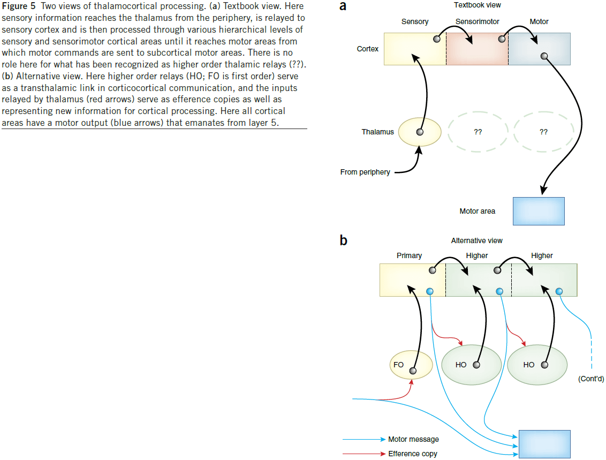

## [Laminar analysis of 7 T BOLD using an imposed spatial activation pattern in human V1](https://doi.org/10.1016/j.neuroimage.2010.05.005)

- Paper introduces a laminar surface-based analysis method and uses the method to study the relationship between spatial localization and activation strength as a function of laminar depth by acquiring 7 T BOLD signals.
- The letter “M” was chosen as the target activity pattern due to it’s simplicity.
- We employ a model of visuotopic mapping given by the complex-logarithm transformation that describes the topographic mapping of the visual field onto the cortical surface.
- This means that to get an “M” on the cortical surface, some stimuli must be presented and that stimulus is picked by the inverse of the transformation.
- We can’t just show an “M” and have “M” appear on the cortical surface because the retina isn’t uniform and there’s a bias towards the fovea.

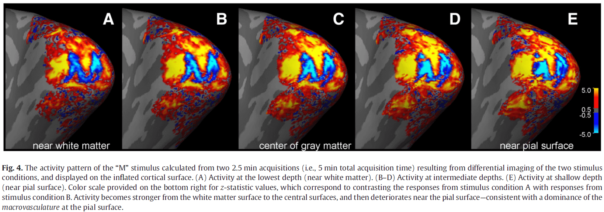
- This study showed how knowledge of the visuotopic mapping within area V1 enabled us to impose a desired spatial pattern of activation on the cortical surface.
- The success of this technique partially validates the parametric model of V1 topography used to design the stimulus.
- Other studies on the regularity of the shape of V1 and of the consistent position of V1 relative to the cortical folding pattern show that a remarkable regularity of V1 structure and function exists in this primary sensory area.

## [The human cerebellum has almost 80% of the surface area of the neocortex](https://doi.org/10.1073/pnas.2002896117)

- The surface of the human cerebellar cortex is much more tightly folded than the cerebral cortex.
- It’s total surface area was larger than expected or previously reported, equal to 78 percent of the total surface area of the human neocortex.
- Compared to the macaque monkey, we found that it’s cerebellum was relatively much smaller, around 33 percent of the total surface area of its neocortex.
- This suggests a prominent role for the cerebellum in the evolution of distinctly human behaviors and cognition.
- During human evolution, the cerebellum has expanded in parallel with the neocortex; from 33 percent to 78 percent of the neocortex surface area.
- Unlike the human neocortex, the surface of the human cerebellum has never been computationally reconstructed at the level of all individual small folds (folia).
- The cerebellum plays a role during active movements involving multiple body parts and skin contact points, parallel fibers that extend across multiple cerebellar patches can integrate information from many distant body parts to speed, refine, and coordinate complex actions.
- The cerebellum has two hierarchical levels of folding
    - Large lobules
    - Small folia
- The substantial relative increase in the surface area of the human cerebellum, compared to the macaque, is likely due to more extensive connections from the parietal and prefrontal cortex.

## [Towards a neurobiological theory of consciousness](https://resolver.caltech.edu/CaltechAUTHORS:20130816-103136937)

- It’s remarkable that most of the work in neuroscience and cognitive science has no mention of the word “consciousness”.
- This is partly due a legacy of behaviorism and partly because most researchers don’t see a way of approaching consciousness.
- We believe that the problem of consciousness can only be solved by explanations at the neural level.
- Attempting to infer the internal structure of a very complex system using a black-box approach will never lead to a complete understanding.
- Our basic idea is that consciousness depends on some form of short-term memory and also on some form of serial attention.
- Two basic assumptions to the study of consciousness
    - That there is something that requires scientific explanation.
        - We aren’t conscious of all of the processing going on in our heads.
        - E.g. How did I come up with the name of that animal? Why was it automatic?
        - We seem to have limited introspective access to the origins and workings of cognitive processes.
        - What separates cognitive processes that we’re aware of and those that we aren’t?
    - That all of the different aspects of consciousness use a basic common mechanism.
- We will ignore the following topics for now
    - Definition of consciousness.
    - Function of consciousness.
    - Consciousness in other animals.
    - Language isn’t essential for consciousness.
    - Self-consciousness such as the feeling of emotions, pain, thinking, etc.
    - No neural theory of consciousness will explain everything about consciousness.
    - Problem of qualia.
- The most effective approach to the problem of consciousness would be to map features of consciousness onto the neuroanatomy and neurophysiology of the brain.
- However, this hasn’t been very useful as such models just tell us what we already know: that consciousness uses attention, short-term memory, and that it should have easy access to higher levels of planning in the motor system.
- A major handicap to the study of consciousness is the influence of the paradigm of the von Neumann digital computer.
- However, one interesting view is that consciousness is like the operating system of the brain.
- Thus, the mechanisms of consciousness expresses the results of some of the computations the brain makes, but not the details of how they were done.
- Consciousness appears to be a process that is fairly immediate, with estimates in the range of 50-250 ms of perceiving a stimulus.
- General neurobiological aspects
    - When
        - When is an animal conscious? This isn’t a straightforward problem.
        - We aren’t conscious in slow-wave sleep or under deep anesthesia.
        - However, REM sleep is another matter.
        - It seems that a limited form of consciousness occurs during REM sleep.
        - E.g. Cognition isn’t completely normal and memories can’t be put into long-term storage.
    - Where
        - Where in the brain are the neural correlates of consciousness?
            - One of the traditional answers, that consciousness depends on the reticular activating system in the midbrain, is misleading.
            - It’s true that the relevant parts of the brain need to be activated in various ways, but this is like believing that the characteristic part of a television set is its electrical power supply.
            - It’s likely that consciousness occurs mainly in the neocortex, since local damage to the cerebral cortex often removes particular aspects of consciousness.
            - E.g. Face agnosia.
            - Patients with bilateral hippocampal damage appear to have most aspects of consciousness, so its argued that the hippocampus is unlikely to be essential.
            - Structures in the midbrain or hindbrain are probably not essential for consciousness.
            - E.g. Cerebellum.
    - Split brains
        - Patients with a cut corpus callosum (CC) strongly suggest that some of the information associated with consciousness can traverse the CC.
        - It also suggests that certain information, except for emotional states, can’t be transmitted from one side of the cortex to the other by subcortical pathways.
    - Blindsight
        - Patients with blindsight can point fairly accurately to the position of objects in their blind visual field, while denying that they see anything.
    - Neuronal firing
        - We think that consciousness requires neuronal activity.
        - Our basic hypothesis is that consciousness is correlated with a special type of activity of perhaps a subset of neurons in the cortical system.
        - The problem at the neural level then becomes
            - Where are these neurons in the brain?
            - Are they of any particular neuronal type?
            - What’s special about their connections?
            - What’s special about the way they are firing?
- Visual awareness
    - Paper proposes starting with the visual system to study consciousness since it’s the most well known system and shares features with other animals.
    - From now on, we shall not discuss consciousness in all of its aspects, but only visual awareness.
    - In general, different cortical areas respond to different features.
    - So far, no single area has been found whose neurons correspond to everything we see.
    - How is it, then, that we seem to have a single, coherent visual picture of the scene before us?
    - The obvious suggestion is that at any one time, the relevant neurons in many cortical areas cooperate together to form some sort of global activity and that this global activity corresponds to visual awareness.
    - Maybe the synchronous activity in the various cortical areas is coordinated by feedback projections from ‘convergence zones’.
    - What exactly ‘convergence zones’ means is somewhat obscure, but our working definition is that they refer to the neurons that project backwards.
    - E.g. Neurons that project from the second visual area back to the first one.
    - The term ‘zones’ is somewhat misleading, since such neurons may be sprinkled over the layers of the neocortex.
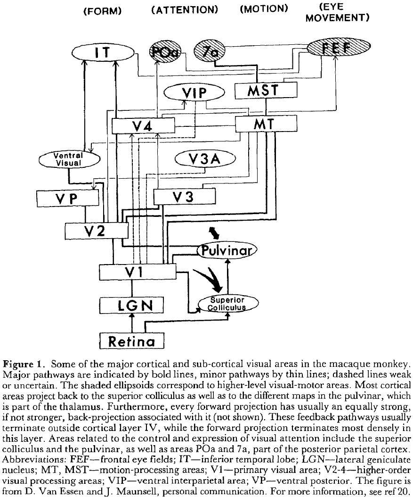
- Binding and selective visual attention
    - There can’t be a single neuron, a grandmother cell, for each object that we’re capable of seeing.
    - The combinatorial possibilities for representing so many objects at all different values of depth, motion, color, orientation, and spatial location are simply too staggering.
    - However, this doesn’t negate the existence of specialized neurons such as the fusiform face area.
    - It seems likely that any object is represented by the firing of a set of neurons.
    - This set doesn’t have to be neurons in close proximity as objects will have different characteristics that are processed in different areas.
    - So, it’s reasonable to assume that seeing an object involves neurons in many different visual areas.
    - Binding problem: how these neurons temporarily become active to represent that object.
    - If the brain separates out features of the object, then why aren’t we conscious of just the collection of features and not the object? Where are the featured bound together?
    - Our experience of perceptual unity suggests that the brain, in some way, binds together all those neurons actively responding to different aspects of a perceived object.
    - One possible binding mechanism is that neurons become strongly connected to each other.
    - The binding that we’re concerned with applies to new objects where the neurons are unlikely to be strongly connected together.
    - This binding must happen rapidly and must have an almost unlimited potential capacity.
    - It probably depends on a serial attentional mechanism and what reaches awareness is the result of this mechanism.
    - In other words, awareness and attention are intimately bound together.
- Short-term memory
    - Two forms
        - Iconic memory: sensory input buffer. Large capacity but decays very quickly.
        - Working memory: is different for different modalities and seems to use a much more abstract representation. Limited capacity but lasts for seconds.
    - We suspect that working memory is strongly activated in the binding process.
    - The neural basis of both forms of memory is understudied, but we hypothesize that they may use
        - A temporary increase/decrease in strength at the synapse
        - Firing rates
        - Reverberatory circuits
    - They’re probably non-Hebbian.
    - Both iconic and working memory are likely to be distributed throughout the appropriate cortical areas.
    - There’s never been a case of a person who’s conscious but has lost all forms of short-term memory.
- Neuronal oscillations
    - Binding, in neural terms, mean that neurons in different parts of the cortex respond to the currently perceived object at the same time.
    - The main requirement is for correlated firing.
    - This may be implemented using oscillations.
- Authors suggest that one of the functions of consciousness is to present the results of various underlying computations and that this involves an attentional mechanism that temporarily binds the relevant neurons together by synchronizing their spikes in 40 Hz oscillations.
- The oscillations don’t encode information but join together some of the existing information into a coherent percept.
- Once an object has been selected for, it’s placed into working memory.
- Some or all of the properties associated with the attended location would automatically be remembered for a short time.
- This would fit with the evidence that the attentional system is limited in capacity as maybe only a few simultaneous and distinct oscillations can exist.
- Evidence on humans with brain damage implicate parts of the thalamus in certain aspects of attention.
- The information about a single object is distributed in the brain.

## [The Neural Correlates of Consciousness: An Update](https://doi.org/10.1196/annals.1440.004)

- I started reading this paper but realized that a lot of the content is the same as the last chapter in the “The Neurology of Consciousness” textbook.
- Read my notes on it [here](/textbooks/the-neurology-of-consciousness/#chapter-25-the-neurology-of-consciousness-an-overview) for a better and updated version of the content in this paper.

## [Neural correlates of consciousness: progress and problems](https://doi.org/10.1038/nrn.2016.22)

- Being conscious means having an experience.
- E.g. Seeing, hearing, thinking, and feeling.
- It’s been known that being conscious requires the proper functioning of midline brain structures and that the particular contents of an experience are supported by the activity of neurons in the cerebral cortex.
- Although experiences are private, we can usually infer that people are conscious if they’re awake, act purposefully, and can report what they’re experience.
- A more quantitative way of characterizing experience is to use a perceptual awareness scale.
- E.g. From “no experience”, to “brief glimpse”, “almost clear image”, and “clear image”.
- We can also ask participants for their confidence in their judgement.
- Review of the neural correlates of consciousness (NCC).
- Two types of NCC
    - Content-specific: the neurons and activity that determines a particular phenomenal distinction within an experience.
        - E.g. Face neurons.
    - Full: the neural substrates supporting conscious experience in their entirety, irrespective of their specific contents. This is the union of all of the sets of content-specific NCC.
- It’s also important to distinguish between the NCC and the background conditions for being conscious.
- Background conditions enable consciousness without contributing directly to its contents.
- E.g. Being awake and having enough energy and oxygen to support neural activity.
- It’s become clear that some part of the neural activity that co-varies with perception reflects processes that either precede or follow the experience, rather than the experience itself.
- E.g. Selective attention, expectation, self-monitoring, unconscious stimulus processing, task planning, and reporting.
- Identifying the neural mechanisms behind the full NCC usually use state-based approaches.
- E.g. Contrasting brain activity when conscious versus unconscious.
- Similar to studies on content-specific NCC, full NCC studies often find that a frontal-parietal network is activated when one is conscious.
- However, this is confounded since major physiological changes in the brain also alter several other brain functions.
- E.g. Attention, working memory, and emotion.
- One way to remove the effect of confounds is to use a within-state, no-task paradigm that takes advantage of spontaneous fluctuations of consciousness.

- Studies using a within-state, no-task paradigm suggest that the posterior cortical region (back half of the brain) can be considered a hot zone for the NCC.
- Many brain regions, despite having: a lot of neurons, intricate organization, and many inputs and output, don’t contribute directly to the content of our experiences.
- E.g. Cerebellum. Lesions of the cerebellum have little effect on consciousness and its contents.
- This contrasts with brainstem lesions as they typically cause coma by damaging the reticular activating system.
- However, there are cases of severe cortical damage but spared brainstem function and these patients typically remain in a vegetative state.
- This suggests that brainstem function is insufficient to sustain consciousness, but is a necessary prerequisite.
- It’s likely that the activity of heterogeneous neuronal populations within the brainstem, hypothalamus, and basal forebrain provide an important background condition for enabling consciousness.
- Subcortical neuromodulatory systems may not be needed for consciousness as shown by participants woken from NREM sleep, when the activity of most neuromodulatory systems is reduced, participants can still report being conscious.
- Unilateral and bilateral lesions of the basal ganglia can produce akinetic mutism, an emotionless state associated with preserved visual stimulus tracking.
- However, it isn’t clear whether the basal ganglia contributes directly or indirectly to consciousness.
- The role of the claustrum was hypothesized to play a critical role in integrating information for consciousness, but evidence is sparse for it’s role in consciousness.
- The role of the thalamus remains controversial. Some thalamic cells may represent critical enabling factors for consciousness but the activity of thalamic relay nuclei poorly correlates with the level of consciousness in vegetative state patients.
- Review of the case of blindsight, which happens with lesions of V1.
- Patients with damage to extrastriate visual areas that leave V1 intact can have quadrantanopia.
- Quadrantanopia: blindness for one-quarter of the visual field.
- This phenomenon suggests that V1 alone is insufficient for conscious vision.
- Evidence from blindsight and quadrantanopia both support the hypothesis that V1 isn’t part of the content-specific NCC. We don’t know if this extends to other primary sensory areas such as S1 and A1.
- More than a century of reports describing electrical brain stimulation during neurosurgery suggests that it’s difficult to directly elicit experiences from stimulation of frontal sites, which contrasts when stimulating the posterior cortex as it does trigger specific experiences.
- The commonly held view that the content of consciousness is linked to fronto-parietal activation ignores evidence from lesion studies that consciousness don’t require an intact prefrontal cortex.
- E.g. Bilateral frontal lobectomy, large bilateral prefrontal resections, prefrontal lobotomy, and leucotomy don’t impair consciousness.
- There was a case of a young woman with extensive bilateral prefrontal damage was found to have grossly deficient scores in tests of frontal lobe function, but had intact perceptual abilities and was obviously conscious.
- Taken together, the data suggest that frontal portions of the broad fronto-parietal network play a more prominent role in the control and execution of cognitive tasks rather than supporting experience.
- Evidence supports the hypothesis that preserved feedback connectivity is necessary for consciousness.
- Are certain neuronal cell types associated with specific aspects of consciousness?
- When the search for the NCC began, the discovery of synchronized neuronal discharges in the visual cortex lead to the proposal that consciousness requires the synchronization of populations of neurons in the gamma range.
- However, many of these studies didn’t carefully dissociate conscious visibility from selective attention and when this is corrected for, gamma synchrony correlates with attention.
- Other studies suggests that gamma synchrony can occur in the absence of conscious, which has lead to the conclusion that gamma band oscillations aren’t necessary for seeing.
- Another marker of consciousness is the late, positive, fronto-parietal ERP evoked by visual or auditory stimuli called the P3b.
- P3b has been proposed as a signature of consciousness.
- However, this interpretation has be contradicted by several experimental results.
- E.g. Task-irrelevant stimuli don’t trigger a P3b even though participants are clearly conscious of them and the reverse is true too.
- The P3b doesn’t signal conscious perception when participants already have a target stimulus held in working memory and is absent in the majority of brain damage patients who remain conscious.
- We conclude that P3b isn’t a marker of consciousness.
- Low-voltage fast activity in EEG recordings, also known as activated or desynchronized EEG, was and is one of the most sensitive and useful electrophysiological markers of consciousness.
- Detecting repeated high-amplitude slow waves in EEG is an effective way to assess the loss of consciousness in humans and is better than most available alternatives.
- However, distinguishing conscious from unconscious using global EEG isn’t always reliable.
- It may be that local, rather than global, EEG activation is important for consciousness, especially over the posterior cortical hot zone.
- Conclusion
    - It’s important to separate the specific contents of consciousness from changes in behavioral state.
    - It’s also critical to consider not only correlative evidence from neuroimaging and unit recordings, but also causal evidence from brain stimulation and lesion studies.
    - The anatomical basis of the full NCC and content-specific NCC isn’t the wide fronto-parietal network emphasized in previous studies, but are primarily localized to a more restricted temporo-parietal-occipital hot zone.
    - Some cortical areas are close to qualifying as content-specific NCC.
    - E.g. Fusiform face area.
    - The danger of relying too heavily on correlative evidence to identify the NCC: due to the intricate connectivity of the brain, activity in the prefrontal cortex, basal ganglia, and cerebellum can covary with conscious perception without being responsible for it.
    - It remains unclear whether neurons within primary sensory areas contribute to the content-specific NCC.
    - In short, no single brain area seems necessary for being conscious.
    - A few areas are good candidates for both full and content-specific NCC.
    - E.g. Posterior cortical hot zone.
    - The NCC, by themselves, provide little information about consciousness in patients with severe brain damage, infants, fetuses, non-human species, and intelligent machines.
    - Further progress in this field requires testable theories that address what consciousness is and what’s required of its physical substrate.
