## [The functional diversity of retinal ganglion cells in the mouse](https://doi.org/10.1038/nature16468)

- In the vertebrate visual system, all output from the retina is carried by retinal ganglion cells (RGCs).
- Each type of RGC encodes distinct visual features in parallel for transmission to the brain.
- How many types of ganglion cells or output channels exist?
- In the mouse, anatomical estimates range from 15 to 20 channels.
- Paper shows that the mouse retina may actually have 30 functional output channels using two-photon calcium imaging.
- What does the mouse eye tell the mouse brain?
- We used two-photon calcium imaging to record light-evoked activity in all cells within a patch of the ganglion cell layer (GCL) using a variety of stimuli.
- Since the data set is too complex to be interpreted manually, we used a clustering approach called sparse principle component analysis.
- The clustering found a minimum of 32 mouse functional RGC types and the number is probably as high as 40.
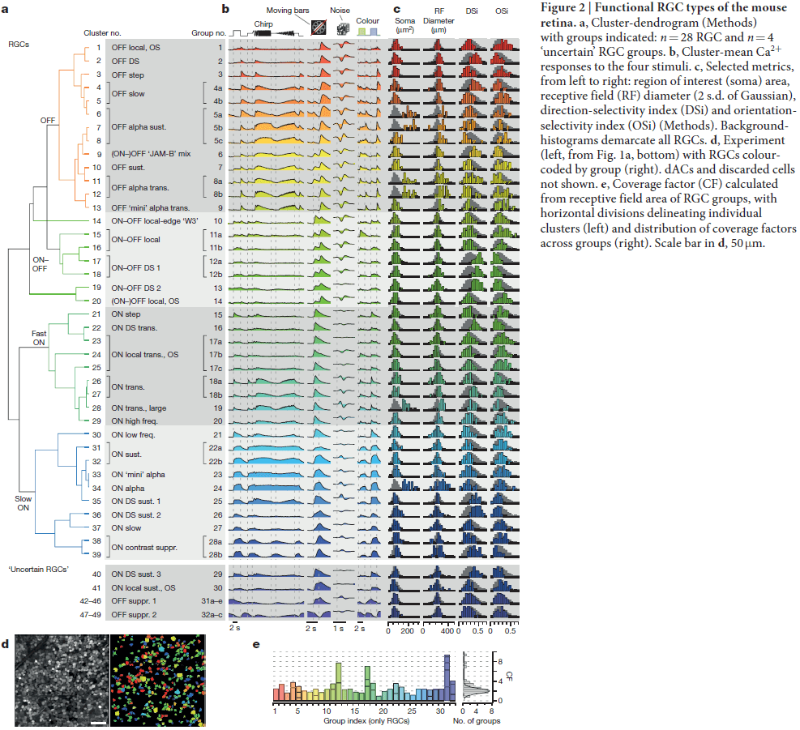
- The RGC groups cover a broad range of classical features such as polarity, receptive field size, frequency, and contrast sensitivity.

## [Organization of the Human Trichromatic Cone Mosaic](https://doi.org/10.1523/JNEUROSCI.2414-05.2005)

- Paper characterized the arrangement of short- (S), middle- (M), and long- (L) wavelength-sensitive cones in the human retina.
- All subjects had near-identical S-cone densities, indicating independence of the developmental mechanisms that controls the relative number of L/M cones and S cones.
- Characterizing the arrangement and number of trichromatic cones is important because it constrains the following circuits that serve spatial and color vision.
- Are L and M cones arranged randomly or nonrandomly in the retina? Evidence has been controversial.
- We found huge variability in L:M cone ratio. This ratio ranged from 1.1:1 to 16.5:1.
- Remarkably, despite this variation, the subjects were normal on all color vision tests used.
- This shows that the human visual system is either insensitive to the L:M cone ratio, or that standard color vision tests aren’t detailed enough.
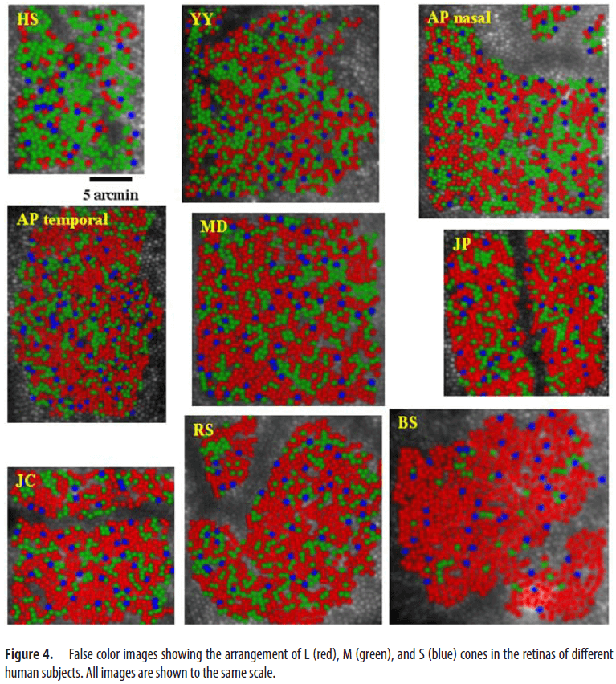
- Interestingly, people with different L:M ratios appear to all experience color the same.
- Yellow, a wavelength that appears neither reddish nor greenish and represents the neutral point of the red-green color mechanisms, is thought to be driven mainly by differences in L and M cone excitation.
- Several studies have noted that although the L:M cone ratio varies widely, the wavelength that subjects judge as yellow is nearly constant, varying with a standard deviation of only 2-5 nm.
- We also found the same result in that measures of yellow didn’t correlate with measurements of L:M cone ratio.
- Evidence suggests that this decoupling between cone ratio and color perception is due to a plasticity mechanism that normalizes color experience based on the chromaticity of the environment.
- The irregular assignment of L and M cones results in larger patches of effectively color-blind retina.
- Consistent with the hypothesis that patches of color-blind retina lead to an increased fraction of white responses, they found that as the L:M cone ratio becomes more skewed, the fraction of white responses increases.
- This irregularity of L and M cone arrangement furthers the confounding of spatial and chromatic information on small scales, leading to errors in color appearance for fine spatial patterns.
- The developmental processes that determine whether a cone will be M or L in a normal eye remains unknown.

## [The Mind of a Mouse](https://doi.org/10.1016/j.cell.2020.08.010)

- Large scientific projects are influential not because they answer any single question, but because they enable investigation of new questions from the same data-rich sources.
- E.g. Human genome project, astronomy, Large Hadron Collider.
- For neuroscience, the mapping of the brain’s synaptic connections (connectomics) is ripe for analysis.
- Is it possible to obtain the complete wiring diagram of an animal’s nervous system by serially sectioning it into many thin slices, imaging these slices at high resolution, and then painstakingly tracing each neuron’s branches and synaptic connections?
- This idea became reality in 1986 with the release of the C. elegans connectome.
- One advantage of volumetric electron microscopy (EM) is that it provides an unbiased rendering of every cellular and subcellular structure in the nervous system.
- The mapping of a whole mouse brain connectome would revolutionize our understanding of brain circuits.
- Roughly 1 million terabytes of data will be acquired and analyzed to provide a complete mouse brain connectome.
- Technical challenges
    - Uniform osmium staining.
    - Lossless sectioning and imaging at the nanometer resolution.
    - Parallelization of the analysis to complete the map in years as opposed to decades.
- Perhaps the greatest and most interesting challenges will only manifest after the connectome is completed, because each mouse connectome will be unique.
- Understanding which variations are regularities and which are random will help define the substrate that personality rests upon.
- Minimum information from a connectome
    - A complete census of anatomical cell types in the mouse brain.
    - Upstream and downstream synaptic partners for all neurons, including precise long range targets of each axon.
    - Structural parameters of each synapse such as bouton size and vesicle counts.
- We expect that the nanometer-scale connectome would be preceded by millimeter-scale mapping using non-invasive modalities such as functional ultrasound and MRI.
- Experiences are known to alter connections between nerve cells and this information is likely stored in an individual’s wiring diagram.
- The first complete mouse connectome will provide a baseline for comparisons.
- Connectomes may also help use better understand and treat brain disorders.
- Applications of the connectome to AI
    - A blueprint for cognitive computing systems.
    - A blueprint for data-efficient learning.
    - A blueprint for energy-efficient computing.
- Despite our intelligence and centuries of inquiry, we still have a paltry sense of how the brain works.
- What we do know is that the complex patterns of synaptic connectivity are almost certainly at the heart of its function.
- For technical reasons, mapping a mouse brain is far more feasible than a human one, but even a mouse connectome is challenging to map.
- We predict that a whole-brain mammalian connectome will generate entirely new and unanticipated questions about the nervous system and perhaps represent a turning point in the pursuit of understanding what makes us unique.

## [Topographic Representation of Numerosity in the Human Parietal Cortex](http://doi.org/10.1126/science.1239052)

- Numerosity: the set size of a group of items.
- Sensory cortices have topographic maps reflecting the structure of sensory organs.
- Are the cortical representation and processing of numerosity organized topographically, even though it has no sensory organ?
- Paper used 7T fMRI and found neural populations tuned to small numerosities in the human parietal cortex.
- The populations are organized topographically, forming a numerosity map that’s robust to changes in low-level stimulus features.
- The cortical surface area devoted to specific numerosities decreases with increasing numerosity, and the tuning width increases with preferred numerosity.
- These organizational properties extend topographic principles to the representation of higher-order abstract features in the association cortex.
- Numerosity is used to guide behavior and becomes less precise as the size of the numbers increases.
- Animals, infants, and tribes with no numerical language perceive numerosity even though they don’t count or use symbolic representations of numbers.
- So, numerosity is evolutionary conserved. It’s distinct from counting, humans’ unique symbolic language, and our mathematical abilities.
- Numerosity mirrors primary sensory perception and has been referred to as a “number sense”.
- The neural representation of numerosity lives in higher-order association cortices, specifically, the right posterior parietal cortex.
- When testing numerosity, we used several different stimulus conditions to reduce the effect of the stimulus on numerosity and to ensure that any effect is attributable to dot quantity, not quality.
- The authors also asked the participants to not judge the number of dots to ensure that the observed effects were related to perceiving quantity, rather than counting.
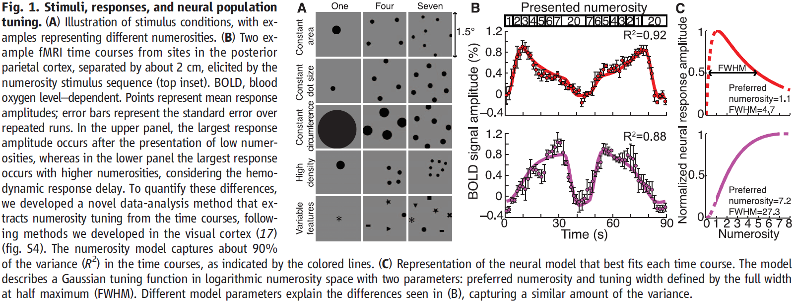
- The displayed numerosity varied systematically within an fMRI scan.
- We modeled the fMRI signals using two parameters
    - Preferred numerosity
    - Tuning width (the numerosity range that the population responds to)
- This model explains about 90% of the variance in the fMRI responses, explaining time course differences by different numerosity tunings.
- A specific region in the right posterior parietal cortex was highlighted, where the model captured much response variance in all stimulus conditions, and was consistent between the eight participants and closely matches previous studies.
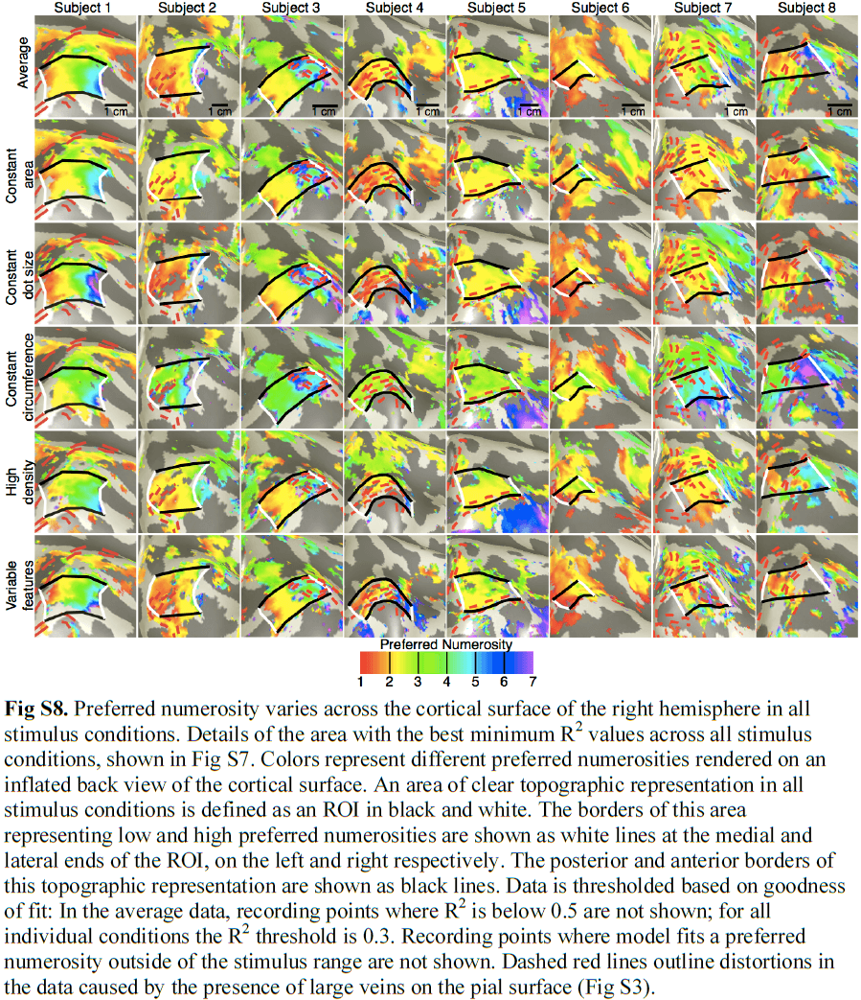
- Projecting each recording site’s preferred numerosity onto the unfolded cortical surface revealed an orderly topographical map, with medial and lateral regions preferring low and high numerosities respectively.
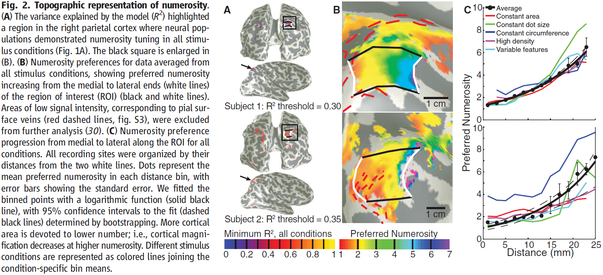
- This topographic map is also consistent across stimulus conditions.
- Numerosity selectivity was also present in the left hemisphere but with lower explained variance, and less clear and consistent topographic structure.
- Regarding the different stimulus conditions, numerosity preference was organized topographically in all conditions, but absolute numerosity preference varied with stimulus condition.
- The map represented relative, no absolute quantities.
- E.g. A region might respond to one dot in one task condition, but to two in another. However, across all tasks, it always responded to small numbers of dots.
- The constant circumference condition differs from the other conditions, suggesting that very different dot sizes interacts with numerosity preference.
- More cortical surface area represents lower numerosities and vice versa.
- This makes sense and matches our subjective experience for judging small quantities. We have a finer discrimination for smaller quantities and this may be due to the overrepresentation of lower numerosities compare to higher numerosities.
- Also, population tuning width increased with preferred numerosity.
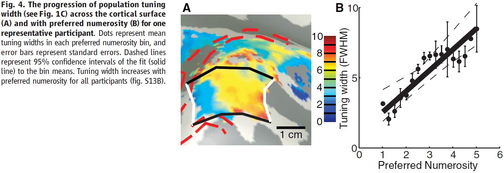
- Neuroimaging studies consistently show that this part of the parietal cortex responds to numerosity manipulations and parietal lesions can cause number-processing deficits.
- The spatial scale of the topographic organization is several centimeters, which may have limited single-neuron recordings.
- This is one of the strengths of 7T fMRI in that it can measure activity on a scaler greater than electrode recordings, but finer than EEG or PET.
- These properties of the numerosity region are analogous to the organization properties of the sensory and motor cortices and may underlie the decreased precision at higher numerosities that’s seen in humans and animals.
- The numerosity-selective responses found by this paper can’t be explained by other visual features of the stimulus.
    - Tuning and topographic structure were found using stimuli controlled for low-level features.
    - Responses in visual field maps can’t be captured by numerosity models.
    - Parietal visual field map borders didn’t match numerosity map borders, as representations of numerosity and visual space may exist in one cortical region but be represented by different neurons.
- Interactions between overlapping numerosity and visuospatial representations may underlie the cognitive spatial “number line” but the paper found no consistent relationship between numerosity and visuospatial responses.
- What’s the nature of the numerosity representation?
- Interestingly, we found no number-tuned responses for Arabic numerals, suggesting that neurons here don’t respond to symbolic number representations.
- Results show that topographic representations can emerge in the brain to represent abstract features such as numerosity.
- Similarities in cortical organization suggest that the computational benefits of topographical representations, such as efficient wiring, apply to higher-order cognitive functions and sensory-motor functions alike.
- Topographic organization may be common in higher cognitive functions and finding that numerosity is topographically organized supports the view that numerosity perception resembles a primary sense.
- These findings challenge the idea that primary topographic representations and abstract representations are distinct.

## [Representations: Who Needs Them?](https://escholarship.org/uc/item/0gq5z3sh)

- Traditionally, biologist rarely used the term “representation” to describe their findings, instead using terms such as “receptive field” and “corollary discharge”.
- Such words connote dynamic processes rather than symbolic content.
- A turning point came in the 1940s with the popularization of the brain as a Turing machine.
- E.g. Cognitive processes were interpreted as manipulating symbols according to certain rules.
- Two reasons to not use representations
    1. It obscures our lack of understanding of how brains work and gives us the illusion that we do.
    2. It carries research away from more effective lines of inquiry.
- We have found that thinking of brain function in terms of representation impedes progress towards genuine understanding.
- E.g. EEG activity patterns in the olfactory bulb.
- We tried to say that each spatial pattern was like a snapshot that represents the odorant that’s correlated with it. But such interpretations are misleading.
- Representations encourage us to view neural activity as a function of the features and causal impact of stimuli on the organism and to look for a reflection of the environment within by correlating features of the stimuli with neural activity.
- This is a mistake.
- It’s a mistake because neural activity patterns in the olfactory bulb can’t be equated with internal representations of particular odorants to the brain.
- Reasons
    - Presenting an odorant to the system doesn’t lead to any odor-specific activity patterns being formed. This does happen though when the odor has been reinforced.
    - Odor-specific activity patterns are dependent on the behavioral response; changing the conditioned stimulus changed the patterned activity.
    - Patterned neural activity is context-dependent; a new odorant leads to changes in all previously learned odorants.
- Instead of representing the stimulus, patterned neural activity correlates best with reliable forms of interaction in a context that’s behaviorally and environmentally co-defined.
- There’s nothing intrinsically representational about this dynamic process until the observer intrudes.
- E.g. It’s the experimenter who infers what the observed activity patterns represent to the subject.
- By focusing less on representations, we focus less on the outside world that’s put into the brain and more on what brains are doing.
- Representations are useful for philosophers, computer scientists, and cognitive psychologists, but not for physiologists.
- Representations are better left outside the lab when physiologists study the brain.

## [Place Cells, Grid Cells, and Memory](http://doi.org/10.1101/cshperspect.a021808)

- The hippocampal system is critical for the storage and retrieval of declarative memories.
- Memories must be distinct to be recalled without interference and encoding must be fast.
- Paper reviews and discusses some of the work on how the hippocampal network allows for fast storage of large quantities of uncorrelated spatial information.
- History of the scientific study of human memory
    1. Starts with Ebbinghaus and his principles of memory encoding and recall.
        - E.g. Law of frequency and the effect of time on forgetting.
    2. Experimental psychologists describe the laws of associative learning in animals.
        - E.g. Pavlov, Watson, Hull, Skinner, and Tolman.
    3. Neural basis for memory.
        - E.g. Karl Lashley and Donald Hebb.
    4. Patient H.M.
        - E.g. Scoville and Milner.
- What’s missing from these studies is a way to address the neuronal mechanisms that led information to be stored as memory.
- Place cells: cells that selectively fire at one or a few locations in the environment, also called a place field.
- It’s become clear that place cells express past, present, and future locations.
- In many ways, place cells can be used as readouts of the memories that are stored in the hippocampus.
- Place cells seem to be organized nontopographically, meaning the place fields of neighboring cells aren’t similar, unlike the topographic organization that we commonly see for sensory and motor areas.
- However, the size of the place field increases from dorsal to ventral hippocampus.
- Converging evidence suggests that hippocampal neurons also respond to nonspatial features of the environment.
- E.g. Odors, tactile inputs, and timing.
- This means that place cells express the location of the animal in combination with information about events that take place or took place there.
- Results point to a critical role for experience in forming the hippocampal map of space.
- Place maps are expressed from the first moment when animals are put into an environment, but the maps can change following more experience.
- In other words, place maps are refined by experience-dependent long-term synaptic plasticity.
- Once memories are encoded, they must be consolidated for long-term storage.
- A large body of evidence points to the gradual recruitment of neocortical memory circuits in the long-term storage of hippocampal memories.
- Replay may support “mental time travel” through the spatial map, both forwards and backwards in time.
- To determine the source of place cell activity, we recorded from the entorhinal cortex.
- Entorhinal neurons fired in a regularly spaced triangular/hexagonal grid pattern, which repeated itself across the entire available space.
- Grid cells: cells that fire in a grid-like pattern.
- Grid cells, like place cells, are also organized non-topographically.
- However, the scale of the grid increased from dorsal to ventral medial entorhinal cortex.
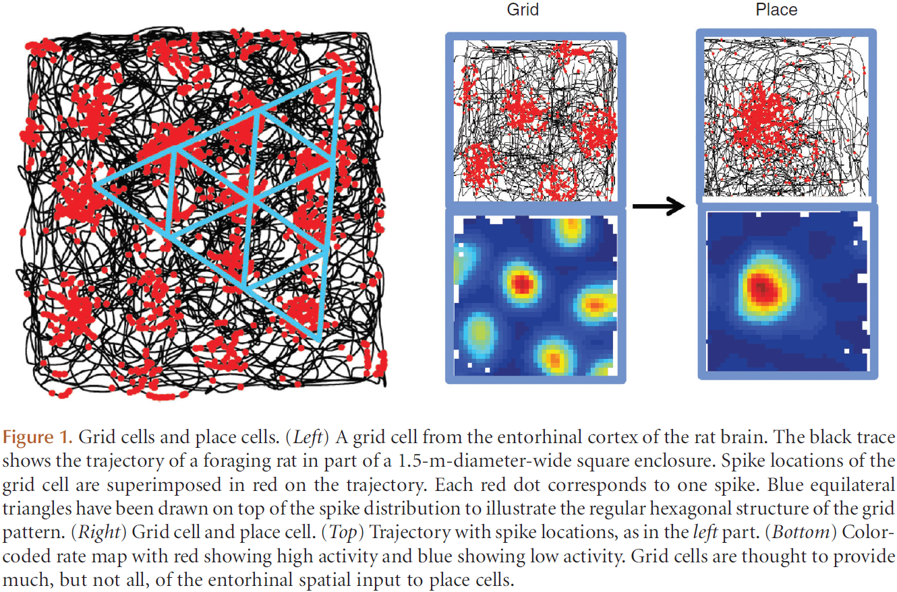
- Further studies showed that grid cells were part of a wider spatial network comprised of other cell types such as head direction and border cells.
- How place cells are formed from the diversity of cell types remains to be determined.
- An obvious possibility is that place cells are generated by transformation of spatial input from grid cells.
- E.g. Place fields form by linear combination of periodic firing fields from grid cells.
- Experimental results suggest that the mechanisms are more complex than this.
- E.g. The development of grid cells comes after and is delayed compared to place cells.
- This suggests that place cells can’t depend on grid cells for their input.
- The delayed maturation of grid cells offers at least two interpretations.
    - Maybe weak spatial inputs are sufficient for place-cell formation.
    - Place cells may be generated from other classes of spatially modulated cells.
- Maybe place cells receive inputs from both grid and border cells.
- The discovery of remapping hints that place cells express declarative memory.
- Remapping: that any place cell is part of not one, but many independent representations.
- Place cells can alter their firing patterns in response to minor changes in the experimental task.
- E.g. Changing the shape of the enclosure.
- Remapping experiments showed that place cells participate in multiple spatial maps; in multiple orthogonal representations.
- Remapping is necessary if place cells express memories and this seems to be unique to the hippocampus.
- Observations suggest that remapping isn’t generated in the entorhinal cortex, but in the hippocampus itself.
- Experimental studies have provided evidence for a modular organization of grid cells, with four modules being detected in most animals.
- Grid cells cluster into modules with distinct grid scale and grid orientation.
- With this modular organization, networks of grid cells may be able to generate not only one map of the external environment, but thousands or millions through a combinatorial combination.
- How these maps contribute to declarative memory remains to be seen.

## [Movement: How the Brain Communicates with the World](https://doi.org/10.1016/j.cell.2016.02.038)

- Paper discusses the experimental and theoretical underpinnings of current models of movement generation and the way they’re modulated by external information.
- Results of lesion and electrical stimulation experiments were viewed primarily in terms of discrete connectivity pathways known as “circuits”.
- However, recent technology that has allowed us to simultaneously record APs from many neurons during natural movements that has challenged the idea of a discrete circuit.
- E.g. Many neurons are active together in a large population that generate similar signals for movement generation.
- Two types of movement
    - Reflexes
    - Intentional/volitional action
- Volitional movement isn’t clearly defined nor understood, making it difficult to develop concrete, rigorous models to describe the way they work.
- Task-related neural activity can be correlated to movement, but the meaning of the association between any given neural pattern and the task will be open to debate.
- In contrast, reflexes are simpler to study in terms of input and output.
- Reflexive movements act on the principle of feedback where the output of the system is used to modify its input.
- E.g. Negative feedback where stretching a muscle causes it to be excited, causing the muscle to shorten and thus counteracting the stretch.
- E.g. Vestibular ocular reflex: head movement → semicircular canals → eye muscles. This reflex helps to stabilize movement with vision.
- Even these basic reflexes are modulated by the context in which they occur.
- Certain neural structures adjust the gain and sensitivity of receptors, thus modulating the reflex.
- Reflexes are effective during volitional movement and contribute to it’s successful production.
- Volitional movement: the intended execution of an action.
- A volitional movement can be broken down into a sequence of actions and intentions.
- Since intention must come before action, intention has to be predictive since sensory feedback isn’t available.
- Once sensory information is available, it may change the intention and action, suggesting that there are distinct phases of the task that may be controlled differently.
- Two phases hypothesis for volitional movement
    - An initial ballistic phase that transports the limb to a location near the target.
    - A following homing phase executed with visual feedback as a series of small, fine movements.
- How can movement take place in the absence of feedback?
- Results show that there’s a continuous specification of trajectory that begins before movement onset and continues as the arm moves.
- This control takes place even when continuous feedback is absent.
- One proposed solution is the efference copy.
- Efference copy: a copy of the motor command that isn’t sent to the muscles, but rather to sensory areas of the brain to predict the sensation that the movement results in.
- In its initial proposal, the efferent copy served to assign agency during eye movement, distinguishing moving visual scenes from self-generated motion.
- Findings suggest that “internal” recognition of a target error, such as using efferent copy, can lead to corrections without real-time feedback of the movement.
- If the target was shifted during a saccade, subjects could correct their trajectory quickly and smoothly, showing how extrinsic information can be incorporated into the ongoing movement generation process.
- This goes against the traditional ballistic phase of volitional movement as feedback is incorporated into the control of movement.
- This also shows that the signals used to control the arm’s trajectory are continuously transmitted throughout a reach.
- The efferent signal for a movement is modifiable by intrinsic errors and by extrinsic cues at the beginning of the movement and by target modifications.
- Both feedback and feedforward control are used to regulate movement.
- Modern feedforward control invokes learning, where the prediction of an intended action is modified by prior sensation.
- E.g. The motor system can progressively learn to estimate its own behavior and thus, modify it.
- Accurate prediction relies critically on accurate knowledge of the initial state of the system.
- The use of prior information before movement supports the idea that feedforward control systems are determined by their initial conditions.
- Internal model: prior knowledge gained by learning and used to make accurate predictions of an intended action.
- Internal models are an essential ingredient for forward-control theories.
- E.g. If a force field is applied to a movement task, compensated for, and then removed, the subjects now overcompensate for the movement. This is evidence for learning the internal model of the forces generated to achieve the intended trajectory.
- Inverse problem: going backward from the endpoint to internal coordinates.
- The internal model is the learned solution to the inverse problem.
- Perturbations to ongoing arm movements again showed learning-dependent compensatory responses.
- Learned compensation is analogous to an internal model update that attempts to minimize error.
- Tying this all together, the idea of optimizing cost functions, using efferent copies to make predictions, and updating the internal model are all under optimal control theory.

- Information theory, in comparison to optimal control theory, is another major approach to motor control.
- In information theory, the basic concept is that a certain number of decisions (bits) are needed to specify the value of the commands sent to the muscles.
- These bits can only be transmitted at some maximum rate (bits/s), as determined by the structure of the motor system, also known as the channel capacity.
- It takes fewer bits of information to predict a smooth trajectory, so maximizing smoothness minimizes the control burden.
- Affordance: the set of possible actions that could take place on an object.
- Rather than describing objects by their physical qualities, we can instead describe objects in terms of the behavior they afford/allow.
- This idea forms the basis of “Ecological Psychology”.
- Prediction of sensation in movement is done while visualizing, early in reaching, and well before grasping takes place.
- To summarize, motor control theory has evolved from studying simple reflexes to theories that approach explaining cognition.
- Early volitional control schemes were described using the feedforward control model that assumed a movement was completely determined before it began. However, experiments showed that movements can be modified based on changing intentions and sensations.
- It should be emphasized, though, that motor control theories are constructs and assigning them to the nervous system results in problems.
- Attempts to match motor control theories with brain circuitry can be seen in works dealing with the latency of a learned response to perturbation.
- Review of Georgopoulos population vector coding and brain-controlled interfaces (BCI).
- We’re converging on the idea of movement as communication of intention from the brain to the external world.

## [Cognitive computational neuroscience](https://doi.org/10.1038/s41593-018-0210-5)

- One way to learn about how cognition is implemented in the brain is by building computational models that can perform the same cognitive tasks and then test such models.
- One argument in favor of task-performing computational models was in the paper “You can’t play 20 questions with nature and win.”
- Hypothesis testing, in that paper’s view, needs to be complemented by the construction of comprehension task-performing computational models.
- If we did have a full understanding of an information-processing mechanism, then we should be able to engineer it.
- Paper argues that task-performing computational models that explain how cognition comes from neurobiologically plausible dynamic components will be central to a new cognitive computational neuroscience.
- Cognitive neuroscience: relating cognitive theories to the brain.
- While cognitive neuroscience was one step forward in terms of explaining brain activity, it was one step backward in terms of computational rigor.
- It mapped an ever increasing number of cognitive functions to brain regions, providing a useful global functional layout of the human brain, but a brain map, at whatever scale, doesn’t reveal the computational mechanism underlying each map.
- However, maps do constrain theories as component placement reflects limitations such as costs, energy, signal latency, and physical connections.
- Generally, the topology and geometry of a network constrains its dynamics, and thus its functions.
- fMRI has the advantage of providing continuous recordings over a large field of view, something that invasive electrodes can’t provide.
- E.g. Face-selective regions in the fusiform face area.
- We have mapped the global functional layout of the human brain, but we haven’t achieved a full computational account of the brain’s information processes.
- The challenge is to build computational models of the brain that are consistent with brain structure and function, and that also perform complex cognitive tasks.
- In other words, a biologically-inspired artificial intelligence (AI).
- Recent developments in various fields
    - Cognitive science has proceeded from the top down, decomposing complex cognitive processes into simpler components.
        - E.g. Bayesian cognitive models.
    - Computational neuroscience, in contrast, has proceeded from the bottom up, showing how dynamic interactions between neurons can implement computational functions.
        - E.g. Sensory coding, normalization, and motor control.
    - Artificial intelligence is at the midway point, showing how intelligent behavior can emerge from the integration of computational component functions.
        - E.g. Deep learning, reinforcement learning, and symbolic models.
- These three fields contribute complementary elements to biologically plausible computational models that perform cognitive tasks and explain brain information processing and behavior.
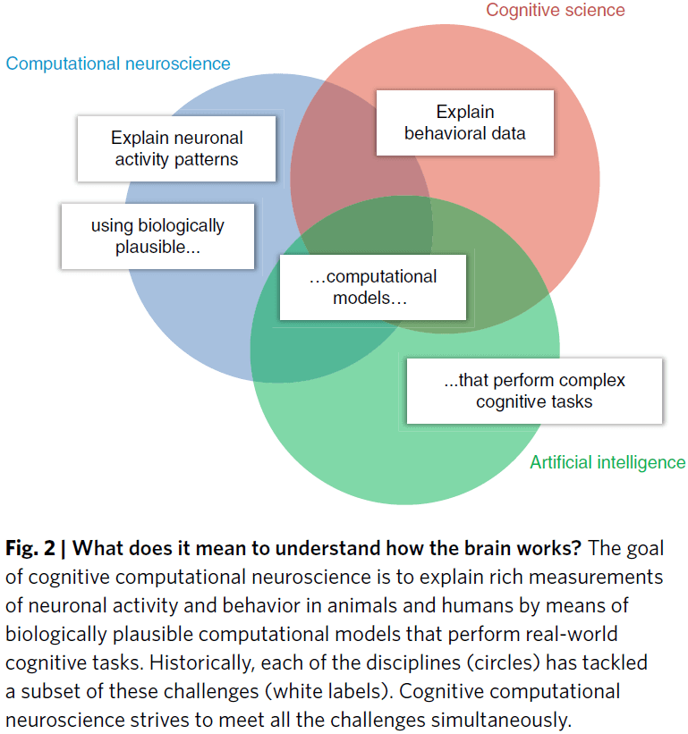
- AI is a key discipline that provides the theoretical and technological foundation for cognitive computational neuroscience.
- Paper outline
    - First part describes bottom-up developments that bridge experimental data with theory.
    - Second part describes top-down developments that bridge theory to experiments.
- From experiment to theory
    - Connectivity and dynamics models
        - Connectivity models go beyond the localization of activated regions and characterizes the interactions between regions.
        - Neuronal dynamics can be measured and modeled at multiple scales, from individual neurons to populations to the whole brain.
        - Together, these models capture aspects of the dynamic interactions between regions.
        - These models go beyond generic statistical models by generating data at the level of the measurement and are models of brain dynamics; they’re generative models.
        - However, they don’t capture how information is represented and how it’s processed in the brain.
    - Decoding models
        - These models reveal what information is present in each brain region.
        - This goes beyond the idea of activation and explores the information present in a region’s population.
        - When content is decodable from activity in a brain region, this indicates the presence of information.
        - Thus, that brain region “represents” that information.
        - Representations can contain information about a sensory stimulus, a stimulus property, an abstract variable, or an action.
        - However, decoding models don’t provide a full account of the neuronal code as it doesn’t specify the representational format or what other information may be present.
        - Another major limitation is that they don’t constitute models of brain computation; they reveal aspects of the product but not the processes that created the product.
    - Representational models
        - We want to exhaustively characterize a region’s representation by explaining its responses to arbitrary stimuli.
        - These models attempt to predict and fully characterize a region’s representational space and therefore, provide stronger constraints on the computational mechanism than decoding models.
        - They’re often defined on the basis of descriptions of the stimuli, such as labels provided by human observers.
        - While it explains the brain’s responses in a given region in a descriptive account of the representation, it doesn’t provide a computational account.
- All three types of models, in the absence of task-performing computational models, are subject to the argument that asking a series of questions might never reveal the computational mechanisms underlying the cognitive process we wish to understand.
- These models fall short of bridging theory and experiment because they don’t test mechanistic models that precisely specify how a cognitive function processes information.
- From theory to experiment
    - Computational models can be characterized by their cognitive and biological fidelity.
        - E.g. Models that capture only neuronal components and dynamics tend to be unsuccessful at explaining cognitive function, and vice versa.
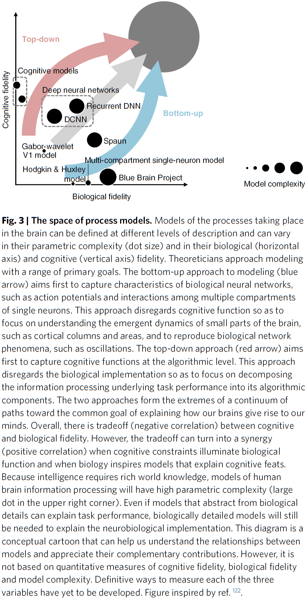
    - Neural network models
        - These models have been essential to understanding the dynamics in biological neural networks and elementary computational functions.
        - They also provide a common language for building task-performing models that meet the combined criteria for success of the three disciplines.
        - Review of supervised learning and CNNs as a model of vision.
    - Cognitive models
        - These models capture the information processing of the brain without having to implement neurobiologically plausible components.
        - This enables progress on domains of higher cognition, where neural network models still fall short.
        - E.g. Production systems, reinforcement learning, and Bayesian cognitive models.
        - Generative models are an essential ingredient of general intelligence.
        - Learning a generative models requires experience for insights on its environment and requires a deep understanding of the cause-effect relationships.
        - Generative models may also explain the brain’s stunning statistical efficiency; it’s ability to infer so much from so little data.
        - The corners cut by the brain for computational efficiency, heuristics, may explain the deviations from Bayesian models as they deviate from statistical optimality.
- The brain seamlessly merges bottom-up discriminative and top-down generative computations.
- Likewise, brain science needs to integrate its levels of description in both directions.
- Understanding the brain requires that we develop theory and experiment together and complement the bottom-up, data-driven approach by a top-down, theory-driven approach that starts with behavioral functions to be explained.
- Review of Marr’s three levels of analysis.
- E.g. Cognitive science is the computational theory, AI is the representation of the algorithm, and computational neuroscience is the neurobiological implementation.
- All three disciplines converge on the algorithms and representations of the brain and mind.
- A new culture of collaboration will be needed to integrate all three of Marr’s levels.
- New divisions of labor
    - Tasks: a controlled environment for behavior.
        - It defines the dynamics of the world that provides sensory input and captures motor output.
        - Our tasks will need to simulate natural environments and will come to resemble computer games.
    - Data: behavioral data acquired during task performance.
    - Structural, functional, and behavioral brain data will be essential for constraining computational models.
    - Models: take sensory inputs and produce motor outputs so as to perform experimental tasks.
        - Ultimately, models must generalize across tasks.
    - Tests: we need tests that compare models and brains on the basis of brain and behavioral data.
        - Since every sensation and action permanently changes the brain, this complicates and makes it challenging to compare brains and models.

## [Coupling the State and Contents of Consciousness](https://doi.org/10.3389/fnsys.2019.00043)

- A fundamental feature of consciousness is that the contents of consciousness depend on the state of consciousness.
- E.g. You can’t be experiencing the color red if you’re in a coma or in non-REM sleep.
- Why does this dependency exist?
- Paper proposes that both the state and contents of consciousness depend on the activity of cortical layer 5 pyramidal (L5p) neurons.
- These neurons affect both cortical and thalamic processing, hence coupling the corticocortical loops and thalamocortical loops with each other.
- This coupling corresponds to the coupling between the state and contents of consciousness.
- Together, both loops form a thalamocortical broadcasting system where L5p cells are the central elements.
- A prediction of this theory is that cortical processes that don’t include L5p neurons will be unconscious. Thus, L5p neurons play a central role in the mechanisms underlying consciousness.
- Unfortunately for consciousness research, the state of consciousness is mostly studied separately from the contents.
- Research done on the state mainly explores the thalamus and the thalamocortical interactions, while research done on the contents is mostly focused on cortical processing.
- However, one basic fact about consciousness is that the state can never be dissociated from the contents.
- E.g. You can’t be conscious of the taste of coconut while being in an unconscious state and vice versa.
- So, the state and contents of consciousness make up an integrated whole; you can’t study one without assuming the other.
- It’s currently unclear why the state and contents of consciousness have to be so tightly coupled.
- This paper highlights a clear neurobiological correlate for this coupling, the cortical layer 5 pyramidal (L5p) neurons that participate in both thalamocortical and corticocortical loops, hence coupling these loops and thus functionally coupling the state and contents of consciousness.
- Thalamocortical loop and the state of consciousness
    - The idea that the thalamus plays a key role in controlling the state of consciousness isn’t new.
    - Two general types of thalamocortical pathways
        - Specific pathway (SP): carries afferent information to the cortex.
            - E.g. Lateral geniculate nucleus (LGN).
        - Non-specific pathway (NSP): has no direct role in transmitting information to the cortex, but is capable of modulating the cortex’s state.
    - These two pathways are more intermingled than we thought so this is a simplified view.
    - Evidence suggesting that the NSP thalamus is directly involved in controlling the state of consciousness
        - The alternation of sleep and wakefulness depends on NSPs.
        - E.g. Simulation of the NSP ventromedial (VM) thalamic nucleus woke mice from NREM sleep and anesthesia.
        - Virtually all general anesthetics have common targets in the NSP thalamus.
        - Injuries and tumors localized to the NSP thalamus often cause absence of consciousness in patients despite the fact that the SP system remained intact.
    - Based on this evidence, there’s no specific area of the cortex that’s related to consciousness, but it’s the interplay with the thalamus that matters.
- Corticocortical loop and the contents of consciousness
    - Many theories of consciousness have emphasized the relationship between consciousness and cortical processing.
    - E.g. Global workspace theory.
    - However, this focus on the contents of consciousness in humans has left unanswered why these contents of consciousness are dependent on the state of consciousness.
- State and contents of consciousness interact in L5p neurons
    - Paper proposes that L5p neurons functionally correspond to the connection between the state and contents of consciousness.
    - Thalamocortical and corticocortical loops uniquely intersect at the level of L5p neurons.
    - Cortical L5p neurons have two functionally distinct sites of integration
        - Soma/Dendrite: receives specific feedforward information from lower cortical areas.
        - Apical: receives diverse input from higher cortical areas and NSP thalamic nuclei.
    - If both sites are depolarized at around the same time, the chance that the neuron fires is greatly increased.
    - E.g. The secondary somatosensory cortex (S2) can be activated by L5p neurons in S1 through the NSP thalamus.
    - This suggests that the transthalamic pathway is a key component for cortical activity propagation.
    - Studies suggest that the awake state has an enormous impact on the activity of L5p apical dendrites.
    - The massive increase in the activity duration of L5p apical dendrites may reflect the interaction between the state and contents of consciousness.
    - L5p neurons may also be vital for conscious perception.
- Non-conscious contents in a conscious state
    - If the state and contents of consciousness are bound in the brain, then how can some processing of the contents be unconscious?
    - In other words, why does unconscious processing exist?
    - Not all sensory signals are consciously experienced.
    - E.g. Peripheral vision and priming effects.
    - In fact, consciousness only has access to very specific levels of representation.
    - E.g. We don’t have access to the processes that segregate our environment into discrete objects nor can we access how colors are perceived.
    - Hence, conscious experience is restricted to certain contents and computations.
    - The theory presented in this paper has a natural way to understand this: all subcortical and cortical processing that doesn’t involve L5p neurons will remain non-conscious.
    - E.g. Motor control depends on the computations of the basal ganglia and cerebellum, which are detached from the loop of consciousness.
    - Non-conscious processing also happens in the cortex.
    - We make the strong prediction that cortical processing in itself, when it isn’t integrated with NSP thalamic nuclei via L5p neurons, is unconscious.
    - Specifically, feedforward cortical processing that bypasses thalamocortical neurons is non-conscious.
- Thalamocortical broadcasting in action
    - It’s well known that conscious experience has a limited temporal resolution.
    - If different stimuli are presented too quickly, then some fail to be consciously experienced.
    - E.g. Backward masking, attentional blink, and if two colors are quickly cycled, then they fuse into a single color such as red and green turning into yellow.
    - This is explained by the L5p neuron theory that if conscious perception is based on the processing within the thalamocortical loop, then it’s hard for conscious perception to resolve anything that happens faster than the processing time of this loop.
    - Thus, we claim that the temporal resolution of conscious experience is caused/limited by the propagation time between L5p neurons, NSP thalamus, and higher cortical areas.
    - We can explain the backward masking phenomenon with this theory.
    - E.g. When the first stimulus (target) activates the L5p neurons, it starts the thalamocortical broadcasting loop. However, by the time this activity propagates from the L5p neurons to the NSP thalamus and back to the apical dendrites of L5p neurons, the second stimulus (mask) has taken over early cortical representations and now steals/blocks the neurons that the first stimulus was going to use. Thus, the target starts the loop but the mask benefits from it.
- Future directions
    - We can test the L5p theory by directly manipulating the different components of the loop.
    - E.g. Affecting the different compartments/sites of L5p neurons in rodents.
    - The goal here is to propose that future work on the mechanisms of consciousness should specifically target the L5p neurons.
    - Current evidence supports this theory as deep sleep and anesthesia breakdown effective connectivity, and thus the thalamocortical loop.
- Limitations
    - There are several limitations, mainly related to the anatomy of the corticothalamocortical circuits.
    - First, not much is known about human L5p cells such as their projection patterns.
    - Second, if there are distinct classes of L5p neurons that participate in corticocortical and corticothalamocortical loops, then is it even meaningful to suggest that there’s an intersection of these loops?
    - Third, the thalamic projection patterns presented here are simplified.

## [Color Perception Is Mediated by a Plastic Neural Mechanism that Is Adjustable in Adults](https://doi.org/10.1016/S0896-6273(02)00818-8)

- Is visual-experience-dependent neural plasticity only used to maintain function or is it actively used to make adaptive adjustments?
- Paper provides evidence for an active role for experience in circuits handling color vision.
- Experiment used colored filters to shift a person’s chromatic experience.
- A neural normalization mechanism for color perception, determined by visual experience, operates to compensate for large genetic differences in retinal architecture and for changes in chromatic environment.
- Early on, it was assumed that neural plasticity was restricted to the preadult stage and that little to no neural plasticity happens during adulthood.
- However, evidence has accumulated for some degree of neural plasticity during adulthood.
- Why do sensory systems have the ability to remodel their function in response to changes in experience? Why does neural plasticity exist?
- One hypothesis is that neural plasticity allows neural connections to make adaptive adjustments to compensate for genetic abnormalities, damage, and to environmental changes.
- While activity is necessary for the maintenance of proper neural function, there’s little evidence that the activity is used in the formation of proper circuits.
- The ratio of L to M cones in the retina is very different for each individual, and yet they don’t seem to have different color vision.
- Since visual experience is similar for most people, maybe neural plasticity allows the visual system to use experience to compensate for individual differences in cone ratio and make perception uniform across a population.
- Paper found such a result, that experience and neural plasticity changes perception to be uniform regardless of individual differences.
- We found that prolonged exposure to chromatic alteration in adults induced long-term changes in color perception.
- Also, the effects of the alteration transferred to the unexposed eye, as predicted if the neural substrate for normalization happens in the cortex.
- These results show that information gained from experience can be used to actively optimize the neural circuits for perception and that plasticity persists in adults.
- Color vision is uniform despite enormous variability in L:M cone ratio
    - Experiment is that subjects have to select the color that is “uniquely yellow”, a yellow that’s neither reddish or greenish and has a very specific wavelength.
    - Subjects have varied L:M cone ratios but they all selected a color that was very similar to each other.
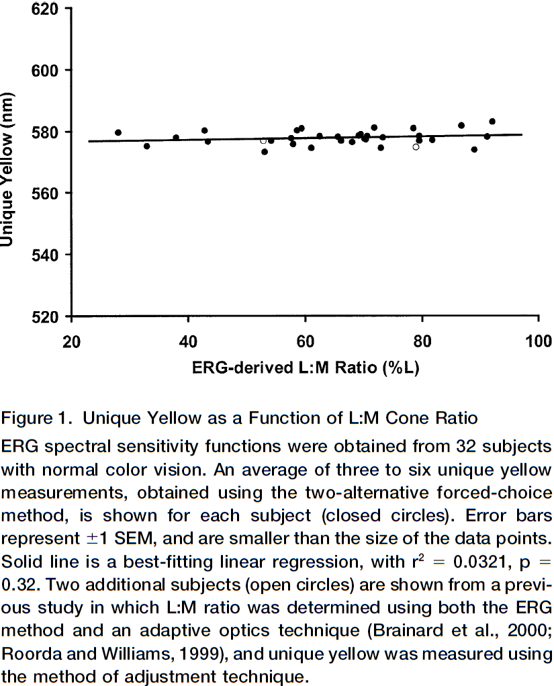
    - We predict that subjects with more L cones would select a greenish yellow, while subjects with more M cones would select a reddish yellow (flipped because of adaptation).
    - However, this experiment shows that this isn’t the case.
    - The lack of association between variation in cone ratio and unique yellow may be due to if the red and green chromatic channels were adjustable.
    - The adjustments could be done using information from experience, thus compensating for individual differences and making perception uniform.
- Long-term changes in color perception in response to chromatic alteration of visual experience
    - Experiment is that subjects have to wear colored contact lenses or colored goggles for varying time periods, thus changing their color experience to be more of that color.
    - E.g. Rose-tinted glasses.
    - As predicted by the normalization model, each subject’s unique yellow shifted progressively further away from their baseline.
    - Initially, the size of the shift was small. However, after many days of exposure, the shift had grown so large that wavelengths previously called red came to be consistently called green.
    - The absolute size of the shift varied between subjects due to various experimental conditions.
    - It takes a long time to induce the change and it persists for weeks afterwards.

- A cortical location for the normalization mechanism
    - Another experiment done suggests that it’s unlikely that the change in perception is mediated at the receptor-level since they didn’t change in response to the color filters.
    - However, if one eye has the colored filter but the other doesn’t, then the wavelength of unique yellow still shifts in both eyes but to a lesser extent.
    - This interocular transfer suggests that the normalization mechanism exists in central visual pathways where chromatic information from both eyes is integrated.
- Cone inputs to chromatic channels have adjustable weighting factors
    - The above experiments show that long-term changes in chromatic experience induce a change in the weighting of L and M cone inputs.
    - This weighting value can be calculated by knowing the spectral sensitivities of the cone pigments and the spectral location of unique yellow.
    - E.g. M cones peak near 530 nm and L come peak near 560 nm, so unique yellow should be somewhere in-between when both M and L respond the same amount, around 545 nm.
    - It should be noted, though, that color and wavelength are not the same.
    - So, if the weighting were one, then theoretically unique yellow should be near 545 nm.
    - However, the average value of unique yellow is 578 nm in normal people, indicating that the input of the L cone to the red/green chromatic channel has been adjusted, reducing it’s sensitivity by a gain factor of 0.64.
    - What explains this gain factor?
    - One possible answer is that M cones absorb fewer photons compared to L cones, about six to seven photons for every ten absorbed by L cones.
    - So, we hypothesize that the normalization mechanism that adjusts the relative gain of L and M cones is due do the difference in absorption of photons. Thus, we predict a compensating reduction in the relative weighting for the L cone input by 0.60-0.70, just as observed.
    - With the experiments above, we see a change in gain of about plus/minus 10%, showing that a plastic neural mechanism controls the gain.
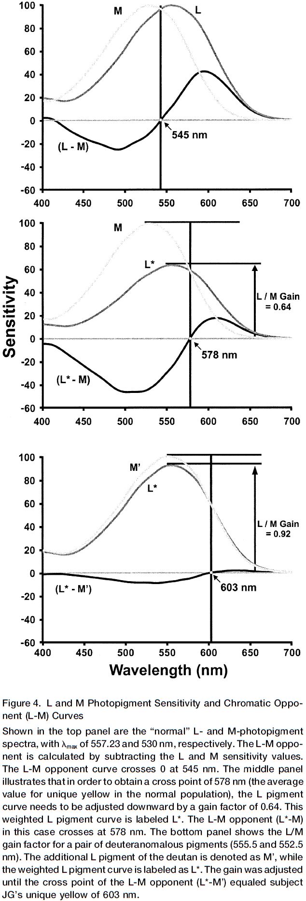
    - How about over the long term?
    - We can study congenital color blind people to see the effects of color vision deficiency over a lifetime of abnormal input.
    - Results suggest that the gain adjustment is near the theoretical limit in color blind people and it’s possible the gain mechanism is fully adjustable and could be set to any value dictated by the environment.
    - Interestingly for one of the color blind subjects, if the L cone gain wasn’t altered from the average normal person, his unique yellow would occur at a wavelength beyond 700 nm, a wavelength outside of the visible range.
    - One might argue that through shared culture/language, it’s possible that people with significantly different color perception might come to agree on a consistent set of color terms.
    - However, these experiments show that altered experiences, through the use of colored filters, change the wavelength called unique yellow, which shows that anomalous observers give different values for unique yellow even though they’re subjected to the same cultural influences.
- The flexibility of the color vision system is shown by it’s ability to adjust to different chromatic environments, to correct for large differences in cone ratio, and to maximize color vision in anomalous trichromats.
- Two types of color adaptation
    - One is fast and largely retinal in which the visual system adjusts to the ambient illumination levels. Thus, enabling color constancy or the ability to recognize colors under different lighting conditions.
    - One is the plastic normalization mechanism described in this paper, which determines the color of objects in the world.
- The ability of the color vision system to normalize itself to the average illuminant means that color perception will be the same for everyone who shares the same environment.
- This stability allows color coding in the form of communication and language.
- How do the circuits for color vision become correctly wired without the distinguishing labels of M and L cones?
- Maybe Hebbian mechanisms are at play.

## [The elephant brain in numbers](https://doi.org/10.3389/fnana.2014.00046)

- Paper finds that the African elephant brain, which is about three times bigger than the human brain, has 257 billion neurons, three times more than the average human brain.
- However, 97.5% of these neurons (251 billion) are in the cerebellum.
- This makes the elephant an outlier in it’s number of cerebellar neurons compared to other mammals.
- In contrast, the elephant cerebral cortex, which is twice the mass of the human cerebral cortex, holds only 5.6 billion neurons, about one third of the number of neurons found in the human cerebral cortex.
- These findings support the hypothesis that the larger absolute number of neurons in the human cerebral cortex (and not the whole brain) is correlated with the superior cognitive abilities of humans compared to other mammals.
- Review of Encephalization quotient (EQ), brain mass, and folding index to explain our superior cognitive abilities. They all don’t answer why humans are smarter than all other animals.
- We hypothesize that the neuron, the basic information-processing unit of the brain, and the combined absolute number of neurons in the cerebral cortex and cerebellum, best correlates with our cognitive abilities.
- Paper determines the cellular composition of the brain of one adult male African elephant using isotropic fractionation (aka brain soup).

|                                   | Elephant | Human |
| --------------------------------- | -------- | ----- |
| Number of Neurons (billion)       | 257      | 86    |
| Cerebral Cortex Neurons (billion) | 5.6      | 16.3  |
| Cerebellum Neurons (billion)      | 251      | 69    |
| Hippocampus Neurons (million)     | 36.63    | 250   |
| Total Mass (g)                    | 4619     | 1540  |
| Cerebral Cortex Mass (g)          | 2848     | 1424  |

- While the elephant cerebral cortex conforms to the neuronal scaling rules that apply to other afrotherians, it’s cerebellum has deviated in evolution.
- The elephant cerebral cortex is more folded than both a hypothetical primate cortex of a similar number of neurons and the human cerebral cortex, resulting in more surface area.
- This supports the hypothesis that cortical folding isn’t a simple function of the number of cortical neurons.
- Under 1 $$mm^2$$ of elephant cortex, only 10,752 neurons exist compared to 80,064 neurons in the human cerebral cortex.
- So, the number of neurons under a unit surface area of cerebral cortex isn’t constant across species, suggesting neuronal densities differ.
- Neurons in the elephant cerebral cortex are more spread out laterally, resulting in a highly folded cortex compared to other species with more cortical neurons.
- Neurons can spread underneath the cortical surface in different surface densities across species, which further implies that the expansion of the cortical surface and increased cortical folding aren’t synonymous with expanding numbers of cortical neurons.
- The low neuronal density in the elephant cortical gray matter indicates that neurons are, on average, 10-40 times larger than in other mammalian cortices.
- The discrepancy between the number of neurons in the elephant cerebellum and that expected for it indicates that the increase in number of cerebellar neurons in the African elephant didn’t obey the scaling rules that apply to other afrotherians.
- Also, the elephant cerebellum is smaller than expected for an afrotherian.
- The massive addition of neurons to the elephant cerebellum isn’t related to the cerebral cortex, but rather from non-cortical sources such as the brainstem.
- Why does the elephant has so many neurons in it’s cerebellum? What does it do?
- Two possible sources of information processed by the elephant cerebellum
    - Infrasound communication
        - It’s possible that the enlarged cerebellum is related to vocalization.
        - However, other findings suggest that the neuron-rich, complex cerebellar neuronal morphology and enlarged cerebellum aren’t related to vocalization.
    - Trunk
        - The trunk has infinite degrees of freedom of movement since it doesn’t have any internal bones and joints to limit its movement.
        - The tip of the trunk is also highly sensitive and acts like a whisker when it explores the environment.
        - Maybe the demands of the complex sensory and motor information of the trunk pushed the cerebellum to gain its extraordinary number of neurons.
- In contrast to its exceptional cerebellum, the cerebral cortex of the African elephant is unremarkable and matches expectations.
- The current data support the hypothesis that the remarkable cognitive abilities of the human brain lies in the remarkable number of neurons concentrated in the cerebral cortex.

## [The Brain’s Default Mode Network](https://doi.org/10.1146/annurev-neuro-071013-014030)

- The brain’s default mode network (DMN) is made up of discrete, bilateral, and symmetrical cortical areas in the
    - Medial and lateral parietal cortex
    - Medial prefrontal cortex
    - Medial and lateral temporal cortex
- These areas are consistent across human, nonhuman primate, cat, and rodent brains.
- The first hints of the DMN came from observing that certain cortical areas consistently reduced their activity when switching from rest to performing goal-directed tasks.
- That these localized reductions in activity were happening at all was surprising, and their consistency across a variety of tasks was even more remarkable.
- The challenge, then, was to prove that this activity isn’t due to uncontrolled cognition during the resting state.
- Early 21st century experiments using PET concluded that the brain areas observed to decrease their activity during attention-demanding, goal-directed tasks weren’t activated in the resting state, but were indicative of an unrecognized state of the brain’s intrinsic activity.
- In other words, those brain areas may be the “default mode” of the brain when it isn’t doing anything.
- For many experiments, the control state is simply the absence of a stimulus or when the participant is at rest.
- Finding a network of brain areas that frequently decrease their activity during attention-demanding tasks was both surprising and challenging.
    - Surprising because the areas involved weren’t recognized as a system in the same way that we might think of the motor or visual system.
    - Challenging because it wasn’t clear how to characterize their activity in a passive/resting condition.
- Were they simply activations present in the resting state? And why do they appear in both PET and fMRI?

- It’s difficult to access if there are activations in the resting state because what would you compare it to?
- Activations must be defined relative to something, but there’s no control state for resting state; it is the control state.
- One way in PET is to use uniform activity as the baseline.
- E.g. All brain areas should have no activity.
- Thus, if the uniform state is compared to the resting state, we find the DMN.
- What is the function of the default mode network?
- We can start by associating each brain region of the DMN with it’s known behavior/function.
- The DMN is roughly divided into three major subdivisions
    - Ventral medial prefrontal cortex (VMPC)
        - Is a critical element in a network of areas that receive sensory information from the external world and body, and conveys this information to structures such as the hypothalamus, amygdala, and periaqueductal gray matter.
        - Seems to be important in personality and social behavior.
        - Is the same area that was damaged in Phineas Gauge.
        - The emotional state of a person has a direct effect on the activity level in the VMPC component of the DMN.
        - E.g. Anxiety level while performing the task. Decreasing anxiety followed decreasing activity in the VMPC.
        - Taken together, this suggests that the VMPC component of the DMN reflects a dynamic balance between focused attention and a subject’s emotional state.
    - Dorsal medial prefrontal cortex (DMPC)
        - Is distinguished from the VMPC by its association with self-referential judgments.
        - E.g. When subjects were asked to make a self-referential judgment about emotional pictures, there was increased activity in the DMPC.
    - Posterior cingulate cortex (PCC) and adjacent precuneus plus the lateral parietal cortex
        - Is consistently associated with the successful recollections of previously studied items.
        - Interestingly, the hippocampal-parietal memory network exhibits diurnal variation meaning it’s strongly present in the evening and absent in the morning after a normal night’s sleep.
        - This suggests that the posterior elements of the DMN are sensitive to the cumulative experiences of wake and that sleep resets this relationship each day.
- To summarize, the DMN instantiates processes that support emotional processing (VMPC), self-referential mental activity (DMPC), and the recollection of prior experiences (posterior elements of the DMN).
- Regardless of the details of the specific task, the DMN always begins from a baseline of high activity, with small changes in this activity made to accommodate the requirements of the task.
- Evidence suggests that the functions of the DMN are never fully turned off but rather are carefully increased or decreased.
- Since the DMN is identified with the resting state, it’s been appealing to associate it with the mental state that commonly follows a relaxed state.
- E.g. Daydreaming, mind wandering, nostalgia, self-reflection, or internal thoughts.
- Furthermore, spontaneous cognition usually involves thoughts about one’s personal past and future, which fits with the identified functionality of the DMN in humans.
- However, there may be more to the DMN if we look beyond spontaneous cognition.
- First is that spontaneous activity, which may not be the same as spontaneous cognition, is the major factor contributing to the high energy cost of brain functions in humans.
- E.g. Brains are 5% of our body weight but use 20% of the body’s energy budget.
- Also weird is that the additional energy associated with task-evoked changes in the brain are small, usually less than 5% locally.
- Across mammalian species, the DMN is kind of similar, but also kind of different, due to different neuroanatomy.
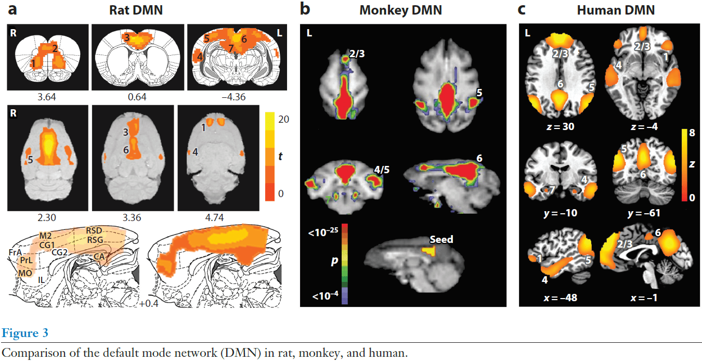
- Patterns of resting-state functional connectivity appear to transcend levels of consciousness as they’re present in humans under anesthesia, monkeys, rats, and during the early stages of sleep in humans.
- This makes it unlikely that the patterns and intrinsic activity they represent are primarily the result of unconstrained, conscious cognition (mind wandering or daydreaming).
- Two examples of functional balance between the DMN and other brain systems
    - The dorsal attention network (DAN) and the DMN appear to be anticorrelated as increases in DAN is accompanied by decreases in DMN. This may be the case of “losing one’s self in one’s work”. The DMN may play an enhancing role during increased attentional demands.
    - Results suggest that the balance between the DMN and the networks controlling spatial attention and executive control are critical in determining the output of cortical motor-planning areas and the subject’s level of impulsivity. This may be related to the book “Thinking, Fast and Slow”.
- The DMN is a relative newcomer to discussions about brain organization and function, but it sparks discussions that go back many years regarding the basic nature of brain function.

## [Network neuroscience](https://doi.org/10.1038/nn.4502)

- Network neuroscience pursues new ways to map, record, analyze, and model the elements and interactions of neurobiological systems.
- Network neuroscience: encompasses the study of very different networks encountered across many spatial and temporal scales.
- We now have powerful methodologies that can record the connections and interactions in neurobiological systems.
- These methodologies are all connected by the capturing and recording of interactions in parallel, resulting in data sets that take the mathematical form of graphs or networks.
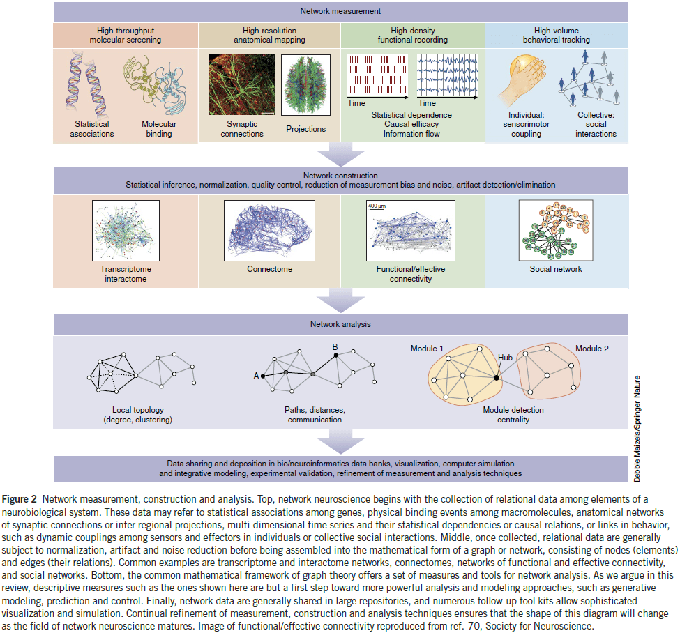
- Skimming over the examples of network neuroscience.
- E.g. Connectome of C. elegans and Drosophila, DSI tractography, optical cellular imaging of calcium ions, functional connectivity, and relating behavior to connectivity.
- Brain networks can be thought of as intermediate phenotypes since they lie between genetics and behavior.
- In other words, brain networks mediate the causal effect of genetics on behavior.
- One of the foundational tools in analyzing networks is graph theory.
- Graph theory: a branch of math that examines the properties of graphs, defined as sets of nodes and edges that represent system elements and their interactions.
- The brain is a spatially embedded network, and physical constraints resulting from that embedding underlie functionality.
- E.g. Efficient communication and information processing.
- Recently, network science is expanding beyond descriptive accounts of network topology and is moving towards addressing network dynamics, generative principles, and higher order dependencies among nodes.
- E.g. Assessing the multi-scale organization in networks.
- Two types of network dynamics
    - Dynamics on networks: how activity patterns can change on top of a fixed structural network.
    - Dynamics of networks: how network edges themselves can reconfigure.

- Current work tends to focus on one type, but future work should incorporate both.
- Dynamics on networks builds on the idea that the complex activity of neural systems is fundamentally constrained by the patterns of connections between their elements.
- In essence, how form constrains function.
- However, we also know that changes in function can cause changes in structure, leading to dynamics of networks.
- E.g. Experience-based neural plasticity.
- Although network models are traditionally viewed as tools to quantify structure, they also have a complementary role as tools to predict system function.
- Once a predictive model of a system is built, one has the potential to carefully perturb, manipulate, and control the system with an explicit knowledge of the outcome.
- Network control: combines estimates of network connectivity with models of system dynamics to predict where in the system one should intervene to push the system toward a target state.
- Networks can also bridge across data of very different types and from different domains of biology.
- Thus, network science tools can cross levels or scales of organization, integrating diverse data sets and bridging existing disparate analyses.
- Networks science also offers tools to capture higher-order structure in data.
- E.g. Multi-omics data, algebraic topology, and topological data analysis.
- Theory is fundamental because it allows us to transform big data into small data, and ultimately, knowledge.
- We believe that network neuroscience can make an important contribution toward unifying an otherwise fractured discipline by providing a common conceptual framework and a common toolset to meet the challenges of modern neuroscience.

## [The Neural Code of the Retina](https://doi.org/10.1016/S0896-6273(00)80700-X)

- How do APs/spikes represent sensory input, internal states, and motor commands?
- To fully understand communication between neurons, we need a dictionary for this language, where each spike or pattern of spikes is assigned meaning that’s linked to a stimulus.
- What are the rules that spike trains in the optic nerve use to encode a visual scene?
- Reasons to study the retina and visual system
    - We know exactly what’s being represented by these APs, namely the time-dependent visual image as projected by the optics of the eye.
    - We can easily stimulate the retina with natural sensory input.
    - We can easily record the output of the retina by monitoring ganglion cells, the optic nerve, or terminals in the LGN.
    - It compresses the visual signal from $$10^8$$ photoreceptors to $$10^6$$ optic nerve fibers.
- What’s a useful description of the retinal code?
- We can start by asking: how many levels of gray can the retina distinguish between?
- To experimentally test this, we can project a uniform gray field onto the retina, record the spike train, then vary the light intensity and see how small the steps can be that still cause a difference in neural firing.
- Results show that after an intensity step, ganglion cells fires a brief burst of spikes and then returns back to what it was doing before the step.
- Something similar happens for almost every other ganglion cell, so we conclude that steady gray levels are almost indistinguishable.
- If we flicker the gray levels, either at very slow or very fast frequencies, then there’s no response.
- So, the initial question can’t be answered without specifying the time course of the light intensity.
- We also find that even when presenting the same stimulus repeatedly, ganglion cells produce somewhat different spike trains, and this variability limits the ability to discriminate two different stimuli.
- What aspect of the spike train should we measure as the “response”?
- E.g. Number of spikes in some time window? Time of arrival of every spike? Population spiking?
- Final results show that the relationship between gray levels and firing isn’t permanent and static, but varies considerably depending on the recent history of the visual stimulus.
- Four specifications of a neural code
    1. The relevant measure of neural activity in the ganglion cell population.
    2. How this activity responds to any given visual stimulus.
    3. The precision of this response.
    4. The degree of plasticity in this relationship between stimulus and response.
- If we compare the eye across different species, we find similarities and differences.
- Differences because different animals use their visual system for different tasks, but the structure of the retina is remarkably conserved from fish to primates.
- E.g. Same three-layered arrangement, same five principle cell types, same neurotransmitters, same anatomical micro-circuitry.
- One explanation for all of these similarities is that the retina is adapted to deal with constraints that are shared among all species.
- Many principles of retinal signaling seem to be remarkably conserved.
- We can generalize findings from single-cell recordings to the population if
    - The population can be divided into groups/classes and each cell is representative of its group. In other words, we assume that the population is mostly homogeneous and that each cell isn’t unique.
    - The firing of each neuron in the population depends only on the stimulus, and not on the activity of other neurons in the population.
- The second condition isn’t always fulfilled but even still, single-cell recordings still provide valuable information.
- The important response feature in the spike train of a single ganglion cell is taken to be the neuron’s instantaneous firing probability at various times throughout the stimulus presentation.
- It’s often assumed that the brain, instead, estimates this response function by counting spikes from many identical ganglion cells.
- The central problem of the retinal code is how a ganglion cell’s firing rate depends on visual stimulation.
- Review of ON, OFF, and ON/OFF ganglion cells.
- Two aspects of retinal processing
    - Lateral inhibition in space
        - Because of the antagonistic action of the center and surround regions of the receptive field, ganglion cells respond strongly to stimuli whose intensity varies in space over the receptive field.
        - E.g. When the center and surround are illuminated differently.
    - Differentiation in time
        - Because the response to a light step lasts only a short period of time, many ganglion cells seem to emphasize stimuli that change in time over static ones.
- In general, we view a ganglion cell’s firing rate as a function of the stimulus.
- Spatiotemporal integration model
    - This model proposes that the function from stimulus to firing rate is a cascade of a few simple transformations of the stimulus.
    - First, the stimulus is summed over all space, with some weighting function. Then, the resulting signal is passed through a filter with some impulse response and the result is added to the baseline firing rate. Negative baseline rates of the resulting firing rate are truncated to zero.
    - E.g. A white bar moving across the retina can be decomposed into many small flashed spots. In the real world, however, there wouldn’t be flashes since the world is event-based, not cycle/clock-based.
    - There’s a remarkable correspondence between the observed time course of the firing rate and the predictions of this model.
- The spatiotemporal integration model is attractive because it’s simple.
- E.g. Regardless of where a flash is presented, the time course of the response will be identical.
- Space-time separability: when space and time are processed separately.
- Subsequent work showed that space-time separability isn’t quite satisfied in ganglion cells.
- E.g. The response of light falling in the surround is delayed relative to the response in the center because it takes time for lateral signal flow through horizontal or amacrine cells, and transmission across synapses.
- This led to a new model called the “modified difference-of-Gaussians model”.
- Modified Difference-of-Gaussians
    - When light is pooled separately within the center and the surround; the two resulting signals are passed through two different filters, and then summed to generate the firing rate.
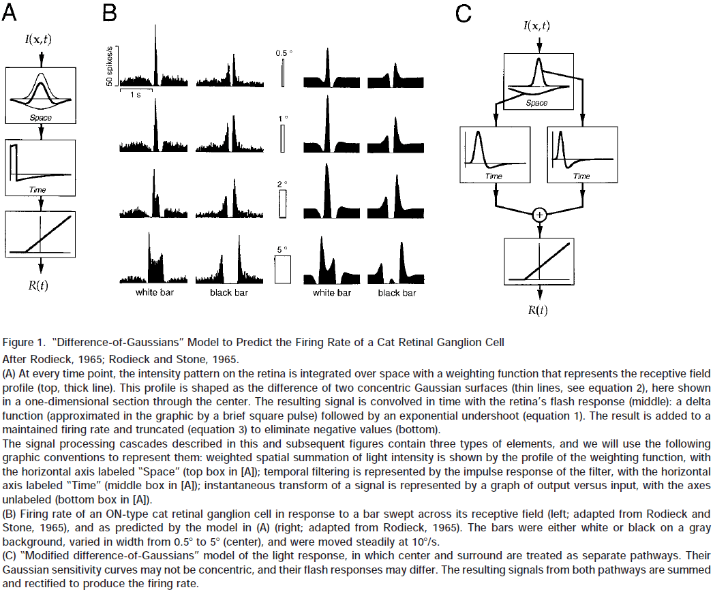
- By adding a contrast gain control mechanism, we can account for some of the nonlinear behavior of cat ganglion cells.
- However, the present models can’t yet capture complex stimuli such as those encountered in natural vision.
- A quantitative model that predicts the response to a general ensemble of stimuli still remains to be found.
- Many ganglion cells fire spontaneously even in the dark and we take this as pure noise in the absence of any stimulus-driven signal.
- This also matches our perception as it just looks like noise in the dark.
- This inherent variability in the dark activity of retinal ganglion cells must pose a limit to the processing of weak stimuli; there’s some threshold where noise overtakes signal.
- How are weak stimuli represented in the firing of retinal ganglion cells?
- One experiment showed that weak, small flashes of light caused the firing rate to briefly increase and then decrease again to the spontaneous rate.
- The total number of extra spikes fired in response to the flash was proportional to the flash’s intensity, with about 1-3 spikes generated for every photon absorbed.
- To discriminate whether a flash occurred or not, we can simply count the number of APs in a 200 ms window and see whether it exceeds a given threshold.
- E.g. We can set a threshold spike count such that flashes are perfectly detected.
- In terms of temporal resolution, retinal ganglion cell spike trains are remarkably precise when analyzed on a finer time scale.
- The neural code of retinal ganglion cells isn’t a static set of rules, but instead, depends significantly on the overall properties of the visual scene.
- E.g. Average/mean light level for light adaptation.
- The most significant effect of decreasing the mean light level is an increase in the sensitivity of retinal ganglion cells.
- E.g. If the background is dim, the flash intensity required to elicit a response is lower than for a bright background.
- This threshold flash intensity is proportional to the mean light level.
- This is an application of the Weber-Fechner law of adaption where the retina produces approximately the same response for two visual displays that are related by a simple proportional scaling of all intensity values.
- This has uses in signaling information that’s illumination invariant as the relative ratios of intensities receives from different parts of the scene are approximately independent of the illuminant.
- Through the process of light adaptation, the retina encodes the invariant features of objects and mostly discards information about absolute light level, except for the receptors that drive the pupillary reflex.
- In dim light, not only are ganglion cells more sensitive, they’re also slower as brief flashes produce a burst of spikes with longer latency and longer duration than normal.
- This means that ganglion cells integrate the visual input over a longer time interval before reporting it to the brain and this may be done to reduce noise under conditions where the signal is small.
- However, this comes at the cost of impaired time resolution.
- Also in dim light, ganglion cells alter their spatial integration by losing their antagonistic surround region and as a result, their receptive field expands at the cost of spatial resolution.
- Together, it appears that retinal processing largely accounts for the perceptual effects of light adaptation.
- This adjustment is remarkably fast, happening within a few tenths of a second after a change in background intensity.
- Three mechanisms of light adaptation
    - Individual photoreceptors adapt and become more sensitive and slower in dim light.
    - In dim light, the retinal circuitry switches from cones to rods as the primary input receptors.
    - Circuits postsynaptic to the receptor cells also change their sensitivity during light adaptation.
- All of these effects of light adaptation can be viewed as a modulation of the stimulus-response relationship controlled by the mean light level.
- New aspects of retinal signaling
    - Ganglion cells aren’t independent channels of information.
    - Spike trains from retinal ganglion cells can be very precise and reliable.
        - Rapid intensity transients appear to be a key stimulus feature for triggering precisely timed spikes.
        - Instead of firing rate conveying stimulus information, it appears that the time of its first spike and the total number of spikes in the event conveys it.
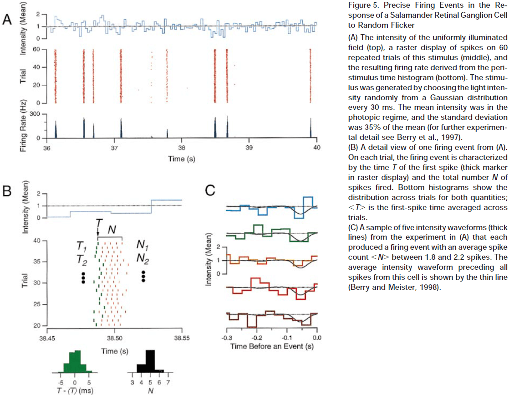
    - Retinal processing adapts to higher stimulus statistics.
        - To encode the visual scene under many conditions, the retina must efficiently match the dynamic range of its output neurons to the range of sensory inputs.
        - Mean light intensity is one statistic, other statistics include whether the illumination is by direct light or indirect light.
        - With high contrast stimuli, the retina reduces it sensitivity.
        - Contrast adaptation isn’t implemented by individual photoreceptors but somewhere in the inner retina. The cellular mechanism remains unknown.
        - Contrast adaptation plays a computational role in that it generates a neural representation of the visual scene that’s been normalized to the average size of intensity fluctuations in the scene.
        - In the process, information about the absolute contrast in the image is discarded.
        - We can think of each successive stage of the early visual system as adapting to and discarding what appears to be constants in the neural representation from the previous stage.
- We don’t yet have a satisfying understanding of how the retina functions during vision.
- To date, we can’t predict the firing of ganglion cells while an animal is viewing a natural scene.
- Nor can we do the inverse, predict the natural scene from the firing of ganglion cells.
- This is, in part, due to few studies on natural vision.
- Properties of natural vision
    - Almost exclusively happens far above the response threshold; we’re rarely in a situation where something important is barely detectable.
    - Contains intensities spanning several orders of magnitude.
    - Is more complex but better matches what the retina was evolved for.
- It’s long been recognized that the essential substance transmitted by neurons isn’t electric charge or chemicals, but information.
- In analyzing a neural system, it’s essential to measure and track the flow of this substance, just like blood in the circulatory system.
- This is where information theory can help us better understand what the neural code is.

## [Numbers of neurons as biological correlates of cognitive capability](https://doi.org/10.1016/j.cobeha.2017.02.004)

- Studies suggest that the absolute number of neurons in the mammalian cerebral cortex is a good correlate of cognitive diversity.
- The more neurons, regardless of brain or body size, the better a species performs at the same task.
- What feature of brains is the most important for flexible behavior?
- E.g. Surface area, volume, mass, density, number of neurons, number of synapses, number of glial cells?
- We expect that the number of neurons in well-defined circuits in the brain defines its capacity for flexible behavior.
- E.g. The more neurons in a circuit, the more possibilities that circuit can generate.
- One problem with using brain mass as a proxy for whatever underlying brain features do correlate with behavior is that brain mass is very correlated with body mass.
- Since a larger body requires a larger brain to operate it, then increases in brain mass don’t necessarily reflect behavioral complexity beyond simple body control.
- Review of encephalization quotient (EQ).
- Data indicates that not only is brain mass a misleading proxy for the number of neurons, but there’s no universal relationship across mammalian or bird species between body mass and number of neurons involved with operating the body.
- This is due to neuronal density differing across different brains.
- Body mass is highly variable and isn’t tightly correlated with the make up of the brain that accompanies it.
- If we compare the absolute number of neurons in the cerebral cortex/pallium across species, we find that humans have the largest number (16 billion), followed by the gorilla and orangutan (9 billion), chimpanzee (6-7 billion), African elephant (5.6 billion), parrots, corvids, macaques and the giraffe (1-2 billion).
- Does this ranking of absolute number of cortical/pallial neurons match a ranking of cognitive capabilities across these species?
- It’s difficult to compare cognition across species, but preliminary analysis suggests yes.
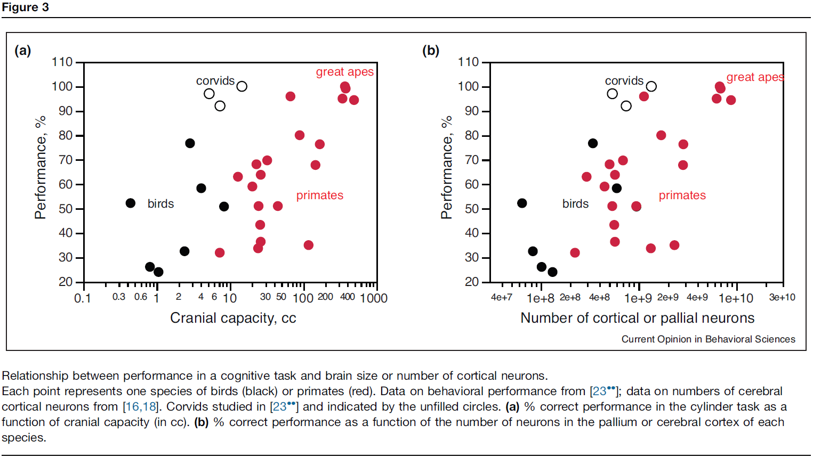

## [The Will to Persevere Induced by Electrical Stimulation of the Human Cingulate Gyrus](https://doi.org/10.1016/j.neuron.2013.10.057)

- The anterior cingulate cortex (ACC) is associated with functions such as emotion, pain, and cognitive control.
- Paper shows that electrical stimulation of the anterior midcingulate cortex (aMCC) elicits autonomic changes and the expectation of an imminent challenge coupled with a determined attitude to overcome it.
- Some people marshal the necessary physical and psychological resources in the face of challenges, while others have lowered motivation and mental strength for enduring physical or psychological pain.
- Two lines of evidence suggest that the ACC and a set of connected regions might be the key network for motivation, endurance, and perseverance.
    - First is that studies in human and nonhuman mammals suggest that the ACC is essential for initiating changes in behavior, associating reward and action, determining the action necessary to reach a goal, and synthesizing information about reinforcers.
    - Second is that the anatomy of the ACC is well situated for such functions. The ACC is suggested to have strong anatomical and functional connections between it and brain structures for pain, pleasure, emotion, and decision making.
- Previous lesion studies of the ACC show that it’s important for decision making and emotional processing, but it’s often unclear whether the lesion also compromises surrounding tissues.
- Paper uses electrical brain stimulation (EBS) and resting-state functional magnetic resonance imaging (fMRI) on two epilepsy patients in the aMCC.
- In both patients, EBS of the aMCC caused a strikingly similar and consistent set of perceptual and behavioral changes of a physical and psychological nature.
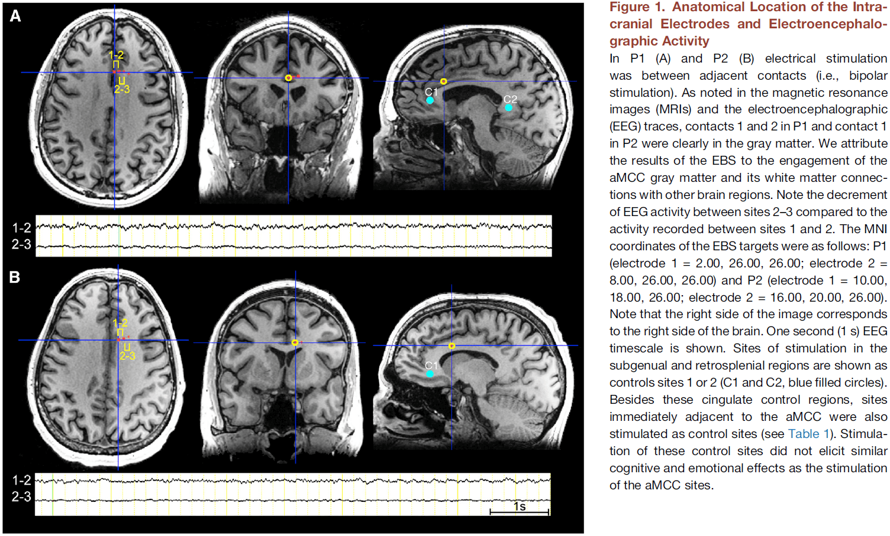
- These changes were absent during sham trials and when electrical current was delivered below a certain threshold (6 mA in P1 and 4 mA in P2).
- Changes include
    - Shakiness or hot flashes in the upper chest and neck
    - Increased heart rate
    - A sense of challenge or worry but remaining motivated and aware that they would overcome the challenge
- Stimulation of subgenual or retrosplenial cingulate regions or the adjacent electrodes in the white matter didn’t elicit any perceptual or behavioral responses.
- For simplicity, we refer to this stereotyped set of complex autonomic, emotional, and cognitive experience as the “will to persevere”.
- It’s reasonable to assume that the perceptual and autonomic changes caused by EBS are due to changes of activity not only in the aMCC, but also in the network of brain regions connected with it.

## [Single neuron dynamics and computation](https://doi.org/10.1016/j.conb.2014.01.005)

- At the neuron level, information processing is the transformation of input spike trains into output spike trains.
- The classic view of neurons is as a threshold device.
- E.g. Neurons don’t fire unless some threshold is passed.
- Electrophysiological data in various sensory systems have been successfully fitted by linear-non-linear-Poisson (LNP) or generalized linear models (GLM).
- LNP model
    - First, inputs are linearly convolved with a temporal filter.
    - Then it’s passed through a static non-linearity, resulting in an instantaneous firing rate.
    - Finally, an inhomogeneous Poisson process is generated from the instantaneous firing rate.
- Dendritic trees are highly complex structures that allow for richer computations than only linear summation.
- Four types of dendritic branch behavior
    - Sublinear summation due to passive cable properties of thin dendrites.
    - Linear summation in hippocampal pyramidal neurons.
    - Supralinear, monostable behavior.
    - Bistable behavior of dendritic compartments.
- Dendrites can greatly enhance the computational power of neurons by computing linearly non-separable functions, unlike simple perceptrons.
- The analysis of neuron dynamics in a single compartment description has reached a mature stage and provides a satisfactory account of different electrophysiological properties.
- Skimmed most of the paper due to disinterest.

## [Conceptual and technical advances define a key moment for theoretical neuroscience](https://doi.org/10.1038/nn.4255)

- There’s a great need for theoretical approaches to neuroscience.
- The explosion in technologies available for measuring and manipulating neurons has created extremely large data sets that need to be analyzed and interpreted.
- Three stages from data to understanding
    1. Extracting relevant signals from raw data.
    2. Reducing large and complex data into forms that summarize the results.
    3. Modeling to link the results to underlying mechanisms and overlying principles.
- Two challenges of data analysis
    - Too much data from our ability to simultaneously measure responses from many neurons.
        - It isn’t clear how to reduce large and complex data sets into understandable forms.
    - Advances in experimentalists’ ability to manipulate neural activity with temporal, pathway, and cell-type precision.
        - The results of such manipulations can be difficult to interpret.
- What form might future models take?
- Work on C. elegans provides insights into what we should expect.
    - A principal component-based description of neural activity was extracted, and patterns of activity across the entire neuronal population were correlated with behavioral states of the worm.
    - This analysis may lead to a model that provides an accurate, high-level description of neural activity and accounts for important aspects of worm behavior.
- The best approach may be to combine high-level and fine-grained components into a hybrid model that provides a more complete account of nervous system function than either component.
- Global understanding of the brain will likely take the form of highly diverse panels loosely stitched together into a patchwork quilt.

## [Competitive trace theory: a role for the hippocampus in contextual interference during retrieval](https://doi.org/10.3389/fnbeh.2013.00107)

- The hippocampus plays a significant role in the encoding of new declarative memories.
- However, it’s role in retrieval (especially episodic retrieval) is debatable and unclear.
- Systems consolidation vs Multiple trace theory
    - Standard Model of Systems Consolidation (SMSC): proposes that the initial memory trace is encoded both in the hippocampus and in the cortex, but that the cortex is unable to initially support the memory.
        - Believes that the hippocampus is critical in the early encoding stages and “teaches” the cortex the memory trace.
        - After the memory has been consolidated, the hippocampus is no longer required for retrieval.
        - Predicts that the hippocampus isn’t required for the retrieval of remote memories, only recent ones that haven’t been fully consolidated.
    - Multiple Trace Theory (MTT): proposes that the hippocampus has an important role in the retrieval of all episodic memories.
        - Similar to SMSC, MTT also proposes that memories are encoded in hippocampal-neocortical networks, but that each reactivation results in a different trace in the hippocampus.
        - Hippocampal-traces are assumed to be contextual, while cortical-traces are assumed to be semantic and context-free.
        - So, retrieval of remote semantic memories doesn’t require the hippocampus, but retrieval of remote episodic memories always does.
- At the heart of this debate is the role of the hippocampus in the retrieval of remote episodic memories.
- Retrograde amnesia (RA): loss of memories.
- Multiple studies have seen that the RA gradient was temporally graded (meaning older memories weren’t forgotten), flat, or dependent on the size of the lesion.
- A recent survey on rodents with amnesia provides overwhelming support for flat RA gradients, which argues against SMSC.
- However, the survey also argues against MTT since partial hippocampal damage doesn’t lead to a temporal RA gradient.
- The debate is complicated by the inconsistency of results across studies of different amnesic patients.
- Evidence from amnesia on the RA gradient is not entirely conclusive, and provides only partial and sometimes conflicting support for the two major memory theories.
- Another theory is the hippocampal memory indexing theory.
- Hippocampal Memory Indexing Theory
    - Goal is to explain the nature of the hippocampus and it’s involvement in encoding and retrieving memory traces.
    - Two important realizations
        - There appears to be multiple neural networks capable of supporting memory.
        - The neocortex itself was found to be sufficient to support some aspects of memory.
    - This theory proposes that when a memory trace is encoded, inputs from cortical sensory regions activate a small population of hippocampal synapses, which in turn, activate a network of neocortical regions.
    - And as the memory is consolidated, the connections between the hippocampus and neocortex are strengthened.
    - Thus, a memory trace is hippocampal-neocortical connections.
    - The hippocampus plays a critical role in memory retrieval as the activation of a small subset of neocortical regions, part of a larger pattern comprising a consolidated memory trace, can signal to the hippocampus to re-instantiate the full pattern despite partial or degraded input.
    - This explains how certain aspects or contextual details of an event can lead to recall of other related details such as the entire event.
    - It’s important to note that the hippocampus doesn’t store details about an event per se, but rather acts as an index.
    - An analogy is that of a library. If memories are like books, then retrieving an experience means to access different books in such library. The librarian, or hippocampus, hasn’t stored the knowledge contained in the library, but it can point to the correct locations where this knowledge can be retrieved.
- Competitive trace theory (CTT): an alternative theory to SMSC and MTT within the framework of indexing theory.
    - The main difference between episodic and semantic memories is that the former refers to memories with rich contextual details that the latter lacks.
    - Another important note is that the accuracy of a memory isn’t related to successfully retrieving it.
    - Episodic in this theory refers to the phenomenological experience of contextual recollection and not in reference to the accuracy of the memory.
    - Semantic in this theory refers to the accurate knowledge that builds up over time through repetition.
    - Three critical assumptions
        - Memories are most episodic and veridical at the moment they’re first encoded.
        - With every subsequent reactivation, a memory can become less episodic and accurate details can be replaced with illusory details.
        - Central features of experiences become simultaneously consolidated and decontextualized (lost) over time.
    - How does this occur?
    - We suggest that when a memory is reactivated/retrieved by an internal or external cue, the hippocampus acts to re-instantiate the neural signature of the original memory trace.
    - To do so, the hippocampus recombines the central elements of the original memory trace and reactivates them.
    - Unlike previous theories, we propose that this process potentially adds or subtracts individual contextual features, resulting in a slightly altered version of the memory.
    - This altered memory is now capable of being stored as a new memory trace and undergoes the same storage process as the original memory.
    - This differs from MTT because memories aren’t stored in parallel, but rather compete for representation in the neocortex, and that the hippocampus isn’t the site of trace storage, but rather links the individual components of a neocortical memory.
    - Furthermore, neocortical traces themselves become devoid of context with increasing reactivations.
    - Two distinct phenomena
        - Consolidation: overlapping features in memories shouldn’t compete for representation and are strengthened in a Hebbian fashion. A result of repeated activations is that overlapping features have a higher chance of being retrieved with high fidelity.
        - Decontextualization: nonoverlapping features in memories compete with each other and are mutually inhibited in an anti-Hebbian fashion.
    - It follows that the retrieval of remote memories appears episodic and contextual because the hippocampus reconstructs and re-encodes, rather than reactivates.
    - Without the hippocampus (as in amnesia), the only retrievable memories are the high fidelity semantic representations in the neocortex.
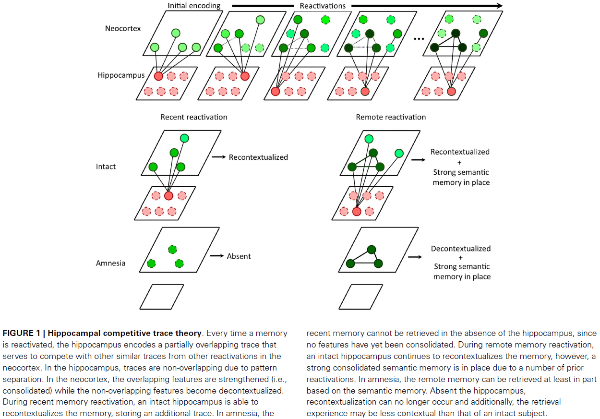
- CTT can be viewed as a harmonization of SMSC and MTT in which consolidation and hippocampal independence occurs for semantic components of experiences via a multiple traces mechanism, assuming that the nonoverlapping features of these traces compete for representation.
- CTT predicts that recent and remote episodic memories, although they share phenomenological features, have different underlying representations.
    - A recent memory has no semantic component (which takes time to build through repetition) but is rich in accurate contextual detail.
    - A remote memory has a strong semantic component (due to repeated retrieval) but also contains degraded or reconstructed contextual information that’s often inaccurate.
- In the CTT model, we can redefine systems consolidation not as the moving of memories from short to long term, but as the selective strengthening of the core contexts of memory in neocortical circuits via hippocampal-neocortical interactions, coupled with a selective weakening of irrelevant and highly variable contextual details.
- The presence of the hippocampus in the intact brain gives the illusion of intact contextual detail, while in fact, this experience is the direct result of mnemonic reconstruction and retrieval of illusory contextual details.
- Why does the hippocampus continue to manufacture these illusory recollections?
- We don’t know, but maybe the recollective experience is nothing more than an epiphenomenon of an otherwise adaptive system.
- Episodic-semantic memory (recontextualization) continuum
    - The hippocampus encodes context and associations, distorting some components and strengthening others.
    - The neocortex is the final storage site of semantic memories that have been consolidated using slow cortical dynamics and trace interference over time.
    - Importantly, any deviation from the original representation is likely to match a deviation from the initial neural representation of that memory trace.
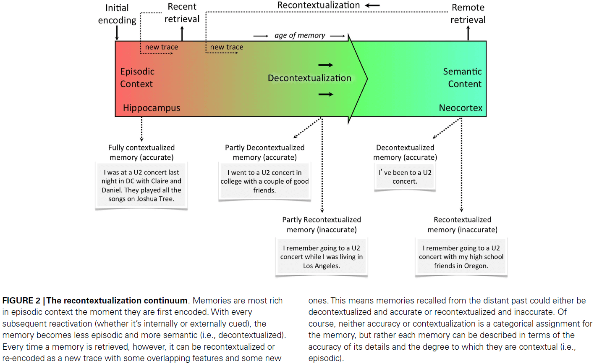
- Change in contextual details over time as predicted by CTT
    - Recent memories are high in accurate details, low in semantic content, and low in inaccurate details.
    - Remote memories are low in accurate details, high in semantic content, and high in inaccurate details.
    - Remote memories are more inaccurate because the hippocampus has had ample time to distort the memory across numerous replay/reactivation events.
    - The decline in accuracy of the memory follows the typical forgetting curve.
- Summary of CTT main ideas
    - Every time a memory is reactivated, the hippocampus recontextualizes the memory by re-encoding a similar, but not identical, memory trace that’s stored using associated connectivity between the hippocampus and neocortex.
    - Memories are decontextualized over time by competitive interference among these similar, but not identical, multiple memory traces. This simultaneously leads to consolidation of semantic memory in the neocortex and loss of episodic details.
    - Accurate episodic details are only available in very recent memories. As memories get older, these details are replaced by recontextualized details stored by the hippocampus that give rise to illusory memories that become more prevalent as the age of the memory increases.
- CTT is also consistent with the Distributed Reinstatement Theory which argues that the frequency of replay/re-encoding, rather than the passage of time, leads to memories becoming independent of the hippocampus.
- The notion of competition for representation isn’t unique to just memory, but also seems to be a general principle of cortical operation.
- E.g. How visual stimuli compete for attention and processing, and how cortical areas compete for space.
- In the CTT model, however, how does the hippocampus actually perform it’s indexing and encoding job?
- The hippocampus is capable of supporting rapid encoding of unique experiences by orthogonalizing incoming inputs such that interference is minimized.
- This is called pattern separation and is localized to the hippocampal dentate gyrus (DG).
- The hippocampus is also capable of forming arbitrary associations.
- This is called pattern completion and is localized to the hippocampal CA3 subregion.
- The ability to orthogonalize overlapping inputs to create distinct memory traces is critical for encoding and remembering details.
- Paper argues that pattern separation and pattern completion, together, are sufficient and necessary to give rise to the proposed episodic memory system.
- Pattern completion is used by the hippocampus to reactivate a neocortical trace and strengthen it given a partial or degraded cue.
- Pattern separation is used by the hippocampus to re-encode slightly different versions of an experience (recontextualization), which causes competition among overlapping traces in the neocortex.
- CTT and evidence
    - Memories can be altered every time they’re retrieved, which is consistent with the recontextualization in CTT, which states that reactivations lead to reconstructions of and updates to the initial memory.
    - CTT also explains why flashbulb memories become more confident over time but also less accurate. It also explains why fictitious details are included over time instead of a smooth degradation in accuracy.
    - The data from human amnesiacs can’t be used as strong support for CTT or any other model given the disagreements about it’s quality, quantity, accuracy, and neuroanatomical damage.
- MTT proposes that retrieval is dependent on the hippocampus because it’s required to reconstruct the memory of the episode within a spatial scaffold.
- CTT proposes that any context can be consolidated and strengthened to become independent of the hippocampus, as long as it’s overlapping and not interfering with prior exposure.
- New predictions from CTT
    - Remote episodic memories should be less accurate than recent episodic memories.
    - Amnesia patient should have more accurate remote semantic memories compared to healthy controls, as CTT argues that the hippocampus distorts a memory every time it’s recalled.
    - A flat or graded RA curve will depend on whether contextual information was repeatedly presented. Repeated presentations semanticize information.
    - The fidelity of mnemonic representations should change with repeated reactivations in the hippocampus and neocortex.
    - That there will be interference in the neocortex and not just the hippocampus.
- CTT is different from the two old models of memory in that it proposes what we do with a memory, rather than its age or type, determines where it’s stored in the brain.
- What really matter is how often you revisit the memory.
- E.g. When a memory is recalled often, it’ll more rapidly become stored in the cortex, becoming less episodic but more independent of the hippocampus.
- Older memories might be recalled more often, but the relationship isn’t perfect, which would explain why one amnesiac’s memory impairment extends back forty years, while another’s extend back only ten years.
- With each memory recall, some features are reinforced while others disappear, explaining why memories get fuzzy over time. As details are lost, they become less episodic and more semantic.

## [Consciousness and the brainstem](https://doi.org/10.1016/S0010-0277(00)00127-X)

- Two lines of evidence linking consciousness and the brainstem
    1. Damage to the upper brainstem causes coma and persistent vegetative state.
    2. Lesions or electrical stimulation of a part of the brainstem, the reticular formation, is associated with the electrophysiological pattern commonly found in wakeful and attentive states.
- Link between consciousness and the brainstem
    - Brainstem has the reticular formation → Engagement of the ascending reticular activating system activates the cerebral cortex → Activating the cortex underlies wakefulness and attention → Wakefulness and attention constitute consciousness.
- We know the brainstem regulates life by controlling our bodily functions, but the link between it and consciousness hasn’t been proposed before.
- Object: entities as diverse as a person, place, melody, emotional state.
- Image: a mental pattern of any of the sensory modalities.
- Two problems with consciousness
    - How does the brain create the experience of an object?
        - How’s the movie in the brain generated?
    - How does the brain create a sense of self in the act of knowing?
        - How the brain generates the sense that there’s an owner and observer for that movie?
- The second problem is nested within the former; how the appearance of an owner and observer materialize within the movie.
- Paper’s proposed answer
    - Core consciousness: when the brain’s representation devices generate an imaged, nonverbal account of how the organism’s own state is affected by the organism’s interaction with an object, and when this process leads to the enhancement of the image.
    - Assumptions
        - That the organism is mapped in the organism’s brain in first-order maps.
        - That changes to such first-order maps, due to objects/stimuli, cause changes to the maps pertaining to the organism.
        - That such changes can be mapped to second-order maps, which represent the overall relationships between object and organism.
        - That neural patterns formed in second-order maps become mental images, the same goes for first-order maps, thus producing an image of the relationships between organism and object.
- Proto-self: the first-order collection of neural patterns which map, moment by moment, the state of the organism in its many dimensions.
- The proto-self isn’t the sense of self in the traditional sense because it doesn’t know that it knows; it just knows.
- Instead, the proto-self is used as a foundation for which both the core and autobiographical self are built on.
- Structures of the proto-self
    - Several brainstem nuclei that regulate body states and map body signals.
    - Hypothalamus and basal forebrain.
    - Insular cortex, medial parietal cortices, and somatosensory cortices.
- The mapping of organism and object occurs in first-order neural maps representing the proto-self and object.
- However, accounting for the causal relationships between object and organism occurs in second-order neural maps.
- Structures of second-order maps
    - Cingulate cortices
    - Thalamus
    - Superior colliculi
- The hypothesis pivots on the relationships between the changing organism’s state and the sensorimotor maps of a given object that cause those changes.
- As the images of the object affect the state of the organism, another level of brain structures creates a nonverbal account of the events that are taking place as a consequence of the object-organism interaction.
- We propose that the essence of consciousness is a continuously generated image of the act of knowing relative to the mental images of the object to be known. The image of knowing is followed by an enhancement of the images of the object.
- Since the image of knowing comes from neural structures associated with the representation of body states, the image of knowing is a feeling.
- Core consciousness brings together the pattern for
    - The object
    - The organism
    - The relationship between object and organism
- Building upon core consciousness is extended consciousness, which requires memory and is enhanced by language.
- Brainstem and reticular formation
    - Brainstem gray matter is organized into nuclei.
    - Nuclei: a 3D collection of neurons that’s usually aligned in parallel along an axis.
    - Each nucleus has a unique cytoarchitecture and neurochemical identity that helps distinguish it from other nuclei.
    - Each nucleus also has a unique location, set of connections, and function.
    - The core region of the brainstem was labeled as the reticular formation (RF) because neurons in that region were surrounded by interlacing fibers, which gave the region the appearance of a “reticulum” or web.
    - The RF projects to the intralaminar nuclei of the thalamus.
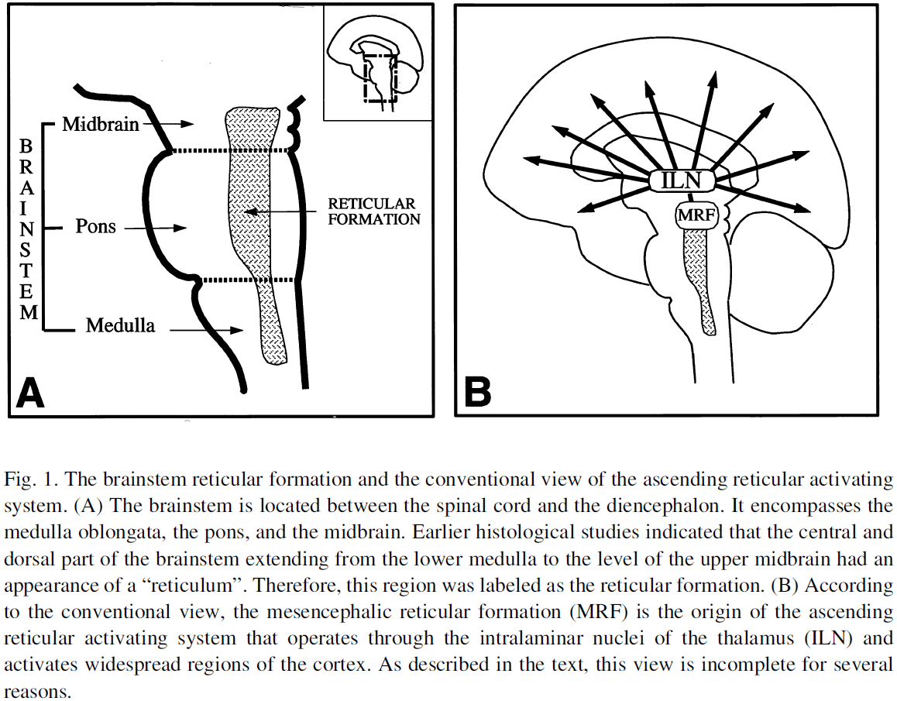
    - Lesions that cause coma or persistent vegetative state in humans lie in the central and dorsal regions of the brainstem, extending from the middle pons to the upper midbrain, a sizeable part of the general region in which the RF is located.
    - The RF isn’t a homogeneous mesh of neurons but a collection of anatomically and functionally different nuclei. So each component of the RF may have a distinct role in modulating the electrophysiological activity of the cerebral cortex.
    - Different ascending channels from the RF use different neurotransmitters, thus modulating the electrophysiological activity of the cerebral cortex through different mechanisms.
    - To summarize, although the precise contribution of each reticular nucleus and ascending pathway remains unclear, it’s become apparent that several nuclei and several pathways may be involved in modulating the electrophysiological activity of the cerebral cortex.
- Four types of brainstem nuclei
    1. Classical reticular nuclei
        - Located in the core of the brainstem.
        - Presumed to project glutamatergic connections to the basal ganglia and intralaminar thalamic nuclei.
    2. Monoaminergic nuclei
        - Encompasses noradrenergic, serotonergic, and dopaminergic nuclei.
    3. Cholinergic nuclei
        - The activity of the brainstem cholinergic system blocks the generation of thalamic spindles and thereby initiates the wakeful state.
    4. Autonomic nuclei
        - Involved in the control of visceral functions and may modulate the global activity of the cerebral cortex.
- The principal nuclei involved in modulating the electrophysiological activity of the cerebral cortex lie in the upper pons and in the midbrain, but this doesn’t exclude the possible involvement of some lower brainstem structures.
- Cortical activation likely doesn’t depend on a single brainstem nucleus, but rather on a network formed by several families of nuclei.
- Skimming over the afferents to the ascending reticular activation systems due to too much detail.
- The state of the organism is continuously portrayed in its multiple dimensions by incoming afferents to several brainstem nuclei.
- E.g. Internal milieu, viscera, vestibular system, and the musculoskeletal frame.
- The fundamental function of these brainstem nuclei is the regulation of the state of the organism based on the representation of its current state along several dimensions.
- Another function is the modulation of electrophysiological activity of the cerebral cortex.
- The multiple dimensions that describe the overall current state of the organism are mapped to several groups of brainstem nuclei.
- We believe that this map enables the brainstem to modulate the operation of the cerebral cortex.
- The remapping of the changing organism state in relation to a causative object is seen as the basis for the experience of knowing, the core of consciousness and self.
- Consciousness is grounded in two brainstem roles
    - Providing an organism-based context for the modulation of rostral brain structures.
    - Conveying signals necessary to represent the caused changed state in the cerebral cortex.
