## [Navigation-related structural change in the hippocampi of taxi drivers](https://doi.org/10.1073/pnas.070039597)

- The hippocampus is known to facilitate spatial memory in the form of navigation.
- This paper addresses whether morphological changes could be detected in the healthy human brain associated with extensive spatial navigation experience.
- We predict that the hippocampus would change the most in the brain’s of taxi drivers.
- London taxi drivers are ideally suited for the study of spatial navigation.
- We found significant increases in gray matter in the brain’s of taxi drivers compared to controls in only two regions: right and left hippocampus.
- The increases were limited to the posterior bilateral hippocampi.
- Analysis revealed no differences in the overall hippocampi volume between taxi drivers and controls, but it did reveal regionally specific differences in volume.
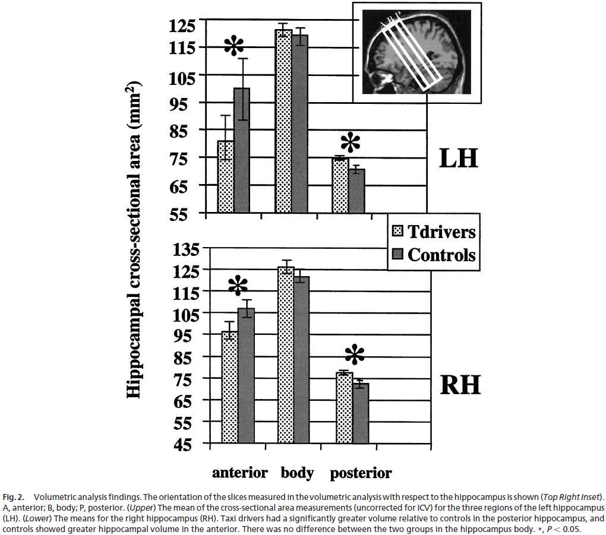
- We also analyzed the correlation between volume and amount of time spent as a taxi driver (as a proxy for experience).
- We found that more experience as a taxi driver correlated positively with volume increase in only one brain region, the right posterior hippocampus.
- This paper provides evidence of regionally specific structural difference between the hippocampi of London taxi drivers compared to control subjects.
- Specifically, taxi drivers have significantly greater volume in the posterior hippocampus while control subjects showed greater volume in the anterior hippocampus.
- However, does this arrangement of hippocampal gray matter predispose individuals to professions dependent on navigational skills? Or is it the other way around where the training of navigation skills increases posterior hippocampal gray matter.
- We can answer this question by examining the correlation between experience as a taxi driver and hippocampal volume, and we found that yes, experience does correlate with volume.
- These data suggest that the changes in hippocampal gray matter are acquired due to learning.
- This indicates that local plasticity is possible in the healthy adult human brain as a function of increasing exposure to an environmental stimulus.
- In humans and other animals, the posterior hippocampus seems to be involved in using previously learned spatial information, while the anterior hippocampus seems to be involved in the encoding of new environmental layouts.
- Our results suggest that the mental map of the city is stored in the posterior hippocampus and is accommodated by an increase in tissue volume.
- The hippocampus has an ability to store large-scale spatial information.
- This is specific to the right hippocampus as the left hippocampal volume didn’t correlate with years of taxi-driving experience, suggesting that the left hippocampus participates in spatial navigation and memory in a different way from the right hippocampus.

## [Time consciousness: the missing link in theories of consciousness](https://doi.org/10.1093/nc/niab011)

- Paper argues that current theories of consciousness don’t adequately address time as a fundamental aspect of conscious experience.
- Time consciousness: the relationship between time and consciousness.
- E.g. The time range that consciousness happens (hundreds of milliseconds to seconds) and whether our sense of time is discrete and static, or continuous and dynamic.
- We shouldn’t confuse the timing of behavior, perception, and responses with time consciousness itself.
- E.g. The time of events versus the experience of time.
- The former is concerned with the phenomenal impression of the subjective passage of time, while the later is concerned with comparing between subjective duration and objective clock time.
- There’s also a third “time” within the brain, the timing of neural temporal dynamics.
- The goal of any theory of consciousness must explain how the underlying neural dynamics in time generate a conscious experience of time, and how the experience of time affects how people perceive, think, or act at specific times.
- Three temporal aspects of conscious experience
    - Extended present
    - Time passage or flow
    - Tripartite structure of the past, present, and future
- Time consciousness is extended
    - The standard view is that time consciousness extends over a duration between a few hundred milliseconds and a few seconds in what’s called the “experienced moment” or “subjective present”.
    - Findings indicate that the perception of external events is automatically segmented into units with a duration of a few seconds when listening to sequences of beats, viewing ambiguous figures, or when viewing distorted natural sequences.
    - So, consciousness is “thick” in that it has an extended perception over time.
    - The current research goal is to identify the exact neural correlates of present moment experience.
- Time consciousness is continuous
    - Regardless of what the experienced moment is, time consciousness integrates the point-like present moments into an extended, field-like present moment.
    - Continuity entails temporal flow between discrete temporal units.
    - Any theory of consciousness that aims to include time consciousness must explain how the brain achieves this feat at a neural level.
    - With only one or two exceptions, many of the leading candidate theories of consciousness can’t explain continuity or flow because they’re constrained to short, discrete, and nonconscious functional moments.
- It’s possible to close the gap between theories of consciousness and time consciousness by using “no-stimulus” paradigms.
- No-stimulus paradigm: when a participant has to wait through a period of time for something to happen or to end.
- Research has found that an increased awareness of self corresponds to an increased awareness of time, and vice versa.
- Summary of time consciousness
    - Time consciousness shouldn’t be confused with the timing of cognitive functions or be identified with all timescales of temporal integration.
    - Time consciousness extends over multiple seconds, and not just a few hundred milliseconds.
    - Time consciousness isn’t discrete or point-like, but rather field-like.
    - Short and discrete functional moments that are nonconscious are integrated into longer and continuous experienced moments that are conscious.
    - This continuous integration results in the phenomenal sense of temporal flow in conscious experience.
- Several of the most prominent theories of consciousness don’t allow enough time for extended and continuous time consciousness to occur.
- Skimming over the sections of time consciousness in IIT and GWT.
- Both ITT and GWT don’t capture the notion of an extended or continuous time consciousness and the functional moment they capture is too instantaneous, short, and discrete to capture the phenomenology of time.
- Research in time consciousness holds that discrete conscious perception at shorter millisecond timescales is complemented by continuous conscious experience at supra-second timescales.
- The latter, however, isn’t properly addressed in current theories of consciousness.
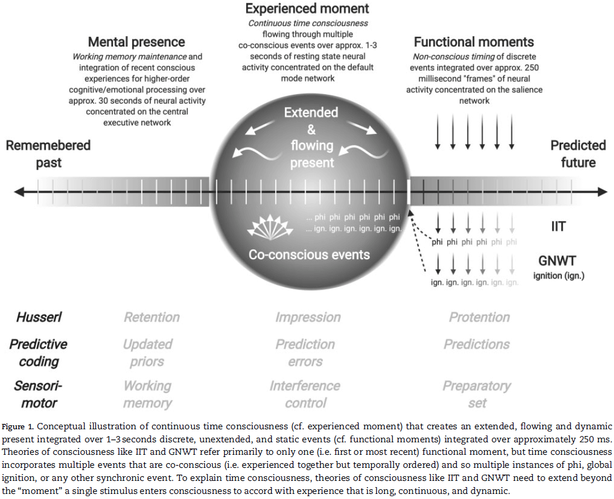
- The experience of time isn’t like qualia as it’s more abstract like space, number, size, and magnitudes.
- So time forms part of the perceptual field within which qualia contents are experienced.
- The key to time consciousness is to relate the duration of a stimuli, their neural representation, and their subjective experience.
- All three need to be explained by a single theory of consciousness to satisfy our criteria for time consciousness that’s long, continuous, and dynamic.

## [Fear and panic in humans with bilateral amygdala damage](https://doi.org/10.1038/nn.3323)

- Previous research has highlighted the amygdala’s role in fear, but this is challenged in this paper.
- We found that inhalation of 35% CO2 (carbon dioxide) evoked not only fear, but also panic attacks in three patients with bilateral amygdala damage.
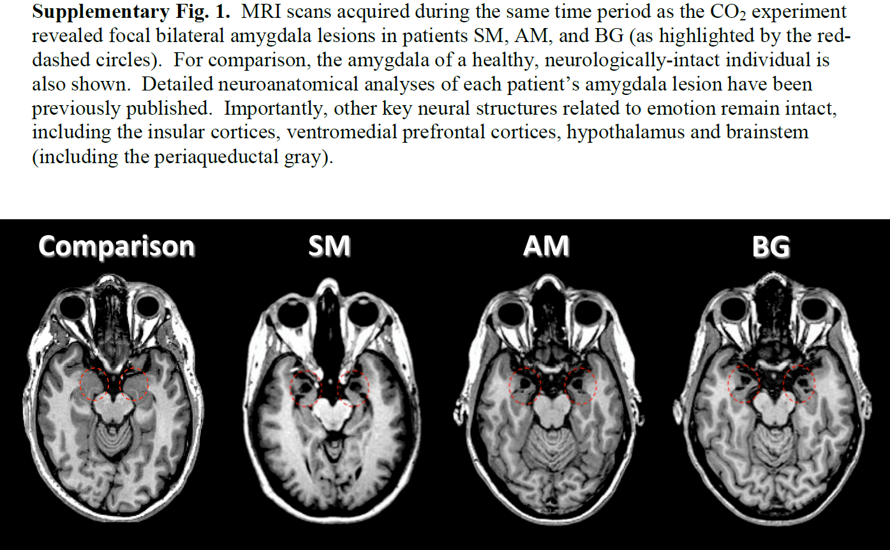
- This suggests that the amygdala isn’t require for fear and panic, and makes an important distinction between fear triggered by external threats from the environment versus fear triggered internally.
- One well-known patient with amygdala damage is patient SM, who reported experiencing fear for the first time in any setting after inhaling 35% CO2.
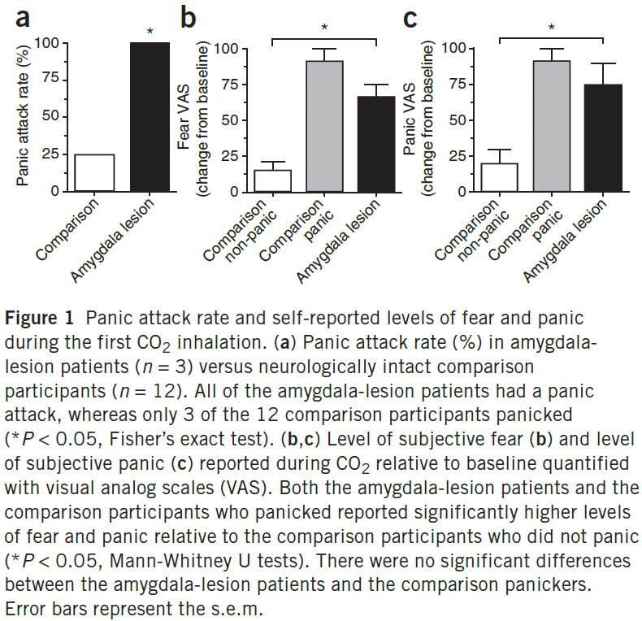
- Notably, the bilateral amygdala lesions don’t interfere with the ability to express or experience any of these fear-related emotions.
- E.g. Fear, panic, anxiety.
- We also tested 12 control/comparison participants using the same CO2 test and found interesting results.
- In the comparison group, skin conductance response and heart rate gradually rose before inhalation as participants observed the experimenters preparing the inhalation challenge.
- However, both of these anticipatory responses were deficient in the lesion patients.
- These results are consistent with the notion that the amygdala detects potential danger in the external environment and physiologically prepares the organism to confront the threat.
- The higher rate of panic attacks in the amygdala-lesion patients suggests that an intact amygdala may normally inhibit panic or acute panic.
- The patients reported being surprised by their reaction to CO2 and found the induced feelings of fear and panic to be completely novel.
- What’s different about CO2 compared with previous stimuli that failed to evoke fear or panic?
- One possibility is that all other stimuli were exteroceptive in nature that result in projections to the amygdala.
- In contrast, CO2 acts internally and causes an array of physiological changes, which might engage interoceptive afferent sensory pathways that project to the brainstem, diencephalon, and insular cortex.
- Thus, CO2 may directly activate extra-amygdalar brain structures that underlie fear and panic.
- Our results show that in humans, the internal threat signaled by CO2 is detected and interpreted as fear and panic despite the absence of an intact amygdala.
- The “Supplementary Information” has the transcribed reactions from each patient following the CO2 inhalation.

## [Visual behaviour mediated by retinal projections directed to the auditory pathway](https://doi.org/10.1038/35009102)

- An unresolved issue in cortical development is: To what extent do intrinsic and extrinsic factors contribute to the functional specification of different cortical areas?
- We rewired retinal projections to the auditory thalamus and found visually responsive cells in the auditory thalamus and cortex with a retinotopic map in auditory cortex.
- This paper found that this cross-modal projection and its representation in the auditory cortex can mediate visual behavior.
- E.g. When light is presented to the receptive field of a rewired retinal cell, the stimulus is “seen” by the auditory cortex and ferrets respond as though they perceive the stimuli to be visual rather than auditory.
- So the perceptual modality of a neocortical region is controlled, to a significant extent, by its extrinsic inputs.
- Can sensory inputs shape the perceptual modality of a cortical area?
- We redirect visual projections to the auditory pathway by ablating the brachium of the inferior colliculus (BIC) within a day after birth.
- Thus, the retina projects to the medial geniculate nucleus (MGN) which is normally used for auditory signals, not visual signals.
- A1 cortical neurons display visual properties after rewiring such as orientation and direction selectivity, and a 2D map of visual space.
- We investigated
    - Whether activation of the crossmodal projection evokes visual or auditory percepts.
    - If the projections do mediate visual behavior, is visual acuity comparable to normal?
- Rewired ferrets were trained to make one response to a visual stimulus and a different response to an auditory stimulus.
- E.g. Turning their head left for sound and right for light.
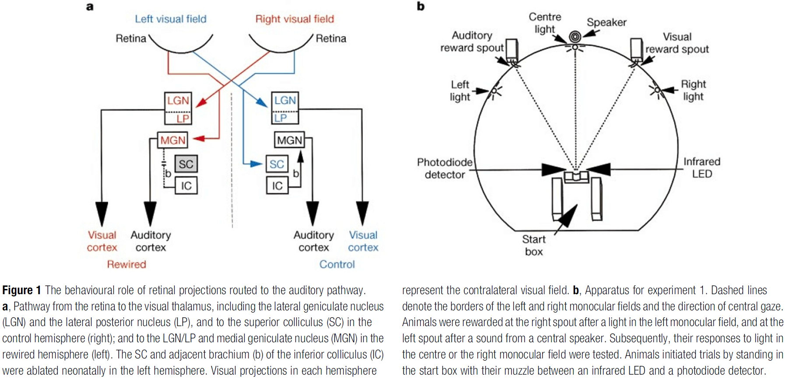
- Animals were trained up to the asymptotic limits of accuracy and no training was done on the visual field seen by the rewired pathway.
- After training, we lesioned the remaining visual thalamic nuclei (LGN/LP) in the rewired hemisphere, leaving only the retino-MGN (rewired) projection for visual information.
- After testing only the rewired projection, we ablated/destroyed the A1 and adjacent cortex and tested the ferrets with light in the right visual field.
- Following LGN/LP lesions, the ferrets consistently responded as though they perceived the light stimulus presented to the rewired projection.
- Following A1 ablation, all ferrets showed a significant reduction in their responses at the visual reward spout with responses dropping to near-chance levels.
- There was little change in the responses to other stimuli in the post-A1 lesion condition.
- These results are consistent with the conclusion that the rewired ferrets interpreted light stimuli in the right monocular field as visual, and became functionally blind after the A1 lesion.
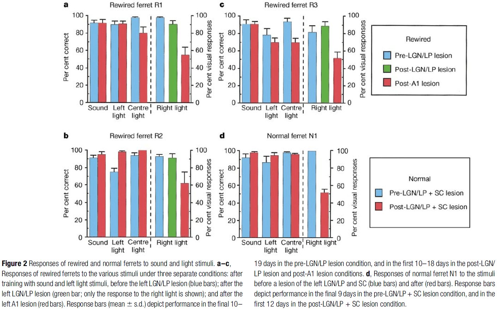
- Three other results
    1. A normal ferret was trained using the same procedure and underwent the LGN/LP lesion. Compared to the rewired ferret, the normal one had functional blindness in the right visual field.
    2. To check whether the representation of the right light was similar to the left light, one rewired ferret was only trained with light stimuli in the left monocular field. After LGN/LP lesioning, it was tested with light in the right visual field and got over 95% accuracy.
    3. To check whether the representation of light was different to sound, one rewired ferret was only trained with auditory stimuli. After LGN/LP lesioning, it was tested with light in the right visual field, and in all trials, the ferret turned towards the light but didn’t move.
- Together, these results show that the rewired visual projection to the auditory thalamus and cortex can mediate functional responses to visual stimuli.
- To test visual acuity, we presented ferrets with two visual gratings and they had to move when they could see the grating.
- Results show that the grating acuity of rewired ferrets is comparable to normal in the left monocular field, but substantially lower in the right monocular field.
- Contrast sensitivity and spatial resolution of the rewired projection is lower than that of the normal visual pathway.
- Overall, these data show the profound capacity for behavioral plasticity in even primary sensory areas of the neocortex.

## [Visual projections routed to the auditory pathway in ferrets: receptive fields of visual neurons in primary auditory cortex](https://doi.org/10.1523/JNEUROSCI.12-09-03651.1992)

- Is the cortex of a given sensory modality uniquely specified to process inputs of that modality, or can it, under certain conditions, process input of another modality?
- This paper answers this question by routing visual inputs into the auditory pathway during development and by studying the resulting visual responses of cells in the auditory cortex.
- Specifically, retinal afferents in the ferret were induced to innervate the auditory thalamus or medial geniculate nucleus (MGN).
- This results in visual input to cells in the primary auditory cortex (A1) of the “rewired” ferret with a topographic visual map there.
- To induce retinal innervation of nonvisual thalamic structures, we need to remove the normal retinal targets, mainly the lateral geniculate nucleus (LGN) and the superior colliculus (SC).
- The SC was ablated by cautery and the LGN was retrograde degenerated by cauterizing large regions of the visual cortex.
- All lesions were made unilaterally as bilateral lesions significantly reduced survival rates.
- These lesions induce the development of retinal afferents into the MGN.
- Since the normal thalamocortical connectivity from the MGN to primary auditory cortex (A1) is retained, an aberrant visual pathway from the retina to MGN to A1 is established.
- In both normal and rewired animals, stimulating electrodes were lowered into the optic chiasm and recording electrodes were lowered into V1 and A1.
- Three major differences between the visual units in A1 and V1
    1. Responsivity
        - Most cells in V1 responded in robust and consistent fashion to visual stimuli, but cells in A1 were much more difficult to drive, exhibited unstable responses, and responded with fewer spikes.
        - The poor responsivity of A1 cells often made receptive field characterization of A1 cells difficult and time consuming.
    2. Receptive field size
        - The receptive field sizes (average length and width of the field) of visual cells in A1 were significantly larger than those of V1 cells.
        - The mean diameter of receptive fields in A1 was almost three times that of V1 cells.
    3. Latency
        - Cells in A1 and V1 also differed in their latencies to optic chiasm stimulation.
        - A1 cells took significantly longer to respond to stimulation compared to V1 cells.
        - There was no correlation between the latency to optic chiasm stimulation and cortical depth, receptive field size, or responsivity.
- These differences seem to come from the properties of retinal and thalamic input to A1 and V1.
- Similarities between the visual units in A1 and V1
    1. Ocular dominance
        - In V1, we recorded mostly from contralaterally dominated cells, with 65% of all units tested being completely contralateral dominant and only 10% being ipsilateral dominant.
        - In A1, a similar ocular dominance distribution was seen with 66% being completely contralaterally dominant and 7% being ipsilateral dominant.
        - Approximately 30% of units recorded in both A1 and V1 are binocular.
    2. Receptive field types
        - Receptive fields of cells in V1 are classified as simple or complex and in general, resembles those seen in cats, minks, and ferrets.
        - While it’s difficult to determine the receptive fields of cells in A1 due to being large, similar receptive field structures were observed.
        - Not only do simple, complex, and non-oriented cell types occur in A1, they also occur in proportions similar to that found in V1.
        - In both A1 and V1, approximately 50% of the cells are complex, 25% simple, and 25% non-oriented.
    3. Tuning characteristics
        - To determine orientation tuning, we used responses to flashing bars at various orientations.
        - Cells in A1 respond with fewer spikes overall than those in V1 and their responses appear to be modulated less strongly with respect to background levels.
        - Both A1 and V1 contained cells exhibiting a range of orientation tuning selectivities, ranging from non-oriented to strongly oriented.
        - Neither orientation strength nor orientation tuning width revealed any quantitative difference between A1 and V1 with respect to orientation tuning.
        - One unexpected finding was that the velocity tuning of cells in A1 were similar to those in V1.
        - Most cells were tuned to either slow, medium, or fast velocities.
- We find that receptive field properties of visual cells in rewired A1 are remarkably similar to those in normal V1.
- Generation of visual receptive field properties in A1
    - The cortical areas that project to A1 in rewired animals are the same areas that project to A1 in normal animals, and don’t include any visual cortical areas.
    - The degree of similarity between A1 and V1 is apparent not only in the orientation, direction, and velocity selectivity of cells, but also in the types of receptive field organizations found there.
    - Both V1 and A1 contain simple and complex receptive field types and in roughly similar proportions.
    - We argue that the generation of these cortical receptive field organizations and tuning properties isn’t dependent on the input cell type, but arises via intracortical circuitries activated by a minimum of visual input.
- Do inputs specify intracortical circuitry?
    - One interpretation of these data is that visual input during development actually instructs the establishment of specific cortical circuits in A1.
    - In this view, the temporal patterns of sensory activity unique to each sensory modality actively instruct the development of specific cortical circuits, possibly from an initial cortical template.
    - It’s known that the development of functional properties of cells in the primary visual cortex can be modified by changes in visual input.
    - E.g. Changing the quality and quantity of activity can greatly influence the establishment of ocular dominance in visual cortex.
    - In the rewired ferrets, we have replaced auditory input with visual input at a time when cortical circuits haven’t yet been fully established.
- Do sensory cortices share common processing circuits?
    - Another interpretation of these data is that A1 and V1 share certain similar processing circuits, and that visual inputs to A1 simply activate circuits normally present in A1.
    - A1 thus comes to exhibit visual receptive field properties similar to those in normal V1.
    - Physiologically, many neurons in A1 respond selectively to the direction and rate of frequency modulation.
    - If sensory cortices share some common processing circuits, then these circuits can be established regardless of input modality during development.
- Our results show that the sensory neocortex isn’t uniquely specified to process inputs of a single modality.
- Auditory cortex can accept and process visual input in a way very similar to those in normal visual cortex.
- Whether these functional similarities are due to input-induced changes in intracortical circuitry or to intrinsic commonalities across sensory cortices is unknown.
- A view consistent with neural development is that basic intracortical connections are established independent of afferents, while input activity would play a role in the fine-tuning of these connections.

## [Hierarchical organization of cortical and thalamic connectivity](https://doi.org/10.1038/s41586-019-1716-z)

- Connectomes exist at different levels of granularity from single cells to populations to entire areas.
- It’s unclear whether the idea of a cortical hierarchy can be applied globally across the entire cortex, and how it arises from connections made by different classes of neurons.
- Each cortical region comprises distinct types of excitatory neurons that are largely organized by layers, but also by long-distance projection patterns: intratelencephalic (IT) in L2-L6, pyramidal tract (PT) in L5, and corticothalamic (CT) in L6.
- For thalamocortical (TC) connections, input to L4 is considered feedforward, and input to L1 is considered feedback.
- For corticothalamic (CT) connections, input from L6 is considered feedback, and input from L5 is considered feedforward.
- We hypothesize that a unifying hierarchical organization across the entire cortex and its major input structure, the thalamus, is governed by a set of anatomical rules for corticocortical (CC), corticothalamic (CT), and thalamocortical (TC) connections.
- Results show that the mouse cortex and thalamus form an integrated hierarchical organization.
- Skipping over the Cre drivers for cortical projection mapping.
- Unlike the cortex, which is organized into distinct projection classes within layers of a single region, thalamic nuclei have relatively homogenous populations of cortically projecting neurons.
- Some CT projections clearly travel through thalamic regions before reaching their final targets and form synapses in those areas.
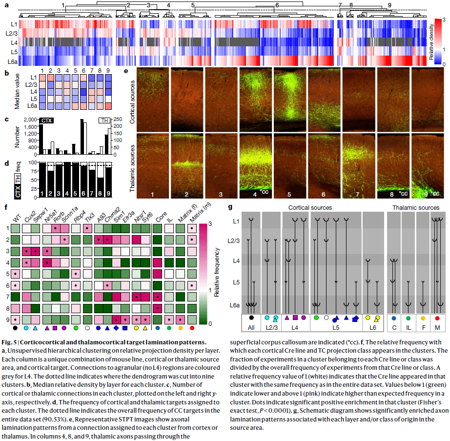
- The cortex is organized as a modular network but this doesn’t force a direction or order onto the flow of information.
- In contrast, a hierarchy does enforce a direction as either feedforward or feedback.
- The hierarchy that we find is shallower than expected, even when thalamic regions are included.
- E.g. The difference between the lowest and highest areas is less than two full levels, and the all-area hierarchy score is 19% between random and perfectly hierarchical.
- This may be specific to the mouse cortex and may not generalize to primate brains.
- We found that L2/3 and L4 neurons have mostly feedforward layer projection patterns, while L5 and L6 neurons have both feedforward and feedback patterns.

## [Neurogenesis in the adult human hippocampus](https://doi.org/10.1038/3305)

- We don’t know if the adult human brain can create new neurons.
- We used postmortem human brain tissue that had been treated with bromodeoxyuridine (BrdU) for diagnostic purposes, which is incorporated into the DNA of dividing cells.
- Using labeling for BrdU and for one of the neuronal markers, NeuN, we show that new neurons, as defined by these markers, are generated from dividing progenitor cells in the dentate gyrus of adult humans.
- Results indicate that the human hippocampus retains its ability to generate neurons throughout life.
- Loss of neurons is thought to be irreversible in the adult human brain because dying neurons can’t be replaced.
- In most brain regions, creating new neurons is generally confined to a discrete developmental period.
- However, exceptions include the dentate gyrus and the subventricular zone (SVZ) where granule neurons are generated throughout life from progenitor cells.
- We tested whether progenitor cells exist in the adult human hippocampus and whether new neurons are born within the dentate gyrus of the adult human brain.
- The presence of BrdU-positive nuclei in a brain region that’s neurogenic in many other mammalian and primate species indicates that proliferating neural progenitor cells are present in the adult human dentate gyrus.
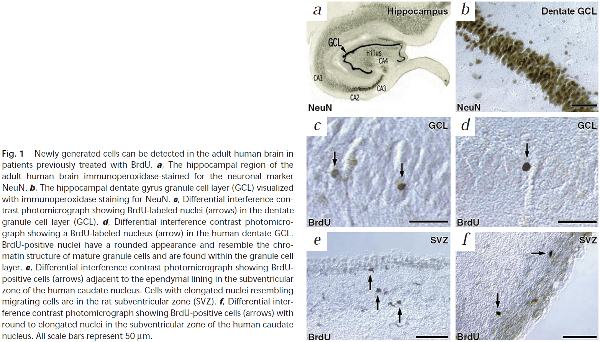
- Most of the NeuN-positive neurons that were double-labeled with BrdU were located within or near the granule cell layer and had the morphological characteristics of granule cell neurons.
- E.g. Round or oval nuclei with small- to medium-sized cell bodies.
- This demonstrates the existence of newly generated granule cell neurons in the dentate gyrus of the adult human brain.
- We also found BrdU-positive cells in the SVZ, supporting the idea that the human SVZ contains progenitor cells and that these cells are required to migrate from the SVZ before they differentiate.
- This paper shows that cell genesis occurs in human brains and that the human brain retains the potential for self-renewal throughout life.
- Although these results show that new neurons are created, we haven’t proven that these new cells are functional.
- We also don’t yet know the biological significance of cell genesis in the adult human brain.
- This may be one type of neuroplasticity where new neurons are formed.

## [The period of susceptibility to the physiological effects of unilateral eye closure in kittens](https://doi.org/10.1113/jphysiol.1970.sp009022)

- Kittens were visually deprived by suturing (sewing) shut the right eye lid for various lengths of time and at different ages.
- Responses from the two eyes were compared using recordings made from the visual/striate cortex.
- Consistent with previous reports, monocular eye closure during the first few months of life causes a sharp decline in the number of neurons influenced by the closed eye.
- Specifically, susceptibility to the effects of eye closure begins suddenly near the start of the fourth week, remains high until some time between the sixth and eighth weeks, and then declines, disappearing around the end of the third month.
- In contrast, monocular closure in an adult cat for over a year produced no detectable effects.
- During the period of high susceptibility (fourth and fifth weeks), eye closure for as small as 3-4 days leads to a sharp decline in the number of neurons that can be driven from both eyes.
- A 6-day closure leads to a reduction in the number of neurons that can be driven by the closed eye to a fraction of the normal (from 85% to 7%), which is similar to three months of monocular deprivation from birth.
- Cells in the lateral geniculate nucleus (LGN) following 3 or 6 days deprivation are noticeably smaller and paler.
- Following three months of monocular deprivation, opening the eye for up to 5 years produces limited recovery in cortical physiology and no obvious recovery of the geniculate atrophy even though behaviorally there is some return of vision in the deprived eye.
- Experimental results show that there must be a critical vulnerable period in the first 10-12 weeks, after which the animal is immune to deprivation procedures.
- This paper attempts to examine the precise timing that the animal is vulnerable, when the susceptibility is greatest, how long it lasts, the duration of deprivation necessary, and the relation between timing of deprivation and ability to recover.
- Method details
    - Twenty one monocularly deprived kittens and two normal 4-week kittens.
    - All deprived animals had their right eyes closed by lid suture at various ages and for varying lengths of time.
    - Recordings were usually made in the hemisphere contralateral to the previously closed eye.
- In the normal adult cat, about four-fifths of the cells in the striate/visual cortex can be influenced by both eyes.
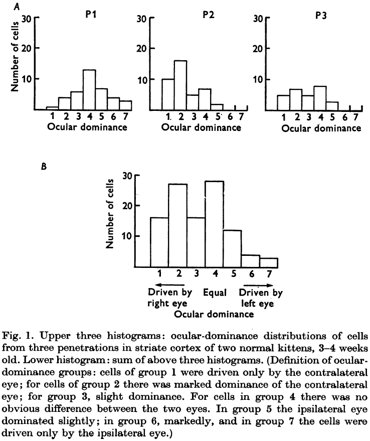
- Some cells receive roughly equal inputs from both eyes while in others, one eye is strongly dominant.
- Cells dominated by one eye show a tendency to be grouped in columns, also known as an ocular dominance column.
- Results from all deprived kittens suggest that the changes begin by about the fifth week of life, and can become very marked in a few days.
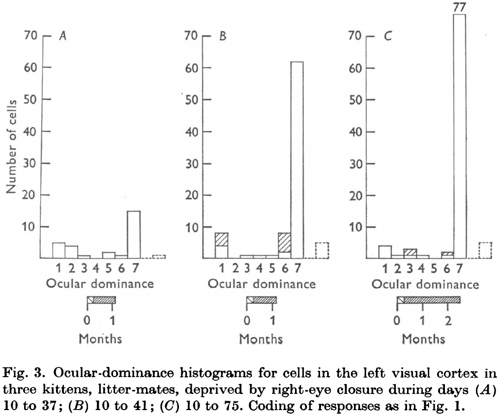
- Eye closure doesn’t just shift neurons in favor of the normal eye, but it also reduces the number of binocularly driven cells.
- It’s as though the connections from the open eye are competing with connections from the closed eye, hastening their disruption.
- These experiments show that the sensitive period has a duration of at least several weeks, during which a few days of closure caused marked cortical changes.
- Previous work showed that the period of sensitivity was limited as a 3-month closure in an adult cat produced no physiological or anatomical abnormalities.
- The sensitive period may decline at about three months of age, as monocular eye closure after two months did have some abnormal effects, but were far from the extreme ones shown in the present study.
- After experimentation, susceptibility to the effects of deprivation, which appear suddenly near the beginning of the fourth week and is extreme during that week, begins to decline some time between the sixth and eight weeks, and continues to decline during the third month, completely disappearing by the end of the third month.
- An adult cat seems completely resistant to monocular deprivation.
- However, the effects of monocular deprivation for the first three months of life tend to be permanent with limited morphological, physiological, and behavioral recovery.
- If the deprivation lasts from day 10 to 37 and recovery is allowed for 12 months, then some recovery occurs but only about one-fifth of the cells, instead of the normal four-fifths, receive input from both eyes.
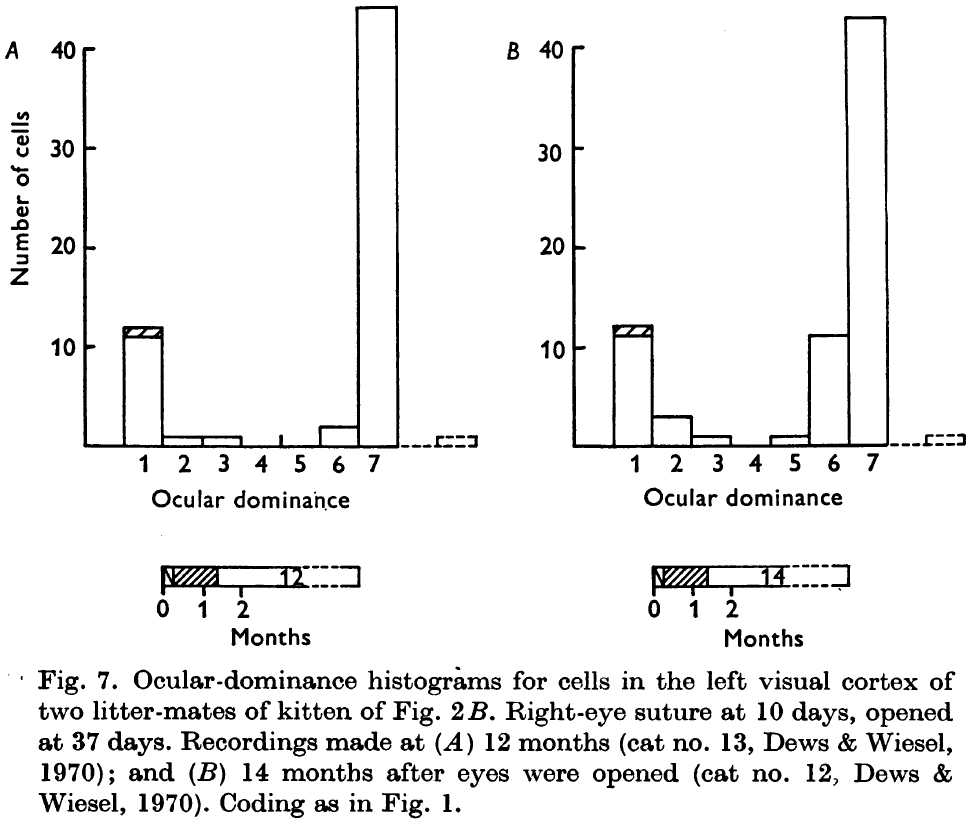
- It appears that normal binocular connections are not only the first ones to go, but that they’re the least likely to recover.
- It also appears that the cells that reestablish functional connections with the deprived eye are also those that were strongly dominated by that eye in the first place.
- If deprivation lasts from day 10 to 51 and recovery is allowed for 11 months, then almost no recovery occurs.
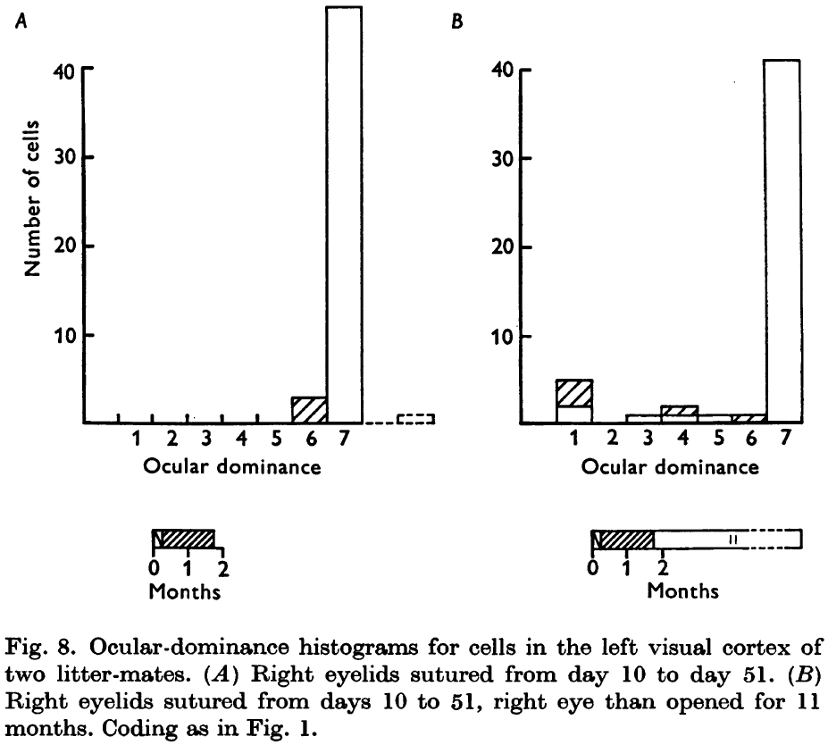
- Thus, in the critical period, even a slight increase in duration of deprivation may be important in further limiting recovery.
- We see the same results if the deprivation lasts for the first 3-4 months of life.
- Atrophy in the lateral geniculate layers following deprivation is less marked the later the closure, with no changes in an adult cat deprived for 3 months.
- The most surprising result of this paper is the high degree of sensitivity a kitten shows to a few days of monocular deprivation during a very restricted period in life.
- The critical period begins suddenly near the start of the fourth week, at about the same time as when kittens start to use their eyes, and persists until some time between the sixth and eight weeks. It then begins to decline, disappearing around the end of the third month.
- After four months, cats seem insensitive to even very long periods of monocular deprivation.
- The ability to recover from monocular deprivation seems to be closely related to this vulnerable period.
- Deprivation for the first 2-3 months produced irreversible defects even when the normal eye was closed during the period of recovery.
- When the deprivation period was shorter, the recovery was greater.
- The immunity to deprivation effects and the failure to recover may both be manifestations of the same rigidity.
- It may be that the critical period coincides with the time when a particular system is being formed and developed, and that use during this time is essential for its full maturation and sustenance.
- Results from this paper implies that for normal development, normal environmental conditions must occur throughout the critical period and not just during some small part of it.

## [Hard criteria for empirical theories of consciousness](https://doi.org/10.1080/17588928.2020.1772214)

- Consciousness is now a well-established field and many Theories of Consciousness (ToCs) have been proposed.
- One reason for this abundance of extremely different ToCs may be the lack of stringent criteria specifying how empirical data constrains ToCs.
- Three arguments from this paper
    - Consciousness is a well-defined topic from an empirical point of view.
    - We present a checklist of criteria that empirical ToCs need to fulfill.
    - We review 13 of the most influential ToCs and subject them to this checklist.
- The problem of consciousness
    - Dualistic theories, where the mind and matter are two separate entities, are hard to reconcile with the fundamental laws of science.
    - So, most modern theories of consciousness are compatible with physicalism in which only matter exists and mental events are identical to physical processes.
    - Many philosophical approaches, however, deny that consciousness can be reduced to physics.
    - E.g. David Chalmers easy and hard problem of consciousness.
    - At the center of this debate is the idea of qualia.
    - Qualia: the subjective phenomenal qualities of experience.
    - E.g. What it’s like to feel pain, experience the color green, or enjoy a piece of music.
    - Explanatory gap: the difficulty of physicalist theories in explaining phenomenal properties.
    - One of the major problems in discussions of consciousness is that they seems to evade a rigid definition, making it difficult to compare theories against each other.
    - Consciousness science is ripe for a purely empirical approach.
    - Currently, there are few comparisons between ToCs and instead, authors building ToCs largely ignore other ToCs.
    - The focus of this paper is on how ToCs address empirical data about consciousness.
    - E.g. Masking, rivalry, or the difference between sleep and wakefulness.
    - An important note is that we aren’t trying to compare specific ToCs against each other, but rather compare ideas and principles of ToCs against each other.
    - The ultimate goal is to reduce the number of ToCs because not all of them can be correct.
- Empirical phenomena of consciousness
    - Two main aspects of consciousness
        - State
        - Content
    - A ToC may address the state or content of consciousness, or ideally both.
    - We have the intuitive feeling that state consciousness is graded.
    - E.g. From brain death to coma to anesthesia to sleep to drowsiness to fully alert.
    - Even within these states there seems to be a continuum.
    - However, it’s unclear to what extent this intuition is correct.
    - We also intuitively feel that we only have a single consciousness at one moment in time.
    - The unconscious integration period can last for 420 ms in experiments with masking.
    - This raises the question of whether consciousness is a continuous or discrete stream of percepts.
- Hard criteria for empirical theories of consciousness
    - Paradigm cases
    - Unfolding argument
    - Small and large network argument
    - Other systems argument
- Paradigm cases of consciousness: empirical phenomena that are focused specifically on consciousness and not other co-occurring aspects.
    - E.g. The phenomenon must have both conscious and unconscious alternatives.
    - E.g. In masking, the target is perceived consciously under certain conditions and remains unconscious under other conditions.
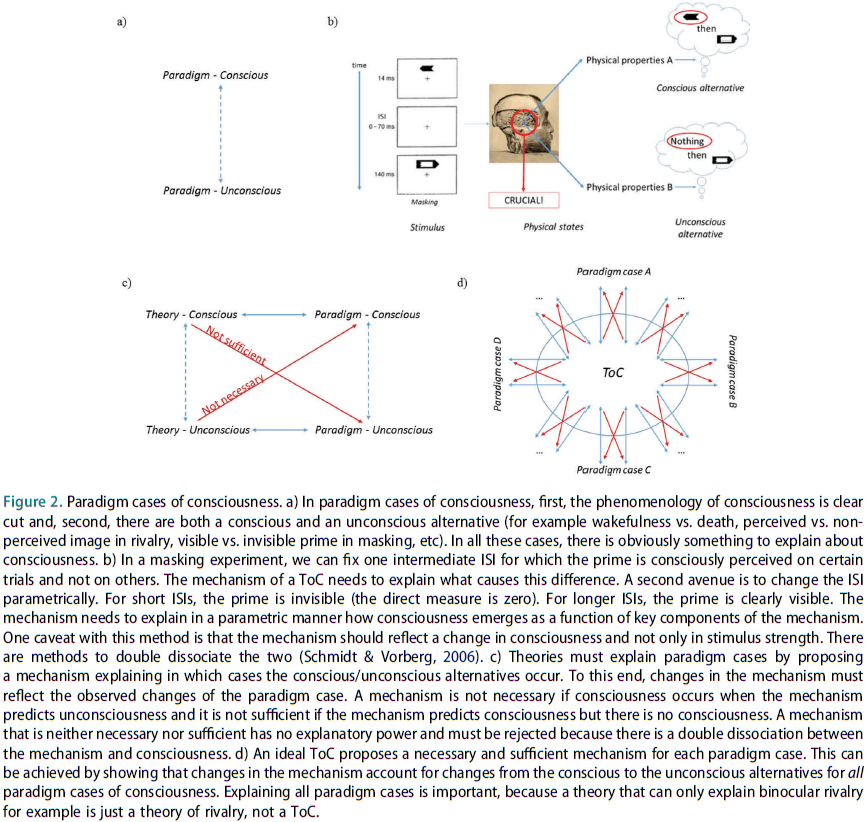
    - To explain paradigm cases, ToCs need to show how changes in their mechanism explain changes from consciousness to unconsciousness.
    - It follows that introspection by itself doesn’t allow one to study paradigm cases of consciousness because by definition, we are unaware of the unconscious alternative.
    - All that’s needed for this criteria is the existence of conscious and unconscious states, and methods to contrast them.
    - Paradigm cases ensure that consciousness is the dependent variable in experiments.
    - Examples of approaches that lack an unconscious alternative
        - How consciousness changes under the influence of LSD and other drugs.
        - Changes in body ownership and mapping them to brain states.
        - Specific processes thought to be constitutive for consciousness such as neural binding.
    - These approaches lack an unconscious alternative so they need to address the problem that there may be other co-occurring processes instead of consciousness.
    - It isn’t enough to explain just a few paradigm cases as a ToC must be more general than specific examples.
    - The underlying commonalities between all paradigm cases needs to be understood.
    - A ToC should explain paradigm cases by a principled mechanism.
    - In summary, the first criterion asked whether a TOC addresses all paradigm cases of consciousness. If it doesn’t, then the ToC needs to provide an argument showing that it nevertheless targets consciousness distinct from co-occurring phenomenon.
- Unfolding argument: since a recurrent network can be unfolded into a feedforward network, ToCs that argue a recurrent system is conscious whereas the feedforward system isn’t must address this challenge.
    - Causal structure theories associate consciousness with the presence of the right kind of causal structure in a system.
    - E.g. Information Integration Theory (IIT) and Recurrent Processing Theory.
    - This criterion asks whether a ToC is subject to the unfolding argument and if so, then the ToC needs to explain how experiments can support or falsify it.
    - If a ToC argues that a recurrent system is conscious but a feedforward system isn’t, then it contradicts the unfolding argument which states that both are equivalent.
- Small and large network argument
    - Many ToCs imply that small networks with fewer than ten neurons are conscious.
    - This criterion isn’t constrained by empirical data because there are no paradigm cases for small networks.
    - Are ToCs subject to the small and large network arguments? And if so, how do they deal with it?
    - In essence, this is a criterion about scale and at what level does consciousness appear.
- Other system argument
    - ToCs must be generalizable to other systems and not just apply to the human brain, or it must provide a strong argument showing why only humans can be conscious.
    - ToCs that point to certain brain regions or characteristics claimed to be sufficient for consciousness need to explain why they are also necessary for consciousness.
    - This criterion asks whether ToCs can make clear and specific predictions about which other systems are conscious, apart from humans.
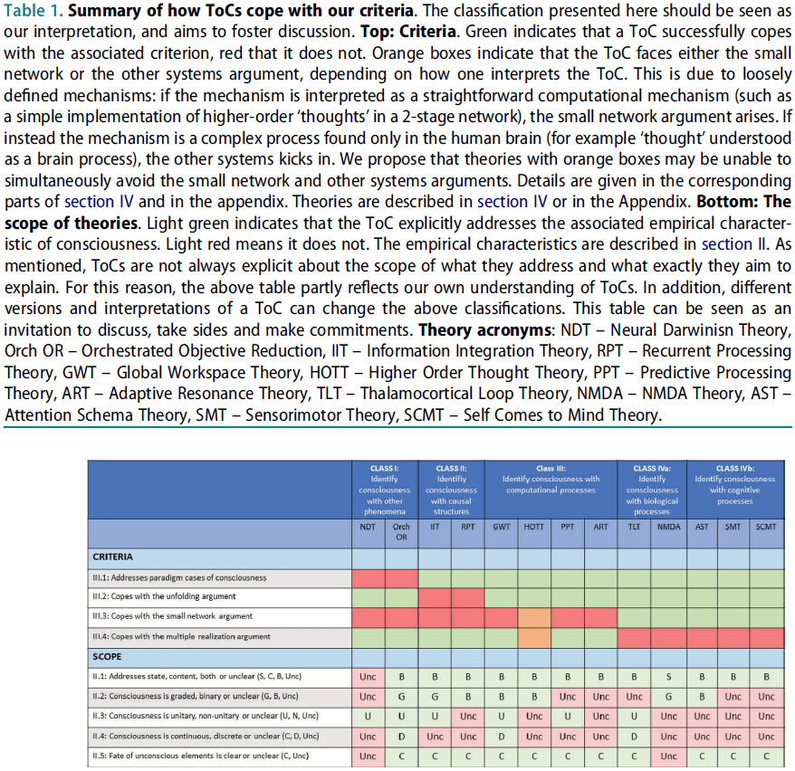
- Some subjective experiences can be explained independently of consciousness.
- E.g. Some visual illusions are due to retinal processing and not consciousness.
- When a percept doesn’t match objective reality, consciousness may seem to be involved, but this impression is usually mistaken.
- Skipping over the sections on applying the above criteria to popular ToCs.
- Modern neuroscience has developed many tools and techniques to investigate consciousness.
- E.g. Masking, rivalry, crowding, continuous flash suppression, anaesthesia.
- Questions each criterion asks
    - Paradigm cases
        - Is the proposed phenomenon necessary, sufficient, or only linked to consciousness?
        - Is it clear that the proposed phenomenon is in fact linked with consciousness at all?
        - Is it consciousness or a co-occurring process?
        - Is it explaining consciousness or a cognitive process?
    - Unfolding argument
        - Is there a link between the causal structure and consciousness?
        - How does it address the multiple realization problem?
    - Small and large network argument
        - At what level of abstraction does consciousness appear? What’s the threshold?
        - How constrained is the theory to small and large networks?
        - What networks/organisms/systems should be conscious?
    - Other systems argument
        - Does consciousness apply to other systems? If yes, why? If no, why not?
- It’s important for each ToC to find the common characteristics of paradigm cases.
- The many ToCs we have simply reflects the fact that we have too few experimental constraints on such theories.
- Vague mechanisms camouflage the issue of whether small systems are conscious.
- Perhaps for this reason, ToCs often identify consciousness with a vague, metaphorical, or little understood aspect.
- E.g. Attention, complexity, neural binding, or quantum states.
- Few ToCs make detailed predictions and thus are difficult to compare.

## [Your Brain Is Not an Onion With a Tiny Reptile Inside](https://doi.org/10.1177%2F0963721420917687)

- A common misconception is that as vertebrate animals evolved, newer brain structures were added over existing older brain structures and that these newer, more complex structures endowed animals with newer and more complex psychological functions.
- E.g. Behavioral flexibility, intelligence, language.
- This belief, however, has long been discredited among neurobiologists and is false.
- We urge psychologists to abandon this mistaken view of human brains.
- Triune-brain theory
    - The belief that newer brain components are layered outside of older components as new species emerge.
    - E.g. From reptile brain to limbic system to cerebral cortex.
    - And that these newer components are associated with complex psychological functions.
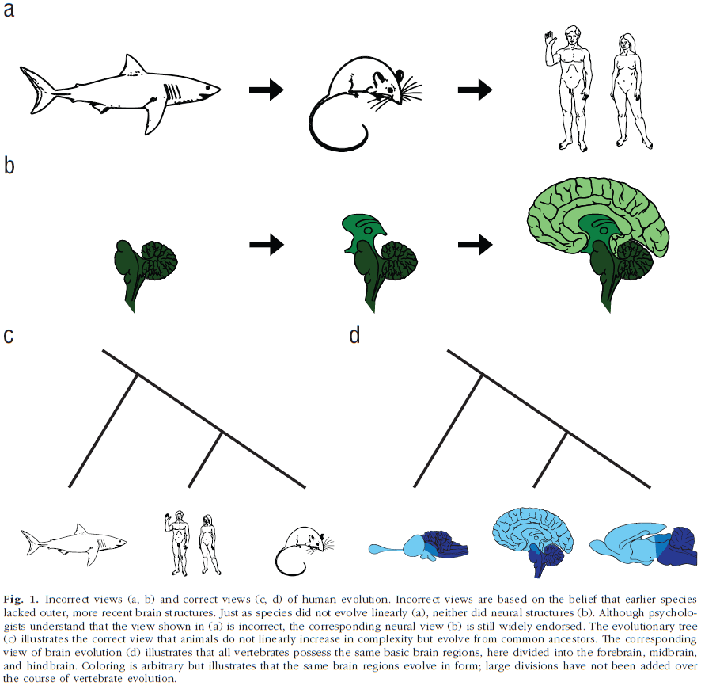
- The idea behind the triune-brain theory is that the behavior of many animals is inflexibly controlled by external stimuli because their brains consist of older structures only capable of reflexive responses, whereas humans possess newer systems that allow for behavioral flexibility.
- Misunderstandings of nervous system evolution
    - Organisms don’t evolve linearly from simple to complex organisms.
        - This is realistic because complexity evolved repeatedly in many independent lineages.
        - This view also implies that evolutionary history is a linear progression but it isn’t. Evolution is more like a tree radiating outwards.
    - Complex neural structures don’t result in increased behavioral complexity.
        - Structural complexity doesn’t endow functional complexity.
        - Nonhuman animals don’t respond inflexibly to a given stimulus.
    - Biological evolution doesn’t follow geological evolution.
        - Instead, much evolutionary change consists of transforming existing parts.
        - E.g. The cortex isn’t evolutionary unique to humans as all vertebrates posses structures related to our cortex.
- Believing that humans possess unique neural structures tied to specific cognitive functions may send researchers down a path that is misguided and may inhibit connections with other fields.

## [Life without a brain: Neuroradiological and behavioral evidence of neuroplasticity necessary to sustain brain function in the face of severe hydrocephalus](https://doi.org/10.1038/s41598-019-53042-3)

- A two-year-old rat survived with extreme hydrocephaly affecting the size and organization of its brain.
- Much of the rat’s cortex was severely thinned and replaced by cerebrospinal fluid, and yet the animal has normal motor function, could hear, see, smell, and respond to tactile stimulation.
- What made this rat unique was its age. In human years, it was 70 years old.
- Living to old age with untreated hydrocephalus is very rare.
- This paper tested the rat’s behavior using fMRI and olfactory, visual, and tactile stimulation.
- This rare case can be viewed as one of nature’s exceptions, providing the unique chance to examine the brain’s capacity for neuroplasticity and reorganization necessary for survival.
- After testing, the motor and somatosensory cortices maintain their prescribed neuroanatomical organization and function.
- However, this isn’t the case for vision and hearing.
- What’s the bare minimum amount of brain to live?
    - An intact brainstem is essential for all vegetative functions.
    - A hypothalamus and pituitary gland are necessary for ingestive, social and sexual behaviors, homeostasis, salt and water balance, body temperature, and circadian rhythms.
    - Motor cortex, basal ganglia, and thalamus are needed for goal directed movement.
    - Hippocampus is needed for memory.
    - The primary sensory modalities are needed to sense the external world.
- Long before encephalization, there was centralization of function in the upper brainstem for sensory integration, learning, memory, motivation, and organization and expression of complex behaviors.
- This centralization of life functions in subcortical areas would include the olfactory bulbs and cerebellum.

## [Theoretical Neuroscience Rising](https://doi.org/10.1016/j.neuron.2008.10.019)

- This paper presents some of the developments that have occurred in theoretical neuroscience and the lessons they’ve taught us.
- Two developments in the mid-1980s set the stage for the rapid expansion of theoretical neuroscience
    - The popularization of the backpropagation algorithm for training artificial neural networks.
    - The analysis of Hopfield networks using methods from statistical physics.
- Theorists can act as initial filters of ideas prior to experimentation.
- It’s the theorist’s job to develop, test, reject, and sometime promote new ideas.
- Theoretical neuroscience is sometimes criticized for not making enough predictions.
- The key test of the value of a theory isn’t necessarily whether it predicts something new, but whether it makes postdictions that generalize to other systems and provides valuable new ways of thinking.
- The following sections provide a sparse sampling of theoretical developments that have occurred over the past 20 years and discuss some of the things they’ve taught us.
- Basic principles
    - Many researchers have sought basic principles to help guide us through the complexities of neural circuits and cognition.
    - E.g. Efficient coding, Bayesian inference, generative models, causality, neural code.
    - Efficient coding hypothesis: sensory systems are adapted to convey information about stimuli using the minimal amount of activity.
    - Bayesian inference: a principle for quantifying the effect that evidence should have on belief.
    - A major problem we face in contemplating memory storage or perceptual processing is that we don’t understand how neural activity represents information beyond the early stages in sensory processing.
    - Generative models provide a guiding principle for thinking about higher-order neural representations.
    - Causality is captured by Hebb’s rule of synaptic plasticity and its likely biophysical substrate, spike-timing-dependent plasticity (STDP).
- What are neural circuits doing and how are they doing it?
    - Neural models can be divided into two classes: the what and how of neural responses.
    - LNP (linear → nonlinear → Poisson process) models  provide some of our best descriptions of what neurons do.
    - One theorist’s task is to construct a model that reproduces, as closely as possible, the neural activity recorded during experiments.
    - Physiology and anatomy provide the constraining framework for model building.
    - We must be wiling to be more abstract in our thinking.
- What matters and what doesn’t?
    - A key component of model building is identifying the minimum set of features needed to account for a particular phenomenon.
    - The art of modeling lies in deciding what subset of features are needed to account for the phenomenon and how it should be described.
    - In neural modeling, breadth is more important than depth.
- The author believes that the future of theoretical investigations lies in learning how to build models that construct hypotheses through their internally generated activity, while remaining sensitive to the constraints provided by externally generated sensory evidence.

## [Are There Levels of Consciousness?](https://doi.org/10.1016/j.tics.2016.03.009)

- While the notion of a level of consciousness is widely used, it isn’t clear what precisely a level of consciousness is.
- Local states of consciousness, also called conscious contents, refers to objects and features that are distinguishable from each other.
- E.g. Imagery, bodily sensations, affective experiences.
- Global states of consciousness aren’t distinguished from each other based on objects or features, but instead are distinguished based on cognitive, behavioral, and physiological grounds.
- This paper argues that the levels-based conception of global states of consciousness is unsupportable and offers an alternative of multidimensional analysis of global states.
- If the notion of a level of consciousness has no sound basis, then it’s unclear whether attempts to measure it or develop theories of it will be successful.
- Levels of consciousness implies that consciousness comes in degrees, and that changes in a creature’s global state of consciousness can be represented as changes along a single dimension.
- E.g. From total unconsciousness (death) to vivid wakefulness.
- Is this claim plausible? Can creatures be ordered on the basis of how conscious they are?
- Two problems with this claim
    - According to the standard conception of consciousness, a creature is conscious if and only if it possesses a subjective point of view. Arguably, this property of having a subjective point of view isn’t gradable and it can’t come in degrees.
        - E.g. A person can’t be conscious of more objects and properties than another person.
        - To be conscious of more isn’t the same as to be more conscious.
        - E.g. A sighted person is conscious of more contents than a blind person, but they aren’t more conscious than a blind person.
        - It’s controversial whether the contents of consciousness can be graded in terms of their degree of consciousness.
    - There’s good reason to doubt whether all global states can be assigned a determinate ordering relative to each other.
        - E.g. REM sleep versus light levels of sedation. Although level-based analysis states that one of these states must be absolutely higher than the other, the authors see no reason to grant that claim.
        - Attempts to impose an absolute ordering on global states of consciousness may be as futile as attempts to impose such an ordering on economies.
- The lesson to take away from this analysis is that although the notion of a conscious level serves as a useful shortcut by drawing attention to certain relations between global conscious states, it shouldn’t be treated as a legitimate theoretical construct in the science of consciousness.
- Consciousness in one-dimensional terms is no more plausible than attempts to model intelligence in one-dimensional terms.
- Multiple dimensions of analysis are needed to capture the various ways in which consciousness manifests in different global states.
- However, providing this multidimensional account of consciousness requires a much more detailed understanding of consciousness than which we currently have.
- In this paper, we focus on only two of the many dimensions that structure global states.
- The first dimension concerns the contents of consciousness.
    - We suggest that global states differ from each other in terms of how they gate conscious content.
    - In many global states, the contents of consciousness appear to be gated in various ways with individuals only experiencing a restricted range of contents.
    - E.g. Minimally conscious state (MCS) patients can represent the low-level features of objects, but they’re typically unable to represent the categories that perceptual objects belong to.
    - Variations in the gating of conscious contents is likely to provide one dimension along which global states can be hierarchically organized.
- The second dimension concerns functional dimensions.
    - In ordinary waking awareness, the contents of consciousness are typically available to guide a wide range of cognitive and behavioral processes.
    - E.g. Verbal report, intentional agency, attentional control, reasoning, executive processing.
    - The fact that cognitive and behavioral control can fragment in certain neurological disorders provides us with another dimension for modelling consciousness.
    - It’s possible that there are two global states which both exhibit functional impairments but where there’s no ordering in which the functional impairments is worse in one than in the other.
- The central idea, and the alternative to the level-based conception of global consciousness, is that global states can be thought of as regions within a multidimensional state space.
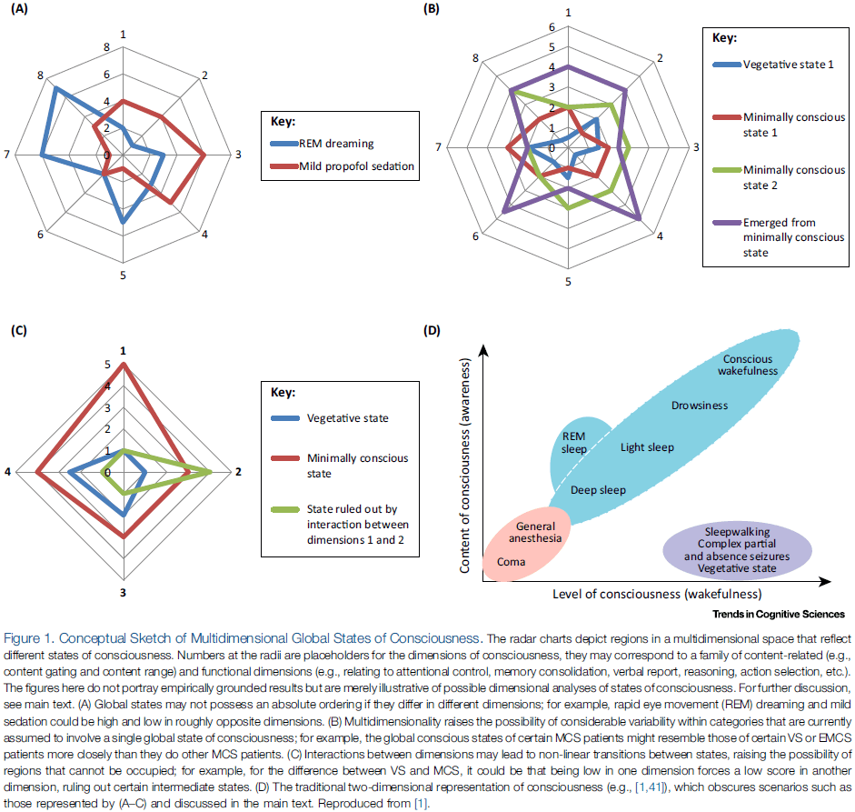
- Although the dimensions of the state space are unexplored, we suggest that one dimension tracks the gating of contents and another tracks the functional capacities associated with consciousness.
- Global states of consciousness are best understood as regions in a multidimensional space.
- The task of identifying the dimensions of this space will lead to a better understanding of consciousness itself.

## [The hornswoggle problem](https://web.ics.purdue.edu/~drkelly/ChurchlandTheHornswoggleProblem1996.pdf)

- This paper focuses on whether anything positive can be gained from the ‘hard problem’ of consciousness or whether this conceptualization is counterproductive.
- Review of Thomas Nagel’s paper ‘What is it like to be a bat?’ and David Chalmers argument that consciousness isn’t neuroscientifically tractable.
- What’s the reason for drawing the division between the easy and hard problems of consciousness?
- Left-out hypothesis: what’s the evidence that we could explain all of the ‘easy’ phenomena and still not understand the neural mechanisms for consciousness? That consciousness would still be a mystery even if we could explain all the easy problems.
- That someone can imagine the possibility isn’t evidence for the real possibility.
- Imaginary evidence isn’t as interesting as real evidence.
- The evidence that supports the left-out hypothesis is a thought experiment which goes as follows.
    - We can conceive of a normal person with normal capabilities but lacking qualia.
    - This person would be exactly like us, except that he would be a zombie.
    - Since this scenario is conceivable, it’s possible, and since it’s possible, then whatever consciousness is, it’s independent of those activities.
- Saying something is possible doesn’t guarantee that it’s a possibility.
- Thoughts seem to be a bit like talking to one’s self and hence like auditory imagery.
- Unlike visual imagery, we can recreate auditory imagery for others using our vocal chords.
- E.g. We can both receive and produce sounds, but we can’t produce light.
- The author’s problem with the ‘hard problem’ is that it seems to take the class of conscious experiences to be much better defined than it really is.
- Carving the explanatory space of mind-brain phenomena into easy and hard poses the danger of inventing an explanatory chasm where there really exists just a broad field of ignorance.
- Arguments from ignorance, like the easy-hard problem, are a logical fallacy and the only conclusion that we can draw is that if we don’t know something, we don’t know it.
- The temptation to suspect that our ignorance is telling us something is ever present but also misleading.
- Lack of evidence isn’t positive evidence for something else. The mysteriousness of a problem isn’t a fact about the problem, it’s an epistemological fact about us.
- It’s about where we are in current science and it isn’t a property of the problem itself.
- Given that neuroscience is still in its infancy, it isn’t a very interesting fact that someone can’t imagine a certain kind of explanation of some brain phenomenon.
- There have been several telling examples from the history of science where our intuition of easy and hard problems was wrong.
    - The problem of the precession of the perihelion of Mercury was thought to be trivial and easy, but it took Einstein’s revolution in physics to solve the problem.
    - By contrast, a really hard problem was thought to be the composition of the stars since how could a sample ever be obtained? With the advent of spectral analysis however, that turned out to be an easily solved problem.
- From the vantage point of ignorance, it’s often very difficult to tell which problem is harder, which will fall first, and what problems will turn out to be more tractable than others.

## [Cellular Mechanisms of Conscious Processing](https://doi.org/10.1016/j.tics.2020.07.006)

- Here we focus on the biophysical properties of pyramidal cells, which allow them to act as gates that control the evolution of global activation patterns.
- In conscious states, this mechanism enables complex sustained dynamics within the thalamocortical system. In unconscious states, such signal propagation is prohibited.
- We suggest that the hallmark of conscious processing is the flexible integration of bottom-up and top-down data streams at the cellular level.
- There’s a growing trend to view consciousness as emerging from interactions between distributed networks of neurons.
- E.g. Consciousness seems to be related to global activity patterns of corticocortical and thalamocortical loops.
- Studies have found that when the cortex is focally perturbed with transcranial magnetic stimulation (TMS), the extent of cortical activation is dependent on the state and level of consciousness.
- E.g. During consciousness, the perturbation leads to an activation pattern that’s complex and engages many cortical areas. However, when the same perturbation is applied during NREM sleep or anesthesia, the response is local and fails to engage other brain areas.
- This measure of the spread of a local perturbation in activity can be used to quantify the level of consciousness.
- However, the success of studying large-scale dynamics of consciousness has overshadowed questions about the cellular mechanisms supporting consciousness.
- What processes within neurons enable communication and interaction between brain areas?
- Despite the knowledge and use of anesthetics since the beginning of neuroscience itself, there’s still no consensus about why they work so effectively and what they tell us about consciousness.
- Part of the mystery lies in what they don’t do, namely they don’t completely shut down synaptic transmission or cell firing at concentrations that block consciousness.
- Any explanation of anesthesia must explain why it involves a sudden transition from the conscious state to an unconscious state at a very precise concentration.
- Some theories propose a critical threshold of activation or ignition level of interactions between brain areas.
- The existence of a threshold suggests that some mechanism that’s absent under general anesthesia is critical for the integration of long-range information transfer without itself abruptly disrupting cellular properties.
- However, after nearly two centuries of routine use, the smoking gun mechanism has yet to be found.
- This paper proposes that the mystery of general anesthesia is pointing not only to an important and overlooked cellular mechanism, but also to a theory of information segregation and combination that depends on this mechanism.
- E.g. Anesthesia may disrupt some previously unknown local gating mechanism that regulates the propagation of activity patterns in the thalamocortical system.
- From an information flow point of view, the large layer 5 pyramidal (L5p) neurons have a strategic role because they’re at the intersection of corticocortical and thalamocortical loops.
- Studies have found that a particular region of apical dendrite on L5p neurons serves as a gate or switch, enabling or breaking global brain dynamics.
- Given the L5p neuron’s location, morphology, and long-range projections within and outside the cortex, it isn’t only a nexus of information flow in the mammalian brain, but also encapsulates the input and output function of the cortical column.
- The complexity of L5p neurons can be reduced to the three main dendritic arborizations that collect synaptic input.
- Three L5p compartments
    - Apical compartment: a central element that integrates contextual information from the corticocortical and thalamocortical loops.
    - Basal compartment: receives feedforward input from specific areas lower in the processing hierarchy and long-range feedback input.
    - Coupling compartment: mediates interactions between the apical and basal compartments, enabling flexible combinations of the data streams that are anatomically segregated at the apical and basal compartments.
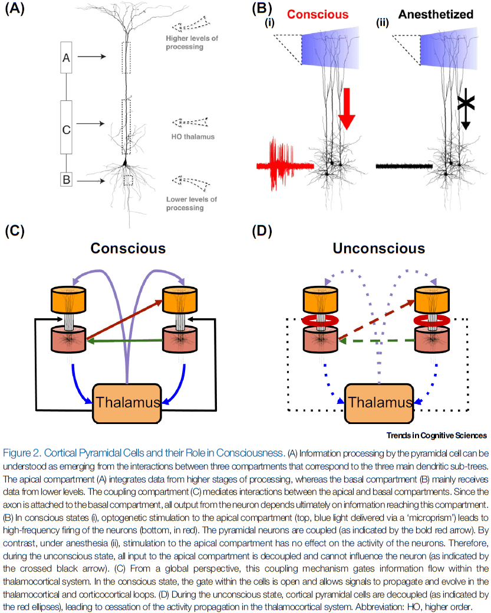
- Experimental control of L5p neurons depends on optogenetic control of the apical compartment.
- Stimulation of the apical compartment led to high-frequency firing of the neuron. However, anesthetics made this influence disappear.
- So, under anesthesia, the basal and apical compartments were decoupled.
- This result was replicated across various anesthetics that have different physiological effects and across different cortical areas, making it reasonable to hypothesize that decoupling of the pyramidal neuron is a general property of the unconscious state.
- Further experiments found that the decoupling happens around the coupling compartment and that decoupling is controlled by the input from higher order (HO) thalamus.
- Blocking metabotropic receptors also decouples the apical and somatic compartments in awake animals.
- In other words, general anesthesia and downregulation of metabotropic receptor activity at the coupling compartment have the same specific effect.
- Inactivation of the HO thalamus also led to a breakdown of the coupling, indicating that the information flow along the cortical L5p neuron is controlled by the HO thalamus.
- These results could explain why anesthesia leads to loss of consciousness, identifying the coupling compartment of the L5p cells as the crucial switch for consciousness.
- Interestingly, stimulating the HO thalamus can lead to the awakening of mice and monkeys from anesthesia and restores consciousness in patients with disorders of consciousness.
- Most theories of consciousness agree that reverberating activity in thalamocortical loops is essential for consciousness.
- Dendritic Integration Theory (DIT)
    - Explains why global dynamics of large-scale networks are different between conscious and unconscious states and why local perturbations lead to different effects depending on the state of consciousness.
    - Proposes that the decoupling of pyramidal neurons decouples the thalamocortical loops, and thus switches off the reverberating nature of conscious processing.
    - So, large-scale dynamics are the result of cellular interactions.
    - Our second main thesis is that dendritic integration in L5p cells happens in a massively parallel way across the cortical sheet, which can explain properties of conscious experience.
    - E.g. Simultaneous input to the apical and basal compartments leads to a burst of APs, signaling a match between data streams.
- DIT is compatible with the idea that the two information streams on L5p neurons are predictions and prediction errors.
- Any theory that tries to explain how the brain works should try to accommodate the fact that intrinsically, L5p cells compute the match between top-down and bottom-up information streams.
- Which cognitive streams are integrated?
- According to DIT, each cortical column is signaling to the rest of the brain whether the sensory or cognitive feature represented in that column is present (in the real or imagined world).
- Thus, processing that involves the basal compartment without being coupled to the apical compartment is nonconscious. In contrast, strong activation of the apical compartments might be able to generate conscious experiences like dreaming.
- The architecture and biophysical properties of the L5p neurons enable flexible integration of segregated data streams.
- Dendritic integration of segregated data streams might be the defining characteristic of conscious processing.
- What’s the exact role of the HO thalamus in dendritic integration and consciousness?
- It appears that HO thalamus controls coupling within the L5p neurons and, conversely, the L5p neurons convey information to the HO thalamus.
- This would also explain why the state and contents of consciousness are intertwined as contents are represented by a specific subset of L5p neurons projecting to HO thalamus, but that these L5p neurons only contribute to conscious experience when their compartments are coupled, which is controlled by HO thalamus.
- Two main claims of this paper
    - Consciousness relies on the dendritic integration of two anatomically and functionally segregated data streams.
    - Global dynamics of the conscious brain are gated by specific cellular mechanisms.

## [The evolution of the brain, the human nature of cortical circuits, and intellectual creativity](https://doi.org/10.3389/fnana.2011.00029)

- This paper discusses the issue of our humanity from a neurobiological and historical perspective.
- It’s commonly believed that the increase in complexity as our brain has evolved is the product of more microcircuits with a similar basic structure that incorporates only minor variations.
- Indeed, species-specific behaviors may arise from very small changes in neuronal circuits and we see the same in humans. The human cerebral cortex has some distinct circuits that are likely related to our uniqueness among organisms.
- Review of encephalization quotient (EQ), it’s issues, and anthropology.
- It’s important to note that for our brain to be capable of developing its impressive skills, cultural transmission and education are critical.
- There’s remarkable variability in brain size among different mammalian species.
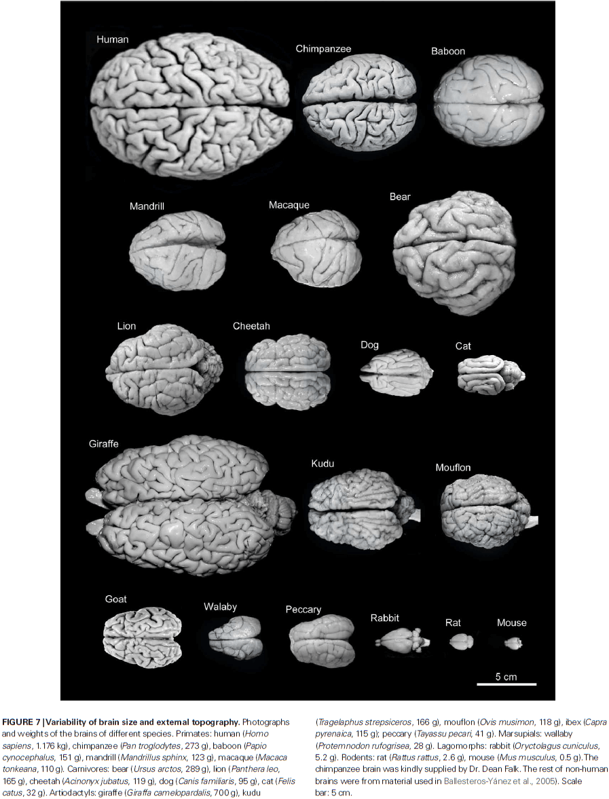
- Despite the variability in brain size, the thickness of the cerebral cortex varies relatively little between brains of different sizes and within a given brain.
- E.g. In humans, the thickest cerebral cortex, the motor cortex, can reach 4.5 mm, while in the depths of the fissures may only be 1 mm thick.
- E.g. In whales, which have a brain that weights several thousand times more than a pygmy shrew, much of the cerebral cortex is less than 2 mm thick.
- Furthermore, Nissl-stained sections are generally similar in all cortices across species.
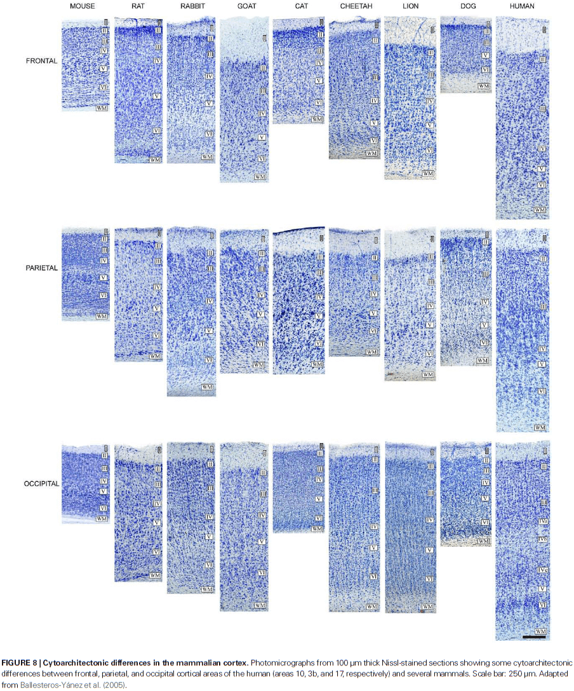
- Review of the neocortex and it’s emergence.
- While many aspects of cortical organization are maintained during mammalian evolution, some of the structural features aren’t unique to mammals, such as its laminar organization.
- E.g. The three-layer mammalian olfactory cortex and hippocampus is also found in the telencephalon of reptiles.
- Likewise, birds and mammals not only share many behavioral and cognitive traits, but it’s also been shown that a columnar functional organization exists in the auditory telencephalon of an avian species.
- However, columns aren’t an essential cortical feature and can be found in non-cortical structures too.
- One of the primary questions in neuroscience is what neural features makes humans unique?
- There are clear differences in neuron density and cytoarchitectonic organization in Nissl-stained sections when comparing species.
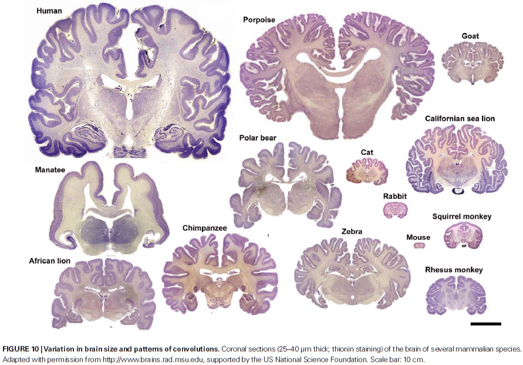
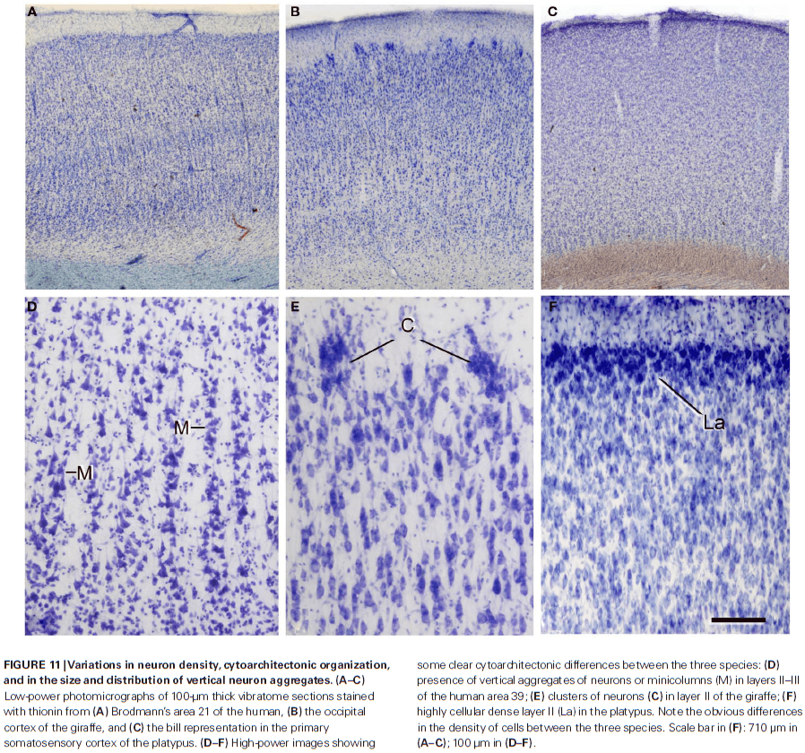
- It’s hypothesized that neurons that receive more synaptic inputs would have more complex dendritic trees, thereby increasing the distance between their cell bodies.
- There’s remarkable laminar specific differences regarding the proportion, length, and density of excitatory and inhibitory synapses.
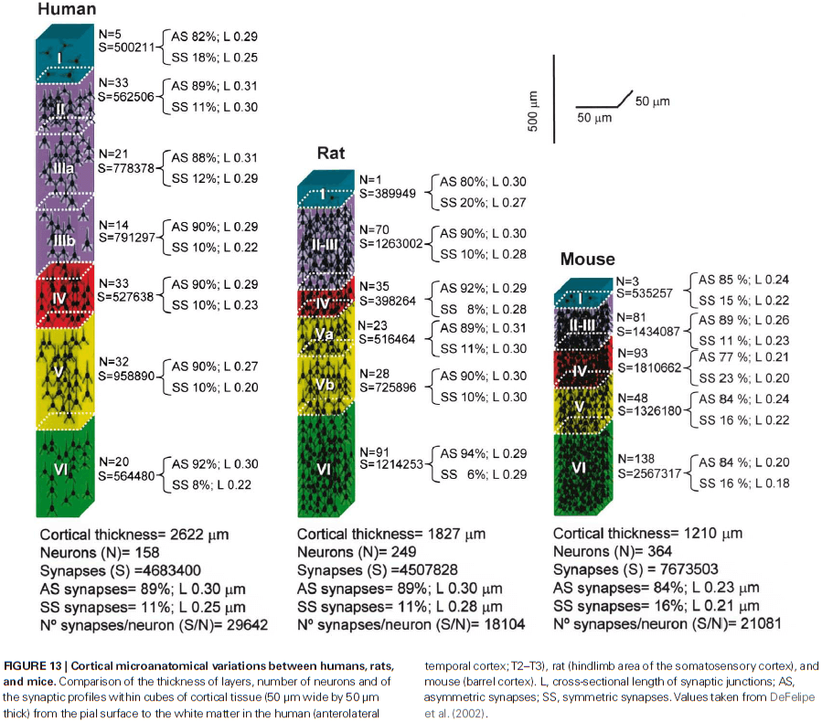
- Pyramidal cells are glutamatergic neurons located in all layers except for layer I and they’re the most abundant cortical neuron (around 70-80% of the total neural population).
- Dendritic spines in humans have 100% more volume than those in the somatosensory cortex of mice and the length of the neck is 30% longer.
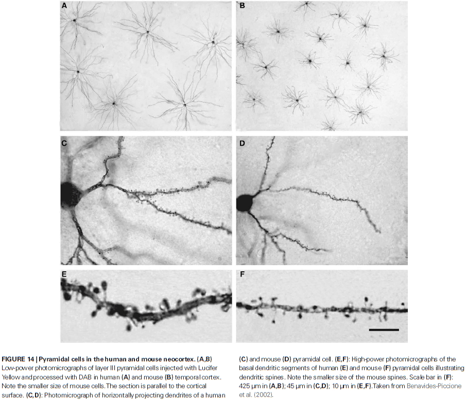
- Studies seems to indicate that with the evolution of the primate cortex, more GABA neurons and newer forms of GABA interneurons appeared in the primate cortex compared to rodents.

## [Brain, Behavior, and Mind: What do we Know and What can we Know?](https://doi.org/10.1016/s0149-7634(97)00009-2)

- Conclusions from reviewing psychological and neuroscientific findings on the mind and brain
    - Current discussions of the mind often make implicit assumptions derived from theories of Aristotle and Descartes while ignoring more recent scientific evidence.
    - Psychological studies indicate that humans are directly aware of the external world and of their own bodies but of little else.
    - There’s no clear objective criteria for assessing the existence of subjective awareness in others.
    - The theory that conventional subdivisions of the mind, such as emotion and cognition, reflect natural subdivisions of brain function are mostly false.
    - The main scientific challenge confronting neuroscience isn’t explaining the mind, but rather achieving an understanding of how neural activity generates behavior.
- What is the mind?
    - A fundamental piece of evidence of the mind’s existence is that blocking the function of the eyes and ears excludes entire categories of experience, suggesting that the eyes and ears are channels leading to some internal site (mind) where sights are seen and sounds are heard.
    - The mind is what controls behavior.
    - It’s widely held today, much as it was in Aristotle’s time, that the mind is subdivided into a number of subentities.
    - E.g. Sensation, perception, attention, imagination, emotion, moviation, memory, etc.
    - Where do these subentities come from? We’re not sure.
- What are we aware of?
    - Descartes proposed that human consciousness or thought is known directly and that the external world is known only by inference.
    - However, despite this encouraging prospect of studying consciousness through direct inspection or introspection, we don’t learn much about consciousness.
    - It’s widely understood now that much of the activity of the nervous system isn’t available to introspection.
    - E.g. Standing requires slight swaying movements that you aren’t aware of.
    - Even solving difficult intellectual problems appears to have a large non-conscious component.
    - It’s evident that accounts of one’s own mental processes may be quite inaccurate.
    - People must make use of external factors to infer the internal causes of their own behavior. If pressed to explain why they performed some particular action, people tend to invent some socially acceptable explanation.
    - E.g. Patients become aware of their own neurological deficits only after observing their own impaired behavior suggests that the internal causes of behavior aren’t open to introspection.
    - E.g. In Penfield’s experiments, neurosurgical patients are generally unaware of the presence of electrical stimulation in their cortical speech areas.
- According to Descartes, the human mind has direct knowledge of only its own thoughts and is forever imprisoned inside a brain with only indirect and imperfect knowledge of the outside world.
- However, lay people and scientists have the opposite opinion, that the external world is real and understandable, while the mind is a mysterious entity.
- The commonsense view may be closer to the truth than the theory developed by Descartes.
- E.g. When looking at a chair, you’re more aware of the chair than of the complex sensory processes occurring in your nervous system.
- What we’re aware of appears to us as an external reality, even when that reality is illusory.
- Awareness of internal states
    - Not only are we aware of the external world, but we’re also aware of internal bodily states and of our thoughts.
    - A major problem in this field is how people learn to talk about things that others have no sensory access to.
    - E.g. Children presumably learn to talk about external events by joint observation with an adult who knows how to speak, but then how does a child learn to label an internal state such as a feeling or hunger? The child can’t accompany the adult in subjective feelings.
    - In such cases, the adult must infer the presence of hunger on the basis of external factors such as the child’s behavior in eating ravenously or by the fact that nothing has been eaten for some time.
    - These external factors are correlated with the interoceptive and proprioceptive sensory information available to the child.
    - Eventually, the child learns to identify hunger on the basis of internal sensory information alone, even in the absence of the behavior of eating.
    - It seems likely that the verbal labeling of one’s own internal states is much more variable from person to person than the verbal labeling of external objects.
    - Thinking or imagination appears to be related to activation of motor processes (and their inevitable sensory consequences), which vary depending on the thought or imagination.
    - Awareness of limb movement, whether real or phantom, appears to be totally dependent on sensory feedback because if the feedback is cut off, patients can’t tell if their limb is moving or not.
    - The corollary discharge isn’t sufficient to produce a perception of movement in cut-off sensory patients.
    - Therefore, any knowledge of our movements that we have seem to be largely or entirely a consequence of feedback from proprioceptors.
    - One conclusion suggested by all of this is that what we’re primarily aware of when we consciously think or imagine anything is sensory feedback from peripheral muscle activity.
    - Maybe conscious thought and imagination are initial behavior but without the follow through.
    - There’s a general agreement that a large part of conscious human thought involves inner speech.
    - Like many motor activities, imagination is largely under voluntary control.
- The privacy of experience
    - One can’t communicate one’s own subjective experience to another person.
    - E.g. It’s impossible to explain what a mango tastes like to someone who has never eaten one. A person blind from birth can’t know what visual experience is like.
    - Without having the experience ourselves, we can’t hope to understand what it feels like to experience what someone else is experiencing.
    - Attempts to penetrate the subjective world of other species are even more hopeless as pointed by Nagel in his paper “What is it like to be a bat?”
    - It’s often suggested that the blindsight phenomenon demonstrates that visual awareness depends on the visual cortex.
    - If we take the view that the absence of appropriate speech indicates the absence of subjective awareness, then we would have to deny the existence of awareness in preverbal children, severely demented patients, aphasics, deaf mutes, and all non-human animals.
    - However, if we accept this, then why do we conclude that patients with blindsight are unconscious of visual stimuli merely because they can’t report them verbally?
    - The absence of verbal report need not mean absence of consciousness.
    - We’re no longer as certain as Descartes was that the presence of verbal assertions is necessarily proof of conscious awareness.
    - Anton’s syndrome is like the mirror of blindsight in that patients claim to see but can’t demonstrate vision on objective tests.
    - It’s clear that verbal assertions, or any behaviors, aren’t always reliable indicators of conscious experience.
- How can one distinguish a behavioral reaction that depends on physiological mechanisms alone from one that depends on both physiological mechanisms and a mental process?
- There seems to be a dissociation between memory and consciousness as we can have one without the other.
- E.g. During dreaming, we’re conscious but have no memory of the experience.
- Is it that complex behavior can occur in the absence of consciousness or that subjects were conscious but amnesic at the time of experience?
- The size of the central nervous system is often mentioned as a possible factor in the occurrence of consciousness.
- While many people wouldn’t grant our spinal cord as conscious with 13.5 million neurons, people would grant animals with fewer neurons as having some sort of consciousness.
- E.g. Crabs and insects.
- The difficulty with all proposals to establish objective criteria for conscious awareness is that they assume the very point that requires demonstration.
- E.g. It’s impossible to show that any behavioral or physiological phenomenon is correlated with awareness unless we have some previous direct means of identifying the presence and absence of awareness.
- Questions about the mind: philosophy or science?
    - It’s been said that philosophy deals with fascinating questions which have no answers, while science deals with boring questions that can be answered.
    - Which living species are conscious and which aren’t?
        - If bacteria are regarded as conscious, it would be difficult to deny the existence of consciousness in liver cells or white blood cells.
    - Must we revise our view of the universe to include a mental force capable of modifying the activity of nerve cells?
        - In split-brain patients, any conscious awareness that may exist in the right hemisphere can’t be directly communicated to the left hemisphere.
        - Further, the greatest wish of a quadriplegic or paraplegic patient can’t cross a transverse section of the spinal cord.
        - Human behavior is dependent on transmission through neurons, nothing else.
    - Where is consciousness located in the nervous system?
        - There appears to be no rational criterion for deciding whether conscious awareness is or isn’t associated with any particular part of the brain or spinal cord.
        - It’s often said that brain stem activity is related to the presence of consciousness while cortical activity is related to the content of consciousness.
        - However, no observer can have access to the subjective experience of a brain-damaged patient.
- Brain and mind
    - The author argues that ancient theories of the mind, such as perception, emotion, cognition, and memory, should be abandoned because they mislead and encourage the continued use of ineffective methods.
    - Mentalistic terms such as attention, cognition, fear, belief, or desire aren’t easily defined since they commonly refer vaguely to several distinct things.
    - We don’t need internal representations when the real world is all around us.
- Brain and behavior
    - An alternative theory to the brain-mind theory is the brain-behavior theory where we start with behavior, not consciousness.
    - Brain-behavior theories agree on the necessity of obtaining objective data and the futility of mentalistic interpretations of behavior.
    - If mentalistic concepts aren’t to be trusted as guides in working out the functional organization of the brain, how should one proceed with research in the brain-behavior field?
    - The author claims that the hippocampal formation doesn’t have any unique role in learning and memory that it doesn’t share with the rest of the cerebral cortex. However, we now know this is false because of patient H.M.
    - The theory also predicts that perception is the subthreshold activation of motor patterns by sensory input.
- To make progress in behavioral neuroscience, we must abandon ancient and inappropriate philosophical hypotheses and focus our effects on the attempt to discover the neural basis of behavior, the activities that animals actually perform in their lives.

## [The Control of Neuron Number](https://doi.org/10.1146/annurev.ne.11.030188.002231)

- Two approaches to the problem of neuron number
    - A cellular and molecular approach that focuses on final effects and final causes that regulate neuron number.
    - A broader approach on evolutionary, ecological, and bioenergetic reasons for, and consequences of, different strategies used to control the size of neuron populations in different species.
- The aim of this paper is to understand the diversity of strategies used to modify neuron number in response to natural selection.
- Neuron number at maturity
    - Octopus and small mammals have about 30 million neurons, whales and elephants over 200 billion, and human brains around 85 billion.
    - Behavioral complexity isn’t a function of body size, but rather neuron number.
    - An increase in body mass doesn’t require a matched increase in number of neurons as neurons can simply be larger or branch more widely.
    - Nonetheless, we find that larger individuals and larger species generally do have larger brains that have more neurons.
    - In contrast to the lack of data on total neuron number, much more is known about the brain weight of vertebrates.
    - Brain weight is proportional to body weight raised by a power from 0.1 to 0.8. The exponent is less than 1 in all cases showing that the increases in brain weight lags behind the increases in body weight.
    - The number of neurons and their relative density in different parts of the brain is a determinant of neural function and, thus, behavior.
    - E.g. Species with larger brains and more neurons respond to environmental changes with a greater range and versatility of behavior.
    - E.g. Newts with less neurons take two to three times as many trials to learn a maze compared to normal newts. Seasonal cycles in neuron number in the song nuclei of canaries correlates well with singing ability.
    - However, there’s no generally valid equation that relates neuron number to behavioral complexity.
    - Grouping neurons isn’t easy as the variation between neurons may be continuous and not fit discrete categories.
    - In contrast to invertebrates, unique neurons are rare in vertebrates.
    - It’s important to appreciate that mechanisms that control neuron number also control the range of variation and rates of brain evolution.
    - Not only is the variation substantial, but the degree of variation is itself highly variable.
    - Do small neuron populations show less variation than large populations? Yes.
    - Neurons are greedy cells, taking 18% of circulating oxygen in resting human brains.
    - Neurons represent a high and fixed metabolic expense, and the cost of feeding neurons and glia is one of the principal factors that constrain the total size of the neuron population.
    - The high cost of neurons in small species predicts that neuronal populations might atrophy or die when not needed and grow back when needed.
    - In contrast, large species may be able to afford an abundance of neurons even though they may have no pressing need for these cells.
    - Although this does have a small cost, the capacity to retain more neurons than needed increases the range of variation in both neuron number and patterns of deployment.
    - Maximizing variation increases the evolutionary plasticity of the lineage, which may provide a store of heritable variation.
    - It follows then that the nervous system of small species may be more efficiently designed as each individual neuron works harder.
- Control of neuron number by addition
    - In most tissues, a deficit of a particular cell type can be fixed by generating new cells, coaxing cells into the depleted region, or by modifying existing cells.
    - As a rule, this isn’t the case in the nervous system as the precursor cells capable of producing neurons are either rare or simply don’t exist at late stages of development.
    - And neurons themselves can’t divide; they’re postmitotic cells that are unable to reenter a cycle of cell division.
    - So, the number of neurons within each part of the nervous system is, with some exceptions, determined at early stages of development, often without any exposure to the environment, an odd situation for an organ system designed to deal with the environment.
    - The production and deployment of neurons has to be done the right way the first time, not easy given the extraordinary complexity of the nervous system.
    - The number of neurons generated can be controlled in two ways
        - Changing the number of stem cells
        - Changing the number of descendants each stem cell produces
    - Changes in stem cell number and descendant number can be controlled by intrinsic or extrinsic mechanisms.
    - In leeches and nematodes, neuron number is under tight control by an inflexible pattern of cell lineage.
    - As in invertebrates, the mammalian central nervous system has genes required to produce and maintain the proper number of neurons.
    - Findings suggest that specific lineages of neurons require specific genes for the regulation of cell number.
    - E.g. The number of Purkinje cells that a given progenitor will produce is as much a characteristic of that progenitor as is the morphological type of the cell.
    - Some neuronal populations continue to proliferate after maturity.
    - E.g. Arthropod sensory receptors, vertebrate olfactory receptors, and avian telecephalic neurons.
- Control of neuron number by cell death
    - One of the most counterintuitive and seemingly wasteful processes in brain development is the death of a large fraction of the initial neurons and glia.
    - Neuron death isn’t universal throughout the animal kingdom.
    - E.g. Zebrafish.
    - The elimination of neurons is most pronounced in species that undergo metamorphosis and is least pronounced in vertebrates and invertebrates that don’t metamorphose and that grow throughout life.
    - The distribution of dying cells is uneven.
    - E.g. In the mammalian neocortex, degeneration is restricted mostly to the upper layers and in the dorsal root ganglia of the spinal cord.
    - Degeneration is most severe in segments that don’t innervate the limbs.
    - The most probable reason that neurons die in nematodes isn’t to remove potentially detrimental neurons, but to reduce the organism of unneeded, metabolically demanding cells.
    - Neuron death is just the final common pathway of separate processes having separate causes.
    - In some cases, neuron death rids the brain of neurons that fail to make correct connections.
    - The point being that neuron death appears to have a major role in the final adjustments of ratios of interconnected neurons.
    - The larger the nervous system and the more disjointed the production of interconnected cell populations, the more important this fine-tuning will be.
    - Neuron loss can be viewed as contributing to an individual’s fitness by improving either the efficiency of information processing or the efficiency of metabolism.
    - The combination of overproduction and neuronal death may also provide a buffer and conserve heritable variation, thereby increasing the evolutionary plasticity of a species.
- Summary
    - It’s useful to view nervous system development as occurring in three overlapping phases.
    - The first phase is the development of a genetic nervous system. At the level of the individual, the genetic nervous system is essentially fixed, but over generations it is fluid.
    - As this genetic intent interacts within a world of cells, a real brain appears.
    - This is the second phase of the embryonic nervous system.
    - Neuron numbers are adjusted interactively by changes in proliferative potential and the severity of cell death. Cell fates are established, in part, through interactions with other cells and hormones.
    - The third and final phase of development begins when the brain starts to function with the outside world.
    - Small changes in neuron number may occur during this period, but these changes are generally of minor functional importance. At this point, the smaller elements of neuronal organization are refined in shape, number, and distribution.
    - E.g. Axons are lost or rearranged, dendrites grow, branch, and retract, synapses are fine-tuned, and receptor densities and transmitter quantities are adjusted.
    - Some of these interactions and adjustments continue until the animal dies.

## [Reverse engineering the mouse brain](https://doi.org/10.1038/nature08539)

- One main goal of neuroscience is to link the dynamics of neural circuits to behavior.
- This paper argues for a programme of reverse engineering with the aim of linking patterns of action potentials (APs) in distinct nodes of neural circuits to animal behavior.
- The circuit diagram, which shows the connections between defined groups of neurons, is necessary to decipher the function of neural circuits.
- The first step in reverse engineering is to understand the elemental components of the circuit, the cell types, typically on the basis of dendritic and axonal structure.
- In some regions of the brain, the major cell types are known such as in the retina and cerebellum. In other regions of the brain, the cell types are unknown such as the cerebral cortex.
- Each cortical layer has multiple intermingled cell types, the total number of types remains unknown.
- The second step in reverse engineering requires mapping the connections between cell types.
- Because neural circuits have evolved to support specific types of behavior, the functional logic of neural circuits can probably only be determined in the context of behavioral experiments that engage the circuits of interest.
- The third step in reverse engineering requires recording the activity of specific cell types in behaving animals.
- Assigning patterns of activity to defined nodes in the circuit diagram requires cell-type-specific methods for neurophysiology.
- However, it’s dangerous to only rely on neural activity to infer neural circuits.
- Hypotheses ultimately need to be tested by manipulating neural activity during behavior.
- The fourth step in reverse engineering requires inactivation and activation of specific cell types.
- Manipulation of defined nodes of the circuit diagram will require cell-type-specific methods for controlling neural activity.
- Such tools will allow for reverse engineering of neural circuits with the precise goal of linking patterns of activity in specific cell types, within well-defined neural circuits, to animal behavior.
- One such tool is by genetic manipulation of cell-types.
- This paper reviews recent process in the development of these molecular tools in behaving mice.
- Skipping over protein sensors and molecular switches, both of which enable the manipulation of activity in defined cell types in mice.
- Protein sensors and switches can be targeted to specific cell types using a variety of genetic methods.
- We can manipulate cell types to study the role of these neurons in normal sensation. However, stimulating subsets of neurons can also be used as a ‘synthetic stimulus’ to probe fundamental properties of neural circuits.
- In general, the relationship between cell type and response type isn’t understood.
- Cell type is a category defined mostly by development, while response type is probably malleable, changing with experience and learning.
- What a disappointing paper.

## [The rose and the fly. A conjecture on the origin of consciousness](https://doi.org/10.1016/j.bbrc.2020.11.005)

- This paper addresses the problem: why do conscious experiences exist?
- Thomas Reid conceived cognition of external objects as made up of two aspects
    - Awareness of the object being perceived
    - Belief in the existence of the object perceived
- The smell of a rose signifies both a sensation and a perception.
- Sensation is the conscious experience of the smell that we feel without any relation to the existence of an external object.
- Perception is the recognition of the presence of an object, the rose itself.
- Sensation represents a change in the state of the body, while perception involves representing external objects outside of the body.
- The distinction between sensation and perception goes unnoticed in ordinary life but becomes apparent in certain neurological conditions.
- E.g. Blindsight is impaired sensation but normal perception, while agnosia is impaired perception but normal sensation.
- Efference copy: every time the brain generates a command to move, a duplicate copy of the signal is sent to the sensory system.
- The brain uses the efference copy to compare between the expected and actual movement, a feedback mechanism to ensure correct movement.
- It’s likely that our phenomenal experience of the world may be closely related to the mechanisms we use to act upon it.
- The idea of an efference copy provides a general solution to a problem that all organisms face: that of disentangling otherwise identical sensory inputs generated by something happening to them (sensation) from those generated by something happening out there (perception).
- E.g. In earthworms, sudden stimulation of numerous receptors will cause a withdrawal reflex, yet if the worms crawl on their own there is no reflex. Thus, the worm nervous system must be distinguishing internally from externally generated stimulation.
- The efference copy provides the biological mechanism for the distinction between sensation and perception by tracking the origin of sensations.
- Since the organism can now distinguish itself from what happens to it and what happens out there, the organism can actively represent itself with respect to the outside.
- It’s only after the invention of the efferency copy, made necessary by the development of active locomotion, that the bodily reaction counts as a sensation, that it begins to feel.
- Time plays a critical role as the efference copy anticipates the arrival of the sensory signal so there’s no delay between prediction and sensation. If there’s no prediction, then the sensation comes as unexpected and thus external.
- We can inverse the idea of the efference copy, going from it predicting sensory stimulation as a result of movement to predicting motor consequences that follow from sensory activity.
- What we call feeling may be nothing more than the outcome of the comparison between the efference copy of the sensory/bodily response and the efference copy of a motor action.
