## [Recent Advances in Electrical Neural Interface Engineering: Minimal Invasiveness, Longevity, and Scalability](https://doi.org/10.1016/j.neuron.2020.10.011)

- This paper reviews some of the latest progress in electrical neural interfaces, emphasizing advances in the spatiotemporal resolution, and extent of mapping and manipulating brain circuits.
- First, we cover electrode design and strategies for long-term and large-scale recordings.
- Second, we address the need for electronics to be custom designed for wireless, bidirectional transfer of data and power to the device.
- Third, we outline how the combination of electrical and optical methods widens possibilities to address the demands of spatiotemporal scale.
- Finally, we elaborate on the analytical methods to extract features from large-scale electrical recordings.
- Three challenges to electrical neural interface design
    - Spatial scale
        - Neural circuits span wide spatial scales in the brain.
        - E.g. From neurons to neuron clusters to brain regions.
        - On the microscale, we need high spatial resolution in 3D to capture local information processing due to the density of synaptic connections (3000-10000).
        - On the macroscale, we need large and distributed coverage to detect neural dynamics at high resolution across multiple regions.
    - Temporal scale
        - Neural activity occurs across broad time scales in the brain.
        - E.g. Synaptic strength (seconds), circuit remodeling (days to months), development and degeneration (years).
    - Anatomical diversity
        - Brain structure and organization is remarkably different across species and individuals.
        - Functionally distinct brain regions have unique anatomical organization.
        - E.g. Tissue geometry, cell types, cell density, cell shape and complexity.
- Intracortical electrode design
    - Implanted electrodes enable the detection of individual neurons at high temporal resolution in living brains.
    - The recording sites transduce signals from the current flow through the extracellular space during the propagation of action potentials (APs), providing enough high temporal resolution to resolve the activity of individual neurons near the electrode.
    - Classic intracortical electrodes often face difficulties to record high quality neural signals over both short and long timescales.
    - Substantial changes in recording conditions are the main culprit.
    - E.g. Micro-movements, biotic and abiotic failures, and sustained foreign body reactions.
    - Another issue is that brain tissue is soft while most neural electrodes are significantly more rigid, resulting in substantial tissue reactions at the interface between brain tissue and implanted device.
    - E.g. Blood brain barrier (BBB) leakage, neuronal degeneration, and glial scaring.
    - We can work around this problem by making neural probes with features that more closely resemble those of their biological host.
    - E.g. Reducing microwire diameter from 50-75 mm to 15 mm reduced neuronal cell death and glial scarring.
    - Alongside the development of miniaturized intracortical electrodes, increasing effort has been made to develop flexible electrodes.
    - However, these materials are still 6-7 orders of magnitude stiffer than brain tissue, so the mismatch between brain and electrode remains significant.
    - A key issue is that materials that are as soft as brain tissue typically don’t have the necessary properties to function as an electrode such as electrical insulation and mechanical strength.
    - A series of studies fabricated neural electrodes at 1 micrometre, which provided ultra-flexibility and seamless integration with the host tissue.
    - Intracortical electrodes can only detect and distinguish activity of nearby neurons, therefore, to record from large populations of neurons, we need to implant a large array of electrodes.
    - This risks tissue displacement and injury.
    - Three directions to develop high-density neural electrodes
        - Reduce device footprint.
        - Improve microfabrication of high-density, highly integrated silicon neural probes.
        - Pattern high-density contact arrays on flexible substrates.
    - The need for neural electrodes to
        - Flexibly distribute large numbers of recording sites to target both local and distributed circuits,
        - Minimally disrupt the integrity of neural tissue, and
        - Track activity across timescales ranging from seconds, months, or years,
    - Has fueled the exciting development of a variety of novel neural electrodes in recent years.
    - As yet, no single device meets all of these requirements.
- Power, Data, and Communication
    - Advances in electrodes must accompany advances in wireless power and data transfer between the implanted device and a local transmitter/receiver.
    - While we can transfer power and data through wires, this results in limited movement and opens paths for infection.
    - These challenges have led researchers to look for options to transfer power and data to and from neural implants wirelessly.
    - Three major components of transmitting wireless data and power
        - A base station that processes data and determines the appropriate stimuli to be delivered.
        - A transmitter that communicates with the implant and the base station.
        - A neural implant that interfaces directly with the target tissue to stimulate or record neural activity.
    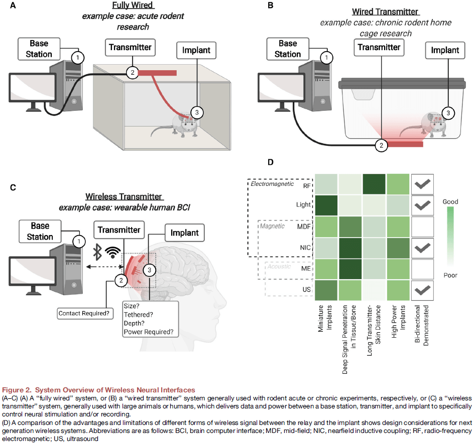
    - While the link between the base station and transmitter may be wired or wireless, a significant challenge is the link between the transmitter and implant.
    - Three different wireless communication techniques
        - Electromagnetic
        - Magnetic
        - Acoustic
    - Tissue absorption of the electromagnetic wireless signal is a specific challenge in the link between transmitter and implant.
    - Magnetic fields at 13 MHz suffer little tissue absorption but the power gathered depends on the coil area and alignment with the transducer.
    - Ultrasound (US, 1.85 MHz) has emerged as an alternative for wireless power transfer using safe levels of pressure waves to deliver power to a small implanted piezoelectric crystal.
    - US can be used to transfer data back using the reflection of ultrasound waves that travel back to the US transmitter/receiver.
    - However, one issue with US is that it needs to be in direct contact with the body using impedance matching gels or foams.
    - The use and combination of these different power-transfer techniques lead to three general classes of wireless implants with different degrees of invasiveness.
        - A shallow wireless link between a transmitter on the scalp and a receiver below the skin.
        - A deep wireless link to subcortical device via a relay implanted beneath the skull.
        - A deep wireless link directly between a transmitter on the scalp and subcortical implant.
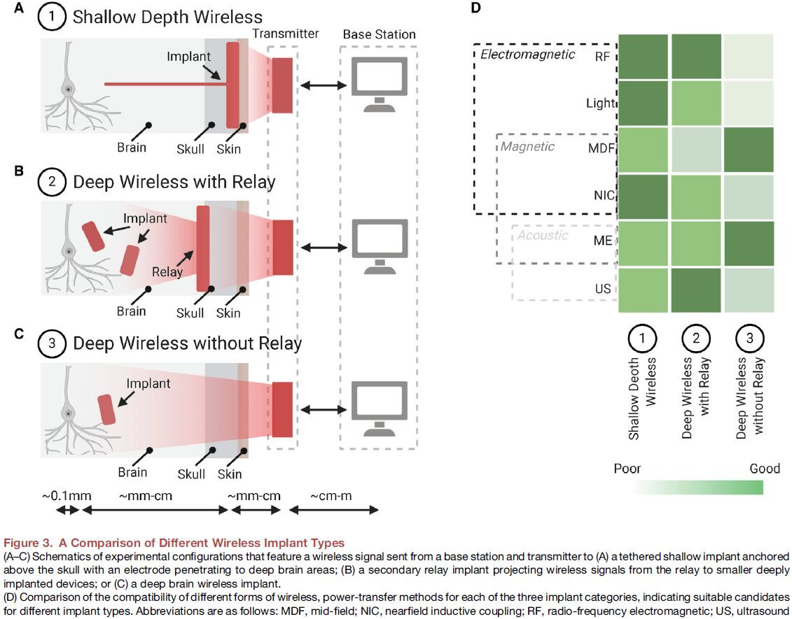
- Electronics for Neural Interfaces
    - Five building blocks
        - Amplifier
        - Filter
        - Analog-to-digital converter (ADC)
        - Stimulator
        - Communication interface
    - Typical neuronal signals are weak, ranging from tens of millivolts to several microvolts, and thus require amplification.
    - Depending on the signal of interest, field potentials or action potentials, spectral filtering is often necessary to reject interference and noise outside of the desired frequency band.
    - Computers can only process and store digital information so an ADC is used to convert from analog neuronal waveforms into binary digital streams.
    - Neurons can be stimulated using current or voltage pulses, which are generated by a programmable stimulator.
    - Two classes of neural interfaces
        - Brain-machine interfaces (BMI) require a high channel count and fine spatiotemporal resolution to enable large-scale and high-density monitoring of neural activities. The design emphasizes low power consumption and a small footprint.
        - Miniaturized neural implants for recording and stimulation of a small region of the nervous system typically requires fewer channels compared to a BMI but prefers untethered operation.
    - Despite the many benefits provided by digitizing recorded signals, ADCs come with high power consumption.
- Bi-modal Electrical-Optical Neural Interfaces
    - Skipping over this section due to disinterest.
- Neural Data Processing
    - Broadband signals acquired by neural interfaces generally have two types of voltage signals.
    - The high-frequency spikes (300 Hz to 10 kHz) are the extracellular APs generated by individual neurons as measured by intracortical microelectrodes.
    - The low-frequency field potentials (<1 Hz to 300 Hz) derive from a population of neurons in a small volume of tissue.
    - Spike sorting: the process of detecting spiking events and assigning different spike waveforms to neurons.
    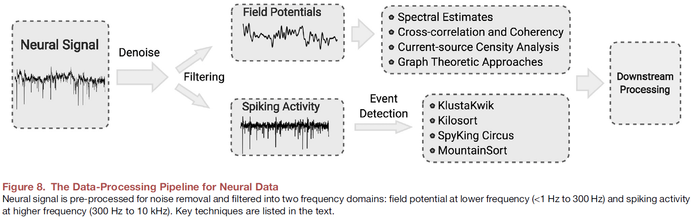
    - Preprocessing is done on the signal to ensure that it doesn’t covary due to non-biological confounds such as electrical cross-coupling, line noise, or artificial splitting.
    - Two remaining challenges
        - Overlapping spikes
        - Drift
    - Importantly, depending on the goal or question, spike sorting can be skipped altogether by instead using multi-unit threshold crossings to estimate low-dimensional neural population dynamics.
    - Extracellular field potentials reflect the activity of a population of neurons and are called electroencephalograms (EEG) when measured at the scalp, electrocorticogram (ECoG) when measured with subdural grid electrodes, and local field potentials (LFP) when measured using invasive electrodes.
- In recent years, electrical neural interfaces have been developed to support the interrogation of highly complex brain circuits that can involve vast numbers of neurons at diverse spatiotemporal scales.
- This review discussed exciting advances in multiple areas of electrical neural interface development such as the design of neural electrodes, novel mechanisms that permit wireless interfaces, specialized ASICs, integration of electrical interfaces with optical methods, and the creation of algorithms to extract features from neural recordings.
- The application of these advances has improved our capability to interact with the nervous system.

## [Compromise of Auditory Cortical Tuning and Topography after Cross-Modal Invasion by Visual Inputs](https://doi.org/10.1523/JNEUROSCI.6524-11.2012)

- Brain damage can induce reorganization of sensory maps in cerebral cortex.
- Previous research has focused primarily on adaptive plasticity within the affected modality, but less focus has been given to maladaptive plasticity that may arise as a result of invasion from other modalities.
- Changes in sensory input can result in plastic changes to sensory pathways.
- Although cross-modal (XM) plasticity is a common outcome of sensory loss, it has received less study than unimodal plasticity.
- One reason to study XM plasticity is for optimizing rehabilitation.
- We previously found that the auditory cortex (AC) of ferrets after unilateral neonatal midbrain damage contains neurons that respond to a single modality (auditory and visual neurons) and to both modalities (bisensory neurons).
- Because these different response types are distributed randomly within cross-modal auditory cortex (XMAC) rather than in a segregated manner, communication between unimodal neurons might be disrupted by neighboring XM neurons.
- This paper tests whether competition from visual inputs compromises auditory tuning and topography in XMAC using in vivo single-unit recordings in anesthetized ferrets.
- We found that auditory tuning and tonotopic mapping in auditory cortex are impaired after XM plasticity.
- These results provide support for the hypothesis that competition between auditory and visual inputs after XM plasticity underlies the compromised auditory function in patients with partial hearing loss, and it also explains why blind humans often have improved auditory function.
- Skipping over materials and methods section.
- We’re interested in whether residual auditory function is compromised by invasion of visual inputs. Because damage to both auditory and visual midbrain is necessary to induce XM plasticity, it’s important to establish whether AC function was impaired by anomalous visual inputs, loss of auditory inputs, or both.
- Are the changes in XMAC caused by auditory deafferentation or by visual activation?
- To separate these possibilities, we designed a blind-lesioned group that had the same neonatal midbrain lesions as XM animals but no visual inputs as a control for the effect of visual activation of XMAC.
- Thus, the study contained four groups
    - Normal
    - Cross-modal (XM)
    - Blind-lesioned
    - Blind
- Findings
    - Residual midbrain volume of XM animals wasn’t significantly different from the residual midbrain volume of blind-lesioned animals.
    - Auditory and multisensory neurons in AC of XM animals were tuned to pure tones.
    - Visual inputs affect the threshold of auditory and multisensory cortical neurons to sound.
    - Auditory neurons in AC of XM animals had broader tuning to sound frequency than auditory neurons in normal AC.
    - Multisensory neurons in AC of XM animals had a longer latency response to sound stimuli than unisensory auditory neurons in either normal AC or XMAC.
    - Neurons in XMAC and AC of blind-lesioned animals retain selectivity for sound frequency despite the significant early damage to the auditory midbrain (inferior colliculus).
    - The tonotopic organization of auditory and multisensory neurons was altered by XM plasticity.
        - High-, mid-, and low-frequency auditory neurons in XMAC were scattered rather than being arrayed along the mediolateral axis as seen in normal animals.
        - This suggests that auditory tonotopy was severely disrupted by the visual invasion into AC of XM animals.
    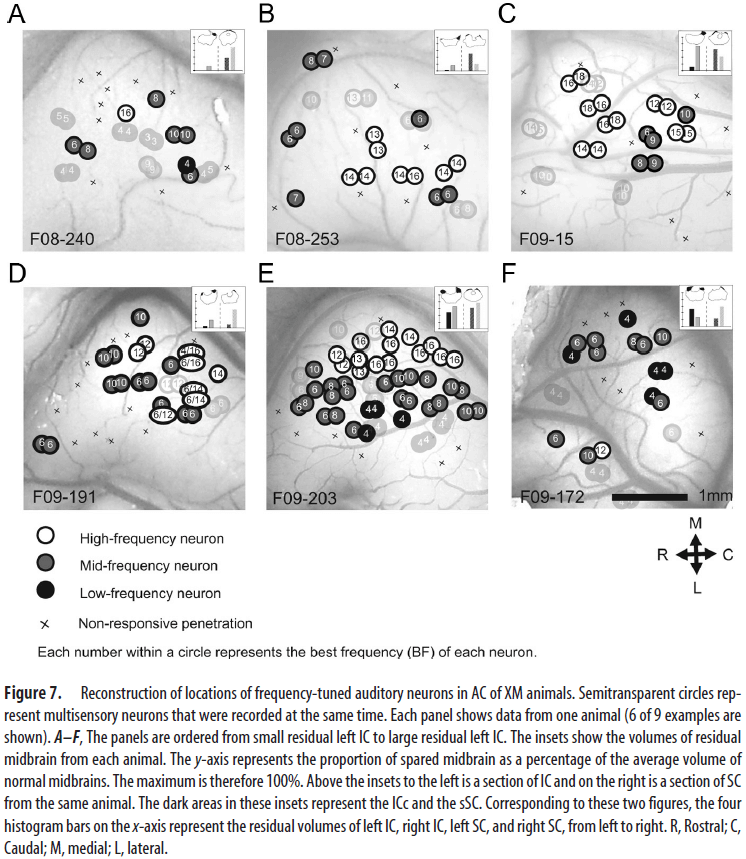
    - Visual inputs lead to a disrupted topography of frequency-tuned neurons in XMAC.
    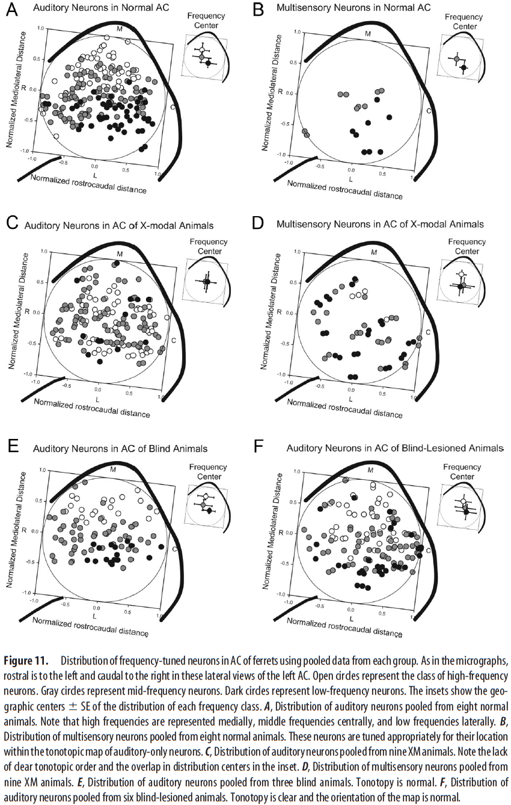
    - The frequency distribution of tuned neurons wasn’t changed by XM plasticity.
- We found considerable auditory functions in XMAC in that most neurons respond to sound and have a preferred frequency.
- However, the sensitivity to sound, the sharpness of tuning, and the organization of the tonotopic map in XMAC are impaired.
- Results from the blind-lesioned control group show that it’s the anomalous visual input to auditory cortex, and not simply deafferentation of the auditory pathway, that’s responsible for the impairment of auditory function.
- This suggests that loss of input to auditory thalamus can be compensated for during recovery.
- In the blind group, the auditory map was normal but the sensitivity of auditory neurons to sound was increased, suggesting that visual impairment can boost auditory processing ability as also seen in blind humans.
- As in patients who can perceive their amputated limb after surgery, tinnitus patients may hear phantom tones in a quiet environment.
- Thus, phantom limb syndrome and tinnitus may both be triggered by XM inputs. The same goes for synesthesia.
- It’s possible that auditory neurons receiving direct thalamocortical auditory input are less likely to receive XM visual inputs. The competition between afferents may push visual afferents to innervate neurons that receive corticocortical auditory connections, giving those neurons longer auditory latencies.
- Multipeaked auditory neurons appear in XM and blind-lesioned animals that had more than one best frequency, creating multiple peaks in their tuning curves.
- The creation of multipeaked tuning curves in XMAC implies that auditory neurons in XMAC have lost considerable frequency specificity as a result of the loss of some auditory input and gain of visual input.
- Basic auditory cortical response properties in the inferior-colliculus-lesioned blind animals are essentially intact, independent of any contribution from the visual pathway, suggesting that compensatory plasticity can substantially rebuild auditory function after deafferentation.
- In conclusion, these findings provide additional evidence that, although the auditory cortex can recover from neonatal deafferentation in some respects, its function is impaired by ectopic XM visual inputs, suggesting that minimization of XM activity may improve the chances of a successful outcome in patients with lost sensory input.

## [All brains are made of this: a fundamental building block of brain matter with matching neuronal and glial masses](https://doi.org/10.3389/fnana.2014.00127)

- How does the size of neuronal and glial cells that compose brain tissue vary across brain structures and species?
- Previous studies have found that average neuronal size is highly variable while average glial cell size is more constant.
- E.g. Average neuron mass varies by over 500-fold across brain structures and species, while glial cell mass varies only by 1.4-fold.
- Two fundamental and universal relationships apply across all brain structures and species
    - The glia/neuron ratio varies with the total neuronal mass in the tissue.
    - The neuronal mass per glial cell varies with average glial cell mass in the tissue.
- We propose that there’s a fundamental building block of brain tissue: the glial mass that accompanies a unit of neuronal mass.
- We argue that the scaling of this glial mass is a consequence of a universal mechanism where numbers of glial cells are added during development, regardless of whether the neurons composing it are large or small, but depend on the average mass of the glial cells being added.
- Brain tissue is composed of three cell types
    - Neuronal
    - Glial
    - Endothelial
- There must be biological rules that determine the number of cells of each type but little is known about such rules.
- Neurons are the smallest separable units of information processing in brains.
- The development of the isotropic fractionator made feasible the precise measurement of total number of neuronal and non-neuronal cells in brain structures.
- All cell numbers were obtained using the same method of isotropic fractionator.
- For simplicity’s sake, we will now refer to non-neuronal cells as “glial” cells with the understanding that our model ignores an estimated 2-4% of brain volume occupied by vasculature.
- While different neuronal scaling exponents apply to different structures and different mammalian orders, similar glial scaling exponents apply across structures, species, and orders.
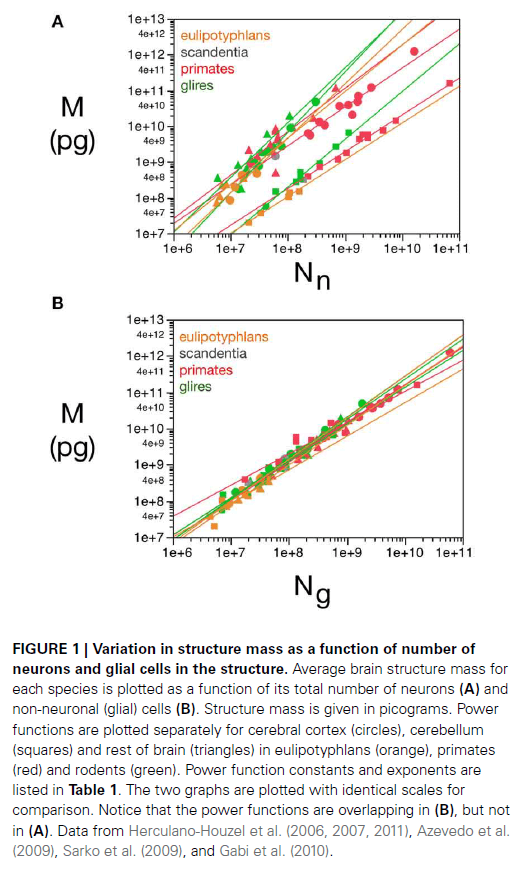
- This suggests that the average neuronal mass differs across structures, species, and orders, but that the average glial cell mass is mostly invariant for each structure, species, and order.
- Skipping over the math of the paper.
- Average neuronal cell mass in a structure increases with the number of neurons in the rodent brain, while no correlation is found for any structure across primate species.
- The glia/neuron (G/N) ratio in any brain structure depends simply on the average size of the neurons in that structure.
- The total glial mass in a structure is added in a similar way to all brain structures in all species that matches precisely the total neuronal mass in that structure at a certain ratio.
- In other words: For every unit amount of neuronal mass, there’s a matching unit amount of glial mass in a predictable manner.
- Results suggest that numbers of glial cells are added to match the total neuronal mass in the tissue.
- The quantitative match between the total glial mass in a structure and the total neuronal mass can be thought of as a fundamental building block of brain tissue across species and orders where a certain amount of neuronal matter is assigned to each glial cell (or vice-versa).
- Neuronal cell size varies tremendously across brain structures and species but in contrast, average glial cell size varies only modestly.
- These estimates are consistent with the enormous diversity of neuronal cell types compared to the modest diversity of glial cell types.
- We propose that the relationship between the G/N ratio and average neuronal cell mass is a universal property of any brain tissue.
- Our model shows that all brain structures analyzed are mostly neuronal in their mass, with a neuronal mass fraction that ranges between 60-80%, while glial mass fraction ranges between 40-20% respectively.
- Individual glial cells provide functional support to an amount of neuronal tissue that varies in mass from just slightly more than the glial cell itself up to a few times it own mass.
- The neuronal mass supported by each glial cell is a universal function of average glial cell size across brain structures and species.
- There appears to be universal mechanisms that determine
    - The amount of neuronal tissue that’s taken care of by each glial cell, which depends on small variations in average glial cell mass.
    - The G/N ratio, which depends on large variations in average neuronal cell mass.
- The relationship we describe here indicates an upper limit to how much neuronal mass a single glial cell can support, which makes physiological sense.
- This also implies that brain tissue, regardless of the structure, is constructed in a way that’s limited by the extent of support that each glial cell can provide to neurons in the area, which in turn, depends on the average mass of individual glial cells.
- The shared glial scaling rules are evidence that while neurons have been mostly free to vary in morphology and physiology during evolution, there’s strong selective pressures that must have kept glial cell variability to a minimum such that only a few different astrocyte and oligodendrocyte types are recognized.
- Such strong selective pressure against glial cell variability implies that the functions exerted by these cells are so fundamental for brain physiology that they can’t really be modified without compromising brain viability and the survival of the individual.
- Only three variables are necessary to determine the cellular composition and final mass of any mammalian brain structure.
    - Average glial cell mass
    - Average neuronal cell mass
    - Number of neurons
- From these three variables, all other cellular properties of the tissue are derived.
- The evolutionary developmental model of brain construction that we propose is based on the fact that brain parenchyma is initially almost entirely neuronal in development.
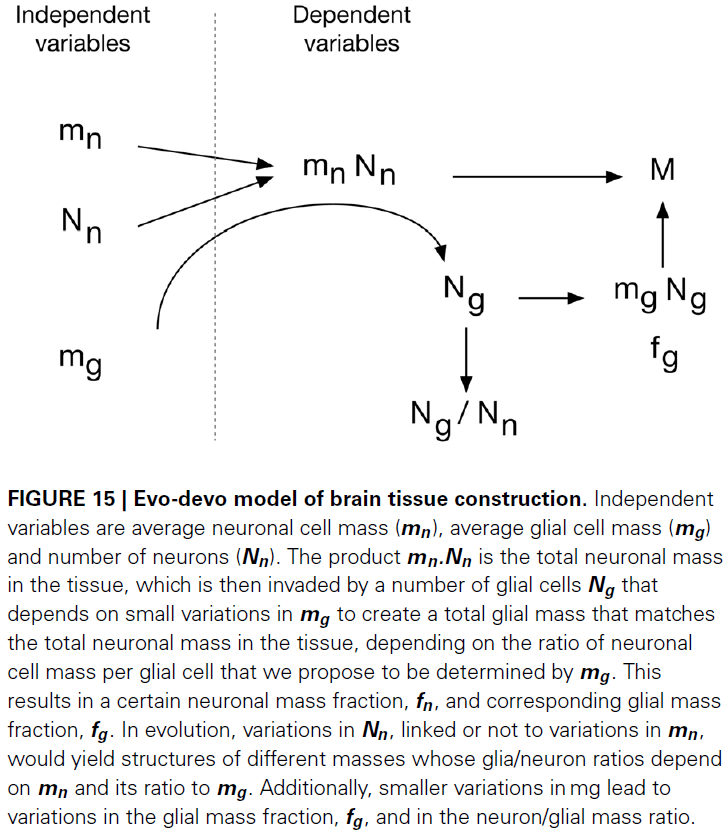
- Number of neurons + Pre-determined average neuron size → Total neuronal mass.
- This neuronal mass is invaded by glial cell precursors, which then generate glial cells of a predetermined average size and in a number that depends on their average size.
- We propose that the matching of total glial to total neuronal mass is the mechanism that determines the total number of glial cells that will compose the tissue.
- Therefore, the ratio between glia/neuron numbers is simply a result of this matching of glial to neuronal mass in the tissue, yielding a glia/neuron ratio that varies with average neuronal cell mass but depends more precise on the ratio of average neuronal to glial cell mass.
- It seems likely that the total glial mass in the tissue is matched to the total neuronal mass simply by the regulation of glial progenitor proliferation.
- We propose that the universal relationship between the amount of glial mass that accompanies a unit of neuronal mass, which we call the fundamental building block of brain tissue, is a consequence of a universal mechanism whereby numbers of glial cells are added to the neuronal parenchyma during development, irrespective of whether the neurons composing it are large or small, but depends on the average mass of the glial cells being added.

## [Cortical mechanisms of colour vision](https://doi.org/10.1038/nrn1138)

- Color is important because it facilitates object perception and recognition.
- Despite the long history of studying color vision, we still have much to learn about the physiological basis of colour perception.
- Studies are starting to indicate that color isn’t processed in isolation, but together with information about luminance and visual form by the same neural circuits to achieve a unitary and robust representation of the visual world.
- Rods and short-wavelength (S)-cones are phylogenetically older, the long- (L) and middle- (M) wavelength cones evolved from a common ancestral pigment only about 35 million years ago, probably for the benefit of an improved diet of ripe red fruit rather than for green leaves.
- Trichromacy implies that the effect of any light on the visual system can be described by three numbers: the excitation it produces in the L-, M-, and S-cones.
- Cones act like photon counters where information about the wavelength of each individual photon is lost to each photoreceptor, but is instead captured by the type of receptor.
- For each cone, information about wavelength and intensity are confounded/mixed.
- At the next stage of processing, the visual system compares the signals from the different cones to compute the color of objects.
- In the retinal ganglion cells, three channels convey information from the eye to the brain
    - L+M or luminance channel: signals from L- and M-cones are added to compute the intensity of a stimulus.
    - L-M color-opponent channel: signals from L- and M-cones are subtracted from each other to compute the red-green component of a stimulus.
    - S-(L+M) channel: the sum of L- and M-cone signals is subtracted from the S-cone to compute the blue-yellow component of a stimulus.
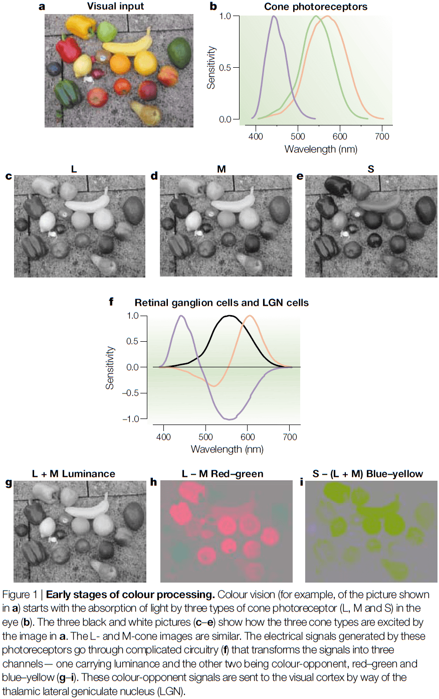
- Thus, ganglion cells transform raw cone signals into color-opponent signals.
- These three color-opponent signals or channels, the cardinal directions of color space, are functionally independent and are transmitted in anatomically distinct retino-geniculo-cortical pathways.
- E.g. Cells in the magnocellular layers of the lateral geniculate nucleus (LGN) are mostly sensitive to luminance information, cells in the parvocellular layers are mostly sensitive to red-green information, and cells in the koniocellular layer are mostly sensitive to blue-yellow information.
- Color opponency is computationally important because it removes the inherently high correlations in the signals of the different cone types.
- Most low-level visual functions depend heavily on the magnitude of the input signal as nearly all neurons in the visual system give faster and stronger responses to stimuli of higher contrast.
- In addition to working as well as the luminance system in many tasks, the color vision system excels at visual detection.
- E.g. Picking out red spots of light on a neutral gray background.
- Although small changes in luminance are hardly noticeable, color changes with equally large cone contrasts can appear quite noticeable.
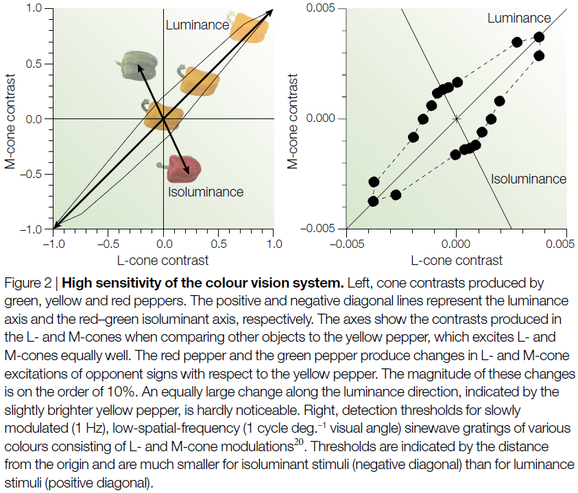
- We can conclude from these experiments that color is what the eye sees best.
- Why did trichromatic color vision evolve?
- One answer is that detecting ripe red fruit against green foliage is improved when using the L-M color-opponent channel.
- However, we also find that color vision significantly improves the speed of object recognition and significantly improves memory for the same scenes.
- Chromatic induction: when two stimuli reflect the same spectral distributions of light and lead to the same local pattern of cone excitations, but result in different color percepts.
- On the flip side, different spectral distributions of light can lead to the same color percept, a concept called color constancy.
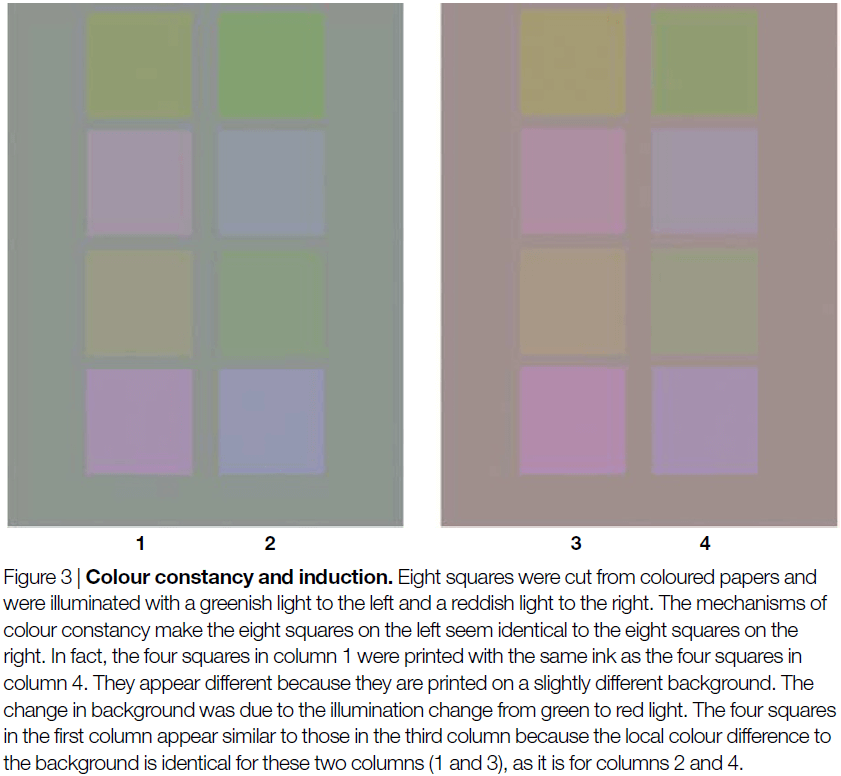
- Two types of color-selective neuronal responses
    - Responses that correlate with the ratios of retinal cone excitations
    - Responses that correlate with our percept
- Cells that add L- and M-cone inputs are called luminance cells, and cells that subtract L-, M- or S-cone inputs are called color cells.
- With this definition, many luminance cells would also give different responses to color changes, and many color cells would respond to changes in luminance.
- The proportion of color-selective cells is estimated to be about 50% in the early visual areas of macaque monkeys with little differences between V1, V2, V3, and V4.
- Past studies assumed that there were two distinct subpopulations of cells, one responding only to luminance and the other only to color.
- However, the picture that emerges from many recent studies is that there’s a continuum of cells varying from cells that respond only to luminance to a few cells that don’t respond to luminance at all.
- Thus, results clearly indicate that in the cortex, the analysis of luminance and color isn’t separated.
- In visual cortex, unlike the LGN, the distribution of a cell’s preferred colors doesn’t clearly cluster around particular directions in color space.
- E.g. LGN color-selective cells prefer stimuli along the cardinal red-green or blue-yellow directions. By contrast, cells in the cortex have preferences for many other hues.
- Color can be useful for identification because unlike other visual features, such as shape, colors don’t change under different viewpoints.
- E.g. Rotation and translation don’t change color.
- However, different illumination conditions do change how we view an object.
- Only the proportion of light reflected by the object at each wavelength is an inherent property of each object.
- The visual system has several mechanisms, both retinal and cortical, to discount changes in illumination.
- E.g. Light adaptation in single cones and local contrasts between adjacent cones such as lateral inhibition. Another powerful cue for color constancy seems to be the average color over a large region of the scene.
- Double-opponent cell: a cell that measures the chromatic contrast between centre and surround.
- These double-opponent cells respond best to edges defined by chromatic and luminance differences, which matches the real world as most edges combine both luminance and chromatic differences.
- Double-opponent cells represent a big step towards the neural correlates of color constancy, however, they’re probably only a part of color constancy.
- Is color computed separately from other visual attributes, such as form, motion, or depth, or are these computations carried out simultaneously?
- This question needs to be answered separately for each level of processing.
- Review of the ventral and dorsal visual pathways.
- Segregation hypothesis: the independent processing of visual attributes is maintained between the retinogeniculate pathway and extrastriate cortex.
- The anatomical organization revealed by cytochrome oxidase (CO) staining shows that color signals are processed, in V1 and V2, by a population of unoriented neurons located primarily in the CO-rich blobs of V1 and the thin bands of V2.
- For each visual attribute, we don’t find a clear and extreme segregation of attribute to CO-compartment.
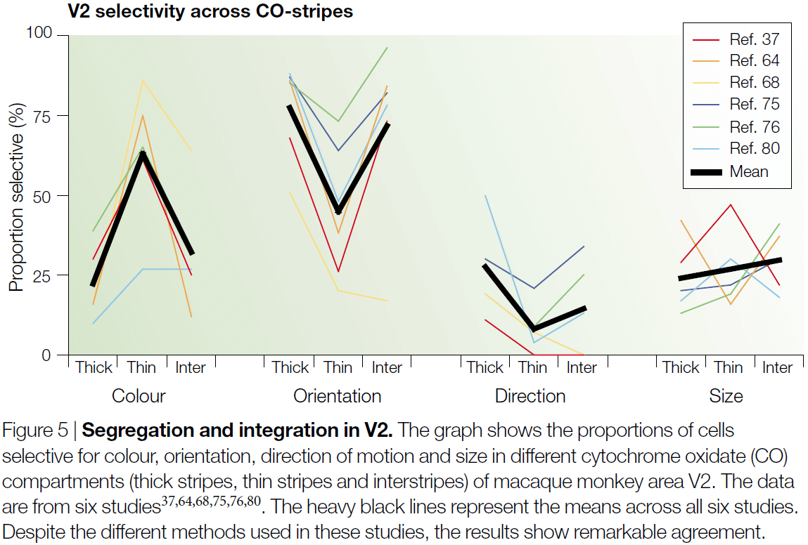
- Instead, about 60% colour selectivity is found in cell in the thin stripes and around half of that in the thick strips and interstripes.
- Given that there’s almost complete segregation of colour responses in the LGN, with no color selectivity in magnocellular layers, and that early studies of V1 reported almost complete segregation of the blob and interblob systems, it was assumed that V2 would be the first stage to integrate the different systems.
- However, recent experiments have found that there’s just as little segregation in V1 as there is in V2.
- Is there a ‘color centre’ in the cortex?
- Some patients develop cerebral or acquired achromatopsia after damage to visual cortex.
- This is the case when patients have a specific deficit of color vision with hardly any impairment of form vision.
- If this is the case, then we might expect to find an area of the brain where neurons respond mostly to color, a color centre.
- Color-selective neurons are concentrated in the parvocellular layers of the LGN and lesions to this layer lead to a severe deficit in color vision while most other aspects of vision are intact.
- Interestingly, lesions to the magnocellular system also leave most of vision intact, even functions that are usually associated with that system.
- So is achromatopsia due to damage to the parvocellular layers of the LGN?
- Most human patients with cerebral achromatopsia have lesions in area V4 and while it’s tempting to conclude that this is the color centre of the brain, the situation is much more complicated.
- Despite the large number of patients studied, there’s no well documented case of cerebral achromatopsia without any other visual defects.
- Area V4, both in monkeys and in humans, isn’t only responsible for color vision, but is also important for all aspects of spatial vision and integrates vision, attention, and cognition.
- We can say with certainty that V4 is important for color vision, but it seems unlikely that it’s devoted solely to the analysis of color.
- As is the case for most other visual attributes, our experience of color probably depends on the activity of neurons in several cortical areas.

## [Causes and consequences of representational drift](https://doi.org/10.1016/j.conb.2019.08.005)

- The nervous system learns new associations while maintaining memories over long periods, balancing between flexibility and stability.
- Recent experiments reveal that neuronal representations of learned sensorimotor tasks continually change over time, even after animals achieved expert-levels of performance.
- How is behavior consistent despite ongoing changes in neuronal activity?
- This paper highlights recent experimental evidence for representational drift in sensorimotor systems and discusses how this fits into the framework of distributed population codes.
- We also argue that the recurrent and distributed nature of sensorimotor representations permits drift while limiting disruptive effects.
- The apparent instability of neuronal responses for fully learned tasks challenges the view that synaptic connectivity and individual neuronal responses correlate directly with memory.
- Recent experiments have found that neuronal representations of familiar environments and learned tasks reconfigure or “drift” over time.
- Representation: neural activity that’s correlated with task-related stimuli, actions, and cognitive variables.
- E.g. Single-cell receptive fields or population activity vectors that guide behavior.
- Representational drift: ongoing changes in these representations that occur without obvious changes in behavior.
- E.g. In mice who learned to navigate a T-maze, neurons tend to be transiently active during task trials, with different neurons active at different parts of the trial. The posterior parietal cortex (PPC) representation wasn’t stable over multiple days and weeks.
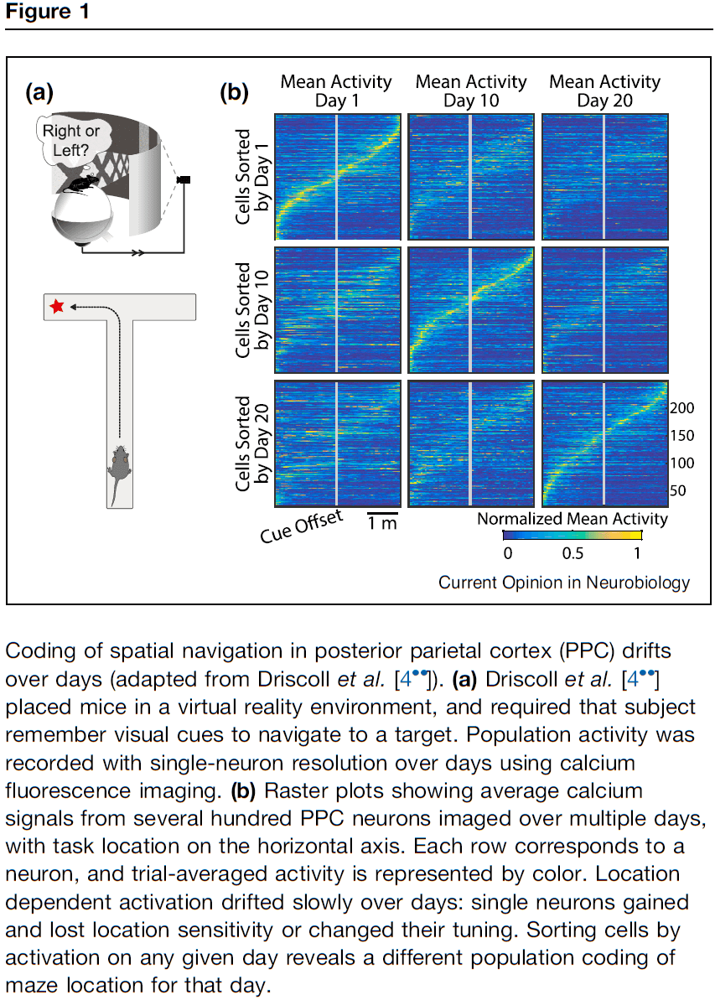
- Similar types of drift have been reported in a number of brain areas.
- E.g. Hippocampus, sensory neocortex, motor neocortex.
- In the hippocampus, all dendritic spines are expected to turn over in several weeks, suggesting that circuits are continually rewired even though animals can maintain stable task performance and memories.
- We emphasize that drift isn’t seen in all brain areas and for all tasks.
- Nevertheless, the finding of representational drift raises questions about how behavior is learned and controlled in neural circuits, and what constitutes a memory of such behavior.
- Redundant representations may allow for some level of drift without disrupting behavior.
- E.g. Even in simple nervous systems, the existence of circuit configurations with different anatomical connectivity but similar overall function is well documented.
- The brain may therefore achieve robustness by preserving high-dimensional behavior while allow for a vast number of equivalent circuit configurations to be realized.
- E.g. A low dimensional task can be represented in higher dimensional population activity in a variety of configurations.
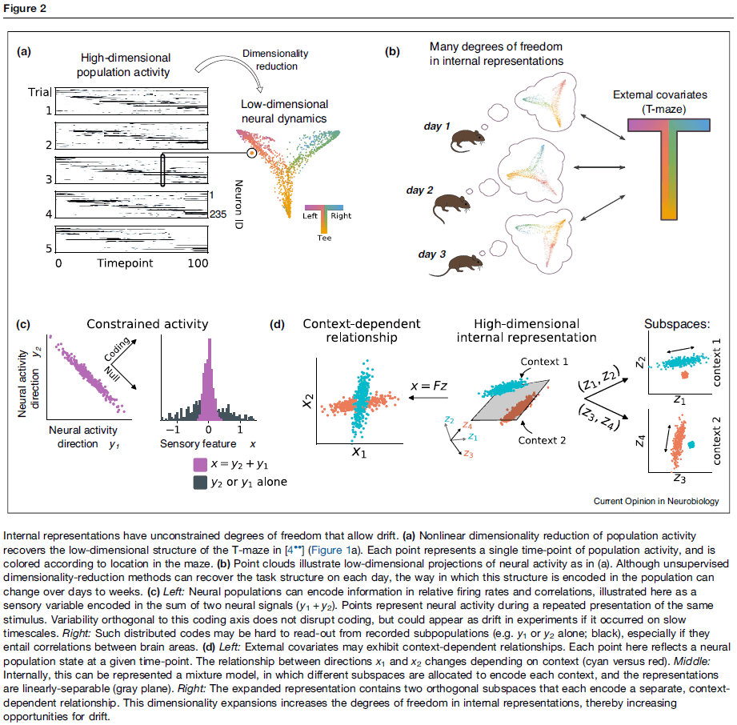
- An idea that emerges from the high-dimensional encoding of low-dimensional tasks is that of a null space.
- Null space: a subspace of population activity that’s orthogonal to a low-dimensional task representation.
- The null-space concept has been used to explain how a single neuronal population can represent multiple behavioral contexts.
- Because of the high-dimensional space for internal representations, neuronal activity could drift in directions unrelated to encoding or task performance.
- If the dimensionality of population activity is much higher than the dimensionality of the task, even random drift will lie mostly within the null space.
- Thus, high-dimensional population representations can tolerate drift and allow multiple circuit configurations leading to similar outputs, and thus similar behavior.
- Representational drift may be inevitable in distributed, adaptive circuits.
- Drift is sometimes considered as a passive, noise-driven process, but it could also reflect other ongoing processes such as learning.
- E.g. To prevent new associations from disrupting previously learned associations, the brain may need to re-encode them.
- Experiments on training mice to learn new sensorimotor associations (after having learned earlier associations) found that the same neurons appeared to be used for the representations of previously learned associations.
- Thus, representational drift could reflect learning and suggests that a neuronal population can be simultaneously be used for learning and memory.
- This idea of drift as ongoing learning is consistent with recent theoretical work.
- Even in the absence of explicit learning, representations may drift to encode information more efficiently.
- Drift may therefore be an expected consequence of ongoing refinement and consolidation.
- Regardless of the sources of drift, neuronal representations must remain within the subspace of equivalent representations or else behavior is impacted.
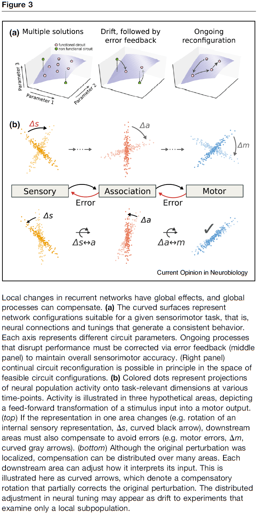
- Continual corrective action is needed to constrain neuronal representations on long timescales, and external stimuli could provide this corrective feedback.
- Another source of feedback could be internal error signals exchanged between recurrently connected brain regions.
- E.g. Spatial navigation requires consistent representations throughout sensory, association, and motor regions.
- Drift could serve important computational functions.
- E.g. Dropout to prevent overfitting. Time-stamping as the set of active cells conveys information not only about the environment, but also about time.
- Drift may allow the brain to sample from a large space of possible solutions, working towards optimal solutions while sampling enough possibilities to avoid globally suboptimal local solutions.
- The brain is an adaptive system and its structure changes.
- Integrating theories of collective neural dynamics, learning, and predictive coding in distributed representations are essential to understanding how sensorimotor representations evolve.
- Globally coordinated plasticity may be needed to preserve existing associations or in other words: “to stay the same, everything must change.” A form of neural homeostasis.

## [Beyond STDP — towards diverse and functionally relevant plasticity rules](https://doi.org/10.1016/j.conb.2018.06.011)

- It’s important to understand the rules governing synaptic plasticity because it supports behavioral learning and is critical for memory.
- Recent discoveries suggest that rather than having universal rules for plasticity, there may be a diversity of rules, and that this diversity may be determined by the function of the neural circuit that each synapse is a part of.
- The search for plasticity rules has been based on Hebb’s postulate that “neurons that fire together wire together”.
- Hebbian plasticity addressed the question of causality in plasticity, but the discovery of spike-timing-dependent plasticity (STDP) provided a framework for order dependence as well as causality.
- However, the necessity for postsynaptic action potentials (APs) in synaptic plasticity remains controversial as plasticity may be mediated by other depolarizing events in the postsynaptic cell.
- STDP-like plasticity: plasticity rules that require order-dependent and close temporal correlation of neural signals.
- One key problem with using STDP-like plasticity for all forms of associative learning is the difference in timescale between plasticity rules (tens of milliseconds) and behavioral time scale plasticity (minutes).
- How do we bridge the shorter synaptic timescales with the longer behavioral timescales?
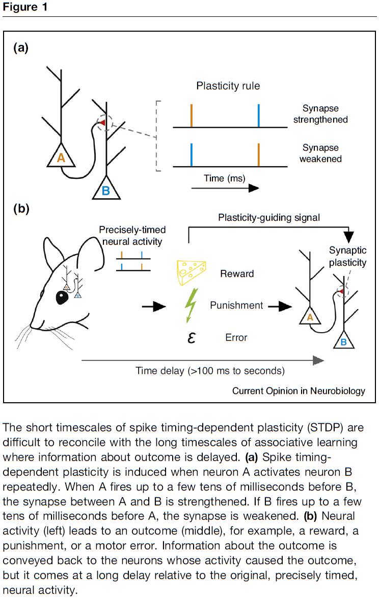
- Temporal credit assignment: how to assign credit/blame in a neural circuit or synapse after delayed feedback.
- Associative learning is often guided by the outcome of the action such as reward signals.
- In such cases, learning may be supervised by a neuromodulatory signal rather than by synaptic activity.
- This questions the relevance of precise spike timing for neural circuits where learning is supervised by delayed and temporally diffuse neuromodulatory signals.
- Neuromodulators can also change the temporal requirements of precise spike timing necessary for inducing synaptic plasticity.
- The ability of modulatory inputs to affect plasticity has been shown in several different contexts and it can play a gating role or change the shape of the plasticity rule itself.
- Recent studies suggest that the timing rules for synaptic plasticity can be aligned with the behavioral and functional requirements of a circuit, contradicting the concept that plasticity rules are only based on close temporal correlations.
- Timing is only part of the picture as several other parameters influence plasticity.
- E.g. Neuronal firing rate, number of repetitions, and the cooperativity of synapses.
- Moreover, synaptic plasticity is far from being the only form of plasticity in a neural circuit.
- To summarize, coincidence-based rules for synaptic plasticity are no longer sufficient to explain the diversity of ways neural circuits can adapt and learn.

## [Anauralia: The Silent Mind and Its Association With Aphantasia](https://doi.org/10.3389/fpsyg.2021.744213)

- Auditory imagery and visual imagery were found to be strongly associated in a sample of 128 participants.
- Most self-reported aphantasics report weak or absent auditory imagery, and people lacking auditory imagery tend to be aphantasic.
- Similarly, vivid visual imagery tends to co-occur with vivid auditory imagery.
- Because there’s no English word for the absence of auditory imagery, we propose a new term, anauralia, to refer to this phenomenon.
- Aphantasia: lack of visual imagery.
- Some individuals that have aphantasia also report weak or absent imagery in other sensory modalities.
- E.g. No “inner voice” or auditory imagery.
- Previous reports show that some aphantasics report an inner mental life that’s not only blind but also completely silent.
- E.g. “I silently think and silently read”, “I don’t have the experience people describe of hearing a tune or a voice in their heads.”
- Anauralia: lack of auditory imagery.
- This paper aims to evaluate possible associations and dissociations between visual and auditory imagery, and their absence.
- To assess auditory and visual imagery, we used the Bucknell Auditory Imagery Scale-Vividness (BAIS-V), the Bucknell Auditory Imagery Scale-Control (BAIS-C), and the Vividness of Visual Imagery Questionnaire (VVIQ-M).
- Out of the 128 participants, 34 were aphantasic and 20 were categorized as anauralic.
- Between these two groups, there was a large overlap with 82% of the aphantasic group experiencing very weak auditory imagery, and 97% of the anauralic group experiencing very weak visual imagery.
- The association between aphantasia and anauralia was highly reliable with a chi-square of 93.42 and p < 0.001.
- The other extreme, hyperphantasia and hyperauralia, was also found to be reliably associated with each other in that strong auditory imagery correlated with strong visual imagery and vice versa.
- 1/34 aphantasic individuals reported average auditory imagery, and 1/29 anauralic individuals reported average visual imagery.
- So, it appears that auditory imagery can be dissociated, to some extent, from visual imagery, and the reverse.
- However, strong dissociations weren’t observed as no aphantasic participants were hyperauralic, and no anauralic participants were hyperphantasic.
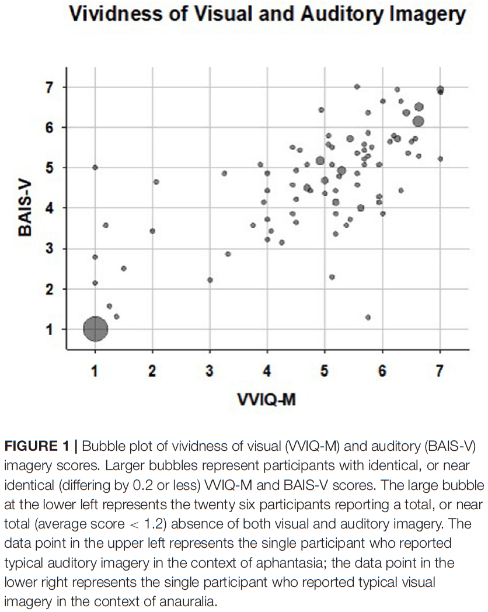
- We found that visual and auditory imagery were strongly associated as a large majority of self-reported aphantasics were also anauralic, and vice versa.
- Aphantasia has been linked with poor autobiographical memory and face recognition problems.
- But with the existence of anauralia, this confounds previous findings and it’s unclear what causes poor autobiographical memory and poor face recognition in these individuals.
- The lack of auditory imagery may play a significant role in at least some of the associations observed in the aphantasia literature.
- While the presence of a strong association between aphantasia and anauralia suggests that common mechanisms are involved when generating visual and auditory images, the existence of dissociations indicates that use of common mechanisms and pathways isn’t mandatory.
- The literature on sensory imagery has been dominated by work on visual sensory imagery, with auditory imagery arguably receiving less attention than it deserves.

## [Synaptic vesicle pools are a major hidden resting metabolic burden of nerve terminals](https://doi.org/10.1126/sciadv.abi9027)

- The human brain has a small safety margin with respect to fuel supply as a two-fold drop in blood glucose level results in severe neurological consequences.
- Nerve terminals are the likely source of this metabolic vulnerability as they’re remarkably sensitive to brief fuel supply interruption.
- E.g. Complete halting of synaptic vesicle recycling within minutes of fuel deprivation.
- This vulnerability may reflect the limits of the local ATP synthetic machinery’s ability to balance both increased ATP demand and fundamental basal metabolic costs that are always incurred.
- As an organ, the brain is energetically expensive in that it consumes 20% of the body’s fuel but only represents 2-2.5% of its mass.
- Although a large fraction of this energy consumption is driven by electrical activity, the brain likely has high resting metabolic rates because severe reduction of the brain’s electrical activity only decreases fuel consumption by two- to three-fold.
- This paper shows that nerve terminals have a high resting metabolic energy demand that’s independent of electrical activity, and that synaptic vesicle (SV) pools are major energy consumers.
- Findings of this paper
    - The high resting metabolic rate is due to SV-resident vacuolar-type ATPase (V-ATPases) compensating for a previously unknown constant proton (H+) efflux.
    - This steady-state proton efflux is mediated by the vesicular neurotransmitter transporter independent of the SV cycle.
    - This efflux accounts for about half of the resting synaptic energy consumption.
    - Suppression of this transporter significantly improves the ability of nerve terminals to withstand fuel withdrawal.
- The vesicular proton pump, and not the plasma membrane, accounts for a large resting basal ATP consumption in nerve terminals.
- The action of sodium-ion/potassium-ion-ATPase (NaK-ATPase) to restore ionic gradients is considered to be one of the largest metabolic costs in the active brain.
- In the absence of action potential firing, the NaK-ATPase compensates for any leaking currents across the plasma membrane.
- Unexpectedly, inhibiting NaK-ATPase using ouabain had no measurable impact on the kinetics of ATP depletion.
- This suggests that relatively few sodium and potassium ions need to be pumped across the plasma membrane to maintain the resting membrane potential.
- Therefore, we consider alternative mechanisms at presynaptic terminals to explain basal metabolic dynamics.
- Although we expect ATP expenditure for filling vesicles with neurotransmitter, it’s less clear in a resting vesicle pool whether there is any residual activity that might account for part of the resting metabolic load, a state when one expects most SVs to be full of neurotransmitter.
- To test this, we blocked V-ATPase using bafilomycin which lead to significantly reduced basal ATP consumption.
- These data unmask V-ATPase as a main energy burden in resting synapses that accounts for slightly less than half of the resting ATP consumption.
- Given the large total number of nerve terminals in the brain and that this burden is constantly present, the resting SV pools in total likely make up a substantial energy burden in the brain.
- Further experimentation found that there’s a steady-state efflux of protons from SVs, which is compensated for by V-ATPase.
- Our data shows that a constant proton flux accounts for about 44% of resting synaptic ATP consumption and that this flux is mediated by vGlut1.
- Overall, the results reveal that the SV pool is a major source of metabolic activity even in the absence of electrical activity and neurotransmission.
- In control neurons, the removal of glucose from the environment led to the gradual slowing of SV recycling.
- The findings from this paper provide a compelling explanation for why nerve terminals are so sensitive to metabolic compromise and why brain tissue has a resting metabolic rate that’s much higher than other tissues.
- The presence of SVs themselves and their intrinsic reliance on V-ATPase to power neurotransmitter filling have made them sensitive to routes of efflux for protons from the vesicle lumen, which sustains V-ATPase activity, creating a constant energetic burden.
- We don’t know the precise route of proton efflux in glutamatergic vesicles, but we do know that vGlut is a critical mediator.
- One limitation of these findings is that only glutamatergic vesicles were studied, so we aren’t sure if these findings generalize to dopaminergic or GABAergic SVs.
- Given the vast number of synapses in the human brain and the presence of hundred of SVs at each of these synapses, this hidden metabolic cost of quickly returning synapses to a “ready” state comes at the cost of major ATP and fuel expenditure, contributing significantly to the brain’s metabolic demands.

## [The Defensive Activation Theory: REM Sleep as a Mechanism to Prevent Takeover of the Visual Cortex](https://doi.org/10.3389/fnins.2021.632853)

- Brain regions maintain their territory with continuous activity.
- E.g. If activity slows or stops due to loss of input, the territory will be taken over by its neighbors.
- Surprisingly, the speed of takeover is fast and is measurable within an hour.
- This leads us to a new hypothesis on the origin of rapid eye movement (REM) sleep called the defensive activation theory.
- Defensive activation theory: that REM sleep serves to amplify the visual system’s activity periodically throughout the night, allowing it to defend its territory against takeover from other senses.
- In support of this hypothesis, we found that measures of plasticity across 25 primate species correlate positively with the proportion of REM sleep.
- We further found that plasticity and REM sleep increases with newer evolved species up to humans.
- Finally, our hypothesis is consistent with the decrease in REM sleep and parallel decrease in neuroplasticity that comes with aging.
- Why do we dream? Does dreaming have a purpose or is it meaningless noise? And why are dreams so richly visual?
- Potential reasons behind REM sleep
    - Energy and temperature control
    - Psychological health
    - Learning
    - Sensorimotor integration
- This paper leverages recent findings on neural plasticity to propose a novel hypothesis that can account for the amount of REM sleep across species.
- Just as sharp teeth and fur are useful for survival, so is neural plasticity.
- Neural plasticity: the brain’s ability to adjust its parameters, enabling learning, memory, and behavioral flexibility.
- At the scale of brain regions, neuroplasticity allows areas associated with different functions to gain or lose neural territory when inputs to that function slow, stop, or shift.
- E.g. In congenitally blind individuals, the occipital cortex is taken over by other senses such as audition and somatosensation.
- We find that the brain undergoes rapid changes when input stops.
- Rapid neural reorganization happens not only in the newly blind, but also in sighted people with temporary blindness.
- E.g. Temporarily blindfolded people that learned Braille showed activation in the occipital, somatosensory, and auditory cortex while reading Braille. And when the new occipital lobe activity was disrupted using TMS, the Braille-reading advantage of the blindfolded subjects went away. After the blindfold was removed, the response of the occipital cortex to touch and sound disappeared within a day.
- Of interest here is the unprecedented speed of the change.
- The rapidity of change may be explained not by the growth of new connections, but by the unmasking of pre-existing non-visual connections in the occipital cortex.
- This rapid redistribution of neural territory leads us to a new hypothesis for the brain’s activity at night. As at night, the visual system in particular has a unique problem: it’s cast into darkness for an average of 12 hours every day.
- Given that sensory deprivation triggers takeover by neighboring territories, how does the visual system compensate for this cyclic loss of input?
- Defensive activation theory: the brain combats neuroplastic incursions into the visual system by keeping the occipital cortex active at night.
- Thus, REM sleep exists to keep the visual cortex from being taken over by neighboring cortical areas at night.
- After all, night doesn’t diminish touch, hearing, or smell, but only vision is occluded by darkness.
- Review of REM sleep
    - Rapid eye movement during sleep is thought to be associated with the visual experience of dreaming.
    - REM sleep is triggered by a specialized set of neurons in the pons, which has two consequences.
    - First, it keeps the body immobile during REM sleep by paralyzing major muscle groups, thus allowing the brain to simulate visual experience without moving the body simultaneously.
    - Second, we experience vision when waves of activity travel from the pons to the lateral geniculate nucleus and then to the occipital cortex. These waves are called ponto-geniculo-occipital (PGO) waves.
    - This visual cortical activity is presumably why dreams are pictorial and filmic instead of conceptual or abstract.
    - These nighttime volleys of activity are anatomically precise as the PGO waves only happen for the occipital cortex and no other sensory modality.
- The defensive activation theory predicts that the higher an organism’s neural plasticity, the higher its ratio of REM to non-REM sleep. And this relationship should apply across species and within an organism’s lifespan.
- We tested our hypothesis by comparing 25 species of primates on behavioral measures of plasticity and the fraction of sleep time spent in REM sleep.
- Since we don’t have direct measures of visual cortical plasticity, we assume that the plasticity of different brain regions generally correlates within a species.
- Does the general plasticity of a species correlate with the percentage of REM sleep time?
- We found significant correlations for time to locomotion, time to weaning, and time to adolescence with sleep time in REM.
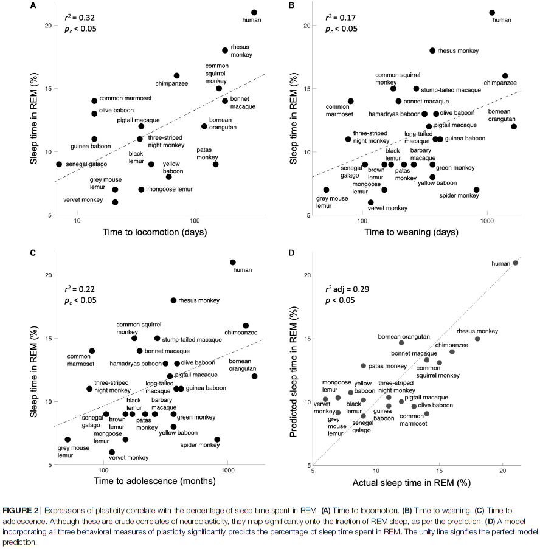
- For control, we used four other variables for each species: body mass, body length, number of offspring, and average lifespan and found non-significant correlations with REM sleep.
- The findings show that more REM sleep correlates with more plasticity.
- Next, we analyzed measures of plasticity and REM sleep as a function of phylogenetic distance from humans.
- The data show that both plasticity and REM sleep correlate significantly with phylogenetic distance from humans.
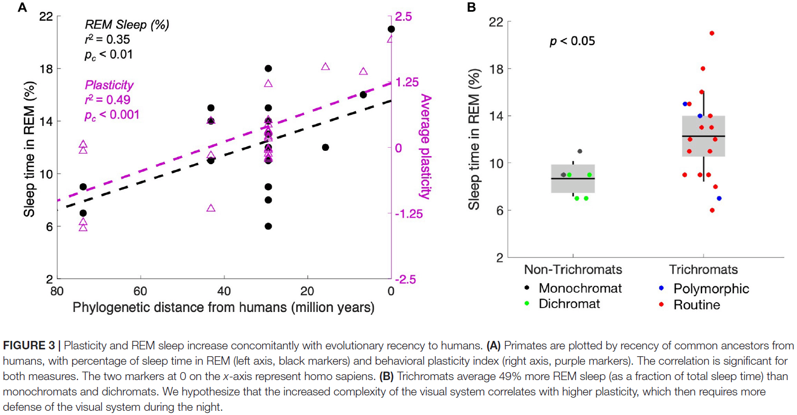
- This finding suggests that plasticity increases as brain complexity increases.
- The data are consistent with the prediction that there’s a significant decrease in REM sleep across the lifespan.
- REM sleep becomes less necessary as neural circuitry becomes less flexible.
- This decline in plasticity is consistent with the aging brain’s declining ability to recover from damage.
- The defensive activation theory may be part of a more general principle that more plastic systems require more active maintenance.
- E.g. REM sleep when deprivation is regular and predictable, tinnitus or phantom limb syndrome when deprivation is regular and unpredictable, and hallucinations when deprivation is irregular and unpredictable.
- The hypothesis could be tested more thoroughly with direct measures of cortical plasticity.
- If dreams are visual hallucinations that prevent neuroplastic takeover of the visual cortex, we expect to find similar visual hallucinations in awake people with prolonged periods of sensory deprivation.
- And indeed, visual hallucinations have been reported by individuals deprived of visual input, which may represent the same mechanism of cortical maintenance.
- E.g. Just as a thermostat runs based not on the time of day but on the temperature of the building, PGO waves may be triggered not by circadian rhythms but rather by feedback from visual cortex that it’s experiencing a decline in externally driven activity.

## [Are Bigger Brains Better?](https://doi.org/10.1016/j.cub.2009.08.023)

- Studies relating brain size to behavior and cognition have rarely included information from insects, of whom show complex motor repertoires and extensive social structures.
- What are large brains for?
- Part of the answer is that large brains are due to large neurons that are necessary in large animals due to basic biophysical constraints.
- Larger brains also have more neuronal circuits, which add precision to perception and action, enable more parallel processing, and enlarge storage capacity.
- Modularity and interconnectivity also become more important in large brains.
- For comparison, a whale’s brain can weigh up to 9 kg, human brains can weigh between 1.25-1.45 kg, and a honeybee’s brain has a volume of ~1mm3 and has less than a million neurons.
- One of the biggest problems in correlating brain size with behavioral ability is when we consider insects, especially social ones.
- Learning speed can’t be used to measure intelligence because the honeybee’s speed at color learning is superior to all vertebrates that have been studied.
- How do insects generate such diverse and flexible behavior with so few neurons? And if so much can be achieved with relatively little neuronal hardware, what advantages are obtained with a bigger brain?
- Many increases in certain brain areas only result in quantitative improvements.
- E.g. More detail, finer resolution, higher sensitivity, greater precision.
- If the increased resolution is to be used behaviorally, then it needs to be processed by neural machinery downstream of sensory receptors.
- Insects and vertebrates have converged on similar solutions to process information, namely retinotopic neural maps consisting of local neuronal circuits arranged in repeated columns, the number of columns depending on the number of inputs from the retina.
- E.g. The primary visual cortex in mammals increases dramatically with eye resolution as in mice, the area is 4.5 mm2, in macaques 1200 mm2, and in humans 3000 mm2.
- This assumes that the diversity of ways in which information is processed doesn’t change.
- Larger eyes not only have increased spatial detail, but also are also faster in processing speed.
- E.g. Some large insect photoreceptors can respond to light frequencies far beyond the typical range of mammalian photoreceptors.
- This requires that the entire neural pathway be changed to support and process this higher frequency information.
- E.g. Increased axon diameters, synapses capable of higher rates of vesicle release, increased neural substrate for storing more detailed stimuli.
- Thus, a reverberation of size differences from the sensory periphery through to several subsequent stages of information processing occurs with new sensors.
- The principle of repetitive, modular organization occurs in several areas of the brain, not just those engaged in vision.
- E.g. Peripheral processing of olfactory information is similar in both vertebrates and insects.
- The common fruit fly has 43 olfactory glomeruli, honeybees have 160, humans have 350, and mice have 1000 glomeruli.
- Thus, although insects have fewer glomeruli and, presumably, a reduced odour space in comparison to many vertebrates, the differences in peripheral circuitry are quantitative rather than differing fundamentally in the type of neural computation performed.
- The principle of scaling sensory function with body size is likely repeated in other sensory modalities.
- E.g. Somatosensory mapping in larger animals will require corresponding larger brain areas.
- In conclusion, larger animals possess larger sense organs, which facilitate more detailed mapping of the world around them, assuming that these sense organs are accompanied by central neural circuits that process the peripheral information.
- There’s no reason to assume that improvements in the quantity of sensory processing necessarily results in higher intelligence.
- Instead, higher intelligence (the quality of a sensory system) depends on sensory structure/architecture and the absolute number of neurons.
- So, although comparative studies almost invariably use relative brain volume, it’s primarily the absolute, and not relative number of neurons, their size, connectivity, and available energy, that affect information processing within the nervous system.
- “A system […] is more complex if it can do more kinds of things.” - Changizi
- The million-fold increase in a large mammal’s brain relative to an insect’s does allow mammals to do more “kinds of things”.
- Similar to what we’ve seen in sensory systems, motor systems in bigger brains add relatively little in terms of the diversity of neuronal operations.
- E.g. Increased precision in motor skills is correlated with increases in the corresponding motor cortex area’s size.
- There’s sparse evidence that the insect motor system has a simpler architecture than that of large-brained mammals.
- E.g. Locusta migratoria has 296 muscles compared to the 316 muscles in primates.
- Insects often outperform vertebrates in terms of speed of movement but just as in vertebrates, motor actions can be reduced to a coordinated series of precisely timed muscle contractions.
- E.g. In both insects and vertebrates, there are descending pathways that control the activity of central pattern generators that can be modified based on sensory feedback. Both also have local reflex circuits.
- Relatively few interneurons may be necessary to produce novel behaviors using existing interneurons, motor neurons, and muscles.
- Thus, novel behaviors could arise by small numbers of neurons using the basic architecture of existing behaviors, but recruiting them in different ways.
- The motor systems of insects aren’t necessarily inferior to those of mammals in ways that differences in brain size might suggest.
- E.g. While insect muscles are innervated by fewer motor neurons than vertebrates, this may not affect precision as vertebrates have more muscle fibers.
- The differences in behavioral repertoire size between insects and large-brained vertebrates are much less pronounced than one might expect from differences in brain size.
- The acquisition of novel pathways can produce novel behaviors.
- Absolute brain volume of both vertebrates and insects increases with body mass, although relative brain volume decreases.
- As brain regions increase in size, the distance information travels also increases.
- This distance can introduce substantial delays between regions.
- In the mammalian cortex, the volume of connections between distant brain regions (white matter) increases disproportionately faster than that of local processing (grey matter).
- Brain regions segregate to maintain a high level of local connections while reducing the number of long distance connections.
- Novel brain regions and the circuits within are free to diversify, producing novel behaviors.
- Insects lack myelin, which is present in mammals and arthropods, so increased conduction velocity is achieved solely through increased axon diameters.
- The largest axon diameters are found in interneurons with long range connections that form part of the escape circuit.
- Although these interneurons increase the volume of the ventral nerve cord, there are typically very few of such neurons.
- The small distances within insect nervous systems allow the majority of information to be transferred in interneurons with small axon diameters using analogue signals.
- However, the transmission of analogue signals is restricted due to their inability to propagate far and their accumulation of noise over long distances.
- E.g. Analogue signals are only used in the vertebrate nervous system in short sensory receptors and some visual interneurons.
- Neural circuitry can’t be infinitely miniaturised due to noise from ion channels at that scale.
- The computational power of a brain isn’t dependent on relative brain size, but on absolute brain size, the number and size of neurons, the number of connections among them, and the metabolic rate of the tissue.
- The upper rate of APs that can be sustained is determined by the specific metabolic rate, which is higher in smaller brains.
- Thus, smaller brains can maintain a higher density of computations.
- Serial and parallel processing are essential for computing novel receptive fields and generating computational maps.
- E.g. Processing the computation of variables not directly represented in sensory input such as sound location.
- In larger brains, more parallel processing pathways and stages of serial processing can be added more easily than in insect brains where space imposes more severe constraints.
- In insects, neurons representing variables computed by combining multiple sources of sensory information appear to be present, but in smaller numbers than in vertebrates.
- As there’s no adult neurogenesis in bees, learning occurs by enhanced dendritic outgrowth and branching of Kenyon cells in each mushroom body.
- Because larger brains can extract and store more information, having larger memory stores facilitates the generation of novel solutions based on previously stored information.
- The search for correlations between brain sizes and cognition is riddled with complications.
- The majority of differences in brain volume, especially between species of different sizes, is related to the animal’s need to support larger sense organs and their need to move larger bodies.
- Bigger sense organs requires larger amounts of neural tissue to evaluate the information, providing more sensitivity and detail, but not necessarily higher intelligence.
- It’s now clearer that small brains can achieve many more types of cognitive operations than assumed.
- We argue that new neurons recruited into novel pathways and novel brain regions, resulting in greater serial and parallel processing of information, are more likely to contribute to qualitative changes in behavioral performance.

## [Computational Neuroscience](https://doi.org/10.1126/science.3045969)

- The ultimate goal of computational neuroscience is to explain how electrical and chemical signals are used in the brain to represent and process information.
- At the time of this paper, neuroscientists have yet to understand how the nervous system enables us to see and hear, to learn and remember, and to plan and make choices.
- It’s difficult to study the relation between perception and the activity of single neurons because perception is the result of activity in many neurons in many different parts of the brain.
- Explaining higher functions is difficult because nervous systems have many levels of organization.
- E.g. Molecular, systems, local circuits, columns, topographic maps.
- Certain properties aren’t found in components of a lower level because they emerge from the organization and interaction of these components.
- E.g. Rhythmic pattern generation.
- Advantages of brain models
    - Can make the consequences of a complex, nonlinear brain system with many interacting components more accessible.
    - New phenomena may be discovered by comparing the predictions of simulation to experimental results.
    - Experiments that are difficult or impossible to perform in living tissue can be simulated.
- Mechanical and causal explanations of the brain are different from computational explanations.
- The main difference being that a computational explanation refers to the information content of the physical signals and how they’re used to complete a task.
- E.g. A mechanical explanation of a slide rule is that certain marks are lined up and the result is read. A computational explanation is that the marks on the sliding rule correspond to logarithms, and adding two logarithms is the same as multiplying the pair of numbers.
- Thus, the physical system carries out a computation by virtue of its relation to a more abstract algorithm.
- Classes of brain models
    - Realistic: a very large-scale simulation that tries to use as much cellular detail as possible.
        - E.g. Hodgkin-Huxley model at the single-neuron level and Hartline-Ratliff model at the network level.
        - The realism of the model is both a weakness and strength.
        - As the model is made more realistic by adding more variables and parameters, the danger is that the simulation ends up as poorly understood as the nervous system itself.
    - Simplifying: captures important principles and isolates the basic computational problems that govern the design of the nervous system.
        - E.g. Connectionist models, parallel distributed processing, artificial neural networks.
        - Abstract away the complexity of neurons and networks in exchange for analytical tractability.
        - Are an important bridge to computer science and other fields that study information processing.
    - Neuromorphic: hardware devices that directly mimic the circuits in the brain.
        - Review of Carver Mead and his approach of using analog VLSI to model the retina.
- No notes for the section “Specific Examples of Brain Models”.
- Examining the outputs of a simple cell, it’s “projective” field by analogy with the input receptor field, was critical in uncovering its function in the network.
- Neither realistic nor simplifying brain models should be used without considering their strengths and weaknesses.
- E.g. Realistic models require immense data and it’s too easy to make a complex model fit a limited subset of data. Simplifying models are dangerously seductive and the model can become an end in itself and lose touch with nature.
- Ideally, both models should complement each other.
- At this stage in our understanding of the brain, it may be fruitful to focus on models that suggest new and promising lines of experimentation.
- A model should be considered a provisional framework for organizing possible ways of thinking about the nervous system.

## [Motor prediction](https://doi.org/10.1016/S0960-9822(01)00432-8)

- Review of efference copy as a solution to how we localize visual objects.
- Prediction: estimating future states of a system.
- To predict the consequences of a motor command, the system must simulate the dynamic behavior of our body and environment using an internal forward model.
- This model captures the forward or causal relationship between actions and their consequences.
- Forward models aren’t fixed but must be learned and updated through experience and feedback.
- Uses of motor prediction in sensorimotor control
    - State estimation
        - Using sensory information to estimate state can lead to large errors, especially for fast movements, because of delays due to transduction, conduction, and processing.
        - Another option is to estimate state using prediction based on motor commands.
        - Here, the prediction is made before the movement and thus isn’t as delayed, but the prediction will drift over time if the forward model isn’t accurate.
        - The solution is to combine both sensory feedback and motor prediction to estimate the current state.
        - E.g. Use the forward model to predict state and use sensory feedback to update and correct the forward model.
        - Depending on the action, the nervous system will rely more on one type of information than the other.
        - E.g. For unpredictable objects such as flying a kite or holding the hand of a child, the system priorities sensory feedback. For predictable objects such as lifting an object, the system priorities forward model prediction.
    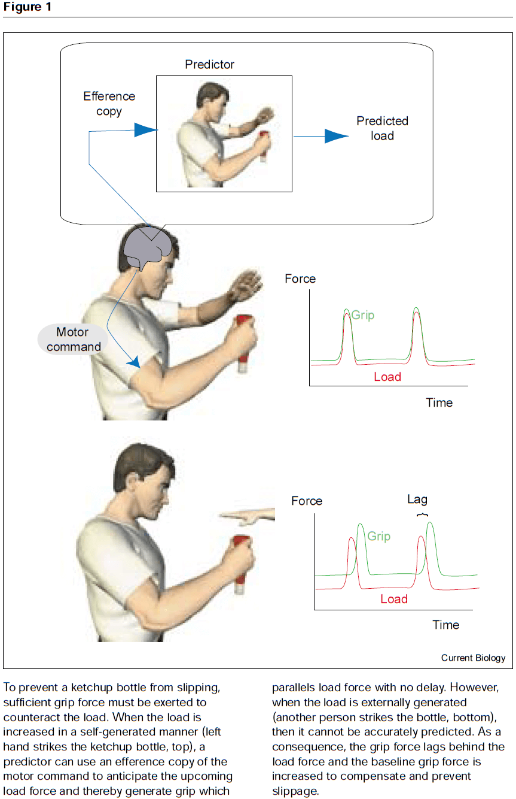
    - Sensory confirmation and cancellation
        - Prediction allows us to filter incoming sensory information by dampening unwanted signals and highlighting critical signals.
        - E.g. Information from self-generated motion can be ignored, which enhances external-generated motion.
        - E.g. Tickling ourselves is felt less intensely than when others tickle us. If the tickle is delayed, the greater the delay, the more ticklish the percept. This is presumably due to a reduction in the ability to cancel the sensory feedback based on the motor command.
        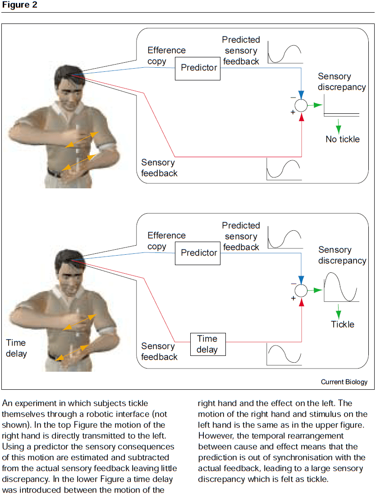
        - When the predicted sensory feedback matches the actual feedback, the motion is attributed to being generated by me. When it doesn’t match, the unpredicted feedback is attributed to others.
        - Experiments have found that damage to the left parietal cortex can lead to the inability to determine whether movements are owned or not.
        - The CNS is particularly sensitive to unexpected events or the absence of an expected event, both of which evoke reactive responses.
    - Context estimation
        - When faced with an unknown object, we identify the context and select the appropriate motor controller to handle such object.
        - How does the brain select the appropriate controller?
        - One solution, called the MOdular Selection and Identification for Control (MOSAIC) model, proposes that the when lifting an object, the brain simultaneously runs multiple forward models that predict the behavior of the motor systems when interacting with different, previously learned object.
        - Each forward model predicts the expected sensory feedback and each model is paired with a controller, forming a predictor-controller pair.
        - If the prediction of one of the forward models closely matches the actual sensory feedback, then its paired controller will be selected and used to determine subsequent motor commands.
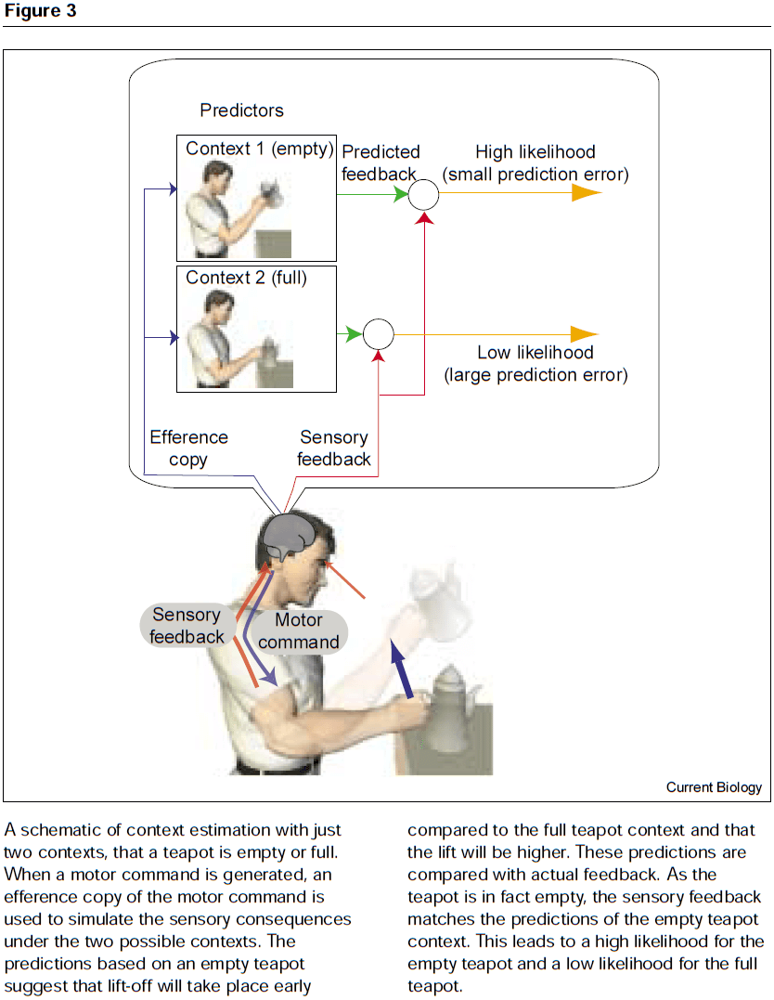
- Prediction is essential for motor control, but may also be used in high-level cognitive functions.
- The idea of a forward model may provide a general framework for prediction in all cognitive domains.
- It may be that the same computational mechanisms which developed for sensorimotor prediction have adapted for other cognitive functions.

## [Retinal waves coordinate patterned activity throughout the developing visual system](https://doi.org/10.1038/nature11529)

- Spontaneous activity is an emergent property of the immature nervous system that’s thought to mediate synaptic competition and instruct self-organization in many developing neural circuits.
- If spontaneous activity is structured to the topographic organization of sensory and motor circuits, then this activity could provide a template for activity-dependent development of downstream synaptic pathways throughout the nervous system.
- Whether spontaneous patterned activity exists and is communicated through all levels of organization for any sensory system during development is unknown.
- In the developing visual system, isolated retinas have propagating bursts of action potentials (APs) among neighbouring retinal ganglion cells (RGCs) called retinal waves.
- Retinal waves propagate to higher-order visual structures in the central nervous system and are thought to play a key role in the activity-dependent refinement of topographic neural maps in the superior colliculus (SC), dorsal lateral geniculate nucleus (dLGN), and visual cortex.
- However, the role of retinal waves in neural-circuit development remains controversial because their existence has never been demonstrated in vivo.
- This paper aims to establish whether travelling waves of spontaneous retinal activity occur in neonatal mice in vivo, and to determine whether these waves convey spatiotemporal patterns used in the activity-dependent refinement of visual maps throughout the visual system before the onset of vision.
- Spontaneous retinal waves occur in vivo
    - The most superficial layer of the mouse SC, the stratum griseum superficiale (SGS), receives retinotopically mapped terminal input from all RGCs and is accessible to imaging during development.
    - By injecting a calcium indicator into the retina of neonatal mice, we can record directly from RGCs and their terminals in the SC in vivo.
    - Calcium imaging of the RGC terminals revealed spontaneous waves of activity propagating through the SC of neonatal mice.
    - Surprisingly, in vivo waves propagated over a much greater proportion of the SC area than was expected based on previous in vitro studies.
    - Waves were completely abolished after applying tetrodotoxin (TTX), a sodium ion channel antagonist, into the contralateral eye, but not the ipsilateral eye.
- Retinal waves propagate to collicular neurons
    - Most models for activity-dependent neural-circuit development assume that patterned activity drives target-neuron spiking for Hebbian plasticity rules to strengthen synapses between co-active neurons.
    - However, it’s unknown whether spontaneous retinal waves in vivo can actually drive Hebbian refinement at developing synapses.
    - Cellular-level calcium imaging in the SGS revealed that the spatiotemporal properties of presynaptic retinal waves match those of postsynaptic retinal waves measured in the SC.
    - This shows that retinal waves drive wave-like activation patterns in retino-recipient target neurons, indicating that spontaneous activity in the retina provides a template pattern that’s matched in higher-order circuits in the visual system.
- Binocular coordination of retinal waves
    - We examined the initiation sites of retinal waves in vivo by analyzing the calcium event response frequencies for all active ROIs at the onset of waves.
    - Instead of a uniform distribution of wave-source sites, sources were preferentially located in the rostral-medial SC.
    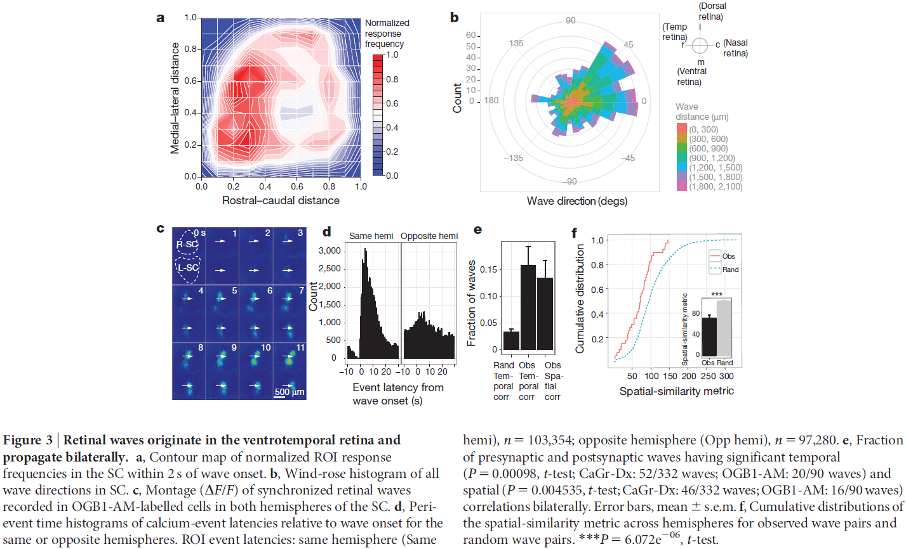
    - And consistent with this distribution, waves propagated with a bias toward the caudal-lateral SC and applied to both pre- and post-synaptic recordings.
    - The purpose of this bias may be that it mediates the development of parts of the directionally sensitive visual circuit.
    - Retinal waves may have a role in mediating the development of binocular aspects of maps in the visual system, such as eye-specific connectivity and matched-orientation selectivity between eyes.
    - It’s assumed that retinal waves in each eye are independent and drive their corresponding visual circuits separately, giving rise to an asynchronous activation pattern that could be used to segregate eye-specific projections.
    - Interestingly, descending synchronized inputs or synaptic interactions between the two retinas may initiate a small subset of retinal waves at matched retinotopic locations bilaterally. These synchronized waves may regulate bilateral matching of visual map connectivity.
- Retinal waves propagate to, and within, visual cortex
    - Retinal waves transmitted to the SC should be relayed to the visual cortex through the thalamus.
    - We found evidence of travelling waves in the visual cortex that were coincident with retinal waves propagating across the ipsilateral SC.
    - The retinotopic map in V1 is mirrored and rotated with respect to the retinotopic map in the ipsilateral SC.
    - After correcting for the mirroring and rotation, the direction of wave propagation in visual cortex was retinotopically matched to the direction of wave travel in the SC.
    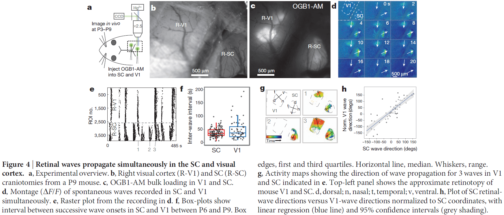
    - This shows that retinal waves carry functional information matching retinal organization simultaneously throughout multiple areas of the visual system during development.
    - By following the waves through to the next visual centers, a functional map of wave-based retinotopy was revealed that was mirrored and rotated with respect to the SC map.
    - Retinal waves provide a primary source of patterned activity for V1 during early development to coordinate and refine topographic maps across the visual system, and further modulate activity in extrastriate visual areas.
- Retinal waves are abolished by epibatidine
    - Our results were consistent with in vitro experiments that found that epibatidine abolishes retinal waves.
    - Cholinergic neurotransmission has an essential role in generating retinal waves and in vivo manipulation with epibatidine disrupts visual-map development by abolishing retinal waves.
- It’s been hypothesized that retinal waves may help organize aspects of visual circuit function before the onset of vision by establishing maps for orientation, direction, and ocular dominance.
- We found that retinal waves last for at least a week of development in vivo and exhibit a pattern of activity that can be used for communicating retinal organization to circuits throughout the visual system.
- Retinal waves generate matching activity patterns in the midbrain and cortex, supporting the idea that emergent retinal activity mediates the development of linked visual circuitry within and across neocortical and subcortical brain regions.
- Retinal wave properties
    - Preferential generation site in the ventral-temporal retina.
    - Biased wave-travel direction towards the dorsal-nasal retina.
    - Differential role in driving primary versus secondary visual cortical activities.
    - Coordinated patterns across both hemispheres.
- Bilateral retinal waves could help to establish inter-hemispheric connections, a role not previously ascribed to waves.
- The pharmacological manipulations performed in this paper strengthen the causal link between wave activity and map development, a link that was difficult to establish definitively.

## [The Neuronal Organization of the Retina](http://doi.org/10.1016/j.neuron.2012.10.002)

- The mammalian retina consists of over 60 distinct types of neurons, each having a specific function in processing visual images.
- These neurons are arranged into three main stages
    - The first stage decomposes the outputs of cones and rods into approximately 12 parallel information streams.
    - The second stage connects these 12 streams to specific types of retinal ganglion cells (RGCs).
    - The third stage combines bipolar and amacrine cell activity to create the diverse encodings of the visual world, about 20 of them, that the retina transmits to the brain.
- New retinal transformations continue to be found and at least half of the encodings remain unknown.
- This diversity of the retina’s output has yet to be incorporated into our understanding of vision.
- The approximately 100 million rod photoreceptors in the retina appear to be the second most numerous neurons in the human body only after cerebellar granule cells.
- The retina, a sheet of tissue only 200 microns thick, carries out feats of image processing that were unimaginable even a few years ago.
- The retinal neurome continues to be refined.
- Neurome: the census of component cells.
- This paper evaluates how close we are to a complete retinal neurome, reviews the principles of how we organize diverse cell types, illustrates some of the retina’s abilities, and forecasts the path forward.
- Three rules governing relations among retinal neurons
    1. The signal generated by a cone is decomposed into 12 different components, each of which is transmitted separately to the inner retina by a distinct type of bipolar cell.
        - Information is first processed in the retina by the sampling of rods and cones by bipolar and horizontal cells.
        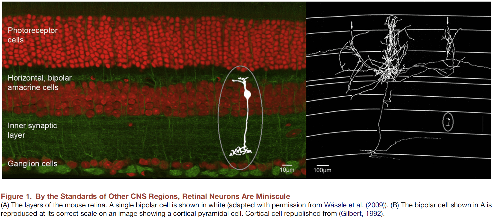
        - Both rods and cones respond to light by hyperpolarizing, with rods using the light-sensitive pigment rhodopsin and cones using one and only one of several cone opsins.
        - The retinal circuitry dedicated to rod function includes only four cell types: the rod itself, a bipolar cell that only takes input from rods, an amacrine cell that modulates the bipolar cell’s output, and an amacrine cell that feeds the output of the rod system into the circuitry that processes information derived from cones.
        - The late-evolved rods inject their signals into circuitry already evolved to service cones.
        - As for cones, cone types are structurally and functionally similar. Their functional type is defined by the opsin they express.
        - Most mammals have two types of horizontal cells, both of which feed back onto rods or cones and have gap junctions between their neighbors.
        - Horizontal cells provide inhibitory feedback to rods and cones, which is interpreted as means of local gain control in the retina.
        - These cells measure the average level of illumination falling on a part of the retinal surface and then subtracts a proportionate value from the output of the photoreceptors.
        - This results in holding the photoreceptor output within the operating range of the inner retinal circuitry, which is an extremely useful function in the natural world where any scene may contain objects of varying brightness.
        - Otherwise, the brightest objects would dazzle the retina at those locations, preventing us from seeing the rest of the world.
        - Since horizontal cells are widely spreading cells, their feedback signal spatially overshoots the edges of a bright object. This means objects neighboring the bright object also have their signal reduced.
        - In the extreme case, a black field just outside a white object is made even darker.
        - This enhances edges and is part of the famous “center-surround” organization of RGCs.
        - Horizontal cells are best imagined as carrying out one step of signal conditioning, which globally adjusts the signal for reception by the inner retina, rather than being used for edge detection.
        - Horizontal cells are relatively simple.
        - There are about 12 types of bipolar cells compared to the 4 previously thought: ON, OFF, sustained, and transient.
        - One type of bipolar cell is rod driven while the rest 11 are cone driven.
        - “The catalog of 11 cone bipolar cells and one rod bipolar cell is complete, and all major bipolar cell types of the mouse retina appear to have been discovered.” - Wassle et al., 2009
        - The synapses between cones and bipolar cells create parallel information channels.
        - The central principle that dominates the structural and functional organization of the retina is that each bipolar cell contacts all of the cone terminals within the spread of its dendritic arbors.
        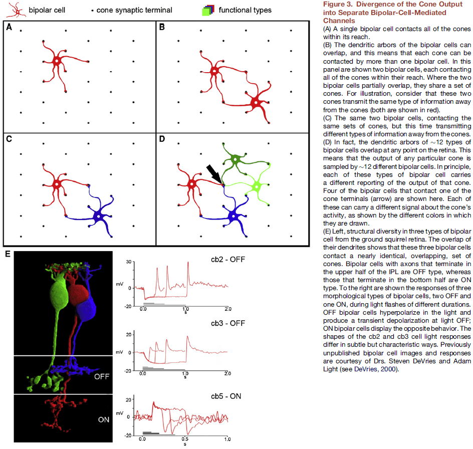
        - And by tuning the characteristics of the cone-to-bipolar synapses, each bipolar cell type can transmit a different parsing of the cone’s output.
        - What types of information are segregated into the 12 parallel channels?
        - Some channels are chromatic and thus handle color, others are the classic ON and OFF channels.
        - ON bipolar cells have their axon terminals in the inner half of the inner plexiform layer (IPL) and the OFF bipolar cells have their axon terminals in the outer half of the IPL.
        - The difference between ON and OFF types is in their expression of two classes of glutamate receptors.
        - E.g. OFF cells express AMPA and kainate type receptors, ON cells express mGluR6.
        - Likewise, the difference between sustained and transient bipolar cells is due to the expression of rapid- or slow-inactivating glutamate receptors.
        - This leads to four types of bipolar cells: ON-sustained, ON-transient, OFF-sustained, OFF-transient.
    2. The outputs of these bipolar cell channels are sampled by different sets of retinal ganglion cells.
        - The main characteristic that defines the 12 types of bipolar cells is the level of the IPL that their axons terminate at.
        - Thus, while bipolar cells sample from all cones within their reach, they terminate on very restricted sets of postsynaptic partners.
        - Most of the inner retina’s connectivity occurs within layers rather than between layers.
        - The lamination of the IPL is a fundamental guide to the retina’s wiring diagram.
        - All bipolar cells and all ganglion cells are always stratified.
        - Bipolar cell axon terminals transmit a wide variety of stimulus properties, among which ganglion cells choose depending on the type of information that it will transmit to central visual structures.
        - If retinal ganglion cells get selective inputs from different bipolar cells, they are imbued with different types of response to light themselves.
        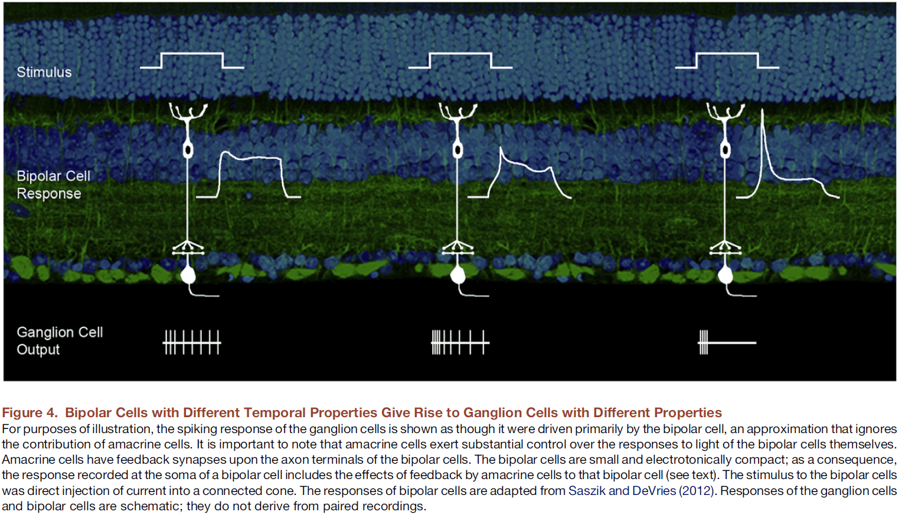
        - A note is that bipolar cells aren’t only influenced by signals from rods or cones, but also take inputs from amacrine cells.
        - Thus, the output of the bipolar cell onto the ganglion cell integrates both the intrinsic response properties of the bipolar cell and the actions of amacrine cells on the bipolar cell.
    3. The partially selective responses, mediated by bipolar cells, are refined by amacrine cells to create arrays of specific ganglion cell subtypes.
        - Most amacrine cells are axonless, lack clear polarity, and are inhibitory.
        - Amacrine cells feed back to the bipolar cells that drive them, synapse on RGCs, and synapse on each other.
        - The total number of known amacrine cell types is around 30.
        - Amacrine cells create contextual effects for the responses of RGCs.
        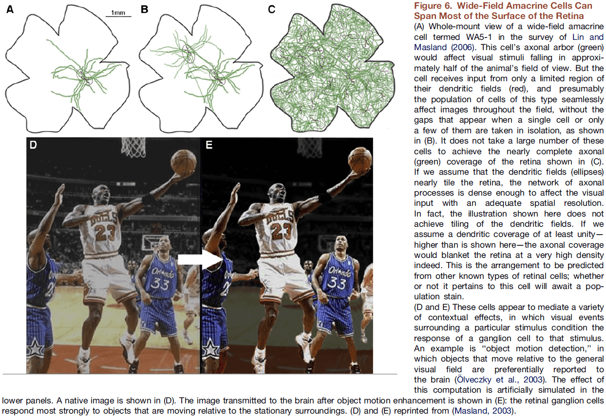
        - E.g. Center-surround antagonism and motion detection.
        - Many amacrine cells perform some type of vertical integration.
        - E.g. Carrying ON information into the OFF strata and vice versa.
        - Most of the functions of amacrine cells are narrow and task-specific.
        - E.g. One specific amacrine cell was excited by the blue-ON bipolar cell but performed sign inversion on it’s connected ganglion cell, inhibiting it. This creates a blue-OFF ganglion cell even though no blue-OFF bipolar cell exists.
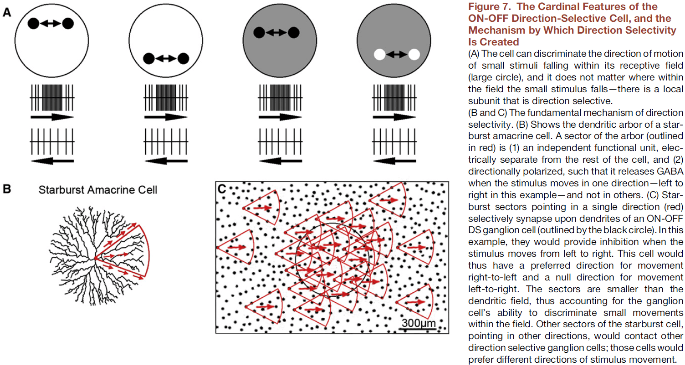
- By combining inputs from both bipolar and amacrine cells, the number of types of ganglion cells exceeds the number of types of bipolar cells.
- We haven’t yet achieved a definitive classification of all ganglion cell types in any mammalian species.
- The number of ganglion cell types depends a lot on how they’re counted.
- E.g. Are ON and OFF variants considered one or two types?
- There are nine modality-specific channels for touch, five for taste, and over three hundred for smell. As for vision, given it occupies approximately 50% of the cortex in primate, we’d expect much more channels than for the other senses.
- How do retinal cells array and organize themselves across the retinal surface?
- Each of the retina’s over 60 cell types are spaced regularly so that the cells cover the retinal surface evenly.
- Specifically, only the cells of the same type are evenly spaced with respect to other cells. As for other cell types, their positions are random.
- Not only do the cell bodies space themselves, but their dendritic arbors space themselves as to not overlap much. Dendritic arbors of the same type acts as though they repel each other.
- This leads to efficient and even coverage of the entire retina with each of the 20 RGC types.
- With this coverage, every point on the retinal surface is reported by at least one of each type of RGC.
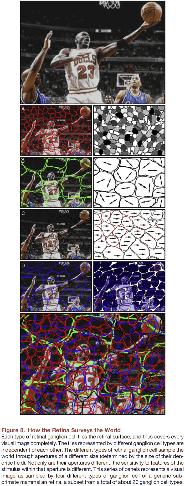
- The tiling of RGC types is independent so that each mosaic is simultaneously superimposed onto each other. Thus, the brain receives approximately 20 independent filters of the image, with each filter transmitting a different aspect of the stimulus.
- All of the retinal encoding must converge to a unified representation of the visual world, but where does this convergence happen? Does it even happen at all?
- RGCs have context-dependent dynamic properties and aren’t static as they’re taught in textbooks.
- E.g. Suppressing RGCs during saccades.
- It’s known among clinicians that a very small number of surviving RGCs allows for substantial vision.
- There’s evidence that the brain can correctly interpret new information transmitted down the same old wires.
- E.g. One experiment used gene transfer to create trichromatic vision in dichromatic animals such as mice. Careful testing showed that the mice had true trichromatic color vision.
- We don’t yet understand why the brain needs all of the encodings that the retina transmits.

## [A monument of inefficiency: the presumed course of the recurrent laryngeal nerve in sauropod dinosaurs](https://doi.org/10.4202/app.2011.0019)

- The looping course of the laryngeal nerve from the brain, around the great vessels, and to the larynx, is shared by all existing tetrapods and presumably all extinct tetrapods.
- The longest-necked animals of all time were the extinct sauropod dinosaurs, some of which had necks 14 meters long, which implies a recurrent laryngeal nerve of at least 28 meters long.
- However, the longest neuron to have existed is probably the neuron spanning from the end of the tail to the brainstem in sauropods, about 40-50 meters long.
- The recurrent laryngeal nerve (RLN) has become a case study in evolutionary biology as an example of suboptimal morphology caused by a development constraint.
- The RLN is a branch of the vagus nerve and innervates most of the muscles of the larynx and provides some sensory input from the trachea and esophagus.
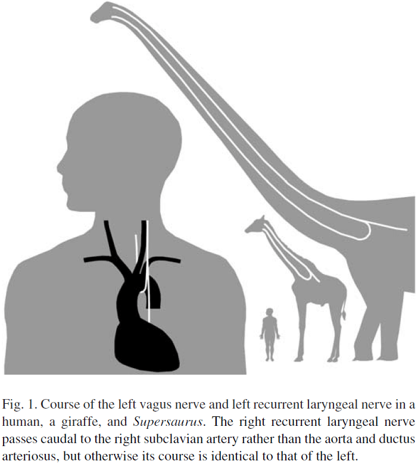
- The reason the RLN loops around is because the head and heart develop together while the RLN connects them. Then, the neck develops which separates the head and heart, stretching the RLN. The RLN must then loop back up to reach the larynx.
- Thus, the RLN is influenced by the length of the neck and is roughly double its length.
- Among existing animals, the giraffe has the longest RLN.
- However, the RLN isn’t the longest cell as some primary sensory neurons from the extremities connect with higher-order neurons in the brainstem.
- E.g. In whales, primary sensory neurons are estimated to approach or exceed 30 m.
- The larynx is in all tetrapods and is used to protect the trachea and lungs from ingested food and water, to regulate intrapulmonary and intrathoracic pressure, and, in some species, to produce and modify sounds.
- In all existing tetrapods, the RLN follows the same path around the vessels derived from the embryonic aortic arches, suggesting that the RLN recurrent path evolved in the common ancestor of tetrapods.
- E.g. Amphibians, reptiles, birds, mammals.
- Could some extinct tetrapod have evolved a nonrecurrent/direct laryngeal nerve?
- It’s unlikely because nonrecurrent laryngeal nerves are rare in humans and have never been observed to occur bilaterally.
- The deep developmental conservation of the RLN is further evidenced by the fact that a nonrecurrent laryngeal nerve has not evolved in any known tetrapod.
- No notes on Supersarus with its 28 m long RLN.
- There are apparently no physiological barriers to the existence of such immensely long cells because the longest neurons in existing whales can exceed 30 m.
- As axons grow longer, the conduction time of nerve impulses increases unless mechanisms evolved to increase the conduction velocity.
- E.g. In the giraffe, the length of the RLN is somewhat compensated for by more heavily myelinated nerve fibers, enabling faster nerve impulses.
- Pain signals from the larynx to the brain in sauropods may be considerably delayed.
- However, innervation of the skin around the throat is provided by cervical nerves with much shorter pathways (less than one meter) to the central nervous system, so even the largest sauropods would have felt external injuries to the throat almost immediately.
- The longest cells in any existing organism, the 30 m nerve cell in blue whales from brainstem to tail, is predicted based on comparisons with smaller tetrapods and hasn’t been empirically tested yet by dissection or neuronal tracing.
- The primary afferent neurons in whales and sauropods are much longer than any known cells in invertebrates.
- E.g. Giant squid and colossal squid.
- The giant axons of squid are widely used in studies of neuron function but they’re remarkable for their diameter rather than their length.
- Cephalopods lack myelin so the only available mechanism to increase the conduction velocity of their nerves is to increase the diameter of their axons.
- The physiology of long neurons is difficult to investigate. One issue with long neurons is the transport of materials between the nerve cell body and axon terminals.
- Fast transport of neurotransmitters and enzymes can reach 200-400 mm/day, whereas the slow transport of some proteins averages 0.1-1.0 mm/day.
- This means that even at 1 mm/day, slow axoplasmic streaming would take more than four decades to move proteins from the nerve cell body to the axon terminals in the longest neurons of large whales, assuming the cell body is at the midpoint of the axon.
- It seems very likely that whales, sauropods, and other giant organisms must have a mechanism for a higher speed of axoplasmic streaming than seen in humans and other lab animals.
- Otherwise, the movement of some substances from the nerve cell body to axon terminals would take longer than the projected life spans of many individuals.
- Also, the development and growth of such long neurons depends on slow axoplasmic streaming, which results in a conundrum as the neurons can’t have grown that long given the speed of axoplasmic streaming.

## [Ion-Channel Noise Places Limits on the Miniaturization of the Brain’s Wiring](https://doi.org/10.1016/j.cub.2005.05.056)

- The action potential (AP) is transmitted by voltage-gated ion channels.
- Thermodynamic fluctuations in channel proteins produce probabilistic gating behavior, causing channel noise.
- Miniaturizing signaling systems increases the influence of thermodynamic fluctuations, resulting in more noise in the signal.
- With many cortical, cerebellar, and peripheral axons having less than 0.5 micrometer diameters, channel noise could be significant enough to influence signaling.
- Using biophysical theory and simulations, we investigated channel-noise limits in unmyelinated axons.
- Axons with diameters below 0.1 micrometers become unusable because single, spontaneously opening Na channels generate spontaneous APs at rates that disrupt communication.
- This diameter limit is relatively insensitive to variations in biophysical parameters and applies to most spiking axons.
- E.g. Channel properties and densities, membrane conductance and leak.
- In theory, the essential AP molecular machinery can fit into 0.06 micrometer diameter axons.
- In practice, however, anatomical data finds a lower limit of 0.08-0.1 micrometers.
- Thus, molecular fluctuations constrain the wiring density of brains.
- How does channel noise affect signaling in thin axons?
    - Most axons use APs to transmit information in a fast and reliable way, but, like many cell signals, APs are generated and transmitted by a molecular mechanism that’s inherently noisy.
    - E.g. Na and K channels open and close with probabilities that depend on membrane potential.
    - Channel noise disrupts the precise timing and rate of AP generation.
    - For AP propagation along an axon, Na channels act as positive feedback amplifiers and the effects of single Na channels on membrane potential strongly increase as axon diameter decreases.
    - Thus, if an axon is thin enough, a single Na channel could generate and sustain the transmission of an AP.
    - A spontaneously opened Na channel will disrupt signaling by generating spontaneous action potentials (SAPs).
- It’s difficult to record from thin/fine axons so we used stochastic simulations of AP propagation and supported these with analytical approximations.
- Stochastic simulations use the responses of individual molecules (ion channels) to derive the responses of systems of interacting molecules (membrane).
- Simulating the propagation of APs is demanding because the system is highly nonlinear, spatially extensive, and sensitive to one channel opening.
- The axon is compartmentalized into small cylindrical segments with voltage-sensitive sodium channels (Na) and delayed-rectifier potassium channels (K).
- We modeled two different axons: rodent cortical pyramidal axon and squid axon.
- We varied the parameter sets and ion-channel kinetics in both models to test parameter sensitivity.
- Since no external current was applied, such as synaptic input, all observed APs are spontaneous events triggered by channel noise.
- The simulations showed that in both types of axons, a significant number of SAPs appear at a critical diameter of 0.15-0.3 micrometers.
- Below this critical diameter, SAP rate increases exponentially to a point where the axon’s refractory period limits SAP rate and it plateaus.
- The exponential relationship between spontaneous rate and axon diameter comes from basic biophysics.
- As axon diameter decreases, the membrane’s input resistance increases, which decreases the number of nearby simultaneously open channels required to charge the membrane.
- At the critical diameter, a single open Na channel can trigger a SAP.
- Below the critical diameter, the SAP rate increases steeply because channel open times are exponentially distributed.
- No notes on the analytic approximation, but it places a lower and upper bound on critical axon diameter between 0.06 and 0.3 micrometers.
- In conclusion, basic biophysical theory and simulations show that the increase in SAP rate below the critical diameter is due to the design of the AP signaling mechanism, and explains how the critical diameter at which SAPs appear is set by the biophysical parameters of the axon.
- The stochastic simulations find that the mammalian pyramidal cell axon and the squid axon have critical diameters of 0.15 and 0.2 micrometers respectively, which suggests that an axon’s critical diameter is relatively insensitive to changes in its biophysical parameters over a biologically plausible range.
- We find that temperature has a counterintuitive effect on spontaneous activity.
- Increasing temperature decreases noise from spontaneous activity because when ion-channel kinetics speed up, the duration of spontaneous depolarizing currents decreases and the membrane is less likely to reach AP threshold.
- Increasing temperature shifts channel noise to higher frequencies where they’re attenuated/dampened by the low pass properties of the axon.
- This effect of shorter channel open times overcomes the increased rate of spontaneous channel openings.
- The exponential increase of SAP rate below the critical diameter of 0.15-0.2 micrometers limits the ability of thinner axons to transmit information.
- E.g. True APs mix with SAPs on their way to the output synapse, adding noise to the signal.
- High-resolution electron-micrograph studies consistently found a minimum axon diameter of 0.1 micrometers with rare exceptions of 0.08 micrometers.
- The axon-diameter distribution is skewed towards 0.1 micrometers with the peak at around 0.3-0.5 micrometers. The distribution falls off sharply at or just below 0.1 micrometers.
- This suggests that axon diameters are pushed toward the channel-noise limit of 0.1 micrometers.
- It’s possible to pack all of the axonal machinery into a space of just 50-70 nanometers (0.05-0.07 micrometers) and this matches evidence. The finest known neurites are those of amacrine cells in Drosophila lamina with a diameter of 0.05 micrometers, but these neurites don’t conduct APs.
- The fact that the smallest known AP-conducting axons are about twice as large as the smallest packing-limit diameter (0.1 compared to 0.06 micrometers), whereas electrically passive axons reach the physical limit, supports the argument that channel noise is the primary limiting factor in the reduction of AP-conducting axon diameter.
- The small diameter and high density of neurons in brains suggests that miniaturization improves efficiency.
- E.g. Reduced energy usage, transmission time, weight, and size.
- However, this evolutionary drive toward miniaturization is limited by channel-noise effects.
- The brain can’t shrink its wiring diameter below 0.1 micrometers because it uses a self-regenerating electrical signal amplified by voltage-gated protein switches, which are sensitive to thermodynamic fluctuations.
- The high electrical resistance of cytoplasm not only requires the use of APs, but also limits axon diameter.
- Channel noise isn’t the only constraint to axon diameters as many unmyelinated axons have diameters above the channel-noise limit.
- Larger diameters increase AP conduction velocity, thus supporting higher AP rates.
- Axon diameter also increases with the number and activity of output synapses, possibly to support higher rates of axoplasmic transport.
- Stochastic simulations and biophysical theory show how noise generated by ion channels produces spontaneous APs in fine axons.
- This molecular noise places a lower limit on axon diameter to 0.1 micrometers, which is close to what’s anatomically observed.
- We also counterintuitively found that temperature not only increases the speed of neural processing, but it also improves its reliability and allows the use of smaller structures.
- What kind of signaling mechanisms are most appropriate for fast, reliable signaling on a given length scale?
- We note that on the submicron scale, cells prefer chemical and mechanical signaling mechanisms over electrical ones.

## [Catching fly balls in virtual reality: A critical test of the outfielder problem](https://doi.org/10.1167/9.13.14)

- Outfielder problem: how does a baseball outfielder know where to run to catch a fly ball?
- The outfielder problem remains unsolved and its solution would help us better understand the visual control of action.
- The intuitive solution, and one theory, is that the outfielder predicts where the ball will land based on it’s trajectory (TP) and moves accordingly.
- However, two alternative theories propose that fielders move to the right place at the right time by coupling their movements to visual information in a continuous online manner.
- E.g. Optical Acceleration Cancellation (OAC) and Linear Optical Trajectory (LOT).
- By directly coupling movements to optical variables in an online/real-time manner, this approach avoids dependence on an internal model and computation of the trajectory.
- This paper tests these three theories by using virtual reality to perturb the vertical motion of the ball mid-flight.
- The results confirm the predictions of OAC but conflict with LOT and TP.
- Three theories/solutions to the outfielder problem
    - Trajectory prediction (TP): fielders perceive the initial conditions of the ball’s motion and compute its trajectory to predict where and when the ball will land.
        - TP requires accurate perception of the ball’s distance, speed, direction, spin, air resistance, and gravity.
        - To predict where the ball will land, these variables must be combined in a complex internal model of projectile motion.
        - Evidence for this model is lacking as even skilled baseball players can’t identify correct ball trajectories or predict the landing location.
    - Optical acceleration cancellation (OAC): radial movement towards and away from the ball is controlled by canceling the vertical acceleration of the ball’s optical projection.
        - E.g. If the ball’s optical velocity is increasing, the fielder should accelerate backwards. If the velocity is decreasing, accelerate forwards, thereby keeping the optical velocity approximately constant.
        - Tangential movement perpendicular to the direction of the ball is controlled independently by matching the ball’s lateral position.
        - OAC has been criticized in that the visual system is relatively insensitive to acceleration. However, OAC only requires detecting an increase or decrease in velocity with a threshold sufficient to bring the fielder closer to the landing point to reach the ball.
    - Linear optical trajectory (LOT): the fielder runs to keep the apparent trajectory of the ball linear such that it appears to move in a constant direction relative to the horizontal.
        - This has the benefit of not requiring that ball acceleration be detected.
        - However, this results in nonunique solutions and no well-defined mapping from optics to action, but rather constrains the fielder’s movement to a family of paths.
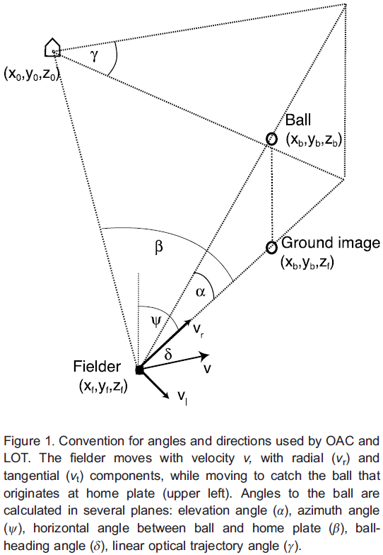
- LOT predicts that the fielder’s radial and tangential movements are coupled to maintain a constant angle, while in OAC, radial and tangential movements are independent.
- Thus, we can test which of these two theories is correct by testing each movement independently.
- Distinguishing the three theories (TP, OAC, and LOT) is complicated by the fact that they all predict successful catches with the same starting and ending positions with only small differences in predicted paths.
- One way to test them is to use virtual reality to create physically impossible trajectories by perturbing the ball mid-flight and testing which relations are held constant. TP, LOT, and OAC make different predictions about the fielder’s response to the inflight perturbation.
- E.g. Changing the trajectory from parabolic to linear mid-flight.
- TP predicts that the ball’s landing point is predicted from initial conditions so the perturbation shouldn’t affect the fielder’s movement.
- LOT predicts that the fielder’s radial and tangential velocities will be coupled to maintain gamma.
- OAC predicts that the fielder’s radial velocity will be unaffected so the horizontal angle beta is unchanged.
- No notes on the methods section.
- Normal fly balls followed a parabolic path, while perturbed fly balls followed a parabolic path until apogee. At apogee, the ball descended on a linear path with a constant vertical velocity which changed its vertical optical acceleration but not its lateral optical motion.
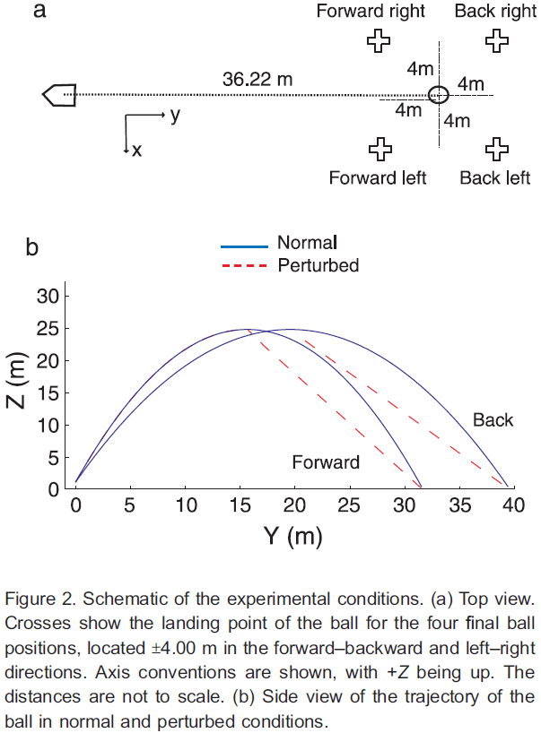
- OAC holds that the rate of change of the elevation angle is constant on normal trials.
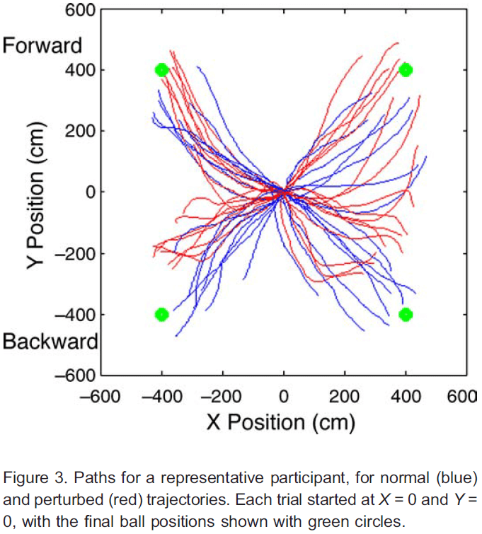
- The results from the experiment are consistent with OAC’s predictions as the ball’s optical acceleration was approximately zero both before and after the perturbation.
- The results are inconsistent with LOT as the perturbation affected one angle but not the other, indicating that the participants radial and tangential movements aren’t actually coupled.
- The findings here provide strong evidence that participants cancel the ball’s optical acceleration to control their radial movements.
- It appears that radial and tangential movements of fielder’s are controlled independently, consistent with OAC.
- In summary, the results suggest that perception is used to guide action by means of a continuous coupling of visual information to movement, without requiring an internal model of the ball’s trajectory.

## [Neurophysiological evidence of efference copies to inner speech](https://doi.org/10.7554/eLife.28197)

- Efference copy: an internal duplicate of movement-producing neural signals.
- Efference copies are used to predict, and often suppress, the sensory consequences of willed/controlled movements.
- This paper found that inner speech is also associated with an efference copy.
- Inner speech/covert speech: the silent production of words in one’s mind.
- This suggests that inner speech may ultimately reflect a special type of overt speech.
- Sensory attenuation/self-suppression: the phenomenon that self-generated sensations feel less salient, and evoke a smaller neurophysiological response, than externally-generated sensations that are identical.
- Sensory attenuation is believed to result from an internal forward model (IFM) where the sensory consequences of self-generated movements are predicted based on a copy of the outgoing motor command (efference copy).
- The predicted sensations are compared to the actual sensations resulting from the movement and the difference between predicted and actual sensation is sent up the neuronal hierarchy for further processing.
- This explains why much of the sensation from self-initiated sensations typically feel less salient and evoke smaller neurophysiological response than externally-generated sensations.
- Sensory attenuation has been extensively studied in the context of overt speech production.
- N1-suppression: when the characteristic N1 component of an auditory stimuli is supressed for self-generated sounds.
- Overt speech results in N1-supression and manipulating the overt speech feedback by pitch-shift or delay reduces the amount of suppression.
- The goal of this study is to explore whether N1-suppression, which has been consistently observed in response to overt speech, also occurs in response to inner speech.
- Inner speech appears to be a special case of overt speech in that the articulator organs don’t actually move and that inner speech activates similar brain regions to overt speech except for the primary motor cortex.
- It’s difficult to study an IFM for inner speech because it doesn’t cause a measurable auditory-evoked potential, which means that N1-suppression to inner speech can’t be determined.
- However, the existence of an IFM for inner speech can be inferred based on how the production of inner speech suppresses the brain’s electrophysiological response to overt speech.
- Features of the IFM associated with overt speech
    - The efference copy is time-locked to the onset of the action.
    - Contains specific predictions as to the expected sensory consequences of that action.
- If inner speech has an IFM, then we’d expect similar features for inner speech.
- Thus, we can design an experiment that maximizes N1-suppression to overt speech where
    - The overt speech is presented simultaneously as the inner speech is produced.
    - The content of the overt speech matches the content of the inner speech.
- This experiment allows us to test whether inner speech produces N1-suppression to audible speech in the absence of any overt motor action.
- We had participants produce a single phoneme in inner speech at a specific time, designated by a visual cue.
- If the timing matched between generated phoneme and heard phoneme, it was the match condition. If the timing didn’t match, it was the mismatch condition.
- If participants weren’t instructed to generate a phoneme, this was the passive condition. If they were instructed, this was the active condition.
- Thus, we manipulated both the timing and content of inner speech production in the presence of an external/audible phoneme.
- The results suggest that inner speech production is associated with a time-locked and content-specific IFM, similar to the one that operates in the production of overt speech.
- Furthermore, this suggests that inner speech, by itself, is able to elicit an efference copy and cause sensory attenuation, even in the absence of an overt motor action.
- No notes on the actual experimental details.
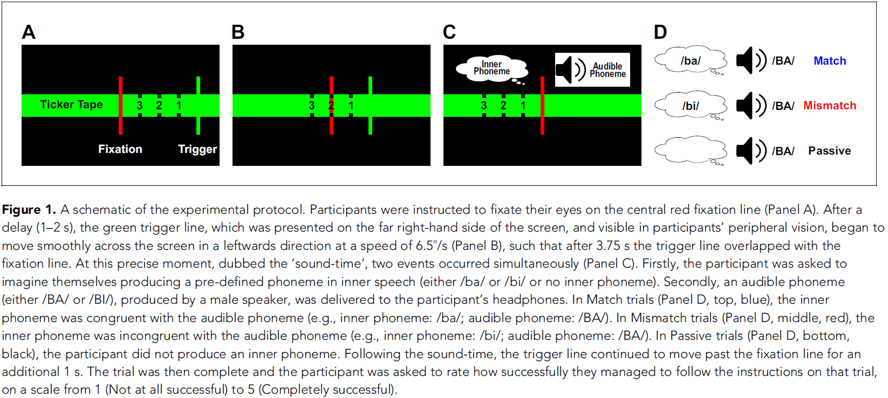
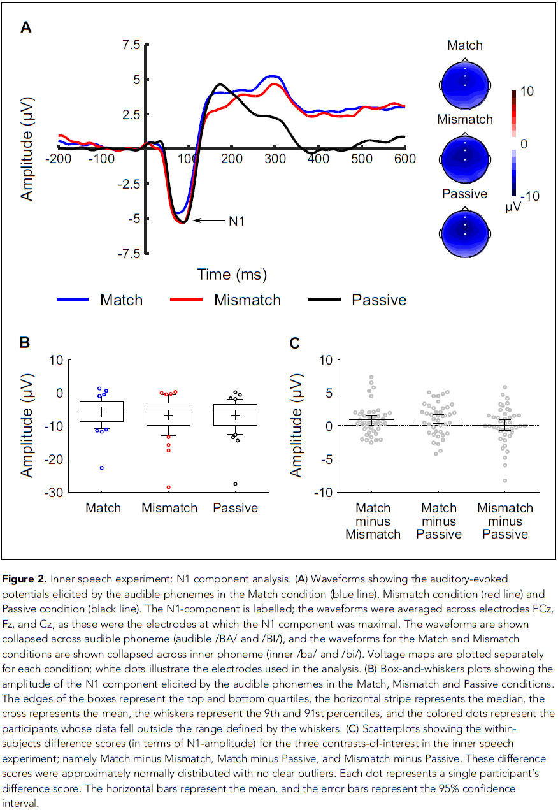
- To provide a baseline for the inner speech experiment, we also conducted an overt speech experiment that had the same experimental procedure to the inner speech experiment except that participants were instructed to overtly, as opposed to covertly, vocalize the phonemes at the sound-time.
- The overt speech experiment found results consistent with the inner speech experiment.
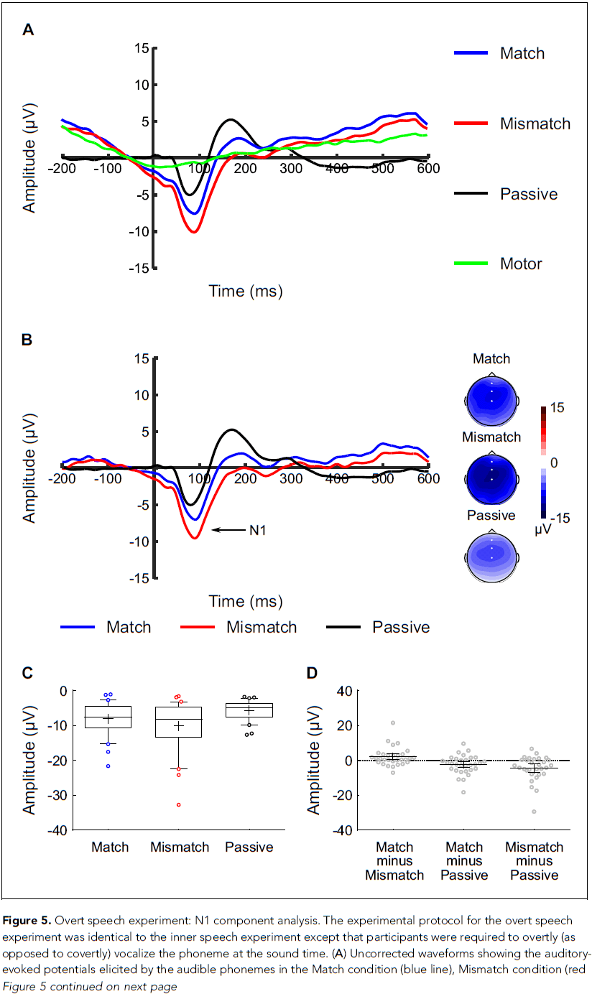
- The key finding of this paper is that the production of inner speech, by itself, led to N1-suppression to an audible sound.
- It seems reasonable to assume that the mechanism behind N1-suppression to overt speech, using an efference-copy mediated IFM, is similar to the mechanism underlying sensory attenuation to inner speech.
- This aligns with the idea of inner speech ‘as a kind of action’ and the idea that “thinking is merely our most complex motor act”.
- Our results provide support for the idea that inner speech is a special case of overt speech.

## [Opportunities and challenges for a maturing science of consciousness](https://doi.org/10.1038/s41562-019-0531-8)

- The problem of consciousness, of how subjective experiences come about, is often portrayed as a deep mystery that requires radical solutions.
- This paper argues that the growth of the scientific study of consciousness requires funding and creating jobs in addition to the empirical findings themselves.
- Achieving a better understanding of consciousness is critical to multiple medical, scientific, legal, and ethical issues.
- E.g. Consciousness in anesthesia, non-communicating patients, infants, other animals, and machines. The assessment of moral responsibility.
- Notably, the widespread adoption of rigorous experimental procedures using subjective reports, once eschewed by behaviourists as being outside the realm of science, have paved the way for new areas of scientific enquiry within neuroscience.
- Despite these exciting new applications of consciousness science, the scarcity of academic jobs and funding opportunities presents obstacles to further development.
- Some private foundations prioritize or focus only on consciousness research.
- E.g. Templeton Foundation, Tiny Blue Dot Foundation, Mind Science Foundation, and the Azrieli Program in Brain, Mind, and Consciousness (hosted by the Canadian Institute for Advanced Research).
- Two issues of the field of consciousness
    - We should be cautious and avoid overemphasis on projects of unrealistic ambition.
        - E.g. A complete and universal theory of consciousness beyond what can be tested now or in the near future.
        - It’s important to distinguish empirically productive hypotheses from mysterious and untestable claims.
    - We need to address how peer review of proposed research can be implemented in an open and fair manner.
        - Given the relatively small size of the field of consciousness research, the challenge lies in helping private funders identify non-conflicted dedicated experts who are genuinely invested and broadly representative of the field.
- Although media exposure of consciousness science is frequent due to high public interest, popular articles often focus more on the theoretically far-reaching nature of the problem than on factual details of current empirical research.
- Despite these challenges, we remain optimistic about the future.

## [Patients with hippocampal amnesia cannot imagine new experiences](https://doi.org/10.1073/pnas.0610561104)

- Amnesic patients are well known to have deficits in remembering their past experiences, but does this also apply to new experiences (imagination)?
- This paper tested whether amnesic patients with bilateral hippocampal damage could construct new imagined experiences in response to short verbal cues that outlined simple common scenarios.
- The results showed that patients were impaired relative to control subjects at imagining new experiences and a possible cause is that the patients’ imagined experiences lacked spatial coherence.
- Amnesic patients’ imagined experiences consisted of fragmented images, which suggests that the hippocampus may contribute to the creation of new experiences by providing the spatial context in which distinct elements of an experience can be bound.
- Given how closely imagined experiences match episodic memories, the absence of this function mediated by the hippocampus may also affect the ability to vividly re-experience the past.
- Two questions address by this paper
    - Is the hippocampus critical for imagining experiences?
    - Is there a specific hippocampal mechanism underpinning imagination that might also play a role in episodic memory?
- Each participant was tested on ten scenarios covering a range of themes.
- E.g. Beach, museum, pub, port, market, forest, castle, etc.
- Participants were also tested on imagining future scenarios instead of fictional ones, but since the results had identical patterns, we collapsed them for clarity.
- The patient group scored significantly lower on the overall experiential index than the control group, suggesting that the ability to richly imagine new experiences is compromised with bilateral hippocampal damage.
- Each scenario description given by the participants were classified into one of four categories
    - Spatial reference: statements on the relative position of entities.
    - Entity presence: number of distinct entities.
    - Sensory description: statements describing properties of an entity.
    - Thought/emotion/action: introspective thoughts or emotional feelings.
- For each category, patients produced fewer details than controls.
- Next, we tested whether each patient felt like the imagined experiences were taking place in an integrated and coherent spatial context.
- Spatial coherence index: a measure of the contiguousness and spatial integrity of the imagined scene.
- Compared with controls, the feedback from patients indicated that their imagined experiences were fragmentary and lacked coherence.
- Conclusions from this paper
    - Patients with hippocampal amnesia have a deficit in richly imagining new experiences.
    - The role of the hippocampus extends beyond reliving past experiences to not only imagining plausible self-relevant future events, but also generally to the construction of fictitious experiences.
    - A mechanism that might underpin these deficits may be deficits in spatial coherence resulting in fragmented and poor constructions.
- Given how closely imagined experiences match episodic memories, the absence of this function mediated by the hippocampus may affect the ability to re-experience or reconstruct past events.
- The impaired ability to imagine new experiences wasn’t due to anterograde amnesia as patients were constantly tested on the task and instructions to ensure they didn’t forget.
- It could be argued that the creation of imagined new experiences relies on retrieval of recent episodic memories, a process severely disrupted in hippocampal amnesiacs.
- However, the use of common scenarios and asking participants to not recount an actual memory weakens this argument.
