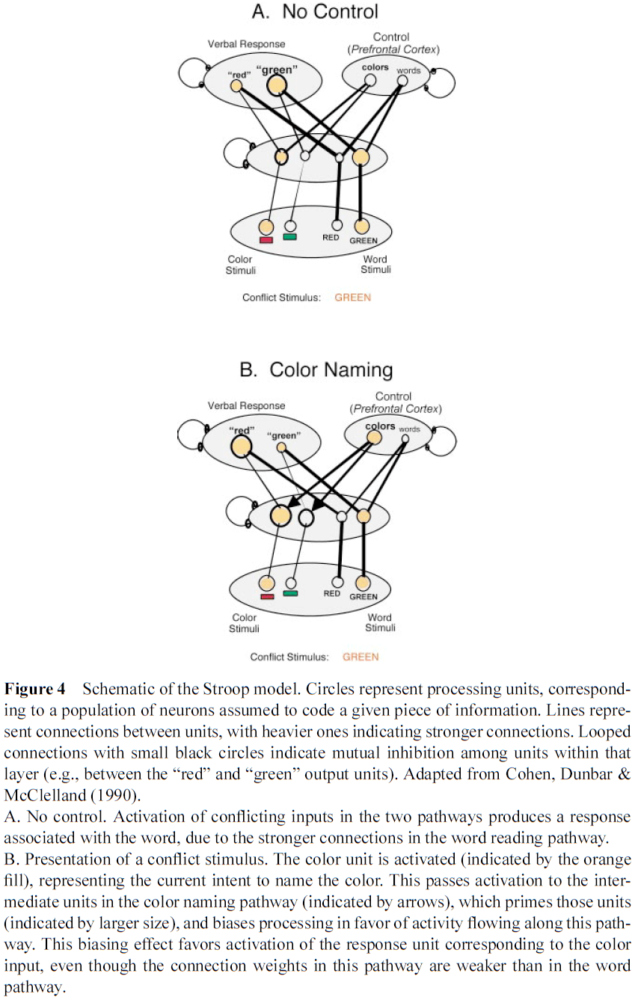
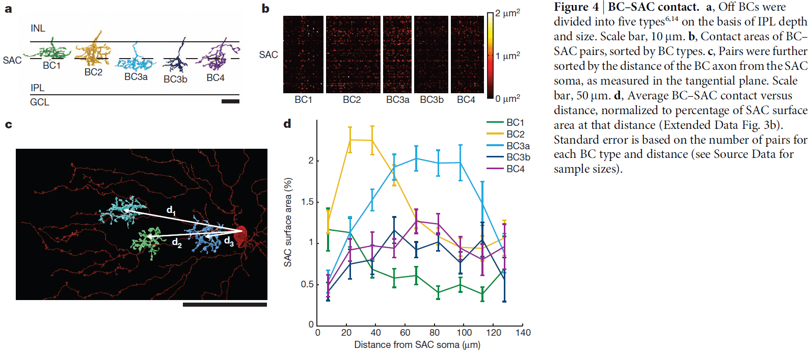

## [The Hippocampal Memory Indexing Theory](https://content.apa.org/doi/10.1037/0735-7044.100.2.147)

- This paper proposes the theory that the hippocampus forms and retains an index of neocortical areas activated by experienced events.
- The hippocampal index thus represents the unique cortical regions activated by specific events.
- This suggests that reactivation of the stored hippocampal memory index will serve to reactivate the associated unique set of neocortical areas and this results in reexperiencing a memory.
- The hippocampal memory index also implicates the neocortex as the location of long-term memories.
- Long-term potentiation (LTP) is suspected to be involved as a mechanism underlying information storage.
- The brain region with the most pronounced LTP is the hippocampal formation made up of the dentate gyrus, hippocampus, and subiculum.
- This paper is an attempt to develop a plausible model for information storage and retrieval in the brain.
- Hippocampal memory indexing theory
    - Asserts that the hippocampus stores a map of locations of other brain regions such as the neocortex.
    - Sensory information is processed at various cortical sensory and association areas in assemblies of cortical modules.
    - The cortical module forms the basis for the cortical processing of stimulus information relayed to the neocortex by thalamocortical and other pathways.
    - The additional processing of this information by ipsilateral association and commissural fibers forms links between stimulus patterns and events, assigning significance or meaning to the incoming stimulus pattern.
    - Sensory organs → Thalamocortical sensory systems → Pattern of cortical modules → Hippocampus
    - The role of the hippocampus is to store a map/index of the cortical modules activated by experience.
    - The hippocampal storage of the spatiotemporal pattern of active cortical modules occurs, at least initially, through LTP at hippocampal synapses.
    - Any neocortical modules and any hippocampal index of that module may participate in numerous memories.
    - Only the location and temporal sequence of activated cortical modules are encoded.
    - Reactivation of these neocortical modules in the right spatiotemporal sequence will simulate the original experience.

- If a new event feels similar to previous events, we predict that the spatiotemporal index stored in the hippocampus for the new event will match or be very similar to the index for the previous event.
- Once the memory index is established in the hippocampal array, it can further change by repeated activation of the same neocortical-to-hippocampal pathways.
- Alternatively, given no further activity on those specific pathways, the hippocampal index will decay over time due to LTP decaying.
- If only parts or a subset of a previously indexed neocortical array are activated by experience, then only those currently experienced parts of the stored hippocampal memory index will be activated.
- However, if the hippocampal activation exceeds some threshold, then the rest of the hippocampal index will activate and thus, reactivate the entire neocortical array.
- In behavioral terms, if only a subset of the index is activated, we call this recognition memory. If the entire index is activated, we call this recall memory.
- Whereas recognition is driven by external stimuli that are recognized by the hippocampus, in recall, the hippocampus is able to activate an array of cortical modules in the correct spatiotemporal sequence to bring about the reexperiencing of a memory.
- The hippocampus is continually and automatically testing every pattern of cortical activation to determine whether it matches any stored patterns. It tests whether an experience was already experienced in the history of the organism.
- If a match is found, either complete or partial, then a previously experienced event is reactivated.
- Repeated reactivation of a memory reinforces and strengthens the hippocampal index associated with that memory.
- Evidence from human studies support the idea
    - That the hippocampus isn’t necessary for retrieving old memories.
    - That there exists a neocortical mnemonic process that takes over from the hippocampus over an extremely long (three year) time course.
- Over a long time and with continual reactivation, the memory would rely less on the hippocampal index and cortical circuitry takes over.
- The theory also implies that the hippocampus stores every experiential event.
- Studies show this isn’t true and instead that experiential events are modulated by their importance.
- Memory storage and retrieval are a graded process that can be modulated by other agents or processes.
- We propose that the subcortical connectivity of the hippocampus functions to integrate the homeostatic, affective, and visceral aspects of an organism’s response to a recalled event.
- Although it’s not currently possible to do more than speculate regarding the detailed topological relations between the hippocampus and neocortex, we predict that the output of the hippocampus is able to topographically reaccess the neocortical modules whose activity was initially impressed onto the hippocampus.
- The role of the hippocampus is to store only the event and not the associations an event may elicit.
- Predictions
    - A functional link exists between the hippocampus and neocortex.
    - The indexing theory requires a two-way conversation between the hippocampus and neocortex, which must be demonstrable by anatomy and physiology.
    - The theory requires a topological representation of neocortical modules in the hippocampus.
    - Thus, the functional connections between hippocampus and neocortex must preserve topography.
    - We predict that the functional activation of regions of the neocortex results in specific topological patterns of activation in the hippocampus.
    - Cortical activation by experiential events can induce LTP in corresponding hippocampal loci.
    - Similarities between hippocampal and neocortical damage are expected as these two structures are hypothesized to work in a cooperative manner.
- This paper presents a theory of how the hippocampus, LTP, and neocortex may interact in memory functions in the mammalian brain.

## [What Happened to Mirror Neurons?](https://doi.org/10.1177%2F1745691621990638)

- Ten years ago, mirror neurons were everywhere.
- Mirror neuron interest can be measured by the number of academic publications which peaked in 2013 and has since been declining.
- Mirror neuron basics
    - Mirror neurons were discovered by chance in monkeys in 1992 and described as “mirror neurons” four years later.
    - Three types
        - Strictly congruent: respond during execution and observation of the same action.
            - E.g. When the monkey performs a precision grip and when it passively observes a precision grip performed by another agent.
        - Broadly congruent: respond during the execution of one action and during the observation of one or more similar, but not identical, actions.
            - E.g. Execution of a precision grip and observation of a power grip, precision grip, or related movement.
        - Logically related: respond to different actions in observe and execute conditions.
            - E.g. Experimenter placing food in front of the monkey and when the monkey grasps the food to eat.
- Strictly and broadly congruent neurons were the primary interest of researchers and is what most researchers mean when we use the term “mirror neuron”.
- These cells are intriguing because, like a mirror, they respond and match observed and executed actions; they code both “my action” and “your action”.
- Monkey mirror neurons are responsive to the observation and execution of hand and mouth actions.
- Mirror neurons were originally found using single cell recording in the ventral premotor cortex and inferior parietal lobule on the monkey brain.
- Like monkey mirror neurons, we’ve found consistent evidence that human mirror neurons exist in both areas.
- Research using single-cell recording suggests that mirror neurons are typically present in adult human brains.
- Four possible functions of mirror neurons
    - Action understanding
    - Speech perception
    - Imitation
    - Potential dysfunction in autism
- Action understanding
    - One summary analysis concluded that there was broad agreement that mirror neurons “plays some role in action process” but there’s no agreement on what that role might be.
    - E.g. It could be low level such as movement execution or high level such as movement intention.
    - Evidence suggests that mirror neurons encode concrete representations of observed actions; the lower levels of observed actions.
    - However, any involvement doesn’t mean that mirror neurons play a causal role in action processing.
    - A recent review concluded that there’s no compelling evidence for the involvement of mirror neurons or any mirror-neuron brain areas in higher level processes such as inferring other people’s intentions from their observed actions.
- Speech perception
    - Researchers agree that the motor system has some role in speech perception, but they disagree about the type and magnitude of the system’s role and whether mirror neurons are particularly important.
    - While neuroimaging studies implicate the mirror-neuron brain areas in speech perception, evidence from patient studies contradict these findings.
    - E.g. If speech perception requires perceived speech to be matched with motor commands for the production of speech, then one should find speech perception impairments in patients who have impairments in speech production due to brain lesions.
    - This prediction is countered by a series of studies that showed intact speech sound discrimination in patients with speech production difficulties.
    - There seems to be reasonably strong evidence for the involvement of the motor system in the discrimination of speech in perceptually noisy conditions, but this conclusion isn’t supported by patient data.
- Imitation
    - This function received the strongest consensus among researchers due to two main findings.
    - The first finding was that repetitive transcranial magnetic stimulation (TMS) of the inferior frontal gyrus, a mirror-neuron brain area, selectively impairs imitative behavior.
    - Causal methodologies, such as brain stimulation and patient studies, continue to support the consensus that mirror-neuron brain areas contribution to imitation.
    - E.g. Stimulation of the inferior frontal gyrus demonstrated improvement in vocal imitation and naturalistic mimicry.
    - Data from fMRI studies also support this function as we find greater responses in mirror-neuron brain areas during imitation compared to other closely matched tasks.
- Autism
    - In contrast with imitation, researchers has huge disagreements on autism and mirror neurons.
    - Broken-mirror theory: that people with autism have abnormal activity in mirror-neuron areas of the brain.
    - A systematic review found little evidence for a global dysfunction of the mirror system in autistic people.
    - Overall, past research has provided no compelling evidence for the claim that autism is associated with mirror-neuron dysfunction.
- Do mirror neurons get their characteristic visual-motor matching properties from learning?
- One answer is that mirror neurons develop from the matching properties of standard sensorimotor associative learning.
- E.g. Mirror neurons start out as motor neurons but through correlated experiences of seeing and doing the same actions, these motor neurons become strongly connected to visual neurons tuned to similar actions.
- Another possibility is that there’s an innate or genetic predisposition to develop mirror neurons that’s independent of experience.
- More evidence has emerged arguing that learning plays an important role in the development of mirror neurons.
- E.g. Expert pianists and dancers had greater activity in mirror-neuron brain areas compared to observers who lacked such expertise.
- E.g. Wiggett et al. found using fMRI that mirror-neuron brain areas were more strongly activated by observation of hand movement sequences in participants who had simultaneously observed and executed the movements (sensorimotor learning) than in participants who had either observed the movements without performing them (sensory learning) or performed the movements without observing them (motor learning).
- The idea that motor learning alone is enough to change the properties of mirror neurons hasn’t been supported.
- It’s now well established that sensorimotor learning is important for the development of mirror neurons, but we don’t know the details of this learning.
- Two competing accounts of how mirror neurons develop
    - Associative account: maintains that the sensorimotor learning that builds mirror neurons is the same kind of learning that produces Pavlovian and instrumental conditioning.
    - Canalization account: suggests that monkeys and humans genetically inherit a specific propensity to acquire mirror neurons.
- Evidence is consistent with the associative account as mirror-neuron learning depends on standard conditioning such as contingency and contiguity.
- Recent studies have found no evidence of imitation in newborn monkeys and similar work in human neonates points in the same direction.
- Evidence doesn’t support the historical claim that newborns are capable of voluntary imitation of a range of action, and thus doesn’t support the canalization account.
- Reflection
    - On action understanding, evidence suggests that mirror-neuron brain areas contribute to low-level processing of observed actions but not directly to high-level action interpretation.
    - On speech perception, the role of mirror neurons remains unclear.
    - On imitation, we have strong evidence that mirror-neuron brain areas play a causal role in behavioral copying of body movement topography.
    - On autism, we have no evidence for the broken-mirror theory.
- These findings are disappointing relative to early newspaper headlines.
- Possible reasons why mirror neurons became so popular
    - The deep historical pull of atomism, that objects are built out of units such as mirror neurons that combine sensory and motor properties, captivated people by the simple and tidy idea to explain complex ideas such as political strife and the social world.
    - Some descriptions of mirror neurons imply telepathy or reading other’s minds.
- The field studying mirror neurons has produced substantial findings which shouldn’t be dismissed just because mirror neurons are “the most hyped concept in neuroscience”.
- In the author’s view, much of the skepticism about mirror neurons is based on a misunderstanding.
- Humans are better imitators than other animals because sociocultural experience provides humans with matching sensorimotor experience for a broader range of actions.
- We need to think hard about why neurons have mirror properties.
- Mirror neurons contribute to complex control systems rather than dominating such systems or acting alone.
- Rather than being developed through genetics, mirror neurons acquire their properties through sensorimotor learning.
- Mirror neurons shouldn’t be tarnished and they have yet to fulfill their true promise.

## [Representational drift in primary olfactory cortex](https://doi.org/10.1038/s41586-021-03628-7)

- Perceptual constancy requires the brain to maintain a stable representation of sensory input.
- For olfaction, the primary olfactory cortex (piriform cortex) is thought to determine odour identity and thus has odour representations.
- This paper presents results from electrophysiological recordings of single units in the piriform cortex over weeks to study the stability of odour-evoked responses.
- Although the activity in piriform cortex could be used to discriminate between odorants at any time, odour-evoked responses drifted over days to weeks.
- Fear conditioning didn’t stabilize odour-evoked responses but daily exposure to the same odorant did slow the rate of drift.
- This evidence of continuous drift makes us question the role of piriform cortex in odour perception.
- In primary sensory areas, tuning to basic features such as retinotopy, somatotopy, and tonotopy is stable.
- Responses may vary over days but without perturbation or training, this variability is bounded and differences don’t accumulate over time.
- In the olfactory system, sensory neurons with the same receptors project to the same glomeruli in the olfactory bulb, thus, each odorant evokes a distinct, but stable, pattern of activity in the bulb.

- However, axonal projections from individual glomeruli discard this spatial patterning and diffusely innervate the piriform cortex without apparent structure.
- Since odorant information goes to the piriform cortex, we expect it to be the location in the brain where we determine the identity of the odorant.
- If piriform cortex does determine odorant identity, then perceptual constancy requires that its activity is stable.
- We examined the stability of odour-evoked activity in mouse anterior piriform cortex in response to a set of odorants over 32 days and recorded from 379 single units.
- There were gradual and sudden changes in odour responses across days.
- Single units either gained or lost responsiveness to a given odorant and only rarely showed stable responses to the odorant panel.
- The probability of a single unit maintaining a response to an odour across 32 days was about 6-7%.
- We quantified drift by comparing the single-unit response magnitude for each odorant across days and found that responses become increasingly dissimilar over time.
- Variance in single-unit waveform stability metrics didn’t explain variance in odour response similarity across days.
- Piriform cortex exhibits representational drift as changes in odour-evoked responses accumulate over time and trend towards complete decorrelation within weeks.
- Further observations show that drift in odour-evoked responses isn’t due to a global diminution in responsivity and occurs against the background of stable population response properties.
- Regions downstream of piriform cortex could compensate for drift in the response of neurons over time if the geometry of odour-evoked population activity were conserved.
- The geometry of population activity evoked by relatively dissimilar odorant molecules isn’t conserved but rather changes gradually.

- Next, we investigated whether evoked responses to a behaviorally salient odorant might exhibit greater stability.
- Recordings showed that evoked population responses to conditioned stimuli drifted at a rate comparable to that of neutral odours.
- Thus, fear conditioning doesn’t appear to stabilize odour-evoked responses in piriform cortex as we observed stable behavior in spite of drifting neural activity.
- What’s the purpose of this representation drift?
- One hypothesis is that drift in piriform cortex may reflect a learning system that continuously updates and overwrite itself.
- Two supporting observations
    - The rate of drift of the evoked responses to familiar odorants was less than half that of unfamiliar odorants.
    - Continual experience with an odorant enhances the stability of piriform cortex’s evoked responses to it.
- It’s unlikely that the changes in odour-evoked responses observed here are caused by a failure to follow the same population of neurons.
- Once daily odour exposure ceased, evoked responses to the familiar and unfamiliar stimuli drifted at similar rates, thus, daily exposure slows representational drift.
- Regions downstream of piriform cortex could compensate for representational drift.
- E.g. Replay of previous odorants to regularly update the downstream region, exploiting some invariant geometry in odour-evoked population activity, or that the small subset of single units that did show preserved odour-evoked responses are responsible for encoding odour identity.
- Although we failed to uncover evidence for an invariant geometry, this doesn’t rule out the possibility of an invariant structure that lies on a nonlinear manifold.
- Piriform cortex may not be the ultimate arbiter of odour identity as other brain regions also receive olfactory sensory information.
- E.g. Anterior olfactory nucleus, olfactory tubercle, cortical amygdala, and lateral entorhinal cortex.
- Three main observations of this paper
    - Representational drift
    - History-dependent stabilization
    - Drift of previously stabilized odour-evoked responses
- These observations are consistent with the model that the piriform cortex is a fast learning system that continually learns and continually overwrites itself.
- Lacking a mechanism to stabilize these memory traces, however, piriform cortex can’t store these memories for the long term.
- In this model, representational drift in piriform cortex is a consequence of continual learning and continual overwriting where learned representations may be transferred to a more stable region downstream for long-term storage.
- The stability of neural activity and representations varies across brain regions.
- E.g. In the hippocampus, representational drift is seen but in primary sensory regions, representational drift is limited.
- What conditions promote drifting versus stable neural activity?
- Maybe anatomical organization sets a bound on changes in stimulus tuning to basic features.
- E.g. In primary visual cortex, the weakening or loss of one synapse onto a visual cortical neuron is likely matched by the strengthening or gain of a synapse tuned to a similar retinotopic region, limiting representational drift.
- However, the organization of piriform cortex differs in that it receives distributed and unstructured inputs from olfactory bulb and there appears to be a lack of topographic organization.

## [Humans Can Discriminate More than 1 Trillion Olfactory Stimuli](https://doi.org/10.1126/science.1249168)

- Humans can discriminate between 2.3-7.5 million colors and around 340,000 tones, but the number of discriminable olfactory stimuli remains unknown.
- Using psychophysical testing, we calculated that humans can discriminate at least 1 trillion olfactory stimuli.
- This demonstrates that the human olfactory system, with its hundreds of different olfactory receptors, far outperforms the other senses in the number of physically different stimuli it can discriminate.
- To determine how many stimuli can be discriminated, we first must know the range and resolution of the sensory system.
- E.g. Wavelength and intensity for color, frequency and loudness for tones.
- Then, we can calculate the number of discriminable stimuli from the range and resolution.
- For olfaction, it’s difficult to estimate its range and resolution because the dimensions and physical boundaries of the olfactory stimulus space aren’t known.
- Further, olfactory stimuli are typically mixtures of odor molecules that differ in their components.
- Thus, the strategies used for other sensory modalities can’t be applied to the human olfactory system because of the many dimensions of olfaction.
- The previous number of discriminable odor stimuli, 10000, was based on four dimensions each with a nine-point scale.
- However, we know that this isn’t the upper limit.
- E.g. The scent of a rose is a mixture of 275 components.
- We only investigated mixtures of 10, 20, or 30 components drawn from a collection of 128 odorous molecules.

- The 128 molecules cover much of the perceptual and physicochemical diversity of odorous molecules.
- To create mixtures A and B, we combined these components together in equal ratios.
- The main difference between two mixtures with the same number of components is the percentage/ratio of components.
- By varying the ratio, we can determine the resolution of the human olfactory system.
- E.g. What percentage must two mixtures differ on average so that they can be discriminated by the average human nose?
- Methods
    - Subjects performed forced-choice discrimination between pairs of mixtures.
    - In double-blind experiments, subjects were presented with three odor vials, two of which had the same mixture while the third had a different mixture.
    - The order of the tests was randomized.
    - Total of 260 mixture discrimination tests.
    - Had four control discrimination tests to measure general olfactory acuity and to ensure subject compliance.
    - Twenty-eight subjects completed the study but two were excluded.
- We found that pairs of mixtures are more difficult to distinguish the more they overlap.
- No subject could discriminate mixture pairs with more than 90% overlap.

- Of the 260 pairs of mixtures that were tested, subjects performed above chance level for 227 pairs.
- Resolution of the visual and auditory system is defined as the difference in frequency between two stimuli that’s required for reliable discrimination.
- Resolution of the olfactory system can be defined as the highest percentage overlap in components between two mixtures at which those mixtures can be distinguished.
- We found that the resolution of olfaction isn’t uniform across the olfactory stimulus space.
- E.g. Half of the mixtures with 20 components with 50% overlap could be discriminated, but the other half couldn’t be discriminated.
- This quirk of non-uniform resolution across stimulus space is also found in other sensory systems.
- E.g. In hearing, frequency resolution is better at low frequencies than at high frequencies. In vision, wavelength discrimination is best near 560 nm.
- We can calculate the resolution of olfaction in two ways
    - Discrimination capacity of subjects
    - Discriminability of stimulus pairs
- For olfaction, we found the resolution or maximum overlap to be between 51-57%.
- The lower limit of how many discriminable mixtures there are, or the inverse of resolution, is $$1.72 \times 10^{12}$$ mixtures for 30 components at a 51% resolution.

- Mixtures that overlap by less than 51% can be discriminated by the majority of subjects, which means that humans can, on average, discriminate more than 1 trillion mixtures of 30 components.
- However, there are large differences between subjects.
- E.g. One subject could discriminate $$1.03 \times 10^{28}$$ mixtures of 30 components, whereas another subject could only discriminate $$7.84 \times 10^{7}$$ mixtures.
- Our results show that there are several orders of magnitude more discriminable olfactory stimuli than colors or tones.
- This study focused only on stimulus quality and not stimulus quantity (intensity-based discrimination).
- The actual number of distinguishable olfactory stimuli is likely higher than $$1.72 \times 10^{12}$$ since mixtures can be made up of more than 128 components combined in groups of 30 at different ratios.

## [Critical Role of the Hippocampus in Memory for Elapsed Time](https://doi.org/10.1523/JNEUROSCI.1733-13.2013)

- Episodic memories include how long ago those specific events occurred.
- This temporal context is crucial for distinguishing individual episodes.
- The discovery of timing signals in hippocampal neurons, time cells, strongly suggests that the hippocampus is important for tagging the time in episodic memories.
- This paper tests the hypothesis that the hippocampus is critical for keeping track of elapsed time over several minutes.
- We found that the hippocampus was essential for discriminating smaller, but not larger, temporal differences, consistent with a role in temporal pattern separation.
- This suggests that the hippocampus plays a critical role in remembering how long ago events occurred.
- Previous findings suggest that a fundamental role of the hippocampus is to provide an internal representation of elapsed time, which may support our capacity to remember the timing of individual events.
- However, this crucial link has yet to be shown.
- Basic timing ability is either normal or mildly impaired with hippocampal dysfunction.
- Uncovering the role of the hippocampus will require the use of longer (> 40s) timescales.
- We developed a novel behavioral paradigm to test the hypothesis that the hippocampus is critical for keeping track of elapsed time over several minutes.
- Methods
    - We trained rats to use odor-interval associations to indicate how much time has passed since a specific event.
    - E.g. One odor for 1 minute, one for either 1.5/3/8 minutes, and one for 12 minutes.
    - To determine the contribution of the hippocampus, we use localized infusions of fluorophore-conjugated muscimol (FCM) to temporarily inactivate the hippocampus.
    - No notes on the detailed methods.
- Fluorescence imaging confirmed that a large part of the rostrocaudal extent of the hippocampus was infused with FCM and very little FCM spread to other structures.
- This is evidence that the infusions were localized to the hippocampus, thus inactivating it.
- Interval conditions
    - 1-3-12 min: finding show that discriminating intervals separated by large temporal differences don’t depend on the hippocampus and FCM infusions had no significant effect.
    - 1-8-12 min: FCM infusions significantly impaired performance for discriminating 8 vs 12 min trials while not impairing other trials, suggesting that the hippocampus is critical for discriminating small, but not large, temporal differences.
    - 1-1.5-12 min: FCM infusions significantly improved 1 vs 1.5 min trials, suggesting that hippocampal processing may be detrimental to the performance of fine temporal discriminations at seconds-long timescales.

- While hippocampal inactivations didn’t affect the ability to discriminate intervals separated by large temporal differences, they produced significant effects when temporal resolution demands were increased.
- E.g. 8 vs 12 min difference.
- These findings represent a compelling demonstration that the hippocampus is necessary for remembering the time that has elapsed since an event.
- Interestingly, performance at the same temporal resolution, but on a short time scale (1 vs 1.5 min) was improved with hippocampal inactivations.
- This suggests that hippocampal processing is detrimental to performance at short timescales and may compete with another timing system for this scale.
- Overall, we found that hippocampal processing is beneficial when the temporal resolution demand is high and the timescale is long, but adverse when the temporal resolution is high and the timescale is short.

- Notably, little is known about the neurobiology of timing intervals in the range of minutes.
- We show that the hippocampus plays a critical role in remembering how long ago specific events occurred.

## [Brain Circuits for the Internal Monitoring of Movements](https://doi.org/10.1146/annurev.neuro.31.060407.125627)

- Each movement we make activates our own sensory receptors. This is a problem because the brain can’t tell if the sensation is due to an external actor or due to our own movement.
- In this paper, we consider circuits for solving this problem in the primate brain. Circuits that convey a copy of each motor command, known as a corollary discharge (CD), to sensory brain regions solve this problem.
- E.g. In the visual system, CD signals help to produce a stable visual percept from the jumpy imaging resulting from our rapid eye movements.
- A possible pathway for providing CD for vision is from the superior colliculus to the frontal cortex.
- This circuit warns about impending eye movements used for planning subsequent movements and analyzing the visual world.
- A major function of nervous systems is to process sensory input to detect changes in the environment and act on those changes.
- E.g. A cat pouncing on a mouse requires it to ignore the sensation of grass brushing against its legs and to move its head and eyes to track the target.
- Moving any sensory organ to improve its detection ability, however, momentarily disrupts the very sense it’s intended to help.
- Nervous systems require a solution to these self-generated movement disruptions in sensation.
- One major mechanism is to provide warning signals to sensory systems from within the movement-generating systems themselves.
- The importance of motor-to-sensory feedback is seen if we imagine that they don’t exist.
- E.g. Moving a security camera causes the image to jerk, blurring the image during the time of movement.
- The fundamental difference between the security camera and the eye is internal feedback of movement information.
- This internal feedback, this warning signal, is the corollary discharge.
- Corollary discharge (CD): a copy of a motor command sent to brain areas for interpreting sensory inflow (also called efference copy).
- Efference: motor outflow that causes movements.
- Review of saccades (rapid eye movements).
- The saccadic network provides an attractive model system for studying the sources of CD and the pathways the distribute CD to sensory areas.
- Retina → V1 → Lateral intraparietal (LIP) → Frontal eye fields (FEF) → Superior colliculus (SC) → Midbrain and pontine reticular formation → Oculomotor nuclei that innervate each of the six eye muscles.

- The parietal and frontal areas (LIP and FEF) contribute to the generation of voluntary saccades.
- What does a saccadic CD circuit look like?
- In theory, a CD pathway should run counter to the normal downward flow of sensorimotor processing.
- One such pathways is from the SC → Medial dorsal nucleus (MD) of the thalamus → FEF.
- It’s challenging to establish that a neuron carries CD as opposed to a movement command because by definition, both the command and CD should look the same.
- Four criteria for identifying CD
    - Must come from a brain region known to be involved in movement generation, but it must travel away from the muscles.
    - The signal should occur just before the movement and represent its spatial and temporal parameters.
    - The neurons shouldn’t contribute to producing the movement.
    - Perturbing the CD pathway does disrupt performance on a task that depends on a CD.
- Double-step task: when two targets are flashed sequentially and the subject has to make a saccade to the first target and then to the second. The initial fixation point and the two flashed targets are gone before the saccades begin.
- In the double-step task, the observable event is the second saccade and the parameter of interest is its vector.
- E.g. If the vector is correct, this implies perfect CD. If the vector is incorrect, this implies an inaccurate CD.

- To test the SC-MD-FEF CD pathway, we reversibly inactivate the MD relay node, thereby disrupting the pathway.
- If the inactivation eliminates CD, the monkey should make the correct first saccade but the incorrect second saccade.
- We found that inactivation of MD did cause the second saccade end point to shift as if CD of the first saccade was impaired.
- The impairment was significant but smaller than expected, suggesting that we didn’t silence the pathway completely or that other CD pathways exist.
- Interestingly, the deficit was limited to trials where the first saccades were made into the contralateral visual field. So, the deficit matched the direction of saccades represented in the affected MD nucleus.
- Successive saccades depend on CD.
- In its normal state, the brain precisely monitors even small fluctuations in saccade amplitude and adjusts subsequent saccades accordingly.
- If the CD were changed by inactivation, the compensation should be altered and this is what we find.
- E.g. The second saccades during inactivation failed to rotate as a function of where the first saccades ended.
- These inactivation experiments suggest that activity in the SC-MD-FEF pathway not only correlate with an expected CD signal, but the activity actually functions as a CD signal.
- Thus, this pathway satisfies the four criteria we regard for identifying CD.
- E.g. The signals originate from a known saccade-related region, they encode the timing and spatial parameters of upcoming saccades, their removal doesn’t affect the generation of saccades, and their removal does disrupt saccades that depend on CD.
- Review of receptive field (RF).
- The RF of visual neurons shifts to a location dependent on the saccade that’s about to occur, and this is only possible if the neuron receives information about the imminent saccade.

- Such shifting RFs (remapped RFs) have been studied in many regions including the LIP, extrastriate visual areas, and the SC.
- No notes on the second experiment.
- Perturbing the CD allows us to move from correlation to causation.
- Three ways CD can influence neural activity
    - Suppression
    - Cancellation
    - Forward models
- Various studies in the primate visual-saccadic system support that the CD influences neural activity using suppression and forward models, with little evidence supporting the cancellation mechanism for saccades.
- No notes on CD and human disease.
- A CD signal represents the state of a movement structure such as the SC.
- The information of the CD signal is limited by the signals available to the structure, and the potential targets of the CD signal are constrained by the anatomical reach of the structure’s efferent pathways.

## [Primary sensory cortices contain distinguishable spatial patterns of activity for each sense](https://doi.org/10.1038/ncomms2979)

- Are the primary sensory cortices unisensory or multisensory?
- We used multivariate pattern analysis of fMRI data in humans to show that simple and isolated stimuli of one sense elicit distinguishable spatial patterns of neuronal responses, not only in their corresponding primary sensory cortex but also in other primary sensory cortices.
- This suggests that primary sensory cortices, traditionally thought of as unisensory, contain unique signatures of other senses.
- Traditional view of sensory processing
    - Information from different senses is initially processed in anatomically distinct, primary unisensory areas.
    - This information then converges onto higher-order multisensory areas.
    - Evidence
        - Lesions limited to primary sensory cortices (PSCs) clearly show unimodal sensory deficits.
        - Electrophysiological and functional neuroimaging studies show that sensory stimuli elicit activity in the primary sensory areas matching the sensory modality of the stimulus.
        - Tracing studies find few, if any, interconnections between primary somatosensory, auditory, and visual cortices.
- Alternative view of sensory processing
    - That cortical areas believed to be strictly unisensory are instead multisensory.
    - Evidence
        - Responses in unisensory cortices by corresponding sensory input can be modulated by concurrently applied non-corresponding sensory input.
            - E.g. In macaque monkeys, coincident tactile stimuli with auditory stimuli enhances the activity in or near the primary auditory cortex.
        - Studies find that activity in PSCs can be elicited by stimuli belonging to a non-corresponding sensory modality, but only when these stimuli convey information related to the modality.
            - E.g. Visual stimuli conveying information related to audition activates the auditory cortex.
    - However, these pieces of evidence don’t unequivocally prove that PSCs are multisensory.
    - E.g. The observed multisensory effect only modulates the primary stimuli, or could result from stimulus-triggered sensory imagery from the primary stimuli.
- Two unresolved questions
    - Can PSCs respond to stimuli of other senses when they’re not temporally coincident with stimuli of the principal modality?
    - Are non-principal responses elicited in PSCs unique for each modality?
        - E.g. Can V1 show different responses to non-corresponding auditory and tactile stimuli?
- We used multivariate pattern analysis of fMRI signals in the human primary somatosensory (S1), auditory (A1), and visual cortex (V1) and examined the spatial patterns of the neural responses elicited by the simple and isolated tactile, painful, auditory, and visual stimuli, and by tactile/visual stimuli delivered to two different body/visual field locations respectively.
- We found that in any PSC, the spatial pattern of the fMRI responses elicited by each sensory stimulus of another modality is sufficiently distinct to allow for reliable classification of the stimulus modality.
- E.g. Discriminating between tactile and auditory stimuli using fMRI responses from V1.
- We also found that two stimuli of the same modality presented at different locations also elicit distinguishable patterns of fMRI responses in non-corresponding PSCs.
- E.g. Discrimination between tactile stimuli to two fingers using the fMRI responses sampled within V1.
- These findings indicate that transient and isolated stimuli of one sense elicit distinguishable spatial patterns of neural activity not only in their corresponding PSC but also in non-corresponding PSCs.
- PSCs encode the modality of non-corresponding stimuli
    - We used simple and isolated stimuli to avoid multisensory integration and sensory imagery in PSCs.
    - In each of the three PSCs (S1, A1, and V1), six two-way classifications were performed.
    - P-value was determined by comparing the group-average accuracy with its corresponding null distribution generated by 10,000 random permutations.

    - This shows that the accuracy of each classification was significantly higher than chance level regardless of whether one of the two sensory modalities involved corresponded to the modality of the given PSC.
    - Thus, we can accurately classify the normalized fMRI responses in each PSC by each type of sensory stimulus.
    - E.g. We can classify between tactile and auditory stimuli using the fMRI response in V1.
    - Regardless of which two sensory modalities were classified, the contributing voxels in a given ROI always responded more strongly to their corresponding sensory modality than to non-corresponding modalities.
    - Within each PSC, the information of each stimulus modality is distinguishable at a spatially distributed pattern level.
- Modality coding in PSCs isn’t determined by edge voxels
    - Although our results don’t allow us to conclude that the core of the PSCs has a definitive role in discriminating different sensory modalities, they do rule out the possibility that voxels located in the peripheral part of the ROIs possibly sample neural activity of neighboring higher-order areas.
- Modality coding is observed in some other brain regions
    - If we don’t focus on ROIs and use the whole brain in the same analysis, we find only a subset of all brain regions appeared to contain information allowing discrimination of the sensory modality of the stimulus.
- PSCs also encode the location of non-corresponding stimuli
    - In the first experiment, the stimuli of each sensory modality were identical in their location, intensity, and temporal profile.
    - Thus, it’s unclear whether different stimulus features besides modality can also be discriminated in non-corresponding PSCs.
    - To examine this, we manipulated the location of non-corresponding stimuli to see if PSC activity allowed for discriminating between two different stimuli of the same modality, and between two simultaneous stimuli of the same modality.
    - E.g. Somatosensory stimuli to either the index finger or little finger or both.
    - Results indicate that non-corresponding stimuli in PSCs allow discriminating not only the modality of the stimuli, but also the spatial location of stimuli of the same modality.
- In contrast to the traditional voxel-by-voxel univariate analysis of sensory processing, our results show that transient and isolated stimuli of a sensory modality elicit distinguishable spatial patterns of neural activity not only in their primary sensory areas, but also in non-corresponding primary sensory areas.
- We also found that when two stimuli of the same modality are presented in different spatial locations, these stimuli elicit distinguishable patterns of activity in non-corresponding PSCs.
- We show that simple and isolated unisensory stimuli conveying information related to another sense can elicit activity within the PSC corresponding to that other sense.
- E.g. Silent videoclips of a barking dog elicit activity in A1. Seeing silent lipreading activates A1.
- Summary of results
    - Spatially distinct responses are elicited in PSCs by stimuli of different non-corresponding sensory modalities.
    - Spatially distinct responses are elicited in PSCs by stimuli of the same non-corresponding modality presented at different spatial locations.
- That these patterns of activation are spatially distinct raises the possibility that sensory inputs belonging to different modalities activate distinct populations of neurons in each unisensory area.
- Possible reasons for widespread distribution of sensory information in multiple PSCs
    - Responses could underlie processes involved in multisensory integration.
    - Responses could reflect a reduction or active inhibition of tonically active neurons, which may enhance the contrast between neural activities in principal and non-principal sensory areas.
        - E.g. Salient auditory stimuli demotes the processing of potentially distracting visual stimuli within the visual cortex.
- Our findings provide a compelling answer to the ongoing debate about the extent of the multisensory nature of the neocortex, demonstrating that even PSCs are essentially multisensory in nature.
- Our results emphasize that PSCs don’t solely respond to sensory input of their own modality.

## [An Integrative Theory of Prefrontal Cortex Function](https://doi.org/10.1146/annurev.neuro.24.1.167)

- This paper proposes that cognitive control comes from the active maintenance of activity patterns in the prefrontal cortex that represent goals and the means to achieve them.
- The prefrontal cortex (PFC) biases signals in other brain structures to guide the flow of activity along neural pathways that establish the proper mappings between inputs, internal states, and outputs needed to perform a task.
- We review neurophysiological, neurobiological, neuroimaging, and computational studies that support this theory and discuss its implications.
- One of the fundamental mysteries of neuroscience is how coordinated, purposeful behavior emerges from the sparse activity of billions of neurons in the brain.
- Simple behaviors can rely on simple interactions between inputs and outputs.
- E.g. Reflex behavior is explained by simple neural circuits.
- Organisms with fewer neurons can perform simple behaviors, while organisms with more neurons can have behavior that’s more flexible at a cost.
- The cost is choice: of selecting an action in a large repertoire of actions.
- The rich information we have about the world and the great number of options for behavior require appropriate attentional, decision-making, and coordinative functions.
- To deal with the overwhelming number of possibilities, we’ve evolved mechanisms that coordinate lower-level sensory and motor processes along a common theme: the internal goal.
- The ability for cognitive control is spread out over much of the brain, but we suspect that the PFC is particularly important.
- The PFC is most elaborated in primates, animals known for their diverse and flexible behavioral repertoire.
- The PFC is well positioned to coordinate a wide range of neural processes since it’s a collection of interconnected neocortical areas that sends and receives projections from virtually all cortical sensory, motor, and subcortical systems.
- However, an understanding of the mechanisms behind how the PFC executes control has remained elusive.
- This paper aims to provide a theory of PFC function that precisely defines its role in cognitive control.
- Role of PFC in top-down control of behavior
    - PFC isn’t critical for simple automatic behaviors (bottom-up).
    - E.g. Balance or unexpected sounds.
    - These hardwired pathways are important because they allow highly familiar behaviors to be executed quickly and automatically.
    - However, the tradeoff is that these behaviors are inflexible and are stereotyped reactions caused by just the right stimulus.
    - E.g. Hardwired behaviors don’t generalize well to novel situations and take extensive time and experience to develop.
    - In contrast to these bottom-up pathways, the PFC is important when top-down processing is needed; when behavior must be guided by internal states or intentions.
    - E.g. When we need to use the “rules of the game”; internal representations or goals and the means to achieve them.
    - These pathways are weaker and change rapidly.
    - Evidence
        - Stroop task and Wisconsin card sort task (WCST).
        - E.g. Reading the word “GREEN” displayed in red.
        - This conflict between the read word (“green), and the seen color (“red”) illustrates one of the most fundamental aspects of cognitive control and goal-directed behavior: the ability to select a weaker, task-relevant response in the face of competition from a stronger, but task-irrelevant one.
        - Patients with frontal impairments have difficult with the Stroop task, especially when the instructions change frequently, suggesting that they have difficultly sticking with the goal of the task or its rules in the face of strong competition.
        - We observe similar findings in the WCST.
        - E.g. Subjects have to sort cards according to shape, color, or number of symbols. The correct action is controlled by whichever sorting rule is in effect.
        - Humans and monkeys with PFC damage show stereotyped deficits in the WCST; they can learn the initial mapping easily but are unable to adapt their behavior when the rules change.
    - The Stroop task and WCST are described as using either selective attention, behavioral inhibition, working memory, or rule-based or goal-directed behavior.
    - We argue that the PFC configures processing in other parts of the brain according to current task demands.
    - These top-down signals favor weak, but task-relevant, stimulus-response mappings when they compete with more habitual, stronger mappings, especially when flexibility is needed.
    - We build on the fundamental principle that processing in the brain is competitive: that different pathways, carrying different sources of information, compete for expression in behavior, and that the winners are those with the strongest sources of support.
    - Voluntary shifts in attention result from top-down signals that bias the competition among neurons representing the scene, increasing the activity of neurons representing the to-be-attended features and, through mutual inhibition, suppress activity of neurons processing other features.
- Overview of the theory
    - We assume that the PFC actively maintains patterns of activity that represent goals and the means to achieve them.
    - The PFC provides bias signals to other brain regions, affecting all sensory modalities and the systems responsible for response execution, memory retrieval, and emotional evaluation.
    - The sum effect of these bias signals is to guide the flow of neural activity along pathways that establish the proper mapping between inputs, internal states, and outputs needed to perform a task.
    - The constellation of PFC biases can be viewed as the neural implementation of attentional templates, rules, or goals, depending on the bias signal target.
    - How does the PFC mediate the correct behavior?
    - We assume that stimuli activate internal representations within the PFC that can select the appropriate action.
    - Repeated selection can strengthen the pathway between stimulus and response and allow for it to become independent of the PFC.
    - As this happens, the behavior becomes more automatic and relies less on the PFC.
    - How does the PFC develop the representations needed to produce the correct contextual response?
    - In new situations, you may try various behaviors to achieve a goal.
    - E.g. Trying actions that worked in similar circumstances, trying random actions, or trying actions suggested by others.
    - We assume that each attempt between sensation and response is associated with some pattern of activity within the PFC.

    - When an action is successful, reinforcement signals augment the corresponding pattern of activity by strengthening connections between the PFC neurons activated by that action.
    - Reinforcement also strengthens connections downstream of the behavior, establishing an association between these circumstances and the PFC pattern that supports the correct behavior.
    - Many details need to be added before we fully understand the complexity of cognitive control, but this general theory can explain many of the assumed functions of the PFC.
    - Without the PFC, the most frequently used (and thus best established) neural pathways would predominate or, where those don’t exist, behavior would be haphazard and random.
    - Such impulsive, inappropriate, or disorganized behavior is a hallmark of PFC dysfunction in humans.
- Minimal requirements for a mechanism of top-down control
    - We can think of the PFC’s function as an “active memory” for control.
    - Thus, the PFC must maintain its activity against distractions until a goal is achieved, yet must also be flexible enough to update its representations when needed.
    - It must also have the appropriate representations that can select the neural pathways needed for the task.
    - E.g. The PFC must have access to and must influence a wide range of information in other brain regions; PFCs must have a high capacity for multimodality, integration, and plasticity.
    - It must be possible to explain all of these properties without invoking some other mechanism of control, lest the theory become subject to problems of the hidden “homunculus”.
    - This paper brings together various observations and arguments to show that a reasonably coherent, and mechanistically explicit, theory of PFC function is beginning to emerge.
- Properties of the PFC
    - Convergence of diverse information
        - A system for cognitive control must have information about both the internal state of the system and the external state of the world.
        - The PFC is anatomically well suited for this as it has interconnections with virtually all sensory and motor systems, and with limbic and midbrain structures involved in affect, memory, and reward.
        - E.g. The lateral and dorsomedial PFC is more closely associated with sensory neocortex than the ventromedial PFC is with sensory neocortex.
        - The PFC also has many intraconnections, which makes it suitable for coordinating and integrating these diverse signals.
        - Many PFC areas receive converging inputs from at least two sensory modalities and in all cases, these inputs are from secondary/association and not from primary sensory cortex.
        - Similarly, there are no direct connections between the PFC and primary motor cortex, but there are extensive connections with premotor areas that do project to primary motor cortex.
        - Also important are the interconnections between the PFC and basal ganglia.
        - The orbital and medial PFC are closely associated with medial temporal limbic structures critical for long-term memory and the processing of internal states.
        - E.g. Direct and indirection connections with the hippocampus, amygdala, and hypothalamus.
        - Most PFC regions are interconnected with most other PFC regions, providing pathways for information from diverse brain systems to interact.
    - Convergence and plasticity
        - Evidence suggests that lateral PFC neurons can convey the degree of association between a cue and a response.
        - E.g. One neuron could show strong activation to one of two auditory cues, but only when the cue signaled a reward.
        - More complicated behaviors between cues and responses/rewards may depend on more complex mappings.
        - Neural responses to a given cue often depend on which rule is active in the task.
        - Also, the baseline activity of many neurons varies with the rule.
        - Lesion studies of the PFC also suggest that it’s used for learning rules.
        - E.g. Following PFC damage, patients couldn’t learn arbitrary associations between visual patterns and hand gestures.
        - Passingham argues that most, if not all, tasks that are disrupted following PFC damage depend on acquiring conditional associations (if-then rules).
        - In sum, these results indicate that PFC neural activity represents the rules, or mappings, required to perform a particular task.
    - Feedback to other brain areas
        - Our theory requires the feedback signals from the PFC to reach widespread targets throughout the brain and we find that the PFC has the neural machinery to do so.
        - E.g. Deactivating the lateral PFC attenuates the activity of visual cortical neurons to a behaviorally relevant cue.
        - Neurons were found in the PFC that exhibited sustained sample-specific activity that survived the presentation of distractors, which wasn’t found for IT cortex.
    - Active maintenance
        - If the PFC represents the rules of a task in its pattern of neural activity, it must maintain this activity for as long as the rule is required.
        - This capacity to support sustained activity in the face of interference is one of the distinguishing characteristics of the PFC.
        - Many studies demonstrate that neurons within the PFC remain active during the delay between transiently presented cue and the later execution of a follow-up response.
        - However, other areas of the brain also exhibit a simple form of sustained activity.
        - E.g. In many cortical visual areas, a brief visual stimulus will evoke activity that persists from several hundred milliseconds to several seconds.
        - The difference between the PFC and these other brain areas is that the PFC can sustain its activity in the face of distractions.
        - E.g. In a visual matching task, the PFC sustains it’s activity while visual areas are easily disrupted by distractors.
    - Learning across time within the PFC
        - Rules often involve learning associations between stimuli and behaviors separated in time.
        - How can associations learned for a rule/event at one point in time be used for behaviors/rewards at a later time?
        - Even though a cue and action were separated in time, information about each was simultaneously present in the PFC, permitting an association to be formed between them.
        - Midbrain dopamine (DA) neurons may serve to reinforce patterns of PFC activity responsible for achieving a goal.
        - As learning progresses, DA neurons become activated progressively earlier by events that predict reward and cease activation to the now-expected reward.
        - However, if the predicted rewards fail to appear or appear sooner than expected, it will again elicit DA neural responses.
        - Thus, midbrain DA neurons seem to be coding prediction error rather than reward, which is the degree that a reward is surprising.
        - The goal of a cognitive system isn’t just to predict rewards but to also pursue actions that ensure its procurement.
        - This prediction error signal could help in learning by selectively strengthening not only connections that predict reward, but also connections with representations in the PFC that guide the behavior needed to achieve it (downstream connections).
        - Studies support this as damage to the PFC disrupts reward evaluation.
    - Summary
        - The review of studies here show that the PFC exhibits the properties required to support cognitive control.
        - E.g. Sustained activity robust to distractions/interference, multimodal convergence and integration, feedback pathways to exert influence on other brain structures, and ongoing plasticity that’s adaptive to the demands of new tasks.
        - While these properties aren’t unique to the PFC and are found in other brain areas, we argue that the PFC represents a specialization along this specific combination of dimensions that’s optimal for a role in brain-wide control and coordination.
- Activation theory of PFC function
    - A simple model of PFC function
        - Most neural network models of PFC simulate it as the activation of a set of rule units whose activation leads to the production of a response other than the one most strongly associated with a given input.

        - Connections along a pathway are stronger as a consequence of more extensive and consistent use.
        - The ability to engage weaker pathways requires adding a set of control units connected to stimulus features.
        - We assume the control units in the model to represent the function of neurons in the PFC.
    - Guided activation as a mechanism of cognitive control
        - Our model emphasizes that the role of the PFC is modulatory rather than transmissive.
        - E.g. Information doesn’t run through the PFC but is instead guided by it along task-relevant pathways.
        - An analogy is that the PFC functions like a switch operator for a system of railroad tracks.
        - E.g. The brain is a set of tracks (pathways) connecting various origins (stimuli) to destinations (responses). The goal is to get the trains (activity carrying information) at each origin to their proper destination as efficiently as possible while avoiding collisions. If there’s only one train, no intervention is needed. However, if two trains must cross the same track, then some coordination is needed to guide them safely to their destination.
        - Patterns of PFC activity can be thought of as a map that specifies which pattern of tracks is needed to solve the task, and this is achieved by biasing signals from the PFC.
        - This distinction between modulation vs transmission is consistent with neuropsychological deficits associated with frontal lobe damage.
        - E.g. One patient prepared coffee by first stirring then adding cream when the correct order is cream first then stir. The actions still occurred as transmission was intact but the order was incorrect as modulation was impaired.
    - Active maintenance in the service of control
        - Sustained activity can be viewed as a mechanism of control.
        - Weaker pathways rely more on top-down support when faced with competition from a stronger pathway.
        - This suggests that increased demand for control requires greater or longer PFC activation, which is what we see in the neuroimaging literature.
        - This also explains the reverse case where as a task becomes more practiced, its reliance on control is reduced.
        - From a neural perspective, as a pathway is repeatedly selected by PFC bias signals, activity-dependent plasticity mechanisms can strengthen them.
        - With strengthening, these circuits can function independently of the PFC and performance becomes more automatic.
        - This aligns with studies showing that PFC damage impairs learning while sparing well-practiced tasks.
        - Selective attention and behavioral inhibition are two sides of the same coin.
        - Attention is the effect of biasing competition in favor of task-relevant information, and inhibition is the consequence for task-irrelevant information.
        - We should distinguish between the activity-dependent control of the PFC with other forms of control such as the hippocampal system.
        - E.g. The hippocampus lays down new tracks while the PFC is responsible for flexibly switching between them.
    - Updating of PFC representations
        - It’s easier, faster, and cheaper to switch between existing tracks than it is to lay new ones down.
        - Representations in the PFC face two competing demands: they must be responsive to relevant changes in the environment (adaptive) but they must also be resistant to irrelevant changes (robust).
        - Studies support this as PFC representations are responsive to task-relevant stimuli yet are robust to interference from distractors.
        - Damage to the PFC further supports this as two hallmarks of PFC damage are perseverations (inadequate updating) and increased distractibility (inappropriate updating).
        - DA neurons may play a role in implementing this as it’s been suggested that they provide a time-sensitive gating mechanism.
        - Timing is important because updates must match the conditions.
        - DA neurons may learn when to gate through feedback.
        - E.g. If an exploratory DA-mediated gating signal leads to successful behavior, then its coincident reinforcing effects will strengthen both the DA signal and thus the behavior signal.
        - This bootstrapping mechanism may be how the PFC self-organizes, which averts the problem of how the DA-signals are controlled in the first place, avoiding a theoretical regress aka recursion.
        - E.g. If the PFC controls behavior and DA signals control the PFC, how are DA signals controlled?
- Issues
    - Representational power of the PFC
        - The tremendous range of tasks that people are capable of raises important questions about the ability of the PFC to support the necessary range of representations.
        - The large size of the PFC (over 30% of cortical mass) suggests that it can support a wide range of mappings.
        - However, there seems to be an infinite number of tasks that a person can do and it seems unlikely that all possible mappings are represented within the PFC.
        - E.g. “Wink whenever I say bumblydoodle.”
        - Perhaps some undiscovered representational scheme can support this infinite flexibility of human behavior.
        - Or maybe plasticity can account for PFC flexibility.
        - As of this paper, we don’t know yet the mechanisms behind the wide and extraordinary flexibility of human behavior.
    - PFC functional organization
        - How are PFC representations organized?
        - Maybe each PFC region handles a different function or that each region has the same function but operates on different types of information/representations.
        - Our theory suggests that it’s unlikely that different classes of information will be represented in a modular or discrete form.
        - E.g. Most regions of the PFC can respond to a variety of different types of information.
        - The PFC may also be organized topographically with each stimulus dimension handled in a different region with some regions being multimodal.
    - Monitoring and allocation of control
        - A stronger pattern of activity within the PFC produces stronger biasing effects for a certain pathway, which may be at the expense of other pathways though competition.
        - Recent studies suggest that allocation of control may depend on signals from the anterior cingulate cortex.
        - E.g. Two trains destined to cross tracks at the same time or the coactivation of competing (mutually inhibiting) sets of units such as both “red” and “green” in the Stroop task.
        - Such conflict produces uncertainty in processing and increases the chance of errors.
    - Mechanisms of active maintenance
        - There’s little empirical research on the mechanisms responsible for sustained activity.
        - Two possible mechanisms: cellular models that propose neuron bistability and circuit models that propose the recirculation of activity through closed/recurrent loops of neurons.
    - Capacity limits of control
        - One of the most perplexing properties of cognitive control is its severely limited capacity.
        - E.g. Simultaneously talking on the phone and typing an email.
        - How many representations can be simultaneously maintained?
        - It’s important to distinguish between the capacity limits of cognitive control and short-term memory.
        - E.g. Memory depends on different structures than cognitive control.
        - No theory to date can explain the capacity limitation itself.
    - Prospective control and planning
        - Active maintenance can’t account for future planning as we’re unlikely to maintain this information in the PFC for the future.
        - More likely, this information is stored somewhere else and then activated at the appropriate time.
        - This might involve interactions between the PFC and other brain systems such as the hippocampus.
- How can interactions between billions of neurons result in behavior that’s coordinated and under control?
- Here, we’ve suggested that this ability of cognitive control stems from the PFC and its features.
- E.g. Diverse inputs and intrinsic connections that provide a suitable substrate for synthesizing and representing diverse forms of information needed to guide performance in complex tasks, capacity for active maintenance of representations, and regulation by neuromodulatory systems.

## [Metaplasticity: tuning synapses and networks for plasticity](https://doi.org/10.1038/nrn2356)

- It’s crucial that synaptic plasticity be tightly regulated in the brain so runaway effects don’t occur.
- Activity-dependent mechanisms, also called metaplasticity, have evolved to help implement these computational constraints.
- This paper reviews the various intercellular signalling mechanisms that trigger lasting changes in the ability of synapses to express plasticity.
- Development and learning depend on the ability of neurons to modify their structure and function as a result of activity.
- At the synaptic level, neural activity can generate persistent forms of synaptic plasticity.
- E.g. LTP and LTD.
- There must be safeguards to prevent the saturation of LTP or LTD, which would compromise the ability of networks to discriminate events and store information.
- Extreme levels of LTP can also lead to excitotoxicity.
- Excitotoxicity: excessive activation of glutamate receptors can lead to cell death.
- How is the proper balance of LTP and LTD maintained?
- Various intercellular signalling molecules directly regulate the degree of LTP and LTD that can be induced.
- E.g. GABA, ACh, cytokines, hormones.
- Metaplasticity: a change in the physiological or biochemical state of neurons or synapses that alters their ability to generate synaptic plasticity.
- The “meta” part refers to the higher-order nature of the plasticity; plasticity of synaptic plasticity.
- A key feature of metaplasticity is that these changes outlast the triggering/priming activity and persist until a second round of activity.
- This distinguishes metaplasticity from conventional forms of plasticity modulation where the modulating and regulated events overlap in time.

- Since both plasticity and metaplasticity can be induced simultaneously, it’s difficult to only study metaplasticity.
- One paradigm for inducing metaplasticity involves activation of NMDA receptors (NMDARs).
- NMDAR activation is a key trigger for LTP induction but it can also inhibit subsequent induction of LTP.
- Inhibition of LTP by priming synaptic activity depends on the activation of NMDARs and other receptors.
- NMDAR activation can also facilitate the subsequent induction of LTD.
- Skipping over the molecular details.
- In contrast to the inhibitory effects of NMDAR priming on LTP, activation of group 1 metabotropic glutamate receptors (mGluRs) facilitates both the induction and persistence of subsequent LTP in area CA1.
- So far, the metaplasticity described is homosynaptic meaning that the synapses activated during the priming stimulation are also those that show altered plasticity.
- However, another form of metaplasticity is when activity at one set of synapses affects subsequent plasticity at neighboring synapses. This is called heterosynaptic metaplasticity.
- Results suggest that a cell-wide homeostatic process adjusts plasticity thresholds to keep the overall level of synaptic drive to a neuron within a range that permits plasticity to be expressed.
- Synaptic tagging: when molecules in the synapse of a second pathway, tagged by weak stimulation, captures the proteins synthesized in response to stronger stimulation elsewhere.
- The effects of synaptic tagging are limited to local dendritic compartments, presumable because the proteins are generated at the dendrite and not at the cell body.
- Heterosynaptic metaplasticity might come from changes in membrane properties or excitability of the postsynaptic neuron.
- Intrinsic plasticity: activity-dependent changes in the properties or levels of voltage-dependent ion channels.
- Intrinsic plasticity is strongly predicted to be a metaplasticity mechanism that regulates LTP and LTD.
- The link between learning and metaplasticity remains uncertain.
- Findings in rodents indicate that NMDAR inhibition and mGluR facilitation of LTP are in a dynamic balance and are regulated by sensory experience.
- Metaplasticity prevents the saturation of synaptic potentiation, which might guard against excitotoxicity or epilepsy.
- Furthermore, some metaplastic control mechanisms might be part of a larger set of processes that protect against excitotoxicity and death.
- Metaplasticity can prevent a network from becoming incapacitated by too much LTD or by loss of afferent input.
- Since both metaplasticity and plasticity mechanisms can be active simultaneously, it’s difficult to ascribe particular molecular changes induced by conditioning stimulation to one mechanism or the other.
- E.g. Protein synthesis can promote plasticity persistence but can also raise the threshold for reversing the plasticity as a metaplasticity mechanism.
- Environmental stimuli might first have to lower the plasticity thresholds at these synapses before additional plasticity/learning can occur.
- Synapse-specific regulation provides local controls, while wider heterosynaptic and network changes provide more global regulation.
- Both of these metaplastic processes represent an adaptation that helps keep synaptic efficacy within a dynamic range and larger neural networks in the appropriate state for learning.

## [Saturated Reconstruction of a Volume of Neocortex](https://doi.org/10.1016/j.cell.2015.06.054)

- This paper describes automated technologies to probe the structure of neural tissue at nanometer resolution and to generate a saturated reconstruction of a sub-volume of mouse neocortex where cellular objects and sub-cellular components are rendered and itemized.
- The cellular organization of the mammalian brain is more complicated than that of any other known biological tissue.
- Much of the nervous system’s fine cellular structure is unexplored.
- Using electron microscopy (EM), we’re now beginning to generate the brain’s fine cellular structure data.
- Reconstruction on the scale of mammalian brains is enormously expensive and difficult to justify.
- However, we can efficiently map the connectome if the connectivity of the cerebral cortex could be determined without looking, in detail, at every synapse.
- E.g. If the overlap of axons and dendrites at light microscope resolution provides sufficient information to infer connectivity, then the huge data sets of EM images would be redundant and not useful.
- Can fine details of the brain’s structure be inferred from either lower resolution or more sparse analysis?
- To test this, we reconstructed all of the connectivity in a small piece of neocortical tissue (1500 $$\mu m^3$$) at a resolution allowing identification of every synaptic vesicle.
- Previous studies in the retina and hippocampus concluded that connectivity wasn’t entirely predictable from the proximity of presynaptic elements to postsynaptic targets.
- Is this also true in the neocortex?
- In neocortex, it’s possible that spatial overlap is sufficient to explain synaptic connections between pairs of axons and dendrites.
- Surprisingly, analysis of the connectomic data was even more challenging than creating the image data or annotating it.
- Technical details
    - We built an automatic tape-collecting ultramicrotome (ATUM) that retrieves brain sections from the water boat of a diamond knife immediately as they’re cut.
    - To generate the dataset, we collected 2,250 29-nm coronal brain slices at a rate of 1,000 sections per 24 hours.
    - We chose 29 nm as section thickness to trace the finest neuronal wires.

    - The tape was then cut into strips and placed on silicon wafers to be photographed.
    - Once mapped, the wafers constitute an ultrathin section library for repeated imaging of the sections at a range of resolutions.
    - The scanning electron microscope had sufficient resolution and contrast to detect individual synaptic vesicles.
    - We used a ROTO stain to aid in reconstruction of fine processes.
    - The resulting images were sampled with 3-nm pixels, ensuring that membrane boundaries would be oversampled for easier reconstruction.

    - The same sample was imaged at lower resolutions (29 nm and 2,000 nm) to rapidly acquire images of larger tissue volumes.
    - This generates a multi-scale dataset from the same sample of cerebral cortex.
    - Imaging can be sped up by scanning different wafers in parallel on multiple microscopes, use of secondary electron detection, and by imaging on newer microscopes that use multiple scanning beams.
    - Three scales of resolution: 2,000 nm, 29 nm, and 3 nm per pixel.
    - We developed a computer-assisted manual space-filling segmentation and annotation program called “VAST”.
    - With the VAST manual reconstructions, miswiring errors were rare because there was substantial agreement between two experienced tracers working independently in assigning the finest processes to their parent dendrites or axons.
    - There were no places where the axonal and dendritic data were ambiguous.
    - However, for the astrocytic cytoplasm, there were many glial fragments that experts couldn’t agree on how they were connected.
    - Given the 64,000 $$\mu m^3$$, there are 13.7 million cell profiles and experienced tracers require about 15 minutes to trace approximately 200 cell profiles in 1 micrometer volume.
    - So, it would take two years of 24/7 tracing to segment out all of the profiles in this volume.
    - We therefore developed ways to generate more rapid and automated segmentation of neural processes.
    - E.g. Manually tracing all cellular objects in several small volumes (150 micrometer volume) and used this “stained glass” data to train automated reconstruction methods.
    - We found that although fully automated methods are improving, they’re still only first passes and still require human assistance to correct merge and split errors.
    - E.g. In single images, we found that 93% of the pixels or 88% of the profiles were correctly segmented with a fully automated segmentation algorithm.
    - However, despite the appearance of correct 2D data, when we analyzed cellular profiles in 3D, we estimate the need for 0.9 split operations and 5.8 merge operations to correct for inappropriate merges and splits.
    - We conclude that it’s premature to generate fully automated connectivity matrices.
- Biological details
    - Based on a cylinder in the volume, 93% of axons are excitatory and most of the rest are inhibitory.

    - A few axons, despite possessing vesicles, didn’t establish close synaptic junctions with postsynaptic cells.
    - In total, there were 1,700 synapses at a density of one synapse per 1.13 $$\mu m^3$$.
    - Neuronal processes occupy 92% of the cellular volume with glial processes occupying much of the remaining 8%.
    - The non-cellular/extracellular space accounts for 6% of the total volume, less than half estimated from living brains, probably because of fixation-induced swelling.
    - The approximately 7-fold difference between the number of axons and dendrites (1,407 versus 193) likely reflects a real difference in the number of pre- and post-synaptic cells that send processes into that volume.
    - We analyzed the shape of the 660 excitatory axons that entered one of the cylinders and found that only three of them (0.5%) established branches that were non-terminal within the volume.
    - The 1,600 different neurons within this small region of the mammalian brain (several billionths of the volume of a whole brain) is more than five times as many neurons as are in the entire nervous system of C. elegans.
    - Out of the 1,700 synaptic connections in the volume, 92% of the dendrites are spiny and appear excitatory, and 93% of the axons are excitatory.
    - Each excitatory axon establishes slightly more synapses in the volume than each inhibitory axon (1.2 synapses/excitatory versus 0.9 synapses/inhibitory).
    - 71% of the synapses in the volume come from varicosities along axons (leaf synapses) and the rest are at the end of short branches (terminal synapses).
    - In this volume, the most extreme example of a leaf synapse was one innervating five different postsynaptic targets.

    - We found that axons, in general, establish both mono- and multi-synaptic varicosities.
    - Excitatory axons establish synapses mostly on spines (94%), and inhibitory axons establish mostly on shafts (81%).
    - A few (1%) of the unmyelinated axons, despite having vesicles, don’t make traditional close synaptic contacts with any target cells within the volume but match the description of cortical aminergic axons.
    - We also noticed that glial processes associate with synapses in an uneven way as 50% of synapses weren’t adjacent to any glial process.
    - We didn’t find evidence of electrical connections (gap junctions) in the volume but this was expected since they’re seen in layers 4 and 6, but not so much in layer 5, where this study was conducted.
    - The number of vesicles didn’t significantly differ between excitatory and inhibitory synapses.
    - Mitochondria take up twice as much volume in inhibitory dendrites than in excitatory dendrites, suggesting that the metabolic demands are associated with greater levels of activity.
    - Spines appear more densely packed than expected in mouse cortex.
    - There were many times when the same axon innervated the same dendrite at multiple different spines.
    - Axon-dendrite adjacency is insufficient to explain why some axons establish multiple synapses on some dendrites and not others.
    - Data suggests that axons have intrinsic preferences for the spines of some dendrites.
    - Are structural properties of synapses regulated by activity patterns?
    - Evidence suggests yes as pairs of excitatory synapses that have identical pre- and post-synaptic partners tend to be more similar than randomly chosen pairs.
- Peters’ Rule: that neurons connects with each other due to proximity.
- One must use caution in light microscopy when claiming an axon and a nearby dendritic spine are making synaptic contact because high resolution microscopy suggests it may not.
- Our results argue that cellular identity, and not proximity, guide the connections between excitatory axons and dendritic spines.
- The best predictor of whether an axon would establish a synapses with a particular dendrite was its synaptic connectivity with that dendrite at other sites.
- Thus, while physical overlap of axons and dendrites is necessary, it isn’t sufficient to generate the pattern of synaptic connections in this region of cerebral cortex, refuting Peters’ rule.
- The abundance of multiple spine synapses of the same excitatory axon on the same dendrite suggests that the strength of excitatory connections is based on the number of synapses between them.

- Do the results justify the effort expended?
- We think that connectomics lays bare the magnitude of the problem confronting neuroscientists who seek to understand the brain.
- Although technology can provide a more complete description of the complexity of a system, it doesn’t necessarily make understanding the system any easier.
- This work challenges the notion that the only thing in the way of fundamental mechanistic insights is lack of data.

## [The Body Model Theory of Somatosensory Cortex](https://doi.org/10.1016/j.neuron.2017.05.018)

- This paper outlines the author’s theory on the function and neural computations in the somatosensory cortex.
- The somatosensory cortex is found in all mammals and is distinguished by an immensely complex layer 4.
- Body model theory
    - The somatosensory cortex fulfills two major computational tasks
        - To generate a body model in layer 4 of somatosensory cortex.
        - To run body simulations.
- The idea is that mental simulations could be used to evaluate behavioral choices.
- The author hypothesizes that body simulations come from “animating” the layer 4 body model under the command of layer 6 inputs.
- This leads to the prediction that damage to the somatosensory cortex also impairs tasks that require a body model.
- The distinguishing feature of the somatosensory cortex compared to early subcortical processing is that it represents somatosensory information in an animatable body model.
- The standard model of the somatosensory cortex views it as a sensory map and this idea is often treated as fact rather than hypothesis.
- The emphasis on sensory processing has overshadowed the tight integration between somatosensory and motor processing, even though stimulation studies have consistently found such motor functions.
- Four problems with the sensory map theory
    - Body naivete
        - It’s assumed that the body emerges from afferent information relayed by the afferent map.
    - Excessive focus on exterosensing
        - E.g. Almost all studies on primate somatosensory cortex analyze area 3b while ignoring areas 3a, 1, and 2.
    - Lack of a metaphor for thought
        - It’s unclear how the relay of sensory information could contribute to mental operations like thought.
    - Lack of distinction between body and sensing
- The key prediction of the sensory map theory of somatosensory cortex is that lesions should result in somatosensory sensing deficits.
- Evidence supporting this prediction is conflicting.
- E.g. Rats with lesions to barrel cortex succeed in whisker-sensing tasks but fail in whisker-dependent movements.
- E.g. Phantom limb syndrome and rubber hand illusion.
- Phantom limbs show the brain’s capacity to generate body models in the absence of the respective sensory nerve endings.
- It’s agreed upon that sensory information is relayed from the thalamus to layer 4 of somatosensory cortex where the body is represented in a 2D map.
- According to the map theory, the structure of layer 4 reflects its sensory inputs.
- However, the author argues that the structure of layer 4 isn’t simply dictated by sensory input, but instead that layer 4 is the anatomical manifestation of a body model.
- This may explain why layer 4’s architecture is so complicated.
- There’s also support that layer 4’s structure is dictated by the functional/behavioral significance of body parts rather than by sensory input.
- The idea that difficult and risky body actions are preceded by body simulations is based on the facts that simple body actions don’t require an intact somatosensory cortex, and that risky body behaviors are often not instantly carried out.
- The body model is represented in layer 4 of primary somatosensory cortex and can be stimulated to simulate body sensations.
- E.g. Layer 4 circuits may have the ability to record and reply neural patterns associated with body actions.
- We can think of layer 4 as the storage site for body memories.

- The second defining feature of layer 4 in somatosensory cortex is that it uses a place code for body locations.
- E.g. The location of a neuron in layer 4 unambiguously determines the body location represented.
- A third feature is that layer 4 embodies and matches changes to the body.
- E.g. We incorporate glasses, rings, and fingernail growth into layer 4.
- The author predicts that the somatosensory cortex also contains a representation of body cavities such as the nostril because such cavities are important parts of the body despite the lack of innervation.
- Layer 5 may be the storage site for somatosensory motor memories.
- The body model theory proposes that slowly changing body memories are stored in layer 4, while rapid sensory memories are stored in layers 2 and 3.
- The superficial layers (2 and 3) might represent the sensory context in which the body operates and might broadcast the results of body model computations.
- Two advantages of body simulations
    - Mental evaluation
    - Mental practice
- How body simulations are implemented by somatosensory cortical circuits is less clear.
- We assume that layer 4 is the body model and that inputs from layer 6 to layer 4 are prime candidates for the initiation of simulations.
- Body simulations imply the decoupling of cortical activity and sensory input.
- The body model theory predicts that layer 4 of somatosensory cortex structurally mirrors the entire body and not just sensory afferents.
- E.g. The somatosensory cortex represents body cavities, nails, and spaces not directly innervated.

## [Space-time wiring specificity supports direction selectivity in the retina](https://doi.org/10.1038/nature13240)

- How does the mammalian retina detect motion?
- This paper reconstructs Off-type starburst amacrine cells (SACs) and bipolar cells (BCs) from serial electron microscopic images and finds evidence that one BC type prefers to wire with a SAC dendrite near the SAC soma, compared to another BC type that prefers to wire far from the soma.
- A mathematical model shows how such “space-time wiring specificity” could endow SAC dendrites with receptive fields that are oriented in space-time and therefore respond selectively to stimuli that move in the outward direction from the soma.
- Some ganglion cells respond selectively to movement but the input to ganglion cells, photoreceptors, lack direction selectivity (DS).
- How does DS emerge from the microcircuitry connecting inputs to outputs?
- Research converges on the SAC as the mechanism behind DS.
- E.g. A SAC dendrite is more strongly activated by motion outward (from soma to dendrite) than by motion in the opposite direction. Thus, outward motion is this SAC dendrite’s preferred direction.
- Note that it’s incorrect to say a SAC has a preferred direction because each of the SAC’s dendrites has its own preferred direction.
- Since DS remains after blocking inhibitory synaptic transmission, the only remaining inputs to SACs are BCs, which are excitatory.
- Thus, DS seems to emerge from the BC-SAC circuit.
- Motion is a spatiotemporal phenomenon as an object at one location appears at another location after a time delay.
- We propose that the proximal BCs (wired near the SAC soma) lag the distal BCs (wired far from the soma), which leads to DS.
- E.g. Motion outward from the soma will activate the proximal BCs before the distal BCs. If the motion matches the time lag, signals from both BC groups will reach the SAC dendrite simultaneously, summing to produce a large depolarization.
- E.g. Motion inward to the soma will activate the BCs asynchronously, causing small depolarizations.
- Therefore, the dendrite will prefer outward motion as seen in experiments.

- We can test this hypothesis by analyzing the Off BC-SAC circuit, specifically the synapse locations of BCs onto SACs.
- No notes on EyeWire.
- We reconstructed 195 Off BC axons and 79 Off SACs.
- Contact areas were computed for all BC-SAC pairs.
- Off BC axons were classified into five types by IPL depth and size.
- E.g. BC1, BC2, BC3a, BC3b, BC4.
- Each BC type formed a mosaic, tiling the retina with little overlap.
- We averaged the contact area over BC-SAC pairs of the same BC type and similar distance between the BC axon and the SAC soma.
- We found that BC2 prefers to contact SAC dendrites close to the SAC soma, whereas BC3a prefers to contact far from the soma.
- Imaging of intracellular calcium in BC axons indicates that BC2 lags BC3a in visual responses by 50-100 ms, thus, BC-SAC wiring appears to possess the space-time specificity required for an outward preferred direction.

- As BC types with different time lags arborize at different IPL depths, IPL depth can be interpreted as a time axis.
- Our work demonstrates that reconstructing a neural circuit can provide surprising insights into its function.

## [Brains as computers: metaphor, analogy, theory or fact?](http://philsci-archive.pitt.edu/id/eprint/20232)

- A computer is a programmable machine.
- Identifying the brain as a computer requires defining what a brain “program” might mean and who gets to “program” the brain.
- Metaphors can be both useful and misleading.
- The appeal of the brain-computer metaphor is that it promises to bridge physiological and mental domains.
- The metaphor offers a reductionist view of cognition rather than a naturalistic theory of cognition.
- Computer science offers no formal definition of computer, but the concept of program unifies much of theoretical computer science.
- The fact that any logical function can be decomposed into the operations of binary neuron models don’t make the brain a computer.
- It’s fallacious to assert that the brain is literally a computer on the basis that formal neural networks can approximate any function.
- The computer is a dualistic entity where some machinery (hardware) executes instructions (software) defined by an external agent.
- Most neuroscientists don’t embrace the dualism that the brain is literally a computer that gets programmed by the mind.
- One might argue that the brain-computer is programmed by evolution or is self-programmed but these are vague metaphorical uses.
- To argue that the brain is a computer, one needs to identify programs in the brain.
- E.g. A classical connectionist might propose that the program is a set of synaptic weights and that some process changes these weights.
- However, synaptic weights aren’t the only programmable elements in the brain.
- E.g. Death and creation of neurons, death and creation of synapses, position of axons on dendrites.
- Thus, the brain isn’t a dualistic entity that a computer is so it isn’t a fact that brains are computers.
- Is the brain-computer idea an analogy or metaphor?
- The distinction is that an analogy is explicit while a metaphor is implicit.
- Metaphors can be powerful intellectual tools because they transport familiar concepts into an unfamiliar domain.
- E.g. The brain-computer metaphor bridges mental and physiological domains.
- It’s no wonder that computers offer a natural way to describe how the brain implements cognitions: computers were designed with human cognition in mind in the first place.
- E.g. The term “computer memory” comes from human memory.
- What do we mean when we say that the brain implements algorithms? And is this true?
- Algorithm: a sequence of computational steps that transform the input into the output.
- An algorithm must be a procedure that’s reducible to a finite set of elementary operations applied in a specific order.
- E.g. The solar system isn’t an algorithm because the motion of planets can’t be decomposed into a finite set of operations. Gravitational laws model a planet’s motion, not an algorithm.
- In the same way, a model of brain function isn’t necessarily an algorithm.
- E.g. Deep learning models are an algorithm, but the Hodgkin-Huxley model isn’t.
- The Hodgkin-Huxley model can be simulated by an algorithm, but the fact that a relationship between two measurable variables is computable doesn’t imply that the physical system actually implements an algorithm to map one variable to the other.
- A less misleading term is “computation”.
- The brain might not be a computer because it isn’t programmable and doesn’t run algorithms, but it certainly computes.
- E.g. The brain can transform sound waves captured by the ears into the spatial position of a sound source.
- What is meant by computation in the brain is tricky.
- E.g. Is computation the transformation of acoustic signals into some neural activity that can be used to identify the source position? Is computation the transformation from sensory signals to some mental entity that represents source position?
- The difference between computation and transformation is that the output is a representation and not just a value.
- But then we need to explain what representation means in this context.
- So, it isn’t obvious in what sense the brain “computes” if it does.
- Brain processes are often described using words borrowed from the lexical field of computers, but this is a double metaphor because computers are themselves metaphorically described with mental terms.
- This circular metaphorical relationship explains why the metaphor is misleadingly appealing.

## [Metabolic rate and body size are linked with perception of temporal information](https://doi.org/10.1016/j.anbehav.2013.06.018)

- The effect of body size and metabolic rate on the resolution that temporal information is perceived hasn’t been studied.
- As both smaller size and higher metabolic rates facilitate rapid behavioral responses, we hypothesized that these traits would favour perception of temporal change over finer timescales.
- We used the critical flicker fusion frequency to measure the maximum rate of temporal information processing in the visual system.
- Critical flicker fusion frequency: the lowest frequency of flashing at which a flickering light source is perceived as constant.
- All biological systems are shaped by universal constraints.
- E.g. Body size and metabolic rate.
- However, constraints imposed by the organism’s sensory limitations are probably equally important and yet frequently overlooked.
- The ability to integrate information over fine timescales (high temporal resolution) is fundamental to many aspects of an organism’s ecology and behavior.
- Furthermore, temporal resolution is also directly linked to the perception of the passage of time itself for humans.
- From an evolutionary perspective, a trade-off exists between the demand for information at high temporal resolution and the costs acquiring such information.
- E.g. Increased energy for increased rates of neural processing in the visual system.
- This trade-off is likely shaped by various ecological and environmental factors.
- E.g. Mode of predation, light levels, morphology.
- E.g. Predators of slow-moving prey may require less temporal resolution than predators that engage in active pursuit of fast-moving prey.

- The necessary ability to perceive one’s environment accurately is best demonstrated in cases where temporal resolution is too coarse to allow the observer to follow the motion of a moving target accurately.
- E.g. In the tiger beetle, the relatively low temporal resolution of its visual system causes it to take a stop-start approach to recalibrate the position of its prey when hunting.
- E.g. In humans, the limitations of our temporal perception are apparent when tracking fast-moving objects such as a soccer ball or badminton birdie.
- Two intrinsic factors that may shape the temporal resolution tradeoff are body size and metabolic rate.
- As body size increases, manoeuvrability decreases. As metabolic rate increases, both manoeuvrability and the physiological ability to process information increases.
- We hypothesize that smaller organisms and those with higher metabolic rates perceive temporal change on finer timescales.
- To quantify the temporal perceptual abilities of a range of species, we use the fact that neural firing in the visual system is all-or-none.
- This binary firing must encode temporal resolution in discrete units as biological visual systems must discretize the continuous-time and continuous-space information reaching the retina and then integrate this information over time.
- This integration time of visual systems can be quantified using the critical flicker fusion frequency (CFF), the lowest frequency of flashing at which a flickering light source is perceived as constant.
- The maximum CFF value can be used as a proxy for the temporal resolution of the sensory system.
- We used the CFF to compare the temporal resolution of the visual system in a wide range of vertebrate species, testing whether the temporal resolution of the sensory system increases with mass-specific metabolic rate and decreases with body mass.
- In behavioral studies, CFF is measured through conditional training with the subject trained to respond to a change in its perception of a light flashing.
- In electroretinogram (ERG) studies, a direct measurement of the electrical response of the retina in reaction to a flashing light source is used as a measure of CFF.
- No notes on the method.
- According to our model, small animals with high mass-specific metabolic rates in high light environments possessed the highest maximum CFF and hence the greatest ability to perceive temporally dynamic visual information.
- Conversely, large animals with low mass-specific metabolic rates in low light environments had the lowest CFF.

- Our results show that body mass and metabolic rate act as important general constraints on the ability of organisms to process high temporal resolution sensory information.
- Autrum’s hypothesis: that the response dynamics of the retina should be shaped by the organism’s particular ecology, predicting that organisms that demand fast visual systems will acquire adaptations that increase CFF values, and hence have higher temporal resolution.
- It might be expected that manoeuvrability may be one of the main factors in determining whether it’s necessary to invest in costly temporal information processing.
- Manoeuvrability generally scales negatively with body mass due to increased inertia and decreased limb stroke rate.
- Thus, owing to the laws of physics, larger animals physically respond less quickly to a stimulus compared to smaller animals.
- Our results show that the evolution of sensory systems is subject to limitations imposed by metabolic rate and body mass.

## [Scanning the horizon: towards transparent and reproducible neuroimaging research](https://doi.org/10.1038/nrn.2016.167)

- Concerns have recently been raised that the conclusions drawn from some human neuroimaging studies are either spurious or not generalizable.
- This paper discusses problems related to neuroimaging, outlines current and suggested best practices, and describes how we think the field should evolve to produce the most meaningful and reliable answers to neuroscientific questions.
- Neuroimaging, specifically functional MRI (fMRI) has become a powerful tool to learn about the brain.
- The most common form of fMRI, BOLD fMRI, measures brain activity indirectly through localized changes in blood oxygenation that occur in relation to synaptic signalling.
- These changes in signal provide the ability to map activation to specific mental processes, to identify functionally connected networks, to characterize neural representational spaces, and to decode or predict mental function from brain activity.
- The high dimensionality of fMRI data, the relatively low power of most fMRI studies, and the great amount of flexibility in data analysis all contribute to the potentially high degree of false-positive findings.
- Recent years have seen intense interest in the reproducibility of scientific results.
- We outline here a number of potentially problematic research practices in neuroimaging that can lead to increased risk of false or exaggerated results.
- The field of genetics has dealt with a similar problem and solved it by using large-scale collaboration and data sharing by the genetics community.
- Low statistical power
    - Low power not only reduces the likelihood of finding true positives, but it also raises the likelihood of false positives.
    - Sample sizes have steadily increased over the past two decades of fMRI research with the median sample size estimated for a single-group fMRI study in 2015 at 28.5.
    - The typical effect sizes observed in task-related BOLD imaging studies fall considerably below the minimum required level.
    - The average fMRI study remains poorly powered for capturing realistic effects.
    - The solution is that all sample sizes should be justified by an a priori power analysis.
    - When previous data aren’t available to support a power analysis, one can instead identify the sample size that would support finding the minimum effect size that would be informative.
    - We don’t believe that the solution is to admit weakly powered studies simply on the basis that the researchers lacked the resources to use a larger sample.
    - The field of genetics dealt with a similar problem more than a decade ago as weakly powered genetic association studies were unreliable.
    - The field then moved to using much larger samples with high power to detect even very small associations and began to enforce replication.
    - In cases where more data can’t be gathered, there are three options to improve power.
    - First is to collect more data from each individual and present results at the individual level rather than at the group level, although results can’t be generalized.
    - Second is to use more-liberal statistical thresholding procedures such as false discovery rate (FDR) at the expense of more false-positive results.
    - Third is to restrict the search space using a small number of a priori ROIs or an independent functional localizer to identify specific ROIs for each individual.
    - HARKing: hypothesizing after results are known.
    - We also note that Bayesian methods can make the best use of small, underpowered samples.
- Flexibility and exploration in data analysis
    - Submitting the same data to different fMRI analysis workflows can result in different statistical maps.
    - These “researcher degrees of freedom” can lead to substantial inflation of type I error rates.
    - Exploration is key to scientific discovery but rarely does a research paper comprehensively describe the actual process of exploration because it would make the narrative too complex.
    - Instead, reports may engage in HARKing because it hides the number of data-driven choices made during analysis, thus leading to potentially overstated evidence for a hypothesis.
    - The solution is to pre-register the methods and analysis plans.
    - E.g. Planned sample size, specific analysis tools to be used, predicted outcomes, and definition of any specific ROIs.
    - Exploratory analyses should be clearly distinguished from planned analyses in the publication.
    - We don’t believe the solution is to constrain researchers by specifying which particular methods should be used because many of the most interesting findings in fMRI have come from the use of novel analysis methods.
    - We also don’t believe that there’s a single best workflow for all studies.
    - We believe that the best solution is to allow flexibility but require that all exploratory analyses be clearly labelled as such and encourage validation of exploratory results.
- Multiple comparisons
    - The most common approach to neuroimaging analysis involves mass univariate testing where a hypothesis test is performed for each voxel.
    - This approach leads to inflated false positives if there’s no correction for multiple tests.
    - Whether multiple-comparison correction is too liberal or too conservative, the deeper problem is the inconsistent application of correction approaches.
    - E.g. Many researchers freely combine different approaches and thresholds in ways that produce a high number of undocumented research degrees of freedom, rendering reported p-values uninterpretable.
    - Sadly, whereas non-parametric methods such as permutation tests are known to provide more accurate control over FWE rates than do parametric methods and are applicable for nearly all models, they weren’t commonly used.
    - The solution to balancing type I and type II error rates is to use a dual approach of reporting corrected whole-brain results and sharing the unthresholded statistical map.
    - Any use of non-standard methods for correction of multiple comparisons should be explicitly justified.
    - Another solution is to abandon the mass univariate approach altogether but this raises other interpretation issues.
    - E.g. Multivariate methods that treat the entire brain as the measurement and graph-based approaches that integrate information over all edges.
- Software errors
    - As software programs increase in complexity, bugs are more likely.
    - E.g. The software used for fMRI analysis is likely to contain bugs.
    - Most fMRI researchers use one of several open-source analysis packages for preprocessing and statistical analyses with additional analyses requiring custom programs.
    - Because most researchers writing custom code aren’t trained in software engineering, there’s insufficient attention to good software-development practices that could catch and prevent errors and bugs.
    - One solution is that researcher should avoid writing custom code when the problem can be solved using software tools from a well-established project.
    - Errors are more likely to be discovered when code has a larger user base and follows better development practices.
    - Researchers should learn and implement software testing and validation.
    - Custom analysis code should always be shared on manuscript submission and shared to the public.
- Insufficient study reporting
    - Unfortunately, reporting standards in the fMRI literature remain poor.
    - E.g. In some papers, it was impossible to identify which multiple-comparison correction technique was used.
    - Claims in the neuroimaging literature are often asserted without corresponding statistical support.
    - E.g. Failure to observe a statistically significant effect can lead researchers to claim the absence of an effect.
    - The difference between “significant” and “not significant” is not itself statistically significant.
    - One solution is for authors to follow accepted standards for reporting methods and journals should require adherence to these standards.
    - Every major claim in a paper should be directly supported by appropriate statistical evidence.
- Lack of independent replications
    - Surprisingly, there are few examples of direct replication in the field of neuroimaging and the replicability of neuroimaging findings is exceedingly low.
    - One cause of this is because the academic community tends to put greater emphasis on novelty of findings rather than on their replicability.
    - The solution is for the community to acknowledge replication reports as scientifically important research outcomes that are essential in advancing knowledge.
- Towards the neuroimaging paper of the future
    - Here we outline what we would like to see in the neuroimaging paper of the future.
    - Planning
        - Sample size is predetermined using formal statistical power analysis.
        - The entire analysis plan and specific definitions are formally pre-registered.
    - Implementation
        - All code for data collection and analysis is stored in a version-control system and made public.
    - Validation
        - All exploratory results validated against an independent validation data set.
    - Dissemination
        - All results clearly marked as either hypothesis-driven or exploratory.
        - All analyses performed are reported.
        - The data necessary to reproduce the analyses are public.
- Given the substantial amount of research funds that are currently invested in neuroimaging research, we believe that it’s essential that the field address the issues raised here to ensure that public funds are spent effectively and in ways that advance our understanding of the human brain.

## [Single Units and Sensation: A Neuron Doctrine for Perceptual Psychology?](https://doi.org/10.1068%2Fp010371)

- This paper discusses the relationship between the firing of single neurons in sensory pathways and subjectively experienced sensations.
- Five dogmas/principles
    1. To understand nervous function, we need to look at interactions at a cellular level because behavior depends upon the organized pattern of these intercellular interactions.
    2. The sensory system is organized to achieve as complete a representation of the sensory stimulus as possible with the minimum number of active neurons.
    3. Trigger features (stimuli) of sensory neurons are matched to redundant patterns of stimulation by experience and by developmental processes.
    4. Perception corresponds to the activity from a small selection of very high-level neurons, each of which corresponds to a pattern of external events.
    5. High impulse frequency in such neurons corresponds to high certainty that the stimulus is present.
- Recordings from single neurons in sensory pathways tell us something important about how we sense the world, but what exactly have we been told?
- The main argument is that our perceptions are caused by the activity of a small number of neurons selected from a very large population of predominantly silent cells.
- Perception results from the mechanisms determining when a single cell becomes active.
- Recording from single neurons
    - In the 1920s and 1930s, Adrian and his colleagues recorded the all-or-none impulses of single nerve fibers connecting the sense organs to the brain.
    - They showed that each fiber coming from the skin responded to a particular type of stimulus applied to a specific region (receptive field).
    - E.g. Pressure, temperature, damage.
    - The frequency of the impulses depended on the intensity of the stimulus, but it was clear that the character/type of the sensation (touch, heat, or pain) depended on the fiber carrying the message and not the message itself, since this consisted of trains of similar impulses in all fibers.
    - Nerves link physical stimuli to sensation and these results provided evidence for that link.
    - Muller’s doctrine of specific nerve energies: that the specificity of different sensations stems from the responsiveness of different nerve fibers to different types of stimuli.
    - The chemical senses proved to be a little different, but all sensations still follow this doctrine.
    - Sensory nerves usually adapt to a constant stimulus and therefore signal sudden changes of stimuli energy better than sustained levels.
    - Neighboring receptive fields and modalities were also known to overlap, but when the activity of neurons at higher levels in sensory pathways were recorded, it became obvious that something was happening that was more complex and significant than could fit with the idea of simple mapping with overlap and adaptation.
    - Review of lateral inhibition in retinal ganglion cells and “bug detector” cells in frogs.
    - This result makes one realize that a large part of the sensory machinery involved in a frog’s feeding responses may actually reside in the retina rather than in mysterious brain centres.
    - The lock-like property in each class of neurons only allows the cell to discharge when the appropriate key pattern of sensory stimulation is given.
    - We called these key patterns “trigger features” or “sensory/stimulus features”.
    - Just as light is only an intermediate agent allowing a retinal ganglion cell to detect its trigger feature, so too are the optic nerve impulses acting as intermediate agents enabling the higher centres of the brain to perform their tasks.
    - Two important concepts from the frog’s retina
        - It transmits a map not of light intensities, but of the trigger features in the world.
        - It’s main function isn’t to transduce different luminance levels into different impulse frequencies, but to continue responding invariantly to the same external patterns despite changes of average luminance.
    - Review of Hubel and Wiesel’s simple and complex cells in the visual cortex.
    - This work provided the idea of hierarchical organization in the brain and provided evidence for a new type of invariance.
    - E.g. In the cat and frog, the retina is mainly responsible for ensuring that messages sent to the brain aren’t perturbed by changes in ambient illumination. The higher level neurons in the brain respond to the same trigger features but over a larger range of positions.
    - The modality specificity of peripheral neurons indicates how one can detect where a sensation comes from.
    - E.g. Where warmth is at any point on the body surface.
    - We now see that the organized pattern specificity of a set of cortical neurons can, in the same way, produce positional invariance for pattern perception.
    - Although we don’t understand how recognition is invariant for position, size, and perspective transformations, at least we have a starting point.
    - Later experiments showed that the primary neurons of the visual cortex are more specific, in one aspect, than Hubel and Wiesel originally thought.
    - Review of ipsi- and contra-lateral eye dominant neurons and how they’re used to judge distance.
    - In uncovering this aspect of the pattern selectivity of sensory neurons, we again get the sense that a central neuron is reaching out to discover something important about what’s happening in the real world.
    - Perhaps the line and edge detectors in the brain aren’t just for identifying objects, but also for determining the object’s distance from the animal.
    - As in the case of the frog’s bug detector, the importance of the information abstracted from the retinal images gives some insight into the purpose or direction of the physiological mechanisms.
- Single units and psychophysics
    - We should concentrate on the informational flow rather than on the direct subjective-physiological comparison.
    - E.g. Information discarded in a peripheral stage of processing can’t be accurately added back centrally.
    - E.g. Instead of “signalling spatial contrast” for lateral inhibition, it’s more useful to describe it as “attenuating low spatial frequencies”.
    - We find the same when we study color.
    - E.g. Hue/color discrimination as a function of wavelength served by red-green and blue-yellow opponent systems.
    - The concept that neurophysiology and sensation are best linked by looking at the flow of information rather than simpler measures of neuronal activity.
    - As with color, Mountcastle and colleagues established that the sensory response depends simply on the category of nerve fiber with the lowest threshold.
    - It’s as if the screen on which sensations appear is completely blank until a sensory pathway is activated, lighting up a point and becoming instantly visible.
    - This isn’t what we would expect if there was a lot of ongoing activity in all pathways or if the magnitude of the signal was a linear function of intensity or if sensation depended, in a complex combinatorial way, upon the activity of many units.
    - Rather, this suggests that the magnitude of the signal directly represents the signal-to-noise ratio so that insignificant signals are automatically small and the neuron firing the most is automatically the most sensitive.
    - Both peripheral and central neurons have a decreased response when the stimuli/pattern is sustained or repeatedly presented.
    - E.g. Adaptation, habituation, or fatigue.
    - If sensory messages are given a significance proportional to their informational value, mechanisms must exist for reducing the representation of patterns that are constantly present, and this is presumably the underlying reason for adaptive effects.
    - It was commonly thought that neurons were unreliable elements perturbed by metabolic or random disturbances and that the high degree of reliability the nervous system achieves was because the supposed redundancy of neural circuits and appropriate rules for averaging and combing them.
    - However, developments in the study of human vision at the absolute threshold and absolute sensitivity of retinal ganglion cells now indicate that neurons aren’t intrinsically unreliable and that noise often originates externally.
    - Noise may always be present, but to an amazing extent it comes from outside the nervous system.
    - We now realize that a neuron’s erratic behavior was caused by our ignorance and not the neuron’s incompetence.
- Modifiability of cortical neurons
    - Review of sensitive and critical periods in the cat visual cortex as discovered by Hubel and Wiesel.
    - How does experience modify selectivity?
    - In all cases, animals whose visual experience was experimentally modified lacks neurons responsive to the features excluded by the experiment, which are found in normal animals.
    - E.g. Unilateral eyelid suture lead to a cortex with very few neurons excitable from the sutured eye. Strabismus or lazy eye decreased the proportion of neurons responding to both eyes.
    - The rule holds that neurons are found for patterns of excitation that occur in the modified environment, but normally occurring types of selectivity are rare or absent if the patterns they would respond to haven’t been experienced in the modified environment.
    - This confirms the hypothesis that one of the main functions of sensory centers is to efficiently code the patterns of excitation that occur, thus developing a less-redundant representation of the environment.
    - E.g. A modified code developed in response to a modified environment.
    - Given this, the properties of cells higher in the hierarchy are presumably themselves experiment-dependent and are fed information from these experience-dependent neurons at the lower cortical levels.
- Current concept of the single neuron
    - The culmination of the previous results leads us to the conclusion that each neuron can perform a more complex and subtle task than previously thought.
    - E.g. Neurons don’t loosely and unreliably map the luminous intensities of the visual image but instead they detect pattern elements, discriminate the depth of objects, ignore irrelevant causes of variation, and are arranged in a hierarchy.
    - Furthermore, there’s evidence that neurons give prominence to what’s informationally important, can respond with great reliability, and can have their pattern selectivity permanently modified by early visual experience.
    - We shouldn’t use phrases like “neuronal activity reflects, reveals, or monitors thought processes” because neuronal activity are thought processes.
- Five propositions
    1. The activity of a neuron, which is received from and transmitted to other neurons, is a complete description for functionally understanding the nervous system. There’s nothing else “looking at” or controlling this activity, which must be the basis for understanding how the brain controls behavior.
    2. At progressively higher levels in sensory pathways, information about the physical stimulus is carried by progressively fewer active neurons. The sensory system is organized to achieve as complete a representation with the minimum number of active neurons.
    3. Trigger features of neurons are matched to the redundant features of sensory stimuli in order to achieve greater completeness and economy of representation. This selective responsiveness is determined by the stimuli that neurons are exposed to and by genetic factors.
    4. Just as physical stimuli directly cause receptors to initiate neural activity, so to do the high-level neurons directly and simply cause the elements of our perception.
    5. The frequency of neural impulses encodes subjective certainty as a high impulse frequency corresponds to a high degree of confidence that the cause of the percept is present in the external world.
- First proposition: significant level of description
    - Asserts that how the brain works by processing and representing sensory information can be built up from knowledge of the interactions of individual cells.
    - It was thought that a property of a group of cells was analogous to temperature or pressure as a property of a collection of molecules that individually behave randomly.
    - However, evidence that single neurons have diverse and highly specific responsiveness to sensory stimuli, and are astonishingly reliable, showed the fallacy of this analogy.
    - It no longer seems unrealistic to attempt to understand perception at the atomic single-unit level.
- Second proposition: the economical representation of sensory messages
    - At the higher levels, fewer and fewer cells are active but each represents a progressively more specific happening in the sensory environment.
    - The pattern specificity (now called receptive field) of sensory neurons is the aspect that’s most widely emphasized.
    - However, equally remarkable is the invariance of the response to changes in the stimulus.
    - E.g. A single long-cone photoreceptor is specific in that long-wavelength light must be present at a particular part of the image to excite it, and it’s general in that all images with this property will excite it. In contrast, high-level neurons aren’t limited to purely local attributes of the image but are selective for patterns that requires a considerable region of the image to be taken into account.
    - The fact that many parallel communication channels are used in the nervous system has been widely recognized, but here we see an enormous expansion of the number of parallel paths without many redundant channels as each neuron seems to have a different specific responsiveness.
    - It’s as if the activity of a low-level neuron is like a letter, then the activity of a high-level neuron is like a word, a meaningful combination of letters.
    - The retina recoding of light information changes the distribution of neural activity so that low impulse frequencies are common and high impulse frequencies are rare.
    - Low levels of visual information are carried by the pattern of joint activity of many elements, whereas at the higher levels, a smaller proportion are active and each of these say a lot when active.
    - The overall goal of information processing in higher sensory areas is to represent the input as completely as possible by activity in as few neurons as possible.
    - Visual information is enormously redundant and it’s been suggested that sensory coding is the exploitation of this redundancy to get a more economical representation of the information.
- Third proposition: selectivity adapted to environment
    - Sensory stimulation doesn’t randomly range over the whole scale of possible values.
    - Adaptation of peripheral receptors may achieve economy by signalling changes from the mean instead of absolute values.
    - In most situations, neighboring points on a sensory surface are more likely to be similar than distant points, so it makes sense to regard contrast enhancement by lateral inhibition as another economy measure.
    - We can also achieve economy by exploiting the redundancy of particular sensory scenes using neural plasticity.
    - Visual adaptation to changes in dark and light is a simple example of reversible plasticity.
    - E.g. Common luminances require the fewest impulses.
    - Permanent effects on the visual system during the sensitive periods are examples of plasticity for a particular type of redundancy.
    - E.g. For visual features experienced during the sensitive period, neurons will be biased towards those features.
- Fourth proposition: origin of perceptions
    - Review of the neural basis of consciousness and conscious perception.
- Fifth proposition: signalling subjective certainty
    - Review of viewing neurons as binary in nature or “duality”.
    - Impulse frequency signals some function of significance.
    - E.g. A low probability (rare) feature matches high impulse frequencies meaning it’s more significant.
- Criticisms and alternatives
    - Combinatorial or holographic representations could exist in neurons at all levels, meaning the neural activity patterns are equally complex at all the intervening stages, thus the significance of a single unit’s activity would be virtually undecipherable without knowing what’s going on in other units.
    - Review of Lashley’s outdated doctrine of cerebral mass action where large parts of the cortex can be damaged with only minor effects on behavior.
    - How is the cortex relatively immune to quite extensive injury compared to a computer?
    - It’s been argued that the entire visual scene can be reconstructed from a small part of a hologram with only slight loss of resolution and degradation of signal/noise ratio.
    - E.g. A good quality 35 mm picture can be reproduced and repeated in every 1 mm2 of the plate.
    - Review of grandmother cells.
- The cells of our brain are capable of more than previously thought and their activity may represent the elements of our conscious perceptions.
- Everything we’ve discussed so far should also be applied to motor actions and their consequences.
- The five propositions are a simple set of hypotheses on an interesting topic that are compatible with the currently known facts.

## [The labelled-lines principle of the somatosensory physiology might explain the phantom limb phenomenon](https://doi.org/10.1016/j.mehy.2011.07.054)

- Different sensory receptors capture different stimuli and convey this information to the sensory cortex.
- This difference is predetermined by genetics.
- When the information arrives at the sensory cortex, the area of the cortex determines the mode of perception. This is called the labelled line principle.
- If the afferent sensory fibers are stimulated at any point between sensory receptor and cortex, the mode of perception by the cortex is the same as when the receptor is directly stimulated.
- This occurs after limb amputation where the remaining fibers transmit to the cortex the mode of sensation that they were specialized for despite the lack of receptors at the beginning of the afferent pathway.
- We believe the labelled line principle explains the phenomenon of phantom limb.
- Phantom limb (PHL): the illusory sensation that an amputated limb is still present.
- Both pain and sensation have been reported in PHL.
- With deafferentation (loss of sensory receptors), the remaining afferent proximal fibers are deprived of their receptors but continue to send impulses to the sensory cortex as they did before amputation.
- However, the stimuli are now directly received by the fibers and not indirectly by sensory receptors.
- Thus, PHL is a problem with the peripheral, and not central, nervous system.
- The amputation of a limb is traumatic for the surrounding tissues due to both the inflammatory process triggered by damaged and by the subsequent healing.
- Nevertheless, a large number of free nerve endings remain viable in the stump of the amputated limb.
- These nerve fibers retain their sensory capabilities but they don’t detect specific stimuli anymore due to loss of the specialized sensory receptors.
- Instead, they detect nonspecific stimuli that come from the region they’re exposed to.
- At the other end of the sensory pathway, the sensory cortex, everything remains unchanged.
- E.g. Afferents end at the exact same location regardless of amputation.
- The nonspecific signals from the amputated stump result in specific perceptions according to the location of the cortex where the neural impulse arrives.
- Thus, the afferent pathway is actually labelled by the location of the cortex where it ends.
- It’s reasonable to claim that the type and extent of the healing in the amputated stump determines the intensity and type of phantom limb sensation experienced by the patient.
- Misafferentation is a more accurate term than deafferentation to describe what’s happening.
- It isn’t entirely correct to say that a sensory pathway is destroyed after amputation.
- Evidence that free nerve endings remain functional in the amputated stump comes from a study that gradually treated the stump with phenol, reducing both stump and phantom pain.
- Phenol causes nerves to become functionally inert and unable to generate action potentials.
- Another study found that the somatosensory system can process information from a nerve fiber that’s lost its cutaneous territory and that somatosensory localization remains accurate despite the presumed central reorganization that takes place after amputation.
- The physical presence of a limb isn’t what informs the mind that the limb exists. Instead, the cortical presence of a limb, the area of the limb in the sensory cortex, is what informs the mind.
- As long as this area continues to receive signals, the conscious mind will perceive the presence of the limb even though it’s physically absent.
- Patients usually describe that they feel the missing phantom limb as in movement and not as in sensation.
- Whether the limb is physically present or not is irrelevant to the mind because the limb is always present when it’s represented by the area of the sensory cortex that defines it.
- Immediate phantom pain and sensations after amputation are felt by the majority (80%) of patients.
- The neural map representing the territory of the amputated limb starts receiving an overwhelming body of chaotic, purposeless information.
- The long nerves from distal parts of the limb could be the last ones to heal.
- Pain/nociceptors respond to cell components because that signals damage, which may also explain why amputees experience pain since amputation is damage.
- Applying a cold pack onto an injury reduces pain by slowing the speed of nerve transmission.

## [Reliability of Spike Timing in Neocortical Neurons](https://doi.org/10.1126/science.7770778)

- Is the variability of neural activity in the cerebral cortex information or noise?
- Examining the reliability of spike generation from neural recordings of rat neocortical (layer 5) slides suggests that precision of spike timing depends on stimulus transients.
- E.g. Constant stimuli lead to imprecise spike trains while fluctuating stimuli resembling synaptic activity lead to precise (less than 1 millisecond) spike trains.
- Neurons transmit information by transforming continuously varying input signals into trains of action potentials (APs).
- We don’t know the exact coding scheme used by neurons to convert stimuli into signals.
- One hypothesis is that neurons draw on spike timing to more efficiently use the capacity of neural connections than relying on the average rate of firing.
- The simplest spike-timing code would be one output AP for each input AP.
- The observation that cortical activity is highly irregular in interspike timing has lead some researchers to conclude that only statistical averages of many inputs carry useful information between cortical neurons.
- Another possibility is that cortical neurons may reliably respond to weak input fluctuations, then irregularity in spike timing may reflect the presence of information.
- However, this is only possible if the intrinsic noise within neurons is small.
- The goal of this paper was to determine the temporal precision that cortical neurons are capable of when encoding a stimulus into a spike train.
- We used a rat cortical slice preparation and current-clamp configuration to explore this goal.
- Spike trains were caused by current injected through the recording electrode, near the presumed site of AP generation.
- We assessed reliability by repeatedly presenting the same stimulus and evaluating the consistency of the evoked spike sequences.
- We found that the variability of spike counts from trial to trial was small. However, the small variances in interspike intervals (ISIs) summed to increase the desynchronization of corresponding APs over the course of the stimulus.

- The first spike of each train was tightly locked to the onset of the pulse, whereas the timing of the last spike in the train was highly variable.
- So, responses to flat pulse stimuli show reliability of spike count or average firing rate, but lack of reliability in precise timing.
- When we inject Gaussian white noise into the constantly depolarizing stimuli, we find that spike count showed little variability while in contrast to the clean stimuli, we find that the pattern of spikes elicited are precise and stable in terms of timing throughout the length of the trial.
- So, highly reproducible firing patterns were a robust phenomenon in the presence of stimulus fluctuations.
- Occasionally, from trial to trial, spikes could appear, disappear, or shift tens of milliseconds.
- Spikes that appeared or disappeared disrupted the timing of several subsequent spikes.
- This behavior made it problematic to compute the variability in ISIs or the timing of a particular spike so we used the peri-stimulus time histogram (PSTH).

- From the PSTH, we calculated reliability and precision and found that all neurons had high reliability and high precision.
- The reliability of spike patterns was strongly correlated with the amplitude of stimulus fluctuations.
- The precision of spike patterns depended on the time constant of stimulus fluctuations.
- No notes on reverse correlations (spike-triggered stimulus averages).
- These data show that repetitive firing in neocortical neurons is sufficiently reliable that currents resembling synaptic input may be encoded into spike patterns with millisecond precision.
- Therefore, it’s likely that the intrinsic variability of the spike-generating currents and their susceptibility to nonsynaptic background noise make only minimal contributions to interspike interval variability under in vivo conditions.
- Properly timed hyperpolarizing events may increase firing probability, possibility by reducing sodium channel activation.
- The observed data is roughly compatible with a deterministic leaky-integrator of the Hodgkin-Huxley model with a fixed level of additive background noise.
- While we’ve addressed reliability in one step of neuronal signaling, we haven’t addressed reliability at other steps.
- E.g. Synaptic transmission.
- Such variability would erode the fidelity of temporal coding but may be mitigated or addressed.
- A system is only a precise as it’s least precise component or process.
- Although we find that neocortical neurons have the ability to generate precisely timed firing patterns, this doesn’t prove that timing is important for neural functioning.

## [Different sensations from cones with the same photopigment](https://doi.org/10.1167/5.5.5)

- Color vision depends on three classes of cones distributed in a single layer of photosensitive cells.
- The distribution of cones can sometimes intrude in visual experience.
- E.g. Tiny monochromatic flashes of light appear to fluctuate in color, presumably because involuntary eye movements cause each flash to stimulate different cones.
- By studying the fluctuations in color from small flashes of light, we could learn about the fine scale topography of the mechanisms responsible for color vision.
- No notes on using adaptive optics to determine cone topology.
- Subjects with L-cone-rich retinas reported a larger fraction of flashes as red, and M-cone-rich subjects reported a larger fraction of flashes as green.
- White responses increased linearly with the asymmetry in L-to-M cone ratio.
- No notes on the paper’s model.
- Stimulation of cones containing the same photopigment can give rise to different color sensations.
- For large visual stimuli, color vision is independent of the relative number of cones and color circuitry organizes itself to produce constant perception despite variations in the relative numbers of cones.
- For small visual stimuli, we find evidence against the idea that excitation of all cones within the same class results in the same hue sensation.

## [Synaptic Energy Use and Supply](http://dx.doi.org/10.1016/j.neuron.2012.08.019)

- The nervous system uses a disproportionate amount of the resting body’s energy, accounting for only 2% of the body’s mass yet uses 20% of the body’s oxygen.
- What is all of this energy used for in the brain?
- This paper reviews how synapses use the most brain energy, investigates how pre- and postsynaptic terminals are optimized to maximize information transmission at minimum energy cost, and assesses how ATP provision to synapses is regulated.
- An analysis of where ATP is used suggested that electrical signaling processes are the major consumer of energy in the brain and that the largest component of this process is synaptic transmission.

- Calculations predict that the pre- and postsynaptic mechanisms that mediate synaptic transmission consume 55% of the total ATP used on action potentials, synaptic transmission, and resting potentials of neurons and glia.
- This equates to 41% of the total ATP used in the cortex.
- The energy use in white matter is three times lower than in gray matter because it has an eighty-times lower density of synapses.
- The distribution of ATP consumption across the various synaptic transmission mechanisms shows that reversing the ion movements generating postsynaptic responses consumes the majority of energy.

- The location of mitochondria reflects the high predicted energy consumption of postsynaptic currents.
- Since synapses use a large fraction of the brain’s energy, we expect evolution to have optimized their function to maximize the information transmitted while minimizing their energy use.
- To see if evolution optimized synapse function, we first estimate how much ATP is needed to transmit information across a synapse.
- Let $$\Delta t$$ be the smallest interval that a neuron can represent information set by the refractory period of the action potential.
- In a time window of size $$\Delta t$$, an action potential either arrives or doesn’t.
- If the mean spiking firing rate is S, then the probability of an action potential arriving at any given interval is $$s=S \Delta t$$ assuming no correlation between different action potentials.
- Using information theory, we find that the maximal rate of information is when $$s=0.5$$ or $$S=1/(2 \Delta t)$$ or when the neuron fires at half of its maximum rate.
- E.g. For a refractory period of $$\Delta t=2.5 ms$$, the maximum information rate is 200 Hz. Yet in vivo, the mean firing rate of neurons is around 4 Hz.
- To explain this difference, Levy and Baxter suggested that the nervous system maximizes the ratio of information transmitted to energy consumed rather than maximizing coding capacity.
- Using a new equation to relate information transmitted and energy consumption, we arrive at the surprising conclusion that the energetic design of synapses is optimal if presynaptic release of transmitter fails often, just as is seen in most synapses.
- To understand this, we need to consider information flow through synapses and the energy it consumes.
- For a synapse with a single release site, if each time a presynaptic action potential arrives a vesicle is released with probability p, then for p less than one, information is lost during synaptic transmission.
- E.g. If the postsynaptic cell gets a postsynaptic current, then it must have been caused by the presynaptic cell. However, if the postsynaptic cell doesn’t get a postsynaptic current, then this could be due to multiple reasons such as no presynaptic action potential or an action potential failing to evoke transmitter release.
- The amount of information passing through a synapse can be measured using mutual information.
- Mutual information: how much the sequence of postsynaptic currents (EPSCs) tells us about the input train of action potentials (APs).
- If we take typical physiological values of s=0.01 (S = 4 Hz) and p=0.25, we find that out of the 32 bits/s arriving at the synapse, only 6.8 bits/s are transmitted. Thus, information transmission typically costs around 24,000 ATP per bit.
- If both the fraction of information transmitted and the information transmitted per unit energy are maximized when the vesicle release probability is 1, then why do CNS synapses typically have a release probability of 0.25-0.5?
- Here we show that optimal energetic design of CNS synapses requires failure of presynaptic release.
- Low release probability allows synapses to have a wide dynamic range and increases information transmission from correlated inputs.
- Also, the existence of multiple synaptic release sites from axon to dendrite results in the ratio of information transmitted to energy used being larger if the release probability is low.
- The use of multiple synaptic release sites, usually onto different spines, may exist to ensure stable information processing in the face of spine turnover.
- If the rate that information arrives in all synapses on the dendritic tree is matched to the rate that the output axon of the cell can convey information, this also implies that synaptic failures should occur.
- Failures of synaptic transmission would reduce energy waste since the output axon can’t convey all of the information it receives.
- Two types of synapses
    - Relay: function is to simply pass on information.
    - Information processing: function is to integrate information.
- For a relay synapse, if the number of receptors is too small, then no postsynaptic action potential will be produced and thus no information is transmitted.
- How is the massive energy use of synapses sustained?
- Synapse energy is mainly provided by mitochondria (93%) with the rest (7%) coming from glycolysis.
- While most brain energy is used by synapses, the brain’s only energy store, glycogen, is located in astrocytes.
- Glycogen can sustain neural activity for a few minutes when glucose and oxygen supplies are compromised.
- Since synaptic activity changes dramatically on various time scales, how is ATP production by synaptic mitochondria regulated to match this demand?
- The rise of intracellular calcium ions signals to mitochondria to increase ATP production in response to synaptic activity.
- On either side of most synapses, there’s approximately one mitochondria.
- Mitochondria migrate to the synapse because if ATP were synthesized at the soma, it would take over 2 minutes to diffuse to the end of a 200 micrometer dendrite and 10 years to diffuse to the end of a 1 meter axon.
- This prevents rapid adaptation of the ATP supply in response to changing pre- and postsynaptic activity.
- Instead, mitochondria are transported long distances around neurons by kinesin and dynein motors.
- We’ve covered how synapses reduce their energy use and where they get their energy from. We now turn to changes in synaptic energy use in development, synaptic plasticity, and sleep.
- As brains develop, they initially increase their energy use above the adult value until adolescence.
- These changes correlate with an increase in the thickness of the cortex as many synaptic connections are made followed by cortical thinning and synaptic pruning.
- The high energy use during development reflects both the larger number of energy-consuming synapses but also the ATP used to synthesize cellular components.
- Synaptic strength in the mature brain can increase or decrease by plasticity processes, which will alter energy expenditure.
- E.g. NMDA receptor-dependent long-term potentiation can double the strength of synapses by inserting more AMPA receptors into the postsynaptic membrane, doubling postsynaptic energy use thus requiring an increased ATP supply.
- To avoid an unstoppable increased in synapse strength and hence energy expenditure, homeostatic plasticity renormalizes the strength of synapses.
- Synaptic plasticity can also offer energetic savings to synaptic transmission.
- E.g. Silent synapses are optimal for information storage but also provide a massive decrease in the amount of energy used.
- In the last section, we turn to the pathological effects of disruptions to synaptic energy.
- Any disorder of mitochondrial trafficking or function will affect synapses.
- E.g. In Parkinson’s disease, dopaminergic neurons consume a significant amount of ATP to reverse the calcium ion influx that mediate their pacemaking activity.
- E.g. In Huntington’s disease, mitochondrial defects may contribute to the preferential loss of spiny GABAergic neurons in the striatum by disrupting the trafficking of mitochondria to synapses.
- E.g. In familial amyotrophic lateral sclerosis, mitochondrial abnormalities at the neuromuscular junction have been implicated.
- Of the brain’s components, synapses consume the most energy.
- Since there tend to be more than one release site at synaptic connections, this implies that the information transmitted per ATP consumed can be maximized by employing multiple release sites with a low release probability.
