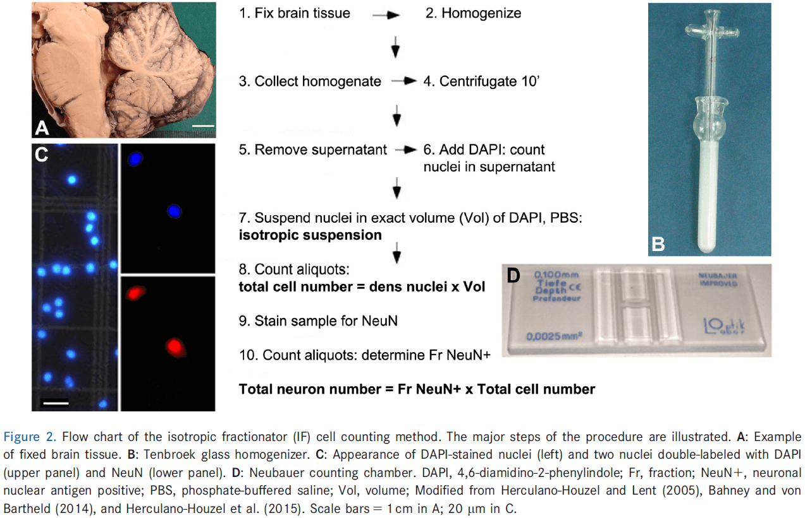
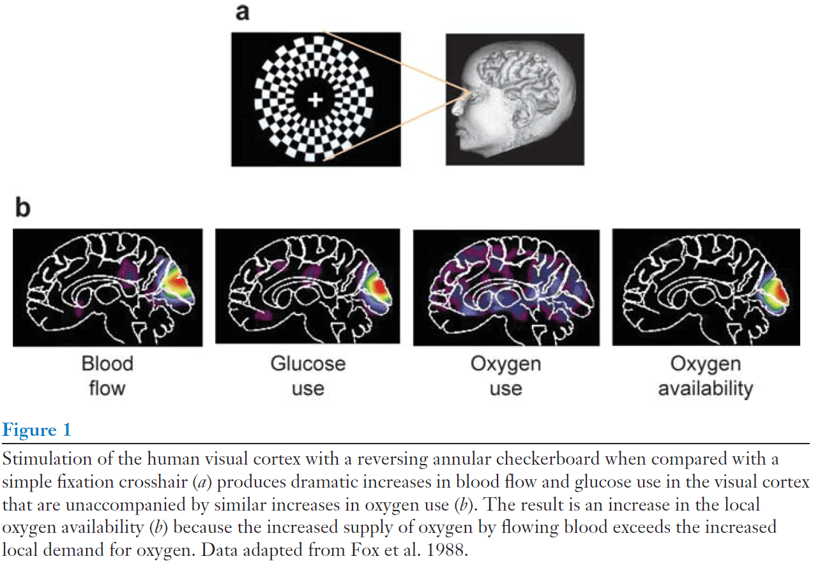
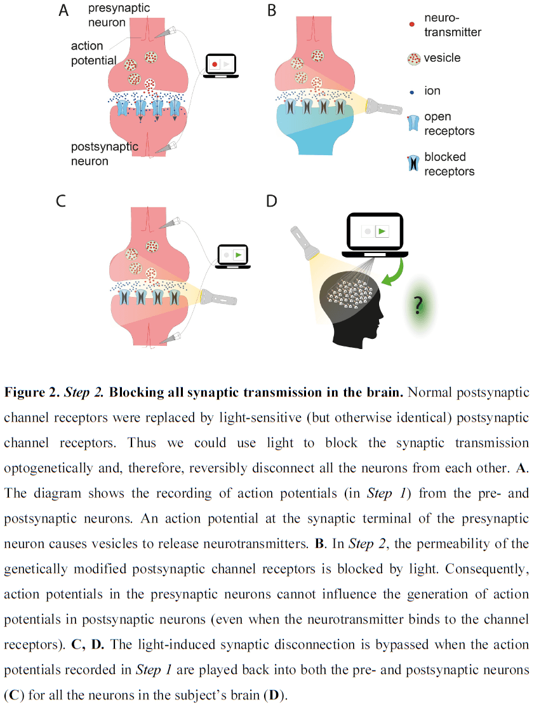
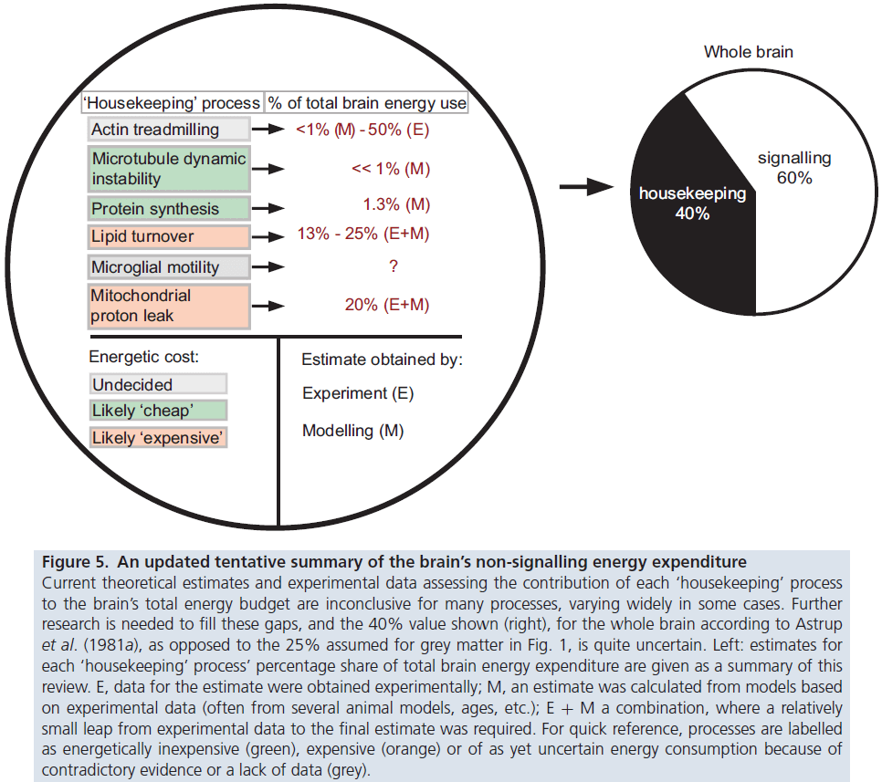

## [The Search for True Numbers of Neurons and Glial Cells in the Human Brain: A Review of 150 Years of Cell Counting](https://doi.org/10.1002/cne.24040)

- For the past 50 years, we’ve believed that the human brain consist of about 100 billion neurons and one trillion glia with a glia-to-neuron ratio of ten to one, meaning ten glia for each neuron.
- A new counting method, the isotopic fractionator, has challenged this number and ratio.
- The isotopic fractionator finds a glia-to-neuron ratio of less than 1:1 and less than 100 billion glia in the human brain.
- A survey of original evidence shows that histological data always supported a 1:1 ratio of glia to neurons in the entire human brain.
- This paper includes a brief history of cell counting in human brains, types of counting methods, ranges of previous estimates, and the current state of knowledge about neuronal and glia cell numbers.
- Recent studies find that the cellular composition of the human brain is very different than what was believed and taught for almost half a century.
- Cell counting in the human brain has had a complex history, in part because cells can be quantified and reported in three different ways.
- E.g. Total neuron numbers, total glia numbers, and the ratio of glia to neurons (GNR).
- Brain cell counting can be roughly divided into three historical phases.
- The first phase was collecting data only for parts of the human brain, specifically the cerebral cortex.
- The second phase was serious estimates of total numbers for both glia and neurons.
- Even though these cell density-based estimates supported a total GNR of about 1:1, this was either not recognized or not communicated properly as major textbooks and reviews cited GNRs of 10:1 or 50:1.
- This would remain unchallenged from the 1960s until 2009.
- The third and most recent phase began with the study by Azedvedo et al. in 2009 that revealed the discrepancy between textbook knowledge and the published literature.
- Surprisingly, the idea of one trillion glia wasn’t due to technical disadvantages or counting methods, but rather the failure to notice that published numbers for all three components: neuron counts, glia counts, and GNR, contradicted each other.
- In cell counting, the unit being counted is the cell body with its nucleus.
- For glia, most studies combine astrocyte, oligodendrocyte, and microglia counts.
- Three types of cell counting methods
    1. Model-based or design-based counting of stained cells, nuclei, or nucleoli (histology/stereology).
        1. Tissues are fixed, usually in a formaldehyde-based fixative, embedded in a suitable medium, sectioned into thin slices, stained with a dye, and cells counted under a microscope.
        2. Model-based approaches rely on analyzing thin sections and extrapolating, while design-based approaches use thicker sections and applies a random sampling scheme to count.
        3. Both methods can result in inaccuracies due to assumptions so they should be calibrated against the ultimate standard: 3D serial section reconstructions of an entire region or sample.
        4. Major challenges: ensure samples are truly representative of the reference volume, prevent double counting of particles that appear in multiple sections, account for shrinkage due to age and tissue changes, distinguish between neurons and glia.
        5. The importance of counting absolute cell numbers rather than cell densities was underscored by the finding that tissues shrink differently with age.
        6. E.g. Neglecting this finding led to the false belief that neuron numbers declines steadily and significantly during normal aging.
        7. This type of cell counting is valuable for well-defined regions but has limitations with larger tissues of heterogeneous composition.
    2. DNA extraction and measurement of total DNA content.
        1. Extracts and measures DNA content to calculate cell numbers based on knowledge of DNA content per cell nucleus.
        2. Major challenges: complete recovery of DNA required, contamination with other nucleic acids, not all cells are euploid meaning their DNA content can vary.
        3. This technique was mostly used in the 1950s-70s to obtain relative comparisons rather than absolute numbers.
    3. Direct enumeration of cells in homogenized brain tissue (isotropic fractionator).
        1. Dissected chilled tissue was weighed, homogenized by mixing, diluted in a known volume of medium, stained with methylene blue, mixed, and then aliquots of the diluted medium were counted on a hemocytometer.
        2. Major challenges: rapid degradation of unfixed cells, lack of distinction between cell types, rupturing of cells during mechanical disintegration (mixing).
        3. This method is easy, fast, and accurate, generating estimates of cell numbers independent of tissue volume or cell density.

        4. Studies indicate equivalency between the isotopic fractionator (IF) and stereology.
- Considering the results obtained from different investigators using different methods, most of the data are relatively consistent.
- E.g. The majority of studies estimated total neuron numbers for the entire cerebral cortex to be between 10-20 billion.
- Since the cerebral cortex takes up 80-85% of the adult human brain volume, it was often equated with the whole brain, leading to oversimplification and the myth of one trillion glia.
- Three major components of the human brain
    - Cerebral cortex (80-85% volume)
        - There’s been confusion on whether cerebral cortex means only gray matter or gray and white matter.
        - The majority of studies excluded white matter.
        - The number of neurons in white matter is relatively small so excluding it doesn’t make a significant difference for total cell numbers.
        - Some studies were ambiguous in whether their estimates applied to one or both hemispheres.
        - Another source of error is that counting only 100-200 neurons is sufficient for extrapolation. Recent computer simulations suggest that considerably more neurons should be counted.
        - The majority of histology-derived estimates converge at 10-20 billion neurons, consistent with the IF.
        - The notion that large numbers of neurons (30-50%) are lost during decades of normal human aging have been refuted.
        - Actual losses appear to be on much smaller scales and are more region-specific.
        - The GNR of 1.5 in gray matter of the adult human cortex was confirmed by numerous subsequent investigations.
        - The GNR varies locally in gray matter between 1.2 in occipital and 3.6 in frontal areas.
        - One of the major, if not most serious, problems with histology-based counting methods is the technical difficulty of recognizing glia and distinguishing them from small neurons.
        - To this day, we still haven’t found a solution.
        - Therefore, the design of methods that can accurately distinguish neurons from glia is important.
    - Cerebellum (10% volume)
        - In the cerebellum, a large number of neurons and low number of non-neuronal cells had been suspected by early investigators.
        - The GNR for the entire human cerebellum appears to be about 0.05.
        - The unusual cellular composition of the cerebellum was a key factor in failed attempts to calculate the true GNR for the total human brain and a major reason behind the one trillion glia myth.
    - Remaining (2-8% volume)
        - Until 2009, there had been no attempts to estimate the total number of neurons or glia in this part of the brain.
        - The total number of neurons and glia in the brainstem, diencephalon, and striatum doesn’t add up to the numbers even close to those in the cerebral cortex or cerebellum.
        - This is in part due to it’s small volume.
- Our current best estimate for the cellular composition of the entire human brain is between 67-86 billion neurons and around 40-50 billion glia.
- The GNR is important because it informs us about brain development, physiology, diseases, aging, and brain evolution.
- E.g. Comparing brain regions.
- No notes on the history of the GNR.
- Differences in GNR across species are largely determined by changes in neuronal densities rather than changes in glia densities.
- Small neurons are difficult to distinguish from glia.
- A breakthrough seemed to have been achieved by using an antibody against a neuron-specific nuclear antigen (NeuN).
- Remarkably, errors in neuron number, glia number, and GNR, were in the most prestigious neuroscience textbook: The Principles of Neuroscience.
- The lack of citations for the 10:1 GNR over a 50-year period is an example of a major failure in the scientific process that’s supposed to self-correct invalid claims or reports.
- Why should we care about cell counting?
- Three examples of how cell counting has had a significant impact
    1. Aging human brain
        - Is there a significant loss of neurons in the normal aging brain?
        - Studies from the 1950-1980 reported and generally believed that the normal aging brain loses large numbers of neurons each day after age 30.
        - E.g. A 60-year-old would have half as many cerebral neurons as what they had started with.
        - However, we now know that the shrinkage of brains after fixation depends on age and that the reference volumes of brains from older people different from younger people.
        - When this is controlled for, there was very little, if any, normal loss of neurons in most parts of the brian.
        - This myth had found its way into textbooks, curricula, and common knowledge, making it difficult to correct.
    2. Evolution of the brain
        - Throughout the 20th century, the prevailing notion was that the human brain had an exceptional cellular composition among species, which was responsible for the superior cognitive abilities of humans.
        - E.g. Previous work suggested that the human neocortex showed an abnormally high GNR when compared with other mammals.
        - However, the development of more efficient cell counting methods such as the IF made it possible to re-examine this claim.
        - Instead, we find that the GNR is highly conserved between structures and species, suggesting an important and close regulation of glia numbers in response to neuron density and size.
    3. Developmental neuroscience
        - Neuron and glia numbers and their ratios fluctuate in relatively narrow ranges, even in different species and different brain structures, suggesting an optimal relationship between cell types.
        - How are these ratios achieved and maintained during development?
- The assumption that the distribution of glia in one small part of the brain was representative for the whole brain likely contributed to the widely overstated GNR in reviews and textbooks.
- Reasons behind the perpetuation of the claim of one trillion cells in the human brain
    - Failure to realize that the number of neurons and glia didn’t add up
    - Focus on parts of the human brain that weren’t representative
    - Neglecting the role of the cerebellum
    - Missing primary literature
    - Copying information from previous reviews without scrutiny
    - Inaccurate quoting of others’ work
    - Hesitation to challenge the prevailing dogma
- A precise balance of glia to neurons in human brain regions seems essential for normal functioning and this balance is disturbed in disease and trauma.

## [The Big Data Problem: Turning Maps into Knowledge](http://dx.doi.org/10.1016/j.neuron.2014.09.008)

- The ability to record from every neuron in the brain of an awake and behaving animal is unquestionably useful.
- Having a wiring diagram overlaid on such activity maps is probably a dream come true for most systems neuroscientists.
- However, the vast number of neurons in the brain results in enormous amounts of data.
- This paper argues that big data and the challenges associated with it (mining, storing, distributing) aren’t the key challenge we face in making neural maps useful.
- Instead, the author suggests that the essential ingredient is the experimental design used to gather and analyze such data.
- In essence, the hard work is in formulating the precise question that we want to know and what an answer would look like.
- Big data: any data that exceeds the size of a standard laptop hard drive.
- It’s important to distinguish between big data and complex data.
- Complex data: any data that’s complicated, hard to interpret, and hard to compress.
- Connectomics relies on recovering a circuit diagram by imaging the whole region of interest at the resolution of an electron microscope (EM).
- The size of raw connectomics data is truly daunting.
- E.g. A mouse brain imaged at 5 nm x 5 nm x 40 nm resolution in a volume of 500 mm3 would generate 500 petabytes of data.
- However, we can compress this data by focusing on what we want, which is the connectivity matrix between the 100 million neurons that a mouse brain has.
- If we assume 1000 connections for each neuron, the connectivity matrix has $$10^{11}$$ entries resulting in a data set of a few hundred gigabytes.
- This connectivity matrix would be complex data but not big data.
- Thus, the whole-brain EM volume data can be reduced and compressed by six orders of magnitude.
- If we consider recording all of the spikes in all neurons of the brain, we can envision a similar compression.
- E.g. 500 gigabytes of activitome data.
- Raw data sets might be very large, but once converted into information, the volumes aren’t big data anymore.
- What’s the best approach to collecting big data?
- We could envision either large-scale industrial data collection or the traditional small-scale individual lab approach.
- Once the data are collected, the question becomes how to best turn this information into knowledge.
- The challenge in neuroscience will be to come up with good questions and intelligent experiments.
- The author doubts that new technologies for helping us identify and isolate neuronal subtypes will lead to a paradigm shift or a fundamentally new way of doing neuroscience.
- The name of the game will always be to think carefully and deeply about how behavior emerges from neurons.

## [A quantitative description of membrane current and its application to conduction and excitation in nerve](https://dx.doi.org/10.1113%2Fjphysiol.1952.sp004764)

- This paper discusses results from the preceding set of papers, puts them into mathematical form, and shows that they account for conduction and excitation in quantitative terms.
- The previous results suggest that the electrical behavior of the neuron cell membrane may be represented by the electrical circuit in figure one.

- In the circuit, current can be carried through the cell membrane either by charging the membrane capacity or by movement of ions through parallel resistors.
- The current is divided into three components: sodium ions ($$I_{Na}$$), potassium ions ($$I_{K}$$), and a small leakage current ($$I_{l}$$) made up of chloride and other ions.
- Each component has its own driving force measured as an electrical potential difference and permeability coefficient.
- E.g. $$I_{Na}=g_{Na} * (E-E_{Na})$$ where $$E_{Na}$$ is the equilibrium potential for sodium ions.
- Our experiments suggest that $$g_{Na}$$ and $$g_K$$ are functions of time and membrane potential but the other variables (E) are constant.
- To understand how these complicated phenomena interact to form the action potential and refractory period, we should obtain expressions relating the sodium and potassium conductances to time and membrane potential.
- While our experiments are unlikely to give any information about the nature of the molecular events underlying changes in permeability, our evidence does refute some theories while being consistent with others.
- The first important point is that the changes in membrane permeability appear to depend on membrane potential and not membrane current.
- E.g. If sodium concentration is higher or lower compared to the intracellular concentration, thus the driving force flips signs, the membrane current changes sign but still appears to follow the same time course.
- How might changes in the distribution of a charged particle affect the ease with which sodium ions cross the membrane?
- The first effect of depolarization is a movement of negatively charged molecules from the outside to the inside of the membrane resulting in an outward current.
- How do the negatively charged molecules cross the cell membrane?
- One hypothesis is that sodium ions cross the membrane in combination with a lipoid soluble carrier, allowing them to pass the cell lipid bilayer (membrane).
- Another hypothesis is that sodium movement depends on the distribution of charge particles that don’t act as carriers but allow sodium to pass through the membrane when they occupy particular sites in the membrane (with hindsight, this is the correct hypothesis).
- Much of what’s been said about changes in sodium permeability also apply to the change in potassium permeability.
- However, the potassium system differs from the sodium system in the following ways: the activating molecules have an affinity for potassium but not sodium, they move more slowly, and they aren’t blocked or inactivated.
- Another hypothesis is that only one system is present but that its selectivity changes soon after membrane depolarization.
- One of the most striking properties of the membrane is the extreme steepness of the relation between ionic conductance and membrane potential.
- Details of the mechanism will probably not be settled for some time, but it seems difficult to escape the conclusion that the changes in ionic permeability depend on the movement of some component of the membrane which behaves as though it has a large charge or dipole moment.
- No notes on the section “mathematical description of membrane current during a voltage clamp”.
- The discussion in the previous part shows that there’s little hope for calculating the time course of the sodium and potassium conductances from first principles since we don’t know how or why they change; we just know that they do change.
- Our goal here is to find equations that describe the conductances with reasonable accuracy and are sufficient for theoretical calculation of the action potential and refractory period.

- The rapid rise in voltage is due almost entirely to sodium conductance but after the peak, the potassium conductance takes a larger share. By the time potassium peaks, the sodium conductance is negligible.
- The presented results show that the derived equations predict, with fair accuracy, many of the electrical properties of the squid giant axon.
- E.g. The form, duration, and amplitude of membrane and propagating spike, the conduction velocity, impedance changes, refractory period, subthreshold responses, and oscillations.
- The agreement between equation and evidence must not be taken as evidence that our equations are anything more than an empirical description of the time-course changes in permeability to sodium and potassium.
- We do establish that the fairly simple permeability changes in response to changes in membrane potential are a sufficient explanation of the wide range of phenomena that have been fitted by solutions of the equations.
- The equations in this paper are limited in that they only cover short-term responses of the membrane and that they only apply to the isolated squid giant axon.
- Some additional process, on top of the action potential process, must happen in a nerve to maintain the ionic gradients, which are the immediate source of energy used in impulse conduction (with hindsight, this is hinting at ion pumps).

## [Brodmann: a pioneer of human brain mapping—his impact on concepts of cortical organization](https://doi.org/10.1093/brain/awy273)

- Korbinian Brodmann (1868-1918) is an important pioneer in neuroscience for his work on brain mapping.
- Brodmann’s maps dominate his legacy, detailing 48 cortical areas of the human cerebral cortex with some further subdivisions in later modifications.
- The goal of this paper is to remember Brodmann’s life and work, and his influence on and importance for actual research concepts in various fields of modern brain mapping.
- Brodmann was born in a small village in Southern Germany as the illegitimate son of Sophie Benkler, a maidservant in the house of the wealthy Brodmann family.
- At age 21, Brodmann studied medicine for one year where he attended a lecture on medical physics by Wilhelm Rontgen, the discoverer of the X-ray and a recipient of the Nobel Prize for Physics.
- From age 21 to 27, Brodmann continued to study medicine and philosophy, graduating at 27 to work as a physician.
- The year 1896 (age 28) brought a fateful encounter for Brodmann’s scientific future. In this year, Brodmann met Oskar Vogt who fascinated him about the future of brain research.
- Vogt finally convinced Brodmann to accept a position in Alexandersbad and to specialize in psychiatry and hypnosis.
- Brodmann went on to receive a postdoctoral position in the Neurobiological Central Station in Berlin.
- This station was founded by Vogt in 1901 and consisted of a medical practice for hypnosis, a research lab, and animal and photographic facilities.
- It was a completely private institution financially supported by the Krupp family and Vogt’s private income as a physician.
- It was here that Brodmann started his pioneering work on the cytoarchitecture of mammalian brains.
- From 1898 to 1900, Brodmann had planned to improve his experience in psychiatry and neuroanatomy.
- From 1901 onwards, Brodmann was an assistant at the neurobiological laboratory of the University of Berlin under Doctor O. Vogt until 1910 when Brodmann became an assistant physician of the Royal University Clinic for Mental and Nervous Conditions.
- The lab was important to Brodmann because it was the first time that he would be financially secure.
- The years between 1901 and 1910 were the period of Brodmann’s work on cytoarchitecture and localization, but his work wasn’t exclusively focused on cytoarchitecture.
- E.g. Brodmann published papers on hypnosis, astrocytes, neuropathology, psychopathology, polarization microscopy of myelinated nerve fibers, brain activity and blood flow, and hundreds of printed reviews other publications.
- Brodmann was a very critical reviewer and his reviews increased his number of opponents.
- His most influential studies are those on cytoarchitecture and the organization of the cerebral cortex.
- In a series of eight papers, Brodmann and his contemporary Campbell founded the field of cytoarchitectonic mapping.
- The commercial technology of the time was inadequate for Brodmann’s ambitious plans so they had to design and manufacture a large microtome themselves, improved embedding and staining procedures, created novel photographic techniques, and prepared complete series of sections of entire human hemispheres.
- Brodmann’s monograph from 1909 is a summary of his concept of cytoarchitecture and describes the principles of his comparative neuroanatomical approach.
- Brodmann’s six-layer concept of the cortex is universally accepted in modern studies and textbooks.
- Brodmann’s most important finding from comparative topography is that the cerebral cortex’s organization manifests a common architectonic plan in all mammals; a standard pattern of layers.
- The aim of his studies wasn’t to subdivide the cortex but to show that each cortical area has an evolutionary history.
- Brodmann wrote in his monograph: “Although my studies of localization are based on purely anatomical considerations … my ultimate goal was the achievement of a theory of function and its pathological deviations”.
- His search for functions of cytoarchitectonically defined areas led to the idea that single loci are active in different combinations when realizing a complex function.
- Brodmann revolutionized research on the microstructure of the human brain by establishing the common six-layered laminar bauplan and its regional modifications for the entire neocortex of mammals.
- One limitation of Brodmann’s maps is that he didn’t register the between-individual variability of the localization and size of areas.
- One fix for this is that cortical maps must be probabilistic as borders of cytoarchitectonic areas are highly variable between subjects.
- Another limitation is the observer-dependent definition of borders which has since been overcome with computerized image analysis.
- In 1908, Brodmann submitted his thesis to obtain a professorship position at the University of Berlin, which was rejected because of a dirty battle of office politics.
- In the end, Brodmann cancelled his position in Berlin and moved to the Clinic for Psychiatry and Neurology of the University Tubingen.
- In 1910, Brodmann was appointed as head of the anatomy lab.
- However, the beginning of World War I stopped all scientific plans and between 1914 and 1916, he served as a physician in a field hospital and took care of soldiers with brain injuries.
- Brodmann met his wife in 1917 (age 49) and had a daughter one year later.
- In 1918, Brodmann reached the climax of his career and was appointed as head of the Department for Topographical Anatomy in the famous Research Institute for Neurology in Munich.
- However, on August 22 1918, Brodmann suddenly died due to a devastating infection.

## [Structure and function of a neocortical synapse](https://doi.org/10.1038/s41586-020-03134-2)

- We don’t know how the structure of a synapse relates to its physiological transmission strength, a key limitation for inferring brain function from neuronal wiring diagrams.
- This paper combines slice electrophysiology of connected pyramidal neurons in the mouse somatosensory cortex with correlated light microscopy and high-resolution electron microscopy of all synaptic contacts between the recorded neurons.
- We find a linear relationship between synapse size and strength, providing the missing link in assigning physiological weights to synapses.
- Previous studies of the frog neuromuscular junction revealed that synaptic transmission is probabilistic and follows binomial models with three parameters:
    - Number of neurotransmitter release sites
    - Synaptic response to the release of one vesicle (quantum) of neurotransmitter
    - Probability of a vesicle being released
- Synaptic strength is measured as the amplitude of the excitatory postsynaptic potential (EPSP) and is the product of the three parameters.
- Structurally, the area of the postsynaptic density (PSD) is proportional to its number of AMPA receptors and scales with the volume of the dendritic spine head.
- Whether and how the EPSP amplitude relates to PSD area remains unknown for any given synapse in the brain.
- Furthermore, it’s unclear whether individual neocortical synapses release more than one vesicle.
- Here we relate synaptic structure and function to determine the size-strength relationship and mode of vesicle release.
- We recorded EPSP amplitude and variance between connected layer 2/3 pyramidal neurons and identified all axodendritic contacts using both light microscopy and electron microscopy.

- Synapse size predicts synaptic strength
    - We computed the total PSD area for a connection by summing the individual PSDs of our six multisynaptic connections and correlated it with mean EPSP amplitude.
    - We found a strong correlation (r=0.73, p=0.02) between total PSD area and mean EPSP amplitude.

- Multivesicular release in neocortex L2/3
    - PSD area correlated with the release probability of connections.
    - Crucially, our estimates for the number of release sites exceeded the number of synapses for all connections by an average factor of 4.4.
    - This implies that L2/3 pyramidal cells must operate predominately through multivesicular release.
    
    - We also found no correlation between estimated quantal size and PSD area, consistent with multivesicular release.
- Electron microscopy revealed synapses at only a minority of all axodendritic contacts between the neurons identified by light microscopy, prompting re-evaluation of studies that use light microscopy as they overestimate the actual number of synapses.
- The notion that different neocortical synapse types use different release modes is questionable.
- Multivesicular release is a hallmark of many central and peripheral synapses.
- Multivesicular release should endow neocortical circuits with considerably higher computational power than is supposed under the one-synapse, one-quantum hypothesis.
- E.g. Enables dynamic tuning of synaptic strength by adjusting the number of release sites within synapses without the structural remodelling.
- We’ve also shown a linear relationship between synaptic size to strength, confirming the functional relevance of quantifying synapse size by electron microscopy.

## [CORTICAL PLASTICITY: From Synapses to Maps](https://doi.org/10.1146/annurev.neuro.21.1.149)

- Cortical representations in adult animals aren’t fixed but are dynamic and continuously modified by experience.
- The cortex can preferentially allocate area to represent the most used peripheral inputs.
- Changes in cortical representations appear to underlie learning and the rules governing this cortical representational plasticity are becoming increasingly well understood.
- The fields of cortical synaptic plasticity and cortical map plasticity have been implicitly linked by the hypothesis that synaptic plasticity underlies cortical map reorganization.
- Recent experiments and theories have provided increasingly strong support for this hypothesis.
- The goal of this paper is to review the fields of both synaptic and cortical map plasticity and the work that attempts to unite them.
- The cortex reorganizes its effective local connections and responses following peripheral or central changes in input and in response to behavior.
- This capacity for reorganization partly accounts for certain forms of perceptual and motor learning.
- The challenge is to prove that synaptic plasticity is necessary and sufficient for lesion- and experience-driven dynamic cortical representation changes; to prove a causal link between cortical synaptic plasticity and cortical map reorganization.
- This challenge becomes more difficult as we don’t yet understand exactly how the cortex processes information.
- E.g. What’s the function of recurrent connections? What’s the function of each cortical layer? What’s the role of inhibition?
- Flow of information through the neocortex
    - Sensory information reaches the cortex from thalamus by the thalamocortical axons that terminate primarily in layer 4.
    - Accordingly, layer 4 cells also show the shortest latency to sensory stimuli.
    - Data supports the hypothesis that at each level of cortical processing, neurons are sampling from a larger input space, receiving convergent information from the previous level, and forming larger and more complex integrated and combinatorial receptive fields.
    - There’s also substantial horizontal interconnectivity which integrates information from neighboring and distant regions.
    - Horizontal connections may be particularly relevant for cortical map reorganization since it appears that areas that develop novel receptive fields after peripheral input manipulations may rely, in large part, on connections from neighboring cortical sectors.
- Cortical plasticity
    - The cortex can allocate cortical area in a use-dependent manner.
    - Review of Hebb’s rule.
    - The detection of temporally correlated inputs provides a mechanism for forming topographic maps and for cortical cell assemblies to represent learned stimuli.
    - A fundamental idea in neuroscience is that a change in the synaptic efficacy between two neurons is a substrate for learning and memory.
    - One of the first examples of associative/Hebbian plasticity was described in hippocampal CA1 neurons.
    - Review of long-term potentiation (LTP) and long-term depression (LTD).
    - No notes on the protocols used to induce LTP.
- Primary cortical sensory areas are organized topographically.
- E.g. S1, A1, and V1.
- Review of cortical plasticity following input destruction.
- E.g. Destroying the nerves supplying finger digit information.
- Hebbian plasticity is thought to play an important role in both cortical development and cortical reorganization in adult animals.
- Since Hebbian plasticity is based on the temporal correlations of inputs and since inputs from neighboring skin regions are generally more correlated than nonadjacent areas, neighboring cortical areas should represent neighboring surface areas, thus establishing a topographic map.
- A prediction from this hypothesis is that if the correlation between neighboring skin surfaces changes, then these changes should be reflected in cortical maps.
- Evidence supports this prediction and is consistent with the hypothesis that Hebbian synapses underlie cortical map formation and alteration.
- Review of the barrel cortex in rodents.
- In addition to the expansion of spared inputs, a retraction of the lesioned inputs occurred in parallel.
- Recordings made weeks after lesions to both retinas revealed that the cortical area previously responsive to the lesioned area acquired new receptive fields corresponding to areas surrounding retina around the lesion.
- However, this only occurs when both retinas are lesioned and not only one retina due to many V1 neurons having binocular receptive fields.
- E.g. Lesions to only one retina showed that the cortical topography was relatively unchanged.
- Further studies suggest that neurons can acquire novel inputs not only from neighboring retinal areas but also from distant nonadjacent areas.
- The examples of cortical map reorganization discussed so far were due to depriving the cortex of its normal inputs by lesioning, but we can also show changes in cortical map organization by reverse deprivation aka training.
- Skill-learning studies show that an increase in the activity of a limited subset of inputs can result in representational expansion.
- This shows that the cortex can dynamically allocate area in a use-dependent manner to different engaged inputs throughout life.
- E.g. An almost twofold expansion of the cortical representation of nipple-bearing skin in lactating female rats compared to nonlactating female rats.
- E.g. An almost twofold expansion in the size of representation of finger tips in monkeys that had to perform a difficult small-object retrieval task.
- E.g. Increased right hand representations in Braille readers compare to their left hand and non-Braille readers.
- Criteria to judge whether synaptic plasticity is necessary and sufficient for cortical map reorganization
    - Synaptic plasticity in the appropriate pathways should be seen with cortical representational reorganization.
        - E.g. The appropriate thalamocortical and corticocortical pathways should differ compared to control animals.
    - The manipulations that block synaptic plasticity should also block cortical reorganization.
        - E.g. Pharmacological and genetic synaptic blockers.
    - Induction of synaptic plasticity in vivo should be sufficient to generate cortical reorganization measured by changes in cortical map topography.
    - Synaptic plasticity and the learning rules that govern this plasticity should be sufficient to fully explain the experimental data.
        - E.g. Computers models/simulations that incorporate known experimental forms of plasticity should be sufficient to generate models that account for cortical representational reorganization.
- Virtually every level of the nervous system seems to exhibit plasticity under certain circumstances.
- But the primary site of plasticity appears to be the cortex; cortical and not subcortical.
- E.g. After training monkeys on a tactile task where adjacent fingers received simultaneous stimulation, many somatosensory cortical units developed combined-digit receptive fields but thalamic recordings didn’t reveal any combined-digit receptive fields. Thus, the convergence of information from different fingers seems to happen in the cortex.
- Related findings have also been reported in the visual system.
- Topographic changes could come from the strengthening or sprouting of thalamocortical axons and/or intracortical horizontal projections.
- It appears that novel receptive fields initially result from horizontal information flow mediated through corticocortical connections.
- E.g. After focal lesions to both retinae, collateral axons from cortical neurons surrounding the lesioned visual field branched predominately into the deprived area as opposed to the normal area. In contrast, labeling of thalamocortical axons showed that they didn’t extend into all of the reactivated cortex.
- E.g. Pairing whiskers in rodents led to early changes due to corticocortical plasticity and that later changes were likely due to the potentiation of existing thalamocortical connections or the formation of new ones.
- While these results suggest that the cortex is the primary site of cortical reorganization, it’s difficult to rule out contributions of plasticity occurring elsewhere.
- One possibility is that initial reorganization occurs in the cortex and that later reorganization occurs in subcortical areas in a retrograde fashion.
- If associative LTP is the primary mechanism underlying cortical reorganization, and if associative LTP depends on NMDA receptors, then blocking NMDA receptors should prevent cortical map reorganization.
- Studies find that NMDA receptor antagonists do interfere with cortical map development and plasticity in squirrel monkeys and cats.
- A problem with interpreting these experiments, however, is distinguishing whether reorganization was blocked due to NMDA being involved in synaptic plasticity, or reorganization was blocked because of experimental manipulations that inactivated the cortex.
- Review of computational models of the development and reorganization of cortical maps.
- Two fundamental mechanisms invoked by computational models
    - Hebbian learning where cooperative synapses are strengthened.
    - Competitive mechanism of balancing weakened and strengthened synapses.
- While Hebbian plasticity is often emphasized as the mechanism underlying cortical map formation and reorganization, cortical reorganization to deafferentation can essentially be simulated based only on passive decay and postsynaptic normalization.
- E.g. A nerve transection deprives the cortex of all inputs from digits D1, D2, and D3. Due to passive decay, synapses from the D1, D2, and D3 pathways are weakened. As a result of the weakening, synapses from D4 are strengthened due to postsynaptic normalization.
- Postsynaptic normalization is a critical component of many models but there’s been little direct experimental evidence for such as mechanism.
- One issue is that observations of postsynaptic normalization may require a time course longer than the life span of slice experiments.
- Evidence supports the notion that the level of postsynaptic depolarization determines whether LTD or LTP is induced.
- E.g. Low frequency stimulation (1 Hz) results in LTD, while high-frequency stimulation (100 Hz) results in LTP.
- We do not yet have a sufficient understanding of synaptic and cellular plasticity to fully account for the experimental data on cortical representational reorganization.

## [On the nature and use of models in network neuroscience](https://doi.org/10.1038/s41583-018-0038-8)

- This paper examines the field of network neuroscience by focusing on organizing principles that can reduce confusion and facilitate interdisciplinary collaboration.
- First, we describe the fundamental goals in constructing network models.
- Second, we review the most common network models along three dimensions: data-theory, structural-functional, and elementary-coarse.
- Third, we draw on biology, philosophy, and other disciplines to establish validation principles for these models.
- Review of the neuron doctrine; that neurons aren’t a continuous entity but are defined units with complex interconnections.
- Following the neuron doctrine, network neuroscience seeks to understand systems defined by individual functional units, often called nodes, and their relations, interactions, or connections, often called edges.
- Both nodes and edges, and any associated dynamics, form a network model that can be used to describe, explain, or predict behavior of the real physical network that it represents.

- These network models can be analyzed using quantitative techniques such as graph theory, hypergraphs, and simplicial complexes.
- E.g. Pairwise interactions in an adjacency matrix.
- Network models can be constructed across different spatial and temporal scales.
- E.g. Nodes can be chosen to reflect anatomical or functional units. Edges can be chosen to reflect synapses, white matter tracts, structural covariance, or physical proximity.
- More sophisticated network models can be made by including heterogeneous and dynamic elements.
- E.g. Multilayer and multiplex network models.
- Temporal dynamics can be applied to both nodes and edges, enabling studies of network as reconfigurable dynamical systems that evolve over time.
- After constructing these network models, they can be used to obtain deeper insights into how patterns of relationships between units support emergent functions and behavior.
- E.g. Topological shortcuts may support long-distance interactions and support efficient large-scale information transmission.
- Important questions then follow on how the specific pattern of edges between nodes supports or hinders critical neurophysiological processes related to synchrony, communication, coding, and information transmission.
- Despite these benefits, the rapid growth of network neuroscience had lead to many different kinds of network models and an abstraction away from neuroscience.
- Furthermore, different assumptions about network neuroscience can hamper communication, collaboration, and discovery.
- We start by reviewing efforts to understand the mechanisms behind brain structure, function, development, and evolution in terms of three key model dimensions.

- From data representation to first-principles theory
    - Is the network model a simple representation of data, or a theory of how the system behind the data might work?
    - A simple way to differentiate this dimension is to ask if the model can make a prediction about how the system came to be or what the system will become.
    - If the model can predict, it’s a theory-based model, if it can’t predict, it’s a data-based model.
    - Another differentiator is that a data-based model can be stored in a simple graph, while a theory-based model must combine a graph with a difference or differential equations specifying dynamics, evolution, or function of the nodes, edges, or both.
    - Data-based models are more biologically realistic but have fewer claims regarding mechanism or dynamics compared to theory-based models.
    - E.g. Data-based models include the 305 structural connections among 32 visual areas in the macaque, C. elegans structural connectome, and other temporal, multilayer, multiplex, and annotate graphs.
    - E.g. Theory-based models include the Hodgkin-Huxley, Izhikevich, Rulkov, neural mass models, and dynamic generative models.
    - There are both advantages and disadvantages to both extremes of this dimension, and intermediate models try to combine the advantages of both extremes.
    - E.g. Defining models where the parameters and functions are specified by data.
    - In general, models distributed along this dimension are synergistic because data representations inform theories, and theories produce predictions that can be tested, generating new data representations.
- From biophysical realism to functional phenomenology
    - Biophysically realistic network models include realistic elements such as neurons as nodes and axonal projections as edges.
    - E.g. C. elegans structural connectome.
    - These models can also include accurate descriptions of developmental, regenerative, or experience-dependent changes in neuronal morphology and projections.
    - In contrast, functional phenomenological models include nodes and edges that don’t necessarily have exact physical counterparts.
    - E.g. Functional connectivity uses correlations as edges.
    - This dimension is important because it determines whether a particular model can be used to infer the functional capacities of realistic structures or the structural demands of certain functions.
    - In functional phenomenology models, functional edges have informational rather than physical meanings.
    - E.g. Synchronization, phase locking, coherence, and correlation.
    - These studies often focus more on understanding the brain as an information processing system than on understanding its specific physical instantiation.
    - For biophysically realistic models, the incorporation of rich empirical observations creates concrete models but can be computationally expensive and are sometimes difficult to interpret because of the many parameters required to describe the network structure.
    - A structural connection inferred from a physical measurement should be interpreted differently from a functional connection that’s inferred from statistical similarities in time series data.
- From elementary descriptions to coarse-grained approximations
    - For some questions, nodes and edges take on natural elementary forms, for other questions, the nodes and edges are coarse-grained.
    - E.g. In physics, quarks can be thought of as a wave function or as a spherical mass. The former description is useful for quantum mechanics while the latter is useful for classical mechanics.
    - This dimension is important because elementary descriptions seek to understand how structure and function are related, while coarse-grained descriptions seek to understand emergent network properties.
    - Many common network models are based on the neuron doctrine with neurons and their synaptic connections.
    - In contrast, coarse-grained models are based on simplified descriptions of ensembles of smaller units.
    - E.g. Neural ensemble dynamics and neural mass models.
    - Elementary models are often most useful for understanding neural codes and network function at the cellular level, while coarse-grained models are useful for understanding population and ensemble codes.
- The three dimensions of network models describe a 3D space where many different network models exist.
- Are particular parts of this volume more or less well studied?
- We find that the least-well-studied volume are models that are first-principle theories of functional phenomenology at the elementary level of description.
- It isn’t necessary for any one model in this 3D space to provide the same insights as any other model.
- E.g. A biophysical model of synaptic transmission in the dentate gyrus isn’t likely to provide direct insight into the functional phenomenology of the default-mode network.
- Assessing the validity and effectiveness of a particular network model can be challenging because of the diversity of goals and uses.
- We propose a classification system for validating network models on different goals and domains.
- Descriptive validity
    - Does the model resemble the base system?
    - This validity is often used in animal models by comparing different species to each other and to humans.
    - How well does the structure of the model match the anatomical and/or functional data that it represents?
    - E.g. Network models where edges are assigned continuous weights representing anatomical connections have more descriptive validity than edges assigned binary weights.
    - One difficulty is identifying the appropriate level of complexity that should be modelled.
    - Another difficulty is that individual variability creates uncertainty on whether network features are signal or noise.
    - In general, little is known about the principles that govern individual differences in neural connectivity patterns in organisms with central nervous systems.
    - However, network structure and function do differ across people and these differences are associated with cognitive functions and symptom severity for certain diseases.
    - Network dynamics also show individual differences.
- Explanatory validity
    - This category focuses on developing statistical tests to support conclusions drawn from the use of the model.
    - E.g. A network model of the brain is considered to have explanatory validity if its architecture can be justified in terms of brain data and if it can then be used to test for causal relationships on the basis of that architecture.
    - Explanatory validity requires an assessment of both a model’s architecture and its ability to test for causal relationships.
    - These two criterion can be tested using statistical model-selection approaches.
- Predictive validity
    - A statistical model is predictive if there’s a correlation between the output from perturbing the model and the output from perturbing the organism.
    - E.g. Adding, removing, strengthening, or weakening a node or edge in the network should affect the model in a way that predicts the same outcome to the same perturbation in the organism.
    - Building models with predictive validity comes after descriptive and explanatory validity, and are thus new to neuroscience.
- With the multitude of model and validity types, it’s important that investigators clearly specify their study’s goals because insights drawn from one type of model can be different from another type of model.
- One strength of network neuroscience is that it has built many descriptive models but lacks explanatory and predictive models.
- Models designed to explain are assessed according to goodness of fit but can be overfit to the data.
- Models designed to predict are assessed according to their ability to generalize.

## [Sleep Is for Forgetting](https://doi.org/10.1523/JNEUROSCI.0820-16.2017)

- One possible function of sleep is to erase and forget information built up throughout the day that would clutter the synaptic networks that define us.
- This paper discusses and illustrates the importance of forgetting for development, for memory integration and updating, and for resetting sensory-motor synapses after intense use.
- Sleep could serve this unique forgetting function for memory circuits within reach of the locus coeruleus (LC) and those formed and governed outside its noradrenergic net.
- Review of rapid eye movement (REM), transition-to-REM (TR), slow-wave sleep (SWS).
- Forgetting to avoid saturation
    - Sleep preserves memory from gradual degradation over time.
    - However, the type of forgetting discussed here isn’t passive degradation but rather the active and targeted erasure of synapses.
    - It’s been hypothesized that REM sleep was for forgetting useless information learned throughout the day that, if not eliminated, would saturate the memory synaptic network with junk.
    - The type of forgetting discussed here also isn’t the global synaptic weight downscaling of the synaptic homeostasis hypothesis (SHY).
- Arguments of this paper
    - It’s the targeted erasure of synapses that’s unique to sleep.
    - This targeted forgetting is necessary for efficient learning.
    - Deficits in this process may underlie various kinds of intellectual disabilities and mental health problems.
- Hippocampal activity for forgetting during REM sleep
    - One way to test if sleep is for forgetting or for remembering is to test the activity of hippocampal neurons during sleep.
    - The hippocampus forms initial associative memories and temporarily stores them until they’re consolidated to the neocortex.
    - It’s logical then that the hippocampal network of weighted synapses be recycled for future learning.
    - Review of place cells and long-term potentiation (LTP).
    - Place cells are most active at the peaks of theta frequency (5-10 Hz) local field potential patterns during active waking.
    - Activity during the positive phase of the theta rhythm (peak) induced LTP, while stimulation in the opposite phase, the theta trough, induced a decrease in synaptic efficacy.
    - We found that once a place becomes familiar to the animal, the place cells reversed their primary firing phase with respect to local theta oscillations during REM sleep.
    - The time course that place cells switched from the novel peak firing pattern in REM sleep to the familiar trough firing pattern matched the time course of memory consolidation from the hippocampus to neocortex.
- Forgetting is necessary to incorporate novel information into established schema
    - Long-term depression (LTD), the reverse of LTP, is also induced by learning.
    - The hypothesis that REM sleep is unique for forgetting predicts that any learning that requires depotentiation would be compromised by its disturbance.
    - One type of learning that requires forgetting is reversal learning.
    - E.g. Learning that Santa isn’t real.
    - If LTD didn’t happen to at least some of the synapses encoding the original information, then we would have redundant and conflicting information during memory recall, making us confused as to what’s true and what’s false.
- Targeted forgetting is unique to sleep
    - The theta phase specificity of experience-dependent reactivation in the hippocampus revealed an elegant sleep-dependent memory function.
    - Why would such an important function as rewiring a memory schema not occur during waking?
    - One line of research suggests that the LTD step in the rewiring process is only reliably induced in the absence of norepinephrine (NE).
    - NE blocks depotentiation and enhances LTP.
    - E.g. Stimulating the source of NE to the forebrain, the LC, or direct application of NE through intracerebroventricular infusion enhances and prolongs LTP.
    - Sustained LC silence normally only occurs during sleep.
    - E.g. NE neurons in the LC are only suppressed during REM sleep and during the transition-to-REM (TR; stage 2 in human sleep).
    - REM sleep and TR are perhaps the only times when synaptic circuits within LC’s reach could be refreshed and reset from the day’s relentless accumulation of connectivity.
    - Perhaps the TR state is so short (30-60s in humans) precisely because it’s such a powerful time for bidirectional plasticity.
- No notes on NE bursts to terminate sleep spindles.
- The TR state, when the hippocampus and cortex uniquely synchronize during sleep spindles to transfer memories from the hippocampus to neocortex, is a vulnerable period when memories can be modified.
- Synapse elimination is essential in every developing circuit with experience-dependent refinement.
- E.g. Muscle innervation, imprinting, visual cortex development.
- Interestingly, REM sleep is especially abundant during early development as at birth, half or more of our sleep time is occupied by REM sleep compared to the less than 20% of sleep for adults.
- In juvenile birds learning bird songs, studies found that sleep reduced song complexity built up during the day and the noise from the day before was gone.
- In imprinting, learning the parent’s features was followed by immediate and impressive increases in REM sleep.
- Electrophysiological data is also consistent with the idea that without proper REM and TR sleep, neurons remain overconnected in the imprinting circuitry.
- If pruning fails, the synapses encoding alternative features remain and the animal remains open to imprinting on features of other individuals.
- Thus, imprinting shows how important targeted forgetting is for survival.
- Both REM and TR sleep rise during intensive learning periods.
- Sleep also serves a critical role in resetting the synaptic weights of primary sensory areas undergoing continuous amplification during waking.
- Many studies show that staying awake during the time from training to testing interferes with memory performance.
- Perhaps the memory degradation induced by staying awake for a long time is actually due to a buildup of interference rather than slow forgetting due to synaptic weakening.
- E.g. Slowly saturating circuits would result in a loss of specificity and clarity of information traces.
- Sleep is a protected time away from waking sensory interference to encode memories and to raise important memories above noise.
- E.g. In a study of experienced bicycle riders trained to ride a bicycle with reversed handles, subjects that slept after training were more likely to forget the training, erasing the sensorimotor learning gains compared to those who didn’t sleep.
- The authors of this study interpret their findings to mean that REM and TR sleep spindles might protect everyday needed skills like riding a bicycle by forgetting the interfering and irrelevant material.
- When memory reactivation occurs during sleep spindles without the ability to depotentiate synapses, circuits requiring reconsolidation become entangled.

- E.g. Without NE, synapses to and from the name “Gwen” to the information/memory associated with two different people would be at risk to be confused.
- Thus, NE preserves the memory network associated with a preexisting memory while allowing the network to learn and consolidate new memories.
- The absence of serotonin during REM sleep may be as important as the absence of NE in targeted forgetting.
- No notes on how serotonin may strengthen distal inputs in hippocampal neurons.
- A strong line of research findings indicate that NREM sleep serves to reactivate prior waking memory circuits to strengthen them.
- No notes on SWS.
- To summarize, sleep is characterized by a loss of norepinephrine and serotonin that uniquely allows for forgetting or depotentiation, specifically in activated circuits targeted by the LC.
- No notes on how this affects various pathological diseases.
- The role of sleep for forgetting seems to be unique and can’t be substituted by any other state in contrast to using sleep for remembering.
- However, there’s no behavioral data relating synaptic depotentiation to loss of memory and the theta peak-to-trough transition doesn’t always weaken memories.
- It’s also difficult to say that a memory has been forgotten as a memory trace can only be inferred from its retrieval and expression in behavior. The only proof of a memory is recalling it.

## [Human consciousness is supported by dynamic complex patterns of brain signal coordination](https://doi.org/10.1126/sciadv.aat7603)

- All stages of losing consciousness, whether from sleep, anesthesia, or brain damage, all share a common feature: the lack of reported subjective experience.
- Finding reliable markers indicating the presence or absence of consciousness represents an unsolved challenge in neuroscience.
- We argue that consciousness has specific characteristics that are based on the temporal dynamics of ongoing brain activity and its coordination over distant cortical regions.
- E.g. Neural signals combine, dissolve, reconfigure, and recombine over time, allowing for perception, emotion, and cognition to happen.
- Brain dynamics can be characterized by the presence of complex activity patterns, which can’t be completely attributed to background noise.
- fMRI data shows that during normal wakefulness, the brain spontaneously generates a dynamic series of constantly changing activity and connectivity between brain regions.
- This suggests that consciousness could be found in temporally evolving dynamic processes seen in normal wakefulness.
- Furthermore, investigating spontaneous fMRI dynamic connectivity in different sleep stages and in anesthesia indicates that during physiologically reversible unconscious states, long-range correlations are disrupted in both space and time, anticorrelated cortical states disappear, and dynamic explorations are limited to specific and rigid functional configurations tied to anatomical connectivity.
- Conversely, conscious wakefulness is characterized by global integration, dynamic exploration of rich and flexible functional brain configurations, and the appearance of anticorrelations between the activity of different brain regions.
- Review of the Global Neuronal Workspace (GNW) theory that states that different streams of information in the brain compete for ignition in a widespread network of regions.
- The changes in brain connectivity dynamics associated with pathological unconsciousness after severe brain injury remain unknown.
- So far, we’ve inferred consciousness using active mental imagery neuroimaging paradigms and by assessing the complexity of evoked and spontaneous brain activity.
- However, we highlight the need to determine a common set of features capable of accounting for the capacity to sustain conscious experience.
- The goal of this paper is to determine whether the dynamics of brain-wide coordination could provide such a set of common features.
- No notes on the data and detailed method.
- The coordination between the continuous fMRI time series was estimated by phase synchronization.
- Phase synchronization: determines the relative timing of the phases of two signals during each waveform cycle.
- We clustered the phase-based coherence observations in a data-driven way, leading to a discrete set of brain-wide coordination patterns and their corresponding rates of occurrence in each group.
- The analysis consistently revealed four distinguishable patterns.

- Four complex patterns
    - Pattern 1 showed high complexity and was prevalent in healthy participants and in minimally conscious state (MCS) patients.
    - Pattern 4, in contrast, showed low interareal coordination and was more likely to occur in unresponsive wakefulness syndrome (UWS) patients compared to MSC patients.
    - Patterns 2 and 3 were equally probable across all groups and conditions.
- To investigate the relationships between brain coordination dynamics and a representative network of anatomical connections, we also acquired diffusion spectrum imaging (DSI) data for each participant.
- We found that pattern 1 had low similarity to the anatomical connectivity, whereas pattern 4 was the most similar.
- Individuals with higher levels of consciousness were more likely to not only reside in pattern 1, but to also depart to and from this pattern to patterns 2 and 3.
- The brain dynamics of UWS patients were more likely to avoid this exploration of complex coordination pattern and preferred to stay in the less complex pattern 4.
- Our results are in line with previous findings in animals.
- E.g. The brain activity of anesthetized nonhuman primates resided mostly in a pattern of low connectivity resembling anatomy, which was sustained for a longer period of time compared to more complex patterns.
- We showed that network properties, such as modularity, integration, distance, and efficiency, increased with the participants’ conscious state.
- For patterns 2 and 3, these weren’t preferred by any group and could represent transitional states.
- We didn’t aim at tracking the moment-to-moment contents of conscious experience, but instead aimed at identifying brain-wide dynamic networks supporting different global states of consciousness.
- Pattern 4 was visited by healthy controls even under typical wakeful conditions.
- One explanation for this is that the flow of conscious cognition may be separated by periods of absent or reduced effortful information processing.
- E.g. Mind blanks.
- It didn’t escape us that the complex pattern 1 did sporadically appear in the group of unresponsive patients.

## [Brain Work and Brain Imaging](https://doi.org/10.1146/annurev.neuro.29.051605.112819)

- The signal used by both positron emission tomography (PET) and magnetic resonance imaging (MRI) is based on changes in local circulation and metabolism (brain work).
- Our understanding of cell biology has improved in the past decade and we’ve shifted our focus from the output of neurons being most relevant to the input of neurons being most relevant.
- The introduction of PET and MRI presented researchers with an unprecedented opportunity to examine the neurobiological correlates of human behaviors.
- The result was the creation of a new scientific subfield: cognitive neuroscience.
- Another recent shift has been the establishment of research-imaging centers with expensive MRI equipment devoted exclusively to research.
- This shift breaks research tradition where research used to be done on clinical equipment after hospital hours.
- One of the criticisms and most important questions regarding neuroimaging is how to relate neuroimaging measurements to the biology and neurophysiology of brain cells and their microvasculature.
- Given that our knowledge is incomplete but rapidly expanding, we recognize that some of the points made in this paper are speculative and controversial.
- Evoked functional activity
    - Behaviorally evoked changes in blood flow are at the heart of functional brain imaging signals.
    
    - The fact that regional brain circulation is evoked by mental performance was first noticed by the Italian physiologist Mosso in 1878 when he noticed that a subject with a bony defect in his skull had faster brain pulsations in the right prefrontal cortex when performing calculations.
    - Despite the centrality of blood-flow changes to functional imaging signals, the complexity of the relationship between blood flow and metabolism has only recently become more appreciated.
    - One unresolved issue is why blood flow changes with brain activity.
    - The intuitive notion that blood flow changes to serve the variable energy demands of the brain now appears oversimplified if not incorrect.
    - What behavior of neurons accounts for the blood-flow changes we observe in neuroimaging?
    - For many, the answer generally has been the spiking activity or output of neurons.
    - In the work done by Logothetis and colleagues, they showed that the fMRI blood oxygen level-dependent (BOLD) measurement best correlated with local field potentials (LFPs) and not with unit activity.
    - They concluded that fMRI bold signals reflect changes in LFPs and not changes in spikes.
    - However, some question the modeling data in Logothetis et al.’s work and that the exclusive relationship between BOLD and LFPs may not exist.
    - Is it the input to neurons (reflected in the LFPs) or the output from neurons (spiking activity) that drives the generation of functional brain signal?
    - We believe the evidence favors a dominant role for the inputs to neurons (LFPs) as the signal underlying functional brain signals.
    - Studies show that local tissue blood flow can be dissociated dramatically and convincingly from the spiking activity of neurons, whereas blood flow measured in the same experiments is consistently correlated with the LFPs.
    - In our view, it’s incorrect to propose using functional neuroimaging signals as simple surrogate measures of the spiking activity of neurons.
    - Instead, the input into a neuronal assembly may or may not correlate with its output.
    - Moving forward, it’s become increasingly apparent that astrocytes also play a critical role in brain metabolism.
    - The brain is dependent on a continuous supply of oxygen by flowing blood.
    - E.g. When blood flow suddenly ceases, approximately 15s afterwards consciousness is lost.
    - From this evidence, it was almost universally believed that blood-flow increases associated with cellular-activity increases must be related to the need for more oxygen.
    - However, it came as a surprise that activity-induced increases in blood flow aren’t accompanied by proportionate increases in oxygen consumption.
    - Although oxygen consumption does increase, this increase is much less than the increase in blood flow and glucose consumption.
- Blood flow and oxidative phosphorylation
    - Two interesting findings
        - Decreasing the oxygen availability in circulating blood by having normal subjects breathe air with reduced oxygen fails to cause a compensatory blood-flow response when brain cellular activity is stimulated.
        - Sustained visual stimulation (25 mins) is associated with an initial increase in blood flow in excess of oxygen consumption but over time, oxygen consumption increases as blood flow falls.
    - Both of these findings dissociate the link between blood flow and demand for oxygen.
    - If the brain were to rely on a precise increase in oxygen delivery every time neuronal activity suddenly increased, a change in blood flow wouldn’t be the answer because it’s too slow.
    - E.g. After an event, blood flow doesn’t reach its maximum for 4-6 seconds.
    - Instead, the brain can extract more oxygen from circulating blood.
    - E.g. On average, about 40% of available oxygen is removed from blood passing through the brain.
    - However, evidence for this hypothesis is controversial.
    - The vast majority of the energy consumed by the brain is produced by the metabolism of glucose to carbon dioxide and water.
    - Review of glycolysis and oxidative phosphorylation.
    
    - Oxidative phosphorylation is more efficient than glycolysis because it produces more ATP, but glycolysis can be used during rapid increases in neuronal activity.
    - Glycolysis is faster and can operate without oxygen.
    - No notes on the role of astrocytes in brain metabolism.
    - Astrocytes are the only store of glycogen in the brain.
    - Our current information is inconclusive on the possibilities that a sustained increase in neuronal activity might cause a new baseline level of oxidative phosphorylation.
    - Above, we focused entirely on evoked increases in brain activity, however, this likely represents only a small fraction of the true functional activity of the brain.
- Activity decreases (deactivations)
    - Generally, brain imaging work has emphasized task-induced increases in regional brain activity associated with executing a wide variety of tasks.
    - However, we’ve become aware of task-induced decreases in regional brain activity; what we call the default mode network of the brain.
    - One challenge with interpreting activity decreases is defining a baseline level of activity.
    - E.g. Are the changes in functional activity normal or due to the task or due to some other cause? Are the changes merely unaccounted activations in control conditions?
    - We define activation, counterintuitively, as the increase in oxygen in blood because as neuronal activity increases, regional blood flow increases more than oxygen consumption. Hence, the amount of oxygen remaining in the blood leaving the activated region increases.
    - Oxygen extraction fraction (OEF): the ratio of oxygen consumed to oxygen delivered.
    - We find the OEF to be remarkably constant across the brain.
    - E.g. In white matter, oxygen consumption is 25% compared to gray matter but the ratio of oxygen consumed to that delivered is the same as in gray matter.
    - Using OEF, areas that are truly activated should exhibit a significant regional decrease in OEF compared to other brain areas.
    - We found no area that exhibited a decrease in OEF in the resting state.
    - We argue that brains are never at a zero-activity level and that such a view often encourages loose and misleading use of the term “activation”.
    - We can monitor activity increases (activations) with fMRI BOLD contrast because when blood flow increases more than oxygen consumption, this creates a local increase in the amount of oxygenated hemoglobin.
    
    - This increase in blood flow is accompanied by an increase in aerobic glycolysis, thus aerobic glycolysis provides us a window that we can use to observe changes in brain activity.
- Spontaneous functional activity
    - Anyone who does fMRI BOLD imaging is aware that unaveraged MRI signals are quite noisy.
    - Some of the noise is created by uninteresting sources.
    - E.g. Scanner electronics, subject movement, respiration, variations in cardiovascular dynamics.
    - However, a considerable fraction of the variance in the BOLD signal appears to reflect fluctuating neuronal activity.
    - Correlated spontaneous fluctuations in the fMRI BOLD signal should be considered in the context of the rich neurophysiological literature on coherent neuronal fluctuations or oscillations.
    - Oscillations could facilitate the coordination and organization of information processing across spatial and temporal scales.
- Overall cost of brain function
    - So far, we’ve approach functional brain imaging from the view that changes in brain function relate to changes in brain energy consumption.
    - Now, we cover the actual costs involved in these changes and how they relate to the overall cost of brains.
    - The amount of energy dedicated to task-evoked regional imaging signals is remarkably small, with rarely more than a 5-10% increase in absolute blood flow as measured by PET.
    - It’s become clear that the brain continuously expends a considerable amount of energy in the absence of a particular task.
    - What intrinsic/default task consumes such a large amount of the brain’s energy resources?
    - Evidence suggests that simple housekeeping functions consume a relatively small fraction of the brain’s energy budget.
    - E.g. Neuronal repair or protein trafficking.
    - Various studies find that neuronal signaling processes are what consume the majority of energy.
    - From this energy-cost analysis, it seems reasonable to conclude that intrinsic activity may be as significant as, if not more than, evoked activity in terms of overall brain function.
- Although we’ve learned a lot about the neurobiology of functional brain imaging signals, we still don’t know what function moment-to-moment changes in blood flow serve.
- Oxygen delivery doesn’t appear to be a convincing explanation and neither does the delivery of extra glucose as in both cases, adequate reserves are available.
- Perhaps the increased blood flow serves to remove waste products faster such as excess lactate or serves to adjust the ionic balance of tissue.
- Temperature regulation may also play some role.
- At present, no evidence exists for any of these speculative ideas.
- Unresolved issues
    - What functions do regional brain-blood flow perform when neuronal activity changes?
    - Why is glycolysis mainly used in providing energy for membrane-bound sodium and potassium ATPase in astrocytes and possibly neurons?
    - How are the energy-generating resources of astrocytes and neurons coordinated and how does this affect functional brain imaging signals?
    - What do inhibitory interneurons contribute in imaging signals?

## [Highly Nonrandom Features of Synaptic Connectivity in Local Cortical Circuits](https://doi.org/10.1371/journal.pbio.0030068)

- How different is local cortical circuitry from a random network?
- We probed synaptic connections using whole-cell recording from layer 5 pyramidal neurons in the rat visual cortex and found several nonrandom features of synaptic connectivity.
- We confirmed previous reports that bidirectional connections are more common than expected compared to a random network and that several highly clustered three-neuron connectivity patterns are prevalent.
- Analyzing synaptic connection strength as defined by the peak excitatory postsynaptic potential amplitude, we found that the distribution of strength differs significantly from the Poisson distribution and is better fit by a lognormal distribution.
- A lognormal distribution implies that synaptic weights are concentrated and clustered among a few synaptic connections.
- Therefore, the local cortical network structure can be viewed as a skeleton of stronger connections in a sea of weaker ones.
- A reasonable approach to describe synaptic connectivity, the wiring diagram of the brain, is by using statistics.
- E.g. Random sampling of connections with multineuron recordings find that the probability of a connection between neurons is often low, suggesting a sparse network.
- Statistical sampling of connections has found, so far, that the underlying network doesn’t have random connectivity.
- Unanswered questions
    - Are there nonrandom features in connectivity patterns involving more than two neurons?
    - What’s the distribution of synaptic connection strength?
    - Are synaptic connection strengths correlated?
- The goal of this paper is to apply a combination of statistical methods to a large dataset from hundreds of simultaneous quadruple whole-cell recording from visual cortex in developing rats.
- We found that connection strengths between pyramidal neurons follows a non-Poisson distribution and find correlations in the strength of the connections shared between pre- or postsynaptic neurons.
- Dataset details
    - Recorded from thick tufted layer 5 pyramidal neurons.
    - Recorded from 816 quadruple/four-cell groups.
    - Rate of connectivity was 11.6% (931 connections out of 8050 possible connections).
- Three classes of neuron pairs
    - Unconnected
    - Unidirectionally connected
    - Bidirectionally connected
- We found that the actual number of bidirectionally connected pairs is four times that of the expected number from a randomly connected network.

- We extended our analysis to three-neuron patterns (triplets) where there are 16 classes.

- Next, we analyzed the distribution of synaptic connection strengths as characterized by EPSP amplitude.

- The dataset is best fit by a lognormal distribution where 17% of all connections contribute about half of the total synaptic weight.
- Correlating the strengths of synaptic connections to two-neuron patterns, we find that bidirectional connections are, on average, stronger than unidirectional synaptic connections.
- Is this correlation due to distance? Perhaps nearby neurons have stronger connections.
- The data finds no correlation between connection strength and distance.
- Overall, our results suggest that the brain can be viewed as a skeleton of stronger connections in a sea of weaker ones.

- Are the stronger synaptic connections distributed or clustered? We don’t know.
- Although stronger connections are important for network dynamics, weaker connection should also be considered.
- Weaker connections can affect network dynamics and might carry out computations using a population code or they may be a reserve for cortical plasticity.
- E.g. Weaker connections can be strengthened by activity-dependent learning rules.

## [Do action potentials cause consciousness?](https://doi.org/10.31219/osf.io/agxf9)

- We envision a thought experiment where action potentials (APs) are initially recorded from all the neurons in a subject’s brain during a conscious experience and then played back into the same neurons.
- Can this artificial replay reconstitute a conscious experience?
- The idea of stimulating the brain to evoke conscious experience isn’t new.
- E.g. Brain-machine interfaces, controlling prosthetics, transcranial magnetic stimulation, and electrical stimulation of sensory regions.
- Furthermore, it’s now possible to evoke a memory by selectively reactivating ensembles of neurons.
- Brain activity can take many forms, but it’s most commonly associated with the neuronal firing of APs.
- Given the use of APs in brain-machine interfaces and neuroprosthetics, this suggests that the AP is the fundamental unit of information in the brain.
- The rapid development of tools and technologies in neuroscience brings the goal of capturing every AP in every neuron of the brain closer and closer.
- Although there’s no commonly accepted definition of consciousness, we define it as: the experience of ourselves and the surroundings that fades when we enter deep sleep or anesthesia.
- Can advances in neurotechnology unravel the neural causes of consciousness?
- We start with the working hypothesis that consciousness is caused by the neuronal firing of APs in the brain.
- At each of three successive steps/manipulations, we ask the reader to either accept or reject this hypothesis.
- We start by recording all APs from all neurons in an awake subject’s brain while they’re presented with a green light.
- The subject presses a button to report that they perceive the green light.

- Step 1: Removing cause-and-effect relations between neurons
    - After recording all APs, we force all of the subject’s neurons to fire by playing back the trains of APs recorded during the conscious perception task.
    - For the replay, we voltage-clamp the cell bodies of all neurons to force the membrane potential to be identical to the recorded potential and to override any other input that would otherwise influence the neuron.
    - The motor neurons that caused the subject to push the button voluntarily are now activated by a replay controller and therefore the subject pushes the button.
    - However, by pushing the button, the subject seemingly reports their conscious perception of green light since the neurons that control motor output are also forced to fire.
    - But does the subject really experience the green light during the replay?
    - If we answer “no”, we reject the hypothesis and this implies that something other than APs are responsible for the conscious perception of green light.
    - Rejecting the hypothesis challenges widely-held intuitions in neuroscience because this argues that the subject is unconscious in this step, even though they have identical brain activity as during the recording.
    - If we answer “yes”, then we go to the next step.
- Step 2: Optogenetically disconnecting neurons
    - After recording all APs, we use optogenetic tools to disconnect all of the synapses in the subject’s brain.
    
    - E.g. Shining light on the subject’s brain blocks all synaptic transmission which functionally disconnects all neurons from each other. Turning off the light releases the block and causes all synapses to reconnect.
    - Typically, blocking synaptic transmission will dramatically change the neurons’ firing patterns by preventing neurons from activating each other.
    - However, because we control the firing of all neurons, they fire precisely as in Step 1 despite being disconnected.
    - As in Step 1, the replay eventually activates the motor neurons in the spinal cord and the subject presses the button, informing us that she’s conscious of the green light.
    - Does the subject consciously perceive the green light during this replay, even though all of the neurons are disconnected?
    - If “no”, this implies that although artificial replay leaves consciousness intact, manipulation of synapses that don’t affect the generation of these APs eliminates conscious perception.
    - Thus, this answer suggests that biochemical processes at the synapse play a central role in consciousness.
    - If “yes”, then we go to the next step.
- Step 3: Physically disconnecting neurons
    - Suppose we cut and remove the visual cortex from the subject’s brain and replay the APs in all neurons, including the neurons in the removed areas.
    
    - Will the subject consciously perceive green light during the replay, despite having no visual cortex?
    - If “no”, this challenges the reader to explain why synaptic disconnection in Step 2 doesn’t change conscious perception, but why physical disconnection does.
    - If “yes” after cutting the visual cortex but “no” after its removal, this implies that the distance of the resected neurons from the rest of the brain is vital for conscious perception.
    - The distinction between surgery with and without removal of the visual cortex raises interesting questions regarding the effect of distance between brain regions on consciousness.
    - E.g. Do different brain sizes, between and within species, affect consciousness due to the distance between brain regions?
    - If “yes” after cutting and removing, then we can perform the same procedure indefinitely and get a conscious scattered brain.
    - But if we argue that scattered brains can’t be conscious, then we reject the hypothesis that firing of neurons causes our conscious experience.
- To summarize, in three progressive steps, we manipulated our subject’s brain and tested the hypothesis that the neuronal processes in our brain cause conscious perception.

- Our thought experiment might appear similar to Zenon Pylyshyn’s thought experiment of gradually replacing all neurons with microchips of identical functionality.
- However, Pylyshyn aims to preserve the cause-and-effect relations between neurons while eliminating the biological substrate, whereas we preserved the biological substrate while eliminating the cause-and-effect between neurons.
- Although the replay was artificial in our experiment, it’s a known biological process thought to underlie perception, memory consolidation, and network homeostasis in animals.
- Since the effect of synapses on brain activity was already precluded in Step 1 by imposing the replay, disconnecting the synapses in Step 2 has no further consequences on the firing of APs.
- Therefore, if the reader doesn’t reject the hypothesis in Step 1, there’s no reason to reject it at further steps.
- Our hypothesis only considered whether APs cause consciousness, but other neuronal process may play some role.
- E.g. Membrane potential fluctuations, calcium ion concentrations, neurotransmitter release, glial cell activity.
- To account for multiple biological processes, we would need to record from them and then replay them, then perform similar manipulations as in Steps 1 to 3.
- An idea similar to that of scatter brains being conscious is that there may be “islands of awareness” when the brain can’t interact with the natural world via perception and action.
- Islands of awareness can also exist when the brain is physically isolated from a body.
- E.g. Ex cranio brains, hemispherectomy, cerebral organoids.
- However, this is different from the above thought experiment as the brain during replay isn’t isolated from the world.
- No notes on how different theories of consciousness answer this thought experiment.
- Two possible reasons to reject Step 3 of the thought experiment
    - That the 3D structure of the brain is necessary for consciousness.
        - Theories that associate consciousness with the electromagnetic field would predict that the subject consciously experiences green light as long as the electric field remains the same during recording and replay.
        - The electromagnetic field doesn’t change in Steps 1 and 2 but would in Step 3 since altering the brain’s physical structure consequently alters the electromagnetic field.
    - That intrinsic cause-and-effect is necessary.
        - Integrated information theory (IIT) argues that consciousness is based on the cause-and-effect interactions between neurons in the brain’s network.
        - According to IIT, the subject loses consciousness in Step 1 because the replay imposed certain trains of APs that effectively vetoed all of the interactions between neurons.
- The replay conundrum
    - The usefulness of replay as an experimental strategy is seen when we compare replaying brain activity to simulating brain activity.
    - Unlike biologically detailed simulations running on a computer, the replay is recorded and activated on the same substrate.
    - Several theories of consciousness claim that cause-and-effect relations among neurons are necessary for consciousness, while other theories argue that such relations are just a mechanism for generating patterns of brain activity.
    - Since replay abolishes the biological intrinsic cause-and-effect relations between neurons, some theories assert that our subject loses consciousness during the replay.
    - However, if we performed an analogous experiment on the heart or stomach, such as recording and replaying the same muscle contractions, enzymes, and other biological processes, both organs would still perform the same function.
    - Why should a replay of APs in the case of the brain and consciousness not have a similar outcome to the case of stomach and food digestion, or heart and pumping blood?
    - Replay could be viewed as analogous to brain lesion experiments where instead of removing a piece of tissue, we remove cause-and-effect to examine whether neuronal activity or cause-and-effect or both are responsible for consciousness.
- Whether or not the subject loses consciousness during the replay has concrete and practical consequences.
- E.g. If we replayed the experience of pain, is this unethical because the subject is conscious? Or is it ok because the subject is unconscious?
- Neural prosthetics may provide clues as to whether activating the brain by replay results in loss of consciousness.
- E.g. Blind patients can see with implants of an electrode array in their visual cortex. Deaf patients can hear with cochlear implants.
- One of the central assumptions in neuroscience is that consciousness is produced by the events occurring in neurons.
- The thought experiment proposed here challenges that assumption and applies not only to brains but also to computer hardware and other biological organs.
- Do action potentials cause consciousness?

## [Memory engrams: Recalling the past and imagining the future](https://doi.org/10.1126/science.aaw4325)

- The goal of this paper is to review recent progress in studying engrams.
- Engram: the basic unit of memory; the neural substrate for storing and recalling memories.
- Richard Semon proposed that an experience activates a population of neurons that undergo persistent chemical and/or physical changes to become an engram.
- Subsequent reactivation of the engram by cues induce memory retrieval.
- The resurgence of research into engrams started with two complementary studies.
    - One study showed that ablating a subset of lateral amygdala neurons disrupted subsequent memory retrieval.
    - Another study showed that artificially reactivating a subset of hippocampal dentate gyrus neurons that were active during a fearful experience induced memory retrieval in the absence of an external retrieval cue.
- Recent research into engrams has found that neurons compete for allocation to an engram and this excitability-based competition also guides the organization of multiple engrams in the brain.
- We also found increased synaptic strength and spine density in neurons that are part of an engram, as well as preferential connectivity to other downstream engram cells.
- Thus, both increased intrinsic excitability and synaptic plasticity work together to form and retrieve engrams.
- It’s now possible to artificially manipulate memory encoding and retrieval processes to generate false memories.
- Questions remaining about engrams
    - How does engram architecture affect memory quality, strength, and precision?
    - How do multiple engrams interact?
    - How do engrams change over time?
    - What’s the role of engram silencing?
- Memory: the ability to use the past in service of the present or future.
- That memory persists after an experience suggests that an internal representation of the experience is stored in the brain and can be later reconstructed and used.
- An engram is roughly equivalent to a memory trace.
- Review of Karl Lashley’s experiments that failed to find the engram in rats and Donald O. Hebb’s cell assembly theory and learning rule.
- It’s important to note that an engram isn’t yet a memory but rather provides the necessary physical conditions for a memory to emerge.
- Memories are retrieved when appropriate retrieval cues successfully reactivate an engram.
- Experimental strategies to evaluate engrams
    - To evaluate the existence of engrams, we use four types of studies
        - Observational studies should show that the same or overlapping cell populations are activated both by an experience and by the retrieval of that experience.
        - Loss-of-function studies should show that impairing engram cell function after an experience impairs retrieval of that experience.
        - Gain-of-function studies should show that artificially activating engram cells should induce memory retrieval in the absence of any natural sensory retrieval cues.
        - Mimicry studies should artificially induce an experience that never happened into a brain and show that subjects use the information in the artificial engram to guide behavior.
    - For observational studies, marking the training and testing neurons in a fear conditioning experiment show overlap between both sets of neurons above chance.
    - Similar results have been reported using different tagging methods across multiple brain regions for a variety of different memory tasks, supporting the existence of engrams.
    - However, causal studies are necessary to show that these reactivated engram cells do function as part of the internal representation of an experience.
    - For loss-of-function studies, we try to capture and disrupt engram cells before a memory test.
    
    - Results from these studies suggest that neurons active during an experience become engram cells that are needed for successful memory expression.
    - Gain-of-function studies try to induce memory retrieval in the absence of natural retrieval cues by artificially reactivating engram cells.
    - Artificial optogenetic or chemogenetic reactivation of tagged or allocated engram cells across several brain regions induced memory expression without external sensory retrieval cues in a variety of tasks.
    - In mimicry experiments, when a biologically important event (such as a foot shock) occurs while an animal is retrieving a previously formed but unrelated memory, the two stimuli can be associated to form a new but false episodic memory.
    - A more extreme form of this is to create false memories by directly stimulating the brain.
    - E.g. Optogenetic stimulation of a genetically specific olfactory glomerulus was paired with optogenetic stimulation of either appetitive or aversive neural pathways. After only intracranial conditioning, mice showed either attraction or aversion to the real odor.
    - Thus, a memory was made in the absence of experience.
- Understanding memory through engrams
    - One study showed that learning augments synaptic strength, specifically in engram cells, linking synaptic changes to memory.
    - An engram supporting an experience may be widely distributed throughout the brain.
    - E.g. Hippocampal engram cell ensembles may represent the context, amygdala engram cells may represent valence information, and cortical engram cells may represent sensory information.
    - No notes on engrams, place cells, and sleep.
- Lifetime of an engram
    - During engram formation, eligible neurons in a given brain region compete against each other for allocation to an engram.
    - Neurons with increased intrinsic excitability win this competition to become engram cells.
    - Observational, experimental, and computational studies all agree that an engram is sparsely encoded meaning not all neurons in a brain region become an engram cell.
    - The size of an engram within a brain region is stable and invariant to memory strength.
    - Rather, a stronger memory engages more synapses between engram cells.
    - Several lines of evidence suggest that one mechanism constraining engram size involves inhibitory neurons.
    - Silent engrams: engrams that can’t be retrieved by a natural cue but can be retrieved with direct optogenetic stimulation.
    - Inhibiting protein synthesis before or immediately after an experience is known to induce amnesia.
    - E.g. In mice trained to freeze in a training context, inhibiting protein synthesis induced retrograde amnesia and mice didn’t freeze in the training context. However, optogenetic reactivation of dentate gyrus engram neurons tagged during fear training was sufficient for memory recovery.
    - This shows that the engram was formed and persisted but that it couldn’t be retrieved by natural means.
    - Genetic restoration of dendritic spine density also allowed a silent engram to be reactivated and expressed by natural retrieval cues.
    - The idea that an engram may be silenced by disrupting synaptic efficacy and spine density, and reawakened by enhancing synaptic plasticity, is consistent with nonengram findings.
    - These findings question whether engrams in amnesic conditions are truly lost or if they’re simply inaccessible under natural conditions.
    - Memory failure may reflect the absence of information or the difficulty in accessing the information.
    - The representation of a memory in the brain may change with time, becoming more generalized and less precise.
    - Engram states
        - Unavailable/forgotten: neither natural nor artificial stimulation induces memory.
        - Silenced: only artificial stimulation induces memory.
        - Dormant/latent: natural stimulation induces memory.
        - Active: currently being retrieved.
    - How do engrams representing different experiences interact?
    - Neurons that are more excitable than their neighbors at the time of an experience are more likely to be allocated to the engram.
    - Therefore, if a related experience occurs in this time window, these same or overlapping engram cells are coallocated to the engram, supporting and linking both experiences.
    
    - Results from experiments support this hypothesis as the representations of memories for events experienced close in time or with overlapping content may be integrated or linked, enabling generalization and flexibility.
- We agree with Endel Tulving in that there must be specific physical changes in the brain that correspond to the storage of information. The alternative, that any behavior or thought can occur independently of physical changes, is sheer mysticism.
- Findings converge to support the idea that complex information may not be represented in single cells, such as a grandmother cell, but instead suggest that the basic unit of computation in the brain is an engram.
- Reconsolidation: the process of restabilizing a memory after retrieval.
- The function of reconsolidation may be to update a memory.

## [Evolution of the brain and intelligence](https://doi.org/10.1016/j.tics.2005.03.005)

- It’s unclear what brain properties explain differences in intelligence between species.
- We assume these brain properties to be relevant for intelligence: absolute or relative brain size, cortex size, prefrontal cortex size, and degree of encephalization.
- However, factors that correlate better with intelligence are number of cortical neurons and conduction velocity, both of which are the basis for information-processing capacity.
- Humans have more cortical neurons than other mammals and only marginally so than whales and elephants.
- This paper discusses the questions
    - How can we define and measure animal intelligence?
    - What differences in intelligence are supposed to exist among animals and between animals and humans?
    - When we relate differences in intelligence to brain properties, which properties should we look for?
    - Are differences between humans and other mammals quantitative or qualitative in nature?
- Intelligence: the speed and success of how animals solve problems to survive.
- E.g. Feeding, spatial orientation, social relationships, hunting, and fleeing.
- Another definition of intelligence is that it’s an aggregate of special abilities that evolved in response to specific environments.
- However, this definition means we don’t have a baseline level of intelligence to compare species against.
- Instead, we can view the mental or behavioral flexibility of species as a measure of intelligence.
- E.g. The generation of new solutions that aren’t part of the animal’s normal behaviors.
- Using this definition, we find that intelligence has evolved independently in different classes of vertebrates, arguing against the view that intelligence is the culmination of a single evolutionary line ending with humans.
- E.g. Birds, mammals, and cetaceans.
- Neural correlates of intelligence
    - What brain properties relate to intelligence?
    - If we assume that the evolution of intelligence is based on increasing information processing capabilities, then we may find that general brain properties are related to intelligence.
    - Instead, if intelligence evolved as a number of specialized adaptations to a given environment, then we may find specific brain properties such as anatomy or physiological differences.
    - Absolute brain size is the most general of all brain properties and we assume that larger brains are more intelligent than smaller brains.
    - However, this assumption is challenged by the fact that monkeys have smaller brains than ungulates but have higher cognitive and behavioral flexibility.
    - Humans are supposedly the smartest creature on earth and yet some elephants and some cetacean (whales and dolphins) have larger brains than us.
    
    - Thus, absolute brain size doesn’t necessarily relate to intelligence.
    - Another general brain property is brain size relative to body size.
    - As body size increases, absolute brain size increases but relative brain size may not increase.
    - The human brain is 2% of our body mass but the shrew brain is 10% of their body mass.
    - Thus, relative brain size doesn’t necessarily relate to intelligence either.
    - Review of the encephalization quotient (EQ) and how it also isn’t the optimal predictor of intelligence.
    - For information processing capacity (IPC), conduction velocity of action potentials along cortical fibers is important and is mostly determined by the diameter of myelinated fibers.
    - These fibers are particularly thick in primates and thin in elephants and cetaceans.
    - Thinner fibers have much lower conduction velocity, which further impairs IPC in elephants and cetaceans due to their larger brain since it requires signals to travel further.
    - Humans don’t have the largest brain or cortex in either absolute or relative terms. However, our thickness and relatively high cell density in the cortex has allowed us to have the largest number of cortical neurons, leading to probably the greatest IPC of all animals.
- There’s a belief that humans have behaviors that aren’t found in other animals.
- E.g. Tool use, tool making, language, consciousness, self-awareness, imitation, deception, and theory of mind.
- However, there’s evidence that great apes possess some of these behaviors and their existence in other animals is under debate.
- Of the general brain features, number of cortical neurons combined with high conduction velocity of cortical fibers correlates best with intelligence.
- This supports the view that information processing capacity is highly important for intelligence.
- However, structural and functional specializations in the human brian might also have played an important role.

## [Non-signalling energy use in the brain](https://doi.org/10.1113/jphysiol.2014.282517)

- Energy use limits the information processing power of the brain, but a significant fraction of the brain’s energy use isn’t directly related to information processing.
- The brain spends just under half of its energy on non-signalling processes.
- This paper reviews experimental data on subcellular processes that may contribute to non-signalling energy use and provides estimates on their ATP consumption and how changes in their pathology may compromise neuronal function.
- We find surprisingly little consensus on the energetic cost of actin treadmilling with estimates ranging from less than one percent to fifty percent of neuronal energy use.
- Microtubule treadmilling and protein synthesis are estimated to account for very small fractions of the brain’s energy budget, whereas lipid synthesis and mitochondrial proton leak are energetically expensive.
- Further research is needed to better understand the brain’s energy-expensive non-signalling tasks.
- Based on experiments and theory, we know that a disproportionate amount of energy use in the brain mostly reflects the energetic cost of neurons pumping out sodium ions to generate synaptic and action potentials.
- This energy use constrains the information processing parameters of neurons.
- E.g. Mean firing rate, release probability, physical size.
- The rest of the energy, about 25-50%, is assigned to non-signalling or housekeeping processes.
- E.g. Protein and lipid synthesis, proton leak across the mitochondrial membrane, cytoskeletal rearrangement.
- Increased ATP use on restorative processes presumably reduces the energy for signal processing, thus compromising information processing power.
- The sodium-potassium pump is a major energy drain.
    - This pump exchanges three internal sodium ions for two external potassium ions.
    - Various studies have found that the sodium pump was responsible for 50-55% of the brain’s oxygen and ATP consumption.
    - This means that less than 45% of ATP is used on non-signalling tasks.
    - We estimate the percentage of ATP used to maintain the resting potential as 15% of total energy use in gray matter and 44% in white matter.
    - Multiple results show that a high percentage of ATP use is on signalling-related processes such as reversing sodium entry after APs, synaptic ion fluxes, and maintaining the resting membrane potential.
    - However, non-signalling processes must also use a substantial amount of ATP to explain the difference between the energy used on the sodium pump and the total brain energy consumption.

- The actin cytoskeleton undergoes continuous treadmilling
    - One candidate for expending substantial energy on housekeeping tasks is the actin cytoskeleton present in all eukaryotic cells.
    - The cytoskeleton is responsible for the maintenance of and changes to cell morphology, division, and motility.
    - It undergoes a continuous cycle of polymerisation and depolymerisation called treadmilling.
    - The rate of ATP use is proportional to the rate of treadmilling.
    - An insignificant fraction (0.4%) of the brain’s total ATP use is predicted to be used on actin turnover.
    - Further evidence is needed to definitively resolve this number.
- No notes on the theoretical ATP use during vesicle cycling.
- Mitochondria use more oxygen than accounted for by oxidative phosphorylation and even consume it in the absence of ATP synthesis.
- This is due to a continuous proton leak across the mitochondrial membrane that’s been shown in various tissues types and accounts for approximately 20% of the resting metabolic rate.
- Estimates suggest that no more than 1.3% of total brain ATP is spent on protein synthesis, while 25% is spent on phospholipid metabolism.

- No notes on how energy consumption is changed by pathology.
- Although many experiments support the finding that the sodium pump consumes a significant (55%) part of the brain’s energy expenditure, a large fraction of brain energy use remains unaccounted for and isn’t directly related to signalling.
- Several potential mechanisms that contribute to the unexplained energy use include: actin and microtubule cytoskeleton dynamics, protein and phospholipid synthesis, proton leak across mitochondrial membranes, and motile microglia.
- Further experiments are needed to shed more light on the exact energy usage of the brain.

## [Toward a Theory of Visual Consciousness](https://doi.org/10.1006/ccog.1999.0390)

- The visual system consists of several parallel, functionally specialized processing systems, each with several stages/nodes that complete their tasks at different times.
- Simultaneously presented visual features are perceived at the same time if they’re processed at the same node and at different times if processed by different nodes.
- Clinical evidence suggests that these node can act autonomously as damage restricted to one system compromises the specialized function of that system.
- Moreover, internally created visual perceptions activate the nodes specialized for the perceived feature.
- E.g. Illusions, afterimages, imagery, and hallucinations.
- Anatomical evidence also shows that there’s no final integrator station in the brain that receives input from all visual areas, instead, each node has multiple outputs and no node only has inputs.
- This suggests that each node of the visual system creates its own microconsciousness since there’s no “consciousness node” where all visual activity is gathered.
- We propose that, if any binding occurs to give us our integrated image of the visual world, it must be a binding between microconsciousness generated at different nodes.
- We cover two sets of experiments that lead to unexpected results on the nature of consciousness and the brain.
- The first unexpected result was from studying the visual capabilities of a patient deprived of vision by a lesion in V1 sustained during childhood.
- Blindsight: when a patient with visual cortex damage can discriminate the direction of motion of stimuli in their visual field with no conscious awareness of seeing.
- We want to learn what areas of the brain become activated during blindsight that enable the patient to discriminate motion.
- Surprisingly, the patient could not only correctly discriminate the direction of motion of fast moving stimuli, but was also conscious of having seen them.
- This showed that activity in areas disconnected from V1 can have a conscious correlate.
- Indeed, we guess that activity at any given stage of a processing system can have a conscious correlate.
- The second unexpected result came from assuming that the unity and wholeness of our vision comes from processing different visual attributes at the same time, or at least that an integrator area or process brings these results together to provide an integrated image.
- But this assumption has not been tested.
- When tested, we were surprised to find that when two simultaneous visual features occur, such as color and motion, they’re not perceived at the same time.
- E.g. Color is perceived before motion.
- This argues that the systems processing color and motion, and perhaps other visual features, are independent and autonomous of each other.
- Together, both results are mutually supportive and also receive support from other lines of evidence.
- This paper represents a synthesis of views on different aspects of conscious vision and incorporates three theories: asynchrony of consciousness, multistage integration, and relative perceptual sites, leading us to a more general theory of visual consciousness.
- We start with the fact that the visual brain consists of many different visual areas, each having a distinct pattern of connections and each performing its task simultaneously and in parallel with others.
- E.g. The connections between the blobs in V1 and the thin stripes in V2 and V4 are involved in color. The connections between layer 4B of V1 and the thick stripes in V2 and V5 are involved in motion.
- This is the principle of multiplicity of visual areas and has been established beyond doubt.
- We define a processing system as one that includes the specialized cells of V1 and V2, and the specialized areas that they project to.
- Different processing systems are specialized to perform different tasks.
- Evidence for this comes from studies of anatomical connections, physiological properties, and clinical cases.
- The contrary view, that there are no specializations within V1 or V2, is a view we don’t agree with.
- Proposition 1: the visual brain consists of parallel, distributed, and functionally specialized processing systems.
- Each processing system consists of several stages, which we call nodes. By node or stage we refer to a whole area such as V4 or V5, or to a functional subdivision of an area such as the blobs and interblobs of V1 or the thin, thick, and interstripes of V2.
- The forward connections within this processing system are of the “like-with-like” variety.
- E.g. The directionally selective cells of layer 4B connect with area V5, which is also rich in directionally selective cells.
- The result of connecting these nodes is to enlarge receptive fields and to confer different, and often more complex, properties on cells in a given node.
- Not all of these nodes need to be simultaneously or sequentially active for visual perception to occur.
- Proposition 2: forward connections within a processing system are of the like-with-like variety and lead to cells of increasing receptive field size and complexity in hierarchical fashion.
- Nodes from different processing systems can communicate to each other through lateral connections or “like-with-unlike” connections.
- E.g. Direct connections between the specialized areas such as between V4 and V5.
- In contrast to the forward connections from V1 and V2 to V4 and V5, the return/reciprocal connections from these specialized areas to V1 and V2 are diffuse.
- E.g. The return input from V5 to V2 is more diffuse and isn’t restricted to the territory of the thick stripes but includes the thin stripes and interstripes as well.
- The motion and color systems thus have the anatomical ability to communicate with each other through these return projections and through direct lateral connections.
- What’s surprising, given the abundance of like-with-unlike anatomical connections, is how stable the properties of cells in the visual nodes are.
- E.g. Most orientation and direction selective cells are indifferent to the color of the stimulus and vice versa, even after prolonged stimulation with an attribute that they’re not selective for.
- Also surprising is that in spite of these lateral connections, the majority of cells within a given processing system continue to be selective for a given attribute of the visual scene rather than with all attributes.
- Although it remains possible that they help to derive one attribute from another.
- E.g. Deriving motion from form.
- A central claim of the temporal binding hypothesis is that the binding of different attributes is mediated by a special temporal relationship between specialized areas.
- E.g. Synchronous firing.
- While the temporal binding hypothesis could be true, we note that in spite of the many anatomical opportunities mentioned above, there’s no compelling evidence for it between visual areas that process different visual attributes.
- There is no known common characteristic feature that emerges from lateral connections.
- Proposition 3: the lateral interconnections that anatomically link the different processing systems can be of the like-with-like, the like-with-unlike, or the diffuse variety and aren’t exclusively hierarchical; they don’t appear to bring about cells that integrate different submodalities.
- No node is a terminal stage in a processing system since there’s no known node that’s input only. Every node both receives inputs and sends outputs.
- Proposition 4: there’s no terminal station in the cortex for a given processing system and no common terminal area to which the different processing systems connect.
- Our theory of multiconsciousness supposes that activity at each node can become perceptually explicit and therefore have a conscious correlate, leading to many microconsciousnesses.
- The information at a node, represented as neuronal activity, becomes explicit not only by virtue of the input to it, but also because of its anatomical  machinery and specialized physiological capacities, which can be thought of as a memory.
- Since nodes within a single processing system are hierarchically connected, the input to one node may contain implicit information that requires further processing at the same or at further sites to become perceptually explicit.
- The enlargement of receptive fields are examples of physiological integration which have both perceptual and conscious consequences.
- E.g. From lateral geniculate nucleus to V1, from V1 to V2, and from V1 to V5.
- This enlargement grants cells at a node unique information that isn’t explicitly present at nodes above or below it; it generates new “experiential” cells.
- This suggests that a conscious percept might be based on the activity of only a few cells in a node.
- E.g. In the color system, the enlargement of receptive fields from V1 to V4 is accompanied by a qualitative jump as responses in V1 correlate with stimulus wavelength, whereas responses in V4 correlate with perceived color, regardless of precise wavelength composition.
- Thus, each stage can make a direct, but varied, contribution to conscious perception.
- Two types of binding/integration
    - Generative binding: generates cells with new receptive field properties and is followed by receptive field enlargement.
        - These cells combine the activity of two or more cells in a reliable and reproducible way.
        - E.g. Simple cells in V1 from center-surround retinal ganglion cells and face selective cells.
        - This binding results in new classes of experiential cells whose activity has a conscious correlate.
        - Since this conscious correlate is restricted to the visual domain, we call this a microconsciousness.
        - This binding is preconscious because it’s the process of binding itself that generates a new class of cell whose activity can have a conscious correlate.
    - Parallel binding: the coupling of neuronal activity within an area or across different areas.
        - E.g. Synchronous or oscillatory firing.
        - This binding is postconscious since it’s the microconsciousness generated at a given node of one processing system that’s bound to the microconsciousness generated at another node.
        - We hypothesize that mere communication between areas won’t result in a microconscious correlate and that only neuronal activity at nodes does so.
        - For this binding to affect consciousness, it must change the activity at nodes that are then reflected as changes in microconsciousness.
        - Unlike its generative counterpart, postconscious integration doesn’t entail receptive field enlargement or change since it doesn’t bring the responses of two cells together into a third cell.
        - Instead, this binding may use a form of communication between neurons that’s different and independent of the communication used for feature specificity of neurons.
        - Here, we depart from the more common belief that it’s the binding itself that results in conscious experience.
- This distinction between generative and parallel binding hasn’t been made before, but parallel binding has been explored as a way to integrate different visual attributes such as color and motion.
- Proposition 5: generative or preconscious integration is hierarchical and is limited to a given processing system; it leads to a new class of receptive field properties and to Proposition 6.
- Proposition 6: parallel or postconscious integration isn’t hierarchical and can occur between different nodes of different processing systems.
- Next we discuss the asynchrony of consciousness.
- Are two visual events that occur simultaneously also perceived simultaneously?
- Intuitively, we would suspect yes because our daily experience suggests so.
- However, there’s a large body of evidence showing that different sensory modalities are perceived with different delays from the time of stimulus onset. This is also true for attributes within a modality.
- E.g. When subjects are asked to pair two rapidly changing states of two attributes, say a bar being red or green and either vertical or horizontal, we find that subjects mistakenly bind attributes between the two states.
- E.g. Color is perceived before orientation, which is perceived before motion, with about 30 ms and 40 ms lag times respectively.

- These studies confirm that the neural processing of different visual attributes is segregated in the cortex.
- The consequence of this perceptual asynchrony is that over short time periods, subjects mistakenly bind attributes.
- E.g. Attributing a color at time t to a direction of motion at time t - 1.
- Thus, the brain doesn’t necessarily bind together what happens in real time but instead binds results from different processing systems, which requires different amounts of time to complete.
- This also implies that there’s no central perceptual integrator area that accounts for the different delays of different systems with regard to real time.
- Proposition 7: another characteristic of the visual brain is a temporal asynchrony in vision, resulting in visual perception being modular.
- Proposition 8: when two visual events occur together, they don’t have to be integrated for each to be perceived, and thus a mutual integration of activity between different processing nodes isn’t necessary for the creation of a conscious perception.
- Proposition 9: activity in each processing node generates a microconsciousness for the attribute that node is specialized for.
- But not all simultaneous visual events are perceived asynchronously.
- E.g. Asking subjects to pair left-right motion in one half of a display with up-down motion in the other half. We find that subjects perceive the two events as simultaneous.
- E.g. Asking subjects to pair two different depths with two different orientations. Subjects perceive the two simultaneously.
- Theory of perceptual sites: attributes processed at the same site are perceived simultaneously, while attributes processed at different sites are perceived at different times.
- Proposition 10: when two simultaneous visual events are perceived at the same time, it’s because they’re processed at the same node and when they’re perceived at different times, it’s because they’re processed at different nodes.
- Proposition 11: microconsciousnesses are functionally specialized, and each microconsciousness reflects the activity in a functionally specialized processing node.
- Generally, we’re not aware of being aware. Instead, we’re aware of events and can usually only attend to one event.
- Are processing systems separate from perceptual systems?
- We argue that processing systems are also perceptual systems.
- The evidence for this is controversial. We do find that some nodes’ responses correlate with perception while others don’t, suggesting nodes that don’t correlate with perception are processing nodes.
- However, it would also be inefficient to encode everything twice, once for processing and once again for perception. Also, maybe all nodes correlate with some feature of perception, but that we don’t know which feature.
- We consider well-known syndromes caused by specific lesions of the prestriate cortex and find that they share a common property: the ability to see and experience details of a given attribute without being able to combine the details into a whole.
- E.g. Object agnosia, achromatopsia, agnosia, prosopagnosia, and akinetopsia.
- In object agnosia, patients are able to see and understand simple components of a figure but the ability to integrate those simple forms into more complex forms is compromised.
- A capacity to see the details but not the whole.
- Interestingly, one patient with agnosia failed to see illusory contours such as the Kanizsa triangles.
- E.g. When shown the Kanizsa triangles, the patient described them as “a three cornered thing … I see three edges and three circles.”
- This patient wasn’t able to perceptually fill in the gaps in the Kanizsa triangle but could perceive the illusion’s elements.
- The remarkable feature of prosopagnosia is that subjects commonly know that they’re looking at a face but can’t recognize it.
- E.g. One patient related how “I can see the eyes, nose, and mouth quite clearly, but they just don’t add up.”
- The point emphasized here is the residual ability to see but not to combine everything into a whole.
- This suggests that the node responsible for faces, the fusiform gyrus, is damaged but that the preceding nodes are intact, hence why patients can identify components of faces but not faces.
- Achromatopsia provides further evidence for the argument that processing and perceptual systems are the same.
- In humans, the damage that causes achromatopsia involves area V4.
- Remarkably, achromatopsic patients can consciously discriminate between lights of different wavelengths but can’t describe their color.
- We believe this reflects the physiological capacities of the wavelength selective cells in V1 and V2 that respond to light wavelengths but aren’t concerned with color.
- Akinetopsia: a syndrome of motion imperception following area V5 damage.
- One patient with akinetopsia was described as having “a large discrepancy between detection of motion, which is unimpaired, and discrimination of motion, which was severely impaired.”
- Discriminating motion requires comparing, and thus integrating, local motion, which is impaired in akinetopsia patients.
- Detecting local motion is unimpaired because the early visual areas, namely V1, V2, and V3, are not damaged.
- Because V1 isn’t directly connected to the frontal lobes, it’s been suggested that we’re not aware of what happens in V1, thus excluding V1 from direct involvement in conscious experience.
- This may be true and so far, we don’t have evidence disproving this.
- However, we also have evidence that the activity in V1 could be interpreted as a direct conscious correlate.
- Taking all of these neurological deficits together, we find compelling evidence that there’s always residual visual capacity with lesions of the prestriate cortex and that this residual capacity is best explained by the remaining neurons.
- Proposition 12: damage to the prestriate component of a specific processing system doesn’t lead to the total loss of the capacity to see and understand the relevant attribute. Instead, the patient is left with a residual capacity to see and experience the elements of that attribute.
- Now we turn to the case where instead of later visual areas being damaged, what if early visual areas, such as V1 and V2 that feed the later visual areas, are damaged?
- Riddoch found that soldiers with damage to V1 were conscious of motion but not much else.
- We studied one patient that had similar damage to their occipital lobe and showed that they could not only discriminate accurately the direction of fast-moving, high-contrast objects, but that the patient was conscious of the direction of motion.
- Interestingly, the patient described the movement as a “shadow”, similar to how a normal person with their eyes closed can see something moving.
- This condition is called blindsight and suggests that preprocessing by area V1 isn’t necessary for the conscious experience of motion.
- Instead, we suspect that the ability to perceive motion without V1 is almost certainly due to direct input from the pulvinar to V5 which bypasses V1.
- Why would this pathway have evolved? Why does it avoid V1? Perhaps it’s due to the need to detect fast moving predators, which requires a shorter and more efficient pathway.
- Blindsight supports the idea that activity at a node of a processing system can have a conscious correlate without necessarily involving early stages of the visual pathway.
- Afterimages and hallucinations further support this idea as we find brain activity bypasses and doesn’t involve V1 but is seen in higher visual areas.
- Proposition 13: activity at a node of a processing system which is deafferented/disconnected from antecedent/preceding nodes can have a conscious correlate, provided there’s an input to it.
- Proposition 14: processing sites and perceptual sties are identical.
- We believe that the different processing-perceptual systems are mostly autonomous of each other as one system can execute its functions without the participation of others.
- This is implicit in all clinical evidence as they all show a specificity of defect.
- Proposition 15: processing systems are autonomous of each other.
- Several lines of evidence suggest that integration must be a multistage process.
- It’s important to note that the connections between different nodes of different processing systems allow for communication and integration between them, but that each node can function autonomously and each generate their own microconsciousness.
- E.g. Suppose a picture of a face is composed of small dots. Some cells respond to the dots while other cells respond to faces. We can report when a pattern of dots looks like a face, suggesting that both types of information, dots and faces, are processed and perceived separately.
- It remains open whether our integrated visual experience is defined by binding or whether the mere activity in an area is sufficient.
- The propositions proposed above form a chain that leads us to our theory of visual consciousness.
- We suppose that visual consciousness consists of many, functionally specialized, microconsciousnesses that are spatially and temporally distributed.
- Activity at each node has a microconscious correlate that’s functionally specialized and asynchronous with the microconscious correlate generated by other nodes.
- It isn’t surprising that there’s no terminal stage in the cortex since activity at each node represents a terminal stage of its own specialized process.
- Integration between different nodes must influence the microconsciousness of the connected nodes, but the communication itself doesn’t create the bound percept.
- We believe that communication between nodes changes the nature of the microconsciousnesses such that they generate a mutually consistent and integrated image in the brain.
- This still leaves us with the problem of how the microconsciousnesses are bound together, if at all.

## [Electrical Stimulation of Visual Cortex: Relevance for the Development of Visual Cortical Prosthetics](https://doi.org/10.1146/annurev-vision-111815-114525)

- Electrical stimulation of the brain is a powerful tool for exploring cortical function.
- Stimulation of early visual cortical areas is easily detected by subjects and produces simple visual percepts called phosphenes.
- A device implanted in the visual cortex that generates patterns of phosphenes could substitute for natural vision in blind patients.
- Such a device is called a visual cortical prosthetic.
- This paper reviews our current understanding of direct current stimulation (DCS) of the visual cortex, and the possibilities and limitations of visual cortical prosthetics.
- Currently, we can predict the location and size of phosphenes produced by stimulation but replacing natural vision will require the production of spatial temporal patterns of activity that result in the perception of complex visual objects.
- Stimulation of later visual cortical areas alone doesn’t usually lead to a visual percept, but it can change visual perception and performance of visual behaviors.
- DCS of brain tissue can evoke neural activity.
- E.g. Stimulation of the human occipital cortex results in perceiving phosphene, providing strong evidence that neural activity in the occipital cortex is causally related to vision.
- Phosphene: a small, bright spot of light.
- Electrical stimulation of the visual cortex is the basis of visual cortical prosthetic devices (VCP) used in blind subjects.
- Three factors for understanding DCS of visual cortex
    - Spatial extent of the activated population of neurons
    - Functional organization of the cortical area stimulated
    - Task or context of the stimulation
- Review of visual cortical organization
    - One of the main properties of the cerebral cortex is that neurons are highly organized at multiple scales.
    - E.g. From the clustering of cells with similar response properties, to functional mapping within single areas, to the grouping of multiple cortical areas relevant for behavior.
    - Receptive field (RF): a specific part of the visual field that causes visual cortex neurons to respond with a high firing rate.
    - The location of the RF of cortical neurons remains relatively constant within a vertical cortical column and progressively changes with movement across the cortical surface.
    - With this, the entire visual field is mapped across V1 in a very organized manner called a retinotopic map.
    
    - Importantly, different parts of the visual field aren’t equally represented in V1.
    - E.g. More cortical area is given to represent the fovea and the central visual field than to the peripheral visual field.
    - Cortical magnification factor (CMF): the amount of cortex, in millimeters, devoted to representing one degree of visual space.
    - The CMF varies substantially across the retinotopic map.
    - Neurons in the visual cortex are not only tuned to specific spaces in the visual field, but also to specific visual features in that space.
    - E.g. V1 neurons respond strongest when an edge or contour passes through the RF.
    - Areas beyond V1 each contain a map of the visual field but vary from area to area as does the set of stimulus features that the neurons are most responsive to.
    - Progressing from V1 to later stages of the visual hierarchy, RFs become larger, the map of visual space becomes less organized, and cells become more selective for complex objects.
    - Columnar organization for feature selectivity still exists in many of these later cortical areas.
    - E.g. In V2, we find features of binocular disparity, color, and contrast. In MT, we find direction of motion and disparity. In IT, we find features of objects or faces.
    - Although the response properties and connections within each visual area are unique, the performance of any visually guided behavior relies on the coordinated activity of large and distributed populations of cells in multiple visual cortical areas.
    - Understanding the effects of electrical stimulation requires understanding how these different and complex areas overlap and interact.
- Electrical stimulation of visual cortex in nonhuman primates
    - Much of our knowledge on the structure and function of the visual cortex has come from electrophysiological and electrical stimulation experiments in monkeys.
    - E.g. DCS to alter performance on a visually guided behavior.
    - E.g. Stimulating direction-sensitive cells in MT with small amounts of current caused the animal’s choices to be biased toward that direction. However, large amounts of current resulted in a nonspecific disruption of behavior instead.
    - Overall, stimulation experiments emphasize that the effects of electrical stimulation depend on the functional organization of the cortical area that’s stimulated, the magnitude of the current, and the performed task.
    - For perceiving phosphenes, experiments strongly imply that phosphene size was related to the amount of stimulation current and the CMF at the stimulation site.
    - DCS leads to neuronal activity outside of the area directly stimulated, implying a role for synaptic spread.
    - However, the behavioral effects of stimulation are more correlated with the directly activated region.
    - DCS also evokes strong cortical inhibition and understanding how DCS influences the balance of cortical excitation and inhibition, as well as the propagation of signals through the network, will be important for the development of VCPs.
- Electrical stimulation of visual cortex in humans
    - Three ways DCS has been used in human visual cortex
        - Testing of prototype VCPs in blind patients.
        - Stimulation of surface or penetrating electrodes implanted in patients undergoing neurophysiological monitoring for clinical purposes.
        - Stimulation of patients in the operating room during cranial surgery.
    - The first prototype VCP for use in blind patients was made by Button in 1958 which demonstrated that activating the visual cortex in blind patients can result in visual percepts.
    - Early experiments found that creating distinct phosphenes required a separation of 2-4 mm between adjacent surface electrodes.
    - In epileptic patients, we found that DCS of early visual cortical areas (V1, V2, and V3) was far more likely to produce phosphenes than was stimulation of later visual areas.
    - Additional cortical areas are required for phosphene perception as we believe that conscious awareness requires coordinated activity across networks of brain areas.
    - We found that activity in the temporal parietal junction (TPJ) was correlated with phosphene perception, suggesting that the TPJ is a critical gatekeeper for determining whether activity in the visual cortex reaches conscious perception.
    - In terms of controlling phosphene size, we found that phosphenes increase in size with current increases above threshold, but that they rapidly reached a plateau above which size didn’t increase with current.
    - The plateau may be due to changes in the balance between excitatory and inhibitory circuits or the inefficiency to propagate the signal any further.
    - Phosphene size also changes as eccentricity, or distance from the fovea, changes.
    - We developed a model to integrate both current magnitude and eccentricity as controlling phosphene size.
    
    - DCS in areas outside of primary sensory areas usually don’t produce a percept but instead disrupt normal function.
    - This is used during clinical mapping where key cognitive functions, such as speech perception and production, are tested during stimulation. If the function is disrupted, then the cortex under the electrode isn’t removed, preventing postsurgical deficits.
    - In cases where stimulation impairs task performance, the patient can still clearly report seeing the stimulus.
    - In other cases, however, DCS was found to actually change the perception of the currently presented visual stimulus.
    - E.g. Stimulation of face-selective areas led to large distortions in the perception of faces present in the patient’s room.
    - The last possible effect of stimulation of later visual areas is that it sometimes evokes a visual percept even when delivered in isolation.
    - E.g. Simple phosphenes, movement of the entire visual field, complex objects such as faces or face parts, or hallucinations.
    - Why do we have such a variety and inconsistency of effects when stimulating later visual areas?
    - One possible reason is that later visual areas become a mix of sensory and motor information thus, it isn’t surprising that stimulation of one of these areas doesn’t evoke a clear visual percept.
    - Another factor is that electrical stimulation in one cortical area can lead to inhibition in later downstream areas.
    - We also know that the effects of electrical stimulation are likely to be task dependent.
- The percepts created by DCS of the visual cortex can be understood by accounting for the spread of cortical activity and an understanding of the underlying functional maps in the stimulated area.
- For VCPs, simply adding more electrodes may not allow for the perception of more complex forms if those electrodes don’t evoke spatiotemporal patterns of activity similar to those from the retina.

## [Parallel and distributed encoding of speech across human auditory cortex](https://doi.org/10.1016/j.cell.2021.07.019)

- We recorded intracranial signals in the human primary and nonprimary auditory cortex.
- A superior temporal gyrus onset zone activates in parallel to the primary auditory areas.
- Stimulation of the superior temporal gyrus impairs speech perception.
- Stimulation of the primary auditory cortex doesn’t affect speech perception.
- We’ve been assuming that speech perception relies on a cortical feedforward serial transformation of acoustic signals into linguistic representations in the brain.
- E.g. Many functional neuroimaging studies suggest a progressive selectivity for complex sound types from primary toward nonprimary higher-order areas.
- However, using intracranial recordings, electrocortical stimulation, and surgical ablation from the human auditory cortex, we show that cortical processing across the auditory cortex isn’t consistent with a serial hierarchical organization.
- Instead, response latency and receptive field analyses show that information is processed in parallel and distinct areas in the primary and nonprimary auditory cortices.
- Evidence in the form of a double dissociation further supports this argument as stimulation of the primary auditory cortex evokes auditory hallucinations but doesn’t distort or interfere with speech perception. Reverse effects were observed with stimulation of nonprimary cortex in the superior temporal gyrus.
- Furthermore, ablation of the primary auditory cortex doesn’t affect speech perception.
- The human auditory cortex lies across an expansive surface of the temporal lobe, such as the superior temporal plane and the adjacent superior temporal gyrus (STG).
- In this paper, we simultaneously recorded neural activity from multiple subfields of the human temporal lobe auditory cortex using high-density electrode grids.
- These recordings allowed us to determine the flow of information processing and how cues in speech are mapped across the auditory cortex.
- We found that instead of a serial hierarchy for auditory signal processing, evidence suggests distributed and parallel processing where early responses were seen throughout the posterior temporal plane and STG.
- We also found that Heschl’s gyrus (HG) is neither necessary nor sufficient for speech perception through direct focal electrocortical stimulation (ECS) and an ablation case study.
- Review of the anatomical divisions of the human auditory cortex.

- Topography of response latencies for information processing
    - Traditional speech perception model: primary auditory cortex → lateral STG.
    - To test this model, we measured the relative timing of auditory cortex responses to speech.
    - We saw fast responses to sentences in posteromedial HG, pSTG onset, and planum temporale (PT) electrodes, and slow responses in anterolateral HG (alHG), pSTG non-onset, mSTG, and planum polare (PP) electrodes.
    - Overall, we found support for a posterior to anterior latency gradient in response to speech.

- Dissociation of tone and speech encoding in medial and lateral auditory cortex
    - Part of the argument for serial hierarchical processing the auditory system is that the tuning for simple features, such as tones, may be combined at higher stages of the pathway to generate more complex representations, such as phonemes.
    - To test this argument, we used both simple pure tones and natural speech sentences as stimuli to see which areas are more responsive to speech and whether responses to tones could predict responses to spectral cues in speech.
    - We found clear evidence for opposing gradients for tone and speech response magnitudes from medial to lateral areas.
    - Overall, responses to speech increased from medial to lateral regions while responses to tones decreased.
    - However, our results in the pSTG didn’t completely align with evidence for a transformation from medial to lateral areas.
    - E.g. More pure-tone receptive fields within pSTG onset sites than in surrounding pSTG non-onset sites but these receptive fields weren’t simple strong V-shaped peaks like the classical receptive fields observed in PT and HG.
- Finding suggest that there are fundamentally different representations in the lateral STG compared to medial HG/PT.
- E.g. pSTG onset areas aren’t simply another A1-like area despite its fast latency.
- Complex representations of onsets, phonetic features, envelope, and relative pitch are specific to the lateral STG, while simple representations, such as absolute pitch, were mostly encoded on HG and PT.
- Our above results are inconsistent with the classical model of cortical speech processing but to causally evaluate the hypothesis of parallel auditory processing, we used focal ECS on the medial and lateral parts of the auditory cortex and evaluated the artificially evoked sound patterns in HG and STG.
- The classical model predicts that stimulation of either region should distort, modulate, or interrupt the perception of spoken words, perhaps at different levels of representation.
- Our hypothesis predicts that stimulation of either region should have dissociable effects.
- E.g. Stimulating core HG should evoke simple sound percepts while stimulating STG should evoke complex or speech sounds.
- Stimulation of sites on the temporal plane evoked an immediate sound hallucination but not stimulations on lateral STG.
- The sound percept was heard near the contralateral ear, starting at very low stimulation thresholds.
- During HG stimulation, participants described sounds like “running water”, “moving gravel”, “fan sound”, “tapping”, and “buzzing”.
- Hallucinations were reliably evoked with every trial of stimulation.
- When the stimulation current amplitude was increased by 1-2 mA, participants reported louder sounds at every cortical site where sound could be evoked.
- When the stimulation current frequency was increased from 50 Hz to 100 Hz, participants reported louder and higher-pitched sounds.
- To test how stimulation affects speech perception, the ECS was synchronized with single-word presentation and participants were asked to repeat what they had heard.
- Interestingly, participants didn’t have any difficulty in hearing words during stimulation on temporal plane sites including HG, as stimulation of sites that evoked a sound hallucination had no effect on speech intelligibility, nor did stimulation affect the perceived sound quality of the spoken words.
- Surprisingly, participants frequently reported hearing both the evoked sound percepts and the spoken words independently and without distortion of either.
- E.g. Two participants reported that environmental sounds, such as fan noise and hospital equipment, were muffled, but that speech was clear.

- However, electrical stimulation of the lateral STG had a completely different effect as participants were unable to detect when electrical stimulation was applied.
- There was no evoked sound hallucination with stimulation despite the fact that the same sites showed robust and clear tuning to speech features.
- The effect of stimulation was revealed when stimulation was applied during spoken words as participants experienced significant impairments in speech perception.
- E.g. Participants commonly reported “I can’t hear” or “I could hear you speaking but can’t make out the words.”
- We recorded occasional paraphasic errors when repeating words such as phonemic substitutions or deletions.
- To summarize, we observed an unexpected and striking double dissociation of effects of stimulation on medial HG and lateral STG.
- E.g. Stimulation of HG evoked clear contralateral sound perceptions without interrupting or distorting word perception, while stimulation of lateral STG didn’t evoke any sounds but interfered significantly with speech processing.
- This suggests that medial and lateral auditory areas may be a part of parallel sound analysis pathways rather than serial hierarchical pathways.
- Furthermore, ablation of the left HG doesn’t affect speech comprehension but ablation of the posterior STG does.
- We present a patient case study where they had selective ablation of HG to treat generalized convulsive seizures.
- The patient had a history of refractory seizures with auditory auras as the sound was described as a “ringing, high-pitched sound from around the right ear.”
- Localization of the seizure onset zone using stimulation mapping pinpointed the origin to HG.
- Electrical stimulation of HG reproduced his auditory auras with sound hallucinations but the patient was able to comprehend speech and had fluent language during the stimulation.
- Ablation of the left HG didn’t affect speech comprehension and production and this case study provides further causal evidence that sound processing in left HG isn’t necessary for speech comprehension.
- This suggests that the primary auditory cortex on HG isn’t the main source of input to the entire STG, but rather that pSTG receives direct input from outside the auditory core.
- By core auditory cortex we mean the heavily myelinated, tonotopic region that receives thalamic projections from the ventral medial geniculate body (vMGB) via the lemniscal auditory pathway.
- However, there are also direct and distinct thalamic projections to the auditory cortex in the STG via the nonlemniscal pathway from the medial and dorsal divisions of the MGB and pulvinar.
- A plausible explanation is that distinct parallel thalamocortical pathways process different aspects of the speech signal.
- It appears that the auditory system is heavily parallel as isolated A1 damage has no clear consequences for speech perception or comprehension.
- In comparison, damage to V1 of the visual system has immediate and long-standing effects on visual processing.
- Overall, our findings suggest that auditory processing is a distributed mosaic of specialized processing units, each representing different acoustic and phonetic cues in the speech signal, which combine to create the rich experience of speech.

## [What do double dissociations prove?](https://doi.org/10.1207/s15516709cog2501_5)

- Brain damage can doubly dissociate cognitive modules, but this assumes that modularity of brain function is true.
- This paper questions the utility of assuming modularity and examines it in the case of double dissociation of reading modules.
- Two problems with modularity
    - It fails to converge on a fixed set of exclusionary criteria that define pure cases.
    - It fails to converge on a fixed set of pure cases.
- The second problem perpetuates unending fractionation into more modules.
- Suppose we have two patients, one who has lost the ability to use syntax and one who has lost the ability to understand the meaning of words (semantics). Both patients have some brain damage.
- Now consider the two patients together, the first patient shows semantic knowledge without syntax knowledge, the second patient shows syntax knowledge without semantic knowledge.
- The two patients have opposite symptoms and we call this a double dissociation.
- E.g. Both patients’ symptoms dissociate semantic knowledge from syntactic knowledge.

- Suppose we examine both patients’ brain damage and find that the first patient has damage to Broca’s area while the second patient has damage to Wernicke’s area.
- This suggests that syntax and semantics are causally separated in the brain and thus behavior.
- E.g. Broca’s area is responsible for syntax while Wernicke’s area is responsible for conceptual knowledge.
- Double dissociations relate behavior to brain lesions by partitioning behavior into component effects.
- E.g. Language into syntax and semantics.
- The core assumption for modularity is that component effects are due to a chain of single causes.
- Chains of single causes form modules, and modules are induced from patterns of performance deficits such as double dissociations.
- Double dissociations came to be seen as powerful tools for discovering functional modules of cognition.
- However, there are two circular assumptions at the core of double dissociation logic.
- Pure case dissociations
    - There is no theory-independent way to determine whether a given dissociation case is pure.
    - We require a reliable theory of cognitive modules before the fact to guarantee that we observe a pure dissociation after the fact.
    - E.g. Our belief that Broca’s aphasia is a dissociation of semantics from syntax first requires that our theory of language makes a distinction between semantics and syntax.
    - This means that the presence or absence of some behavior/function/module is only with respect to that theory of function and thus, isn’t a pure case but a relative case.
    - If we accept some theory of language, we next require a theory of tasks to tell us which language modules are used by which tasks.
    - There are an infinite set of tasks that can be used to test a behavior.
    - Furthermore, we can find some task on which a patient performs poorly, and we can find some patient who performs poorly on a given task.
    - This ensures the discovery of dissociation patterns in patient performance.
    - Outside of this framework, these patterns/dissociations have no meaning.
- A priori modularity
    - Double dissociations fall prey to the “affirming the consequent” fallacy.
    - E.g. If modules exist, then double dissociations are one way of uncovering them. Double dissociations do exist, therefore modules exist.
    - Pure case dissociations use subtractive logic as two contrasted observations of performance are assumed to differ by one module.
    - E.g. Performance deficit = All intact modules - Damaged module
    - This means that the minimum underlying causal difference is a single cause that the module can’t do without.
    - However, this subtractive logic assumes that modules are composed of single causes that can be cleanly subtracted away.
    - Both modules and single causes are assumptions that don’t necessarily follow from double dissociations.
- Dual process theory
    - Proposes two modules defined according to grapheme-phoneme-correspondence (GPC) rules.
    - GPC rules govern the relation between spelling and phonology.
    - There are two modules in this theory: a nonlexical module for possible words and a lexical module for exception words.
    - Both modules were motivated by a double dissociation observed in dyslexics.
    - E.g. Deep dyslexics have a working lexical module but broken nonlexical module, while surface dyslexics have a working nonlexical module but broken lexical module.
- The double dissociation described in the dual process theory is no longer widely trusted.
- Are double dissociations reliable evidence for lexical and nonlexical modules?
- For deep dyslexia, it doesn’t adequately dissociate the lexical module as there are other bizarre reading issues thus, this isn’t a pure case of dissociation.
- No notes on the criticisms of the visual-semantic hypothesis proposed to explain deep dyslexia.
- There’s no theory-free way to determine whether deep dyslexics are pure cases and whether the syndrome is due to a lexical module.
- The discovery of modules is strictly guided by assumptions.
- Dissociative methods are guided by theoretical assumptions in the discovery of pure cases.
- No notes on the surface dyslexia section.
- Are modular theories falsifiable?
- Yes, but the authors argue that such cases may be disqualified as they don’t fit the criterion for selecting pure cases.
- And even with counterfactual evidence to a theory, the theory is never abandoned but instead refined to account for the exceptions.
- E.g. Dissociations contrary to the current form of dual processing theory would be absorbed by fracturing existing components or simply adding new components.
- However, outright dismissal of modularity is almost never considered no matter how contrary the evidence.
- Brain damage doesn’t carve cognition at joints between modules.
- An alternative to modularity theory that we present depends on the mathematics of nonlinear dynamical systems.
- No notes on nonlinear dynamical systems.
- Overall, this paper was a disappointment.

## [The disunity of consciousness](https://doi.org/10.1016/s0079-6123(07)68002-9)

- It’s commonly believed and assumed that consciousness is a single entity, often expressed in the term “unity of consciousness”.
- In this paper, we propose an alternative view that consciousness isn’t a single unity but instead consists of many components (micro-consciousnesses) which are distributed in space and time. These multiple consciousness constitute a hierarchy with unified consciousness at the apex.
- We focus on visual consciousness because we know more about it compared to other perceptual systems and if we show that we are conscious of two attributes at different times, then this disproves that there’s a single unified consciousness.
- We start with the fact that the visual brain is functionally specialized for different visual features.
- E.g. Color and motion.
- Clinical evidence finds that lesions of V4 lead to achromatopsia, or color blindness, and lesions of V5 lead to akinetopsia, or motion blindness.
- Crucially, a lesion in one area doesn’t invade and disable the perceptual territory of the other.
- E.g. An achromatopsic patient still sees motion but not color. An akinetopsic patient still sees color but not motion.
- Thus, perception of these elementary visual attributes are distinct from each other and are separate “micro-consciousnesses”.
- To perceive something is to be conscious of it; unconscious perception doesn’t exist.
- One conclusion from clinical evidence is that perception for a visual feature is correlated to activity at a processing site responsible for that visual feature.
- This suggests that processing sites are perceptual sites.
- We propose that it’s the increased activity within a specialized cortical area that leads to conscious perception, and that reduced activity in the same area correlates with a lack of conscious experience.
- Given our experience of the world, we assume that all of the different visual features of the world are perceived in perfect spatial and temporal synchrony but evidence challenges this assumption.
- In psychophysical experiments, we find that color is perceived before motion by approximately 80 ms.
- This asynchrony between color and motion, and other visual features, is due to differences in processing time for visual features.
- However, we do see different features in perfect temporal and spatial registration, which raises the question of how these different feature are integrated.
- We propose that a “macro-consciousness” binds percepts after they’ve become conscious, suggesting a temporal hierarchy in perception.
- Three hierarchical levels of consciousness
    - Micro-consciousness
    - Macro-consciousness
    - Unified consciousness
- Within each level, one can postulate a temporal hierarchy.
- E.g. Color and motion are perceived at different times, binding between attributes takes longer than binding within attributes.
