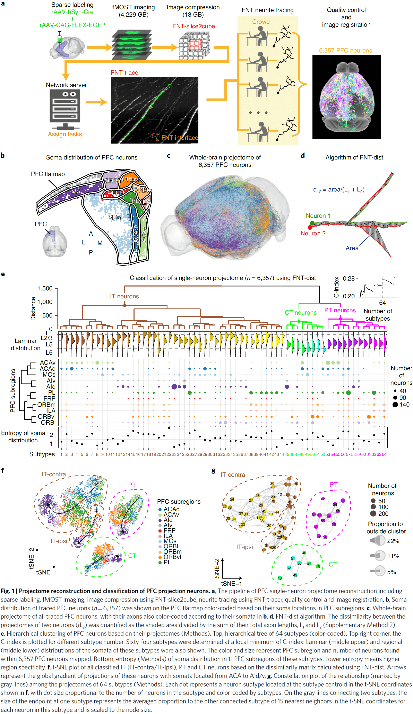

## [Synaptic Clustering and Memory Formation](https://doi.org/10.3389/fnmol.2019.00300)

- Cumulating evidence from imaging and molecular experiments suggest that the recruitment of synapses to encode and express a memory is neither random nor uniform.
- E.g. Groups of synapses that share similar input and output response properties that are located within the same part of a dendritic branch.
- This grouping or clustering of synapses has been shown to emerge in many different memory paradigms.
- This paper reviews the recent evidence on the role of synapse clustering in dendritic integration, sensory perception, learning, memory, and brain dysfunction.
- We also explore the recent theoretical work on the computational advantages provided by synapse clustering, leading to novel and revised theories of memory.
- Memory formation and storage depends on structural changes in the connectivity between neurons.
- Memory engram: the neural substrate containing experiences.
- Review of Karl Lashley’s failed experiments to find the engram, Penfield’s seizure stimulation experiments, and patient H.M.
- The main and best studied mechanism for encoding memories is the plasticity of synaptic strengths, which occurs primarily within the dendritic regions of excitatory neurons.
- Engram allocation and synapse clustering
    - In the neocortex, most excitatory synapses connect onto dendritic spines.
    - Spine dynamics, such as emergence, retraction, and morphological changes, are affected by sensory experience and learning.
    - We suggest that clustering is a type of patterned synaptic activation that’s optimal for inducing local spiking and/or local synaptic plasticity.
    - An alternative explanation is that synapses are scattered randomly on dendrites with the location of synapses determined by anatomy.
    - We do find some evidence for a random arrangement of synapses on dendrites, but the evidence isn’t conclusive.
    - In several brain areas, we find that synapses aren’t randomly placed on dendrites but tend to form groups or clusters.
    - Synapse clusters are important for synaptic integration because activating a sufficient number of synapses on a short length of dendrite can cause a self-regenerating, powerful dendritic spike.
    - Dendritic spikes are much stronger and longer-lasting than normal excitatory post-synaptic potentials (EPSPs).
    - These spikes can modulate the firing of the neuron and can induce localized plasticity at the dendritic level.
    - Two ways to induce dendritic spikes
        - Synapse clustering: near-synchronously activated inputs that are tightly packed together.
        - In-branch localization: near-synchronously activated inputs that are distributed with short distances of each other.
    
    - Both synapse clustering and in-branch coactivation drive nonlinear responses in dendrites and their function is expected to be mostly similar.
- Mechanisms for the generation of synaptic clusters
    - There are many mechanisms that can cause the formation of synaptic clusters.
    - E.g. Convergence of axonal projections carrying similar information onto the same dendrite, the presence of active ionic conductances in dendrites, activity-dependent axonal rewiring, and local protein synthesis.
    - During development, spontaneous activity refines neuronal connections, creating clusters of synapses with similar activity patterns.
    - Clusters can also develop from cooperative plasticity.
    - E.g. LTP can spread to neighboring synapses, which can coordinate the potentiation of multiple synapses leading to the formation of a cluster.
    - Clustering by axonal rewiring and spine turnover.
    - The addition of new synapses during synaptogenesis and spinogenesis tends to occur near existing, mature synapses, which changes the wiring diagram and can lead to synapse clustering.
- Studies done on mice suggest that learning in a rich sensory environment results in higher clustering and that there are subregions on dendrites of increased synaptic turnover (hotspots).
- These hotspots are implicated in learning and are a substrate for memory-enhancing synapse clustering.
- When multiple memories are stored in the same neural circuit, co-clustering of related memories occurs.
- We are still exploring how clustering may contribute to computation in the brain.

## [Connectomes across development reveal principles of brain maturation](https://doi.org/10.1038/s41586-021-03778-8)

- How does the brain and its circuits change during development from birth to adulthood?
- In this paper, we use serial-section electron microscopy to reconstruct the full brain of eight C. elegans individuals across postnatal stages to investigate how the brain changes with age.
- We find that the overall geometry of the brain is preserved from birth to adulthood, but there are substantial changes in synaptic connectivity on this scaffold.
- When connectomes are compared against other individuals, we find differences in connectivity that make each brain unique.
- When connectomes are compared in time, we find consistent wiring changes across maturation.
- During development, the central decision-making circuitry is maintained but the sensory and motor pathways are remodeled. The brain also becomes more feedforward and modular.
- The developing nervous system faces many challenges.
- E.g. An animal’s anatomy changes such as the growth of a larger body and reproductive organs. The environment also changes causing sensory information changes.
- To adapt and learn, the nervous system changes itself in response to internal and external cues.
- However, the developmental principles that underlie these changes that shape the adult brain remain unknown.
- The C. elegans nervous system consists of two parts: a circumpharyngeal nerve ring and a ventral ganglion.
- Using electron microscopy for each developmental time point, we quantified the length, shape, and position of every neural and muscle fiber in the nerve ring.
- We also mapped every physical contact between all neurons and muscles, and all chemical synapses between neurons, muscles, and glia to generate a connectome.
- Uniform growth and stable brain geometry
    - We found that uniform neurite growth maintains brain geometry.
    - E.g. The shape and position of almost every neurite in the brain was set at birth.
    - From birth to adulthood, the total length of neurites increased fivefold, mirroring the fivefold increase in body length.
    - Neurites grew proportionally, maintaining physical contact between cells that were present at birth across maturation with few exceptions.
    - Thus, the brain grows uniformly in size and maintains its overall geometry.
    - The total number of chemical synapses increased sixfold and synapse count increased in proportion to neurite length, maintaining synapse density across development.

- Non-uniform synapse addition
    - During development, we found that non-uniform synapse addition reshapes the connectome as new synapses create new connections and strengthen existing connections.
    - About 1,200 new synapses formed new connections between disconnected cells, resulting in a 2.4-fold increase from the number of connections at birth.
    - In contrast, about 4,500 new synapses strengthened existing connections.
    - New synapses aren’t adding uniformly across the brain as new connections were more likely to form between neurons that shared larger physical contact areas at birth.
    - Thus, physical contacts at birth form a scaffold onto which the network unfolds during development.
    - Synapse addition was also preferential for strengthening inputs and establishing new connections to hub neurons.
    - Hub neuron: a neuron that has many connections at birth.
    - While hub neurons disproportionately strengthened and added to their input connections, the number of outputs were only proportionately increased.
    - Thus, maturation focuses the flow of information to the most connected neurons at birth.
    - Each cell appears to regulate the strengthening of its outputs but not its inputs.
    - In contrast to mammals where synapse pruning is a feature of development, we didn’t observe systematic synapse elimination.
    - In C. elegans, synaptic connections are rarely removed but instead are weakened by selectively strengthening other connections.
- Stereotyped and variable connections
    - Using changes in synapse number, we classified each connection between neurons as either stable, developmentally dynamic, or variable.
    - Stable connection: present from birth to adulthood and maintained its relative strengths.
    - Developmentally dynamic connection: significant increase or decrease in their relative strengths but in a stereotyped way.
    - Variable connection: exhibit no consistent trend in synapse number and weren’t present in every animal.
    - In the adult connectome, stable connections represent around 43 percent, developmentally dynamic around 14 percent, and variable connections at 43 percent.
    - Stable connections had more synapses than variable connections and made up a larger proportion (72 percent) of total synapses.
    - Stable and developmentally dynamic connections represent the unchanging portion of the connectome that’s shared across individual worms.
    - Variable connections represent the portion that’s unique to each worm.
    - Modulatory neurons showed higher variability in their output connections, whereas motor neurons showed lower variability.
    - This may reflect the functions of both types of neurons as motor execution must be precise and consistent, while modulating neurons need less precise synapses.
- Stable interneuron connections
    - By excluding variable connections, we can assess the development changes in connectivity that are shared across individuals.
    - Developmentally dynamic connections weren’t uniformly distributed among cell types or circuit layers.
    - E.g. Connections between interneurons and from interneurons to motor neurons had more stable connections than developmentally dynamic connections.
    - Maturation changes how sensory information is integrated and relayed but the layout of interneuron circuits is stable from birth to adulthood.
- Increases in feedforward signaling with age
    - For stable and developmentally dynamic connections, synapse addition strengthened existing feedforward connections more than feedback or recurrent connections.
    - One pattern of brain maturation is that more signals flow from sensation to action, enabling more reflexive behavior with age.
- Modularity increases with age
    - Most of the increase in modularity is due to a small percentage of all synapses over development in developmentally dynamic connections.
    - E.g. 74 percent of the new synapses added to stable connections don’t increase modularity.
    - Variable connections also contribute to module segregation.
- From birth to adulthood, the C. elegans brain grows six times in volume while preserving features of brain geometry, shape, and relative placement of neurons and their synapses.
- Changes in brain connectivity weren’t explained by uniform enlargement of existing wiring as synaptic changes weren’t uniformly distributed throughout the network.

- Developmental patterns that shape how the brain’s network changes
    - Most new synapses appear where physical contact already exists, both adding synapses to connections and creating new connections. The larger the physical contact, the greater the chance of a new connection.
    - Neurons with more connections at early stages receive disproportionately more new synapses, thus well-connected neurons become better integrators of information, but not broader communicators of that information.
    - The inputs to neurons tend to become more heterogenous over development but in contrast, the outputs from neurons maintain their relative strength.
    - The wiring diagram of C. elegans isn’t hardwired/stereotyped and there are individual differences.
    - Stable wiring between interneurons implies that the network scaffold is good enough to be used in different contexts.
    - Synaptogenesis preferentially creates new connections and strengthens existing connections in the direction from sensory to motor layers, making the network more feedforward over time.
    - This feedforward bias with age may be due to the need for more rapid information processing and more reflexive decisions.
    - Synapse remodeling in the connectome increases the modularity of the brain, making it easier to resolve more subnetworks for sensory or motor processing with maturation.
- The synaptic remodeling we see in the C. elegans brain is likely to have consequences on behavior.

## [Prolonged life of human acute hippocampal slices from temporal lobe epilepsy surgery](https://doi.org/10.1038/s41598-018-22554-9)

- This paper presents a method for keeping acute human brain slices viable for up to 48 hours.
- Specifically, resected hippocampal tissue from patients with drug-resistant epilepsy presents a unique opportunity to test novel treatment strategies directly in the target tissue.
- Review of epilepsy, how it can be treated by resection of epileptic tissue, and that the most common structure for focal seizure origin is the temporal lobe.
- Resected tissue is extremely valuable for providing information on pathological network mechanisms of epilepsy but also for validating novel treatments on drug-resistant tissue.
- Goals of this paper
    - To test the hypothesis that incubation time for human brain slices, using the interface incubation, can be extended to 48 hours without significantly compromising slice quality.
    - To establish a dual-flow submerged chamber system, enabling visually guided whole-cell recordings during epileptiform activity in human brain slices.
- No notes on the method which is the majority of the paper.
- Interestingly, spontaneous epileptiform activity in the epileptic dentate gyrus, an area where no such activity has been previously reported, was occasionally observed.

## [Theories of consciousness](https://doi.org/10.1038/s41583-022-00587-4)

- This paper reviews four prominent theories of consciousness (ToCs).
- E.g. Higher-order theories, global workspace theories, re-entry and predictive processing theories, and integrated information theory.
- Review of the neural correlates of consciousness (NCCs).
- One limitation of the NCC framework is distinguishing between true NCCs and the neural prerequisites and consequences of consciousness.
- One reason why ToCs talk past each other is because they often have different explanatory targets.

- What kind of phenomena should a ToC explain? There’s no consensus among theorists.
- The heart at the problem of consciousness is defining experience/subjective awareness.
- E.g. There’s “something it is like” for an organism to be conscious and what it’s like to be in one state of consciousness differs from what it’s like to be in another state of consciousness.
- A ToC must explain why some organisms or systems are conscious and why states of consciousness differ from each other.
- Two classes of states of consciousness
    - Global: an organism’s overall subjective profile that’s associated with changes in arousal and behavioural responsiveness.
        - E.g. Wakefulness, dreaming, sedation, minimally conscious state, psychedelic state.
        - This class is sometimes called the “levels of consciousness” but we use “global states” because it’s less restrictive and these states might not be ordered.
    - Local: the contents of consciousness.
        - E.g. The feeling of a headache versus the smell of coffee.
        - Has different levels of granularity from low-level perceptual features to objects to complete multimodal perceptual scenes.
- Another distinction for consciousness is between its phenomenal properties and its functional properties.
    - Phenomenal: what it is like to be conscious.
    - Functional: how consciousness helps the organism.
- We don’t claim that these two types of properties are independent, but they do provide different explanatory targets for ToCs.
- Local states of consciousness differ both within state (E.g. Binocular rivalry) and between states (E.g. Pain versus vision).
- In addition, another challenge is to explain why some contents can never be conscious and why others can only be conscious.
- E.g. Low-level processing in early sensory and regulatory systems can’t be conscious. Globally integrated perceptual scenes can only be conscious.
- Most ToCs aim to only explain certain aspects of consciousness which makes it difficult to compare them.
- Higher-order theories (HOTs)
    - The core claim of HOTs is that a mental state is conscious when it’s the target of a certain kind of meta-representational state.
    - Meta-representation: representations that have (as their targets) other representations.
    - E.g. A representation containing “I feel pain”.
    - For a meta-representation, its content concerns the agent’s own representations of the world rather than the world itself.
    - E.g. An infrared telescope that has infrared sensors to measure it’s own temperature.
    
    - Different HOTs differ by the kinds of meta-representation they believe to be responsible for consciousness.
    - E.g. Thought-like meta-representations or computational meta-representations.
    - E.g. The self-organizing HOT argues that consciousness involves the learning to redescribe lower-order representations as meta-representations, while higher-order state space theory argues that subjective reports are a generative model of perceptual content.
    - HOTs focus on explaining why some contents are conscious while others aren’t.
    - E.g. Some contents can’t be conscious because they can’t be the targets of meta-representations, while some contents can only be conscious because they must be accompanied by a meta-representation.
    - As for why conscious states have a distinct phenomenal character, HOTs respond by stating that the phenomenal character of a state is determined by the properties that the meta-representational states gives it.
    - But why does the representation of various properties generate the phenomenology that it does?
    - HOTs aren’t committed to any particular view of the function(s) of consciousness.
- Global workspace theories (GWTs)
    - The core claim is that the wide accessibility of information to consumer cognitive systems constitutes conscious experience.
    - When sensory information gains access to consciousness, it’s broadcast to a neuronal workspace that’s implemented across higher-order cortical association areas.
    - E.g. Fronto-parietal network.
    - Access to the global workspace is achieved through ignition.
    - Ignition: when recurrent processing amplifies and sustains neuronal representations.
    
    - Ignition and broadcast distinguishes GWTs from HOTs.
    - GWTs focus on the functional rather than the phenomenal aspects of consciousness.
    - GWTs offer clear accounts of how consciousness relates to other cognitive processes.
    - E.g. According to GWTs, attention selects and amplifies specific signals, allowing them to enter the workspace. The workspace itself is intimately tied to working memory.
    - Concerns about GWTs come from defining what a global workspace is.
- Integrated information theory (IIT)
    - IIT is a mathematical approach to characterizing phenomenology and starts by proposing axioms about experience.
    - From these axioms, IIT derives properties that any physical substrate of consciousness must satisfy. And if a physical system has these properties, then it must be conscious.
    - Integrated information: a measure of how much information is generated by a whole system compared to how much information is generated by its parts.
    - IIT links consciousness with posterior cortical areas as these areas exhibit neuroanatomical properties suited for generating high levels of integrated information.
    - However, IIT doesn’t link consciousness to information processing, rather, it links consciousness to properties of the cause-effect structure of a system.
    
    - The global unity of consciousness is explained by the integrated aspect of integrated information.
    - IIT has little to say about how consciousness relates to other aspects of the mind such as attention, learning, and memory.
- Re-entry and predictive processing theories
    - These theories emphasize the importance of top-down signaling in shaping and enabling conscious perception.
    - Re-entry theories are motivated by evidence that highlight the importance of top-down signaling for conscious perception.
    - In contrast, predictive processing theories are motivated by viewing perception as inference about the causes of sensory signals and by the free energy principle.
    - Both factors lead to the idea that the brain implements a process of “prediction error minimization” that approximates Bayesian inference through feedback and feedforward connections.
    - Sensory prediction errors can be minimized not only by updating predictions, but also by doing actions that bring about expected sensory data.
    
    - The experiential character of a local state is specified by the nature of the perceptual predictions.
    - E.g. The phenomenology of emotional states may be accounted for by the role of interoceptive predictions that regulate an organism’s physiological condition.
    - Predictive processing explains the distinction between conscious and unconscious states as whether a mental state is part of a current “best guess” during perceptual inference.
- Unity of consciousness: the fact that experiences seem to fully capture what it’s like to be that agent.
- But is consciousness unified? This is still up for debate.
- A ToC must also explain why a physical substrate isn’t conscious.
- E.g. Why is the cerebellum neither necessary nor sufficient for consciousness? IIT argues that the cerebellum has an architecture that’s poorly suited for generating high levels of integrated information.
- Another point of contention among ToCs is whether cognitive access is central to consciousness.
- E.g. GWTs argues that cognitive access is core to consciousness while IIT and local recurrency deny a close relationship between consciousness and cognitive access.
- One of the most powerful source of data for evaluating rival ToCs is if they can make novel predictions.
- If a ToC made confirmed novel predictions, then it would be strongly supported.
- Many of the novel predictions that contemporary ToCs make are difficult to test because it’s difficult to reliably detect consciousness and its absence.
- Methodological advances may bring novel predictions within reach of testability.
- E.g. IIT predicts that changes in neural structure could lead to changes in conscious experience even when these changes don’t result in changes to neural activity.
- Three issues for a theory-testing regimen in consciousness science
    - ToCs need to be precise.
        - Vague and imprecise constructs can only generate vague and imprecise predictions.
        - HOTs and predictive processing need to specify the kinds of meta-representations that are unique to consciousness, IIT needs to clarify its implications for the functional profile of consciousness, and GWTs need to provide the criteria of what makes a workspace global.
        - One avenue to make a theory more precise is to define the theory as a computational model.
        - A computational model can generate precise predictions and provides a shared language to compare against other ToCs.
        - But a challenge for the computational approach is to develop models that not only account for the functional features of consciousness, but that also account for its phenomenological properties.
    - ToCs need to be more comprehensive.
        - Most ToCs focus on specific local states, global states, and animals.
        - This is due to experimental accessibility and our limited knowledge, but a ToC must do justice to the rich diversity of consciousness.
        - E.g. The temporal aspect of consciousness, dreaming, disorders of consciousness, human infants, non-human animals, and even artificial systems.
        - Theories that cover more aspects and animals have an advantage over those that don’t because they’re more general and apply to more evidence.
    - ToCs need to be more measurable.
        - What’s a trustworthy measure of consciousness?
        - We must be able to verify the predictions of a ToC.
        - One challenge is measuring the distinction between conscious and unconscious mental states.
        - Another challenge is determining the distribution of consciousness in the animal kingdom.

## [Sleep and the Price of Plasticity: From Synaptic and Cellular Homeostasis to Memory Consolidation and Integration](https://doi.org/10.1016/j.neuron.2013.12.025)

- Why does the brain need to disconnect from the environment for hours every day?
- Synaptic homeostasis hypothesis (SHY): proposes that sleep is the price the brain pays for plasticity.
- While awake, the brain learns statistical regularities about the environment, which is implemented as the strengthening and weakening of connections, increased cellular needs, and decreased signal-to-noise ratio.
- While asleep, spontaneous activity renormalizes net synaptic strength and restores cellular homeostasis.
- Sleeps refreshes our brain and body, but what exactly is restored by sleep has been harder to prove.
- It occupies a large fraction of the day, occurs from early development to death, and is present in all species.
- Sleep is marked by a reversible disconnection from the environment.
- SHY argues that the fundamental function of sleep is the restoration of synaptic homeostasis, which is challenged by synaptic strengthening trigged by learning during wake and by synaptogenesis during development.
- Consequences of increased synaptic strength
    - Increased energy consumption
    - Increased cellular supplies leading to cellular stress
    - Reduced selectivity of neuronal responses due to saturation
- By renormalizing synaptic strength, sleep reduces the burden of plasticity on neurons and other cells while restoring neuronal selectivity and thus the ability to learn.
- Neurobiological and informational constraints of awake neurons
    - Neurons should fire sparsely and selectively.
        - Neurons face the problem that firing is more expensive than not firing.
        - Informationally, a neuron is a tight bottleneck where it can receive a large number of different input patterns from thousands of synapses, but it can only produce a few different outputs from its one axon.
        - A neuron’s dilemma is “to fire or not to fire.”
        - Together, these energetic and informational constraints force neurons to fire sparsely and selectively.
        - E.g. Firing only to a small subset of inputs while remaining silent in response to the majority of other inputs.
    - Neurons should detect and communicate suspicious coincidences.
        - Neurons should fire when inputs occur together more frequently than expected.
        - Suspicious coincidences suggest regularities in the input and thus the environment.
        - E.g. The presence and persistence of objects.
        - The most suspicious coincidences should cause a neuron to fire the most.
    - Neurons should strengthen synapses during wake when interacting with the environment.
        - There are a variety of plasticity mechanisms that promote some form of synaptic potentiation during exploration, association learning, contextual memory formation, fear conditioning, visual perceptual learning, cue-reward learning, and avoidance learning.
    - Neurons should renormalize synapses in sleep when they can sample memories comprehensively.
        - Potentiating synapses comes at the cost of consuming more energy, requiring more supplies and leading to more cellular stress.
        - Plasticity-selectivity dilemma: when a neuron strengthens additional input lines, a broader distribution of its input patterns can make it burst, reducing its ability to capture suspicious coincidences because it’ll also fire for spurious coincidences.
        - SHY believes that renormalization through synaptic depression happens during sleep because neurons obtain a comprehensive sampling of the brain’s overall knowledge of the environment.
- Imagine you learn something new during the day. By the evening, neurons in various brain areas will have learned the new stimulus by strengthening the relevant synapses but this learning isn’t permanent. To make it permanent, the synapses would either have to continue operating at the strengthened level forever or to renormalize by spreading that change throughout the neural pathway.
- Basic goals of neurons
    - New learning should happen primarily by synaptic potentiation.
    - Synaptic potentiation should occur primarily in wake when the organism interacts with its environment.
    - Renormalization of synaptic strength should happen primarily in sleep when the brain doesn’t receive input.
- Some synapses may be protected from changes during sleep with a switch.
- In sleep, the switch to non-plasticity where synaptic potentiation is prevented and synapses protected may be signaled by a global drop in the level of neuromodulators.
- However, given the variety and complexity of plasticity mechanisms, the specific synaptic rules followed by neurons during wake and sleep likely differ across species, brain structures, neuronal types, and developmental periods.
- It’s also unclear whether inhibitory connections need to be renormalized.
- Evidence for SHY
    - Molecular
        - The movement of GluA1-containing-AMPA receptors (AMPARs) into and out of the synaptic membrane is believed to be the primary mechanism of synaptic potentiation and depression respectively.
        - Levels of GluA1-containing AMPARs are 30 to 40 percent higher after wakefulness than after sleep in rats, suggesting that net synaptic potentiation happens during wake and depression during sleep.
    - Electrophysiological
        - In humans, the slope of the early response evoked in frontal cortex by transcranial magnetic stimulation (TMS) increases progressively over the course of 18 hours of continuous wake and returns to baseline levels after one night of sleep.
        - The mean firing rates of cortical neurons increase after prolonged wake and is consistent with the finding that synaptic efficacy varies between sleep and wake.
    - Structural
        - In fruit flies, protein levels of pre- and post-synaptic components are high after wake and decline with sleep.
        - In young mice, a few hours of sleep and wake can affect the density of cortical synapses.
        - This contrasts with adult mice where spine turnover is limited and not impacted by sleep, suggesting that synaptic homeostasis maybe be mediated by changes in synaptic strength rather than number.
- The evidence for SHY may be confounded by other processes and we don’t have direct evidence for the phenomenon.
- E.g. Structural changes of synapses doesn’t always reflect changes in efficacy.
- In mammals and birds, a reliable marker of the need for sleep is the amount of slow-wave activity (SWA) in the EEG of NREM sleep.
- E.g. SWA is highest at sleep onset, decreases with time spent asleep, increases with time spent awake, and is reduced by naps.
- SWA occurs because of changes in neuromodulation during NREM sleep when cortical neurons become bistable and undergo a slow oscillation in membrane potential.
- SHY reflects the homeostatic regulation of sleep need and should therefore reflect changes in synaptic strength.
- The hypothesis also suggests that SWA may not simply reflect changes in synaptic strength, but that the underlying slow oscillations may contribute directly to synaptic renormalization.
- E.g. If stronger synapses increase SWA and SWA contributes to the decrease of synaptic strength during sleep, then this creates a negative feedback loop that self-regulates thus normalizing the synapse.
- One of the evident benefits of sleep is the restoration of memory capacity.
- E.g. Episodic memory retention is substantially impaired following sleep deprivation.
- Synaptic renormalization provides an explanation for this benefit since the desaturation of synaptic weights improves synaptic capacity and reduces cellular stress.
- In a hierarchically organized network model during sleep, connections in higher areas relating to invariant concepts were protected by strong and frequent reactivations, while synaptic depression weakened synapses associated with details learned by lower cortical areas.
- Memory interference can be reduced by blocking LTP-like potentiation and thus new learning.
- But forgetting is an important mechanism for dealing with the inevitable accumulation of unimportant details.
- The positive effect of sleep on retention is that it slows down the forgetting of certain memories.
- Does synaptic renormalization happen during REM or NREM sleep?
- Synaptic homeostasis occurs in invertebrates that don’t have any distinct sleep stages, so renormalization seems to occur regardless of REM or NREM sleep.
- REM sleep could contribute to memory in many ways, but we don’t know for sure if it’s necessary and if so, how it would do so.
- One interesting hypothesis is that REM sleep may promote the insertion of AMPARs at synapses that remain effective after renormalization during NREM sleep.
- So far, experimental evidence from a variety of studies in a variety of species is broadly consistent with the core idea of SHY–that normal sleep allows the brain to reestablish synaptic and cellular homeostasis after plastic changes during normal wake.
- From SHY, the need for sleep is explained as the renormalization of synaptic strength based on a comprehensive sampling of the environment, rather than being based on the specific inputs of a waking day.
- SHY would be refuted if we found evidence that synaptic homeostasis is accomplished sufficiently during wake.
- E.g. If offline brain circuits renormalized during wake.

## [Taste Bud Connectome: Implications for Taste Information Processing](https://doi.org/10.1523/jneurosci.0838-21.2021)

- Taste buds contain multiple cell types, two of which mediate transduction of specific taste qualities.
- E.g. Type II cells transduce either sweet, bitter, or umami, while Type III cells transduce sour.
- We used an electron microscope to scan five circumvallate mouse taste buds.
- This allowed us to explore the degree of interaction between different cell types and to specify their connectivity with afferent nerve fibers (NFs).
- Out of the 127 NFs studied, approximate 70 percent of the fibers synapse with only one taste cell while 25 percent synapse exclusively with multiple Type II cells or multiple Type III cells.
- The remaining 5 percent NFs synapse with both Type II and III cells. Since each type transduces different taste qualities, these dual-connected fibers aren’t consistent with the absolute labeled-line encoding system.
- The sense of taste (distinguished by at least five primary qualities) is implemented by specialized epithelial cells of taste buds called taste cells.
- Each taste cell responds primarily to one of the five taste qualities according to the molecular nature of the receptor.
- E.g. Salt, sweet, sour, bitter, and umami.
- How is taste information encoded and transmitted by sensory nerves to the brain?
- Although taste cells generally express molecular receptors for only one taste quality, the responses of taste cells aren’t restricted to a single quality.
- Likewise, individual gustatory nerve fibers (NFs) range from specific (responding to one taste quality) to multimodal (responding to multiple taste qualities).
- How a NF may be multimodal
    - Connected to taste cells that are general (responds to many qualities)
    - Lack of specific connections to specific taste cells (general synaptic connectivity)
    - Cross talk between taste cells
- Labeled-line hypothesis: argues that each class of taste cell synapses with only a specific subset of quality-specific NFs.
- To test the labeled-line hypothesis, we can analyze the connectivity within a taste bud and check if the synapses are specific or not.
- If the hypothesis is true, the connectivity should be specific with particular NFs receiving synapses from only one type of taste cell.
- Conversely, the alternative hypothesis (across-fiber hypothesis) states that some NFs may be broadly responsive to more than one taste quality and that taste quality can be extracted by comparing activity across fiber populations.
- In this paper, we reconstructed the pattern of taste-cell-to-nerve-fiber connectivity (connectome) using serial blockface scanning electron microscopy (sbfSEM) to test which hypothesis is true.
- The high resolution of sbfSEM enables us to identify all synapses within a taste bud.
- E.g. Taste cell to NF synapses and contacts between taste cells.
- While Type III cells (sour) use conventional synapses with a cluster of synaptic vesicles close to the presynaptic membrane, Type II cells rely on an unconventional synapse.
- Type II cell synapses use a large atypical mitochondrion (ATM) that releases the neurotransmitter ATP on activation of the taste transducing cell.
- Since Type II uses a different synaptic mechanism, we can use these features to distinguish between Type II and III synapses.
- No notes on “Materials and Methods” section.
- Type I taste cells aren’t discussed because only Type II and III are known to be taste-transducing cells.
- Confirming this, we found no membrane specializations between Type I cells and NFs other than wavy junctions.
- The rare cases of contact between taste cells of the same type (Type II-Type II contacts, and Type III-Type III contacts) showed no signs of synaptic transmission and no form of synaptic specialization.
- For Type II-Type III contacts, we found only small, nonspecialized points of contact.
- This suggests that direct cell-to-cell synaptic communication between Type II and III cells doesn’t play a role in taste bud functioning; although nonsynaptic interactions may occur.
- For taste cell-NF contacts, the majority (65 percent) of them connected to Type II cells while only a few (3 percent) connected to both Type II and III cells.
- We find many examples where a Type II or III taste cell makes contact with a nerve fiber but no synapse is evident.
- Thus, contact between cells doesn’t guarantee a synapse there.
- But the absence of a membrane specialization at such points of contact doesn’t, however, preclude the exchange of information at these junctions.
- Interestingly, the number of synapses of taste cell-NF synapses for both Type II and III cells varied.
- E.g. For Type II cells, the number of channel synapses ranged from 1 to over 20.
- Cells with higher numbers of ATMs tend to be connected to multiple NFs with the number of postsynaptic NFs proportionate to the number of ATM in a given cell.
- A single NF often made repeated synapses onto a single Type II cell. The same applies to Type III cells but with a lower number of repeated synapses.
- In general, NFs that synapse with a Type III cell synapse only on other Type III cells; the same applies to Type II cells.

- Some NFs form both channel synapses with Type II cells and vesicular synapses with Type III cells.
- E.g. 4 out of 88 total fibers synapsed with both Type II and III cells.
- The convergence of Type II and III cell inputs onto single NFs shows that connectivity within a taste bud isn’t organized entirely based on the labeled-line hypothesis since the cell types transduce different taste qualities.

- Two conclusions of the paper
    - Taste information is transmitted over labeled-lines.
        - E.g. NFs convey information about one taste quality.
    - Different types of transducing taste cells within a taste bud directly communicate with one another to modulate the transduction and transmission of taste information.
- While connectional specificity may exist, it isn’t absolute.
- We found no specializations, synaptic or otherwise, between the limited points of membrane contact between Type II and Type III cells.

## [The Neural Basis of Temporal Processing](https://doi.org/10.1146/annurev.neuro.27.070203.144247)

- This paper reviews the behavioral, electrophysiological, and theoretical literature on the neural basis of temporal processing.
- Evidence suggests that temporal processing is distributed among different structures rather than relying on a central timing area.
- Given the intricate link between temporal and spatial information in most sensory and motor tasks, timing and spatial processing are intrinsic properties of neural function and specialized timing mechanisms (such as delay lines, oscillators, or different time constants) aren’t required.
- Rather, temporal processing may rely on state-dependent changes in network dynamics.
- All sensory and motor processing ultimately relies on spatiotemporal patterns of action potentials (APs).
- Spatial processing: when a stimulus is characterized by a snapshot of neural activity.
- E.g. The orientation of a bar of light can be determined from a snapshot of active retinal ganglion neurons. Discriminating the pitch of two high-frequency tones activates different populations of hair cells in the cochlea.
- In contrast, other stimuli can’t be characterized by a snapshot of neural activity.
- E.g. The duration of a flashed bar of light or the interval between two tones.
- These stimuli require the nervous system to process the temporal pattern of incoming APs.
- Most sensory stimuli aren’t purely spatial or temporal but are a combination of the two.
- Scales and types of temporal processing
    - We categorize temporal processing into four different time scales.
    - E.g. Microseconds, milliseconds, seconds, and circadian rhythms.

- Distinction between temporal processing and temporal coding
    - Temporal processing: the decoding of temporal information or the generation of timed motor responses.
    - To process temporal information, we must start with spike patterns that encode information in time.
    - Temporal coding: the generation of temporal information from external stimuli or from internal sources.

- Arguably, it’s in the auditory domain that timing is most important.
- E.g. To understand Morse code requires discriminating the duration of single tones (short vs long) and the internal between them (element, letter, word). It also requires perceiving the sequence of tones to represent auditory objects. Lastly, the timing of the stimuli isn’t absolute but depends on the speed of transmission (faster words per minute mean shorter pauses).
- The complexity of processing auditory Morse code shows how sophisticated temporal processing can be on the timescale of tens to hundreds of milliseconds.
- In many ways, processing Morse code is a simpler task than processing speech recognition.
- E.g. Speech has prosody, spectral information, and speaker-specific information.
- Temporal features are fundamental for phoneme discrimination.
- Speech is one of the most complex forms of pattern recognition and requires both spatial and temporal processing.
- Timing is also important for movements because muscles must be activated at the correct time with the correct duration.
- Muscle activations require accurate timing on the order of tens of milliseconds.
- E.g. Pathologies that disrupt the timing between agonist and antagonist actions lead to awkward and inaccurate movements such as cerebellar lesions.
- Two competing views of time in the brain
    - Centralized internal clock: proposes that the brain uses the same circuitry to determine duration.
        - E.g. A central clock that beats at a fixed frequency.
    - Distributed: proposes that the brain has many different forms of temporal processing and that the processing depends on the task and modality.
- A universal clock could be the only timing mechanism for all intervals/durations, or there could be a set of distributed circuits that each handle a different length of time.
- Studies find that interval discrimination is better in the auditory domain than in the visual domain.
- Within a domain, changing stimulus features decreases performance.
- E.g. If the first tone is at 1 kHz and the second tone at 4 kHz, this results in worse performance than if both tones were at the same frequency.
- Studies also find that interval discrimination between domains is significantly worse than within modalities.
- These data are consistent with the view of distributed timers.
- Can temporal resolution improve with practice? Yes.
- E.g. Musicians can improve their timing of musical notes with practice.
- If the neural mechanisms underlying timing can improve, then we can test the central versus distributed view of timing by seeing if training improves performance for different intervals and frequencies.
- If training does improve performance, then this implies a central view of timing because the improvement translates to untrained domains.
- The evidence reveals that interval discrimination learning is specific to the temporal domain but generalizes in the spatial domain.
- E.g. Training to discriminate one interval at one frequency generalizes to other frequencies but not to other intervals.

- The simplest interpretation of the evidence is that centralized circuits exist for each interval and with training they become more accurate, but the interval circuits are separate.
- An alternative interpretation is that training improves the representation of intervals or the retrieval of them from short-term memory.
- A third interpretation is that the simple nature of these temporal tasks allows the brain to use multimodal pathways to transfer learning from one domain to another.
- What are the mechanisms behind temporal processing and where are they located?
- Given the range of tasks and behaviors that rely on temporal processing and the number of areas involved, this suggests that temporal processing is distributed and is a universal intrinsic property of neural circuits.
- Some amphibians (frogs and toads) communicate using vocalizations that are rich in temporal information.
- These calls can be distinguished by the number and frequency of auditory pulses.
- Neurons in the auditory amphibian midbrain appear to be tuned to both of these features but not to sound intensity.
- These neurons exhibited a preferred pulse frequency where they produced their maximal number of spikes.
- This provides an elegant example of temporal tuning curves that are analogous to the orientation tuning curves in V1 neurons.
- Neurons in the bat auditory brainstem also respond selectively to specific temporal features.
- E.g. Pulse-echo delay and sound duration.
- Birdsongs are another source of rich temporal processing due to their temporal structure and complex sequences.
- We’ve found order-sensitive cells in the bird’s brain.

- No notes on timing studies in the basal ganglia and cerebellum.
- Two ways sensory input can make movements more accurate
    - Feedback
        - Corrections come from comparing the current sensory input with a target.
        - E.g. A thermostat compares the current room temperature with its target temperature and adjusts the heat accordingly.
        - Although accuracy is easily achieved with feedback, its disadvantage is that it’s slow.
    - Feedforward
        - Corrections come from comparing the predicted sensory input with a target.
        - Feedforward is faster than feedback but requires experience through learning to predict the sensory input.
- The temporal feature selectivity of cortical neurons undergoes experience-dependent plasticity.
- The brain must somehow recode the temporal information in an input to a spatial code.
- E.g. To discriminate the differences in the duration of two stimuli, there must be a different neuronal response to each duration.
- Three models of the neural basis of timing
    - Clock models
        - The basic unit of these models is an oscillator and a counter.
        - An oscillator beats at some frequency and each beat is counted by some neural integrator.
        - If a clock were used to discriminate 100-ms intervals, then it would have to beat at a frequency of at least 200 Hz, which seems neurophysiologically impossible.
        - But clock-like mechanisms could be involved in timing on the scale of seconds and minutes.
    - Spectral models
        - Decodes time using arrays of neural elements that differ in some temporal property.
        - E.g. Stimuli activate arrays of cells that oscillate at different frequencies and phases.
        - E.g. Delay lines.
        - These models have the advantage of encoding the time since arrival of a stimulus by having different subsets of cells active at different times.
        - But no evidence has been found supporting the idea that neural elements differ in some temporal property.
    - Network or State-Dependent models
        - Instead of temporal processing inferring some computation that’s implemented in neurons, we can start with a bottom-up approach where temporal processing is an emergent property of neurons.
        - One proposal is that temporal information is inherently captured by time-dependent changes in the state of the cortical network.
        - E.g. Two identical inputs separated by 100 ms will arrive to a different network state because some synapses will be active/depressed and some neurons may be hyperpolarized or excited.
        - Thus, the same input can activate different subpopulations of neurons depending on the recent stimulus history of the network.
        - Plus, the difference in the population activity produced by the first and second inputs can code for the 100 ms interval.
- Most of the experimental and theoretical studies discussed above have focused on simple stimuli.
- E.g. Interval discrimination or the generation of a single timed motor response.
- We have no idea how complex time stimuli are processed.
- E.g. Music, speech, or complex motor sequences in sports.
- As sequences become more complex, more circuitry is required to keep track of the higher-order features.

## [Visual and linguistic semantic representations are aligned at the border of human visual cortex](https://doi.org/10.1038/s41593-021-00921-6)

- How is semantic/meaning information stored in the brain?
- We know the brain has multiple networks for semantic information but we don’t know how they interact with sensory networks.
- In this paper, we compared semantic maps from two fMRI experiments in the same participants where one experiment used silent movies as stimuli while another used narrative stories.
- The stimuli activated their respective semantic networks but interestingly, visual categories were represented posterior to the boundary of the visual cortex while the same categories were represented linguistically on the anterior side.
- This suggests that these two networks are smoothly joined to form one contiguous map representing semantic information.
- Two theories on how semantic information from different modalities is combined
    - Hub-and-spoke view: unimodal processing units in modality-specific cortex are independent spokes that converge at an amodal hub in the anterior temporal lobe (ATL).
        - Is supported by evidence from ATL lesions that result in semantic dementia.
    - Convergence zone view: argues that modality-specific and amodal semantic representations are combined at multiple points across the cortex outside of the ATL.
        - Is supported by evidence that other regions respond to the same semantic category regardless of modality.
- Semantic alignment hypothesis (SAH): for each location along the anterior border of visual cortex that’s selective for a particular visual category, there should be an area directly anterior to it that’s selective for that same semantic category in language.
- The semantic alignment hypothesis is in line with the convergence zone view.
- To test the SAH, we compared semantic maps from two different experiments in the same participants.
- E.g. A vision experiment using natural movies and a language experiment using naturally spoken narrative stories.
- Voxels with correlated visual and linguistic semantic representations were clustered around the precuneus (PrCu) and angular gyrus (AG).
- A preliminary and qualitative assessment of the SAH using well-known visual categories (places, body parts, and faces) supports the hypothesis as the the linguistic semantic representations were anterior to their respective visual representations.
- This pattern appeared in all 11 participants.

- Using a more sophisticated and quantitative analysis, we found significant modality shifts in all 11 participants for semantic categories located along almost the entire boundary of visual cortex.

- These results support the semantic alignment hypothesis where each location along the anterior border of visual cortex that’s selective for a specific visual category has an immediate anterior region that’s selective for the same semantic category but in language.
- This suggests that the border of visual cortex acts as a convergence zone for semantic visual and linguistic information.
- But how does it fit with the extensive evidence that ATL lesions impair semantic recognition?
- We suspect that the pathways identified here connect modal visual experience to amodal representations, but these amodal representations alone aren’t sufficient to provide semantic labels to sensory experience.
- Instead, semantic comprehension may also require input from the memory system which uses pathways through the ATL.

## [Levels of biological plausibility](http://dx.doi.org/10.1098/rstb.2019.0632)

- Review of Marr’s three levels of explanation.
- E.g. Computational (what), algorithmic (how), and implementational (where).
- A component of a mechanism can itself be further decomposed into its own mechanism and component and so on.
- This mechanistic decomposition is seen in biology as an explanation.
- E.g. Spatial memory is explained as using the hippocampus, which uses LTP which uses the NMDA receptor which uses a specific protein and so on.
- In this type of multi-level mechanistic explanation, there’s no level that’s more biologically plausible or preferred.
- In neuroscience, there’s a tendency to dismiss higher-level explanations as biologically implausible or not real.
- E.g. Cognitive models.
- Mechanisms rarely decompose into clean, localizable, and independent components.
- Often, the mechanisms emerge from the interaction between components.
- Different levels of analysis provide different viewpoints on the same phenomena.
- Lower levels of analysis contain more information, information that’s abstracted away at higher levels.
- E.g. A sorting algorithm can be implemented in many different ways. A mental state can be implemented by many different neural activity patterns.
- The higher levels don’t specify all of the details of the lower levels but it does constrain the space of solutions.
- Higher level concepts are useful to aid in understanding.
- Neuroscience as a whole seems insufficiently developed to seriously consider fully reducing behavior to ion channels.
- It’s also unclear what neuroscience would gain from this reductionist pursuit as the field would still use the higher level concepts in practice.
- E.g. Classical mechanics persists despite being a special case or approximation of relativistic mechanics.
- Many phenomena that are labeled as emergent are, in reality and practice, reducible to their parts and relationships albeit difficult to reduce.
- These phenomena challenge the ability of scientists to understand complex phenomena that involve many interacting elements.
- Thus, emergent phenomena may just be phenomena that we don’t yet know how to reduce.
- The idea of biological plausibility is problematic and not clear.
- E.g. Are higher level descriptions never biologically plausible? Conversely, can one go too low toward physics and no longer be biologically plausible?
- The term “biological plausible” should be dropped and instead, researchers should clearly state the relevant datasets they intend to address with their theory or model.
- Measurements themselves aren’t levels of analysis, but different measures can be appropriate for evaluating mechanisms at different levels of analysis.
- E.g. A thermometer is good enough to measure temperature but not the exact speed of molecules.
- When a neuroscientist stops appealing to higher level concepts, they aren’t a neuroscientist anymore but instead are a chemist, physicist, etc.
- Scientists should resist the temptation to label every level above their preferred level as superfluous and every level below as involving uninteresting details.

## [Natural speech reveals the semantic maps that tile human cerebral cortex](https://doi.org/10.1038/nature17637)

- The meaning of language is represented in regions of the cerebral cortex known as the semantic system.
- In this paper, we systematically map semantic selectivity across the cortex using voxel-level modeling of fMRI data while subjects listened to hours of narrative stories.
- The data suggest that the semantic system is organized into intricate patterns that seem to be consistent across individuals.
- It also suggests that most areas within the semantic system represent information about specific semantic domains or groups of related concepts.
- The regions of the semantic system seem to respond more
    - To words than non-words
    - To semantic tasks than phonological tasks
    - To natural speech than temporally scrambled speech
- No study has yet produced a comprehensive survey of how semantic information is represented across the entire semantic system.
- No notes on the method.

- If the brain weren’t semantically organized as shown in figure 2, we would expect the colors to match random noise.
- No notes on the PrAGMATiC algorithm to merge the semantic map from many individuals.
- The results aren’t as strong as I would prefer due to the lack of comparison to a null hypothesis (permutation testing) and the lack of manipulation (causality). It’s an interesting paper though.

## [Synaptic modification by correlated activity: Hebb's postulate revisited](https://doi.org/10.1146/annurev.neuro.24.1.139)

- Hebb’s postulate of synaptic modification by correlated activity has become fundamental in our understanding of activity-dependent neural development and the cellular basis of learning and memory.
- This paper reviews two recent findings that update Hebb’s postulate.
- Two recent findings
    - Temporal order is important for the correlated activity to induce synaptic modification.
    - The activated synapse isn’t the only synapse modified.
- Temporal specificity
    - Experiments reveal the importance of the temporal order of pre- and post-synaptic spiking and have further defined the critical window of spike timing on the order of milliseconds.
    - The precise critical window depends on the synapse type.
    - One experiment found that the associative induction of long-term potentiation (LTP) didn’t require perfectly synchronous activation of two inputs, but instead the temporal order of the activation was crucial.
    - E.g. LTP of the weak input could be induced when the strong input was activated concurrently with, or following the activation of, the weak input by as much as 20 ms.
    - When the temporal order was reversed, long-term depression (LTD) was induced.
    - A spike initiated at the axon hillock can back-propagate onto its dendrites, providing the signal needed to inform the synapses of whether and when the postsynaptic cell fired.
    - Back-propagating postsynaptic spikes can function as an associative signal for synaptic modification.
    - The window to induce LTP/LTD is about 40 ms in width and is temporally asymmetric.
    - E.g. After presynaptic spiking, if the postsynapse spikes within 20 ms then LTP occurs. If the postsynaptic spike occurs 20 ms before presynaptic spiking then LTD occurs.
    
    - The transition from LTD to LTP occurs within a few milliseconds of change in spike timing.
    - The various spike-timing windows for synaptic modification reflect the diversity of synaptic machinery and may serve specific functions of information processing at different stages of neural pathways.
    - In some brain regions, such as the hippocampus, synaptic activation of postsynaptic NMDAR channels with concurrent membrane depolarization underlies the coincidence requirement for LTP.
    - It’s also crucial for LTP and LTD that calcium ion concentration increases since it may lead to the activation of certain protein kinases.
    - Many components of signal transduction pathways may function as molecular coincidence detectors.
    - One distinct feature of the spike-based learning rule is that it emphasizes the precise timing of individual spikes rather than the average rate of the population of spikes over some time.
    - However, whether the brain actually uses spike timing for coding information has been a long-standing issue in neuroscience.
    - A complete learning rule must capture both learning and forgetting. The strengthening (LTP) and weakening (LTD) of synapses fits this and avoids saturation by excitation.
    - This new asymmetric Hebbian rule (now called STDP) provides a mechanism for the self-normalization of synaptic weights.
    - The predictive nature of the temporally asymmetric learning rule is directly related to the implementation of classical conditioning.
    - The ability to detect and remember causal relationships between events, to predict what’s about to happen, is advantageous in evolution.
    - It’s been recently shown that the asymmetric Hebbian rule is mathematically equivalent to the temporal-difference learning algorithm.
- Temporal-to-spatial conversion: delay-line mechanism
    - An essential process in learning and memory is the transformation of temporal information into spatially distributed information in the brain.
    - Temporally varying sensory information are processed and stored with remarkable precision in the brain.
    - E.g. Vision and auditory information.
    - Inputs that aren’t explicitly temporal might also be encoded in spike timing.
    - E.g. Odorant and taste information.
    - For synaptic changes to be a mechanism of long-term memory, temporal information coded in spike timing might be converted into and stored as spatially distributed synaptic modification in the brain.
    - E.g. Short-term plasticity, slow inhibitory currents, network architecture such as delay lines.
- Spatial specificity in activity-induced synaptic modification
    - It’s generally assumed that Hebbian synaptic changes are synapse/input specific with only synapses that experience correlated activity becoming modified.
    - Hebb’s rule is a local rule where synapses are independent of each other.
    - However, there’s increasing evidence that activity-induced synaptic changes may be accompanied by changes in other synapses within a neural network.
    - Input specificity shouldn’t be viewed as an intrinsic property of LTP/LTD but as a dynamic variable linked to the spread of dendritic calcium ion elevation.
    - Neither LTP nor LTD were found to spread further up or down stream beyond the immediate neighboring synapses.

## [A connectomic study of a petascale fragment of human cerebral cortex](https://doi.org/10.1101/2021.05.29.446289)

- We used a fragment from the human temporal lobe to create a connectome. Specifically 1 mm3 volume cut into more than 5000 slices at approximately 30 nm thickness.
- This fragment contained 57,000 cells, hundreds of millions of neurites, and 133 million synaptic connections.
- Interesting features of the database
    - Glia outnumbered neurons 2:1 but this varies by cortical layer.
    - Oligodendrocyte was the most common cell type.
    - Excitatory spiny neurons comprised 69 percent of the neuronal population and excitatory synapses were the majority (76 percent).
    - Among the thousands of weak connections established on each neuron, there exist rarer, highly powerful axonal inputs that establish multi-synaptic contacts (up to 20 synapses) with target neurons.
    - These strong inputs are specific and allow a small number of axons to have impactful role in the activity of their postsynaptic partners.
- Unlike most organs, the brain doesn’t have a good animal model to experiment on.
- E.g. A mouse liver or lung can provide insight into a human liver or lung.
- The human brain is different.
- This paper describes a sample cubic millimeter of brain that extends through all cortical layers and was imaged at ultrastructural level with serial high-throughput electron microscopy.
- The sample came from a 45 year old patient with drug-resistant epilepsy.
- The final raw data size of the sample was 2.1 petabytes (PB) and the final processed data size was 1.4 PB.
- No notes on the method.

- All cell bodies were manually identified resulting in 49,000 neurons and glia and 8,000 blood vessel cells.
- The density of neurons is 16,000 per cubic millimeter, which is many folds lower than the density of neurons in mouse cortex.
- The six cortical layers become obvious when viewing the neuron and glia cell body cross-sectional areas.
- The largest cell bodies belonged to spiny pyramidal neurons.
- Non-pyramidal neurons were much less spiny, have smaller cell body sizes, and had a less obvious layer arrangement.
- Oligodendrocytes and blood vessels don’t show much evidence of layer-specific behavior.
- There was a lower density of blood vessels in white matter, presumably because of the lower energy requirements of myelinated axons compared to unmyelinated processes.
- In this volume, we found 150 million synapses that were mostly between axons and dendrites (99.4 percent).
- Out of the 150 million synapses, 40.6 million (27 percent) were inhibitory and 109.2 million were excitatory (72.87 percent).

- The density of the automatically annotated excitatory synapses was highest in layers 1 and 3.
- Inhibitory neurons, on average, received roughly equal numbers of excitatory and inhibitory synapses and these synapses were distributed uniformly along dendrites and somata.
- In contrast, excitatory neurons had relatively few synapses on their somata and proximal/non-spiny dendritic branches.
- For excitatory neurons, the synapses on the cell body and proximal dendrites were mainly inhibitory. This supports the idea of shunting inhibition.
- To better understand the potential modes of information flow in the network, we algorithmically traversed the connectome.
- When we start at an L4 pyramidal neuron (because it’s often the target of feedforward connections), we found that it primarily connects to cells in layer 3, which connect to cells in layer 2.
- In this volume, a small number of neurons form a disproportionately large number of the connections.
- E.g. The most connected neuron, a chandelier cell, synapsed onto 70 other neurons in the network.
- The number of postsynaptic neurons within the volume that receive synapses from another neuron ranged from 0 to 70 with a mean of 5.
- No spiny neurons were found in Layer 1, suggesting it has no excitatory neurons.
- Triangular neurons in layers 5 and 6 seem to be divided into two types: one where their basal dendrite projects to white matter, and one that projects horizontally within the layer.

- Only a small percentage of the axonal inputs to a neuron had more than one synapse.
- For almost all cells, they only form one synapse with the postsynaptic neuron.

- Despite the rarity of strong connections, about 28 percent of the neurons in the volume had at least one input with 7 or more synapses.
- This raises the idea that rare but powerful axonal inputs may be a general characteristic of the connectome.
- Among a large number of weak connections, neurons in the human cerebral cortex receive a small subset of inputs that have an order of magnitude more power.
- This work is a scale up (660,000-fold) from a previous work on reconstructing the connectome from a small region of mouse cortex.
- However, this work wasn’t 660,000 times more difficult nor did it take more time (approximately 4 years for both works).
- This gives us hope that we can get an exascale whole mouse brain connectome within a decade.
- How do learned tasks become automatic?
- One possibility is to strengthen a pathway to become less dependent on summation from many sources by having one strong input.
- E.g. In developing animals, neuromuscular junctions are innervated by many weak motor axons that become pruned over time. The remaining axon compensates by adding more synaptic release sites.

## [Efference copy and its limitations](https://doi.org/10.1016/j.compbiomed.2006.07.001)

- Two parts of the space constancy problem
    - When we move our eyes voluntarily, we don’t experience visual motion.
        - E.g. Saccades.
    - When we move our eyes involuntarily, we do experience visual motion.
        - E.g. Pushing your eye with your finger.
- The efference copy hypothesis explains these two parts of the problem.
- However, the efference copy signal is feedforward and isn’t exact, which should result in errors and drift over time.
- Yet in the real world, the perception of space constancy is near perfect as the world doesn’t appear to jump when the eyes move.
- A theory can’t be abandoned because of evidence; it can only be replaced by another theory.
- One experiment found that perceptual compensation occurred only with slow and low frequency eye movements and not for fast and high frequency movements.
- I disagree with the paper’s argument to discard the efference copy hypothesis because of the weak supporting evidence and the poor alternative theory. This is a poor paper overall.
- The fact that the efference copy isn’t precise but our perception of space constancy is near perfect can be explained by using a feedback signal to update and correct the efference copy.

## [Analog and digital codes in the brain](https://doi.org/10.1103/physreve.89.022705)

- It’s been long debated on whether information in the brain is coded in the rate of neuronal spiking or in the precise timing of spikes.
- However, these two mechanisms share features that make it difficult to rule out one or the other.
- Both sensation and motion are represented and processed in the brain as a series of neuronal discharges called firings or spikes.
- Previous research has found that the spike rate (number of spikes in an window of time) was related to muscle tension.
- E.g. The higher the spike rate, the more tense the muscle and vice versa.
- An alternative coding hypothesis is temporal coding.
- Temporal coding: the precise timing of a spike is important.
- It’s important to understand how the brain codes information to decode it.
- E.g. For real-time applications such as brain-machine interfaces.
- Rate and temporal coding aren’t clearly separated because they aren’t mutually exclusive.
- E.g. Spike timing can be thought of as a high firing rate in a small time window.
- Firing rate can’t be calculated from only one spike train but requires many spike train analyses over repeated trials.
- Since the brain transmits information in one trial, we’ll only consider coding hypotheses identified on a single trial.
- In this paper, we introduce a method for classifying a spike train as likely transmitting a continuously varying analog signal or a discontinuously switching binary signal.

- Rather than pick one hypothesis over the other, we select the best interpretation of a spike train from alternative rate estimators based on rivalry principles.
- Specifically, we select a single stochastic model, either the empirical Bayes model (EBM) or the hidden Markov model (HMM), by comparing their likelihood estimates for a given spike train.
- The EBM represents an analog/continuous code while the HMM represents a digital/discontinuous code.
- We can apply this analysis to real brain signals and test whether different brain areas encode different information.

- To test how efficient each rate estimator infers the underlying rate, we consider two random spike generation processes.
- E.g. Ornstein-Uhlenbeck Process (OUP) for continuous signals and the Switching State Process (SSP) for discontinuously fluctuating signals.
- Empirical Bayes model (EBM)
    - Assumes that spikes are independently drawn from the underlying firing rate.
    - The underlying rate is inferred from the spike train using Bayes’ theorem.
    - $$P(\lambda(t)|\{t_j\}) = \frac{P(\{t_j\}|\lambda(t))P(\lambda(t))}{P(\{t_j\})}$$ where $$\lambda(t)$$ is the predicted firing rate and $$\{t_j\}$$ is the set of times when a spike occurs.
    - The model calculates the probability of a firing rate being true given a set of spike times.
- Hidden Markov model (HMM)
    - Assumes that spikes are independently drawn from transitions between different states according to the Markov process.
    - We adopt a two-state HMM model where the rate takes one of two values.
- We compare the accuracy of EBM and HMM by having them estimate the underlying rate of synthetic spike trains (generated by OUP and SSP) and comparing it to the true rate.
- The firing rate of the spike trains generated by OUP is better estimated by EBM than by HMM.
- However, the measure used to evaluate this comparison is impractical because the original firing rate isn’t known in real applications.
- When EBM and HMM are applied to real biological data, the fraction of neurons exhibiting analog and digital coding patterns differ between the primary visual cortex (V1), middle temporal area (MT), and the lateral geniculate nucleus (LGN).
- E.g. LGN neurons had more discontinuous firing patterns than V1 and MT neurons.

## [Large-scale neural recordings call for new insights to link brain and behavior](https://doi.org/10.1038/s41593-021-00980-9)

- We argue that the interpretation of brain-wide neural recordings needs new theoretical approaches that depend on the desired level of understanding.
- Our understanding of how the nervous system controls behavior is closely linked to our ability to measure its core components: neurons.
- Recent advances in our ability to record from many neurons has opened up new ways to measure and understand how network-level neural codes relate to behavior.
- We focus on technologies for recording the activity of individual neurons in groups.
- Can we expect to record from all neurons in the brain simultaneously?
- Possibly, our current rate of recording ability is growing exponentially but a whole human brain recording may be centuries away.
- Four insights from large-scale recordings
    - Neural representations of sensory and cognitive variables are distributed and sparse, and can be overwhelmed by movement signals.
    - Neural computations may be seen at the level of population dynamics but hidden at the level of single-neuron firing rates.
    - Behaviorally relevant neural variance can often be explained by a small number of dimensions.
    - Largely unstructured network architectures can drive highly structured responses.
- Benefits of large-scale recordings
    - Increased statistical power
    - Reduced number of required research animals
    - Shifted focus from hand-selected neurons and brain areas to unbiased global surveys
    - Increased chance of encountering rare neurons
    - Increased chance of capturing small signals distributed over many cells
- A fair criticism of large-scale recording studies is that they’re observational rather than hypothesis-driven, and that they lack the ability to distinguish concrete mechanistic models.
- With ever-larger neural population recordings, it may be possible to reduce the need for behavioral data.
- E.g. Behavior is simply a proxy for unmeasured neuronal activity.
- Alternatively, behavior may be a complex expression of distributed neuronal activity and may be an equal partner in any comprehensive model of brain activity and its variability.

## [Topographic representations of object size and relationships with numerosity reveal generalized quantity processing in human parietal cortex](https://doi.org/10.1073/pnas.1515414112)

- Many animals analyze sensory information to estimate quantity.
- E.g. Numerosity (number of objects) and object size.
- Using 7T fMRI and population receptive field (pRF) modeling, we found specific responses to visual object size in bilateral human posterior parietal cortex.
- The size of cortical area responsive to a specific object size narrows with increased preferred object size.
- Object-size responses are organized into a topographic map and this map differs from the numerosity map, suggesting that object size and numerosity result from distinct mechanisms.
- However, both maps overlap and object size preference correlates with numerosity preference implying some similarities.
- While sensory processing is organized into topographic maps reflecting sensory organ structure, the organization of cognitive processing is poorly understood.
- Optimizing cognitive processing using topographic maps may be a common principle in association cortex as known in sensory processing.
- In behavior, object size and numerosity perception interfere with each other.
- E.g. Different size circles interfere with the ability to count such circles.
- Results
    - Neural populations in parietal cortex are tuned to object size.
        - The pRF model accounted for changes in dimension and area for the stimulus used and for changes in luminance.
        - E.g. For the circle stimuli used, the model was tuned to both linear (diameter/radius) and squared (area) space.
    - Object size is organized into topographic maps.
        - When the preferred object size was projected onto the cortical surface, we found an orderly topographic map in consistent bilateral locations on the medial superior parietal lobe.
    
    - Cortical magnification and tuning widths.
        - Preferred object size increases approximately linearly along the cortical surface.
        - As preferred object size increases, tuning widths decrease.
        - E.g. The larger a circle, the less specific the neural response.
    - Relationship to numerosity tuning.
        - Although we find both numerosity and object size-tuned responses in the same cortical area, the underlying tuning functions are different.
        
        - E.g. Object size models using linear Gaussian functions explain more variance than logarithmic Gaussian functions. The reverse is true for numerosity models.
    - Relationship to numerosity maps and visual field maps.
        - Numerosity maps are significantly right-lateralized, while object size maps aren’t lateralized and are similar in both hemispheres.
        - Although object size and numerosity maps partially overlap, there’s no consistent association of any object size with an particular numerosity.
- We found object-size-tuned responses in fMRI recording sites in bilateral human posterior parietal cortex.
- As preferred object size increases, surround suppression and tuning widths decrease.
- Object-size-tuned neuronal populations form bilateral topographic maps that mostly overlap (but not completely) with the numerosity topographic map.
- Object size representations are associated with numerosity representations, suggesting that neural processing generalizes across quantities.
- E.g. Participants can’t independently choose larger or more numerous objects when the objects vary in both dimensions since larger objects are seen as more numerous and vice versa.
- Both object size and numerosity represent different aspects of quantity and they might be considered as subdivisions of a general nonsymbolic quantity representation.
- An alternative view is that the effects of object size on numerosity estimates don’t reflect a covarying feature, but rather reflect related tuning preferences for both quantities in the same neural populations.
- By applying topographic organization to quantity processing, quantity processing receives the benefits of topographic wiring efficiency.
- E.g. Shorter connection lengths thus faster communication and similar representations are nearby.

## [Structural Neuroplastic Responses Preserve Functional Connectivity and Neurobehavioural Outcomes in Children Born Without Corpus Callosum](https://doi.org/10.1093/cercor/bhaa289)

- When the corpus callosum fails to develop (agenesis of the corpus callosum (AgCC)), one possible candidate for neuroplastic response is the strengthening of intrahemispheric (within-hemisphere) pathways.
- To test this hypothesis, we assessed the structural and functional connectivity in 20 children with AgCC and 29 typically developing control (TDC) children by associating it with neurobehavioral outcomes using the partial least squares (PLS) model.
- For structural connectivity, children with AgCC showed a significant increase in intrahemispheric connectivity and a significant decrease in interhemispheric connectivity compared with TDC.
- In contrast, for functional connectivity, both AgCC and TDC children showed a similar pattern of intrahemispheric and interhemispheric connectivity.
- Thus, the observed structural strengthening of intrahemispheric pathways in AgCC children seems to allow for functional connectivity comparable to a typically developing brain.
- Neuroplasticity: an intrinsic property of the nervous system to respond dynamically to the environment by modifying itself.
- E.g. Remyelination, reorganization of circuits, and regeneration of neurons.
- Clinical observations suggest that the immature human brain is capable of major structural and functional reorganization compared to the mature human brain.
- E.g. Children born without a corpus callosum show little evidence of interhemispheric disconnection compared to adults who’ve undergone surgical removal of the corpus callosum.
- The developmental absence of the corpus callosum provides a unique opportunity to better understand neuroplastic responses.
- AgCC is a heterogenous condition where the corpus callosum may be partially or completely absent and there may be other brain abnormalities present. This is called complex AgCC.
- No notes on methods and materials.
- For whole-brain structural connectivity measures, interhemispheric connectivity was significantly reduced in children with AgCC compared with the TDC group, but intrahemispheric connectivity was significantly increased in children with AgCC.
- Within the AgCC group, there were no significant differences in either intra- or interhemispheric whole-brain structural connectivity measures in children with complete or partial AgCC, or in children with isolated or complex AgCC.
- For whole-brain functional connectivity, intra- and interhemispheric connectivity didn’t differ significantly between the AgCC and TDC groups or within the AgCC group.

- We found evidence of structural strengthening of intrahemispheric pathways in children with AgCC, which may allow for inter- and intrahemispheric functional connectivity comparable to a typically developing brain.
- These findings are in line with the hypothesis that the strengthening of intrahemispheric structural pathways is a neuroplastic response in children with AgCC; shifting from interhemispheric connectivity to intrahemispheric connectivity.
- Patterns of association between FC and neurobehavioral outcomes were comparable for children with AgCC and TDC.

## [The Critical Period for Ocular Dominance Plasticity in the Ferret’s Visual Cortex](https://doi.org/10.1523/jneurosci.19-16-06965.1999)

- We used microelectrode recordings, optical imaging, and monocular deprivation (MD) to define the critical period of the primary visual cortex in the ferret.
- Experiment variables
    - MD length: 2, 7, or greater than 14 days.
    - MD onset/start: between postnatal day 19 (P19) and postnatal day 110 (P110).
- MDs ending before P32 produced little or no loss of response to the deprived eye.
- MDs of 7 days or more starting around P42 produced the greatest effects.
- MDs starting after P100 didn’t reduce the response to the deprived eye.
- At all ages, depriving vision for 2 days was 55-85 percent as effective as 7 days of deprivation.
- Critical period for ocular dominance plasticity: the period of susceptibility to the effects of unilateral eye closure.
- Temporary monocular deprivation by unilateral eye closure during the critical period decreases the responsiveness of cells in the primary visual cortex (V1) to the closed eye.
- This paper investigates the effects of monocular deprivation on the organization of the ferret primary visual cortex.
- Contralateral bias index (CBI): a measure of the dominance of input from the contralateral eye.
- Monocularity index (MI): a measure of how skewed the distribution of ocular dominance is toward the extremes of the classification scale.

- Nine ferrets were monocularly deprived for 2 weeks or longer and when the deprivation started at P30, the cortical responses were consistently shifted to favor the nondeprived eye.
- The visual cortex ipsilateral to the closed eye became almost entirely dominated by the open eye, whereas the contralateral hemisphere retained a small amount of input from the closed eye.
- Monocular deprivations starting on P114-116 appeared ineffective with responses similar to those expected for normal ferrets.
- To more precisely define the extent of the critical period for ocular dominance, we monocularly deprived 23 ferrets for 7 or 8 days between the ages of P19 to P110.
- We found that MD had a profound effect on cortical responses when started within the first 10 days after the time of natural eye opening (P32).
- E.g. In ferrets deprived around P42, the shift in ocular dominance was the largest observed in all age groups and durations, and represents a near complete shift to the nondeprived eye.

- Summary for 7 days of MD
    - Before P21: little to no effect.
    - After P42: maximal effect.
    - After P60: half the effect.
    - After P100: no effect.
- Compared to 7 days of MD, 2 days of MD produced less of an effect.
- Ferrets, unlike cats, require more than 2 days of monocular vision, even at the peak of the critical period, to produce a saturating shift in ocular dominance.
- The strongest effects of MD were seen in cortical layer 6 but the critical period begins at the same time in all layers.
- Surprisingly, monocular deprivations beginning after the end of the critical period produced monocularity indices larger than those found for deprivations at P58 and the normal monocularity index.
- E.g. In eight ferrets P84 or older that were deprived for at least 7 days, the average monocularity index was significantly different from that found in five normal ferrets.
- In these animals, both eyes are well represented in the cortex but like in strabismic (cross-eyed) animals, few cortical cells responded well to both eyes.
- The time course of susceptibility to this strabismus-like effect of MD, increasing around P70 and decreasing around P110, is different from the critical period.
- The effects of prolonged deprivation in older animals suggests that the adult cortex remains plastic.
- The effects of monocular deprivation on optical maps depended strongly on when the deprivation occurred; the age of the ferret.
- The results from optimal imaging validate the results from single unit recordings.
- E.g. The optical CBI of 0.96 is consistent with the electrophysiological CBI of 1.00 for one hemisphere.
- In the cat, monocular deprivation causes most of the cortex to lose strong responses from the deprived eye, while neurons in the patches of cortex that do retain strong responses to the deprived eye lose selectivity for stimulus orientation.
- Similar effects were also seen in the ferret after monocular deprivation.
- The weak responses to the deprived eye are reflected in the noisy angle map of that eye compared to the sharp map of the nondeprived eye.

- As found in other species, the ferret’s critical period for ocular dominance plasticity coincides with the period during which geniculocortical projections to V1 are refined.
- The beginning of the critical period closely matches the age when ocular dominance columns can first be detected by transneuronal labeling techniques.
- The end of the critical period also closely matches the age when ocular dominance columns have a mature appearance.
- The duration of deprivation had a profound effect on cortical responses as 2 day deprivations were 70 percent as effective as 7 day deprivations.
- Therefore, the ferret cortex changes more slowly in response to monocular deprivation than the cat cortex (where 2 days of deprivation produces a saturating ocular dominance shift).
- One hypothesis is that since the population of cells in ferret V1 are more monocular than in cat V1, competition between eyes may proceed more slowly.

- Monocular deprivation that starts after the critical period causes a strabismus-like effect in the ferret visual cortex.

## [Perception and memory have distinct spatial tuning properties in human visual cortex](https://doi.org/10.1038/s41467-022-33161-8)

- Retinotopic organization is present during both perception and memory but large systematic differences in tuning are seen.
- E.g. There’s a three-fold decline in spatial precision from early to late visual areas.
- Memory retrieval is hypothesized to involve reinvoking the sensory activity evoked during the initial event.
- E.g. Remembering a restaurant might invoke the neural activity created when you visited the restaurant.
- Evidence from neuroimaging studies found that low- and high-level visual features are activated when participants remember or imagine visual stimuli.
- How and why are the patterns of activity evoked during perception and memory different and similar?
- At one extreme is that all neurons in the visual system produce identical responses when perceiving and remembering a given stimulus.
- Studies don’t support this idea as they found sensory responses to be reduced during memory retrieval compared to perception.
- Also, perception and memory evoke different subjective experiences and don’t feel the same.
- A more plausible proposal is that memory functions as a weak version of feedforward perception due to reduced signal-to-noise inputs from the memory system.
- A third proposal is that memory reactivation differs from stimulus-driven activation in predictable and systematic ways beyond signal-to-noise.
- One way to test which proposal is true is to use population receptive field (pRF) models to quantify the relationship between stimulus properties and the BOLD response.
- Population receptive field model: a 2D receptive field that transforms stimulus position on the retina to a voxel’s BOLD response.
- pRF models can precisely capture the properties of memory reactivation in visual cortex and their relationship to the properties of visual activation.
- In this paper, we use pRF models to characterize the spatial tuning properties of mnemonic activity in human visual cortex during episodic memory recall.
- No notes on the experiment or methods.
- Perception-evoked responses were robust and spatially specific as the spatial spread of perceptual responses increased from V1 to V3, consistent with the idea of increasing receptive field size in these regions.
- Memory-evoked responses were weaker and more diffuse but they were also spatially organized with peak activity at the same location as the perception response.

- In every measured visual area, the spatial locations of remembered stimuli could be accurately estimated from mnemonic activity but the estimates were less reliable than during perception.

- These results suggest that memory-triggered activity in the human visual cortex is spatially organized within known visual field map as in visual perception.
- Although the location of stimuli are highly similar between perceptual and mnemonic activity,  their amplitude and precision differ.
- The amplitude of spatially organized activity in visual cortex is attenuated, but present, during memory retrieval.
- Amplitude differs from early to late visual areas for perception but not for memory.
- Lastly, the full-width half-maximum (FWHM) increased moving up the visual hierarchy and memory responses approached perception responses in the late stages of the visual system.
- BOLD responses were larger during perception than memory, but for voxels farther away from the stimulus, the responses were actually larger during memory than perception.
- This finding argues against the idea that memory-evoked responses are merely low amplitude copies of perceptual responses and instead, there are striking differences in the precision of perception and memory activity across different levels of the visual system.
- However, the differences between memory- and perception-evoked responses may also be due to inter-participant variability where each participant has a different peak and when combined, the variability increases.
- When the individual participant data is checked, the findings from the group average data were also present in individuals, suggesting that the differences between perception and memory responses aren’t explained by inter-participant variability.
- The differences between responses also aren’t explained by trial-to-trial noise.
- Using each participant’s pRF model, the models accurately predicted perception but not memory responses.
- E.g. The model captures the shared properties of memory and perception responses (peak location), but not the distinct properties (amplitude and FWHM).
- Both visual memory and visual perception produce retinotopically mapped activation throughout visual cortex but memory activity is characterized by a different pattern of spatial precision across regions than perceptual activity.
- Studies show that the hippocampus sits near the highest stage of the visual hierarchy and it has reciprocal connections to high-level visual regions through the medial temporal lobe.
- This allows us to consider that memory retrieval may be due to the hippocampus activating these high-level visual regions resulting in the backpropagation of neural activity through the visual system.
- Compared to working memory where a visual cortical representation that was just evoked must be kept activated, the episodic memory task explored here has no recently evoked representation and a new representation must be created.
- This mechanism for reactivating the visual cortex may differ compared to working memory maintenance.

## [Single-neuron projectome of mouse prefrontal cortex](https://doi.org/10.1038/s41593-022-01041-5)

- Using single-neuron reconstruction of 6,357 mouse PFC projection neurons, we identified 64 projectome-defined subtypes.
- Three classes of long-range projection neurons
    - Intratelencephalic (IT) neurons
    - Pyramidal tract (PT) neurons
    - Corticothalamic (CT) neurons
- The prefrontal cortex (PFC) is associated with high-level cognitive functions.
- E.g. Decision-making, working memory, emotion, attention, and perception.
- Whole-brain connectivity based on bulk labeling of neuronal populations has shown that the mouse PFC has extensive connections to nearly all brain areas.
- However, we don’t know the precise long-range projection patterns made by the PFC for both internal and external connections.
- In this paper, we developed a software package—Fast Neurite Tracer (FNT)—for high-throughput projectome reconstruction and analysis using terabyte-sized light microscopic imaging data.
- Summary of findings
    - We identified distinct groups of projectome subtypes that project to each of the four corticocortical subnetworks.
    - The somata of each subtype is distributed with a specific topography within the PFC.
    - Analysis of the intra-PFC connectivity allowed us to define a hierarchical order of PFC subregions and three distinct intra-PFC modules.
- We sparsely labeled projection neurons from 161 mouse PFCs using fluorescence micro-optical sectioning tomography (fMOST).

- We found a topographic correspondence between the soma locations of IT, PT, and CT neurons with their axon projections, revealing a global progressive change of axon projection patterns along the medio-lateral axis.
- When we analyzed the morphological features of axons for each neuron, we found that PT neurons have less tortuous branches, longer axon lengths, and more elaborate branches than IT and CT neurons.
- We also found that the relationship between axon length and number of branch points follows a general power law.
- Single-neuron projectomes of IT neurons
    - The four IT subtypes project to only one of four cortical regions: within PFC, lateral, central, and medial subnetworks.
    - The somata of IT subtypes projecting outside the PFC to the three subnetworks were spatially segregated in PFC subregions, compared to those projecting within the PFC were distributed across all PFC subregions.
    - IT neurons that project to various cortical regions of each subnetwork shared the same first-order axon collateral.
    - E.g. The axon collaterals of a single IT neuron projecting to the visual cortex also branches into other cortical areas of auditory, retrosplenial, and posterior parietal areas of the medial subnetwork, resulting in an overall preference of collaterals in the medial subnetwork.
    - Axon collateral segregation is an integral part of subnetwork connectivity, implicating the same PFC IT neuron may be involved in the functional coordination across multiple cortical regions within each of the four cortical subnetworks.
    - The location of these neuron cell bodies across laminar layers is correlated with their hemispheric preference.
    - E.g. Subtype 6 located in L2/3 projects only ipsilaterally whereas the other subtypes located in L5 project bilaterally.
- Single-neuron projectomes of PT neurons
    - PFC PT neurons are the main output neurons of the PFC, sending extensive projections to subcortical regions involved in motor, limbic, and autonomic functions.
    - Previous studies found that two PT subtypes in the motor cortex that project separately to the medulla and thalamus are responsible for distinct motor controls.
    - We found two subtypes that showed mutually exclusive subcortical targets, which aligns with findings from the previous studies.
- Single-neuron projectomes of CT neurons
    - No notes for this subtype.
- An analysis of the intra-cortical projectome revealed three PFC modules with each module dedicated to a specific cortical function.
- E.g. Module 1 for somatosensory, motor, and gustatory; module 2 for visual and auditory; and module 3 for memory.

- We found that most projectome subtypes are located in select areas rather than across all PFC areas.
- Furthermore, the first-order axon collateral branch point location is correlated with the axon’s target and the spatial organization of axon terminals demarcate the subdivisions of the target structure.
