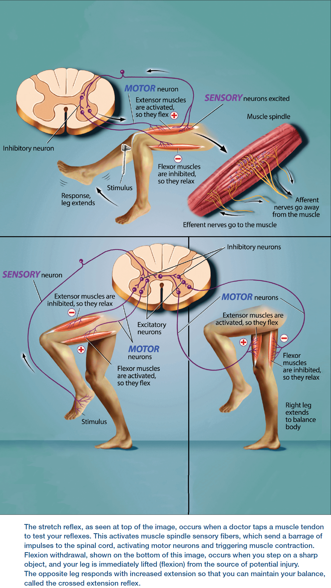

<blockquote class="blockquote">
  
Here we can take a moment to slow down and explore the fundamentals behind the research and discoveries that have built neuroscience.

  
Brain Facts

</blockquote>

- Link to PDF: <https://www.brainfacts.org/the-brain-facts-book>

## Introduction

- Contrary to popular belief, we use all 86 billion nerve cells in our brain but not all simultaneously.
- The brain uses specific circuits to process information.
- The brain serves as the body’s command center because neurons communicate with each other.
- Neurons communicate using electrical and chemical signals.
- Review of action potential, synapse, neurotransmitter, and Hebb’s rule.
- Everything you do from what you think, do, say, and feel is because of neural circuits.
- Simple circuits carry out simple behaviors such as reflexes, while complex circuits carry out complex behaviors such as memory and decision-making.
- You’ve had most of the neurons in your brains since birth and most of them stay with you for the rest of your life.
- Review of neuroplasticity and synaptic pruning.
- The capacity to change is vital.
- The brain both makes and uses emotions, which are value judgments that help the brain respond effectively to events.

## Chapter 1: Brain Basics

- The brain is the nerve center of the body.
- Limbic system: a group of structures deep in the brain that helps regulate our emotion and motivation.
- E.g. Hippocampus, amygdala, thalamus, and hypothalamus.
- Basal ganglia: a collection of structures that help regulate complex body movements.
- Information moves from one region of the brain to another by chains of neurons transmitting signals over long distances.
- Each brain region only analyzes a subset of the information it receives but all regions use the same basic mechanisms to process information.
- Each time the signal is fed forward it’s transformed in some way, thus building outputs that encode complex information.
- Within a circuit, neurons can be organized into a number of different architectures, each affecting how a circuit manages information.
- E.g. Lateral inhibition.
- Astrocytes clean up any remaining neurotransmitter in the synapse, preventing it from continuously activating the postsynaptic receptors.
- Review of ionotropic and metabotropic receptors.

## Chapter 2: Senses & Perception

- There are approximately 125 million photoreceptors in each human eye and they each transduce light into electrical signals.
- The center-surround antagonism of retinal ganglion cells is the first way our visual system maximizes the perception of contrast; a key part of object detection.
- Taste (gustation) and smell (olfaction) are closely linked and help us navigate the chemical world.
- Hearing is the perception of air pressure waves, vision is the perception of light, and smell and taste are the perception of molecules in the air and food.
- Unlike hearing and vision, the cells processing taste and smell are exposed to the outside environment, making them vulnerable to damage.
- But because of this, taste and olfactory receptors regularly regenerate.
- In fact, olfactory receptors are the only sensory neurons that are continually replaced throughout our lives.
- Smell is the only sensory system that directly sends sensory information to the cerebral cortex without passing through the thalamus.
- The somatosensory system is responsible for all the touch sensations we feel.
- E.g. Light touch, pressure, vibration, temperature, texture, itch, and pain.
- Skin is the body’s main sense organ for touch.
- Some touch information is transmitted quickly along myelinated thick axons (A-beta fibers), while other information is transmitted slowly along unmyelinated axons (C fibers).
- Pain is both a sensory and emotional experience.
- E.g. Hot/cold pain, mechanical/wound pain, or chemical/toxin pain.
- Spicy foods produce a burning pain.
- Allodynia: a condition where soft touch pressure produces pain.
- E.g. Badly sunburned skin is painful to lightly touch.
- Pain and itch transmit their signal through small and fast A-delta fibers, while slow pain (such as the burning pain after a slap) is transmitted through C fibers.
- The cortex sends pain messages to a region of the brainstem called the periaqueductal gray matter that activates descending pathways to modulate pain.
- E.g. Pathways to networks that release endorphins, which intercept pain signals ascending in the spinal cord and brainstem.
- It’s now clear that no single brain area is responsible for the perception of pain and itch.
- Both sensory and emotional components combine to create a mosaic of activity that influences how we perceive pain.

## Chapter 3: Movement

- Muscle: a structure of the body that produces movement.
- Flexor: muscles that bend a joint, bringing the bones closer together.
- Extensor: muscles that straighten a joint, pushing the bones further apart.
- Flexors and extensors work in opposition so when one set of muscles contracts, the other relaxes.
- Review of motor unit (an alpha motor neuron and all of the muscle fibers it controls).
- Not all muscles act on joints.
- E.g. The heart, head, and neck muscles.

- Successfully executing complex movements, such as conscious movements, require your brain to relay commands to the appropriate spinal circuits.
- The basal ganglia is also called the “habit center” of the brain.
- Parkinson’s disease is characterized by tremors, rigidity, and sometimes the inability to move, while Huntington’s disease is characterized by uncontrolled jerking or twitching movements.
- A loss of excitatory neurons in the basal ganglia, specifically the substantia nigra, causes Parkinson’s disease, while loss of inhibitory neurons in the basal ganglia results in Huntington’s disease.
- The cerebellum handles motor learning and coordination.
- E.g. Ensuring the proper timing of muscle action and proper muscle force.
- Disturbance of cerebellar function leads to poor coordination, disorders of balance, and difficulties in speech.

## Chapter 4: Learning, Memory & Emotions

- Review of patient H.M.
- Medial temporal lobe (MTL): part of the temporal lobe that includes the hippocampus and parahippocampal regions.
- The dentate gyrus, a part of the hippocampus responsible for memories of events, is one of the few areas of the adult brain where neurogenesis takes place.
- The fact that people with amnesia, such as H.M., show deficits in some types of memory but not others suggests that different types of memory are encoded in separate brain regions.
- The brain can form memories and rewire itself in response to experience (learning) because circuits in the brain can change at synapses.
- Synaptic plasticity: the ability of synapses to change.
- E.g. The number and shape of synapses, amount of neurotransmitter released, and number of postsynaptic receptors.
- The prevailing theory is that declarative memories are encoded in the hippocampus and then transferred to the frontal lobes for long-term storage through consolidation.
- Research suggests that, over time, the hippocampus becomes less important for retrieving older memories as the frontal cortex takes the task.
- The brain structures implicated in emotion are the amygdala, insula, and periaqueductal gray.
- The amygdala interprets fear, helps distinguish friends from foes, identifies social rewards, and implements classical conditioning (associating a stimulus with reward or punishment).
- The insula is responsible for the experience of disgust, the feeling and anticipation of pain, and is believed to take system-wide inputs to generate subjective feelings about them; thus linking feelings, internal physiological states, social emotions, and conscious actions to create mood.
- The periaqueductal gray has been tied to pain perception and stress responses.
- E.g. Receptors for pain-reducing compounds, such as morphine and oxycodone, are clustered in the periaqueductal gray.

## Chapter 5: Thinking, Planning & Language

- To make sense of real-time perceptions, the brain relies on its complex network of associations assembled from prior experience.
- Concept cells: assemblies of cells that encode a concept.
- E.g. The cells encoding the concept of pen, pencil, write, and paper.
- Concept cells form the basis of our semantic memory and reside in the temporal lobe.
- Case studies of patients with temporal lobe damage suggest a pattern that regions within this lobe are responsible for recognizing and identifying visual stimuli (agnosia).
- Visual word form area (VWFA): an area in the fusiform gyrus that recognizes written letters and words and is remarkably consistent across speakers of different languages.
- By constructing hierarchical connected representations of concepts, the brain can build meaning.
- Aphasia: language disorders due to left hemisphere damage.
- Review of Broca’s and Wernicke’s aphasia.
- Review of executive function (inhibition, working memory, and flexibility).

## Chapter 6: The Developing Brain

- The fate of a developing cell is mainly determined by its proximity to various sources of signaling molecules.
- E.g. Cells near the sonic hedgehog molecule convert adjacent nerve cells into a specialized class of glia, cell farther away become motor neurons, and even lower concentrations promote the formation of interneurons.
- Neurogenesis in adulthood is limited to a few regions of the brain.
- E.g. Regions involved with memory.
- A developing axon grows by extending its growth cone.
- Growth cone: an enlargement at the tip of the axon that explores the environment to seek out its precise destination.
- The growth cone is guided by molecular cues in its environment and has receptors for picking up those cues.
- Binding of environmental molecules tells the growth cone whether to move forward, stop, recoil, or change direction.
- Once an axon reaches its target, a synapse begins to form.
- Astrocytes are now known to exert their own influence on synaptic development and function.
- E.g. Clearing out the synapse of remaining neurotransmitter molecules.
- Molecules from multiple sources work together to promote proper synapse formation.
- An array of signals determines which type of neurotransmitter a neuron will use to communicate.
- E.g. For motor neurons, the type of neurotransmitter is fixed (acetylcholine) but for other neurons, it isn’t fixed.
- Similar to how genetic and environmental signals can modulate the development of specialized cells, a similar process leads to the production of specific neurotransmitters.
- After the initial growth spurt, the brain is pruned to become more efficient by removing neurons and synapses.
- Only about half of the neurons created during development survive to adulthood.
- Apoptosis: a process of programmed cell death initiated in the cell.
- Apoptosis is triggered when a neuron fails to receive enough life-sustaining chemicals called trophic factors.
- The pruning of excess connections heavily depends on the relative activity of each connection.
- E.g. Active connections survive while inactive connections die.

## Chapter 7: Infant, Child & Adolescent Brain

- After birth, a human baby’s brain continues to grow and develop.
- E.g. From 370 grams to 1360 grams, the average weight of an adult human brain.
- By the time a baby is 90 days old, its overall brain volume is 64 percent larger than at birth, with the fastest-growing brain region being the cerebellum.
- The overall increase in brain volume is due to a large number of brain cells growing, multiplying, maturing, and migrating to different brain regions.
- During the first three months of life, the number of neurons in the cortex increases by 23-30 percent.
- At five years old, a child’s brain has reached about 90 percent of its adult size.
- The number of connections between neurons (synaptic density) increases rapidly during the first couple years of life and a two-year-old’s brain has 50 percent more synapses than an adult brain, although it’s only about 80 percent of the adult brain volume.
- Synaptic pruning allows weaker connections to diminish while stronger synapses (that are more active) to grow and stabilize.
- Compared to other animals, humans are actually born with less developed brains that take longer to mature.
- Rather than developing more fully in the womb or egg, human brains grow and develop extensively after birth.
- This provides us with the advantage that our developing brains are more easily shaped by the environment and experience, which helps us adapt to the current environment better.
- Critical periods of development: a time window where inputs from sensory, motor, and emotional aspects of experiences affect how the brain develops and adapts to the given environment.
- Interestingly, changes in neural connections during critical periods coincide with high rates of learning.
- E.g. A toddler learning to run or learning to speak multiple languages.
- There are many changes in the teenage/adolescent brain.
- E.g. Competitive elimination of synapses while improving other connections.
- Adolescence can be thought of as a second critical period as more complex functions develop and can be influenced by the environment and experience.
- When do we become adults?
- Neuroscience research finds that the human brain continues to develop until around 30 years old.
- Different brain regions show different rates of growth and maturation.
- E.g. Earlier in life, more myelination is found in the visual, auditory, and limbic cortices. But closer to 30, the frontal and parietal cortices become more myelinated, which helps with working memory and higher cognitive functions.
- Our brains are always changing in response to our experiences.

## Chapter 8: Adult & Aging Brain

- Differences between the adolescent and adult brain
    - A human brain loses gray matter as excess neurons and synapses are pruned.
    - In contrast, the brain gains white matter by strengthening connections and as the major nerve tracts become wrapped in myelin.
- Adult brains have more refined connections for cognitive control than adolescent brains.
- Some mental decline is normal with aging but pronounced declines aren’t normal.
- E.g. It’s normal to have some small declines in working memory and attention.
- All of the cognitive changes due to aging reflect changes in the brain’s structure and chemistry.
- Imaging studies find that total brain volume starts to decrease around the age of 30 and 40, but starts to rapidly decrease around the age of 60.
- However, not all brain areas shrink at the same rate with the prefrontal cortex, cerebellum, and hippocampus showing the biggest losses.
- Last-in first-out theory of brain aging: the last parts of the brain to develop are also the first to deteriorate.
- Studies of age-related changes in white matter support this hypothesis as the last fibers to develop, the association fibers within a hemisphere, show the steepest functional declines with age.
- With increasing age, dendrites shrink, their branches become less complex, and they lose dendritic spines.
- Neurogenesis also declines with age in the two known regions that add new neurons: the olfactory bulbs and the dentate gyrus of the hippocampus.

## Chapter 9: Brain States

- Asleep, awake, aroused, and relaxed are different brain states with different brain activity.
- Slow wave sleep (SWS): high amplitude, low frequency brain waves in EEG recordings.
- The high amplitude of slow waves suggests that many cortical neurons are switching their activity in a synchronized way from a depolarized state to a hyperpolarized state and back again.
- Slow waves appear to be important for sleep as the longer a person stays awake, the more slow waves they experience during SWS.
- If awakened during SWS, most people only recall fragmented thoughts, not active dreams.
- Dreaming happens mainly in rapid eye movement (REM) sleep and EEGs during REM sleep look very similar to EEGs while awake.
- During REM sleep, the body is paralyzed except for the muscles controlling breathing and eye movements.
- Orexin-producing neurons are important for preventing a sudden transition to sleep as orexins increase metabolic rate and can be activated by insulin-induced low blood sugar.
- The loss of orexin-producing neurons causes narcolepsy.
- Narcolepsy: random sleep attacks during the day.
- Narcolepsy is suspected to be due to the lack of special neurons in the brain that control the transition into sleep.
- E.g. Loss of orexin neurons in the lateral hypothalamus.
- People with narcolepsy tend to enter REM sleep very quickly and may even enter a dreaming-state while partially awake.
- They may also have attacks where they lose muscle tone, similar to what happens in REM sleep, but remain awake.
- Two main factors driving sleepiness
    - The time of day or night (circadian rhythm)
    - How long you’ve been awake (homeostatic system)
- The circadian timing system is regulated by the suprachiasmatic nucleus, a small group of neurons in the hypothalamus that acts as a master clock for the brain and body.
- The suprachiasmatic nucleus also receives input directly from the retina to synchronize the master clock with the day/night cycle.
- Adenosine levels increase the longer the brain stays awake and decrease as we sleep.
- Caffeine binds to receptors throughout the brain and prevents adenosine from interacting with the receptor, slowing the influence of adenosine and thus slowing the feeling of sleepiness.
- REM sleep behavior disorder: when a person acts out their dreams because the brain doesn’t paralyze muscle movement.
- Arousal: an energized or excited body and mind state.
- E.g. Heart racing, sweating, changes in breathing.
- Neurotransmitters involved in arousal
    - Dopamine (movement)
    - Norepinephrine (alertness)
    - Serotonin (emotion)
    - Acetylcholine (communicate with body)
    - Histamine (communicate with body)
- The reticular activating system in the brainstem controls the autonomic nervous system.
- Autonomic nervous system: a system that influences heart rate, blood flow, and breathing.
- The autonomic system then controls the physical state of arousal such as bringing resources like oxygen and nutrients to parts of the body where they’re needed.
- Brain regions that mediate feelings of reward and emotion, the nucleus accumbens and amygdala respectively, motivate sexual behaviors.
- The involvement of sex hormones is key to defining the brain state of sexual arousal.
- It’s impossible for the brain to process all its sensory inputs.
- Instead, the brain focuses on one thing at a time, also called attention.
- Review of voluntary (when you choose what to focus on) and involuntary attention (when a stimulus in the environment grabs your focus).
- Disorders of attention include attention deficit hyperactivity disorder (ADHD), schizophrenia, prosopagnosia (face blindness), and hemispatial neglect.
- Between 50-82 percent of patients who suffer a stroke in the right hemisphere experience hemispatial neglect for the left side of their visual field, the left side of their body, and the left side of objects.
- Default mode network
    - Ventromedial prefrontal cortex
        - Related to how anxious a subject feels while performing a task.
    - Dorsomedial prefrontal cortex
        - Involved in self-referential or introspective thoughts.
        - Stream-of-consciousness thoughts and thoughts about one’s self in the past, present, and future.
    - Anterior cingulate cortex
    - Posterior cingulate cortex
    - Lateral parietal cortex
    - Precuneus
- Although the exact purpose of the default mode network is unclear, the functions of its participating regions provide hints about its purpose.

## Chapter 10: The Body in Balance

- No notes on homeostasis, hormones, and the circadian rhythm.
- The brain can produce hormones through the pituitary gland, but it also contains receptors for many hormones that it doesn’t directly regulate the secretion of.
- E.g. Leptin and ghrelin, the full and hunger hormones respectively, aren’t secreted by the brain.

## Chapter 11: Childhood Disorders

- Review of Autism, ADHD, down syndrome, dyslexia, and epilepsy.

## Chapter 12: Psychiatric Disorders

- Review of anxiety disorders, post-traumatic stress disorders, and mood disorders.

## Chapter 13: Addiction

- Almost all abused drugs produce pleasure by activating a specific circuit, the brain’s reward system, which is mainly controlled by dopamine.
- Drugs of abuse are imposters that invade our nervous system, mimicking the messages of naturally occurring neurotransmitters.
- About 50 percent of addiction can be traced to genetic factors.
- Review of opioids, Naloxone, nicotine, alcohol, marijuana, and psychostimulants.

## Chapter 14: Injury & Illness

- Review of brain tumors, brain trauma, neurological AIDS, and multiple sclerosis.
- Brain tumors are named based on the kind of cell they arise from and in which brain area they develop.
- E.g. Gliomas are tumors that come from glial cells, glioblastoma tumors come from immature glial cells, and meningioma tumors develop in the meninges.

## Chapter 15: Neurodegenerative Diseases

- Review of Alzheimer’s disease, Parkinson’s, amyotrophic lateral sclerosis (ALS), and Huntington’s disease.

## Chapter 16: Kinds of Research

- Histology: the study of how cells form tissues.
- Review of the tools and techniques used in neuroscience.

## Chapter 17: Solving Human Problems

- Review of brain-machine interfaces, deep brain stimulation, psychoactive therapies, and gene replacement.

## Chapter 18: Neuroscience in Society

- The more we discover about the brain, the greater its potential to transform human society.
- Review of neurolaw and neuroeconomics.
- When getting permission to treat the brain in some way, the organ that gives consent is the same as the organ being treated. Is this consent?
