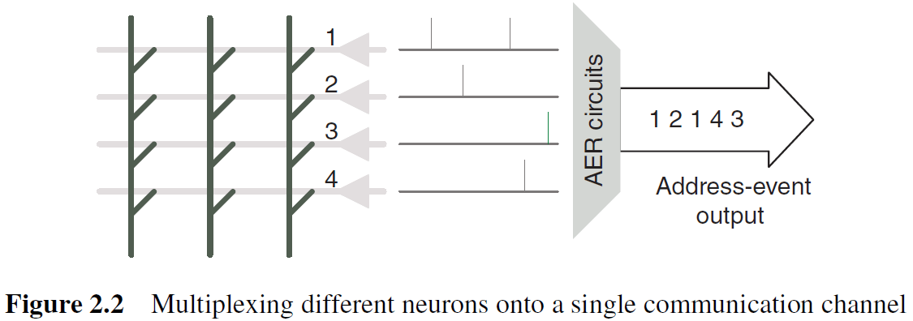
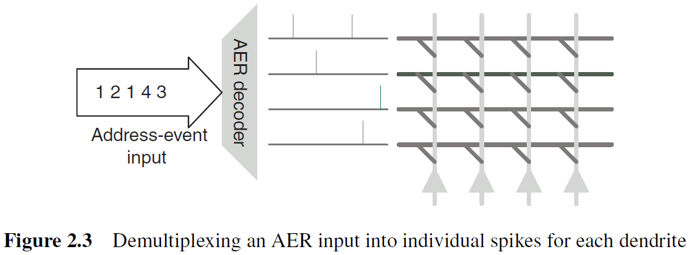
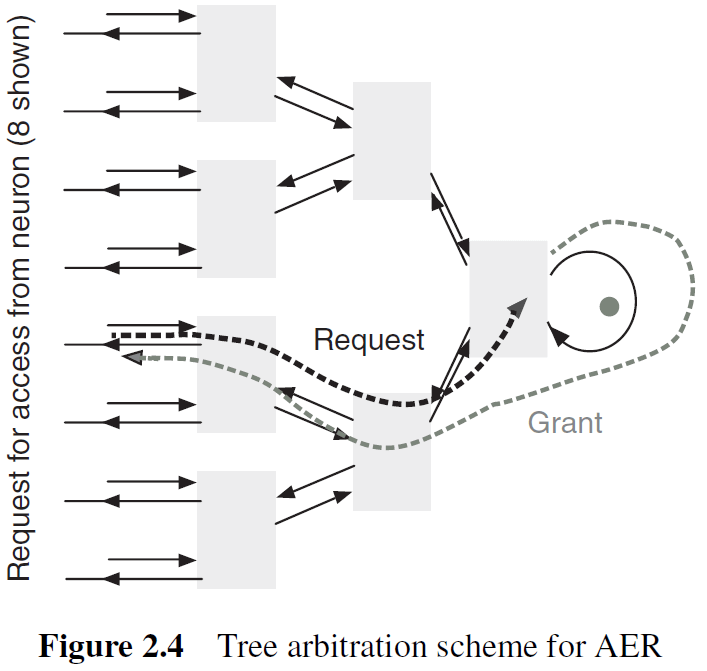
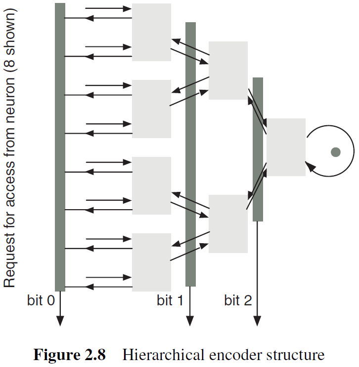

<blockquote class="blockquote">
  
A scientist builds in order to learn; an engineer learns in order to build.

  
Fred Brooks

</blockquote>

# NOTE: This is an incomplete set of notes.

## Chapter 1: Introduction

- Neuromorphic systems are a bridge between two ambitious enterprises: the reverse engineering of the human brain and the science of understanding brain function.
- Neuroscience has made substantial progress toward describing the components, connection architectures, and computational processes of brains.
- The brain is characterized by
    - A vast number of parallel processors
    - Asynchronous messaging
    - Local specialization with long range coordination
- The main challenge is combining the organizing principles of the nervous system with the superior charge carrier mobility of electronics.
- To emulate the brain’s style of computation, you have to emulate the brain’s style of communication.
- Address-event representation (AER): a communication protocol that transposes spike events on slow point-to-point axons into digital communication of small data packets on fast buses.
- Neuromorphic chips must outperform conventional technology to justify its investment.
- Scaling up systems requires not only decreasing in feature size and cost but also increasing system capabilities.

# Part I: Understanding Neuromorphic Systems

## Chapter 2: Communication

- Review of white and gray matter, myelin, and action potentials (APs).
- There’s a fundamental physical mismatch between the logic-optimized 2D silicon technology and the interconnectivity requirements for implementing biological networks of neurons.
- E.g. Silicon is 2D while brains are 3D, logic gates connect to 3-4 other gates while neurons connect to thousands of other neurons.
- This mismatch is overcome using time-multiplexed communication.
- Since modern digital gates have switching delays that are orders of magnitude faster than the time constant of neurons, the mismatch can solved using a time-multiplexed fabric similar to a packet-switched communication network such as the Internet.
- Communication networks can be sorted into two categories
    - Circuit switched: two endpoints communicate by setting up a virtual circuit - a path through the network that’s dedicated for the communication between the two end points.
        - E.g. The original telephone network that used telephone operators.
    - Packet switched: two end points communicate by splitting the message into packets and sending the packets over a shared resource.
        - E.g. The Internet.
- In a typical neuromorphic system, an AP is only used to convey a small amount of information.
- In the extreme case, the only information conveyed by an AP is the the fact that the spike occurred at all; the time of the spike relative to other spikes.
- Most large-scale neuromorphic systems model spikes with a small number of bits of precision.
- Representation of time is a nontrivial task, as temporal resolution is an important factor in the design of communication networks for spiking neurons.
- Two approaches to representing time
    - Discrete time: time is split into ticks and a communication network is designed to deliver time-stamped spikes at the appropriate global time step.
    - Continuous time: the entire system operates in continuous time and spike delays are also modeled.
- Dealing with the problem of representing time is made easier with the following observations
    - Neurons spike at very low rates (tens of Hz) compared to digital electronics (GHz).
    - Axonal delays are very long (milliseconds) compared to the switching delay of gates (tens of picoseconds).
    - A small (<0.1%) variation in spike arrival time shouldn’t have a significant impact on overall system behavior because biological systems are known to be very robust and should adapt to small variations in spike arrival time.
- With these observations, we can conclude that we can ignore the uncertainty in spike delivery time if it can be kept in the order of microseconds.
- The idea that “time represents itself” is explained as the arrival time of spikes itself represents the time at which the spikes should be delivered.
- Since neurons fire at such low rates, instead of creating a network of individual neurons, neuromorphic systems have end points that correspond to clusters of neurons, where a cluster can correspond to a specific processing layer.
- The circuits used to multiplex communication for a cluster of neurons into an individual communication channel are referred to as address event representation (AER) circuits.
- AER circuits provide multiplexing/demultiplexing functionality for spikes generated by/delivered to an array of individual neurons.

- Spikes are generated asynchronously and the AER circuits accept spikes as they’re generated and multiplex them onto a single output channel.
- The sequence of values produced on the output channel indicates which neuron fired and when.
- To handle potentially simultaneous spike arrival times from multiple neurons, AER encoders use arbitration logic.
- The demultiplexing circuits are easier to design.

- The combination of a self-timed AER encoder and decoder preserves the inter-arrival delay among spikes.
- AER encoders have many individual axons as input and they have to implement two functions
    - Which spike is communicated next
    - How to encode the axon identifier
- There are a variety of schemes for AER encoders and they use different mechanisms for resolving conflicts between simultaneous spikes and how neuron identifiers are encoded.
- Each scheme has its strengths and weaknesses and is appropriate for different types of neuromorphic systems.
- Two common methods to organize AER encoders
    - Simplest mechanism is to organize neurons into a linear array and a single encoder is used to collect the spikes into an output channel.
    - When the number of neurons becomes very large, a common practice is to organize neurons in a 2D array that use two separate encoders to encode the x- and y-address of the neuron that spiked.
- Arbitration: the process of selecting the order of access to a shared resource among asynchronous requests.
- In AER systems, the shared resource is the output bus that carries the address events.
- Arbitration methods
    - Bus sensing: if the bus is currently occupied when a spike is received, discard the spike. This results in lost spikes due to bus contention.
    - Tree arbitration: spikes are queued. No events are lost but spike timing information isn’t preserved for simultaneous spikes.
    
    - Greedy tree arbitration: a variant of tree arbitration where the token is propagated to the other input before returning to the root of the tree.
    
    - Ring arbitration: when the write token stays at a fixed location until a request for the token travels around the ring until the token is found.
- Multidimensional arbitration occurs in 2D neuron arrays where there must be row and column arbitration.
- Another method of dealing with arbitration is to eliminate it by allowing any active element to immediately place its address on a common bus.
- If two or more elements place their addresses on the bus simultaneously (collision), then the result is an invalid address and is ignored by the receiver.
- Three encoding mechanisms
    - Basic
    - Hierarchical
    - Counter-based

- Two additional components to complete an AER communication system
    - A mapping from source neuron address to destination neuron address.
    - A routing architecture for multiple clusters of neurons.
- For the address mapping, the mapping function could be a software table that implements the appropriate address translation required.
- This allows the mapping to be programmable.
- Probably the most challenging aspect of implementing communication in neuromorphic systems is that a spike is typically delivered to a very large number of destination neurons.
- Mechanisms that support high spike-fan-out are discussed in chapter 16.
- For the routing architecture, systems often consistent of many neuron clusters so there needs to be a mechanism that routes spikes between clusters.
- Routing mechanisms
    - Point-to-Point: spikes from one cluster are simply transmitted to another cluster.
    - Rings and 1D Arrays: distance-based addressing and chip identifier-based addressing.
    - Meshes: specify a spike to be delivered to an offset relative to the current cluster.
    - Trees: route can be specified as a sequence of turns in the tree.
- Performance of event-driven communication links can be measured by five criteria
    1. Capacity: the reciprocal of the minimum transmission time (the max rate at which events can be transmitted and received).
    2. Throughput: the usable function of capacity (max rate is rarely sustainable in practice).
    3. Latency: the mean delay (wait time between transmission).
    4. Integrity: the fraction of spikes that’re correctly delivered to the destination.
    5. Dispersion: the standard deviation of the latency distribution (how well spike timing properties are preserved).
- Engineers try to maximize throughput while minimizing latency.
- Engineers also face several trade-offs such as the trade-offs between dynamic or static allocation, arbitered access or collisions, and queuing or dropping spikes.
- In handling spike collisions, we can either
    - Detect and discard samples corrupted by collisions.
    - Introduce an arbiter to resolve contention.
- Discarding samples isn’t ideal as collisions increase exponentially as the load increases.
- Arbitration isn’t ideal as it lengthens the cycle time, reducing channel capacity and causing temporal dispersion (if queuing), degrading timing information.
- To transmit a spike without a collision, the previous spike must occur at least T seconds earlier, and the next spike must occur at least T (the same amount of time) seconds later.
- Hence, spikes are forbidden in a 2T time interval, centered around the time that transmission starts.
- Real neurons handle spike collisions by using the collision for computation. E.g. Temporal summation for when spikes overlap in time and spatial summation when spikes are sent by multiple neurons.
- Arbitration is the best choice for systems whose activity is sparse in space and time, because we trade an exponential increase in collisions for a linear increase in temporal dispersion.
- It’s unlikely that CSMA/ALOHA will prove useful for neuromorphic systems.
- Evolution of AER links
    - Single sender, single receiver
    
    - Multiple senders, multiple receivers
    - Parallel signal protocol
    - Word-serial addressing
    - Serial differential signaling

## Chapter 3: Silicon Retinas

- The retina is a complex structure with three primary layers
    - Photoreceptor
    - Outer plexiform
    - Inner plexiform
- Rods and cones of the photoreceptor layer drive horizontal and bipolar cells in the outer plexiform layer.
- Review of ON/OFF bipolar cells and horizontal cells.
- The network of bipolar and horizontal cells computes spatiotemporal low-passed copies of the photoreceptor outputs.
- Biological retinas have many desirable characteristics such as
    - Operating over a wide dynamic range (DR) of light intensity.
        - E.g. From starlight to sunlight.
    - Cells in the outer plexiform and inner plexiform layers code for spatiotemporal contrast, thus removing redundant information and allowing cells to encode signs within their limited DR.
- In contrast to digital cameras, biological vision isn’t frame-based and the development of silicon retinas can instigated research into new algorithms that aren’t frame-based.
- One clear drawback of frame-based sensors is that they sample pixels repeatedly even if their values are unchanged.
- Rather than sampling pixel values, AER retina pixels asynchronously output address events when they detect a significant signal.
- A significant signal is defined by the sensor but good retina pixels autonomously determine their own region of interest (ROI).
- Main obstacles of silicon retinas
    - Unfamiliarity with asynchronous logic
    - Poor uniformity of pixel response characteristics
- Two classes of AER retinas
    - Spatial contrast (SC): reduce spatial redundancy based on intensity ratios versus spatial difference sensors which use intensity differences. E.g. Feature extraction and object classification.
    - Temporal contrast (TC): reduce temporal redundancy based on relative intensity change versus temporal difference sensors which use absolute intensity change. E.g. Object tracking and navigation.
- Two classes of exposure readout and pixel reset
    - Frame event (FE): use synchronous exposure of all pixels and scheduled event readout.
    - Asynchronous event (AE): pixels that continuously generate events based on a local decision about immediate relevance.
- Five different silicon retinas
    - Dynamic vision sensor (DVS)
        - Responds asynchronously to relative temporal changes in intensity.
        - Sensor outputs an asynchronous stream of pixel address-events (AEs) that encode scene reflectance changes.
        - Models three key properties of biological retinas: sparse event-based output, representation of relative luminance change, and rectification of positive and negative signals into separate output channels.
    
    - Asynchronous time-based image sensor (ATIS)
        - Combines a DVS pixel with an intensity measurement unit (IMU) in each pixel.
        - ATIS pixel asynchronously requests access to an output channel only when it has a new illumination value to communicate.
        - Gray level is encoded by the time between two additional IMU events.
    - Magno-Parvo spatial and TC retina
        - Models both the outer and inner retina including sustained (Parvo) and transient (Magno) types of cells.
        - The extremely large mismatch between pixel response characteristics makes it hard to use.
    - Event-Based Intensity-Coding Imagers (Octopus and TTFS)
        - Rather than model the redundancy reduction and local computation done in the retina, some imagers simply use the AER representation to directly communication pixel intensity values.
        - Encode pixel intensity in either the spike frequency (inter-spike interval) or in the time to first spike.
        - The Octopus sensory favors brighter pixels because their integration threshold is reached faster.
        - So, the brighter pixels request the output bus more often than darker ones and are updated more frequently.
        - Drawbacks include a single highlight can saturate the off-chip communication bus and the complexity of the digital frame grabber required to count the spikes produced.
    - Spatial Contrast and Orientation Vision Sensor (VISe)
        - Complements the DVS in that it outputs events that code for spatial rather than temporal contrast.
- Skipped the section of silicon retina pixels due to not caring about (and not understanding) the circuitry for each pixel type.
- The event-based silicon retinas in this chapter offer either spatial or temporal processing but not both.
- Nobody has built a high-performance color silicon retina.

## Chapter 4: Silicon Cochleas

- Silicon cochlea designs typically divide the biological cochlea into several sections that are equally spaced along its length, and then each section is modeled by an electronic circuit.
- The cochlea has a huge dynamic range (around 120 dB) and has the ability to adapt to a wide variety of listening environments.
- The challenge of building a silicon cochlea lies in the design and implementation of a complex signal processing system that follows the basic principles of biological cochleas.
- All silicon cochleas discretize the basilar membrane using a number of filters/resonators with an exponentially decreasing fundamental frequency.
- Despite 20 years of research, there isn’t a silicon cochlea that comes close to matching the power consumption, frequency range, input dynamic range, or noise immunity of the real biological cochlea.
- Skipping over the 1D and 2D silicon cochlea models.

## Chapter 5: Locomotion Motor Control

- We must also keep in mind that biology is motivated by much more than just a narrow functional purpose.
- E.g. The leg of a flower mantis is more than just for movement, it’s also camouflaged to help it blend with its environment.
- Functional biomimesis: the use of only the functional elements of biological design that help engineers solve their problems.
- Two approaches to locomotion
    - Kinematic: focus on the mechanical aspects of motion.
        - E.g. Animal posture, shape, position, and body angle.
    - Neural: focus on the circuitry behind motion.
        - E.g. Central pattern generators (CPG).
- Four components of locomotion
    - Selection
    - Initiation
    - Maintenance
    - Execution
- The mesencephalic locomotor region (MLR) in the brainstem is responsible for initiating and maintaining locomotion, but doesn’t directly produce the locomotor rhythm.
- This chapter focuses on the CPGs that control the legs and that are located in the lumbar spinal cord.
- A basic structure for CPG networks is the half-center oscillator (HCO).
- Two neural centers alternate in activities and each center controls an opposing motor pair.

- Three important parts of CPG design
    - CPG inputs
    - CPG outputs
    - Connectivity of neural and motor elements that enable CPGs to function
- Important CPG parameters for gait (walking)
    - Muscle activity patterns
    - Joint angle and body contact forces
    - Angular phase and timing
- Phase-dependent response (PDR) characteristics can enable the stability and repeatability of events required to sustain locomotion.
- Skipped the neuromorphic CPG section.

## Chapter 6: Learning in Neuromorphic Systems

- Use events for learning.
- Part of the structure observed in the pattern of synaptic connections is likely to be genetically encoded.
- The basis of long-term memory, that new experiences modifies synaptic connections, is most likely retained by the modified synapses even when the experience is over.
- Memories can then be reactivated in the future by a pattern of neural activity that resembles the one that created the memory.
- Three models of ANN learning
    - Unsupervised: networks that can create representations of the statistics of the world in an autonomous way.
    - Supervised: networks that can learn to perform a specific task when instructed by a teacher.
    - Reinforcement: networks that can learn by trial and error.
- Memory maintenance: how memories can be retained over long timescales.
- One simplification of previous memory models (that lead to problems) was allowing synaptic strengths to vary in an unlimited range.
- Networks with realistic, bounded synapses have a strongly reduced memory capacity, because old memories are overwritten by new ones at a very fast rate.
- Limiting the synaptic strengths between bounds causes forgetting.
- To test if a synapse still retains a memory, perform a counterfactual experiment where if we go back to the past and modified that memory, then does that modification propagate up to the present?
- Sparsifying neural representations is equivalent to reducing the number of synapses that are modified on average every time a new memory is stored.
- Metaplastic changes: long-term modifications that can affect not only the synaptic efficacy, but also the parameters that characterize the synaptic dynamics, and hence the way synapses are modified by future experiences.
- One way to build a good memory model is to have fast bistable synapses that operate on short timescales, hence they’re very plastic and good for storing new memories, and to have slow synapses that operate on long timescales, hence they’re good for memory preservation.
- The level of plasticity depends on the past history of synaptic modifications.
- There isn’t a standard model for synaptic plasticity because biological synapses are very rich/complex and because theoretical models are designed for different purposes.
- There’s strong evidence that the mean firing rates of recorded neurons encode much of the information that’s relevant for a task.
- Mean firing rates are usually estimated by counting the number of spikes emitted in a short time window.
- The precise timing of spikes may also contain additional information that isn’t captured by the mean firing rate.
- I am dropping this textbook at section 6.3.2 because it isn’t well written and I don’t have enough electrical engineering knowledge to understand the circuits.

# Part II: Building Neuromorphic Systems

## Chapter 7: Silicon Neurons

## Chapter 8: Silicon Synapses

## Chapter 9: Silicon Cochlea Building Blocks

## Chapter 10: Programmable and Configurable Analog Neuromorphic ICs

## Chapter 11: Bias Generator Circuits

## Chapter 12: On-Chip AER Communication Circuits

## Chapter 13: Hardware Infrastructure

## Chapter 14: Software Infrastructure
  
## Chapter 15: Algorithmic Processing of Event Streams
  
## Chapter 16: Towards Large-Scale Neuromorphic Systems
  
## Chapter 17: The Brain as Potential Technology
