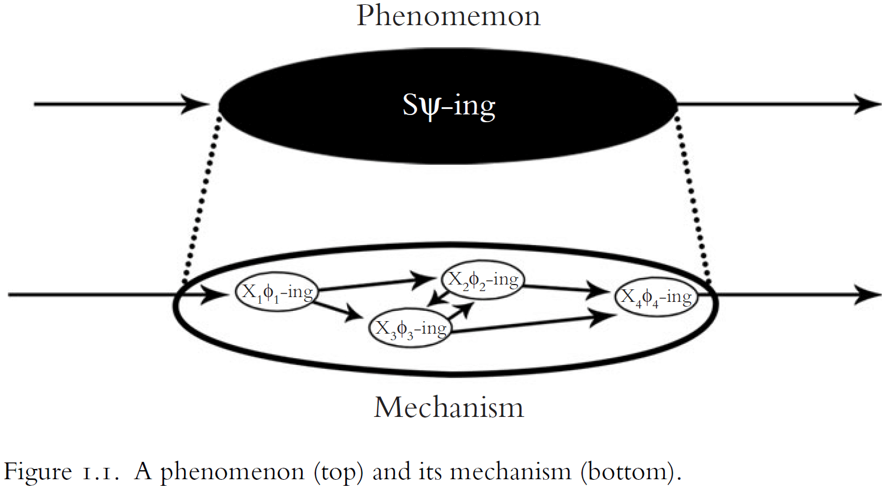
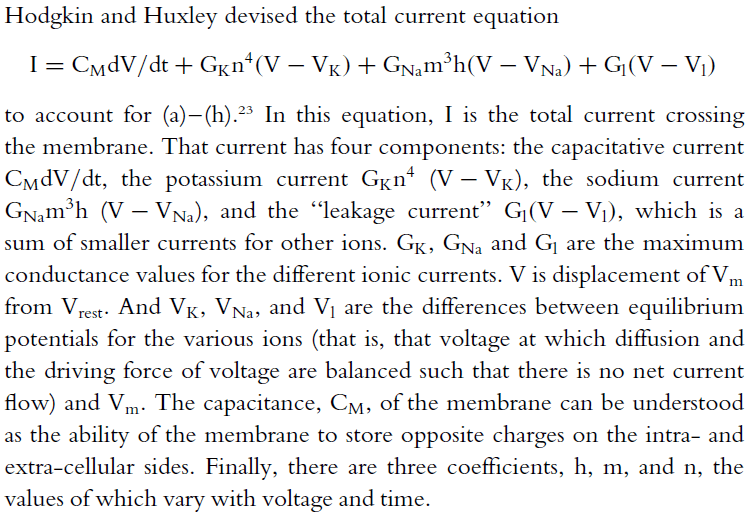
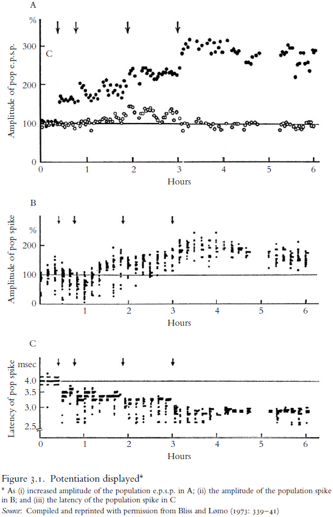
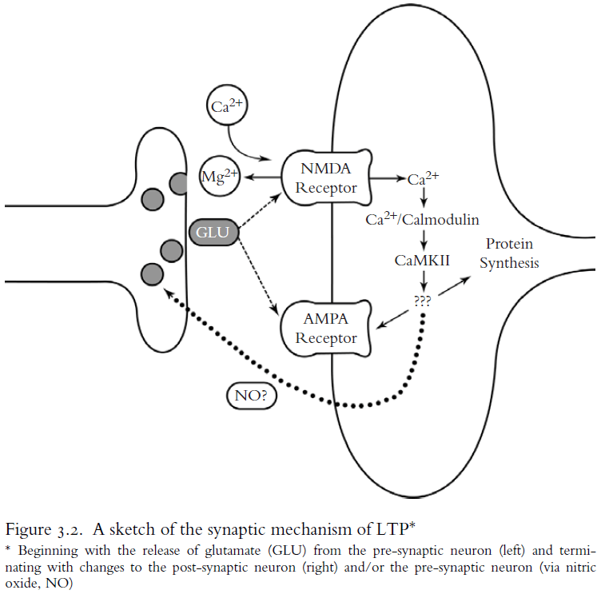
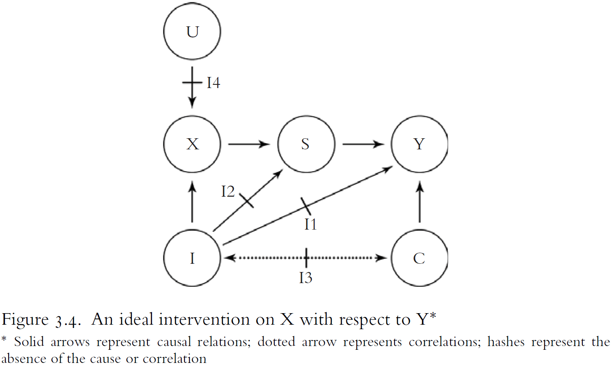
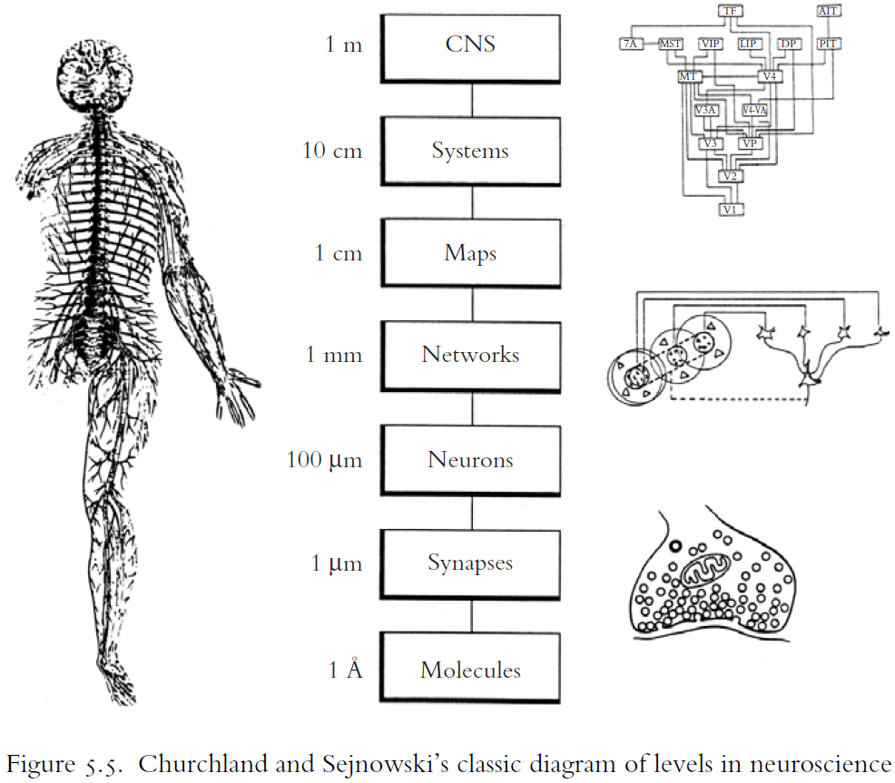
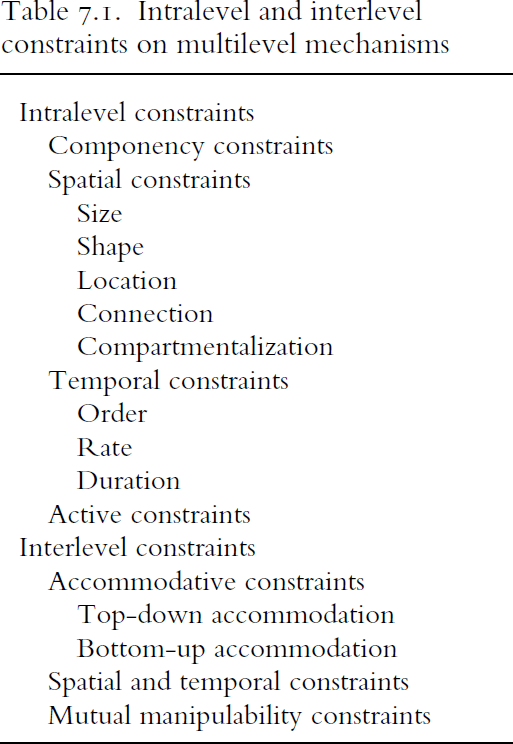

<blockquote class="blockquote">
  
A fool thinks himself to be a wise man, a wise man knows himself to be a fool.

  
William Shakespeare

</blockquote>

## Preface

- *Neurophilosphers*: use findings from neuroscience to address philosophical puzzles about the mind.
- *Philosophers of neuroscience*: study neuroscience to address philosophical puzzles about the nature of science.
- This book proposes a unified framework for the philosophy of neuroscience.
- What’s required of an adequate explanation in neuroscience?
- Is a proposed explanation for a given phenomenon the correct explanation?
- E.g. Does Long-Term Potentiation (LTP) explain episodic memory?
- The explanations in neuroscience describe mechanisms.
- Many neuroscientists can’t see how someone could think without data, such as philosophers.

## Chapter 1: Introduction: Starting with Neuroscience

- Explanations in neuroscience describe mechanisms, span multiple levels, and integrate multiple fields.
- Neuroscience is driven by two goals
    - Explanation
    - Control
- Neuroscientists want to know how the brain develops from infancy to adulthood, how we perceive color, and how the vestibular system helps to keep us upright.
- Neuroscientists also want to diagnose and treat diseases, to repair brain damaged, and to enhance brain function.
- These two goals are complementary.
    - Explaining the brain is a way to figure out how to manipulate it.
    - Manipulating the brain is a way to discover and test explanations.
- Another way of thinking about the two goals is that explanation is the science while control is the engineering/medicine.
- Three main features of neuroscience explanations
    1. Explanations describe mechanisms.
    2. Explanations span multiple levels.
    3. Explanations integrate findings from multiple fields.

**Explanations in Neuroscience Describe Mechanisms**

- Neuroscientists sometimes use other terms to describe their explanations.
- E.g. Neural bases, realizers, substrates, systems, pathways, cascades, mediators, modulators.
- What is a mechanism?
- History can’t answer this question as the word has been used in too many different ways.
- *Mechanism*: a set of entities and activities organized such that they exhibit the phenomenon to be explained.

- Figure legend
    - *$$\psi$$*: the phenomenon.
    - *S*: the mechanism as a whole.
    - *X*: component entities in the mechanism.
    - *$$\phi$$*: component activities in the mechanism.
- S’s $$\psi$$-ing is explained by the organization of entities $$\{X_1, X_2, ..., X_m\}$$ and activities $$\{\phi_1, \phi_2, ..., \phi_n\}$$.
- An alternative view to explanations as mechanisms is explanations as arguments.
- One explains an event by showing that it was to be expected on the basis of the laws of nature plus background conditions.

**Explanations in Neuroscience are Multilevel**

- Explanations in neuroscience refer to
    - the behavior of organisms,
    - the processing functions of brain systems,
    - computational properties of brain regions,
    - the electrophysiological properties of nerve cells,
    - and the changes of molecules.
- This means neuroscience links between multiple levels to explain phenomena.
- E.g. An increase in plasma osmolality, as occurs after one eats salty foods or after body water evaporates without being replaced, stimulates the release of vasopressin from the pituitary, increasing the conservation of water and the excretion of solutes in urine. This is accompanied by increased thirst, with the result of making plasma osmolality more dilute through the consumption of water.
- The multiple levels are
    - Behavior (drinking)
    - Drives (thirst)
    - Organs (kidneys)
    - Brain areas (pituitary)
    - Molecules (vasopressin)
    - Ions (concentration of salt in the blood)
- The explanation oscillates up and down in a hierarchy of mechanisms to focus on just the items that are relevant to different phenomena.
- It’s not just that explanations can be explained at different levels, but that an adequate explanation must bridge phenomena at different levels.
- There is no single neural level of explanation.
- However, this goes against fundamentalism.
- *Fundamentalism*: that neuroscientific explanations bottom out in some set of entities or causal relations.
- E.g. That the problem of memory is to be explained on the basis of changes in individual cells.
- Fundamentalists believe that wherever the bottom is, that is where the real explanations are to be found.
- The author argues against fundamentalism and believes in the causal relevance of phenomena at multiple levels in a hierarchy of mechanisms.

**Explanations in Neuroscience Integrate Multiple Fields**

- Neuroscience has always been an explicitly multifield discipline.
- E.g. Neuroscience draws upon anatomy, biophysics, computer science, evolutionary biology, immunology, mathematics, pharmacology, physics.
- What does this unity of neuroscience amount to in practice?
- The unity of science consists in a chain of reductive explanations that link phenomena at the highest levels to phenomena at the lowest levels.
- E.g. From the behavior of societies to the properties of elementary particles.
- However, in practice, this isn’t the case.
- Instead of theories being reduced to theories at another level, it’s more the case that different fields as different constraints that shape the space of possible mechanisms for a phenomenon.
- Constraints from different fields are the tiles that fill in the mechanism sketch to produce an explanatory mosaic.
- An explanation is more likely to be correct if it is consistent with multiple theoretically and casually independent techniques and perspectives.

**Criteria of Adequacy for an Account of Explanation**

- The model of explanation detailed in this book is held against the following criteria
    - Descriptively adequate
        - Whether a model actually reflects what science is like or whether it reflects a philosopher’s idea of what science should be like.
        - The model explored in this book is based on neuroscience, not other sciences.
    - Demarcate
        - An account of explanation should differentiate between simulating and modeling a phenomenon and explaining it.
        - E.g. Ptolemeic models can be used to simulate and predict planetary motion, but they don’t explain planetary motion. An explanation should show why planets move the way they do.
        - Explanation isn’t categorization.
        - E.g. Sorting neurons or carving brain regions isn’t explanatory.
    - Assessing explanations
        - The model shouldn’t just describe the form of explanation, it should prescribe norms of explanation as well.
- Explanation is a distinctive scientific achievement.

## Chapter 2: Explanation and Causal Relevance

- All scientists are motivated in part by the pleasure of understanding.
- Unfortunately, the pleasure of understanding is often indistinguishable from the pleasure of misunderstanding.
- The sense of understanding is, at best, an unreliable indicator of the quality and depth of an explanation.
- The author argues that good explanations in neuroscience show how phenomena are situated within the causal structure of the world.
- Alternative ways of thinking about explanation
    - Psychological process where a representation/prototype is applied to a phenomenon.
    - Logical relation by which a phenomenon follows from premises describing laws of nature.
    - Unification of disparate phenomena within a given argument schema.
- How calcium explains neurotransmitter release
    - Calcium delivered through a puff to a neuron doesn’t cause the release of neurotransmitters.
    - Neither when the puff is given at the same time an action potential (AP) reaches the terminal.
    - Only when the puff is given just before the AP reaches the terminal does the neuron release neurotransmitter.
- *Explanadum*: the thing to be explained.
- *Explanans*: the thing that does the explaining.
- Not all correlations are explanatory.
- E.g. The rise of intracellular sodium and potassium ion concentrations during an AP are correlated with the release of neurotransmitters, but they aren’t explanatorily relevant to neurotransmitter release. The rise in membrane voltage explains why neurotransmitters are released.
- E.g. The rooster’s crowing is correlated with the sun rising, but the rooster doesn’t cause the sun to rise.
- Explanation follows the direction of causal influence.
- Five main points about explanations (E)
    1. Temporal sequences: mere temporal sequences aren’t explanatory.
    2. Asymmetry: causes explain effects and not vice versa.
    3. Common cause: causally independent effects of common causes don’t explain one another.
    4. Relevance: causally irrelevant phenomena aren’t explanatory.
    5. Improbable effects: causes don’t need to make effects probable to explain them.
- The difference between recognizing a phenomenon and understanding it.
- The difference between causes and temporal sequences.
- To shift attention away from representations used in explanations and toward the causal structure of the world.
- Some phenomena might be so complex that they overwhelm our limited cognitive systems.
- E.g. The “subway map” of the visual cortex in the macaque monkey.
- The explanations exist even if we can’t represent them cognitively.
- CL account of explanation (classical theory reduction)
    - A theory R reduces to a basic theory B if and only if
        - The predicates in R are defined in terms of the predicates in B.
        - R is derivable from B.
        - B contains at least one law of nature.
- Objections to the CL model
    - The problem of distinguishing laws of nature from accidents.
    - The problem of providing an account of explanatory relevance.
    - The fact that one doesn’t need to show that a phenomenon was to be expected to explain it.
- The crucial difference between arguments and explanations.
- E.g. Suppose a neuron was first blessed by a person and then stimulated with a 10 nanoampere current for one second. This experiment would confirm the general regularity that blessed neurons produce APs when stimulated with a 10 nA current. From this regularity, one could conclude that when a given cell has been blessed and stimulated with a 10 nA current, it will generate an AP.
- But the blessing isn’t part of the explanation, it’s irrelevant.
- The strength of an argument isn’t weaker by adding irrelevant premises.
- The strength of an explanation depends crucially upon whether the factors described in the explanatory text are relevant.
- Correlations are insufficient to establish that an item is explanatorily relevant.
- Instead, one seeks evidence that the correlation is underwritten by a causal relationship between the explanatory factor and the event to be explained.
- There is no reason to take the developmental trajectory of physics as a projectable tend to be read onto the development of all sciences.
- Explaining a phenomenon doesn’t require showing that it was to be expected.
- E.g. Only 10–20 percent of APs occur in the release of neurotransmitters. That doesn’t mean APs don’t cause neurotransmitters.
- An adequate explanation in neuroscience must show how a phenomenon is situated within the causal structure of the world.
- The Hodgkin and Huxley (HH) model is a model of the action potential.

- The HH model is an equation of the total current in a neuron with respect to its component currents.
- The current has four components
    1. Capacitative current.
    2. Potassium current.
    3. Sodium current.
    4. Leakage current.

- While the HH model can be used to predict the values of unmeasured variables, the model isn’t explanatory.
- HH insist that the equations only provide an empirical description of the time course of permeability changes.
- The HH model is more analogous to Ptolemy’s planetary models, which only describe how planets move, than to Newton’s gravitational model of planetary motion, which shows how and why planets move as they do.
- The HH model doesn’t show how the membrane changes its permeability.
- One objection might be that the equations represent dependency relations among the variables in the equation.
- E.g. The equations represent membrane conductance as dependent upon voltage.
- But mathematical dependencies can’t be equated to causal or explanatory dependency relations.
- The equal sign doesn’t say which way the equation flows.
- The HH model does provide a partial explanation for how neurons generate APs because it reveals some of the components of the mechanism, some of their properties, and some of their activities.
- Only the discovery of the molecular mechanisms enabling APs explains APs.
- The HH model doesn’t need to reflect the underlying biological process, it just needs to reflect it’s results.
- Another implicit constraint on neuroscience explanations is that mere neural correlates aren’t explanatory.
- E.g. Just because a brain region lights up during a cognitive task doesn’t mean we can infer that the region is involved in the task. The region might be doing a different task, there might be an MRI delay, or the region may be used as a connection point.
- The same goes for when a brain region is destroyed or inhibited.
- E.g. Removing the kidneys will eventually degrade the ability to generate past-tense verbs, but that doesn’t mean the kidney activities are part of the explanation for generating past-tense verbs.
- Neural correlates are too weak to be taken as an explanation.

## Chapter 3: Causal Relevance and Manipulation

- We start with an example of Long-Term Potentiation (LTP).
- *LTP*: the reliable increase in synaptic efficiency when the presynaptic neuron receives a high frequency train of stimuli.
- The increase in synaptic efficiency means
    - Increase in the slope and amplitude of the excitatory post-synaptic potential.
    - Increase in the amplitude of the population spike.
    - Reduced latency in the population spike.

- Four reasons of how causal generalizations can function in explanations
    1. LTP is limited in scope.
        - It isn’t a feature of all cells or of all chemical synapses.
        - It varies with developmental stages.
        - It varies across subjects and within subjects.
    2. LTP is stochastic.
        - It only holds 50% of the time.
        - All three signs of potentiation appeared only 30% of the time.
    3. LTP is mechanistically fragile.
        - It varies with features of the stimulus, environmental conditions, and with the integrity of the underlying mechanism.
        - Lowering the frequency of the tetanus actually weakens the synapse rather than strengthening it.
    4. LTP is historically contingent.
        - There was a time when no organisms exhibited LTP.
- These four reasons aren’t unique to LTP and apply to most generalizations in neuroscience and biology in general.
- The defining mark of LTP is explained by a coincidence detector mechanism involving the NMDA receptor.

- However, even this mechanism is subject to the four constraints listed above.
- So how should we think about causal generalizations in neuroscience?
- *Causation as transmission*: the belief that causation involves objects coming into contact and exchanging or transmitting something between then.
- E.g. Pool balls hitting each other so the movement of one ball causes another ball to move.
- However, this form of causation fails to exclude irrelevant features.
- E.g. If the pool cue strikes a cue ball, imparting both momentum and a blue dot of chalk, only the momentum is relevant to explaining why the cue ball moves, not the chalk.
- The search for causes is what factors make a difference to the effect.
- E.g. If the blue dot of chalk were green or wasn’t there, it wouldn’t make a difference to the effect.
- This requires appeals to claims about what would happen or what would be likely to happen if the circumstances were different. It requires the use of counterfactuals.
- Two types of negative causation
    1. The absence of the cause allows an effect.
    2. A cause inhibits or prevents an effect.
- Negative causes are all around in neuroscience.
- E.g. Neurons fire because inhibitory neurons are inhibited. Aberrant movements appear in Huntington’s disease because of damage to systems that would normally suppress such movements.
- Any view of causation that doesn’t include negative causes conflicts with common-sense talk about causes.
- Neuroscientists have learned time and again that brain systems can make a big deal out of nothing.
- However, an issue with negative causation is that means accepting too many of them.
- E.g. I am the cause of the window not breaking since I might have tossed a rock through it.
- Including negative causes in explaining the brain makes it much more complicated.
- *Causation as mechanism*: the belief that causation occurs when and only when two events are connected by a mechanism.
- Causal relationships are distinctive from correlated relationships in that they are potentially exploitable for the purposes of manipulation and control.
- E.g. Variable X is causally relevant to variable Y in conditions W if some ideal intervention on X in conditions W changes the value of Y.
- *Intervention*: a manipulation that changes the value of a variable.
- An intervention doesn’t have to come from human actions.
- E.g. A stroke damaging a brain region or a meteor striking the moon.
- An ideal intervention requires that the intervention
    1. Doesn’t change Y directly.
    2. Doesn’t change some causal intermediate S between X and Y except by changing the value of X.
    3. Isn’t correlated with some other variable M that is the cause of Y.
    4. Acts as a switch that controls the value of X regardless of X’s other causes.

- Experimental situations are often non-ideal interventions.
- Stable causal relations in neuroscience, such as LTP, don’t hold under all conditions, but only under a narrow range of conditions.
- Being able to manipulate a phenomenon isn’t sufficient to explain it.
- E.g. People were making babies long before they understood how DNA works.
- However, being able to manipulate a wide range of variables of the phenomenon makes an explanation more complete.
- A good explanation allows one to answer a range of “what if things had been different” type questions.
- This is also a good way to test someone’s knowledge of a phenomenon.

## Chapter 4: The Norms of Mechanistic Explanation

- Explanations in neuroscience describe mechanisms.
- There are two types
    - *Etiological*: explaining an event by describing its antecedent causes.
    - *Constitutive*: explaining a phenomenon by describing its underlying mechanism.
- The focus of this chapter is on constitutive explanations.
- There are two traditions of thought about constitutive explanation
    - *Reductive tradition*: a higher-level theory can be derived from a lower-level theory.
    - *Systems tradition*: explanation as the decomposing of systems into their parts and showing how those parts are organized together to exhibit the phenomenon.
- Reductive tradition has fallen out of favor of philosophers of mind and science because real explanations in neuroscience look nothing like the explanations that the reduction model requires.
- Two normative distinctions that are implicit in constructing and evaluating mechanistic explanations
    - *How-possibly models*: how a mechanism might produce the phenomenon.
        - E.g. Computer models, neural networks.
    - *How-actually models*: how real components, activities, and organizational features of a mechanism produce the phenomenon.
        - E.g. How voltage-gated ion channels explain the action potential.
- An account of mechanistic explanation should distinguish mechanism sketches from complete mechanisms.
- Mechanism sketches are sometimes passed as complete models by using filler terms such as “activate”, “encode”, and “process”.
- Filler terms are barriers to progress when they veil failures of understanding.

- Three reasons to use the discovery of the action potential as a case study of a good explanation
    1. It provides an example of a successful mechanistic explanation.
    2. It shows the distinction between mechanism sketches and complete mechanisms.
    3. It shows many of the norms implicit in the practice of making constitutive mechanistic explanations.
- The author details the history of how the action potential was explained in terms of mechanisms.
- Failures to search for mechanistic explanations
    - Trying to explain a fictional phenomenon.
        - E.g. That nerves conduct the flow of animal spirits, phrenology.
    - Lumping several distinct phenomena into one.
        - E.g. Memory, consciousness.
    - Splitting one phenomena into several.
    - Assuming the explanation is complete.
- A complete characterization of a phenomenon requires one to know its inhibiting conditions.
- E.g. APs are prevented by applying tetrodotoxin or by removing sodium ions from the extracellular fluid.
- Distinguishing good mechanistic explanations from bad requires that one distinguish real components from fictional components.
- Real components have four common properties
    1. They have a stable cluster of properties.
    2. They are robust.
    3. They can be used for intervention.
    4. They are physiologically plausible.
- The laws of neuroscience and psychology are mechanistically fragile in that they don’t yield general laws of nature, but rather laws governing the special systems they study.
- The way components are organized also matters for explanations.
- Organization differs from aggregates.
- Aggregates have the following properties
    - Remains invariant under the rearrangement and intersubtitution.
    - Remains qualitatively similar with the addition/subtraction of components.
    - Remains invariant under disaggregation and reaggregation.
    - No cooperative/inhibitory interactions between components.
- These properties are useful in diagnosing and discovering organizations in a system.
- E.g. For APs, you can’t substitute sodium ions for potassium ions. Removal of any component breaks down the AP mechanism. Changing the spatial relations among components disrupts the behavior of the system. Finally, there are cooperative and inhibitory interactions between components.
- Three types of mechanistic organization
    - Active
    - Spatial
    - Temporal
- E.g. Imagine transmitting an image along a fiber optic cable. An image projected on one end of the cable is transmitted to the other by an array of bundled fibers. Each fiber is an isolated conduit of light for a given dot in the image. So long as the relative spatial arrangement of the wires in the bundle is the same at each end, the input image is conserved.
- In this explanation, the spatial organization does most of the work. This is analogous to the topographical organization that nerve fibers use to send information to the brain.
- The fibers don’t interact with each other and they can become tangled in the middle as long as the spatial arrangement remains the same at the ends.
- Mechanistic explanations are embodied. They’re anchored in components and those components occupy space and take time to act.
- *Mutual manipulability*: a part is a component in a mechanism if one can change the behavior of the mechanism by intervening to change the component, and one can change the behavior of the component by intervening to change the behavior of the mechanism.

- Three common experiment types
    - Interference
    - Stimulation
    - Activation
- Interference experiments are represented on the left side of Figure 4.7b and they try to show that changing a component changes the phenomenon.
- E.g. Lesion experiments such as patient H.M., Phineas Gage, and Leborgne.
- However, interference experiments face challenges such as
    - *Compensation*: when intervening in a mechanism has no effect.
        - E.g. Removing one kidney, stroke, redundancy, recovery, using other parts, reorganizing.
    - *Indirect interference*: when intervening in a mechanism has an effect even through the changed component is irrelevant to the mechanism.
        - E.g. Disrupting the blood supply to a brain region.
- Stimulation experiments are also represented on the left side of Figure 4.7b and they try to show how the excitation/intensification of some component in a mechanism produces the phenomenon.
- E.g. Stimulating the motor cortex of a dog’s brain and seeing the muscles move.
- Like interference experiments, stimulation experiments also face the same challenges of compensation and indirect interference.
- Activation experiments are represented on the right side of Figure 4.7b and they try to show that if a phenomenon is activated, then there should be some change in the component.
- However, activation experiments face challenges such as
    - *Mere correlates*: the activated component might be a mere correlated of the phenomenon.
    - *Tonic contribution*: the component might not change to be relevant to a phenomenon.
        - E.g. Schwann cells are static but enable APs to travel faster.
- Mutually manipulable is useful for determining constitutive relevance, not causal relevance.
- Relationships of mutual manipulability can and should replace the requirement of derivability.
- One doesn’t need to be able to derive a phenomenon from a description of the mechanism.
- Rather, one needs to know how a phenomenon changes under a variety of interventions. Changing the parts to affect the whole and changing the whole to affect the parts.
- Requirements of a mechanistic explanation
    - Must fully account for the phenomenon.
    - Must be constitutive and explain the behavior of a mechanism in terms of the activities of its components.
    - Must satisfy the compositional analysis in Chapter 3.
    - Must add a notion of organization.
    - Must add an account of constitutive relevance.

## Chapter 5: A Field-Guide to Levels

- Explanations in neuroscience typically span multiple levels.
- We ignore, for now, the notion of levels as realizations in that a higher level is realized by a property/activity at a lower level of realization.
- E.g. Marr’s three levels of analysis (computation, algorithmic, implementation).
- Levels of mechanisms, in contrast, are a variety of part-whole relation.

- We start with an example of how spatial memory is formed and explained.
- Spatial maps are created or stored by adjusting the strengths of synapses in the hippocampus.
- The choice of four levels in figure 5.1 is arbitrary. There could be more levels above, in-between, and below.
- Multilevel explanations are best understood as levels of mechanisms.
- Lower levels in the hierarchy are the components in mechanisms for the phenomena at higher levels.
- Lower-level and higher-level items are also mutually manipulable.

- Three questions for defining different types of levels
    - What kinds of things are sorted into levels?
    - What is the interlevel relation?
    - What is the intralevel relation?
- Levels of nature
    - *Causal*: levels that are ranked based on their place in a causal sequence.
    - *Size*: levels that are ranked based on their physical size.
    - *Composition*: levels that are ranked based on what they’re made of.

- Levels of mechanisms are levels of composition, but the composition relation isn’t spatial or material, it’s a composition of components of mechanisms.

## Chapter 6: Nonfundamental Explanation

- Skipped due to disinterest.

## Chapter 7: The Mosaic Unity of Neuroscience

- Philosophers of neuroscience traditionally envision the unity of neuroscience as the reduction of higher-level theories to lower level, and ultimately fundamental theories.
- However, the author argues that the unity of neuroscience is the integration of different fields in adding constraints on multilevel mechanistic explanations.
- The findings in different fields of neuroscience are used, like the tiles of a mosaic, to elaborate an abstract mechanism and to shape the space of possible mechanisms.
- Reasons for using reduction
    - It can be defined using formal logic and set theory.
    - It was used in the philosophy of physics, chemistry, and biology.
    - It matches the unity of science.
- However, there issues with reduction have been explored in the previous chapters.
- There are no laws of neuroscience comparable in scope and stability to the laws of optics and gravity.
- Generalizations in neuroscience are fragile, variable, and historically contingent.
- What occurred in the past with regard to neurons may not be present in the future.
- If neuroscience was following reductionism, then we would expect our knowledge to follow that path of reducing phenomena to chemistry and physics.
- However, this isn’t the case as there’s still plenty of research on the higher levels of neuroscience.
- E.g. Consciousness, memory, learning, behavior.
- While the story of discovering LTP appears to be reductionism, the search for the mechanism of memory, that isn’t the complete story.
- LTP wasn’t aimed at to explain memory formation in the hippocampus, it was first discovered and then used as an upward connection to explain memory.
- The history of neuroscientific research on learning and memory don’t show a trend toward reduction.
- Instead, research is focused up and down in a hierarchy as new problems are recognized and as new techniques become available.
- Mechanistic theory building typically proceeds by the accumulation of constraints on the space of possible mechanisms for a phenomenon.
- The space of possible mechanisms contains all the mechanisms that could explain a phenomenon.
- Scientists never consider the entire space as they typically start with a restricted space shaped by prior assumptions such as
    - what kinds of components are likely to be included,
    - what kinds of organization are likely to be relevant, and
    - what sorts of basic constraints are assumed.
- Scientists work through a space of plausible mechanisms.
- A constraint is a finding that either
    - Changes the boundary of the space of plausible mechanisms.
    - Changes the probability distribution over that space.
- Changes to the boundary can be either inclusive, such as the discovery of new components, or exclusive, such as showing that certain components are impossible.

- Compartmentalizing a phenomenon is a crucial step in determining which components are relevant to explaining the phenomenon and which techniques are most useful.
- A phenomenon is integrated with adjacent levels to the extent that it is known
    - What the relevant aspects of the phenomenon at the 0 level are.
    - How those aspects are organized within a higher +1 mechanism.
    - How those aspects of the phenomenon are constitutively explained by a lower -1 mechanism.

- Localization is one of the most fundamental spatial constraints on interlevel integration.
- The mosaic unity of science is valuable not because it serves as a criterion for distinguishing science from nonscience (it does not), nor because it relates all phenomena to a single fundamental level (it does not), but because it has the epistemic virtue of producing robust explanations.
