<blockquote class="blockquote">
  
The brain is the last and grandest biological frontier, the most complex thing we have yet discovered in our universe. It contains hundreds of billions of cells interlinked through trillions of connections. The brain boggles the mind.

  
James Watson

</blockquote>

## Chapter 1: Introduction: Why Networks?

- What can network science tell us about the brain?
- Networks connect levels of organization in the brain and link structure to function.
- The goal of this book is to introduce networks to neuroscientists and neuroscience to theoretical network modelers.
- All complex systems display characteristic diverse patterns in their structure and function.
- These patterns come from structured selective coupling between elements, achieved through an intricate web of connectivity.
- Connectivity comes in many forms.
- E.g. Molecular interactions, talking, synapses, Internet, food chains, web hyperlinks, or citation patterns.
- Why should we care about using network science to study the brain?
- We should care because network science can provide fundamental insights into how simple elements organize into dynamics patterns such as in the brain.
- Virtually all complex systems form networks of interacting components.
- E.g. Even simple components like water molecules can generate complex flows and unique snowflakes.
- Very different systems can generate amazingly similar patterns.
- E.g. Swarms of fish, flocks of birds, or crowds of people.
- The brain is a complex system where the collective action of neurons linked in a network create behavior, thoughts, memories, and consciousness.
- Alone, no neuron can carry out any of these functions, but when large numbers of them are linked together into networks, a nervous system, complex behavior is possible.
- Understanding these integrative functions requires understanding brain networks and the complex, irreducible, dynamic patterns that create them.
- Brain networks span multiple spatial and temporal scales.
- In multiscale systems, levels don’t work in isolation but instead work together in a hierarchy where the higher levels depend on the lower levels.
- We can’t fully understand the brain unless we approach the brain on multiple scales.
- E.g. Molecules, cells, regions, systems.
- Only through multiscale network interactions can molecules and cells give rise to behavior and cognition.

## Chapter 2: Network Measures and Architectures

- What are networks? How can we define them and measure their properties?
- Euler founded the field of graph theory, the mathematical study of networks/graphs.
- Over the last decade, the study of networks has expanded to much larger systems.
- This chapter introduces the basic terminology and methodology of network science and its mathematical foundation: graph theory.
- There are no equations in this book.
- Graph: a system composed of interconnected elements.
- Review of nodes (fundamental elements of the system), edges (direct connections between pairs of nodes), adjacency matrix (representation of a graph as a matrix).
- Edges can be undirected or directed, binary or weighted.
- Dyadic: pairwise or two nodes connected by an edge.
- One fundamental graph measure is the degree of a graph.
- Degree: number of edges connected to a node, with specific indegree and outdegree for directed graphs.
- Counting up all of the degrees from all nodes forms the degree distribution of the network.
- This distribution is useful for checking whether nodes are similar in degree or not.
- Node degree is fundamental because it has a significant impact on most other network measures and it’s highly informative of the graph’s network architecture.
- Assortativity: the correlation coefficient for the degrees of neighboring nodes.
- E.g. Positive assortativity means nodes link with nodes of similar degree while negative assortativity means high-degree nodes connect more with low-degree nodes and vice versa.
- The balance of node indegree and outdegree is an indicator of the way the node is embedded in the overall network, and whether the node is primarily a sender or receiver.
- Path: a sequence of unique edges and intermediate nodes.
- Walk: a sequence of nonunique edges and intermediate nodes.
- Cycle: a path that connects a node to itself.
- Connected: if all pairs of nodes are linked by at least one path of finite length.
- Distance: the length of the shortest path linking two nodes.
- It’s important to note that distance in graphs is a topological concept that doesn’t refer to the actual spatial separation of the nodes.
- All pairwise distances in a graph may be represented in a distance matrix.
- Nodes in the context of the brain can represent neural elements such as cells, cell populations, or brain regions.
- Edges in the context of the brain can represent synapses or pathways.
- The structure of the adjacency and distance matrices describes the pattern of communication within the network.
- Both long and short paths can have a weak or strong effect depending on the value of that path.
- However, most analyses focus on the shortest possible path (distance) between nodes since that path is likely the most effective for internode communication.
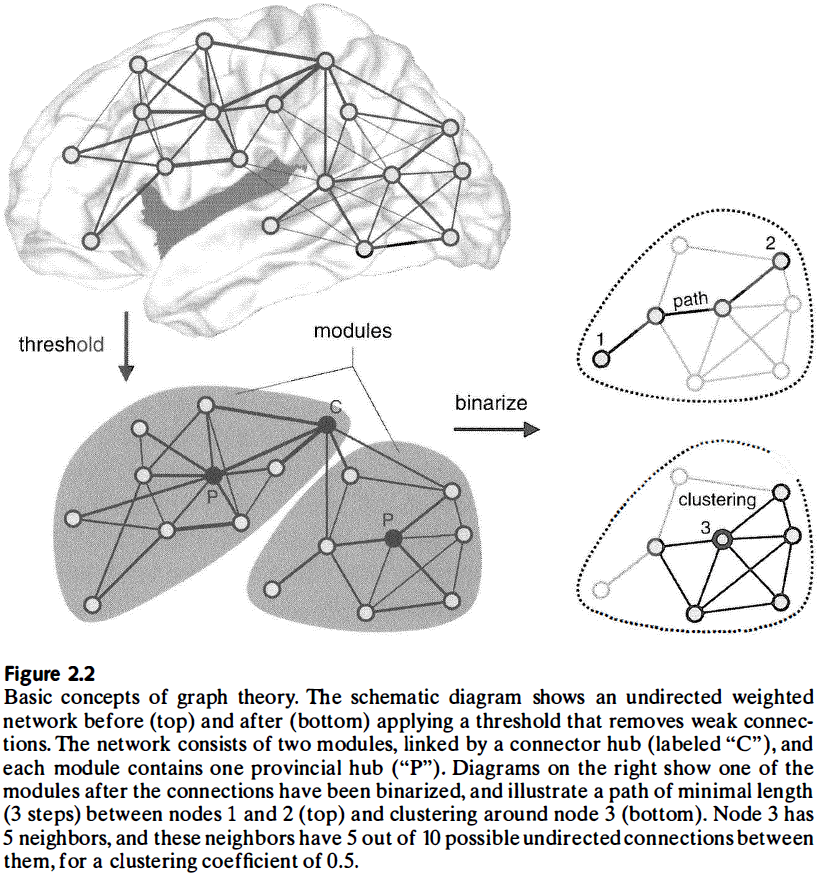
- In many networks, the strength of interaction diminishes as nodes get further away.
- So, it’s often realistic to assume that most of the processing characteristics and contributions of a node are determined by its interactions within a local neighborhood.
- This neighborhood is defined in terms of topological distance and doesn’t necessarily imply close physical proximity.
- A densely coupled neighborhood is also known as a cluster, community, or module.
- Clustering coefficient: the density of connections between the node’s neighbors.
- By averaging the clustering coefficient of each node, we get the clustering coefficient of the network.
- Analyzing clustering coefficients can reveal important differences in how nodes are embedded within their local neighborhoods.
- Transitivity: a normalized version of the clustering coefficient because extreme values skew the average.
- Every network can be uniquely decomposed into a set of motifs, and the distribution of motifs reflect some fundamental characteristic of the network.
- It’s important to compare the motif to randomly constructed networks that serve as a null hypothesis.
- Networks with high levels of clustering are often, but not always, composed of local modules of densely interconnected nodes.
- The balance of within-module and between-module connections defines a measure of network modularity.
- Local connectivity measures
    - Clustering
    - Motifs
    - Modularity
- The information provided by these measures overlaps, but they also provide some unique information about how each node is locally embedded and their community structure.
- Clustering is important for neuroscience because neuronal units form a densely connected module that communicate a lot of shared information and likely constitute a functional brain system.
- Conversely, neuronal units that belong to different modules don’t share as much information and remain functionally segregated from each other.
- Thus, local connectivity measures highlight the functional organization of the brain, whether it forms segregated subsystems with specialized properties or is more uniform and generalized.
- Is the brain organized into modules/subsystems? This is a question that network science can answer.
- Another set of measures capture the capacity of the network to engage in global interactions that cross the boundaries of modules.
- Many global network measures are based on paths and distances between nodes.
- Path length: in binary graphs is the number of distinct edges along a path, while in weighted graphs is the sum of edge lengths along a path.
- To compute path length for weighted graphs, we have to transform edge weights to lengths.
- E.g. If an edge weight is 5, we’ll give the edge length the inverse so 1/5.
- Edge lengths are usually inversely related to edge weights since edge weights express the coupling strength between nodes, while edge lengths express their topological distance.
- E.g. A further node is weaker than a closer node.
- One of the most common global network measures used in brain networks is the path length, usually computed as the global average of the graph’s distance matrix.
- E.g. A short path length means that, on average, each node can be reached from any other node with a few edges.
- Once again, to properly interpret path length, we have to construct appropriate random networks and compare their path length to the actual path length.
- Global efficiency: the average of the inverse of the distance matrix.
- E.g. A fully connected network has maximal global efficiency since all nodes can be reached with only one edge, while a fully disconnected network has minimal global efficiency since no node can be reached.
- E.g. A low path length or a high efficiency means that pairs of nodes, on average, have short communication distances and can easily reach each other.
- Global connectivity measures
    - Path length
    - Efficiency
    - Communicability: a measure of global information flow based on the number of walks between nodes.
- Global connectivity measures are important because they capture the capacity of the network to pass information between nodes and modules.
- E.g. Shorter structural paths are composed of fewer edges, which generally allow for signal transmission with less noise, interference, and attenuation.
- Segregation and integration place opposing demands on how networks are made.
- E.g. Clustering and modularity, which are key to segregation, are inconsistent with integration. And integration, which is optimal only in a fully connected network that lacks any modules, is incompatible with segregation.
- This tension between local and global structure is one of the main themes in creating networks and results in the diversity of networks that we see in the brain.
- Not all nodes and edges are created equal as some nodes or edges impact the network more than others.
- E.g. Removing or disrupting that node or edge is more disruptive to the rest of the network than removing a random node or edge.
- These important nodes are often more densely connected to the network, which is why they play a critical role in the network.
- Hub: an important node as determined by several different criteria, the simplest being a node’s degree.
- In networks with a nonuniform distribution of node degrees, a hub is often essential for maintaining global connectedness. In uniform networks, a hub is less informative.
- Participation coefficient: a measure of how many diverse between-module connections a high-degree node has.
- Provincial hub: a high-degree node with few diverse between-module connections or a low participation coefficient.
- Closeness centrality: the inverse of the average path length between that node and all other nodes in the network.
- E.g. A node with high closeness centrality can reach all other nodes through short paths and thus exerts more influence over the network.
- Betweenness centrality: the fraction of all shortest paths in the network that pass through the node.
- E.g. A node with high betweenness centrality can control information flow because it’s at the intersection of many short paths.
- However, both of these centrality measures assume information flow to be biased towards shorter paths, but this assumption may not be true.
- Eigenvector centrality: accounts for interactions of different lengths and their dispersion, relying on walks rather than shortest paths.
- Eigenvector centrality hasn’t yet been widely used in biology or neuroscience.
- Centrality measures are useful because they identify elements that are highly interactive or that carry significant information in the network.
- E.g. Losing nodes or edges in a network with high structural centrality tends to have a larger impact on the function of the remaining network.
- Network architectures
    - Random graph
        - Start with a disconnected set of nodes and connect pairs of them with uniform probability.
        - This results in nodes with a mostly uniform degree, short characteristic path lengths, and low levels of clustering.
    - Regular graph (lattice)
        - In contrast to random graphs, this class of graph has an ordered pattern of connections between nodes.
        - E.g. Grid or ring structure.
        - This results in a network with locally dense connections, higher clustering, and longer characteristic path lengths compared to random graphs.
- Random and regular graphs are idealized models of networks which allows for elegant formal description and analysis.
- However, most real-world networks aren’t as well structured as random or regular graphs.
- E.g. Most real-world networks aren’t as uniform, and the degree and influence of each node and edge varies.
- Small-world effect: a phenomenon where in a large network it’s often possible to connect two nodes by short paths.
- E.g. The world of social relationships is a small world because the path between two people is short.
- The key to building a small-world network, and the key difference between random and regular graphs, is the probability that an edge of the regular graph randomly rewires.
- E.g. If that probability is zero, the graph is completely regular. If that probability is one, the graph is completely random.
- For between zero and one, the graph has elements of both regularity and randomness.
- If we have a very small rewiring probability combined with high clustering and short path length, we get a small-world topology where connected nodes have many overlapping partners, but pairs of nodes are, on average, connected by short paths.
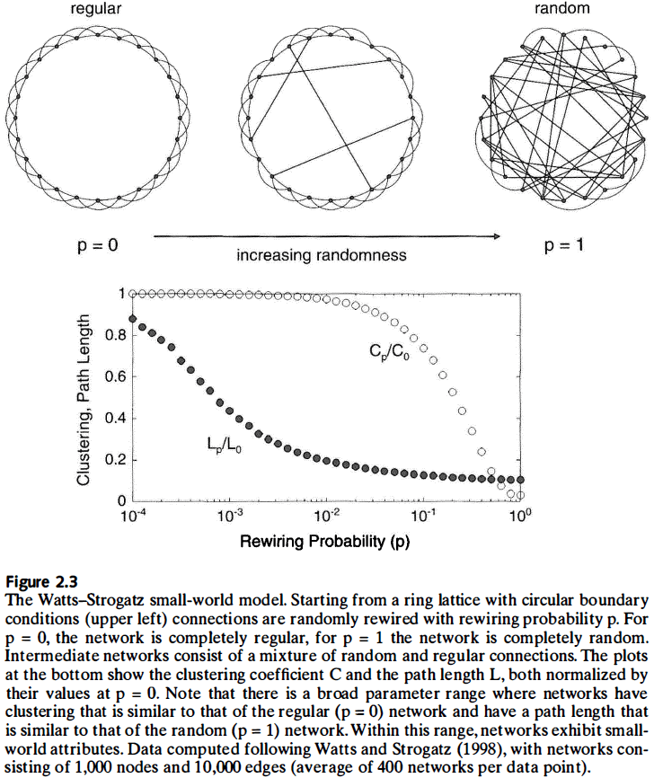
- Small-world properties are found in many networks, from the electrical power grid to collaborations among movie actors to the neural networks of the brain.
- Small-world index: the ratio of clustering coefficient to path length.
- However, knowing that a network has a small-world topology isn’t very informative about the network’s architecture because it’s possible for two small-world networks to exhibit very different patterns of connectivity.
- The small-world network class can be broken down further into subclasses.
- E.g Modular vs nonmodular small-world networks.
- Another class of networks is when the node degree distribution follows a power law.
- E.g. Internet, cellular metabolism, citation data, fractal patterns.
- Power-law degree distributions indicate a scale-free organization.
- Scale-free: a network that looks the same regardless of the scale it’s observed at.
- One way to form a power-law architecture is through a process of cumulative growth where each node and edge builds off of previous nodes and edges, similar to a tree or fractal.
- The attachment of new nodes to existing nodes isn’t random and is proportional to their degree.
- Random and regular, small-world and scale-free, are networks classes that have been extensively studied and analyzed in network science.
- Other architectures include hierarchical networks.
- The space of possible networks varies in the parameters of randomness, heterogeneity, and modularity, and not all possible network architectures are seen in the real world.
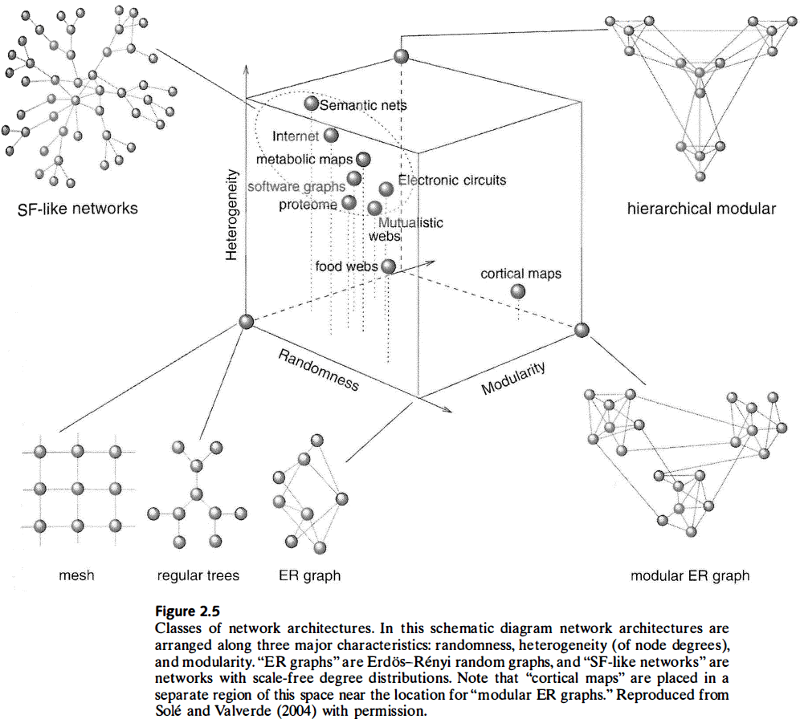
- These unrealized networks may be impossible because of growth limitations or they might not be useful.
- All graph measures are invariant with respect to node order in an adjacency matrix.
- The power of graph-based approaches comes from the fact that virtually all complex systems can be meaningfully described as networks.
- E.g. Molecules, neurons, or people.

## Chapter 3: Brain Networks: Structure and Dynamics

- What are brain networks?
- Review of the neuron doctrine versus continuous nerve network.
- This chapter covers common measures of connectivity used to define brain networks.
- Three types of connectivity
    - Structural: physical coupling/connections of neural elements.
    - Functional: statistical dependencies in neural dynamics.
    - Effective: causal influences between neural elements.
- Electrophysiological recordings provide the most direct access to neural signals.
- Review of EEG, MEG, PET, and fMRI.
- Each technique measures a different aspect of neural dynamics and organization.
- The multiscale property of the nervous system is an essential feature of its organization and network architecture.
- The fundamental difference between structural and functional connectivity is that the first is a wiring diagram of physical links, while the second is a web of dynamic interactions.
- The close relationship between structure and function in the brain creates some ambiguity as to whether a neural parameter is classified as structural or functional.
- Steps to construct structural and functional brain networks
    1. Define the network’s nodes.
    2. Calculate the measure of association between pairs of nodes.
    3. Sparsify the graph by removing associations below a threshold.
    4. Calculate graph measures and compare them to populations of random networks.
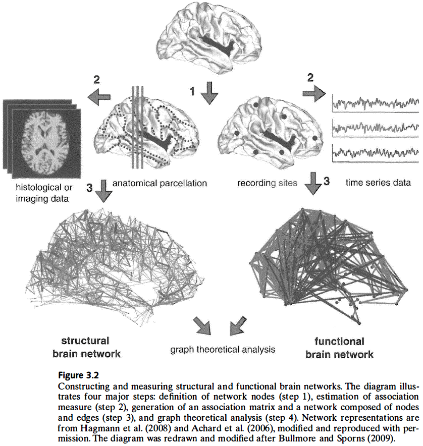
- One of the main problems of graph analysis in the brain is the definition of nodes and edges.
- The most intuitive definition of nodes and edges is to have individual neurons be nodes and their synaptic connections be edges.
- However, most neural recording techniques don’t allow for the direct observation of many neurons or synapses.
- The use of perturbations offers one approach for determining causality.
- Another approach to determining causality is to exploit the fundamental fact that causes must precede effects in time.
- Granger causality: captures the amount of information about the future state of one variable that’s gained by taking into account the past states of another variable.
- No notes on covariance structural equation modeling (CSEM) and dynamic causal modeling (DCM).
- If we didn’t have computer simulations, it would be nearly impossible to explore complex physical systems.
- E.g. Formation of planets, impact of human activity on climate change, or protein folding.
- Computational approaches to complex systems now pervade many scientific disciplines and neuroscience is no exception.
- Models require us to explicitly parameterize ill-defined and qualitative concepts.
- The basis of most computational models is a set of state equations that define the temporal evolution of dynamic variables.
- State equations can take many forms, but often they’re differential equations that describe the rate of change of a system variable.
- E.g. Electric membrane potential, number of synaptic inputs, or length of axons.
- The integration of these equations generates time series data that can be embedded in a geometric phase space where the system’s changes are represented as a trajectory in this phase space.
- Review of dynamical system attractors and initial conditions.
- An attractor is stable if the dynamic system returns to it after small perturbations.
- Connectivity translates events at the cellular scale into large-scale patterns; it allows neurons to act both independently and collectively.

## Chapter 4: A Network Perspective on Neuroanatomy

- Few concepts have had a deeper and more confounding influence in the history of neuroscience than the concept of functional localization.
- The debate on functional localization has raged on for at least two hundred years between those who view brain function as specialized versus those who view brain function as nonlocal and distributed.
- This chapter explores how a better understanding of the brain’s structure-function relationship is achieved by taking a network perspective.
- The functional specialization of local elements is determined by two factors: intrinsic properties of the element and extrinsic network interactions.
- E.g. Protein function prediction uses both the structural characteristics of the protein to infer its function (based on structural similarities to other proteins with known functions), and the interactions among proteins during cellular processes to infer function.
- Interactome: a map of all protein-protein interactions that’s used to predict protein function.
- Review of phrenology, Broca’s findings, Brodmann and Campbell, Lashley and equipotentiality.
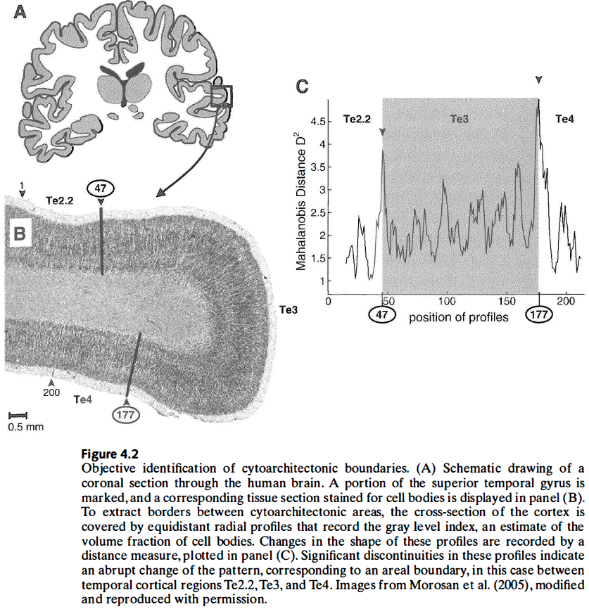
- All modern cytoarchitectonic and receptor-labeling studies report significant intersubject and interhemispheric variability.
- Recent studies have confirmed that the cerebral cortex isn’t uniform but heterogeneous.
- One of the basic premises of cytoarchitectonics and cerebral cartography is to establish links between variations in microstructure and variations in function.
- However, there’s evidence to suggest that brain regions with similar cytoarchitecture can be functionally subdivided.
- E.g. A region may do the same processing/computation but with different inputs and outputs, and thus contribute to different functions.
- The topological pattern of corticocortical connections provides information that can help in defining regional boundaries.
- Once cortical regions are defined based on cytoarchitecture, receptor mapping, or connectivity-based parcellation, their mutual connections can be represented as a structural network.
- Both local structural differences and extrinsic connections contribute to the functional specialization of each cortical region.
- Connectional fingerprint: each cytoarchitectonic area also has a unique set of extrinsic inputs and outputs, and this is crucial for determining the functions that area can perform.
- One way biology differs from the other natural sciences is that it considers the individual.
- Individual variations are seen in all brains, whether the brain is from mammals, birds, or insects.
- No two brains are completely alike.
- Despite these variations in structure and connectivity, human brain networks support behavioral and cognitive functions that are mostly shared among everyone.
- Perhaps the variations seen in the brain can be linked to individual differences in behavioral or cognitive performance.
- How specific or random are synaptic connections between neurons?
- Early anatomical studies suggested a degree of randomness in cellular connectivity.
- However, with modern anatomical tracing and staining techniques, there’s now abundant evidence that different cell types form and maintain specific connection patterns.
- This structural specificity gives distinct biophysical and and computational properties to each cell type and is essential for normal neuronal functioning.
- How do cognitive functions emerge from the specific anatomical and physiological substrates of the brain?
- One key is to view local specialization as the result of patterned distributed interactions that provide different functional attributes to individual network elements.

## Chapter 5: Mapping Cells, Circuits, and Systems

- “Wherever fibers are found in the body, they maintain always a certain pattern among themselves, of greater or lesser complexity according to the functions for which they are intended.” - Nicolaus Steno, 1665
- Steno viewed the brain as a machine whose operation depend on the anatomical arrangement of fiber pathways.
- Reliable and detailed maps of structural brain connectivity are necessary, but not sufficient, for forming theoretical principles that capture the brain’s emergent properties and functions.
- This chapter examines some empirical approaches to the mapping of structural brain networks at multiple scales of organization.
- Review of the history of connectomics.
- A key goal of connectomics is the representation of structural brain networks in the form of graphs, which allows for the quantitative analysis of brain connectivity with the mathematical tools of network science.
- Compared to the genome, the connectome is far more challenging due to the brain’s 3D structure, its growth and development, individual variability, sheer number of components, and multiscale architecture.
- Three scales of the connectome
    - Microscale: single neurons and synapses.
    - Mesoscale: anatomical cell groupings and their projections.
    - Macroscale: brain regions and pathways.
- Review of how a connectome is obtained from electron microscopy.
- Evidence converges on the finding that the cellular microanatomy of the brain is constantly changing, with spines, synapses, axons, dendrites, and entire cells changing their morphology and connectivity both spontaneously and due to neural activity.
- Thus, the connectome is a moving target where each snapshot of neural tissue is the brain’s dynamic architecture frozen in time.
- Review of structural MRI (sMRI) and diffusion MRI (dMRI) for in vivo tractography.
- Comparing structural connectivity obtained from classical tract tracing with diffusion weighted images reveals a high degree of overlap, suggesting that dMRI can be used to determine the brain’s connections.
- The essence of a connectome is to meaningfully compress the full scale pattern of the brain, capturing its essential topology.

## Chapter 6: The Brain's Small World: Motifs, Modules, and Hubs

- Studies of the brain’s networks showed that it had an organization that was neither entirely random nor entirely regular.
- Connections that link nearby regions contribute to the existence of clusters/modules, which are nonrandom features of large-scale cortical connectivity.
- These clusters mostly form compact groupings that occupy contiguous regions of the cortical surface, suggesting that spatial proximity plays a large role in determining the brain’s connections.
- Are structural brain networks single-scale or scale-free?
- We don’t have enough data to definitely answer this question, but basic spatial and metabolic constraints imply a strict upper limit on the number and density of connections that can be sustained by any given node.
- Similar networks, such as transportation networks, show exponential scale-free degree distributions.
- While evidence points to a nonrandom and nonregular organization of brain networks at large scales, the organization at the cellular scale is less understood.
- We lack the understanding because we lack cellular connectivity data sets.
- Motif: different topological patterns of structural connections that link small subsets of nodes.
- E.g. Dyad and triad.
- Different motifs constrain dynamic interactions among nodes and thus facilitates specific classes of dynamic behavior.
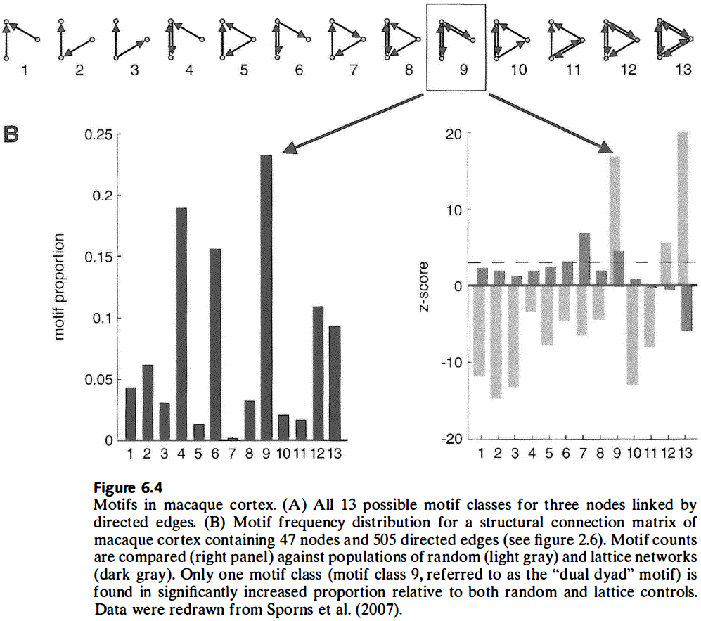
- Maybe certain motif classes were selected for by evolution because they give the organism an adaptive advantage. An alternative explanation is that the selected motifs are a byproduct of other limitations.
- The intertwined nature of many network attributes (motifs, modules, hubs) makes it difficult to separate selective contributions made by one but not the other.
- The existence of small-world properties has been confirmed in all studies of the large-scale anatomy of the mammalian cortex.
- Small-world: a network with high clustering and short path lengths.
- Module: a community of nodes that share more connections within their community and fewer connections to other communities.
- Module detection in graphs uses one of two methods: agglomerative (starting from small groupings and constructing progressively larger ones) or divisive (starting from larger groupings and subdividing them into smaller ones).
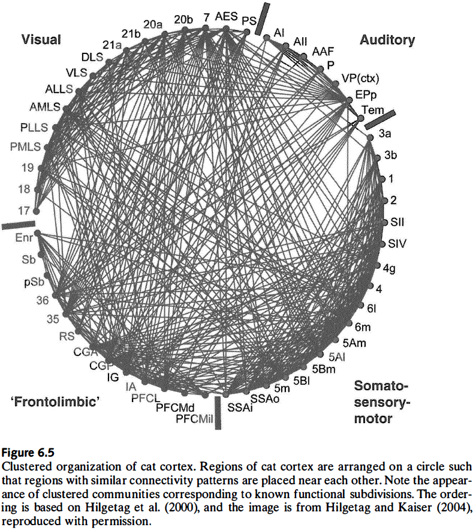
- Interlinking hub regions tend to be areas of multimodal or association cortex.
- Studies indicate that modules mostly consist of regions that are spatially close, functionally related, and connected through hub nodes.
- Areas within structural modules are functionally related because they share many of their inputs and outputs with each other.
- Hub nodes are one of the most intriguing structural features of brain networks and have special integrative or control functions.
- E.g. In protein interactions, deleting proteins corresponding to hubs is often lethal. In social networks, hubs are people who are highly connected and are often leaders.
- By virtue of their connections, hub nodes integrate many signals and can control the flow of information between other segregated parts of the brain.
- E.g. Because hubs are positioned on many of the network’s short paths, any perturbation of the hub node would spread quickly across the network.
- Hubs also conserve wiring length and volume since most regions can access information of other regions through a few long-distance connections.
- Hubs should be both highly connected and highly central.
- Review of provincial (within-module) and connector (between-module) hubs.
- The precuneus/posterior cingulate cortex occupies a central position in functional networks of the human brain and has extremely high metabolic activity.
- Activation of the precuneus has been reported in self-referential processing, imagery, episodic memory, and its level of activation is associated with the level of consciousness.
- Interestingly, general anesthetics induces large regional decreases in cerebral blood flow in the precuneus and cuneus, and deactivation of posterior medial cortex is associated with loss of consciousness.
- Could this convergence of diverse functional roles, from brain metabolism to consciousness, be due to the region’s high centrality within the brain?
- Perhaps, we know that hub nodes are essential to maintain network-wide information flow and their loss has detrimental effects on the functioning of the system.
- Hubs are points of vulnerability and may be targeted for attacks.
- However, hubs shouldn’t be mistaken as “master controllers” capable of autonomous control or executive influence, because their influence derives from their capacity to connect across the brain and promote functional integration.
- Hubs enable and facilitate integrative processes, but they don’t represent the outcome of such processes, which is instead found in the distributed and global dynamics of the brain.
- Are small-world networks functionally important?
- The hallmarks of a small-world, high clustering and short path length, play key roles in shaping dynamic neuronal interactions at different scales.
- There’s evidence that disruption of small-world organization is associated with disturbances in cognition and behavior.
- Small-world architectures also promote economy and efficiency of brain networks by allowing for structural connectivity to be built at low cost in terms of wiring volume, energy demands, and information flow. And it matches these constraints simultaneously.
- The small-world architecture of the brain provides a structural substrate for several important aspects of functional organization of the brain.
- We need to consider brain networks not only as topological patterns, but also as physical objects that consume space, energy, and matter.

## Chapter 7: Economy, Efficiency, and Evolution

- When learning about the physical structure of the brain, we’re surprised by its high economy and efficiency.
- The conservation of space, time, energy, and matter has governed the evolution of neuronal morphology and connectivity.
- The brain’s connectivity appears to be shaped over evolution to provide maximal computational power while minimizing the volume and cost of wiring.
- Instead of optimizing connectivity for any single factor such as spatial, metabolic, or functional demands, the brain jointly satisfies all of these demands while making tradeoffs.
- Molecular developmental mechanisms can account for some of the observed wiring minimization found in neural structures.
- E.g. Molecular guidance cues are involved in establishing topographic maps.
- Given that developmental mechanisms play a major role in shaping connectivity, what’s the role of development in theories of wiring minimizing?
- Maybe development plays a small role as connectivity features could have arose as a result of selecting for utility and adaptive advantage rather than as a result of developmental processes.
- Maybe development plays a big role as developmental processes directly contribute to conserved wiring patterns.
- Cherniak theory: neurons are placed at spatial locations that minimize their total wiring length.
- However, the placement of neurons isn’t independent of their connections because if two neurons are spatially close, then developmental mechanisms make it more likely that these neurons are also connected.
- Thus, developmental processes produce a bias for neurons to be connected because they’re adjacent, and not adjacent because they’re connected as suggested by Cherniak’s theory.
- Reanalysis of evidence supporting Cherniak’s theory suggests that wiring minimization can account for much of neuronal positioning, but there are some exceptions that violate the minimization rule.
- The exceptions are long-distance connections that span about 80 percent of C. elegan’s body and significantly decrease path lengths.
- Minimizing wiring cost comes at the expense of increased path lengths.
- Anatomical studies found an exponential decrease in connection probability with increasing spatial separation between cortical neurons. This rule also applies to cortical regions.
- Cortical folding also contributes to conserving wiring length.
- Review of the incorrect tension-based folding model of the cortical surface.
- Pressure to maintain short path lengths may partially explain the existence and expansion of long-range fiber pathways in evolution.
- Network efficiency: the capacity of a network to facilitate information exchange.
- Three types of network efficiency
    - Nodal: inverse of the shortest distance between two nodes.
    - Local: a nodal measure of the average efficiency within a local subgraph or neighborhood.
    - Global: the average of the efficiency over all node pairs.
- Global efficiency is related to path length, while local efficiency is related to the clustering coefficient.
- Small-world topology is closely associated with high global and local efficiency as it uses sparse connectivity, which has low connection cost but maintains high efficiency.
- Brains are examples of networks with high global and local efficiency due to their small-world architecture, enabling efficient parallel information flow.
- Network modules become specialized for recurring task demands in the environment.
- Not only do modules allow for efficient processing and provide a degree of robustness, brain network modularity has a deep impact on the relation of network structure to network dynamics.
- It’s impossible to change the size of a nervous system without also changing its connection topology.
- Isometric scaling: when a change in an organism’s size doesn’t change the size of its components, and thus no change in shape or form.
- Allometric scaling: when a change in an organism’s size results in proportionally smaller or larger components.
- Many physiological and metabolic processes scale allometrically with body size, and the brain is no exception.
- Two types of scaling
    - Proportional: ensures that all neural elements remain directly linked to each other.
    - Absolute: ensures that the same number of axons per neural element is maintained.
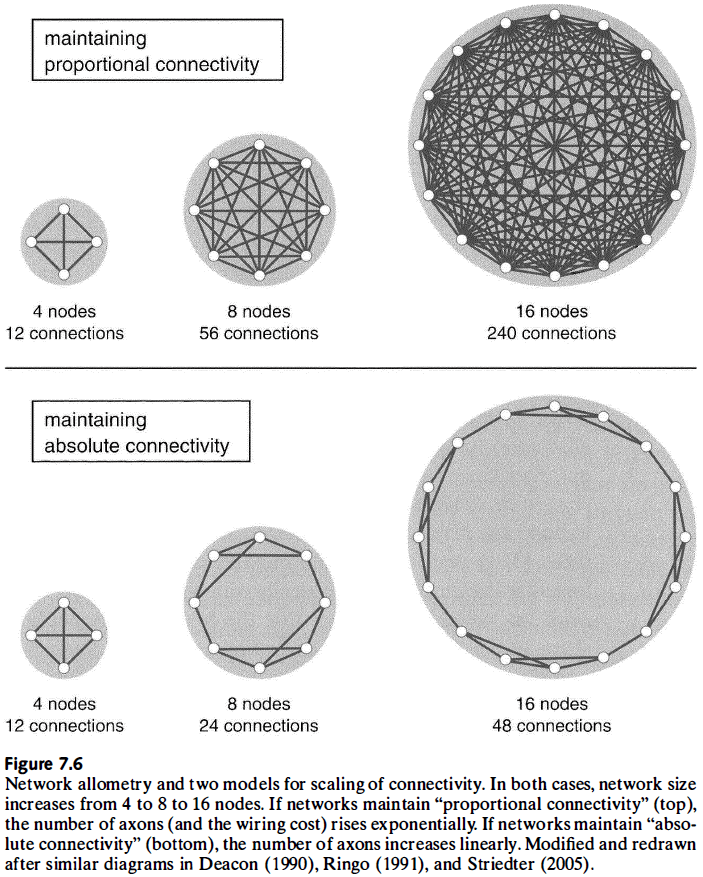
- Proportional scaling results in an exponential increase in the number of axons, while absolute scaling results in a linear increase in the number of axons.
- Thus, absolute connectivity is more economical in terms of the number and length of axons, but it does have some drawbacks, mainly reduced connectivity.
- Absolute connectivity scaling results in a small-world architecture due to the local clustering and interconnections between bridges and hubs.
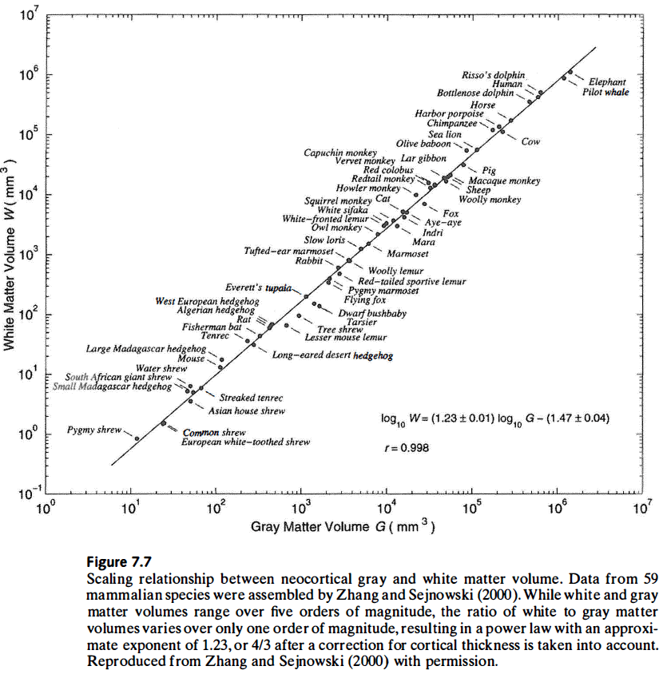
- Sparse connectivity and modularity are inevitable as brain size increases.
- And brain size can’t scale endlessly because with size increases, long conduction delays begin to offset any computational power achieved by adding neurons.
- Larger brains are also driven towards greater functional specialization to limit wiring. This results in more connections in local communities and less connections for global integration.
- Evolutionary and developmental mechanisms make it highly unlikely that brain connectivity has been optimized for any single structural or functional measure.
- E.g. Minimizing wiring cost eliminates long-range pathways used for global information exchange and integration, while optimizing for information processing requires more neurons and connections.
- Thus, brain connectivity represents a viable compromise between economy and efficiency.
- Claims that the brain is “optimally adapted” or “maximally efficient” should be viewed with skepticism as evolution has no way of knowing beforehand what to optimize.
- This isn’t to say that brain networks aren’t efficient or economical, but that we have no way of knowing if they’re optimal because the space of possible brains is so large.
- Brain structure and the topology of brain networks is part of an organism’s phenotype.

## Chapter 8: Dynamic Patterns in Spontaneous Neural Activity

- Recurrent/reentrant processes contribute important functions that shape brain responses and coordinate global states.
- This chapter analyzes the patterns of spontaneous dynamic network interactions that emerge from the brain’s physical wiring.
- Nervous systems don’t depend on external input to provide representational content, but instead rely on such inputs for context and modulation.
- In almost all cases where spontaneous neuronal firing has been observed, the firing shows characteristic spatiotemporal structure.
- Thus, spontaneous neural activity isn’t noise but rather precise patterns.
- Spontaneous cortical activity is shaped by two parts
    - Intrinsic electrical properties of “autonomous” neurons
    - Spreading of synchronization of neural activity through excitatory connections
- Spontaneous cortical activity exhibits patterns that resemble those seen during visual stimulation.
- Transitions between rest and task state were associated with changes in the spatial pattern of functional connectivity rather than with the presence or absence of neural activity.
- It seems that sensory inputs modulate intrinsic cortical dynamics rather than initiating/waking cortical dynamics.
- Review of the default mode network, the “default mode” of brain function.
- The precuneus/posterior cingulate cortex was identified as playing a central role within the default mode network.
- Studies have found that task-related (task-positive) and default mode (task-negative) regions form coherent but mutually anticorrelated networks.
- Functional connectivity within the default mode network was found to be highly reliable and reproducible.
- Why is the default mode network so consistent and reproducible?
- Part of the answer may lie in the white matter pathways of the brain or in general structural brain connectivity.
- Studies of whole-brain structural and functional connectivity, along with studies of specific pathways and fiber bundles, support the idea that functional connections are shaped by anatomy.
- How much of the functional connection pattern is accounted for or predicted by the pattern of structural connections?
- If structural connections do account for functional connections, then we could infer and predict structural connections from functional connections. This is desirable because functional connections are more easily obtained from recordings than structural connections.
- Multiple studies are convergent on the idea that structural connections are highly predictive of the presence and strength of functional connections.
- However, the reverse, from functional to structural connectivity, can’t be reliably inferred because many strong functional connections may exist between regions that aren’t anatomically linked.
- In the future, this result may change when both structural and functional connectivity are derived at higher resolutions.
- No notes on modeling the link between structural and functional connectivity.
- One of the first demonstrations of small-world topology in a human brain functional network came from MEG recordings that showed small-world attributes such as high clustering and short path lengths.
- What is it like, in neural terms, to be a hub?
- Under spontaneous dynamics, hubs can engage and disengage across time as they link different sets of brain regions at different times.
- These state changes support the creation of diverse dynamic states in the brain, which are used to affect behavior and cognition.
- Endogenous neural activity plays many roles including
    - Patterning and refinement of synaptic connectivity of the visual system during development
    - Generating embryonic limb movements
    - Calibrating developing sensorimotor circuits
    - Generating correlated sensory inputs
- The metabolic cost of endogenous default mode neural activity far outweighs that of evoked activity, with around a few percent of the brain’s total energy budget associated with momentary processing demands.
- Malach and colleagues have suggested that the cortex can be divided into two active systems:
    - An extrinsic system for processing external inputs.
    - An intrinsic system for processing internal, self-generated signals.
- Studies of humans transitioning from waking to sleep and anaesthetized nonhuman primates have shown that correlated default mode activity persists even in the absence of consciousness.
- Thus, it doesn’t appear that all correlated spontaneous activity reflects conscious mental states.

## Chapter 9: Networks for Cognition

- The relationship between the brain and cognition is still poorly understood and neuroscience can’t yet answer the big questions about the mind and intelligence.
- There have been many false starts in the attempt to link brain and cognition.
- E.g. Neuroreductionism: a view that fully substitutes all mental phenomena by neural mechanisms. This view implies that the fundamental properties of cells and molecules can explain all there is to know about the mind and cognition, and ignores emergent and collective properties.
- This chapter attempts to move beyond reductionist models of cognition and views the subject from the integrative perspective of complex networks.
- Two ways functional integration is achieved in the brain
    - Convergence
    - Synchrony
- Cognition is a network phenomenon as it doesn’t exist in synapses or neurons.
- Instead, cognition is a collective property of a very large number of interconnected neural elements in complex patterns.
- Review of parallel distributed processing (PDP).
- The tension between models based on hierarchical versus distributed processing became apparent in anatomical and functional accounts of the visual cortex, prefrontal cortex, and a variety of other brain systems.
- The lack of a simple one-to-one mapping between anatomical regions and cognitive functions suggests that cognition and behavior are instead associated with networks of regions, each supporting a broad range of functions.
- A slightly different argument is that a complex function is instead a system of interrelated processes directed toward the performance of a particular task.
- In this view, the structural networks of the brain serve as a substrate for the system-wide dynamic coordination of distributed neural resources and implies that complex functions are achieved by transient/temporary assemblies of network elements.
- Thus, different processing demands and task domains are associated with the dynamic reconfiguration of functional or effective brain networks, where the same set of network elements can participate in multiple cognitive functions by rapid reconfiguration.
- Both of these perspectives lead to the idea that functions don’t reside in individual brain regions, but instead are accomplished by network interactions that rapidly reconfigure depending on the task demands and context.
- This reconfiguration is ultimately constrained by the underlying structural network.
- Regional activation is insufficient to indicate the involvement of the region with a task, and instead the functional contribution of a brain region is more clearly defined by the context that it’s used in.
- Network theories of cognition emphasize the cooperative processes that are shaped by anatomical connectivity.
- Thus, mapping between neurons and cognition is less about what individual nodes do and more on what the individual nodes are connected to (topology).
- One of the most important features of large-scale system dynamics is the coexistence of opposing forces, namely segregation and integration.
- This opposition comes from the existence of discrete anatomical units with regional specialization, and the unity of mental states and behavior.
- Segregation: the tendency of different neurons to capture different regularities in their inputs.
- Integration by convergence creates more specialized neurons or regions by taking inputs from other, less specialized neurons.
- Convergence thus creates neurons that encode high-level attributes of their respective input space, thereby increasing functional segregation and specialization of the architecture.
- An alternative implementation of integration by convergence is to have convergence zones that can trigger and synchronize distributed neural patterns through feedback projections, but themselves aren’t the center of integration.
- Integration can also be achieved without convergence by using dynamic interactions, phase locking, and synchronization between distant neural populations.
- This form of integration depends on reciprocal structural connections between segregated brain regions.
- Spontaneous or evoked changes in phase coherence and synchronization can rapidly reconfigure networks of functional and effective connectivity, while the underlying structural connectivity remains relatively unchanged.
- Hierarchy is an important feature of neurocognitive networks because it arranges neural units and brain regions where information flows from lower (sensory) to higher (multimodal and associative) levels, gradually becoming more complex.
- Recurrent feedback from higher to lower visual areas contributes to a loosening of the strictly serial hierarchy assumed of the visual cortex.
- Feedforward connections drive neural activity, while feedback connections mediate a range of modulatory synaptic effect.
- It’s been suggested that top-down feedback connections may provide predictions about bottom-up sensory inputs, supporting perception.
- Another definition of hierarchy that’s used in network science is as levels of modularity or as nested arrangements of modules within modules.
- Modularity and hub analysis can identify regions of high intermodal convergence (functional integration) and distinct processing streams (functional segregation).
- Structural and functional modules identified by network analysis have little relation to the cognitive modules proposed by Fodor and others.
- Structural, functional, and effective brain networks change on different time scales.
- E.g. Structural networks generally remain stable over short time scales, while functional and effective networks change rapidly due to spontaneous activity or in response to task demands.
- Varying task demands can rapidly and temporarily reconfigure functional networks while maintaining some of their topological characteristics.
- How do task demands change the functional connections among regions in the default mode network?
- We find that task demands and cognitive load results in deactivation of most of the default mode network, but doesn’t completely abolish it. Thus, the brain is load balancing.
- Brain anatomy and connectivity show significant individual variability, which is expressed as variations in behavior.
- Studies have found negative correlations between path length and IQ, and positive correlations between IQ and global efficiency, suggesting that efficient parallel information flow is associated with higher levels of general intelligence.
- Analysis of correlations between IQ and regional path length found several cortical regions with particularly strong negative correlations.
- These regions included the precuneus/posterior cingulate cortex, the medial prefrontal gyrus, and the lateral inferior parietal cortex, all core regions of the default mode network and hub regions in human functional brain networks.
- Connectional anatomy appears to be under strong genetic control with small-world organization of functional brain networks being more highly correlated in twins.
- Models that replicate the structure and dynamics of every neuron and synapse in a complex nervous system may be as incomprehensible and unmanageable as the real brain.
- So, modeling should reduce the complexity of the real system to reveal principles of the system.
- Viewed from a network perspective, cognition is a special kind of pattern formation that interplays functional segregation and integration, and the continued emergence of dynamic structures are molded by connectivity, external input, and internal state.
- This perspective differs radically from serial, representational, and symbolic accounts of cognition.

## Chapter 10: Brain Network Disease

- Circulating information is a form of online memory contained in impulses that travel along circular paths (or chains) within the nervous system.
- These paths can become overloaded to the point of breaking by either too much traffic or by the physical removal of the channels carrying traffic.
- Cybernetics views mental disorders as mental disturbances from disruptions of information flow and system dynamics.
- Graph theory predicts that different network architectures present different patterns of vulnerability.
- E.g. The scale-free organization of the Internet is highly resilient to the removal of random nodes, but is vulnerable to attacks on a few, highly connected network hubs.
- Deleting hub nodes can disintegrate a network by disrupting the flow of information.
- This chapter covers complex network approaches to understanding and treating acute brain injuries and degenerative diseases.
- This is similar to the idea of connectopathies or problems in the brain’s wiring.
- Most engineered technological systems don’t rely on network mechanisms to ensure their functional robustness or protection against failure.
- Instead, they rely on redundancy or the duplication and segregation of critical components.
- In contrast to engineered systems, biological systems rely on network mechanisms for robustness.
- E.g. A system in a stable state (attractor) perturbed by an input will return to its original attractor or, if the perturbation is sufficiently large, transition to a new attractor.
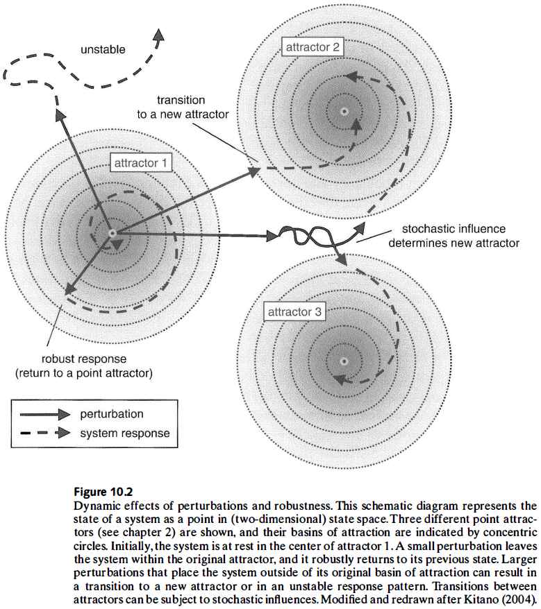
- Network mechanisms make a system more robust by limiting the effects of potentially disruptive perturbations and by preserving the attractor in the face of change.
- The mechanisms of modularity and degeneracy are particularly relevant in the brain.
- Modularity limits the spread of, and helps to contain, the potentially disruptive effects of perturbations.
- Degeneracy: the capacity of a system to perform an identical function with structurally different sets of elements.
- Unlike redundancy, degeneracy doesn’t require the duplication of system components.
- Degeneracy is ubiquitous in complex networks with sparse and recurrent structural connectivity.
- E.g. Communication can occur along many alternative paths, which protects the network from being disconnected if nodes or edges are disrupted.
- Review of Broca’s patients.
- Studies of anatomical lesions and their impact on cognition and behavior cast doubt on the idea that the functional impact of cortical lesions could only be attributed to the lost tissue.
- Recent research has revealed that speech depends on the integrity of corticocortical pathways and on cortical gray matter.
- Modern methods strongly support the idea that the impact of a lesion is determined by both the local function and by the connectivity pattern of the lesioned brain area.
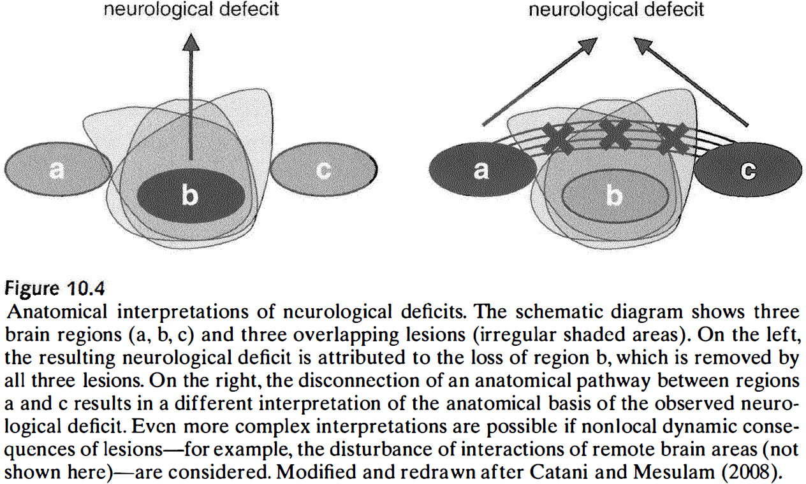
- Brain lesions are perturbations of structural brain networks that have physiological consequences.
- Some of these consequences are due to the direct loss of nodes and edges, while other effects involve the disruption of functional interactions between nonlesioned structures.
- Effects of lesions can propagate to structures that aren’t directly connected with the lesion itself.
- E.g. Lesioning highly connected regions results in larger effects compared to lesioning of more isolated regions. Also, highly connected regions are also affected by lesions in more locations due to their connections.
- The pattern of structural damage of brain networks resembles that of scale-free networks, likely due to their modular architecture.
- The picture that emerges from computational models is that the functional impact of lesions can be partially predicted from their location in the brain.
- Lesions of highly central parts of the network, such as structures along the cortical midline, produce larger and more widely distributed dynamic effects.
- No notes on network damage in Alzheimer’s disease.
- There’s convergent evidence that Alzheimer’s disease manifests as a disturbance of functional, and thus structural, cortical networks.
- No notes on network analysis in schizophrenia and neurodevelopmental disorders.

## Chapter 11: Network Growth and Development

- It’s impossible to fully understand or interpret the structure of brain networks without considering their growth and development.
- Network growth focuses on how networks comes to change, such as how nodes and edges are added, removed, or rewired.
- Neural models of network growth address how developmental changes in structural connections give rise to changes in dynamic patterns of neural activity.
- Models of network growth of the Internet or social networks aren’t analogous to how brain networks grow because these networks don’t change as a result of dynamic patterns of functional connectivity, unlike the brain.
- E.g. Changes in network dynamics changes the strength or persistence of structural links underlying the developmental patterns of functional connectivity.
- Two ways of modeling network growth
    - Start with a fixed number of nodes and then gradually add edges
    - Add both nodes and edges simultaneously
- Phase transition: the sudden appearance of a new network property during graph evolution.
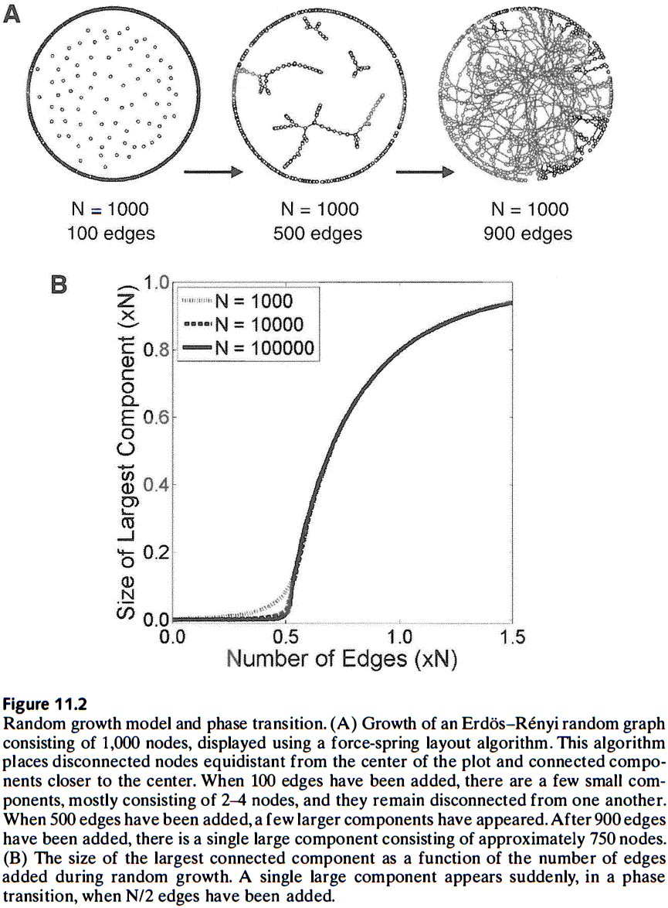
- Phase transitions and their potential role in neural development is entirely unexplored.
- In many complex networks, the spatial arrangement of nodes is significant and has unexplored implications for topology and function.
- E.g. Transportation networks, power distribution grids, Internet, the brain.
- Brain networks are sensitive to the layout of nodes because nodes are more likely to connect to neighboring nodes, which results in a topographic map.
- E.g. Retinotopic, tonotopic, somatotopic.
- Thus, realistic models of network growth in the brain must incorporate these factors.
- The modular small-world architecture of the brain isn’t obtained with growth models that rely only on distance rules because these models generally generate one module/cluster.
- However, multiple modules can be obtained if different parts of the network develop at different times.
- All of the models discussed so far have focused on distance-dependent processes to add nodes and edges, but we know that neural activity also plays a role in network growth.
- Such activity-dependent processes control the stability and persistence of neural connections throughout life.
- Structure shapes neural activity, and neural activity, in turn, shapes structure.
- This mutual and reinforcing relationship is important in guiding the development of structural and functional brain networks.
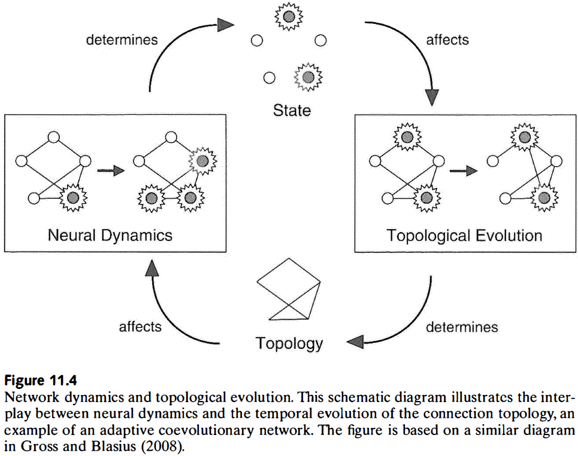
- The close spatial proximity of axonal and dendritic branches within cortical tissue creates many opportunities for developing new synapses without the need for significant additional growth of neural processes.
- It’s important to note that network growth and plasticity are only one mechanism behind cognitive development. Other mechanisms include the role of the organism’s physical and social environment, the physical growth of the body, continual self-reference, and embodied interactions with the world.
- Whole-brain structural networks of the developing human brain haven’t yet been fully mapped.
- So far, we’ve found that most functional connections are significantly weaker in children than in adults.
- Comparing functional connectivity to wire lengths (from diffusion imaging) revealed a developmental trend of weakening of short-range and strengthening of long-range functional connections.
- This trend suggests a rebalancing of functional segregation and functional integration during early development.
- Network changes over a lifetime
    - Resting-state functional networks exhibit different characteristics between children, young adults, and elderly adults.
    - The topology of functional networks changes throughout development, adulthood, and aging.
    - In children, short-range functional interactions dominate while long-range interactions appear later in adolescence.
    - In late adulthood, large modules are broken up into smaller ones that are less well defined and exhibit greater cross-linkage.
- Overall, the growing and aging brain go through gradual rebalancing of functional relationships while preserving large-scale features such as small-world connectivity.
- The processes that account for the growth and plasticity of the brain also account for the resilience of brain networks against lesions and damage.
- As we learn more about the dynamics of connectivity, mounting evidence indicates that most connectional changes aren’t due to environmental imprinting, but rather to self-organization.
- Nervous systems don’t converge on a final stable pattern of optimal functionality, but rather their connectivity continues to be in flux throughout life.
- One of the most puzzling aspects of structural brain networks is their extraordinary ability to rewire and remodel in the presence or absence of neural activity.

## Chapter 12: Dynamics: Stability and Diversity

- Integrated brain activity forms the neural basis for the unity of mind and experience.
- Structural connections only constrain, but don’t rigidly determine, functional interactions in the brain.
- A network’s degree distribution can affect the emergence of synchronized patterns.
- No notes on neural transients, metastability, and coordination dynamics.
- Neural computations viewed as unique sequences of transient states triggered by inputs is an alternative view to the more classic models of computations with fixed-point attractors that can’t easily account for variable brain dynamics.
- Liquid-state computing: a model of neural processing based on trajectories in state space instead of fixed points.
- Liquid-state machines rely on the dynamics of transient perturbations for real-time computing, unlike standard attractor networks which compute in sequences of discrete states.
- Can dynamic diversity explain the flexibility of cognition?
- Evidence supports this idea as an analysis of brain signal variability across developmental stages from childhood to adulthood showed increased variability in the brains of adults compared to children.
- Self-organized criticality (SOC): systems that naturally evolve toward a state of fine balance between robust interactions and sensitivity to perturbations.
- A system in critical state ensures that it can access a wide and diverse set of state spaces or functional repertoire.
- If the critical state is unique in regards to information processing and dynamic diversity, then how can neural systems reach this state and how can they tune themselves in a self-organized way to maintain it?
- Both network topology and neural plasticity may play an important role in generating and maintaining the critical state.
- The sensitivity of the network to input is greatest while it occupies a critical state at the edge of chaos.
- The mechanistic basis of power-law scaling in behavior and cognition is still relatively unexplored.
- E.g. Weber’s law and the decibel scale for sound.

## Chapter 13: Neural Complexity

- Many complex systems have common characteristics.
- E.g. Hierarchy and modularity.
- Complex systems tend to be hierarchically organized and composed of subsystems, which themselves may have a hierarchical structure.
- Interactions within subsystems are stronger than interactions among subsystems, thus the system is “nearly decomposable” into independent components.
- This means that the behavior of a subsystem is independent of other subsystems, and by combining the interaction between multiple subsystems, we achieve a whole greater than the sum of its parts.
- All complex systems have components that interact with each other that give rise to emergent properties not seen in the components themselves.
- The highly interconnected, hierarchical, and dynamic nature of biological systems poses a significant experimental and theoretical challenge that isn’t fully addressed by the reductionist paradigm.
- What exactly is complexity and how can we use it to understand the structure and function of the nervous system?
- Complexity: systems that are composed of many and a variety of components that have organized interactions.
- Most complex systems can be decomposed into components and their interactions with varying degrees of order and disorder.
- Interactions between components integrate/bind their individual activities into an organized whole.
- This creates dependencies between components and may also change the component’s actions and behaviors.
- Interactions are often shaped by structured communication paths or connections, and these connections can vary in sparseness, strength, and who they’re connected to.
- Emergent phenomena can’t be fully explained by dissecting and reducing the system into components and interactions (or nodes and edges) alone.
- Observing complex systems is tricky due to the multiple spatial and temporal scales the system works on.
- This requires limiting the observation to certain components and interactions at certain spatial and temporal resolutions, all of which influence the nature of the reconstructed emergent properties.
- Unlike idealized systems like cellular automata where the elementary components and their interactions are well known, most real-world systems have nodes and edges that are fuzzy to define and have hierarchies that come and go.
- There’s currently no general way of measuring the complexity of an observed system even though there’s broad agreement on some of the defining features of complexity.
- Two main classes of complexity measures
    - How difficult it is to describe or build a system.
        - E.g. Algorithmic information content, logical depth, and thermodynamic depth.
        - Not too relevant to biological systems.
    - The degree to which a system is organized or the “amount of interesting structure” it has.
        - E.g. Complexity is high when order and disorder coexist, and low when order or disorder prevail.
        - Highly relevant to biological systems.
        - This measure places complex systems on a continuum between randomness and regularity.
        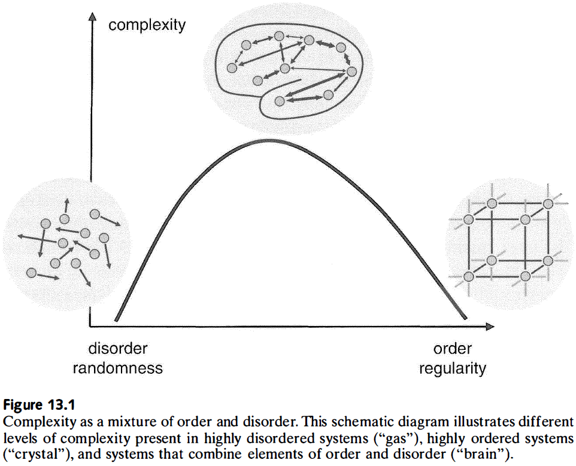
        - The brain’s structure and function most closely matches a mix of order and disorder, of randomness and regularity, of segregation and integration.
        - Order and disorder are closely related to information and entropy, so it’s no surprise that many measures of complexity use information as their building block.
- From an information point-of-view, nervous systems need to manage two competing demands.
- The first is the need to create specialized information to capture the statistical patterns in the input.
- The second is the need to generate behavioral responses where this specialized information is functionally integrated.
- Thus, segregation requires that neural responses remain encapsulated and distinct from each other to preserve their specialized response profiles, while integration requires that neural responses be combined to achieve behavior.
- This means that segregation and integration place competing demands on neural processing which must be realized in a single architecture.
- This single architecture can meet this challenge by organizing connectivity in a way that combines segregation and integration.
- E.g. Modular small-world network.
- Mutual information: how much information observing one element provides about the state of another element on a scale from zero to one.
- E.g. If two elements provide no information about the state of the other, then mutual information is zero. If two elements are identical, then mutual information is one.
- Unlike correlation, which is a linear measure between variables, mutual information captures linear and nonlinear relationships.
- However, mutual information doesn’t describe causal effects or directed dependencies between variables.
- Which network topologies promote high neural complexity?
- By varying topological patterns using algorithms similar to evolution, we can examine how these variations affect global dynamics and measures of complexity.
- However, examining all possible connection topologies is impossible because there are too many possible combinations.
- A topology variant is evaluated using a cost function and the variant that has the lowest cost is copied forward into the next generation.
- This cycle of variation and selection continues until the algorithm stops improving or if the goal defined by the cost function is reached.
- A crucial parameter in this approach is the type of neural dynamics used to derive functional connectivity from the pattern of structural connectivity.
- E.g. An identical pattern of structural connectivity can result in different functional connectivity depending on the dynamics.
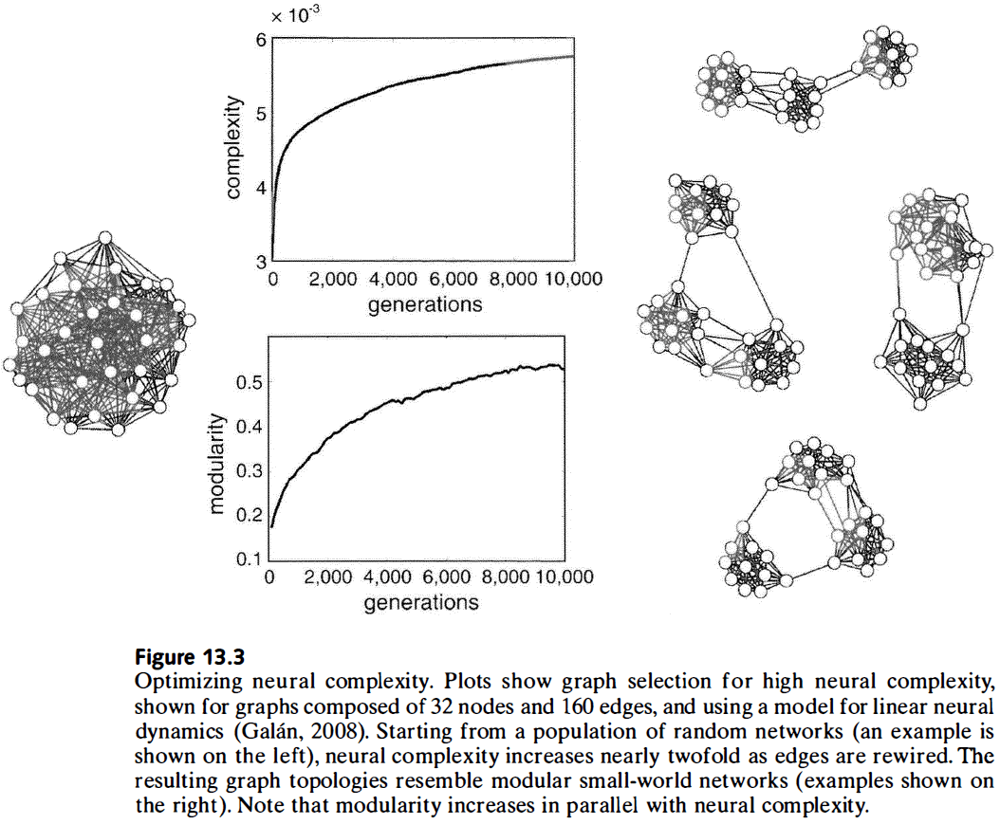
- After network optimization, the rise in complexity is paralleled by small-world architecture features such as high clustering and short path lengths.
- Computational studies suggest that only specific classes of connectivity patterns, ones that are similar to cortical networks, simultaneously support short wiring, small-world attributes, hierarchical modular architectures, and high complexity.
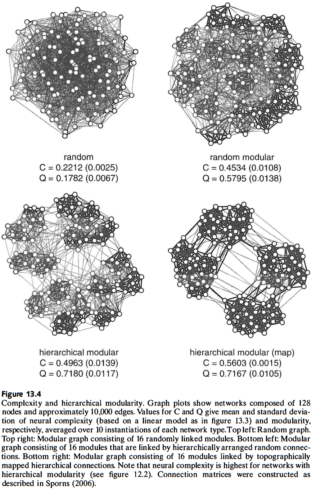
- A science of the brain that doesn’t explain subjective experience and conscious mental states is incomplete.
- The phenomenology of consciousness highlights many of its key properties.
- E.g. Integration of different senses to create a unified mental state, integration of time.
- A neural system has high complexity if it allows for a large number of differentiable states and simultaneously achieves their functional integration by creating statistical dependencies that bind it various components.
- Review of the integrated information theory of consciousness, which argues that consciousness is the capacity of a system to integration information.
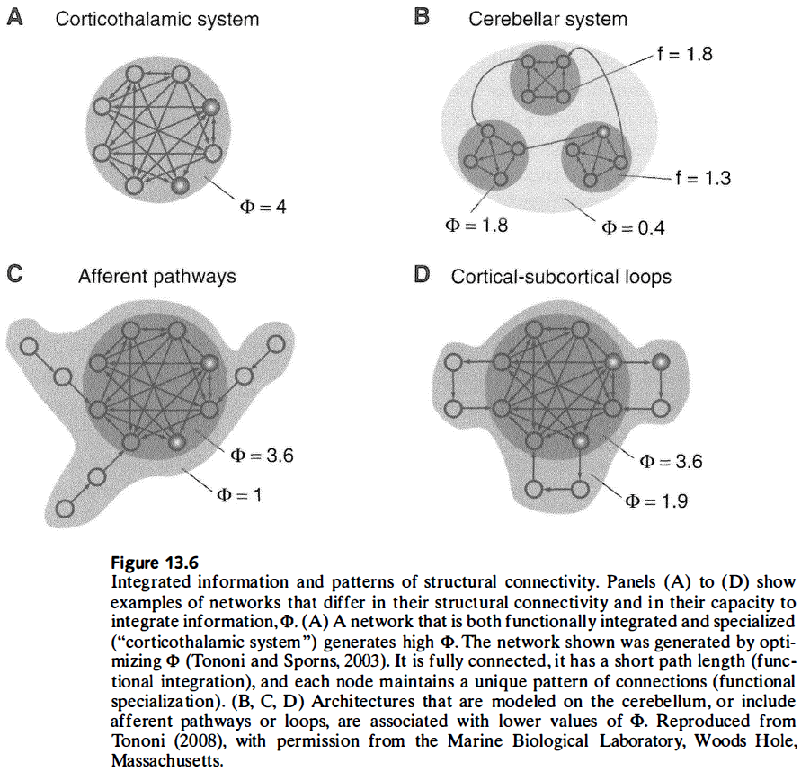
- Integrated information, as captured by phi, relies on a measure of effective information which, unlike mutual information, reflects causal interactions.
- Review of the global workspace theory of consciousness, which argues that consciousness depends on a central resource (global workspace) that enables the distribution of signals among specialized modules that are functionally independent.
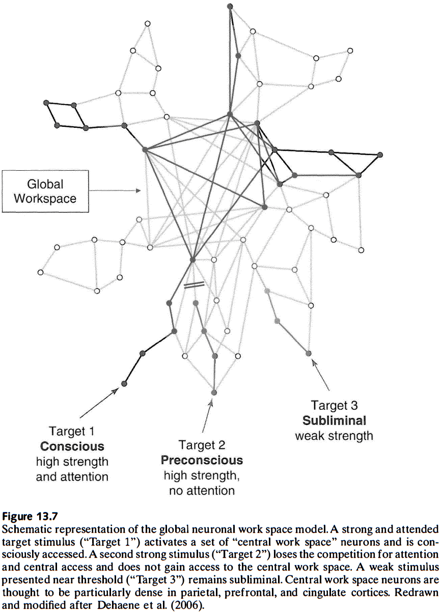
- A theme among these theories of consciousness is that they’re all based on network interactions; on patterns of functional or effective connectivity constrained by anatomy.
- Consciousness emerges from complex brain networks as the outcome of a special kind of neural dynamics, but it also depends on a physical substrate to generate such dynamics.
- However, it may not depend on the specific biological substrate of the brain, opening the possibility of artificial consciousness or emulated consciousness.
- Repeat observations of structured inputs reorganizes structural connections in a way that captures the structure of the stimulus.
- Thus, more complex stimulation leads to more complex structural connections, which enables more complex intrinsic dynamics.
- Complexity, with it’s capacity to respond and act differently under different contexts, is the brain’s answer to the challenge of a changing and partially predictable environment.

## Chapter 14: Brain and Body

- The brain can communicate not only through its anatomical connections, but also through the environment.
- The environment can act as a communication channel from the brain to the brain.
- E.g. Bodily movement that causes changes in sensory inputs. In this case, the environment acts as a proxy between the motor and sensory regions of the brain.
- Coordination between parts of the brain can occur through the environment and doesn’t always need the nervous system.
- Viewed this way, the brain is a closed system where neural activity always leads to neural activity.
- Environmental interactions thus further expand the available set of functional brain networks.
- This chapter discusses the brain-body-environment interactions that can have profound effects on brain networks.
- Complex behavior can come from simple mechanisms expressed in a complex environment.
- E.g. The path of an ant seems complex, but this complexity is largely a reflection of the complexity of the environment that it’s in and not because of what goes on in the ant’s brain.
- Thus, complex behavior is the result of the interaction between brain, body, and environment, and this view is called embodied cognition.
- What embodied cognition models and robots have in common is that they act autonomously in the real world.
- Building such systems reveals the relationship between neural control, bodily action, and the effect it has on the environment.
- This shows the dependency of cognitive processes on sensorimotor interactions.
- Embodiment greatly expands the space of possibilities that evolution can use to increase an organism’s capacity to process information.
- Examples of active sensing
    - Echolocation in bats and dolphins
    - Whiskers in rodents
    - Olfactory cues in lobsters and crabs
- These examples suggest that the full capacity of biological sensory systems is only revealed in their natural environment and with meaningful stimuli.
- Manipulating and playing with objects allows people to choose viewing angles that are most informative about object identity or that present frequently encountered patterns and features.
- Embodiment naturally generates correlations and redundancies across multiple sensory modalities, and multimodal correlations help disambiguate sensory inputs which reduces the dimensionality of the sensory space, thus supporting cognitive functions.
- Social networks and brain networks are interwoven and are adjacent levels of a multiscale architecture. Some of the same network principles may apply to both levels.
- The physical arrangement of sensory surfaces and motor structures is intricately linked to the processing capabilities of its neural network.
- It appears unlikely that the extraordinary capacity and flexibility of the human mind can be traced to any single morphological or genetic feature, or to a privileged brain region or pathway.
- Throughout this book, the author has argued for a network science approach to neural systems because it’s well suited for bridging the levels of organization in the nervous system.
- It’s networks all the way down.
