<blockquote class="blockquote">
  
To steal ideas from one person is plagiarism. To steal from many is research.

  
Wilson Mizner

</blockquote>

## Preface

- Brain research bears the promise of a new computing paradigm.
- This book aims to provide a wide description of neuromorphic engineering.
- Skipped the foreword tale.

# Part I: Introduction and Overview

## Chapter 1: Introducing the perspective of the scientist

- The scientist views neuromorphic engineering as the exploration of emergent properties in large-scale neuronal architectures.
- Review of neuron, dendrite, soma, axon, spikes.
- Neuronal communication can be described as pseudo-binary asynchronous messages.
- Rate coding: when information is encoded in the spiking frequency.
- Rate coding fails when we need faster decoding and can’t wait to receive enough spikes to determine the frequency.
- E.g. Vision.
- Temporal coding: when information is encoded in the spike’s timing.
- What level of detail should we investigate the brain?
- E.g. Molecular, neuronal, networks, systems, or beings.
- Given the brain’s immense complexity, manually organizing all neuronal connections seems impractical.
- Review of the Semantic Pointer Architecture (SPA) and Neural Engineering Framework (NEF) by Chris Eliasmith.
- An appealing point in neuromorphic engineering for scientists is the potential to efficiently execute large scale neuronal simulations at close to real-time and with modest energy requirements.

## Chapter 2: Introducing the perspective of the computer architect

- Approaches to increase computer performance
    - Pack more transistors onto a chip
    - Use a higher clock rate for processing speed
    - Move to a distributed computing paradigm with multi-core designs
    - Change the computing paradigm
- The two paradigm shifts in neuromorphic computing are
    - Probabilistic representation
        - In a digital computer, the signal-to-noise ratio can be traded for energy efficiency.
        - However, this comes at the price of an increased error probability.
        - E.g. That an error is induced due to thermal noise.
        - The brain is efficient because it allows itself to make mistakes.
        - Alan Turing argued that not making mistakes isn’t a requirement for intelligence.
    - In-memory computing
        - If the brain were organized in the von-Neumann architecture, we would separate neurons from synapses and they would communicate over a data bus.
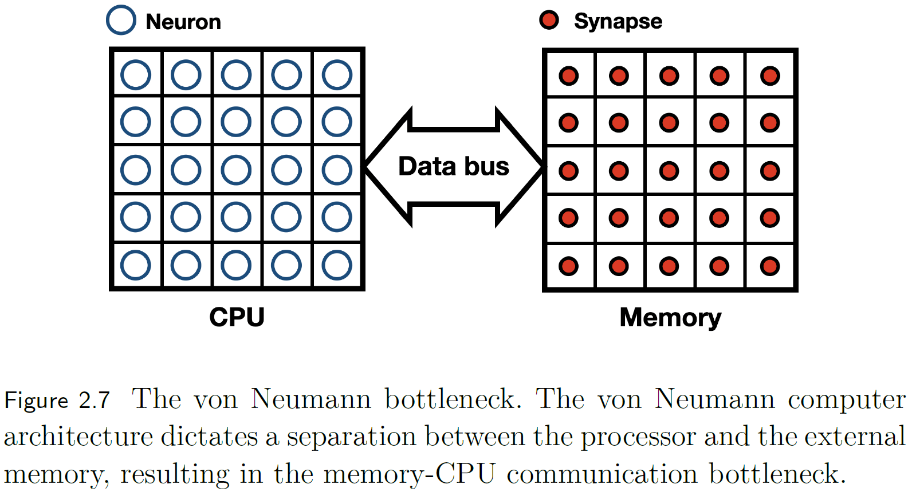
        - In the brain, memory, computation, and communication are tightly integrated and distributed over a communication fabric.
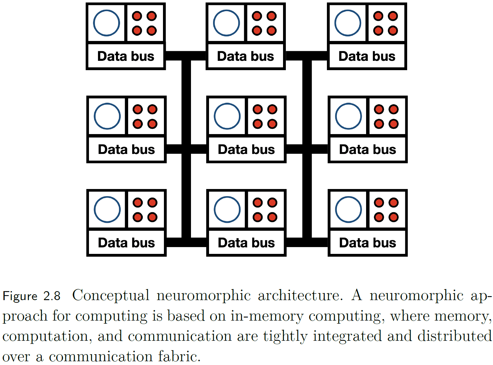
        - The data bus should be the synapse.
        - Each unit is independent and isn’t synchronized by a master clock unlike a computer.
- Neuromorphic computing isn’t suitable for every task since it’s overqualified for low precision applications (analog systems) and underqualified for high precision applications (digital systems).
- Four neuromorphic frameworks
    - Neuromorphic sensing
        - E.g. Silicon cochlea and silicon retina.
        - Neuromorphic sensors transform continuous reality into discrete events, bridging the analog world to the spike-computing world.
    - Neuromorphic interfaces
    - General purpose neuromorphic computers
        - E.g. NeuroGrid, SpiNNaker, TrueNorth, and Loihi.
    - Memristors

## Chapter 3: Introducing the perspective of the algorithm designer

- Review of spiking neural networks and various neuron models (Hodgkin and Huxley, Izhikevich, and Leaky Integrated-and-Fire (LIF)).
- Neuromorphic applications are bound to semi-precise computation and not precise computation.

# Part II: The Scientist's Perspective

## Chapter 4: Biological description of neuronal dynamics

- A cell’s membrane separates its interior from exterior.
- Two forces driving ions across the membrane
    - Chemical: molecule concentration gradient.
    - Electrical: electrical charge (ion) gradient.
- For each ion, when the electrical force balances the chemical force, there’s no net transport of that ion.
- This is the ion’s equilibrium potential.
- Biological synapses can only be either excitatory or inhibitory and can’t switch between the two.
- This is a challenge for supervised learning as artificial synapses are free to change between positive and negative weights.

## Chapter 5: Models of point neuronal dynamic

- One of the most widely used differential models for neural activity is the Leaky Integrated-and-Fire (LIF) model.
- Another important neuron model is the Izhikevich model. It’s a quadratic LIF model with a recovery variable, making it able to replicate several features of real neurons while remaining computationally efficient.
- The Hodgkin and Huxley (HH) model provides a bio-plausible differential description of neuronal dynamics and won the 1963 Nobel Prize in Physiology.
- In LIF, the cell’s membrane acts as a leaky capacitor, the resting potential acts as the voltage source, and the resistor acts as the membrane permeability.
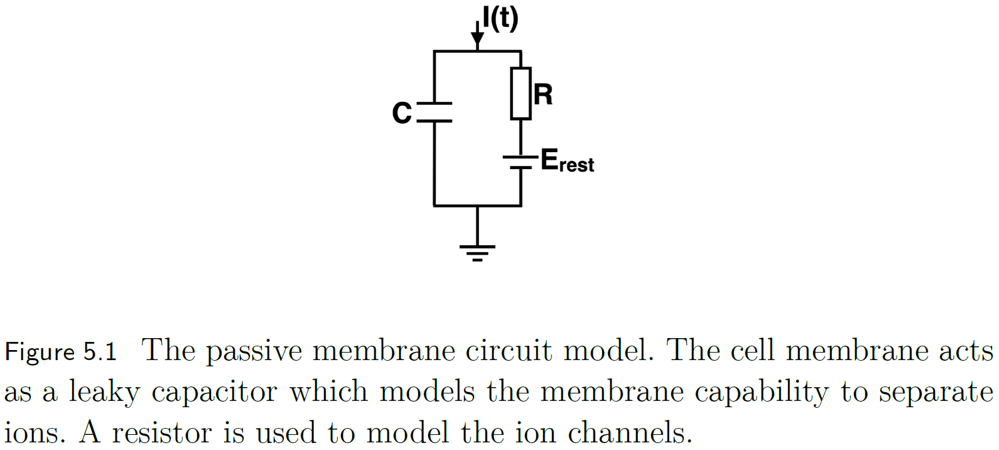
- Both LIF and Izhikevich models have explicitly defined thresholds which aren’t biologically realistic.
- The HH model is a realistic model of how spikes emerge from the complexity of their differential nature.
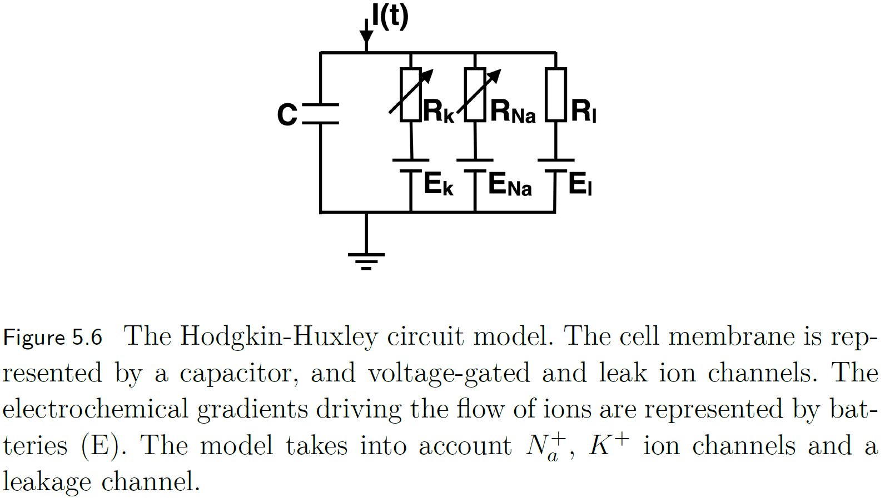
- The HH model accounts for sodium ions, potassium ions, and a leakage channel.
- However, even the HH model doesn’t mirror the experimentally observed stochastic response of neurons to current injection.
- To model a synapse, we can account for it as another channel in the neuron model.
- Synapses are dynamic entities that have an adjustable weight controlled by the density of neurotransmitter receptor on the post-synaptic cell, vesicle density, and vesicle fusion rate.
- The three neuron models: LIF, Izhikevich, and HH, represent neurons as point processes with no spatial structure or morphology.
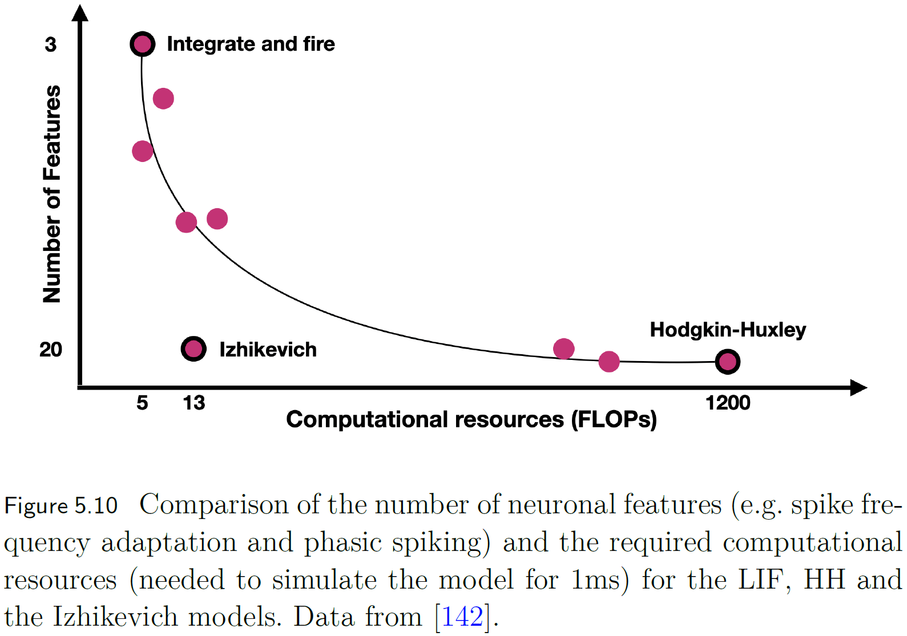

## Chapter 6: Models of morphologically detailed neurons

- A neuron’s morphology is closely related to its functions so capturing accurate morphology and physiology are essential.
- We scale the dimensionless point neuron models to dimensioned shapes using the cable equation, and further scale them to branching morphologies using the compartmental model.
- Different morphologies implement different functions.
- E.g. Starburst Amacrine Cells (SACs) are direction sensitive and their selectivity is coupled to its morphology and biophysical characteristics. SACs regulate their dendritic overlap with neighboring SACs to uniformly cover the retina.
- To go from modeling point process to spatial neurons requires the propagation of voltage through space and time.
- This is captured using a cable or a continuous representation of a segment of dendrite or axon.
- E.g. We can use multiple connected LIF models to describe a cable.

- We can scale up the cable model by connecting it in a branching architecture to other cables, creating arbitrarily complicated morphologies.
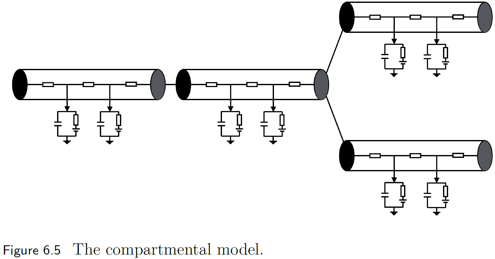

## Chapter 7: Models of network dynamic and learning

- Review of the default mode network, salience network, and affect network.
- Finding the balance between biological plausibility and computational demand is key to efficiently simulate large-scale biological models.
- STDP defines a critical time window where spiking can change the connection’s weight.
- E.g. Approximately 20 milliseconds long.

# Part III: The Computer Architect's Perspective

## Chapter 8: Neuromorphic hardware

- Neuromorphic hardware has the potential to solve some of the greatest challenges in chip design using silicon neurons (SiN).
- E.g. Challenges like thermal management and memory wall.
- Silicon neurons are circuits that emulate the electrophysiological behavior of biological neurons.
- Two basic building blocks of a silicon neuron
    - Synapse: a circuit that integrates incoming spikes to generate a corresponding current.
    - Neuron / Spike generator: a circuit that receives synaptic current and generates a spike given a threshold is reached.
- Examples of circuit synapses
    - Pulse current-source
        - Can control the magnitude of the response but not the timing nor waveform.
    - Reset and discharge
        - Can control both magnitude and timing.
    - Charge and discharge
        - Allows for temporal integration of incoming spikes.
        - Temporal control of both the charging and discharging of a capacitor.
    - Log-domain integrator
        - Can linearly integrate incoming spikes.
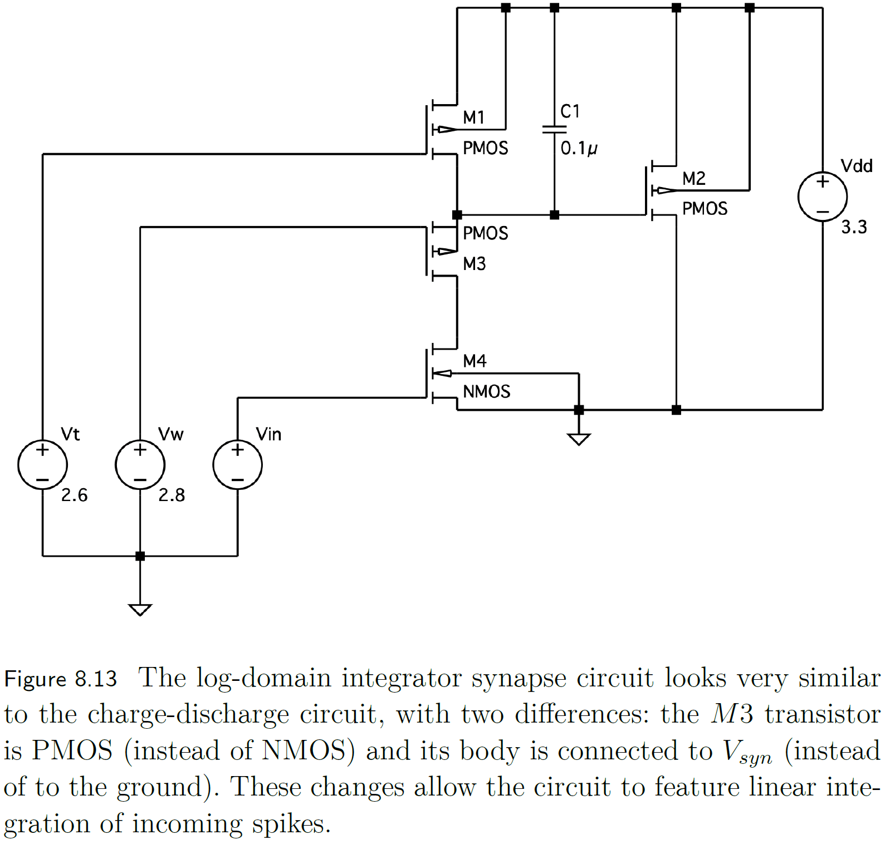
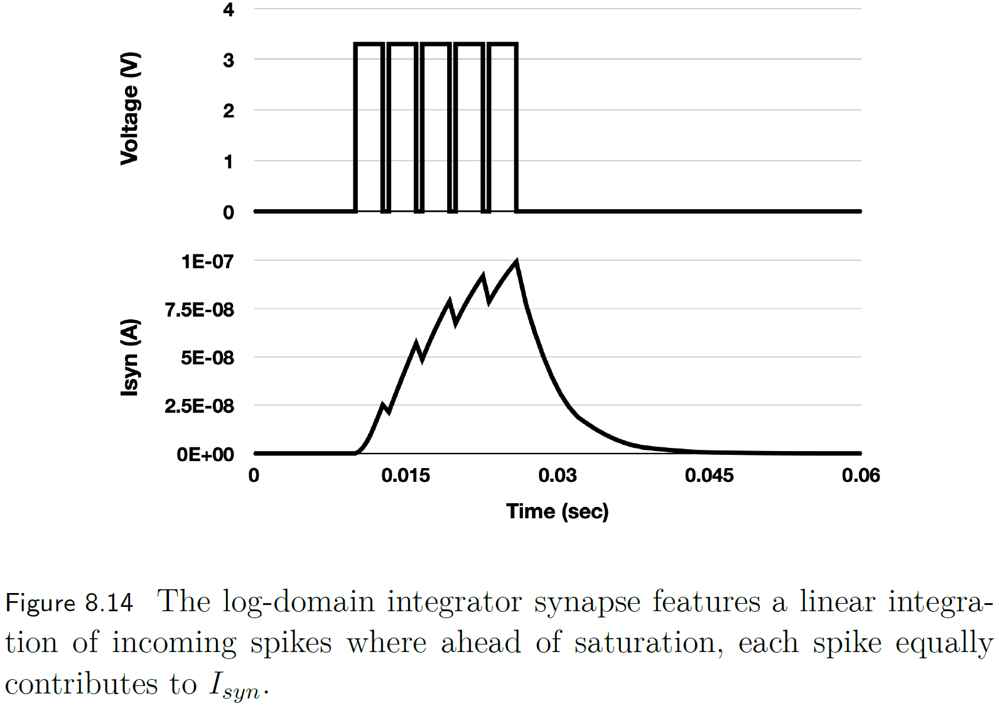
- Examples of circuit neurons
    - Axon-hillock
        - Produces a spike when the membrane voltage exceeds a threshold.
        - Inter-spike interval is inversely proportional to the input current and spike duration depends on both input and reset currents.
        - Produces spikes that aren’t biologically plausible because they aren’t separated by a refractory period and they don’t exhibit the dynamics and shapes of biological spikes.
        - Refractory periods are important because they define an upper boundary for the spiking rate.
    - Voltage-amplifier LIF
        - Improves upon the axon-hillock neuron with more control of the generated spikes such as their rise time, width, fall time, and refractory period.
        - Mirrors the influx of sodium ions and outflux of potassium ions.
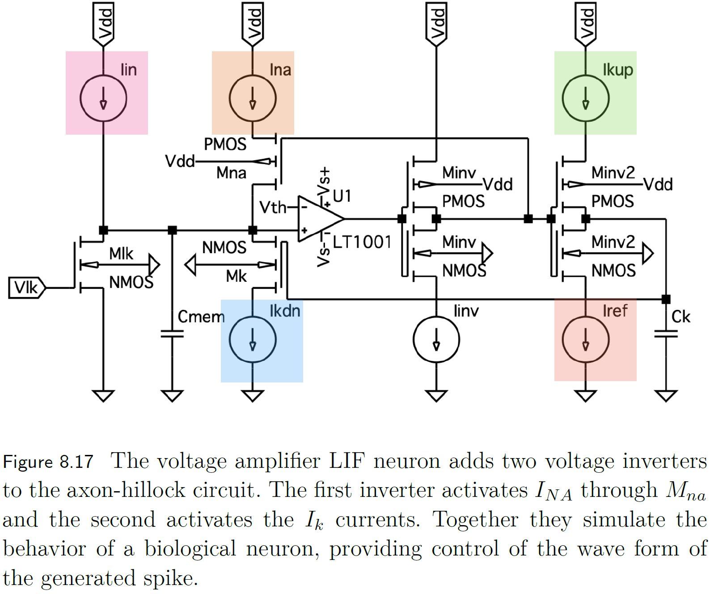
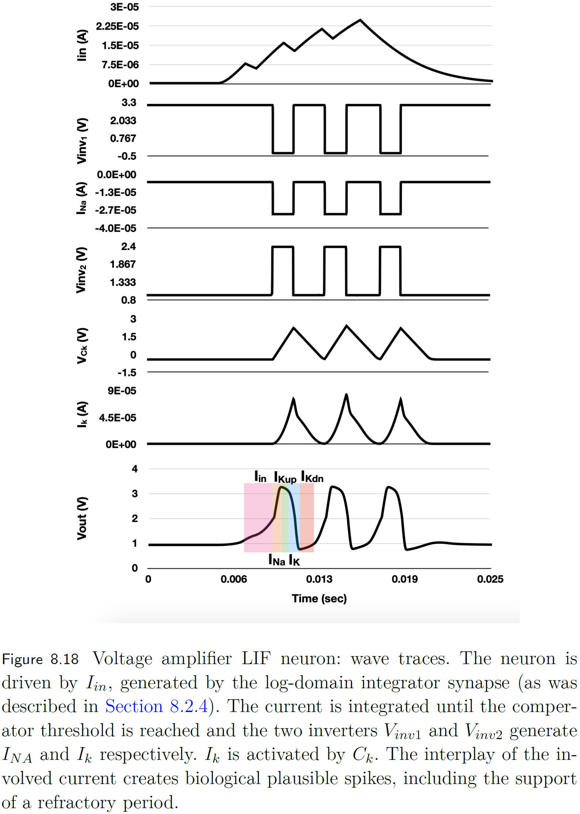

## Chapter 9: Communication and hybrid circuit design

- Neuromorphic designs based on analog circuits are limited by scalability and programmability.
- Hybrid analog/digital architectures aim to solve the scalability bottleneck by having spike communication be digital.
- It’s challenging to wire every silicon neuron to every other neuron because it isn’t biologically realistic and we can’t fabricate integrated circuits with that level of connectivity.
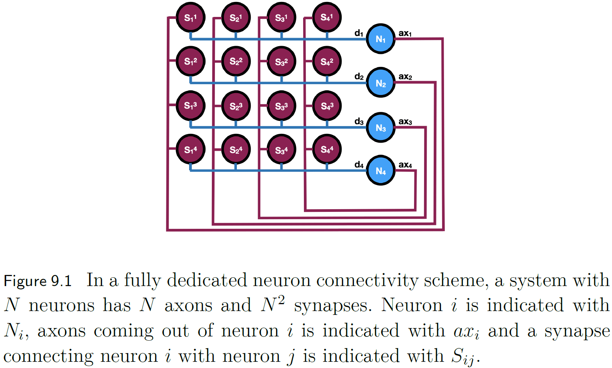
- To circumvent these communication limits, instead of dedicating a physical wire for each connection, a wire can be shared among a population of silicon neurons.
- This is possible because digital communication uses signals that travel faster than biological signals.
- This shared bus for silicon neural communication is called the Address Event Representation (AER).
- AER uses packets for routing the spike’s time, source, or spike dynamics to a target.
- This packet switching strategy is commonly implemented as a 2D grid where the target’s address is represented as an x-y index.
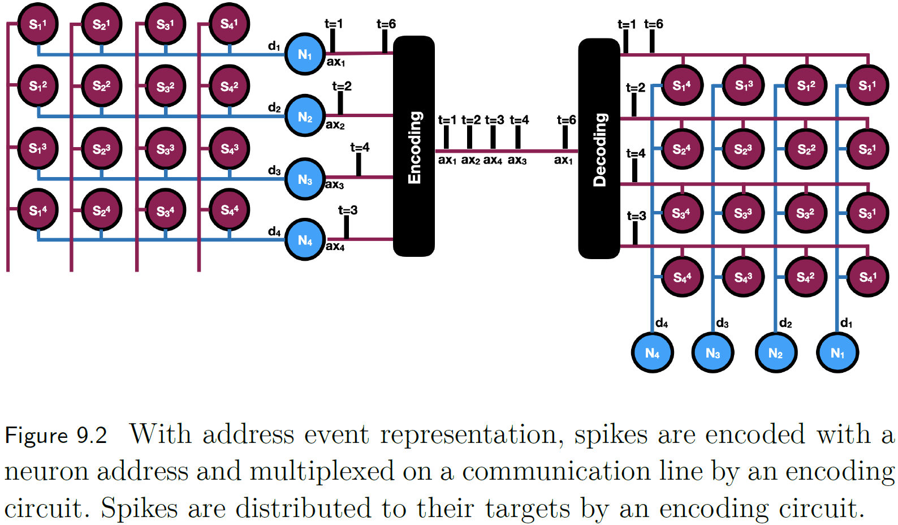
- Another implementation of AER is to use a logarithmic encoder which reduces the number of connections needed to support fully connected neurons.
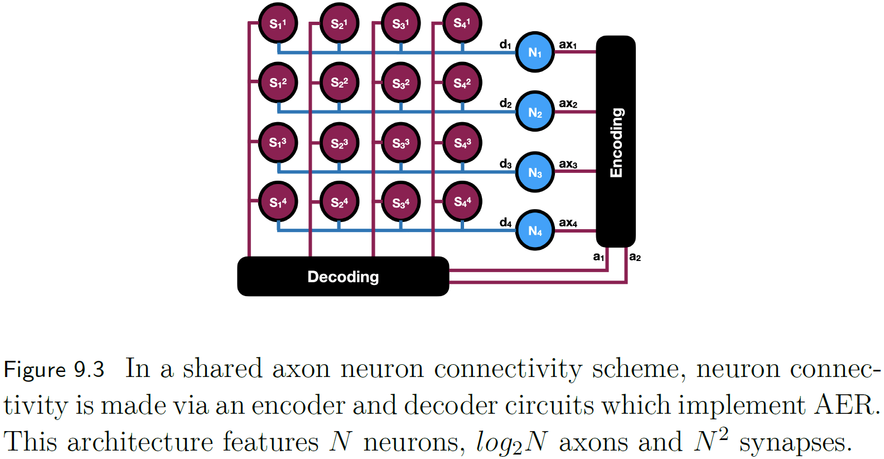
- However, the shared axon scheme still requires too many synapses. This can be solved by storing the synapses in memory instead of using wires.
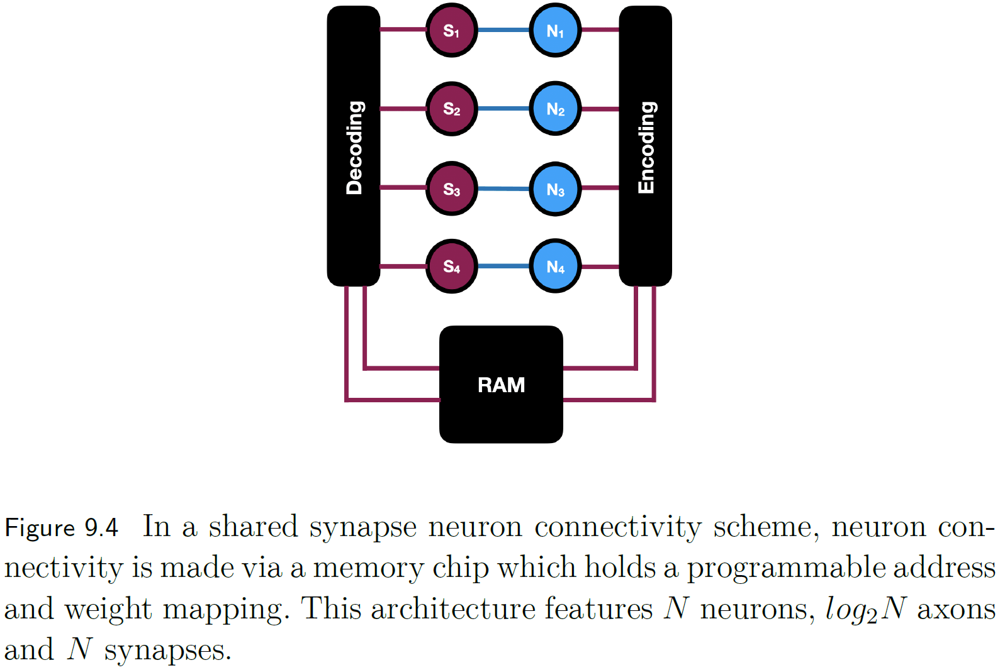
- In the shared synapse scheme, memory is used to store the mapping between neurons allowing for flexible synapse weight and connection changes.
- Given these asynchronous system designs, some arbitration mechanism is needed to prioritize access to a shared resource.
- Like other complicated systems, neuromorphic designs balance requirements, technical limitations, and other trade-offs.
- Review of IBM’s TrueNorth system.

## Chapter 10: In-memory computing with memristors

- The memristor is a prominent candidate for neuromorphic non-CMOS hardware and has many physical implementations.
- It is proposed as the fourth fundamental circuit element alongside the resistor, capacitor, and inductor.
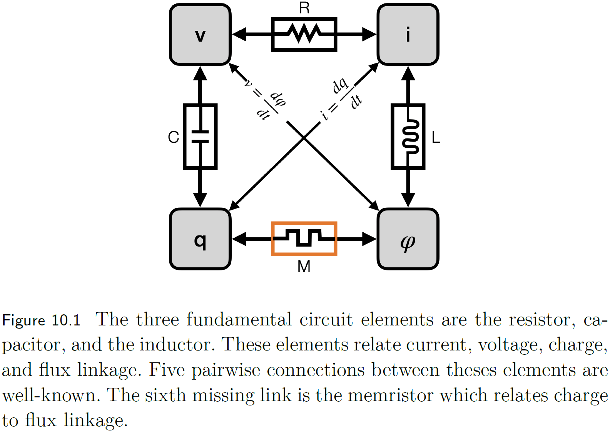
- Memristors can be thought of as equivalent to biological synapses.
- E.g. Both modulate their weight according to past input.
- However, spikes have to be positive or negative to increase or decrease synapse conductance respectively. This isn’t realistic as negative spikes don’t exist.

# Part IV: The Algorithms Designer's Perspective

## Chapter 11: Introduction to neuromorphic programming

- What can neuromorphic devices compute? What are the boundaries? And are they Turing complete or do they have fundamental limitations?
- A neuromorphic computer is Turing-complete as continuous SNN-based dynamical systems and NEF can construct a Turing machine.
- Review of computational complexity theory such as polynomial (P) and non-polynomial (NP) classes.
- We need an extended theory of complexity which captures energy and not only time and space.
- Neuromorphic programming challenges
    - Controlling a parallel, distributed, event-driven architecture.
    - Handle data in spike representation.
    - Follow hardware-specific constraints such as number of neurons, axons, and synapses.
    - Optimizing the program in terms of energy and time to solution.
- Choosing the right level of neuronal abstraction for network design is paramount.
- Review of IBM’s Corlet programming language for TrueNorth.

## Chapter 12: The Neural Engineering Framework (NEF)

- The NEF is a framework for representing and modifying data with spikes on any neuromorphic board.
- E.g. TrueNorth, SpiNNaker, Loihi, and NeuroGrid.
- NEF abstracts away neurons’ anatomy and physiology by only capturing the essence of its computation in a point process.
- Three principles of NEF
    - Representation
        - Data is captured using a population of neurons and spikes.
    - Transformation
        - Linear and nonlinear functions are implemented using weighted synapses between groups of neurons.
    - Dynamics
        - Connecting neuron groups with weighted synapses can create feedback connections, thus creating a dynamical system.
- Encoding a representation in spikes
    - Suppose we want to represent a value, the representation is thought of as a stimulus driven into a neuron model.
    - In NEF, a stimulus has a distributed representation and drives multiple neurons.
    - A useful way of representing a neuron’s response to varying inputs is a tuning curve.
    - A tuning curve is defined by three parts: an intercept (value when a neuron fires at a high rate), a maximal firing rate, and an encoder.
    - An ensemble of neurons is made up of many neurons, each with a different tuning curve.
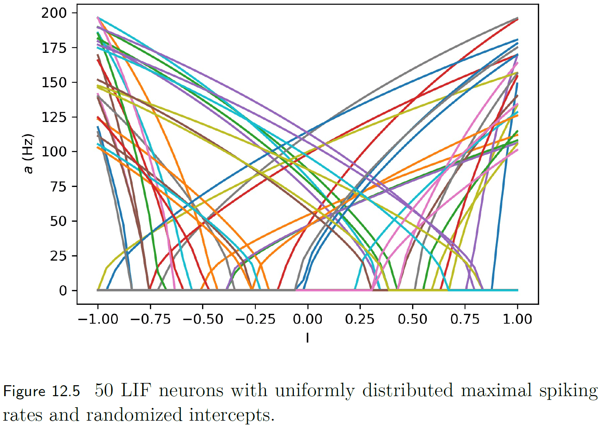
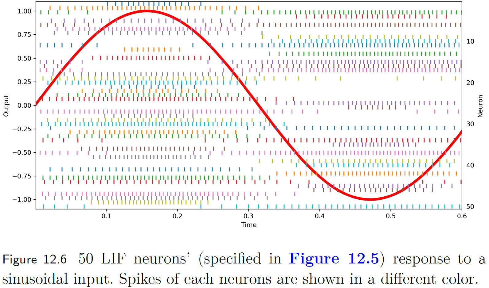
- Decoding a spike representation
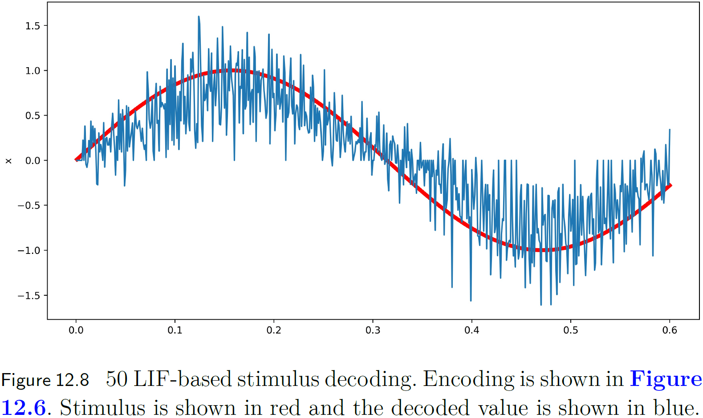
    - To decode a set of spikes into a stimulus, we need to define a window of time that continuously contributes to the decoding.
    - This can be done using convolution.
    - A biologically plausible choice for the convolution window is an exponentially decaying filter.
    - This filter matches the decay of neurotransmitter at the synapse.
    - Using more neurons, we can more accurately decode the spike representation.
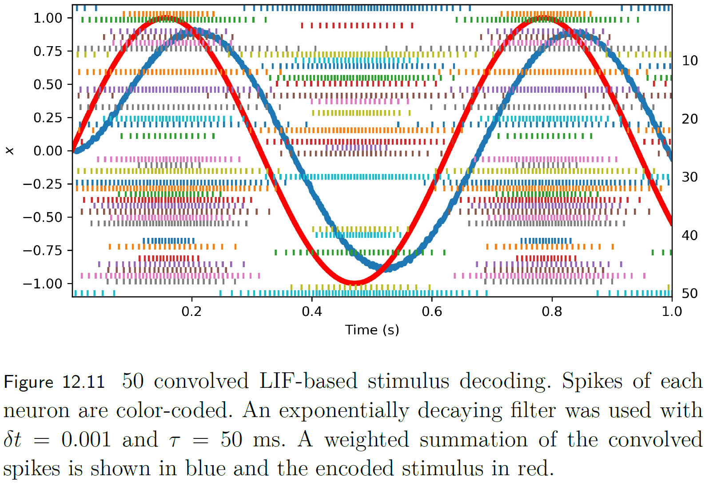
    - However, the distribution of tuning curves in the population also affects the ability to accurately decode the representation.
    - E.g. The greater the distribution, the more accurate the decoding.
- Transformation
    - Given two groups of neurons, one that represents x and another the represents y, how should we connect them such that x = y?
    - We can use a collection of weighted connections between the neurons in x and y to transform one representation into the other.
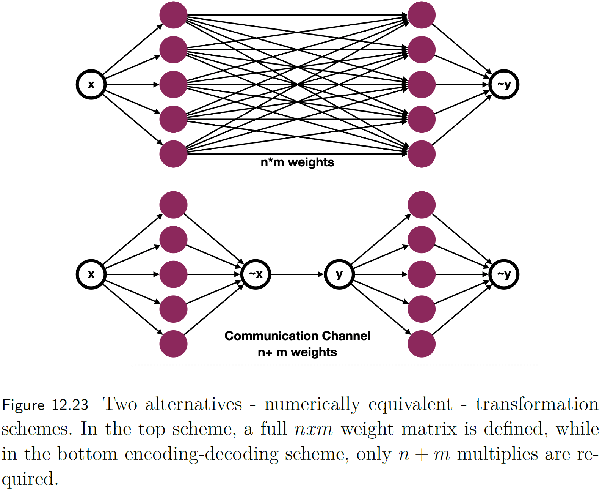
- Dynamics
    - Dynamics studies the nonlinear behavior of complex systems over time and is a combination of the first two NEF principles: representation and transformation.
    - Dynamics provides the NEF the ability to use spiking neural networks to solve differential equations.

## Chapter 13: Learning spiking neural networks

- STDP is one of the most used learning strategies in neuromorphic systems.
- The relative timing between pre- and post-synaptic spikes constitutes a causal relationship between events.
- Learning thus takes place in particular time windows in which causal relationships between neurons take place.
- Review of artificial neural networks and how they’re trained.
- No notes on learning in spiking neural networks with NEF.
