<blockquote class="blockquote">
  
As the German neuroscientist Olaf Sporns has put it: "Neuroscience still largely lacks organising principles or a theoretical framework for converting brain data into fundamental knowledge and understanding." Despite the vast number of facts being accumulated, our understanding of the brain appears to be approaching an impasse.

  
Matthew Cobb

</blockquote>

# Part I: Overall Perspective

- A first step towards understanding the brain is to learn how neurons are organized into signaling pathways and how they communicate by synaptic transmission.
- The specificity of the synaptic connections established during development and refined during experience underlie behavior.

## Chapter 1: The Brain and Behavior

- The last frontier of biological science is to understand the biological basis of the mind: the brain.
- The current challenge is to unify psychology, the science of the mind, with neural science, the science of the brain.
- We assume that all behavior is the result of brain function.
- How do the billions of nerve cells in the brain produce behavior and cognition?
- What is the appropriate level of biological description to understand a thought, the movement of a limb, or the desire to make the movement?
- The appropriate level depends on the goal. Certain levels have more explanatory power than others.
- The goal of modern neural science is to integrate all of these specialized levels into a unified science.
- As we’ll see, questions about the levels of organization, specialization of cells, and localization of function recur throughout neural science.
- Review of the debate between Golgi and Cajal on the neuron doctrine, the principle that individual neurons are the elementary building blocks of the nervous system and aren’t a continuous web of tissue like blood vessels.
- Review of the history of neural science.
- Six major brain structures
    - Medulla oblongata: directly rostral to the spinal cord and is responsible for vital autonomic functions.
        - E.g. Digestion, breathing, and heart rate.
    - Pons: conveys information about movement from the cerebral hemispheres to the cerebellum.
    - Cerebellum: behind the pons, modulates the force and range of movement, and is involved in the learning of motor skills.
    - Midbrain: rostral to the pons and controls many sensory and motor functions.
        - E.g. Eye movement and the coordination of visual and auditory reflexes.
    - Diencephalon: rostral to the midbrain and contains the thalamus and hypothalamus.
        - Thalamus: processes most of the information reaching the cerebral cortex from the rest of the central nervous system.
        - Hypothalamus: regulates autonomic, endocrine, and visceral functions.
    - Cerebrum: comprises two cerebral hemispheres and the basal ganglia, hippocampus, and amygdala.
        - Basal ganglia: regulates movement execution, motor- and habit-learning.
        - Hippocampus: critical for the memory of people, places, things, and events.
        - Amygdala: coordinates the autonomic and endocrine responses of emotional states.
- Each of these structures is made up of distinct groups of neurons with distinct connectivity and developmental origins.
- E.g. In the medulla, pons, midbrain, and diencephalon, neurons are often grouped into distinct clusters termed nuclei.
- E.g. The surface of the cerebrum and cerebellum is a large, layered, folded sheet of neurons called the cerebral cortex and the cerebellar cortex respectively.
- The cerebrum also has a number of structures located below the cortex (subcortical).
- E.g. Basal ganglia and amygdala.

- The first strong evidence for localization of cognitive abilities came from studies of language disorders.
- Review of Broca’s and Wernicke’s work.
- The most basic mental functions, such as perception and motion, are mediated entirely by neurons in discrete local areas of the cortex.
- However, more complex cognitive functions, such as language and memory, result from interconnections between several functional sites.
- In other words, basic mental functions are localized while complex mental functions are distributed.
- The power of Wernicke’s model wasn’t only its completeness but also its predictive utility.
- E.g. It correctly predicted a third type of aphasia, one that results from the disconnection between both language areas.
- A given function may not be eliminated by a single lesion if it’s a complex and thus distributed function.
- Functional specialization is a key organizing principle in the cerebral cortex.
- Who would’ve guessed that the neural analysis of the movement and color of an object occurs in different pathways rather than a single pathway unified by the percept of the object.
- Similarly, the neural organization of language might not conform exactly to the axioms described by a theory of universal grammar, but it could still support the functionality described by it.
- Mental processes are the product of interactions between elementary processing units in the brain.
- We now think that all cognitive abilities result from the interaction of many processing mechanisms distributed in several regions of the brain.
- E.g. Perception, movement, language, thought, and memory are made possible by the integration of serial and parallel processing in discrete brain regions.
- So, damage to a single region doesn’t result in the complete loss of a cognitive function as many earlier neurologists believed.
- Instead of thinking of mental functions as a chain of nerve cells and brain areas, we should think of it as many parallel pathways in a network of modules that ultimately converge upon a common set of targets.
- Thus, malfunction of a single pathway within a network may affect the information carried by that pathway without disrupting the entire system.
- Our experience isn’t a faithful guide to how such processes occur in the brain.
- E.g. Recalling the concept ‘apple’ doesn’t help us understand how the concept was recalled.
- At present, there’s no satisfactory theory that explains why only some of the information that reaches our eyes leads to a state of subjective awareness, while other information doesn’t.

**Highlights**

- Neural science: to understand the brain at multiple levels of organization.
    - E.g. From cell to circuit to operations of the mind.
- The fundamental principles of neural science bridge levels of time, complexity, and state.
    - E.g. From cell to action and ideation, from development to learning to expertise and forgetting, from normal function to neurological deficits and recovery.
- Neuron doctrine: that individual nerve cells (neurons) are the elementary building blocks and signaling elements of the nervous system.
- Neurons are organized into circuits with specialized functions, which integrate to form more complex cognitive functions.
- No area of the cerebral cortex functions independently of other cortical and subcortical structures.

## Chapter 2: Genes and Behavior

- All behaviors are shaped by the interplay between genes, environment, and culture.
- Genes don’t directly control behavior but they do code for proteins and RNAs that act at different times and at many levels to affect the brain.
- This chapter asks how genes contribute to behavior.
- E.g. Brain development, genetic modifications in other animals, and genetic risk factors in neurodevelopmental and psychiatric syndromes.
- Heritability: the extent to which genetic factors account for traits in a population.
- Review of DNA, genes, transcription, translation, exons, and introns.
- The brain expresses a greater number of genes than any other organ in the body, and within the brain, diverse populations of neurons express different groups of genes.
- Genes not only specify the initial development and properties of the nervous system, they can also be changed by experience.
- Review of alleles, genotype (genetic makeup), phenotype (appearance), recessive and dominant.
- Completion of the human genome project in 2001 lead to a surprising conclusion: the unique human species didn’t result from the invention of unique human genes.
- E.g. Humans and chimpanzees share 99% of their protein-coding genes.
- The conclusion is that ancient genes that humans share with other animals are regulated in new ways to produce new human adaptations.
- Because of this conservation of genes throughout evolution, insights from studies of one animal can often be applied to other animals with related genes.
- We have a mostly complete picture of the genetic basis of the circadian control of behavior.
- The core of circadian regulation is an intrinsic biological clock that oscillates over a 24-hour cycle and persists in the absence of light.
- A group of genes, not one gene, are conserved regulators of the circadian clock.

- Molecules such as protein kinases are particularly significant at transforming short-term neural signals into long-term changes in the property of a neuron or circuit.
- Examples of links between genetics and behavior
    - The ‘for’ gene regulates the activity level and locomotion in Drosophila and in bees to be either sitters or rovers.
    - The ‘npr-1’ gene encodes a neuropeptide receptor that regulates social behavior in C. elegans.
    - Other neuropeptides have been implicated in the regulation of mammalian social behavior such as oxytocin and vasopressin in prairie voles.
    - The ‘PKU’ gene, when it interacts with dietary protein, causes intellectual disability.
    - Genetic links between autism spectrum disorder and Williams syndrome further supports that the domains of cognitive and behavioral functioning are different, but may share important molecular mechanisms.
- Skipping the rest of the chapter on genetics applied to autism spectrum disorders and schizophrenia due to disinterest.

**Highlights**

- Rare genetic syndromes have provided important insights into the molecular mechanisms of complex human behaviors.
    - E.g. Fragile X syndrome, Rett syndrome, and Williams syndrome.
- Sequencing the human genome, development of high-throughput genomic assays, and simultaneous computing and methodological advances have lead to profound changes in our understanding of the genetics of human behavior and psychiatric illness.
    - E.g. Schizophrenia and autism.

## Chapter 3: Nerve Cells, Neural Circuitry, and Behavior

- The brain both gathers and discards a lot of information.
- Neurons are the basic signaling units of the brain.
- The human brain has at least 86 billion neurons that can be classified into at least a thousand different types.
- Yet this great variety of neurons is less of a contributor to the complexity of human behavior than their organization into anatomical circuits with precise functions.
- E.g. Similar neurons can produce different actions because of the way they’re connected.
- Five basic features of the nervous system
    - Structural components of individual neurons.
    - Mechanisms behind neurons producing signals within themselves and between each other.
    - Pattern of connection between neurons and between neurons and their targets.
    - Relationship of different patterns of interconnection to different types of behavior.
    - How neurons and their connections are modified by experience.
- Two main classes of cells in the nervous system
    - Neurons (nerve cells): the signaling units of the nervous system.
    - Glia (glial cells): supports neurons.
- Review of soma, dendrites, axon, presynaptic terminals, and action potential (AP).
- The axon typically extends some distance away from the cell body before it branches, allowing it to carry signals to many target neurons.
- The amplitude of an AP remains constant at 100 mV because it’s an all-or-none impulse that’s regenerated at regular intervals along the axon.
- APs are the signals that the brain uses to receive, analyze, and convey information.
- E.g. The APs that convey information about vision are identical to those that carry odor information.
- Since all APs are the same, the type of information conveyed by an AP isn’t determined by the form of the signal, but by the pathway the signal travels in the brain.
- Thus, the brain analyzes and interprets patterns of incoming electrical signals carried over specific pathways, and creates our sensations of sight, touch, taste, smell, and sound.
- Review of myelin sheath, nodes of Ranvier, synapse, synaptic cleft, pre- and post-synaptic neuron and terminal, excitation and inhibition.
- Principle of dynamic polarization: electrical signals within a neuron flow in only one direction, from the postsynaptic neuron to the axon.
- In most neurons studied to date, electrical signals only travel in one direction in the axon.
- Connectional specificity: neurons don’t randomly connect with each other but make specific connections with certain postsynaptic target cells and not others.
- The feature that most distinguishes one type of neuron from another is form, specifically the number and order of dendrites and axon.
- E.g. Unipolar, bipolar, and multipolar neurons.
- Unipolar neurons show up in our autonomic nervous system, bipolar neurons show up in sensory organs, and multipolar neurons dominate the nervous system of vertebrates.
- Multipolar cells vary greatly in shape.
- E.g. Length of axons, extent, dimensions, and intricacy of dendritic branching.
- Usually, the extent of branching correlates with the number of synaptic contacts that other neurons make onto them.
- E.g. A spinal motor neuron can receive 10,000 contacts while a Purkinje cell can receive as many as a million contacts.
- Review of sensory neurons, motor neurons, interneurons, afferent (towards CNS), efferent (away CNS).
- Interneurons are the most numerous and are subdivided into two classes
    - Relay/Projection: long axons to convey signals over long distances, from one brain region to another.
    - Local: short axons that form connections with nearby neurons in local circuits.
- Glia surround cell bodies, axons, and dendrites of neurons and differ morphologically from neurons in that they don't form dendrites and axons.
- Glia also differ functionally as they don't have the same membrane properties as neurons and aren't electrically excitable.
- Every behavior is mediated by a specific set of interconnected neurons, and every neuron's behavioral function is determined by its connections with other neurons.
- Review of the knee-jerk reflex, divergence, convergence, feedforward and feedback inhibition, and resting membrane potential (-65 mV).

- Signaling is organized in the same way in all neurons
    1. A receptive component for producing graded input signals.
    2. A summing or integrative component that produces a trigger signal.
    3. A conducting long-range signaling component that produces all-or-none conducting signals.
    4. A synaptic component that produces output signals to the next neuron or muscle or gland.

- Receptor potential: a change in membrane potential at a sensory receptor.
- The amplitude and duration of a receptor potential depends on the intensity of the signal.
- Unlike APs, receptor potentials are graded and are either depolarizing or hyperpolarizing.
- The receptor potential is the first representation of a stimulus to be coded in the nervous system.
- However, since the receptor potential isn't regenerated like an AP and spreads passively, it doesn't travel far.
- To be successfully carried to the spinal cord, the local signal must be amplified and it must be converted into APs.
- Synaptic potential: when a neurotransmitter alters the membrane potential of the postsynaptic cell.
- Like the receptor potential, the synaptic potential is graded and its amplitude depends on how much transmitter is released.

- Signals from dendrites are integrated at the axon trigger zone where the activity of all receptor or synaptic potentials is summed and, if the sum reaches threshold, where the neuron generates an AP.
- APs carried into the nervous system by a sensory axon are often indistinguishable from those carried out of the nervous system to muscles.
- Two features of AP trains
    - Number of APs (counters)
    - Time intervals between them (timers)
- What determines the intensity of sensation or speed of movement is the frequency of APs.
- What determines the duration of sensation or movement is the period of time that APs are generated.
- The pattern of APs also conveys important information.
- E.g. Spontaneous, regularly active neurons (beating) and brief bursts of APs (bursting).
- If APs are stereotyped and only reflect the most elementary properties of the stimulus, then how do they carry the rich variety of information needed for complex behavior?
- The answer is simple and is one of the most important organizational principles of the nervous system.
    - Interconnected neurons form anatomically and functionally distinct pathways and it’s these pathways of connected neurons, not individual neurons, that convey information.
    - E.g. The neural pathways activated by receptor cells in the retina that respond to light are completely distinct from the pathways activated by sensory cells in the skin that respond to touch.
- Review of neurotransmitters, synaptic vesicles, active zones, and exocytosis.
- The released neurotransmitters are the neuron’s output signal and are graded according to the amount of transmitter released, which is controlled by the number and frequency of APs that reach the presynaptic terminals.
- The more the receptor potential exceeds the threshold, the greater the depolarization and the greater the frequency of APs.
- The duration of the input signal also determines the duration of the train of APs.

- The model of neuronal signaling that we’ve outlined is a simplification that applies to most, but not all, neurons.
- E.g. Some neurons don’t generate APs and instead only use graded potentials to release neurotransmitter. Spontaneously active neurons don’t require input to fire APs because they have a special class of ion channels that allows sodium ion flow even in the absence of excitatory synaptic input.
- Neurons can have different ion channel combinations and use different neurotransmitters.
- Because the nervous system has so many cell types and variations at the molecular level, it’s susceptible to more diseases than any other organ in the body.
- Despite this complexity, the molecular mechanisms of electrical signaling are surprisingly similar and aids in the understanding of how signaling occurs since understanding one means understanding all.
- For complex behavior, many neurons are needed but the basic neural structure of the simple reflex is often preserved.
- Basic neural structure of a reflex
    1. There’s often an identifiable group of neurons whose firing rate changes in response to a particular type of environmental stimulus.
    2. There’s often an identifiable group of neurons whose firing rate changes before an animal performs a motor action.
- Learning can change behavior that endures for years or even a lifetime, but simple reflexes can also be modified, albeit for a shorter amount of time.
- The fact that behavior can be modified by learning at all raises the question: How can behavior be modified if the nervous system is wired so precisely?
- We don’t have a clear answer, but the most likely solution is the plasticity hypothesis.
- Plasticity hypothesis: the nervous system changes in response to stimuli. Changes can occur at all levels of the nervous system from molecular, pathway, circuit, and regional.
- There’s now considerable evidence for plasticity at chemical synapses.

**Highlights**

- Neurons are the signaling units of the nervous system. The signals are mainly electrical within the cell and chemical between cells.
- Neurons share common features such as receptors, mechanism to convert input to electrical signals, a threshold mechanism to generate APs, APs, and neurotransmitters.
- Neurons differ in their morphology or shape, the connections they make, and where they make them.
- Glia support neurons such as being the myelin sheath that speeds up APs or by cleaning up used neurotransmitters.
- Neural connections can be modified by experience.

## Chapter 4: The Neuroanatomical Bases by Which Neural Circuits Mediate Behavior

- The brain can accomplish complex feats of perception and motion because its neurons are wired together in very precise functional circuits.
- At a gross level, the brain is hierarchically organized such that information processed at one level is passed to higher-level circuits for more complex and refined processing.
- In essence, the brain is a network of networks.
- This chapter explores how neural circuits enable the brain to process sensory input and produce motor output.
- Different circuits in the brain have evolved an organization to most efficiently carry out specific functions.
- Information carried by long pathways, such as the corpus callosum, integrates the output of many local circuits.
- Different types of information, even within a single sensory modality, are processed in several anatomically discrete pathways.
- E.g. In the somatosensory system, a light touch and a painful pin prick to the same area of skin are mediated by different sensory receptors that connect to distinct pathways.
- Fibers that relay information from different parts of the body maintain an orderly relationship to each other and form a map of body surface in their pattern of termination at each synaptic relay.
- This is called a topographical representation since locations that are close on the body are also represented as close in the nervous system.
- Review of the spinal cord, four major regions (cervical, thoracic, lumbar, and sacral).
- The rostral (head) spinal cord has an increasing proportion of ascending and descending axons, while the caudal (tail) spinal cord has an increasing proportion of gray matter.
- Another organizational feature of the spinal cord is its variation in the size of the ventral and dorsal horns.

- The ventral horn is larger at the levels where the motor nerves innervate the arms and legs, as the number of ventral motor neurons dedicated to a body region roughly parallels the dexterity of movements of that region.
- Similarly, the dorsal horn is larger where sensory nerves from the limbs enter the cord, as limbs have a greater density of sensory receptors to mediate finer tactile discrimination.
- Two types of somatosensory pathways
    - Epicritic: touch and stretch.
    - Protopathic: pain and temperature.
- Neurons that make up neural circuits at any particular level are often connected in a systematic way and appear similar from individual to individual.
- E.g. In the cervical cord, axons from all parts of the body have already entered, with sensory fibers from the lower body located medially in the dorsal column, while fibers from the mid and upper body occupying more lateral areas.
- Each somatic submodality (touch, pain, temperature, and position) are processed in the brain through different pathways that end in different brain regions.
- The thalamus isn’t just a relay, but it acts as a gatekeeper for information to the cerebral cortex, preventing or enhancing the passage of specific information depending on the behavioral state of the organism.
- The cerebral cortex has feedback projections that terminate in a special part of the thalamus called the thalamic reticular nucleus (TRN).
- The TRN forms a thin sheet around the thalamus and is made up almost completely of inhibitory neurons that synapse onto the relay cells. It doesn’t project to the neocortex at all.
- So, the TRN can modulate the response of relay cells to incoming sensory information.

- Four groups of thalamic nuclei
    - Anterior
        - Connected to the hypothalamus and presubiculum of the hippocampal formation.
        - Function is uncertain.
    - Medial
        - Three subdivisions, each connected to a particular part of the frontal cortex.
        - Function in memory and emotional processing.
    - Ventrolateral
        - Function in motor control, carrying information from the basal ganglia and cerebellum to the motor cortex, carrying somatosensory information to the neocortex, and carrying information from the spinal cord.
    - Posterior
        - Function in audition (organized tonotopically based on sound frequency) and in vision.
- Most nuclei of the thalamus receive prominent return projections from the cerebral cortex, and the significance of these projections is one of the unsolved mysteries of neuroscience.
- Sensory information processing culminates in the cerebral cortex.
- Review of the sensory and motor homunculus and how those regions can expand/shrink with experience.
- The amount of cortical area dedicated to a part of the body reflects the density of sensory receptors and degree of motor control of that part.
- E.g. Lips and hands occupy more area of the cortex than the elbow.

- Six layers of the neocortex
    - Layer I (molecular): made up of dendrites from deeper layers and axons that travel through this layer make connections to other cortical areas.
    - Layer II (external granule): made up of small spherical neurons and small pyramidal neurons.
    - Layer III (external pyramidal): made up of small pyramidal neurons that project locally to other neurons within the same cortical area and to other cortical areas, mediating intracortical communication.
    - Layer IV (internal granule): made up of many small spherical neurons and is the main recipient of sensory input from the thalamus. Most prominent in primary sensory areas.
    - Layer V (internal pyramidal): made up of many pyramidal neurons that are larger than those in layer III. Gives rise to major output pathways of the cortex, projecting to other cortical areas and to subcortical structures.
    - Layer VI (multiform): made up of heterogenous-shaped neurons. Blends into the white matter that forms the deep limit of the cortex and carries axons to and from cortical areas.

- The thickness of individual layers and the details of their functional organization vary throughout the cortex.

- Within the neocortex, information passes from one synaptic relay to another using feedforward and feedback connections.
- E.g. Feedforward projections from the primary visual cortex to secondary and tertiary visual areas mainly start in layer II and stop in layer IV. In contrast, feedback projections to earlier stages of processing start from layers V and VI and stop in layers I, II, and VI.

- The cerebral cortex is organized functionally into columns of cells that extend from the white matter to the surface of the cortex, also called cortical columns.
- This columnar organization isn’t particularly evident in standard histological preparations and was first discovered in electrophysiological studies.
- Each column is about one-third of a millimeter in diameter and forms a computational module with a highly specialized function.
- Neurons within a column tend to have very similar response properties and the larger the area of cortex dedicated to a function, the more computational columns it dedicates to that function.
- E.g. The highly discriminative sense of touch in the fingers results from many cortical columns in the large area of cortex dedicated to processing somatosensory information.
- Another important insight about the neocortex is that the somatosensory cortex has not one, but several somatotopic maps of the body surface.
- E.g. The primary somatosensory cortex has four complete maps of the skin.
- The axons from layer V neurons in the primary motor cortex provide the major output of the neocortex to control movement.
- The output may be through direct projections to the corticospinal tract or through indirect projections to the medulla and basal ganglia.
- E.g. Out of the one million corticospinal tract axons, about 40% originate in the motor cortex.
- In the medulla, the fibers from prominent bumps on the ventral surface are called the medullary pyramids, so the entire projection is sometimes called the pyramidal tract.

- Review of somatic, autonomic, sympathetic, parasympathetic.
- Memory is a complex behavior mediated by structures distinct from those that carry out sensation or movement.
- Regardless of the behavior, the general principle is that the structure of a circuit is specific to the function that it mediates.
- The hippocampal formation is the structure that mediates memory and mostly consists of unidirectional connections.
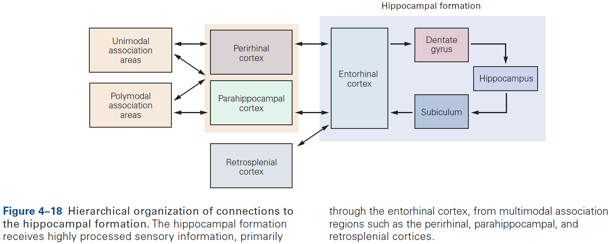

- While the hippocampal formation is essential for the initial formation of memories, these memories are ultimately stored elsewhere in the brain.
- E.g. In patient H.M., removal of his hippocampal system left memories prior to the surgery mostly intact.

**Highlights**

- Individual neurons can’t carry out behavior and they must be part of circuits that comprise of different types of neurons.
- Sensory and motor information is processed separately and in parallel in the brain.
- All sensory and motor systems follow the pattern of hierarchical and reciprocal processing of information, while the hippocampal memory system follow serial processing of very complex, polysensory information.
- A general principle is that circuits in the brain have an organizational structure that’s suited for the functions that they carry out.
- Binding problem: how sensation is integrated into a conscious experience and how conscious experience emerges from the brain’s analysis of incoming sensory information.

## Chapter 5: The Computational Bases of Neural Circuits That Mediate Behavior

- This chapter introduces ideas, techniques, and approaches used to characterize and interpret the activity of neural populations and circuits.
- Neural firing patterns provide a code for information on external sensory stimuli and internal muscle movement.
- The structure of a neural representation plays an important role in how information is further processed by the nervous system.
- The sequence of APs fired by a neuron in response to a sensory stimulus represents how that stimulus changes over time.
- Neural coding seeks to understand both the stimulus features that drive a neuron to respond, and the temporal structure of the response and its relationship to changes in the external world.
- Sensory neurons encode information by firing APs in response to sensory features.
- Brain areas must correctly interpret the meaning of AP sequences that they receive from sensory areas to respond properly.
- Decoding: the process of extracting information from neural activity.
- E.g. Recording APs and inferring what the animal or human is seeing or hearing.
- Review of place and grid cells in the hippocampus.
- During active exploration of an environment, hippocampal activity reflects place coding, but during immobile or resting behavior, the hippocampus enters a different state in which neural activity is instead dominated by discrete semi-synchronous population bursts called sharp-wave ripples.
- It’s hypothesized that these sharp-wave ripples are internally generated by the hippocampus.
- From the lowest to highest stages of visual processing, neurons have increasingly larger receptive fields and higher degrees of selectivity.
- Recurrent circuitry underlies sustained activity and integration.
- If a neuron’s response decays within a few tens of milliseconds, then how do patterns of neural activity persist long enough to support cognitive operations such as memory or decision making?
- Integration requires both computation and memory to compute and maintain a running total.
- For a neural circuit to perform integration, a transient (short-lived) input must produce activity that’s sustained at a constant level even after the input is gone.
- Thus, the sustained activity provides a memory of the transient input.
- One of the best studied neural integrators is the circuitry that allows animals to maintain constant gaze direction with their eyes.
- Lesions or inactivation of the brain stem nuclei medial vestibular nucleus and nucleus prepositus hypoglossi result in a failure to maintain steady horizontal eye position following eye movements, suggesting that the neural integrator circuits lies within these structures.
- How do neural circuits perform integration?
- One possibility is that neurons are wired such that its output is used as an input, a recurrent connection, and if excitation is increased to precisely cancel the decay, then the response can last indefinitely.

- However, eye position in the dark tends to drift back to the center after about 20 seconds, suggesting that the neural integrator isn’t tuned perfectly. If it was, then eye position wouldn’t drift at all.
- In short, although much has been learned about how integration could be implemented, the actual details of the network architecture that support integration remain unknown.
- Experience can modify neural circuits to support memory and learning.
- Multiple forms of plasticity have been identified and each of these presumably supports a different form of learning.
- Review of unsupervised, supervised, reinforcement learning, and Hebbian learning.
- Hebbian plasticity provides a way for neurons to determine and extract the most interesting signal carried by inputs.
- The eyeblink conditioning paradigm is an example of how synaptic plasticity in the cerebellum plays a key role in motor learning.

- This paradigm provides a concrete example of how neural circuits can mediate learning through trial and error.
- E.g. Purkinje cells integrate signals related to both the external world and internal state of the animal (conveyed by granule cells), with highly specific information about errors or unexpected events (conveyed by climbing fibers). The climbing fiber acts as a teacher, weakening previously active synapses that could have contributed to errors.
- These changes in synaptic strength alter the firing patterns of Purkinje cells and, by virtue of specific wiring patterns, alter behavior such that errors are gradually reduced.

**Highlights**

- Neural coding: how stimulus features or actions are represented by neuronal activity.
- Neural circuits are highly interconnected and there are a few basic motifs used to characterize their functions and modes of operation.
    - E.g. Feedforward and feedback.
- Levels of neural activity must often be maintained for many seconds to minutes. One mechanism is networks of recurrent excitation.
- Synaptic plasticity supports longer-lasting changes in neural circuits that underlie learning and memory.
    - E.g. Hebbian plasticity can extract interesting signals without the need for supervision/teacher.

## Chapter 6: Imaging and Behavior

- This chapter focuses on fMRI.
- Benefits of using fMRI
    - Non-invasive.
    - Can measure brain function over short periods of time (seconds).
    - Measures activity across the whole brain simultaneously.
- fMRI experiments measure neurovascular activity, specifically changes in local blood oxygen levels that occur in response to neural activity.
- Review of the physics of MRI and the BOLD signal.
- Drawbacks of using fMRI
    - Unclear whether BOLD is more closely tied to the firing of individual neurons or populations of neurons.
    - Difficult to distinguish whether increased blood oxygenation is caused by increases in local excitation or inhibition.
    - The mechanisms of neurovascular coupling, how the brain knows when and where to deliver oxygenated blood, remains mysterious.
- fMRI has utility as a tool to localize changes in neural activity in the human brain induced by mental operations.
- Five basic fMRI preprocessing steps
    1. Motion correction: addresses head movements causing misaligned data.
    2. Slice-time correction: addresses differences in timing of the acquisition of samples across different slices.
    3. Temporal filtering: removes components of the time course that are highly likely to be noise.
    4. Spatial smoothing: applies a kernel to blur individual volumes, averaging out noise and improving alignment.
    5. Anatomical alignment: registers data across runs and subjects to a structural scan and then a standard template such as the Montreal Neurological Institute (MNI) or Talairach space.
- Three insights gained from fMRI studies
    - Have inspired neurophysiological studies in animals such as the location of face processing.
    - Have challenged theories from cognitive psychology and systems neuroscience such as the location of memory and the role of the hippocampus.
    - Have tested predictions from animal studies and computational models such as reinforcement learning models.

**Highlights**

- Functional brain imaging seeks to record activity in the human brain associated with mental processes as they unfold.
- The link between BOLD activity and behavior is inferred through a series of preprocessing steps and statistical analyses.
- This has led to fundamental insights about how the human brain processes faces, how memories are stored and retrieved, and how we learn from trial and error. Across these domains, data from fMRI have converged with neuronal recordings and theoretical predictions.
- fMRI records brain activity but doesn’t directly modify activity. So it doesn’t support inferences about whether a region is necessary for a behavior, but rather whether the region is involved in that behavior.

# Part II: Cell and Molecular Biology of Cells of the Nervous System

- In all biological systems, the basic building block is the cell.
- Complex biological systems have another basic feature: they are architectonic meaning their anatomy, structure, and dynamic properties all reflect a specific physiological function.
- Four key features of neurons
    - Polarized. This restricts the flow of voltage impulses to one direction.
    - Electrically excitable. Its cell membrane contains specialized proteins, ion channels and receptors, that allow for the movement of ions, thus creating electrical currents that generate voltage across the membrane.
    - Neurotransmitters and synapse machinery.
    - Cytoskeletal structure. Enables the efficient transport of various proteins, mRNAs, and organelles between compartments.

## Chapter 7: The Cells of the Nervous System

- Neurons and glia share many characteristics with cells in general.
- However, neurons are special in their ability to communicate precisely and rapidly with other cells at distant sites in the body.
- Two unique features of neurons
    - High degree of morphological and functional asymmetry. This arrangement is the structural basis for unidirectional neuronal signaling.
        - E.g. Dendrites and axon.
    - Both electrically and chemically excitable.
        - E.g. Ion channels and receptors.
- Two classes of glia
    - Macroglia
        - E.g. Oligodendrocytes, Schwann cells, and astrocytes.
    - Microglia: the brain’s resident immune cells and phagocytes.
- In the human brain, about 90% of all glial cells are macroglia. Of that 90%, about half of glia are myelin-producing cells (oligodendrocytes and Schwann cells) and half are astrocytes.
- Oligodendrocytes provide the insulating myelin sheath of axon in the CNS, while Schwann cells myelinate the axons in the PNS.
- Nonmyelinating Schwann cells promote, develop, maintain, and repair the neuromuscular synapse, while astrocytes support neurons and modulate neuronal signaling.
- Neurons and glia develop from common neuroepithelial progenitors and share many structural characteristics.

- Skimming over the organelles of a neuron.
- In contrast to the continuity of the cell body and dendrites, a sharp functional boundary exists between the cell body and the axon called the axon hillock.
- The organelles that make the main machinery for proteins in the neuron are generally excluded from axons.
- E.g. Ribosomes, rough endoplasmic reticulum, and the Golgi complexes.
- However, axons are rich in smooth endoplasmic reticulum, synaptic vesicles, and their precursor membranes.
- A cell’s cytoskeleton determines its shape and is responsible for the asymmetric distribution of organelles within the cytoplasm.
- Three parts of the cytoskeleton
    - Microtubules: long scaffolds from one end of a neuron to the other and play a key role in developing and maintaining cell shape.
    - Neurofilaments: the bones of the cytoskeleton.
    - Microfilaments: the thinnest of the three main types of fibers.
- Like microtubules, microfilaments undergo cycles of polymerization and depolymerization.
- The dynamic state of microtubules and microfilaments allows a mature neuron to retract old axons and dendrites and to extend new ones.
- This structural plasticity is thought to be a major factor in changes of synaptic connections and efficacy, therefore it’s a part of the cellular mechanisms of long-term memory and learning.
- Microtubules are arranged in parallel in the axon with plus ends pointing away from the cell body and minus ends facing the cell body.
- This allows some organelles to move towards and others to move away from nerve endings.
- Because axons and terminals often lie at great distances from the cell body, such as over 10,000 times the cell body diameter in leg motor neurons, sustaining the function of these remote regions presents a challenge.
- E.g. How are nutrients, proteins, and molecules transported to the axon terminal?
- Membrane and secretory products formed in the cell body must be actively transported to the end of the axon.
- Two types of axoplasmic flow
    - Fast axonal transport: membranous organelles move toward axon terminals (anterograde) and back (retrograde) at speeds of up to 400 mm per day.
    - Slow axonal transport: cytosolic and cytoskeletal proteins only move toward axon terminals at speeds of 0.2 to 2.5 mm per day.
- Microtubules provide a stationary track on which specific organelles can be moved by molecular motors.
- Fast retrograde transport also delivers signals that regulate gene expression in the neuron’s nucleus.
- E.g. Activated growth factor receptors at nerve endings are taken up into vesicles and transported back along the axon to the nucleus. This informs the genes transcription apparatus and can result in nerve regeneration and axon regrowth.
- Retrograde fast transport is about one-half to two-thirds the speed of anterograde fast transport.
- Skipping over protein synthesis details in neurons.
- CNS myelin is similar but not identical to PNS myelin.
- E.g. One Schwann cell produces a single myelin sheath for one segment of one axon, while one oligodendrocyte produces myelin sheaths for segments of as many as 30 axons.

- The number of myelin layers on an axon is proportional to the diameter of the axon.
- E.g. Larger axons have thicker sheaths, while small axons aren’t myelinated.
- Astrocytes play important roles in nourishing neurons and in regulating the concentrations of ions and neurotransmitters in the extracellular space.
- E.g. Astrocytes express many of the same voltage-gated ion channels and neurotransmitter receptors that neurons do so they may receive and transmit signals that could affect neuronal excitability and synaptic function.
- How do astrocytes regulate axonal conduction and synaptic activity?
- One way is by acting as a spatial buffer. When neurons fire, they release potassium ions into the extracellular space and astrocytes take up the excess ions and release it at distant contacts with blood vessels.
- Astrocytes also regulate neurotransmitter concentrations in the brain.
- E.g. Clearing glutamate from the synaptic cleft by ingesting and converting it into glutamine. Glutamine is then transferred to neurons where it servers as an immediate precursor of glutamate.
- Astrocytes also degrade dopamine, norepinephrine, epinephrine, and serotonin.
- An increase in free calcium ions within one astrocyte increases calcium ion concentrations in adjacent astrocytes, which leads to a calcium ion wave that propagates through the astrocyte network, enhancing synaptic function and behavior.
- Astrocyte-neuron signaling contributes to normal neuronal circuit functioning.
- Astrocytes are also important for the development of synapses.
- E.g. They secrete synaptogenic factors that promote the formation of new synapses, and can remodel and eliminate excess synapses by phagocytosis, thus contributing to learning and memory.
- Unlike neurons, astrocytes, and oligodendrocytes, microglia are poorly understood.
- During development, microglia help sculpt developing neural circuits by engulfing pre- and post-synaptic structures.

**Highlights**

- The morphology or structure of neurons is elegantly suited to receive, conduct, and transmit information in the brain.
    - E.g. Dendrites and axons.
- Neurons in different locations differ in the complexity of their dendritic trees, axon branching, and number of synaptic terminals. The functional significance of these morphological differences is evident.
    - E.g. Motor neurons must have a more complex dendritic tree than sensory neurons because controlling muscles requires integrating many inputs, not outputs.
- Different types of neurons use different neurotransmitters, ion channels, and neurotransmitter receptors. All of these contribute to the great complexity of information processing in the brain.
- Neurons are among the most highly polarized cells in our body.
- The cytoskeleton provides an important framework for the transport of organelles to different intracellular locations in addition to controlling axonal and dendritic morphology.
- All of these fundamental cell biological processes are modifiable by neuronal activity, providing the mechanisms behind how neural circuits adapt to experience (learning).
- The nervous system contains several types of glial cells.
    - E.g. Oligodendrocytes and Schwann cells produce myelin insulation that enable axons to conduct electrical signals rapidly. Astrocytes and nonmyelinating Schwann cells cover other parts of the neuron, mainly synapses.
    - E.g. Astrocytes also control extracellular ion and neurotransmitter concentrations and actively participate in the formation and function of synapses.
    - E.g. Microglia resident immune cells have diverse roles in health and disease.
- The cells in the choroid plexus and ependymal layer contribute to CSF production, composition, and dynamics.

## Chapter 8: Ion Channels

- Signaling in the brain depends on the ability of neurons to respond to very small stimuli changes with rapid and large changes in the electrical potential difference across the cell membrane.
- E.g. Retinal neurons respond to a single photon of light, olfactory neurons detect a single odorant molecule, and hair cells in the inner ear respond to tiny movements of atomic dimensions.
- The rapid changes in membrane potential are mediated by specialized pores or openings in the membrane called ion channels.
- Ion channel: a class of membrane proteins found in all cells of the body that respond to specific physical and chemical signals.
- Since ion channels play key roles in electrical signaling, malfunctioning of such channels can cause a wide variety of neurological diseases.
- E.g. Cystic fibrosis and certain types of cardiac arrhythmia.
- Thus, ion channels have crucial roles in both the normal physiology and pathophysiology of the nervous system.
- Also crucial for neurons are proteins specialized for moving ions across cell membranes called ion pumps.
- Ion pumps don’t participate in rapid neuronal signaling but rather are important for establishing and maintaining the concentration gradients of physiologically important ions between the inside and outside of the cell.
- Three important properties of ion channels
    - They recognize and select specific ions.
    - They open and close in response to specific electrical, chemical, or mechanical signals.
    - They conduct ions across the membrane.
- Up to 100 million ions can pass through a single channel each second, which causes the rapid changes in membrane potential required for signaling.
- A key to the great versatility of neuronal signaling is the regulated activation of different classes of ion channels, each of which is selective for specific ions.
- E.g. Voltage-gated channels controlled by changes in membrane potential, ligand-gated channels controlled by the binding of chemical transmitters, and mechanically-gated channels controlled by membrane stretch.
- With only passive ion movement using ion channels, the ion concentration gradient would eventually dissipate were it not for ion pumps.
- Different types of ion pumps maintain the concentration gradients for sodium, potassium, calcium, and other ions.
- Two features that distinguish ion pumps from ion channels
    - The rate of ion flow through pumps is 100 to 100,000 times slower than through channels.
    - Pumps use energy in the form of ATP to transport ions against their electrical and chemical gradients.
- Resting channels and pumps generate the resting potential, voltage-gated channels generate the action potential, and ligand-gated channels produce synaptic potentials.
- The lipid bilayer that makes up the cell membrane is uncharged, which makes it almost impermeable to ions.
- This is why cells have ion channels, to bypass the cell membrane and allow ions in or out.
- It’s currently hypothesized that ion channels are selective both because of specific chemical interactions and because of molecular sieving based on pore diameter.
- Most cells are capable of local signaling, but only nerve and muscle cells are specialized for rapid signaling over long distances.
- All cell share ion channels with several functional characteristics and neurons are no exception.
- The rapid rate that an ion unbinds to a channel is necessary to achieve the very high conduction rates responsible for the rapid changes in membrane potential during signaling.
- The opening and close of a channel involves conformational changes and each channel has two or more conformational states.
- Three types of conformational changes
    - Change in one region
    - Change in general structure
    - Blocking particle

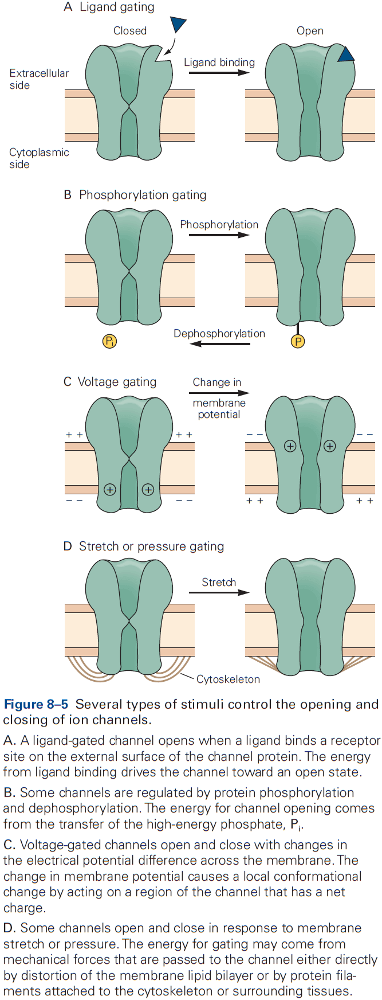
- Regulators can control the entry of a channel into one of three states
    - Resting: closed and activatable.
    - Inactive/Refractory: closed and not activatable.
    - Active: open.
- A change in the functional state of a channel requires energy.
- E.g. Changes in membrane potential, change in chemical free energy from transmitter binding, or mechanical energy from distortion of the lipid bilayer.
- Stimuli that gate the channel also control the rates of transition between the open and closed states of a channel.
- For voltage-gated channels, the rates are dependent on membrane potential. Once a channel opens, it stays open for a few milliseconds, and after closing, it stays closed for a few milliseconds.
- Once the transition between open and closed states begins, it proceeds nearly instantaneously, thus giving rise to the abrupt, all-or-none, step-like changes in current through the channel.
- Ligand-gated and voltage-gated channels enter refractory states through different mechanisms.
- Ligand-gated channels enter the refractory state with prolonged exposure to the agonist, a process called desensitization (an intrinsic property of the interaction between ligand and channel).
- Voltage-gated channels enter a refractory state after opening, a process called inactivation.
- Antagonist molecules can interfere with normal gating by binding to the same site at which the endogenous agonist normally binds, preventing the channel from opening and blocking access of the agonist to the binding site.
- Skimming over the structure of ion channels.
- The snug fit between potassium ion channels and potassium ions helps explain the unusually high selectivity of these channels compared to other ion channels.
- E.g. Many channel pore diameters are significantly wider than the principal permeating ion, contributing to a lower degree of selectivity.

**Highlights**

- Ions cross cell membranes through two main classes of membrane proteins: ion channels and ion pumps/transporters.
- Most ion channels are selectively permeable to certain ions and this is determined by the part of the channel pore called the selectivity filter. The selectivity filter filters based on ion charge, size, and physicochemical interactions.
- Ion channels have gates that open and close in response to different signals and the gates control an ion channel’s three possible states: open, closed, and inactivated.
- Various types of ion channels are differentially expressed in different types of neurons and in different regions of neurons, contributing to the functional complexity and computational power of the nervous system.
- Active transport, which is mediated by ion pumps, enables ions to move across the membrane against their electrochemical gradient. The driving force comes either from chemical energy in the form of ATP or from an electrochemical potential difference.

## Chapter 9: Membrane Potential and the Passive Electrical Properties of the Neuron

- Two types of ion channels
    - Resting
    - Gated
- Resting channels are mostly important for maintaining the resting membrane potential, the electrical potential across the membrane in the absence of signaling.
- Some resting channels are always open, while others are gated by changes in voltage but are also open at the negative resting potential.
- In contrast, most voltage-gated channels are closed when the membrane is at rest and require membrane depolarization to open.
- The resting membrane potential of neurons comes from the separation of charge across the cell membrane.
- At rest, the extracellular surface of a cell has an excess of positive charge, and the cytoplasmic/intercellular surface has an excess of negative charge. This is maintained due to the impermeable lipid bilayer.
- Membrane potential: a difference of electrical potential across the membrane.
- By convention, the potential outside the cell is defined as zero.
- The resting membrane potential is between -60 to -70 mV.
- All electrical signaling involves brief changes to the resting membrane potential caused by electric currents across the cell membrane.
- Depolarization: a decrease in charge separation leading to a more positive membrane potential.
- Hyperpolarization: an increase in charge separation leading to a more negative membrane potential.
- Electronic potentials: changes in membrane potential that don’t lead to the opening of gated ion channels.
- Hyperpolarizing responses and small depolarizations are almost always passive and don’t trigger an active response in the cell.
- However, when depolarization approaches a critical threshold, the cell responds by opening voltage-gated ion channels, which produces an all-or-none action potential (AP).
- Sodium and chloride ions are concentrated outside the cell, while potassium and organic anions are concentrated inside.
- Ions are subject to two forces driving them across the membrane
    - Chemical driving force: a function of the concentration gradient across the membrane.
    - Electrical driving force: a function of the electrical potential difference across the membrane.
- Glia are only permeable to potassium ions while neurons are permeable to potassium, sodium, and chloride ions.
- Dissipation of ionic gradients is prevented by the sodium-potassium pump, which moves sodium and potassium ions against their electrochemical gradients.
- The sodium-potassium pump expels sodium from the cell and admits potassium using ATP.
- At the resting membrane potential, the cell isn’t in equilibrium but rather in a steady state.
- Skimming over the math behind the resting potential and equivalent circuit for the resting membrane potential.
- Generally, axons with the largest diameter have the lowest threshold for excitation.
- Neurons that convey different types of information often differ in axon diameter and conduction velocity.
- The nodes of Ranvier are packed with voltage-gated sodium ion channels and periodically boost the amplitude of the AP, thus preventing it from decaying with distance.

**Highlights**

- At rest, the passive fluxes of ions into and out of cells are balanced, resulting in charge separation and the resting membrane potential.
- The ion permeability of the cell membrane is proportional to the number of open channels that allow ions to pass.
- Changes in membrane potential that generate neuronal electrical signals (action potentials, synaptic potentials, and receptor potentials) are caused by changes in the membrane’s relative permeability to potassium, chloride, sodium, and calcium ions.
- Ion pumps maintain the resting membrane potential by using ATP to exchange internal sodium ions for external potassium ions.
- For pathways where fast signaling is important, conduction of APs is enhanced by myelination of the axon, increasing axon diameter, or both.

## Chapter 10: Propagated Signaling: The Action Potential

- Neurons can carry electrical signals over long distances because the AP is continually regenerated and thus, isn’t attenuated/decayed as it moves down the axon.
- Four important properties of APs
    - Is only initiated when the membrane potential reaches a threshold.
    - Is an all-or-none event.
    - Is conducted without decay as it has a self-regenerative feature that keep the amplitude constant.
    - Is followed by a refractory period where the neuron’s ability to fire a second AP is suppressed.
- The refractory period limits the frequency that neurons can fire APs and thus limits the information-carrying capacity of the axon.
- These four properties are unusual for biological processes, which typically respond in a graded manner to changes in the environment.
- The AP is generated by the flow of ions through voltage-gated channels.

- The AP can be reconstructed from the properties of sodium and potassium channels.
- The Hodgkin and Huxley mathematical model of the AP almost perfectly matches the experimentally recorded AP.
- According to the model, an AP involves the following sequence of events
    1. Depolarization of the membrane causes sodium ion channels to open, resulting in an inward sodium current.
    2. This current depolarizes the membrane, causing more sodium channels to open resulting in the rising phase of the AP.
    3. The depolarization gradually inactivates the voltage-gated sodium channels and, with some delay, opens the voltage-gated potassium channels.

- Although each step in the model is gradual, the all-or-none phenomenon of the AP is due to the runaway effect of the voltage-gated sodium channels open due to depolarization, which causes more depolarization, which causes more channels to open, etc.
- Review of the absolute and relative refractory period.
- The squid axon that Hodgkin and Huxley studied was unusually simple in that it only expressed two types of voltage-gated ion channels in comparison to the mammalian brain’s dozens or more.
- The great variety of voltage-gated channels in the membranes of most neurons enables a neuron to fire APs with a much greater range of frequencies and patterns than is possible in the squid axon, allowing for more complex information processing and control.
- Skipping over the diversity of voltage-gated channels.
- The electrical properties of different neurons have evolved to match the dynamic needs of information processing.
- The function of a neuron isn’t only defined by its synaptic inputs and outputs, but also by its intrinsic excitability properties.
- Different types of neurons in the mammalian nervous system generate APs that have different shapes and fire different patterns, reflecting different expression of voltage-gated channels.
- E.g. Cerebellar Purkinje neurons have high levels of Kv3 channel expression resulting in narrow APs, while dopaminergic neurons have high levels of voltage-activated calcium channels resulting in broad APs.
- The shape of the AP in a neuron isn’t always invariant, and can be dynamically regulated either intrinsically (repetitive firing) or extrinsically (synaptic modulation).
- The input-output function of a neuron can be characterized by the frequency and pattern of AP firing in response to injected current and stimuli.

- Some neurons can sustain repetitive firing at high frequencies up to 500 Hz.
- E.g. Mammalian auditory neurons.
- A surprisingly large number of neurons in the mammalian brain fire spontaneously in the absence of any synaptic input.
- E.g. Many neurons that release modulatory neurotransmitters, such as dopamine, serotonin, norepinephrine, and acetylcholine, fire spontaneously, resulting in a constant release of transmitter.
- Excitability properties vary between regions of the neuron.
- E.g. The axon initial segment has the lowest threshold for AP generation, in part because it has an exceptionally high density of voltage-gated sodium channels.
- These channels play a critical role in transforming graded synaptic or receptor potentials into a train of APs.
- Dendrites in many neurons have voltage-gated ion channels to help shape the amplitude, time course, and propagation of synaptic potentials to the cell body.
- In some neurons, the density of voltage-gated channels in dendrites is enough to support local APs. This may be used when the neuron generates an AP and it propagates back into the dendrites, serving as a signal to the synaptic regions that the cell has fired.

**Highlights**

- An action potential (AP) is a transient depolarization of membrane voltage lasting about 1 ms when ions move across the cell membrane through voltage-gated channels.
- In the depolarizing phase of the AP, sodium ions leave the cell. In the repolarizing phase, potassium ions enter the cell.
- The sharp threshold for AP generation happens at a voltage when the inward sodium current just exceeds outward potassium current through leak channels and voltage-gated channels.
- The refractory period reflects sodium channel inactivation and potassium channel activation after an AP. This limits the AP firing rate.
- Most neurons express multiple kinds of voltage-gated ion channels, which reflects the expression of multiple gene products.
- Activity of some voltage-gated ion channels can be modulated by cytoplasmic calcium ions.
- The regional expression and functional state of ion channels can be regulated in response to cell activity, changes in cell environment, or pathological processes, resulting in plasticity of the intrinsic excitability of neurons.

# Part III: Synaptic Transmission

- In this part, we cover how neurons communicate with each other.
- Three components of the synapse
    - Terminals of the presynaptic axon
    - Target on the postsynaptic cell
    - Zone of apposition
- Two types of synapses
    - Electrical: when the presynaptic and postsynaptic cell are very close at regions called gap junctions and the current generated by an AP in the presynaptic neuron directly enters the postsynaptic cell.
    - Chemical: when the presynaptic and postsynaptic cell are separated by the synaptic cleft and transmitter diffuses across, binding to receptor molecules on the postsynaptic membrane.
- Two types of transmitter receptors
    - Ionotopic: when transmitter binding directly opens an ion channels..
    - Metabotropic: when transmitter binding indirectly regulates a channel by activating secondary messengers.
- Both types of receptors can result in excitation or inhibition. This doesn’t depend on the identity of the transmitter but on the properties of the receptor that the transmitter interacts with.
- One key theme of this part and this book is the concept of plasticity. At all synapses, the strength of a synaptic connection isn’t fixed but can be modified in various ways by experience.

## Chapter 11: Overview of Synaptic Transmission

- The average neuron forms thousands of synaptic connections and receives a similar number of inputs.
- E.g. Purkinje cells receive up to 100,000 synaptic inputs while granule neurons receive only four excitatory inputs.
- Electrical synapses are mostly used to send rapid depolarizing signals, while chemical synapses are used to produce more variable signaling.
- Chemical synaptic transmission is central to our understanding of the brain and behavior.

- Electrical synapses are virtually instantaneous as the postsynaptic response follows the presynaptic stimulation in a fraction of a millisecond.
- At an electrical synapse, when a weak depolarizing current is injected into the presynaptic neuron, some current enters the postsynaptic cell and depolarizes it.
- In contrast, at a chemical synapse, a depolarizing current injected into the presynaptic neuron must reach threshold for the release of transmitter to elicit a response in the postsynaptic cell.
- Most electrical synapses can transmit both depolarizing and hyperpolarizing currents.
- The gap between electrical synapses is small at around 4 nm compared to the 20 nm for the normal nonsynaptic space between neurons.
- This narrow gap is bridged by gap-junction channels, specialized protein structures that conduct ionic current directly from the presynaptic to the postsynaptic cell.
- The pore of gap-junction channels is large at 1.5 nm compared to the 0.3-0.5 nm diameter of ion-selective ligand-gated or voltage-gated channels. This means the channel doesn’t select among ions and is even wide enough to allow small organic molecules to pass through.

- Electrical transmission allows rapid and synchronous firing of interconnected cells.
- E.g. The tail-flip response in goldfish and the ink response in Aplysia.
- Gap junctions are also formed between neurons and glia.
- E.g. A wave of calcium ions in astrocytes can cause neurotransmitter release in neurons. The precise function of these waves is unknown.
- The gap between chemical synapses is wide at around 20-40 nm and is sometimes bigger than the normal nonsynaptic space between neurons.
- Chemical synaptic transmission depends on a neurotransmitter.
- Neurotransmitter: a chemical substance that diffuses across the synaptic cleft, binds to receptors, and activates receptors in the membrane of the target cell.
- The neurotransmitter is released from specialized vesicles with a typical release having around 100-200 synaptic vesicles, each with several thousand molecules of neurotransmitter.
- The release is triggered by an increase in intracellular calcium ions, which causes the vesicles to fuse with the presynaptic membrane and release neurotransmitter into the synaptic cleft. This process is called exocytosis.
- The transmitter molecules then diffuse across the synaptic cleft and bind to receptors on the postsynaptic cell.
- This activates the receptors, leading to the opening or closing of ion channels, changing the membrane potential of the postsynaptic cell.

- These several steps account for the synaptic delay (around 1 ms or less) at chemical synapses.
- What chemical transmission lacks in speed it makes up for in amplification.
- E.g. A small presynaptic nerve terminal, which only generates a weak electrical current, can depolarize a large postsynaptic cell.
- Two steps of chemical synaptic transmission
    - Transmitting: when the presynaptic cell releases a chemical messenger.
    - Receptive: when the transmitter binds to and activates the receptor molecules in the postsynaptic cell.
- The transmitting step resembles endocrine hormone release as chemical synaptic transmission can be seen as a modified form of hormone secretion.
- However, the important difference between endocrine and synaptic signaling is that endocrine signaling isn’t targeted as it travels throughout the body, whereas synaptic signaling is targeted and precise to which neurons receive the neurotransmitter.
- Thus, chemical synaptic transmission is both fast and precise.
- The action of a transmitter depends on the properties of the postsynaptic receptors that recognize and bind the transmitter, not the chemical properties of the transmitter.
- E.g. ACh at neuromuscular junctions is excitatory and can trigger contraction, while at the heart is inhibitory and can slow it down.
- Neurotransmitters control the opening of ion channels in the postsynaptic cell either directly or indirectly.
- Ionotropic: a receptor that directly controls ion flux.
- Metabotropic: a receptor that indirectly controls ion flux.
- Ionotropic and metabotropic receptors have different functions, with ionotropic producing relatively fast synaptic actions lasting only milliseconds, while metabotropic producing slower synaptic actions lasting hundreds of milliseconds to minutes.
- Electrical and chemical synapses can coexist and interact with each other in the same neuron, with each modifying the other’s efficacy.
- E.g. During development, many neurons are initially connected by electrical synapses that help form chemical synapses. As chemical synapses form, they often initiate the down-regulation of electrical transmission.
- E.g. In the retina, bipolar neurons form chemical synapses with rods and cones while also receiving electrical synapses between neighboring bipolar cells and amacrine cells.

**Highlights**

- Neurons communicate using electrical and chemical synaptic transmission.
- Electrical synapses are formed at tight regions that provide a direct pathway for charge to flow between the cytoplasm of communicating neurons. This results in fast transmission suited for synchronizing the activity of populations of neurons.
- Electrical synapses are connected through gap-junction channels.
- Chemical synapses use chemical transmitters to transmit signals from the presynaptic cell to the postsynaptic cell.
- Chemical transmission allows for amplification of the presynaptic AP through the release of tens of thousands of molecules of transmitter and activation of hundreds of thousands of receptors in the postsynaptic cell.
- The effect of a neurotransmitter is determined by the postsynaptic receptors, not the molecule.
- The two major classes of transmitter receptors are ionotropic and metabotropic.

## Chapter 12: Directly Gated Transmission: The Nerve-Muscle Synapse

- Neuromuscular junction / end-plate: the site of contact between nerve and muscle.
- Synaptic boutons: the ends of axon branches.

- When acetylcholine (ACh) is released into the end-plate, it rapidly binds to and opens the ACh receptor-channels in the end-plate membrane.
- This results in a large excitatory post-synaptic potential (EPSP) of about 75 mV.
- The combination of a very large EPSP and low threshold at the end-plate results in a high safety factor for triggering an AP in the muscle fiber.
- Muscles probably require this high safety factor as they can’t be undecided on whether to contract given a signal. Evolution pushed for high reliability in muscles.
- This contrasts with EPSPs in the CNS which are less than 1 mV, and that inputs from many presynaptic neurons are needed to generate an AP in most CNS neurons.
- The end-plate current rises and decays more rapidly than the end-plate potential because it takes times for an ionic current to charge or discharge the muscle membrane capacitance, so the membrane voltage (EPSP) lags behind the synaptic current (EPSC).
- Although individual ACh receptor-channels are noisy and undergo random thermal fluctuations, the average time a type of channel stays open is a well-defined property of that channel.
- Once a receptor-channel opens, what ions flow through the channel and how does this lead to depolarization?
- ACh receptor-channels at the end-plate aren’t selective for any ion species except for cations, so sodium, potassium, and calcium ions can flow through the channel leading to depolarization.

- Two main differences between ACh receptors (synaptic potential) and voltage-gated channels (action potential)
    - The AP is generated by sequential activation of two distinct classes of voltage-gated channels, one selective for sodium ions and the other for potassium ions.
    - The synaptic potential is only cation selective and allows both sodium and potassium ions to pass with near-equal permeability.
    - The AP regenerates itself as incoming sodium ions depolarize the membrane potential, causing more voltage-gated sodium channels to open.
    - The synaptic potential is dependent on the amount of ACh available and can’t produce an AP.
- If ACh is allowed to stay in the synaptic cleft for a long time, ACh receptors can become desensitized where they no longer conduct ions.
- Skipping over the structure of the ACh receptor-channel.

**Highlights**

- The terminals of motor neurons form synapses with muscle fibers at specialized regions in the muscle membrane called end-plates. When an AP reaches the terminal, it causes the release of ACh.
- ACh diffuses across the synaptic cleft, binding to ACh receptors and causing an inflow of cations such as sodium, potassium, and calcium.
- This inflow causes a large and local depolarization of around 75 mV, enough to exceed the AP threshold generation by a factor of three to four.
- This excessive depolarization is required to ensure that a neural signal is always converted into a muscle movement, which is essential for survival.

## Chapter 13: Synaptic Integration in the Central Nervous System

- Many principles that apply to the synaptic connection between the motor neuron and skeletal muscle fiber at the end-plate also apply in the CNS.
- However, synaptic transmission between neurons in the CNS is more complex.
- E.g. More inputs from thousands of neurons, both excitatory and inhibitory inputs, many types of neurotransmitters, and not all APs produce an AP in the postsynaptic neuron.
- Typically, a depolarization of 10 mV or more is required to push a neuron past AP threshold.
- The effect of a synaptic potential, excitatory or inhibitory, isn’t determined by the type of transmitter released but by the type of ion channels in the postsynaptic cell activated by the transmitter.
- Some transmitters can produces both EPSPs and IPSPs but most transmitters produce a single type of synaptic response.
- E.g. Glutamate is typically excitatory while GABA is typically inhibitory.
- We can determine whether a synaptic terminal is excitatory or inhibitory by it’s ultrastructure.
- Two morphological types of synapses
    - Gray type I: glutamatergic and excitatory. Have round synaptic vesicles and contact dendritic spines.
    - Gray type II: GABAergic and inhibitory. Have oval or flattened vesicles and contact dendritic shaft, cell body, or axon.

- Axon terminals are normally presynaptic and dendrites are normally postsynaptic, but any part of a neuron can be a presynaptic or postsynaptic site of chemical synapses.
- The most common types of contact are axodendritic, axosomatic, and axoaxonic.
- Excitatory synapses are typically axodendritic and occur mostly on dendritic spines.
- Inhibitory synapses are typically found on dendritic shafts, cell body, and axon initial segment.
- As a general rule, the proximity of a synapse to the axon initial segment is thought to determine its effectiveness.
- E.g. The closer the synapse is to the axon initial segment, the greater the influence on AP output than at more remote sites due to less leakage.
- Some neurons compensate for this effect by having more receptors at distant synapses than at close synapses to ensure that inputs at different locations have more equal influence.
- Most axoaxonic synapses don’t have a direct effect on the trigger zone of a neuron, but instead control the amount of transmitter released from the presynaptic terminals.
- The three receptors of glutamate are NMDA, AMPA, and kainate.
- Three major types of ionotropic receptors
    - ACh, GABA, and glycine
    - Glutamate
    - ATP

- Skipping over the detailed structure of the glutamate receptor.
- Most of the excitatory synapses in the mature nervous system have both NMDA and AMPA receptors, compared to in early development where synapses mostly have only NMDA receptor.
- The NMDA receptor is unique among ligand-gated channels because its opening depends on both membrane voltage and transmitter binding.
- This voltage dependence is caused by a mechanism that differs from that used by voltage-gated channels that generate the AP.
- In NMDA receptors, depolarization doesn’t result in conformational changes in the channel but instead removes a plug from the channel.
- The NMDA receptor acts as a molecular coincidence detector, opening during the concurrent activation of both the presynaptic and postsynaptic cells.
- Since most excitatory synapses have AMPA receptors that are capable of triggering an AP by themselves, why does the nervous system also use NMDA receptors?
- NMDA receptors are special because they can control the inflow of calcium ions that activates various calcium-dependent signaling cascades. Thus, NMDA receptor activation can translate electrical signals into biochemical ones.
- Some of these biochemical reactions lead to long-lasting changes in synaptic strength called long-term synaptic plasticity.
- A brief but high-intensity and high-frequency synaptic stimulation leads to long-term potentiation (LTP).
- Subsequent studies showed that LTP depends on an inflow of calcium ions through the NMDA receptor-channels, which open in response to the combined effect of glutamate release and strong postsynaptic depolarization.
- The rise of intracellular calcium ions in the postsynaptic cell is thought to potentiate synaptic transmission by activating biochemical cascades that trigger the insertion of additional AMPA receptors into the postsynaptic membrane.

- Interestingly, the calcium ion accumulation and biochemical activation is mostly restricted to the individual spines that are activated. So, LTP is input-specific as only the synapses activated are potentiated.
- The prolonged high-frequency presynaptic firing required to induce LTP is unlikely to happen in normal conditions, but a more realistic stimulus and more relevant form of plasticity is spike-timing-dependent plasticity (STDP).
- STDP can be induced if a single presynaptic stimulus is paired at low frequency with the triggered firing of one or more postsynaptic APs.
- In STDP, the presynaptic activity must precede postsynaptic firing.
- LTP, STDP, and related processes probably provide an important cellular mechanism for memory and learning.
- Inhibitory synapses play an essential role in the nervous system by preventing too much excitation and by regulating the firing patterns of networks of neurons.
- Most inhibitory neurons use neurotransmitters GABA and glycine.
- Inhibition is achieved by the inflow of chloride ions through GABA and glycine receptor-channels.
- Inhibitory actions counteract excitatory actions.
- The IPSP results from an increase in chloride ion conductance because the equilibrium potential of chloride ions is -70 mV compared to the cell’s resting potential of -65 mV, causing hyperpolarization.

- If the cell’s resting potential is -70 mV, then no hyperpolarization occurs but the inflow of chloride ions can help buffer against an EPSP by holding the membrane potential at -70 mV.
- The opening of chloride ion channels increases the resting conductance, making the neuron more leaky, thus depolarization during an EPSP decreases since the inflowing sodium and potassium ions leak out. This is called short-circuiting or shunting.
- Inhibition can exert powerful control over AP firing in neurons by changing the temporal patterning of neuronal spikes.

- We can think of these synaptic effects as mathematical operations.
- E.g. Inhibition as subtraction, shunting inhibition as division, excitation as addition, and excitatory input near the axon initial segment as multiplication.
- In some cells, inhibition is caused not by the inflow of chloride ions, but by the opening of potassium channels.
- The potassium ion equilibrium potential is -80 mV which is always negative to the resting potential, so opening potassium ion channels inhibits the cell.
- The net effect of synaptic inputs on a neuron depends on several factors.
- E.g. Location, size, and shape of the synapse, proximity and relative strength of other synapses, the resting potential of the cell, and the timing of excitatory and inhibitory inputs.
- Neuronal integration: the coordination of inputs in the postsynaptic cell.
- Neuronal integration reflects the task of the entire nervous system: to fire or not to fire.
- This integration happens at the axon initial segment where ions from synapses converge.
- The axon initial segment has a lower threshold for AP generation than the cell body or dendrites because it has a higher density of voltage-gated sodium ion channels.
- E.g. The initial segment only needs a depolarization of 10 mV (from -65 to -55 mV) compared to the cell body which needs a depolarization of 30 mV (from -65 to -35 mV).
- Once the initial segment discharges, the AP also depolarizes the membrane of the cell body to threshold and, at the same time, is propagated along the axon.

- Two passive membrane properties that affect neuronal integration
    - Membrane time constant helps determine the time course of the synaptic potential in the excitatory postsynaptic current (EPSC).
        - E.g. Neurons with a large membrane time constant have a greater capacity for temporal summation than neurons with small time constants.
        - The longer the time constant, the greater the chance that two consecutive inputs sum to bring the membrane potential past threshold.
        - This controls temporal summation.
    - Length constant of the cell determines the degree to which the EPSP decreases as it passively spreads from synapse to cell body to axon initial segment.
        - E.g. Neurons with a longer length constant transmit signals with little loss, while in neurons with shorter length constants, signals decay rapidly with distance.
        - This controls spatial summation.

- The mammalian CNS has relatively few types of glutamatergic pyramidal neurons in comparison to the large variety of GABAergic inhibitory interneurons.
- Even though only 20% of all neurons are inhibitory, the overall levels of inhibition and excitation tend to be nearly balanced in most brain regions.
- This means that neural circuits are mostly tuned to only respond to the most salient excitatory information.
- We’ve noticed a pattern that different types of interneurons selectively target different regions of their postsynaptic neurons.
- This selective targeting is important because the location of inhibitory inputs relative to excitatory inputs is critical in determining the effectiveness of inhibition.
- E.g. Shunting inhibition near the cell body is more effective and greater than inhibition near a dendrite. The reverse is also true in that inhibition near the cell body decays by the time it reaches dendrites.

- Classes of inhibitory neurons
    - Basket cells and chandelier cells exert strong control over neuronal output by specifically targeting the soma and axon initial segment, respectively. Paradoxically, some chandelier cells enhance neuronal firing because the chloride ion reversal potential in some axons can be positive to the threshold for AP firing.
    - Martinotti cells specifically target distal dendrites and spines.
    - Vasoactive intestinal peptide (VIP) inhibitory interneurons selectively target other interneurons and act to decrease the overall level of inhibition in a neural circuit.

- Propagation of signals in dendrites was originally thought to be purely passive, but we now know that dendrites could produce APs.
- E.g. Most dendrites have voltage-gated sodium, potassium, and calcium channels.
- One function of the voltage-gated sodium and calcium channels in dendrites is to amplify the EPSP.
- However, the number of voltage-gated sodium and calcium channels in dendrites isn’t usually sufficient to support the all-or-none regenerative propagation of an AP to the cell body.
- Rather, APs generated in dendrites are usually local events that spread to the cell body and axon initial segment.
- These same dendritic voltage-gated channels also allows APs generated at the axon initial segment to propagate backwards (backpropagate) into the dendritic tree.

- This can be thought of as an AP reverberating or echoing within a neuron.
- The function of these backpropagating APs isn’t known, but they may be used by NMDA receptor-channels, thereby contribution to synaptic plasticity and learning.
- Sometimes, NMDA receptors enable a positive feedback loop of depolarization which opens more NMDA channels that leads to a local regenerative depolarization called an NMDA spike.
- NMDA spikes are purely local and can’t propagate because they require glutamate release.
- Almost 95% of all excitatory inputs in the brain terminate on dendritic spines, not dendritic shafts.
- The function of dendritic spines isn’t completely understood, but it may compartmentalize the synapse by restricting the movement of ions using the thin spine neck.
- Another possible function is a site of synaptic integration when APs backpropagate.
- E.g. A backpropagating AP paired with presynaptic stimulation causes greater summation and this may be a biochemical coincidence detector of the near simultaneity of the input (EPSP) and output (backpropagating AP).

**Highlights**

- Glutamate is used in most excitatory synapses while GABA and glycine are used in most inhibitory synapses.
- Three major classes of ionotropic glutamate receptors: AMPA, NMDA, and kainate.
- Binding of glutamate opens a nonselective cation channel permeable to sodium and potassium ions. The NMDA receptor-channel also has a high permeability to calcium ions.
- The NMDA receptor acts as a coincidence detector as it only conducts when both glutamate is released and when the postsynaptic membrane is sufficiently depolarized to expel the magnesium ion.
- Calcium influx through the NMDA receptor during strong synaptic activation can trigger intracellular signaling cascades, leading to long-term plasticity, providing a potential mechanism for memory.
- Binding of GABA or glycine to its receptor activates a chloride ion selective channel. The chloride ion equilibrium potential is slightly negative to the resting potential, causing hyperpolarization.
- Whether a neuron fires an AP or not depends on spatial and temporal summation of the various excitatory and inhibitory inputs and is determined by the size of the resulting depolarization at the axon initial segment.
- Dendrites also have voltage-gated channels, enabling them to fire local APs and can amplify the size of the local EPSP to produce a larger depolarization at the cell body.

## Chapter 14: Modulation of Synaptic Transmission and Neuronal Excitability: Second

Messengers

- Activation of an ionotropic receptor directly opens an ion channel, while activation of an metabotropic receptor regulates the opening of ion channels indirectly through biochemical signaling pathways.
- Ionotropic receptors are fast and are the basis of all behaviors, while metabotropic receptors are slow and modulate behavior.
- Metabotropic receptors are responsible for transmitters, hormones, and growth factors.
- Two major families of metabotropic receptors
    - G protein-coupled
    - Receptor tyrosine kinases
- The cyclic AMP (cAMP) pathway is the best understood second-messenger signaling cascade initiated by G protein-coupled receptors.
- Skipping over the details of the cAMP pathway.
- The binding of transmitter to metabotropic receptors can greatly influence the electrophysiological properties of a neuron.
- E.g. Altering transmitter release by regulating either calcium ion influx or the efficacy of synaptic release.
- Since metabotropic receptors act on the resting and voltage-gated channels of a neuron, they effectively control the neuron’s resting potential, membrane resistance, length and time constants, threshold potential, action potential duration, and repetitive firing characteristics.

- Two general properties of neurotransmitters
    - Modulatory projection neurons can coordinately influence the properties of large numbers of neurons to change the state of a neural circuit or of the entire animal.
    - Neuromodulators can bias a circuit’s dynamics to expand its dynamic range or to adapt it to the behavioral needs of the animal.

**Highlights**

- Neuromodulators are substances that bind to receptors, mostly metabotropic, to change the excitability of neurons, the likelihood of transmitter release, or the functional state of receptors on postsynaptic neurons.
- When neuromodulators activate second-messenger pathways, it can influence ion channel properties and other targets.
- Given that all neurons and synapses are modulated by one or more substances, it’s remarkable that brain circuits are only rarely “overmodulated” such that they lose their function.

## Chapter 15: Transmitter Release

- The brain’s ability to learn and memorize is thought to emerge from the elementary properties of chemical synapses.
- The amount of transmitter released is a steep function of the amount of presynaptic depolarization.
- E.g. More depolarization at the presynaptic synapse leads to more neurotransmitter released.
- However, there is a limit as depolarization above an upper limit produces no further increases in the postsynaptic potential.
- Normal transmitter release occurs when both sodium and potassium ion channels are blocked, suggesting that neither ion is required for transmitter release, but are used only for depolarization.

- Two functions of calcium ions
    - A carrier of depolarizing charge during the AP.
    - A special chemical signal conveying information about changes in membrane potential to the intracellular machinery responsible for transmitter release.
- Calcium ions are used because of their low intracellular resting concentration, so that small absolute changes can lead to large relative changes, triggering various biochemical reactions.
- Calcium channels are mostly localized in presynaptic terminals at active zones.
- Active zone: sites where neurotransmitter is released and are exactly opposite of postsynaptic receptors.
- This is important because calcium ions don’t diffuse across long distances.
- One striking feature of transmitter release at all synapses is its steep and nonlinear dependence on calcium ion influx.
- E.g. A 2-fold increase in calcium ion influx can increase the amount of transmitter released by more than 16-fold.
- Synaptic delay: a lag of about 1-2 ms between the onset of the presynaptic AP and the resulting EPSP.
- The synaptic delay is due to the slow opening of calcium ion channels compared to sodium ion channels, and calcium ions don’t begin to enter the presynaptic terminal until the membrane has begun to repolarize.
- Once calcium ions enter the terminal, transmitter is rapidly released with a delay of only a few hundred microseconds.
- Thus, synaptic delay is mostly due to the time required to open calcium ion channels.
- The rapid release of transmitter suggests that the release process must already exist in a primed and ready state.
- E.g. Vesicles must already be created and filled with transmitter before release.
- The calcium ion influx is only open for a short time and is localized to the active zone, which means a concentrated local pulse of calcium ions induces a burst of transmitter release.
- The amount of calcium ions needed to trigger transmitter release is around 10-30 micromoles for a normal AP.
- The relationship between calcium ion concentration and transmitter release is highly nonlinear and is consistent with a model in which at least four or five calcium ions must bind to the calcium sensor to trigger release.

- Skipping over the several classes of calcium channels.
- Transmitter is released in discrete amounts called quanta, and each quantum of transmitter produces a postsynaptic potential of a fixed size called the quantal synaptic potential.
- The total postsynaptic potential is made up of a large number of quantal potentials, which is why EPSPs seem smoothly graded because each quantal is small relative to the total.
- The greater the calcium ion influx into the terminal, the larger the number of transmitter quanta released.
- In the absence of an AP, the rate of quantal release is low at only one quantum per second.
- In the presence of an AP, the rate of quantal release is high at about 150 quanta per millisecond.
- The mechanism behind the quantal release of transmitter is that transmitter is stored in synaptic vesicles.
- Synaptic vesicles have a diameter of around 40 nm and although most don’t contact the active zone, some are physically bound called docked vesicles.
- Active zones are generally found in precise apposition to the postsynaptic membrane patches that contain the neurotransmitter receptors.
- Presynaptic and postsynaptic specializations are functionally and morphologically attuned to each other, sometimes precisely aligned in structural “nanocolumns”.
- All known chemical synapses have demonstrated quantal transmission.
- Factors that affect transmitter release
    - Number of synapses between the presynaptic and postsynaptic cell.
        - E.g. In the CNS, most neurons only form a few synapses with any postsynaptic cell. However, in the cerebellum, a single climbing fiber forms up to 10,000 terminals on one Purkinje neuron.
    - Number of active zones in an individual synaptic terminal.
        - E.g. In the CNS, most presynaptic boutons only have one active zone where an AP usually releases, at most, a single quantum of transmitter. However, the calyx of Held contains many active zones due to the need of reliability transmitting auditory information.
    - Probability that a presynaptic AP will trigger the release of transmitter.
        - E.g. The mean probability of transmitter release from a single active zone varies widely from less than 0.1 to greater than 0.9.
- Release probability can be powerfully regulated as a function of neuronal activity.
- Synaptic reliability: the probability that an AP in a presynaptic cell leads to some measurable response in the postsynaptic cell.
- Synaptic efficacy: the mean amplitude of the synaptic response, dependent on both synaptic reliability and on the mean size of the response.
- Most neurons in the CNS have a low probability of transmitter release (aka high failure rate) and this isn’t a design defect but serves a purpose.
- Not all chemical signaling between neurons depends on the synaptic machinery described above.
- Surprisingly, about 90% of the ACh that leaves the presynaptic terminals at the neuromuscular junction does so through continuous leakage, but this is ineffective in causing an EPSP because it isn’t targeted to receptors, isn’t concentrated, and isn’t synchronous.
- Review of exocytosis and endocytosis.
- Since membrane capacitance is proportional to membrane surface area, we can measure a synapse’s capacitance to monitor exocytosis as changes in capacitance reveal the time course of exocytosis and endocytosis.
- In neurons, the change in capacitance caused by the fusion of single, small vesicles is too small to resolve, but the fusion of many vesicles can be resolved.
- When firing at high frequencies, a typical presynaptic neuron is able to maintain a high rate of transmitter release by retrieving and recycling used vesicles.
- Since nerve terminals are usually far from the cell body, replenishing vesicles by synthesis in the cell body and transport to the terminals would be too slow to be practical at fast synapses. So synaptic recycling must happen at the synaptic terminal.
- Synaptic vesicles are released and reused in a simple cycle.

- Vesicle cycle
    - Vesicles fill with neurotransmitter and cluster in the nerve terminal.
    - They dock at the active zone where they undergo a complex priming process that makes vesicles respond to the calcium ion signal that triggers the fusion process.
    - Numerous mechanisms exist for retrieving the synaptic vesicle membrane.
        - E.g. Reversibly opening and close the fusion pore, without the full fusion of the vesicle membrane with the synapse membrane. Kiss-and-stay pathway where the vesicle remains at the active zone after the fusion pore closes, ready for a second release.
- Skipping over the protein mechanism behind synaptic vesicles.
- Synaptic plasticity: modulating the effectiveness of chemical synapses for seconds, hours, days, or longer.
- Synaptic strength can be modified presynaptically, by altering the release of neurotransmitter, or postsynaptically, by modulating the response to neurotransmitter, or both.
- We focus on how synaptic strength can be changed by modulating the amount of transmitter released.
- Changes in transmitter release can be controlled by two different mechanisms
    - Changes in calcium ion influx
    - Changes in the amount of transmitter released in response to a given calcium ion concentration
- Both types of mechanisms contribute to different forms of plasticity.
- Synaptic strength is often altered by the pattern of activity of the presynaptic neuron.
- Synaptic depression: a decrease in the size of the postsynaptic response to repeated stimulation.
- Synaptic facilitation/potentiation: an increase in transmission with repeated stimulation.
- Whether a synapse facilitates or depresses is often determined by the probability of release in response to the first AP of a spike train.
- E.g. Synapses with a initial high probability of release undergo depression because the high rate of release transiently depletes docked vesicles at the active zone.
- E.g. Synapses with an initial low probability of release undergo facilitation, in part because the buildup of intracellular calcium during the train increases the probability of release.
- Longer spike trains increase the time that voltage-gated calcium ion channels stay open, which leads to enhanced entry of calcium ions and a subsequent increase in transmitter release, resulting in a larger postsynaptic potential.
- Synaptic depression may contribute to sensory adaptation during repeated stimulation.
- E.g. The time course of sensory adaptation parallels the attenuation of cortical spiking to repeated stimulation and the synaptic depression of EPSPs.
- We find the simplest kind of cellular memory in the form of residual free calcium ions in synaptic terminals after a rapid burst of spikes.
- Residual free calcium is thought to increase the priming of synaptic vesicles after stimulation, resulting in a form of short-term memory.
- Postsynaptic inhibition: decreasing the likelihood that the postsynaptic cell will fire by hyperpolarizing the cell body or dendrites.
- Presynaptic inhibition: reducing the amount of transmitter released to the postsynaptic cell by forming synapses on the axon terminal of another cell and hyperpolarizing it.
- Presynaptic facilitation: increasing the amount of transmitter released by forming synapses on the axon terminal of another cell and depolarizing it.

- Presynaptic terminals are endowed with a variety of mechanisms that allow for the fine-tuning of synaptic transmission strength.
- Although we know a fair amount about the mechanisms of short-term changes in synaptic strength, the mechanisms of long-term changes remain mysterious.
- We suspect that long-term changes require alterations in gene expression, growth of presynaptic and postsynaptic structures, altering calcium ion influx, and enhancement of transmitter release from existing terminals.

**Highlights**

- Chemical neurotransmission is the primary communication mechanism used by neurons throughout the nervous system.
- Neurotransmitter release is heavily dependent on the depolarization of the presynaptic terminal. It’s the depolarization itself, and not the voltage-gated sodium or potassium channels, that trigger release.
- Depolarization of the presynaptic terminal opens voltage-gated calcium ion channels (VGCCs) that cause calcium to flow in (influx). These channels are concentrated along presynaptic ”active zones” which are very close to the sites at which release occurs.
- The relationship between calcium ion influx and neurotransmitter release is tightly coupled and steeply nonlinear. The peak calcium ion influx lags behind the peak of the AP due to the slow opening of VGCCs.
- Chemical transmission generally involves the release of quantal packets of neurotransmitter, with a quantum/unit corresponding to the contents of a single synaptic vesicle.
- The amplitude of a postsynaptic potential can be described as a product of multiple factors
    - Number of presynaptic sites occupied by a readily releasable vesicle.
    - Release probability of individual sites.
    - Size of the postsynaptic response to the release of a single vesicle.
- The number of vesicles released can be described by a binomial distribution.
- Vesicles release their transmitter by fusing with the presynaptic membrane, dumping their contents into the synaptic cleft in a process called exocytosis.
- Synaptic vesicle exocytosis is very precise and rapid due to the machinery being primed.
- Vesicles are recycled by a process called endocytosis.
- Rapid endocytosis of vesicle membranes after release enables fast recycling of vesicles for a continuous supply during prolonged stimulation.
- Transmitter release can be modulated as an aspect of synaptic plasticity.
- Synaptic strength can be strongly influenced by the pattern of firing in phenomena known as “depression” and “facilitation”, and by the regulation of calcium ion channels.

## Chapter 16: Neurotransmitters

- Four steps of chemical synaptic transmission
    1. Synthesis and storage of the transmitter.
    2. Release of the transmitter.
    3. Interaction of the transmitter with receptors at the postsynaptic membrane.
    4. Removal of the transmitter from the synapse.
- This chapter covers the first and last steps of chemical synaptic transmission.
- The competing identification of the adrenaline/epinephrine molecule lead to it having many different names.
- Neurotransmitter: a substance that’s released by a neuron that affects a specific target in a specific manner.
- As with many other operational concepts in biology, the concept of a neurotransmitter isn’t precise.
- Although hormones and neurotransmitters are similar, neurotransmitter usually act on targets close to the site of transmitter release, whereas hormones are released into the bloodstream to act on distant targets.
- At many synapses, transmitters activate not only postsynaptic receptors, but also autoreceptors at the presynaptic release site.
- Autoreceptors: modulate synaptic transmission that’s in progress using a feedback loop.
- E.g. Limiting further release of transmitter or inhibiting subsequent transmitter synthesis.
- The duration of interaction between neurotransmitters and receptors is short; on the order of less than a millisecond to several seconds.
- While the interaction is brief, it can result in long-term changes within the target cell often by activating gene transcription.
- Four criteria of a classic neurotransmitter
    1. Synthesized in the presynaptic neuron.
    2. Accumulated within vesicles in presynaptic release sites and is released by exocytosis in amounts sufficient to exert a defined action on the postsynaptic neuron or cell.
    3. When given exogenously (outside the cell) in reasonable concentrations, it mimics that action of the endogenous (inside the cell) transmitter.
    4. A specific mechanism exists for removing the substance from the extracellular environment.
- Two main classes of chemical substances that fit these criteria
    - Small-molecular transmitters
        - E.g. ACh, glutamate, GABA, glycine, ATP.
    - Neuropeptides: short polymers of amino acids.
- Acetylcholine (ACh) is the only low-molecular-weight aminergic transmitter substance that’s not an amino acid or derived directly from one.
- ACh is released at all vertebrate neuromuscular junctions by spinal motor neurons.
- Biogenic amine transmitters
    - Catecholamines
        - E.g. Dopamine, norepinephrine, and epinephrine.
        - Norepinephrine is the only transmitter synthesized within vesicles.
        - In many cases, neurons that release norepinephrine can also release its precursor dopamine, and thus can act at neurons expressing receptors for either.
        - Only a small number of neurons in the brain use epinephrine as a transmitter.
        - Norepinephrine is far more active during the awake state than sleep or anesthesia.
        - If presynaptic activity is sufficiently prolonged, such as during stress, other changes in the production of norepinephrine will occur.
        - Severe stress to an animal results in intense presynaptic activity and persistent firing of the postsynaptic adrenergic neuron, placing a greater demand on transmitter synthesis.
        - The synthesis of biogenic amines is highly regulated and can be rapidly increased, which can keep up with wide variations in neuronal activity.
    - Serotonin
    - Histamine
- Amino acid transmitters
    - In contrast to ACh and the biogenic amines, which aren’t intermediates in general metabolic pathways and are only produced in certain neurons, the amino acids glutamate and glycine aren’t only neurotransmitters, but are also universal cellular constituents.
    - Glutamate, the most common excitatory neurotransmitter, is taken up from the synaptic cleft by specific transporters in the membrane of both neurons and glia.
    - Glycine is one of the major inhibitory neurotransmitter in the spinal cord.
    - GABA, another major inhibitory neurotransmitter, is synthesized from glutamate.
    - GABA and glycine are loaded into synaptic vesicles by the same transporter and thus, can be co-released from the same vesicles.
- ATP and adenosine
    - Caffeine’s stimulatory effects depend on the inhibiting adenosine binding to receptors.
    - With tissue damage, ATP is released into the general area and activates nociceptors on peripheral axons, causing the sensation of pain.
- The presence of a substance in a neuron isn’t sufficient evidence that the substance is used as a transmitter.
- E.g. Neurotransmitter glutamate is different from metabolic glutamate in that transmitter glutamate is compartmentalized in synaptic vesicles.
- The uptake of transmitter into vesicles is energy-dependent as it works against the concentration gradient and can concentrate some neurotransmitters up to 100,000-fold relative to their concentration in the cytoplasm.
- Uptake of transmitters by transporters is fast, enabling vesicles to be quickly refilled after they release their transmitter and are retrieved by endocytosis.
- This is important for maintaining the supply of releasable vesicles during periods of rapid nerve firing.

- Drugs that are sufficiently similar to normal transmitters can act as false transmitters.
- These false transmitters are packaged into vesicles and released by exocytosis but they often bind only weakly or not at all to the postsynaptic receptor, thus their release decreases the efficacy of transmission.
- E.g. Several drugs used to treat hypertension are taken up into adrenergic synapses but when released, they fail to stimulate postsynaptic adrenergic receptors, thereby relaxing vascular smooth muscle by inhibiting adrenergic tone.
- An unexpected finding is that dopamine can be released from dendrites despite lacking synaptic vesicles.
- Small-molecule transmitter substances can be formed in all parts of the neuron, but most importantly they can be synthesized at the axonal presynaptic site where they’re released.
- In contrast, neuroactive peptides are formed in the cell body and are transported to the axonal presynaptic site.
- Skipping over the neuroactive peptide neurotransmitters.
- No uptake mechanism exists for neuropeptides and once a peptide is released, a new supply must arrive from the cell body.
- In some neurons, there’s a corelease of small-molecule and peptide transmitters that often work synergistically.
- E.g. ACh and vasoactive intestinal peptide, ACh and calcitonin gene-related peptide, glutamate and dynorphin.
- Dense-core vesicles that release peptides differ from small-clear vesicles that release only small-molecule transmitters.
- The peptide-containing vesicles may or may not contain small-molecule transmitter, but both types of vesicles contain ATP.
- Corelease of ATP is an important case that coexistence and corelease don’t necessarily signify co-transmission, as ATP may be released simultaneously, but independent of transmitter release or that ATP is released alone.
- An interesting example of corelease of two small-molecule transmitters is that of glutamate and dopamine by neurons projecting to the ventral striatum, cortex, and elsewhere.
- Removal of transmitter from the synaptic cleft terminates synaptic transmission.
- The duration of removal is important because if transmitter molecules released from one synaptic action were allowed to remain in the cleft, this would prevent new signals from going through and the synapse would ultimately become refractory due to receptor desensitization.
- Three mechanisms to remove transmitter substances
    - Diffusion
        - E.g. Most in brain regions with low innervation.
    - Enzymatic degradation
        - E.g. ACh at the neuromuscular junction.
    - Reuptake
        - E.g. Small-molecular transmitters.
- Neuropeptides are removed relatively slowly from the synaptic cleft by slow diffusion and proteolysis, which is in contrast to small-molecular transmitters that are removed more quickly.
- The critical mechanism for inactivation of most small molecular neurotransmitters is reuptake at the plasma membrane.
- Reuptake serves two purposes: terminating the synaptic action of the transmitter and recapturing the transmitter molecules for reuse.
- Each type of neuron has its own characteristic uptake mechanism.
- E.g. Cocaine blocks the uptake of dopamine, norepinephrine, and serotonin.
- Drugs that block transporters and reuptake can prolong and enhance synaptic signaling at the cost of desensitization.

**Highlights**

- One way information is carried between neurons is by chemical messages that cross the synaptic cleft.
- The two major classes of chemical messengers are: small-molecule transmitters and neuroactive peptides.
- To prevent depletion of small-molecule transmitters during rapid synaptic transmission, most are synthesized locally at presynaptic terminals.
- Protein precursors of neuroactive peptides are synthesized only in the cell body and are carried to the terminals by axoplasmic transport. Unlike the vesicles that contain small-molecule transmitters, these vesicles aren’t refilled at the terminal.
- Precise mechanisms for terminating transmitter actions represent a key step in synaptic transmission that’s as important as transmitter synthesis and release.
- Some transmitter actions are terminated by simple diffusion, but most are terminated by specific molecular reactions.
- Not all molecules released by a neuron are chemical messages, only those that bind to appropriate receptors and initiate functional changes in the target neuron are considered neurotransmitters.
- Information is transmitted when transmitter molecules bind to receptor proteins, causing them to change conformation, leading to either increased or decreased membrane potential.
- The corelease of several neuroactive substances allows for great diversity of information to be transferred in a single synaptic action.

# Part IV: Perception

- The fundamental nature of perceptual experience is that it’s a construct that we alone impose.
- All of our receptive systems serve as filters, characterized by neural receptive fields that highlight certain forms of information and restrict others.
- These selective filters are tunable over different timescales, enhancing attention to salient stimuli and adapting to the statistics of the sensory world.
- The constructive transition from a world of sensory evidence to one of meaning lies at the heart of perception and has long been one of the most engaging mysteries of human cognition.
- Perceptual experience of the world around us is a prerequisite for meaningful interaction with the world.
- Decisions are based on the accumulation of sensory evidence in support of one percept versus another.

## Chapter 17: Sensory Coding

- Through sensation, we form an immediate and relevant picture of the world around us and our place within it.
- Sensation provides immediate answers to three ongoing and essential questions
    - Is something there?
    - What is it?
    - What has changed?
- To answer these questions, all sensory systems perform three fundamental functions
    - Detection
    - Discrimination
    - Adaptation
- This chapter covers the organizational principles and coding mechanisms that are universal to all sensory systems.
- Sensory information: neural activity originating from stimulation of receptor cells in specific parts of the body.
- Our sensory modalities
    - Five classic ones (vision, hearing, touch, taste, smell)
    - Somatic (pain, temperature, proprioception, internal organs)
    - Vestibular (balance, head position, acceleration)
- Specialized receptors in each sensory system provide the first neural representation of the external and internal world, transforming a specific type of stimulus into electrical signals.

- All sensory information is then transmitted to the CNS by the common currency or language of action potentials (APs).
- This information flows through regions of the brain, changing its representation as it travels.
- Sensory pathways are also controlled by higher centers in the brain that modify and regulate incoming sensory signals by feeding information back to earlier stages of processing.
- So, perception isn’t just the “raw” physical sensory information but also cognition and experience.
- To what extent do the sensations we experience accurate reflect the stimuli that produce them?
- Psychophysics: studies the relationship between the physical characteristics of a stimulus and attributes of the sensory experience.
- Sensory physiology: studies the neural consequences of a stimulus.
- All sensory systems have a threshold, a limit to their ability to detect whether a stimulus occurred or not.
- Two functions of thresholds
    - They prevent sensations that aren’t of interest or relevant from being detected, reducing noise.
    - The specific nonlinearity introduced by thresholds aids encoding and processing.
- Sensory thresholds are a feature, not a bug.
- Psychometric function: the percentage of times the subject reports detecting the stimulus as a function of stimulus amplitude.
- By convention, the threshold is defined as the stimulus amplitude detected in half of the trials.
- Stimuli are represented in the nervous system by the firing patterns of neurons.
- Combining psychophysical measurements with neurophysiological techniques allows us to study the neural mechanisms that transform sensory neural signals into percepts.
- The neural coding of sensory information is better understood at the early stages of processing than at later stages in the brain.
- This approach to the neural coding problem, of how stimuli are translated into APs, was pioneered by Mountcastle, who showed that single-cell recordings of spike trains from PNS and CNS sensory neurons provide a statistical description of the neural activity evoked by a physical stimulus.
- The study of neural coding of information is fundamental to understanding how the brain works.
- Neural code: describes the relationship between the activity of a specified neural population and its functional consequences.
- It’s often said that the power of the brain lies in the millions of neurons that process information in parallel.
- This, however, doesn’t capture the essential difference between the brain and all of the other bodily organs.
- E.g. In the kidney or muscle, most cells do similar things so if we understand one muscle cell, we understand how whole muscles work. However, in the brain, understanding one neuron isn’t enough to generalize to the entire brain as cells in the brain do something different.
- To understand the brain, we need to understand how its tasks are organized into networks of neurons.
- Two features distinguishing sensory systems
    - Different driving stimulus energies.
        - E.g. Light vs sound.
    - Discrete pathways compose each system.
        - E.g. Eyes vs ears.
- Each neuron in a network performs a specific task, and the train of APs it produces has a specific functional significance for all postsynaptic neurons in that pathway.
- Our sensory experience differs from the physical properties of stimuli because the nervous system extracts certain features while ignoring others.
- E.g. We receive electromagnetic waves of different wavelengths, but we see them as colors. We receive pressure waves of different frequencies, but we hear them as tones. We receive chemical compounds floating in the air but we experience them as odors and tastes.
- Colors, tones, odors, and tastes are mental constructs of the brain that don’t exist outside of the brain, but are linked to specific physical properties of stimuli.
- The richness of sensory experience begins with the highly diversified set of sensory receptors.
- Each receptor responds optimally to a specific kind of energy at a specific location and sometimes, only to energies with a particular temporal or spatial pattern.
- The receptor transforms the stimulus energy into electrical energy, so all sensory systems use a common signaling mechanism.
- Receptor potential: the amplitude and duration of the electrical signal generated by the sensory receptor.
- Stimulus transduction: the process of converting a specific stimulus energy into an electrical signal.
- The arrangement of receptors in a sense organ allows for further specialization of function within each sensory system.
- E.g. The concentration of cones in the fovea of the eye or the frequency map in the cochlea.
- Four types of mammalian sensory receptors
    - Mechanoreceptor
        - E.g. Skin deformation, motion, stretch, vibration, muscle length, velocity, force, joint angle, hearing, pain.
    - Chemoreceptor
        - E.g. Olfaction, gustation, itch, pain, visceral sensation.
    - Photoreceptor
    - Thermoreceptor

- Each major sensory system has several submodalities.
- E.g. Taste can be sweet, sour, salty, savory, or bitter. Vision has color, shape, pattern. Touch has temperature, texture, firmness. Sound has pitch, loudness, rhythm.
- Some submodalities are due to discrete subclasses of receptors while others are derived by combining information from different receptor types.
- Each receptor behaves as a filter for a narrow range or bandwidth of energy, or we say that the receptor is tuned to an optimal/best/preferred stimulus that evokes the strongest neural response.
- Tuning curve: plotting a receptor’s response as a function of changes in stimulus feature.
- Tuning curves show the range of sensitivity of the receptor, including its preferred stimulus.
- E.g. Blue cone cells in the retina are most sensitive to light between 430-440 nm, but they still respond to light outside of their preferred wavelength.
- A photoreceptor’s graded amplitude response encodes specific wavelengths, but also the intensity of light.
- E.g. A green cone responds similarly to bright orange as to dim green. How are these distinguished by the nervous system?
- Stronger stimuli activate more photoreceptors and the resulting population code of multiple receptors, combined with receptors of different wavelength preferences, distinguishes brightness/intensity from color/hue.
- Thus, neural ensembles enable individual visual neurons to multiplex signals of color and brightness in the same pathway.
- The tuning curve of a photoreceptor is roughly symmetric about its preferred wavelength.
- E.g. Red cones respond similarly to light of 520 and 600 nm. How are these distinguished by the nervous system?
- The answer, again, lies with multiple receptors as green cones respond very strongly to 520 nm (close to preferred wavelength) but weakly to 600 nm light, and blue cones respond very weakly to 520 nm but don’t respond to 600 nm light.
- So, 520 nm light is perceived as green, while 600 nm light is perceived as orange.
- By varying the combinations of photoreceptors, we’re able to perceive a spectrum of colors. The same goes for every other sensory receptor.
- Changes in the relative activation of each cone type accounts for the perception of color.

- The existence of submodalities points to an important principle of sensory coding: that the range of stimulus energies is deconstructed into smaller, simpler components whose intensity is monitored over time by specialized receptors that transmit information in parallel to the brain.
- The brain eventually integrates these diverse components of the stimulus to convey an integrated representation of the sensory event.
- The current challenge is to understand how sensory information is distributed across populations of neurons.
- Because the sense organs are located far away from the CNS, passive propagation of receptor potentials wouldn’t reach the CNS and thus not transmit their signal.
- To communicate sensory information to the brain, a second step of neural coding must transform the receptor potential into a sequence of APs since APs can travel far.
- The analog signal of stimulus magnitude in the receptor potential is transformed into a digital pulse code where the frequency of APs is proportional to the intensity of the stimulus.
- Thus, we say that the spike train encodes stimulus information.

- Rate coding: when stronger stimuli evoke larger receptor potentials that generate more APs (higher frequency).
- Population coding: when a stimulus is represented by all active neurons in the receptor population.
- Most sensory systems have low- and high-threshold receptors, enabling us to perceive over a greater dynamic range.
- E.g. Rods are low-threshold receptors and cones are high-threshold receptors.
- The firing rates of each neuron in a population can be plotted in a coordinate system with multiple axes such as modality, location, intensity, and time.
- The possibilities for information coding through temporal patterning within and between neurons in a population are enormous.
- The instantaneous firing patterns of sensory neurons are as important to sensory perception as the total number of spikes fired over time.
- E.g. Steady rhythmic firing in hand nerves is perceived as steady pressure or vibration depending on which touch receptors and pathways are activated. Bursting patterns may be perceived as motion.
- The patterning of spike trains plays an important role in encoding changes (temporal fluctuations) of the stimulus.
- Humans can report changes in sensory experience that match changes in the firing pattern of sensory neurons within a few milliseconds.
- Another important principle of sensory systems is that they detect contrast, changes in the temporal and spatial patterns of stimulation.
- Receptor adaptation: if a stimulus persists unchanged, the neural response and corresponding sensation diminishes.
- Receptor adaptation is thought to be an important neural basis for perceptual adaptation, when a constant stimulus fades from consciousness.
- Slowly adapting receptors: receptors that encode stimulus duration by generating APs throughout the period of stimulation.
- Rapidly adapting receptors: receptors that only respond at the beginning and end of a stimulus; they cease firing in response to constant amplitude stimulation and only respond to changes.
- Slowly and rapidly adapting receptors illustrate another important principle of sensory coding: neurons signal important properties of stimuli not only when they fire, but also when they slow or stop firing.
- The temporal properties of a changing stimulus are encoded as changes in the firing pattern.
- Interspike interval: time between spikes.

- The receptive fields of sensory neurons provide spatial information about stimulus location.
- The position of a sensory neuron’s input terminals in the sense organ is a major component of the specific information conveyed by that neuron.
- Receptive field: the physical location that activates a sensory neuron.
- Perceptive field: the region that a sensation is perceived to have come from.
- The receptive and perceptive field usually coincide.
- The size of the stimulus determines the total number of receptors that are activated, so the spatial distribution of active and silent receptors provides a neural image of the size and edges of the stimulus.
- The spatial resolution of a sensory system depends on the total number of receptor neurons and the distribution of receptive field across the area.
- E.g. Hands have more receptor neurons than arms, so we can discriminate more using our hands. The fovea of the retina has more receptor neurons than the surrounding.

- Synapses in sensory pathways provide an opportunity to modify the signal from receptors.
- The responses of CNS neurons to sensory stimuli are more variable from trial to trial than those of peripheral receptors.
- The axons of sensory projection neurons terminate in the brain in an organized manner that maintains their spatial arrangement.
- E.g. Sensory neurons for touch in adjacent regions of the skin project to adjacent neurons in the CNS, and this topographic arrangement of receptive fields is preserved throughout the early somatosensory pathways.
- Thus, each primary sensory area in the brain contains a topographic, spatially organized map of the sense organ. This topography extends to all levels of a sensory system.
- E.g. Somatotopic for somatosensory, retinotopic for visual, and tonotopic for auditory.
- Neurons in the cerebral cortex are specialized to integrate and detect specific features of stimuli beyond their location in the sense organ.
- E.g. Simultaneous activation of specific groups of receptors, direction of motion, or tonal sequences of frequencies (temporal pattern of receptor activation).
- In each successive stage of cortical processing, the spatial organization of stimuli is progressively lost as neurons become less concerned with the descriptive features of stimuli and more concerned with properties of behavioral importance.
- Sensory information is processed in parallel pathways in the cerebral cortex.

- Review of the what/ventral and where/dorsal visual pathways.
- Neural recordings confirm that neurons change their sensitivity, as reflected in their firing rates, much more so than their selectivity for particular stimuli.
- What we perceive is always some combination of the sensory stimulus itself and the memories it both evokes and builds upon.
- Association is a powerful mechanism and much of learning consists of making associations through repetition and retrieval.
- E.g. If we listen to a song over and over again, the circuits of our auditory system are modified by the experience and we learn to anticipate what comes next, completing the phrase before it occurs.
- How does the brain “recognize” a specific pattern of inputs from a population of presynaptic neurons?
- One potential mechanism is called template matching where neurons fire if the arriving APs approximately fit the neuron’s pattern of synaptic connections.

**Highlights**

- Sensations comes from the interaction between an external stimulus and the billions of sensory receptors that innervate every organ of the body.
- All sensory systems respond to four elementary features of stimuli: modality, location, intensity, and duration. This is first captured by the receptor potential and then converted into sequences of APs.
- The intensity and duration of stimulation are represented by the amplitude and time course of the receptor potential, and by the total number of receptors activated. The intensity is coded as the frequency of firing, and the duration is encoded by the dynamics of the spike train.
- The modality and location of stimulation are represented by each receptor’s receptive field and the pathway. The identity of the active sensory neuron signals not only the modality of a stimulus, but also the place where it occurs.
- Sensory information is processed in parallel in the CNS and to maintain the specificity of each modality within the nervous system, receptor axons are segregated into discrete anatomical pathways that terminate in unimodal nuclei. Processing isn’t strictly hierarchical due to feedback.
- Sensory information is processed in serial in the CNS and goes through stages from the spinal cord, brain stem, thalamus, and cerebral cortex.
- Throughout processing, sensory information maintains its topographical map such that receptors that are physically close in the sensory organ project information to physically close neurons in the brain.

## Chapter 18: Receptors of the Somatosensory System

- Somatosensory system: the system that transmits information coded by receptors distributed throughout the body.
- Three major functions of the somatosensory system
    - Proprioception: sense of oneself.
        - E.g. Awareness of the posture and movement of our own body, particularly the four limbs and the head.
    - Exteroception: sense of interaction with the external world.
        - E.g. Touch, pressure, stroking, motion, vibration, heat, cold, pain (nociception).
    - Interoception: sense of the function of the major organ systems of the body and its internal state.
        - E.g. Cardiovascular, respiratory, digestive, and renal systems. Monitors blood gases and pH, tissue stretching such as bladder and digestive tracts.
- All of the somatic senses are mediated by one class of sensory neurons, the dorsal root ganglion (DRG) neurons.
- DRG neurons are a type of bipolar cell called pseudo-unipolar cells that have a axon with two branches, one projecting to the periphery and one projecting to the CNS.
- This axon is called the primary afferent fiber since it serves as a single transmission line.
- Dermatome: the region of body innervated by these sensory endings.
- Bundles of primary afferent fibers form the peripheral nerves.
- Damage to peripheral nerves or their targets in the brain may produce sensory deficits in more than one somatosensory submodality or motor deficits.
- Five functional zones of a DRG neuron
    - Receptive zone
    - Spike generation site
    - Peripheral nerve fiber
    - Cell body
    - Spinal or cranial nerve

- Stimuli of sufficient strength produce APs that are transmitted along the peripheral nerve fiber, through the cell body, and into the spinal cord.
- Four groups of muscle nerves
    - Group I: axons in muscle nerves innervate muscle spindle receptors and Golgi tendon organs, signaling muscle length and contractile force.
    - Group II: innervate secondary spindle endings and receptors in joint capsules, signaling proprioception.
    - Group III: the smallest myelinated muscle afferents.
    - Group IV: unmyelinated afferents that signal trauma or injuries in muscles and joints.

- Electrical stimuli of increasing strength evoke APs in different groups, with APs first evoked in the largest axons because of their lower electrical resistance.
- As more and different group fibers are recruited, the signal has bumps, reflecting different group of fibers being activated.

- These differences in fiber diameter and conduction velocity of peripheral nerves allow signals of touch and proprioception to reach the spinal cord earlier than noxious or thermal signals.
- Mechanoreceptor: a receptor that’s sensitive to physical deformation of the surrounding tissue.
- E.g. Pressure, stretch, suction.
- Mechanical stimulation deforms the receptor protein, opening stretch-sensitive ion channels and depolarizing the receptor neuron.
- Merkel cell: sensory epithelial cells that form close contacts with the terminals of large-diameter sensory nerve axons at the epidermal-dermal junction.
- Merkel cells serve a similar receptive function in the sense of touch as auditory hair cells in the cochlea and taste cells in the tongue.
- Experiments indicate that Merkel cells are responsible for the sustained response to static touch.
- Hairs on the surface of the skin provide another important set of touch-end organs.
- Humans can perceive motion of individual hairs and can localize the sensation to the base of the hair.
- The innervation pattern of hair follicles in the skin follows the two principles of convergence and divergence.
- E.g. Each hair follicle in the skin provides input to multiple sensory afferent fibers. This overlap provides redundancy of sensory input from a small patch of skin.
- The muscle spindle is the principal receptor for proprioception.

- Experiments on fatigued or partially paralyzed muscles show that perceived muscle force is mainly related to centrally generated effort rather than actual muscle force.
- Joint receptors play little, if any, role in postural sensation of joint angles. Instead, perception of the angle of joints depends on afferent signals from muscle spindle receptors and efferent motor commands.
- Humans recognize four distinct types of thermal sensation: cold, cool, warm, and hot. These result from differences between the normal skin temperature and the external temperature.
- Temperature sense, like pain and itch, is mediated by a combinatorial code of multiple receptor types transmitted by small-diameter afferent fibers.
- Although we’re exquisitely sensitive to sudden changes in skin temperature, we’re normally unaware of the wide swings in skin temperature that occur as our blood vessel expand or contract to discharge or conserve body heat.
- Thermal stimuli activate specific classes of transient receptor potential (TRP) channels in neurons. There are at least six known TRP receptors that have been identified and the thermal sensitivity of a neuron is determined by the specific TRP receptors expressed in its nerve terminals.
- Two classes of TRP receptors are activated by cold temperature and inactivated by warming
    - TRPM8: respond to temperatures below 25$$\degree$$C and perceived as cool or cold.
    - TRPA1: respond to temperatures below 17$$\degree$$C and perceived as cold or frigid.
- Cold receptors are about 100 times more sensitive to sudden drops in skin temperature than to gradual changes. This extreme sensitivity to change allows us to detect weak winds.
- Four classes of TRP receptors are activated by hot temperature and inactivated by cooling
    - TRPV3: respond to temperatures above 35$$\degree$$C and perceived as warm to hot.
    - TRPV1 and TRPV2: respond to temperatures above 45$$\degree$$C and perceived as burning pain.
    - TRPV4: respond to temperatures above 27$$\degree$$C and signal normal skin temperatures.
- Unlike cold receptors, warm receptors act more like simple thermometers since their firing rates increases with increasing skin temperature.
- Warm receptors are less sensitive to rapid changes in skin temperature than cold receptors, resulting in humans being less responsive to warming than cooling.
- We can detect sudden skin warming at a threshold of 0.1$$\degree$$C.
- Various substances such as capsaicin and menthol produce burning or cooling sensations when applied to the skin because they bind to various TRP receptors, thus we perceive it as burning or cooling.
- Nociceptors (pain receptors) respond directly to mechanical and thermal stimuli, and indirectly to other stimuli by means of chemicals released from cells in the traumatized tissue.
- Two classes of nociceptors
    - Mechanical (high-threshold mechanoreceptors): respond to stimuli that puncture, squeeze, or pinch the skin and perceived as sharp and pricking.
    - Polymodal: respond to a variety of noxious mechanical, thermal, and chemical stimuli and perceived as dull burning pain.
- Itch is a distinctive cutaneous sensation and is mediated by both TRPV1 and TRPA1 receptors.
- How can TRPA1 receptors mediate both itch and noxious cold temperatures? Same goes for TRPV1.
- The answer lies in the use of combinatorial codes by small-diameter sensory nerve fibers.
- E.g. Noxious cold is sensed when both TRPA1 and TRPM8 receptors are excited, but itch is perceived when TRPM8 receptors are silent.
- E.g. Noxious heat is sensed when TRPV1, TRPV2, and TRPV3 expressing fibers are co-activated, but itch is perceived when only TRPV1 fibers respond.
- Similar combinatorial codes using multiple receptors are commonly used by other chemical senses such as olfaction and taste.
- Visceral sensations represent the status of internal organs for behaviors like respiration, eating, drinking, and reproduction.
- The sensory terminal regions of peripheral nerve fibers are usually unmyelinated and don’t express the voltage-gated sodium and potassium ion channels that underlie AP generation.
- This design optimizes information gathering in the receptive field by dedicating the highly branched terminal membrane area to sensory transduction channels.
- Ensemble recording techniques show that even at the receptor level, there are no canonical/standard responses to somatic stimuli, but rather common patterns of responses.
- Furthermore, individual somatosensory neurons appear to be polysensory, responding to more than one modality such as both touch and pain.
- Recording neurons simultaneously rather than one at a time is essential for decoding population activity and defining the circuits underlying diverse sensory modalities.
- We note that neurons in the dorsal root, trigeminal, and vagal ganglia don’t appear to be spatially clustered or segregated functionally by modality such as by mechanosensation, thermal, or chemical.
- The principle organization feature of these sensory ganglia is that body topography is maintained throughout the sensory pathway. Which specific area of skin or which muscle is innervated by particular sensory neurons extends to higher structures in the brain that analyze the sensory information that organize specific behaviors.
- The medial division of the spinal cord transmits proprioceptive and tactile information from the innervated body region, while the lateral division transmits noxious, thermal, pruritic, and visceral information.
- The distribution of spinal nerves in the body forms the anatomical basis of the topographical maps of sensory receptors in the brain that underlie our ability to localize specific sensations.
- Skipping over the 10 laminae/layers of the spinal gray matter.

**Highlights**

- The most important principle of somatosensory organization is specificity: each of the bodily senses arises from specific types of receptors distributed throughout the body.
- Dorsal root ganglion (DRG) neurons are the sensory receptor cells of the somatosensory system. The functional role of a DRG neuron is determined by the sensory receptor molecules expressed in its distal terminals in the body.
    - E.g. Mechanoreceptors are sensitive to local tissue distortion, thermoreceptors are sensitive to specific temperature ranges and shifts in temperature, and chemoreceptors are sensitive to specific molecular structures.
- Mechanosensation is mediated by Piezo2 proteins that are sensitive to compression or stretch and these receptors transmit sensory information rapidly.
- Thermosensation is mediated by transient receptor potential (TRP) ion channels that are gated in response to local temperature ranges and changes.
    - E.g. Cold, cool, warm, or hot.
- Chemoreceptors change their conductance when binding to specific chemicals, giving rise to sensations of pain, itch, or visceral function.
- Activation of somatosensory receptors produces local depolarization of the distal nerve terminals called the receptor potential, whose amplitude is proportional to the strength of the stimulus.
- Receptor potentials are converted near the distal nerve terminals to AP trains whose frequency is linked to the intensity/strength of the stimulus.
- Individual DRG neurons have multiple sensory endings in the skin, muscle, or viscera, forming complex and overlapping receptive fields. This enables redundant, parallel pathways for information transmission to the brain.
- The information transmitted from each type of somatosensory receptor in a particular part of the body is conveyed in discrete pathways to the spinal cord or brain stem by the axons of DRG neurons. The axons are gathered together in peripheral nerves.
- Axon diameter and myelination, both of which determine the speed of AP conduction, vary according to the need for rapid signaling.
- When DRG axons enter the CNS, they separate to terminate in distinct layers of the spinal cord gray matter and/or project directly to higher centers in the brain stem.

## Chapter 19: Touch

- The human hand is one of evolution’s great creations due to it’s fine manipulative capacity and fine sensory capacity.
- If we lose tactile sensation in our fingers, we lose manual dexterity.
- The fingertips are among the most densely innervated parts of the body, providing extensive and redundant somatosensory information about objects manipulated by the hand.
- If we become skilled using a tool, the tool feels like an extension of our body because two groups of touch receptors monitor the vibrations and forces produced by distant conditions.
- We can also recognize objects placed in the hand from touch alone and we don’t have to think about the information provided by each finger to deduce the object.
- Instead, information flows through sensory pathways to memory that instantly matches previously stored representations of the object.
- Interestingly, we perceive an object as a single object and not as a collection of discrete features.
- Touch: direct contact between two physical bodies.
- Touch can be passive, when something else moves against you, or active, when you move against something else.
- Active manipulation of objects is based on three dimensions: volumetric, topographic, and elastic properties of objects.
- During active touch, fibers descending from the motor centers of the cerebral cortex terminate on interneurons in the medial dorsal horn that also receive tactile input from the skin. Similar fibers from cortical motor areas terminate in the dorsal column nuclei, providing an efference copy (or corollary discharge) of the motor commands that generate behavior.
- Using the efference copy, neurons can distinguish between expected tactile input from a movement and passive tactile input.
- Touch receptors are innervated by two types of axons/fibers
    - Slowly adapting (SA): respond to sustained skin indentation with sustained discharge.
    - Rapidly adapting (RA): respond to changes in skin indentation but not to sustained indentation.
- Thus, pressure is captured by SA fibers while motion is captured by RA fibers.
- Touch receptors are further subdivided into two types based on size and location in the skin.
- Two types of touch receptors
    - Type 1: terminate in clusters of small receptor organs in the superficial layers of the skin. Have small, highly localized receptive fields with multiple spots of high sensitivity that reflect the branching patterns of their axon terminals in the skin.
    - Type 2: innervate the skin sparsely and terminate in single large receptors in the deep layers of the skin. Have large, distributed receptive fields with a single hot spot where sensitivity is greatest; this point is located directly above the receptor.

- The small receptive fields of type 1 receptors are complemented by the high density of such receptors in the fingertips.
- Importantly, the receptive fields of type 1 fibers are significantly smaller than most objects that we perceive, therefore receptors only signal the spatial properties of a limited part of an object.
- Only by integrating the responses from many receptors do we get a unified percept.
- Receptive fields become larger the further away from the fingertips and closer to the palm, consistent with the lower density of mechanoreceptors in these regions.
- Four types of mechanoreceptors in the hand
    - Meissner corpuscles (RA1): specific changes in skin indentation.
    - Merkel cells (SA1): specific sustained skin indentation.
    - Pacinian corpuscles (RA2): general changes in skin indentation.
    - Ruffini endings (SA2): general sustained skin indentation.

- The sense of touch can be understood as the combination of information from these four types of receptors

- Our ability to resolve spatial details using touch depends on which region of the body is contacting the object.
- Two-point discrimination: a test if we can tell two points of contact apart.
- The two-point discrimination test measures our tactile acuity.
- Tactile acuity: the distance when we can discriminate two points apart that’s midway between chance and perfect discrimination. So above random guessing but below a perfect score.
- E.g. It’s about 1 mm on fingertips in young adults, but declines to about 2 mm in elderly.
- Tactile acuity is highest on the fingertips and lips where the receptive fields are smallest.

- Our fingerprints give skin a rough surface that increases friction, allowing us to grasp objects without slippage.
- Humans are able to distinguish horizontal and vertical orientations of gratings with remarkably narrow spacing of the ridges.
- When reading Braille, specific combinations of SA1 fibers that fire synchronously signal the spatial arrangement of the Braille dots while finger motion activates RA1 fibers, enhancing the signals provided by SA1 fibers.
- Slowly adapting fibers detect object pressure and form.
- The most important function of SA1 and SA2 fibers is their ability to signal skin deformation and pressure.
- Skin deformation is perceived as hardness or softness as hard objects indent the skin more than soft objects.
- SA1 fibers also perceive object size as larger objects have less sharp curves, so the responses of individual SA1 fibers are weaker.
- E.g. A pencil tip pressed 1 mm into the skin feels sharp, but an eraser pressed 1 mm into the skin feels blunt.
- SA1 fibers respond stronger to a smaller object than a larger one because the force needed to indent the skin is concentrated at a small contact point.
- SA2 fibers respond stronger to skin stretch rather than indentation because of their anatomical location along palm folds and finger joints.
- Thus, SA2 fibers aid in the perception of finger joint angle by detecting skin stretch over the knuckles and in the webbing between fingers.
- SA2 fibers also provide proprioceptive information about hand shape and finger movements when the hand is empty, when the fingers are fully extended, and when we’re making a fist.
- We use this proprioceptive information to preshape our hand to efficiently grasp objects, opening the fingers just wide enough to clear the object.
- Rapidly adapting fibers detect motion and vibration.
- Vibration is the sensation produced by sinusoidal stimulation of the skin.
- Each type of mechanosensory fibers is most sensitive to a specific range of frequencies.
- SA1 for below 5 Hz, RA1 for 10-50 Hz, and RA2 for 50-400 Hz.
- The RA2 receptor is the most sensitive mechanoreceptor in the somatosensory system and is exquisitely sensitive to high-frequency vibratory stimuli.
- The ability to feel vibration allows us to feel conditions at the working surface of a tool in our hand as if our fingers themselves were touching the object under the tool.
- E.g. When you use a spoon, it feels like an extension of your body and not just a tool because the vibrations in the spoon are captured by RA2 receptors.
- E.g. We can write in the dark because we feel the vibration of the pen as it contacts the paper and transmits frictional forces from the surface roughness to our fingers. It’s as if our fingers were touching the paper itself.
- When detecting vibration, SA1, RA1, and RA2 fibers have different firing patterns but their spike trains have important shared characteristics.

- Each neuron fires at a particular phase of the vibratory cycle (usually the phase at indentation) and its phasic pattern of spikes replicates the vibratory frequency.
- The patterning of spike trains is further reinforced because the population of fibers fires synchronously, enabling the frequency information to be preserved centrally due to synaptic integration.
- The total number of spikes per burst also increases as the stimulus amplitude rises, allowing each fiber to multiplex (send multiple features) signals of vibratory frequency and intensity.
- E.g. Frequency is conveyed by the temporal pattern of the spike train, while intensity (amplitude of vibration) is conveyed by the total number of output spikes.
- Both slowly and rapidly adapting fibers are important for grip control.
- Touch receptors are not only useful for object recognition, but they’re also useful during skilled hand movements.

- All four classes of touch fibers respond to grasp and each fiber class monitors a particular function.
- E.g. SA1 fibers signal the amount of grip force applied by each finger, RA1 fibers signal how quickly the grasp is applied, RA2 fibers signal small vibrations transmitted through the object.
- We know when an object is returned to a table because the object and table make vibrations when they contact, and therefore we can manipulate the object without looking at it.
- After grasping, RA1 and RA2 fibers stop responding and SA2 fibers monitor hand posture.
- We lift and manipulate an object with delicacy as our grip force just exceeds the force that  would result in a slip, and that grip force is adjusted automatically to compensate for frictional differences.
- We predict how much force is required to grasp and lift an object, and modify these forces based on tactile information provided by SA1 and RA1 fibers.
- The importance of tactile information in grasping is seen in cases of nerve injury or during local anesthesia of the hand where patients apply unusually high grip forces, and coordination between grip and load forces is poor.
- If the object is unexpectedly heavy or jolted and begins to slip from the hand, RA1 fibers fire in response to small tangential slip movements of the object.
- The result is that RA1 activity signals to the motor cortex to increase grip force.
- Fibers in the dorsal columns and neurons in the dorsal column nuclei are organized topographically with the upper body represented laterally and the lower body represented medially.
- The somatosensory submodalities of touch and proprioception are also segregated functionally in these regions and neurons of distinct types are spatially separated.
- Modality segregation is a consistent feature of the projection pathways to the primary somatosensory cortex.

- Conscious awareness of touch is thought to originate in the cerebral cortex.
- Tactile information enters the cerebral cortex through the primary somatosensory cortex (S-I) in the postcentral gyrus of the parietal lobe.
- Pyramidal neurons form about 80% of S-I neurons.
- Mountcastle discovered that the S-I cortex is organized into vertical columns.
- Each column is 300-600 micrometers wide and spans all six cortical layers deep. Neurons within a column receive inputs from the same local area of skin and respond to the same class or classes of touch receptors.
- Cortical columns are an elementary functional module of the neocortex as it provides an anatomical structure that organizes sensory input related by about location and modality.
- The columnar organization of the cortex is a direct consequence of intrinsic cortical circuitry, the projection patterns of thalamocortical axons, and the migration pathways of neuroblasts during cortical development.
- Thalamocortical axons terminate primarily on clusters of stellate cells in layer IV, whose axons project vertically toward the surface of the cortex. Thus, thalamocortical inputs are relayed to a narrow column of pyramidal cells, which allows the same information to be processed by a column of neurons throughout the cortex.

- Neurons in layers II and III also project to layer V in the same column, to higher cortical areas in the same hemisphere, and to mirror-image locations in the opposite hemisphere.
- These connections allow for complex signal integration.
- Pyramidal neurons in layer V provide the principle output from each column.
- Cortical columns are organized somatotopically, meaning that there’s a complete somatotopic representation of the body (roughly matching the spinal dermatomes) in each of the four areas of S-I.
- Body surface is represented in at least 10 distinct neural maps in the parietal lobe where each map mediates different aspects of tactile sensation.
- E.g. Four in S-I, four in S-II, and at least two in the posterior parietal cortex. Areas 3b and S-I process surface texture, whereas area 2 processes object size and shape.
- Another important feature of somatotopic maps is the amount of cerebral cortex devoted to each body part.
- Homunculus: a neural map of the body where each part of the body is represented in proportion to its importance to the sense of touch.
- E.g. Large brain regions for the hand, foot, and mouth.

- Cortical magnification: the amount of cortical area devoted to a unit area of skin.
- Cortical magnification varies by more than a hundredfold across different body surfaces and is closely correlated with the innervation density and thus spatial acuity of touch receptors in an area of skin.
- The areas with the greatest cortical magnification in the human brain are the lips, tongue, fingers, and toes.
- Neurons in S-I are at least three synapses beyond touch receptors in the skin.
- E.g. Dorsal column nuclei, thalamus, and cortex.
- We perceive that a particular location on the skin is touched because specific populations of neurons in the cortex are activated.
- This experience can be induced by electrical or optogenetic stimulation in the same cortical neurons.
- The receptive fields of cortical neurons are much larger than those of somatosensory fibers in peripheral nerves.
- E.g. SA1 and RA1 are receptive to tiny spots on the skin, whereas cortical neurons are receptive to an entire fingertip.
- Receptive fields of higher cortical areas are even larger. Large receptive fields allow cortical neurons to integrate the fragmented information from smaller receptive fields, enabling us to recognize the overall shape of an object.

- The receptive fields of cortical neurons usually have an excitatory zone surrounded by or superimposed by inhibitory zones.
- The spatial arrangement of excitatory and inhibitory inputs to a cortical neuron determines which stimulus features are encoded by that neuron.
- E.g. Three receptive fields positioned horizontally can be used to detect vertical motion.

- The size and position of receptive fields aren’t fixed but can be modified by experience or injury.
- Cortical receptive fields appear to be formed during development and are maintained by simultaneous activation of input pathways.
- E.g. Extensive stimulation of afferent pathways through repeated practice may strengthen synaptic inputs, improving perception and performance.
- As information flows toward higher-order cortical areas, specific combinations of stimulus patterns are needed to excite neurons. Thus, touch information becomes more abstract.
- E.g. S-II neurons don’t represent vibration as periodic spike trains linked to the vibration frequency, but instead abstract temporal properties of the stimulus, firing at different mean rates for different frequencies.
- A similar frequency-dependent transition from temporal- to rate-coding neurons underlies sound processing in the primary auditory cortex.
- S-II responses to vibration depend on the stimulus context: the same vibratory stimulus can evoke different firing rates depending on whether the preceding stimulus is higher or lower in frequency.
- Lesions to S-I cortex result in difficulty to respond to simple tactile tests.
- E.g. Touch thresholds, vibration an joint position sense, and two-point discrimination.
- Loss of touch doesn’t cause paralysis or weakness because much of skilled movement is predictive, using sensory feedback mainly for adjustments.
- Lesions to the posterior parietal cortex usually only result in mild difficulty with simple tactile tests, but do result in profound difficulty with complex tactile recognition tasks.
- E.g. Failing to shape and orient the hand properly to grasp objects and misdirecting the arm during reaching.
- Removal of S-II cortex in monkeys causes severe impairment in the discrimination of both shape and texture, and prevents animals from learning new tactile discriminations.

**Highlights**

- At the first touch, the hand deconstructs the object into tiny segments distributed over a large population of around 20,000 sensory nerve fibers.
- SA1 fibers provide high-fidelity information about the object’s spatial structure such as form and texture. SA2 fibers provide information about hand conformation and posture. RA1 fibers provide information about object motion in the hand. RA2 fibers provide information about vibration.
- Information from touch receptors is conveyed to the brain by dorsal column fiber tracts in the spinal cord, relay nuclei in the brain stem and thalamus, and a hierarchy of intracortical pathways.
- By analyzing patterns of activity across entire populations, the brain constructs a neural representation of objects and actions of the hand.
- Brain processing of touch is helped by the topographic, somatotopic organization of neurons involved at each relay. Adjacent skin areas that are stimulated together are linked anatomically and functionally in central relays.
- The brain also transforms the segregated representations of object properties into an integrated representation of complex object properties.
- The peripheral fibers deliver more information than can be handled, so the brain compensates by selecting information for delivery.
- The touch system provides information necessary for the control and guidance of movement.

## Chapter 20: Pain

- Pain: an unpleasant sensation and emotional experience associated with actual or potential tissue damage.
- E.g. Pricking, burning, aching, stinging, and soreness.
- Pain serves an important protective function by alerting us to injuries that require evasion or treatment.
- Pain is unlike any other sensory modality such as vision, hearing, and smell, in that it has an urgent and primitive quality, possessing a powerful emotional component that takes over consciousness.
- The perception of pain is subjective and is influenced by many factors.
- The variability of the perception of pain is yet another example of a principle that we’ve encountered: pain isn’t the direct expression of a sensory event, but rather the product of elaborate processing in the brain by a variety of neural signals.
- Pain can be experienced briefly (acute) or persistently (chronic).
- Two types of nociceptive fibers
    - A$$\delta$$ axons: conduct APs at 5-30 m/s and are thinly myelinated.
    - C-fiber axons: conduct APs at less than 1 m/s and are unmyelinated.
- Three classes of nociceptors
    - Thermal: activated by extreme temperatures (> 45$$\degree$$C or < 5$$\degree$$C).
    - Mechanical: activated by intense pressure to the skin.
    - Polymodal: activated by high-intensity mechanical, chemical, or thermal stimuli.
- These three classes of nociceptors are widely distributed in skin and deep tissues and are often coactivated.
- E.g. When a hammer hits your thumb, you initially feel a sharp pain (transmitted by A$$\delta$$ fibers) followed by a prolonged aching and sometimes burning pain (transmitted by C fibers).
- Silent nociceptors are found in the viscera and signal inflammation and various chemical agents.
- Noxious stimuli depolarize the bare nerve endings of afferent axons and generate APs that are propagated centrally.
- Depolarization is due to transient receptor potential (TRP) ion channels.
- Uncontrolled activation of nociceptors is associated with several pathological conditions.
- Allodynia: pain in response to normal stimuli.
- Hyperalgesia: exaggerated response to noxious stimuli.
- Nociceptor signals are transmitted to neurons in the dorsal horn of the spinal cord.
- There’s a tight link between the anatomical organization of dorsal horn neurons, their receptive properties, and their function in sensory processing (topographic organization).
- Layers/lamina of the dorsal horn
    - Lamina I: respond to noxious stimuli.
    - Lamina II: respond to pain- and itch-provoking inputs.
    - Lamina II/IV: respond to innocuous cutaneous stimuli.
    - Lamina V: respond to noxious stimuli and project to the brain stem and thalamus. Also responds to nociceptors in visceral tissues.
    - Lamina VI: respond to innocuous joint movement and don’t contribute to the transmission of nociceptive information.
    - Lamina VII/VIII: respond to noxious stimuli from either side of the body, whereas most dorsal horn neurons receive unilateral input. May contribute to the diffuse quality of pain.

- Two main classes of neurotransmitters for nociceptive neurons
    - Glutamate is the primary neurotransmitter of all primary sensory neurons, regardless of sensory modality.
    - Neuropeptides are released as cotransmitters by many nociceptors with unmyelinated axons.

- Normal sensory signaling can be dramatically altered when peripheral tissue is damaged, resulting in an increase in pain sensitivity or hyperalgesia.
- This condition can be caused by sensitizing peripheral nociceptors through repetitive exposure to noxious stimuli.
- Sensitization is triggered by a complex mix of chemicals released from damaged cells that accumulate at the site of tissue injury and the reduced threshold of nociceptors.
- Bradykinin is one of the most active pain-producing agents as its potency comes from the fact that it directly activates A$$\delta$$ and C nociceptors.
- Repeated exposure to noxious stimuli result in long-term changes in the response of dorsal horn neurons through mechanisms that are similar to those underlying the long-term potentiation of synaptic responses in many circuits in the brain.
- In essence, these changes in the excitability of dorsal horn neurons is a memory of the state of C-fiber input.
- This phenomenon has been termed central sensitization to separate it from sensitization at the peripheral terminals of dorsal horn neurons.
- Central sensitization in the dorsal horn can decrease pain thresholds, leading to spontaneous pain in the absence of stimulation.
- Central sensitization is also due to nerve injury-induced activation of microglia and consequent reduced GABAergic inhibition.
- Skipping over the four major ascending pathways of nociceptive information to the brain.
- The two thalamic nuclei that relay nociceptive information are the lateral and medial nuclear groups.
- The lateral thalamus processes information about the precise location of an injury.
- Electrical stimulation of the thalamus can also result in intense pain.
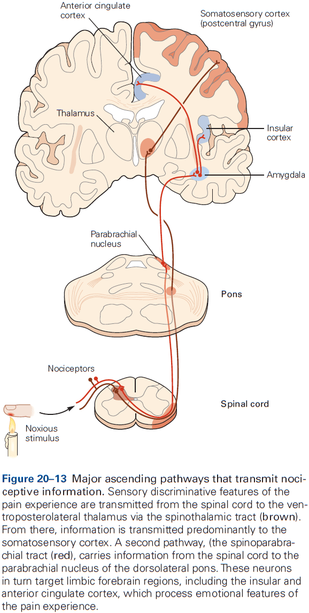
- No single area of the cortex is responsible for pain perception, but the anterior cingulate and insular cortex are associated with it.
- The anterior cingulate gyrus is part of the limbic system and is involved in processing emotional states associated with pain.
- The insular cortex processes information about the internal state of the body and contributes to the autonomic component of pain responses.
- Interestingly, lesions to the cingulate cortex or the pathway from the frontal cortex to the cingulate cortex reduces the affective features of pain without eliminating the ability to recognize the intensity and location of the injury.
- E.g. Patients perceive noxious stimuli as painful and can distinguish sharp from dull pain, but fail to display appropriate emotional responses.
- This implicates the insular cortex as an area where sensory, affective, and cognitive components of pain are integrated.
- One effective means of suppressing nociception involves stimulation of the periaqueductal gray region, which produces profound and selective analgesia (inability to feel pain) and has been effective in relieving pain in some patients.
- This stimulation-produced analgesia is remarkably modality-specific as animals still respond to touch, pressure, and temperature but not to pain.
- Skipping over the opioid peptide section.

**Highlights**

- Peripheral nociceptive axons with cell bodies in dorsal root ganglia include small-diameter unmyelinated (C) and myelinated (A$$\delta$$) afferents. Larger diameter A$$\beta$$ afferents respond only to innocuous stimulation but, following injury, can activate CNS pain circuitry.
- All nociceptors use glutamate as their excitatory neurotransmitter and many also express an excitatory neuropeptide cotransmitter like substance P or CGRP.
- Nociceptors terminate in the dorsal horn of the spinal cord where they excite interneurons and projection neurons.
- A major brain target of dorsal horn projection neurons is the ventroposterolateral thalamus, which processes location and intensity features of painful stimuli. Other neurons target the parabrachial nucleus (PB) of the dorsolateral pons, which project to affective/emotional features of pain experience.
- Allodynia, pain from an innocuous stimulus, results in part from peripheral sensitization of nociceptors. Peripheral sensitization occurs when there’s tissue injury, which lowers the threshold for activating nociceptors.
- Hyperalgesia, exacerbated pain to painful stimuli, and allodynia are also due to altered activity in the dorsal horn called central sensitization that contributes to spontaneous activity of pain-transmission neurons and amplification of nociceptive signals.
- Input carried by large-diameter, non-nociceptive afferents can reduce the transmission of nociceptive information to the brain by engaging GABAergic inhibitory circuits in the dorsal horn, which is the basis of pain relief by vibration.
- The brain not only receives nociceptive information leading to the perception of pain, but also regulates the output of the spinal cord to reduce pain by an endorphin-mediated pain control system.
- Electrical stimulation of the midbrain periaqueductal gray can engage a descending inhibitory control system which reduces the transmission of pain messages.

## Chapter 21: The Constructive Nature of Visual Processing

- The mechanisms that underlie vision aren’t obvious.
- How do we perceive form and movement? How do we distinguish colors?
- Vision isn’t only used for object recognition, but also for guiding our movements, and these separate functions are mediated by at least two parallel pathways in the brain.
- The existence of parallel pathways raises one of the central questions of cognition: How are different types of information carried by different pathways integrated to form a coherent visual image?
- Vision is a biological process that’s evolved with our ecological needs.
- Gestalt: configuration or form.
- The central idea of Gestalt psychology is that what we see depends not only on the properties of the stimulus, but also on its context.
- The brain has a way of looking at the world, a set of expectations that derives, in part, from experience and in part from built-in neural wiring.
- It’s tempting to speculate that the formal features of objects in natural scenes created evolutionary pressure on our visual systems to develop neural circuits that have made us sensitive to those features.
- Separating the figure and background in a visual scene is an important step in object recognition.
- Three levels of visual scene analysis
    - Low: local contrast, orientation, color, and movement are discriminated.
    - Intermediate: analysis of scene layout and surface properties, parsing images into surfaces and contours, and distinguishing foreground from background.
    - High: object recognition and object motion.
- Because distributed processing is one of the main organizational principles in the neurobiology of vision, we must understand the anatomical pathways of the visual system to fully understand the physiological description of visual processing.
- The photoreceptors of the retina, rods and cones, extract some 20 local features.
- E.g. Local contrasts of dark versus light, color, and motion.
- These features are computed by different populations of specialized neural circuits forming independent processing modules that separately cover the visual field.
- So each point in the visual field is processed in multiple channels that extract features simultaneously and in parallel.
- Review of the LGN, primary visual pathway (geniculostriate pathway), primary visual cortex (striate cortex), retinotopy, ventral (what) and dorsal (where) visual pathways.

- Form, color, motion, and depth are processed in discrete areas of the cerebral cortex.
- If we include oculomotor areas and prefrontal areas that contribute to visual memory, then almost half of the cerebral cortex is involved with vision.
- Top-down cognitive influences contain information on attention, object expectation, perceptual task, perceptual learning, and efference copy.
- Review of on-center and off-center receptive fields.
- More cortical area is dedicated to the central part of the visual field, where the receptive fields are smallest and the visual system has the greatest spatial resolution.
- Receptive-field properties change from relay to relay along a visual pathway.
- By comparing the properties before and after a relay, we can determine the function of each relay and learn how visual information is progressively analyzed by the brain.
- E.g. The key property of the form pathway is selectivity for the orientation of contours in the visual field. This is an emergent property of signal processing in primary visual cortex; it isn’t a property of the cortical input but is generated within the cortex itself.

- Like the somatosensory cortex, the visual cortex is organized into columns of specialized neurons.
- Cells in the primary visual cortex with similar functional properties are located close together in columns.
- Review of ocular dominance columns and orientation columns.
- Embedded within the orientation and ocular dominance columns are clusters of neurons that have poor orientation selectivity but strong color preferences.
- Any position in the visual field can be analyzed adequately in terms of orientation of contours, color and direction of movement of objects, and stereoscopic depth by a single computational module.

- The columnar system serves as the substrate for two fundamental types of processing
    - Serial: occurs in succession in connections between cortical areas.
    - Parallel: occurs simultaneously in subsets of fibers that process different submodalities such as form, color, and motion, continuing the neural processing strategy started in the retina.
- Columnar organization has several advantages.
    - Minimizes distance for neurons with similar functional properties to communicate with one another and allows them to share inputs from discrete pathways.
    - This efficient connectivity economizes on the use of brain volume and maximizes processing speed.
    - This allows for easy scaling.

- Three pathways from the LGN
    - Parvocellular → Layers IVC$$\beta$$ and 6
    - Magnocellular → Layers IVC$$\alpha$$ and 6
    - Koniocellular → Layers 1, 2, and 3
- These parallel pathways are only an approximation and there’s considerable interaction between pathways.
- In general, the superficial layers of neocortex are responsible for connections to higher-order areas of the cortex.
- E.g. Layer V pyramidal neurons project to the superior colliculus and pons. Layer VI cells are responsible for feedback projections, both to the thalamus and lower-order cortical areas.

- The number of neurons projecting from the cortex to the LGN is ten times the number of projections from the LGN to the cortex. We don’t understand the function of this many feedback connections, but we suspect it has to do with control/modulation/attention.
- The spike rates of excitatory neurons are constantly being balanced by matched inhibition that maintains stability.
- In addition to serial feedforward, feedback, and local recurrent connections, connections also travel parallel to the cortical surface within each layer, providing long-range horizontal connections and allowing neurons to integrate information over a large visual field.

- Review of population code and vector averaging.
- The most sensitive part of a neuron’s tuning curve isn’t the peak, but along the flanks where the tuning curve is steepest.
- Changes in a stimulus must be sufficient to elicit a change in response that significantly exceeds the normal variability in response of the neuron. That way, changes in a stimulus are seen above noise.
- When the brain represents a piece of information, an important consideration is the number of neurons that participate in that representation.
- E.g. From the grandmother cell to population coding.
- The nervous system doesn’t represent entire objects by the activity of single neurons. Instead, only some cells represent parts of an object and an ensemble of neurons represents an entire object.
- This organization is known as a distributed or sparse code.

**Highlights**

- Vision is a constructive process that isn’t the mere recording of visual input like a camera.
- The tuning of neural circuits for visual features such as contrast, orientation, and motion often matches the distribution of that feature in the natural environment. This suggests an evolutionary-driven origin for neural circuitry.
- Vision uses extensive parallel processing pathways such as the dorsal and ventral pathways.
- Parallel processing starts at the retina as each retinal circuit analyzes different points in the visual field for different local features.
- The different channels enter V1 at different layers in the cortex, although they mostly enter at layers 4 and 6.
- V1 neurons share basic properties such as spatial location or orientation preference, forming columns.
- V1 neurons form a visuotopic map that gradually changes with distance. Neural processing reflects its architecture with local vertical processing along columns, and lateral processing across columns.
- A useful measure of visual processing is provided by changes in neuronal receptive fields along the visual pathway. A receptive field is the region of visual space that a neuron is receptive/responsive to and is further characterized by the neuron’s optimal stimulus in that region.
- Receptive fields grow larger and more complex at successive stages along the visual pathway. Their optimal stimuli also increase in complexity.
- One of the most important unsolved questions is the interaction between feedforward and feedback visual processing from higher to lower levels.

## Chapter 22: Low-Level Visual Processing: The Retina

- All visual experience is based on information processed by the retina. (This isn’t quite true as visual illusions and hallucinations are visual experience without information from the retina.)
- The retina’s output is transmitted by just one million optic nerve fibers, and yet almost half of the cerebral cortex is used to process these signals.
- Because the retina sets fundamental limits on what can be seen, there’s great interest in understanding how the retina functions.

- The retina is a thin sheet of neurons, a few hundred micrometers thick, and is make up of five major cell types arranged in three cellular layers separated by two synaptic layers.

- Three cellular layers
    - Photoreceptors → Bipolar cells → Retinal ganglion cells
- Two synaptic layers
    - Horizontal cells in the outer synaptic layer
    - Amacrine cells in the inner synaptic layer
- The retina must change its sensitivity to changes in environmental conditions such as illumination.
- This adaptation allows our vision to remain stable despite the vast range of light intensities we encounter throughout the day.
- Three important retinal functions
    - Phototransduction
    - Preprocessing
    - Adaptation
- Any point in the outside world becomes a small blurred circle on the retina due to several factors.
- E.g. Diffraction at the pupil, refractive errors at the cornea and lens, and scattering due to air and cells.
- Review of the fovea. At the center of the fovea, the other cellular layers are pushed aside to reduce additional blur from light scattering cells.
- The back of the eye is lined with a black pigment that absorbs light and keeps it from scattering back into the eye.

- Because the optic disc lies nasal to the fovea for each eye, light coming from a single spot never falls on both blind spots simultaneously, so we are unaware of them.
- The blind spot demonstrates what blind people experience, not blackness but simply nothing.
- The blind spot is a consequence of the inside-out design of the retina where photoreceptors are at the back and ganglion cells are at the front.
- Review of rods and cones (L, M, and S). Rods are sensitive to a single photon, primates only have one type of rod but three types of cones, the human retina has about 100 million rods and 5 million cones.
- A few millimeters outside the fovea, rods greatly outnumber cones.
- The smallest letters we can read on a doctor’s eye chart have strokes whose images are just one to two cone diameters wide on the retina.
- Phototransduction links the absorptions of a photon to a change in membrane conductance.
- E.g. Red light excites L cones more than M cones, while green light excites M cones more.
- The relative degree of excitation in these cone types contains information about the spectrum of the light independent of its intensity.
- The brain’s comparison of signals from different cone types is the basis for color vision.
- In night vision, only rods are active so all functional photoreceptors have the same absorption spectrum.
- E.g. A green light has the same effect as a red light of greater intensity on rods. So rods can’t distinguish color.
- Skipping over the molecular and protein mechanisms behind transduction.
- The photoreceptor layer produces a simple neural representation of the visual scene with neurons in bright regions being hyperpolarized and dark regions are depolarized.
- The optic nerve only has about 1% as many axons as there are receptors, so the retinal circuit must compress and refine the representation before it’s transmitted to the brain.
- This retinal processing is called low-level visual processing as it’s the first stage.
- Many retinal ganglion cells fire APs spontaneously even in darkness or constant illumination.
- Two main types of ganglion cells
    - ON cells: fire more rapidly if light intensity suddenly increases.
    - OFF cells: fire more rapidly if light intensity suddenly decreases.
- The retinal output has two complementary representations that convey light intensity.

- This arrangement communicates rapid changes to the visual scene because if the retina had only ON cells, a dark object would be encoded by a decrease in firing rate that takes about 100 ms to notice by the postsynaptic neuron.
- By having OFF cells, a dark object would be encoded by an increase in firing rate that takes only 5 ms to notice, which is 20 times faster than an ON cell.
- Review of receptive field, center and surround region.
- The output produced by a population of retinal ganglion cells enhances regions of spatial contrast in the input.
- E.g. Edges between two areas of different intensity, and less emphasis on regions of uniform illumination.
- Transient neurons: produce a burst of spikes only at the onset/offset of a stimulus.
- Sustained neurons: maintain a steady firing rate during stimulation.
- In general, the output of ganglion cells favors temporal changes in visual input over periods of constant light intensity.
- In fact, when an image is stabilized on the retina, it fades from view within seconds.
- The retina extracts low-level features of the scene that are useful for guiding behavior and selectively transmits those to the brain.
- E.g. Edges for inferring object shape, identity, and motion.
- The retina doesn’t transmit features that are constant in either space or time, which accounts for the spatiotemporal sensitivity of human perception.

- There are more than 20 types of ganglion cells and each type covers the retina in a tiled pattern, such that any point on the retina lies within the receptive field center of at least one ganglion cell of each type.
- The optic nerve conveys 20 or more neural representations that differ in intensity, spatial resolution, temporal responsiveness, spectral filtering, and selectivity.
- Photoreceptors and bipolar cells don’t fire APs but instead release neurotransmitter in a graded fashion.
- In fact, most retinal processing is done using graded membrane potentials with APs mostly occurring in certain amacrine and retinal ganglion cells.
- The axons of ON cells end in the lower half of the inner plexiform layer while those of OFF cells end in the upper half.
- The ON bipolar cells excite ON ganglion cells and the same goes for OFF bipolar cells.
- The two principal subdivisions of retinal output, the ON and OFF pathways, are already established at the level of bipolar cells.
- Stimulus representations in the ganglion cell population originate in dedicated bipolar cell pathways that are differentiated by their selective connections to photoreceptors and postsynaptic targets.
- Horizontal cells measure the average level of excitation of the photoreceptor population over a broad region and this signal is fed back to the photoreceptor terminal through an inhibitory synapse.
- So, the photoreceptor terminal is under control by two competing factors
    - Light falling on the receptor hyperpolarizes it.
    - Light falling on the surrounding region depolarizes it.
- This results in an antagonistic receptive-field in bipolar cells.
- Bipolar cells have their own version of horizontal cells called amacrine cells.
- Amacrine cells generally receive excitatory signals from bipolar cells at glutamatergic synapses.
- Amacrine cells enforce lateral inhibition among bipolar cells by feeding back directly to the presynaptic bipolar cell at a reciprocal inhibitory synapse.
- Some amacrine cells are electrically coupled to each other, forming an electrical network like that of horizontal cells and enables inhibition from distant bipolar cells, similar to the lateral inhibition of photoreceptor terminals.
- These lateral inhibitory connections contribute substantially to the antagonistic receptive field of retinal ganglion cells.
- For many ganglion cells, a step change in light intensity produces a transient response and part of this response is due to negative feedback circuits involving horizontal and amacrine cells.
- E.g. Decrease in light intensity → Depolarize cone terminal → Excite horizontal cell → Repolarize cone terminal.
- Because this feedback loop involves a brief delay, the voltage response of the cone peaks abruptly and then settles back to a stable level. Similar processing occurs at reciprocal synapses between bipolar and amacrine cells and this is the basis behind the transient ganglion response.
- In both cases, delayed inhibition favors rapidly changing inputs over slowly changing ones.
- This temporal filtering is seen in visual perception as sudden changes are more visible than gradual changes.
- Retinal circuits seem to go great lengths to speed up their responses and emphasize temporal changes.
- One likely reason is because the very first cell in the retinal circuit, the photoreceptor, is exceptionally slow.
- E.g. A flash of light takes a cone cell about 40 ms to reach peak response, an intolerable delay for proper visual function.
- This fast processing helps to reduce visual reaction time, a life-extending trait.
- Color vision begins in cone-selective circuits.
- Two theories of color perception
    - Trichromatic theory: any color can be made by mixing different amounts of three primary colors (red, green, and blue), which match the three cone types.
    - Opponent-process theory: color vision involves three processes that respond in opposite ways to light of different colors: (y-b) is stimulated by yellow and inhibited by blue, (r-g) is stimulated by red and inhibited by green, (w-bk) is stimulated by white and inhibited by black.
- The opponent-process theory is seen in the postreceptor circuitry of the retina.
- E.g. A ganglion cell receives input from S-ON, L-OFF, and M-OFF bipolar cells so it’s depolarized by blue light and hyperpolarized by yellow light. This cell implements y-b color opponency.
- Chromatic signals are combined and encoded by the retina for transmission to the thalamus and cortex.
- Only about 10% of cortical neurons are preferentially driven by color contrast rather than luminance contrast, which likely reflects the fact that color vision makes only a small contribution to our overall fitness.
- E.g. Colorblind individuals can grow up without ever noticing their defect.
- Interestingly, being colorblind doesn’t impair vision more broadly because the total number of cones remains unchanged, it’s just that the distribution of L, M, and S cones changes.
- Rod and cone circuits merge in the inner retina.
- For low-light vision, the mammalian retina only has ON bipolar cells, no OFF cells.
- ON bipolar cells are connected to amacrine cells that convey rod input to cone bipolar cells. It provides excitatory signals to ON bipolar cells and inhibitory signals to OFF bipolar cells.
- These cone bipolar cells in turn excite ON and OFF ganglion cells.
- Thus, the rod signal is fed into the cone system after a detour and it produces the appropriate signal for the ON and OFF pathways.
- The retina adapts to changes in illumination by using automatic gain control called light adaptation.
- The weakest flashes of light elicit no response, a graded increase in flash intensity elicits graded responses, and the brightest flashes elicit saturation.
- To compensate for increases in background illumination, ganglion cells become less sensitive to light variations.
- E.g. In a brighter background, a larger change is needed to cause the same response.

- The visual system approximates Weber’s law as sensitivity decreases somewhat steeply with increasing background intensity.
- Gain control happens in rods, cones, and bipolar cells. As ambient light increases, light adaptation shifts from rods to cones, with it mostly coming from cones towards noon.
- Light adaptation changes the sensitivity, speed, and rules of spatial processing in the retina.
- E.g. In bright light, many ganglion cells have a sharp center-surround structure in their receptive fields. In dim light, the antagonistic surround becomes broad and weak and eventually disappears.
- Under low-light conditions, retinal circuits function to simply accumulate rare photons rather than to compute local intensity gradients.
- Two important functions of light adaptation
    - Discard information about the intensity of ambient light while retaining information about object reflectance.
    - Match the small dynamic range of firing in retinal ganglion cells to the large range of light intensities in the environment.

**Highlights**

- The retina transforms light patterns on photoreceptors into neural signals that are transmitted through the optic nerve to specialized visual centers in the brain.
- Different populations of ganglion cells transmit different neural representations of the retinal image along parallel pathways.
- The retina discards much of the stimulus information available at the receptor level and extracts certain low-level features of the visual field such as edges and motion.
- The retina adapts flexibly to the changing conditions for vision such as illumination changes.
- Rods are used for nocturnal vision while cones are used for daytime vision. Rods have their own bipolar cells that transmit to cone bipolar cells, thus using cone circuitry.
- The vertical excitatory pathways are modulated by horizontal inhibitory connections that form negative feedback loops, sharpening the transient response of ganglion cells.
- The segregation of information into parallel pathways and the shaping of response properties by inhibitory lateral connections are pervasive organizational principles in the visual system.

## Chapter 23: Intermediate-Level Visual Processing and Visual Primitives

- Contour integration: combining boundary and edge information about an object.
- Contour integration is an example of intermediate-level visual processing and is the first step in generating a representation of the unified visual field.
- Intermediate-level visual processing deals with determining which boundaries and surfaces belong to which objects and which belong to the background, and distinguishing the brightness and color of a surface.
- Three features that help disambiguate retinal signals
    - The way a visual feature is perceived depends on everything surrounding it.
    - The functional properties of neurons in the visual cortex can be changed by visual experience and by perceptual learning.
    - Visual processing can be influenced by cognitive functions such as attention, expectation, and the goal/task.

- Visual primitives: local features in a visual scene.
- E.g. Contrast, line orientation, brightness, color, movement, and depth.
- Neurons in the retina and LGN have circular receptive fields with a center-surround organization, but neurons in the visual cortex respond selectively to lines of particular orientations.
- Each neurons responds to a narrow range of orientations, around 40 degrees, and different neurons respond optimally to distinct orientations.
- This orientation selectivity reflects the arrangement of inputs from the LGN as each V1 neuron receives input from several neighboring LGN neurons whose center-surround receptive fields are aligned to represent a particular axis of orientation.

- Simple cells: have receptive fields divided into ON and OFF subregions.
- Complex cells: are less selective for the position of object boundaries and fire continuously as a line/edge stimulus traverses their receptive field.
- Visual perception requires eye movement as visual cortex neurons don’t respond to a stabilized image on the retina.
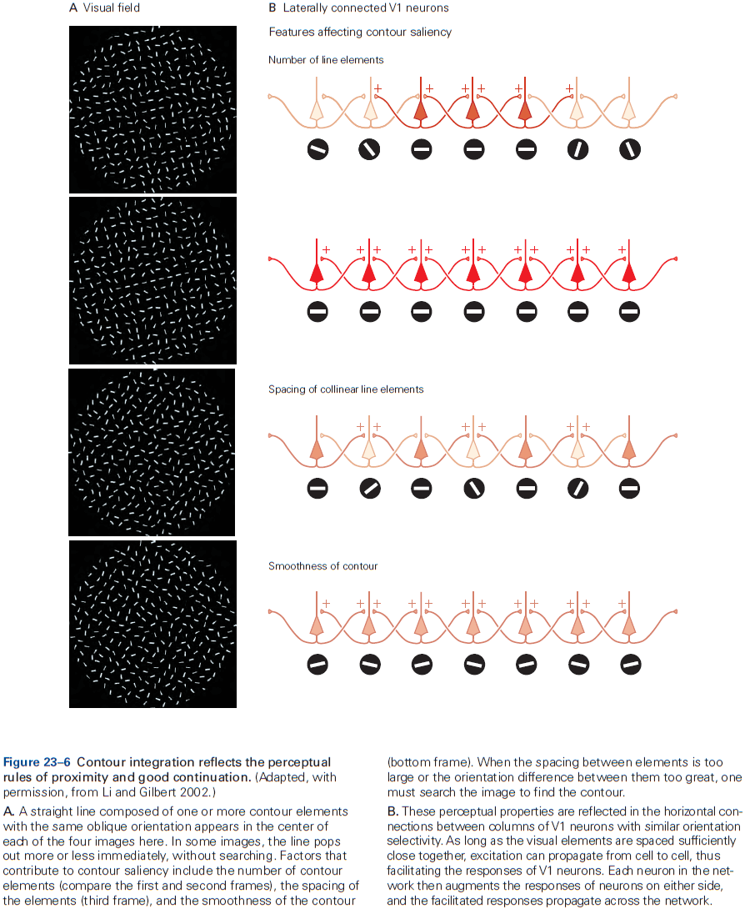
- Depth perception helps segregate objects from background.
- The balance of input from the two eyes, known as ocular dominance, varies among cells in V1.
- Depth is calculated by binocular neurons in the visual cortices by using the relative retinal positions of objects placed at different distances from the observer.
- In addition to binocular disparity, the visual system also uses many monocular cues to discriminate depth.
- E.g. Size, perspective, occlusion, brightness.
- The primary visual cortex determines the direction of movement of objects.
- The perception of brightness and color is highly dependent on context and may be quite different from what’s expected.
- E.g. As a friend walks towards you, she’s seen as coming closer, not growing larger even though the image on your retina does expand.
- Our ability to perceive an object’s size and color as constant illustrates again a fundamental principle of the visual system: it doesn’t record images passively like a camera, but uses transient and variable stimulation to construct representations.
- Since most neurons respond to surface boundaries and not to areas of uniform brightness, the visual system calculates the brightness of surfaces from information about contrast at the edges of surfaces. This is known as perceptual fill-in.
- Intermediate-level visual processing requires sharing of information from throughout the visual field, implemented by the long-range horizontal connections between neurons.
- The plasticity of cortical maps and connections didn’t evolve in response to lesions, but as a neural mechanism for improving our perceptual skills.
- Perceptual learning involves repeating a discriminating task many times and doesn’t require error feedback to improve performance.
- An important aspect of perceptual learning is its specificity as training on one task doesn’t transfer to other tasks.
- This specificity suggests that early stages of visual processing are responsible for learning.

- Scene segmentation involves a combination of bottom-up processes that follow Gestalt rules, and top-down processes that create object expectation.
- One strong top-down influence is spatial attention, which can change focus without any eye movement.

**Highlights**

- Vision requires segregating objects from their backgrounds, a process involving contour integration and surface segmentation.
- This process is simplified by relying on the statistical properties of natural forms.
- E.g. Gestalt rules.
- Perception of visual features is dependent on context.

## Chapter 24: High-Level Visual Processing: From Vision to Cognition

- High-level visual processing integrates information from a variety of sources and is the final stage in the visual pathway leading to visual perception.
- This level of visual processing deals with identifying behaviorally meaningful features and depends on descending signals that convey information from short-term working memory, long-term memory, and executive areas of cerebral cortex.
- Our visual experience of the world is fundamentally object-centered so our visual processing is mostly concerned with object recognition.
- It’s the behavioral significance of objects that guides our action based on visual information.
- The inferior temporal (IT) cortex is the primary center for object recognition and lesions to the IT can produce specific failures of object recognition.
- The IT comprises at least two main functional subdivisions: anterior and posterior.

- Unlike lesions to occipital cortical areas, temporal lobe lesions don’t impair sensitivity to basic visual attributes such as color, motion, and distance. Instead, the lesions cause visual agnosia, an unusual type of visual loss.
- Two categories of visual agnosia
    - Apperceptive: impairment in the ability to match or copy complex visual shapes or objects.
        - Results from disruption in the first stage of object recognition where the integration of visual features into entire objects occurs.
        - Commonly follows damage to the posterior IT cortex.
    - Associative: impairment in the ability to identify objects, but not the ability to match or copy complex objects.
        - Results from disruption in the second stage of object recognition where an object’s sensory representation is associated with it’s meaning or function.
        - Commonly follows damage to the anterior IT cortex.

- More focal lesions within the temporal cortex can lead to specific deficits.
- E.g. Prosopagnosia: inability to identify a particular face as belonging to a specific person but can identify a face as a face, it’s parts, and facial emotions.
- Prosopagnosia is an example of a category-specific agnosia where patients with temporal lobe damage fail to recognize specific items belonging to specific semantic categories.
- Category-specific agnosias for living things, fruits, vegetables, tools, or animals have also been reported.
- Neurons in the IT cortex encode complex visual stimuli and are organized into functionally specialized columns, just like other areas of cortex.

- A highly specialized network, located mainly in the temporal cortex, processes the multiple dimensions of information conveyed by a face.
- The IT cortex is part of a network of cortical areas involved in object recognition.
- E.g. Projections to the perirhinal and parahippocampal cortices, and projections to the prefrontal cortex.
- As we’ll see, prefrontal neurons play important roles in object categorization, visual working memory, and memory recall.
- Perceptual constancy: representing the invariant attributes of objects independently.
- Size constancy: when an object is placed at different distances from an observer and is perceived as having the same size, even though the object produces different image sizes on the retina.
- Lesions to the IT cortex lead to failures in size constancy, suggesting that neurons in this area play a critical role in size constancy.
- Many neurons in IT cortex don’t exhibit viewpoint invariance and are systematically tuned to viewing angle.
- Categorical perception: the ability to distinguish objects of different categories better than objects of the same category.
- E.g. It’s harder to discriminate between two red lights than between a red and green light.
- Categorical perception simplifies behavior.
- Neurons in the IT cortex seem to represent similarity features, while the prefrontal cortex represents categories.
- Visual experience can be stored as memory, and visual memory influences the processing of incoming visual information.
- The sharpening of neural sensitivity could underlie improvements in perceptual discrimination of visual stimuli.
- Object recognition and learning are intricately linked as learning can generate entire areas of functional specialization within the IT cortex.
- The delay-period activity in many vision-related neurons in both the IT and prefrontal cortices is thought to maintain information in short-term working memory.
- Activity in the IT cortex is associated with the short-term storage of visual patterns and color information.
- Activity in the prefrontal cortex is associated with long-term storage as it depends more on task requirements and isn’t terminated by intermittent sensory inputs.
- It’s been suggested and tested that learning visual associations might be mediated by enhanced connectivity between the neurons encoding individual stimuli.
- Experiments show that paired objects often elicit similar neuronal responses and that these responses became more similar over the course of training.
- Most importantly, the changes in neuronal activity occurred on the same timescales as the changes in behavior, suggesting that this behavior is a result of this neural activity.
- These learning-dependent changes in the stimulus selectivity of IT cortex neurons are long-lasting, suggesting that this cortical region is part of the neural circuitry for associative visual memories and that learned associations are implemented rapidly by changes in the strength of synaptic connections between neurons representing the associated stimuli.
- Although learned associations between images are likely stored in circuit changes in the IT cortex, activation of these circuits for conscious recall depends on input from the prefrontal cortex.

**Highlights**

- One function of high-level vision is object recognition which imbues visual perception with meaning.
- Object recognition is difficult due to changes in appearance such as position, distance, orientation, or lighting conditions, making the same object appear different in different contexts.
- Object recognition relies on a region of the temporal lobe called the inferior temporal (IT) cortex, which uses information already processed by low- and mid-level vision.
- Lesions to the IT cortex cause visual agnosia or the inability to recognize objects.
- Neurons in the IT cortex can be and are highly selective to objects such as faces and places.
- Face recognition is supported by multiple face areas, each with a unique functional specialization which form the face-processing network.
- IT cortex is connected to the perirhinal and parahippocampal cortices for memory, the amygdala for emotional valence, and the prefrontal cortex for object categorization and visual working memory.
- Objects are perceived as members of a category which simplifies the selection of appropriate behaviors. Neurons with categorical selectivity are found in dorsolateral prefrontal cortex.
- Short-term visual information may be implemented by delay-period activity in neurons in the prefrontal and temporal cortices.
- High-level visual information processing changes with top-down modulation.
- The sensory experience of an image and the recall of the same stimulus from memory are subjectively similar and neurons exhibit similar activity during both tasks.

## Chapter 25: Visual Processing for Attention and Action

- The brain compensates for eye movements to create a stable representation of the visual world.
- Saccades: quick eye movements.
- The brain must account for saccades to produce an interpretable visual image.
- With such constant movement, visual images should resemble an amateur videographer where the image jerks around because the camera operator isn’t skilled at holding the camera steady.
- In contrast, our vision is so stable that we’re unaware of the visual effects of saccades because the brain makes continual adjustments to the images falling on the retina after each saccade.
- The first insight into the brain mechanisms underlying visual stability is that the motor commands for saccades are copied to the visual system.
- This copy is used by the visual system to adjust and compensate for eye movements, leading to a stable image.
- Efference copy / Corollary discharge: a copy of the motor command that’s sent to sensory systems.
- For a corollary discharge to affect visual perception across eye movements, motor information has to affect the activity of visual neurons which happens in the parietal cortex, frontal eye field, prestriate visual cortex, and superior colliculus.

- Every time a saccade is made, a stimulus not in the receptive field of a neuron in the lateral intraparietal area and thus incapable of exciting the neuron, will excite the neuron if the impending saccade will bring the stimulus in to the receptive field, even before the saccade occurs.
- Thus, a corollary discharge of the impending saccade affects the visual responsiveness of the parietal neuron.
- This transient remapping of the receptive field explains how subjects can make sequential saccades that are based on previous saccades, thus chaining them properly.
- Remapping is found in many cortical and subcortical areas such as the lateral intraparietal area, frontal eye field, medial intraparietal area, intermediate layers of the superior colliculus, and prestriate areas V4, V3a, and V2.

- How does the brain get the vector of the saccade that it feeds back to the visual system?
- Research has shown that the motor command for the vector is represented in the superior colliculus on the roof of the midbrain.
- Each neuron in the superior colliculus is tuned to saccades of a given vector.
- Inactivation of the superior colliculus affects the monkey’s ability to make saccades and electrical stimulation of the superior colliculus evokes saccades.
- However, this only provides the vectors that actually drive the eye and not the corollary discharge that visual neurons use.
- We aren’t sure, but we suspect that the superior colliculus has both descending pathways for generating saccades and ascending pathways to the cerebral cortex that could carry the corollary discharge.
- The pathways to the cortex pass through the thalamus, as does all internal and almost all external information reaching the cerebral cortex.
- This is supported by the evidence that inactivation of the thalamic pathway results in monkeys being unable to perform the second saccade in the double-step task.
- Another experiment concluded that the corollary discharge does provide the vector of the saccade, and inactivation of the medial dorsal nucleus of the thalamus affects an animal’s perception.
- With each saccade, corollary discharge information provides perceptual information for determining the amplitude and direction of the current saccade, and it does so with machine-like precision several times per second.
- It’s unlikely that visual cues and oculomotor proprioception provide the vector information at the end of the saccade to compensate for eye movements as they’re too slow.
- Saccades also disrupt vision as it blurs vision during it’s sweep across the visual scene.
- The blur isn’t perceived because neuronal activity in a number of visual areas is suppressed around the time of every saccade and is called saccadic suppression.
- We know that the corollary discharge contributes to this neuronal activity suppression because the suppression occurs even in total darkness (no vision) and even if eye movement is blocked (no proprioception).
- E.g. If a saccade starts in total darkness and an object is flashed before the saccade ends, a blur can be seen during the saccade. However, if a mask is flashed after the saccade, the blur is suppressed and unseen.
- The eye position signal probably comes from a proprioceptive mechanism and not a corollary discharge because neurons that represent eye position don’t match the timing of a corollary discharge.
- It’s possible that the brain calculates the spatial location of an object before an eye movement using two mechanisms: a corollary discharge that’s fast and a proprioceptive signal that’s slow but more accurate.
- The proprioceptive signal can also be used to calibrate the corollary discharge.
- Visual scrutiny is driven by attention and arousal circuits.
- Change blindness: when large changes occur outside the focus of attention that are often missed.
- Review of top-down (voluntary) and bottom-up attention (involuntary).
- Spatial attention: attending to a specific point in space.
- Feature attention: attending to a specific visual feature such as color or shape.
- Both types of attention shorten reaction time and make visual perception more sensitive.
- Clinical studies have implicated the parietal lobe in visual attention as lesions to the right parietal lobe result in neglect of the contralateral visual hemifield.
- Neurons in the lateral intraparietal area represent only those objects of potential importance; a priority map of the visual field.
- The parietal cortex provides visual information to the motor system.
- E.g. When picking up a pencil, your fingers are separated from your thumb by the width of the pencil, the same goes for picking up a drink.
- Patients with parietal cortex lesions can’t adjust their grip width or wrist angle using visual information alone, even though they can verbally describe the size of the object or the orientation of the slot.
- The representation of space in the parietal cortex isn’t organized into a single map like the retinotopic map of the primary visual cortex. Instead it’s divided into at least four areas (LIP, MIP, VIP, AIP) that analyze the visual world in ways appropriate for individual motor systems.
- Four intraparietal areas
    - MIP: describes the targets for reaching and projects to the premotor areas that control reaching.
    - AIP: signals the size, depth, and orientation of objects that can be grasped.
    - LIP: specifies the targets for saccades and projects to the frontal eye fields.
    - VIP: responds to tactile stimuli on the face and to objects that approach the tactile receptive field.

**Highlights**

- The visual system compensates for changes in eye position to calculate spatial locations from retinal locations. The brain solves this problem by feeding forward the motor signal that drives the eye to the visual system to compensate for the effect of the eye movement. This is called a corollary discharge.
- Neurons in the lateral intraparietal area show evidence of this corollary discharge as they normally don’t respond to a particular stimulus in space but will respond to it if an impending saccade will bring that stimulus into its receptive field.
- This receptive field remapping depends on a pathway from the superior colliculus to the medial dorsal nucleus of the thalamus. Inactivation of the medial dorsal nucleus impairs the ability to identify where the eyes land after a saccade, suggesting that the corollary discharge has both a perceptual and motor role.
- We suspect that the brain uses eye position to calculate the spatial location of objects from the position of their images on the retina.
- We don’t know how the brain chooses between the eye position and corollary discharge mechanisms to determine spatial position. Because corollary discharge precedes the change in eye position and proprioception follows it, could the brain use both positions at different times?
- Attention is the ability to select objects for further analysis and without it, spatial perception is severely limited.
- The activity of neurons in the parietal cortex predicts the location of spatial attention and seems to create a priority map of the visual field. The motor system uses this map to choose targets for movement.
- Lesions in the parietal cortex cause a neglect of the contralateral visual world.
- There are at least four different visual maps in the intraparietal sulcus, each of which matches a different motor workspace.

## Chapter 26: Auditory Processing by the Cochlea

- Our ability to recognize small differences in sounds comes from the cochlea’s capacity to distinguish among frequency components, their amplitudes, and their relative timing.
- Hearing depends on the properties of hair cells, the cellular microphones of the inner ear.
- Hair cell: transduces mechanical vibrations into electrical signals.
- Hair cells also serve as mechanical amplifiers that augment auditory sensitivity.
- Each cochleae have about 16,000 hair cells and deterioration of hair cells results in hearing loss.
- Auricle: the fold of cartilage-supported skin on the outside of the head.

- The external ear isn’t uniformly effective at capturing sounds from all directions as the auricle’s surface collects sounds best when they originate at different positions with respect to the head.
- Our capacity to localize sounds in space, especially along the vertical axis, depends critically on the auricle.
- Each auricle has a unique topography and its effect on sound reflections at different frequencies is learned by the brain early in life.
- Hearing also fits the Weber-Fechner law as it follows a logarithmic scale for the relationship between the magnitude of sound pressure to perceived loudness.
- The dynamic range of hearing is enormous as the faintest and loudest sounds differ by a trillion-fold range in stimulus power.
- Each cycle of sound stimulus (frequency) evokes a cycle of up-and-down movement of the minuscule volume of liquid in each of the cochlea’s three chambers, thus displacing the sensory organ.

- The middle ear increases the magnitude of pressure changes by up to 30-fold, thus matching the low impedance of the air outside to the high impedance of the cochlea and ensuring efficient transfer of sound energy.
- The pressure gain given by the middle ear depends on sound frequency, which determines the U-shape tuning curve of auditory threshold.
- The continuous variation of the mechanical properties of the basilar membrane along the cochlea is key to the cochlea’s operation.
- E.g. The membrane is less than one-fifth as broad at the apex and it increases in width the further down the cochlea. The membrane is also thicker towards the start but thinner at the apex.
- The basilar membrane’s width and thickness both contribute to a decrease in stiffness from base to apex.
- This stiffness is used to capture and encode sound frequency as higher frequency sounds displace the membrane at the base, while lower frequency sounds displace the membrane at the apex.
- E.g. The base of the cochlea responds best to 20 kHz while the apex responds best to 20 Hz sounds.
- The basilar membrane’s operation is essentially the inverse of a piano’s.
- E.g. A piano produces complex sounds by combining the pure tones produced by multiple vibrating strings, while the cochlea deconstructs complex sounds by isolating the component tones at appropriate segments of the basilar membrane.
- For any frequency within the auditory range, there’s a characteristic place along the basilar membrane at which the magnitude of vibration is maximal.
- Tonotopic map: the arrangement of vibration frequencies along the basilar membrane.
- The tonotopic map can change with feedback from hair cells within the organ of Corti.
- The relationship between frequency and position along the basilar membrane varies monotonically, but not linearly; the logarithm of the frequency decreases roughly in proportion to the distance from the cochlea’s base.
- Thus, the basilar membrane is the implementation of the Weber-Fechner law.
- The membrane also acts as a mechanical frequency analyzer by distributing the energies associated with different frequency components to hair cells along its length.
- The basilar membrane begins the encoding of frequencies in a sound.
- The organ of Corti is where the mechanoelectrical transduction occurs in the cochlea.
- The organ has around 16,000 hair cells innervated by about 30,000 afferent nerve fibers.
- The information transmitted by hair cells to their innervating nerve fibers is also tonotopically organized.
- Hair cells aren’t neurons as they don’t have dendrites nor axons, but they do transform mechanical energy into neural signals.
- Mechanical deflection of the hair bundle excites hair cells of the cochlea, causing a receptor potential.
- A hair cell’s receptor potential is graded and as stimulus amplitude increases, the receptor potential grows progressively larger up to the point of saturation.
- A hair bundle exhibits Brownian motion (thermal noise) of approximately 3 nm, whereas the threshold of hearing corresponds to basilar membrane movements of as little as 0.3 nm.
- How does the hair bundle respond to motion smaller than its own noise?
- Three mechanisms
    - The movement of the hair bundle is larger than that of the basilar membrane.
    - Frequency-selective amplification of low stimuli actively pulls the signal out of the noise.
    - Mechanical coupling to a group of neighbors results in synchronization that effectively reduces noise.
- Skimming over the detailed transduction in hair cells.
- Hair cells function much quicker than any other sensory receptor cell and are quicker than neurons themselves.
- This is due to both the optimal frequency range for auditory communication (10 Hz to 100 kHz) and the need to localize sound sources.
- Hair cells have a unique mechanism of adaptation that acts as a high-pass filter and they can use mechanical amplification to further tune their mechanosensitivity.
- Every cochlear hair cell is most sensitive to stimulation at a specific frequency called it’s characteristics or best frequency, and this can be displayed as a tuning curve.

- Hair bundles vary systematically along the tonotopic axis with hair cells that respond to low-frequency stimuli having the tallest bundles, and hair cells that respond to high-frequency stimuli having the shortest bundles.
- Hair cells adapt to sustained stimulation by a progressive decrease in the receptor potential during long deflections of the hair bundle.
- This isn’t desensitization because the responsiveness of the receptor persists. Instead, during a prolonged step stimulus, there’s a sigmoidal relationship between the initial receptor potential and the bundle’s position shifts in the direction of the applied stimulus.
- This results in the membrane potential of the hair cell progressively returning to near its resting value during stimulation.
- The sensitivity of the cochlea is too great to come only from the inner ear’s passive mechanical properties. So, it must possess some means of actively amplifying sound energy.
- The basilar membrane displays a compressive nonlinearity that accommodates the millionfold variation of sound pressure that characterizes audible sounds into only two to three orders of magnitude of vibration amplitude.
- The cochlea seems to be actively amplifying sounds by emitting sounds itself.
- The source of the emitted sounds seems to come from outer hair cells that enhance cochlear sensitivity and frequency selectivity and hence act as the motors for amplification.
- We know that cochlear amplification occurs because it distorts acoustic inputs, causing phantom tones in sound perception.
- Four features of auditory responsiveness
    - An active amplification process lowers the detection threshold.
    - Since amplification only works near a characteristic frequency, the input to the sensory system is actively filtered, which sharpens frequency selectivity.
    - For stimulation near the characteristic frequency, the response displays a compressive nonlinearity that represents a wide range of stimulus levels by a much narrower range of vibration amplitudes.
    - Even in the absence of a stimulus, mechanical activity can produce self-sustained oscillations that result in otoacoustic emissions.
- These features describe the cochlea as an active dynamical system that operates on the verge of an oscillatory instability called the Hopf bifurcation.
- For each inner ear, approximately 30,000 ganglion cells innervate the hair cells.
- The afferent pathways from the human cochlea reflect the functional distinction between inner and outer hair cells.
- Three important consequences of this organization
    - The neural information that hearing uses originates almost entirely at inner hair cells.
    - The output of each inner hair cell is sampled by many afferent nerve fibers, so the information from one receptor is encoded independently in parallel channels.
    - Spiral ganglion cells respond best to stimulation at the characteristic frequency of the presynaptic hair cell, maintaining tonotopy.

- The acoustic sensitivity of axons in the cochlear nerve mirrors the connection pattern of the spiral ganglion cells to the hair cells, with each axon being most responsive to a characteristic frequency.
- The relationship between sound level in decibels and firing rate in each cochlear nerve fiber is almost linear. This relation implies that sound pressure is logarithmically encoded by neuronal activity.
- Thus, cochlear nerve fibers encode stimulus frequency and level.
- Because an AP and the subsequent refractory period each last almost 1 ms, the greatest sustainable firing rate is about 500 spikes per second.
- Nerve fibers with the same characteristic frequency have different thresholds of responsiveness to sound level.
- E.g. The most sensitive fibers respond at 0 dB and saturate at moderate intensities of about 30 db. The least sensitive fibers have very little spontaneous activity and much higher thresholds, but respond in a graded manner to levels even in excess of 100 db.
- The lowest sensitive fibers contact the inner hair cell nearest the axis of the cochlear spiral while the most sensitive contact the hair cell’s opposite side.
- Therefore, the multiple innervations of each inner hair cell isn’t redundant but is used for parallel channels of differing sensitivity and dynamic range.
- Two ways stimulus frequency information is gained
    - Place code: fibers are in a tonotopic map where position is related to characteristic frequency.
    - Frequency code: phase-locked firing of the fiber provides frequency information for frequencies below 3 kHz.
- Deafness mostly stems from the loss of cochlear hair cells and their afferent fibers.

**Highlights**

- Hearing starts when sounds captured by the ear are transferred to the cochlea and cause the basilar membrane to oscillate.
- Hair cells transduce basilar-membrane vibrations into receptor potentials that cause sensory neurons to fire.
- The frequency components of a sound stimulus are detected at different locations along the basilar membrane by different hair cells following a tonotopic map.
- Each hair cell is tuned to a characteristic frequency according to its morphological, mechanical, and electrical properties.
- Hair cells operate much faster than other sensory receptors, which allows them to respond to sound frequencies beyond 100 kHz in some mammalian species.
- Unique among sensory receptors, hair cells amplify their inputs to enhance their sensitivity, sharpen their frequency selectivity, and widen the range of stimulus levels that they can detect.
- Amplification is done by length changes of outer hair cells called electromotility, and by hair bundle vibration.
- The ear not only receives sounds, but also emits them called otoacoustic emissions. Spontaneous and evoked otoacoustic emissions result from the cochlea’s active amplification process.
- The cochlea introduces conspicuous distortions that contribute to sound perception, preferentially amplifying weak sound stimuli.
- The Hopf bifurcation provides a general principle of auditory detection that simplifies our understanding of hearing.

## Chapter 27: The Vestibular System

- Our inertial guidance system, called the vestibular system, detects and interprets motion through space and orientation relative to gravity.
- The vestibular system of vertebrates has remained highly conserved across many species.
- Vestibular signals originate in the labyrinths of the inner ear.
- Two parts of the vestibular system
    - Otolith organs: utricle and saccule which measure linear accelerations.
    - Semicircular canals: which measure angular accelerations.
- Hair cells in the vestibular labyrinth transduce acceleration stimuli into neural signals.

- Angular or linear acceleration of the head leads to a deflection of stereocilia, which together compose the hair bundle.
- Deflection of the stereocilia produce a depolarizing or hyperpolarizing receptor potential depending on which direction the hair bundle moves.
- All vertebrate receptor hair cells receive efferent inputs from the brain stem, the function of which are subject to debate.
- However, stimulation of the efferent fibers changes the sensitivity of the afferent axons from the hair cells, increasing excitability in some hair cells while inhibiting others.
- The semicircular canals sense angular acceleration and thus head rotation.
- The mechanism behind this is that when the head begins to rotate, the vestibular system moves along with the rotation but because of inertia, the endolymph, the fluid inside the semicircular canals, lags behind, pushing the hair cells in the opposite direction.
- Each semicircular canal is optimally sensitive to rotations in its plane and each canal has a pair in the other ear.
- Thus, the six canals effectively operate as three coplanar pairs.

- The left and right ear semicircular canals have opposite polarity.
- E.g. When you turn your head left, the receptors in the left horizontal semicircular canal will be excited while the right horizontal canal receptors will be inhibited.

- The two otolith organs detect linear motion as well as the static orientation of the head relative to gravity, which itself is a linear acceleration.
- Skipping over the vestibular nerve projections.
- The vestibular commissural system communicates bilateral information.
- How can we tell the difference between moving/translation rightward and tilting leftward, where the linear acceleration signals by the otolith afferents is the same?
- We now know that convergent vestibular nuclei and cerebellar neurons use combined signals from both the semicircular canals and the otolith receptors and some simple computations to discriminate between tilt and translation.
- Some central vestibular and cerebellar cells encode head tilt, whereas other cells encode translational motion.
- Some vestibular nuclei neurons change their responses in active versus passive generated head movements.
- This change has been interpreted as sensory prediction error signals as the brain predicts how self-generated motion activates the vestibular organs and subtracts these predictions from afferent signals.
- Without such error signals, accurate self-motion estimation would be severely compromised, suggesting that vestibular signals remain critically important when coupled to self-motion estimation and head movement control.
- Vestibulo-ocular reflexes (VORs) stabilize the eyes when the head moves.
- E.g. If you shake your head back and forth while reading, you can still read. But if you shake the book instead, you can’t read.
- Two components of VORs
    - Rotational: compensates for head rotation and receives input mostly from the semicircular canals.
    - Translational: compensates for linear head motion.
- Rotational VOR
    - When the semicircular canals sense head rotation in one direction, the eyes rotate in the opposite direction.
    - A trisynaptic pathway, the three-neuron arc, connects each semicircular canal to the appropriate eye muscle.

    - This reflex is old in terms of evolution as many invertebrate and all vertebrates have the ability to reflexively rotate their eyes opposite to the direction of head rotation.
    - Horizontal semicircular canals → Vestibular nuclei and medial longitudinal fasciculus → Contralateral abducens nucleus → Cranial nerve VI → Eye muscles.
    - The trisynaptic pathway isn’t enough to compensate for head rotations as the afferent signals from the semicircular canals is proportional to head velocity, while compensatory eye movement requires eye position changes.
    - To convert the velocity to position requires temporal integration that occurs in neural networks in the brain stem.
    - However, at high rotation speeds the elastic properties of the eyeball and eye muscles would snap the eye back to its default position so there must be a way of continuously activating the eye muscles.
    - Without constant input, the head rotation would initially bring the eye to the correct position but the eye would drift away since the oculomotor neurons would lack the tonic input to compensate for the elastic restoring forces of the eyeball.
    - This is exactly what happens after lesions to the brainstem and cerebellar structures that are thought to participate in this neural integration.
- Translational VOR
    - The horizontal compensatory eye movements that are caused by lateral motion scale with target distance.
    - E.g. The closer the target, the larger the compensatory eye movement.
    - The translational VOR differs from the rotational VOR in the ability to generate compensatory eye movements.
    - These abilities appear to be specific to frontal-eye animals as many lateral-eye species don’t generate eye movements that compensate for lateral motion.
- VORs are poor at compensating for sustained motion at constant speed, so they’re supplemented by optokinetic responses.
- VORs aren’t always appropriate and are under the control of the cerebellum and cortex.
- E.g. If you turn your head while walking, you want your gaze to follow. VORs would prevent your eyes from turning with your head. So you want to suppress VORs in this case.
- During volitional head movements, the VOR can be suppressed by the cerebellum and cortex.
- The VOR is also continuously calibrated and updated to maintain accuracy in the face of changes to the motor system or neural pathways, using the clarity of vision during head movements as the error signal.
- The VOR is a highly modifiable reflex and is necessary for anyone who wears glasses.
- If the flocculus and paraflocculus of the cerebellum are lesioned, the gain of the VOR can no longer be modulated.
- The climbing fiber input to the cerebellum carries a retinal error signal thought to serve as a teaching signal, enabling the cerebellum to correct the error in the VOR.

- Other uses for the vestibular system
    - Tilt perception: vestibular information is critical for spatial orientation relative to gravity.
    - Visual-vertical perception
    - Visuospatial constancy
- Electrical stimulation of area 2v in humans produces sensations of whole-body motion.

- It’s clear that there’s no evidence linking vestibular nuclei response properties directly to head direction or other spatially tuned cell types, and no direct projections from the vestibular nuclei to the brain areas thought to be spatially tuned.
- Losing one labyrinth means that all vestibular reflexes must be driven by a single labyrinth.
- For the VOR, this is effective at low speeds but during fast rotations, inhibition isn’t sufficient such that the gain of the reflex is reduced when the head rotates toward the lesioned side.
- The symptoms of bilateral vestibular loss are different from unilateral loss.
- E.g. Vertigo is absent because there is no imbalance in vestibular signals, no spontaneous nystagmus.
- The loss of vestibular reflexes is devastating as you can’t read without steadying your head and any motion prevents you from performing object recognition.

**Highlights**

- The vestibular system provides the brain with a rapid estimate of head movement, which is used for balance, visual stability, spatial orientation, movement planning, and motion perception.
- Vestibular receptor hair cells are mechanotransducers that sense rotational and linear accelerations.
- Receptor cells are polarized to detect the direction of motion.
- Three semicircular canals in each ear detect rotational motion and work in bilateral synergistic pairs through convergent commissural pathways in the vestibular nuclei.
- Projections from the vestibular nuclei to the oculomotor system allow eye muscles to compensate for head movement through the vestibulo-ocular reflex to hold the image of the external world motionless on the retina.
- Cortical projections to the vestibular and oculomotor nuclei allows volitional eye movements to be separated from reflex eye movements.
- Motor learning in vestibulocerebellar networks provides compensatory changes in eye movement responses to changing visual conditions.

## Chapter 28: Auditory Processing by the Central Nervous System

- To understand how animals process sound, it’s useful to consider which features/cues are available.
- For localizing sounds, the interaural time and intensity differences carry information about where sounds come from.

- The size of the head determines how interaural time delays are related to the location of sound sources.
- Humans can localize a sound source with an interaural time difference of 10 microseconds. Interaural time differences are particularly well conveyed by neurons that encode relatively low frequencies.
- E.g. Neurons can fire at the same position in every cycle of the sound wave and this encodes the interaural time difference as an interaural phase difference.
- However, interaural time differences are much harder to detect at higher frequencies so instead, the auditory system uses intensity differences.
- High frequency sounds produce sound shadows or intensity differences between the two ears, which is the feature that the brain uses for localizing high frequency sounds.
- Mammals localize sounds in the horizontal plane by having two separate ears, while we localize sounds in the vertical plane by the sound’s interaction with the body and pinna.
- Interaural time and intensity don’t vary with vertical displacement, so it’s impossible to localize a pure tone in the vertical plane without the pinna.
- One reason human speech can be recognized and understood over noise and distortions is because speech has redundant cues.

- The cochlear nerve delivers acoustic information in parallel pathways to the tonotopically organized cochlear nuclei.
- The afferent nerve fibers from cochlear ganglion cells are bundled in the vestibulocochlear nerve (cranial nerve VIII) and terminate exclusively in the cochlear nuclei.
- The cochlear nerve is made up of two groups of fibers: 95% of myelinated fibers from inner hair cells and 5% of unmyelinated fibers from outer hair cells.
- We understand the myelinated fibers more than the unmyelinated ones.
- Both groups detect energy over a narrow range of frequencies; the tonotopic map of the cochlear nerve thus carries detailed information about how the frequency content of sounds change.
- The unmyelinated fibers integrate information from a wide region of the cochlea but aren’t response to sound. Perhaps they signal cochlear damage and pain after exposure to loud sounds.

- Two features of cochlear nuclei
    - Organized tonotopically.
    - Each cochlear nerve fiber innervates several different areas within the cochlear nuclei.
- The auditory pathway comprises at least four different ascending pathways that simultaneously extract different acoustic information from the signals carried by cochlear nerve fibers.
- The ventral cochlear nucleus extracts temporal and spectral information about sounds.
- The principal cells of the unlayered ventral cochlear nucleus sharpen temporal and spectral information and convey it to higher centers of the auditory system.
- Different types of cells in the cochlear nuclei extract distinct types of acoustic information from the cochlear nerve fiber.
- Three types of cochlear nuclei neurons
    - Bushy cells: projects bilaterally to the superior olivary complex and is used to convey interaural time and intensity differences.
    - Stellate cells: has a tonotopic organization that encodes the spectrum of sounds.
    - Octopus cells: detects the onset of sound that allow animals to detect brief gaps.
- The dorsal cochlear nucleus integrates acoustic with somatosensory information in making use of spectral cues for localizing sounds.
- Among vertebrates, only mammals have dorsal cochlear nuclei.
- Recent experiments suggest that the circuits of the dorsal cochlear nuclei distinguish between unpredictable and predictable sounds.
- E.g. Self-generated sounds such as chewing or talking are predictable and are canceled through these circuits.
- The superior olivary complex in mammals contains separate circuits for detecting interaural time and intensity differences.
- The medial superior olive (MSO) generates a map of interaural time differences.
- Review of phase-locking, Jeffress sound localization model, and delay lines.
- The lateral superior olive (LSO) detects interaural intensity differences, but doesn’t form a map of the location of sounds in the horizontal plane.
- In humans, interaural intensities can differ in sounds with frequencies greater than about 2 kHz.
- Sounds from the ipsilateral side generate strong excitation and weak inhibition, whereas those that come from the contralateral side generate strong inhibition and weak excitation.
- Thus, neurons in the LSO are activated more strongly by sounds from the ipsilateral than the contralateral hemifield.
- If sounds come from the midline, then ipsilateral excitation and contralateral inhibition must arrive at neurons in the LSO at the same time to cancel out the net excitation.

- The superior olivary complex provides feedback to the cochlea which controls the sensitivity of the cochlea and protects it from damage by loud sounds.

- The ventral nuclei of the lateral lemniscus is involved in processing the meaning of sounds.
- To localize sounds accurately, animals must ignore the reflections of sounds from surrounding surfaces that arrive after the initial wave front.
- Precedence effect: the phenomenon where mammals suppress all but the first-arriving sound.
- It’s been proposed that the persistent inhibition in the inferior colliculus from the dorsal nucleus of the lateral lemniscus serves to suppress spurious localization cues and thus is behind the precedence effect.
- All afferent auditory pathways converge in the inferior colliculus.
- Sound location information from the inferior colliculus creates a spatial map of sound in the superior colliculus.
- The superior colliculus is critical for reflexive orienting movements of the head and eyes to acoustic and visual cues in space.
- The superior colliculus is also where all information regarding sound localization converges, which is critical since binaural differences in level and timing alone can’t unambiguously code for a single position in space.
- Within the superior colliculus, the auditory map is aligned with maps of visual space and body surface.
- Auditory, visual, and somatosensory neurons in the superior colliculus all converge on output pathways in the same structure that controls movement of eyes, head, and external ears.
- The superior colliculus maps are mapped to motor targets in space and are aligned with the sensory maps, which helps facilitate the sensory guiding of movements.
- In a parallel pathway, the inferior colliculus sends ascending auditory information to the medial geniculate body of the thalamus and from there to the auditory cortex.
- Stimulus selectivity progressively increases along the ascending pathway.
- E.g. An auditory nerve fiber is primarily selective to one stimulus dimension, frequency, but neurons in the central auditory system may be multidimensional and be selective of frequency, spectral bandwidth, intensity, modulation, and spatial location.
- The region of preferred stimulus becomes increasingly smaller at structures along the path to the auditory cortex.
- The majority of neurons in the auditory cortex are preferentially driven by stimuli with greater spectral and temporal complexity than pure tones and broadband noises.
- The neurons also change their firing pattern as they not only respond with higher firing rates, but also with sustained firing throughout the stimulus duration.

- This is significant because it provides a direct link between neural firing and the perception of a continuous acoustic event, as such sustained firing by auditory cortex neurons has only been observed in awake animals.
- In contrast, an auditory nerve fiber typically shows sustained firing in response to a wide range of acoustic signals.
- The overall picture so far is that when a sound is heard, the auditory cortex first responds with transient discharges (encodes the onset of a sound) across a large population of neurons and as time passes, the activation becomes restricted to a smaller population of neurons that are preferentially driven by the sound.
- The auditory cortex has numerous maps of sound.
- In monkeys, neurons tuned to low frequencies are found at the rostral end of A1, while those responsive to high frequencies are found at the caudal end.
- Thus, like the visual and somatosensory cortices, A1 contains a map reflecting the sensory periphery.
- In many species, subregions of the auditory cortex that represent important frequencies are larger than others because of extensive inputs which require more processing.
- Other features of auditory stimuli are mapped in the primary auditory cortex, but the overall organization is less clear and precise than for vision.
- A1 is also organized according to bandwidth (responsiveness to a narrow or broad range of frequencies), neuronal response latency, loudness, modulation of loudness, and rate and direction of frequency modulation.
- It’s unknown how these various features interact and integrate.
- Sensory representation in A1 can change in response to alterations in input pathways.
- E.g. After peripheral hearing loss, the tonotopic mapping in A1 can change so that neurons previously responsive to sounds within the lost range will being to respond to adjacent frequencies.
- Raising animals in acoustic environments where they’re exposed to repeated tone pulses of a certain frequency results in a persistent expansion of cortical areas devoted to that frequency, followed with a general deterioration and broadening of the tonotopic map.
- In contrast to the auditory midbrain, there isn’t any evidence for a spatially organized map of sound in any of the cortical areas sensitive to sound location.
- Why is there a second sound-localization pathway connected to gaze control circuitry when the midbrain pathway from location-sensitive neurons in the inferior colliculus to the superior colliculus to gaze control circuitry directly controls orientation movements of the head, eyes, and ears?
- Behavioral experiments shed light on this question as although lesions of A1 can result in profound sound-localization deficits, no deficit is seen when the task is simply to indicate the side of the sound source. The deficit is only apparent when the location must be approached.
- Cortical and subcortical sound-localization pathways have parallel access to gaze control centers, which contributes some redundancy.
- In both mammals and birds, the general difference is that cortical pathways are required for more complex sound-localization tasks.
- Subcortical circuits are important for rapid and reliable performance of behaviors that are critical to survival, cortical circuits are used for working memory, complex recognition, and selection of stimuli and evaluation of their significance.
- The auditory cortex, like the visual cortex, is also segregated into separate processing streams.

- Although the idea that all sensory areas of the cerebral cortex initially segregate object identification and location is attractive, it’s likely an oversimplification.
- An intriguing feature of all mammalian cortical areas, including the auditory areas, is the massive projection from the cortex back to lower areas.
- These feedback projections are used to actively adjust auditory signal processing in subcortical structures.
- As sound information moves up the processing hierarchy, the precision of timing in sounds gradually decreases.
- E.g. The phase-locking upper limit in the auditory nerve is 3000 Hz, 300 Hz in the medial geniculate nucleus, and less than 100 Hz in A1.
- The upper limit of phase-locking in A1 is similar to that found in the primary visual and somatosensory areas of cortex.
- In the auditory cortex, the temporal firing pattern alone is inadequate to represent the entire range of time-varying sounds that we perceive.
- Instead, A1 has two populations of neurons, one that displays phase-locked periodic firing in response to click trains with long intervals between clicks, and one that fires increasingly rapidly as the click interval becomes shorter.
- These two populations of A1 neurons, respectively called synchronized and nonsynchronized, have complementary response properties.
- Neurons of the synchronized population explicitly represent slowly occurring sound events by synchronized neural firing (temporal code), while neurons of the nonsynchronized population implicitly represent rapidly changing sound events by changes in average firing rates (rate code).
- In A1, the neural representation changes from a temporal code to a rate code at about 40 Hz.
- 40 Hz is also near the boundary of where our perception of a periodic click train changes from being discrete to continuous.
- The progressive reduction in the upper limit of phase-locking along the ascending auditory pathway is matched by the emergence of firing-rate-based representations.
- There’s a considerable transition from temporal to rate coding by the time auditory signals reach the auditory cortex.
- This transition is necessary for auditory information to be integrated with information from other sensory modalities that are intrinsically slower.
- Primates have specialized cortical neurons that encode pitch and harmonics.
- The change in representation of harmonic sounds from auditory nerve fibers to the auditory cortex reflects a principle of neural coding in sensory systems.
- Neurons in sensory pathways transform the representation of physical features, such as frequency or luminance, into a representation of perceptual features, such as pitch or brightness.
- Such features lead to the formation of auditory or visual percepts.
- We know relatively little about how speech sounds are analyzed by neural circuits.
- The auditory system must distinguish an auditory percept as being self-generated or externally generated to mask our own voices.
- We also listen to our own voice to detect errors and correct them through feedback.
- The vocalization-induced suppression begins several hundred milliseconds prior to the onset of vocalization, suggesting that these neurons receive modulatory signals from vocal production circuits.
- Why do we suppress our auditory cortex when we speak?
- A simple answer is so that we don’t hear our own loud voice. A more interesting answer is that this suppression comes from a vocal feedback-monitoring network in auditory cortex.
- In humans, there’s less or no suppression of the auditory cortex if vocal feedback is experimentally altered through earphones.
- This sensitivity to feedback perturbations suggests that neurons exhibiting vocalization-induced suppression are part of a network responsible for monitoring vocal feedback signals.
- Thus, there are two mechanisms between the suppression: internal modulation due to corollary discharges and external modulation due to vocal feedback.
- Vocalization-induced suppression of auditory responses has been seen in several mammalian subcortical structures such as the brain stem and inferior colliculus.

**Highlights**

- Sound localization uses the interaural time and intensity difference for horizontal plane localization.
- Auditory neurons along the ascending pathway progressively increase their stimulus selectivity.
- The ventral cochlear nucleus extracts three sound features
    - Detect coincident firing of auditory nerve fibers that’s useful for detecting onsets and gaps in sounds.
    - Detect and sharpen the encoding of spectral peaks and valleys. Spectral information is used for understanding the meaning of sounds and for localizing their sources.
    - Sharpen and convey information about the fine structure of sounds to make interaural comparisons of timing and intensity of sounds to localize sound sources.
- The dorsal cochlear nucleus integrates acoustic signals with somatosensory information, helping to distinguish between an animal’s own movements from those coming from the environment.
- The inferior colliculus carries information about sound location to the superior colliculus, which controls reflexive orienting movements of the head and eyes.
- The auditory cortex also transforms rapidly varying features of sounds into firing-rate-based representations, while representing slowly varying sounds using spike timing.
- Speaking induces suppression of neural activity in the auditory cortex prior to vocal onset, and this suppression results from a vocal-feedback-monitoring network and internal signaling.

## Chapter 29: Smell and Taste: The Chemical Senses

- We’re capable of detecting more than 10,000 different volatile chemicals.
- Certain features of chemosensation have been conserved throughout evolution, whereas others are specialized adaptations of individual species.
- Odorants: volatile chemicals perceived as odors.
- Olfactory sensory neurons are in the nose and have a relatively short life span of only 30 to 60 days. They’re continuously replaced from a layer of basal stem cells in the epithelium.
- The olfactory sensory neuron is a bipolar nerve cell with its dendrite going towards the mouth and its axon going towards the brain.

- We have approximately 350 different odorant receptors, whereas mice have approximately 1,000.
- The binding of an odorant to its receptor induces a cascade of intracellular signaling events that depolarize the olfactory sensory neuron.
- However, we rapidly adapt to odors as seen in the weakening of detection of an unpleasant odor that’s continuously present.
- Different combinations of receptors encode different odorants.
- To be distinguished perceptually, different odorants must cause different signals to be transmitted from the nose to the brain.
- Two ways different signals are captured
    - Each olfactory sensory neuron expresses only one type of odorant receptor.
    - Each receptor recognizes multiple odorants, and each odorant is detected by multiple different receptors.
- So, each odorant is detected and encoded by a unique combination of receptors and thus causes a distinctive pattern of signals to be transmitted to the brain.

- The combinatorial coding of odorants greatly expands the discriminatory power of the olfactory system.
- Interestingly, even odorants with nearly identical structures are recognized by different combinations of receptors, which explains why a slight change in chemical structure can alter its perceived odor.
- Changes in concentration of an odorant can also change the perceived odor.
- E.g. Thioterpineol smells like tropical fruit → Grapefruit → Putrid at higher concentrations.
- The explanation is that as the concentration increases, additional receptors with lower affinity for the odorant are recruited and thus change the combinatorial receptor code.
- Olfactory information is transformed along the pathway to the brain from the olfactory epithelium to the olfactory bulb and then the olfactory cortex.
- The olfactory epithelium is divided into different zones that have different receptor types.
- Neurons with the same receptor are randomly scattered within a zone so neurons with different receptors are interspersed.
- All zones contain a variety of receptors, and an odorant may be recognized by receptors in different zones.
- So, there’s only a rough organization of odorant receptors into spatial zones and the information outputted is highly distributed across the epithelium.
- Olfactory sensory neurons → Ipsilateral olfactory bulb (glomeruli) → Olfactory cortex.

- In each glomerulus, the axons of several thousand sensory neurons converge to about 40-50 relay neurons. This convergence results in approximately a 100-fold decrease in the number of neurons transmitting olfactory signals.
- The organization of sensory information in the olfactory bulb is drastically different from the epithelium.
- E.g. In the epithelium, olfactory sensory neurons with the same odorant receptors are randomly scattered in one zone, their axons typically converge in two glomeruli on either side of the olfactory bulb.
- Each glomerulus receives input from just one type of odorant receptor, resulting in a precise arrangement of sensory inputs from different odorant receptors that’s similar between individuals.
- Since each odorant is recognized by a unique combination of receptor types, each also activates a unique combination of glomeruli in the olfactory bulb.
- Two advantages to this organization
    - Signals from thousands of sensory neurons with the same odorant receptor type always converge on the same few glomeruli, which may optimize the detection of odorants at low concentrations.
    - Even though receptors are continually replaced, the olfactory bulb remains unchanged, resulting in a stable neural code for an odorant.
- One mystery is how all the axons of the same olfactory receptor type converge to the same glomeruli.
- It’s thought that the olfactory bulb sharpens the contrast between relevant and irrelevant sensory information before its transmission to the cortex. This is achieved by lateral inhibition by periglomerular cells.
- The olfactory cortex receives direct projections from the olfactory bulb and comprises six major areas.

- The functions of the different olfactory cortical areas are largely unknown.
- The olfactory cortex projects to the olfactory bulb, providing another possible means of signal modulation.
- Projections from the olfactory bulb to the piriform cortex indicate that the highly organized map of odorant receptor inputs in the olfactory bulb isn’t repeated in the cortex.
- People with lesions to the orbitofrontal cortex can’t discriminate odors and among healthy people, there’s a 1,000-fold difference among our ability to discriminate odors (olfactory acuity).
- In many animals, the olfactory system detects not only odors but also pheromones, chemicals that influence the behavior or physiology of other members of the same species.
- Pheromones play important roles in a variety of mammals, but they haven’t been shown to exist in humans.
- Pheromones are detected by two separate structures, the olfactory epithelium where odorants are detected, and the vomeronasal organ thought to be specialized for detecting pheromones but isn’t present in humans.
- Skipping over the details of the vomeronasal organ.
- Convergence of many olfactory sensory axons onto a few projection neurons leads to a great increase in the signal-to-noise ratio of olfactory signals, so projection neurons are much more sensitive to odor than individual olfactory neurons.
- In C. elegans, diacetyl is normally attractive but when the diacetyl receptor is experimentally expressed in an olfactory neuron that normally senses repellents, the animals are instead repelled by diacetyl.
- This indicates that specific sensory neurons encode the hardwired behavioral responses of attraction or repulsion and that a labeled line connects specific odors to specific behaviors.
- Similar ideas have emerged from genetic manipulations of taste systems in mice and flies, where sweet and bitter preference pathways are encoded by different sets of sensory cells.
- Strategies for olfaction have evolved rapidly between mammals, nematodes, and insects because of a fundamental difference between olfaction and other senses such as vision, touch, and hearing.
- Most senses are designed to detect physical entities with reliable physical properties such as photons and pressure waves. By contrast, olfactory systems are designed to detect organic molecules that are infinitely variable and don’t fit a simple continuum of properties.
- The organic molecules that are detected are produced by other living organisms which evolve faster than the world of light, pressure, and sound.
- The gustatory system controls the sense of taste, which has five submodalities that reflect essential dietary requirements.
- E.g. Sweet, bitter, salty, sour, and umami/savory.
- Unlike the olfactory system, which distinguishes between millions of odors, the gustatory system recognizes just a few taste categories.
- Five submodalities of taste
    - Sweet: invites consumption of energy-rich foods.
    - Bitter: warns against ingesting toxins.
    - Salty: maintains proper electrolyte balance.
    - Sour: signals acidic, unripened, or fermented foods.
    - Umami: signals protein-rich foods.
- Consistent with the nutritional importance of carbohydrates and proteins, both sweet and umami tastants elicit innately pleasurable sensations in humans and animals.
- In contrast, bitter and sour tastants elicit innately aversive responses in humans and animals.
- Taste is often thought to be synonymous with flavor, but taste only means the five qualities encoded by the gustatory system, whereas flavor means the rich and integrated signals from the gustatory, olfactory, and somatosensory systems.
- Taste cells are very short-lived (days to weeks) and are continually replaced from the stem cell population.
- Each taste modality is detected by distinct sensory receptors and cells.
- Skipping over the protein and molecular details of each taste receptor.
- A dramatic demonstration of each taste submodality comes from studies of mice lacking a specific taste receptor gene or cell type. These studies show that the loss of one taste modality doesn’t affect the others.
- E.g. Mice with genetically removed sweet cells don’t detect sugars, but still detect amino acids, bitter compounds, salts, and sour compounds.
- It’s the taste cells, rather than the receptors, that determine the animal’s response to a tastant.
- E.g. If the human bitter receptor (which mice don’t have) is expressed in mice, it causes strong taste aversion. However, when that same receptor was expressed in sweet cells, the bitter receptor elicited strong taste acceptance.
- These findings show that the innate responses of mice to different tastants operate by labeled lines that link the activation of different subsets of taste cells to different behavioral outcomes.
- The release of neurotransmitter from taste cells onto the sensory fibers induces APs in the fibers that transmit directly to the taste area of the thalamus.
- From the thalamus, taste information is transmitted to the gustatory cortex, a region along the border between the anterior insula and the frontal operculum, and to the hypothalamus.

- The gustatory cortex is believed to mediate the conscious perception and discrimination of taste stimuli.
- Experiments in mice show that direct control of the primary taste cortex can evoke specific, reliable, and robust behaviors that mimic responses to natural tastants.
- To find if these cortically triggered behaviors are innate, similar stimulation experiments were done on mutant mice that had never tasted sweet or bitter chemicals. Even in these animals, activation of the corresponding cortical areas triggered the expected behavioral response, thus substantiating the innate nature of the sense of taste.

**Highlights**

- Odor detection is mediated by a large family of odorant receptors with humans having about 350 receptors.
- Individual odorant receptors can detect multiple odorants, and different odorants activate different combinations of receptors.
- This combinatorial strategy explains how we can discriminate many odorants and how nearly identical odorants can have different scents.
- Each olfactory sensory neuron expresses a single type of receptor. Thousands of neurons with the same receptor are distributed over the olfactory epithelium.
- In the olfactory bulb, axons from neurons expressing the same receptor converge in a few receptor-specific glomeruli, generating a map of odorant receptor inputs that’s similar between individuals.
- The olfactory bulb projects broadly to multiple areas of the olfactory cortex, resulting in a highly distributed organization of cortical neurons responsive to individual odorants.
- The gustatory system detect five basic tastes: sweet, sour, bitter, salty, and umami/savory.
- The detection of the five different taste modalities is mediated by different taste receptor cells, each dedicated to one modality.
- Taste signals travel from taste buds through cranial nerves to the taste area of the thalamus, and then the gustatory cortex.
- The gustatory cortex contains hot spots for sweet and bitter tastes, which, when directly stimulated, can elicit behavioral responses similar to those as if the subject tasted that taste.

# Part V: Movement

- The vast repertoire of motions that humans are capable of comes from the activity of some 640 skeletal muscles, all under the control of the CNS.
- The task of motor systems is the reverse of the task of the sensory systems.
- E.g. Sensory processing generates an internal representation of the outside world in the brain, while motor processing begins with an internal representation and changes the outside world.
- Critically, this internal representation needs to be continuously updated by internally generated information (efference copy) and by external sensory information to maintain accuracy as the movement unfolds.
- Because many of the motor acts of daily life are unconscious, we’re often unaware of their complexity.
- E.g. Simply standing requires continual adjustments of numerous postural muscles in response to vestibular signals due to swaying.
- E.g. Walking, running, and other forms of locomotion involve the combined action of central pattern generators, gated sensory information, and descending commands, which together generate the complex pattern of alternating excitation and inhibition in the appropriate sets of muscles.
- Many motor actions occur far to quickly to be shaped by sensory feedback and instead, the brain uses predictive models that simulate the consequences of outgoing commands to correct fast motor actions.
- Motor learning provides one of the most fruitful subjects for studies of neural plasticity.
- Like sensory systems, motor systems are organized in a functional hierarchy with each level concerned with a different decision.
- E.g. Purpose of movement, formation of a motor plan, spatiotemporal characteristics of a movement, and details of the muscle contractions needed.
- This coordination is executed by the primary motor cortex, brain stem, and spinal cord.
- As would be expected for such a complex system, the motor system is subject to various malfunctions.

## Chapter 30: Principles of Sensorimotor Control

- An important function of sensory representations is to shape the actions of motor systems.
- Voluntary movements are generated by neural circuits that span different levels of sensory and motor hierarchies.
- Focal damage to different structures can cause distinct motor deficits.
- Although it’s tempting to suggest that these individual structures have distinct functions, these brain and spinal areas normally work together as a network, so that damage to one component likely affects the function of all others.
- The control of movement poses challenges for the nervous system.
- The ease with which we move masks the complexity of the control processes involved.
- Many factors that are responsible for this complexity become clearly evident when we try to build machines that perform human-like movement.
- E.g. Although we have computers that can now beat the world’s best players at chess and Go, no robot can manipulate a chess piece with the dexterity of a 6-year-old child.
- We’ll see how the motor system reduces the degrees of freedom of the musculoskeletal system by controlling groups of muscles, called synergies, to simplify control.
- Challenges of motor control
    - Motor systems have to deal with different forms of uncertainty.
    - Motor systems have to determine which of the 600 muscles to use to perform the correct action.
    - Noise corrupts many signals and is present at all stages of sensorimotor control.
    - Time delays are prevalent at all stages of the sensorimotor system.
    - The body and environment both change on a short and a long timescale.
        - E.g. Muscle fatigue and muscle growth.
    - The relationship between motor command and ensuing action is highly complex.
- Actions can be controlled voluntarily, rhythmically, or reflexively.
- E.g. Breathing can be voluntary as before diving under water, rhythmic in a regular cycle of inspiration and expiration, or reflexive in response to a noxious stimulus causing a cough.
- Voluntary movements: actions that are under conscious control.
- Rhythmic movements: actions that can be voluntary but differ in their timing and are, to a large extent, controlled autonomously by spinal or brain stem circuitry.
- Reflex movements: stereotyped actions in response to specific stimuli that’s generated by neural circuits in the spinal cord or brain stem.
- The advantages of reflexes is that they’re fast, but this also means that they’re less flexible than voluntary control systems.
- Although we may consciously intend to perform a task or plan a sequence of actions, movements generally seem to occur automatically.
- E.g. We move without thinking about the actual joint motions or muscle contractions required.
- Muscles can be approximated to act like a spring and damper.
- In reality, the distinctions between different movements is blurred in a continuum of responses spanning different latencies.
- Increasing the response time allows additional neural circuitry to be involved in the sensorimotor loop and tends to increase the sophistication and adaptability of the response.
- Thus, there’s a tradeoff between responsiveness and sophistication of processing.
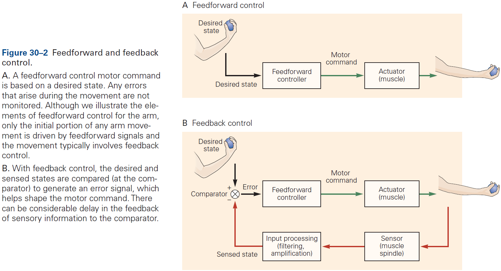
- Open-loop movement: when a motor command is generated without using sensory information.
- For perfect open-loop control, one needs to invert the dynamics of motion to calculate the motor command that will generate the desired motion.
- Inverse model: the neural mechanism that inverts motion back to muscle command.
- An inverse model with open-loop control can determine what motor commands are needed to produce the desired movement.
- Although not monitoring the consequences of an action may seem counterproductive, the main reason to ignore feedback is to reduce delay.
- E.g. Sensorimotor loops using visual stimuli take 120-150 ms for a motor response compared to saccades which take 30 ms and don’t use sensory feedback to guide movement.
- While open-loop control is faster, any movement errors won’t be corrected and therefore will compound over time or over successive movements.
- Also, the more complex the system under control, the more difficult it is to arrive at an accurate inverse model through learning.
- An example of a purely open-loop control system is the control of the eye in response to head rotation: the vestibulo-ocular reflex. The reflex doesn’t require or use vision as the eyes maintain a stable gaze even when the head is rotated in the dark.
- Such precise open-loop control is possible because the dynamic properties of the eye are relatively simple and the eye tends not to be perturbed by external events.
- In contrast, it’s very difficult to optimize an inverse model for a complex musculoskeletal system such as an arm, which requires some form of error correction.
- Internal model: a model that reflects reality within the nervous system.
- Internal models allow an organism to contemplate the consequences of potential actions without actually committing to those actions.
- Thus, internal models are the solution the CNS has developed to solve both control and prediction.
- Control and prediction are two sides of the same coin and map exactly onto the inverse and forward models.
- E.g. Control turns desired sensory consequences into motor commands and prediction turns motor commands into expected sensory consequences.

- Closed-loop control: when a motor command is generated and monitored using sensory information.
- E.g. How the thermostat in a house turns on the heat when the house temperature falls below the desired temperature.
- However, this system has the drawback that the amount of heat put into the house isn’t related to the difference between the current and desired temperature. A better system is one where the control signal is proportional to the error.
- By continuously correcting a movement, feedback control can be robust both to noise in the sensorimotor system and to environmental perturbations.
- While feedback can update commands in response to deviations, it’s sensitive to feedback delays. Shorter delays are better in that they enable more precise control, whereas longer delays means the feedback becomes less useful and may make the system oscillate.
- With a longer delay, the system may respond to errors that no longer exist and may even correct in the wrong direction.
- An example of closed-loop control compared to open-loop control is tracking a moving object. If you put out your finger and quickly move your head left and right while tracking your finger, it’s easy to fixate on your finger. However, if you instead move your finger left and right while keeping your head still, then it becomes much harder.
- Even though the relative motion of finger to head is the same in both conditions, moving your head is precise because it uses the vestibulo-ocular reflex, whereas moving your finger uses feedback and is less precise.
- In most motor systems, movement control is achieved through a combination of feedforward and feedback processes.
- To accurately control movement, the brain requires information about the body’s current state such as the position and velocities of the different segments of the body.
- However, estimating the body’s state isn’t trivial due to delays in sensory transduction and noise.
- Sophisticated computation is required to estimate current body states as accurately as possible and several principles have emerged.
- Principles of body state estimation
    - State estimation relies on internal models of sensorimotor transformations.
    - State estimation can be improved by combining multiple sensory modalities.
        - E.g. Just like how we average a set of experimental data to reduce measurement error, averaging sensory modalities can reduce the overall uncertainty in state estimation.
    - The motor command, when combined with the current body state, can be used to predict the next body state.
        - E.g. A forward model can be used to anticipate how the motor system’s state will change using an efference copy (corollary discharge).
- Using an efference copy is faster than using delayed sensory feedback since it’s available before the movement is carried out, and can therefore be used to anticipate state changes.
- It may seem surprising that the motor command is used in state estimation.
- The drawbacks of only using sensory feedback (too slow) or only motor prediction (drift), can be dealt with by monitoring both and using a forward model to estimate the current state.
- A neural system that does this is called an observer model.

- The major objectives of the observer model are to compensate for sensorimotor delays and to reduce uncertainty in the estimate of the current state.
- The observer model has been supported by empirical studies.
- Active sensing: when movement is used to efficiently gather information.
- Prediction and intermittency can compensate for sensorimotor delays.
- Intermittency momentarily interrupts a movement with rest, thus giving time for the movement to catch up to sensory feedback as long as the rest interval is greater than the delay of sensory feedback.
- E.g. Saccades are momentary periods of stationary eye position.
- Prediction is a better strategy than intermittency since we don’t have to interrupt the movement.
- E.g. When a load is increased by a self-generated action, grip force increases instantaneously with load force. Sensory detection of the load would be too slow to account for this rapid increase in grip force, thus the motor system must predict it.
- E.g. The waiter task. Hold a book on the palm of your hand and if you use your other hand to remove the book, the supporting hand remains still. However, if someone else removes the book, then it’s close to impossible to maintain hand stillness.
- The brain is particularly sensitive to unexpected events or sensory prediction errors.
- Prediction compensates for delay, but is also a key element in sensory processing.
- Sensory signals don’t carry a label of “external” versus “internal” so our CNS must distinguish between the two using prediction.
- Subtracting predictions of sensory signals that arise from our own movements from the total sensory feedback enhances signals that carry information about external events.
- E.g. This explains why self-tickling is less intense than tickling by others.
- With delayed tactile input, the predictions become inaccurate and thus fail to cancel sensory feedback, resulting in perceiving the input as external.
- Current research suggests that sensory information used to control actions is processed in distinct neural pathways from those that contribute to perception.
- Size-weight illusion: when lifting two objects of different size but equal weight, people report that the smaller object feels heavier.
- The illusion is a result of high-level cognitive centers but also that sensorimotor systems can operate independently of these centers.
- Motor plans translate tasks into purposeful movement. However, the range of possible movements and trajectories is infinite as there are an infinite number of combinations of muscles and trajectories.
- Do we all move in a unique way or is there a pattern between people?
- Evidence shows that we don’t all move in a unique way and that repetitions of the same behavior by one person, as well as comparisons between people, have shown that patterns of movement are very stereotypical/similar.
- E.g. Our hands tend to move roughly in a straight path and hand speed is typically smooth, unimodal, and roughly symmetric.
- To achieve such straight-line movement of the hand, the motor system must coordinate a combination of complex joint rotations.
- The fact that hand trajectories are more invariant than joint trajectories suggests that the motor system is more concerned with controlling the hand, even at the cost of generating complex patterns of joint rotations.

- Motor equivalence: when a movement can be performed regardless of the limb or body segment used.
- E.g. We write using all of our limbs even though the writing may not be as clean.
- Motor equivalence suggests that purposeful movements are represented in the brain abstractly rather than as sets of specific joint motions or muscle contractions, thus providing flexibility.

- Why do people choose one particular way of performing a task out of the infinite possibilities?
- The fundamental idea that’s emerged is that planning can be equated with choosing the best way to achieve a task.
- This means optimizing a cost associated with movement. Different ways of achieving a task lead to different costs.
- For movement, we appear to be optimizing for task success and effort/energy.
- Task success is limited by noise due to the excitability of motor neurons and because fluctuations in the number of motor neurons leads to greater fluctuations in force.
- In general, there’s a tradeoff between effort and accuracy. Being more accurate requires substantially more energy.
- To optimize for task success and effort, the brain doesn’t specify the desired body state or trajectory but rather an optimal feedback controller to generate the movement.
- Given the goal of the task, the controller specifies the motor command suitable for different possible body states.
- The trajectory is then a consequence of applying the feedback controller to the current estimate of body state.
- Optimal feedback control will only correct for deviations that are task relevant, thus allowing variations in task-irrelevant movement.
- E.g. When pushing a door open, it doesn’t matter where you push the door so deviations in hand location are ignored.
- The goal of optimal feedback control isn’t to eliminate all variability/noise, but to allow it to accumulate in dimensions that don’t interfere with the task while minimizing it in the dimensions that are task-relevant.

- Multiple processes contribute to motor learning, and while evolution can hardwire some innate behaviors, motor learning is required to adapt to new and changing environments.
- New motor skills can’t be acquired by fixed neural systems so they must be flexible.
- Most forms of motor learning involve procedural/implicit learning because subjects are generally unable to express what it is that they’ve learned.
- Two types of sensorimotor learning
    - Adaptations to changes in the sensorimotor system.
    - Learning new skills.
- Error-based learning involves adapting internal sensorimotor models by comparing the desired outcome to the predicted outcome.
- The difference between the predicted and actual outcome, called the sensory prediction error, can be used to update the internal model.
- Error-based learning tends to lead to trial-by-trial reduction in error as the motor system learns the new sensorimotor properties.
- Evidence that we update our internal model during motor learning comes from experiments where subjects have to compensate for an anticipated force while moving something.
- When the force is removed, subjects show a large aftereffect in the opposite direction due to correcting for a force that isn’t there anymore.

- Motor adaptation may not be a single process as recent evidence suggests that adaptation is driven by interacting processes.
- These interacting processes could have different temporal properties such as one that rapidly adapts but also rapidly forgets, while another process slowly adapts but also slowly forgets.
- The advantage of such a mechanism is that learning processes can be matched to the temporal properties of the perturbations, which can range from short-lived to long-lasting.
- In contrast to error-based learning where the sensorimotor system adapts to a perturbation, learning skills such as tying shoelaces, juggling, or typing involves improving performance in the absence of a perturbation.
- Such learning tends to improve the speed-accuracy trade-off.
- E.g. Typing faster but just as accurately.
- If the task doesn’t provide a readily available error signal, such as if success is determined by a chain of movements, success can be achieved using reinforcement learning instead.
- E.g. The correct sequence of leg and body movements required to make a swing go higher is complex and the error (height from ground) isn’t directly controlled. So instead, we use reinforcement learning where we reinforcement movements that do increase swing height.
- Reinforcement learning is more general than error-based learning in that the training signal is success or failure, rather than error at each point in time.
- A key problem that reinforcement learning solves is the credit assignment problem.
- Credit assignment: which action within a sequence should we give credit or blame when we succeed or fail?
- Reinforcement learning can be model-based or model-free.
- While model-free learning avoids the computational burden of building a model, the tradeoff is that it’s less able to generalize to new situations.
- To deal with noise, the sensorimotor learning system constrains the way in which the system is updated in response to errors. These constraints reflect the internal assumptions about the task structure and the source of errors, and determine how the system represents the task.

**Highlights**

- Our motor actions are controlled by the integrated actions of the motor cortex, spinal cord, cerebellum, and basal ganglia.
- To control action, the CNS uses a hierarchy of sensorimotor transformations that convert incoming sensory information into motor outputs.
- There’s a tradeoff between speed and accuracy at the different levels of sensorimotor response; from reflexes to voluntary control.
- The motor systems generate commands using feedforward circuits or error-correcting feedback circuits; most movements involve both.
- The brain uses internal models of the sensorimotor system to facilitate control.
- Body state is estimated using both sensory and motor feedback signals together with a forward predictive model to reduce the effect of delays in feedback.
- Motor control circuits aren’t static but undergo continual modification and recalibration throughout life.
- Motor learning improves motor control in new situations, and different forms of sensory information are vital for learning. Error-based learning is important for adapting to simple sensorimotor perturbations, while reinforcement learning is important for more complex skill learning and can be model-based or model-free.
- The motor representations used by the brain constrain the way the sensorimotor system updates during learning.

## Chapter 31: The Motor Unit and Muscle Action

- Moving isn’t simple. Not only does the nervous system have to decide which muscles to activate, how much to activate them, and the sequence to active them, it must also control the influence of the resultant muscle forces on other body parts and maintain the required posture.
- The motor unit is the elementary unit of motor control.
- Motor unit: a motor neuron and the multiple muscle fibers it innervates.
- A typical muscle is controlled by a few hundred motor neurons whose cell bodies are clustered in a motor nucleus in the spinal cord or brain stem.

- The axon of each motor neuron exits the spinal cord through the ventral root or cranial nerve in the brain stem, and runs in a peripheral nerve to the muscle.
- When the axon reaches the muscle, it branches and innervates from a few to several thousand muscle fibers depending on whether there needs to be fine muscle control or not.
- APs transmitted down the axon releases acetylcholine (ACh) at the neuro-muscular synapse/junction.
- Since APs in all muscle fibers of a motor unit occur at about the same time, they contribute to extracellular currents that sum to generate a field potential near the active muscle fibers.
- Most muscle contractions involve the activation of many motor units.
- Each fiber in most mature vertebrate muscles is innervated by a single motor neuron. But single motor neurons can innervate multiple fibers.
- Innervation number: the number of muscle fibers a motor neuron controls/innervates.
- E.g. One motor neuron controls 5 eye muscles fibers, but another motor neuron controls 1,800 leg muscle fibers.
- Differences in innervation number determine the differences in increments of force produced by activation of different motor units in the same muscle.
- Thus, innervation number also indicates the fineness of control of the muscle at low forces.
- E.g. The smaller the innervation number, the finer the control.
- The force exerted by a muscle depends on the number of motor units activated and the contraction speed, maximal force, and fatigability of motor units.
- Twitch contraction: the mechanical response of a muscle to a single AP.
- Contraction time: time it takes a muscle twitch to reach its peak force.
- Tetanus: the mechanical response to a series of APs that produce overlapping twitches.
- The force exerted during tetanus depends on how overlapping the twitches are and thus how they summate.
- The functional properties of motor units vary across the population and between muscles. At one extreme, motor units have long twitch contraction times, produce small forces, and are less fatigable. At the other extreme, motor units have short contract times, produce large forces, and are more fatigable.

- The order of motor unit recruitment beings with the slow-contracting, low-force units and proceeds up to the fast-contracting, high-force units.
- The range of properties exhibited by motor units is partially due to differences in the structural specialization and metabolic properties of muscle fibers.
- Physical activity can change motor units properties.
- E.g. Brief but strong contractions increase motor unit force (strength), brief but rapid contractions increase motor unit discharge rate (power), and prolonged but weak contractions reduce motor unit fatigability (endurance).
- However, training regimens have little effect on the composition of a muscle’s fibers.
- Muscle force is controlled by the number of activated motor units and the rate that each active motor neurons discharges.
- Increasing force is implemented by activating more motor units, which are progressively recruited from weakest to strongest.
- Size principle of motor neuron recruitment: contraction force is increased by recruiting the smallest motor neuron first and the largest motor neuron last.

- Two consequences of the size principle
    - The sequence of motor neuron recruitment is determined by the properties of spinal neurons. This means that the brain can’t selectively activate specific motor units but must activate them in a specific order (from smallest to largest).
    - Axons from small motor neurons are thinner than large motor neurons and innervate fewer muscle fibers. Since a key determinant of motor unit force is the number of muscle fibers innervated by a motor neuron, motor units are activated in order of increasing strength.
- The order that motor units are recruited doesn’t change with contraction speed, and faster contractions only require the order to be shortened.
- Input from the brain stem can adjust the gain of the motor unit pool to meet the demands of different tasks.
- The nervous system must account for the structure of muscles to achieve specific movements.
- Skipping over the contractile protein details of muscles (sarcomere) and the cross-bridge cycle.

**Highlights**

- The basic functional unit for the control of movement is the motor unit, which comprises a motor neuron and the muscle fiber(s) it innervates.
- The force exerted by a muscle depends on the number and properties of the motor units activated, and the rates that they discharge APs. The key motor unit properties are contraction speed, maximal force, and fatigability.
- Motor unit properties vary continuously across the population that innervates each muscle, so there aren’t any distinct types of motor units.
- Motor units tend to be activated in a stereotypical order that’s highly correlated with motor neuron size. The rate that motor units are recruited during a voluntary contraction increases with contraction speed.
- The rate that motor units discharge APs can be controlled by descending inputs from the brain stem.
- Except at low forces, variations in discharge rate have a greater influence on muscle force than does the number of activated motor units.
- The variability in discharge rate of the motor unit population influences the level of fine motor control.
- The nervous system must coordinate the activity of multiple muscles to engage in complex actions. Such actions are organized into a few sets that exhibit a stereotypical pattern of activation, but it isn’t known why particular patterns are preferred.

## Chapter 32: Sensory-Motor Integration in the Spinal Cord

- The sensory-motor integration that makes the ongoing regulation of movement possible takes place at many levels of the nervous system, but the spinal cord has a special role because of its close proximity between sensory input and motor output.
- Reflex pathways in the spinal cord produce coordinated patterns of muscle contraction.
- The simplest and most studied spinal reflex is the stretch reflex, a reflex muscle contraction caused by the lengthening of the muscle.
- Initially, it was thought that the reflex was intrinsic to muscles but cutting either the dorsal or ventral root of the spinal cord abolishes the reflex.
- During a stretch reflex, the antagonist muscles are inhibited to prevent movements that would resist the reflex.
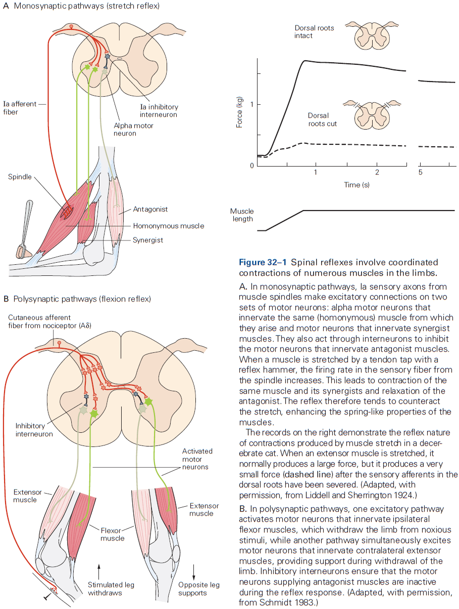
- Muscle spindle: sensory receptors in the fleshy part of a muscle that signal changes in muscle length.
- Muscle spindles are used by the CNS to sense relative positions of the body segments.
- We now know that a major component of the neural control system for walking is a set of intrinsic spinal circuits that don’t require sensory stimuli and thus aren’t a reflex.
- Sensory feedback helps to shape voluntary motor commands through spinal reflex networks.
- Reciprocal innervation is useful not only in stretch reflexes but also in voluntary movements as relaxation of the antagonist muscle enhances speed and efficiency because muscles don’t work against each other.
- This organizational feature simplifies the control of voluntary movements, because higher centers don’t have to send separate commands to the opposing muscles.
- It’s sometimes desired to contract both muscle and antagonist at the same time to stiffen the joint. Stiffening the joint is useful because it increases precision and joint stability.
- E.g. Co-contraction of flexor and extensor muscles of the elbow right before catching a ball.
- State-dependent reflex reversal: when a sensory fiber has either an inhibitory and excitatory effect depending on the state.
- This phenomenon shows how transmission in a spinal circuit is regulated by descending motor commands to meet the changing requirements during movement.
- Descending inputs modulate sensory input to the spinal cord by changing the synaptic efficiency of primary sensory fibers.
- Inhibition provides a mechanism where the nervous system can reduce sensory feedback predicted by the motor command while allowing unexpected feedback to access the spinal motor circuit and the rest of the nervous system.
- E.g. Inhibitory neurons generally increase in activity during movements that are highly predictable such as walking and running.
- In cats and most other vertebrates, the corticospinal tract has no direct connections to spinal motor neurons and all descending commands have to be channeled through spinal interneurons that are also part of reflex pathways.
- Humans and old world monkeys are the only species in which corticospinal neurons make direct connections with spinal motor neurons in the ventral horn of the spinal cord.
- Even in these species, a considerable fraction of the descending connections terminate in the intermediate nucleus on spinal interneurons.
- A considerable part of each descending command for movement has to be conveyed through spinal interneurons, and integrated with sensory activity before reaching motor neurons.
- Neurons in spinal reflex pathways are activated prior to movement.
- E.g. In human subjects where muscle contraction was prevented by lidocaine, the voluntary effort to contract the muscle still changed the transmission in reflex pathways as if the movement had actually taken place.
- Stretch reflexes are routinely used in clinical examination of patients because changes in the strength of the reflex indicates damage to the nervous system.
- Absent or weak stretch reflexes indicate damage to the PNS or CNS, while strong/hyperactive stretch reflexes always indicate that the lesion is in the CNS.

**Highlights**

- Reflexes are coordinated, involuntary motor responses initiated by a stimulus applied to peripheral receptors.
- Many groups of interneurons in spinal reflex pathways are also involved in producing complex movements.
- Reflexes are smoothly integrated into centrally generated motor commands because of the convergence of sensory signals onto spinal and supraspinal interneuronal systems involved in movement.
- Injury or disease of the CNS often results in significant alterations in the strength of spinal reflexes which aids diagnosis.

## Chapter 33: Locomotion

- While the basic locomotor-generating circuits have been conserved, the evolution of limbs and the complex patterns of behavior have resulted in the development of progressively more complex spinal and supraspinal circuits.
- The cerebral cortex contributes primarily to the planning and execution of locomotion, whereas the basal ganglia and the cerebellum contribute to the selection of locomotor activity and to its coordination.
- Locomotion: the act of moving.

- Locomotion requires the production of a precise and coordinated pattern of muscle activity.
- The unit of measure of locomotion in limbed vertebrates is the step cycle.
- Step cycle: time between any two successive events.
- Phases of the step cycle
    - Swing phase: when the foot is off the ground and transferred forward.
    - Stance phase: when the foot contacts the ground and propels the body forward.
- Each of these phases can be further divided into a period of flexion (F) followed by an initial period of extension (E1) during swing and two additional periods of extension (E2 and E3) during stance.
- Activity in most extensor muscles begins before the foot contacts the ground. This preparatory prestance phase signifies that the extensor muscle activity is centrally programmed and not simply the result of afferent feedback from contact of the foot with the ground.
- Interlimb coordination: the precise coupling between different limbs.
- The appropriate generation of intra- and inter-limb coordination of activity and the adaptation of these patterns of activity according to context is one of the major functions of the CNS during locomotion.
- The motor pattern of stepping is organized at the spinal level.
- While the entire nervous system is needed to produce a rich behavioral set of motions, the spinal cord is sufficient to generate both the rhythm underlying locomotion and the specific pattern of muscle activity required for limb coordination.

- Central pattern generator (CPG): a group of neurons that can generate both the rhythm and pattern of locomotion independent of sensory inputs.
- Experiments on a variety of species suggest that there are separate CPGs for each limb.
- E.g. On split-belt treadmills, the left and right limbs can walk in independent step cycles.

- Even though CPGs can produce the precise timing and phasing needed to walk, they’re also modulated by sensory signals from the moving limbs.
- Specifically, proprioceptive and tactile information modulate CPG activity.
- Proprioception regulates the timing and amplitude of stepping, while tactile information is used to detect unexpected obstacles.
- Interestingly, a stimulus applied during the swing phase causes rapid movement away from the stimulus, but if its applied during the stance phase, it produces the opposite response, causing movement towards the stimulus. This is appropriate because during the stance phase, the animal might collapse if it’s being supported by the limb.
- This is an example of phase-dependent reflex reversal as the same stimulus can excite one group of motor neurons during one phase of locomotion while activating the antagonist motor neurons during another phase.
- Although the basic motor patterns for locomotion are generated in the spinal cord, the initiation, selection, and planning of locomotion require activation of supraspinal structures such as the brain stem, basal ganglia, cerebellum, and cerebral cortex.
- The locomotor networks in the spinal cord require a command or start signal from supraspinal regions to initiate and maintain their activity.
- The major neuronal structure involved in movement initiation is a region in the midbrain called the mesencephalic locomotor region (MLR).

- Tonic electrical stimulation of the MLR results in animals standing up and walking.
- Two structures of the MLR
    - Cuneiform nucleus (CNF)
    - Pedunculopontine nucleus (PPN)
- Electrical stimulation of both structures has been unable to determine which nucleus is involved in the initiation of locomotion and speed control.
- The MLR is composed of two regions that act together to select context-dependent locomotor behavior.
- Midbrain nuclei that initiate locomotion project to brain stem neurons.
- The excitatory signals from CNF and PPN are relayed indirectly to the spinal cord through neurons in the brain stem reticular formation.
- The mechanisms by which the final command signals from the brain stem to the spinal cord activate the spinal locomotor networks, maintain their activity, and allow the expression of different gaits are unknown.
- Brain stem nuclei also regulate posture during locomotion.
- E.g. Tonic electrical or chemical stimulation of the pons and medulla modulates the level of muscle tone in the limbs and can either facilitate or suppress locomotion depending on the stimulated site.
- In mammals, lesions of the motor cortex don’t prevent animals from walking on a smooth floor, but they severely impair precision locomotion, which requires a high degree of visuomotor coordination.
- E.g. Walking on the rungs of a horizontal ladder, stepping over barriers, and stepping over objects on a treadmill.
- Stimulation experiments suggest that in mammals, the corticospinal tract has privileged access to the rhythm generator of the CPG.
- Planning of locomotion involves the posterior parietal cortex (PPC) as suggested by lesions to this region that cause cats to hit obstacles more.
- The cerebellum regulates the timing and intensity of descending signals as damage results in marked abnormalities in locomotor movements such as ataxia.
- Ataxia: a lack of muscle control or coordination of voluntary movements.
- One major function of the cerebellum is to correct movement by comparing the motor signals sent to the spinal cord and the movement produced by that motor command.
- Specifically, neurons in the dorsal spinocerebellar tract (DSCT) are strongly activated by proprioceptors and thus provide information about the mechanical state of the limb.
- In contrast, neurons in the ventral tract (VSCT) are activated by interneurons in CPGs and thus provide information about the state of the spinal locomotor network.
- The cerebellum integrates three information streams: the motor command (efference copy), the movement (afference copy from DSCT), and the state of spinal networks (spinal efference copy from VSCT).
- The cerebellum projects to the motor cortex and various brain stem nuclei where they modulate descending signals to the spinal cord to correct for any motor errors.
- Experiments also show that the cerebellum plays an important role in the adaptation of gait.
- E.g. Patients with damage to the cerebellum don’t show adaptation to the split-treadmill experiment.
- The basal ganglia modify cortical and brain stem circuits, and it’s importance is clearly demonstrated by the deficits in locomotion seen in patients with Parkinson’s disease.
- Parkinson’s disease disrupts the normal functioning of the basal ganglia due to degradation of their dopamine inputs from the substantia nigra.
- Symptoms of Parkinson include shuffling gait and problems with balance during locomotion with anticipatory postural adjustments.
- These symptoms suggest that the basal ganglia contribute to the initiation, regulation, and modification of gait patterns.
- Neuronal control of human locomotion is similar in quadrupeds and evidence suggests that all of the major principles on the origin and regulation of walking in quadrupeds also applies to humans.
- Although the issue of whether CPGs exist in humans remains debated, several observations are compatible with the view that CPGs are important for human locomotion.
- E.g. Patients with a spinal cord injury have similar deficits that match studies with cats.
- Parallels between human and quadrupedal walking have also been found in patients trained after spinal cord injury.
- Evidence supporting the existence of spinal CPGs in humans also comes from studies in human infants who make rhythmic stepping movements immediately after birth if held upright and moved over a horizontal surface.
- Infants who lack cerebral hemispheres (anencephaly) still show stepping, suggesting that the circuits must be located at or below the brain stem.
- This strongly suggests that some of the basic neuronal circuits for locomotion are innate and present at birth when descending control systems aren’t well developed.
- Deficits in human motor cortex are much stronger than in cats or even nonhuman primates, suggesting that our motor cortex plays a more important role in locomotion than in other mammals.

**Highlights**

- Locomotion is a highly conserved behavior that’s essential for the survival of species.
- The complex nervous systems of mammals and its organization of different neural pathways involved in the generation and regulation of locomotion has been explored in significant detail.
- The spinal cord, in isolation from descending and rhythmical peripheral afferent inputs, can generate a complex locomotor pattern. The circuits responsible for producing this activity are called central pattern generators (CPGs).
- Activity in spinal circuits can be modified by experience.
- Ionic membrane properties in interneurons and motor neurons contribute to rhythm and pattern generation.
- Information from proprioceptive sensors is used to stabilize phase transitions between stance and swing, while information from exteroceptors is used to modify limb activity in response to unexpected perturbations.
- Circuits involved in initiating locomotion, controlling speed of locomotion, and selecting gaits are localized in the midbrain, specifically the pedunculo-pontine and cuneiform nuclei.
- The three main structures in the brain stem (pontomedullary reticular formation, lateral vestibular nucleus, and red nucleus) all contribute to the control of posture and interlimb coordination.
- The motor cortex provides precise control of muscle activity patterns to allow animals to make visually guided anticipatory adjustments of their gait.
- The posterior parietal cortex (PPC) is part of a network that contributes to the advanced planning of gait based on visual information. PPC neurons estimate the relative location of objects with respect to the body and retain information in working memory to facilitate coordination of the limbs.
- The cerebellum and basal ganglia are used to correct motor errors and to select the appropriate patterns of motor activity.

## Chapter 34: Voluntary Movement: Motor Cortices

- Understanding how purposeful actions are achieved is one of the greatest challenges in neuroscience.
- In contrast to reflexes that are automatically triggered by incoming sensory stimuli, voluntary movements are purposeful, intentional, context-dependent, and are typically accompanied by a sense of “ownership”.
- That is, the actions have been willfully caused by the individual and are often made without an external trigger stimulus.
- The world presents many challenging contexts for action so voluntary action involves choices between alternatives, including the choice not to act.
- Volitional self-control over how, when, and whether to act endows primate voluntary behavior with much of its richness and flexibility, and prevents behavior from becoming impulsive, compulsive, or even harmful.
- Voluntary movement is the physical manifestation of an intention to act on the environment to achieve a goal.
- Since large areas of the cerebral cortex are implicated in various aspects of voluntary motor control, the study of cortical control of voluntary movement provides important insights into the functioning of the cerebral cortex as a whole.
- The brain must transform a goal into motor commands that realize that goal.
- Just like how the activity of neurons in primary sensory areas appears to encode specific physical properties of stimuli, the sensorimotor transformation model assumes that the activity of neurons in the motor system explicitly encodes or represents specific properties and parameters of the intended movement.

- However, the sensorimotor transformation model has important limitations such as the parameter and coordinate systems being imported from physics and engineering, rather than being derived from physiological properties of biological sensors and effectors.
- Another limitation is that the model places all emphasis on strictly serial feedforward computations and doesn’t capture the complexity of feedback as seen in the brain.
- Lastly, the model hasn’t addressed how the proposed sensorimotor transformations could be implemented by neurons.
- In recent years, theoretical studies of the motor system have been moving away from strictly representational models to more dynamical causal models.
- One example of a dynamical causal model is optimal feedback control.
- Three parts of optimal feedback control
    - State estimation: involves forward internal models (efference copies) and external sensory feedback to provide the best estimate of the present state of the body and the environment.
    - Task selection: involves the brain choosing a behavioral goal in the current context and what motor action(s) may best attain that goal.
    - Control policy: provides the set of rules and computations that establish how to generate the motor commands to attain the behavioral goal given the present state of the body and the environment.
- The control policy isn’t a series of pure feedforward computations to calculate every instantaneous detail of a desired movement. Instead, it involves context- and time-dependent adjustments to feedback circuits.
- Skipping over the details on primary motor cortex (M1), dorsal premotor cortex (PMd), predorsal premotor cortex (pre-PMd), ventral premotor cortex (PMv), supplementary motor area proper (SMA), presupplementary motor area (pre-SMA), and intraparietal sulcus (IPS).

- The key descending pathway from M1 for voluntary control is the pyramidal tract, which originates in cortical layer V in the precentral and parietal areas.
- M1 neurons with direct monosynaptic projections to spinal motor neurons are called corticomotorneuronal cells.
- A critical feature of voluntary behavior is that movement initiation isn’t obligatory the instant an intention to act is formed.
- This volitional control over the timing of movement can be exploited in instructed-delay motor tasks where movement is withheld until a signal is given.
- Thus, we can dissociate, in time, the neural processes associated with the intention to move from the neural processes of moving.
- Results show that neurons in all movement-related cortical areas discharge prior to and during movement execution in reaction-time tasks, and their activity correlates with different properties of movements.
- E.g. Some neural activity is correlated with direction, velocity, trajectory, forces, and muscle activity.
- Even though planning and execution are distinct serial stages in voluntary motor control, they’re not implemented by distinct neural populations in different cortical areas.
- The parietal cortex provides information about the world and the body for state estimation to plan and execute motor actions.
- The idea that the parietal cortex has a single topographical representation of space is inaccurate and instead, it has several distinct functional areas that work in parallel and receive different combinations of sensory and motor inputs.
- In and near the IPS, there’s a broad range of neural response properties, from neurons that respond almost exclusively to visual input about objects, to neurons that discharge only during hand movements.
- A fascinating discovery of the parietal cortex is that the receptive fields of neurons can be altered by individual experience.
- E.g. Monkeys trained to grab food using a rake tool have many VIP neurons with receptive fields expanded to incorporate the tool. It was as if the distal end of the tool had become a functional extension of the monkey's own hand and arm.

- The premotor cortex supports motor selection and planning, and different areas handle different functions.
- Lesions of the SMA, pre-SMA, and connected prefrontal areas produce deficits in the initiation and suppression of movements.
- E.g. Socially inappropriate behaviors, movements without conscious awareness, and using objects without consideration of the social context such as putting on multiple glasses.
- The medial premotor cortex is involved in the contextual control of voluntary actions and is split into two areas: caudal SMA and rostral SMA (we call this the supplementary motor cortex (SMC)).
- The SMC is implicated in many aspects of voluntary behavior but its function remains controversial.
- In humans, electrical stimulation of SMC below the threshold for movement initiation can evoke an introspective sense of an urge to move that doesn’t arise during M1 stimulation.
- Lesions of SMC produce problems initiating desired movements or suppressing undesired movements.
- Neurons in both SMA and pre-SMA discharge before and during voluntary movements.
- The SMC has been implicated in the executive control of behavior such as switching between different actions, plans, and strategies, and may contain a system that can override motor plans when they’re not appropriate.
- The SMC is also implicated in the organization and execution of movement sequences, and may reflect the general role of contextual control of voluntary behavior.
- Contextual control: selecting and executing actions appropriate for the different combinations of internal and external cues, as well as withholding inappropriate actions in a specific context.

- The dorsal premotor (PMd) cortex is involved in planning sensory-guided movement of the arm.
- Experiments suggest that PMd activity can signal the intention to generate a motor act independent of the effector used to generate the action in an extrinsic spatial coordinate framework.
- The PMd can also prepare for multiple potential motor actions prior to a decision and activity seems to reflect a maximum of three to four simultaneous possible motor actions.

- The parietal cortex also seems to retain a representation of potential actions that are ultimately not executed.
- For rule/association-based behaviors, the PMd cortex is involved as many cells in premotor areas respond selectively to specific cues.

- The ventral premotor (PMv) cortex is involved in planning motor actions of the hand, and electrical stimulation shows that PMv contains extensively overlapping circuits that control hand and mouth movements.
- A striking property of PMv neurons is that their activity is often correlated with the goal of a motor act and not with the individual movements forming it.
- E.g. PMv neurons discharge when grasping an object regardless of the body part doing the grasping like the right and left hand, and even the mouth.
- Interestingly, experiments on discriminating two tactile frequencies would expect the frequency representations to be stored in the primary and secondary somatosensory cortices. However, there was no sustained activity in S-I and only a transient representation in S-II.
- Instead, many neurons in the prefrontal cortex, SMC, and PMv showed sustained activity proportional to the frequency and neurons specifically in the PMv encoded the difference in frequency independent of their actual frequencies.
- Thus, neural activity in PMv appears to express the operations required to choose a motor response based on sensory information.

- Some premotor and parietal areas can be activated when no overt action is intended, such as when someone is asked to imagine performing a certain motor act. This is called motor imagery.
- We assume that neural activity evoked by motor imagery reflects brain mechanisms associated with motor planning and preparation without overt execution.
- Skipping over the part on mirror neurons.
- While we’ve described the roles of premotor areas in parietal and precentral cortex, we should also emphasize that major sensorimotor control processes are also shared across multiple cortical regions by reciprocal interconnections.
- The primary motor cortex includes a detailed map of the motor periphery.
- This was found out by electrically stimulating the surface of the cortex in different anesthetized species, which evoked movements in different parts of the contralateral body.
- The area that required the lowest electrical current needed to evoke movements was along the rostral bank of the central sulcus, the same region we call the primary motor cortex.
- Within this strip of tissue, stimulation of adjacent sites evoked movements in adjacent body parts.
- Early experiments showed that the motor cortex contains an orderly motor map of major parts of the contralateral body and that the integrity of the motor map is necessary for voluntary control.
- The general topographic organization of the map is conserved across many species.
- Like the somatosensory cortex, the motor map isn’t an exact point-to-point reproduction of the body’s anatomical form, but instead more finely controlled body parts are represented by disproportionately larger areas, reflecting the larger number of neurons needed for fine motor control.
- Neurons controlling the muscles of the digits, hand, and distal arm tend to be concentrated within a central zone, whereas those controlling more proximal arm muscles are located in a horseshoe-shaped ring around the central core.

- Lesions to the primary motor cortex (M1) cause different effects across species.
- E.g. Cats don’t become paralyzed after M1 lesions but they have severe difficulties using visual information to navigate within a complex environment. Large M1 lesions in monkeys cause initial paralysis and permanent loss of independent movements of the thumb and fingers. More focal lesions of M1 typically results in muscle weakness, slow and imprecise movements, and discoordination.
- In humans, large motor cortex lesions are particularly devastating, resulting in severe motor deficits or complete paralysis of affected body parts, usually with limited potential for recovery.
- Many corticospinal neurons terminate only on spinal interneurons, while corticomotoneuronal (CM) cells project directly to spinal motor neurons.
- CM cells are very rare or absent in nonprimate species and become a larger component of the corticospinal tract in primate evolution.
- Often a CM cell axon directly excites spinal motor neurons for several agnoist muscles and indirectly suppresses the activity of some antagonist muscles through spinal inhibitory interneurons.
- The fact that CM cells are more prominent in humans than in other species may be one of the reasons why lesions of M1 in humans have a more profound effect on voluntary motor control compared to other mammals.
- One of the main functions of CM cells is to enable voluntary and precise control over the fingers, hand, arm, face and mouth in primates.
- Activity in the primary motor cortex reflects many spatial and temporal features of motor output.
- One major experimental challenge in identifying how M1 controls movement is the fact that almost all movement-related parameters are intercorrelated through the laws of motion.
- Activity of many M1 neurons varies systematically with the magnitude of muscle force output.
- M1 neurons generate signals that take into account the changes in intrinsic limb biomechanics during reaching movements.
- Bias in the physics of limb movement lead to a bias in the preferred direction of shoulder and elbow muscles, which also biases neurons to have the same preferred direction.
- Thus, the physics of the limb dictates the pattern of muscle activity needed to generate movement, and this in turn is reflected in the pattern of neural activity in M1.
- Review of population vectors.
- Muscle afferent feedback is surprisingly fast as it takes as little as 20 ms for M1 neurons to respond following a mechanical disturbance to the limb.
- One of the most remarkable properties of the brain is the adaptability of its circuitry to changes in the environment, in other words, the capacity to learn from experience and to store the acquired knowledge as memories.
- E.g. When we practice a motor skill, performance improves.
- Experience can modify the maps in the brain as different areas shrink or grow.

- Why are some motor skills relatively easy to learn but others are very difficult? We don’t know.

**Highlights**

- There are two phases of voluntary motor control: planning and execution.
- The overall problem that the motor system must solve to control voluntary movement is to convert sensory information about the current state of the world and the body into plans for action and ultimately patterns of muscle activity.
- Representational models, such as the sensorimotor coordinate transformation hypothesis, assume that the motor system directly plans and controls specific features or parameters of intended movements.
- Dynamical system models, in contrast, assume that motor circuits find empirical solutions for the computations underlying the planning and execution of movements by evolutionary and individual adaptive processes.
- One example of a dynamical system model is optimal feedback control. It proposes that planning and execution of voluntary movements involve three functional processes: state estimation, task selection, and control policy.
- Distributed frontoparietal circuits in cerebral cortex play a major role in voluntary control.
- The posterior parietal cortex plays a major role in identifying potential goals and objects in the environment, estimation of body state, and sensory guidance of motor actions.
- Premotor and prefrontal cortices are involved in task selection and motor planning.
- The primary motor cortex in primates has a representation of the entire body along its mediolateral axis, with larger cortical areas devoted to the hand and face relative to other body parts.
- Although parietal, premotor, and primary motor cortical regions play important roles in state estimation, motor planning, and motor execution respectively, they’re not responsible for any one aspect but are instead distributed to some extent across these cortical regions.

## Chapter 35: The Control of Gaze

- Three problems of animals
    - How do we visually explore our environment quickly and efficiently?
    - How do we compensate for planned and unplanned head movements?
    - How do we stay upright?
- This chapter focuses on the oculomotor system and how it uses visual information to guide eye movements.
- The primary goal of the oculomotor system is to control the position of the fovea.
- Fovea: the region in the retina with the highest density of photoreceptors and thus the sharpest vision.
- To simplify, the eye is a sphere that sits in a socket, the orbit, and eye movements are simply rotations of the sphere in the orbit.
- Three axes of rotation: horizontal, vertical, and torsional.
- Horizontal and vertical eye movements change the line of sight by redirecting the fovea, while torsional eye movements rotate the eye around the line of sight but doesn’t change where the eyes are looking.
- Six possible eye rotations (three axes, two directions per axis)
    - Abduction: horizontal rotation away from the nose.
    - Adduction: horizontal rotation toward the nose.
    - Elevation: vertical rotation up.
    - Depression: vertical rotation down.
    - Intorsion: rotation of the top of the cornea toward the nose.
    - Extorsion: rotation away from the nose.
- Two types of eye movement
    - Version: when both eyes move in the same direction.
        - E.g. Tracking a moving object.
    - Vergence: when both eyes move in opposite directions.
        - E.g. When you change your gaze from far to near.

- The six extraocular muscles form three agonist-antagonist pairs.
- Humans and other frontal-eyed animals have binocular vision which facilitates stereopsis.
- Stereopsis: the ability to perceive a visual scene in three dimensions as well as depth perception.
- For most eye movements, both eyes must move by the same amount and in the same direction.
- This is done by pairing the eye muscles in the two eyes.
- Just as each eye muscle is paired with its antagonist in the same orbit, it’s also paired with the muscle that moves the opposite eye in the same direction.
- The extraocular muscles are controlled by three cranial nerves.
- The best way to understand the actions of the extraocular muscles is to consider eye movements that remain after a lesion of a specific nerve.
- Lesions of the extraocular muscles or their nerves results in double vision (diplopia) because the images of the object of gaze no longer fall on the corresponding retinal locations in both eyes.
- Skipping over how lesions of each specific nerve (abducens, trochlear, oculomotor, and sympathetic oculomotor) affect eye movement.
- The force generated by an extraocular muscle is determined both by the firing rate of the motor neurons and the number of motor units recruited.
- In our early understanding of vision, we assumed that all eye movements were smooth. But we later discovered that during reading, the eyes don’t move smoothly along a line of text but instead make fast, intermittent movements called saccades, each followed by a short pause.
- Six types of eye movement
    - Saccadic: movements to rapidly shift the fovea to a new target.
    - Smooth-pursuit: movements to keep the image of a moving target on the fovea.
    - Vergence: movements move the eyes in opposite directions so the object is always on both foveae regardless of its distance.
    - Fixation: during intent gaze when the head isn’t moving by actively suppressing eye movement.
    - Vestibulo-ocular reflexes: stabilize images on the retina during brief head movements.
    - Optokinetic: movements stabilize images during sustained head movements.
- Vision is most accurate when the eyes are still and it’s the gaze system that actively prevents the eyes from moving when we examine an object of interest.
- Patients with fixation disorders have poor vision not because of poor visual acuity, but because they can’t hold their eyes still enough for the visual system to work.
- Our eyes explore the world in a series of very quick saccades that move the fovea from one fixation point to another.
- Saccades allow us to scan the environment quickly and to read. They’re also stereotyped and while we can control its amplitude and direction, we can’t control its speed.
- Normally, there isn’t any time for visual feedback to change a saccade as it’s being made, but corrections are made over the course of successive saccades.
- Higher brain centers only specify the desired change in eye position so other neurons must transform this location signal into eye muscle movements.
- Eye position and velocity information are coded by the discharge frequencies of oculomotor neurons.
- E.g. When a saccade is made, the firing rate of a neuron rises rapidly as eye velocity increases and this is called a saccadic pulse.
- The frequency of this pulse determines the speed of the saccade, whereas the length of the pulse controls the duration of the saccade and thus its amplitude.
- After a saccade, eye muscles must maintain their position by tonic firing of neurons and this is called a saccadic step.
- If the size of the step isn’t matched to the pulse, then the eye drifts away from the target after the saccade.

- The motor circuits for saccades is in the brain stem. Horizontal saccades are generated in the pontine reticular formation (PRF) and vertical saccades are generated in the mesencephalic reticular formation (MRF).
- The PRF has a family of burst neurons that gives rise to the saccadic pulse, and another family of omnipause neurons that stops a saccade.
- Making a saccade requires simultaneous excitation of burst neurons and inhibition of omnipause cells which aids in system stability.

- If the motor neurons only received signals from burst cells, the eyes would drift back to the starting position after a saccade because there wouldn’t be a new position signal to hold the eyes against elastic restorative forces.
- So there needs to be a tonic position signal, the saccadic step, that can be generated from the velocity burst signal by neural integration.
- Velocity can be computed by differentiation position with respect to time and conversely, position can be computed by integrating velocity with respect to time.
- For horizontal eye movements, neural integration of the velocity signal is done by the medial vestibular nucleus, nucleus prepositus hypoglossi, and the flocculus of the cerebellum.
- As expected, animals with lesions to these areas make normal horizontal saccades, but their eyes drift back to the middle position after a saccade.
- For vertical eye movements, neural integration is done in the interstitial nucleus of Cajal.
- Given this detailed mapped of neural structure to function, we know how certain brain stem lesions result in characteristic deficits in eye movements.
- E.g. Lesions to midbrain gaze centers cause paralysis of vertical gaze.
- While pontine and mesencephalic burst circuits provide the motor signals necessary to implement saccades, they’re ultimately controlled by the cerebral cortex through the superior colliculus.
- The superior colliculus (SC) integrates visual and motor information into oculomotor signals for the brain stem.

- The SC can be divided into two functional regions: the superficial layers, and the intermediate and deep layers.
- The superficial layers receive both direct input from the retina and a projection from the striate cortex representing the entire contralateral visual hemifield.
- Neurons in the superficial layers are functionally arranged in a retinotopic map of the visual field in which representation of the visual field closest to the fovea occupies the largest area.
- Neurons in the intermediate and deep layers are primarily related to oculomotor actions and also contains somatotopic, tonotopic, and retinotopic maps of sensory inputs.
- This polymodal spatial map enables us to shift our eyes toward auditory or somatosensory stimuli as well as visual ones.
- Each movement-related neuron in the SC has a movement field, a region of the visual field that’s the target for saccades controlled by that neuron.
- A map of saccades evoked by electrical stimulation of the intermediate layers resembles the visual map.
- A large population of cells is active before each saccade, and eye movement is encoded by the entire ensemble of these broadly tuned cells; also known as population coding.
- Small lesions of the SC affect the latency, accuracy, and velocity of saccades, and destruction of the entire SC results in the inability to make any contraversive saccades although with time, this ability is recovered.
- The rostral SC facilitates visual fixation and is often called the fixation zone.
- Lesions to the fixation zone make it more likely for animals to make saccades to distracting stimuli.
- The SC is controlled by two regions of the cerebral cortex that have overlapping but distinct functions: the lateral intraparietal area and the frontal eye field.
- Each area contributes to the generation of saccades and the control of visual attention.
- Saccadic eye movements and visual attention are closely intertwined.
- In humans, parietal lesions cause dramatic attentional deficits and patients act as if the objects in the neglected field don’t exist.
- Compared to neurons in the parietal cortex, neurons in the frontal eye field are more closely associated with saccades.
- Electrical stimulation of the frontal eye field evokes saccades to the movement fields of the stimulated cells.
- We now understand the effects of lesions to these regions on the generation of saccades. Lesions to the SC produce only transient damage to the saccade system because the projection from the frontal eye field to the brain stem remains intact.
- However, when both the frontal eye field and the SC are damaged, the ability to make saccades is permanently compromised.
- The main effect of a parietal lesion is an attentional deficit, but the system can function normally because the frontal eye field signals are enough to suppress the substantia nigra and stimulate the colliculus.
- Humans with lesions of the frontal cortex have difficulty suppressing unwanted saccades to attended stimuli.
- When we move both our head and eyes, both movements have to be coordinated to direct the fovea to a target.
- For large gaze shifts, the eyes and head move simultaneously in the same direction but because the vestibulo-ocular reflex ordinarily moves the eyes in the direction opposite that of the head, the reflex must be temporarily suppressed so the eyes move too.
- The smooth-pursuit system keeps moving targets on the fovea by calculating how fast the target is moving and moving the eyes at the same speed.
- Smooth pursuit and saccades have very different central control systems.
- Neurons that signal eye velocity for smooth pursuit are found in the medial vestibular nucleus and the nucleus prepositus hypoglossi.

- There are two major inputs to the smooth-pursuit system: motion-sensitive regions in the superior temporal sulcus, middle temporal and medial superior temporal area, and the frontal eye field.
- Lesions of either the middle temporal or medial superior temporal area disrupt the ability of a subject to respond to targets moving in regions of the visual field represented in the damaged cortical areas.
- Lesions of the medial superior temporal cortex also diminish smooth-pursuit movements toward the side of the lesion, regardless of where the target lies on the retina.
- In humans, disruption of the pursuit pathway anywhere along its course: cortical, cerebellar, and brain stem areas, prevents adequate smooth-pursuit eye movements.
- Both the saccade system and smooth-pursuit system move the eyes in the same direction, but the vergence system moves the eyes in opposite directions.
- Our eyes converge to look at close objects and diverge to look at distant objects.

- At any time, the entire visual field isn’t in focus on the retina and the process of changing focus is called accommodation.
- Accommodation and vergence are linked as whenever accommodation occurs, the eyes also converge.

**Highlights**

- The purpose of eye movements is to rotate the eye in the orbit to direct the fovea to objects of interest and then to keep the image steady.
- Six muscles work together to move each eye and they work in three agonist-antagonist pairs.
- There are also six different types of eye movements, each with their own control system
    1. Saccades are fast shifts of the fovea.
    2. Smooth-pursuits are movements that keep up with moving objects.
    3. Vergence movements rotate the eyes in opposite directions to control object depth and focus.
    4. Vestibulo-ocular reflexes hold images still on the retina during brief, rapid head movements.
    5. Optokinetic movements hold images stationary during sustained or slow head movements.
    6. Fixation keeps the eyes still during intent gaze when the head isn’t moving.
- Most large gaze shifts involve both head and eye movements while suppressing the vestibulo-ocular reflex.
- The cerebellum calibrates eye movements based on visual feedback and mediates the learning process that keeps them accurate over time.
- Smooth pursuit is driven by a network that includes the medial vestibular nucleus, the flocculus of the cerebellum, the dorsolateral pontine nucleus, and two motion-selective areas that are found in the superior temporal sulcus of some monkeys.

## Chapter 36: Posture

- The control of posture involves two related goals: equilibrium/balance and orientation.
- Balance maintains the body in a stable position to avoid falling over, while orientation aligns body segments with respect to each other and to the world, such as keeping the head vertical.
- To appreciate the complexity of maintaining balance and orientation, imagine that you’re waiting tables on a boat at sea. Even though your mind is occupied with remembering customer orders, unconscious but complex sensorimotor processes for controlling postural orientation and balance allow you to move in an efficient and coordinated manner without falling.
- Sudden unexpected movements of the boat evoke automatic postural responses that prevent falling.
- Somatosensory, vestibular, and visual information are integrated to provide a coherent sense of position and velocity of the body in space with respect to the support surface and gravity.
- Equilibrium and orientation underlie posture control.
- Postural equilibrium: the ability to actively stabilize the upper body by resisting external forces acting on the body.
- E.g. Gravity, inertial forces, and external perturbations like the wind.
- Postural orientation: the ability to actively align body segments with respect to each other and to the environment.
- E.g. Aligned with respect to gravitational vertical, visual vertical, or support surface like during downhill skiing.
- The sensorimotor mechanisms for postural control are similar in humans and quadrupedal mammals even though their habitual stance is different.
- To maintain balance, the nervous system must control the position and motion of the body’s center of mass as well as the body’s rotation about it.
- Center of mass: the point that represents the average position of the body’s total mass.
- The center of mass isn’t fixed but depends on postural orientation.
- Skipping over the physics details of balance. The general idea is that to maintain balance, the center of mass must be within the base of support (feet).
- Upright stance requires two actions
    - Maintaining support against gravity by keeping the center of mass at some height and joints stable.
    - Maintaining balance by controlling the trajectory of the center of mass in the horizontal plane.
- Balance and antigravity support are controlled separately in the nervous system as each system can be affected by certain pathological conditions without affecting the other.
- E.g. Antigravity support can be excessive after a stroke, but balance control may be preserved. Conversely, in vestibular disorders, antigravity support is normal but balance control is disordered.
- In humans, much of the support against gravity is provided by passive bone-on-bone forces in joints such as knees and stretched ligaments. Some support is also provided by active tonic muscle contraction.
- Postural tone isn’t sufficient, however, for maintaining balance as bipeds and quadrupeds are inherently unstable and their bodies sway during normal stance.
- E.g. Chest motions from breathing cause the body to sway and is actively counteracted by changes in postural tone.
- Postural orientation depends on task requirements and acts independently of balance control.
- E.g. Carrying a full glass of water requires stabilizing the hand against gravity to prevent spills, while reading on a smartphone requires stabilizing the screen with respect to the head and eyes to maintain visual acuity.
- When a sudden disturbance causes the body to sway, various postural motor strategies are used to maintain the center of mass within the base of support.
- E.g. Fixing the base of support but rotating the ankles, or moving or enlarging the base of support by taking a step or grabbing a support with the hand.

- An automatic postural response to a sudden disturbance isn’t a simple stretch reflex but rather the synergistic activation of a group of muscles in a characteristic sequence with the goal of maintaining equilibrium.
- The initial change in length of a muscle due to a perturbation doesn’t determine whether the muscle is recruited for postural control, and stretch reflexes aren’t the basis for postural control.
- The latency of automatic postural responses is shorter than voluntary reaction time but longer than the monosynaptic stretch reflex.
- Postural responses that involve a change in support base have even longer latencies than those that occur when the feet remain in place. Presumably, the longer time allows for greater flexibility in the commands transmitted to move the feet.
- Although individual muscles have unique directional tuning curves, muscles aren’t activated independently but instead are activated together in synergies. The muscles within a synergy receive a common command signal during postural responses.
- This way, the many muscles of the body are controlled by just a few signals, reducing latency at the cost of complexity.
- E.g. Using mathematical techniques for reducing complexity, one can determine that only four synergies are needed to account for the vast majority of activation patterns of 13 muscles in the human leg and trunk during automatic postural responses.
- Like the arrangement of notes in a musical chord, each muscle synergy specifies the timing and amplitude of activation for each muscle together with others, and each muscle belongs to more than one synergy.

- Postural responses not only improve with practice, but the improvements are retained which is a sign of motor learning.
- Voluntary movements can also destabilize postural orientation and equilibrium.
- The nervous system uses anticipatory postural adjustments to correct stability and often the activation of postural adjustments happens before the primary movement.
- This is another use of efference copies and how they aid the nervous system to correct for its own actions.
- However, this requires that voluntary muscle activation be delayed when the task requires active postural stability.
- Another common preparatory postural adjustment occurs while walking as the center of mass is accelerated forward. This postural adjustment appears to be independent of the stepping program that underlies locomotion.
- During walking and running, the body is in a constant state of falling as the center of mass moves forward beyond the support base.
- Falling is prevented by moving the support base forward under the falling center of mass.
- Since information about motion from any one sensory modality may be ambiguous, multiple modalities are integrated to determine what orientation and motion of the body are appropriate.
- Somatosensory, vestibular, and visual information must be integrated and interpreted to maintain posture.
    - Somatosensory inputs are important for the timing and direction of automatic postural responses.
    - Vestibular inputs is important for balance on unstable surfaces and during head movements.
    - Visual inputs provide the postural system with orientation and motion information.
- Loss of large-diameter somatosensory fibers delays automatic postural responses.
- Unlike somatosensory inputs, vestibular signals aren’t essential for the normal timing of balance reactions but instead they influence the directional tuning of a postural response.
- Visual processing is too slow to significantly affect the postural response to a sudden and unexpected disturbance of balance.
- However, vision does aid in anticipatory postural adjustments during voluntary movements and can have a powerful influence on postural orientation.
- E.g. Simulated roller coaster rides and virtual reality can cause feelings of vertigo and imbalance.
- Information from a single sensory modalities can be ambiguous.
- E.g. Vision can’t distinguish self-motion from object motion, vestibular information only signals head (not body) acceleration and can’t distinguish between acceleration due to gravity or acceleration due to motion, and somatosensory inputs can’t tell if ankle flexion comes from body tilt or surface tilt.
- Therefore, all three modalities are integrated to give the nervous system an accurate picture of the stability and inclination of the support surface and of our body’s relationship to gravity.
- The nervous system quickly adapts to changing tasks, goals, and environments by modifying its relative dependence on different sensory information and by using different sets of muscles to optimize achieving the goals of both posture control and voluntary movements.
- When the support surface is unstable, subjects depend more on vestibular and visual information. However, light touch with a fingertip on a stable object is more effective than vision in maintaining postural orientation and balance.

- Spinal cord circuits are sufficient for maintaining antigravity support but not balance.
- Humans with spinal cord injuries show that antigravity support and balance control are distinct mechanisms and that the control of balance requires the involvement of supraspinal circuits.
- If spinal circuits aren’t capable of producing automatic postural responses, what does?
- Although the answer to this question remains unknown, we suspect that the brain stem and cerebellum work together to modulate the descending commands to spinal motor centers.
- These regions have the input-output structure that would be expected of centers for postural control.
- Lesions of the brain stem and vestibulocerebellum produce a variety of deficits in head and trunk control including a tendency to tilt from vertical, even with eyes open, suggesting a deficit in the internal representation of postural orientation.
- The spinocerebellum adapts postural responses to changing conditions and in scaling postural responses to anticipated postural disturbances.
- The basal ganglia adapts postural responses to a sudden change in initial conditions.
- The cerebral cortex is more involved in anticipatory postural adjustments than in automatic postural reactions.
- Lesions of insular cortex can impair perception of the visual vertical, while lesions of superior parietal cortex impair perception of the postural vertical.
- Control of posture requires attention and tasks that require actively maintaining posture result in degraded performance.

**Highlights**

- Two goals of posture
    - Balance control maintains the body in stable equilibrium to avoid falls.
    - Orientation aligns the body segments to each other and to the world, maintaining the head vertical.
- A sudden displacement of the body center of mass while standing triggers ankle, hip, and stepping strategies to return the center of mass within the base of support.
- Postural responses are fast and automatic, but adapt quickly to changes in environmental context, intention, and conditions, and can improve with practice.
- Activation of muscle synergies is used to control balance. This synergy organization simplifies neural control so only a few central commands are required.
- Somatosensory, vestibular, and visual sensory modalities are integrated to form an internal representation of the body that the nervous system uses for postural orientation and balance control.
- Somatosensory information triggers the fastest and largest postural responses, and are most critical for control of postural sway in standing.
- Vestibular information is critical when standing on an unstable surface.
- Visual information provides spatial orientation and motion information.
- The vestibulocerebellum and spinocerebellum are interconnected with the vestibular nuclei and reticular formation of the brainstem for control of balance and postural orientation.
- The basal ganglia are important for postural control and the cerebellum is important for balance responses.

## Chapter 37: The Cerebellum

- The cerebellar cortex comprises a series of highly regular, repeating units, each of which contains the same basic microcircuit.
- The similarity of the architecture and physiology in all regions of the cerebellum implies that different regions perform similar computational operations on different inputs.
- Damage to the cerebellum in humans provides compelling evidence that it participates in the control of movement.
- Principles of cerebellum function
    - It acts before sensory feedback from movement is received, thus providing feedforward control of muscular contractions.
    - To achieve such control, the cerebellum relies on internal models of the body to process and compare sensory inputs with copies of motor commands.
    - It plays a special role in motor and perceptual timing.
    - It’s critical for adapting and learning motor skills.
- Damage to the cerebellum causes distinct symptoms and signs such as disrupting normal movement patterns.
- Patients describe a loss of the automatic and unconscious nature of most movements.
- With a malfunctioning cerebellum, it seems that the cerebral cortex needs to play a more active role in programming the details of motor actions.
- Importantly, patients with cerebellar damage don’t experience the paralysis sometimes associated with cerebral cortical damage, but instead show characteristic abnormalities in voluntary movement, walking, and posture.
- The most prominent symptom of cerebellar disorders is ataxia.
- Ataxia: a generic term used to describe jerky, irregular, and highly variable movements.
- Other symptoms include slurred speech with irregular timing, nystagmus of the eyes, and reduced resistance to passive limb displacements.
- Cerebellar damage also affects proprioception but only during active movement, suggesting that the cerebellum normally helps to predict how active movements will unfold.
- Oddly, cerebellar damage does result in some deficiencies in cognitive processes.
- E.g. A word-association task produced increased activity within the right lateral cerebellum and patients with damage to this region couldn’t learn the word-association task.
- There appears to be some regional specialization within the cerebellum for different types of cognitive function.
- E.g. Midline damage seems related to emotional or affective dysregulation, right hemisphere damage is related to language and verbal dysfunction, and left hemisphere damage is related to visuospatial dysfunction (probably because it’s interconnected with the right cerebral cortical hemisphere).

- Understanding the cerebellum’s anatomy and how it interacts with different brain structures is vital to understanding its function.
- Like the cerebral cortex, the cerebellum is composed of an outer mantle of gray matter (cerebellar cortex), internal white matter, and three pairs of deep nuclei (fastigial, interposed, and dentate nucleus).
- The surface of the cerebellum is highly convoluted/folded.
- Skipping over the detailed anatomy of the cerebellum.
- Many parts of the cerebellum form recurrent loops with the cerebral cortex.
- Through these reciprocal connections, the cerebellum interacts with vast regions of the neocortex, including substantial connections to motor, prefrontal, and posterior parietal regions.

- Three areas of the cerebellum
    - Vestibulocerebellum
        - Receives vestibular and visual inputs, projects to the vestibular nuclei in the brain stem, and is involved in balance, vestibular reflex, and eye movements.
        - Is unique in that its output bypasses the deep cerebellar nuclei and goes directly to the vestibular nuclei in the brain stem.
        - Lesions to the lateral regions result in smooth-pursuit eye movement deficits toward the side of the lesion.
    - Spinocerebellum
        - Receives spinal input from the dorsal and ventral spinocerebellar tracts, which convey information about touch, pressure, and limb position.
        - Thus, these inputs provide the cerebellum with varied information about the changing state of the organism and its environment.
    - Cerebrocerebellum
        - Receives inputs and outputs to the cerebral cortex.
        - Has many functions but seems to participate mostly in the planning and executing movement.

- Two important principles of cerebellar function
    - Neurons discharge vigorously in relation to voluntary movements and output is related to the direction and speed of movement.
        - The deep nuclei are organized into somatotopic maps of different limb and joints, similar to the motor cortex, although the organization has been called a “fractured somatotopy” with multiple disconnected and partial maps.
        - Modulation of cerebellar neuron firing and movement is remarkably similar to neurons in the motor cortex, emphasizing the cerebellum’s participation in recurrent circuits that operate synchronously with the cerebral cortex.
    - The cerebellum provides feedforward control of muscle contractions to regulate the timing of movements.
        - Rather than wait for sensory feedback, cerebellar output predicts the muscular contractions that will be needed to move smoothly, accurately, and quickly.
        - E.g. When flexing and unflexing a joint, the contraction of the antagonist starts early in the movement, well before there’s enough time for sensory feedback to reach the brain.
        - Failure of these mechanisms causes the intention tremor of cerebellar disorders.
- The cerebellar cortex comprises many repeating functional units that have the same basic microcircuit.
- Three features of the cerebellar cortex
    - Is organized into three functionally specialized layers
        - Granular (deepest), Purkinje (middle), and molecular (outermost).
        - The granular layer is the input layer and contains a vast number of granule cells. Mossy fibers terminate in this layer.
        - The Purkinje layer is the output layer and consists of a single sheet of Purkinje cell bodies. Climbing fibers terminate in this layer.
        - The molecular layer consists of two types of interneurons: stellate and basket cells, both of which inhibit Purkinje cells. Parallel fibers from granular cells terminate in this layer.
    - The climbing- and mossy-fiber afferent systems encode and process different information.
        - Both systems form excitatory synapses with neurons in the deep cerebellar nuclei and in the cerebellar cortex.
        - However, they terminate in different layers of the cerebellar cortex, affect Purkinje cells through different patterns of synaptic convergence and divergence, and produce different electrical events in Purkinje cells.
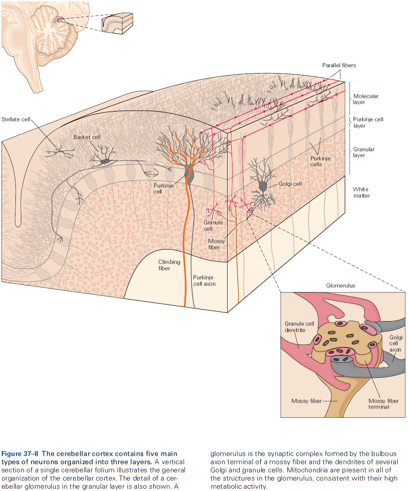
        - Climbing fibers originate in the inferior olivary nucleus in the brain stem.
        - Each Purkinje neuron receives synaptic input from only one climbing fiber, but each climbing fiber contacts one to ten Purkinje cells.
        - Mossy fibers originate from cell bodies in the spinal cord and brain stem.
        - They affect Purkinje cells though granule cells with multisynaptic pathways that have intriguing patterns of convergence and divergence.
        - Each Purkinje cell is contacted by between 200,000 and 1 million granule cells.
        - In response to changing conditions, there seems to be tremendous potential for adaptation of cerebellar output at the synapses between parallel fibers and Purkinje cells.
        - The climbing fiber and mossy fiber/parallel fiber systems seem to be specialized for transmitting different kinds of information.
        - Climbing fibers cause complex spikes that seem specialized for event detection and synchrony seems to arise between neurons in the inferior olivary nucleus.
        - In contrast, the high firing rates of the simple spikes in Purkinje cells can be modulated by mossy fiber inputs, thus encoding the magnitude and duration of peripheral stimuli or centrally generated behaviors.
    - The cerebellar microcircuit architecture suggests a canonical computation.
        - Since the cerebellar microcircuit is replicated across the surface of the cerebellar cortex, maybe the cortex performs the same basic computation on all of its inputs.

        - One general feature of cerebellar microcircuits is the existence of parallel excitatory and inhibitory pathways to Purkinje cells or deep cerebellar nuclei.
        - Another general feature is the prevalence of recurrent loops.
        - Stellate cells act locally since it and the Purkinje cell it inhibits are both excited by the same parallel fibers.
        - Basket cells act more widely and inhibit Purkinje cells that receive input from parallel fibers other than those that excite the basket cell.
        - Remarkably, even 60 years after the architecture of the cerebellar microcircuit was described, the functional role of the molecular layer interneurons remains a mystery.
        - The recurrent loop between Golgi cells and granule cells regulates the activity of granule cells and thus the signals conveyed by the parallel fibers.
        - A second recurrent loop provides Purkinje cells with a way to regulate their own climbing fiber inputs, which could enable cerebellar learning.
- General computational functions implemented by the cerebellum
    - Feedforward sensorimotor control
        - Sensory feedback is, by its nature, delayed, so there’s a period of time between the initiation of a movement and receiving sensory feedback.
        - The cerebellum regulates and coordinates movement by preprogramming and coordinating commands for muscular contraction prior to the arrival of useful sensory feedback.
        - For the cerebellum, sensory feedback is mainly to monitor and improve its own performance in predicting muscle contractions.
        - Like neurons in the motor cortex, cerebellar neurons are activated before movement.
        - However, lesions of the motor cortex mostly prevent movement, while lesions of the cerebellum disrupt the accuracy and coordination of voluntary movement.
        - The regularity of cerebellar activity must be closely regulated to achieve normal movement as excessive variability leads to ataxia.
    - Internal model of the motor apparatus
        - To program the correct muscle contractions for smooth and accurate arm movements, the cerebellum needs to know about the physical configuration of the arm.
        - In other words, it needs to create and maintain an internal model of the motor apparatus.
        - This internal model allows for good predictions of the exact muscle forces needed to move an arm in the desired way.
        - Inverse dynamic model: uses current sensory data to automatically generate a sequence of properly timed commands to move muscles to a new position.
        - Forward dynamic model: uses a copy of a motor command and makes predictions about the incoming sensory data.
        - Cerebellum recordings provide evidence that’s compatible with both types of models.
        - We don’t know yet what these internal models look like in terms of cerebellar neuron activity, the circuits that operate as internal models, or how the cerebellar output is transformed into muscle forces.
    - The cerebellum integrates sensory inputs and corollary discharges
        - This integration allows the nervous system to compare plans for a movement with the sensory consequences.
        - This comparison happens to some degree at Purkinje cells, but at least some granule cells also could perform the computation.
        - Current thinking is that the cerebellum must monitor movement performance through sensory feedback, which is done by an internal model that converts the corollary discharge into predictions of the sensory feedback.
        - The cerebellum then compares real and predicted sensory feedback to determine a sensory prediction error which is then used to correct movements, thus learning.
        - The activity of the deep cerebellar nuclei is correlated with sensory prediction error.
    - Timing control
        - Patients with cerebellar lesions can’t make regular tapping movements with their hands or fingers as their rhythm is irregular and their motions vary in duration and force.
        - The timing of movement isn’t the only affected behavior as the same patients aren’t able to judge the elapsed time in purely mental or cognitive tasks, suggesting the role of the cerebellum in the timing of serial events.
- The cerebellum participates in motor skill learning.
- It’s been proposed that the climbing fiber input to Purkinje cells causes changes at the synapses that relay mossy fiber input signals from parallel fibers to Purkinje cells.
- This theory predicts that synaptic plasticity would lead to changes in simple-spike firing, and evidence has supported and extended this theory.
- Climbing-fiber activity changes the synaptic efficacy of parallel fibers by selectively inducing long-term depression (LTD) in the synapses between parallel fibers and Purkinje cells.
- E.g. Simultaneous stimulation of climbing and parallel fibers depresses the Purkinje cell responses to subsequent stimulation of the same parallel fibers.
- The resulting depression can last for minutes to hours.
- Recorded activity in Purkinje cells is consistent with the predictions of the cerebellar learning theory as climbing fiber activity can signal error.

- While this result is consistent with the theory, it’s only correlation and not causation.
- The cerebellum is necessary for different types of motor learning
    - Adapting limb movements with eye-hand coordination.
    - Adapting the vestibulo-ocular reflex.
    - Adaptive saccadic eye movements.
    - Learning new walking patterns.
- Learning doesn’t only occur in the cerebellar cortex, but also in the deep cerebellar nuclei and is suspected to occur at multiple sites rather than from changes at just a single site.
- Considerable evidence suggests that learning many occur first in the cerebellar cortex and then be transferred to the deep cerebellar nuclei.

**Highlights**

- The cerebellum plays a critical role in movement and damage to it leads to profound movement incoordination called ataxia as well as cognitive and emotional deficits that aren’t obvious.
- The cerebellum gets inputs from the cerebral cortex, brainstem, and spinal cord, and outputs to the vestibular nuclei, brainstem reticular formation, and red nucleus.
- Cerebrocerebellar connections are organized as series of parallel, closed, recurrent loops.
- The circuit of the cerebellar cortex is highly stereotyped, suggesting a common computational mechanism for its interactions with other brain regions.
- Each Purkinje cells receives many synaptic contacts from a single climbing fiber, but can be influenced by granule cells and by a huge number of mossy fibers.
- Climbing fibers fire at low frequencies and cause unitary “complex spikes” in Purkinje cells.
- Mossy fibers fire at high frequencies and cause “simple spikes”.
- It’s thought that the interplay between these inputs is essential for learning.
- The cerebellum is important for generating reliable feedforward action before there’s time for useful sensory feedback to occur. It also plays a key role in the internal control of timing.
- The cerebellum relies on computations that combine sensory inputs with corollary discharge to update its internal model.
- The internal model is then used to estimate the state of the motor system and guide accurate feedforward actions.
- Learning and adaptation of movement are fundamental functions of the cerebellum, which requires feedback about movement errors.

## Chapter 38: The Basal Ganglia

- The traditional view of the basal ganglia was that it plays a role in movement because disease of the basal ganglia, like Parkinson’s and Huntington’s disease, are associated with major movement disturbances.
- However, we now know that the basal ganglia also projects to wide areas of the brain and contributes to a variety of cognitive, motivational, and affective operations.
- This also explains why diseases of the basal ganglia are frequently associated with complex operations in addition to the better-known motor disturbances.

- Basal ganglia network
    - Three input nuclei
        - Striatum: both the caudate nucleus and putamen.
        - Subthalamic nucleus
        - Substantia nigra pars compacta/ventral tegmental area
    - Two output nuclei
        - Substantia nigra pars reticulata
        - Internal globus pallidus
    - One intrinsic nucleus
        - External globus pallidus
- The diversity of input shows that the basal ganglia receive signals from brain regions involved in different processes, implying that whatever the basal ganglia are doing, they’re doing it for a wide range of brain processes.
- The striatum’s functional territories are architecturally similar, suggesting that the basal ganglia are performing the same operations on their inputs from functionally diverse afferent structures.
- In all regions of the striatum, inhibitory GABAergic spiny neurons are the principle cell type (over 90% of all neurons).
- The subthalamic nucleus is the only component of the basal ganglia that has excitatory (glutamatergic) output connections.
- Volume transmission: when neurotransmitters diffuse through the brain’s extracellular fluid from release points that may be remote from targeted cells.
- The external globus pallidus is suspected to be an essential regulator of internal basal ganglia activity.

- Appreciation of the complex organization within the basal ganglia suggests it is no longer possible to intuitively understand how a particular input might be transformed by the basal ganglia to generate a specific output.
- For this reason, computational modeling of the internal circuitry of the basal ganglia has become increasingly important.
- Even though the overall pattern of intrinsic circuitry is complex, the connections between components are topographically ordered throughout.
- Significant reductions in the comparative numbers of neurons in afferent structures, the striatum, and output nuclei suggest a dramatic compression of information as it’s processed within the basal ganglia.
- External connections with the basal ganglia are characterized by loops.
- Projections from the basal ganglia to the thalamus and brain stem are also topographically organized.
- Connections between the cerebral cortex and basal ganglia can be viewed as a series of parallel projecting, partly segregated, loops or channels.

- Output signals from functional areas in the basal ganglia are returned, through thalamic relays, to the cortical regions providing the original input signals.
- The basal ganglia influences external structures by inhibition and disinhibition.
- A function emerges from specific patterns of signals being processed in specific neural networks.
- Whatever computational problems the basal ganglia evolved to solve in evolutionarily ancient species, the same problems are likely to have remained unchanged and confront all vertebrate species, including us.
- Action selection and reinforcement learning are recurring themes in basal ganglia research.
- We will evaluate the extent to which these core processes are consistent with the functional constraints identified above.
- All vertebrates face the challenge of choosing one behavior from several competing options.
- E.g. The final common motor pathway of talking and drinking means it’s impossible to do both at the same time.
- So, there has to be a system in the brain that can decide between the motivational systems that simultaneously compete for behavioral expression.
- Which stimulus should be given access to the motor system at any one time?
- Selective attention provides an effective solution to this problem, making it an essential feature of vertebrate brain function.
- The neural architecture of the basal ganglia is configured to make selections.
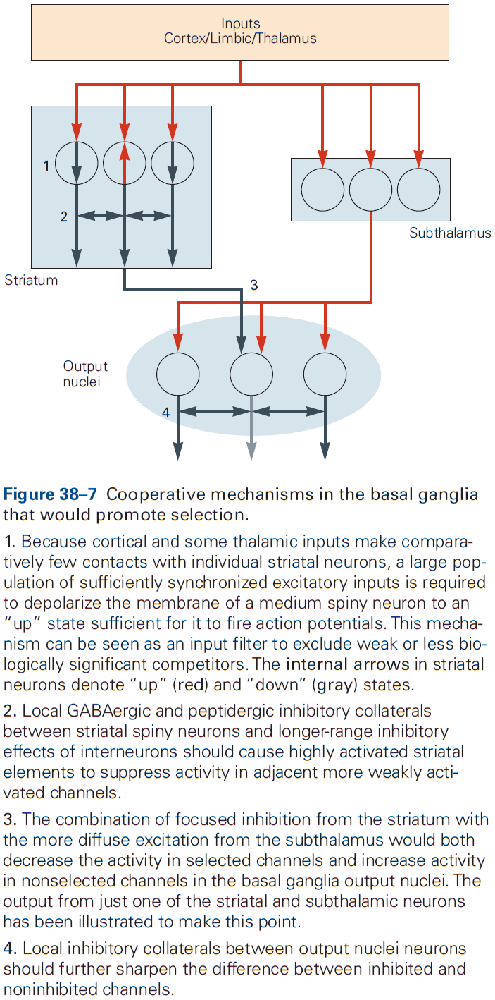
- Excitatory input signals from the cerebral cortex and thalamus to the different functional areas of the striatum can be interpreted as carrying signals representing the behavioral options competing for expression.
- However, to compare options, there must be a common currency to assess each option.
- This may be represented as the relative magnitude of each input signal to the striatum.
- In principle, it should only be necessary for the basal ganglia to select the most salient option in terms of the common currency.
- This model works by keeping all potential behavioral options under tight inhibitory control and selectively removing the inhibition from the most salient option.
- The traditional and widely accepted view is that the relative activity in the direct and indirect pathways determines whether or not an animal will perform a particular movement.
- E.g. Optogenetic stimulation of direct pathway neurons leads to more movement, while stimulation of the indirect pathway neurons leads to less movement.
- However, an alternative view is that simultaneous activity in both pathways is critical for the selection process.
- E.g. The direct pathway conveys signals representing the most salient options, while the indirect pathway is important for inhibiting the competing weaker options.
- The alternative idea is consistent with evidence that both projection pathways are active during movement initiation and that specific patterns of activity in each pathway are associated with different movements.
- Reinforcement learning is an inherent property of a selection architecture.
- Reinforcement learning (RL): a process for biasing action selection by modulating activity in the mechanisms responsible for selection.
- In theory, competition between options represented in the basal ganglia loops could be biased by sensitizing a reward-related loop at any of its relay points.
- Two pieces of evidence that reward at different nodes can bias selection
    - Intrinsic reinforcement is mediated by dopamine signaling within the basal ganglia nuclei.
        - A popular view is that action selection is biased by a dopamine teaching signal that adjusts the sensitivity of intrinsic circuitry so that responses to inputs associated with unpredicted rewards are enhanced.
        - However, the way that dopaminergic neurons terminate in wide areas and the fact that they respond together as a population makes it difficult to see how RL can work.
        - This problem can be addressed by the concept of a decaying eligibility trace, which is the idea that rewarded actions change the state of neurons that enabled those actions, making them receptive to later widely broadcast reward signals.
        - There is evidence of this process within the basal ganglia.
        - The phasic activity of midbrain dopaminergic neurons provides a teaching signal for RL.

        - A particularly exciting finding was that basal ganglia reward responses resembled the reward prediction error term in RL, which lead many to conclude that phasic dopamine responses could be operating as the brain’s teaching signal in RL.
        - Using optogenetics, it’s now been established beyond reasonable doubt that phasic dopamine responses can signal both positive and negative reward prediction errors, and that these responses increase and decrease the probability that prior behavior will be selected.
        - Perhaps phasic dopamine acts by strengthening inputs onto direct pathway neurons and weakening inputs onto indirect pathway neurons.
        - Experimental data indicates that phasic dopamine-evoked neural plasticity in the basal ganglia can bias future behavioral selections according to the value of the predicted outcome.
    - Extrinsic reinforcement could bias selection by operating in afferent structures.
        - When a stimulus is associated with reward, its representation is enhanced in many of the afferent structures projecting to the basal ganglia.
        - The origin of the reinforcement signals that modulate processing in the input structure is currently unknown.
- Actions can be selected based on goal-directed or habitual control.
- When we initially learn an action, our performance is highly sensitive to changes in the expected value of the outcome or to changes between the action and outcome.
- With repetition and experience, actions can become not only more efficient, but also more automatic and are controlled by a stimulus-response type circuit.
- Different cortical-basal ganglia loops seem to support the learning and performance of goal-directed actions versus habits.
- E.g. Goal-directed actions seem to depend on the dorsomedial or associative striatum, prelimbic cortex, orbitofrontal cortex, and amygdala. Habit actions seem to depend on the dorsolateral striatum, infralimbic cortex, and central amygdala.
- Evidence supporting that these two fundamental modes of behavioral control are independent comes from lesion and inactivation studies. Damage or inactivation of the areas associated with goal-directed control leaves automatic-habitual control relatively unimpaired and vice versa.
- Diseases of the basal ganglia may involve disorders of selection and disorders of RL.
- Normal selection requires that the selected option is disinhibited, while inhibition of unselected or losing options is maintained or increased.

- One failure would be if none of the options were able to achieve sufficient disinhibition to reach the selection threshold.
- Output inhibition and disinhibition are likely to be continuously variable rather than discrete on/off states.
- When the difference is large, competing options are likely to find the current selection resistant to interruption.
- When the difference is small, it would be easy for competing options to initiate a selection switch.
- Support for these ideas comes from behavioral observations that show at the beginning of task learning, there’s frequently easy switching between strategies. However, as the task becomes learned, the system becomes increasingly resistant to alternative strategies.
- Parkinson disease
    - Parkinson disease can be viewed as a failure to select sensorimotor options.
    - The principle neurological deficit responsible for the motor systems of Parkinson is thought to be the progressive degeneration of dopaminergic neurotransmission in the basal ganglia.
    - With a loss of dopamine, the basal ganglia’s output is too inhibitory and results in uneven levels of inhibition, impairing the normal selective function.
    - Specifically, the damage is to the habitual areas of the basal ganglia so it may be that Parkinson disease can be interpreted in terms of a loss of automatic habits. While patients can do things, they’re trapped in the slower, serial, and voluntary mode of goal-directed control.
- Huntington disease
    - Huntington disease may reflect a functional imbalance between the direct and indirect pathways.
    - One symptom is abnormal movements that are jerky, random, and uncontrollable.
    - Symptoms of Huntington could reflect interference with expression of the selected affective, cognitive, and sensorimotor behaviors by unsuppressed competitors.
- Skipping over schizophrenia, ADHD, Tourette, OCD, and addiction.

**Highlights**

- The basal ganglia are an interconnected group of nuclei located at the base of the forebrain and midbrain. There are three input structures (striatum, subthalamic nucleus, substantia nigra) and two output structures (internal globus pallidus, substantia nigra pars reticulata).
- Input is received from most of the cerebral cortex, limbic system, and brain stem, and are topographically organized.
- An essential feature of systems-level basal ganglia architecture is that it can be viewed as a series of (reentrant) loops.
- Phasic excitatory input to the basal ganglia is mediated by the neurotransmitter glutamate. Tonic inhibitory output from the basal ganglia is mediated by the neurotransmitter GABA.
- The loops keep afferent structures under strong inhibitory control and selecting an action results in disinhibition for the selected task with maintained or increased inhibition for competing actions.
- The internal microarchitecture of the intrinsic basal ganglia nuclei is mostly the same throughout, suggesting that the same computation is applied to all brain functions.
- A recurring theme with the basal ganglia is their involvement in action selection and reinforcement learning (RL).
- Support for the selection hypothesis
    - Selection is a generic problem faced by all vertebrates.
    - A selection process common to all basal ganglia areas could resolve competition between incompatible options.
    - Many intrinsic processes could support a selection function.
    - Computational models of the basal ganglia architecture support the selection of actions.
- Evidence indicates that reinforcement learning occurs with action selection as it biases actions based on past/predicted outcomes.
- Optogenetic studies confirmed that phasic dopamine signaling can act as a training signal for RL.
- RL can bias selections on the basis of outcome value (goal-directed), or by operating on an acquired automatic stimulus-response association (habit). Goal-directed and habitual selections are made in different functional areas of the basal ganglia.
- Diseases of the basal ganglia can be interpreted as selection malfunctions.

## Chapter 39: Brain–Machine Interfaces

- This chapter focuses on medical devices that measure or alter electrophysiological activity at the level of neuron populations.
- These devices are called brain-machine interfaces (BMIs).
- Four classes of BMIs
    - Restore lost sensory capabilities
    - Restore lost motor capabilities
    - Regulate pathological neural activity
    - Restore lost brain processing capabilities
- Cochlear implants and retinal prostheses can restore lost sensory capabilities.
- Cochlear implants work by capturing sounds with a mic outside the skin and sending these signals to a surgically implanted receiver under the skin near the ear. After conversion/encoding to appropriate spatial-temporal signal patterns, these signals electrically stimulate spiral ganglia cells in the cochlear modiolus where they’re ideally interpreted as sounds.
- Retinal prostheses work in a similar way except that they capture light and stimulate retinal ganglion cells using electrodes.
- BMIs can also assist paralyzed people and amputees by restoring lost motor and communication function.
- Steps to restore movement
    1. Electrical activity is recorded from one or more brain areas using multielectrode arrays.
    2. An arm movement is attempted but can’t be made due to paralysis.
    3. The relationship between neural activity and attempted movements is characterized (neural decoding).
    4. The BMI operates normally by measuring and decoding neural activity that’s used to guide prosthetic devices.
    5. Since the person can see the prosthetic device, they can alter their neural activity by thinking different thoughts to guide the prosthetic device more accurately.
- We can close the loop for prosthetic devices by measuring pressure and position information from sensors in the prosthesis and delivering it to proprioceptive and somatosensory cortex.

- Review of deep brain stimulation (DBS) for Parkinson patients.
- Antiseizure BMIs can disrupt seizures by identifying unusual activity that’s predictive of seizures and then respond by electrically stimulating the same or different brain region.
- Four areas of neurotechnology
    - Type of neural sensor
        - E.g. EEG and ECoG.
    - Scaling up the number of neurons measured at the same time
    - Low-power electronics for signal acquisition, wireless communication, and wireless power
    - Supervisory systems
- BMIs use the activity of many neurons to decode movements.
- While millions of neurons across multiple brain areas work together to produce a simple movement, many BMIs can decode desired movements reasonably accurately from the activity of dozens of neurons recorded from a single brain area.
- This may seem surprising, but it’s possible due to the great deal of redundancy in the motor system.
- E.g. Many neurons carry similar information about a desired movement.
- Two reasons why using multiple neurons is helpful for decoding
    - One neuron can’t unambiguously determine the intended movement direction.
    - Neural activity usually varies across repeated movements in the same direction.

- Two types of decoders
    - Discrete decoders estimate movement goals

    - Continuous decoders estimate moment-by-moment details of movements

- Decoding accuracy typically increases with an increasing number of simultaneously recorded neurons.
- Continuous decoding algorithms that take into account neural activity in the recent past have higher decoding accuracy than those that don’t.
- The key benefit of BMIs for basic science is that they can simplify the brain’s input and output interface with the outside world without simplifying the complex brain processing that we wish to study.
- It defines a simplified sensorimotor loop whose components are more concrete and easier to manipulate.
- A growing number of ethical concerns have come up from the dramatic expansion in our understanding of neuroscience and our capabilities with neurotechnology.
- Four concerns
    - High-fidelity signals involve risks associated with electrode implantation, biological responses, and glial scar tissue forming around electrodes.
    - Since BMIs can read movement information from the brain, it seems plausible that they’ll be able to read more personal and private types of information.
    - Intracortical stimulating BMIs may be used to evoke naturalistic perception, thus blurring the patient’s line between reality and illusion.
    - Limits of BMIs such as enhancing function beyond natural levels.

**Highlights**

- Brain-machine interfaces (BMIs) are medical devices that read or change electrophysiological activity in the brain or body. BMIs can help restore lost sensory, motor, or processing capabilities, as well as regulate pathological neural activity.
- BMIs can help restore lost sensory capabilities by stimulating neurons to convey sensory information to the brain.
- BMIs can help restore lost motor capabilities by measuring the activity from many neurons, converting this neural information into control signals, and guiding the paralyzed limb, robotic limb, or computer cursor.
- BMIs can help regulate pathological neural activity by measuring neural activity, processing it, and then stimulating neurons.
- Neural signals can be measured using different technologies.
- To perform encoding, we have to consider the activity of neurons across many experimental trials. To perform decoding, we only have to consider the activity of neurons across one experimental trial.
- Discrete decoding estimates one of several possible movement goals from neural population activity. Continuous decoding estimates the real-time details of a movement from neural population activity.
- Future advances in BMI will depend on advances in hardware (sensors and low-power), software (supervisory systems), and statistical methods (decoding algorithms).
- An important direction for improving BMI performance is to provide the user with sensory feedback to close the loop.
- BMIs raise new neuroethics questions which need to be considered.

# Part VI: The Biology of Emotion, Motivation, and Homeostasis

- The brain stem is critical for wakefulness, conscious attention, and sleep.
- The significance of this small region of the brain is disproportionate to its size.
- The brain stem also has neurons that control respiration and heartbeat.
- Six neurochemical modulatory systems in the brain stem modulate sensory, motor, and arousal systems.
- Neurons controlling the internal environment are concentrated in the hypothalamus.
- In addition to influencing motivated behaviors, the hypothalamus, together with the brain stem below and the cerebral cortex above, maintains a general state of arousal, which ranges from excitement and vigilance to drowsiness and stupor.
- Charles Darwin observed that many emotions are conserved across species, making clear the relevance of studying emotions by using animal models.

## Chapter 40: The Brain Stem

- In primitive vertebrates, the forebrain is only a small part of the brain and is mainly devoted to olfactory processing and integrating autonomic and endocrine function.
- E.g. Reptiles, amphibians, and fish.
- Basic behaviors such as feeding, drinking, sexual reproduction, sleep, and emergency responses are actually made up of relatively simple, stereotypic motor responses by neurons in the brain stem.
- Further evidence for this comes from infants born without a forebrain (hydranencephaly) where they’re surprisingly difficult to distinguish from normal babies.
- E.g. They still cry, smile, suckle, and move their eyes, face, arms, and legs.
- Thus, the brain stem can organize virtually all of the behavior of the newborn.
- The brain stem parts that control the cranial nerves are more complex than the spinal cord parts that control the spinal nerves because cranial nerves mediate more complex behaviors.
- The core of the brain stem, the reticular formation (RF), is homologous to the intermediate gray matter of the spinal cord but is also more complex.
- Like the spinal cord, the RF has local-circuit interneurons that generate motor and autonomic patterns and coordinate reflexes and simple behaviors.
- The brain stem also contains glutamatergic and GABAergic circuitry that regulates arousal, wake-sleep cycles, breathing, and other vital functions.
- Review of cranial nerves. Damage to cranial nerves can pinpoint damage in the brain stem.
- The organization of cranial nerve nuclei follows the same basic plan as the sensory and motor areas of the spinal cord.

- Three ways the brain stem differs from the spinal cord
    - Many ascending and descending sensory tracts that run along the outside of the spinal cord are incorporated within the interior of the brain stem. So ascending sensory tracts run through the RF.
    - In the brain stem, the cerebellum and its associated pathways form additional structures that are superimposed on the basic spinal cord plan.
    - The brain stem is less segmented than the spinal cord.
- A wide range of reflexes and simple, repetitive, coordinated behaviors are controlled by neurons in the RF called pattern generators.
- E.g. Facial emotional expression, breathing, and eating.
- Pupillary light reflexes: the responses of the pupils to light.
- The retina has a special class of ganglion cells that act as brightness detectors and have their own photopigment, melanopsin, which allows them to respond to light even when the rods and cones have degenerated.
- Review of the vestibulo-ocular reflex (VOR), corneal reflex, stapedial reflex, gastrointestinal reflexes, and gag reflex, all of which are examples of brain stem reflexes.

- Pools of pattern generator neurons in the RF adjacent to the facial nucleus control facial emotional expression through stereotypic patterns of contraction of facial muscles simultaneously on the two sides of the face.
- These pattern generator neurons are on both sides of the brain stem and project to facial motor neurons on both sides of the brain, so spontaneous facial expressions are virtually always symmetric.
- E.g. Patients that can’t voluntarily move the contralateral orofacial muscles still tend to smile symmetrically when they hear a joke and can raise their eyebrows symmetrically, both of which are initiated by facial pattern generators.
- Vomiting is another example of a coordinated response mediated by pattern generator neurons to toxic substances in the blood.
- One of the most important functions of the brain stem is control of breathing.
- The brain stem automatically generates breathing movements beginning in utero at 11 to 13 weeks of gestation in humans, and continues nonstop from birth until death.
- This behavior doesn’t require any conscious effort and in fact, it’s rare for us to even think about the need to breathe.
- Respiratory activity can be generated by the medulla even when it’s isolated from the rest of the nervous system and is split into two groups: dorsal and ventral.
- The dorsal respiratory group is located bilaterally in and around the ventrolateral part of the nucleus of the solitary tract and participates in reflex actions.
- The ventral respiratory group is located in and around the nucleus ambiguus and coordinates respiratory motor output.
- The pre-Botzinger complex generates respiratory rhythm and is so resilient that even if it’s sliced out of the brain, neurons in this complex are able to independently generate a respiratory rhythm.
- Destruction of this complex in animals results in inability to maintain a normal respiratory rhythm.
- The most important inputs to the respiratory pattern generator come from chemoreceptors that sense oxygen and carbon dioxide in blood. Under normal conditions, respiration is primarily regulated by the levels of carbon dioxide rather than oxygen. However, breathing is also strongly stimulated if oxygen becomes sufficiently low.
- Voluntary motor pathways can take over the control of breathing during talking, eating, singing, swimming, or playing a wind instrument.
- Descending inputs cause hyperventilation at the onset of exercise in anticipation of an increase in oxygen demand, which leads to a sustained drop in blood carbon dioxide levels. This is the opposite of what’s expected for a negative feedback control system.
- The respiratory control system is a fascinating example of a brain stem pattern generator that must be sufficiently stable to ensure survival, yet flexible enough to accommodate a wide variety of behaviors.
- Monoaminergic neurons in the brain stem modulate sensory, motor, autonomic, and behavioral functions.
- This modulatory circuitry almost seems to be an “autonomic system” for the brain.
- These cell groups have direct connections to the forebrain, brain stem, and spinal cord that regulate the overall level of function of their targets and their responsiveness.
- Descending projections control motor tone that are critical for posture, while ascending inputs control overall arousal and responses to rewarding situations.
- Many modulatory systems use monoanimes as neurotransmitters.
- Skipping over the A, B, and C cell groups in the brain stem.
- Dopaminergic inputs to the striatum adjust the likelihood that a specific motor pattern will be expressed.
- Low dopamine levels reduce output from the direct pathway striatal neurons (which release behaviors) and increase activity of indirect pathway striatal neurons (which inhibit behaviors).
- Lesions of dopaminergic systems prevent reward-based learning.

- The monoaminergic neurons that participate in the ascending arousal system regulate cortical activity, in part, by altering the firing of thalamic neurons.

**Highlights**

- Neurons in the reticular formation (RF) develop into ensembles of neurons that can generate patterns of autonomic and motor responses that serve simple, stereotyped, coordinated functions.
    - E.g. Facial expression, feeding, and breathing.
- These behavior patterns are complex and flexible, and represent the entire behavioral repertory of a newborn baby.
- As the forebrain develops and exerts its control over the brain stem, a variety of more complex responses and ultimately volitional control of behavior evolve.
- Many neurons that participate in these modulatory systems use monoamines as neuromodulators.

## Chapter 41: The Hypothalamus: Autonomic, Hormonal, and Behavioral Control of Survival

- Survival requires tight control of body temperature, water balance, blood pressure, food intake, and regulation of sleep/wakefulness cycles.
- Neurons in the hypothalamus control all of these key survival activities.
- The hypothalamus responds to bodily and emotional challenges by recruiting appropriate behavioral and physiological responses.
- Homeostasis: constancy of the internal environment in a changing external environment.
- Three major systems the hypothalamus influences
    - Autonomic motor system
        - Regulates blood vessels, the heart, the skin, and the visceral organs through synapses on smooth and cardiac muscle cells.
    - Neuroendocrine system
        - The pituitary gland uses peptide hormones to control water retention by the kidney, parturition, lactation, somatic growth, gamete development, and release of nonpeptide hormones.
    - Neural pathways that mediate motivated behavior
- Homeostasis keeps physiological parameters within a narrow range and is essential for survival.
- Homeostatic mechanisms are highly adaptive because they greatly extend the range of conditions that can be tolerated, thus extending the range of habitats, activities, and traumas that can be survived.
- It requires negative sensory feedback from the body to maintain stability.
- Any deviation above or below a “set point” triggers counteracting corrective responses.
- E.g. If body temperature is below 37 degrees, then the body will vasoconstrict and shiver to conserve heat.
- However, over time, the set point model was found to be inaccurate as intensive investigations failed to uncover any molecular or neuronal bases for encoding set points and performing error detection.
- An alternative, but incomplete model that didn’t use feedback, set point, or error detection was proposed called the settling point, but even this is incomplete since feedback is important.
- Most scientists today have adopted a “distributed settling point” model that incorporates strong feedback control of multiple sensory/effector loops.
- E.g. For body temperature, there’s no single set point and no location in the brain where a single set point is encoded and error detection takes place. In short, there’s no thermostat. Instead, there are multiple temperature detectors located at different sites and each is coupled through neuronal pathways to different body temperature effectors. When engaged, each of these effectors impact body temperature.
- The apparent set point for body temperature is actually the emergent settling point that results from the combined activities of multiple feedback loops. This model also applies to regulation of blood pressure, blood osmolarity, and body fat.
- The hypothalamus coordinates homeostatic regulation and is located at the base of the brain above the pituitary gland.
- Six vital functions regulated by the hypothalamus
    1. Blood pressure and electrolyte composition
    2. Energy metabolism
    3. Reproductive behaviors
    4. Body temperature
    5. Defensive behavior
    6. Sleep-wake cycle
- Three regions of the hypothalamus
    - Preoptic: controls water balance, thirst, temperature, sleep, sexual behavior, and circadian rhythms.
    - Tuberal: controls pituitary hormone secretion, autonomic outflow, and various behaviors including hunger, sexual behavior, and aggression.
    - Posterior: controls arousal.
- Hypothalamic neurons can respond directly to a stimulus or indirectly to changes in hormones and other factors that track the regulated parameter.
- This sensory information is then relayed to functionally appropriate regulatory neurons in a particular site(s) within the hypothalamus.
- Once the information is integrated by hypothalamic neurons, the results are conveyed downstream to motor circuits that control specific behaviors and physiological responses.
- In addition to input from bodily sensory signals, the hypothalamus also receives inputs from neurons that anticipate future homeostatic changes.
- E.g. When hungry animals detect cues that predict the availability of food, there’s a rapid drop in the firing of hunger-promoting neurons even before food is ingested.
- Such predictive input prepares the body for anticipated homeostatic challenges.
- The hypothalamus has two systems of output
    - Autonomic system
    - Neuroendocrine system
- While the autonomic system implements many of the physiological responses initiated by the hypothalamus, it’s also regulated by circuits in the brain stem and spinal cord.
- Thus, autonomic functions vary in their dependence on the hypothalamus.
- Distinct cell types in peripheral autonomic pathways selectively control target cells with different phenotypes.

- All neurons in sympathetic and parasympathetic ganglia are controlled by preganglionic neurons whose cell bodies are located in the spinal cord and brain stem.
- In contrast to sympathetic ganglia, which regulate many targets and are far from their targets, parasympathetic ganglia generally innervate single end organs and are near or within their target organs.
- The entire gastrointestinal tract is controlled by the system of enteric ganglia. This system is the largest and most complex division of the autonomic nervous system, having as many as 100 million neurons.
- All preganglionic neurons in the sympathetic and parasympathetic systems use acetylcholine (ACh) as their excitatory neurotransmitter.
- At end organ synapses, parasympathetic neurons release ACh, while sympathetic neurons release norepinephrine.
- The postsynaptic action can be either excitatory or inhibitory, depending on the type of target cell and its receptors.
- This specialization of synaptic transmission in sympathetic and parasympathetic neurons leads to functional diversity in the regulation of end organ function.
- The sympathetic and parasympathetic systems play complementary, and even antagonistic roles, where the sympathetic system promotes arousal, defense, and escape, whereas the parasympathetic system promotes eating and procreation.
- Actions of the sympathetic system are relatively diffuse and influences all parts of the body.
- Because the fight-or-flight model assumes antagonistic roles for the sympathetic and parasympathetic systems, this led to an overemphasis on the extremes of autonomic behavior.
- During everyday life, the different divisions of the autonomic system are tightly integrated.
- The interplay between different systems in simple autonomic behaviors is analogous to the role of antagonist muscles in locomotion.
- The sympathetic and parasympathetic systems are often partners in the regulation of end organs.
- E.g. Bladder control (micturition reflex) and blood pressure regulation (baroreceptor reflex).

- E.g. When a person stands up, the sudden elevation of the head causes a transient decrease of cerebral blood pressure that’s rapidly sensed by baroreceptors in the carotid sinus in the neck. This causes a reflexive suppression of parasympathetic activity to the heart and stimulation of sympathetic activity to the heart and vascular system, thus restoring blood pressure.

- Central control of autonomic function can involve the periaqueductal gray, medial prefrontal cortex, and amygdala.
- Another effector arm of the hypothalamus is the neuroendocrine system. This system links the brain to physiological responses through hormones secreted by the pituitary gland.
- Two divisions of the pituitary gland
    - Anterior
        - Is entirely nonneuronal and is made up of five types of endocrine cells.
    - Posterior
        - Is an extension of the brain and contains hormone-secreting axon terminals that secrete vasopressin or oxytocin directly into the blood.
        - Vasopressin controls blood pressure and water reabsorption by the kidney.
        - Oxytocin controls uterine smooth muscle and milk release.
- Skipping over the detailed hormones released by the pituitary gland.
- Dedicated hypothalamic systems control specific homeostatic parameters
    - Body temperature is controlled by neurons in the median preoptic nucleus (MnPO).
        - Neurons that detect noxious temperatures are part of the pain pathway.
        - Their function is to limit local tissue damage by promoting withdrawal as opposed to regulating body temperature.
        - There’s no set point for body temperature nor a thermostat, instead, an apparent set point for body temperature emerges as a settling point controlled by multiple feedback loops containing thermoreceptors and thermoeffectors.
        - In the past, the explanation for fever was thought to be caused by raising the body temperature set point. However, we now know that fever is due to inhibition of the warm-activated GABAergic neurons in the MnPO, thus disinhibiting the effector pathways that promote cutaneous vasoconstriction and shivering.
        - Drugs such as aspirin, ibuprofen, and acetaminophen reduce fever by inhibiting the hypothalamic generation of the molecule inhibiting warm-activated GABA neurons in the MnPO.
    - Water balance and thirst drive are controlled by neurons in the vascular organ of the lamina therminalis, median preoptic nucleus, and subfornical organ (SFO).
        - Eating rapidly stimulates thirst so as to mitigate the anticipated, eating-induced increase in osmolarity.
        - The ability of the kidney to excrete water is tightly controlled by vasopressin, as it increases the kidney’s ability to reabsorb water from urine.
        - The brain makes preemptive changes in thirst and vasopressin secretion that anticipate and mitigate future shifts in systemic osmolarity. Such regulation serves to prevent overshooting normal osmolarity.
        - E.g. When a dehydrated person ingests water, thirst and vasopressin rapidly decreases before systemic osmolarity falls, thus the brain uses predictions to adjust itself and not only feedback.
        - Decreased intravascular volume, possibly due to acute blood loss, also potently stimulates thirst and vasopressin secretion.
        - Lesions of all three lamina completely blocks dehydration and thirst, as well as secretion of vasopressin. Electrical stimulation of these structures elicits drinking.
        - Activation of excitatory glutamatergic neurons in the SFO and MnPO induces intense drinking in an otherwise water-satiated mouse within seconds.
        - Importantly, the behavior induced is specific to water drinking.

    - Energy balance and hunger drive are controlled by neurons in the arcuate nucleus.
        - As with temperature and water balance, energy balance is regulated by feedback signals from the body that modulate activity of key hypothalamic neurons, which then initiate adaptive changes in both physiology and behavior.
        - However, the regulation of energy balance differs.
        - E.g. Feedback signals are numerous but are only indirectly related to energy balance. Energy can be stored as fat while heat and water aren’t stored, thus leading to an energy buffer. Temperature and water don’t have such a buffer.
        - Fat is stored when energy intake exceeds expenditure. While there’s only one way to gain energy (eating), there are many ways to expend it.
        - Most energy is expended by biochemical reactions that are required for basic life functions and are constantly in operation.
        - For most individuals, body fat stores are relatively constant over time meaning calories ingested roughly equal calories expended.
        - As is true for regulation of temperature and osmolarity, the constancy of body weight is unrelated to any specific “set point”.
        - Instead, this remarkable control is the emergent settling point of multiple afferent/efferent feedback loops.
        - Two major categories of afferent signals affecting energy balance
            - Short-term signals from cells that line the gastrointestinal tract report the status of food in the gut.
            - Long-term signals report the status of energy reserves.
        - Skipping over the biology of hunger, blood glucose and insulin levels, leptin and ghrelin.
        - No notes on the genetic components of obesity such as the obese (ob) and diabetes (db) genes.
        - Neuron-level manipulation technologies have revealed two antagonistic populations of neurons in the arcuate nucleus that control energy balance.
        - Surprisingly, cues that predict future ingestion of food induce inhibition of hunger neurons. This is roughly analogous to rapid, feedforward inhibition of vasopressin secretion and thirst neuron activity.
        - The function of this feedforward inhibition isn’t clear, but it could serve as an anticipatory signal to limit future ingestion of excessive calories or it could serve as a reward signal to motivate feeding.
- How a specific goal is retained as neural information flows from the highly specific deficiency-regulated homeostatic neurons in the hypothalamus to the nonspecific reward and perception pathways of the cortex is one of the great mysteries of motivated behaviors such as hunger and thirst.
- The challenge to understanding motivational drive is to create a model that accounts for the ability of deprivation states to induce behavior that’s remarkably varied and complex, while remaining specific to one goal.
- Two compelling theories
    - Incentive motivation theory: deficiency increases the reward value of food and water.
    - Drive reduction theory: deficiency generates an aversive state that can only be resolved by motivated behavior.
- These two theories aren’t mutually exclusive and may be two sides of the same coin.
- Findings provide strong evidence that homeostatic deficiency is unpleasant and is caused by activation of deficiency-responsive homeostatic neurons.
- There are also some behaviors that aren’t homeostatic but are controlled by the hypothalamus.
- E.g. Sex, aggression, and parenting.
- Two regions of the hypothalamus that are involved in sex-specific behaviors
    - Preoptic area (POA)
    - Ventral lateral region of the ventromedial hypothalamic nucleus (vlVMH).
- Both regions are sexually dimorphic as the POA has more neurons in males and the vlVMH has more progesterone-expressing neurons in females.
- Brain lesion studies have shown that the sexually dimorphic brain regions play important roles in sex-specific behaviors.
- E.g. vlVMH neurons increase firing rates during mating or aggression towards a male intruder. Stimulation of these neurons triggers intense attack behavior toward male intruders and towards atypical targets such as females or even rubber gloves.
- Genetic ablation of related progesterone receptor-expressing vlVMH neurons causes loss of both sexual behavior and aggression in males and loss of sexual behavior in females.
- Parental behavior is controlled by the preoptic hypothalamic area.
- Genetic ablation of galanin-expressing POA neurons prevents nurturing parental behavior.
- Thus, neurons in the POA, in addition to controlling sexual behavior itself, also plays a role in ensuring the survival of the fruit of sexual behavior.

**Highlights**

- The hypothalamus, autonomic, and neuroendocrine motor systems coordinate and control body homeostasis.
- Feedback loops that sense temperature, osmolarity, blood pressure, and body fat are essential for homeostatic control. The combined action of sensory feedback and sensory prediction results in emergent settling points.
- Modality-specific hypothalamic neurons link specific interoceptive sensory feedback with outputs that control adaptive behaviors and physiological responses.
- In addition to feedback, these modality-specific neurons also receive feedforward information on future anticipated homeostatic changes.
- Sympathetic and parasympathetic neurons generally have antagonistic functions, but often act together.
- Acetylcholine, norepinephrine, and neuropeptide cotransmitters act as synaptic signaling molecules in the autonomic motor system.
- The neuroendocrine system links the hypothalamus, using the pituitary gland, to various physiological responses in the body.
- Body temperature is detected at multiple sties and is maintained by multiple thermoreceptor control loops.
- Energy balance involves short-term and long-term feedback signals. Short-term signals from the gut mediate satiation, while long-term signals signal the amount of fat stores.
- Motivational drives, such as hunger and thirst, have been explained by two mechanisms: the deficiency state increases the reward value of food/water, and the deficiency generates an aversive state which requires behavior to resolve.
- Sexually dimorphic regions in the hypothalamus control sexual behavior and aggression.

## Chapter 42: Emotion

- What exactly is an emotion?
- Distinguishing different emotional states is difficult and requires an account of the environmentally or internally generated challenge an organism faces, as well as its physiological responses.
- E.g. To know if a rat is experiencing fear, we have to know what stimulus it’s observing and the rat’s response to such stimulus.
- Emotions can be represented along two dimensions of valence (pleasantness) and intensity (arousal), or be grouped into categories such as basic and complex.
- There’s considerable debate about whether all categories that are commonly used will match scientifically useful categories in the future.
- In everyday conversation, most people use “emotion” synonymously with “conscious experience of emotion” or “feeling”.
- In this chapter, we consider emotions as central brain states that can be studied in both humans and animals, and we distinguish between emotions and feelings.
- Emotions are neurobiological states that cause coordinated behavioral and cognitive responses triggered by the brain.
- Some stimuli trigger emotions without the organism learning anything about the stimuli.
- Such innate responses to such stimuli are called unconditioned stimuli.
- E.g. A painful shock or a disgusting taste.
- However, most stimuli acquire their emotional significance through associative learning.
- E.g. Learning to hate homework.
- When an individual detects an emotionally significant stimulus, three physiological systems are engaged.
    - Endocrine glands
        - Responsible for the secretion and regulation of hormones into the bloodstream.
    - Autonomic motor system
        - Controls changes in the cardiovascular system, visceral organs, and tissues in the body.
    - Musculoskeletal system
        - Controls overt behaviors such as freezing, fight-or-flight, and facial expressions.
- It’s important to note that there doesn’t appear to be any single brain structure for one emotion.
- E.g. The amygdala participates in both positive and negative valenced emotions. However, distinct populations of neurons within the amygdala process positive and negative valenced stimuli.
- At the turn of the 20th century, researchers found that animals were still capable of emotional responses after the complete removal of the cerebral hemispheres, showing how some aspects of emotion are mediated by subcortical regions.
- Review of William James’s theory of emotion, Cannon-Bard theory, and the Papez circuit.
- Transection studies implicate the hypothalamus in organizing emotional reactions as cutting above it leaves an animal still capable of showing rage, while cutting below it produces sham rage.

- The hypothalamus doesn’t only orchestrate emotional behaviors, but is part of the neural circuitry that constitutes the emotion state itself.
- The hippocampus was suspected to be involved in emotions, but lesions to it produced deficits in memory, a function that’s distinct from emotions.
- In general, damage to areas of the limbic system didn’t have the expected effects on emotional behavior.
- It’s now clear that emotions are processed by many subcortical and cortical regions and that the limbic system isn’t the primary system for emotion.

- Today, the role of the amygdala in learned and innate fear is probably the best worked-out example of emotion processing in a specific brain structure, so we consider it here.
- Review of Pavlovian fear conditioning.
- The amygdala is necessary for Pavlovian fear conditioning as animals with amygdala damage fail to learn the association between the unconditioned (US) and conditioned stimulus (CS).
- The amygdala consists of about 12 nuclei, but the lateral and central nuclei are especially important in fear conditioning as damage to either nucleus, but not others, prevents fear conditioning.
- The lateral nucleus is a site of memory storage in fear conditioning, while the central nucleus mediates outputs to brain stem areas involved in controlling defensive behaviors associated with autonomic and humoral responses.
- The amygdala is able to respond to an auditory danger cue before the cortex can fully process the stimulus since sensory signals are copied at the thalamus to the amygdala.
- At the lateral nucleus, signals for both the CS and US converge on neurons here and when paired, the effectiveness of the CS in causing APs is enhanced.
- This basic mechanism of associative learning is similar to cellular mechanisms that underlie declarative memory in the hippocampus too.
- The emotions elicited by a stimulus are evaluated by the amygdala together with other brain structures such as the prefrontal cortex.
- Given its widespread connections and functional effects, the amygdala is well situated to implement one of the key features of an emotion: its coordinated and multicomponent responses.
- Although the majority of stimuli acquire their emotional significance through learning, many animals also rely on innate signals in the detection of threats, mates, and food.
- In contrast to learned fear, which depends on the ventral periaqueductal gray region, innate fear responses depend on the dorsal periaqueductal gray region.
- It’s difficult to study innate emotional responses in humans because the possibility of learning begins right at birth and can’t be experimentally controlled for.
- Patients with damage to the amygdala fail to show fear conditioning when presented with a neutral CS paired with a noxious US.
- Patients with bilateral amygdala lesions have led to the surprising finding of a dissociation in fear reactions to exteroceptive and interoceptive stimuli.
- Not only do such patients fail to show any fear reactions to exteroceptive stimuli (such as the CS or US), but they also appear to lack any conscious experience of fear.
- This finding argues that the amygdala is necessary for the induction and experience of fear in humans.
- In contrast to these patients lack of fear to exteroceptive stimuli, they show intense panic when they’re made to feel as though they’re suffocating (an interoceptive fear cue).
- This dissociation of fear reactions to exteroceptive and interoceptive stimuli supports the idea that there are multiple fear systems in the human brain and that the amygdala can’t be the only structure essential for all forms of fear.
- Eventually, we will need to have a more fine-grained mapping between brain systems and the varieties of emotion.
- Some forms of fear learning are unique to humans.
- E.g. Telling a subject that the CS may be followed by a shock is enough to allow the CS to elicit fear responses. Animals can’t learn this type of fear since they can’t talk.
- E.g. Subjects can also be conditioned by allowing them to observe others being conditioned, thus learning to fear the CS even though neither the CS nor US was directly presented.
- E.g. One form of learning that’s completely unique to humans is when another person teaches somebody that a stimulus is dangerous. Active teaching hasn’t been found in any species other than humans so far.
- The emotional learning and memory capacities of the human amygdala fall into the category of implicit learning and memory, while the hippocampus and other parts of the temporal lobe participate in explicit learning and memory.
- So, the learned indicators of danger can also be recalled consciously, at least in humans.
- Patients with bilateral amygdala or hippocampus damage illustrate the separate contributions of these structures to implicit and explicit memory for emotional events.
- Amygdala-damaged patients show no response to a CS, but have normal declarative memory of the conditioning experience.
- By contrast, hippocampal-damaged patients show normal responses to a CS, but have no conscious memory of the conditioning experience.
- Thus, there’s a double dissociation for the amygdala and hippocampus for fear and declarative memories.
- While most of the research on emotion has focused on aversive responses, such as fear, other studies have shown that the amygdala is also involved in positive emotions, such as the processing of rewards.
- There appear to be distinct populations of neurons that encode rewards and punishments in the amygdala.
- In general, studies in humans have shown that the amygdala is broadly involved in emotions.
- E.g. The amygdala is activated when subjects observe stimuli associated with food, sex, and money.
- Emotional responses can be updated by extinction (learning that the CS is now safe) and by regulation.
- Projections from the prefrontal cortex to the amygdala are required to override the conditioned fear in the amygdala.
- While conditioned fear responses decline during extinction, they’re never completely erased as shown by the phenomenon of reinstatement when the fear can suddenly reappear.
- Neuroimaging studies have found that people can, to some degree, change their amygdala activation to fear-inducing stimuli just by how they think about those stimuli.
- This is especially useful as emotion regulation highlights the fact that emotions must often be adjusted to follow social norms.
- Emotions can influence cognitive processes.
- E.g. Projections from the amygdala to the hippocampus can influence how learning is encoded and consolidated into long-term declarative memory. This explains why we best remember events that are the most emotional, such as weddings and funerals.
- Value representations in the amygdala aren’t rigidly associated with stimuli, but are modulated by context-dependent evaluation.
- Emotionally relevant stimuli are also highly salient to an organism, typically capturing their attention.
- E.g. Patients with bilateral amygdala damage can’t recognize fear in other people’s faces because they don’t visually attend to regions of the face that normally signal fear, such as the eyes. This was also observed across all emotions.

- This suggests an important role for the amygdala in attention and highlights the possibility that apparently specific deficits for certain emotions might arise from more basic attentional or motivational effects.
- Many other brain areas contribute to emotional processing.
- E.g. Ventral anterior cingulate cortex, insular cortex, and ventromedial prefrontal cortex.
- These findings contribute to an emerging picture of emotional states: that individual states aren’t due to a single structure or specific neurons, but are more flexibly assembled over a distributed population of multifunction neurons.
- Lesion studies of emotion
    - Damage to some regions of the prefrontal cortex markedly impairs social emotions and related feelings, resulting in changes in social behavior that resemble patients with developmental sociopathic personalities.
    - E.g. Phineas Gage case where he suffered damage to his ventromedial prefrontal cortex resulting in poor insight and decision-making abilities. Gage tended to have blunted or unusual emotional responses.
    - Frontal lesions result in patients not exhibiting changes in heart rate or skin conductance when shown pictures with emotional content They also fail in tasks where they have to make a decision under uncertainty such as weighing reward and punishment.
    - Damage to the right somatosensory cortex impairs social feelings such as empathy and such patients fail to accurately guess the feelings behind the facial expressions of others.
    - This ability to read faces isn’t impaired in patients with comparable left somatosensory cortex lesions, indicating that the right hemisphere is dominant in the processing of some feelings.
    - Damage to the human insular cortex, especially the left, can suspend addictive behaviors such as smoking.
- An interesting hypothesis is that one might find greater deficits following lesions to emotion-related structures like the amygdala or ventromedial prefrontal cortex in other species or in children where explicit behavioral control hasn’t yet evolved or developed.
- There is some support for this idea as lesions to these structures early in life can result in more severe deficits in emotional and social behaviors than if the lesions are sustained in adulthood.
- This pattern is opposite to that of most other lesions, which show better recovery of function the earlier the onset.
- Studies support the idea that at least a part of the neural substrate for feelings involves brain regions that regulate and represent bodily states.
- While it seems clear that no brain region is specialized for any specific emotion, it’s even doubtful that there are any brain regions specialized for emotions in general.
- Some hypotheses propose that the feeling of all emotions is grounded in the brain’s representation of bodily homeostasis.

**Highlights**

- Emotions are more flexible, context-dependent, and controlled than are simple reflexes, but are less flexible, context-dependent, and controlled than deliberate behavior.
- Emotions evolved to produce behavior in response to recurring environmental and internal challenges that are too varied for reflexes, but are sufficiently stereotyped that they don’t require the full flexibility of cognition.
- Emotions need to be carefully distinguished from feelings, the conscious experience of emotions, and also from the concepts and words that we use to describe emotions.
- Emotions coordinate integrated changes in many systems including body behavior, autonomic and endocrine responses, and cognition.
- Specific emotions can be thought of as categorical or dimensional.
- In humans, emotions can be regulated by several mechanisms so we have some control over how we feel and how we express emotional behaviors.
- In animals, they don’t have this same level of control as we do so their emotional behaviors will generally be honest signals of their emotional states, whereas we often engage in strategic deception.
- Fear is the best understood and studied emotion. It depends on the amygdala in both animals and humans. However, some data suggests that certain types of fear, such as panic of suffocating from carbon dioxide, are independent of the amygdala.
- The ventral and medial prefrontal cortex is intimately involved in emotion and connected with the amygdala.
- Social emotions, reward representations, and emotion regulation and extinction all involve specific sectors of prefrontal cortex.
- These regions of the brain, together with the insula, may be the most important for our conscious experience of emotions.

## Chapter 43: Motivation, Reward, and Addictive States

- Motivational states influence attentiveness, goal selection, investment of effort in the pursuit of goals, and responsiveness to stimuli.
- This chapter focuses on the neurobiological basis of motivational states related to rewards and the way in which reward-related brain circuits are implicated in mechanisms underlying drug addiction.
- Both internal and external stimuli contribute to motivational states.
    - Motivational states reflect one’s desires, and desires can be influenced by physiological status and by stimuli that predict future reward.
    - Internal variables include signals related to hunger, thirst, and sleepiness.
    - External variables include rewarding stimuli such as water, food, and sunlight.
- Reward can meet both regulatory and nonregulatory needs on short and long timescales.
- Short-term regulatory needs such as feeding, drinking, and thermoregulation typically arise in response to or in anticipation of a physiological imbalance.
- In these cases, actions acquire rewards in a short timescale.
- In contrast, some motivational states serve long-term goals that are more complex and often involve sequences of actions where not every action is immediately rewarded.
- In general, incentive stimuli and even stimuli that only signal progress towards a long-term goal, can influence motivational states so that complex behavioral sequences are completed.
- Motivational states must be sustained across challenging circumstances in order to achieve such goals.
- The brain’s reward circuitry provides a biological substrate for goal selection.
- Reward: objects, stimuli, or activities that have positive value.
- The neural mechanisms responsible for goal selection must weigh the costs and benefits of different behaviors that might attain a specific goal.
- Rats and other vertebrates such as goldfish and humans will work for electrical stimulation of certain brain regions.
- The enthusiasm and persistence of this self-stimulation is remarkable.
- E.g. Rats will cross electrified grids or press a lever for hours on end in order to trigger the electrical stimulation.
- The circuitry that mediates brain stimulation reward is broadly distributed as electrical stimulation of sites at all levels of the brain can produce rewarding effects.
- Particularly effective sites lie along the medial forebrain bundle and along longitudinally oriented fiber bundles near the midline of the brain stem.
- Stimulation of either of these pathways results in activation of dopaminergic neurons in the ventral tegmental area of the midbrain.
- The strength of brain stimulation reward is shown by the finding that starving rats provided with food will forego eating to press a lever for brain stimulation.
- The unrelenting pursuit of an artificial goal to the detriment of a biological need is one of the many parallels between self-stimulation and drug abuse.
- The effects of dopamine have proven to be far more complex than we first thought.
- Dopamine can be released by aversive as well as by rewarding stimuli, and may not be related to the rewarding or aversive qualities of a stimulus.
- Moreover, rats with depleted dopamine continue to show hedonic responses to sucrose.
- Dopamine itself isn’t currently considered to produce hedonic qualities, instead, the degree to which a sensory stimulus is rewarding is thought to be processed by a broad network of brain areas.
- Many of the brain areas whose activity is modulated by reward anticipation receive dopaminergic input.
- Observations suggest that dopamine release in the forebrain serves not as a pleasure signal, but as a error prediction signal.
- E.g. A burst of dopamine signifies an surprising/unpredicted reward, while expected rewards don’t change dopaminergic neuron firing rates.
- Changes in dopamine release are thought to modify future responses to stimuli to maximize the likelihood of obtaining rewards and to minimize fruitless pursuits.
- We can interpret the dopamine signal to mean that as long as nothing changes in the environment, there’s nothing more to learn and therefore no need to change behavior.
- Dopamine isn’t required for all forms of reward learning and is still released even when an addictive drug no longer produces subjective pleasure.
- An interesting feature of drug addiction is that only a small fraction of all chemical substances can cause the syndrome.
- These addictive drugs don’t share a common chemical structure and they produce their effects by binding to different protein targets in the brain.
- Rather, these diverse substances can cause addiction because their actions converge on the brain circuits that control reward and motivation.
- All drugs of abuse target neurotransmitters, receptors, transporters, or ion channels.

- Such drugs induce reward and reinforcement, and despite their very different initial targets, they induce some common functional effects on the brain’s reward circuitry.
- The best established of these shared initial effects is increased dopaminergic transmission in the nucleus accumbens, albeit with different mechanisms.
- E.g. Cocaine blocks dopamine reuptake transports, whereas opiates activate dopamine neurons by inhibiting nearby GABAergic interneurons.
- By increasing dopaminergic neurotransmission, these drugs produce some of the same functional effects mediated by activation of dopamine receptors.
- The acute reward of drugs of abuse doesn’t account for addiction, rather, addiction is mediated by the brain’s adaptations to the repeated exposure of such acute actions.
- Review of tolerance, sensitization, dependence, and withdrawal.
- Studies show that repeated exposure to a drug of abuse in animal models changes the levels of many neurotransmitters and neurotropic factors throughout the brain’s reward circuitry.
- Two ways drugs of abuse can alter a neural circuit
    - Whole-cell or homeostatic plasticity: altering the intrinsic excitability of a neuron.
    - Synaptic plasticity: altering the strength of connections between neurons.
- Findings suggest that repeated drug use weakens certain glutamatergic projections to the nucleus accumbens by the induction of so called silent synapses.
- Most examples of drug-induced whole-cell and synaptic plasticity involve the ventral tegmental area and the nucleus accumbens.

**Highlights**

- Motivational states drive behaviors that either seek rewards or avoid punishments. These states themselves are determined by a variety of internal and external variables.
- Internal variables include both physiological states and cognitive states. External variables include stimuli that possess innately rewarding or aversive properties, although their motivational significance may be modified by internal variables.
- Rewards are desirable objects, stimuli, or actions that elicit motivational states that drive behavior and can act on both short- and long-term scales.
- Key components of reward-related circuitry include dopaminergic neurons and their targets such as the nucleus accumbens, ventral pallidum, amygdala, hippocampus, and parts of the prefrontal cortex.
- Dopamine itself doesn’t account for the hedonic/feel-good experience.
- Instead, dopaminergic neurons exhibit properties that suggest they communicate a prediction-error signal, which could play a role in different forms of reinforcement learning.
- Drug addiction is defined as the compulsive seeking and taking of drugs despite negative consequences to one’s physical health or social functioning.
- Drugs of abuse make up only a very small fraction of known chemical compounds and can induce a common behavioral syndrome because their actions produce similar functional effects on midbrain dopaminergic neurons or their projection regions such as the nucleus accumbens.
- Addiction requires repeated exposure to a drug of abuse and such exposure is often followed by tolerance, sensitization, and dependence/withdrawal.
- The adaptations underlying drug addiction are mediated, in part, through lasting changes in gene expression, which results in altered intrinsic activity of neurons as well as structural and functional alterations in their synaptic contacts within the brain’s reward circuitry.
- A subset of individuals show addiction-like behavioral abnormalities to nondrug rewards such as food, gambling, sex, and gaming. Evidence suggests that such “natural addictions” are mediated by the same brain circuitry involved in drug addiction.

## Chapter 44: Sleep and Wakefulness

- Sleep is a remarkable state. It consumes a third of our lives, about 25 years in the average lifetime, and yet we know so little about what happens to the brain during this state.
- The exact functions of sleep and of dreaming are still unknown.
- When studying sleep and wakefulness, researchers typically use a polysomnogram, which consists of three physiological measures.
    - Brain activity measured by an electroencephalogram (EEG).
    - Eye movements measured by an electro-oculogram (EOG).
    - Muscle tone measured by an electromyogram (EMG).

- Sleep consists of alternating periods of rapid eye movement (REM) sleep and non-REM sleep.
- Is it a coincidence that people woken up during REM sleep also reported dreams with visual imagery? Maybe the eye moves because we’re hallucinating a visual scene.
- Muscle tone is extremely low during REM sleep, owing to inhibition of motor neurons by descending pathways from the brain stem.
- This paralysis affects nearly all motor neurons except those that support respiration, eye movements, and a few other functions like sphincter control.
- This inhibition is crucial to prevent the physical enactment of dreams.
- At the end of a sleep period, people often wake spontaneously from an episode of REM sleep.
- The ascending arousal system in the brain stem and hypothalamus innervates the forebrain.

- Because lesions of the ascending monoaminergic and orexinergic pathways have little, if any, effect on the total amount of wakefulness, recent work has emphasized the role of glutamatergic, cholinergic, and GABAergic neurons in maintaining wakefulness.
- Lesions of the glutamatergic neurons in the dorsolateral rostral pons cause a comatose state from which animals can’t be awakened.
- Lesions to the thalamus impair the contents of consciousness but have relatively little effect on wake-sleep cycles.
- In contrast, lesions of the posterior lateral hypothalamus cause profound sleepiness, which can’t be accounted for by damage to the orexinergic or histaminergic neurons in this region.
- The current view of the ascending arousal system is that the crucial components are
    - Glutamatergic neurons in the dorsolateral pons.
    - Supramammillary hypothalamus and basal forebrain.
    - Cholinergic neurons in the dorsolateral pons and basal forebrain.
    - GABAergic neurons in the lateral hypothalamus and basal forebrain.
- Damage to the ascending arousal system causes coma, a state where patients can’t be awakened even by vigorous stimulation.
- Consciousness depends on the activity of the cerebral hemispheres during the awake state.
- So, loss of consciousness occurs when there’s injury to the ascending arousal system or to both cerebral hemispheres or there’s a severe metabolic derangement that affects both systems.
- In contrast, to coma, sleep is a temporary, reversible loss of consciousness produced by specific brain circuits that inhibit the ascending arousal system.

- Circuits composed of mutually inhibitory neurons control transitions from wake to sleep and from non-REM to REM sleep.

- Neurons in the ventrolateral preoptic nucleus contain GABA and galanin, and project to most parts of the ascending arousal system.
- These preoptic neurons fire slowest during wakefulness and fastest during deep sleep.
- Lesions to the GABAergic neurons in the median preoptic nucleus results in fragmented sleep and can cause animals to lose as much as half of their total sleep.
- Although it may sometimes appear to take a long time to fall asleep, the actual transition from wake to sleep and back are generally quick, taking only a few seconds to a few minutes.
- Mutually inhibitory connections between the ventrolateral preoptic neurons and the arousal system results in a neural circuit with properties similar to an electrical flip-flop switch.
- REM sleep is generated by a network of brain stem neurons centered in the pons.
- Specifically, the fast EEG rhythms and dream activity of REM sleep are thought to be driven by coordinated activity of glutamatergic neurons in the subceruleus region.
- The subceruleus area receives input from GABAergic neurons in and lateral to the periaqueductal gray matter.
- These GABAergic neurons are most active during wake and non-REM sleep, and they inhibit subceruleus neurons, preventing entry into REM sleep.
- Conversely, GABAergic neurons in the subceruleus area also project back to the ventrolateral periaqueductal gray region.
- The mutual inhibition between these two populations of neurons may form another flip-flop switch that promotes rapid and complete transitions into and out of REM sleep.
- The circadian regulation of sleep obeys a 24-hour biological clock, whereas the homeostatic drive for sleep gradually accumulates during the awake state.
- Humoral factors circulating in the brain signal the homeostatic pressure for non-REM sleep.
- A person who’s well rested generally takes at least 15-20 minutes to fall asleep, but a very sleepy person can fall asleep within a few minutes in each nap.
- Circadian rhythms synchronize the internal state of an animal with the external daily environment and are controlled by a biological clock in the suprachiasmatic nucleus (SCN).
- The rhythms are driven by a small group of GABAergic neurons in the SCN located in the hypothalamus just above the optic chiasm, which themselves are driven by a set of “clock genes”.
- The SCN exerts control over all other body clocks by regulating body temperature, autonomic, endocrine, and behavioral functions.
- When humans are placed in a dim light environment, the circadian rhythm drifts because the cycle isn’t exactly 24 hours, but 24.1 hours.
- To avoid this drift, the SCN receives direct inputs from a special class of retinal ganglion cells that signal light levels and don’t participate in image formation.
- These special retinal ganglion cells receive inputs from rods and cones, but they also contain melanopsin, a photopigment that makes them intrinsically photosensitive and hence they act as luminance detectors.
- They’re also used in the pupillary light reflex and the feeling of pain when we look at bright lights.
- While light is signaled by melanopsin neurons, dark is signaled by the hormone melatonin.

- Sleep loss impairs cognition and memory with executive function often the first thing to fail.
- When people are sleepy, they often have impaired vigilance, working memory, judgement, and insight.
- Some of these problems are caused by microsleeps, brief periods of slower cortical activity, or by local sleep with slow EEG waves in focal cortical areas.
- While sleepiness impairs cognition, sleep itself helps consolidate memories.
- Improvements of certain types of memory consolidation are correlated with the amount of REM sleep, while other types correlate with stage N2 non-REM sleep.
- Studies suggest that in each stage of sleep, the cerebral cortex undergoes synaptic reorganization to consolidate the memory of specific types of salient information.
- This memory consolidation is lost when subjects are deprived of sleep or have fragmented sleep.
- Sleep changes with age in striking and characteristic ways.
- E.g. Premature infants exhibit a high percentage of REM-like sleep with newborns spending about 50% in REM-like sleep.
- As neuronal activity influences the development of functional circuits in the brain, it’s reasonable to think that the spontaneous activity of the immature brain during sleep facilitates the development of neural circuits.
- By about 4 months of age, the average baby starts showing diurnal rhythms that are synchronized with day and night.
- The total duration of sleep gradually declines as children grow up, from about 11 hours at age 5 to 10 hours at age 10.
- At these early ages, sleep is deep as stage N3 is prominent.
- With age, sleep becomes lighter and more fragmented.
- E.g. By age 50-60, it isn’t unusual for N3 to fade entirely, especially in men.
- Why this change occurs with age is unclear as homeostatic sleep pressure appears normal, but maybe the neural mechanisms for producing deep non-REM sleep are less effective.
- Disruptions in sleep circuitry contribute to many sleep disorders.
    - Insomnia may be caused by incomplete inhibition of the arousal system.
        - Insomnia: difficulty falling asleep or trouble staying asleep.
        - EEG often shows persistence of high-frequency activity that’s usually seen only during wake.
        - The simultaneous activation of the ventrolateral preoptic nucleus and components of the arousal system can produce a unique state in which the EEG shows slow waves consistent with sleep along with high-frequency activity consistent with the awake state.
    - Sleep apnea fragments sleep and impairs cognition.
        - Sleep apnea: obstruction of the airways during sleep.
        - Many people with obstructive sleep apnea don’t feel rested in the morning and feel sleepy all day.
    - Narcolepsy is caused by a loss of orexinergic neurons.
        - Narcolepsy: daytime sleepiness even with adequate sleep and can easily fall asleep.
        - It was found that loss of orexin signaling in animals or humans could reproduce the entire narcolepsy phenotype.
        - This cell loss is probably due to an autoimmune attack as it’s linked to genes that affect immune function and has been triggered by seasonal influenza.
        - Orexinergic neurons promote wakefulness and suppress REM sleep.
        - Loss of orexinergic neurons results in great difficulty staying awake for long periods, and REM sleep is disinhibited such that it breaks through at inappropriate times during the day.
        - Healthy people almost never never experience REM sleep during the day as it’s under tight circadian control, but patients with narcolepsy often experience REM sleep during daytime naps.
    - REM sleep behavior is caused by failure of REM sleep paralysis circuits.
        - The lack of paralytic inhibition allows patients to act out their dreams.
        - E.g. Calling out or violently punching or kicking.
        - Nearly all patients with REM sleep behavior disorder develop a synucleinopathy by 25 years after the disorder.
    - Restless legs syndrome and periodic limb movement disorder disrupt sleep.
        - Is characterized by an irresistible urge to move the legs.
    - Non-REM parasomnias include sleepwalking, sleep talking, and night terrors.
        - The occurrence of parasomnias usually fades with age.
        - The underlying cause of non-REM parasomnias is unknown.
- We have very little understanding of sleep’s purposes.
- In addition to biochemical functions, sleep also promotes memory formation.
- One thing about sleep is certain: it’s required for normal brain function and inadequate sleep is associated with impaired cognitive function.

**Highlights**

- Sleep involves distinct changes in brain electrical activity, muscle activity, and eye activity. These changes can be used to divide sleep into rapid eye movement (REM) sleep and non-REM sleep (N1-N3).
- During the night, sleep alternates between periods of non-REM sleep followed by periods of REM sleep. Non-REM sleep also becomes progressively lighter, while REM sleep becomes longer.
- The waking state is actively produced by an ascending arousal network.
- The key neurons that drive wakefulness are glutamatergic neurons in the parabrachial and pedunculopontine tegmental nuclei, dopaminergic neurons in the midbrain, glutamatergic neurons in the supramammillary nucleus, and GABAergic and cholinergic neurons in the basal forebrain that directly innervate the cerebral cortex.
- During sleep, the ascending arousal system is inhibited by GABAergic neurons in the ventrolateral preoptic nuclei and the parafacial zone.
- During wake, the ventrolateral preoptic neurons are inhibited by neurons in the ascending arousal system.
- These mutually antagonistic pathways produce a flip-flop type of circuit that favors rapid and complete transitions between sleep and wakefulness.
- Similarly, populations of mutually inhibitory neurons in the caudal midbrain and pons govern transitions between REM and non-REM sleep.
- Sleep is regulated by a homeostatic drive to sleep so that the longer one is awake, the more intense the need to sleep and the more sleep is required to satisfy such need.
- There’s also a circadian influence on sleep that inhibits sleep during the day but promotes it during the night, especially during the latter part of the night.
- The circadian cycle is synchronized with the outside world by light signals from the retina to the brain’s master circadian clock in the suprachiasmatic nucleus (SCN). The SCN then activates hypothalamic pathways that regulate wake-sleep states, as well as many other behaviors, hormonal cycles, and physiological adjustments.
- Sleep changes with age as newborns need about 16 hours per day compared to the 8 hours per day for adults. However, sleep-promoting mechanisms weaken with age, so older individuals have more fragmented sleep and sleep about an hour less per day.
- Review of sleep conditions and disorders.
    - E.g. Sleep apnea, insomnia, narcolepsy, REM sleep behavior disorder, restless legs syndrome, and sleepwalking.
- Sleep loss impairs the ability to maintain sustained attention and clouds judgment.

# Part VII: Development and the Emergence of Behavior

- The innumerable behaviors controlled by the mature nervous system depend on precise patterns of synaptic connectivity among the billions of neurons in our brain and spinal cord.
- These connections form during embryonic and early postnatal life but can be remodeled throughout life.
- This section describers how the nervous system develops and matures.
- It’s useful to divide the numerous steps that compose neural development into three epochs, which are conceptually distinct even though they overlap.
- The first, beginning at the earliest stages of embryogenesis, leads to the generation and differentiation of neurons and glia. This epoch can be thought of as producing the components from which neural circuits will be assembled: the hardware.
- The second epoch is when neurons wire up by migrating to their appropriate places, guiding axons to their targets, and the formation of synaptic connections. The complexity of the wiring problem is staggering as axons must navigate long distances and choose among hundreds of potential partners.
- The third epoch is when the genetically determined patterns of connectivity become molded by activity and experience. Unfortunately for scientists, this epoch is shared with only a limited degree of animals as most adult animals aren’t very different from their childhood selves.
- This is mostly because our nervous system is something of a rough draft at birth.
- It may be that the prolonged period during which experience can sculpt the human nervous system is the most important factor in making its capabilities unique among all species.

## Chapter 45: Patterning the Nervous System

- The diversity of neurons and glia is far greater than that of cells in any other organ of the body.
- E.g. The retina has dozens of types of interneurons and the spinal cord has more than a hundred types.
- At present, the true number of neuronal types in the mammalian CNS is unknown, but is surely more than a thousand. The number of glial types is even less clear.
- The diversity of neuronal types underlies the impressive computational properties of the mammalian nervous system.
- Yet, the developmental principles that drive the differentiation of the nervous system are stolen and borrowed from those used to direct the development in other tissues.
- Only at the later stages, such as when neurons form complex circuits and experience modifies their connections, do principles of neural development diverge from those in other organs.
- Early developmental principles are conserved not only among tissues but also across species.
- Three layers of cells of the gastrula
    - Endoderm: innermost layer and gives rise to the gut, lungs, pancreas, and liver.
    - Mesoderm: middle layer and gives rise to muscle, connective tissues, and the vascular system.
    - Ectoderm: outermost layer and gives rise to the skin and nervous system.
- The ectoderm gives rise to the neural plate, which forms the CNS and PNS.
- The neural plate then folds, deepens, and eventually separates from the rest of the ectoderm to form the neural tube.
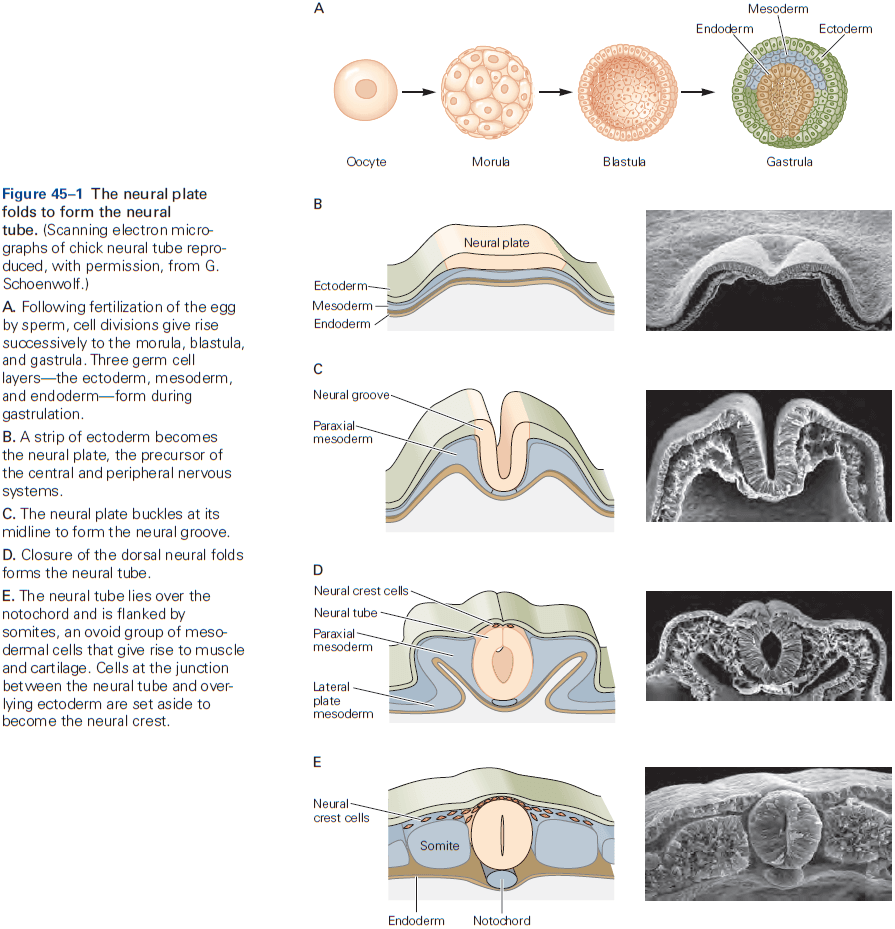
- Secreted signals promote neural cell fate.
    - As with other organs, the emergence of the nervous system is the culmination of a complex molecular program that involves the tightly orchestrated expression of specific genes.
    - How do cells decide whether to become neural cells or epidermal/skin cells?
    - There are two major classes of proteins that work together to promote the differentiation.
        - Inductive factors: signaling molecules that are secreted by nearby cells.
        - Surface receptors: receptors that enable cells to respond to inductive factors.
    - The ability of a cell to respond to inductive signals, called competence, depends on the exact repertoire of receptors, transduction molecules, and transcription factors that it expresses.
    - Thus, a cell’s fate is determined not only by the signals that it’s exposed to, but also by the profile of genes that it expresses as a consequence of its prior developmental history.
    - The interaction between localized inductive signals and intrinsic cell responsiveness is seen at virtually every step throughout neural development.
- The differentiation of the neural plate from the ectoderm depends on signals secreted by a specialized group of cells called the organizer region.
- Induction plays a critical role in neural development.
- Induction: a process when cells of one tissue direct the development of neighboring cells at a region where the two come into proximity.
- This is important because it provides a mechanism by which signals from one tissue can lead to subdivision of a second tissue.
- The “default” fate of ectodermal cells is neural differentiation and this fate is prevented by signaling among ectodermal cells.
- Rostrocaudal patterning of the neural tube involves signaling gradients and secondary organizing centers.
- The subdivision into forebrain, midbrain, and hindbrain is directed by a series of secreted inductive factors and follows the same basic principles of neural induction.
- Neural plate cells in different regions of the neural tube respond to these inductive signals by expressing distinct transcription factors that gradually constrain the developmental potential of cells in each local domain.
- Results suggest that an anterior character is the default state for neural tissue, with signals imposing a posterior character.
- Together, patterning along the rostrocaudal and dorsoventral axes divides the neural tube into a 3D grid of molecularly distinct cell types.
- In contrast to the diversity of signals and organizing centers for rostrocaudal patterning, there’s a striking consistency in the strategies and principles that establish dorsoventral patterning.
- For spinal cord development, the neuronal circuits that mediate its two major functions: relaying sensory input to the brain and transforming sensory input into motor output, are segregated anatomically.
- Circuits involved in processing sensory information are located in the dorsal half of the spinal cord, while circuits involved in motor control are located in the ventral half of the spinal cord.
- Motor neurons are generated close to the ventral midline and most of the interneuron classes that control motor output are generated just dorsal to the position at which motor neurons appear.
- The dorsal half of the neural tube generates projection neurons and local circuit interneurons that process incoming sensory information.
- Skipping over the details of how the ventral neural tube is patterned by the Sonic Hedgehog (Shh) protein.
- Studies of Shh signaling have not only revealed the logic of ventral neuronal patterning, but also demonstrated that the fate of a neuron is determined, in part, by the activation of transcriptional repressors rather than activators.
- This principle operates in many other tissues and organisms.
- The strategies used to establish dorsoventral patterning in the spinal cord also apply to the dorsoventral axis of the hindbrain, midbrain, and much of the forebrain.
- How do cells go on to generate the extraordinary diversity of neuronal types that characterize the vertebrate CNS?
- We address this question by focusing on the development of motor neurons. We use motor neurons as a case study because they can be distinguished from all other classes of neurons by the simple fact that they have axons that extend into the periphery.
- Rostrocaudal position is a major determinant of motor neuron subtype and distinct types develop at each rostrocaudal level.
- Skipping over the details of how the Hox gene family is involved in specifying motor neuron types.
- Many studies have confirmed the general principle that motor neuron identity in the hindbrain is controlled by the spatial distribution of Hox gene expression.

- Local signals and transcriptional circuits further diversify motor neuron subtypes.
- Not all motor neuron columns are determined by Hox protein activity.
- E.g. Development of median motor column cells is controlled by Wnt4/5 signals secreted by the ventral midline of the spinal cord.
- Thus, in both the hindbrain and spinal cord, the point-to-point connectivity of motor neurons with specific muscles emerges through tightly orchestrated programs of homeodomain protein expression and activity.
- Much like the hindbrain, the embryonic forebrain is initially divided along its rostrocaudal axis into transversely organized domains called prosomeres.
    - Prosomeres 1-3 → Caudal diencephalon → Thalamus
    - Prosomeres 4-6 → Rostral diencephalon + Telencephalon → Hypothalamus and basal ganglia + Neocortex and hippocampus (respectively)
- Finally, we turn to the patterning of the neocortex and ask whether the same developmental mechanisms and principles that control the development of other regions in the CNS also control the emergence of specialized cortical areas.
- There’s now evidence for the existence of a cortical “protomap”, a basic plan in which different cortical areas are established early in development before inputs from other brain regions can influence development.
- Evidence comes from studies of transcription factor expression in the developing neocortex.
- Two homeodomain transcription factors, Pax6 and Emx2, are expressed in complementary anteroposterior gradients in the ventricular zone of the developing neocortex.
- The spatial distribution of Pax6 and Emx2 helps to establish the initial regional pattern of the neocortex.
- E.g. Mice lacking Emx2 activity have an expanded rostral neocortex with larger motor and somatosensory areas at the expense of auditory and visual areas, whereas mice lacking Pax6 activity have larger visual and auditory areas at the expense of motor and somatosensory areas.

- Thus, as in the spinal cord, hindbrain, and midbrain, early neocortical patterns are established through the interplay between local inductive signals and gradients of transcription factor expression.
- How these gradients specify discrete functional areas in the neocortex remains unclear as transcriptional markers of individual neocortical areas haven’t yet been identified.
- Review of rodent barrel cortex specialization as an example of how afferent inputs also contribute to regionalization.
- Strikingly, if prospective visual cortical tissue is transplanted into the somatosensory cortex around the time of birth, barrels form in the transplanted tissue with a pattern that closely resembles that of the normal somatosensory barrel field.

- This finding demonstrates how afferent input superimposes aspects of neocortical patterning on the basic features of the protomap.
- Review of rewired animals such as rerouting retinal inputs to the auditory pathway.
- Brain pathways and neocortical regions are established through genetic programs during early development, but later depend on afferent inputs for their specialized anatomical, physiological, and behavioral functions.

**Highlights**

- The early vertebrate embryo consists of three layers of cells
    - Ectoderm
    - Mesoderm
    - Endoderm
- The entire nervous system comes from the ectoderm, specifically from a central strip of ectoderm called the neural plate.
- Formation of the neural plate within the ectoderm occurs by a process called induction, where underlying mesodermal cells secrete factors that induce a neural program of gene expression in neighboring ectodermal cells.
- Following induction, the neural plate folds in on itself to form a neural tube. The tube gives rise to the CNS, while cells at the border between the neural tube and ectoderm form the neural crest, which migrates through the embryo to form the sensory and autonomic ganglia of the PNS.
- Once the neural tube forms, it begins to become regionalized along the anterior-posterior axis, leading to a series of subdivisions.
    - The anterior region becomes the brain and the posterior region becomes the spinal cord.
    - Divisions of the prospective brain generate the forebrain, midbrain, and hindbrain.
    - Forebrain → Telencephalon → Cortex + Hippocampus + Basal ganglia
    - Forebrain → Diencephalon → Thalamus + Hypothalamus + Retina
    - Hindbrain → Pons + Cerebellum
- Anterior-posterior patterning is established by gradients of Wnt signaling, which arise from selective production of Wnts posteriorly and selective production of Wnt inhibitors anteriorly.
- Subdivisions along the anteroposterior axis are established by groups of cells called organizing centers at defined positions within the neural tube. The organizing centers secrete factors that pattern neighboring regions of the neural tube and specify neuronal tables within them.
- Further subdivisions form segments called prosomeres in the forebrain, and rhombomeres in the hindbrain, with differential expression of transcription factors leading to generation of distinct neural types in each.
- In both the hindbrain and spinal cord, motor neurons acquire distinct properties according to their anterior-posterior position, differentiating into groups that innervate distinct muscles.
- Differential expression of transcription factors called Hox proteins is particularly important for diversifying motor neurons.
- Hox proteins act with other transcription factors to divide motor neurons into columns and pools, with each pool innervating a specific muscle.
- The neural tube is also patterned along the dorsoventral axis. Similar to the anterior-posterior regionalization, the dorsoventral regionalization depends on the sonic hedgehog (Shh) morphogen which forms a ventral-high dorsal-low gradient. BMPs have the opposite gradient, which the interaction with Shh leads to different cell types.
- Like the spinal cord, regionalization of the cerebral cortex also begins with gradients of morphogens, inducing differential expression of transcription factors, leading to a protomap of area identity.
- Interactions among areas with input from subcortical regions refine the protomap to form definitive cortical areas.
- General principles of early neural development
    - Inductive interactions lead to subdivision of a uniform set of cells into discrete areas.
    - A small set of factors, such as FGFs, BMPs, and Wnts, are used multiple times at multiple stages to regionalize the nervous system.
    - Varying levels of these factors lead to expression of different transcription factors, which in turn generate different neural cell types.
    - Repressive interactions between cells expressing different transcription factors sharpens boundaries along both anteroposterior and dorsoventral axes.

## Chapter 46: Differentiation and Survival of Nerve Cells

- This chapter focuses on how progenitor cells within the spinal cord, hindbrain, midbrain, and forebrain differentiate into neurons and glia, the two major cell types of the nervous system.
- The basic mechanisms of neurogenesis endow cells with common neuronal properties, features that are mostly independent of the region of the nervous system where they’re generated or the specific function they perform.
- A common theme is that neurons are delivered from their birth place to their final destinations.
- Such distances require elaborate migratory mechanisms which differ among neuronal types.
- After the emergence of identity and functional properties for a neuron, additional developmental processes determine whether the neuron will live or die.
- Remarkably, approximately half of the neurons generated in the mammalian nervous system are lost due to programmed cell death.
- At the beginning of the embryonic stage, most progenitor cells in the ventricular zone of the neural tube rapidly proliferate.
- Many of these early neural progenitors are similar to stem cells in that they can self-renew by generating copies of themselves.
- Three modes of neural stem cell division
    - Symmetric: when a neural stem cell divides into two neural stem cells. This expands the population of proliferative progenitor cells.
    - Asymmetric: when a neural stem cell divides into one differentiated daughter and one neural stem cell. This retains but doesn’t amplify the stem cell population.
    - Symmetric 2: when a neural stem cell divides into two differentiated daughters. This depletes the population of proliferative progenitor cells.

- All three modes are found in the embryonic cerebral cortex in vivo and in vitro.
- The incidence of symmetric and asymmetric cell division is influenced by signals in the local environment of the dividing cell, making it possible to control the probability of self-renewal or differentiation.
- Radial glial cells are the first morphologically distinct cell type to appear in the neural epithelium and they extend long processes to the pial surface that serve as scaffolding for migrating neurons.
- After all neurons have been generated, many radial glial cells become astrocytes.
- Radial glial cells serve as progenitor cells that undergo both asymmetric and self-renewing cell division to generate both neurons and astrocytes, in addition to their role in neuronal migration.

- How do radial glial cells make the decision to self-renew, generate neurons, or give rise to mature astrocytes?
- The answer involves an evolutionary conserved signaling system called Delta-Notch and bHLH transcription factor.
- Skipping over the Delta-Notch details and the bHLH details.
- Notch signaling regulates the fate of cells in the developing cerebral cortex.

- The layers of the cerebral cortex are established by the sequential addition of newborn neurons.

- The layer that a neuron settles in is correlated precisely with the neuron’s birthday.
- E.g. Cells that migrate and leave the cell cycle early give rise to neurons that settle in the deepest layers of the cortex. Cells with later birthdays migrate over longer distances and pass earlier-born neurons before settling in more superficial layers of the cortex.
- Thus, the layering of neurons in the cerebral cortex follows an inside-out rule.
- Three types of neuronal migration
    - Radial migration: the migration of neurons from the cortical ventricular zone to the cortical plate.
        - Neurons move along the long, unbranched processes of radial glial cells to reach their destinations.
        - One radial glial cell scaffold can support the migration of up to 30 generations of cortical neurons before eventually becoming an astrocyte.
        - Neurons move up the scaffolding using cytoskeletal proteins that power the migration in a slug-like movement.
    - Tangential migration: the migration of interneurons from subcortical sites.
        - It’s now clear that cortical neurons originate from two sources: excitatory neurons from the cortical ventricular zone and interneurons from the ganglionic eminences.
    - Free migration: used mostly in the PNS.
        - Neural crest cell migration in the PNS doesn’t rely on scaffolding.
        - Neural crest stem cells: a small group of neuroepithelial cells at the boundary of the neural tube and epidermal ectoderm.
        - Bone morphogenetic proteins (BMPs), which are critical for neural crest induction are also required for neural crest migration at later stages.
        - Differentiation of the neural crest into its various derivatives depends on complex interactions between the distinct cues that cells receive along their journey and intrinsic predispositions that vary along the rostrocaudal axis.
        - Development of sensory neurons is initiated at the time the cells emigrate from the neural tube.
- Structural and molecular innovations underlie the expansion of the human cerebral cortex.
- One main contributor to the expansion in primates is a large pool of neuronal progenitors.

- Neurons continue to develop after they’ve migrated to their final position, and no aspect of their later differentiation is more important than the choice of chemical neurotransmitter.
- E.g. Glutamate, GABA, glycine, and ACh.
- The choice of neurotransmitter determines which postsynaptic cells a neuron can talk to and what it can say.
- Distinct molecular programs are used to establish neurotransmitter phenotype in different brain regions and neuronal classes.
- It was believed that each neurons’ neurotransmitter properties were fixed at the earliest stage of neuronal differentiation. However, there’s now evidence that this isn’t true.
- E.g. Sympathetic neurons default to using norepinephrine but some of them change to acetylcholine when they innervate sweat gland targets.
- Although such transmitter switches in CNS neurons rarely occur under natural conditions, activity-dependent neurotransmitter plasticity may be a more common phenomenon in the adult nervous system.
- E.g. Changes in light cycle for rodents can lead to changes in the number of neurons that use dopamine and somatostatin as neuromodulators.
- In this and other cases, neurotransmitter switching has measurable effects on the behavior of the animal, suggesting that this process with less drastic synaptic changes are employed by the brain as responses to novel environments.
- The survival of a neuron is regulated by neurotrophic signals from the neuron’s target.
- It’s surprising that a large fraction of neurons generated in the embryonic nervous system end up dying later.
- E.g. Almost half of all motor neurons generated in the spinal cord die during embryonic development.
- We now know that the potential for cell death is preprogrammed in most animal cells, including neurons.
- The target of a neuron is a key source of factors essential for the neuron’s survival.
- E.g. Motor neuron death can be increased by removing a limb and decreased by adding a limb.

- These findings indicate that signals from target cells are critical for the survival of neurons within the CNS and PNS.
- The phenomenon of neuronal overproduction, followed by a phase of neuronal death, occurs in most regions of the vertebrate nervous system.
- Neurotrophic factor hypothesis: the idea that cells at or near the target of a neuron secrete small amounts of an essential nutrient or trophic factor and that the uptake of this factor by nerve terminals is needed for the survival of the neuron.

- This hypothesis was confirmed in the 1970s when the nerve growth factor (NGF) protein was purified.
- NGF is made by target cells and supports the survival of sensory and sympathetic neurons in vitro.
- The discovery of NGF started a search for additional neurotrophic factors and we now know of dozens of secreted factors that promote neuronal survival.
- E.g. Brain-derived neurotrophic factor (BDNF), neurotrophins-3 and -4 (NT-3 and NT-4).
- Neurotrophin signaling is relayed from the axon terminal to the cell body through a process that involves retrograde transport and endocytotic vesicles.
- It was once believed that neurotrophic factors were used to aid a neuron’s survival, but we now know that neurotrophic factors suppress a latent death program present in all cells of the body.

**Highlights**

- Stem cells near the ventricular surface of the neural tube divide to expand the neuroepithelium.
- Processes of radial glia extend from the ventricular to the pial surface. Radial glial cells continue dividing to form neurons and astrocytes. In the cortex, they also act as scaffold that newborn excitatory neurons use to migrate to their cortical layer.
- The choice between neuronal and glial fate is determined by signals from ligands of the Delta family to receptors of the Notch family on neighboring cells. Initially, cells express both Delta and Notch but switch to one or the other. Notch leads to glial fate which diminishes Notch in neighbors, leading to a neuronal fate.
- As cortical principal/excitatory neurons migrate along radial glia, they form cortical layers in an inside-out sequence (layer 6 forms before layer 5 and so on).
- Unlike excitatory neurons, forebrain interneurons arise subcortically in ganglionic eminences and then migrate tangentially into the cortex, basal ganglia, and other forebrain structures.
- Neural crest cells migrate from their source at the dorsal tip of the neural tube through somites and mesenchyme to form sensory and autonomic neurons, glia, and other nonneural cell types.
- For principal neurons, interneurons, and peripheral neurons, intrinsic differences and cues encountered along the migratory path interact to induce expression of distinct combinations and transcription factors. This leads to diversification of the developing neurons into multiple classes and types.
- The greater complexity of the primate and human brain compared to those of lower mammals is due, in part, to a larger pool of neuronal progenitors, including a second type of radial glial cell.
- The neurotransmitters that neurons use are determined as part of the transcriptional program that endow each neuronal type with its defining characteristic. However, extrinsic factors can lead to transmitter switches.
- The nervous system generates up to twice as many neurons as those that survive into adulthood. The excess is eliminated by a cell death program that’s conserved from invertebrates to humans.
- Trophic factors play a crucial role in determining which neurons live or die. They control survival by holding the cell death program in check.
- In some cases, neurons appear to compete for a limited supply of neurotrophic factors and the cell death program is activated in those that lose the competition.

## Chapter 47: The Growth and Guidance of Axons

- To form connections, neurons have to extend long processes, axons and dendrites, which allow connections with presynaptic and postsynaptic cells.
- This chapter examines how neurons elaborate axons and dendrites and how axons are guided to their targets.
- Differences between axons and dendrites emerge early in development.
- Law of dynamic polarization: the distinction between axons and dendrites underlies the ability of neurons to transmit information in a particular direction.
- How does one neurite become an axon and the rest become dendrites?
- Cytoskeletal proteins that maintain elongated process and drive growth are central to this process.
- E.g. If the actin filaments in an early neurite are destabilized, the cytoskeleton becomes reconfigured in a way that commits the neurite to becoming the axon, the remaining neurites react by becoming dendrites. If the budding axon is removed, one of the remaining neurites quickly becomes an axon.
- This sequence suggests that axonal specification is a key event in neuronal polarization and that signals from new axons both suppress the generation of additional axons and promote dendrite formation.
- We don’t know exactly how the axon represses other neurites from becoming axons.
- Cultured neurons become randomly arranged to each other, whereas in many regions of the developing brain, neurons line up in rows with their dendrites pointing in the same direction.
- This difference between in vitro and in vivo neuronal development implies that extrinsic signals regulate the polarization of neurons.

- Although the core features of dendrite formation are common to many neurons, there’s striking variation in their number, shape, and branching pattern among neuronal types.
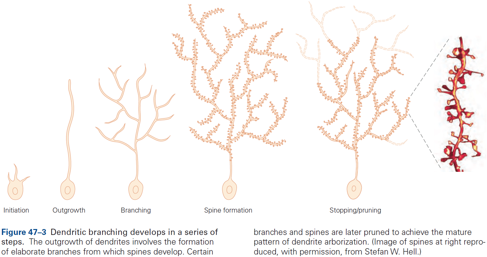
- These variations allow us to distinguish between different neuron types and are critical for their different functions.
- E.g. Cerebellar Purkinje cells can be distinguished from granule cells, spinal motor neurons, and hippocampal pyramidal neurons simply by looking at the pattern of their dendrites.
- How is the dendritic pattern established?
- In vitro neurons show a striking resemblance in their shape to in vivo neurons, suggesting that neurons must have intrinsic information about their dendritic pattern.

- Presumably, the transcriptional programs that specific neuronal subtype also encode information about neuronal shape.
- Another mechanism for forming the pattern of dendritic arbors is the recognition of one dendrite by others of the same cell.
- In some neurons, dendrites are evenly spaced with respect to each other, allowing them to sample inputs efficiently without gaps or clumps.
- This self-avoidance mechanism of dendrites means that branches from the same neuron repel each other.
- The dendrites of neighboring neurons also provide cues as the dendrites from one neuron cover a surface with minimal overlap, a spacing pattern called tiling.
- Tiling allows each class of neuron to receive information from the entire surface or area it innervates and avoids confusion from redundant dendrites sampling from the same area.
- For dendrites, the extrinsic patterning signals determine neuronal morphology.
- For axons, the signals guide axons to their targets.
- Once an axon forms, it begins to grow toward its synaptic target. The key neuronal element responsible for axonal growth is a specialized structure at the tip of the axon called the growth cone.

- The growth cone is both a sensory structure that receives directional cues from the environment, and a motor structure whose activity drives axon elongation.
- It guides the axon by transducing positive and negative cues into signals that regulate the cytoskeleton, thereby determining the course and rate of axonal growth toward its targets.
- The growth cone has three options when it encounters signals in the environment: advance, retract, or turn.
- Several motors power this movement, one source being the movement of actin along myosin, an interaction similar to the one that powers skeletal muscle fibers.
- Regardless of the motors, the final step involves the flow of microtubules from the central core of the growth cone into the newly extended tip, thus moving the growth cone ahead and leaving a new axon segment in its wake.

- Accurate pathfinding can only occur if the growth cone’s motor action is linked to its sensory function.
- Unexpectedly, growth cones contain the machinery for protein synthesis as axons severed from their cell body continued to grow for a few hours.
- Patterns of activity and experience can strengthen or weaken neural connections without requiring the formation of new axonal pathways.
- Review of Roger Sperry’s frog experiment where he severed the optic nerve, rotated the eye 180 degrees, and reattached the optic nerve. The frog could still see after recovering but all of the frog’s behaviors were reversed.

- Sperry’s experiment suggests that recognition between axons and targets relies on molecular matching rather than on functional validation and refinement of random connections.
- However, we also recognize that activity does play a crucial role in shaping connectivity.
- Our current understanding is that molecular matching dominates during embryonic development, and activity and experience modify circuits after they’ve been formed.
- The local distribution of environmental cues determines the pathway of the advancing growth cone.

- As a result of these discoveries, axon guidance (a process that appeared mysterious years ago) can now be viewed as the orderly consequence of protein-protein interactions that instruct the growth cone to grow, turn, branch, or stop.
- In the rest of this chapter, we illustrate lessons learned by describing the journey of two types of axons: retinal ganglion neurons and sensory relay neurons in the spinal cord.
- The growth of retinal ganglion axons is oriented in a series of discrete steps, making frequent decisions at closely spaced intervals along their route.
- The first step is for the axon of the retinal ganglion cell to leave the retina. The axon is oriented from the beginning, indicating that it can read directional cues in the environment.
- As it approaches the center of the retina, it’s influenced by the attractants emanating from the optic nerve head, which guide it into the optic stalk. It then follows the optic nerve toward the brain.
- The first axons to travel this route follow the cells of the optic stalk. These pioneer axons then serve as scaffolds for later axons, which are able to extend accurately simply by following their predecessors.
- Once they reach the optic chiasm, however, they must make a choice of which path to go down.
- E.g. Nasal hemiretina axons cross the chiasm and proceed to the opposite side of the brain, whereas temporal half axons are deflected as they reach the chiasm and stay on the same side.
- This divergence in trajectory reflects the differential responses of axons from the nasal and temporal hemiretinas to guidance cues presented by midline chiasm cells.
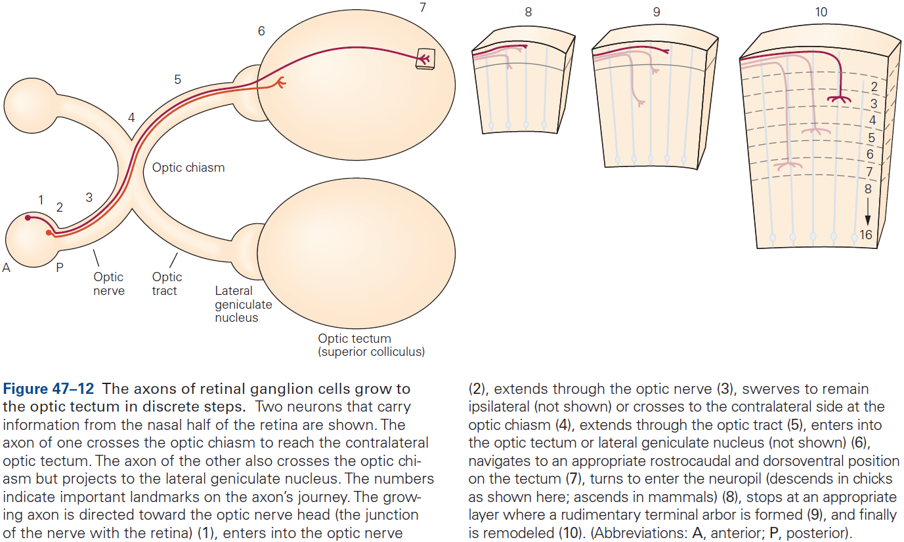
- The fraction of temporal retinal axons that project ipsilaterally varies among species as this reflects the placement of the eyes.
- E.g. In many animals, the eyes point to the sides and monitor different parts of the visual world, so that information from both eyes doesn’t need to be combined. In humans, both eyes look forward and sample large overlapping regions, so coordination of visual input is essential.
- In the neocortex, retinal inputs are restricted to a small fraction of the target neuron’s dendritic tree, implying that layer-specific cues arrest axonal elongation and trigger arborization.
- The problem of long-distance axon navigation is therefore solved by dividing the journey into short segments in which intermediate targets guide the axons along the path to their final targets.
- Ephrin-Eph interactions account in large part for formation of the retinotopic map in the tectum. Counter-gradients of each account for part of the topographic mapping.

- The retinotopic map is arranged in rectangular coordinates with ephrin-A/EphA and ephrin-B/EphB labeling the anteroposterior and dorsoventral axes respectively.
- Although this simple view is satisfying, reality is more complex.
- E.g. More precise spatial mapping is regulated by patterns of neural activity.
- Another example of axonal crossing that’s been studied in detail is the axonal crossing of commissural neurons that convey sensory information from the spinal cord to the brain at the ventral midline of spinal cord.
- After crossing, axons turn abruptly and grow up toward the brain. How do the axons know this?
- Netrins direct developing commissural axons across the midline, while chemoattractant and chemorepellent factors pattern the midline.
- While netrin does attract axons to the midline, it doesn’t keep them there forever. Instead, axons cross to the other side of the spinal cord even when their contralateral counterparts are navigating up the netrin gradient.
- Why doesn’t the axon circle back to the midline where netrin is?
- This puzzling behavior is explained by the fact that growth cones change their responsiveness to attractive and repellent signals as a consequence of exposure to floor plate signals.
- This switch illustrates an important property of intermediate targets involved in axon guidance as targets not only guide the growth of axons, but also change the sensitivity of the growth cone for the axon’s next journey.

- Different cues guide commissural axons during distinct phases of their overall trajectory, and this is played out over and over again for the millions and billions of neurons to establish the mature pattern of brain wiring.

**Highlights**

- A neuron become polarized when one neurite becomes an axon and the rest become dendrites.
- Cell types differ in the shape, size, and branching patterns of their dendrites. Such types arise from both intrinsic differences in transcriptional programs among types and from extrinsic influences on the developing dendrites.
- Interactions among dendrites are critical for dendritic patterning. Dendrites of the same cell avoid each other through repellent interactions, leading to even coverage of an area with few gaps or clumps. Dendrites of neighboring cells interact through tiling, which minimizes the overlap of dendritic fields.
- Growth cones at the tips of axons serve as both sensory and motor elements to guide axons to their destinations. Cytoskeletal elements of the growth cone propel the growth.
- Receptors on the growth cone recognize and bind ligands in the environment through which the axon is extending, guiding its growth. These interactions lead to generation of secondary messengers that mediate growth, turning, stopping, and branching of the axon.
- Some growth cones contain protein synthesis machinery which is used to mediate growth or turning.
- The growth of an axon to a distant target is broken into discrete shorter steps, where at each step, molecules on the surface of or secreted by neighboring structures guide the axon.
- They can also lead to alterations in the growth cone’s receptors, allowing it to respond to different sets of cues at subsequent stages.
- Ephrins and their receptors, Eph kinases, are key molecules that guide map formation. They’re graded in expression along the retina and tectum, and act in large part by repelling axons from incorrect positions rather than attracting them to correct positions.
- Both attractive and repellent molecules guide axons across midline structures, a process called decussation.

## Chapter 48: Formation and Elimination of Synapses

- So far, we’ve examined three stages in the development of the mammalian nervous system
    1. Formation and patterning of the neural tube.
    2. Generation and differentiation of neurons and glia.
    3. Growth and guidance of axons.
- One more step must occur before the brain becomes functional: the formation of synapses.
- Three key processes drive synapse formation
    1. Axons make choices among many potential post-synaptic partners.
    2. After cell-to-cell contact, the axon that contacts the target cell differentiates into a presynaptic terminal, while the target cell differentiates into a postsynaptic terminal.
    3. Once formed, synapses mature, often undergoing major rearrangements such as growth, strengthening, or death.
- Like neuronal cell death, synapse elimination at first glance is puzzling and seems wasteful.
- It’s become clear, however, that it plays a key role in refining the initial patterns of connectivity.
- Synapse formation is interesting because the initial steps appear to be mostly “hardwired” by molecular programs. However, as soon as synapses form, the nervous system begins to function and activity plays a critical role in subsequent development.
- The information-processing capacity of the nervous system is refined through its use, most dramatically in early life but also into adulthood.
- Once axons reach their designated target areas, they must choose appropriate synaptic partners from the many potential targets.
- Axon guidance and selective synapse formation can be distinguished.
- Recognition molecules promote selective synapse formation in the visual system.
- We will use the case study of retinal ganglion cells. These neurons respond to increases in light level (ON cells) and decreases in light level (OFF cells).
- The axons of all ganglion cells run through the optic nerve, forming parallel axonal pathways from the retina to the brain.
- The responsible properties of each class of ganglion cell depends on the synaptic inputs they receive from amacrine and bipolar interneurons, which in turn depend on photoreceptors.
- One important contributor to synaptic matchmaking is the division of the retina into layers and sublayers.
- Layer-specific arborization of pre- and postsynaptic processes restricts the choice of synaptic partners that they have access to. Similar layer-specific connections are found in many other regions of the brain and spinal cord.
- Laminar specificity doesn’t, however, completely account for the wiring of the retina.
- Connectivity is specific even within individual sublayers.
- Patterns of connectivity appear to be largely, although no entirely, hardwired, occurring before visual experience can affect circuitry. Thus, there must be molecules that restrict axons and dendrites to specific sublayers, and molecules that distinguish synaptic partners within a sublayer.
- Experiments hint at the existence of a complex code of recognition molecules that promotes specific connectivity within a target region.
- A different type of specificity is evident in the olfactory system as each olfactory sensory neuron expresses just one of about 1000 types of odorant receptors.
- Olfactory receptors not only determine a neuron’s responsiveness to specific odorants, but also help the axon to form appropriate synapses on target neurons.
- Thus, an early phase of molecular recognition generates a coarse map of nose-to-brain connectivity that’s independent of activity. Activity is used to refine the projections of axons.
- Nerve terminals not only discriminate among candidate targets, but also terminate on a specific part of the target.
- E.g. Dendrite, cell body, axon.
- In the cerebellum, the axons of different types of neurons terminate on distinct domains of the Purkinje neuron.
- E.g. Granule cell axons contact distal dendritic spines, climbing fiber axons contact proximal dendritic shafts, and basket cell axons contact the axon hillock and initial segment.
- We assume such synapse-location specificity relies on molecular cues on the postsynaptic cell surface such as adhesion molecules.
- Neural activity not only refines the selection of target neuron, but also the location of the synapse on the target neuron.
- Connection patterning is a biphasic pattern of initial guidance from activity-independent molecular cues followed by an activity-dependent phase in which the projection is refined.
- Molecular cues initially control synapse specificity, but once the circuit begins to function, specificity is sharpened through neural activity.

- Sometimes, neural activity promotes specificity in a different way by turning an inappropriate target into an appropriate one.
- E.g. Motor axons that innervate the wrong type of muscle fiber can convert the target muscle fiber into an appropriate type. Thus, the contractile properties of the muscle are partially transformed in a direction imposed by the firing properties of the motor nerve.

- Interestingly, direct electrical stimulation of a muscle with patterns normally evoked by slow or fast nerves leads to changes that are nearly as dramatic as those produced by cross-innervation.
- Principles of synaptic differentiation are revealed at the neuromuscular junction.
- Three types of cells at the neuromuscular junction
    - Motor neuron
    - Muscle fiber
    - Schwann cell
- As the growth cone begins its transformation into a nerve terminal, the part of the muscle surface opposite the nerve terminal begins to specialize too.
- Nerve and muscle organize each other’s differentiation as new receptor clusters appear precisely where presynaptic neurites contact muscle.
- However, motor neurons and muscle cells can synthesize and arrange most synaptic components without each other’s help.
- The developmental signals that are exchanged between nerve and muscle don’t induce changes in cell properties, rather, they assure that components are organized in the right place at the right time.
- Signals are exchanged between nerve and muscle that trigger different steps in the development of the neuromuscular junction, and it isn’t just the contact between the two that matters.

- Skipping over the details of how the basal lamina organizes and refines nerve terminals.
- The neuromuscular junction matures in a series of steps.
    - In embryonic muscle, ACh receptors are turned over rapidly (half-life of one day) in both synaptic and extrasynaptic regions.
    - In adult muscle, the receptors are relatively stable (half-life of 2 weeks).
- Neuromuscular junctions and central synapses develop in similar ways.
- At both synaptic types, pre-and postsynaptic elements regulate each other’s differentiation by organizing synaptic components rather than by inducing their expression, and synapses develop in a progressive series of steps but the molecular details differ.
- Synaptic organizing molecules pattern central nerve terminals.
- Although central synapses and neuromuscular junctions share many features, they differ in that muscle fibers are covered by a basal lamina that central neurons don’t have.
- In central neurons, neurexin-neuroligin interactions facilitate precise apposition of pre-and postsynaptic specialization.
- In adult mammals, each muscle fiber ends up with exactly one input, but this isn’t true in the embryonic stage. Soon after birth, all inputs but one are eliminated.
- The process of synaptic elimination isn’t a manifestation of neuronal death as it generally occurs long after the period of naturally occurring cell death.
- Each motor axon withdraws branches from some muscle fibers but strengthens its connections with others, thus focusing its increasing capacity for transmitter release on a decreasing number of targets.

- What’s the function of having multiple synapses during the embryonic stage?
- One answer is that it ensures that each muscle fiber is innervated. Another answer is that it allows all axons to capture an appropriate set of target cells. A third answer is that synapse elimination provides a means by which activity can change the strength of specific synaptic connections.
- Synapse elimination appears to be a competitive process where activity drives competition for trophic substances.
- Glia regulate both formation and elimination of synapses as cultured neurons in the complete absence of nonneuronal cells form few synapses in isolation, but many when astrocytes are present.
- The role of glia in synaptic development is only beginning to be worked out.

**Highlights**

- Axons are guided to their targets by complex mechanisms, but need further guidance to choose their synaptic partners from among many neuronal types.
- One mechanism is the matching of cell-surface recognition molecules on pre- and postsynaptic partners. Other mechanisms include selective interactions among axons, the ability of some axons to convert their targets to the appropriate types, and selective elimination of inappropriate contacts.
- Spatial constraints that enhance specificity include restricting axons and dendrites to particular laminae within a target region, and restricting synapses to defined domains on the target cell surface.
- In many causes, activity-dependent mechanisms sharpen specificity. The activity can be spontaneous or driven by experience.
- The neuromuscular junction has been used to explore synaptic specificity and one key finding is that multiple interactions between synaptic partners are required for the formation, maturation, and maintenance of the synapse.
- Signals between synaptic partners are best viewed as organizers rather than inducers.
- Central synapses develop in a similar way to those at the neuromuscular junction, but don’t use a layer of basal lamina.
- Many synapses are eliminated, generally by competition and activity-dependent mechanisms.
- As circuits mature, the number of inputs a neuron receives may decrease dramatically, but the size and strength of the remaining inputs increase even more dramatically.
- Along with pre- and postsynaptic partners, glia play key roles at the synapse, contributing to synapse formation, maturation, maintenance, and elimination.

## Chapter 49: Experience and the Refinement of Synaptic Connections

- The human nervous system is functional at birth but compared to other species, it isn’t very functional.
- Why is our maturation delayed?
- One main factor is that the embryonic connectivity of the nervous system is only a rough draft of the neural circuits that exist in our adult selves.
- Embryonic circuits are refined by sensory stimulation and motor activity, in other words, experience.
- A common feature of mammalian neural development is its two phases: genetically determined connectivity followed by experience-dependent reorganization.
- In humans, the second phase is especially prolonged, giving us the ability to custom fit our nervous systems to our unique bodies and unique environments.
- While the nervous system is plastic throughout our lifetimes, there are periods of heightened susceptibility to modification called sensitive periods.
- Sometimes, an atypical experience or deprivation can’t be reversed at a later age and we call these critical periods.
- E.g. Imprinting in birds where they follow the first moving object they see right after birth. Humans have critical periods for language.
- Critical periods are evidence that experience-dependent neural development is concentrated in early postnatal life.
- Experiments using infants in foundling homes, nursing homes, and newborn monkeys confirmed the critical influence of early experience on later behavior.
- E.g. If newborns are deprived of social interaction in their first year, they show persistent and serious disturbances in behavior.
- The dramatic dependence of the brain on experience and it’s ability to shape perception is evident in people born with cataracts.
- In the 1930s, it became apparent that patients who had congenital binocular cataracts removed after the age of 10 experienced permanent deficits in visual acuity and in perceiving shape and form.
- In contrast, cataracts that develop in adults and removed decades later don’t impair vision.
- Another example of how visual experience affects the structure and function of the visual cortex is seen in the development of binocular vision.
- Review of Hubel and Wiesel experiment of suturing shut one eye from birth to 6 months of age.

- When the sutures were removed, the animal was blind in the deprived eye. The retinal ganglion cells in the deprived eye and the LGN that receives input from that eye responded well to visual stimuli and had normal receptive fields. However, cells in the visual cortex didn’t respond to signals from the deprived eye.
- E.g. The visual cortex normally responds to binocular input, but in the deprived animal it didn’t.
- Not only had the deprived eye lost its ability to drive cortical neurons, but little recovery occurred as the loss was permanent and irreversible.
- Three other findings from Hubel and Wiesel
    - Monocular deprivation for a few weeks shortly after birth led to loss of cortical responsiveness, but was reversible after the eye had been opened.
    - Monocular deprivation for a few weeks during the next several weeks also resulted in loss of cortical responsiveness but was irreversible.
    - Deprivation in adults had no effect on the responsiveness of cortical cells.
- These results show that the cortical connections that control visual perception are established within a critical period of early development.
- The anatomical correlates of these functional defects early in life alters the structure of the cerebral cortex.
- We can conclude that visual deprivation perturbs the ability of the inputs to acquire their mature pattern, and doesn’t interfere with the development of the initial pattern.
- E.g. A columnar organization of the visual cortex is already evident by birth in monkeys and activity is only used to refine the circuits, not form them.

- How does activity lead to maturation of ocular dominance columns?
- The key factor may be differences in the proportion of inputs from each eye that converge on common target cells at birth.
- Hebb’s rule may strengthen the synapse between connections from the same eye, which will impede the growth of synaptic inputs from the opposite eye.
- In this sense, fibers from the two eyes may compete for a target cell.
- Thus, both cooperation between axons from the same eye and competition between axons from opposing eyes ensures that the two populations of afferent fibers will eventually innervate distinct regions of the primary visual cortex with little overlap.

- Competition and cooperation aren’t simply the result of neural activity or of differences in absolute levels of activity among axons.
- Instead, they appear to depend on precise temporal patterns of activity in the competing and cooperating axons.
- The disruption of synchrony of inputs, such as the case of strabismus (lazy eye), led to competition rather than cooperation, so that cortical cells became dominated by one eye.

- Only when the optic nerves were stimulated asynchronously were ocular dominance columns established, but not in the case of synchronous stimulation.
- If the development of ocular dominance columns does depend on competition between fibers from the two eyes, could we induce the formation of columns when they’re not normally present by simply establishing competition between two sets of axons?
- If a third eye is transplanted into a frog, we find the develop of a pattern of alternating ocular dominance columns.

- This finding provides dramatic support for the idea that competition between afferent axons for the same population of target neurons drives their segregation into distinct target territories.
- What converts the early loss of input into a permanent alteration of functional capability?
- One idea is that thalamic axons carrying information from the deprived eye lose their ability to activate cortical neurons. While this is a part of the story, this isn’t the whole story.
- The loss of cortical responsiveness to the deprived eye results from a circuit alteration rather than from a simple loss of input.
- What specific circuit alterations?
- Excitatory synapses within the primary visual cortex may weaken because of the decreased input from the closed eye, and may strengthen for the open eye.
- The strength of inhibitory synapses may be altered, leading to a net decrease in the level of excitation of cortical neurons by inputs from the closed eye, or a net increase in excitation from the open eye.
- Evidence from mice show that during the first few days after closing one eye, input from the closed eye result in weakened responses. This weakening results from a process like LTD or STDP.
- Then, over the following few days, responses to inputs from the open eye become stronger. In part due to LTP and homeostatic plasticity.
- Homeostatic plasticity: a circuit mechanism that attempts to maintain a steady level of input to neurons.
- Inhibitory interneurons are also implicated in having an important role in the timing of the critical period.
- E.g. Maturation of inhibitory input onto visual cortical neurons coincides with the beginning of the critical period, and manipulations to GABA signaling results in advancing or delaying the period.
- Results support a link between dendritic spine dynamics with critical period plasticity.
- Physiological changes and synaptic alterations precede large-scale axonal rearrangements.
- What closes the critical period?
- One factor is the myelination of axons, which occurs around the time the critical period closes.
- Myelin creates physical barriers to sprouting and axonal growth, and contains factors that actively inhibit axonal growth.
- Experience-independent spontaneous neural activity leads to early circuit refinement, such as the development of ocular dominance columns.
- Use of tetrodotoxin on the optic nerves disrupts the segregation of inputs from each eye, indicating that activity is essential for segregation.
- In contrast to the cortex, however, segregation of inputs in the LGN is complete before the onset of visual experience.
- Thus, vision can’t drive the neural activity essential for segregation.
- It turns out that retinal ganglion neurons are spontaneously activity in utero, well before the eyes open.
- E.g. Neighboring ganglion cells fire in synchronous bursts that last a few seconds, followed by silent periods that may last for minutes. These bursts propagate across the retina like waves, which appears to be coordinated by excitatory inputs from amacrine cells.
- The spontaneous, synchronous firing of a select group of ganglion neurons excites a local group of neurons in the LGN, which may use a Hebbian mechanism to segregate the inputs.
- The discovery that spontaneous activity can lead to circuit refinement provides a likely explanation for the initial segregation of inputs to the visual cortex.
- In general, the parsing of activity-dependent circuit refinement into two phases: spontaneous activity and then sensory input, appears to be a general theme in the development of brain circuits that begin refinement before any environmental stimulation.
- Activity-dependent refinement of connections is a general feature of brain circuitry.
- Histological and physiological studies have found that the map initially formed in the superior colliculus is coarse and that individual retinal ganglion cell axons have large, overlapping arbors.
- These arbors are later pruned to their mature size, resulting in a more restricted and precise field of termination. If retinal activity is inhibited, only the initial coarse map forms.
- The pattern of activity matters for visual map formation and it isn’t just the activity alone.
- E.g. Fish raised in constant light developed normally, whereas fish raised in flashes of light didn’t because it caused retinal ganglion cells to fire synchronously. The synchronous activity couldn’t be used to refine the topographic map so the map remained coarse.
- The integration of multiple sensory modalities is coordinated during a critical period.
- E.g. In barn owls, to perform sound localization, the visual map instructs the auditory map.
- Different functions and brain regions have different critical periods of development.
- E.g. In monkeys, layer IVC isn’t affected my monocular deprivation by two months of age, but the upper and lower layers are for up to one year of age.
- Critical periods for other features of the visual system, such as orientation tuning, occur at different developmental stages.

- The timing of critical periods also varies between brain regions.
- E.g. Sensory connections are generally fully realized early while social connections are realized over a much longer period.
- These differences may explain why certain types of learning are optimal at certain stages of development.
- The events of map rearrangement during the normal critical period must leave a neural trace that permits rearrangement later in life.
- E.g. Adult owls that had worn goggles during adolescence can shift their auditory map in contrast to adult owls that didn’t wear them during adolescence.
- Axons that were normally pruned were maintained, providing a structural basis for the reorganization in adulthood.
- Remarkably, transplantation of immature inhibitory interneurons into the visual cortex also reopens the critical period in 6-month-old mice.
- Two factors that distinguish plasticity in younger and older individuals
    - In early postnatal life, the brain is conducive to axonal growth and cellular mechanisms are optimal for the strengthening, weakening, and elimination of synapses. Conversely, in mature circuits, molecular and structural elements promote stability over plasticity.
    - In a developing circuit, no particular pattern of connectivity is established, so there’s less to overcome. Patterns of neural activity that result from experience sharpen and even realign these patterns of connectivity.

**Highlights**

- Although the nervous system is malleable throughout life, plasticity is optimal during restricted intervals in early postnatal life called critical periods. Changes during these periods are nearly irreversible.
- Critical periods vary in time among brain areas and functions.
    - E.g. Children with strabismus will never have good stereoscopic vision unless it’s corrected during the first few postnatal years.
- Our richest understanding of critical periods comes from the studies done by Hubel and Wiesel on how input from the two eyes is integrated in the cortex.
    - E.g. Monocular deprivation for varying periods and at varying times has different effects on binocular vision.
- A structural basis for the loss of binocularity was seen in the alternating pattern of ocular dominance columns following monocular deprivation during the critical period, columns representing the open eye expanded at the expense of those representing the closed eye.
- This form of plasticity may be designed to optimize the use of cortical space for each individual at each time period.
- Binocular vision reflects competition between the two sets of inputs. Evidence indicates that the competition depends on patterns of activity from both eyes, with inputs from each eye being more synchronous with each other than with the other eye.
- Prenatally, patterned spontaneous activity accounts for synchrony. Postnatally, visual experience accounts for synchrony.
- Following monocular deprivation, input from the closed eye is rapidly weakened by a process similar to long-term depression (LTD). Shortly after, input from the other eye is strengthened, partly due to a compensatory mechanism called homeostatic plasticity.
- Maturation of inhibitory interneurons is the main determinant of when the critical period opens. The end of the critical period is marked by the formation of myelin and structures that hamper structural remodeling.
- Plasticity in adulthood is modest in magnitude and is difficult to trigger compared to early postnatal critical periods.
- Critical periods occur during the development of numerous systems, such as the formation of orderly maps of auditory, somatosensory, and visual input onto relevant sensory cortices.
- Many principles and mechanisms that characterize neural plasticity also regulate critical periods.
    - E.g. Roles of spontaneous and experience-dependent activity, competition, changes in excitatory and inhibitory synapses, and selective growth and pruning of inputs to achieve appropriate patterns of adult connectivity.
- The existence of critical periods demonstrates that the brain’s ability to remodel declines sharply into adulthood. While this may seem disadvantageous, it represents a useful adaptation, allowing each brain to adapt to its environment and then buffering it against excessive change later, perhaps even enabling skills and memories to persist.

## Chapter 50: Repairing the Damaged Brain

- Neurology has become well known for its ability to localize lesions with great precision but, until recently, has had little to offer in terms of treatment.
- Three reasons developmental neuroscience is able to offer treatments
    - Recent advances in our understanding of the mechanisms that control the generation and death of nerve cells allow for efforts to preserve or replace neurons lost to damage or disease.
    - Efforts to improve the regeneration of neural pathways following injury draw heavily on what we’ve learned about the growth of axons and the formation of synapses.
    - There’s increasing evidence that some devastating brain disorders are the result of disturbances in the formation of neural circuits in embryonic or early postnatal life.
- Studies of normal development provides an essential foundation for discovering precisely what has gone wrong in diseases.
- This chapter focuses on how neuroscientists hope to augment the limited ability of neurons to recover normal function.
- We start by describing how axons degenerate following separation from the cell body.
- The regeneration of severed axons is robust in the PNS of mammals and in the CNS of lower vertebrates, but is very poor in the CNS of mammals.
- Many investigators have sought the reasons for these differences in hopes that understanding them will lead to methods for augmenting recovery of the human CNS following injury.
- Damage to the axon affects both the neuron and neighboring cells.
- Because many neurons have very long axons and modest cell bodies, most injuries to CNS or PNS neurons involve damage to axons.
- Axotomy: transection of the axon either by cutting or crushing.
- Axotomy divides the axon into two segments
    - Proximal segment: attached to the cell body.
    - Distal segment: detached from the cell body.
- The distal segment dies because energy supplies dwindle with no replacement from the cell.
- Synaptic transmission fails at severed nerve terminals and calcium levels increase within the axon.

- Once denervation begins, its progression is rapid and inexorably proceeds to completion.
- The discovery and analysis of the Wlds (Wallerian degeneration slow) mutation suggests that degeneration isn’t a passive consequence of separation from the cell body, but is rather an actively regulated response.
- Instead of the distal segment only degenerating due to the lack of nutrients, a signaling pathway in the axon also senses damage and rapidly triggers degeneration. Thus degeneration is both a passive and active process.
- Even the proximal segment of the axon suffers and the neuron itself may die by apoptosis.
- Axotomy sets in motion a cascade of responses in neighboring cells, the most important of which are those of the glial cells that form the myelin sheath.
- One is fragmentation of the myelin sheath in PNS neurons, which is then removed by phagocytes.
- E.g. The myelin-producing Schwann cells break the myelin into fragments and engulf it.
- In contrast, for CNS neurons, the myelin-forming oligodendrocytes have little to no ability to dispose of myelin, and removal of debris depends on resident phagocytic cells called microglia.
- This difference may explain why Wallerian degeneration occurs much slower in the CNS compared to the PNS.
- Axotomy also affects the synaptic targets of the injured neuron as usually the target atrophies and sometimes dies.
- Synaptic stripping: when presynaptic neurons withdraw from the damaged neuron and are replaced by processes of glial cells.
- Synaptic stripping depresses synaptic activity and can impair functional recovery.
- These synaptic effects, both on the pre- and postsynaptic neurons of the damaged neuron, can propagate neuronal degeneration through a circuit in both directions.
- Such chain reactions help to explain how injury in one area in the CNS eventually affects regions far from the site of injury.
- CNS and PNS nerves differ substantially in their ability to regenerate after injury.
- E.g. PNS nerves can often be repaired as the proximal stump generally survives and sprouts into the dead distal stump. The mechanisms that drive this process are related to those that guide embryonic axons.

- In all three divisions of the PNS (motor, sensory, and autonomic) the effects of axotomy are reversible.
- In contrast, the regeneration after injury is poor in the CNS as damaged axons form short sprouts, but soon stall and form swollen endings called retraction bulbs.
- Is it the ability of peripheral axons to regenerate that’s unusual, or the inability of central axons to do so?
- The answer is the latter as we know that central axons grow well during development and that regeneration is robust in the adult CNS of lower vertebrates such as fish and frogs.
- So why have mature mammals lost this seemingly important capacity for repair?
- The answer may lie in the tradeoff between flexibility and stability.
- Maintaining constancy in the face of small perturbations in connectivity may therefore have the unavoidable consequence of limiting the ability of central connections to regenerate in response to injury.
- Is the poor regeneration of central axons reflective of an inability of neurons themselves to grow or an inability of the environment to support axonal growth?
- To answer this question, scientists swapped segments of a central nerve trunk into a peripheral nerve, and segments of a peripheral nerve into the brain or spinal cord to find out how axons would respond to a novel environment.
- Surprisingly, damaged spinal axon that regenerated poorly following injury grew several centimeters into the peripheral graft with similar results seen for optic nerve damage.
- Conversely, peripheral axons regenerate well in their own environment, but poorly in the CNS environment.

- While this shows that part of the reason why central axons regenerate poorly is because of their environment, even an optimal environment can’t fully restore the growth potential of central axons.
- The environmental factors that support the regeneration of injured axons was found to include components of Schwann cell basal laminae, cell adhesion molecules of the immunoglobulin superfamily, and neurotrophins.
- These molecules nourish neurons and guide growing axons in the embryonic nervous system, so it makes sense that they also promote the regrowth of axons.
- By contrast, CNS tissue is a poor source of these molecules in adulthood, but not during embryonic development.
- This suggests that practical applications should supplement the central environment with growth-promoting molecules that might improve regeneration and while this does help, regeneration remains limited and axons fail to extend long distances with minimal functional recovery.
- What accounts for the disappointingly limited regeneration?
    - One part is that the CNS environment not only lacks growth-promoting factors, but is also rich in growth-inhibiting factors, some of which come from myelin.
    - The fact that myelin inhibits neurite growth may seem peculiar, but not if we consider that myelination normally occurs postnatally, after axon extension is mostly complete.
    - Injury-inducing scarring also hinders axonal regeneration through mechanical interference with axon growth and through growth-inhibiting effects.
    - Environmental differences can’t completely account for the poor regeneration of central axons.
    - Experiments with tissue culture show that the growth potential of central neurons decreases with age, whereas mature peripheral neurons don’t lose their potential.
- Another approach to functional recovery is to focus on the incomplete recovery that can occur following injury even without regeneration of cut axons. This approach uses the latent plasticity of the nervous system to rewire itself after injury.
- The failure to grow a new axon is by no means the worst fate that can befall an injured neuron. For many neurons, axotomy leads to cell death.
- The traditional view that the generation of all neurons is complete by birth has changed since we’ve discovered that neurogenesis continues into adulthood in some parts of the mammalian brain.
- We’re now confident that new neurons are added to the dentate gyrus of the hippocampus and to the olfactory bulb throughout life, although the rate of addition declines with age.
- Thus, neurons born at embryonic stages are gradually replaced by later-born neurons so that the total number of neurons in these regions is maintained.
- Where do these new adult-born neurons come from?
- Stem cells are the source of neurons in the adult as well as the embryo and are likely derived from radial glia, which also serve as a source of neurons during embryonic development.
- We should remember that efforts to replace central neurons or to enhance the regeneration of their axons is of little use if these axons are unable to form functional synapses with their target cells.

**Highlights**

- When axons are transected, the distal segment degenerates, a process called Wallerian degeneration. The proximal segment and cell body also undergo changes, as do the injured neuron’s synaptic inputs and targets.
- Wallerian degeneration isn’t a passive and inevitable consequence, but is an active and regulated process. Intervention in the pathway can slow or even halt degeneration.
- Axons can regenerate and form new synapses, but in mammals, regeneration is more widespread and effective in peripheral axons than in central axons.
- A key factor that separates central from peripheral axon regeneration is that the environment of injured central axons is poor at supporting growth. It lacks both nutritive factors and contains growth-inhibitory factors absent from peripheral nerves.
- Structures that inhibit regeneration include myelin fragments that persist after Wallerian degeneration and astrocytes that form glial scars at injury sites. Inhibitory factors in myelin include Nogo and myelin-associated glycoprotein.
- Central regeneration is also inhibited by intrinsic decreased ability of adult central neurons to grow due to downregulation of growth programs that were active during development. Interventions that restore or disinhibit growth pathways enable regeneration.
- The failure of regeneration following injury may be related to the stabilization of connections that occurs at the end of critical periods.
    - E.g. Myelination, which occurs mostly at the end of a critical period, may have the secondary effect of preventing further, large-scale rearrangement of synaptic connections.
- Another approach for restoring function is to harness the ability of intact axons to form new connections, generating adaptive circuits that can somewhat compensate for those lost to injury.
- The traditional view that all neurogenesis occurs during or shortly after gestation has now been updated by the discovery that new neurons are born throughout life in a few brain areas. These new neurons come from resident stem cells and can integrate into functional circuits.
- Neuronal replacement can also be achieved by implanting developing neurons such as fetal neurons or neurons derived from stem cells.

## Chapter 51: Sexual Differentiation of the Nervous System

- Our understanding of behavioral differences between the sexes is primitive and many findings remain controversial.
- This chapter briefly summarizes the embryological basis of sexual differentiation and discusses the behavioral differences between the two sexes.
- Three issues of sexual differentiation
    1. What are the genetic origins of sexual differences?
        - E.g. Human males and females have a complement of 23 chromosomal pairs where only one pair differs (XX vs XY).
    2. How are the sexual differences initiated by the Y chromosome translated into differences between the brains of men and women?
        - Key intermediates are the sex hormones such as testosterone and estrogen.
    3. What are the crucial neural differences that underlie sexually dimorphic behaviors?
        - Clear physical and molecular differences between the brains of men and women have been found. However, sexually dimorphic behaviors also appear to come from different usage of the same basic circuits.
- Difference between sex and gender
    - Sex: can refer to anatomical, gonadal, or chromosomal sex. Is a biological term.
    - Gender: encompasses the collection of social behaviors and mental states that typically differ between males and females.
- Genes and hormones determine physical differences between males and females.
- The sex genotype (XX or XY) drives the differentiation of the embryonic gonads into ovaries or testes, which then direct sexual differentiation of the nervous system and the rest of the body.
- Skipping over the genetic details like the how it’s the presence of the Y chromosome rather than the lack of a second X that’s crucial for sexual differentiation, SRY gene, and hormones.
- Sex-specific behaviors occur because the nervous system differs between males and females.
- These differences arise from a combination of genetic factors, such as signaling pathways initiated by sex determination, as well as environmental factors.
- Erectile function is controlled by a sexually dimorphic circuit in the spinal cord.
- Specifically, in the lumbar spinal cord, the spinal nucleus of the bulbocavernosus (SNB) plays an important role in penile reflexes in males and vaginal movements in females.
- In female rats, many motor neurons in the SNB and many fibers in the bulbocavernosus muscles die in early postnatal life.
- The dimorphism results from male-specific preservation of motor neurons and muscle fibers that would die in the absence of hormone.
- Skipping over song production in birds due to sexually dimorphic circuits in the forebrain.
- Mating behavior in mammals is controlled by a sexually dimorphic neural circuit in the hypothalamus.
- Removal of the olfactory bulb abolishes mating as well as aggression in mice and other rodents as pheromones are no longer signaled.
- Can we discern any common themes across studies of sexual dimorphism in fruit flies, rodents, and birds?
- A variety of sexually dimorphic neural circuits, or wiring diagrams, can generate sex differences in behavior.
- Although it’s challenging to trace the chain of causality from genetic factors to dimorphic circuits to sex-specific behaviors, there are a few general possibilities.
- It’s rare to encounter a sex-unique neural circuit as most behaviors are shared between the sexes.
- It appears that most sexual dimorphisms in behavior arise from sex differences in key neuronal populations within common circuits. The activity and connectivity of these populations alter behavioral output in a male- or female-typical manner.
- Estrogen can also periodically reconfigure presynaptic connectivity within a hypothalamic neural circuit, ensuring that female mice only mate when they’re ovulating and fertile.
- Thus, wiring diagrams are plastic and responsive to hormonal changes across the estrous cycle, which is analogous to the menstrual cycle in humans.
- There’s no single neuronal population that governs gender-typical behavior, rather, the neural control of distinct behaviors is distributed across multiple different populations.
- This modular control of sexually dimorphic behaviors fits well with our thinking that most circuits are shared between males and females, and that sex differences in behavior arise from key neural populations that change circuit function in a male- or female-typical manner.
- In terms of the brain, there are likely many sexual dimorphisms with different structures having a larger volume for each sex.
- However, it’s unclear whether these brain dimorphisms come from hormonal action or from experience.

- Pheromone perception in humans is quite different from that of mice and is likely to be less important as humans don’t have a functional vomeronasal organ, which is used by other animals to detect pheromones.
- To the extent that humans do sense pheromones, they appear to use the main olfactory epithelium and bulb.
- Do sexually dimorphic structures in homosexual brains correlate with anatomical sex or sexual orientation?
- Studies have provided support for the view that the brains of homosexual men resemble those of heterosexual women, and that the brains of homosexual women resemble those of heterosexual men.
- However, it isn’t clear whether the structural dimorphism in these individuals is a consequence or a cause of gender identity or sexual orientation.

**Highlights**

- In humans and many other mammals, the sex determination pathway directs differentiation of the bipotential gonad into testes in males and ovaries in females.
- Sex steroid hormones produced by the gonads, testosterone by testes, and estrogens and progesterone by ovaries, drive sexual differentiation of both the nervous system and the rest of the body.
- In prenatal development and childhood, sex hormones act early during a critical window in development to irreversibly organize neural substrates for behavior in a sexually dimorphic way.
- In adult life, these hormones act acutely and reversibly to activate sex-typical physiological and behavioral responses.
- During the critical window, testes produce a surge of testosterone that masculinizes the developing bipotential nervous system. By contrast, the ovaries are inactive during this period and it’s thoughts that the absence of sex hormones enables the nervous system to differentiate along a female-default pathway.
- Many actions of testosterone that masculinize the nervous system occur following its conversion to estrogen locally at the site of action.
- Sex hormones control sexual differentiation of neural pathways by using cellular processes such as apoptosis, neurite extension, and synapse formation that are employed widely during other developmental events.
- Sex hormones bind to cognate hormone receptors that modulate gene expression. Such genes, in turn, regulate the cellular processes that result in sex differences in neuronal number, connectivity, and physiology.
- Many neuronal populations that are sexually dimorphic have been identified in the vertebrate brain, but not all of these regions influence sexually dimorphic behaviors.
- Many sex hormone-regulated genes are sexually dimorphic and these genes, as well as the neurons they’re expressed in, regulate sexually dimorphic social behaviors in a modular way.
- In other words, individual genes and the neuronal populations that express them modulate one or few sexually dimorphic behaviors so that the control of these behaviors is distributed among many different neuronal groups.
- Such sexually dimorphic neuronal populations are likely embedded within neural circuits found in both sexes and are thought to guide behavior along male-or female-typical patterns.
- There are many sex differences between the brains of men and women, and in some cases, these sex differences align with gender in adult life rather than gender assigned at birth.
- In these cases, it isn’t clear whether the sex differences causally reflect gender identity or if they’re a result of it. These issues are difficult to disentangle as of now.

# Part VIII: Learning, Memory, Language and Cognition

- Less than half of the human cerebral cortex is taken up by motor and sensory functions, the rest is occupied by association areas which coordinate events between motor and sensory areas.
- Three association areas
    - Prefrontal
    - Parietal-temporal-occipital
    - Limbic
- Most of the early evidence relating cognitive functions to the association areas came from clinical studies of brain-damaged patients.
- E.g. The study of language in patients with aphasia.

## Chapter 52: Learning and Memory

- Learning: a change in behavior that results from acquiring knowledge about the world.
- Memory: the processes by which knowledge is encoded, stored, and retrieved.
- Imagine a life without the ability to learn and remember. We would forget people and places and no longer be able to use and understand language or execute motor skills that we had learned. We would even lose our sense of personal identity.
- Learning and memory are essential to the full functioning and independent survival of people and animals.
- Are there discrete neural systems concerned with memory? And if so, is there a “memory center” or is memory processing widely distributed throughout the brain?
- Contrary to the prevalent view that cognitive functions are localized in the brain, many students of learning doubted that memory was localized.
- We know now, however, that not all regions are equally important to memory and that there are several fundamentally different types of memory. Certain regions of the brain are much more important for encoding some types of memory than for others.
- In this chapter, we focus on studies of normal human memory, its perturbations following brain lesions, and measurements of fMRI brain activity during learning and memory recall.
- Three major insights on learning and memory
    - There are several forms of learning and memory, and each has distinctive cognitive and computational properties and is supported by different brain systems.
    - Memory involves encoding, storage, retrieval, and consolidation.
    - Imperfections and errors in remembering can provide clues about the nature and function of learning and memory, and the role memory plays in guiding behavior and planning.
- Two dimensions of memory
    - Time course of storage
    - Nature of the stored information
- Short- and long-term memory involve different neural systems.
- Short-term memory, such as working memory, maintains transient representations of information relevant to immediate goals.
- In humans, working memory consists of at least two subsystems, one for verbal information and another for visuospatial information.
- These two subsystems are coordinated by a third system called the executive control processes.
- Executive control processes are thought to allocate attentional resources to verbal and visuospatial subsystems and to monitor, manipulate, and update stored representations.
- The verbal subsystem keeps speech-based information in conscious awareness and depends on posterior parietal cortices.
- E.g. Mentally rehearsing a password before entering it.
- The visuospatial subsystem keeps mental images of visual objects and the location of objects in space and depends on parietal, inferior temporal, and occipital cortices by the frontal and premotor cortices.
- Single-cell recordings indicate that prefrontal neurons maintain representations for spatial, object, and integration knowledge.

- Thus, working memory involves activation of representations of information stored in specialized cortical regions based on the content of information, and the activation of general control mechanisms in the prefrontal cortex.
- Information stored in short-term memory is selectively transferred to long-term memory.
- Review of patient H.M. who had bilateral removal of his hippocampus and neighboring regions in the medial temporal lobe (MTL) as treatment for epilepsy, resulting in severe memory deficits.
- What’s so remarkable about H.M.’s deficit was its specificity.
- E.g. H.M. had normal working memory for seconds or minutes, indicating that the MTL isn’t needed for it. He also had normal long-term memory for events that occurred before the operation.
- What H.M. now lacked was the ability to transfer new information into long-term memory, a deficit called anterograde amnesia.
- H.M. isn’t unique as all patients with extensive bilateral lesions of the limbic association areas of the MTL show similar long-term memory deficits.
- H.M.’s case suggested that memories must be transferred over time from the hippocampus and MTL to other brain structures.
- However, H.M. could learn and retain motor skills but couldn’t consciously remember having performed the task. Same goes for habituation, sensitization, and some forms of conditioning.

- Early theories suggested that a critical factor for memories that don’t survive MTL damage may be conscious awareness or explicit/declarative memories.
- Explicit memories can be further classified into episodic memory and semantic memory.
- Explicit memory is considered to be highly flexible as information can be associated under different conditions and is easily formed. In contrast, implicit memory is tightly connected to the original conditions/context that the learning occurred.
- Four types of memory processes
    - Encoding: when new information is initially acquired and processed.
    - Storage: the neural mechanisms and sites that newly acquired information is retained.
    - Consolidation: the process that transforms temporarily stored information into a more stable form.
    - Retrieval: the process of how stored information is recalled.
- Retrieval of memory is similar to perception because it’s a constructive process and is subject to distortion much as perception is subject to illusions.
- When a memory is retrieved, it becomes active again, providing an opportunity for an old memory to be encoded again. This can be used to link the old memory with a new context, but this also opens the door to errors in memory.
- During recall, we use a variety of cognitive strategies to generate a memory that seems coherent to us, that’s consistent with other memories, and that’s consistent with our “memory of the memory”.
- E.g. Comparison, inference, guessing, and supposition.
- Memory enables us to use our past experience to predict future events, thus promoting adaptive behavior.
- Observations consistently find that lesions of the right hippocampus differentially give rise to problems with spatial orientation, while lesions of the left hippocampus cause deficits in verbal memory.
- The fact that the hippocampus supports spatial processing, semantic memory, and episodic memory raises questions about how the hippocampus contributes to such different behaviors.
- The hippocampus may provide a general mechanism for forming and storing complex multimodal associations.
- Priming: the automatic influence of exposure to one cue on processing of a later cue.
- Implicit memories are a form of nonconscious memory that’s evident in the performance of a task.
- Different forms of implicit memory involve different neural circuits.
- E.g. Learning habits, motor skills, and conditioned responses can take place independent of the MTL.
- Early theories proposed that implicit memory doesn’t depend on the MTL, but rather on the basal ganglia and cerebellum.
- However, subsequent work suggested that this isn’t a general rule and that the MTL is required for some forms of implicit learning that store relational associations, even when such associations are learned through repetition and appear to take place without conscious awareness.
- Skill learning moves from a cognitive stage where knowledge is represented explicitly and the learner must pay attention to performance, to an autonomous stage where the skill can be executed without much conscious attention.
- E.g. Driving and touch typing.
- Implicit memory can be associative or nonassociative.
- With associative learning, the animal learns about the relationship between two stimuli or between a stimulus and a behavior.
- E.g. Classical and operant conditioning.
- Extinction in classical conditioning is an important adaptive mechanism and evidence indicates that it isn’t the same as forgetting. Instead, something new is learned.

- Operant behaviors are said to be emitted rather than elicited because there’s no stimulus.
- With nonassociative learning, the animal is exposed once or repeatedly to a single type of stimulus.
- E.g. Habituation (decreased response to repeat stimuli) and sensitization (increased response to repeat stimuli).
- Memory allows us to revisit our personal past, access a vast network of facts, associations, and concepts, and supports learning and adaptive behaviors. But memory isn’t perfect.
- We often forget and sometimes distort the past, which can provide important insights into the workings of memory.
- Six imperfections of memory
    - Absent-mindedness: lack of attention to immediate experience.
        - E.g. Forgetting where you put your keys or to pick up groceries after work.
    - Blocking: a temporary inability to access information stored in memory.
        - E.g. Words that are on the tip of the tongue.
    - Misattribution: the association of a memory with an incorrect time, place, or person.
        - E.g. False memories.
    - Suggestibility: the tendency to incorporate new information into memory.
        - E.g. Hypnotic suggestion.
    - Bias: distortions and unconscious influences on memory that reflect one’s general knowledge and beliefs.
        - E.g. Misremembering the past to make it consistent with what they presently believe, know, or feel.
    - Persistence: the constant remembering of information or events that we might want to forget.
- A healthy memory system doesn’t encode, store, and retrieve all the details of every experience. Forgetting does have an adaptive value.

**Highlights**

- Different forms of learning and memory can be distinguished behaviorally and neurally.
    - E.g. Working memory, explicit/declarative memory made up of episodic and semantic memory, and implicit memory made up of procedural and habitual memory.
- Encoding, storage, retrieval, and consolidation of new explicit memories depend on interactions between specific regions within the neocortex, the medial temporal lobe, and specific hippocampal subregions.
- The consolidation of short-term memories into long-term requires the temporal lobe system, as highlighted by studies of amnesic patients such as patient H.M.
- Multiple processes interact to support memory-guided behavior.
    - Retrieval of episodic memory guides the imagining of future events.
    - Motivationally significant events are prioritized in memory through the enhancement of encoding, storage, and consolidation processes.
- Implicit memory emerges automatically and tends to be inflexible and expressed in the performance of tasks without conscious awareness.
- Imperfections and errors in remembering provide clues about learning and memory mechanisms. The past can be forgotten or distorted, indicating that memory isn’t a faithful record of all details of every experience.

## Chapter 53: Cellular Mechanisms of Implicit Memory Storage and the Biological Basis of Individuality

- How does experience shape the neural circuits of the brain to change behavior?
- How is new information acquired by the brain and once it’s been acquired, how is it stored, retrieved, and remembered?
- This chapter examines the cellular and molecular mechanisms that underlie implicit memory storage in animals, focusing on the learning of threats.
- Storage of implicit memory involves changes in the effectiveness of synaptic transmission.
- Habituation results from presynaptic depression of synaptic transmission.
- Review of Aplysia and its gill-withdrawal reflex. This animal is used to study the neural basis of classical conditioning.
- What reduces the effectiveness of synaptic transmission between the sensory neurons and their postsynaptic cells during repeated stimulation?
- Studies found that the amount of synaptic neurotransmitter released from presynaptic terminals of sensory neurons decreases with repeat stimulation.
- Fewer synaptic vesicles are released with each AP in the sensory neuron, resulting in a decrease in excitatory postsynaptic potential (EPSP). The sensitivity of the postsynaptic receptors doesn’t change.
- An enduring change in the functional strength of synaptic connections thus constitutes the cellular mechanism mediating short-term habituation.
- This also means that memory is distributed and stored throughout the circuit in its synapses.
- Anatomical studies indicate that long-term habituation is caused by a decrease in the number of synaptic contacts between sensory and motor neurons.

- Not all classes of synapses are equally modifiable.
- E.g. In Aplysia, the strength of some synapses rarely change, even with repeated activation. However, in synapses specifically involved in learning, a relatively small amount of training can produce large and enduring changes in synaptic strength.
- Sensitization and dishabituation result from an enhancement of synaptic transmission at the same synapses depressed by habituation.
- Typically, modifiable synapses can be regulated bidirectionally, participate in more than one type of learning, and store more than one type of memory.
- The bidirectional synaptic changes that underlie habituation and sensitization are the result of different cellular mechanisms.
- Classical conditioning is more complex than habituation and sensitization because it uses two stimuli instead of one.

- The conversion of short-term memory into long-term memory requires synthesis of messenger RNAs and proteins in the neurons of the circuit.
- Thus, activation of specific gene expression is required for long-term memory.
- Skipping over the molecular details such as the cAMP pathway and CRE.
- With long-term sensitization, the number of presynaptic terminals of the sensory neurons in the gill-withdrawal circuit doubles. Dendrites of the motor neurons also grow to accommodate the additional synaptic input.
- Long-term structural changes in both post- and presynaptic cells increase the number of synapses.
- In contrast, long-term habituation and long-term disuse leads to pruning of synaptic connections.

- Long-term synaptic facilitation is synapse specific.
- Although long-term facilitation and synaptic growth require gene transcription and protein synthesis, the synapses that didn’t receive input showed no enhancement of synaptic transmission.
- Results suggest that newly synthesized gene products, both mRNAs and proteins, are delivered by fast axonal transport to all synapses of a neuron, but are only functional at synapses that have been marked by previous synaptic activity. This idea is called synaptic capture/tagging.
- The maintenance of learning-induced synaptic growth requires new local protein synthesis at the synapse.
- A self-perpetuating switch for protein synthesis at axon terminals in Aplysia maintains long-term synaptic facilitation.
- Memory stored in a sensory-motor synapse becomes destabilized following retrieval but can be restabilized.
- When a synapse that has undergone long-term facilitation is reactivated by a brief burst of presynaptic action potentials, that synapse becomes destabilized through protein degradation and requires protein synthesis for restabilization.
- This suggests that reconsolidation of memory involves restabilization of synaptic facilitation at the same synapse at which the initial memory was stored.
- Do the cellular mechanisms for implicit memory storage found in Aplysia have parallels in other animals? Yes, the same mechanisms are used to store memory in the fruit fly and in rodents.
- In humans, damage to the amygdala impairs the implicit memory of threat conditioning but not the explicit memory of having been conditioned.

**Highlights**

- In mammals, both innate and learned defensive responses involve the amygdala. The amygdala system quickly learns about new dangers and can associate a new neutral stimulus with a known threatening stimulus on a single paired exposure, and this learned association is often retained throughout life.
- During Pavlovian conditioning, the strength of synaptic transmission is modified in the lateral amygdala by pairing the conditioned and unconditioned stimuli.
- Many of the molecular mechanisms underlying threat conditioning in invertebrates also contribute to conditioning in mammals.
- Damage to the human amygdala impairs implicit threat conditioning but doesn’t affect the explicit memory of having been conditioned.
- Habits are routines that are acquired gradually by repetition and are the result of a distinct form of implicit learning.

## Chapter 54: The Hippocampus and the Neural Basis of Explicit Memory Storage

- Explicit or declarative memory is what people commonly think of as memory. It’s the reportable information about people, places, objects, and events in our lives.
- Two structures in the mammalian brain are critical for encoding and storing explicit memory
    - Prefrontal cortex
    - Hippocampus
- The prefrontal cortex mediates working memory, which can be stored elsewhere in the brain as long-term memory for periods ranging from days to weeks to years.
- Although long-term storage of explicit memory requires the hippocampus, the ultimate storage site for most declarative memory is thought to be the cerebral cortex.
- In this chapter, we focus on the cellular, molecular, and network mechanisms of the hippocampus that underlie the long-term storage of explicit memory.
- The hippocampus receives its major input from a region of the cerebral cortex called the entorhinal cortex, which processes many forms of sensory input.
- Unlike working memory, which is thought to be maintained by ongoing neural activity in the prefrontal cortex, explicit memory in mammals involves synaptic plasticity in the hippocampus.
- Understanding how the brain stores explicit memory depends on an understanding of how the cortico-hippocampal circuit processes and stores information.
- Review of Hebb’s rule that “cells that fire together wire together”.
- The hippocampal CA1 region is the major output area of the hippocampus. Lesions to this region result in profound memory loss in both patients and animals.
- Information from the entorhinal cortex reaches CA1 neurons along two excitatory pathways: direct and indirect.
- Direct pathway
    - Layer III entorhinal cortex → CA3 and CA1.
- Indirect pathway
    - Layer II entorhinal cortex → (Perforant pathway) Granule cells dentate gyrus → (Mossy fiber pathway) Pyramidal cells CA3 → (Schaffer collateral pathway) Pyramidal cells CA1 → Deep layers of entorhinal cortex and subiculum.
    - The entire pathway is sometimes called the trisynaptic pathway.
- Interactions between direct and indirect inputs at each stage of the hippocampal circuit are likely important for memory storage or recall, but the precise nature of these interactions is unknown.

- Long-term potentiation (LTP) at distinct hippocampal pathways is essential for explicit memory storage.
- LTP enhances EPSPs, which increases the probability that the postsynaptic cell will fire APs.
- LTP can last for days or even weeks when induced in intact animals using implanted electrodes and can last several hours in isolated hippocampus slices.
- LTP is also synapse specific as only the synapses that are activated by the tetanic stimulation are potentiated.
- Three types of LTP
    - Schaffer collateral
        - LTP is completely blocked when the tetanus is applied with an NMDA receptor antagonist.
        - LTP is associative, largely due to the properties of the NMDA receptors as these receptors require simultaneous presynaptic and postsynaptic activity.
        - The NMDA receptor-channel acts as a coincidence detector.
    - Mossy fiber
        - LTP isn’t blocked when the tetanus is applied with an NMDA receptor antagonist.
        - LTP is largely presynaptic and activity in the postsynaptic cell isn’t required for this form of LTP.
        - Unlike Hebbian plasticity, mossy fiber LTP is nonassociative.
    - Direct entorhinal
        - LTP is partially blocked when the tetanus is applied with an NMDA receptor antagonist.

- There’s a difference between the induction of LTP (the biochemical reactions activated by the tetanic stimulation) and the expression of LTP (long-term changes responsible for enhanced synaptic transmission).
- The induction of LTP increases the response of AMPA receptors, which express LTP.
- LTP has early and late phases, with the early phase only lasting up to 3 hours and the late phase lasting up to 24 hours or even longer.
- Unlike early LTP which is mediated by changes at existing synapses, late LTP requires the synthesis of new proteins and the growth of new synaptic connections.
- In most cases, hippocampal neurons don’t produce the high-frequency AP trains typically used to induce LTP experimentally.
- Spike-timing-dependent plasticity (STDP), a form of LTP, provides a more natural mechanism for altering synaptic strength.
- If the postsynaptic AP occurs more than a hundred milliseconds before or after the EPSP, then synaptic strength won’t change.
- Three properties of LTP
    - Cooperativity: near-simultaneous activation of a large number of inputs.
    - Associative: if a weak input is paired with a strong input that produces a suprathreshold depolarization, the resulting large depolarization will propagate to the synapses with weak input.
    - Synapse specific: if a synapse isn’t activated during strong stimulation, it won’t undergo LTP.

- All three properties underlie a key requirement of memory storage.
- E.g. Only events that are significant (cooperativity), paired with a higher meaning event (associativity), and have information related to the event (synapse specific) are stored.
- Is LTP relevant for memory storage or just an experimental phenomenon?
- Currently, many experiments have shown that inhibiting LTP interferes with spatial memory.
- E.g. Mice injected with an NMDA antagonist before training on the Morris water maze can’t remember the location of the hidden platform using spatial information, but can find it if there’s a cue.
- However, if the NMDA receptor blocker is injected into the hippocampus after an animal has learned a spatial memory task, it doesn’t inhibit subsequent memory recall for the task.
- This is consistent with the role that NMDA receptors are used for the induction, but not the maintenance/expression, of LTP.
- NMDA receptor-dependent LTP is likely required for most, maybe all, forms of explicit memory in the hippocampus and not just for spatial memory.
- If synaptic connections could only be enhanced, then synaptic transmission might saturate and there would be no synaptic specificity.
- This paradox leads to the suggestion that neurons must have mechanisms that downregulate synapses to counteract LTP.
- One inhibitory mechanism, called long-term depression (LTD), was first discovered in the cerebellum where it’s important for motor learning.
- LTP is typically induced by a brief high-frequency tetanus, while LTD is induced by prolonged low-frequency synaptic stimulation or when an EPSP is evoked after an AP in the postsynaptic cell.
- This follows a corollary to Hebb’s learning rule: active synapses that don’t contribute to the firing of a cell are weakened.
- Surprisingly, many forms of LTD require activation of the same receptors involved in LTP such as the NMDA receptor.
- How can activation of a single type of receptor produce both potentiation and depression?
- The key lies in the stimulus used to induce LTP or LTD, either a high frequency or low frequency stimulus train respectively.
- While we have plenty of strong evidence for a relationship between long-term synaptic plasticity and memory formation, we know less about how specific cellular processes such as LTP enable memory formation.
- This reflects limitations in our knowledge of how neural circuits operate and how memories might be embedded in them.
- One idea goes back to Hebb’s idea of a cell assembly, a network of neurons that’s activated whenever a function is executed.
- Cell assemblies are formed by excitatory synaptic connections strengthened at the time the memory was formed.
- So far, results confirm Hebb’s cell assembly model and implicitly point to LTP as the mechanisms for their formation.
- Different aspects of explicit memory for facts (semantic), places (spatial), people (social), and events (episodic) are processed in different subregions of the hippocampus.
- The dentate gyrus is important for pattern separation, the ability to separate different patterns of neural activity in response to every experience that needs to be remembered.
- Pattern completion: how the reactivation of a subset of the stored cell assembly activates the entire original neural ensemble that encodes the memory.
- The CA3 region of the hippocampus is important for pattern completion.
- The CA2 region encodes social memory, the ability to recognize and remember other members of their own species.
- A spatial map of the external world is formed in the hippocampus.
- Review of hippocampal place cells and place fields. A place-cell map isn’t egocentric like the neural maps for touch or vision, rather, it’s allocentric meaning it’s fixed with respect to a point in the outside world.
- The entorhinal cortex provides a distinct representation of space.
- Review of grid cells. The gird allows animals to locate themselves within a Cartesian-like external coordinate system that’s independent of context, landmarks, or specific markings.
- The activity of grid cells conveyed by entorhinal inputs is transformed within the hippocampus into unique spatial locations represented by the firing of place cells, but how this transformation works is unknown.

- Grid and place fields expand in size as a function of neuronal location along the dorsoventral axis of the entorhinal cortex and hippocampus.

- Recordings from flying bats show that grid and place cells can represent locations in 3D space, suggesting the generality of the spatial navigation system.
- Entorhinal cell types
    - Head direction: active in the direction that the animal is facing.
    - Border: active when the animal approaches an edge or wall.
    - Speed: fire proportionally to the running speed of the animal.
- Together, these cells may operate like a universal map of space that disregards the details of the environment, which means the entorhinal map differs strongly from the place-cell map of the hippocampus.
- Place cells are also thought to store the memory of a location in position-related firing patterns that are evoked in the absence of sensory inputs that originally elicited the firing.
- The ability of place cells to represent events and locations experienced in the past likely underlies the ability of the hippocampus to encode complex memories of events.
- The disruption of late LTP results in mice that only form stable place fields for an hour or so, suggesting that late LTP is required for the long-term stabilization of place field but not for their formation.

- Our sense of identity is heavily dependent on our explicit autobiographical memories and on our ability to recognize and navigate through familiar spatial environments.

**Highlights**

- Explicit memory has two forms, a short-term and long-term component. Both forms depend on the prefrontal cortex and hippocampus.
- Long-term memory is thought to depend on activity-dependent long-term synaptic plasticity at synapses within the cortico-hippocampal circuit. A brief train of high frequency stimulation, called a tetanic stimulus, leads to long-term potentiation (LTP) of excitatory synaptic transmission at each stage of the cortico-hippocampal circuit.
- LTP at many synapses depends on calcium ion influx into the postsynaptic cell controlled by the NMDA-type glutamate receptor. This receptor acts as a coincidence detector as it requires both glutamate release and strong postsynaptic depolarization to conduct calcium.
- The expression of LTP depends on either the insertion of AMPA-type glutamate receptors in the postsynaptic membrane or an increase in presynaptic glutamate release. This depends on the type of synapse and intensity of tetanic stimulation.
- LTP has both an early and late phase. Early LTP depends on regulating protein synthesis, while late LTP depends on new protein synthesis, gene transcription, and growth of new synaptic connections.
- Pharmacological and genetic manipulations that disrupt LTP often lead to an impairment of long-term memory, implicating LTP as an important mechanism for memory storage.
- Memories are hypothesized to be stored in cell assemblies, and LTP may be needed for creating event-specific assemblies. Recall of memory may reflect reactivation of the same assemblies that were active during the original event.
- The hippocampus encodes both spatial and nonspatial signals. Hippocampal place cells fire APs when the animal visits a particular location in its environment.
- The entorhinal cortex, the area of cortex that provides the most input to the hippocampus, also encodes spatial and nonspatial information. The medial part of the entorhinal cortex has neurons called grid cells that fire in a hexagonal grid-like pattern. The entorhinal map also has border cells, head direction cells, and speed cells.
- Within a grid-cell module, pairs of grid cells maintain firing relationships rigidly across environments and experiences, suggesting that grid cells form a universal map that’s expressed in all environments. In contrast, place cells in the hippocampus form maps that are plastic as they’re completely uncorrelated between environments.

## Chapter 55: Language

- Language is unique to humans and is arguably our greatest skill.
- Well before children produce their first words, they learn the sound patterns that underlie phonetic units, words, and phrase structure of the language they hear.
- Listening to language changes the infant brain early in development, which affects the brain for life.
- We currently view the functional anatomy of language in the brain as a complex and dynamic network in the adult brain, where multiple, spatially distributed brain systems cooperate by long-distance axon fiber bundles.
- Humans aren’t the only species to communicate, but we are the only ones with language.
- With language, we can provide information, express our emotions, comment on the past and future, and create fiction and poetry.
- Using sounds that only have an arbitrary association with the meanings they convey, we can talk about anything and everything.
- No animal has a communication system that parallels human language either in form or function.
- What distinguishes language from other forms of communication?
    - One key feature is a finite set of distinctive speech sounds (phonemes) that can be combined with infinite possibilities.
- Language is organized in a hierarchy
    - Phonemes: distinct speech sounds.
    - Morphemes: units of significance.
        - E.g. Prefixes and suffixes such as “un-” or “-s
    - Words
    - Sentences
- Given how many languages use identical sounds but group them differently, children must discover how sounds are grouped to make meaningful distinctions in their language.
- Written language is broken into words by spaces, but speech isn’t broken into words by silence. So something else must distinguish words.
- Language acquisition in children follows a universal pattern that doesn’t depend on the specific language children hear.
- Is language acquired by learning or do we have an innate ability to pick up language?
- Infants are especially good at hearing the acoustic changes that distinguish phonetic units, suggesting that infants have the innate ability to pick up any language, and that this ability is lost in adulthood.
- Or perhaps the evolution of phonetic units was strongly influenced by preexisting auditory structures and capacities.
- Speech production develops simultaneously with speech perception.

- All infants, regardless of culture, produce sounds that are universal and develop an ability to imitate the sounds they hear as early as 20 weeks of age.
- Speech-motor patterns acquired in the earliest stages of language learning persist throughout life and influence the sound, tempo, and rhythm of a second language learned later.
- At 6 months, infants can discriminate all phonetic units used in all languages, but by the end of the first year, they lose this ability. However, at the same time, infants become significantly better at hearing native-language phonetic differences.
- At 9 months, the right kind of exposure to a foreign language, such as live human interactions and not language played through TV, allows phonetic learning, supporting the view that this is a sensitive period for learning language.
- The degree to which infants track the eye movements of a tutor correlates strongly with neural measures of phonetic and word learning after exposure to a new language, implicating social brain areas in language learning.
- The visual system is engaged in language production and perception.
- E.g. If the syllable “ba” is heard while watching a person pronounce “ga”, people report hearing an intermediate articulation “da”.
- 7- to 8-month-old infants learn to recognize words using the probability that one syllable will follow another, also called transitional probabilities.
- E.g. For the word “potato”, the “ta” always follows the syllable “po”, but “hot” doesn’t always come before “po”. “Hot potato” is a uncommon combination but “potato” is common.
- These forms of learning don’t involve reinforcement learning nor do they appear to reflect an innate process.
- Rather, infants learn language implicitly through detailed analysis of the patterns of statistical variation in natural speech they hear and sophisticated analysis of information provided through social interaction.
- This mirrors the argument that the development of phonetic units was significantly influenced by the features of mammalian hearing, ensuring that infants would find it easy to discriminate phonemes, the fundamental units of meaning in language.
- There’s a critical period for language learning, which seems to decline after puberty.
- Learning a native language produces a neural commitment to detection of the acoustic patterns of that language, and this commitment interferes with later learning of a second language.
- E.g. Inability to detect phonetic units of the second language and interference between the motor patterns for the second language.
- While we don’t completely lose the ability to learn a new language later in life, it becomes much more difficult.
- When adults talk to children, their speech is unusual and we call it baby-talk or parentese.
- Parentese has a higher pitch, slower tempo, exaggerated intonation contours, and is easily recognized.
- Interestingly, parentese often only exaggerates the features of speech that are critical to their native language.
- Parentese is strongly correlated with a child’s language development and children exposed to low parentese and language often show deficits in language literacy by the time they enter school.
- Successful bilingual learning depends on the age at which the second language is learned.
- Behavioral data show that if exposure to two languages begins at birth, children reach the milestones of language at the same age as their monolingual peers.
- The idea that bilingual experience produces confusion has been debunked by studies that measure meaning-vocabulary that’s independent of language.
- Acquiring a second language after puberty is quite difficult.
- Our current best model of language is the “dual-stream” model that’s similar to the dual-stream model of vision.
- Dual-stream model
    - Spectrotemporal processing of speech is performed bilaterally in the auditory cortex.
    - Then this information is sent to the bilateral posterior superior temporal gyrus where phonological-level processing occurs.
    - Language processing then diverges into a dorsal sensorimotor stream, which maps sound to articulation, and a ventral sensory-conceptual stream, which maps sound to meaning.

- By 12 months, language experience changes the pattern of activation in both sensory and motor brain regions in infants.
- Auditory activation becomes stronger for native sounds, indicating that brain areas have begun to specialize for native language phonology.
- Studies find that the classic brain regions known to be important for language in adults are already activated by speech at birth, supporting the view of innate language capabilities.
- The left hemisphere is dominant for language, and deaf individuals process sign language in left hemisphere speech-processing regions.
- Patients with right hemisphere lesions often produce speech with inappropriate stress, timing, and intonation, and their speech sounds emotionally flat like a robot. They also often fail to interpret the emotional cues in other’s speech.
- Broca’s aphasia: a disorder of speech production caused by lesions to the dorsal language stream.

- Since most patients with Broca’s aphasia give the impression of understanding speech, the condition was thought to only be a deficit of production. But we now know that Broca’s aphasics have difficulty comprehending sentences with meanings that depend mostly on grammar.
- E.g. The sentence “The girl that the boy is chasing is tall.” is confusing to Broca’s aphasic because “tall” can refer to either the girl or the boy.
- Wernicke’s aphasia: a disorder of speech comprehension caused by lesions to the ventral language stream.
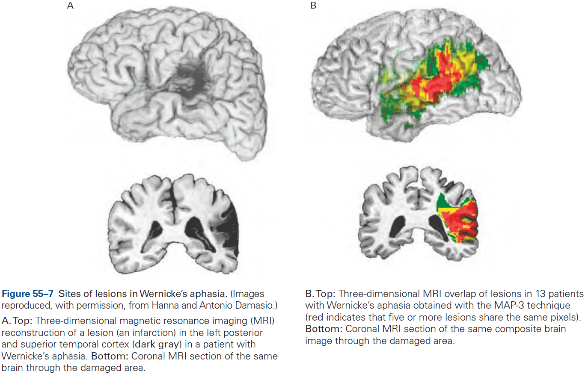
- Conduction aphasia: a disorder where speech production and comprehension are less impaired than in Broca’s and Wernicke’s aphasia, but patients can’t repeat sentences verbatim, can’t assemble phonemes effectively, and can’t easily name pictures and objects.
- Global aphasia results in an almost complete inability to comprehend or produce language from widespread damage to several language centers, combining features from Broca’s, Wernicke’s, and conduction aphasia.
- Aphasias can be caused by damage not only to speech centers of the cortex, but also to pathways that connect those centers to the rest of the brain.
- There are other language-related regions in the cerebral cortex and subcortical structures.
- E.g. Anterior temporal and inferotemporal cortex.

**Highlights**

- Language has many levels, each of which are mastered during childhood. By the age of three, young children have mastered all levels and can carry a conversation with an adult.
- The language learning strategies used by children are surprising. It starts as infants exploit the statistical properties of speech such as frequency distribution patterns and transitional probability, and then proceeds to exploit the social context in which language occurs by following the eye movements of adults as they refer to objects and actions.
- At early ages, natural language requires a social context and social interaction. Neither Skinner’s operant conditioning nor Chomsky’s innate representation fully describe the process of language acquisition.
- Infants’ speech production and speech perception skills are universal at birth as infants can discriminate all sounds used by all languages until the age of 6 months. By 12 months, discrimination for native-language sounds is dramatically increased, whereas discrimination of foreign-language sounds is decreased.
- Production is initially universal as well and becomes language-specific by the end of the first year. By the age of three, infants know 1000 words and mastery of grammar continues until the age of 10.
- A new “dual-stream” model of language has emerged that’s similar to the dual-stream model for vision.
- Hemispheric specialization generally increases with age and language experience, with initial representations in bilateral areas and dominance emerging with language experience. Language is generally lateralized to the left hemisphere.
- The classic aphasias, Broca’s, Wernicke’s, and conduction, are well described by the dual-stream model of language. Broca’s aphasia is the inability to produce speech but can understand it. Wernicke’s aphasia is the inability to understand speech but can produce it. Conduction aphasia is the inability to repeat sentences.

## Chapter 56: Decision-Making and Consciousness

- This chapter tackles one of the most challenging aspects of neuroscience: the transformation of sensory input to motor output through the higher-order cognitive process of decision-making.
- Cognition differs from other behaviors in that it displays two types of flexibility
    - Contingency: a stimulus doesn’t command or initiate an action in the way it does for a reflex.
    - Time: a stimulus might motivate a behavior but it might be delayed or it may never occur.
- Not all decisions involve cognition.
- E.g. Swimming, walking, feeding, grooming.
- Decision: a provisional commitment to a proposition, action, or plan based on evidence (sensory input), prior knowledge (memory), and expected outcomes.
- The concept of a plan emphasizes freedom from immediacy, and not all plans come to fruition.
- Not all thought leads to action, but it’s useful to think of thought as a type of plan of action.
- The simplest decision an organism can make is whether a stimulus is present or not, a yes or no.
- E.g. The visual system is capable of detecting the dimmest unit of light, a single photon, making it as efficient as physically possible.
- Review of Weber-Fechner law of how small a difference we can detect in intensity between two sensory stimuli.

- The brain doesn’t directly perceive a stimulus, but receives a neural representation of the sample.
- The important point is that the criterion, the decision threshold, represents a decision rule that incorporates knowledge about the problem and the attitude about the positive value associated with making correct choices and the negative value of making errors.
- Receiver operating characteristics (ROC): a curve showing how changing the criterion/threshold affects the accuracy of the decision.
- The ROC tells us something about the reliability of the measurement (the separation between the two distributions) regardless of how the decision-maker uses it.
- An important insight about noise is that any source of variance in the representation of evidence is effectively noise if it’s responsible for errors.
- A decision made from random stimuli doesn’t mean the organism is guessing, just that for that specific trial, there was a bias towards one decision. But overall, there is no bias.
- Neurons in sensory areas supply the noisy samples of evidence to decision-making.
- This was confirmed in studies that electrically stimulated such neurons, which biased the monkey’s decisions.

- However, the stimulated neurons didn’t necessarily need to affect the decision directly, they only need to participate in a neural circuit that lies in a causal chain of the decision.
- Also, many more neurons in MT weren’t affected by the electrical stimulation but did respond to the same random dot patch in the same direction-selective manner. These neurons are in other columns with receptive fields that aren’t centered on the stimulus but overlap it.
- Microstimulation only changes the total signal that the brain uses to make its decision by a small amount, which is why it only has an effect on difficult decisions.
- Accumulation of evidence to a threshold explains the speed versus accuracy trade-off.
- E.g. A decision based on little evidence is fast but inaccurate, while a decision based on a lot of evidence is slow but accurate.
- Neurons in the parietal and prefrontal association cortex represent a decision variable.
- Neurons that represent the evolving decision increase their firing rate gradually as evidence increases for one of the choices, and decrease gradually when the evidence favors the other option.
- It isn’t yet known where in the brain the threshold operation is applied.
- The mechanism used for perceptual decision-making is also at play in more complicated decisions that involve reasoning from more abstract sources of evidence.
- Decisions about preference seem to arise from the same strategy that controls perceptual decisions.
- Persistent neural activity isn’t seen in sensory areas of the brain unless the stimulus is unchanging and the neurons don’t adapt.
- Naturally, sensory neurons must change their response when the environment changes or the observer moves in the environment, whereas knowledge states persist through sensory changes and without a continuous stream of input.
- Persistent activity is apparent in areas of the brain that associate sources of information with circuits that organize behavior.
- E.g. The prefrontal cortex has persistent activity representing plans of action, abstract rules, and strategies.
- Although the flow of information from sensory organs through the primary sensory areas is essential for perception, knowledge resulting from activity in higher brain regions has temporal flexibility and persistence not seen in lower brain regions. The temporal thickness of the present.
- Review of the levels of consciousness, conscious awareness (subjective experience), and theory of mind.
- The conscious awareness of an item might arise when the nonconscious brain reaches a decision to report the item to another mind.
- Brain activity itself isn’t conscious, just as the brain activity supporting a possible hand posture isn’t the hand posture itself.
- In this sense, the mechanism of consciousness is only different from other affordances because it involves reporting instead of reaching, eating, drinking, etc.

**Highlights**

- A decision is a commitment to a proposition, action, or plan based on evidence, prior knowledge, and expected outcomes. The commitment doesn’t mean immediate action or any behavior since it can be delayed, and it may be modified.
- Decision-making models contingent behavior and mental operations that are free from the immediate demands of sensory processing and control of muscles.
- A decision is formed by applying a rule to evidence regarding the options. The most basic decision rule is to choose between two choices using a criterion. If the evidence exceeds the criterion, then pick the choice supported by evidence, if not, pick the other choice.
- The accuracy of many decisions is limited by signal strength and noise. For neural systems, this noise is attributed to the variable discharge of single neurons, so the firing rate of small populations of neurons represent the evidence.
- Neurons in the prefrontal and parietal cortex represent the evolving decision variables. These neurons are also involved in planning, attention, and working memory.
- The speed-accuracy trade-off is controlled by setting a bound or threshold on the amount of evidence required to terminate a decision. More evidence requires more time but results in higher accuracy.
- Some decisions are based on the value to the organism, which depends on stored associations between items and their value.
- Decision-making invites us to consider knowledge not as an emergent property of neural representations, but as the result of directed, mostly nonconscious, interrogation of evidence bearing on propositions, plans, and affordances.
- Viewed through the lens of decision-making, conscious awareness of an item might arise when the nonconscious brain reaches a decision to report to another mind.

# Part IX: Diseases of the Nervous System

- What, exactly, is the nature of the relationship between the mind and the brain?
- The more we learn, the more it becomes apparent that nervous system diseases exert very broad effects that blur the boundaries between their classifications.
- It’s surprising that so many different disease conditions seem to converge on one physiological point: synaptic function.

## Chapter 57: Diseases of the Peripheral Nerve and Motor Unit

- The challenge of deciding when and how to move is a large driving force behind the evolution of the nervous system.
- In this chapter, we explore a variety of neurological disorders in mammals that affect movement by changing either AP conduction in motor nerves, synaptic transmission from nerve to muscle, or muscle contraction itself.
- Motor unit: a motor neuron and the group of muscle fibers it innervates.
- The number of innervated muscle fibers varies widely throughout the body, which results in differential dexterity of the limbs.
- E.g. Eye motor units innervate fewer than 100 muscle fibers, whereas leg motor units innervate up to 1,000 muscle fibers.
- Motor units are recruited in a fixed order for both voluntary and reflex movements, with the smallest motor units being the first recruited, followed by larger units as muscle force increases.
- The motor unit is a common target of disease with different functional components being affected.
- Disorders of the peripheral nerve, neuromuscular junction, and muscle can be distinguished clinically.
- When a peripheral nerve is cut, the muscles innervated by that nerve immediately become paralyzed and degenerates, while sensation and reflexes are also lost in that area.
- Atrophy: lack of nourishment resulting in muscle death.

- The primary symptom of neuromuscular junction disorders is weakness.
- The best known disorder of motor neurons is amyotrophic lateral sclerosis (ALS) or Lou Gehrig disease.
- ALS causes progressive weakness across the entire body over 3-4 years and the typical patient is a male in his 40-50s.
- The cause of most cases (90%) of ALS isn’t known and no effective treatment for this fatal condition is available.
- ALS and its variants are restricted to motor neurons and don’t affect sensory or autonomic neurons.
- These diseases prove the individuality of neurons and the principle of selective vulnerability, the basis of which is not understood.
- Diseases of peripheral nerves may affect either axons or myelin, and because motor and sensory axons are bundled together in the same peripheral nerves, disorders of peripheral nerves usually affect both.
- Neuropathies can be classified as acute or chronic, and demyelinating or axonal.
- It isn’t known why damaged nerves become hyper-excitable as even a light tap to the site of injury can evoke a burst of painful sensations in the region.
- When myelin is disrupted by disease, the APs in different axons of a nerve begin to conduct at slightly different speeds and as a result, the nerve loses its normal synchrony of conduction in response to a stimulus.
- This slowing and loss of synchrony are thought to account for some of the early clinical signs of demyelinating neuropathy.
- Skimming over the myasthenia parts which have to do with problems of the ACh neuromuscular junction.
- Skimming over muscle dystrophy.

**Highlights**

- Distinct disorders come from issues in different components of the motor unit. These disorders usually spare eye movements and the eyelids.
    - E.g. ALS is caused by loss of motor neurons, while peripheral nerve disorders affect both motor and sensory neurons.
- Pure motor weakness is also caused by disorders of the neuromuscular junction, which maybe begin early in life (congenital) or in childhood or adulthood.
- Many forms of weakness are caused by mutations in genes that are important in skeletal muscle.
- Inherited diseases of skeletal muscle with transient/temporary episodes of weakness or involuntary after-contractions lasting seconds are caused by missense mutations in voltage-gated ion channels.
- During an episode of weakness, muscle fibers are depolarized and refractory from conducting APs. This intermittent failure to maintain the resting potential may come from mutations in sodium or potassium ion channels.

## Chapter 58: Seizures and Epilepsy

- “We learn about the brain ‘stroke by stroke.’” - C. Miller Fisher
- Seizures and epilepsy, disorders of neural hyperactivity, are also important in our study of the brain.
- Seizures: temporary disruptions of brain function from abnormal, excessive neuronal activity.
- Epilepsy: a chronic condition of repeated seizures.
- Seizures and epilepsy are common with about 1-3% of all individuals living to the age of 80 will be diagnosed with epilepsy. The highest incidence occurs in young children and the elderly.
- Seizures represent the typical neurological disease in that the symptoms include both positive and negative sensory or motor manifestations.
- E.g. Positive signs include the perception of flashing lights or the jerking of an arm. Negative signs include impairments of normal brain function such as consciousness or awareness.
- Seizures manifest, in part, from synchronous activity triggered in surrounding tissue with normal cellular and network properties.
- Seizures are temporary disruptions of brain function.
- Partial/focal seizures: seizures that occur only to a local/small part of the brain and symptoms depend on the location of the focus.
- Focal onset seizures can occur either without alteration of consciousness (simple partial) or with alteration (complex partial).
- Focal onset seizures can be preceded by telltale symptoms such as auras.
- E.g. Unprovoked and vivid sensations such as sense of fear, a rising feeling in the abdomen, or a specific odor.
- The aura is a product of electrical activity in the seizure focus and thus represents the earliest seizure manifestation.
- Generalized onset seizures begin without an aura or focal onset and involve both hemispheres. This type of seizure is further divided into motor (convulsive) and nonmotor types.
- The generic nonmotor generalized onset seizure is the typical absence seizure where individuals stare and stop all motor activity, losing awareness but not posture.
- Review of EEG, which represents the collective activity of cortical neurons.
    - Field potential spikes reflect APs in many neurons and shouldn’t be confused with spikes in recordings of single neurons.
    - The amplitude of EEG signals (microvolts) is much smaller than the voltage changes in single neurons (millivolts) due to attenuation by the skull and layers of tissue.
    - Not all cells contribute equally to EEG as surface cortical neurons are closer to the EEG electrodes and thus influence it more.
- EEG shows patterns of electrical activity that correlate with various stages of sleep, wakefulness, and seizure.
- The normal response of a cortical pyramidal neuron to excitatory input consists of an EPSP followed by an IPSP.
- Thus, it isn’t surprising that convulsants act by either enhancing excitation or by blocking inhibition and anticonvulsants do the reverse.
- The breakdown of surround inhibition leads to synchronization and thus focal seizure, as abnormal activity is normally confined to the seizure focus by inhibition of the surrounding tissue.

- An important factor in the spread of focal onset seizure appears to be the intense firing of pyramidal neurons that results in a relative decrease in synaptic transmission from inhibitory GABAergic interneurons.

- Despite our understanding of such mechanisms, we still don’t know what causes a seizure to occur at any particular moment.
- E.g. For some people, seizures are caused by sleep deprivation, stress, or flashing lights.
- The spread of seizure activity involves normal cortical circuitry such as thalamocortical pathways, subcortical pathways, and the corpus callosum.
- Once both hemispheres are involved, the patient generally loses consciousness.
- An interesting unanswered question is what terminates a seizure.
    - One certain answer is that termination isn’t due to cellular metabolic exhaustion because severe clinical seizures can continue for hours.
    - Seizures are often followed by a period of decreased electrical activity which may follow symptoms of confusion, drowsiness, or even focal neurological deficits.
- Generalized onset seizures are driven by thalamocortical circuits and the EEG activity is similar to sleep EEG activity.
- During a seizure, thalamic and cortical cells become synchronized through the same reciprocal thalamocortical connections that contribute to normal sleep spindles during slow-wave sleep.

- The circuitry of the thalamus seems ideally suited to generating generalized onset seizures.
- Prolonged seizures can cause brain damage and repeated convulsive seizures are a medical emergency.
- Release of excitatory transmitter glutamate during excessive stimulation, such as a seizure, can itself cause neuronal damage, a condition called excitotoxicity.
- We don’t fully understand the factors leading to the development of epilepsy, but we suspect it has to be due, in part, to genetics, ion channels mutations (channelopathies), and altered cortical development, and injury.
- Unfortunately, the vast majority of cases of epilepsy can’t yet be explained by even the recent surge in identifying epilepsy genes.

**Highlights**

- Seizures are one of the most extreme examples of collective electrical behavior of the mammalian brain.
- Focal onset seizures result from synchronization of activity of neurons in the seizure focus and the subsequent spread throughout the cortex. The gradual loss of GABAergic surround inhibition is critical to the early steps of seizure progression.
- In contrast, generalized onset seizures are thought to arise from activity in thalamocortical circuits, perhaps combined with a general abnormality in the membrane excitability of all cortical neurons.
- EEG provides a window into the electrical activity of the cortex and is used to detect certain electrical activity patterns associate with seizures.
- Further studies on the progression from an acute seizure to the development of epilepsy should provide alternative strategies for treatment beyond the standard options of anticonvulsants or epilepsy surgery.

## Chapter 59: Disorders of Conscious and Unconscious Mental Processes

- Agnosia: loss of knowledge.
- E.g. A person with visual agnosia can see perfectly well but can’t recognize or make sense of what he sees such as in prosopagnosia (inability to recognize faces).
- Hallucination: false perceptions.
- Delusion: false beliefs.
- Most neuroscientists believe that we’re not conscious of cognitive processes, only our perceptions.
- The effects of unconscious processes on behavior can be demonstrated most strikingly in certain patients with “blind sight”, a disorder where patients with primary visual cortex lesions claim to see nothing but are able to detect simple visual properties such as movement or color far better than chance.
- Despite having no perception of objects in the blind parts of the visual field, these patients do possess unconscious information about the objects, and this information is available to guide their behavior.
- Another example is unilateral neglect caused by right parietal lobe lesions.
- Blind sight and unilateral neglect are just two examples of the abundant empirical evidence for the existence of unconscious cognitive processes, evidence not available to us through introspection.
- Differences between conscious and unconscious processes in perception can be seen in exaggerated form after brain damage.
- Perception can change without any change to sensory stimulation, and sensory stimulation can change without any change in perception.
- E.g. Necker cube and change blindness.
- Change blindness is evident in the experiment where participants are shown an airplane with and without an engine. If the two pictures are shown in alternation but critically interspersed with a blank screen, it can take minutes to notice the difference even though it’s immediately obvious when pointed out.
- We can explore the neural activity associate with each state, changes in perception with static stimuli and changes in stimuli with static perception, to associate neural activity with conscious and unconscious processes.
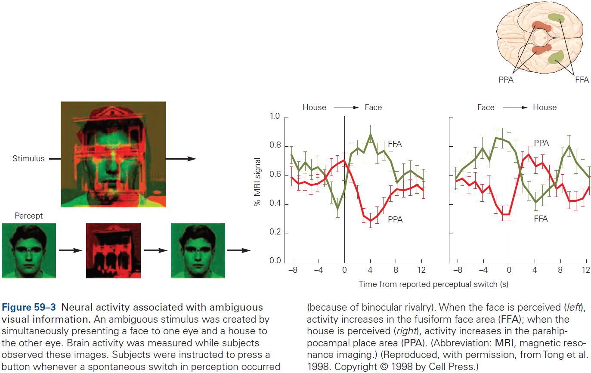
- Two important findings
    - Certain kinds of percepts are related to neural activity in certain areas of the brain.
        - E.g. Faces, words, landscapes result in more activity in certain regions.
        - This observation also applies to hallucinations as the content of the hallucination is related to the specific area of activity.
        - These observations suggest that conscious experience may result from activity in certain cortical regions.
        - E.g. Frontal and parietal cortex.

    - Activity in a specialized area is necessary but not sufficient to yield conscious experience.
        - E.g. In unilateral neglect, objects still elicit neural activity in the visual cortex, but it may be that damage to the right parietal cortex simply prevents the formation of conscious representations of objects on the left side of space.
        - Stimuli that don’t enter awareness can also elicit overt responses.
        - E.g. An unperceived fearful face elicits a fear response in the autonomic nervous system as measured by an increase in skin conductance.
- Review of patient D.F. who couldn’t tell the orientation of a slot but could put cards into it.
- This sort of unconscious guidance isn’t unique to patients with brain damage as it’s simply revealed more starkly in the case of D.F. We all use unconscious guidance.
- E.g. We call make rapid and accurate movements without being aware of the perceptual and motor information that is being used to control these movements.
- Experiments suggest that as long as the goal is realized, we experience the expected sensory feedback, not the actual sensory feedback.

- Procedural memory, in which consciousness has a minor role, remains intact after damage to the medial temporal lobe.
- Thus, patients can still remember and learn new motor skills.
- E.g. Riding a bike.
- Reporting one’s confidence requires metacognition, the ability to reflect on our cognitive processes.
- E.g. If we find ourselves making many errors, we might slow down and pay more attention to what we’re doing.
- Metacognitive accuracy isn’t related to signal detection ability.
- E.g. You could be good at detecting signals while at the same time be poor at knowing whether your answers are right or wrong.
- Imagining a face or place correlates with activity in specific areas of the brain.

**Highlights**

- We can’t say that mental disorders only have mental causes, whereas physical disorders have physical causes.
- It’s now clear that perception, action, and memory are the result of many parallel processes and that while some of these processes support conscious experience, the majority are unconscious.
- Striking abnormalities occur when some of these processes are damaged while others remain intact.
- We have very little awareness of the details of our actions, but we’re vividly aware of being in control. In extreme cases, this sense of agency can become detached from the control of action as seem in patients with phantom limb syndrome.
- Recollection of the past isn’t like replaying a memory but reliving it. Memory is a creative process based on imperfect recall filled out with general knowledge.
- Damage to the frontal cortex can impair metacognition while leaving decision-making intact, dissociating the process of analyzing ourselves with analyzing the world.
- Verbal reports aren’t always reliable and are difficult to verify.

## Chapter 60: Disorders of Thought and Volition in Schizophrenia

- Review of schizophrenia and it’s symptoms.
- Schizophrenia has a characteristic course of illness with onset during the second and third decades of life.
- The risk of schizophrenia is highly influenced by genes.

- Schizophrenia is characterized by abnormalities in brain structure and function.
- E.g. Loss of gray matter in prefrontal, temporal, and parietal regions of cerebral cortex with counterbalancing increases in the size of the cerebral ventricles.
- There’s growing recognition that schizophrenia is characterized by disruptions in connectivity between brain regions.
- Loss of gray matter in the prefrontal and temporal cortex appears to come from loss of dendritic processes rather than loss of cells.
- As a result, the packing density of cells in the cerebral cortex increases, enlarging the ventricular spaces.
- Abnormalities in brain development during adolescence may be responsible for schizophrenia.
- The illness exhibits a stereotypic onset between late adolescence and early adulthood, with cognitive decline and negative symptoms occurring months or years before the start of psychosis.
- This timing suggests that schizophrenia might involve abnormalities in the late stages of brain development during adolescence.
- Synaptogenesis and pruning continue throughout life, making learning possible. However, on top of these events are significant waves of synaptic pruning that are spatially specific and developmentally timed.
- The last such wave in human brain maturation occurs during adolescence and early adulthood, with pruning in the temporal and prefrontal association cortex, followed by myelination of many axons in these areas of cortex.
- One hypothesis is that schizophrenia might result from abnormal and excessive synaptic pruning during adolescence.

**Highlights**

- Schizophrenia is a chronic disabling disorder characterized by dramatic psychotic symptoms as well as deficits in emotion, motivation, and cognition.
- Risk for schizophrenia is an inherited, polygenic trait.
- Antipsychotic drugs are effective in reducing hallucinations, delusions, and thought disorders but don’t reduce the cognitive and deficit symptoms of schizophrenia.
- Cognitive impairments reduce the ability of people with schizophrenia to regulate their behavior to align with their goals. This results in schizophrenics that are unable to succeed in school or hold down jobs.
- Postmortem and neuroimaging studies find loss of gray matter in the prefrontal and temporal cerebral cortex in a pattern that’s consistent with cognitive impairments, such as deficits in working memory.
- Gray matter loss results from decreased dendritic arborization and decreased dendritic spines, which implies reduced synaptic connections.
- One hypothesis is that the typical age of onset for schizophrenia in adolescence is triggered by excessive and inappropriate synaptic pruning in the prefrontal and temporal cerebral cortices during adolescence and young adulthood.

## Chapter 61: Disorders of Mood and Anxiety

- Review of depression, bipolar disorder, and anxiety disorder.
- There are no objective medical tests for mood and anxiety disorders, thus, diagnosis depends on observation of symptoms, behavior, cognition, functional impairments, and natural history.
- Two classes of mood disorders
    - Unipolar depression
    - Bipolar disorder: mood swings between depression and mania.
- Major depressive disorder differs significantly from normal sadness and is characterized by negative mood states such as sadness, anxiety, loss of interests, or irritability lasting for most of the day, and is unrelieved by events that were previously enjoyable.

- When depression is severe, individuals may suffer intense mental anguish and anhedonia.
- Anhedonia: a pervasive inability to experience pleasure.
- In the most severe cases of depression, psychotic symptoms may occur including delusions and hallucinations.
- Major depressive disorder often begins early in life and in childhood, occurs equally in males and females. After puberty, it occurs more commonly in females with the ratio being about 2:1 across countries and cultures.
- In bipolar disorder, mania is typically associated with recurrent episodes of depression, whereas mania without depression is distinctly uncommon.
- During manic episodes, individuals have markedly increased energy, a decreased need for sleep, and occasionally a decreased desire for food.
- The depressive episodes in bipolar disorder are symptomatically indistinguishable from those in unipolar depression, but are often more difficult to treat.
- The most common affective state of bipolar patients between severe acute episodes of mania or depression isn’t a healthy mood, but a state of chronic depression.
- The rate of cycling between mania, depression, and normal mood varies widely among bipolar patients.
- Anxiety disorders represent significant dysregulation of fear circuitry.
- Fear is a reaction to threats that are present and clearly signify dangers, whereas anxiety is a proactive state of readiness for threats that are less specific.
- The neural circuits for fear and anxiety strongly overlap as well as their physiological, behavioral, cognitive, and affective aspects.
- In contrast to fear, which is initiated and terminated by the presence or termination of clear stimuli, anxiety has a more variable time course and may be prolonged if the potential for danger or harm is long-lasting or if there’s no clear safety signal.
- Types of anxiety disorders
    - Panic disorder
    - Post-traumatic stress disorder
    - Generalized anxiety disorder
    - Social anxiety disorder
    - Simple phobias
- Current evidence doesn’t support dividing anxiety symptoms into discrete non-overlapping categories.
- Rather, evidence suggests that pathological anxiety symptoms and symptoms of depression might be better conceptualized as a continuum or spectrum in which individuals experience varying symptoms that cross current boundaries.
- Both genetic and environmental risk factors contribute to mood and anxiety disorders.
- Bipolar disorder, major depression, and anxiety disorders all run in families.
- There is no “depression gene” or “anxiety gene”.
- The risk for any person results from genetic loading acting together with developmental and environmental factors.
- Both major depression and chronic stress are associated with persistent activation of the hypothalamic-pituitary-adrenal axis.
- Both conditions share overlapping neural mechanisms and depression is itself stressful because of the suffering it causes.
- The best-established structural abnormality in mood disorders is decreased hippocampal volume in individuals with major depression and bipolar disorder compared with healthy subjects.
- Excessive secretion of glucocorticoid stress hormones, as during depression, could cause hippocampal volume loss by inhibiting neurogenesis over time.
- Interestingly, antidepressants exert an opposite effect, increasing the rate of neurogenesis.
- Inhibition of neurogenesis might contribute to anxiety symptoms that often accompany major depression, and abnormally low hippocampal volumes might increase the risk for PTSD.
- Major depressive disorder can be treated effectively with antidepressant drugs, cognitive psychotherapy, and electroconvulsive therapy.
- Along with the overlap and sharing of risk factors and neural circuits, the overlap in effective treatment modalities is further evidence that mood and anxiety disorders are related.
- All widely used antidepressant drugs increase activity in monoaminergic systems in the brain, mostly serotonin and norepinephrine with modest effects on dopamine.
- Monoamines in the cytoplasm outside of vesicles are metabolized by the enzyme monoamine oxidase (MAO).
- MAO inhibitors are affective against both depression and anxiety disorders but are rarely used today because of their side effects.
- MAO inhibitors break down norepinephrine, serotonin, and dopamine in presynaptic terminals, thus making extra neurotransmitter available for packaging into vesicles.
- The tricyclic antidepressants block the norepinephrine transporter (NET), the serotonin reuptake transporter (SERT), or both.
- The selective serotonin reuptake inhibitors (SSRIs) aren’t more effective than the older tricyclic or MAO antidepressants but are widely used because they have milder side effects and are far safer if taken in overdose.
- Although antidepressant drugs bind to and inhibit MAO, NET, or SERT with their first dose, several weeks of treatment are typically required to observe a lifting of depressive symptoms.
- Several hypotheses have been put forward to explain this delay.
    - Maybe a slow buildup of newly synthesized proteins changes the responsiveness of neurons in a way that treats depression.
    - Maybe increases in the levels of synaptic transmission of serotonin or norepinephrine rapidly increase plasticity in different emotion-processing circuits and that the lag in seeing benefits reflects the time it takes for new experiences to change synaptic weights.
    - Maybe the benefits are mediated, in part, by enhancement of hippocampal neurogenesis.
- Bipolar disorder can be treated with lithium and several anticonvulsant drugs.

**Highlights**

- Two types of mood disorders
    - Unipolar: depression.
    - Bipolar: depression and mania.
- Major depressive disorder differs from normal sadness by its persistence, pervasiveness, and association with physiological, cognitive, and behavioral symptoms.
- Anxiety disorders are the most common psychiatric disorders and they range in severity from highly disabling cases of panic disorder to simple phobias.
- Mood and anxiety disorder have both genetic and nongenetic components of risk. Bipolar disorder is more heritable than major depression or anxiety disorders. Childhood adversity and the environment play a significant role in risk of developing major depression and anxiety disorders.
- The neural circuitry of fear and anxiety disorders involve the amygdala and its interconnections with the prefrontal cortex. The neural circuitry of major depression and bipolar disorder is less well understood.
- Bipolar disorder can be treated with lithium, some anticonvulsant drugs, and second-generation antipsychotic drugs.
- Major depression and anxiety disorders can be treated with diverse antidepressant drugs, cognitive and behavioral therapies, and electroconvulsive therapy.

## Chapter 62: Disorders Affecting Social Cognition: Autism Spectrum Disorder

- Intellectual disability: an IQ below 70 with marked deficits in adaptive functioning.
- Autism spectrum disorder (ASD): a spectrum disorder with two defining and highly variable diagnostic features
    - Impaired social communication
    - Stereotyped behaviors with highly restricted interests
- This chapter focuses on neurodevelopmental disorders such as abnormalities in social functioning, ASD, fragile X syndrome, Williams syndrome, Rett syndrome, and Angelman and Prader-Willi syndromes.
- ASD is a focus because of its high prevalence (1.5% of the population), overlap in genetic risks with other common neuropsychiatric conditions, and the absence of a defining neuropathology.
- ASD occurs mostly in males with a ratio of at least 2:1 to 3:1 male excess and occurs in all countries and cultures and in every socioeconomic group.
- By definition, ASD must be detectable before the age of three.
- No definitive biological markers of ASD have been identified, thus, diagnosis is based on behavioral criteria.
- This doesn’t mean that there aren’t strong biological correlates such as specific gene mutations and neuroimaging findings, but none of these are sufficiently specific or predictive to be useful as an alternative to the gold standard of clinical assessment.

- Autism typically endures throughout life and isn’t progressive with about 10% of affected children showing improvement.
- Mind blindness hypothesis: social communication is impaired in autism spectrum disorder.
- Review of theory of mind (mentalizing) and Sally-Anne test.
- Four components of mentalizing
    - Medial prefrontal cortex: monitoring one’s own thoughts.
    - Temporoparietal region of the superior temporal lobe: eye gaze and biological motion.
    - Amygdala: evaluation of social and nonsocial information.
    - Inferior temporal region: perception of faces.
- People with autism show a lack of behavioral flexibility but some have special talents resulting in savant syndrome.
- Fragile X syndrome: symptoms include poor eye contact, social anxiety, and repetitive behaviors.
- Rett syndrome: a devastating and progressive disorder that primarily affects girls where they regress during 6-18 months of age, losing speech and hand skills that they had acquired.
- Williams syndrome: characterized by mild to moderate intellectual disability, connective tissue abnormalities, cardiovascular defects, distinctive face structure, and a behavioral phenotype characterized by increase sociability, preserved language abilities, affinity for music, and impaired visuospatial capabilities.
- Angelman syndrome: characterized by severe intellectual disability, epilepsy, absence of speech, hyperactivity, and inappropriate laughter.
- Prader-Willi syndrome: characterized by infantile hypotonia, mild to moderate intellectual disability, obesity, highly perseverative behavior, social disability, and diminished or absent satiety
- Skipping the genetic details of ASD and de novo mutations.
- About 30% of individuals with autism also have seizure disorders.
- One of the earliest and most consistent anatomical findings in ASD has been the lower number of Purkinje cells in the cerebellum of some people.
- It seems likely that without a detailed cellular understanding of the brain of humans, primates, and other models system, it will be challenging to interpret how genetic perturbations affect behavior.

**Highlights**

- Neurodevelopmental syndromes involve degrees of impairment in different cognitive domains. This chapter focused on the social domain.
- Autism is considered a spectrum of disorders with two defining diagnostic features
    - Impaired social communication
    - Stereotyped behaviors and/or highly restricted interests
- The prevalence of autism spectrum disorder (ASD) is estimated to be at least 1.5% in developed countries and is more frequent in males.
- Both environmental factors and genes contribute to ASD risk.
- Neurodevelopment syndromes related to ASD include fragile X, Rett, Williams, Prader-Willi, and Angelman.
- Progress in the genetics of common forms of ASD has emerged from a focus on rare and sporadic (de novo) mutations in the coding portion of the genome. On average, these mutations have a much larger effect than those that have been identified in studies of other psychiatric disorders.
- The key challenge going forward will be to move from a general understanding of biology to an actionable understanding of pathophysiology.

## Chapter 63: Genetic Mechanisms in Neurodegenerative Diseases of the Nervous System

- The major degenerative diseases of the nervous system are
    - Alzheimer
    - Parkinson
    - Huntington
    - Spinocerebellar ataxia
- Most of these disorders occur in mid-life or later.
- The first symptom is often the loss of fine motor control and the end results are the same: a period of slow deterioration, usually 10 to 20 years, that robs patients of their abilities and, eventually, their life.
- Two categories of late-onset neurodegenerative diseases
    - Inherited
        - E.g. Huntington and spinocerebellar ataxia.
    - Sporadic
        - E.g. Alzheimer and Parkinson.
- Huntington disease involves degeneration of the striatum.
- Symptoms of Huntington disease
    - Loss of motor control
    - Cognitive impairment
    - Affective disturbance
- Cases of juvenile Huntington disease are more severe and the pathology progresses more rapidly and broadly.
- Huntington is caused by expansion of a translated CAG repeat that encodes a glutamine tract in the huntingtin protein.
- Normally we have 6 to 34 CAG repeats, whereas disease-causing alleles typically have 36 or more repeats. Those carrying more than 75 repeats will develop the disease as juveniles.
- Skipping over spinobulbar muscular atrophy and spinocerebellar ataxia (SCA).
- Symptoms of Parkinson
    - Resting tremor
    - Bradykinesia
    - Rigidity
    - Impairment in ability to initiate and sustain movements
- One perplexing aspect of these neurodegenerative diseases is that the changed gene products are widely and abundantly expressed not only in the nervous system, but also in other tissues, and yet the phenotypes are predominantly neurological.
- The phenotypes usually reflect dysfunction in only specific groups of neurons, a phenomenon called neuronal selectivity.
- E.g. Striatal neurons in Huntington, Purkinje cells in SCA, and dopaminergic neurons in Parkinson.
- Observations suggest that different cell types have different thresholds of vulnerability to toxic proteins with expanded glutamine tracts.
- Skipping over animal models used to study neurodegenerative diseases.
- Loss of neurons is a hallmark of the end stage of all these disorders.
- Two major factors implicated in the death of neurons
    - Altered calcium ion homeostasis
    - Decreased induction of neuronal survival factors
- Dopamine replacement therapy has been the only pharmacological option for Parkinson disease, but it isn’t ideal as patients develop tolerance and require higher and higher doses of the drugs, causing a side effect called levodopa-induced dyskinesia.
- Ideal therapies should target pathologies at the earliest possible stages when intervention could halt the disease or even allow recovery of function.
- Since most neurodegenerative diseases progress over decades, pharmacological interventions that even slightly modulate one or more of the pathways described above could delay disease progression or improve function, which would greatly enhance quality of life.

**Highlights**

- Late-onset neurodegenerative disease such as Alzheimer and Parkinson diseases are expected to rise given the increasing trend in life expectancy.
- Although the gene products driving disease is widely expressed in the brain and body, there’s selective neuronal vulnerability in all adult-onset neurodegenerative disorders.
- A pathogenic mechanism common to adult-onset neurodegenerative diseases is protein misfolding.
- Mutations that cause proteins to adopt an altered conformation gradually induce neuronal dysfunction either because of abnormal protein interactions or because of intracellular protein accumulation and altered activity.
- The discovery that many adult neurodegenerative disorders are reversible in mouse models gives hope that some of the neuronal dysfunction can be rescued if a treatment is implemented early enough in the disease course before cell death occurs.

## Chapter 64: The Aging Brain

- Reduced infant mortality, development of vaccines and antibiotics, better nutrition, improved public health measures, and advances in the treatment and prevention of heart disease and stroke have increased life expectancy.
- Increased longevity has a downside though as age-related cognitive alterations are becoming increasingly prevalent.
- E.g. Dementia and Alzheimer disease.
- As we age, reflexes often become sluggish and sleep patterns change as older people sleep less and wake more frequently.
- Mental functions also decline such as memory and problem-solving abilities.
- Although most people experience a gradual decline in mental agility, for some, the decline is rapid.
- It’s the exception, rather than the rule, that elderly people have completely preserved mental function, suggesting that there may be something special about the life experiences or genes of these people.
- Some cognitive capacities decline significantly with age, while others are largely spared.
- E.g. Working and long-term memory, visuospatial abilities, and verbal fluency usually decline with age, but vocabulary and comprehension show minimal decline.

- Elderly brains show mild shrinkage in volume, a loss of brain weight, and enlargement of the cerebral ventricles.
- These changes could result from neuronal death as some neurons are lost with age.
- However, in most parts of the healthy brain, there’s minimal to no neuronal loss due to age, so brain shrinkage must be due to other factors.
- E.g. Loss of myelin, decreased density of dendritic arbors, decreased neurotransmitter creation, and decline in the number of synapses.

- Changes in white matter are widespread but are especially notable in the prefrontal and temporal cortex.
- It was long thought that aging resulted from progressive deterioration of cells and tissues due to accumulated genetic damage or toxic waste products, but actually aging is under active genetic control.
- To date, the best-validated environmental strategy for extending life span is caloric restriction.
- In most people, age-related cognitive changes don’t seriously compromise quality of life. However, in some elderly people, cognitive decline reaches a level that can be considered as pathological.
- Mild cognitive impairment (MCI): memory loss with or without other cognitive impairments that go beyond what’s seen in normal aging.
- Dementia: a syndrome similar to MCI that involves progressive impairment of memory, language, problem solving, judgment, calculation, or attention.
- The most common form of dementia is Alzheimer’s disease (AD) and the second most common form is cerebrovascular disease.
- Late-onset AD (after age 65) is often more sporadic, implying that there’s no single causative gene compared to early-onset AD that is dominantly inherited AD.
- Both early- and late-onset AD usually present with a selective defect in episodic memory and executive function.
- In AD, the brain is atrophied and is riddled with amyloid plaques and neurofibrillary tangles.
- Tangles don’t occur uniformly throughout the brain but rather affect specific regions.
- E.g. Entorhinal cortex, hippocampus, parts of the neocortex, and the nucleus basalis are especially vulnerable.
- Skipping over the protein and molecular details of the tangles and plaques such as amyloid precursor protein.
- The major risk factor for AD is age as a very small fraction of people younger than age 60 have it.
- While we still don’t have a treatment that delays the onset or slows the progression of AD, there’s hope that we aren’t too far from being able to mitigate symptoms.

**Highlights**

- Subtle changes in a variety of brain functions occur with age such as declines in the speed of processing, memory storage, and changes in sleep. The basis for these changes is likely brain atrophy and loss of white matter integrity.
- In general, there isn’t a significant decrease in neuronal number that accounts for changes in brain function that occur with normal aging.
- The changes in cognition that occur in normal aging aren’t disabling and it’s only when they decline more than expected and mildly affect one’s everyday life is this syndrome called mild cognitive impairment (MCI).
- About 50% of individuals with MCI have Alzheimer’s disease (AD) as the underlying cause of MCI.
- AD is the most common cause of dementia and manifests as loss of memory and impaired cognitive abilities.
- The pathology of AD is characterized by the accumulation of aggregated forms of two proteins in the brain
    - A-Beta peptide, which accumulates into amyloid plaques in the parenchyma and walls of arterioles.
    - Tau, which accumulates into neurofibrillary tangles in cell bodies and dendrites.
- In addition to the accumulation of protein aggregates in the AD brain, there’s marked brain atrophy as well as synaptic and neuronal loss as the disease progresses.
- Two major forms of AD
    - Dominantly inherited AD
    - Late-onset AD
- Late-onset AD accounts for more than 99% of AD cases.
