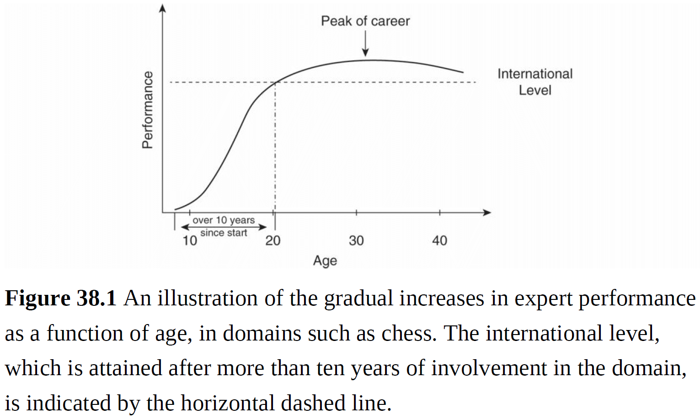
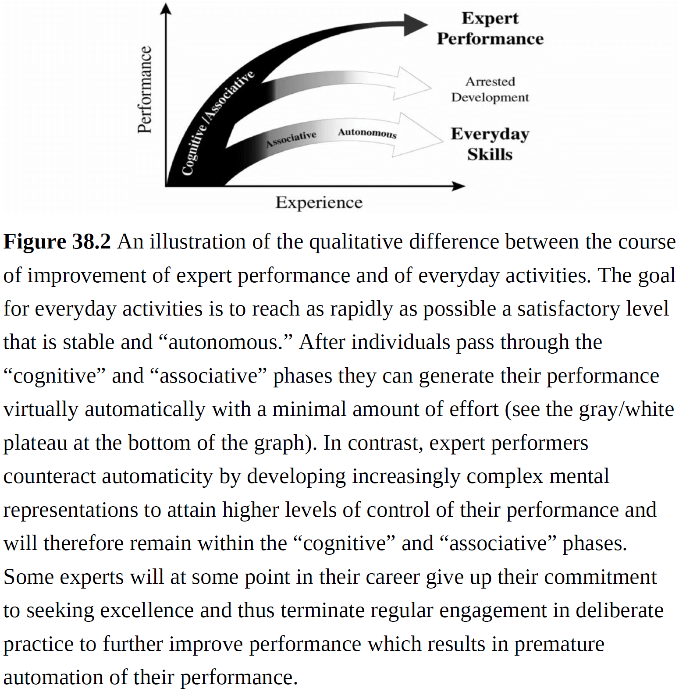
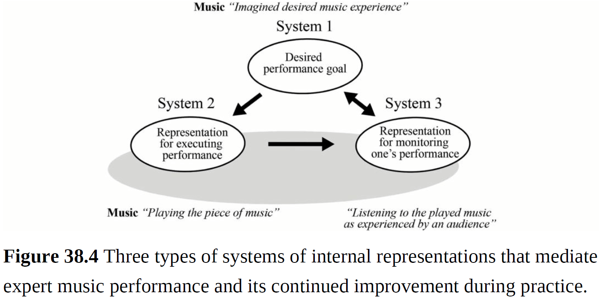

# Part I: Introduction and Perspectives

## Chapter 1: An Introduction to the Second Edition of The Cambridge Handbook of Expertise and Expert Performance: Its Development, Organization, and Content

- Expert: a person with prolonged or intense experience through practice and education in a particular field.
- Expertise: the characteristics, skills, and knowledge that distinguish experts from novices and less experienced people.
- In some domains, there are objective criteria for finding experts.
- E.g. The ELO rating in chess, the number of correct diagnoses for medical specialists, and the performance of professional musicians compared to amateur musicians.
- These types of superior reproducible performance on representative tasks capture the essence of the domain.
- In other domains, it’s difficult to identify experts and to judge performance on domain-related tasks.
- E.g. Experts are no better than novices on core domain tasks such as selecting stocks with superior future value, treatment of psychotherapy patients, and forecasting the weather.
- Experts nowadays can rapidly acquire the knowledge originally discovered and accumulated by preceding experts by enrolling in courses taught by skilled and knowledgeable teachers using textbooks and books.
- When studying expertise, it isn’t immediately apparent what’s generalizable across diverse domains of expertise.
- E.g. Are there general skills that translate across music, sports, medicine, and chess.
- The study of expertise presumes that there are enough similarities in the principles mediating expertise for a general theory of expertise and expert performance.
- Questions raised by the study of expertise
    - Can we improve the efficiency of learning to reach higher levels of expert performance in any domain?
    - Why do people improve their performance at different rates and why do people reach very different levels of final achievement?
    - Can we select individuals with unusual potential and design better environments for them?
    - Is it possible to create expertise?
- Expertise as individual differences in mental capacities.
    - One theory of expertise argues that general innate mental capacities mediate the attainment of exceptional performance in most domains.
    - E.g. Since height and body size are inherited, then every physical trait is heritable such as size of head and brain, weight of gray matter, number of neurons, etc.
    - However, evidence from the 20th century on large groups of experts and controls found no evidence supporting this theory.
    - Instead, experts showed superiority in specific aspects related to their particular domain of expertise.
    - E.g. Chess experts had superior memory constrained to regular chess positions that didn’t generalize to irregular positions.
    - Interesting findings
        - Measures of basic mental capacities aren’t valid predictors of attainment of expert performance in a domain.
        - The superior performance of experts is often very domain specific and there’s limited transfer outside of their narrow area.
        - Differences between experts and amateurs almost always reflect attributes acquired by experts during their lengthy training.
- Expertise as the extrapolation of everyday skill to extended experience.
    - This theory argues that the same learning mechanisms responsible for acquiring everyday skills can be extended to the acquisition of higher levels of skills and expertise.
    - The fundamental assumption is that the same patterns/chunks that allow experts to retrieve superior actions from memory are the same patterns that mediate experts’ superior memory for their domain.
    - E.g. Grandmaster chess players could almost reproduce entire chessboards (24-26 pieces) by recalling a small number of complex chunks, whereas novices could only recall four pieces.
    - However, the masters’ superior memory dropped to 5-7 pieces for random chess configurations, which was only slightly better than novices.
- Expertise as qualitatively different representations and organization of knowledge.
    - Some researchers argue that the highest levels of expertise are characterized by context-based intuitive actions that are difficult or impossible to verbally report.
    - Evidence suggests that experts have to actively retain and refine their mental representations for monitoring and controlling their performance.
- Expertise as elite achievement resulting from superior learning environments.
- Expertise as reliably superior performance on representative tasks.
    - Once it’s possible to reproduce the reliably superior performance of experts in a controlled setting, then it’s possible to examine the specific mediating mechanisms with experiments and process-tracing.
    - This new focus on measurement with standardized tasks revealed that experts aren’t always able to reliably show superior performance.
    - E.g. Most individuals learn a new skill for a limited time until they reach an acceptable level, beyond which further improvements are unpredictable and experience doesn’t help.
    - Thus, continued improvements in achievements aren’t automatic consequences of more experience.
- If someone is interested in the upper limits of human performance and the most effective training to achieve the highest attainable levels, they should study the training techniques and performance limits of experts who have spent their entire life striving to maximize their performance in a specific domain.

## Chapter 2: A Sociological/Philosophical Perspective on Expertise: The Acquisition of Expertise through Socialization

- Sociology distinguishes expertise as a “performance” and expertise as a “property”.
- Expertise: a status that individuals and organizations struggle to achieve and must work to attain and retain.
- Expertise can also be thought of as a property of social groups that’s acquired by individuals through their participation in those groups.
- Four areas of expertise
    - Apprenticeship, training, and socialization
        - The methods for initiating novices into a domain of skilled practice.
        - The boundaries that define the group.
    - Authentication and evaluation
        - How the distinction between expert and non-expert is enacted and legitimized in social settings.
        - E.g. The verbal cues, non-verbal cues, and behaviors that experts use to project authority and claim to expert status.
        - However, this makes no claim on whether or not a person’s expertise is justified by an independent criteria.
        - Instead we focus on the methods social actors use to construct and contest expert status.
    - Institutions and authorization
        - How expert knowledge is stabilized in formal institutions and everyday practices.
        - E.g. Schools and culture.
    - Naturalization
        - Highlights the cultural and political assumptions embedded within dominant forms of expertise.
- The network or relational model of expertise aims to document how different social groups mobilize cultural and epistemic resources to challenge established ways of defining problems.
- No notes on epistemic injustice (the refusal to acknowledge a community of knowers).
- How can a third party claim to know that one person is an expert while another person isn’t?
- There are different levels of expertise within a domain of practice.
- The idea of explicit and implicit rules in a domain is crucial to the sociological understanding of expertise.
- This makes the apprenticeship model of learning necessary because only socialization can enable the individual to learn the collective understandings of the domain.
- No notes on the (poor) periodic table of expertise.

## Chapter 3: Reframing Expertise and its Development: A Lifeworld Perspective

- Three aspects of expertise
    - Experts
    - Their knowledge
    - Domains of expertise
- The assumption that these aspects are separate is questionable since they’re interconnected.
- E.g. Expert knowledge about teaching only makes sense in the context of learners being taught by teachers.
- Lifeworld: the entwinement of people with their world.
- No notes on lifeworld.
- This chapter argues that expertise and its development aren’t primarily dependent on knowledge and skills in cognitive structure, but on embodied being in the world entwined with others and things.

## Chapter 4: The Evolution of Expertise

- Expertise can be divided into functional and non-functional domains.
- E.g. Hunting and gathering are functional while chess and sports are non-functional.
- Expertise wasn’t likely necessary for survival and reproduction as our ancestors only needed to be good-enough and didn’t need the same degree of expertise that’s often developed in modern contexts where thousands of hours are devoted to single obscure tasks.
- Why develop expertise at all? And why in seemingly arbitrary modern domains?
- We propose that expertise emerges from three factors
    - Plasticity of evolved cognitive abilities.
    - Increased social competition.
    - Motivation to signal desirable traits in areas that are culturally valued and tied to social prestige.
- The combination of novel domains, social competition, and social signaling creates an arms race driving the development of expertise in non-functional domains.
- Ecological dominance and social competition theory: our ancestors achieved a significant ability to control ecological selection pressures such as pathogens, climate, and prey.
- The reduction of ecological pressures allowed us to change our goal from starvation, disease, and reproduction to social pressures such as the ability to learn, social skills, and status.
- At some point, our ancestors became their own selective forces by competing against each other for resource control and social influence.
- The resulting within-species arms race may have led to the unprecedented increase in hominid brain size and the cognitive and social competencies that differentiate us from other species.
- Perhaps behavioral variability was an important driver of human cognitive capacity or environmental variability, or both.
- Variable environments, whether physical or social, place evolutionary pressures on organisms and selects for plasticity that can lead to adaptability.
- Regardless of the environment, the pressure leads an organism to enter the cognitive niche.
- Review of the “blank slate” and “hard modularity” models of human cognition.
- A “soft” modularity approach is what the authors believe explains expert performance.
- Soft modularity: distinguishes primary (evolved) competencies from secondary (learned, culturally specific) competencies.
- E.g. The human mind is composed of basic modular functions that support universal, primary competencies.
- Deliberate practice is to secondary competencies what play and exploration are to primary competencies.
- The development of many forms of expertise appears without evolutionary function.
- One explanation is that expertise is a signal that can attract social partners, romantic partners, and prestige because it communicates the possession of desirable traits, skills, and even genes.
- Trait quantity and quality varies among individuals of all sexually reproducing species but the quality of such traits isn’t always easy to perceive.
- Some traits signal the quality of another trait; a proxy trait.
- E.g. A healthy body signals being thoughtful about health and survival.
- Cheating is possible but one solution is to develop a costly or hard-to-fake signal that imposes heavy costs.
- In humans, costly signals are important because many signals are non-physical and are difficult to directly evaluate.
- Expertise might be a costly signal.
- Expertise doesn’t exist for simple tasks because high-levels of performance are easy to achieve and thus are a weak signal of individual differences in any underlying traits.
- Apprentices grant experts status in exchange for their valuable knowledge.
- Generally, people pursue their comparative advantage in a domain they’re good at.
- This means that experts in a domain aren’t a random sample because only relatively skilled individuals maintain practice in a domain they excel in.

## Chapter 5: Expertise in Other Animals: Canines as an Example

- No notes on relating expertise to consciousness.
- Expertise and its development may be why animals have complex nervous systems.
- Three definitions of expertise
    - Exceptional performance
    - Social construct
    - Outcome of prolonged learning
- We want to limit our definition of expertise to skills acquired by learning and not to innate differences.
- Dogs can acquire skills over time and the top performing dogs can be thought of as experts.
- Some researchers have argued that the minimum criterion for expertise is simply having a large group of people label the individual as an expert.
- This social voting criterion could also apply to dogs.
- E.g. Military awards are given for exceptional performance and have been given to animals.
- Do animals have skills that improve over time?
- Dogs appear to improve with time and training.
- Some animals may live so briefly that expertise isn’t meaningful.
- No notes on using animals as models of expertise.
- In dogs, genetics is a significant factor in dog physical skill and thus expertise development.
- Despite a widespread belief that dog breeds differ in cognitive abilities, there’s little evidence supporting this belief.

# Part II: Overview of Approaches to the Study of Expertise: Brief Historical Accounts of Theories and Methods

## Chapter 6: Studies of Expertise from Psychological Perspectives: Historical Foundations and Recurrent Themes

- No notes on the scientific studies between 1950-80s that made the field of expertise take off.
- E.g. The information processing model of cognition.
- Review of expert systems and how they relied on knowledge from human domain experts.
- It’s tempting to believe that once we know how experts do something, then we could teach this directly to novices, but this hasn’t been the case.
- The achievement of expertise is the product of a long and complex process.
- Expertise: a long-term developmental and adaptive process resulting from rich experiments in the world with extensive and deliberate practice and feedback.
- “The apparent complexity of his behavior over time is largely a reflection of the complexity of the environment in which he finds himself.” - Herbert A. Simon
- Generalizable characteristic of expertise and expert performance
    - Expertise is limited to a domain of knowledge and elite performance is mediated by domain-specific skills and adaptations.
        - Experts mostly excel in their own domain.
        - The superiority of experts could be related to their organized and relevant knowledge rather than some global superiority such as intelligence or memory.
        - E.g. More experienced taxi drivers generated more possible routes than novice taxi drivers.
        - E.g. Experts had larger patterns and a deeper encoding of domain-related information.
        - Should we identify experts as those with extensive training and experience, or those with reproducibly superior performance on representative tasks that capture the domain?
        - When we restrict the definition of expert to the latter, we find that people rarely ever reach the highest level in more than one domain.
        - E.g. An expert in ballet can’t, without extensive training, reach a similar level in another domain like tennis.
        - General abilities such as IQ are correlated with performance for beginners, but with increased performance following years of practice, the relation between general ability and performance isn’t significant.
        - Ericsson proposed that new cognitive structures and skills were acquired with training that mediate performance, eventually fully mediating the performance of experts.
    - The intertwining of knowledge and basic reasoning in expertise.
        - Knowledge in a domain was found to be associated with changes in fundamental types of cognitive processing.
        - E.g. Experienced chess-playing children used more memory strategies such as grouping and rehearsal compared to non-chess-playing children.
        - E.g. High- and low-knowledge individuals for the game of baseball had differences such as greater recognition and recall memory for new material involving the game, making useful inferences from partial information, and better integration of new material into a coherent framework.
    - Expertise involves larger and more integrated cognitive units.
        - E.g. Expert chess players recalled almost the entire chessboard (when shown for five seconds) compared to novices who recalled about five pieces.
        - This is explained by “chunking”.
        - Chunk: a perceptual or memory structure that bonds elementary units into a larger organization.
        - Novices don’t have enough experience with the domain to organize information into chunks.
        - This also explains why when experts are shown chess boards with randomly placed pieces that don’t enable experts to use established patterns, their advantage over novices shrinks to only a few more pieces.
        - The identified chunks weren’t only larger, but also reflected a deeper, more meaningful structure.
    - Expertise involves deeper and more functional representations of tasks.
        - Expert physicists and doctors organized problems based on principles rather than superficial features.
- When knowledge is viewed as the primary difference associated with expertise, it makes sense to study the structure of individual’s knowledge.
- However, if we’re interested in expertise as having superior performance and outcomes, we need a different approach.
- We start by identifying the tasks that best capture the essence of the domain.
- E.g. Winning games in chess or the correct diagnosis for doctors.
- One outdated hypothesis was that all cognitive processes were constrained by the limited capacity of short-term memory.
- This was shown to be outdated because expert chess players don’t rely on short-term memory but instead encode chess positions in long-term memory.
- Thus, another qualitative difference between experts and novices is the use of long-term memory for domain knowledge, bypassing the limitations of short-term memory.
- The use of long-term memory skills for domain knowledge isn’t enough though because novices that can retrieve the knowledge often don’t know when to retrieve it.
- Experts also encode the long-term memory with the relevant context of when and how to use it, allowing them to anticipate future contexts to use the memory.
- Experts can acquire, build, and modify the structure of their cognitive processes.
- Most everyday skills are relatively easy to acquire to an acceptable level.
- At this acceptable level, gaining further routine experience doesn’t seem to improve performance.
- E.g. Some people play tennis or golf several times a week for decades without getting better.
- The length of domain experience is often unrelated to improvements in performance.
- In contrast to reaching an asymptote in performance, experts keep improving for years and decades by engaging in deliberate practice.
- E.g. Designing specific training environments to attain specific changes.
- Research shows that to improve performance, experts must work on improving specific areas, usually with the help of a teacher, in an environment with reflection, exploration of alternatives, and repetition with informative feedback.
- Expert performance requires substantial extended effortful practice and effortless expertise is a myth.
- This myth can’t explain the gradual acquisition of the mechanisms and adaptations that mediate skilled and expert performance.

## Chapter 7: Expert Systems: A Perspective from Computer Science

- Expert systems: programs that implement a model of human expertise in a domain.
- One view is that high levels of performance are due to large amounts of specialized knowledge and not to general inference methods.
- No notes on the history of AI and knowledge-based systems.
- Expertise is domain-specific and doesn’t transfer from one domain to another.
- It depends more on well-organized specialized knowledge than on superior memory or general problem-solving ability, both of which would transfer to a new domain.
- Meta-knowledge about the strategies, contextual cues, and appropriateness for using specific items of knowledge is an important part of expertise.
- Strategic knowledge is important because of its power.
- E.g. Experts use more efficient problem-solving strategies than novices.
- As a knowledge base grows, the number of interactions among its elements also grows.

## Chapter 8: Developing Occupational Expertise through Everyday Work Activities and Interactions

- No notes on expertise applied to occupation.

## Chapter 9: Professionalism, Science, and Expert Roles: A Social Perspective

- From a social perspective, “expert” is a label given to people that have certain qualifications, proven experience, demonstrated performance, or role within an organization.
- Three parts of this chapter
    - Professionalism as an organized and differentiated form of knowledge-based work.
    - Science as the main reference system for knowledge.
    - Abstracting from professionals and scientists and reflecting on expert roles in general.
- In the sixteenth century, science became linked to the idea of progress.
- The core idea was not simply to observe nature, but to experiment with nature in a controlled manner.
- No further notes on this chapter.

# Part III: Methods for Studying the Structure of Expertise

## Chapter 10: Perception in Expertise

- This chapter relates the development of perception with the development of expertise.
- No notes for this chapter.

## Chapter 11: Eliciting and Representing the Knowledge of Experts

- This chapter covers knowledge elicitation, knowledge representation, and the field of Cognitive Systems Engineering.
- No notes for this chapter

## Chapter 12: Capturing Expert Thought with Protocol Analysis: Concurrent Verbalizations of Thinking during Experts’ Performance on Representative Tasks

- One widely used and direct method for getting information from experts is to interview experts on how they think.
- However, there are some doubts about the validity of the experts’ introspective verbal reports.
- E.g. In a study of golf players, they found discrepancies between the strategies reported by the experts and the objective observations of their actual behavior.
- This chapter describes the general methods for eliciting concurrent and retrospective verbal reports for performance on tasks.
- Expert performance approach: the search for reproducibly superior objective performance for representative tasks in a domain of expertise.
- Higher skilled individuals were more able to self-regulate and apply successful strategies from their more refined mental representations.

## Chapter 13: Methods for Studying the Structure of Expertise: Psychometric Approaches

- Psychometrics: a field that combines psychology with quantitative measurement.
- Studies of expert performance and the development of expertise can focus on
    - Inter-individual differences
        - E.g. Pitting expert chess players against club chess players.
    - Intra-individual differences
        - E.g. Comparing typing speed at the start and end of a typing class.
    - Combination
- Review of reliability and validity.
- No notes on test-retest reliability.
- A learner who quickly grasps the essence of the task has an advantage early in practice that diminishes as slower learners eventually catch up over time.
- Two general findings
    - Tasks that require significant perceptual and motor components focus on the effectiveness of individual differences in the development and expression of expert performance. In contrast, general and broad cognitive abilities are most effective in predicting success with novel tasks. When tasks are straightforward and accessible to most learners, cognitive abilities are generally less predictive of performance as expertise develops.
    - For tasks based on domain knowledge and skills, long-term investment in cognitive abilities leads to differences in performance.

## Chapter 14: Studies of the Activation and Structural Changes of the Brain Associated with Expertise

- This chapter reviews the research on how the brain changes with expertise.
- Skilled radiologists can see over 70 percent of pathologies when images are shown for only 200 milliseconds.
- This is possible because they’ve stored many instances of radiological images in their long-term memory (LTM).
- These stored knowledge structures are used to make sense of incoming new stimuli and are automatically/unconsciously activated by related knowledge structures.
- The domain knowledge stored in LTM also has the benefit of enabling experts to attend to the most relevant aspects of a stimulus.
- In contrast, novices lack the domain knowledge required to guide their attention and consequently need to examine the stimulus in detail to distinguish more and less informative features.
- The interplay between domain-specific memory, attention, and perception is at the core of theories on radiological expertise.
- Perhaps a similar mechanism is used in chess.
- E.g. Like in radiology, the domain knowledge stored in chess experts’ LTM enables them to quickly grasp the essence of chess positions.
- Novices need to examine every aspect of the stimulus to identify the pieces of interest, but experts only need a few glances to perform the same task.
- Furthermore, chess experts don’t necessarily look further ahead and simulate future situations in more depth than less skilled players, but they can immediately examine solutions of high quality.
- Novices don’t have the luxury of a vast knowledge base that would guide their search.
- Motor expertise also features a similar mechanism.
- E.g. Professional tennis players don’t wait to see the ball in the air to initiate their motor response because reacting to a hit is too slow. Instead, they anticipate where the ball will go by extracting kinetic information from the opponent‘s behavior.
- However, this ability to predict the opponent’s next move is only possible if they’ve stored similar movements in their LTM.
- At the core of all types of expertise is domain-specific memory that’s been acquired through prolonged exposure and practice within a domain of specialization.
- The memory enables quick orientation in a new situation by biasing the perceptual input through guided attention.
- The content of memory may differ depending on the domain, a feature that’s important for the neural implementation of expertise.
- It’s important to highlight that the greater efficiency of experts isn’t caused by experts using the same strategy as novices but faster. Instead, domain knowledge enables them to use qualitatively different strategies that draw from their vast knowledge base.
- No notes on how our fast face perception is a form of common expertise.
- Review of the fusiform face area (FFA).
- Expertise involves considerable demands on the brain that cause structural and functional reorganization.
- E.g. The size of the olfactory bulb is positively correlated with scent identification. Fine odor discrimination was best predicted by the volume of gray matter in the orbitofrontal cortex and piriform gyrus.
- Expert memorizers and calculators typically activate brain areas related to episodic LTM.
- E.g. Left superior parietal gyrus, left dorsolateral prefrontal cortex, and hippocampus.
- These regions are activated because the experts are storing the intermediate results of the complex calculation for later retrieval, thus acting like a cache.
- Although cognitive expertise has a significant effect on the functional organization of the brain, a study on exceptional memorizers couldn’t find any structural differences compared to a control group.
- Other structural studies found inconsistent changes in brain volume for experts in various fields.
- E.g. Chinese chess, chess, abacus experts.
- Review of the London taxi drivers study and how their larger posterior right hippocampus correlated with job experience.
- Memory plays a crucial role in expertise but the memory for motor expertise differs from the memory for perceptual expertise.
- Kinetic information is stored in different brain areas compared to perceptual information.
- No notes on mirror neurons.
- One of the recurring themes for expertise is the importance of domain-specific knowledge stored in long-term memory.

# Part IV: Methods for Studying the Acquisition and Maintenance of Expertise

## Chapter 15: Collecting and Assessing Practice Activity Data: Concurrent, Retrospective, and Longitudinal Approaches

- The key factors separating experts from non-experts are largely the result of training.
- E.g. Expert goaltenders in hockey and soccer train to develop superior anticipation skills to predict where the ball or puck will go.
- This chapter focuses on collecting accurate, valid, and reliable practice data over extended periods of time.
- No notes for this chapter because I’m not interested in collecting practice data for studying expertise.

## Chapter 16: Multidisciplinary Longitudinal Studies: A Perspective from the Field of Sports

- Only a few notes for this chapter because I’m not interested in collected longitudinal data.
- When studying expertise, performance needs to be placed within context at all times.
- E.g. The 2004 Olympic swimming champion for the 100 meter freestyle came in fifth place in the 2008 Olympic games even though he was faster in 2008 than 2004. It turned out that his competitors improved themselves even more than he did during the four years.
- Regardless of how long the expert maintains expertise, they will inevitably drop in performance because of age.
- The window of opportunity to deliver expert performance is limited.
- Short-term goals can be broken down into “to know, to want, and to do”.
- The starting point is to have a clear understanding of what’s needed to perform at a high level in the domain.
- The person must be motivated to improve and to take actions to improve.
- The entire process is called self-regulation of learning.
- Self-regulation of learning: the degree to which learners are metacognitively, motivationally, and behaviorally active participants in their own learning process.

## Chapter 17: Using Cases to Understand Expert Performance: Method and Methodological Triangulation

- Another method of understanding expertise is to analyze historical cases.
- No notes for this chapter.

## Chapter 18: Historiometric Methods

- No notes for this chapter.

# Part V: Domains of Expertise: Professions

## Chapter 19: Expertise in Medicine and Surgery

- Unlike other domains of expertise, medicine covers a wide variety of activities from psychological mechanisms, attention and perception, decision making, and motor skill development.
- Medicine has seen enormous growth in the use of simulation to support the teaching and assessment of medical education.
- E.g. Virtual patients, robotic patient simulations, and live actors.
- For diagnosis, experts could generate hypotheses quickly, effortlessly, and early in the patient encounter compared to medical students.
- However, for both students and physicians, a good performance on one case was a poor predictor of performance on another case, even when the content was similar.
- This is evidence against the idea of a general problem-solving ability.
- Review of System 1 (fast, automatic, and unconscious processing) and System 2 (slow, analytical, effortful processing).
- System 1 and 2 are part of dual-processing theory.
- System 1 uses mental shortcuts or heuristics to solve problems and this sometimes leads to biases and incorrect answers.
- In dual-processing theory, the solution to error reduction is to learn to recognize when a cognitive bias exists and to use the analytical resources of System 2 to review and correct the error.
- This isn’t to say that all System 1 processes and outputs are bad and that all System 2 processes are correct. Remember that System 1 is correct most of the time and is sufficient in most cases and System 2 does make mistakes sometimes.
- Are errors causes by heuristics or from knowledge deficits?
- There isn’t much data in medicine on how specific heuristics show up in diagnosis so we can’t say for sure.
- But the evidence so far is more compatible with errors caused by knowledge deficits.
- No more notes on this chapter due to disinterest (I’m not trying to become a doctor nor create a general theory of expertise; I’m trying to use a theory of expertise).

## Chapter 20: Expertise and Transportation

- No notes for this chapter.

## Chapter 21: Expertise in Professional Design

- No notes for this chapter.

## Chapter 22: Toward Deliberate Practice in the Development of Entrepreneurial Expertise: The Anatomy of the Effectual Ask

- No notes for this chapter.

## Chapter 23: Professional Writing Expertise

- Defining expertise in writing is difficult because writing isn’t well defined.
- Unlike chess where the goal is to checkmate your opponent, writing has ambiguous goals without a standard.
- E.g. The text must be coherent and have style.
- This chapter summarizes evidence from a variety of writing domains that’s applicable to all professional writers.
- Three basic processes of writing
    - Planning ideas
    - Translating ideas into text
    - Reviewing ideas and text
- These processes are constrained by working memory and motivation.
- Planning ideas
    - This includes generating concepts, organizing them, and setting goals to be achieved in the structure of the text.
    - What to say? And how to say it?
- Translating ideas into text
    - Several language processes, mostly non-conscious, operate on images and propositions to generate a sentence.
    - E.g. Selecting words and assigning them syntactic roles.
    - On top of translating ideas into sentences, writers must also link sentences to establish coherence at both local and global levels.
- Reviewing ideas and text
    - This involves detecting errors at multiple levels of text structure.
    - E.g. Local matters such as diction, spelling, and punctuation and global matters such as tone, complexity, length, and purpose.
    - Furthermore, writers have to manage ambiguity, faulty logic, errors of fact, and other inconsistencies.
- Research shows that planning, translating, and reviewing don’t occur in a linear sequence but rather occur and reoccur in complex patterns.
- E.g. Pre-writing, initial draft, final draft.
- If you’re writing, you become less responsive to any stimuli, which reflects the concurrent demands of composing processes on working memory.
- Writing expertise is domain-dependent.
- E.g. Journalists might be lost composing a scientific report and scientists would struggle writing for the general public.
- The expert must master the unique writing style of a given domain.
- Writing as knowledge transforming.
- Reflection of the existing text can prompt the writer to reorganize the ideas stored in long-term memory.
- The ability to take the reader’s perspective into account separates novice scholars from mature scholars.
- Since writing requires high levels of effort, successful writers typically schedule only a few hours per day for composing and avoid writing binges that lead to exhaustion.

## Chapter 24: Expertise and Expert Performance in Teaching

- No notes for this chapter.

## Chapter 25: Expert Professional Judgments and “Naturalistic Decision Making”

- No notes for this chapter.

## Chapter 26: Skilled Decision Theory: From Intelligence to Numeracy and Expertise

- No notes for this chapter.

## Chapter 27: What Makes an Expert Team? A Decade of Research

- No notes for this chapter.

# Part VI: Domains of Expertise: Arts, Sports, Games, and Other Skills

## Chapter 28: Expertise in Music

- Why do some music performers achieve outstanding levels of performance while others don’t?
- Often, researchers explain exceptional performance in terms of innate musical capacities.
- However, attempts to measure musical talent achieved limited success because the effects measured were confounded by the amount of previous training.
- Although it may be difficult to refute claims by famous musicians that they haven’t practiced much or hate to practice, the empirical evidence regarding contemporary musicians makes such claims suspicious.
- E.g. At a music school, the least proficient students had practiced less than the most proficient students.
- Even early in music learning, the amount of practice is significantly related to level of performance.
- But the number of hours necessary for achieving specific levels of performance isn’t constant across all musical instruments.
- E.g. Pianists and violinists practiced the most followed by other strings, organ, woodwind, and brass instruments with singers at the bottom.
- Disregarding the important match between task-relevant activity and performance demand leads to a weakening of the predictive power of practice durations.
- Practicing is an effortful activity and a skill that has to be learned.
- Research suggests that not all parents or tutors need to be musicians.
- E.g. Everyone can hear wrong notes, encourage lovingly, or simply watch the clock.
- Whereas the focus of novices attention is directed toward technical, low-level aspects, experts attend to higher level, strategic/aesthetic issues.
- Once a musician reaches professional status, they work towards making lasting contributions.
- E.g. Making sound recordings for major record labels, playing in prestigious concert halls, or becoming an acclaimed teacher later in their career.
- Even though memorization isn’t an explicit goal, experts tend to have excellent long-term retention for domain-related material.
- E.g. Musicians recall musical material better than non-musicians, especially when the material is structured by rules of tonality.
- However, expert-novice differences decreased when tonality rules were violated or when random note sequences had to be recalled.
- This skill-by-structure interaction, also found in chess, shows that experts’ advantages are mainly due to their knowledge and how their memory skills have adapted to the structure of their stimuli.
- Acquired domain knowledge has been the most prominent explanation for the superiority of expert performance.
- E.g. The accumulation of increasingly complex patterns in memory.
- Minor physiological adaptations happen in response to habitual effort and these adaptations are localized to aid the effort.
- E.g. Pianists have a larger degree of inward forearm rotation compared to controls. Pianists were also able to tap faster and more accurately than controls with their fingers, but this effect didn’t transfer to their feet.
- The increased acuity of the senses and their intimate relationship with the motor system are restricted to the stimuli musicians typically encounter when playing their respective instruments.
- It’s interesting to study the history of how the demands imposed on musicians have changed over time.
- In music, the constraints of performance are related to the development of instruments.
- E.g. When the piano was invented in 1700, there was no specific way of playing it. In the 1900s, certain compositions were deemed unplayable but are now standard practice for teenage musicians.

## Chapter 29: Brain Changes Associated with Acquisition of Musical Expertise

- Musicians with extensive training and playing experience provide an excellent model for studying plasticity in the human brain since the demands of expertise are so great.
- This chapter covers the effects of musical training on brain function, connectivity, and structure.
- Review of sensitive periods (windows of opportunity to develop a specific skill such as perfect pitch).
- Brain plasticity: the general ability of our nervous system to adapt throughout life to changing conditions.
- Brain plasticity seems to occur on different spatial and temporal scales.
- E.g. The efficiency and size of synapses may only be modifiable in a window of seconds to minutes, while the growth of new synapses may take hours to days.
- E.g. Increased gray matter density (reflecting larger neurons due to increased metabolism) needs at least several weeks to form.
- No notes on the specific brain regions involved in performing music.
- The proportions of both the motor and the sensory homunculi are markedly distorted since they are determined by the density of motor and sensory innervations of the respective body parts.
- How does the brain know the density of motor and sensory innervations?
- Regardless of density, the relative representation of body parts may be changed through experience.
- Mental training: the imagination of movement sequences without performing them.
- Similar to when actions are observed, the same brain regions are active as if the imagined action were performed.
- In one study, the mental training of finger movement sequences of different complexities show a clear improvement in finger-tapping tests.
- An increased sensitivity to sounds was found to be accompanied by anatomical changes in primary secondary auditory cortices of the superior temporal gyrus and the temporal plane.
- It’s now known that with increasing expertise comes not only enlargement of neural structure, but also reduction in other structures.
- E.g. The higher the level of piano playing, the smaller the gray matter volume in the right putamen.
- To what extent are these structural and functional brain changes influenced by when the training was started and by cumulative practice hours?
- These two factors are often confounded since an earlier start to training also generally means more practice time.
- Brain plasticity isn’t always beneficial as it’s also the reason behind why skill performance decays without use.
- De-expertise: the plasticity-induced loss of skill.
- E.g. Some professional musicians suffer from a loss of voluntary control, resulting in violinists’/pianists’ cramp.
- No notes on Musician’s dystonia (involuntary contractions of the muscles involved in the play of a musical instrument).
- A lack of inhibition is common in studies of patients with dystonia.
- E.g. Electromyographic recordings show abnormally long muscle firing with co-contraction of antagonistic muscles and an overflow of activation to inappropriate muscles.
- The lack of inhibition is found at multiple levels of the nervous system.
- E.g. At the spinal level, the reduced reciprocal inhibition of antagonistic muscle groups produces co-contraction, leading to feelings of stiffness and immobility.
- E.g. At the brain level, transcranial magnetic stimulation measures an abnormal level of inhibition in both hemispheres despite unilateral symptoms. This points toward a more generalized form of inhibition deficit.

## Chapter 30: Expertise in Drawing

- No notes for this chapter.

## Chapter 31: Expertise in Chess

- Contrary to popular belief, more proficient chess players don’t think further ahead but instead have a better memory for chess positions.
- E.g. Chunking.
- The goal of a chess player is to choose the best possible move given the board.
- Much of the time human chess players spend on a move isn’t in generating all possible moves, but in generating moves and accessing their value using complex evaluation functions.
- It’s been proposed that skill differences don’t come from differences in short-term memory capacity or in encoding speed, but in the number of chunks held in long-term memory.
- These chunks give access to information such as what move to play, what plan to follow, and what evaluation to give a position.

## Chapter 32: Mathematical Expertise

- The level of mathematical competence commonly demanded today would’ve been considered exceptional 200 years ago.
- Five characteristics that distinguish math prodigies
    - Accuracy and rapidity of memory
    - Arithmetical association (knowing lots of arithmetic facts and procedures)
    - Inclination
    - Mathematical precocity
    - Imagination
- Does mathematical expertise depend on general cognitive abilities or on domain-specific abilities?
- Math expertise seems to depend on domain-specific abilities as expertise has been shown in people of all ranges of intelligence.
- At the moment, there’s no evidence for differences in innate specific capacities that lead to mathematical expertise.

## Chapter 33: Expertise in Second Language Vocabulary

- No notes for this chapter.

## Chapter 34: Expertise in Sport: Specificity, Plasticity, and Adaptability in High-Performance Athletes

- The idea that long and intensive periods of practice are a prerequisite to the development of expertise has also been reported across other domains.
- Enjoyment while performing deliberate practice is seen as the least important feature of deliberate practice compared to effort and relevance.
- In comparison to an intermediate group of footballers, expert footballers practiced their weakest skill and improved more of their performance.
- The experts also rated their practice as more effortful and less enjoyable than the intermediates.
- One key precursor to expertise is the need to participate in large amounts of high quality, sport-specific activity.

# Part VII: Generalizable Mechanisms Mediating Types of Expertise

## Chapter 35: Superior Anticipation

- To move successfully in a dynamic environment, we need to both be aware of the current object location, but also its future location and movement trajectory.
- It’s long been hypothesized that there’s a link between superior anticipation and expert performance.
- This chapter examines the role that predictive and anticipatory behavior plays in the expert performance of a variety of movement tasks.
- Creating time by anticipating the actions of others
    - In many time-sensitive tasks, the time constraints of movements must be planned and executed based on partial or probabilistic information.
    - E.g. Baseball, tennis, badminton, boxing.
    - There’s often not enough time to wait for confirmatory information to execute a move.
    - Instead, information contained in the preparatory movements of the opponent is used to predict their move.
    - There’s typically structural perceptual information (patterns) available that the performer can use to guide their movements.
    - Expert performers typically recalled more information from structured patterns commonly encountered within their domain.
    - However, this advantage is lost when an unstructured/random pattern is shown.
- Representational momentum: the anticipatory encoding displayed by experts and is mostly absent in novices.
- Skilled athletes can anticipate the actions of their opponents at an earlier moment than others, and that advantage can sometimes be attributed to the gaze of the experts being directed toward body segments that move earlier in a kinematic action sequence.
- Gaze-tracking systems confirm that prediction is a key component of how experts overcome neural delays because gaze is frequently directed to where the target is expected to be in the future.
- E.g. Expert table tennis players moved to where the ball was expected to be rather than tracking the ball throughout its flight.
- Anticipatory saccades are necessary because the target moves too fast to be accurately tracked.
- These anticipatory movements are possible because of the integration of real-time information with experience in previously similar situations.

## Chapter 36: Superior Working Memory in Experts

- One of the most striking empirical phenomenon that distinguished experts from novices was the experts’ ability to reproduce complex stimuli from game situations after only a brief exposure.
- However, this superiority of memory was restricted to representative situations in their domain of expertise and didn’t reflect general memory superiority.
- E.g. Memory for chess positions is superior in chess experts but this effect disappears for random chess positions.
- The superior recall of domain knowledge in experts may be because of holding larger and more complex chunks in long-term memory (LTM).
- This was supported by a study where a briefly presented chess position was immediately followed by the player engaging in an unrelated task that demanded the full capacity of short-term memory (STM).
- If the chess position was only stored in STM, then there would be no recall of the position after the intervening task. However, the skilled players could recall the position after the task, implying storage in LTM.
- Superior memory performance isn’t always associated with increased performance in a domain.
- E.g. Expert musicians don’t show superior memory for melodies, expert actors don’t show superior memory for text, and map experts don’t show better memory for maps.
- So, superior memory performance and superior performance can be separated and expertise isn’t only explained as the increased complexity of chunks due to experience.
- When the goal is to explain for experts’ superior performance, we must study the performance that captures the core of the domain.
- E.g. Superior memory for briefly presented chess positions isn’t a defining characteristic of chess performance.
- Instead, the core of chess seems to be the ability for the player to select the best move for any chess position.
- The next step after identifying the core goal of a domain is to identify the mechanisms that mediate reproducibly superior performance in the domain.
- Superior domain memory is likely one of those mechanisms.
- The third and final step is to study the genetic, developmental, or practice factors responsible for the mechanisms mediating superior performance.
- In most types of expertise, experts don’t directly practice to improve their memory, but rather superior memory is an unintentional consequence of practice to improve domain activities.
- E.g. Superior memory skills support planning in chess such as evaluating and planning long sequences of possible moves.
- For chess players, skilled memory is actually a byproduct of chess skill rather than the other way around.
- Since a chess move doesn’t provide immediate feedback (i.e. does this move help me win the game?), how do players learn correct and incorrect moves?
- One way is to compare the move against what a grandmaster would’ve done in the same position.
- So if the move was inferior, then the player would need to either change their mental representation of the critical chess positions or engage in deeper planning to identify unseen consequences.
- Both activities would likely lead to improvements in working memory representations.
- Research supports this conclusion as the amount of accumulated time that a chess player has engaged in serious solitary study of chess is highly correlated with attained performance, whereas merely playing chess games doesn’t provide immediate feedback and has a lower correlation with chess skill.
- Like in chess experts, expert mental calculators had superior memory for numbers but no evidence for superior general memory ability.
- No notes on superior memory ability in simultaneous translation, sports, and other domains.
- Correlation between cognitive ability and beginner performance in several domains is often significant, but the same correlation for expert performance isn’t significant.
- Reproducibly superior performance in a wide range of domains depends on expanded access to intermediate products and refined mental representations of the current situation, which allow experts to generate actions that are more appropriate than those of less accomplished performers.
- The experts’ working memory is highly adapted to the special demands of executing the expert performance in a specific domain and is thus closely adapted to the structure of tasks and the essence of expertise in that domain.
- Superior memory performance isn’t necessarily related to superior expert performance.
- The influence of general abilities such as IQ is greater on beginner performance but virtually disappears for expert performance.

## Chapter 37: Expertise and Situation Awareness

- Situation awareness (SA): the perception of elements in the environment.
- Superior SA allows an expert to anticipate actions that others don’t notice.
- Effective decision making depends on high levels of SA and so does effective performance.
- Three levels of SA
    - Level 1: Perception
        - The perception of relevant information is a prerequisite for SA.
        - In complex and demanding environments, novices may have significant difficulty in knowing what information is most important and accessing the right information at the right time.
        - Filtering information based on limited attention and limited working memory is often a challenge to SA.
    - Level 2: Comprehension
        - Just having information isn’t enough as people must understand the meaning and significance of what they’ve perceived.
        - This is similar to the difference between reading comprehension and just reading words.
    - Level 3: Projection
        - The ability to predict situation events and dynamics marks individuals with the highest level of SA.
- No further notes on this chapter due to disinterest.

# Part VIII: General Issues and Theoretical Frameworks

## Chapter 38: The Differential Influence of Experience, Practice, and Deliberate Practice on the Development of Superior Individual Performance of Experts

- Extensive experience of activities in a particular domain is one factor to develop expertise. However, this doesn’t guarantee expert levels of achievement.
- E.g. Some types of experience, such as merely executing behavior during routine work without the intention to improve, may not lead to further improvement in objective performance.
- Assessment of expertise
    - Traditionally, expertise has been assessed by peers’ and other people’s perception of general superiority in a domain based on secondary information.
    - E.g. Length of experience or confidence in skill.
    - However, there have been questions raised about whether peers can accurately assess the superior outcomes of experts or if they even have the first-hand experience to do so.
    - It’s also important that the studied tasks capture the essence of the domain that individuals normally execute in their domain rather than measuring performance on a related but irrelevant task.
    - E.g. Most pianists train to perform memorized music pieces so it isn’t valid to measure their performance on playing unprepared music pieces (sight-reading).
    - It’s commonly assumed that general abilities (E.g. Intelligence) are predictive of individual differences in performance both at the introduction to a domain and at advanced stages, but the few studies correlating performance of groups of experts and their general ability test scores doesn’t support this assumption.
- Development of expert performance
    - If we view expert performance as constrained by some innate capacity (talent), then we have much less interest in the development of proficiency.
    - If we view expert performance as the gradual acquisition of mechanisms, then we should be able to measure the gradual improvement of performance over time.
    - E.g. Test students at the beginning and end of a course.
    - Measuring expert performance is challenging in the context of groups and teams.
    - E.g. Sport teams.
    - But even in teams, it’s possible to observe, measure, and analyze each individuals’ performance.
- The focus of the expert performance approach is to identify reproducibly superior individual performance in representative tasks under controlled circumstances.
- To measure if the performance is superior, it’s almost always necessary to have many individuals in the domain complete the same or similar representative tasks so an objective scale can be created and used to compare individuals.
- It’s essential to be able to reproduce the superior performance (or aspects of it) under controlled conditions so that the mechanisms mediating that performance can be identified.
- Nearly all frameworks for studying expertise recognize that development during childhood and adolescence is necessary as a basis for attaining the highest level of achievement.
- There is no convincing evidence that a child or adult is able to exhibit a high level of performance without any relevant prior experience and practice.
- Similarly, there’s a lack of evidence for abrupt improvements of reproducible performance when it’s assessed on a regular basis.
- Peak performance of experts is nearly always attained in adulthood.
- E.g. In sports, this is in the mid-to-late 20s. In the arts and sciences, this is around the 30s and 40s.

- Review of the ten-year rule of expertise where it seems that 10 years of experience in the domain is necessary but not sufficient for the development of expertise.
- This rule doesn’t hold for all domains.
- E.g. In chess, some recent grandmasters reached their level faster than the hypothesized ten-year limit, possibly due to better training resources.
- E.g. Musicians need closer to 20 to 30 years of training, and scientists and authors best work follows around 10 years after their first work at around age 35.
- The development of expertise often follows a sequence of stable states that increase in complexity.
- E.g. Piano students start with basic techniques, then move on to difficult techniques involving their non-dominant hand, and then start to master polyrhythms where the two hands play different rhythms.
- By measuring the dates and level of mastery for individuals, it’s possible to record the trajectory of developed performance for individuals.
- There are clear individual differences in attained performance at various ages.
- E.g. Prodigies appear to follow the same trajectory as other individuals but they start at a younger age and progress faster to more advance levels.
- The best example of an attribute critical to certain domains and seems immune to influences of training and experience is height.
- A child’s height is a relatively poor predictor of their adult height.
- Height, which is related to bone length, seems unresponsive to training unlike many other aspects of physiology and anatomy.
- E.g. Size of heart and arteries, type of metabolic processes in muscles, and myelination of nerve fibers have been shown to adapt to specific types of training.
- Accumulated experience can have limited effects on performance.
- When a skill is performed at an acceptable level and individuals can execute these skills smoothly with minimal effort, performance plateaus with no further improvements.
- E.g. There are many recreational golf and tennis players whose performance hasn’t improved in spite of decades of weekly playing.

- Some experts at some point in their development give up their commitment to seeking excellence and thus terminate regular engagement in deliberate practice, resulting in premature automation of their performance.
- Just performing the same activities over and over again without immediate feedback doesn’t lead to improved performance.
- We can think of the development of expertise as a sequence of performance states.
- Three systems of representation that develop in expert musicians
    - A system that allows musicians to imagine the sounds of a piece before they play it.
    - A system that translates the representation in the first system into actions that result in music.
    - A system that compares the current musician’s performance of a piece with their expected/desired representation of it.

- Aspects of deliberate practice
    - Training must be specific and target one area of improvement.
    - Training must be repeatable with immediate feedback to gain gradual improvements.
    - Training should be individualized and preferably supervised by a coach or teacher.
- Not all types of practice are equally effective in improving performance.
- E.g. Solo-practice and coach-led training have a higher correlation with performance than passive watching of the activity.
- For the most accomplished experts, there are limits on their daily duration of full concentration.
- E.g. For musicians, authors, and scientists, one study found a maximum of four to five hours of work per day can be dedicated to deliberate practice.
- Given the lack of detailed data on practice and genes, it’s premature to make claims about how much variance of individual differences in expert performance could never be accounted for by practice or unique gene combinations.
- What constitutes as deliberate practice differs as a function of the individual’s specific state of skill development.
- Within the expert performance framework, it’s clear that our knowledge of the acquisition of expert performance in a particular domain is limited until the sequence of attained states of improved performance is identified and measured.
- At the highest levels of expert performance, the drive for improvement will always involve search and experimentation at the threshold of understanding.

## Chapter 39: Practical Intelligence and Tacit Knowledge: An Ecological View of Expertise

- No notes for this chapter.

## Chapter 40: Cognitive Load and Expertise Reversal

- No notes for this chapter.

## Chapter 41: Expertise and Structured Imagination in Creative Thinking: Reconsideration of an Old Question

- What is creativity?
    - A solution that seems to require a completely original approach.
    - A solution that’s a novel combination of diverse bits of information through remote associations in memory.
- The less obvious the recombination, the more creative the solution.
- Poincare proposed that creative thinking depended on bringing together ideas that were wrongly believed to be strangers to one another (ideas that weren’t directly associated).
- Four mechanisms of creativity
    - Cognitive disinhibition
        - The ability to ignore stimuli irrelevant to the task.
        - It’s both a blessing and curse to keep attention focused on only task-relevant ideas.
        - Cognitive disinhibition allows remote ideas to come to mind.
    - Broad rather than focused attention
        - Broad attention can focus thinking towards weakly activated ideas, which might lead to a creative idea.
    - Lack of executive control
        - Similar to the first two mechanisms where the goal is to activate remotely associated ideas.
    - Insight through restructuring
        - A reorganization or reinterpretation of the problem’s components.
- These four mechanisms aren’t needed to explain creativity.
- As people work through novel situations, failures provide new information which can result in new directions of thought.
- No further notes for this chapter.

## Chapter 42: Aging and Expertise

- Review of IQ and its correlation with academic achievement, job training, and initial job performance.
- The increasing relevance of domain-specific knowledge and skills over general abilities has been shown for older experts.
- Findings show a reliable impact of general intelligence for the early stages of skill acquisition and for low levels of competence, but show less of an impact at higher levels of competence.
- In contrast to the domain-general abilities emphasized by intelligence, expertise refers to individuals’ superior levels of performance in specific domains.
- One theory posits that experts have developed specific mechanisms to circumvent the processing limitations constraining novice performance, implying that experts have different cognitive processes than novices.
- Expert mechanisms aren’t shortcuts that are easily learned or taught, but instead require years or decades for the expert to maximally adapt their performance to the performance constraints of a domain.
- The dominant finding in cognitive aging research is that accuracy of memory processes and speed of most perceptual-cognitive-motor performance undergo systematic age-related declines from young to old adulthood.
- E.g. 70-year-olds typically need about 1.6 to 2 times as long to process the same tasks as 20-year-olds.
- Age-related loss of functionality differs considerably between brain regions, showing an anterior-posterior gradient with the prefrontal regions being the first and more severely affected.
- This differential decline may explain why general abilities, which rely on the frontoparietal regions, become more compromised with age than specific, highly practiced skills.
- This expertise advantage is most evident for memory as studies show that expert knowledge isn’t stored in prefrontal regions.
- We may assume that specific, highly exercised regions are simply better maintained with age.
- The biggest challenge for models of expertise and aging is to reconcile the observed age-related declines in basic abilities in normal adults with the evidence for superior performances in older experts and professionals.
- Four models of aging and expertise
    - Preserved differentiation: older experts do undergo decline but from an initially higher baseline and so remain superior in skill-relevant abilities.
    - Expertise-driven general abilities: expertise acquisition involves gradual improvements in domain-specific abilities, which transfers to some broader cognitive functions.
    - Differential preservation: expert performance rests on specific mechanisms that circumvent the limitations of normal performance.
    - Compensation: older experts acquire new mechanisms to support their decaying expertise.
- Deliberate practice proposes that expertise must be maintained in older experts while adapting to the constraints imposed by aging.
- General cognitive abilities are weak correlates of expert performance in older age.
- Older experts must actively maintain specific skills through deliberate practice and such maintenance doesn’t transfer to more general cognitive abilities.
