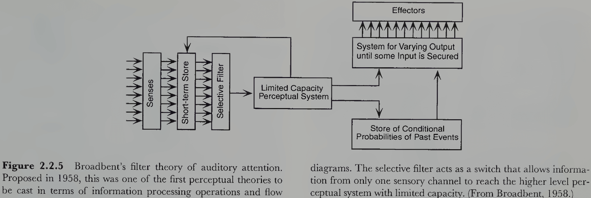
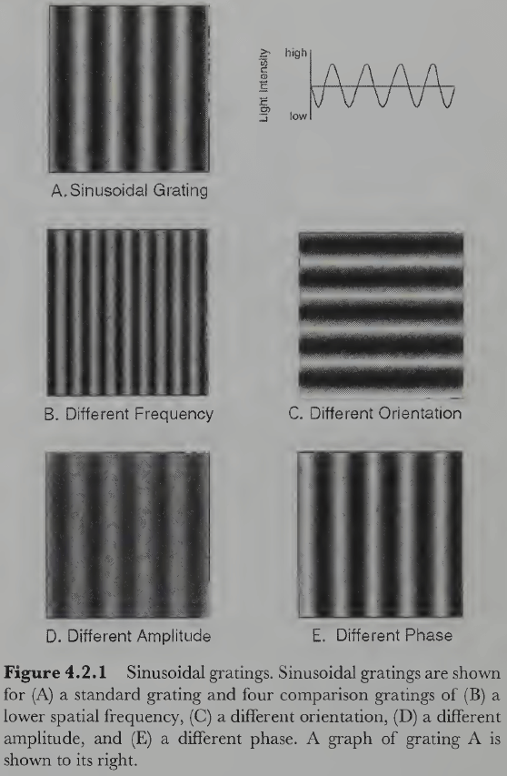
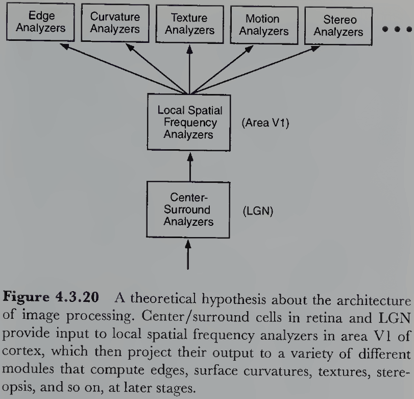
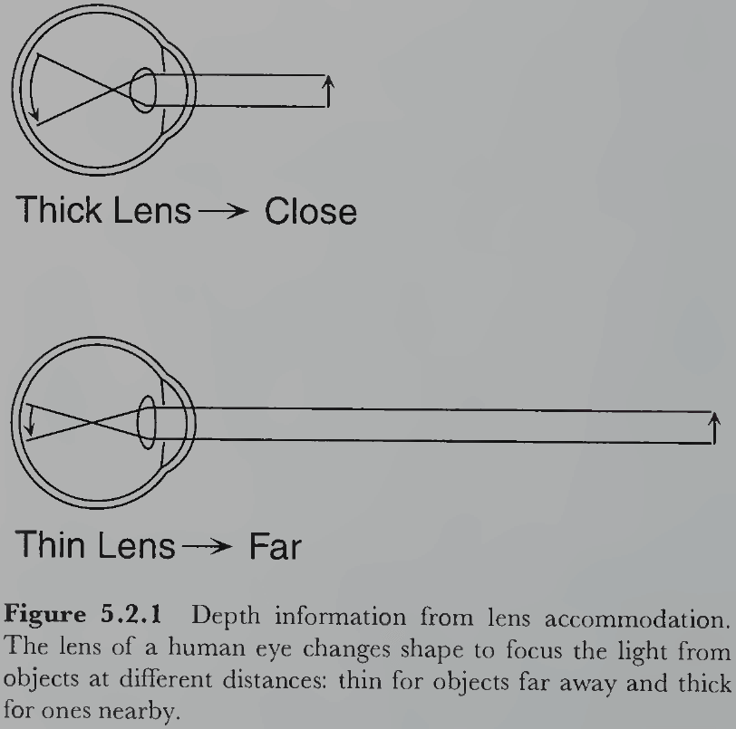
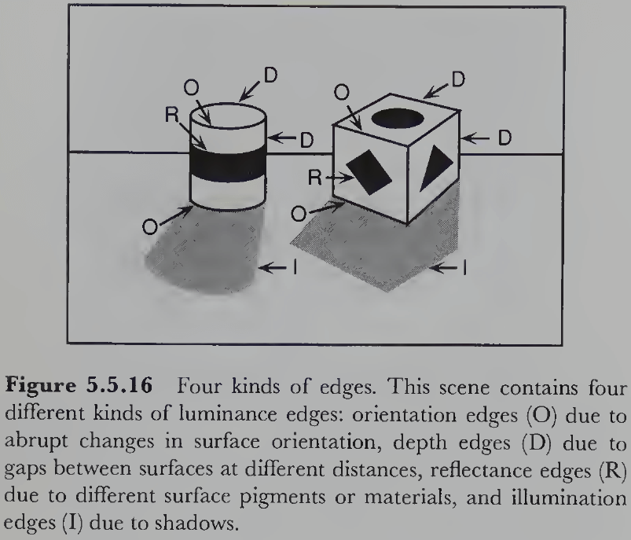
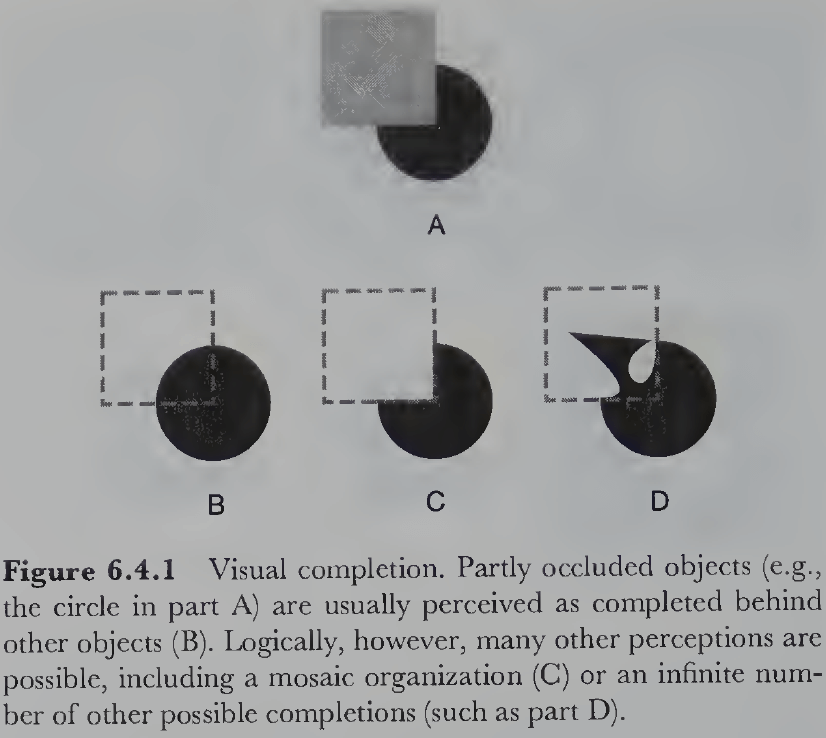
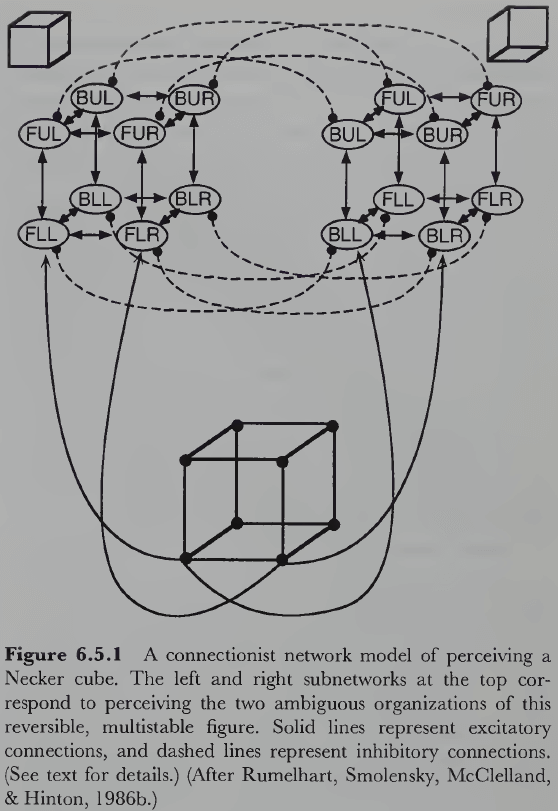
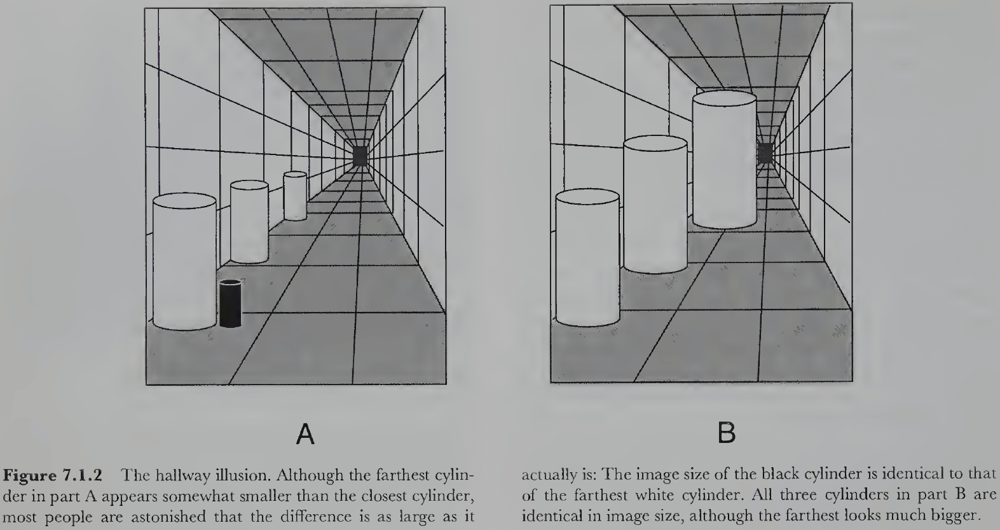
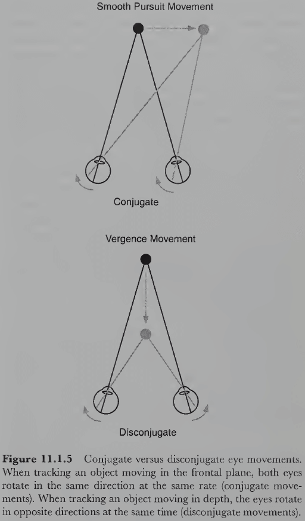

<blockquote class="blockquote">
  
There is no red or green. All the colors we see are artificial; they're constructs of the mind. This beautiful rainbow of colors you see here on these felt-pens is, in reality, different shades of gray.

  
Peter Cawdron, Anomaly

</blockquote>

# Part I: Foundations

## Chapter 1: An Introduction to Vision Science

- Most of us take for granted our ability to see the world around us.
- Yet when viewed critically, visual perception is so incredibly complex that it almost seems like a miracle.
- How do we quickly and effortlessly perceive a meaningful 3D scene from the 2D pattern of light that enters our eyes?
- This is the fundamental question of vision.
- Three domains of vision
    - Phenomena of visual perception
        - E.g. Colors, shape, size, distance.
    - Nature of optical information
        - E.g. Wavelength, intensity, distance.
    - Physiology of the visual nervous system
        - E.g. Retina, visual cortex, neurons.
- Understanding all three domains and their relationships is required to explain vision.

**Section 1.1: Visual Perception**

- This chapter covers: the nature of visual perception from an evolutionary perspective, the nature of optical information from surface light reflected into the eyes, and lastly the physiology of the nervous system that underlies our ability to see.
- Although the eyes are important to see, large parts of the brain are just as crucial.
- What we learn here forms the scaffolding for information in later chapters.
- Visual perception: the process of acquiring knowledge about environmental objects and events by extracting information from the light they emit or reflect.
- Notes on this definition
    - The acquisition of knowledge is what separates an eye from a camera. Cameras don’t know anything about the scenes they record and don’t act on visual information.
    - Perception isn’t just about an observer’s visual experiences but also the objects and events in the environment.
    - Optical information is the foundation of all vision and comes from the way physical surfaces interact with light.
    - The difference between emitting and reflecting light is that emitted light only comes from a source, while reflected light uses light from an emitted source.
- What is visual perception for?
- Vision evolved to aid in the survival and successful reproduction of organisms. And not just seeing, but hearing, touching, tasting, and smelling all participate in this goal.
- Not all species rely as heavily on vision as we do, but vision is important to us because it provides spatially accurate information from a distance.
- E.g. Bats don’t rely heavily on vision but instead use echolocation to gather information.
- Sound and smell can provide information from an even greater distance, but they’re rarely as accurate as vision is for identifying and location objects.
- Taste and touch provide the most direct information about objects but they can’t provide information from far distances.
- For evolution, visual perception is only useful if it’s reasonably accurate otherwise it would have never evolved to such an accurate level in humans.
- Light is an enormously rich source of environmental information and human vision exploits it to a high degree.
- Veridical perception: perception that’s consistent with the actual state of the environment.
- But is vision a clear window into reality?
- No, and exceptions include adaptation, afterimages, visual illusions, ambiguous figures, and hallucinations.
- Adaptation
    - Visual experience becomes less intense with prolonged exposure to a stimulus.
    - E.g. If you go outside at night, you first only see a few dim stars but after a few minutes, you start to see more stars and brighter stars. The stars don’t emit more light as you continue gazing, but your visual system becomes more sensitive to the light they do emit.
    - What changes over time is our visual system and not the environment.
- Afterimage
    - Strong visual stimuli sometimes leave an impression after the stimuli has disappeared.
    - E.g. A blinding camera flash is followed by a dark spot afterimage where the flash retinally was.
    - This is clearly not veridical perception because the afterimage lingers long after the physical flash is gone.
- Illusions
    - Stimuli that fool our visual system into making perceptual errors.
    - Visual illusions support the fact that perception is fallible and can’t be considered a clear window into reality.
    - The reality that vision provides (perception) must be a construction by the visual system from the way it processes light information.
    - The nature of this construction implies certain hidden assumptions, assumptions that we aren’t conscious of and when untrue result in illusions.
    - It’s easy to get carried away by illusions and claim that vision is grossly inaccurate and unreliable, but this is a mistake.
    - Vision is only as accurate as it needs to be for evolutionary purposes.
    - Later we’ll consider the possibility that the perceptual errors produced by illusions may actually be harmless side effects of the same processes that produce veridical perception under normal circumstances.
    - The point is that illusions prove that perception isn’t just a simple registration of objective reality.
- Vision must be an interpretive process that somehow transforms complex, moving, 2D patterns of light at the backs of our eyes into stable perceptions of 3D objects in 3D space.
- We conclude that the objects we perceive are actually interpretations based on the structure of images rather than direct registrations of physical reality.

- Two facts about ambiguous figures
    - The two interpretations are mutually exclusive and can’t occur simultaneously; only one model fits the sensory data at any one time.
    - Both interpretations form a multistable perception where both possibilities switch back and forth as you continue looking at them. It seems that both interpretations compete where the winner is perceived until it gets “tired”.
- If perception were a true reflection of reality, then no ambiguous figures could exist.
- This suggests that something more complex and creative is occurring in vision beyond the information just in light.
- Our current hypothesis is that the brain constructs a model of what environmental situation might have produced the observed pattern of sensory stimulation.
- Perception matches the constructed model rather than the actual sensory stimulation, and sometimes these models are wrong or that multiple models are equally plausible.
- This isn’t to say though that the models are made-up or are fiction.
- Perceptual models must be closely coupled to the sensory information of the world and provide reasonably accurate interpretations of this information to be evolutionary useful.
- Illusions show us that our models are sometimes inaccurate and ambiguous figures show us that our models are sometimes identical, but these are under rare and artificial circumstances.
- Our everyday experience tells us that our perceptual models are usually both accurate and unique.
- Another piece of evidence for the model-constructive view of visual perception is that we complete surfaces we can’t see.
- E.g. If one object partially blocks another object, we understand that the blocked object is still complete and whole.
- Almost nothing we see is visible in its entirety, yet almost everything is perceived as whole and complete.
- Self-occluded surfaces: surfaces of an object that are entirely hidden from view by its own visible surfaces.
- E.g. You can’t see the back of a person if you’re seeing their face.
- Impossible objects: 2D line drawings that seem like 3D objects but are physically impossible.
- The existence of impossible objects further show how our perceptions are internal constructions of a hypothesized external reality.
- Why did perception evolve to form models?
- At some level, the answer must be that the models were more useful than the raw images for evolution.
- E.g. Models help to predict the future and are invariant to viewpoint changes such as movement and lighting.
- Models take more time and effort to construct but once built are easier to maintain and use.
- E.g. It’s useful to know the current position of a moving object, but it’s more useful to know its current direction and speed to predict its trajectory.
- An important note is that the process of extrapolation must work faster than the predicted event to be useful, which may be why perceptual predictions are generated so quickly.
- Classifying objects is useful because it allows us to respond in appropriate ways given the vast amount of information we have stored from previous experiences with similar objects.
- Classification makes handling new objects easier because objects in the same class share many properties and behaviors.
- E.g. Things that are alive move and behave differently than things that are dead.
- However, classifying objects is difficult and an unsolved problem.
- There are also cognitive constraints, top-down goals, plans, and expectations that influence perception.
- This makes sense because the purpose of perception is to meet the needs of the organism using the opportunities afforded by the environment.
- When an object has your attention, you become conscious of its detailed properties.
- But attending to an object doesn’t have to mean moving your eyes to fixate on it, even though it usually means that.
- E.g. Staring at something but thinking about something else or not looking at something but thinking about it.
- Many high-level aspects of perception seem to be fully conscious whereas most lower levels don’t seem to be accessible, modifiable, or conscious.

**Section 1.2: Optical Information**

- Visual perception depends on three ingredients: light, surfaces that reflect light, and the visual system of an observer that can detect light.
- Without any of these ingredients, visual perception doesn’t occur.
- We study each of these ingredients for their basic facts. This section covers how light interacts with surfaces.
- Light that enters our eyes must somehow carry information about the environment, information that we can use for survival and reproduction.
- Optics: the branch of physics that studies light.
- Luminance: the number of photons falling on a given surface per unit of time.
- The luminance of light covaries to some degree with its perceived brightness, but the relation is far from simple.
- Illumination: the lighting conditions in the environment.
- E.g. A point-source illuminant like the Sun or a diffuse-source illuminant like the Sun over some clouds.

- Having more light sources complicates the optical structure of the environment.
- Three ways light can interact with surfaces
    - Transmission
    - Absorption
    - Reflection
- These photon-surface interactions are what ultimately provide vision with information about surfaces, except for transparent surfaces.
- Of the three types of interactions, reflection is the most important for vision because reflected light is changed by its interaction with the surface and it can be captured by the eye.
- Review of specular (mirror-like) and matte surfaces. Real surfaces fall somewhere between the two.
- Some light bounces in almost every direction off almost every surface in the environment, so every surface acts as a secondary light source.
- We can go further and introduce third-order and higher-order reflections.
- The richness of natural scenes depends on capturing these higher-order reflections, these complex interactions of ambient light with the structure of the physical environment.
- Ambient optical array (AOA): all the light coming towards a given point of observation.
- The light in the AOA is complex but follows laws that provide information vision can exploit.
- Vision is the process of reverse inference, of determining the arrangement of surfaces that must exist in the environment to have structured the AOA in just that way.

- The eyes only sample a directional (front-facing) subset of the AOA and there is a different AOA at every point in the environment.
- If we move, we extend the static AOA into a dynamic AOA.
- The static AOA is characterized by a pattern of light converging at the observation point, while the dynamic AOA is characterized by the optic flow of light over time.
- The dynamic AOA is important because it provides more information and allows us to perceive depth, the shapes of moving objects, and our own trajectory as we move.
- If vision provides accurate information about the external world, then there must be a consistent relationship (laws) between the geometry of environmental surfaces and the light that enters the eye at a specific observation point. And there are such laws.
- Distal stimulus: the object in the external world.
- Proximal stimulus: the object’s optical image at the back of the eye.

- Visual angle: the number of degrees occupied by the proximal stimulus.
- It’s important to know that the image on the retina has only two spatial dimensions rather than three, so vital spatial information has been lost going from the real 3D world to the eye’s 2D image of it.
- E.g. Depth information is lost from the projection of the 3D world onto a 2D surface.
- To perceive the world in three dimensions, we must somehow recover depth information from the 2D image. This may be possible, however, because the projection from a 3D to 2D image is highly lawful and consistent.
- Projective geometry: the mathematical study of how a higher-dimensional space is mapped onto a lower-dimensional space.
- E.g. In dynamic vision, the projection is from the 4D structure of space-time onto the 3D space of optic flow that unfolds over time on the 2D surface at the retina.
- No notes on pinhole camera, perspective projection, convex lens.
- One issue with using a pinhole camera is that too large of an aperture makes the image blurry. This can be solved by using a convex lens that provides a virtual pinhole at its focal point, which is what our eyes do.
- No notes on perspective versus orthographic projection. Orthographic projection can be thought of as a special case of perspective projection when the distance is infinite between object and focal point.
- The early stages of visual perception try to solve the inverse problem.
- Inverse problem: how to go from optical images of a scene to knowledge of the objects that gave rise to them.
- There’s no easy way to solve the inverse problem because going from the 2D image to the 3D environment has many possible solutions.
- Each point in the image could map into an infinite number of points in the environment.
- Sensory data doesn’t provide enough information to obtain a specific solution, so it’s surprising how our brains manage to come up with the correct solution most of the time.
- We know 3D perception is possible because the human visual system can do it.
- The dominant theory explaining our 3D perception ability argues that the ability is possible because the visual system makes a lot of highly plausible assumptions about the nature and conditions of the environment.
- These assumptions constrain the inverse problem enough to make it solvable most of the time.
- Thus, vision is a heuristic process.

**Section 1.3: Visual Systems**

- Once we’ve mastered some of the basic facts about the hardware of the visual system, it’s anatomy or physical structure, we can then turn to what it does, its physiological or biological function.
- Vision occurs when light from external sources is reflected from surfaces of objects and enters the eye.
- The visual system consists of both eyes and the brain areas that process information from the eyes.
- The fact that both eye and brain are required for vision means that a person with normal eyes but damaged visual brain might be as blind as a person with a normal brain but damaged eyes.

- Blindsight: blindness due to damage to parts of the visual cortex.
- E.g. Blind spots in the visual field, describing faces but unable to identify them, or seeing stationary scenes but can’t perceive motion.
- We shouldn’t take for granted the simple facts about our eyes.
- E.g. Some species can’t move their eyes but must instead move their entire head. Some species have their eyes placed on the sides rather than the front.
- Eye placement reflects the tradeoff between accuracy of depth perception and coverage of the visual world.
- E.g. Eyes placed in the front have excellent depth perception but poor coverage, while eyes placed on the sides have poor depth perception but excellent coverage.
- No notes on eye anatomy such as cornea, aqueous humor, pupil, and iris.
- Interestingly, pupil size also changes in response to psychological factors.
- E.g. Positive emotional reactions and mental effort.
- We have no conscious control over the mechanisms that control pupil size.
- After the optics of the eye have done their job, the next important function of the eye is to convert light into neural activity.
- Review of neuron, dendrite, graded potential, cell body, action potential, axon, neurotransmitter, synapse, photoreceptor, rod, cone, horizontal, bipolar, amacrine, ganglion cells, and fovea.
- Our ability to adapt to dark environments doesn’t smoothly increase over time as cones and rods have different adaption curves.

- Peculiarities of retinal design
    - The photoreceptive layer is the last layer of the retina but it would make more sense for it to be the first layer since it’s the one capturing light.
    - Rods and cones appear to be pointing backwards with their light-sensitive segment the furthest from the incoming light. This might be because the enzymes for pigment regeneration are opaque and can’t be in front of the photoreceptors.
    - Blood vessels block incoming light but our brain adapts to and ignores them.
    - The optic disk or blind spot is where all of the ganglion cell axons leave the eye and it has no photoreceptors. We don’t experience blindness here except under special circumstances.
    - The photoreceptors of vertebrates actually respond to light by decreasing synaptic activity. Invertebrate eyes work in the opposite and more intuitive way by increasing their output for increases in light intensity.
- Review of the optic chiasm (where the fibers from the nasal side cross), superior colliculus, lateral geniculate nucleus (LGN), occipital cortex, and localization.

- We still don’t know the extent to which functions are localized, but the evidence increasingly supports the view that it is.
- The mapping from retina to striate cortex is topographical.
- E.g. Nearby regions on the retina project to nearby regions in the striate cortex.
- Cortical magnification factor: how the fovea receives a much greater representation in the cortex than the periphery.
- This factor means that we have more detailed spatial information about objects in the central region of the retina, and not that the perception of space is distorted so that objects in the center appear bigger.
- A brain area is marked as “visual” if it follows the topographic organization of the retina.
- The visual cortex is a patchwork quilt of small maps that code for different aspects of retinal stimulation.
- E.g. Brightness, color, motion, depth, texture, and form.
- Review of the ventral “what” visual pathway and dorsal “where” visual pathway.
- Visual agnosia: deficits in identifying objects by sight.
- E.g. Some patients can’t recognize a person from their looks, but can recognize them by their voice. This isn’t due to the inability to see as such patients can describe the faces they see quite precisely.
- Unilateral neglect: the inability to attend to objects in the opposite half of the visual field of the brain damaged site.
- Much of the visual cortex is hidden within the folds of the cortex.
- Review of the primary visual cortex (V1) and the six layers of the cortex.
- Physiological pathways hypothesis: that there are separate neural pathways for processing information about different visual properties.
- E.g. Color, shape, depth, and motion.

- The nature of visual processing in higher level areas of cortex is less clear than in area V1.

## Chapter 2: Theoretical Approaches to Vision

- Theory: an integrated set of statements/hypotheses about the underlying mechanisms or principles that organizes and explains known, unknown, and predicted facts.
- We’ll examine many theories but one common feature among all of them is that they all ultimately prove to be inadequate.
- However, we can learn from wrong theories by trying to improve them and they may contain pieces of the truth.
- The answers to all possible experimental questions wouldn’t lead to proper scientific understanding because that’s just a list of facts.
- Proper understanding requires a theory that integrates old facts and predicts new facts.
- A theory relates facts to each other and allows them to be derived from a small and consistent set of underlying assumptions.

**Section 2.1: Classical Theories of Vision**

- Why do things look the way they do?
- Four issues of visual perception
    - Environment versus organism.
        - Things look the way they do because that’s what they are and that’s how our visual nervous system evolved.
    - Empiricism versus nativism.
        - Empiricism argues that things look the way they do because we’ve learned to see them that way.
        - Nativism argues that things look the way they do because we were born to see them that way.
    - Atomism versus holism.
        - Atomism argues that things look the way they do because each small piece of the visual field appears that way versus the whole visual field.
        - Holism argues that how one part of the field appears will be strongly affected by how other parts of the field appear.
    - Introspection versus behavior.
        - Should a perceptual theory be derived from phenomenological observations of one’s own conscious experience or from objective measurements of human performance?
- Different theories take different stances on these four issues.
- Structuralism
    - Perception comes from when basic sensory atoms evoke memories of other sensory atoms.
    - Sensory atom: a primitive, indivisible element of experience in a given sense modality.
    - Rapid and unconscious associative memory processes were thought to underlie perception.
    - Trained introspection was used to discover sensory atoms.
- Gestaltism
    - Rejected nearly everything about structuralism and argued that perceptions had their own intrinsic structure as wholes that couldn’t be reduced down to parts.
    - The simple concatenation of parts rarely captured the perceived structure of the whole.
    - How does the structure of the whole emerge from its subparts?
    - Psychophysiological isomorphism: perceptual experiences are structured the same as their underlying brain events.
    - E.g. For the opponent theory of color, the opponent color pairs (red/green, blue/yellow, and black/white) should match the opponent structure in the neural events underlying color perception.
- Ecological optics
    - Proposed that perception could be better understood by analyzing the structure of the organism’s environment; it’s ecology.
    - This theory is about the informational basis of perception in the environment rather than its mechanistic basis in the brain.
    - How does the world structure light in an ambient optic array (AOA) such that people perceive the environment by sampling information?
    - E.g. Texture gradient provides information about surface tilt, light source direction, etc.
    - Perceiving as the active exploration of the environment.
    - However, the additional information from the temporal dimension doesn’t fully solve the inverse problem of vision because it doesn’t present a unique solution.
- Constructivism
    - Combines many of the three approaches described above.
    - Global percepts are constructed from local information.
    - Unconscious inference: that the inverse problem can be solved by using assumptions with retinal images to reach perceptual conclusions about the environment.
    - Vision is a probabilistic process where it computes the interpretation with the highest probability given the retinal stimulation.
    - E.g. A circle behind a square has a higher probability of occurring than a three-quarter circle matching exactly the edges of the square.

- Heuristic interpretation process: the visual system makes inferences about the most likely environmental conditions that could have produced the image.
- It’s a heuristic because it uses probabilistic rules that are usually, but not always, true. If the assumptions are false, they lead to wrong conclusions in the form of visual illusions.
- Perception matches reality when the assumptions are true and become illusory when they are false.
- The more likely the assumptions are true, the more likely the perception is correct.
- The evolutionary utility of vision is maximized by using the most probable assumptions, assumptions that we cover in the rest of the book.
- How exactly does the visual system go beyond the observed information to solve the inverse problem in plausible and effective ways?
- E.g. The visual system assumes that large-scale edges of indoor environments, such as floors, walls, and ceilings, are either aligned with gravitational vertical or are perpendicular to it.
- Illusory perceptions usually occur under highly artificial circumstances because these assumptions tend to be true under normal viewing conditions. However, they also reveal the existence of the assumptions.
- There’s a close interdependence between reality, illusion, and hidden assumptions.
- In terms of implementation, connectionist networks can reach perceptual conclusions based partly on incoming sensory data and partly on additional assumptions embodied by the pattern of interconnections among its neuronlike elements.

**Section 2.2: A Brief History of Information Processing**

- Three important developments in the 1950s to 1960s
    - Use of computer simulations to model cognitive processes
    - Application of information processing ideas to psychology
    - Emergence of the idea that the brain is a biological processor of information
- No notes on computer vision, the invention of computers, Turing machines, block worlds, neural networks, perceptrons, Hebb’s cell assemblies, and parallel distributed processing (PDP).
- It turns out to be unbelievably hard to get computers to “see” even simple things.
- Luminance edges: changes in the amount of light falling on two adjacent regions of an image.
- The luminance structure in 2D images provides information about the structure of surfaces and objects in 3D space.
- No notes on behaviorism, Broadbent’s filter theory of auditory attention, iconic memory.
- Broadbent was among the first to propose a psychological theory specifying the temporal structure of information processing events.

- Few neuroscientists take the simple analogy of neural spikes as digital code seriously anymore because there are many striking differences between brains and digital computers.
- But the idea that the brain is doing some kind of information processing is now almost universally believed.
- No notes on lesion experiments, electrical brain stimulation, single-cell recording, Hubel and Wiesel’s work on receptive fields, autoradiography (using a radioactive substance to track the firing of neurons), brain imaging techniques (CT, PET, MRI, and fMRI).

**Section 2.3: Information Processing Theory**

- The information processing paradigm is a way of thinking about the human mind as a computational process.
- No notes on Thomas Kuhn’s scientific paradigm and the brain-as-a-computer metaphor.
- E.g. Minds as “software” and brains as “hardware”.
- Review of David Marr’s three levels of description: computational (the system’s goals), algorithmic (how a computation is executed), and implementational (algorithm embodied as a physical process).
- Three assumptions of information processing
    - Informational description
        - Mental events can be described as informational events consisting of three parts: input information, operation, and output information.
        - Information events are diagrammed as a black box in an information flow diagram.
    - Recursive decomposition
        - Any complex informational event at one level can be specified at a lower level by decomposing it into component informational events and a flow diagram.
        - E.g. A black box can be defined by a number of smaller black boxes inside it, plus a description of how they’re interconnected.
        - This process can be recursively performed again and again for each black box.
        - Recursive decomposition only works if the system is actually structured as a hierarchy.
    - Physical embodiment
        - Information and operations are entities in the abstract domain, while representations and processes are entities in the physical world.
- Representation: a physical entity that carries information about something.
- Process: a physical transformation that changes one representation into the next.
- A representational system includes two similar but distinct worlds: the represented world (external) and the representing world (internal).
- How does an internal world represent an external world?
- One method is by having the internal representation mirror the structure of the external world. Thus there’s a map from external objects to internal representations.
- A standard tradeoff in representing information is that the more information is stored directly, the less must be inferred by additional processing and vice versa.
- Without representations, processes would have nothing to work on. And without processes, no work would get done.
- Processes make implicit information in the input representation explicit. However, processes can’t create information from thin air.
- All the information must be available either in the optical structure projected to the retina or from internal knowledge of the viewer.
- E.g. The boundaries between retinal regions projected from different surfaces and how surfaces are combined to form objects.
- Visual perception thus combines external and internal information to make meaningful facts about the environment available to the organism; it’s a form of inference.
- E.g. An image with a set of lines converging towards a vanishing point, plus the convergence assumption (lines converging to a point on the horizon are parallel), lets the visual system conclude that the converging lines are actually parallel lines.

- No notes on deductive and inductive inference.
- Most inferences in visual processing are inductive because they’re not guaranteed to be true.
- E.g. The assumption that converging lines are parallel isn’t always true, but only probabilistically true. It’s false for the converging but nonparallel sides of a trapezoid.
- If the assumption is false for the current situation, then the conclusion may not be valid.
- This is how inferential theories of vision account for the existence and nature of many visual illusions.
- E.g. The Ponzo illusion may be due to the unconscious misapplication of the convergence assumption.

- An important function of perceptual learning is to collect the most appropriate hidden assumptions so that veridical perception is achieved as often as possible.
- However, in the case of conflicting assumptions, how does the visual system determine which inference is correct?
- E.g. The lines in Figure 2.3.9 can be perceived to lie at the same distance (same plane) or be perceived as receding into the distance. The former assumption supports the conclusion that the converging lines aren’t parallel in depth, while the latter assumption supports that the lines are parallel.
- If different assumptions lead to different conclusions, one can’t conclude anything using both assumptions.
- So, one assumption must be selected to the exclusion of other assumptions. This isn’t ideal though as we now need a competitive framework.
- Alternatives to competition
    - Soft constraints: informational restrictions that may be overridden.
    - Fuzzy logic: statements can have different degrees of truth.
    - Probabilistic inference: uses Bayes’ theorem to select the assumption.
- One argument against the inferential perspective of vision is that visual illusions occur in very odd and artificial conditions that would rarely, if ever, show up naturally.
- Yet, the phenomena do occur and require an explanation; we can’t just ignore evidence.
- This book takes the stance that a perceptual theory must account for all phenomena of visual perception, whether natural or not.
- Inference-based vision is preferable to direct perception because it can explain both natural and unnatural phenomena.
- We’ll also adopt the stance that perception involves some form of inductive inference carried out by computations in neural networks.
- Review of top-down (hypothesis-driven) and bottom-up (data-driven) processes where the retinal image is at the bottom and subsequent interpretations are farther along the visual pathway.
- Our intuition suggests that vision is a bottom-up process and while that may be true for the early processing stages, this can’t be true for all of visual perception.
- E.g. Perception of the present state produces expectations about the future. These are top-down components because higher-level interpretation aren’t observed.

**Section 2.4: Four Stages of Visual Perception**

- Four stages
    - Image-based
    - Surface-based
    - Object-based
    - Category-based
- The complete set of firing rates in all receptors of both eyes and their organization is the first representation of optical information within the visual system.
- The representation is complicated by the uneven distribution of receptors and the four different kinds of receptors.
- We can simplify this by assuming the retina captures light in a x-y grid pattern.
- E.g. Pixels or picture elements.
- Pixel: the primitive indivisible unit of visual information that represents an intensity value at the location.
- The coordinate system of the retinal image is presumed to be tied to the structure of the retina.
- E.g. Center of coordinate system is the fovea.
- Past the retinal stage is the image-based stage.
- E.g. Local edges and lines, matching images in the left and right eyes.
- The luminance edges detected in an image aren’t the same edges that people typically perceive.

- No notes on Marr’s raw and full primal sketch.
- Common underlying structure of image-based representations
    - Image-based primitives
    - 2D geometry
    - Retinal reference frame
- The second stage is the surface-based stage and it deals with recovering the properties of visible surfaces that might have produced the features discovered in the image-based stage.
- One distinguishing feature of the surface-based stage is that it represents information in three dimensions.
- It doesn’t represent all surfaces, only the visible ones, and can’t be computed from only retinal images because it uses additional assumptions.
- Properties of surface-based representations
    - Surface primitives: local patches of 2D surface at some slant located at some distance.
    - 3D geometry
    - Viewer-centered reference frame: surfaces are represented in a 3D coordinate system based on the viewer.
- The representation of surface is constructed from several image-based features.
- E.g. Stereopsis, motion parallax, shading and shadows, texture, size, shape, and occlusion.

- The fact that we have expectations about partially and completely hidden surfaces suggests that there’s some form of true 3D representation that includes occluded surfaces.
- The object-based stage is when visual representations truly include 3D information.
- However, to achieve this representation, the visual system has to make further hidden assumptions because now the inferences include information about unseen surfaces or parts of surfaces.

- Two ways to construct an object-based representation
    - Boundary approach: extend the surface-based representation to include unseen surfaces in a 3D space.
    - Volumetric approach: conceive of objects as intrinsically 3D entities and represent them using some set of primitive 3D shapes.
- In object-based representations, are the primitive elements surfaces or volumes? We don’t know.
- The ultimate goal of perception is to provide the organism with accurate information about the environment to aid its survival and reproduction.
- This strongly implies that the final stage of perception deals with recovering the functional properties of objects.
- This final stage for vision is the category-based stage where we believe the functional properties of objects are accessed through categorization (or pattern recognition).
- E.g. Visual system → Classifies object by visual features → Access information about the object class such as function and form → Apply information to object.
- This scheme means that any functional property can be associated with any object.
- An alternative scheme is that the visual system perceives an object’s function directly from its visual characteristics without categorizing them.
- Affordances: whether an object allows a function or behavior.
- It’s possible that we use both types of schemes to perceive function.
- These four stages of visual processing (image-, surface-, object-, and category-based) are our best hypothesis on the overall structure of visual perception.

## Chapter 3: Color Vision: A Microcosm of Vision Science

- It’s isn’t obvious why objects should be colored; they simply are.
- People universally believe that objects look colored because they are colored.
- E.g. The sky looks blue because it is blue, grass looks green because it is green.
- But these beliefs are mistaken because neither objects nor light are actually “colored”.
- Color is a psychological property of our visual experiences and not a physical property of objects or lights.
- Color is based on physical properties though and these physical properties are different from the colors we perceive.
- Instead, a more accurate description of color is that it’s the result of complex interactions between physical light and our visual system.
- Color perception may be one of the best understood topics in vision science and how we reached such an understanding may teach us how scientific discovery unfolds over time.
- Steps to understand color
    - Consider the nature of the input information: light.
    - Consider the nature of the output information: experience of color.
    - Then consider the relationship between the two: how the physical domain of light maps onto the psychological domain of color experience.
- We’ll discuss color in terms of image-, category-, and surface-based computational stages. An object-based stage isn’t needed because color is a property of surfaces rather than of volumes.

**Section 3.1: The Computational Description of Color Perception**

- Review of the physics of color (the discovery that white light consists of colors, review of the photon, electromagnetic energy, wavelength, electromagnetic spectrum).
- The photons we experience as light are just a small part of the electromagnetic spectrum.
- E.g. From 400 to 700 nanometers in wavelength.
- Monochromatic light: light with a spectrum containing only one wavelength.
- Polychromatic light: light with a spectrum containing more than one wavelength.
- E.g. Sunlight is polychromatic because it has a roughly equal number of photons at all visible wavelengths.
- Color only comes into the picture when light enters the eyes of an observer with a visual nervous system to experience it.
- E.g. There’s light of different wavelengths independent of an observer, but there’s no color independent of an observer.
- Different colors appear because different surfaces reflect different proportions of light at different wavelengths.
- All colors can be described using three properties: hue, saturation, and lightness.
- These three properties define the color space: a 3D coordinate system where each possible color experience is represented by a unique coordinate.
- Note that there’s an enormous reduction in complexity from the physical description of light to the psychological description of color.
- E.g. There’s an infinite number of wavelengths between 400-700 nm, but color can be defined with just three values.
- This implies that color experiences lose much of the information carried by the full spectrum of light and that many physically different lights produce identical color experiences.
- Perhaps the lost information was deemed as unimportant by evolution.
- Hue: what we normally think of as color and changes with wavelength.
- If light is arranged by physical similarity in terms of wavelength, then it lies along a straight line where the shortest and longest visible wavelengths are least similar in physical terms.
- But if light is arranged by perceived similarity, then it lies in a circle where the shortest wavelengths (purples) and longest wavelengths (reds) appear close together.
- Thus, the physical dimension of wavelength and the psychological dimension of hue are related, but not identical.
- E.g. The hues between purple and red, like pink, are non-spectral because there’s no single wavelength in the visible spectrum that produces them. These hues can only be created by combining two or more wavelengths of light.
- Complementary colors: hues on opposite side of the color circle.
- E.g. Green and red, blue and orange, yellow and purple.
- Saturation: captures the purity or vividness of color experiences.
- E.g. Grays → Pastels → Vibrant.
- Lightness: refers to the luminance of color.
- For objects that emit light rather than reflect it, we call it’s luminance as brightness.
- Otherwise, the shape of the color space for emitted and reflected light is essentially the same.
- The perception of lightness/brightness is mostly due to the contrast of one region with a surrounding region.
- E.g. If two surfaces reflect the same number of photons per unit time, the surface surrounded by a darker region looks lighter, and the surface surrounded by a lighter region looks darker.
- Psychophysical correspondence: how physical descriptions map onto psychological ones.
- It would be convenient if there were a clear and simple mapping between physical light and color experience, but there isn’t.
- One way to simplify the mapping is to only consider surfaces that reflect light who spectrum is approximately in the shape of a normal distribution.
- Three simple psychophysical correspondences
    1. Mean wavelength determines hue.
        - Not all hues can be produced by normally distributed spectra.
        - E.g. Non-spectral purples.
    2. Spectral area determines lightness.
        - The area under the curve matches the total number of photons that hit the retina.
    3. Variance determines saturation.
        - Monochromatic lights (which have zero variance) are the most saturated colors. In contrast, white light (which has maximal variance) is the least saturated.

- This is simple for light that’s normally distributed across the spectrum, but once this restriction is relaxed things get very complicated very quickly.
- E.g. We can’t predict the perceived color of a surface from only knowing the spectrum of light being reflect from it because of the surrounding surfaces, lighting conditions, orientation of the surface, and shadows.

**Section 3.2: Image-Based Color Processing**

- It isn’t clear nor confirmed if color is represented at the level of a 2D image.
- Many phenomena discovered more than a century ago helped us better understand color perception.
- E.g. Color mixture, types of color blindness, color afterimages, existence of induced colors, chromatic adaptation.
- Light mixture
    - Only a small fraction of colors in the color space are monochromatic lights.
    - Nonspectral colors (purples) and desaturated colors (pastels and grays) are when two or more different wavelengths are mixed.
    - How do colors combine?
    - It depends on whether one mixes light or paint.
    - For mixing light, it’s simple. When mixing light A with light B, the resulting color lies on the line connecting A and B in color space, depending on the proportions of A and B.

    - E.g. For lights of complementary colors, mixing them produces achromatic/white light because they’re on opposite sides of the color circle and the line crosses the center point.
    - If three colors are mixed, then the resulting color lies on the triangular plane connecting A, B, and C.
    - E.g. If red, blue, and green are mixed, then we can produce most of the colors in the color space by varying their relative amounts. Exceptions include highly saturated yellows, purples, and blue-greens.
    - Metamers: pairs of lights or surfaces that look the same but have different physical spectra.
    - The fact that just three lights can produce almost any hue is important for color technology.
- Color blindness
    - This is a condition where a person can’t discriminate among certain colors.
    - Review of trichromats, dichromat, and monochromats.
    - Three types of dichromats
        - Protanopia: red/green color blind with a neutral point of 492 nm.
        - Deuteranopia: red/green color blind with a neutral point of 498 nm.
        - Tritanopia: blue/yellow color blind with a neutral point of 570 nm.
    - Why do these particular forms of color deficiencies exist and no others? We’ll find the answer in physiology.
- Color afterimages
    - There are aftereffects when viewing highly saturated colors for long periods.
    - E.g. Each hue produces its complementary hue in the afterimage such as green with red, black with white, and yellow with blue.
    - To determine the complement of a color, just stare at a highly saturated patch of it and then look at a sheet of white paper. Your visual system automatically gives you the answer.
- Simultaneous color contrast
    - When two regions of identical spectra are perceived differently due to the spectra of surrounding regions.
- Chromatic adaptation
    - Since the visual system adapts to both light and dark conditions, it isn’t surprising that it also adapts to chromatic conditions (prolonged exposure to color).
    - Chromatic adaptation is eye-specific.
    - There’s a close relation between adaptation and aftereffect as chromatic adaptation causes chromatic aftereffects of the complementary hue. However, they aren’t the same.
    - Adaptation is the lowering of sensitivity after prolonged stimulation, while aftereffect is the experience of an opposite perception after prolonged stimulation.
- Trichromatic theory
    - Hypothesized that there are three types of color receptors that produce the psychologically primary color sensations of red, green, and blue.
    - All other colors are combinations of these primaries.
    - The three types of receptors respond differently to different wavelengths of photons.
    - E.g. Short wavelengths for blue, medium wavelengths for green, and long wavelengths for red.
    - Each receptor’s sensitivity to wavelength overlaps and any given wavelength stimulates the three-receptor system to different degrees.

    - Thus, the pattern of activation across the three receptor types determines the perceived color.
    - This theory accounts for many important phenomena of color vision.
    - E.g. The three dimensions of color space match the existence of the three types of receptors. Metamers are explained as the same pattern of activation produced by many physically distinct combinations of wavelengths. Color blindness is explained as the absence of one of the receptor types.
- Opponent process theory
    - Although the trichromatic theory explains many phenomena, it doesn’t explain the nature of people’s subjective color experiences.
    - E.g. Why are color experiences always lost in certain pairs? Such as red and green, or blue and yellow.
    - Colors are never lost independently nor are they lost in other pairings such as red and blue, or green and yellow.
    - Another piece of evidence against the trichromatic theory is that colors other than the primary colors (red, green, blue) don’t subjectively look like a combination of the primary colors, but instead look primary themselves.
    - E.g. Yellow doesn’t look like a mixture of red and green, it looks like yellow. Yellow seems to be psychologically just as “primary” as red, green, and blue.
    - Furthermore, evidence for polar opposites among colors comes from color afterimages and induced colors.
    - From this, we hypothesize that there are four chromatic primaries rather than three and that they’re structured in pairs of opposites: red versus green, and blue versus yellow.

- Dual process theory
    - We can combine the trichromatic and opponent process theories into a two-stage theory of color vision called dual process theory.
    - Both theories are correct, but for different stages of visual processing.

    - Both stages of the dual process theory are now known to occur in the retina but importantly, the theorizing was done before the relevant physiology was known.
    - This was, in part, due to technological limitations as it was easier to perform behavioral experiments than to dissect the retina.
    - Another factor is that it’s generally easier to work from the abstract functional level downward to the physical implementation than in the reverse direction.
- As predicted by the trichromatic theory, there are three types of cones in the retina that each contain a different light-absorbing pigment.

- E.g. Short-wavelength (S), medium-wavelength (M), and long-wavelength (L) cones.
- The ratio of L to M to S cones appears to be nonuniform at about 10:5:1 with the receptors in the central 0.1 degree of the fovea being almost exclusively M and L cones.
- These three cone types, sometimes misleadingly called blue, green, and red cones, work as predicted by the trichromatic theory and explains some cases of color blindness.
- E.g. Protanopes are missing L cones, deuteranopes missing M cones, and tritanopes missing S cones.
- Responses in the LGN of macaque monkeys were incompatible with the trichromatic theory but conformed to the opponent process theory.
- E.g. Some cells were excited by red light and inhibited by green light and vice versa. Same applies to blue and yellow, and to light and dark.
- Further research has found this pattern of response in the bipolar and ganglion cells of the retina.
- How are the opponent responses of these cells derived from the outputs of the three cones system? We don’t know with certainty.
- Although the dual process theory is elegant and accounts for most color phenomena, it isn’t perfect.
- E.g. It isn’t clear why the shortest wavelengths of the spectrum (violet) appear reddish.
- The two initial steps in color processing are an example of how an information processing system starts with one representation and transforms it into another representation.

- Assuming that there’s a later cortical representation of color in terms of hue, saturation, and lightness, the red/green and blue/yellow axes must be further transformed.
- The effect of these transformations is to reparametrize the 3D color space so that different, evolutionary more useful, information is made explicit in successively higher levels of representation.
- Reparameterization: the process of changing the variables that directly control a system’s behavior.
- E.g. Your bathroom faucet transforms the 2D control system of hot or cold water and how much into one control function, like back and forth for volume and left or right for temperature.
- Why does the visual system use three different color representations?
- E.g. Hue, saturation, and lightness.
- Because different representations provide information that’s useful for different purposes.
- To understand brightness contrast and simultaneous color contrast effects, we need some kind of spatial interaction between neighboring regions of the retina.
- Lateral inhibition: when neurons are spatially organized to inhibit neighboring neurons.
- Interestingly, a lateral inhibitory network has a pattern of outputs similar to the Mach band phenomenon.
- Review of projective and receptive field.

- For a 2D lateral inhibitory network, a center-surround organization emerges where cells respond maximally to a pattern of a bright spot activating its excitatory center and a dark ring surrounding the center.
- The ganglion cells of many mammalian retinas have a center-surround organization.
- The lateral inhibition theory explains the Hermann grid illusion as the intersections receive more inhibition causing the illusory dark spots.

- However, lateral inhibition doesn’t explain why the same colored shape on a black or white background appears darker or lighter respectively.
- Adaptation reduces sensitivity to light after prolonged exposure to an unchanging stimulus by temporarily depleting resources in the visual system. The reverse happens in dark environments.
- Over time, the activity of the visual system shifts away from the perception of the adapting stimulus.
- Double opponent cells: cells in the visual cortex that have an opponent center-surround organization and provide the basis for simultaneous color contrast effects.
- E.g. A red/green double opponent cell would be excitatory to red and inhibitory to green in the center, and excitatory to green and inhibitory to red in the surround.
- This applies to red/green, blue/yellow, and white/black opponent cells.

- Double opponent cells explain why a gray circle on a highly saturated green background appears pinkish; its because the surrounding green region falls on the red/green double opponent cells, causing it to inhibit the center thus signaling red and giving the gray circle a reddish tint.
- Achromatopsia: inability to see color due to cortical damage and not retinal damage.
- Achromatopsia differs from color blindness because it isn’t caused by the lack of one or more cone types, instead the problem lies with the brain.
- Color anomia: inability to produce linguistic labels for colors.
- Color anomics can see colors perfectly well since they can discriminate and match them, but they can’t associate between perceived colors and their linguistic labels.
- Since color vision is genetically determined, how early do babies begin to perceive color?
- Evidence from preferential-looking-paradigm experiments suggest that two-month-old babies have normal trichromatic vision.

**Section 3.3: Surface-Based Color Processing**

- Our image-based description of color processing is only a rudimentary beginning of an explanation of real-world color perception because it fails to account for what we perceive.

- The “color” of a surface is a psychological property attributed to an external object and not a physical property of surfaces or light.
- The physical attribute that mainly determines the color of a surface is its reflectance spectrum.
- Reflectance spectrum: the percentage of incident light reflected at each wavelength.
- The reflectance spectrum (reflectance) of a surface is invariant because it doesn’t change under different lighting or viewing conditions. It always reflects the same proportion of light at each wavelength independent of the illumination.
- Luminance spectrum: the light that falls on the retina.
- The problem the visual system faces in perceiving surface color is that the luminance spectrum is determined both by the reflectance spectrum of the surface and the illumination spectrum of the light that strikes the surface.
- E.g. A red surface seen under a red light looks very different when seen under a green light.
- This is known as the color constancy problem.

- The visual system solves the color constancy problem by somehow disentangling the effects of reflectance and illumination so that the invariant property of surface reflectance can be perceived despite changes in illumination.
- This is the inverse problem for color and once again, the problem is underconstrained because the eye receives information about only one known variable (luminance) that’s determined by two unknown variables (reflectance and illumination).
- To recover reflectance from luminance, we believe that the visual system uses additional sources of information, probably in the form of clever heuristics and assumptions, to accomplish this task.
- Color constancy is a special case of perceptual constancy.
- Perceptual constancy: the ability to perceive the properties of environmental objects in spite of changing environmental conditions.
- Lightness constancy: perception of a achromatic surface as having the same surface lightness regardless of differences in illumination or viewing conditions.
- Adaptational processes are involved in lightness constancy, but it can’t account for all of it.
- Adaptation takes a relatively long time whereas lightness constancy is virtually immediate.
- E.g. If you’re reading a book and the light suddenly dims, your perception of the page doesn’t turn gray and then gradually lighten.
- One hypothesis is that perceived lightness depends on the relative luminance (contrast) between neighboring regions.
- The boundary between regions, the edge, determines the perceived relative lightness of the two regions. This then propagates across the entire region.
- Retinex theory: proposes that lightness depends on the global integration of locally determined luminance ratios at edges.
- No notes on the details of the retinex theory.
- Although the contrast between regions is useful, it doesn’t specify what scale to use.
- E.g. If a region reflects five times as much light as its background region, we don’t know whether the lighter region is white and its background is gray, or the lighter region is gray and its background is black.
- Scaling problem: how are luminance ratios mapped onto the white-to-black scale of achromatic lightness?
- The visual system appears to solve the scaling problem by using a simple anchoring heuristic by assuming the region with highest luminance is white and scaling all other regions accordingly.
- Experiments support this idea with darkish gray regions being perceived as white under specific conditions.
- Once again, this isn’t the full story though as regions with the highest luminance aren’t perceived as white, but instead as luminous or bright.
- Two kinds of edges
    - Reflectance edges: changes in image luminance caused by changes in the reflectance of two surfaces.
        - E.g. The edge between white and black paint.
    - Illumination edges: changes in image luminance caused by different amounts of light falling on the surface.
        - E.g. The edge between an object and a shadow.

- How does the visual system determine whether an edge is reflectance or illumination?
- One factor is if the edge is fuzzy or sharp. Illuminance edges due to shadows tend to be fuzzy and graded whereas reflectance edges tend to be sharp.
- Another factor is depth. If depth information says that two regions don’t like in the same plane, the edge tends to be perceived as an illumination edge.
- A third factor is the magnitude of the luminance ratios at the edge. Illumination edges can produce much greater changes in luminance than reflectance edges.
- Generally, if hue or saturation varies across an edge, it’s probably a reflectance edge. If only brightness varies, it’s probably an illumination edge.
- We can extend our facts and theories about achromatic constancy to colors.
- Chromatic color constancy: the perception of invariant properties of a surface’s spectral reflectance despite changes in illumination and viewing conditions.
- Objects appear to have the same color under different illumination, but different light sources can have substantially different illumination spectra, which causes different luminance spectra to the eye.
- Chromatic adaptation is believed to be important for color constancy.
- Human color constancy is remarkably good as we perceive mostly a surface’s reflectance spectrum even though the light entering the eye (luminance spectrum) is actually the product of its reflectance spectrum times the illuminance spectrum.
- The visual system is somehow able to separate out the wavelength information in the illuminating light from the wavelength information in the surface reflectance.
- Three constraints under natural viewing conditions
    - Consistencies in the illuminating light within a scene.
        - When the intensity of light is constant for parts of an image, it reduces the number of free parameters of the illuminance spectrum down to three for that part of the image.
        - For this to work though, the visual system must somehow discriminate between illuminant and reflectance edges.
    - Restricted range of illumination spectra for normal illuminants.
        - We don’t encounter all possible light sources under normal viewing conditions.
        - Color constancy tends to fail when there are strongly chromatic light sources, but we rarely encounter these outside of stage lighting and perceptual experiments.
    - Restricted range of reflectance spectra.
        - We also don’t encounter all possible surface reflectance spectra either.
- If color vision evolved to allow organisms to perceive the reflectance of surfaces as approximately constant over variations in normal daylight, then one method is to remove these variations by a compensatory internal process.
- E.g. The black/white, red/green, and blue/yellow structure of color vision may be an evolutionary adaptation to compensate for changes in normal daylight.
- But this conjecture is speculative and doesn’t have any evidence supporting it.
- We now revisit how the visual system distinguishes between illumination and reflectance edges.
- Illumination edges have similar chromatic aspects while reflectance edges have different chromatic aspects.

- We aren’t certain, but maybe the visual system uses the red/green and blue/yellow opponent systems to compare the chromatic aspects of two regions. If they’re similar, this suggests a reflectance edge. If they’re different, an illumination edge.
- Color constancy doesn’t seem to be an innate ability because two-month-old infants looked at the same stimulus with different illumination for the same amount of time as they did a new stimulus.
- In contrast, four-month-old infants looking at the same stimulus with different illumination looked away as fast as the same stimulus with same illumination. This matches what we’d predict with color constancy.

**Section 3.4: The Category-Based Stage**

- The processing of color isn’t complete when we can internally represent a colored surface.
- The next step is to classify colors and attach linguistic labels to them.
- E.g. Blood, tomatoes, and certain apples are all classified as red even though they produce unique hues, saturations, and lightnesses.
- People divide the continuous 3D space of color into discrete color categories.
- Evidence supports the view that the fundamental color categories are primarily determined by the physiology of the human visual system.
- How are colors named?
- The first breakthrough came from cross-cultural research on color naming.
- E.g. How people in different cultures with different languages apply labels to colors.
- Review of cultural relativism and the Sapir-Whorf hypothesis.

- It seems that if a language has only two basic color terms, the terms will always be light-warm and dark-cool. If three, then add white and so on, each time adding the next basic color term.
- The regularity and pattern that languages follow when developing and adding new color terms undermines the cultural relativity hypothesis and suggests an alternative hypothesis.
- Linguistic universality: the idea that language is determined either by invariant physical characteristics in the structure of the environment or by invariant biological features in the structure of the organism, or both.
- For color naming, the evidence strongly favors biological determination.
- E.g. Is it a coincidence that the first six names for colors in any language match the three opponent processes (black/white, red/green, blue/yellow)?
- The compelling conclusion from this research is that the fundamental structure of color naming is fixed by genetically determined physiology.
- Color classification may be structured around a focal/best-example color rather than class boundaries because people more quickly and reliably picked out the focal colors than color boundaries.
- The idea that color categories are based on prototypical examples received further supported from studies on colors naming in tribes and from studies on the speed of classifying focal versus non-focal colors.
- Focal colors serve as cognitive reference points for color categories and other colors are learned relative to them.

- No notes on fuzzy set theory applied to color naming.
- The fuzzy logical model of color categories is consistent with a large number of findings in human color naming and categorization research.

# Part II: Spatial Vision

## Chapter 4: Processing Image Structure

- Perceiving color is only one of our many visual abilities.
- An arguably more important ability is the perception of spatial structure.
- E.g. The shape, location, size, and orientation of objects in space.

**Section 4.1: Physiological Mechanisms**

- We start with trying to understand how spatial processing occurs in the retina.
- Review of on-center off-surround, and off-center on-surround ganglion cells (cells that have an antagonism between an inner circle and surrounding ring).

- The area surrounding the central region always has the opposite characteristic.
- Although bipolar cells come before ganglion cells in the visual pathway, they were studied later because of technical reasons.
- Photoreceptors and bipolar cells respond by producing graded potentials.
- Graded potential: continuous changes in electrical potential that travel slowly and for short distances.
- In contrast to spikes that can be recorded inside or outside the cell, graded potentials can only be recorded from inside the cell.
- Bipolar cells have similar receptive field properties as ganglion cells, namely the center-surround antagonist relation.
- This property is due to how the connections between photoreceptors and horizontal cells are organized.
- Photoreceptors are directly connected to bipolar cells but are also indirectly connected through the horizontal cells.
- The direct pathway is either excitatory or inhibitory but whatever it is, the indirect pathway is always the opposite.
- These two regions of excitation and inhibition sum in the bipolar cell to produce it’s center-surround receptive field.

- Lateral geniculate nuclei (LGN): cells in the thalamus that the retinal ganglion cells connect to.
- LGN cells have center-surround receptive fields like retinal ganglion cells but they’re larger with a stronger inhibitory surround.
- One major difference between retinal ganglion cells and the LGN is their structure.
- E.g. The ganglion cells form a 2D sheet while the LGN is a 3D structure.
- Each LGN cell is monocular and only fires in response to stimulation from just one eye.
- Binocular cells aren’t present until the visual cortex.
- The internal architecture of the LGN is interesting and has provided important clues about a crucial functional distinction in the visual system.
- One clue is that the LGN is laminar/layered with six 2D sheets of neurons.

- The lower two layers are the magnocellular layers because they have large cell bodies, while the upper four layers are the parvocellular layers because they have small cell bodies.
- Magnocellular cells are sensitive to differences in contrast, are insensitive to color, have large receptive fields, and exhibit transient responses to changes in retinal stimulation.
- Parvocellular cells are insensitive to contrast, are sensitive to color, have small receptive fields, and exhibit sustained responses to changes in retinal stimulation.
- These distinctions aren’t clear-cut and there’s substantial overlap between magno and parvo cells.
- Perhaps the magno cells are specialized for processing motion and depth, while the parvo cells are specialized for processing color and shape.
- Backtracking, two different kinds of ganglion cells project selectively to the magno and parvo cells in the LGN: the M and P ganglion cells respectively.
- P cells receive input only from cones but M cells receive input from both rods and cones.
- We’ll see how the division between the M and P pathways propagates to higher levels of the visual system.
- Each LGN layer receives signals from just one eye with the four parvocellular layers alternating between the left and right eye. The same applies to the two magnocellular layers.
- Each LGN layer is also spatially organized like the retina it receives input from.
- Retinotopic mapping: when the organization/map of the relative location of cells on the retina is preserved.
- E.g. Nearby retinal regions project to nearby LGN regions.
- Retinotopy is a common feature of the visual nervous system.
- Striate cortex: a 2 mm thick sheet of neurons and a few square inches in surface area that’s the largest cortical area in primates.
- Review of Hubel and Wiesel’s discovery of the striate cortex neuron’s receptive fields.
- Simple cells: neurons sensitive to a edge/line at a specific retinal position and orientation; often called edge/line detectors.
- Edges cells have an area of excitation on one side and an area of inhibition on the other, while line cells have an central elongated region of either excitation/inhibition and an antagonistic region on both sides.

- It’s plausible that if LGN cells are wired in a specific way, we get edge and line detectors.

- Unique features of complex cells compared to simple cells
    - Nonlinear: rarely responds to small stationary spots of light.
    - Motion sensitive: highly responsive to moving lines/edges in a specific direction.
    - Position insensitive: small differences in stimulus position won’t affect response rates.
    - Spatial extension: tend to have large receptive fields.
- About 75% of the cells in the striate cortex are complex cells.
- Complex cells might emerge by integrating the responses of many simple cells.
- How is the striate cortex organized given that cells are tuned to different properties of the stimulus? Is it a crazy-quilt pattern with no discernable structure or are their regularities?
- Difficult experiments were performed that discovered truly remarkable regularities.
- The striate cortex in each hemisphere processes exactly half of the visual field and maintains retinotopy.
- The retinotopic map is distorted though because of cortical magnification.
- Cortical magnification: an increase in area devoted to processing a region of retina that has more photoreceptors (and thus is more evolutionarily important).
- E.g. A small area of the retina near the fovea occupies a disproportionately large area of cortex.
- Since both eyes project to both hemispheres, are there two separate retinotopic maps in the cortex or a single integrated one?
- The answer lies somewhere in between as there’s a global map for each cortex, within which cells dominated by one eye versus the other eye are interleaved.
- This results in ocular dominance slabs/columns; areas of cortex dominated by one eye.

- Hypercolumn: a column of cortical tissue that runs perpendicular through all six cortical layers.

- No notes on Hubel and Wiesel’s experiments on the development of cortical orientation cells in kittens.
- Critical period: a period of rapid development that depends on environmental stimulation.
- There are different critical periods for different visual properties but in general, it appears that the critical period for a given type of cortical cell depends on its level in the visual system.
- E.g. The critical period of lower-level cells occurs earlier than those of higher-level cells.
- This makes sense as higher-level cells can only develop their response properties after lower-level cells have developed theirs.

**Section 4.2: Psychophysical Channels**

- The discovery of simple and complex cells was controversial because there were disagreements over their functional significance.
- E.g. What are these cells doing?
- Unlike the study of color, the convergence between physiology and psychology in the study of spatial vision is weaker.
- The psychophysical community has been working within the spatial frequency theory, a theory that proposes a different conception of the cells Hubel and Wiesel discovered.
- Spatial Frequency Theory
    - Instead of using edges and lines as the unit of vision, this theory uses sinusoidal grating.
    - Sinusoidal grating: 2D patterns where luminance changes according to a sine wave.

    - Each sinusoidal grating can be specified by four parameters: spatial frequency (width), orientation (angle), amplitude (contrast), and phase (position).
    - It seems odd to use sinusoidal gratings as primitives because we don’t experience anything like them when looking at naturally occurring scenes, but there’s no reason to suppose that the primitive elements in early spatial vision are conscious.
    - E.g. We don’t experience tiny points of color from the three cone types, we experience a uniform colored surface.
    - One reason to use sinusoidal gratings is because they can be analyzed using Fourier analysis.
    - Any 2D luminance image can be decomposed into the sum of a set of sinusoidal gratings that differ by spatial frequency, orientation, amplitude, and phase.
    - The gratings with low spatial frequency tend to carry the image outline while the gratings with high spatial frequency tend to carry the image details.

    - No notes on Fourier analysis power and phase spectrum.
    - Fourier analysis provides a general method of decomposing complex images into primitive components.
    - However, mathematical power and elegance alone aren’t convincing arguments that the visual system does anything like a Fourier analysis.
    - Psychophysical channel: a hypothetical mechanism in the visual system that’s selectively tuned to a range of values within some continuum.
    - Each channel is defined by the spatial frequency and orientation of gratings that it’s most sensitive to.
    - So, the spatial frequency theory argues that image processing is understood as many overlapping psychophysical channels that are selectively tuned to different ranges of spatial frequencies and orientations.
    - There is a great deal of evidence supporting this theory.
    - E.g. When people stared at a sinusoidal grating for a long time, their visual system adapted only to that grating’s specific orientation and frequency and not to others.
    - E.g. Discriminating between a sine wave grating and a square wave grating has the same contrast threshold as discriminating between a uniform field and a sine wave grating.

    - It seems that infants are overall less sensitive to gratings and may only see a rough sketch of the image without its details.
- If psychophysical channels exist as suggested by these experiments, then they must be implemented somewhere in the visual nervous system.
- Integrating the cells discovered by Hubel and Wiesel with the spatial frequency theory suggests that simple and complex cells perform local spatial frequency analysis.
- Local spatial frequency analysis can be achieved by using many small patches of sinusoidal gratings that fade out with distance from the center of the receptive field.
- This modified grating or receptive field is called a Gabor function or wavelet and is created by multiplying a sinusoidal grating with a bell curve.

- In general, cortical cells tuned to high frequencies have a narrower/tighter tuning than cells tuned to low frequencies.
- Also, the frequency and orientation tuning of cortical cells is correlated as cells that are broadly tuned for spatial frequency are also broadly tuned for orientation, and cells that are narrowly tuned for spatial frequency are also narrowly tuned for orientation.
- Spatial frequency and orientation define a 2D space within hypercolumns.

**Section 4.3: Computational Approaches**

- One group of researchers aimed to produce a computer implementation of Marr’s raw primal sketch, another group of computational theorists took the connectionist approach.
- Marr’s specific proposals about the nature of image-based representations (raw primal sketch and full primal sketch) aren’t widely held anymore and we will consider alternatives.
- Edge detection
    - Luminance edges signify either a change in the reflectance of the surface (object part), a change in the amount of light falling on it (shadow), or a change in surface orientation relative to the light source (object edge).
    - In computer vision, edges are detected using the convolution of an edge operator with an image.
    - Convolution might be implemented biologically as the receptive field of retinal cells are applied to an image.
    - The output of the retina is essentially the convolution of the cell’s receptive field with the image.
    - No notes on the convolution operation (multiply, add, slide window).
    - Computing the convolution of an image with an edge operator is just a sequential version of what a sheet of cells would compute in parallel.

    - The visual system calculates convolutions much faster than computers by implementing the computation in parallel hardware.
    - E.g. The retina uses the connections between layers of neurons to compute the convolution at each location.
    - These local edge detectors are first-order differential operators, but we can use more complicated local edge detectors to produce second-order differential operators.
    - Second-order edge detectors don’t detect edges indicated by extreme values, but instead detect zero values with extreme values flanking them.
- Marr-Hildreth Zero-Crossing Algorithm
    - This theory isn’t a serious contender for current edge detection algorithms, but it’s here for historical interest.
    - First-order differential operators compute the slope of luminance functions (spatial position versus luminance) and can thus detect the position of luminance edges.
    - Marr and Hildreth argued against using only first-order operators because they must be computed at every possible orientation and position, which is computationally wasteful.
    - Instead, they proposed that a more economical algorithm for detecting edges is to detect zero-crossings of the second derivative of the luminance function.
    - The second derivative is just the slope of the first derivative and is calculated by simply repeating the differential procedure but on the first derivative instead of the image.

    - The zero-crossing of the second derivative is equivalent to the maximum of the first derivative but comes with the advantage that the second derivative of a 2D image can be computed in all orientations simultaneously by a single 2D operator.
    - That the second derivative for all orientations can be collapsed into a single operator makes this scheme much more computationally efficient and looks similar to the center-surround receptive field of retinal ganglion and LGN cells.

    - One challenge for edge detection theories is that luminance edges occur at different scales with some changes being slow over broad regions and others being rapid changes over small regions.
    - Marr and Hildreth also paid careful attention to how their edge and line detection algorithms might be implemented in neural hardware.
    - They suggested that oriented edge detector cells in striate cortex are actually zero-crossing detectors.
    - One challenge to Marr and Hildreth’s theory is that it doesn’t explain how edge information is integrated at different sizes or scales.
    - Scale integration problem: how do different edges at different scales match up?

- Illusory contour: the experience of an edge where there’s no physical luminance edge.
- When later stages integrate results across different sets of features, the retinotopic mapping makes it easy to access features at corresponding locations.
- Another computational theory to explain the cells Hubel and Wiesel discovered is the theory of texture analysis.
- Texture analysis: how the visual system defines regions that differ in the statistical properties of spatial structure.
- This theory argues that V1 cells initially segregate regions based on texture information, which we will return to later.
- If we combine the various theories about local spatial frequency filters, edge detection, scale space, texture analysis, and neural networks, then we can explain a lot of what the retina, LGN, and V1 are doing.

- But what visual properties are computed from the output of these regions to extrastriate regions remains to be discovered.
- Our current understanding is that the representation of image structure in V1 may be a kind of unified image-based representation in terms of the continuous output of filters at different positions, orientations, spatial scales, and phases.
- E.g. Each cortical hypercolumn seems to be representing something like the Fourier decomposition of a small patch of image.
- Local spatial frequency analysis using Gabor or wavelet filters has the advantage of preserving most of the information (up to some level of resolution) without committing the visual system prematurely to a set of specific primitives.
- Why would the visual system represent image information this way?
- One possibility is that the representation exploits some structure in natural images.
- We can imagine that each receptor in the retina represents some value within a range of luminances, so every possible image that can be represented by the retina matches one point in an hyperdimensional space called its state space.
- The actual number of possible images in the state space is mind boggling as the retina has more than a hundred million receptors that each have a nearly continuous range of luminance levels not including the three types of color receptors.
- What does this state space have to do with the statistical structure of natural images?
- An important fact is that the set of natural images constitutes only a small fraction of the total set of possible images.
- Thus, the visual system can exploit properties specific to the space of natural images.
- How are natural images distributed within the state space? Random? Clustered?
- If natural images tend to occupy restricted regions of the state space, then the visual system could take advantage of this structure to increase efficiency.
- E.g. A high correlation between the luminances of adjacent pixels.

- This leads to the question of how the visual system might exploit such structure.
- Two possibilities
    - Compact coding: minimize the number of units needed to represent the output of the receptor array.
    - Sparse distributed coding: minimize the number of active units.

- No notes on principle component analysis (PCA) for compact coding.
- Sparse coding is efficient because it uses fewer, but more important, active units compared to random or dense coding.

- E.g. The receptive fields show localized, oriented structure at different spatial scales that look like Gabor/wavelet functions.
- Two constraints that result in emergent V1-like receptive fields
    - Information in the image must be preserved by the output of the recoding units.
        - E.g. Remove redundancies in natural images.
    - The recoding must be sparse.
        - E.g. Increase the signal-to-noise ratio.
- Although we’ve made progress in understanding the neural coding of images in cells of area V1, we don’t know the details of the process.
- Our understanding so far reinforces the conjecture that the structure of the visual system evolved to take advantage of the structure in natural images.

**Section 4.4: Visual Pathways**

- A new architecture has been proposed that structures the visual system into different pathways that processes different visual properties in parallel.
- E.g. Form, color, motion, depth.
- Early studies suggested that area MT was specialized for processing motion information while area V4 was specialized for color information.
- Where does the visual system separate out different kinds of information?
- We already know that there are functional differences between cells in the retina and these differences are maintained in the magnocellular and parvocellular layers of the LGN.
- If we continue following the pathway, it splinters further in V1 and onwards.
- Livingstone and Hubel proposed that M retinal ganglion cells carry information about motion and stereoscopic depth, whereas P retinal ganglion cells carry information about color and form.

- The M and P cells project selectively to the magno and parvo cells in the LGN continuing the functional separation of motion and depth from color and form.
- The magno and parvo cells project to different regions of layer 4 in V1, which themselves project to different higher-level layers of V1.
- Layers 2 and 3 in each hypercolumn of V1 are subdivided into blob and interblob regions.

- Four functionally distinct pathways to higher levels of visual cortex
    - Color pathway
        - Retinal P cells → LGN-parvo → V1-4C$$\beta$$ → V1-blobs → V2-thin stripes → V4 → …
    - Form pathway
        - Retinal P cells → LGN-parvo → V1-4C$$\beta$$ → V1-interblobs → V2-pale stripes → V4 → IT → …
    - Binocular pathway
        - Retinal M cells → LGN-magno → V1-4C$$\alpha$$ → V1-4B → V2-thick stripes → MT → …
    - Motion pathway
        - Retinal M cells → LGN-magno → V1-4C$$\alpha$$ → V1-4B → MT → MST → …
- This complex anatomical structure may be important because it defines four pathways that may have different perceptual functions.
- The hypothesis that there are four functional pathways is controversial, especially in its strong form, because the pathways aren’t completely separate and there’s significant cross-talk among them.
- Even if the functional separation of the visual system into four pathways is correct, it isn’t clear how we go from local oriented spatial frequency filters to the detection of faces and motion.
- Based on our visual experience, it doesn’t seem right to split experience into different aspects because we don’t have separate experiences for color, shape, and motion.
- But on the other hand, if people are asked to list different aspects of visual experience they likely mention color, form, and motion as being distinct and able to selectively attend to.
- One solution is that these different attributes are initially processed independently but are united at some later stage.
- One theory argues that the unification occurs through the action of selective visual attention to a location. So, attention forms a kind of glue that binds independent features together.
- But this doesn’t match our experience since unattended objects still appear whole.
- If the streams of visual information processing are truly separate, then there should be evidence for separable effects of the color, form, depth, and motion systems.
- One source of evidence has been patients with lesions to one of these systems.
- E.g. One patient lost her ability to perceive motion without any disturbance to her color, depth, or form perception.
- Such selective loss of function can easily be explained if there are separate brain pathways for processing these properties. Otherwise, it’s mysterious.
- Other pieces of evidence come from experimenting with the separation of color and motion information where motion isn’t perceived when color changes.
- Similar claims have been made for the separation of color and depth information.
- E.g. Changing light-to-dark shadows to red-to-green shadows greatly diminishes or eliminates the perception of depth.
- The separation isn’t precise though as color seems to contribute to the perception of motion.
- It seems unlikely that clean perceptual effects are likely to be obtained and that the “four pathways” conjecture is a vast simplification of the true nature of the visual cortex.

## Chapter 5: Perceiving Surfaces Oriented in Depth

- Interpreting image structure for visible surfaces in 3D space is one of the most important steps when trying to solve the inverse problem of vision.
- Two of the three spatial dimensions of the environment are explicit in the 2D retinal image but the third dimension, depth, is lost in the process of optical projection.
- But the fact that people are very good at perceiving their 3D environment shows that depth can be accurately recovered from 2D images.
- How does the brain recover this depth information?
- Two problems when perceiving the spatial arrangement of surfaces
    - Depth: the distance from the observer to the surface.
    - Surface orientation: the slant and tilt of the surface as seen by the observer.
- Slant: angle between the observer’s line of sight and the surface normal.
- Tilt: direction of the depth gradient relative to the frontal plane.
- Why should we care about the nature of visible surfaces?
- We should care because visible surfaces are the environmental entities that actually interact with light to determine the optical information projected onto the retina.

**Section 5.1: The Problem of Depth Perception**

- How does the brain know where light comes from?
- With only one eye, perfect depth information is ambiguous and impossible.

- However, only perfect depth perception under all possible circumstances is logically impossible. Human’s depth perception isn’t perfect for all circumstances so there’s no logical contradiction.
- E.g. We perceive depth in videos, photographs, 3D-glasses movies, and virtual reality.
- The depth we perceive comes from looking at images that are completely flat.
- Our depth perception is possible because the visual system makes certain heuristic assumptions about the nature of the external world and the conditions of visual observation.
- These assumptions plus the two retinal images are enough to recover accurate depth information.
- The convergence of different depth cues allows depth perception to be as accurate as it is.
- Sources of depth information
    - The state of the eyes themselves (ocular information)
    - The structure of the light entering the eyes (optical information)
    - Information from both eyes (binocular information)
    - Information from motion (dynamic information)
    - Absolute or relative distance to objects
    - Numerical or ordinal relations

**Section 5.2: Ocular Information**

- Important for depth perception are the focus of the lens (accommodation) and the angle between the two eyes’ line of sight (convergence).
- Accommodation: the process of using the ciliary muscles in the eye to control optical focus by temporarily changing the eye lens’s shape.
    - The lens of the eye can become thinner or thicker depending on the object’s distance.

    - If the visual system has information about tension from the muscles that control the lens’s shape, then it has information about the distance to the focused object.
    - However, accommodation is a weak source of depth information as observers are notoriously poor at using it to make direct judgments about distance.
    - E.g. Accommodation is used to compute the perceived size of an object at close range, but beyond 6-8 feet it provides little to no depth information.
    - This is because the muscles that control the shape of the lens are already in their most relaxed state so the lens can’t get any thicker.
    - Accommodation provides absolute depth information.
    - For accommodation to provide accurate depth information, the object must be in focus on the retina.
    - This implies that the visual system must somehow “know” when an object is in focus.
    - The best indication of proper focus is the presence of sharp edges, which rely on high spatial frequencies.
    - It’s likely then that the visual system controls accommodation by adjusting the tension of the lens muscles so that the output of high spatial frequency channels is maximized.
    - Unlike humans, the African chameleon relies mainly on accommodation to determine depth to catch flies at close range.
- Convergence: the extent the two eyes are turned inward to fixate on an object.
    - With convergence, light falls on the centers of both foveae simultaneously.
    - However, each fovea only has one center, so only one point can be precisely fixated at any moment.
    - A crucial fact is that the angle formed by the two lines of sight varies systematically with the distance between the observer and point.
    - E.g. A close object results in a large convergence angle, while a far object results in a small angle.
    - Convergence is binocular and provides absolute distance information to the fixated object.
    - Like accommodation, convergence only provides distance information up to a few meters because changes in convergence angle at far distances become increasingly small.
- Convergence and accommodation normally covary so it’s difficult to tease apart their independent contributions to depth perception.
- Both are important sources of depth information for close distances and are among the few techniques used by the visual system that specify absolute distance.

**Section 5.3: Stereoscopic Information**

- Stereopsis: perceiving the relative distance to objects based on their lateral displacement in the two retinal images.
- Stereopsis is possible because we have two separate eyes with overlapping visual fields.
- Binocular disparity: the relative lateral displacement of an object on the left and right retinae that depends on their distance from the fixation point.
- We normally experience binocular disparity not as lateral image displacement but as objects positioned at different distances.
- Information from binocular disparity
    - Direction of disparity: information about which points are closer and which are farther.
    - Magnitude of disparity: information about how much closer or farther they are.
- Binocular disparity, even though it only provides relative depth information, is important because it specifies ratios of distances to objects rather than just which is closer or farther.
- Corresponding positions: retinal positions that match for a given object.

- Stereoscopic vision is extremely sensitive to binocular disparity as most people can detect differences of just a few seconds of an angle.
- However, this sensitivity only works to a range of less than 30 meters as beyond this, disparities become too small to reliably detect.
- Stereoblindness: inability to perceive depth given both eyes.
- The most common cause of stereoblindness is strabismus or the misalignment of the two eyes.
- No notes on stereograms (pairs of images that are slightly shifted to give the perception of depth).

- Correspondence problem: how does the visual system match features in one retinal image to features in the other image?
- Vision starts with two images and must discover which features in the left image correspond to which features in the right image.
- One idea to solve the correspondence problem is that shape analysis is first performed and then shapes are matched to compute disparity. But we don’t know if the visual system actually does this.
- An alternative idea is that stereopsis is performed before shape information is available.

- Using random dot stereograms, evidence supports the alternative idea that we don’t need shape information to perceive depth because random dots don’t have any shape information.
- But this only supports the fact that stereoscopic depth can be perceived without monocular shape information; there might be some primitive shape or contour analysis before stereopsis that helps solve the correspondence problem.
- For random dot stereograms, the greater the disparity the greater the perceived depth.
- So far we’ve assumed that there are corresponding points because that’s normal, but what happens if different images are presented to both eyes?
- E.g. Horizontal stripes to the left eye and vertical stripes to the right eye.
- Grossly mismatched images to the two eyes result in the observer only seeing one image at a time.
- Binocular rivalry: how both eyes compete for visual perception.
- Rivalry tends to alternate between the two images as we believe the neurons responsible for one perception become fatigued after prolonged firing, leading to the perception of the inactive alternative.
- How does the visual system solve the correspondence problem in random dot stereograms when there’s no obvious features to match between the two images?
- Most dots in the left image have some corresponding dot in the right image and the visual system must somehow figure out which pairs go together.
- Different computational approaches solve the correspondence problem in different ways.
- E.g. Match individual pixels, match lines and edges, or match local regions.
- The inverse problem can be solved by introducing heuristic assumptions that provide correct solutions when the assumptions are true.
- The problem in this case is finding the correct assumptions that explain random dot stereograms.
- Binocularly sensitive cells were discovered by Hubel and Wiesel in area V1 of the cat cortex.
- The cells they found in V1 seemed to be tuned to features that appeared in corresponding retinal locations of the two eyes rather than to binocularly different locations.
- Evidence finds that two separate physiological systems are involved in stereoscopic depth perception, one in V1 is highly sensitive to small or zero disparities, while the other is in V2 and is sensitive to large disparities in both crossed and uncrossed directions.
- We have been focusing on horizontal binocular disparity but vertical disparity also exists.

- Vertical disparity exists for different sized objects, but our eyes aren’t vertically displaced unlike the horizontal axis.
- Da Vinci stereopsis: in binocular viewing of surfaces at different depths, there’s usually a part of the farther surface that’s seen by only one eye. For these regions, there’s no proper solution to the correspondence problem because there’s no corresponding point in the other eye’s image.
- The regions seen only by one eyes are important for determining depth because these regions are always part of the farther surface.

**Section 5.4: Dynamic Information**

- Depth information can be obtained from motion because of motion parallax.
- Motion parallax: points at different distances from the observer move at different retinal velocities.
- E.g. When driving, the close road moves faster than the distant mountains.
- In the case of binocular disparity, your head is still and you simultaneously compare the left retinal image with the right retinal image.
- But in the case of motion parallax, you move your head over time and compare the current image with the previous image.
- Thus, binocular disparity involves the difference between a pair of simultaneously displaced images, while motion parallax involves the difference between a pair of sequentially displaced images.
- Experiments show that motion parallax is sufficient for depth perception but only when no other sources of depth information are available.
- Analogous to binocular disparity, what you normally experience from motion parallax is that objects are different distances from you rather than objects moving at different speeds over the retina.
- E.g. Stationary objects are perceived as stationary even though their retinal images move whenever you or your eyes move.
- Position constancy: perceiving the actual position of objects in spite of changes to their retinal position.
- Binocular disparity only provides relative depth information from the fixated object but can do so at great distances (unlike binocular disparity).
- Optic flow has information about both the distances to surfaces and the observer’s motion.
- The visual system appears to use a rigidity heuristic, which is a bias towards perceiving rigid motions rather than plastic deformations.

**Section 5.5: Pictorial Information**

- The remaining sources of depth information, aside from stereopsis and motion, are known as pictorial information.
- Pictorial information: static and monocular information from a scene.
- Pictorial information allows us to perceive depth in 2D pictures.
- No notes on perspective projection and Alberti’s window.
- The sense of depth provided by pictorial information is never as compelling as that provided by stereoscopic vision or motion, but it can be just as convincing as viewing the real scene through a window with one eye fixed in position.
- Pictorial sources of depth information
    - Convergence of parallel lines
        - Parallel lines in a 3D environment don’t project as parallel lines in a 2D image.
        - Instead, parallel 3D lines converge toward a vanishing point on the horizon for 2D images.
        - E.g. The parallel lines of train tracks.

    - Position relative to the horizon
        - Objects located higher in the picture plane (closer to the horizon) are farther away from the observation point.
        - In general, for all objects on a level plane, the ones closer to the horizon in the picture plane are perceived as farther away.

    - Relative size
        - All else being equal, more distant objects project smaller images onto the retina.
        - This requires knowing the size of the object because you can’t tell if you’re looking at a smaller nearby object or a larger far object.
    - Familiar size
        - Many objects tend to have a characteristic size or range of sizes which we can use to solve the size-distance equation.
        - The knowledge of object size isn’t conscious but occurs unconsciously and rapidly.
    - Texture gradients
        - These are systematic changes in the size and shape of small texture elements.
        - E.g. The fine details of a texture can’t be seen from far distances.
        - Thus, we can use resolution as a proxy for depth.
        - The overall size of texture elements diminishes with distance because all dimensions decrease with distance.
        - This only applies to texture elements that are similar in size. If they aren’t, then illusions of depth and surface occur.
    - Edge interpretation
        - Occlusion: the blocking of light from an object by an opaque object closer to the viewer.
        - Provides relative depth information at any distance.
        - The intersection of edges is crucial to determine which edges are occluded by others.
        - Edge: a discontinuity in image luminance.
        - Four types of edges
            - Orientation edge: discontinuities in surface orientation.
                - E.g. A bend in the object.
            - Depth edge: discontinuities in depth.
            - Illumination edge: discontinuities in the amount of light falling on a homogeneous surface.
            - Reflectance edge: a change in the light-reflecting properties of the surface material.

        - How does the visual system know which type an edge is?
        - Orientation and depth edges are mutually exclusive and a theory of edge interpretation explains a process of how to label every edge.
        - Surprisingly little effort has been directed at testing the predictions of computational theories of edge interpretation.
    - Shading information
        - Shading: variations in the amount of light reflected from the surface due to variations in the orientation of the surface relative to a light source.
        - Shading provides information about surface orientation.
        - One heuristic assumption the brain makes for shading is that illumination comes from above.

        - This assumption makes sense because our visual environment almost always is illuminated from above.
        - E.g. The Sun.
        - Current computational approaches can solve simplified cases of shading but not for naturalistic images.
        - E.g. Images with multiple sources of illumination due to reflection and surfaces with different specular properties such as glossy or matte.
        - Depth information from shading is further complicated by cast shadows.
        - Cast shadows: shadows of one object that fall on the surface of another.

    - Aerial perspective
        - Farther objects appears fuzzier and bluish because the atmosphere distorts light coming from them.
        - Again, this provides some depth information given the assumption that the atmosphere affects light at a distance.
- Given this large number and variety of sources for depth information, how does the visual system integrate all of them?
- In normal viewing conditions, integrating them isn’t a problem because they’re all highly correlated and therefore converge on a single, coherent, and accurate representation of the distance and orientation of surfaces relative to the viewer.
- In abnormal conditions, the depth cues can come into conflict resulting in one of three outcomes: one source dominates a conflicting source, a compromise is reached, or the two sources interact to arrive at an optimal solution.
- Dominance to solve conflict implies a hierarchy of depth sources such that those higher in the order dominate those lower down.
- E.g. The Ames room visual illusion pits perspective information against familiar size.
- A surprising example of dominance is that binocular disparity can be overridden by pictorial cues using a special device (pseudoscope) that reverses binocular disparity.
- Using the device, we would expect that close objects appear far and vice versa but this doesn’t happen. Instead we view the scene as normal.
- Compromise solutions are consistent with neither source but fall somewhere in between.
- E.g. If four depth sources are varied independently such as relative size, position relative to the horizon, occlusion, and motion parallax, then subjects integrated these sources of information instead of relying on only one.
- The exact mathematical integration function used by the visual system remains unknown, but additive and multiplicative models both fit the data.
- It seems likely that different kinds of depth information interact to arrive at a coherent representation of the distances to visible surfaces.
- E.g. Binocular disparity provides ratios of distances while convergence provides absolute distance but only for the fixated object. Combined, they can determine the absolute distance to every object in the visual field.
- The same applies for interactions between binocular disparity and any other sources of absolute distance.
- E.g. Familiar size and accommodation.
- How difference sources of depth information are integrated into a coherent representation of the 3D layout of visible surface is a complex and difficult problem.
- The evidence is lacking and unclear and there’s no systematic physiological evidence at all.
- Everyone acknowledges that some form of integration must occur, but no one knows precisely how.

**Section 5.6: Development of Depth Perception**

- As adults, we perceive the distance to surfaces and their orientation with no effort.
- Are we born with the ability to perceive depth? Or is it learned and so well practiced that it has become automatic?
- Early studies demonstrate that infants have functional depth perception but the studies couldn’t tease out which sources of depth information they used.
- One study that manipulated binocular convergence found that altering it changed the distance babies reached for an object, suggesting that five-month-olds perceive depth using convergence.
- By 3.5 months of age, babies have reasonably good stereo vision.

## Chapter 6: Organizing Objects and Scenes

- What we’ve been missing so far in our study of spatial vision is large-scale perceptual organization.
- Perceptual organization: how all the pieces of visual information are structured into larger units of perceived objects and their interactions.
- We don’t perceive edges, bars, blobs, or local pieces of surfaces but objects, people, and landscapes.
- This perceptual organization is achieved automatically and effortlessly.
- Without this organization, visual experience would be messy like a snowstorm of multicolored, swirling confetti due to the output of millions of unrelated retinal receptors.
- The more we learn, the more it appears that even newborns have certain kinds of innate perceptual organization with the rest developing during the first six to eight months of life.
- Problem of perceptual organization: how people perceive a coherent visual world that’s organized into meaningful objects rather than a chaotic combination of different colors that stimulate individual retinal receptors.
- There are an unlimited number of possible organizations in an image but we only perceive one.
- Which organization we perceive and why that one rather than others requires an explanation.
- Converting an image into an array of intensity values and interpreting that array is similar to the problem the visual system faces in trying to organize visual input.

- It’s similar because the structure we perceive so effortlessly isn’t explicitly given in the stimulus image but must be discovered by the visual nervous system.
- Why is it easy to perceive the image when the numerical image is converted into luminance levels?
- The reason is that the human visual system evolved to detect edges, regions, objects, groups, and patterns from the structure of luminance and color in optical images.
- The numerical image doesn’t engage the same mechanisms even though the same information is present in both images.
- Thus, the visual system evolved to process a specific representation of light.
- A theorist trying to explain visual perception is in the same position as you are in trying to find structure in the numerical image.
- E.g. None of the organization that the visual system picks up automatically and effortlessly can be presupposed since it’s that very structure that must be explained.
- Why does visual experience have the organization it does? The naïve realism answer is that it simply reflects the structure of the external world.
- But how this organization is extracted from light stimulus, the mechanisms of perceptual organization, is a mystery.
- Also, the visual system doesn’t have direct access to facts about the environment; it only has access to facts about the image projected onto the retina.
- In general, an organism can’t be presumed to know how the environment is structured except through sensory information and through evolution (environmental structure passed down through DNA).
- Experience error: the false and implicit assumption that the structure of perceptual experience is somehow directly given to the array of light that falls on the retina.
- The cause of the experience error comes from starting our approach to vision using the distal stimulus rather than the proximal stimulus. The distal stimulus provides more information about the environmental structure than encoded by the proximal stimulus.
- The structure of the environment is more accurately regarded as the result of visual perception rather than its starting point.

**Section 6.1: Perceptual Grouping**

- Perceptual grouping: how various elements in a complex display are perceived as “going together”.
- Principles of grouping
    - Proximity: elements close together.
    - Similarity: elements similar in color, size, and orientation.
    - Common fate: elements that move in the same way.
    - Continuity: elements that are smooth continuations of each other.
    - Closure: elements that form a closed figure.
- The visual system seems to be more sensitive to certain kinds of differences than to others.
- The principles of grouping have no general purpose scheme for integrating multiple conflicting principles into an overall outcome.
- E.g. If proximity influences grouping to one outcome and similarity in color to another, the grouping that’s perceived depends heavily on the example.

- The visual system clearly integrates over many grouping factors but we don’t understand how it does so.
- Three new principles of grouping
    - Synchrony: events that occur simultaneously tend to be grouped.
    - Common region: elements located within the same closed region of space are grouped.
    - Element connectedness: elements connected by other elements tend to be grouped.
- Connectedness differs from proximity because being connected usually results in the perception of a single unified object in contrast to the looser grouping by distance.
- One dramatic example of where perceptual organization goes wrong is natural camouflage.
- A successfully camouflaged organism is grouped with its surroundings, making it nearly invisible to observers except when it moves.
- Quantitative experiments on grouping have confirmed the importance of the various grouping principles.
- E.g. Proximity, common region, and element connectedness.
- Is grouping an early or late process?
- The consensus is that perceptual organization must occur early to provide higher-level processes with the perceptual units they require as input.
- Although this view matches our intuition, it’s a priori (assumed) and there’s little empirical evidence to support it.
- One experiment that tested grouping by proximity versus depth processing found that grouping occurs after stereoscopic depth perception.

- Another experiment that manipulated reflectance and luminance found that grouping occurs after the perception of shadows, demonstrating that color similarity groups by reflectance over luminance.

- Grouping by shape similarity also showed that grouping occurs late in visual processing as people first perceive shape and then perceive grouping.

- The middle occluded circles group to the right with the completed circles, which showed that grouping is based on similarity of the completed shape rather than the retinal shape.
- These three findings and more provide evidence that grouping is a relatively complex and late process in vision, which doesn’t match our intuition.
- A seldom mentioned factor in grouping is past experience.
- The idea is that if elements have been previously grouped in past viewings, then they will tend to be seen as grouped in the current viewing.

- Past experience can have a dramatic effect on grouping and organization, especially if the organization of the image is highly ambiguous.
- The effects of familiarity and object recognition on grouping are interesting because they suggest that grouping effects occur as late as object recognition.

**Section 6.2: Region Analysis**

- We haven’t discussed the elements that perceptual grouping act on but the obvious basis is the analysis of regions.
- Region: a bounded 2D area that constitutes a spatial subset of the image.
- Edges (1D) are useful not only for depth perception but also as boundaries that define 2D regions.
- Uniform connectedness: the tendency to perceive connected regions of uniform image properties (E.g. luminance, color, texture, motion, and disparity) as the units of perceptual organization.
- It’s been argued that uniform connectedness occurs before any principles of grouping take effect and that it forms the elements that grouping uses.
- In general, if an area of the retinal image is homogeneously connected, then it almost certainly comes from the light reflected from a single connected object in the environment.
- This isn’t true for camouflaged animals but the assumption works most of the time.
- Perception goes astray whenever the heuristic assumptions underlying a perceptual process fail to hold.
- It makes sense for the visual system to organize an image into objects by segregating it into uniformly connected regions.
- Region segmentation: the process of dividing an image into mutually exclusive areas based on uniformity.
- Two ways to segment regions
    - Detect the sameness/similarity of adjacent parts of the image.
    - Detect the differences/gradients in local visual properties that divide one region from another.
- One possible mechanism to detect boundaries is to detect edges.
- Algorithms for detecting luminance edges can be used to partition the image into connected regions of approximately uniform luminance.
- An alternative process is to find uniform connected regions by some global process of attraction among similar elements, and edges are defined implicitly by the boundaries between the regions.
- E.g. Partition the image into regions by finding the set of pixels that are both most similar within a given region and most dissimilar between regions.

- Evidence from stabilized images leans towards detecting edges as the method of region segmentation used by the visual system.
- Stabilized image: an image presented so that it’s completely still on the retina.
- Strangely, the visual system stops responding (or adapts) to optical structure in the retinal image if there’s no change over time.
- E.g. The retina’s blind spot or blood vessels.
- Stabilized images support the claim that people experience the shape and color of regions only due to edge information.
- Another important perceptual process in the organization of perceptual objects is parsing.
- Parsing: dividing an element into parts.
- E.g. A cat is parsed into eyes, ears, legs, body, fur, etc.
- It’s natural to parse figures by deep concavities.
- Deep concavity: points when the contour undergoes a sharp bend towards the interior of the region.
- Like grouping, parsing must logically come after region segmentation because segregation forms the elements used by parsing.
- Parsing is essentially the opposite of grouping.
- Texture segregation: defining regions by texture.
- Texture segregation can be understood as a special case of region segmentation where edge detectors operate at a higher-level scale.
- Textures segregate more strongly based on differences in feature density.

- E.g. It’s easier to segregate by texture when the line orientation, brightness, color, size, and movement differ between textures.
- Malik and Perona’s Three-Stage Theory of Texture Segregation
    - Stages: Spatial Filtering → Lateral Inhibition → Edge Detection
    - Initial center/surround receptive fields capture a textural dimension that’s used to segregate regions based on texture.
    - Many filters are distributed densely over the entire visual field so that the output approximates the convolution of the image with every type of receptive field.
    - The second stage imposes lateral inhibition between nearby cells that have different receptive fields, suppressing spurious weak responses.
    - The third and final stage of the model explicitly computes the strength of texture gradients by running the output of the inhibitory stage through a set of coarse edge detection operators.
    - The final texture gradient is defined as the maximum gradient over all filter types.
    - Texture boundaries are located at local maxima in the final texture gradient.
- Strengths of Malik-Perona’s theory
    - Is specified in explicit computational terms meaning it can be implemented as a computer program.
    - Applies to any image.
    - The computational model corresponds closely to human performance on the same textures.

**Section 6.3: Figure/Ground Organization**

- Figure/ground organization: the separation of figures/objects from the background.
- Figures appear closer to the observer and contours are attributed to the figure rather than the background.
- Experiments show that the visual system has a strong preference to assign the contour to just one of its bordering regions and to perceive the other side as the background.
- Since the figure is always perceived as in front of the background, this suggests that figure/ground organization is related to depth perception, specifically occlusion.

- Factors affecting figure/ground organization
    - Surroundedness: if one region is completely surrounded by another, the surrounded region is perceived as figure and the surrounding region as ground.
    - Size: the smaller region tends to be perceived as the figure.
    - Orientation
    - Contrast
    - Symmetry
    - Convexity
    - Parallelism
- These factors, like the principles of grouping, can’t predict the outcome when several competing factors are present in the same image.
- Figure/ground organization likely comes before grouping because grouping operates on elements already differentiated from the background.
- Attention tends to be the driver of figure/ground organization rather than the other way around.
- Figure/ground processing is influenced by knowledge of specific object shapes and by object recognition processes.
- A convex figure can be perceived as a figure or as a hole in the background that reveals another surface behind.

**Section 6.4: Visual Interpolation**

- One complicating factor in perceptual organization is that most surfaces are opaque, which blocks/occludes surfaces behind it.
- What the visual system needs is a way to infer the nature of the hidden parts from visible ones.
- The process isn’t perfect, however, as the system makes its best guess from incomplete information.
- We are remarkably adept at perceiving the nature of things that are only partially seen.
- Visual interpolation doesn’t include visual experiences of the completed surface, but only perceptual knowledge or beliefs about its properties.
- Visual completion: how the visual system automatically perceives partly occluded surfaces and objects as whole and complete.

- Knowledge of visual completion falls somewhere on the spectrum between full sensory experience of visible objects and purely cognitive knowledge of completely unseen objects.
- Three theories of visual completion
    - Figural familiarity
        - We complete figures from experience using what we remember about the entire figure.
        - The hypothesis is that people complete partly occluded figures according to the most frequently encountered shape that’s compatible with the visible stimulus information.
        - One issue is that we can complete objects we’ve never seen before just as easily as familiar ones.
        - This doesn’t mean that familiarity has no effect on completion but that something more than familiarity is involved.
    - Figural simplicity
        - We complete figures using the simplest possible figure, thus maximizing simplicity or minimizing complexity.
        - But how do we measure simplicity? Without a quantity, we can’t minimize it.
        - This theory fails to account for experimental results.
    - Ecological constraints
        - We assume that the occluded edge somehow connects with another occluded edge in the scene.
        - Edge discontinuity: an abrupt change in the direction of a contour.
        - E.g. The corners of a square.
        - Hidden contours are perceived when the edges leading into discontinuities are relatable to others.

        - Edges can fail to relate if their extensions don’t intersect at all.
- Illusory contours: when visual interpolation results in contours that don’t exist in the stimulus image.

- Factors such as symmetry and parallel edges appear to block the perception of illusory contours.
- If the inducing elements are perceived as complete, illusory contours or figures aren’t seen.

- This shows how what’s perceived depends on the structure of the entire configuration and not only the structure of local parts.
- Perhaps illusory contours and visual completion are just two different manifestations of the same underlying unit formation processes.
- They differ in that if the missing contours are part of the closer occluding figure, then illusory contours are perceived. If they’re part of the farther occluding figure, then they’re visually completed behind the closer figure.
- It seems that some cells in V2 respond to illusory contours the same way they respond to real contours.
- But no physiological explanation has been proposed that fully explains illusory contours.
- Perceived transparency: the perception of an object as being viewed through a closer, translucent object.
- With translucency, the light striking the retina provides information about two different external points in the same direction from the observer’s viewpoint.
- E.g. The translucent surface itself and the surface visible through it.
- No notes on the perception of transparency (transparency isn’t natural and our visual systems didn’t evolve to handle it).
- Figural scission: when a single homogeneous region is split into two figures with one in front and occluding the other.

- Figural scission is interesting because there’s no sensory information that requires the uniform connected region to be split, which results in ambiguity in how to complete the figures and which figure is in front and which is behind.
- After starting at an ambiguous figural scission figure, the depth relations of the two parts spontaneously reverse.
- Many phenomena of perceptual organization can be understood within a general framework of non-accidentalness.
- Non-accidentalness hypothesis: that the visual system avoids interpreting structural regularities from unlikely accidents of viewing.
- E.g. In grouping, it could be a coincidence that two regions that move in the same direction at the same rate are two different objects, but it’s more likely that both regions move so because they’re part of a single object.
- The visual system prefers the nonaccidental interpretation; that coincidences are rare in nature.
- The perceptually preferred interpretation requires far fewer accidents of alignment than the alternatives and is the most likely given the particular stimulus pattern on the retina.

**Section 6.5: Multistability**

- Multistable perceptions: perceptions that spontaneously alternate between two or more different interpretations.
- Why does multistability occur?
- The most widely accepted theory is the neural fatigue hypothesis.
- Neural fatigue hypothesis: the perception of ambiguous figures alternates because different sets of neurons become tired of firing after a long time.
- Assumptions of the hypothesis
    - Different interpretations are represented by different patterns of neural activity.
    - Perception corresponds to whichever pattern is most active in the brain.
    - Neural fatigue causes different patterns of activation to dominate at different times.

- Neural fatigue may occur because neurons have depleted their biochemical resources for continued firing.
- The bistability of the network is due to its architecture.
- E.g. Some connections produce competition (mutual inhibition) whereas other connections produce cooperation (mutual excitation).
- The mutual exclusivity in the behavior of the network plus the mechanism of neural fatigue mimics our experience of multistable perceptions.
- To test the neural fatigue hypothesis, we have subjects view an unambiguous version of the Necker cube for some time and then have them view the Necker cube. The subjects should tend to see the other interpretation in the ambiguous version, which is what we find.
- Another prediction that’s been supported by experimental evidence is that the rate of alternation between the two interpretations should accelerate over time.
- One challenge to the neural fatigue hypothesis is that alternations are caused by eye movements to different fixation points.
- E.g. The fixated vertex tends to be perceived as nearer.
- But afterimages and even stabilized images of the Necker cube alternate, so this can’t be the full explanation.
- The explanation might be reversed as eye movements are the result of perceptual reversals rather than their cause.
- Local information around the position of the fixation point does exert strong influence on what’s perceived though.

- Interestingly, when people are shown novel ambiguous figures but aren’t told that they can be perceived differently, about one third of the subjects reported never seeing any reversal until told. After being told, all of them reported seeing frequent reversals.
- These results challenge the idea that neural fatigue alone is sufficient to explain multistability.
- Furthermore, it was found in children that without explicit instructions about the alternative interpretation, three- to four-year-old children never reported any spontaneous reversals.

**Section 6.6: Development of Perceptual Organization**

- Is perceptual organization innate or learned?
- Habituation paradigm: the time babies spend looking at an object decreases with repeated viewings, presumably because its novelty wears off.
- When a novel display is presented with the habituated display, young infants spend more time looking at the novel display.

- This suggests that infants perceive the common fate principle as early as four months old, but this doesn’t argue in favor of perceptual organization being innate or learned.
- One idea is that infants organize perception around motion and from there learn that objects have other grouping properties.
- E.g. Uniformity, continuous contours, symmetry, etc.
- Organizational processes are present much earlier than we thought but they don’t appear to be innate.

## Chapter 7: Perceiving Object Properties and Parts

- Important object properties include color, texture, size, position, orientation, shape, motion, and parts.
- These properties are themselves complex entities, having further internal structure.
- We perceive the location of objects not from their position on the retina, but from their position in the world.
- How does the brain know to project location (or any other object property) from the retina to the real world?
- We can also distinguish between object location and the object’s image location on the retina.
- E.g. The cat is far away and is at the upper left quadrant of the visual field.
- The same processes that result in perceptual constancy sometimes produce illusions.
- In the perception of object properties, constancy and illusion are opposite sides of the same perceptual coin.
- Two theorized modes of visual perception
    - Proximal mode: reflects the properties of the retinal image.
    - Distal mode: reflects the properties of the environmental object.
- We can switch between the modes based on intention.
- E.g. If two identical disks are placed at different distances, distal mode reports both disks as the same size while proximal mode reports the closer disk as larger.

**Section 7.1: Size**

- Our first constancy problem is how the size of an object is perceived from its retinal image.
- Retinal size can’t be the main determinant of perceived object size because retinal size depends critically on the distance to the object in addition to its physical size.
- The visual system must somehow disentangle the effects of object size and object distance when interpreting retinal size.
- Size-distance relation: the mathematical relation among objective size, retinal size, and distance.
- If the distance to an object is known or guessed, it can be used with the object’s retinal size to determine its objective size.
- E.g. The trigonometry operation “tan” can calculate the objective size given the distance and retinal size.
- Factors that make proximal mode perception more likely
    - The difference in retinal size is large.
    - The two objects are close together in the retinal image.
    - You reduce the information about depth.
    - You consciously attend to image-based differences.

- Most people find that no matter how hard they try, they can’t see the retinal size of objects accurately in the presence of large depth differences.
- Experiments show that size constancy isn’t perfect but is close to true constancy. As depth information becomes weaker, so to does size constancy.
- But distance isn’t the only determining factor of size because cases have been reported where people overestimate size while simultaneously underestimating distance.
- E.g. Uniform texture elements occluded by an object can provide a uniform scale relative to the object’s size, thus allowing it to be perceived.
- Using texture occlusion to determine size is limited to niche conditions that rarely appear in nature.
- It seems likely that the visual system uses whatever information it can get about the distance to an object to compute its intrinsic size.
- The development of size constancy appears innate as infants attend to novel objects that have identical retinal size but different intrinsic size.
- When distance perception is incorrect, size perception should also be incorrect leading to size illusions.
- E.g. The Ames room illusion and the Moon illusion.
- Moon illusion: when the moon is perceived as larger when its low in the sky near the horizon.

- When the moon is near the horizon, it’s seen in the context of the ground extending into the distance. When the moon is directly overhead, it’s seen in the context of stars and empty space.
- Emmert’s law: the perceived size of a constant retinal image is proportional to its perceived distance.
- Some size illusions may be due to depth processing that occurs automatically and unconsciously but that disagree with the conscious interpretation of depth.
- E.g. For the moon illusion, perhaps the moon near the horizon is unconsciously perceived as farther away and thus smaller. But we consciously know that the moon doesn’t change in size so we perceive it as larger to compensate.
- There are many different theories of why illusions exist, but no theory can fully explain all of them.

**Section 7.2: Shape**

- Shape is the most complex of all visual properties because of its possible combinations.
- There is no accepted theory of what shape is or how it’s perceived.
- Shape constancy: perceiving the same object as having the same shape when observed from different viewpoints.
- No notes on shape constancy for 2D figures.
- Surprisingly, observers have poor shape constancy for 3D wire objects.
- Why do people have poor shape constancy for experimental objects but not for everyday objects?
- One possible reason is that we perceive the everyday object from different viewpoints by continuously moving from one view to another.
- Under these conditions, the perspective changes from moment-to-moment are gradual and easily perceived.
- Another possibility is that shape constancy occurs because we’re able to recognize the same object from different perspectives using different features.
- E.g. You recognize a cat from in front and behind because you know it’s a cat.
- If an ellipse is viewed monocularly or from far enough away, observers generally see it as a circle slanted in depth.
- The Ames room is a compelling example of the tendency to perceive the shapes of objects (such as the room) using simple, regular, and frequently encountered alternatives.

**Section 7.3: Orientation**

- Despite changes in viewing conditions, orientation remains constant with respect to the environment.
- E.g. Lines and edges aligned with gravity are usually perceived as vertical and those aligned to the horizon are perceived as horizontal.
- Orientation constancy: the tendency to perceive the gravitational orientation of objects as constant despite changes in head orientation.
- The visual system seems to determine the orientation of objects by taking both head orientation and the object’s retinal orientation into account.
- Head orientation can be obtained from the proprioceptive system while retinal orientation can be obtained from line and edge detectors.
- The vestibular system provides information about head orientation with respect to gravity and with respect to changes in head orientation.
- Vestibular information comes from the three inner ear organs: utricle, saccule, and semicircular canals.
- It also comes from your body, specifically the pressure exerted on your skin where your body is supported against the force of gravity.
- Sensations of skin pressure are a source of gravity information independent of the vestibular system.
- Frame of reference: a set of standards that objects are perceived in.

**Section 7.4: Position**

- Object position can be specified relative to the observer’s body (egocentric position) and relative to other objects in the environment.
- Egocentric position is specified using polar coordinates.
- E.g. The radial direction from observer to object and the distance from observer to object.
- Perception of an object’s radial direction starts with information about the position of its image on the retina.
- The direction you perceive an object to be located isn’t affected by the direction the eyes are pointed.
- This strongly implies that your visual system determines the radial direction of an object by integrating eye direction and retinal position.

- Egocentric position constancy: the ability of the visual system to perceive stationary objects as stationary in spite of eye and head movements.
- An object is stationary if the eye movement and retinal displacement exactly cancel each other.
- E.g. Eye movement + Image displacement = Object displacement.
- E.g. If you move your eyes 5 degrees to the left, a stationary object’s image will displace 5 degrees to the right. If the object isn’t stationary, the image will displace not 5 degrees.
- Where does the information about eye displacement come from?
- Two sources of eye displacement
    - Afferent theory: receptors in eye muscles get information about muscle tension, which is sent to the brain to provide feedback about the position of the eye.
    - Efferent copy theory: whenever the brain sends an outgoing (efferent) command to move the eye, it also sends a copy of that command to the brain regions that compute the new positions of environmental objects.

- One experiment to confirm which source or theory the brain uses is to move the eye by an external force.
- E.g. Someone else moving your eye or using your finger to move your eye.
- If the eye is moved externally, object constancy either remains (afferent theory) or breaks (efferent theory).
- You can perform the experiment yourself by closing one eye and moving your other eye gently with your finger. You’ll find that the world wiggles noticeably indicating that position constancy has failed.
- More rigorous experiments have found the same result which supports the efferent copy theory.
- Position constancy during eye movements is maintained by the brain sending a copy of the efferent eye movement command to the center where image displacements are corrected for eye displacements.
- We see that in many cases, the global properties of objects remain constant under many, but not all, viewing conditions.
- E.g. Size, shape, orientation, and position.
- The same mechanisms that normally lead to accurate perception cause substantial illusions.
- This is because the mechanisms underlying perceptual constancy are heuristic; being based on assumptions that are usually, but not always, true.
- When the assumptions are false, we experience an illusion.

**Section 7.5: Perceptual Adaptation**

- The visual system can use complementary information that changes over viewing conditions to recover intrinsic object properties.
- E.g. Combining distance information with retinal size to get true size. Combining head orientation with retinal orientation to get true orientation.
- Perceptual adaptation: semi-permanent changes in perception that reduce sensory discrepancies caused by stimulus transformation.
- Hallmarks of perceptual adaptation include overcompensation when perception is changed followed by a reduction in motor errors (assuming feedback).
- E.g. Visual transformations include inversion, rotation, enlargement, shifts, and changes in curvature.
- Findings show that the degree of adaptation and its time course vary substantially for different transformations.
- E.g. Adaptation depends on the type of activities performed as active observers adapted more fully to the transforming effects of distortion goggles than passive observers.

**Section 7.6: Parts**

- Part: a restricted section of an object that has semi-autonomous, object-like status in visual perception.
- In addition to parts, object perception include the relations between parts.
- The structure of language seems to reflect the underlying structure of perception.
- E.g. Words like “leg” and “seat” reflect the different parts of a chair.
- However, the link between language and perception might also be flipped as we might structure our perception around our language.
- Evidence supports that language is structured around perception as the name for parts is common across different languages and that people spontaneously perceive part structure in novel objects.

- This ability to automatically perceive object parts can only be explained if perceiving parts is an innate function of perception.
- How does the visual system determine the parts of an object?
- Parsing: the process of dividing an object into parts.
- Two methods of parsing
    - Shape primitives
        - Assumes that a set of simple, indivisible shapes are the most basic parts.
        - Complex objects are analyzed as configurations of these primitive parts.
        - However, it isn’t obvious what are the primitive units for 3D objects.
        - If we have a set of shape primitives and some way of detecting them in images, then complex 3D objects can be segmented into parts made of these primitives.
        - E.g. A set of cylinders can be used to analyze everyday objects.
        - Problems arise when we consider complex part/whole hierarchies and that parts switch wholeness depending on context.
        - The most challenging problem for a primitive-based theory of part segmentation is the most obvious one: what set of primitives capture the huge diversity of shapes that we perceive?
    - Boundary rules
        - Assumes that complex objects are divided along boundaries into parts that aren’t specified beforehand.
        - Boundaries are primary and parts are secondary.
        - One theory applies the fact that when one object is inserted into another, they meet to form concave discontinuities.
        - E.g. Sticking a finger in a ball of clay or pushing a candle into a birthday cake.
        - Concave discontinuity rule: the visual system divides objects into parts where they have abrupt changes in surface orientation toward the interior of the object.
        - This rule doesn’t really apply to most cases where people perceive parts.
- Are parts perceived before wholes or are wholes perceived before parts?
- From a physiological perspective, tracing the path of neural information processing leads to receptive fields that become larger and more responsive to more complex stimuli.
- So information processing proceeds from local stimulation to global structure, but this doesn’t directly imply that perception proceeds this way.
- E.g. Maybe completion over initialization is more important for perception. And what about feedback loops?
- Does the pattern of firing on the retina being the first neural activity in the visual system imply that this information is the first to be experienced?
- Compelling arguments have been made that we have no direct perceptual experience of retinal information.
- Exactly where conscious experience occurs within the human visual system is an open question, but it’s possible that perceptual experience follows a very different time source from neural information processing.
- Conscious perception might even run in the opposite direction from wholes to parts.

- One experiment testing congruence between global and local features found that response times are faster for global features, suggesting that perceptual processes start from global processing and then go to fine processing.
- However, other experiments present conflicting results and there’s no consensus.
- Global and local features may be processed in parallel in different size (spatial frequency) channels with some being processed faster than others.
- Lesion studies found that global information is processed more effectively in the right temporal-parietal lobe while local information is processed more effectively in the left temporal-parietal lobe.

- Patients with a severed corpus callosum have difficulties in producing interference effects between local and global visual features.

## Chapter 8: Representing Shapes and Structure

- Shape is the most informative visible property in the sense that it allows a perceiver to predict more facts about an object than any other property.
- E.g. The shape of an apple is more informative than the color of an apple.
- Shape is the most significant property we perceive but it’s also the most complex.

**Section 8.1: Shape Equivalence**

- Shape equivalence: the problem of perceiving two distinct objects as having the same shape.
- E.g. A real car and a toy car. An upright chair has the same shape as a knocked over chair.
- Equivalence differs from constancy in that constancy is about perceiving the same object despite differences in viewing condition, while equivalence deals with different objects.
- Objective shape: the spatial structure of an object that doesn’t change when spatial transformations are applied to it (except for deformation).
- E.g. Translation, rotation, dilation, and reflection.

- These transformations provide a way to test whether a pair of objects have the same shape.
- Three hypotheses of shape equivalence
    - Invariant features: invariant object features are compared and if identical are perceived to have the same shape.
    - Transformational alignment: if the objects can be transformed into each other, they’re perceived as identical.
    - Object-centered reference frames: if the objects are the same with respect to their own reference frames, they’re perceived as having an identical shape.
- Some features are invariant/unchanged under transformation while others are variant/change.
- E.g. Rotation doesn’t change the relative position of object features unlike translation.
- Perception seems to be dominated by relative relations among properties and parts rather than absolute properties.
- Unfortunately, there’s persuasive evidence that the invariant features approach is flawed as a theory of shape equivalence.
- The damaging evidence is that some transformations aren’t perceived as the same shape even though they are.
- E.g. A square versus a square rotated by 45 degrees. The rotated square is perceived as a diamond and not a tilted square.
- Another way to assess whether two objects are equivalent in shape is to find a transformation that brings one object into alignment with the other.
- The first step is to find matching features (edges, surfaces, texture, anchor points) between the two objects. The second step is to transform the objects so that the matching features align.
- The transformation hypothesis runs into problems of needing to try many different matching features and that the same set of matching features must be visible on both objects.
- The hypothesis also fails on the square/diamond experiment because the diamond can be transformed into the square.
- The third hypothesis, object-centered reference frames, argues that imposing an intrinsic reference frame insulates the shape representation from transformations.
- No notes on the Cartesian coordinate system.
- Each object has its own coordinate system that represents its shape, but the equations representing the shapes are identical across coordinate systems.
- Thus, by choosing the right coordinate system, variations between two different shapes can be eliminated and their equations compared.
- Two types of reference frames
    - Viewer-centered: references are chosen relative to the viewer.
    - Object-centered: references are chosen relative to the object.
- Identical objects where one is transformed will have the same shape description relative to their object-centered frames, assuming the reference frames compensate for transformational differences.
- A weakness of the object-centered reference frame hypothesis is that it only works if the same frame is used for the same shape in all cases.
- The perceptual system may use heuristics based on the intrinsic structure of the object for assigning an object-centered reference frame.
- E.g. Axes of symmetry or elongation are used to establish the reference frame. A flat bottom edge suggests a stable gravitational base.
- When there are objects with multiple symmetry axes, such as squares and diamonds, the ambiguity can lead to shape equivalence errors.
- Heuristics may also involve non-object orientations.
- E.g. Gravitational vertical, orientation of the observer’s body, orientation of nearby objects, and the object’s motion.
- Three assumptions that influence object-centered reference frames
    - The object’s intrinsic structure
    - The object’s orientation relative to the observer
    - The object’s orientation relative to the environment

- The goal of selecting a reference frame is to give the observer different sets of geometric relations contained in the structure of the figure.
- Evidence disproves the hypothesis that shape recognition is best when figures are presented and tested in the same orientation.
- E.g. When a new but rotated figure is seen and then recalled, the recalled figure is stored in memory as though it were upright relative to its object-centered reference frame.
- Unfortunately, we don’t have any theory of how these factors of object-centered reference frames interact and combine to form our perception of shape equivalence.

**Section 8.2: Theories of Shape Representation**

- Unlike the problem of shape equivalence, shape similarity is a much more difficult problem because similarity is a graded measure versus equivalence’s yes or no.
- There’s no consensus on a solution to the shape representation problem, but we will learn as much as possible from the strengths and weaknesses of the major shape representation theories.
- Templates
    - Represents shape as shape.
    - E.g. A template of a square is created by associating all receptors that a square stimulates plus the receptors that it doesn’t stimulate.
    - Measuring similarity is a pointwise correspondence or degree of fit.
    - E.g. Correlation.
    - A powerful argument in favor of templates is that they must be used at some point in visual processing to convert spatially structured images into symbolic representations.
    - There’s a strong case that they’re used by receptive fields to detect lines and edges, but it also might extend to shapes and objects.
    - But templates run into problems because they’re defined for each visual feature and thus difficult to generalize.

    - The general problem is that there are many different visual channels through which the contours of a square can be presented.
    - One inelegant solution is to create a template for each visual feature. Another solution is to define templates at a more abstract level in the visual system.
    - This runs into the second problem where templates aren’t invariant to spatial transformations.
    - There are no good solutions to the second problem; either we replicate the template for every possible position, orientation, size, and reflection, or we somehow normalize the shape before comparison with the template.
    - A third problem with templates is the inability to represent parts of an object, but this can be addressed by using hierarchical templates.
    - Hierarchical templates: complex templates made by combining simpler templates.
    - Given our current understanding of the structure of the visual nervous system, hierarchical templates seem to be the only viable version of the template proposal.
    - How templates apply to 3D objects is another problem without a good solution.
- Fourier spectrum
    - If the early stages of visual analysis perform a Fourier-like analysis of decomposing the image into its spatial frequency components, then maybe shape and other higher-level properties of vision are described in terms of their spatial frequency content.
    - However, this approach isn’t much better than standard templates for representing shape because without significant changes, it can’t handle the transformational aspects of shape equivalence.
    - E.g. The Fourier spectrum of a big and little square aren’t identical even though the shape is identical.
    - This approach stands alone in the field of theories of shape representation for its formal mathematical foundations.
    - One issue with using the Fourier spectrum for shape representation is that the Fourier analysis applies to an entire image rather than to individual objects.
    - This means that the representation of shape will be intertwined with its background, making the same object on different backgrounds have different spectra.
- Features and dimensions
    - For several decades, the most popular class of shape representation was feature lists.
    - Feature list: a symbolic description of shape using a simple set of attributes.
    - An object’s perceived shape is defined by a feature list and the degree of similarity between two shapes can be measured by the degree of correspondence between the two feature lists.
    - No notes on a multidimensional approach to object features.
    - Instead of having continuous dimensions, another approach is to analyze objects as a structure of discrete features.
    - Problems with the features theory include extracting features, specifying what the proper features are, and how detailed the feature lists should be.

- Structural descriptions
    - Representations contain parts and their relationships to each other.
    - This runs into the issue of how to represent the global shapes of the components.
    - No notes on generalized cylinders that can have a different base shape, different axis, and different curvature.
    - It isn’t clear if building descriptions out of primitive shapes or volumes is the best way to construct shape representations.

**Section 8.3: Figural Goodness and Pragnanz**

- Figural goodness: a composite of simplicity, order, and regularity of an object.
- Why might figural goodness be important?
- One possibility is that good figures might be processed more efficiently than bad figures.
- One experiment found that people can match pairs of good figures more quickly, remember good figures more accurately, describe good figures using fewer words, and learn good figures more quickly than bad ones.
- Principle of Pragnanz: perception will be as good as the prevailing conditions allow.
- If many different perceptions are possible for a given figure, then figural goodness determines which perception is actually perceived.
- Two questions of figural goodness
    - What factors determine how “good” a shape appears to be?
    - How can figural goodness be related to people’s perception of shape?
- Factors affecting figural goodness
    - Complexity
    - Number of parts
    - Arrangement of parts

- Figural goodness roughly corresponds to the subjective simplicity/complexity of an object.
- The first significant progress in objectifying figural goodness started with Claude Shannon’s information theory.
- E.g. Maybe good figures can be described using fewer bits of information.
- Another idea to measure figural goodness is the extent to which figures are the same after being transformed.
- This is called the theory of rotation and reflection (R & R) subsets.
- The fewer the transformations to create non-identical versions of the figure, the better the figure is.
- This is equivalent to the idea that better figures have more symmetries and are thus invariant to more transformations.
- Structural information theory: a method for constructing different shape descriptions of the same object and for relating them to perception using the Gestalt principle of Pragnanz.
- General outline of structural information theory
    1. Construct a primitive code by tracing the contour of the figure and describing it as a sequence of line segment lengths and angles between them.
    2. Use a set of semantic operators to simplify the primitive code by removing structural redundancies resulting in reduced codes.
    3. Compute the information load of each reduced code by counting the number of parameters it has (roughly matches the figural goodness of perception).
    4. Find the reduced code with the lowest information load, that code is the minimum code and should be perceived most often.
- Structural information theory can explain visual completion as it completes the occluded shape using the shape with the lowest information load.

- Structural information theory can easily deal with the problem of similarity transformations because the minimum code is independent of the figure’s position, size, orientation, and reflection.
- However, the theory runs into issues with gray-scale images since it only works on idealized outline drawings. It also doesn’t specify explicit parts and hasn’t been extended to 3D volumes.
- To find the interpretation with the lowest information load, the theory must compare all possible codes which is computationally challenging.
- E.g. In the case of the partly occluded square, there’s an infinite number of logical possible completions for the square and they can’t all be computed and compared.

## Chapter 9: Perceiving Function and Category

- What’s missing from our analysis of vision is how it assesses the function of perceived objects.

**Section 9.1: The Perception of Function**

- Simply by looking, vision allows us to know what objects in the environment might be useful to reach our goals.
- Vision without function is like being transported to an alien planet populated with unfamiliar objects; you could perceive shapes, colors, positions, orientations, and other physical properties but you wouldn’t know what the objects do.
- All of the processes we’ve covered so far are ultimately to perceive the function of objects because that’s the evolutionary utility of vision.
- Two approaches to the visual perception of function
    - Affordances: opportunities for action or interaction provided by an object to observers that can perceive them.
    - Categorization: opportunities for action or interaction provided by an object to observers that can first perceive the object’s category and then determine function based on category.

- Two conditions of affordances
    - Functional form. There must be some mapping between visible properties and function.
    - Observer relativity. Not all functions apply to all observers.
- Not all affordances fit these conditions however.
- E.g. It isn’t obvious from the form of an apple that it affords eating or that a pencil affords writing.
- None of these functions appear to be available solely from visible information.
- Affordances are direct because they don’t require mediation through categorization and are the only perceivable functions for novel objects on an alien planet.
- It’s hypothesized that affordances are handled by the dorsal visual pathway, while categorization is handled by the ventral visual pathway.
- This makes sense because the dorsal pathway handles actions and may base those actions on visual features, while the ventral pathway underlies recognition and categorization that requires accessing internal representations of category in memory.
- Affordances don’t account for all cases of deriving function from form because some functions can’t be determined directly from physical properties.
- E.g. CD, keyboard, or sunscreen.
- For categorization, there’s virtually no limit on the link between an object’s category and its function since the link is arbitrary. It depends only on the associations established by prior experiences.
- Both affordances and categorization are likely used in everyday perception and there’s a spectrum from strong to weak links between form and function.
- Four components of categorization
    - Object representations. Object features must be perceived and represented.
    - Category representations. The set of possible categories must be represented in memory.
    - Comparison process. There must be some way of comparing the object’s representation against the set of category representations.
    - Decision process. There must be some method for deciding which category the object belongs to.
- Shape is the most important feature for categorization but it isn’t the only feature.
- Whatever type the object representation is, the category representation must be the same type for comparison to occur or else you need some conversion process between types.
- E.g. You can’t compare a template to a feature list.
- Does the comparison process happen serially (sequentially) or in parallel (simultaneously)?
- Given the estimated 30,000 categories that people store, the process is probably parallel or else it would take too long to be useful.
- E.g. The lion would have eaten you long before you figured out that it was a lion.
- But are the features compared serially or in parallel?
- E.g. Does it take twice as long to compare 20 features versus 10 features?
- We don’t know.
- If we assume that the comparison process results in a number representing the degree of fit/similarity of the object representation to the category representation, then the decision process can pick the category with the highest value or best fit or it can pick based on a threshold.
- In the case of novel objects, a new category can be made for it rather than incorrectly assigning it to a known category.
- Some categories are mutually exclusive and can’t share entities.
- E.g. An animal can’t be both a cat and dog.
- Thresholding can decide that an object fits into multiple categories but fails to mutually exclude them if needed.
- Best-fit can mutually exclude categories but can’t select multiple categories.
- Both decision rules can be combined as a maximum-over-threshold rule.
- This rule sets a threshold and then picks the category with the highest value, allowing for categorization into multiple classes while maintaining mutual exclusivity.
- The maximum-over-threshold rule can be implemented neurally using a winner-take-all network of units that all mutually inhibit each other once a winner is found.

**Section 9.2: Phenomena of Perceptual Categorization**

- Objects can be members of more than one category.
- E.g. John is a person, animal, living being, and man.
- Categories are organized into a hierarchy and there are two theories of categorization: one based on binary rules (classical set theory) and the other based on prototype-graded membership (fuzzy set theory).
- E.g. “If an animal has four legs and long tail it’s a cat” versus “That animal looks like the average cat so it’s probably a cat”.
- No notes on the basic, subordinate, and superordinate levels of the categorization hierarchy.
- We reserve the term “object recognition” for when we realize that we’ve seen a given object before, regardless of whether we know what kind of object it is.
- We also reserve the term “object identification” for recognizing a particular known object rather than a member of a category.
- How does the perspective of 3D objects affect our ability to categorize it?
- Some viewpoints make it faster and more accurate to classify object.
- E.g. In one experiment, pictures that were rated as the best views were also categorized the fastest, while poor views were categorized the slowest.
- The existence of a best perspective and perspective effects in general show the error in our belief that we can recognize objects equally well from all possible perspectives.
- Two hypotheses of how we learn the best perspective
    - Frequency: the speed of naming is a function of the number of times we see the object from those viewpoints.
    - Maximal information: perspective effects reflect the amount of information different views reveal about the shape and use of the object.
- It’s likely that both hypotheses play a role in determining perspective effects as the most informative views are the views most sought after and thus the most seen.
- Review of priming experiments.
- Object priming doesn’t diminish with different object positions or reflection, but it does diminish with a different perspective, specifically for when the perspective reveals new parts.
- Findings suggest that people store multiple representations of the same object at different orientations rather than a single representation at one orientation or an orientation-invariant representation.
- Contextual effects play a role in visual categorization by affecting the efficiency of categorization.
- Review of visual agnosia (inability to categorize common objects).
- The fact that a case of pure visual agnosia for object classification exists is important evidence that classification is a separate physiological process that can be selectively impaired.
- Agnosics may be unable to overcome the difficulties presented by poor perspectives whereas normals are merely impaired.

**Section 9.3: Theories of Object Categorization**

- Recognition by components (RBC) theory
    - Objects are specified as spatial arrangements of primitive volumetric components.
    - The primitive components are then matched to the primitive components of object categories.
    - Geons (geometric ions): a small set of generalized cylinders that can represent a huge number of objects.

    - RBC proposes that geons are identified directly from image-based features such as edges and vertices.
    - Complex objects are thought of as configurations of two or more geons in a particular spatial arrangement, which encodes both the geons present and their spatial relations.
    - Once an object has been represented by its component geons and spatial relations, the problem of object categorization reduces down to matching the structural description of that object with entries in a category.
- Stages of object categorization in RBC
    1. Edge extraction. Uses luminance gradients to obtain a clean line drawing of the edges.
    2. Feature detection. Uses edges, vertices, parallelism, and symmetry to identify geons.
    3. Object parsing. In parallel with feature detection, the system uses regions of concavity to divide the object into component geons.
    4. Geon categorization. Results from feature detection and object parsing are used to identify geons, their position, and their spatial relation.
    5. Category matching. Geons are automatically matched to similar geons in memory.
    6. Object categorization. The object is categorized by the most strongly activated category in memory that exceeds some threshold.

- No notes on a neural network model of RBC theory.
- The biggest problem with RBC theory is the lack of representational power, specifically the limitations from using generalized cylinders as primitives for shape representation.
- E.g. Discriminating between dogs and cats or between donkeys and horses requires fine discriminations both in their shapes and in the spatial relations among them. Such discriminations appear beyond the representational power of RBC theory.
- Since recognition and categorization performance isn’t invariant over different views, this raises the possibility that objects might be identified by matching 2D input views directly to some kind of view-specific category representation.
- The simplest idea is that objects are represented in memory by a single, canonical 2D view, and that 2D input views are matched directly against it.
- Three problems with this simple idea
    - Logically insufficient. No single 2D view can support accurate 3D object recognition from multiple perspectives without further information.
    - Rotation. If we assume that other views are recognized by rotation, then this presupposes the functional equivalent of the 3D representation it was designed to eliminate.
    - The hypothesis of rotation from a single canonical view is inconsistent with the data from perspective experiments.
- A more realistic idea is that there are multiple 2D representations from several different viewpoints.
- These multiple views are likely from common past perspectives of seeing the object.
- One experiment found that recognition was mediated by a complete catalog of different view-specific 2D representations.
- There must be some way to extrapolate 3D structure from just a few views of an object.
- Our current theories of how this could be done fall short of providing a satisfying explanation.
- We can combine both view-based and part-based theories to explain categorization.
- E.g. If the current view matches a view-based representation in memory, then recognition is fast and accurate. However, if it doesn’t match, then categorization relies on the slower and more complex process of matching against structural descriptions.

**Section 9.4: Identifying Letters and Words**

- We now turn to the problem of identifying letters and words from text.
- This isn’t the same as reading because we don’t need to understand the meaning of words to recognize them.
- Important simplifications of text
    - 2D
    - Combinatorial structure
- We start with the analysis of how letters are identified.
- Templates are highly implausible because we would need too many of them to recognize all possible letters.
- E.g. Letters in different positions, sizes, orientations, and fonts.
- There’s little agreement on what type of representation people use to identify letters.
- No notes on the fuzzy logical model of perception (FLMP) as a continuous dimensional representation of letters.
- The FLMP does explain results on ambiguous letters that vary continuously between two known letters.

- But the FLMP doesn’t account for human performance in identifying letters.
- Letter categorization depends on the context of the other letters around it.
- E.g. The “THE” versus “CAT” example where the “H” and “A” are identical but are categorized differently due to the surrounding words.
- Letters are more quickly and easily reported when they appear in meaningful words compared to meaningless words.
- This is known as the word superiority effect.
- Interactive activation (IA) model
    - Starts with a multilayer connectionist network of artificial neurons and synapses.

    - The network has feedback loops so the pattern of activation changes over time and eventually converges to a stable pattern.
    - The connections are either excitatory or inhibitory.
    - The goal of the model is to simulate the perceptual processes that underlie letter and word categorization such that the pattern of activation corresponds to perception.
    - This is done using three layers of nodes: feature, letter, and word.
    - The feature layer represents specific line segments at specific positions.
    - E.g. All letters are composed of a subset of 12 possible segments with four positions each, resulting in 48 feature nodes.
    - The letter level represents one of the 26 letters at one of four possible positions.
    - Each letter nodes mutually inhibits each other to form a winner-take-all network.
    - The highest level nodes represent four-letter words.
    - Word nodes receive excitatory connections from letter nodes that contain its letters and receive inhibitory connections from letter nodes that don’t contain its letters.
    - The letter nodes are position-dependent for the word nodes.
    - E.g. The node for “A” inhibits the first position in the “BACK” node but excites the second position.
    - The word network also has a winner-take-all architecture.
    - To capture the word superiority effect, the IA model uses feedback connections from the word to letter level.
    - E.g. For letters in words, the feedback from the presented word strongly activates the correct letter nodes. But for a random string of letters, no word node is activated so the letter nodes don’t benefit from any feedback.
    - This difference in activation at the letter level allows the model to identify letters in words more quickly than in random strings.

# Part III: Visual Dynamics

## Chapter 10: Perceiving Motion and Events

**Section 10.1: Image Motion**

- Most objects in normal environments are stationary most of the time, but this makes the objects that do move important.
- The motion of an object is different from the motion of its retinal image when the eyes, head, and body move. If these are fixed, then it’s correct to equate object motion with retinal image motion.
- Image motion always depends on eye, head, body, and object motion.
- E.g. In a completely stationary environment, just moving your eyes moves the retinal image in the opposite direction. In contrast, moving your eyes to track a moving object moves your eyes without moving the retinal image.
- Computational problem of motion perception: how to go from dynamic optical events at the retina to the perception of moving objects in a stationary environment.
- The visual system appears to solve this problem in at least two steps
    - An early process of motion analysis using 2D image motion
    - A late process of motion analysis using 3D objects moving in 3D space
- Space-time diagram: a representation of image structure as it changes over time.

- Apparent motion: when a stationary object is perceived as moving.
- E.g. The rapid frame rate of movies provides the illusion of moving objects.
- The goal of perception isn’t to recover the velocity of images on the retina but the velocity of objects in the world.
- It seems unlikely that our brains store all of the possible 3D shapes of nonrigid objects that move.
- Instead, the brain may store the way in which objects move. Thus, motion may play a role in object classification.
- Not all motion events produce visual experiences of motion.
- E.g. The blades of a fan move too quickly to be perceived as moving. Instead, the blades look like an unmoving blurred surface. The moon moves too slowly to be experienced as moving.
- There’s a range of velocities that we perceive as motion and movement slower than this range is perceived as stationary, while movement faster than this range is perceived as spatially smeared across its trajectory.
- Experiments found that the visual system is more sensitive to motion of one object relative to another than it is to the motion of the same object relative to the observer.
- Motion is also subject to adaptation and aftereffects like other visual features.
- E.g. Prolonged viewing of constant motion diminishes its intensity over time, causing the motion to appear slowed down.
- Waterfall illusion: if you stare at a waterfall for awhile and then look at a stationary object, the object appears to move upwards.
- Where in the visual system do motion aftereffects occur?
- We can start by studying interocular transfer effects.
- Interocular transfer effects: the extend to which adaptation in one eye transfer to the other eye.
- If the effect transfers, this suggests that motion aftereffects occur in the brain and not the eye.
- Results support the hypothesis that motion aftereffects occur in the binocular nervous system, but different motion aftereffects can occur in both eyes independently.
- Motion contrast is analogous to the phenomenon of simultaneous lightness contrast where the perceived lightness of a gray central patch is affected by the lightness of its surrounding region.

- So motion contrast may be caused by lateral inhibition in the visual system.
- One of the most powerful factors affecting apparent motion is the alternation rate.
- Alternation rate: how rapidly the displays are interchanged.

- Flicker fusion: when a flickering light appears to be continuously on.
- Flicker fusion occurs at a flicker rate around 60 times per second or faster.
- The existence of apparent motion implies that the visual system somehow determines which objects in one display go with which objects in the next display.
- Correspondence problem of apparent motion: how does the visual system match objects from one display to the next?
- This problem is analogous to the correspondence problem of stereoscopic vision.
- The correspondence problem shows up whenever two or more objects are present in apparent motion displays.
- The most important factor in solving the problem is the proximity or distance between corresponding elements.
- All else being equal, the closest elements are perceived as identical.
- This explains why wheels appear to be moving backwards at certain rotation speeds.

- Surprisingly, factors other than proximity (such as size, orientation, and color) had less of an effect than proximity on apparent motion and the correspondence problem.
- Studies have shown that time and distance trade off against each other in solving the correspondence problem.
- E.g. At slow rates, correspondences over farther distances are preferred. At fast rates, correspondences over short distances are preferred.
- There appears to be two different motion processing systems, one for short-range motion and one for long-range motion.
- Short-range motion system: sensitive to short displacements and rapid alternation rates.
- Long-range motion system: sensitive to large displacements and slow alternation rates.
- However, this distinction has been criticized because each system is almost always studied using a specific stimuli, so we can’t be sure that differences between phenomena aren’t due to differences between the way a process responds to difference stimuli.
- The truth is probably a good deal more complex.
- Aperture problem: since neurons have small receptive fields, there’s local ambiguity in the direction and speed of motion in the field.

- In terms of physiology, almost nothing is known about the long-range system so we’ll focus on the short-range system.
- The short-range system is thought to work in almost all motion perception from continuous motion to apparent motion at short distances.
- Review of the magnocellular (M) and parvocellular (P) layers of the LGN.
- In contrast to P cells, M cells respond rapidly to changes in stimulation.
- The facts are consistent with the thought that magno cells represent an early stage of motion processing because magno cells project to layer V1. Layer V1 then projects to areas MT and MST, both of which appear to be heavily involved in processing visual motion information.
- The majority of V1 cells are motion-sensitive in one direction.
- When presented with plaid gratings, directionally-sensitive V1 cells respond selectively to the motion of one of the component gratings as if the other gratings weren’t present.

- This differs from what people consciously experience, suggesting that the neural activity underlying conscious motion perception must lie farther along the motion system.
- Why are directionally-selective cells sensitive to direction?
- Somewhat surprisingly, the answer isn’t yet known with certainty because it’s difficult to determine the precise wiring of the visual system from physiological and anatomical techniques.
- Most computational theories of image motion are based on some version of a delay-and-compare scheme.
- Delay-and-compare scheme: compare what’s happening in one retinal region with what happened before in a nearby area while accounting for some time delay.

- We can incorporate a temporal delay between the outputs of two spatially separated receptors, causing the activity of both receptors to converge at the motion detector cell.
- The detector then sums the input of the direct unit with the delayed unit and the output reflects if the motion is in the preferred direction with the preferred time lag.
- A different type of motion detector circuit is based on edge detection.
- Motion detectors could be built by analyzing the change in illumination over time with an edge detector.

- Alternatively, we can use local spatial frequency filters to detect motion.

- By using alternating regions of inhibition and excitation oriented at different angles, local spatial frequency detectors can be tuned to different speeds of motion.
- We would think that it’s easy to determine which theory of motion detection is correct simply by examining the corresponding neural circuitry, but this isn’t the case.
- This is because the motion-sensitive cells have many synapses into the brain, such as V1 or later, where it isn’t possible to trace out specific circuits neuron-by-neuron and synapse-by-synapse to test the theories.
- To substitute, we can build computational models and test them against psychophysical data obtained from humans while they performed behavioral tasks.
- But many of the computational models are consistent with data, making it difficult to judge which model is true without physiological evidence.
- E.g. Some of the models make identical predictions for all known psychophysical tests.
- If we extend the local region analysis of motion detection to the entire object, we run into the aperture problem because receptive fields are small.

- How does the visual system integrate local motion?
- One elegant theory is if a straight edge moves across an aperture-like local receptive field, its precise direction and speed are ambiguous because the actual motion can be any vector along the constraint line.
- Constraint line: a line where all possible motion vectors exist.

- If the edges belong to a rigid object, then they must both be moving in the same direction.
- So the constraint line for all edges must intersect and contain exactly one vector in common, and this vector represents the motion of the object.
- Whether this theory is true or not is unknown.

**Section 10.2: Object Motion**

- So far, we’ve only considered movement in 2D images but this is only the first step in motion perception.
- What we really care about is object motion in the 3D environment.
- Image motion must be interpreted to provide information about the motion of objects, which requires integrating image motion with eye movements and the distance to moving objects.
- Motion constancy: accurate perception of object motion despite changes in image motion due to viewing factors.
- E.g. Eye, head and bodily movements.
- How is the speed of an object perceived?
- It isn’t retinal speed because tracked objects are stationary on the retina but are perceived as moving.
- The perception of moving objects must be determined jointly by image motion and eye movements, resulting in approximate motion constancy.
- Velocity constancy: object speed, rather than image speed, is the major determining factor of perceived velocity.
- Experiments find that as long as the observer has good information about object distance, then they perceive its real-world velocity by presumably accounting for the distance.
- As with other forms of constancy, velocity constancy breaks down under extreme conditions.
- E.g. When the distance to the object varies a lot such as meters to kilometers.
- Three ways motion and depth are related
    - Relative motion parallax
    - Motion gradients
    - Accretion/deletion of texture

- Interestingly, the 2D motion of dots was interpreted as 3D motion by participants instead of motion on a flat plane.
- Whenever the pattern of 2D motion could be perceived as rigid motion in depth, it was.
- This suggests that something is special about rigidity in perceiving object motion.
- Rigidity heuristic: if there’s an interpretation where rigid motion can be perceived it will be.
- Kinetic depth effect (KDE): humans are sensitive to the rotation of a complex rigid object in depth.
- However, there are limitations of the KDE such as for smooth changes in object form.
- Vertices and endpoints appear to play an important role in the perception of rigid motion because they’re unambiguous except when viewed head-on.
- Since smooth curves don’t have unique points on them, recovering depth from them is ambiguous.
- This is just one example where ambiguity in solving the correspondence problem leads to unexpected perception of nonrigid motion.
- Two factors in understanding the perception of object motion
    - Rigidity of the object undergoing motion
    - Availability of unique points to solve the correspondence problem
- When unique points are continuously and unambiguously available, rigid motion is almost always perceived.
- When unique points aren’t available or are intermittently available, the solution to the correspondence problem is ambiguous. This results in different motion of the object at different times.
- Two findings of apparent rotation
    - The process underlying apparent rotation is an analog process that’s continuous and requires time to go through intermediate orientations.
    - Apparent rotation must take place in an internal representation of 3D space rather than transformations of the 2D image.
- It appears that the visual system is representing motion as it would occur in the real world and that there’s some maximal limit to internal spatial transformations.
- The preference for rigid motion only happens if there’s enough time for the analog process to complete the appropriate transformation internally.
- One interpretation of all these results is that the visual system has internalized the structure of motions that objects undergo in the real world to a degree that allows it to fill in the most likely motion in apparent motion displays.
- E.g. The visual system prefers rigid to nonrigid motion presumably because it’s experienced more motion due to rigid objects.
- Thus, the organism learns about the motion structure of the environment in the same way it learns to infer depth from 2D retinal images.
- However, challenging evidence comes from the visual system not internalizing all of the properties of motion such as momentum.
- A different interpretation based on the Gestalt principle of Pragnanz is that the percept is as simple as the conditions allow it.
- Review of common fate or the tendency to group units that move with the same velocity.
- E.g. A dog running behind a fence. We group the parts of the dog we see into one object.
- Common fate provides enough information to correctly perceive which regions are part of which objects and can destroy even the best natural camouflage.
- Induced motion: an illusion where a small stationary object is perceived as moving when it’s surrounded by a larger moving object.
- Two assumptions that explain induced motion
    - The visual system is more sensitive to relative motion between two objects than to absolute motion.
    - The visual system uses a heuristic of assuming that larger or surrounding objects are stationary.
- The induced motion illusion is broken when the surrounding environment is perceived as stationary.
- Anorthoscopic perception: the perception of an object through a small aperture.

- If the observer fixates on the aperture, the object’s contours are all presented to the same region on the retina but are spread out in time.
- So the visual system can extract contour information and integrate it over time to form a coherent object from the presented fragments.

**Section 10.3: Self-Motion and Optical Flow**

- Retinal motion due to eye and head motion differs from object motion because it causes the entire visual field.

- Optic flow: global patterns of retinal motion.
- We use optic flow to navigate through the world and control our actions within it.
- Induced self-motion: the perception of moving through the environment because of the pattern of optic flow on the retina.
- Sometimes, induced self-motion is illusory because your surroundings move.
- E.g. When sitting on a train that’s beside another train, if the other train moves, you may perceive that you’re the one moving.

- Almost all perception of self-motion within a visual environment can be thought of as visually induced self-motion.
- The visual system can detect slight changes in head position and orientation with great speed and accuracy, enabling much tighter control of balance than is possible without visual input.
- So visual information contributes to balancing the body.
- Eye rotations add a component of motion to the optic flow field, resulting in a complex combined optic flow.
- Given that the direction of self-motion can be determined visually, the other component required to specify one’s motion through the environment is speed.
- One hypothesis on how we perceive speed is the time to contact an object.
- E.g. The faster the image of the surface expands within your visual field, the shorter the time until you will contact the surface.
- VR displays are an existence proof of the adequacy of visual information to specify a 3D environment given the implicit assumptions the visual system makes when interpreting optical events.

**Section 10.4: Understanding Events**

- People have a strong tendency to perceive moving points as though they are attached to a rigid rod moving in depth.
- One important component of motion events is their causal structure of how the motion of one object interacts with and affects another object.
- Launching effect: when the a moving object imparts momentum onto another object.
- Three conditions of the launching effect
    - Timing. The other object must move within 200 ms of being in contact.
    - Direction. The other object must move off in approximately the same direction.
    - Speed. The other object must move slower or at the same speed.
- Only through the dynamics of interaction (collision and contact) does the mass of an object become a visible property.

- Two heuristics to visually determine mass
    - Ricochet heuristic: when the incoming object ricochets or moves backwards at a higher velocity than the forward motion of the stationary object, the stationary object is heavier.
    - Clobbering heuristic: when the stationary object moves off with a higher velocity, the incoming object is heavier.
- Intuitive physics: the nature of people’s beliefs about simple physical events.
- The perceptual intuitions tapped by viewing simulations seems different from the high-level cognitive abilities shaped by formal training in physics.

## Chapter 11: Visual Selection: Eye Movements and Attention

**Section 11.1: Eye Movements**

- We focus our visual resources more on some objects than on others, resulting in a more vivid visual experience of them.
- Two types of visual selection
    - Overt: external and observable.
    - Covert: internal and unobservable.
- The fact that our eyes are facing forwards is a form of selection because the human eye doesn’t register all available light information.
- Two functions of eye movements
    - Fixation: positioning objects of interest on the fovea.
    - Tracking: fixating objects on the fovea despite object or head movements.
- Moving the eyes instead of the head or entire body is more efficient because it’s faster, more precise, and uses less energy.
- Nystagmus: small involuntary movements of the eye.
- Nystagmus is important because if the eye is stationary, visual patterns disappear.
- E.g. The perception of stabilized images fades within seconds.
- The eye is not a biological camera that faithfully records static images because almost immediately after light is captured by photoreceptors, adaptation and motion processing take place.
- By the time information gets to the visual cortex, very few cells produce sustained responses to unchanging stimulation.
- Saccades: rapid and abrupt eye movements that bring new objects of interest to the fovea.
- Once a saccade is in progress, its destination is fixed.
- It’s interesting that we don’t perceive a moment of blurred vision while the eyes move.
- Saccadic suppression: visual blurring isn’t perceived during saccades because vision is suppressed during a saccade.
- Saccadic suppression hypotheses
    - Perhaps the image motion from saccades is so fast that it isn’t perceived, but experiments have found this to be false.
    - Another explanation is that the image before a saccade masks the vision during a saccade.
- Smooth pursuit eye movements: when the eyes track a moving object.
- By tracking an object and thus maintaining a stationary image on the retina, the visual system can extract maximum spatial information from the image.
- Pursuit movements serve the important function of helping to identify moving objects.
- Differences between saccades and smooth pursuit movements
    - Smoothness. Pursuit movements are typically smooth and continuous rather than jerky and abrupt.
    - Feedback. Pursuit requires constant correction based on visual feedback.
    - Speed. Pursuit movements are slow compared to saccades.
    - Acuity. Both movements are clear for the focused object and blurred for unfocused objects.
- Eye movements can differ depending on the target’s motion.
- E.g. Both eyes move in the same direction for side-to-side motion but move in opposite directions for depth motion.

- Saccadic, pursuit, and vergence movements are used to keep the image fixed on the fovea when the head is still.
- Vestibular and optokinetic movements are used to keep the image fixed on the fovea when the head moves.
- Vestibular eye movements are extremely fast and accurate compared to pursuit movements.
- E.g. Focus on your finger while moving your head versus moving your finger.
- Your eyes must move to fixate on an object when you rotate your head.
- While vestibular movements are driven by kinesthetic signals from the inner ear, optokinetic movements are driven by optical translations of the entire visual field due to head motion.

- Optokinetic movements are like a smooth pursuit plus a saccade to reset the eye’s position.
- In terms of neurophysiology, the different types of eye movements are controlled by different neural centers.

- Review of the three pairs of extraocular muscles for left/right, up/down, and clockwise/counterclockwise movement.
- The control of voluntary saccades is traced to the frontal eye fields located in the frontal cortex, which project directly to the brain stem gaze centers and indirectly to them through the superior colliculus.
- Smooth pursuit movements require constant visual feedback using information from areas MT and MST.
- Vergence movements originate in the binocular disparity channels of area V2 and project to the midbrain region of the oculomotor nucleus.
- The vestibular-ocular reflex is driven by a three-neuron reflex arc from the output of hair cells in the vestibular system to the vestibular nuclei to the oculomotor neurons.
- The control of extraocular muscles is distributed in different parts of the brain that specialize in different kinds of information.
- People explore a complex visual scene by making a sequence of saccades on different parts of the scene.

**Section 11.2: Visual Attention**

- The visual system doesn’t passively process all the information available within the image.
- Instead, we selectively attend to different aspects of it.
- E.g. Entire scene, selected objects, specific object part, or a property of a particular object.
- Attention: our ability to engage flexible strategies for processing different information within the visual field.
- Overt eye movements determine what information is available to the visual system, while covert attention determines what subset of this information gets fully processed.
- Two properties of attention
    - Capacity: amount of perceptual resources available for a given task or process.
    - Selectivity: amount of attention given to different subsets of visual information.
- Covert attentional changes seem to be like movements of an internal eye, the “mind’s eye”, that can sample different locations of the retinal image or afterimage.
- Spatial selection is only one aspect of visual attention as attention can also work to perceive different properties or features of the same object.
- This demonstrates the property selection case of attention.
- Why do we have the ability to selectively attend to different aspects of visual information?
- One answer is to prevent the visual system from being overloaded.
- Attention is likely a means of selecting the most relevant information for further processing to achieve the organism’s goals.
- Paradox of intelligent selection: how does the visual system choose important information without first processing all the information to determine what’s important?
- This is a paradox because if attention operates early in the visual system, then it’s unclear how the attentional system can determine what’s important. However, if attention operates late in the visual system, then the advantage of selective attention is lost because most of the irrelevant information has already been processed to perform the selection.
- Selective attention to important information is possible by using heuristics based on either innate principles or heuristics learned through experience.
- E.g. It’s evolutionary advantageous to attend to moving objects.
- This attentional heuristic might even be hard-wired at birth through natural selection.
- Experiments in auditory attention using a shadowing task found that gross sensory features could be perceived without attention, but specific features weren’t perceived unless attention was diverted.
- Review of Broadbent’s filter theory and the cocktail party phenomenon.
- The explanation that best matches the evidence is that selective attention operates in both early and late auditory processing.
- Initial selection is based on gross physical properties where early selection only attenuates/reduces signals from unattended channels rather than blocking them completely.
- E.g. Voices over music and random sounds.
- Late selection is based on salient stimuli.
- E.g. Your name or moving objects.
- Review of inattentional blindness.
- Results from the inattention paradigm suggest that some form of late selection occurs in both visual and auditory attention.
- Attentional blink: perception of a second target item is greatly reduced if it’s presented within half a second of the first target item.
- The attentional blink is typically studied using a rapid serial visual presentation (RSVP) paradigm where participants are shown a rapid sequence of visual stimuli.
- E.g. If the second target is presented within 200-500 ms of the first target, people likely miss the second one.
- It appears that the attentional blink, like inattentional blindness, occurs at a late stage of selection.
- Change blindness also supports the hypothesis that lack of attention to an object causes failure to perceive it.
- Change blindness: people’s poor performance in detecting changes to unattended objects.
- We can test change blindness by alternating between two scenes that are identical except for one object or feature.
- If the two pictures are alternated back and forth, the task is extremely easy. But if there’s a brief blank scene inserted between the alternation, the task becomes extremely difficult.

- The main result is that we sometimes fail to see things that are clearly visible.
- An alternative hypothesis is that we aren’t blind to unattended stimuli, but rather we forget unattended stimuli. This hypothesis argues that we have inattentional amnesia rather than inattentional blindness.
- Three forms of unintentional inattention
    - Inattentional paradigm: lack of expectation.
    - Attentional blink: lack of resources.
    - Change blindness: some distraction.
- But what about objects that are intentionally ignored?
- One experiment found that shape wasn’t perceived unless it was attended to.
- It seems that attention doesn’t only facilitate the processing of the attended object, but it also inhibits the processing of ignored objects as supported by the negative priming effect.
- Negative priming effect: when the presentation of an object is intentionally ignored, it slows recognition of the object in later trials.
- Attention is a double-edged sword where dedicating more visual resources to one object, location, or property comes at the expense of fewer resources for unattended stimuli. This can be a problem if the unattended stimuli are important such as predators.
- The involuntary summoning of attention to new and salient stimuli feels different from the voluntary and effortful process of directing attention.
- Two types of attention cues
    - Push cues: cues that act on voluntary attention shifts.
        - E.g. An arrow pointing where to look.
    - Pull cues: cues that act on involuntary attention shifts.
        - E.g. An unexpected flashing item.
- Differences between push and pull cues
    - Pull cues produce benefits without costs, while push cues produce both benefits and costs.
    - Pull cues work faster.
    - Pull cues can’t be ignored but push cues can be ignored.
- Experiments on attentional cuing clearly show that attention has measurable effects on tasks.
- How do we shift our attention?
- Three steps of shifting attention
    - Disengagement. The first step is to disengage from the currently attended object.
    - Movement. Once disengaged, attention is free to move towards the new stimulus.
    - Engagement. After reaching the stimulus, attention must be reengaged.
- Evidence from neuropsychology suggests that these three steps are controlled by three different brain centers.
- E.g. Patients with parietal lobe damage have difficulties with disengaging their attention from objects. Patients with superior colliculus damage have difficulty moving their attention. And patients with thalamus damage appear to have difficulty engaging their attention.

- Using the metaphor that “attention is like an internal eye” runs into the problem of infinite regress.
- E.g. If attention is like an internal eye, then does the internal eye have its own internal eye? And so on?
- One crucial aspect of attention captured by the internal eye metaphor is the selection of one region over another to concentrate processing on, and the ability to move from one region to another.
- So, attention is like a spotlight.
- Predictions of the “attention as a spotlight” metaphor
    - Rate of motion. One experimenter estimated the rate of motion to shift attention at 8 ms per degree of visual angle.
    - Trajectory. When a spotlight moves, it should highlight objects along the path.
    - Size. The spotlight may vary in size.
    - Unity. The spotlight can’t be divided into two or more regions.
- An alternative metaphor for attention is like a zoom lens.
- No notes on the zoom lens metaphor because I dislike metaphors and at this point we’re just recreating the eye.
- So far we’ve covered position-based theories of attention but attention can also highlight objects, their parts, and their features.
- E.g. Finding the red letter in a sea of green letters.
- Some evidence suggests that there’s a cost when switching from one object to another that can’t be attributed to distance. This supports an object-based theory of attention.
- The presumption that object- and space-based theories of attention are mutually exclusive may not be true and that attention may operate at multiple levels.
- E.g. At early visual processing stages, a space-based attention makes sense because low-level representations don’t contain objects. But at late processing stages, object-based attention makes sense.
- Both hypotheses might be correct, just at different levels of the visual system.
- Stroop effect: when the color of a color word doesn’t match the word, it interferes with naming the color.
- E.g. Black (matches) versus red (doesn’t match).
- Interestingly, the reverse direction of the Stroop task (reading the word instead of naming the color) can be done just as quickly regardless of the word’s color.
- One important consideration of the Stroop task is that it may rely more on the link between color and sound of the color name than to attention.
- E.g. When participants instead pressed buttons to indicate color rather than saying the color names, the Stroop interference was significantly reduced.
- Three types of object properties
    - Separable dimensions: pairs of dimensions that can be selectively attended to without interference.
        - E.g. Color and shape of an object.
    - Integral dimensions: pairs of dimensions that can’t be selectively attended to without perceiving the other.
        - E.g. Saturation and lightness of a color.
    - Asymmetrically integral dimensions: pairs of dimensions where one property is separable but the reverse isn’t true.
        - E.g. In the Stroop task, color naming is strongly influenced by word identity, but word naming isn’t strongly influenced by color identity.
- Two modes of attention
    - Distributed: when participants expect a target at any location.
    - Focused: when participants expect a target at a specific location.
- A key difference between these two modes is that distributed attention uses parallel processing while focused attention uses serial processing.
- The phenomenon of visual pop-out is used to support the idea that distributed parallel attention exists.
- Visual pop-out: when an object stands out in a scene because it’s different.
- It seems like the different item calls attention to itself.

- The existence of visual pop-out implies that the visual system can detect certain object properties in parallel over the entire visual field without requiring a sequential search through individual elements.
- Interestingly, visual pop-out isn’t a symmetrical phenomenon meaning the time to find an object with a feature versus the time to find an object with the absent feature aren’t the same.

- There is no feature map for the absence of a feature.
- Physiological evidence in the form of retinotopic feature maps support the idea that the visual system divides input information into many distinct subsystems that analyze different properties.
- Review of the binding problem (how different visual properties are integrated into coherent perception).
- One proposal to solve the binding problem is that feature binding occurs by selectively attending to specific locations in the visual field. This results in the integration of all features at that location in all feature maps.

- Conjunction search: objects pop-out if they differ by elementary features, but not for objects that differ by multiple elementary features.

- Objects that differ by multiple features can only be found using serial search and attending to both features simultaneously.
- One counter against the feature integration theory is the finding that conjoined features can sometimes be detected in parallel rather than serial search.
- E.g. Color and direction of motion.
- This goes against the theory’s claim that attention is necessary to conjoin features.
- How does the visual system cope with changes in visual information?
- E.g. If an object changes its location, we don’t see it as a new object at a new location but as the same object at a new location.
- Review of attention-impairing neurological conditions such as unilateral neglect.
- The primary symptom of unilateral neglect is that patients fail to notice objects on the contralateral/opposite side of the world.
- Unilateral neglect isn’t just a sensory problem as it also applies to the visual imagery of imagined or remembered scenes known to the patient before their brain injury.
- It’s hypothesized that the neglect results from the inability to disengage attention from objects in the good side to objects in the bad side.
- Neglect affects the high levels of visual perception and not low-level sensory input.
- Balint’s syndrome: the inability to see anything except for one fixated object.
- Balint’s syndrome supports the theory that attention can be object-based.
- Perhaps Balint’s syndrome is due to the inability to disengage attention, freezing perception on the currently attended object.
- In terms of physiology, the right parietal lobe is especially important in moving attention from one object to another.
- PET studies find that the right parietal lobe is involved when attending to both halves of the visual field whereas the left parietal lobe is involved only when attending to the right visual field.
- Does attention follow eye movements, or do eye movements follow attention? Or perhaps there’s a complex relation between them?
- Given that the similarities between eye movements and attention are so compelling, it’s tempting to say that both are identical.
- However, we know that attentional shifts occur more quickly than saccadic eye movements and that attentional shifts don’t require eye movements.
- The current dominant view is that eye movements normally follow attentional movements.
- Exceptions are covert attentional shifts where the eye movement that would normally follow an attentional shift is inhibited.
- According to this theory, attention drives saccadic eye movements to the directed objects by either being summoned to a salient event (pull cue) or by internal direction to an important location (push cue).
- This also suggests that if an eye movement is made to a location, then attention will precede that movement and therefore can’t be sent to a different direction.

## Chapter 12: Visual Memory and Imagery

- As visual information gets processed through different stages, what happens after perception is achieved?
- Everyday experience and experiments show that perceptions produce significant learning of and memory for visual information.
- Salient visual memories can be very long-lasting.
- E.g. Your childhood bedroom or your first love.

**Section 12.1: Visual Memory**

- The most obvious residual effects of previous visual experiences are visual memories.
- Such memories allow us to reexperience visual information after time.
- Some visual memories are more fleeting than others.
- Visual memory: the preservation of visual information after the optical source of that information is gone.
- Three types of memory
    - Sensory information stores (SIS): brief buffer stores for modality-specific information.
    - Short-term memory (STM): limited-capacity memory for information that’s currently being processed.
    - Long-term memory (LTM): large-capacity and temporally extended storage for knowledge of general facts, personal events, and skills.
- Five important memory characteristics
    - Duration
    - Content
    - Loss
    - Capacity
    - Maintenance
- A memory can be lost due to decay or due to interference from other memories.
- Iconic memory
    - Duration
        - About a second depending on the exact conditions.
    - Content
        - Spatial and color cues increased performance on an experiment but category cues didn’t.
    - Loss
        - Due to either decay or interference.
        - E.g. Using a mask about 100 ms after the target display.
    - Maintenance
        - Memory is lost either by decay or by interference from subsequent items.
- Masking: when visual displays presented close in time to a target display degrade the target’s perception.
- The fundamental question of masking is: how do two temporally contiguous displays interact with each other perceptually? The answer is extremely complex.
- E.g. Masking depends on spatial structure, temporal delay, relative brightness, etc.
- Visual short-term memory bridges the gap between iconic and long-term visual memory.
- Review of the recency and primacy effect as evidence for short- and long-term memory.
- Conceptual understanding of coherent pictures and sentences takes place very quickly, but leave no memory trace unless some form of further attentive process is performed.
- Visual short-term memory appears to be involved in integrating visual information across saccades and other brief interruptions of visual information, but it may also be involved in the creation and manipulation of visual images.
- Three types of LTM
    - Semantic: general knowledge of generic concepts.
    - Procedural: general knowledge about generic skills.
    - Episodic: objects and events experienced as part of your personal history.
- No notes on the difference between recall and recognition.
- Unlike poor auditory recall, poor visual recall may be due to the inability to draw and reproduce the memory rather than limitations of the memory.
- It’s also difficult to measure how similar a reproduced visual memory is to the actual image.
- Instead, we can use a recognition paradigm that avoids drawing and provides a way to measure correct versus incorrect responses.
- Experiments find that visual recognition memory is excellent even when recall is poor.
- E.g. A random meaningless shape tested a month later couldn’t be reproduced but could be recognized.
- Memory dynamics: the idea that memories may change systematically in time.
- The evidence for memory dynamics is weak at best and there are many methodological problems with such experiments.

**Section 12.2: Visual Imagery**

- Visual imagery: processes involved in generating, examining, and manipulating visual images.
- Because visual images are private, they aren’t directly accessible to scientific study.
- Zenon Pylyshyn’s critique of mental images
    - Image retrieval. To retrieve an image, we don’t look through all of our stored images using our mind’s eye. Instead, images are interpreted so that they can be accessed by some kind of symbolic description.
    - Interpretation of images. If images are like pictures, then they’re uninterpreted.
    - Indeterminate information. Images can contain less information than a normal picture but are incompletely in ways unlike the picture.
- Instead of images, Pylyshyn suggested that images should be considered as descriptions constructed of abstract propositions.
- No notes on analog versus propositional representations of visual images.
- Many theories of visual imagery assume that imagery shares many processes with normal visual perception.
- The general hypothesis is that imagery and perception are similar except for the source and direction of information processing.

- One experiment found that imagery interferes with perception in the same modality more than it does with perception in a different modality.
- If imagery and perception share common neural mechanisms, we would expect damage that impairs perception to also impair imagery, and this is the case.
- E.g. Agnosic patients that can’t recognize certain objects can’t imagine them either. The same applies to patients with deficits in color perception and patients with unilateral neglect.

- Interestingly, PET studies found high activation in both the temporal and parietal lobes when participants were asked to imagine walking along a route and observe landmarks.
- In almost every PET, fMRI, and ERP visual imagery study, they’ve found that imagery tasks produce activation in visual regions of the brain including the occipital cortex.

## Chapter 13: Visual Awareness

- None of the previous 12 chapters have covered the most fascinating aspect of vision: the conscious phenomenological component of it.
- Visual awareness is what it “feels like” for a sighted organism to see.
- Many of the processes involved in vision are unconscious; they’re inaccessible to consciousness.
- If they weren’t, previous scientists would have presumably solved all the problems of visual perception, attention, and memory long ago by simply introspecting about their own conscious experiences.
- This explains why most people are surprised to discover the enormous complexity of vision.
- It’s startling just how much of visual processing is unconscious.
- E.g. Our visual experiences derive from receptor activity, but this activity itself isn’t conscious.
- Awareness appears to come from somewhere further along a complex chain of neural information processing.
- What we experience visually conforms not to the firing of retinal receptors, but to some higher level of neural activity.
- Explanatory gap: the gap between explaining how neurons give rise to the properties of consciousness.

**Section 13.1: Philosophical Foundations**

- No notes on the mind-body problem and dualism.
- Emergent properties: attributes that don’t arise in ordinary matter unless it reaches a certain level or type of complexity.
- Imagine that neurons glow slightly as they fire in a brain and that this glowing is somehow related to conscious experiences.
- The pattern of glowing is clearly caused by the firing of neurons in the brain, but the neural glow doesn’t cause neurons to fire any differently than if they didn’t glow.
- Therefore, causation runs in only one direction, from neural firing to light.
- We come to know about other people’s mental states through their behavior, but this doesn’t mean that the nature of these mental states is inherently behavioral.
- Multiple realizable: many different physical implementations can serve the same function provided they causally connect inputs and outputs in the same way through internal states.
- E.g. There are many different ways of building a thermostat.
- Criteria for consciousness
    - Behavioral similarity
        - Other people act similar to how I act when I have conscious experience.
        - E.g. When other people say “Ouch!” after stubbing their toe, you also say “Ouch!” when you stub your toe.
    - Physical similarity
        - Other people, and animals to a lesser degree, are similar to me in their basic biological and physical structure.
- Both criteria are required to believe that another entity has consciousness.
- E.g. A comatose patient is physically similar but not behaviorally similar.
- But even both only allow us to infer consciousness; we can’t be certain.
- E.g. How can we know whether my color experiences are the same as yours?
- Inverted spectrum argument: suppose that our color experiences are identical except that your spectrum is inverted.
- E.g. What I see as red is what you see as green.
- The claim of the inverted spectrum argument is that no one could tell you and I have different color experiences.
- The basic version of this argument doesn’t work because flipping hues is only one dimension of color and we could detect differences in the other two dimensions.
- So, a more sophisticated version of the inverted spectrum is required.

- It’s the sameness of the physical spectra that ultimately causes colors to be named consistently across people and not the sameness of the private experiences.
- Pseudo-normal color perception
    - Red-green reversal is the most plausible form of color transformation because there’s a plausible biological argument for it.
    - Normal trichromats have three different pigments in their three cone types.
    - E.g. Short (S), medium (M), and long (L) cones.
    - Some people are red-green color blind because they have a gene that causes their long-wavelength (L) cones to have the same pigment as their medium-wavelength (M) cones.
    - Other people have a different form of red-green color blindness because they have a different gene that causes their M cones to have the same pigment as their L cones.
    - In both cases, people with these genetic defects lose the ability to experience both red and green because the visual system codes both colors by taking the difference between the outputs of these two cone types.
    - But suppose that someone had the genes for both forms of red-green color blindness.
    - E.g. Their L cones have M pigment and their M cones have L pigment.
    - Then such doubly colorblind individuals would not be red-green color blind at all, but instead be red-green reversed trichromats.
    - But nobody has ever detected such as person.

- Let’s return back to the problem of how to tell whether a given creature is conscious or not.
- Phenomenological experience is key.
- Such first-person knowledge or subjective knowledge is available only to the self.
- This is a problem for the scientific method because it requires facts to be: objective, available to anyone, and repeatable.
- Rather than observing consciousness itself, scientists are forced to observe the correlates of consciousness, the “shadows of consciousness” as it were.
- Two types of shadows that are possible to study: behavior and physiology.
- The behavioral criteria of consciousness is closely related with the Turing test since the test only judges the entity based on it’s behavior.
- Suppose, for the sake of argument, that neuroscientists discover some critical feature of neural activity that underlies consciousness.
- E.g. Maybe all neural activity in some particular layer of cerebral cortex gives rise to consciousness, or maybe neural circuits mediated by some particular neurotransmitter, or neurons that fire at a specific temporal frequency.
- Could we define consciousness objectively in terms of that form of neural activity?
- It would be difficult, but not impossible.
- If we knew all of the biological events that occur in a human brain, we still couldn’t provide a biological account of consciousness because we don’t have a way to tell which brain events are conscious and which ones aren’t.
- But we can by taking a causal approach, which is manipulating the events and observing their outcome on consciousness.
- Correlational theories of consciousness: what type of physiological activity takes place when conscious experiences are occurring that fail to take place when they’re not.
- These theories can only claim that this feature of brain activity is associated with consciousness but don’t explain why that association exists.
- Correlational theories fail to bridge the explanatory gap.
- Unfortunately, no examples of a causal theory of consciousness exist.
- To the author’s knowledge, nobody has ever suggested a theory that the scientific community regards as giving a remotely plausible causal account of how consciousness arises or why it has the particular qualities it does.
- This doesn’t mean that such a theory is impossible in principle, but that no serious candidate has been proposed in the past several thousand years.

**Section 13.2: Neuropsychology of Visual Awareness**

- Is it possible for a complete perceptual analysis to occur without visual awareness?
- There are several neurological conditions where visual abilities are dissociated from visual awareness.
- E.g. Split-brain patients, blindsight, hemispatial neglect, Balint’s syndrome, and prosopagnosia.
- No notes on patients with these conditions.

**Section 13.3: Visual Awareness in Normal Observers**

- No notes on perceptual defense.
- Subliminal perception: the ability to register and process information presented below the threshold of awareness.
- Experiments suggest a “gray zone” of perception where subjects believe they’re randomly guessing but actually perform better than chance.
- E.g. Patients with blindsight that perform better than random chance but don’t experience vision.

**Section 13.4: Theories of Consciousness**

- Neural firing alone is insufficient to explain consciousness because all neural information processing involves the firing of neurons, but only a small subset of this processing appears to be conscious.
- E.g. The firing of retinal receptors isn’t conscious.
- Two types of theories of consciousness
    - Functional approach: the functional role of certain types of activation determine what’s consciousness and what’s not.
    - Physiological approach: that certain biological properties underlie consciousness.
- Functional theories are independent of the specific neural hardware they’re implemented on and are compatible with multiple realizability.
- Consciousness seems most naturally identified with short-term memory (STM) because items in STM are experienced unlike items in iconic and long-term memory (LTM).
- The contents of LTM are generally not conscious but can be brought to consciousness by retrieval operations.
- That information from LTM is brought into STM to be experienced matches our intuition that STM is identified with consciousness.
- However, arguing that information in STM is conscious doesn’t solve the question of why information in STM is conscious.
- E.g. Why is STM special? Does it have a special structure? Function? Location? We don’t know.
- Three qualitative states of information
    - Conscious: items in STM that are the most highly activated.
    - Inactive: items in LTM that haven’t been accessed recently.
    - Activated: activated but unconscious items.
        - Previously conscious: items that were recently conscious but have decayed.
        - Primed: items that were recently activated but not enough to reach awareness.
- Functional theories of consciousness
    - Short-term memory
    - Attention
    - Working memory
        - E.g. Global workspace theory and multiple drafts theory.
        - Conscious experience is like the broadcasting of information.
        - There is no single unified stream of consciousness, rather, consciousness comes from temporary coalitions among specialized distributed processes working at different locations at different times.
    - 2.5-D sketch
- Biological theories of consciousness
    - Activation thresholds
        - The most prevalent assumption is that any neural activity that is “something enough” produces consciousness.
        - E.g. Neural activity that’s strong enough or lasts long enough.
        - Consciousness is just a matter of having enough of the crucial property and any neural activity that meets this criterion will be conscious.
        - One intuitive version of threshold activation theories is that the firing rate must be above some minimum level.
        - This doesn’t hold against the evidence that most neurons have about the same maximal firing rate.
        - Perhaps the duration of neural activity is what makes it conscious.
        - E.g. In masking experiments, the duration of the target stimulus is shortened by the mask, preventing neurons handling target neural activity from settling into a steady state.
        - Consciousness generally reflects the results of processing rather than the processes themselves.
        - E.g. We’re conscious of an object’s category but not the process of classification.
        - The fact that we’re conscious of results rather than processes follows directly from stable-state theories because processes are in a dynamic flux of activation that lead to a stable state.
    - Cortical hypothesis
        - The hypothesis that consciousness arises from activity in the cortex.
        - There is plenty of evidence to support this hypothesis.
        - Virtually all cases where visual experience was impaired were caused by damage to areas of the cortex involved in vision.
        - E.g. Damage to primary visual cortex results in phenomenal blindness, damage to the right posterior parietal region results in hemispatial neglect, and damage to the inferotemporal cortex results in agnosia.
        - However, we need to be careful about inferring consciousness from lesions.
        - The correct inference is that if damage to brain structure S destroys awareness of feature F, then awareness of F must take place along some pathway that involves S.
        - This is because lesioning S disrupts neural processing not only in S, but also any brain structure that receives input from S.
        - The cortical hypothesis is too vague a constraint on consciousness to be useful.
    - Crick/Koch conjecture
        - Review of the neural correlates of consciousness (NCC).
    - Extended reticular-thalamic activating system (ERTAS)
        - No notes for this theory.
- The current biological theory of life is a good example of how a causal theory can fill an explanatory gap in science.
- E.g. The work by Gregor Mendel teased out the relationship between parent and child without observing the physical basis of the entities that carried inheritance (genes). It would take the work by Crick and Watson to discover the physical basis of life: DNA.
- All levels of theorizing were important in the historical development of a scientific theory of life.
- There’s an objective relational superstructure that holds between individual experiences for every person with normal trichromatic vision, but this doesn’t mean that individual experiences are identical.
- E.g. The color space holds for all trichromats, but this doesn’t mean all trichromats experience the same color.
- These relations constrain experiences in important ways, but they don’t fix the experiences to be unique.
