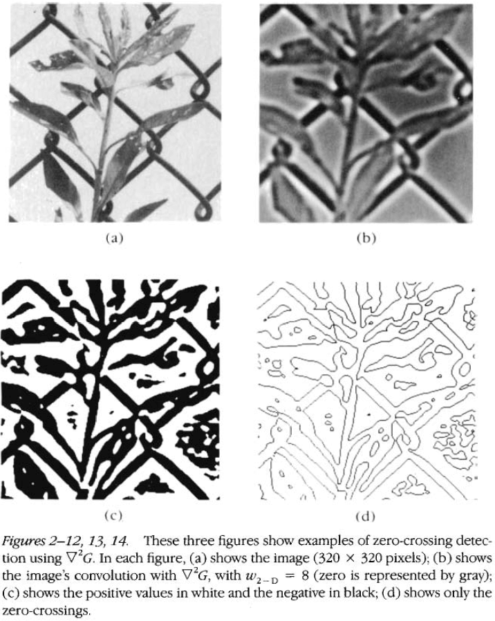

# Part I: Introduction and Philosophical Preliminaries

## Chapter 1: The Philosophy and the Approach

- What does it mean to see?
- Vision: the process of discovering from images what is present in the world and where.
- Two aspects of vision
    - Representing various aspects of the world
        - E.g. Color, form, motion, detail.
    - Processing these representations
- Many aspects of the world could benefit from an information-processing point of view.
- To understand a device that performs an information-processing task, one needs many different kinds of explanations at different levels.
- E.g. From the level of a layperson to amateur to expert.
- To understand vision, there is no single equation or viewpoint that explains everything.
- In some ways the brain is a computer, but an understanding of computers differs from an understanding of computation.
- Review of Shepard and Metzler’s mental rotation experiment and how there’s a linear relationship between rotation angle and time to decide whether a pair of blocks is identical.
- Review of Adrian and colleagues work on recording voltage changes in peripheral nerves.
- Their investigations showed that the character of the sensation depended on which fiber carried the message and not on how the fiber was stimulated.
- Thus, peripheral nerve fibers are thought to perform a simple mapping between physical events and a copy of them in the nervous system.
- Review of discovering the receptive field and Barlow’s work on the frog retina.
- The prevailing belief of neuroscience research during the 1950s and 60s was that the nervous system could be understood by functional analysis of its structure.
- E.g. Psychophysics provided phenomena that needed explaining, anatomy constrained these explanations, and neuroscience combined the two.
- But somewhere underneath, something was going wrong.
- The problem was that no neurophysiologist had recorded new and clear correlates of high-level perceptions.
- Research instead focused on neuroplasticity or on a more thorough analysis of what had already been discovered.
- What we lack is an understanding of why the brain is the way it is.
- This lack of understanding meant that we could not reverse engineer features of the brain.
- E.g. If we discover a neuron that detects hands, we couldn’t explain how it does so, why, or how to construct one.
- At the time, the business of neuroscience was to describe the behavior of cells, not to explain them.
- What is missing is analyzing the problem as an information-processing task; as independent of the mechanisms and structures that implement them.
- This level of analysis doesn’t overwrite the other levels of understand but complements them.
- By separating explanations into different levels, we achieve a more rigorous theory.
- A complex system is almost never understood as a simple extrapolation from the properties of its elementary components.
- E.g. Gas molecules aren’t described in terms of temperature, pressure, density for each particle. Instead, they’re described at the level of a collection of particles.
- To understand complex systems, one must contemplate different kinds of explanation at different levels of descriptions linked into a cohesive whole.
- Representation: a formal system for making explicit certain entities or types of information, together with a specification of how the system does this.
- Description: the result of using a representation to describe an entity.
- E.g. We can represent numbers using Arabic, Roman, or binary descriptions.
- The notion that one can capture some aspect of reality by making a description of it using a symbol is both a fascinating and powerful idea.
- Representations make trade-offs because they make certain information explicit at the expense of other information.
- How information is represented can greatly affect how easy it is to do different things with it.
- E.g. Multiplication is easy to do with Arabic or binary numbers but not with Roman numerals.
- The first level is the computational theory.
- A computational theory of vision starts by explaining the underlying task, which is to reliably derive properties of the world from photons.
- Two features of a computational theory (why)
    - It contains separate arguments about what’s computed and why.
    - The resulting operation is defined uniquely by the constraints it has to satisfy.
- The next level is the algorithmic theory.
- Two features of an algorithmic theory (how)
    - A representation for the input and output of the process.
    - An algorithm that transforms inputs to outputs.
- Three important points about the algorithmic level
    - There’s usually a wide choice of representation.
    - The choice of algorithm depends on the choice of representation.
    - The choice of hardware depends on the algorithm.
- The third and last theory/level is for the algorithm to be physically realized.
- E.g. Addition can be carried out by hand or electronically.
- To understand an information-processing device is to understand it at these three levels.
- Three levels
    - Computational theory: what’s the goal of the computation?
    - Representation and algorithm: how can this computation be accomplished?
    - Hardware implementation: how can the representation and algorithm be physically realized?
- Each of these levels are loosely coupled, but there’s often a wide range of choices at each level.
- Some phenomena may be explained at only one or two of the levels.
- Neuroanatomy is tied to the third level, the physical realization of the computation. Psychophysics is tied to the middle level, the algorithm and representation. Evolutionary neuroscience is tied to the first level, the reasons behind the computation.
- Although algorithms and mechanisms are more empirically accessible, the top level, the computational theory, is more important from an information-processing view.
- An algorithm is more likely to be understood by learning the nature of the problem being solved rather than by learning the mechanism that it’s implemented in.
- E.g. Trying to understand perception by studying only neurons is like trying to understand bird flight by studying only feathers.
- How does the brain maintain perceptions in everyday life even though sensations continually change?
- The problem of perception is to recover valid properties of the external world from sensory information.
- The visual systems of different animals also differ to suit their purpose and niche.
- Representational framework for deriving shape information from images
    - Image → Primal sketch → 2.5D sketch → 3-D model representation
    - Chapters 2 to 5 expand on this framework

# Part II: Vision

## Chapter 2: Representing the Image

- Four factors responsible for the intensity values in an image
    - Geometry
    - Reflectance of the visible surfaces
    - Illumination of the scene
    - Viewpoint
- In an image, all of these factors are mixed up and the purpose of early visual processing is to sort out which changes are due to what factors.
- Thus, it decomposes the image into four representations.
- This goal is achieved in two stages: primal sketch and 2.5D sketch.
- Primal sketch: representations of intensity changes, local geometrical structure, and illumination effects.
- 2.5D sketch: processes that operate on the primal sketch to derive representations of the geometry of the visible surfaces.
- Both the primal sketch and 2.5D sketch are constructed in a viewer-centered coordinate frame hence the term “sketch”.
- The purpose of these representations is to provide useful descriptions of aspects in the real world.
- Thus, the structure of the real world plays an important role in shaping both the nature of the representations and the nature of the processes that derive and maintain them.
- Our first assumption is that the visible world is composed of surfaces where their reflectance reflects their spatial structure.
- Our second assumption is that the organization of a surface’s reflectance function is often generated by a number of different processes, each at a different scale.
- Our third assumption is that surface properties tend to be more similar to one another in their size, local contrast, color, and spatial organization than to other items on that surface.
- No notes on further Gestalt-like principles of vision.
- Primitives are used to capture and match the structure in an image, thus facilitating the recovery of information about the underlying geometry of the visible surfaces.
- Three stages of processing to derive the primal sketch
    1. Detection of zero-crossings (intensity changes)
        - Intensity changes occur at different scales in an image so their optimal detection requires the use of different-sized operators.
        - A sudden intensity change will result in a peak or trough in the first derivative or a zero-crossing in the second derivative.
        - Zero-crossing: a place where the value of a function changes from positive to negative.
        - The author and Hildreth argue that the the operator that captures the both of these features is the Laplacian operator on the 2D Gaussian distribution ($$\nabla^{2}G$$).
        - This Mexican-hat-shaped operator blurs the image, wiping out all structure at scales smaller than the space constant of the Gaussian.
        - It also performs a similar operation to a ON/OFF-receptive field.

        - The critical fact about the Mexican-hat operator is that its zero-crossings mark intensity changes.

        - The operator may be physiologically realized by ON- and OFF-center retinal ganglion cells.
        - What do we do with the information from the $$\nabla^{2}G$$ filters?
    2. Formation of the raw primal sketch
        - The author has been intentionally avoiding using the word “edge” to describe intensity changes because edge has a partly physical meaning that isn’t known at the level of intensity changes.
        - Three features in the world that give rise to intensity changes
            1. Illumination changes (shadows, light sources)
            2. Orientation or distance changes
            3. Surface reflectance changes
        - The primitives of the raw primal sketch are edges, bars, blobs, and terminations.
        - These primitives have attributes of orientation, contrast, length, width, and position.
        - You are aware of the raw primal sketch but not the zero-crossings that made it.
        - How are spatial relations represented?
        - No notes on using a bit map representation of an image for finding spatial relationships.
        - Most of the early spatial relationships examined are local, thus a bit map representation is more efficient.
        - For detecting certain aspects of local geometry, rough topographical representation and locally connected receptive fields can provides adequate machinery power.
        - Image properties useful for decoding surface geometry
            - Average local intensity
            - Average size of similar items
            - Local density of items
            - Local orientation
            - Local distances
            - Local orientation of similar items
        - Virtual line: a primitive between neighboring similar tokens that has orientation and length.
        - Virtual lines are used to represent the organization of images, not surfaces.
        - No notes on detecting light sources and transparency.
    3. Creation of the full primal sketch
        - Two goals of the full primal sketch
            1. Construct tokens that capture the larger-scale structure of the surface reflectance function.
            2. Detect various types of changes in the measured parameters associated with these tokens that may help in detecting changes in orientation and distance from the viewer.
        - In other words, the goals are to make tokens and to find boundaries.
        - To do so, we start with the raw primal sketch and select similar elements from it, grouping them together to form lines, curves, blobs, groups, and small patches.
        - This process is repeated recursively to capture spatial structure at scale with increasingly abstract properties being extracted.
        - With these primitives, we can learn about the geometry of visible surfaces.

## Chapter 3: From Images to Surfaces

- Our goal is to understand how descriptions of the world may be efficiently and reliably obtained from images of it.
- Disparity: the relative difference in position an object casts on each of your retinas.
- As objects approach the viewer, the disparity increases.
- The brain is capable of measuring disparity and using it to create the sensation of depth.
- How does stereo vision work?
- It’s complicated and we don’t know. One idea is that each eye analyzes its own image and then combines the result at the end.
- The fact that random-dot stereograms work in providing the illusion of depth proves that disparity alone can cause the sensation of depth, and that any top-down component to the processing must be limited.
- No notes on a theory of modular organization in the human visual system.
- If this theory is true, then different types of information can be analyzed in relative isolation.
- Processes of the visual system
    - Stereopsis
    - Directional selectivity
    - Structure from apparent motion
    - Depth from optical flow
    - Surface orientation from surface contours
    - Surface orientation from surface texture
    - Shape from shading
    - Photometric stereo
    - Lightness and color as an approximation to reflectance
- We analyze each of these processes at three levels: computational theory, algorithm, and implementation.
- While we can’t analyze all three levels for every process, we can analyze some at all three levels, and many at one or two levels.
- We focus on the computational theory level because this book is a computational approach to vision.
- E.g. The interaction between the imaging process and the underlying properties of the physical world that gives rise to structure in images.
- E.g. For stereopsis, the discovery of additional constraints on the process that are naturally imposed limits the result enough to allow for a unique solution.
- All of the visual processes we cover take as input properties of the image and output properties of surfaces.
- We have four input properties so far: the image itself, zero-crossings, the raw primal sketch, and the full primal sketch.
- Two principles that guide the algorithmic level
    - Principle of graceful degradation: degrading the data won’t prevent the delivery of a partial answer.
    - Principle of least commitment: perform the absolute minimum amount of processing.
- Two suggestions at the implementation level
    - The nervous system avoids iterative methods, methods in which no new information is introduced at each cycle. Instead, it seems to prefer one-shot methods.
    - The nervous system prefers methods that run from coarse to fine where each cycle introduces new information.
- Many of the visual processes naturally divide into two parts. The first part deals with set up and measurement, while the second part deals with using the measurement to recover 3D structure.
- E.g. In stereopsis, the first step is the matching process, the second step is trigonometry that recovers distance and surface orientation.
- Stereopsis
    - Distance: the objective physical distance from viewer to object.
    - Depth: the subjective distance from viewer to object.
    - We first measure disparity and then use it to determine depth.
    - Three steps to measure disparity
        1. Select a specific location on the surface of the scene.
        2. Identify the same location in the other retina’s image.
        3. Measure the disparity between the two image points.
    - Identifying matching locations in the two images is difficult because of the false target problem.
    - False target problem: when multiple identical targets are used, how does the brain match identical-looking targets?
    - The difficulty due to the abundance of matchable features and the disparity range over which matches are detected.
    - We might turn to higher-level descriptions of the image to solve the false target problem, but this doesn’t exactly solve the problem.
    - What we need is some more information to help the brain decide which matchings are correct by constraining them in some way.
    - Two constraints
        - A given point on a physical surface has a unique position in space at any one time.
        - Matter is cohesive and object surfaces are generally smooth.
    - We can rewrite these physical constraints as matching constraints, which restricts how two primitive symbolic descriptions can match.
    - Matching constraints
        - Compatibility: if two visual elements could have come from the same physical marking, then they can match. If they couldn’t have, they can’t match.
        - Uniqueness: each element can match only one item from the other image.
        - Continuity: disparity varies smoothly almost everywhere.
    - Fundamental assumption of stereopsis: if a correspondence is established between physically meaningful primitives extracted from the left and right images of a scene that contains enough detail, and if the correspondence satisfies the three matching constraints, then that correspondence is physically correct.
    - We note that the two eyes lie in the same horizontal plane, so we only need to consider all possible matches along horizontal lines, which reduces the problem to the simple 1D case.
    - No notes on the computational theory of stereopsis because it was confusing.
    - No notes on one algorithm that implements the computational theory.
    - Eye movements seem to be important for human stereo vision but no algorithm has incorporated them into stereopsis.
    - One solution to the false target problem is that since zero crossings from $$\nabla^{2}G$$ are usually separated by some minimum distance, if we look for a match over a given range, we will always find a unique and correct candidate for the match.
    - No notes on the neurophysiological implementation of the stereopsis algorithm.
- Computing distance and surface orientation from disparity
    - No notes on the trigonometry of calculating the distance from the viewer to the surface.
- Directional selectivity
    - How are the raw measurements of the changes produced by motion made, and is this information used?
    - One of the most primitive types of motion analysis is noticing that something has changed.
    - This primitive probably operates at an early processing stage and may use a time delay to detect motion.
    - However, using a time delay to detect motion runs into the correspondence problem of apparent motion.
    - Correspondence problem of apparent motion: when we incorrectly assume that the next frame corresponds to the current frame, resulting in apparent motion in the wrong direction. Or the problem of tracking the position of objects at different times.
    - E.g. When a wheel is spinning extremely fast, it sometimes looks like it’s moving backwards.
    - E.g. Which object in the image at time t_1 corresponds to which item at time t_2?
    - No notes on the aperture problem which seems unrealistic.
    - Psychophysical experiments suggest that the visual system uses information only about direction to help carve up the visual field.
    - The movement of an object against its background can be used to determine the object’s boundaries.
    - Movement: a continuous process that usually produces smooth changes in an image.
    - Apparent motion can be created from a minimum of two frame separated by as much as 300 ms.
    - Our goal here isn’t to detect the changes induced by motion but to measure and use them to recover 3D structures in motion.
    - This goal can be broken down into two steps: follow things around as they move by tracking their positions (correspondence problem), and recover 3D structure from those measurements.
    - These two problems seem to be solved independently by the human visual system as the first problem only involves 2D measurements.
    - The closer and more similar two items are in successive frames, the more likely it is that they correspond.
    - However, finding purely local similarities can result in incorrectly matching identical objects.
    - One approach is to minimize the global similarities by minimizing local similarities.
    - Evidence supports that the correspondence problem for apparent motion involves matching operations at a low level but not between elements of a group.
    - E.g. Matching lines occur on elemental line segments not in a group and is governed primarily by proximity.
    - No elaborate form analysis precedes the correspondence process, except for those in the full primal sketch.
    - Results from experimenting on the correspondence problem with 2D and 3D images had similar results, so 3D measures were irrelevant.
    - No notes on Ullman’s theory of the correspondence process.
    - Object identity problem: the consistency of an object’s identity through time.
    - Optical flow problem: using the retinal velocity field induced by motion of the observer to infer the 3D structure of the visible surfaces.
    - It’s unknown whether optical flow is used in human vision.
- Shape contours
    - How does the brain convert the 2D contours from the retina into 3D shapes?

    - Contours can be defined on a surface in many ways and should be detected early on in visual processing.
    - Contour: the outline or shape of something.
    - Three types of contours
        - Occluding contours: contours that occur at discontinuities in the distance of the surface from the viewer.
        - Contours that follow discontinuities in surface orientation.
        - Contours that lie physically on the surface.
    - Contour generator: a particular curve on the object’s surface that creates a contour.
    - Three constraining assumptions
        - Each point on the contour generator projects to a different point on the contour.
        - Nearby points on the contour arise from nearby points on the contour generator.
        - The contour generator is planar and lies in a single plane.
    - Generalized cone: the surface created by moving a cross section along an axis.
    - E.g. Football, pyramid, leg, arm, tree trunk.
    - If the surface is smooth and if the three constraining assumptions hold for all distant viewing positions in any one plane, then the viewed surface is a generalized cone.
    - The axes of the cones can be recovered from the image because this helps to establish an object-centered coordinate system.
    - When recovering the geometry of the surface, the most important question is whether a contour is convex or concave.
    - It’s often difficult to distinguish convexities and concavities from purely local cues in a monocular image.
    - Note that occluding contours (shadows) are almost never surface contours.
    - The recovery of surface orientation from surface contours remains an unsolved problem.
- Surface texture
    - We should be skeptical when assuming that texture holds power to determine the geometry of surfaces.
    - The first problem is how to extract the uniform texture elements from an image.
    - We must be careful to not postulate more mechanisms than the problems require.
    - The analysis of texture is another topic in a somewhat unsatisfactory state.
- Shading and photometric stereo
    - The human visual system incorporates some processes for inferring shape from shading.
    - However, shading acts as only a weak determiner of shape.
    - The best way to solve the shape-from-shading problem is to understand the reflectance map, which is how image intensities relate to surface orientation.
    - Smoothness, the property that surface orientation changes slowly over distance, is the key condition needed to solve the shape-from-shading problem.
    - However, even this solution is too complicated from a biological viewpoint.
    - Our visual system seems to only use coarse shading information but not always correctly, which is probably why shading is easily overridden by other cues.
    - No notes on photometric stereo or recovering shape from reflectance maps because it can’t have any biological significance.
- Brightness, lightness, and color
    - Everything we’ve covered so far deals with changes in the reflectance and illumination on a surface to recover information about the geometry of the surface.
    - Yet we haven’t mentioned anything about the nature of the surface itself, which has biological significance.
    - E.g. Whether a fruit is ripe, what the object is, whether an insect is poisonous.
    - It’s surprising how much perceived color depends on the reflectance of a surface and how little it depends on the spectral characteristics of the light that enters our eyes.
    - E.g. A surface might reflect light containing a spectral profile, but the color of the light source doesn’t matter too much.
    - The theory of color vision is in an unsatisfactory but interesting state.
    - An object’s color depends on the ratio of light reflect from the various parts of the visual field rather than on the absolute amounts.
    - No notes on Helson-Judd’s approach to color vision.
    - Although this approach leads to successfully predicting the perceived color, what’s missing is an explanation of why we can make these assumptions and why they lead to valid color perception.
- In each case of visual processing, the surface structure can’t be determined from the information in images alone. The secret is to discover precisely what additional information can be safely assumed about the world that provides powerful constraints for the process to run.
- A theory of vision is not so much about our visual systems, but rather about the statistical structure of the visual world.

## Chapter 4: The Immediate Representation of Visible Surfaces

- This chapter covers issues and problems with the 2.5D sketch.
- 2.5D sketch: a viewer-centered representation of the visible surfaces where all of the processes described in Chapter 3 can be announced and combined.
- The 2.5D sketch is the final step before surface interpretation.
- Review of the segmentation problem in computer vision, the problem of determining objects in a scene.
- What’s wrong with the idea of segmentation?
- The most obvious flaw is that “objects” and “desirable regions” were almost never visually primitive constructions that could be recovered from the primal sketch or other early representations without additional knowledge.
- Edges that should be significant are either absent from the image or almost absent.
- We return to the first principles that determine the intensity values in an image.
- Four factors in scene intensity
    - Illumination
    - Surface geometry
    - Surface reflectance
    - Vantage point
- At some stage, the effects of these different factors are separated.
- The representation of visible surfaces should be created before knowing whether the surface belongs to a horse, man, or tree.
- Vision provides several sources of information about shape.
- E.g. Stereopsis, motion, surface contours.
- Inferences from visual observations
    - There’s at least one internal representation of the depth, surface orientation, or both associated with each surface point in a scene.
    - Since surface orientation can be associated with unfamiliar shapes, its representation probably precedes the decomposition of the scene into objects.
    - The representation of surface orientation is almost entirely driven by perceptual processes with the remaining driving force being specific knowledge of the surface orientation.
    - Different sources of information can influence the same representation of surface orientation.
- The main goal of a visual representation isn’t just to make explicit information about depth, local surface orientation, and discontinuities, but to also create and maintain a global representation of depth that’s consistent with the local cues.
- This representation is called the 2.5D sketch.

- The 2.5D sketch is useful because it makes information explicit, information that closely matches what early visual processes deliver.
- We can then formulate the goals of early visual processing as the construction of this representation.
- From here on we should not expect precise and detailed answers because we simply don’t know more.
- E.g. We don’t know much about the 2.5D sketch or even if it exists.
- No notes on whether we represent depth or surface orientation. But evidence suggests surface orientation given our poor depth perception.
- Any coordinate system for vision must be centered on the viewer, but this leaves several possible systems.

- Coordinates referring to the line of sight aren’t very useful to the viewer because it’s difficult to decide whether two surfaces have the same orientation from information in such as frame.
- This is compounded by the addition of eye movements.
- Different early visual processes may use slightly different coordinate systems to express their own guesses at what the surface orientation actually is.
- We should also remember that with the fovea, different parts of the visual field are analyzed at different resolutions for a given gaze direction.
- Early visual processes can run independently to a large extent and some parts of the visual field are accessible to some processes, and other parts to other processes.
- How do the processes maintain consistency among the different types of information? How do the processes handle conflicts and assign priorities?
- No notes on interpolation.

## Chapter 5: Representing Shapes for Recognition

- The most important point for recognizing shapes is that we must abandon the viewer-centered coordinate system that all representations have been based on.
- Object recognition requires a stable shape description that depends little on the viewpoint.
- The new frame of reference is based on the shape itself.
- Shape: the geometry of an object’s physical surface.
- A representation for shape is a formal scheme for describing shape or some aspects of shape with rules on how the scheme is applied to any specific shape.
- A shape representation doesn’t have to reproduce a shape’s surface to describe it for recognition.
- E.g. Skeletons and wire-frame diagrams of animals are enough for us to recognize the animal.
- The fundamental property of a representation is to make some types of information explicit.
- Three aspects of a representation’s design
    - Coordinate system
    - Primitives
    - Organization
- For recognition, viewer-centered descriptions are easier to produce but harder to use than object-centered ones because they’re dependent on the viewer’s and object’s orientation.
- E.g. Any theory of recognition that’s viewer-centered must treat distinct views of an object as essentially different objects. This trades a large store of descriptions for a reduction in complexity.
- The alternative is to use an object-centered coordinate system, which emphasizes computation that’s independent of the vantage point.
- Ideally, only one description of each object’s spatial structure is stored for that object to be recognizable.
- However, deriving an object-centered description is more difficult and requires a unique coordinate system for each object.
- Two parts of a representation’s primitives
    - Type of shape information
    - Shape size
- Two classes of shape primitives
    - Surface-based (2D)
    - Volumetric (3D)
- The size of the primitives used in a description largely determines the kind of information made explicit, available but not directly obtainable, and discarded.
- E.g. If the size of the primitive is too large, it can’t capture the shape. If it’s too small, it only captures local shape information and not global.
- The primitives can also be organized into modules of adjacent elements to distinguish groupings of primitives from others.
- The goal of defining a shape’s object-centered coordinate system starts with defining it’s axes.
- No notes on how a shape’s axes are determined because it doesn’t have to do with neuroscience.
- A representation that uses axis-based primitives can be thought of as a stick figure.
- No notes on 3D models and the coordinate systems for them.
- No notes on transforming locations in a viewer-centered coordinate system to an object-centered coordinate system.
- Virtually nothing is known about the physiological and anatomical arrangements that mediate the construction of 3D visual descriptions of the world.
- Two reasons why the brain probably constructs 3D representations of objects
    - To recognize objects, organisms must perceive and represent the dispositions of the objects’ surfaces in space.
    - To manipulate objects, organisms must build some 3D representation and match it to the stored 3D representations.

## Chapter 6: Synopsis

- We’ve now completed our survey of this new computational approach to vision.
- Four main points
    - Different levels of explanation
        - It isn’t enough to understand vision at only one level.
        - E.g. Responses of single cells, psychophysical experiments.
        - Recognizing the importance and existence of the computational level is core to understanding vision.
    - Taking an information-processing approach leads to formulating a clear framework for the process of vision.
        - E.g. Representations make explicit particular characteristics of the world and the processes that recover these characteristics.
    - When studying the processes for recovering physical characteristics of a scene from images, it’s critical to discover valid constraints on the way the world works.
        - E.g. That light typically comes from a point source far from the viewer such as the Sun.
    - The methodology or style of this approach involves two observations.
        - The duality of representations and processes.
        - That there is no real recipe for this type of research.
- Part of the fun of research is that we never really know where the next key will come from.

# Part III: Epilogue

## Chapter 7: In Defense of the Approach

- This chapter covers an imaginary conversation between a skeptic of the information-processing approach to visual perception and a defender of the approach.
- One criticism is that the levels-of-explanation idea conflicts with Barlow’s first dogma that the activity of a single neuron—which is transmitted to and influences other neurons, and a neuron’s response to such influences—is a complete description for a functional understanding of the nervous system.
- Marr argues against this by stating how thinking in terms of mechanisms or neurons is imprecise and fails to account for the level of computational theory.
- We must get the computational theory right before we propose possible networks that implement such a theory, or else the network might compute the wrong thing.
- Every point of view corresponds to a different level of explanation and all must eventually be satisfied.
- Another criticism is that one theory might be superior to another but has no easy way of being implemented. Thus, effort would be misplaced in developing the superior, but unimplementable, theory.
- Marr counters the criticism as any analysis of the problem may lead to the true theory.
- Marr also believes that the world is just too complex to be processed by the feature detector idea.
- It’s important to not be too anxious to relate our ideas immediately to neurons as we should first be sure that our representations and algorithms are supported by psychophysical evidence. Then we can delve into neurophysiology.
- Mechanism-based approaches are genuinely dangerous because the lead to mimicry rather than true understanding.
- By studying the problems that need solving, we will eventually unravel the mechanisms associated with it.
- No further notes for this chapter.
